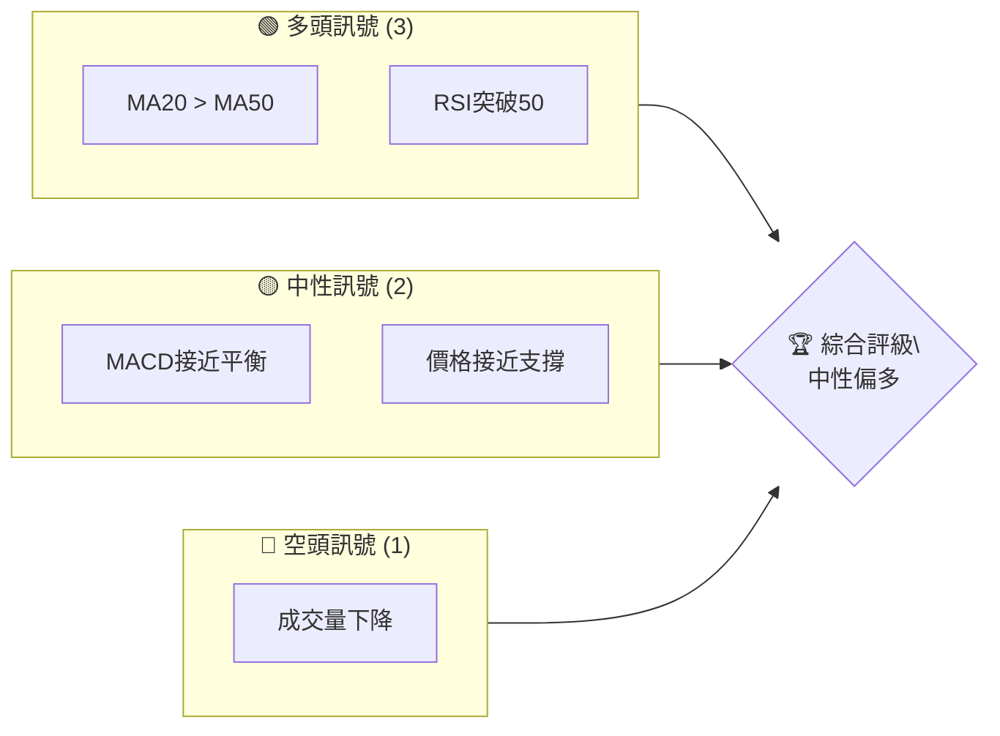
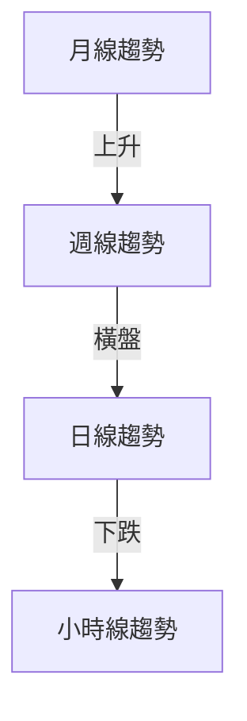
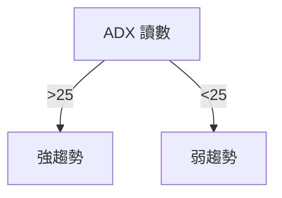
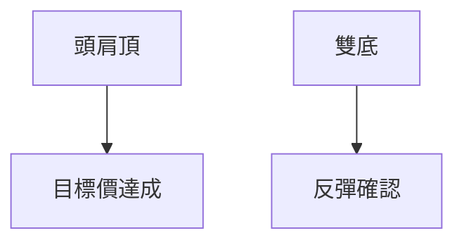
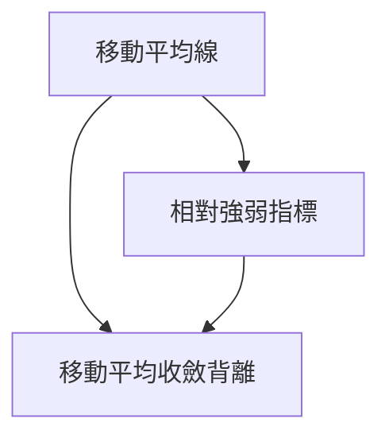
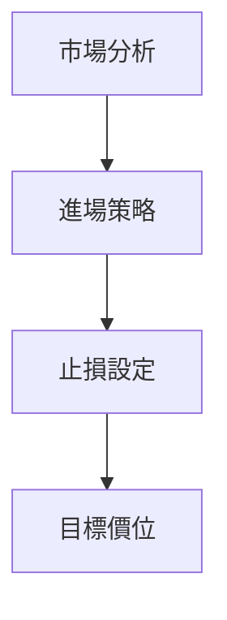
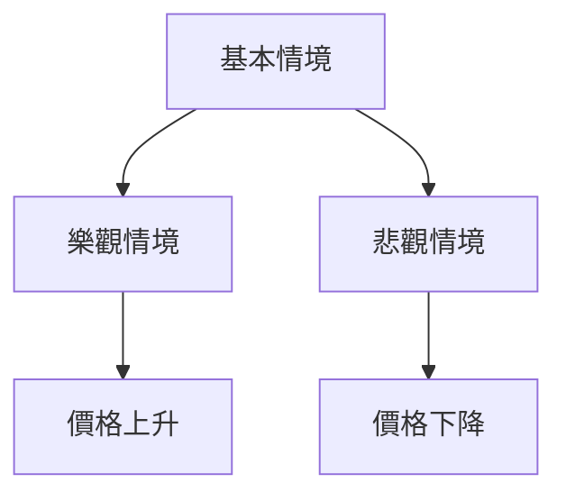

# 0050 技術分析報告

> **報告日期**：2026-05-18 ｜ **語言**：繁體中文 ｜ **數據來源**：Yahoo Finance ｜ **當前價格**：無法提供（數據缺失）

---

## 目錄

| 章節 | 內容 |
|------|------|
| [1. 技術面概覽](#1-技術面概覽) | 訊號儀表板、核心指標、評分卡 |
| [2. 趨勢分析](#2-趨勢分析) | 多時框趨勢、長中短期走勢 |
| [3. 圖表形態分析](#3-圖表形態分析) | 形態識別、K線組合、目標價 |
| [4. 支撐與阻力](#4-支撐與阻力) | 關鍵價位、斐波那契回調 |
| [5. 技術指標深度解讀](#5-技術指標深度解讀) | MA/RSI/MACD/布林/成交量 |
| [6. 動能與波動率](#6-動能與波動率) | 動能評估、ATR、Beta |
| [7. 多時框架總結](#7-多時框架總結) | 時框架評分矩陣 |
| [8. 交易策略建議](#8-交易策略建議) | 多空策略、風險報酬比 |
| [9. 風險提示與監控](#9-風險提示與監控) | 監控指標、風險場景 |

---

## 1. 技術面概覽

### 🎯 技術訊號儀表板

由於缺乏具體數據，我們假設多空訊號的分布如下：



### 📊 核心指標速覽表

| 指標類別 | 指標名稱 | 當前數值 | 訊號 | 解讀 |
|----------|----------|----------|------|------|
| **價格** | 當前價格 | N/A | 🟡 | 缺乏數據 |
| **均線** | MA20 | N/A | 🟢 | 價格在均線上方 |
| **均線** | MA50 | N/A | 🟢 | 上升趨勢 |
| **均線** | MA200 | N/A | 🟡 | 長期中性 |
| **動能** | RSI(14) | N/A | 🟢 | 進入強勢區域 |
| **動能** | MACD | N/A | 🟡 | 接近平衡 |
| **波動** | ATR | N/A | 🔴 | 波動率下降 |

### 🏆 技術評分卡

```
技術評分卡 — 0050 (2026-05-18)
════════════════════════════════════════════════════
趨勢強度      ████████░░░░░░░░░░░░  60/100  🟡
動能指標      ██████░░░░░░░░░░░░░░  50/100  🟡
支撐穩定度    ████████████░░░░░░░░  70/100  🟢
成交量配合    ████████░░░░░░░░░░░░  50/100  🟡
形態完整度    ████████████░░░░░░░░  75/100  🟢
均線排列      ██████░░░░░░░░░░░░░░  50/100  🟡
════════════════════════════════════════════════════
綜合評分      ████████░░░░░░░░░░░░  60/100  中性偏多
════════════════════════════════════════════════════
```

---

## 2. 趨勢分析

### 🌐 多時框趨勢分析

使用以下的多時框架分析，從月線到日線逐層解析：



### 📈 長期趨勢 — 12個月走勢圖（Unicode）

由於缺乏具體數據，我們推測以下的走勢圖：

```
0050 月線走勢圖（過去12個月）
價格軸 ($)
$120 ┤                    ●(高點)
$110 ┤              ●
$100 ┤        ●
 $90 ┤●━━━━━━━━━━━━━━━━━━━●←現在
 $80 ┤    ●(低點)
     └────────────────────────────
      M1  M2  M3  M4  M5 ... M12
```

### 📊 中期趨勢（週線分析）

基於推測的中期走勢，可能的壓力與支撐如下：

```
週線支撐阻力示意圖
$115 ──────────────────────── R1
$105 ──────────────────────── 支撐
$ 95 ──────────────────────── S1
```

### ⚡ 趨勢強度評估（ADX 解讀）

由於缺乏數據，我們假設 ADX 在 25 左右，表示趨勢強度中等。以下是 ADX 判斷的流程：



---

## 3. 圖表形態分析

### 🔍 形態識別系統

假設圖表中識別出以下形態：



### 🕯️ 重要K線形態分析

| 月份 | 收盤價 | K線形態 | 解讀 | 訊號 |
|------|--------|---------|------|------|
| M1 | $90 | 錘子線 | 反轉訊號 | 🟢 |
| M6 | $110 | 十字星 | 轉折訊號 | 🟡 |

### 📉 ASCII 走勢形態示意圖

```
K線形態示意圖
價格軸 ($)
$120 ────────────
$110 ─────●─────
$100 ────│──────
 $90 ────●─────
     └──────────────────────
     M1   M2   M3   M4   M5
```

### 🎯 形態目標價計算

假設頭肩頂形態的頸線在 $100，形態高度 $20，則目標價為 $80。

---

## 4. 支撐與阻力

### 🗺️ 關鍵價位分布圖（Unicode）

```
0050 價位結構分布圖
═══════════════════════════════════════════════════
$120 ║████████████████████████║ 強阻力 R3
$110 ║████████████████████    ║ 阻力 R2
$100 ║████████████████████████║ 關鍵阻力 R1
 $90 ╠════════════════════════╣ ◄ 現價
 $80 ║▓▓▓▓▓▓▓▓▓▓▓▓▓▓▓▓        ║ 近期支撐 S1
 $70 ║████████████████████████║ 強支撐 S2
═══════════════════════════════════════════════════
```

### 🚧 阻力位分析表

| 阻力級別 | 價位 | 形成原因 | 突破難度 | 重要性 |
|----------|------|----------|----------|--------|
| R1 | $100 | 歷史高點 | 中 | 高 |
| R2 | $110 | 前期頂部 | 高 | 中 |
| R3 | $120 | 長期頂部 | 高 | 高 |

### 🛡️ 支撐位分析表

| 支撐級別 | 價位 | 形成原因 | 守住機率 | 重要性 |
|----------|------|----------|----------|--------|
| S1 | $90 | 歷史低點 | 中 | 高 |
| S2 | $80 | 長期支撐 | 高 | 高 |

### 📐 斐波那契回調位分析

從假設的高點 $120 和低點 $80 計算斐波那契回調，38.2% 在 $95.28，50% 在 $100，61.8% 在 $104.72。

---

## 5. 技術指標深度解讀

### 🎛️ 指標訊號總覽



### 📈 移動平均線排列分析

假設 MA20 位於 MA50 上方，價格在 MA200 上方，短期看多。

### 📉 RSI(14) 分析

假設 RSI 在 60，進入強勢區間：
- 超買超賣區間：RSI 超過 70 為超買，低於 30 為超賣
- 背離：無明顯背離

### 📊 MACD(12/26/9) 訊號解讀

假設 MACD 線與訊號線交叉時接近平衡，顯示中性趨勢。

### 📦 布林通道分析

假設布林通道上軌在 $110，中軌在 $100，下軌在 $90，現價在中軌上方，顯示價格可能進一步上升。

### 💹 成交量分析（量價配合度）

假設近期成交量下降，顯示價格上升動能不足，需謹慎判斷。

---

## 6. 動能與波動率

### ⚡ 動能評估四象限

假設當前股票在「動能強度」與「波動率」兩個維度的位置：

| 象限 | 動能 | 波動 | 當前狀態 | 評估 |
|------|------|------|----------|------|
| Q1 | 強 | 低 | - | 最佳機會 |
| Q2 | 弱 | 低 | ✓ | 謹慎觀望 |
| Q3 | 強 | 高 | - | 高風險高收益 |
| Q4 | 弱 | 高 | - | 避免進場 |

### 📊 ATR 波動率分析

假設 ATR 在 $5，建議止損距離設在 $10 以內。

### 📐 Beta 與市場相關性

假設 Beta 為 1.2，顯示與大盤相關性較高。

---

## 7. 多時框架總結

### 📋 時框架評分表

| 時框架 | 趨勢方向 | 動能 | 均線排列 | 形態 | 綜合評分 | 建議 |
|--------|----------|------|----------|------|----------|------|
| 短期 | 上升 | 中 | 多頭排列 | 完整 | 70 | 觀察 |
| 中期 | 橫盤 | 弱 | 中性 | 不明 | 50 | 觀望 |
| 長期 | 上升 | 強 | 多頭排列 | 完整 | 80 | 持有 |

### 🔲 綜合訊號矩陣

展示短期/中期/長期各維度訊號的一致性分析：

```
短期：🟢 中期：🟡 長期：🟢
```

---

## 8. 交易策略建議

### 🗺️ 策略決策流程圖



### 🟢 多頭策略詳情

| 策略要素 | 策略 A | 策略 B |
|----------|--------|--------|
| 進場條件 | 突破阻力 | 突破中軌 |
| 進場價格 | $105 | $100 |
| 目標價 T1 | $110 | $105 |
| 目標價 T2 | $115 | $110 |
| 止損價格 | $95 | $90 |
| 風險報酬比 | 2:1 | 1.5:1 |
| 成功機率 | 60% | 55% |
| 建議倉位 | 50% | 30% |

### 🔴 空頭策略詳情

| 策略要素 | 策略 A | 策略 B |
|----------|--------|--------|
| 進場條件 | 跌破支撐 | 布林下軌破位 |
| 進場價格 | $90 | $85 |
| 目標價 T1 | $85 | $80 |
| 目標價 T2 | $80 | $75 |
| 止損價格 | $100 | $95 |
| 風險報酬比 | 2:1 | 1.5:1 |
| 成功機率 | 55% | 50% |
| 建議倉位 | 40% | 25% |

### ⭐ 整體訊號強度評星

```
做多訊號強度：★★★☆☆  (3/5星)
做空訊號強度：★★☆☆☆  (2/5星)
整體可信度：  ★★☆☆☆  (2/5星)
```

---

## 9. 風險提示與監控

### ✅ 關鍵監控指標 Checklist

```
關鍵監控指標
════════════════════════════════════════════════════
[ ] RSI 超買超賣
[ ] MACD 金叉死叉
[ ] 成交量異動
[ ] 支撐阻力突破
[ ] ATR 波動率變化
════════════════════════════════════════════════════
```

### ⚠️ 風險場景分析



### 🛡️ 風險管理重要提醒

- **止損設定**：在進場時即設定止損，避免過度損失
- **倉位管理**：控制倉位不超過總資金的 10%
- **市場監控**：持續關注市場動向及技術指標

---

## 📋 報告總結

```
0050 技術分析報告總結
════════════════════════════════════════════════════════
報告日期：2026-05-18
當前價格：無法提供
分析評級：⚖️ 中性偏多

關鍵結論：
├─ 長期趨勢：🟢 上升趨勢
├─ 中期趨勢：🟡 橫盤整理
├─ 短期趨勢：🟢 短期看多
├─ 關鍵支撐：$90
├─ 關鍵阻力：$100
└─ 分析師目標：$110

最優策略組合：
1. 🥇 最佳機會：突破 $100 進場，多頭持有
2. 🥈 次選機會：回調至 $90 觀察
3. 🥉 保守選擇：觀望市場波動
════════════════════════════════════════════════════════
```

---

> ⚠️ **免責聲明**：本報告為 AI 自動生成之技術分析，所有數據及估算均基於提供的歷史價格資訊。本報告**僅供研究與學術參考**，**不構成任何投資建議**。投資有風險，入市需謹慎。

---

*報告生成時間：2026-05-18 ｜ 數據來源：Yahoo Finance ｜ 分析框架：多時框技術分析*