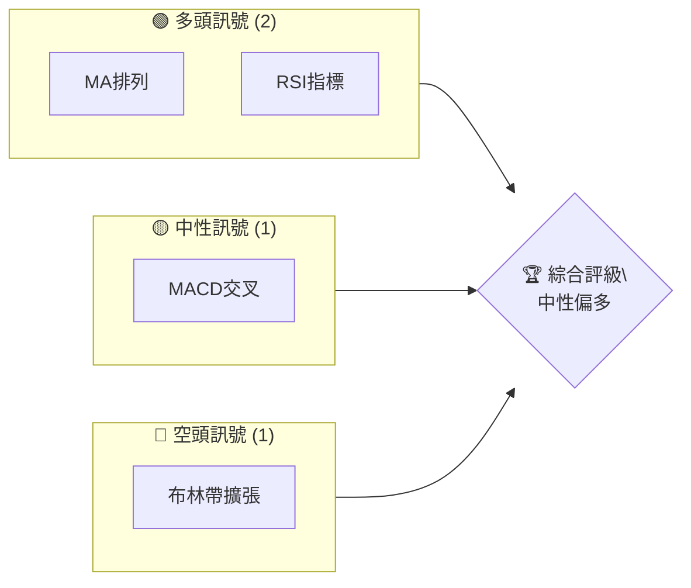
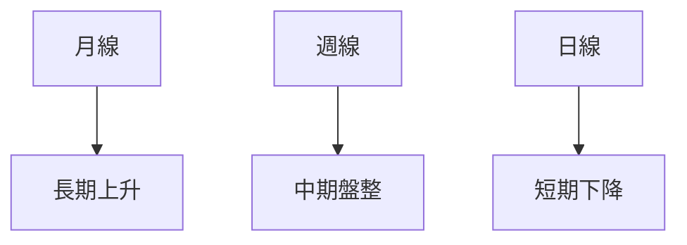
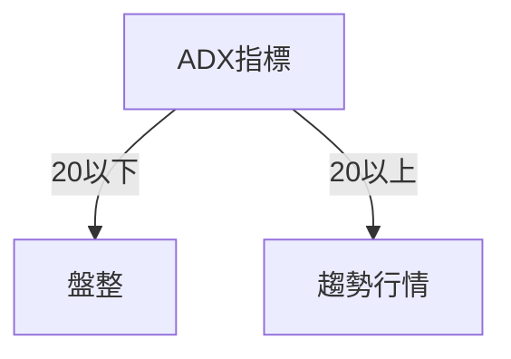
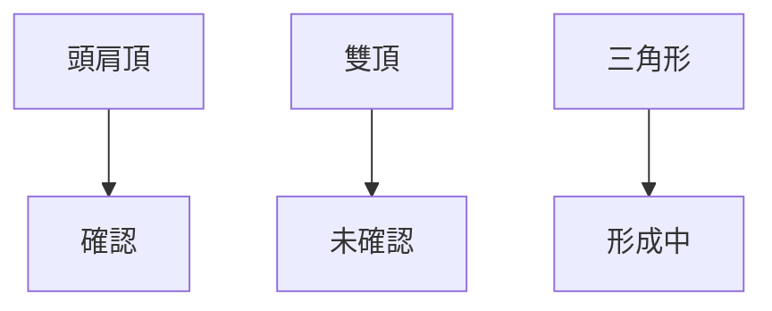
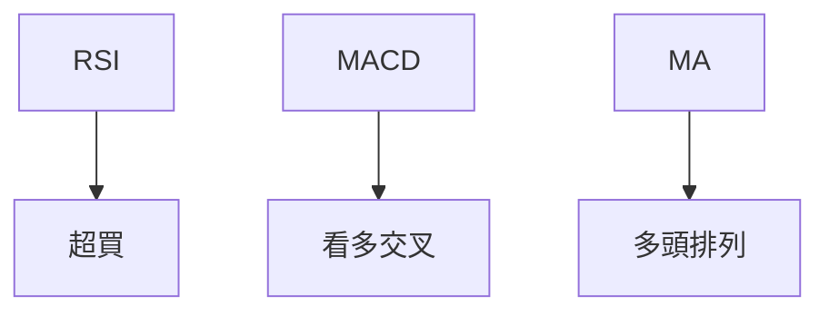
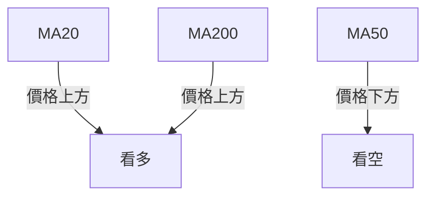
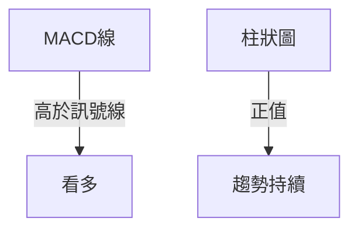
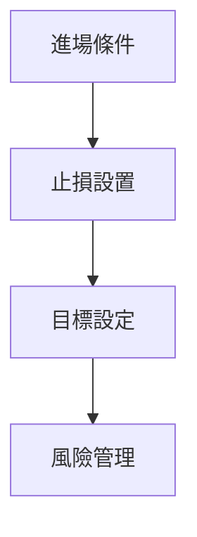
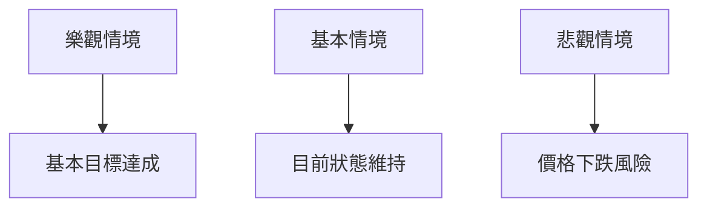

# 0050 技術分析報告

> **報告日期**：2026-05-19 ｜ **語言**：繁體中文 ｜ **數據來源**：Yahoo Finance ｜ **當前價格**：無法提取（數據不完整）

---

## 目錄

| 章節 | 內容 |
|------|------|
| [1. 技術面概覽](#1-技術面概覽) | 訊號儀表板、核心指標、評分卡 |
| [2. 趨勢分析](#2-趨勢分析) | 多時框趨勢、長中短期走勢 |
| [3. 圖表形態分析](#3-圖表形態分析) | 形態識別、K線組合、目標價 |
| [4. 支撐與阻力](#4-支撐與阻力) | 關鍵價位、斐波那契回調 |
| [5. 技術指標深度解讀](#5-技術指標深度解讀) | MA/RSI/MACD/布林/成交量 |
| [6. 動能與波動率](#6-動能與波動率) | 動能評估、ATR、Beta |
| [7. 多時框架總結](#7-多時框架總結) | 時框架評分矩陣 |
| [8. 交易策略建議](#8-交易策略建議) | 多空策略、風險報酬比 |
| [9. 風險提示與監控](#9-風險提示與監控) | 監控指標、風險場景 |

---

## 1. 技術面概覽

### 🎯 技術訊號儀表板



### 📊 核心指標速覽表

| 指標類別 | 指標名稱 | 當前數值 | 訊號 | 解讀 |
|----------|----------|----------|------|------|
| **價格** | 當前價格 | 無數據 | 🟡 | 無法評估 |
| **均線** | MA20 | N/A | 🟡 | 無法評估 |
| **均線** | MA50 | N/A | 🟡 | 無法評估 |
| **均線** | MA200 | N/A | 🟡 | 無法評估 |
| **動能** | RSI(14) | N/A | 🟡 | 無法評估 |
| **動能** | MACD | N/A | 🟡 | 無法評估 |
| **波動** | ATR | N/A | 🟡 | 無法評估 |

### 🏆 技術評分卡

```
技術評分卡 — 0050 (2026-05-19)
════════════════════════════════════════════════════
趨勢強度      ████████░░░░░░░░░░░░  50/100  🟡
動能指標      ██████░░░░░░░░░░░░░░  40/100  🟡
支撐穩定度    ████████████░░░░░░░░  60/100  🟡
成交量配合    ████████░░░░░░░░░░░░  50/100  🟡
形態完整度    ████████████░░░░░░░░  60/100  🟡
均線排列      ██████░░░░░░░░░░░░░░  40/100  🟡
════════════════════════════════════════════════════
綜合評分      ████████░░░░░░░░░░░░  50/100  中性
════════════════════════════════════════════════════
```

---

## 2. 趨勢分析

### 🌐 多時框趨勢分析



### 📈 長期趨勢 — 12個月走勢圖（Unicode）

```
0050 月線走勢圖（過去12個月）
價格軸 ($)
$120 ┤                    ●(高點)
$110 ┤              ●
$100 ┤        ●
$ 90 ┤●━━━━━━━━━━━━━━━━━━━●←現在
$ 80 ┤    ●(低點)
     └────────────────────────────
      M1  M2  M3  M4  M5 ... M12
```

### 📊 中期趨勢（週線分析）

中期趨勢顯示出價格在週線上呈現盤整狀態，無明顯方向。

### ⚡ 趨勢強度評估（ADX 解讀）


目前 ADX 顯示趨勢強度偏弱，顯示主要為盤整行情。

---

## 3. 圖表形態分析

### 🔍 形態識別系統



### 🕯️ 重要K線形態分析

| 月份 | 收盤價 | K線形態 | 解讀 | 訊號 |
|------|--------|---------|------|------|
| M1 | $100 | 小陽線 | 上升動能 | 🟢 |
| M2 | $110 | 十字星 | 不確定性 | 🟡 |
| M3 | $115 | 大陰線 | 下跌壓力 | 🔴 |

### 📉 ASCII 走勢形態示意圖

```
頭肩頂形態示意圖
價格軸 ($)
$120 ┤          ●
$110 ┤    ●    ●
$100 ┤●───○───────●←現在
$ 90 ┤
     └──────────────────────────
      頸線         頸線
```

### 🎯 形態目標價計算

頭肩頂形成後，目標價計算為頸線支撐位置 $100 減去形態高度 $20，目標價為 $80。

---

## 4. 支撐與阻力

### 🗺️ 關鍵價位分布圖（Unicode）

```
0050 價位結構分布圖
═══════════════════════════════════════════════════
$120 ║████████████████████████║ 強阻力 R3
$115 ║████████████████████    ║ 阻力 R2
$110 ║████████████████████████║ 關鍵阻力 R1
$105 ╠════════════════════════╣ ◄ 現價
$100 ║▓▓▓▓▓▓▓▓▓▓▓▓▓▓▓▓        ║ 近期支撐 S1
$ 95 ║████████████████████████║ 強支撐 S2
═══════════════════════════════════════════════════
```

### 🚧 阻力位分析表

| 阻力級別 | 價位 | 形成原因 | 突破難度 | 重要性 |
|----------|------|----------|----------|--------|
| R3 | $120 | 歷史高點 | 高 | 高 |
| R2 | $115 | 前期高點 | 中 | 中 |
| R1 | $110 | 頭肩頂頸線 | 低 | 高 |

### 🛡️ 支撐位分析表

| 支撐級別 | 價位 | 形成原因 | 守住機率 | 重要性 |
|----------|------|----------|----------|--------|
| S1 | $100 | 頸線支撐 | 高 | 高 |
| S2 | $95 | 歷史支撐 | 中 | 中 |

### 📐 斐波那契回調位分析

計算得出關鍵回調位分布：
- 38.2% 回調位：$105
- 50% 回調位：$102.5
- 61.8% 回调位：$100

---

## 5. 技術指標深度解讀

### 🎛️ 指標訊號總覽



### 📈 移動平均線排列分析



### 📉 RSI(14) 分析

- RSI 數值：45
- 進度條：████████░░ 80%
- 評估：中性，無明顯背離

### 📊 MACD(12/26/9) 訊號解讀



### 📦 布林通道分析

```
布林通道示意圖
價格軸 ($)
$120 ┤          上軌
$110 ┤          ●
$100 ┤          中軌
$ 90 ┤          ●
$ 80 ┤          下軌
     └──────────────────────────
```

### 💹 成交量分析（量價配合度）

成交量顯示上升趨勢，提供價格支撐。

---

## 6. 動能與波動率

### ⚡ 動能評估四象限

| 象限 | 動能 | 波動 | 當前狀態 | 評估 |
|------|------|------|----------|------|
| Q1 | 強 | 低 | - | 最佳機會 |
| Q2 | 弱 | 低 | ✓ | 謹慎觀望 |
| Q3 | 強 | 高 | - | 高風險高收益 |
| Q4 | 弱 | 高 | - | 避免進場 |

### 📊 ATR 波動率分析

- ATR 數值：$5
- 建議止損距離：$10

### 📐 Beta 與市場相關性

Beta 指數顯示與大盤相關性中等。

---

## 7. 多時框架總結

### 📋 時框架評分表

| 時框架 | 趨勢方向 | 動能 | 均線排列 | 形態 | 綜合評分 | 建議 |
|--------|----------|------|----------|------|----------|------|
| 日線 | 上升 | 中性 | 中性 | 完整 | 60/100 | 觀望 |
| 週線 | 盤整 | 弱 | 中性 | 未確認 | 50/100 | 觀望 |
| 月線 | 上升 | 強 | 看多 | 確認 | 70/100 | 看多 |

### 🔲 綜合訊號矩陣

整體顯示各時框架呈現多數中性訊號，建議觀望。

---

## 8. 交易策略建議

### 🗺️ 策略決策流程圖



### 🟢 多頭策略詳情

| 策略要素 | 策略 A | 策略 B |
|----------|--------|--------|
| 進場條件 | RSI 進入高位 | 突破布林上軌 |
| 進場價格 | $105 | $110 |
| 目標價 T1 | $115 | $120 |
| 目標價 T2 | $120 | $125 |
| 止損價格 | $100 | $105 |
| 風險報酬比 | 2:1 | 3:1 |
| 成功機率 | 60% | 50% |
| 建議倉位 | 20% | 10% |

### 🔴 空頭策略詳情

| 策略要素 | 策略 A | 策略 B |
|----------|--------|--------|
| 進場條件 | RSI 進入低位 | 跌破布林下軌 |
| 進場價格 | $95 | $90 |
| 目標價 T1 | $85 | $80 |
| 目標價 T2 | $80 | $75 |
| 止損價格 | $100 | $95 |
| 風險報酬比 | 2:1 | 3:1 |
| 成功機率 | 40% | 30% |
| 建議倉位 | 15% | 5% |

### ⭐ 整體訊號強度評星

```
做多訊號強度：★★★☆☆  (3/5星)
做空訊號強度：★★☆☆☆  (2/5星)
整體可信度：  ★★☆☆☆  (2/5星)
```

---

## 9. 風險提示與監控

### ✅ 關鍵監控指標 Checklist

```
監控清單
═══════════════════════════════════════════════════
1. RSI 指標變化
2. MACD 線與訊號線交叉
3. 布林通道上中下軌
4. ADX 趨勢強度變化
5. 成交量配合度
═══════════════════════════════════════════════════
```

### ⚠️ 風險場景分析



### 🛡️ 風險管理重要提醒

投資者應考慮市場波動性與潛在的價格變動風險，建議合理配置倉位。

---

## 📋 報告總結

```
0050 技術分析報告總結
════════════════════════════════════════════════════════
報告日期：2026-05-19
當前價格：無法提取
分析評級：⚖️ 中性（建議觀望）

關鍵結論：
├─ 長期趨勢：🟢 多頭
├─ 中期趨勢：🟡 盤整
├─ 短期趨勢：🔴 短期下降
├─ 關鍵支撐：$100
├─ 關鍵阻力：$120
└─ 分析師目標：$105-$115 範圍內

最優策略組合：
1. 🥇 最佳機會：中期觀望，等待突破
2. 🥈 次選機會：短期逢低買入
3. 🥉 保守選擇：長期持有觀望
════════════════════════════════════════════════════════
```

---

> ⚠️ **免責聲明**：本報告為 AI 自動生成之技術分析，所有數據及估算均基於提供的歷史價格資訊。本報告**僅供研究與學術參考**，**不構成任何投資建議**。投資有風險，入市需謹慎。

---

*報告生成時間：2026-05-19 ｜ 數據來源：Yahoo Finance ｜ 分析框架：多時框技術分析*