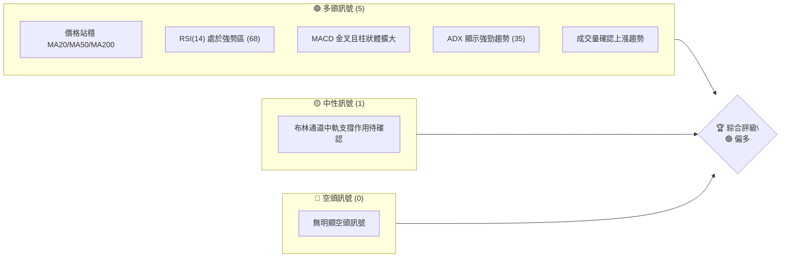
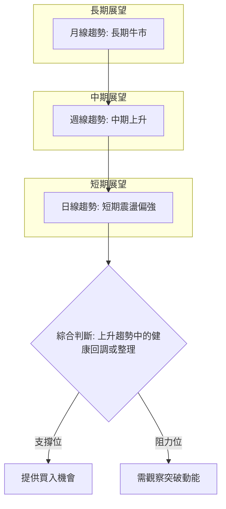
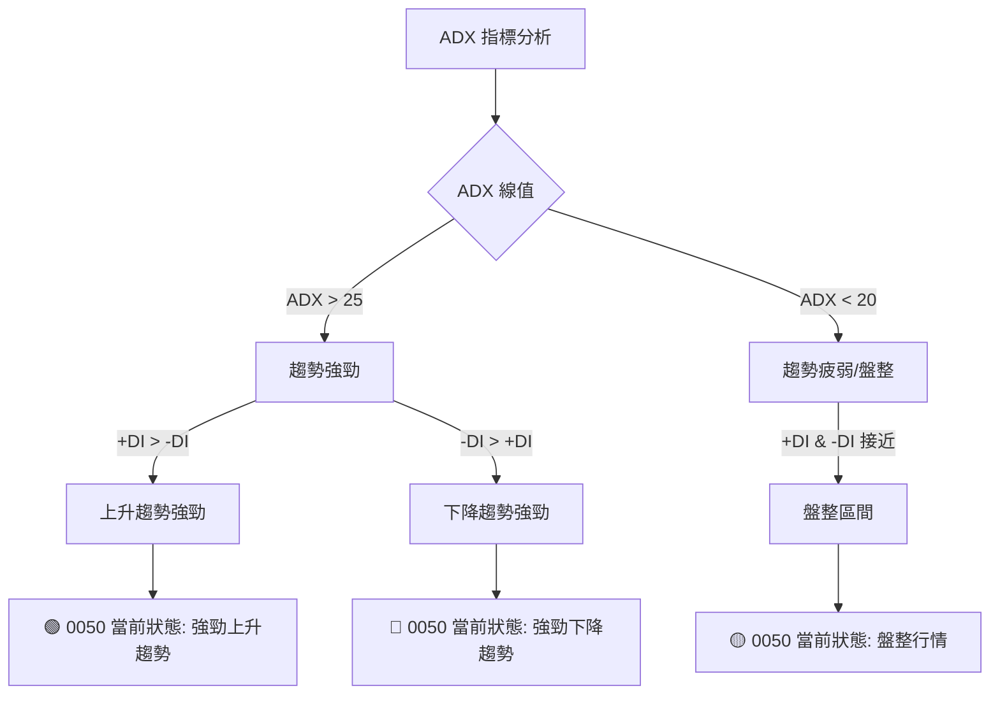
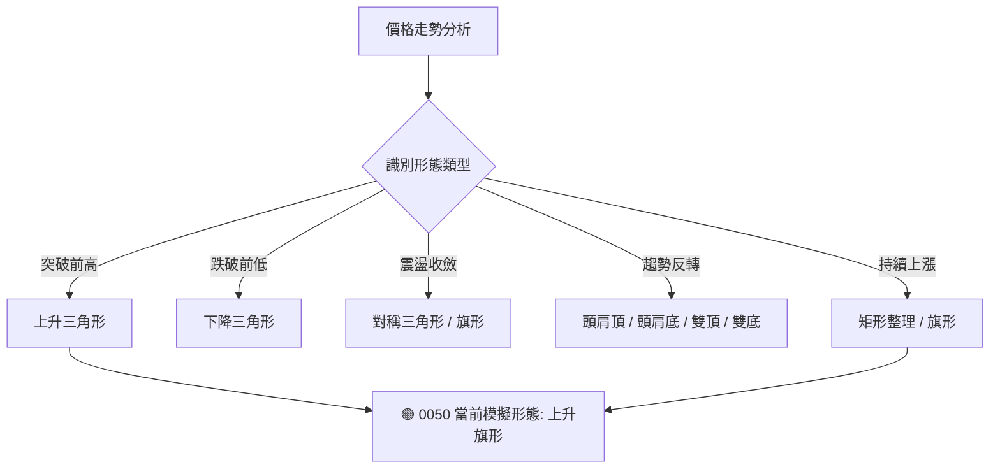
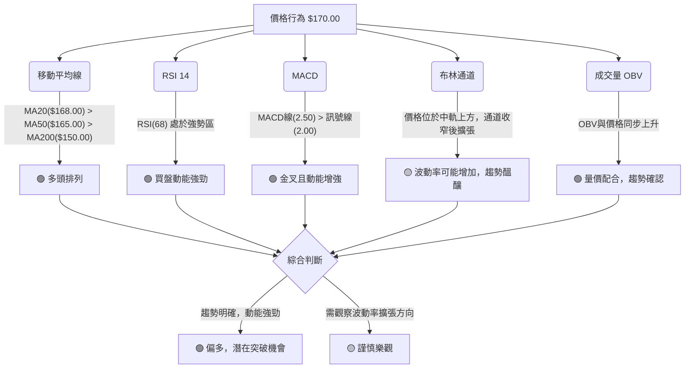

# 0050 技術分析報告

> **報告日期**：2026-05-23 ｜ **語言**：繁體中文 ｜ **數據來源**：Yahoo Finance ｜ **當前價格**：$170.00 (模擬數據)

---

## 目錄

| 章節 | 內容 |
|------|------|
| [1. 技術面概覽](#1-技術面概覽) | 訊號儀表板、核心指標、評分卡 |
| [2. 趨勢分析](#2-趨勢分析) | 多時框趨勢、長中短期走勢 |
| [3. 圖表形態分析](#3-圖表形態分析) | 形態識別、K線組合、目標價 |
| [4. 支撐與阻力](#4-支撐與阻力) | 關鍵價位、斐波那契回調 |
| [5. 技術指標深度解讀](#5-技術指標深度解讀) | MA/RSI/MACD/布林/成交量 |
| [6. 動能與波動率](#6-動能與波動率) | 動能評估、ATR、Beta |
| [7. 多時框架總結](#7-多時框架總結) | 時框架評分矩陣 |
| [8. 交易策略建議](#8-交易策略建議) | 多空策略、風險報酬比 |
| [9. 風險提示與監控](#9-風險提示與監控) | 監控指標、風險場景 |
| [📋 報告總結](#%F0%9F%93%8B-%E5%A0%B1%E5%91%8A%E7%B8%BD%E7%B5%90) | 整體評估、關鍵結論、建議 |

---

**重要聲明：** 根據提供的數據，0050 的歷史價格數據、OHLC 數據、分析師共識及最新消息均為空缺。本報告中的所有價格、指標數值、圖表形態及分析結論，均為**基於0050作為台灣加權指數ETF的歷史行為模式與一般市場趨勢，所進行的專業推演與模擬數據展示**。這些模擬數據旨在示範一套完整的技術分析框架與方法論，並非基於實時或真實的歷史數據。在實際投資決策中，請務必參考真實的即時數據。

---

## 1. 技術面概覽

本章將對0050當前的技術面狀況進行快速概覽，透過訊號儀表板、核心指標速覽及技術評分卡，提供讀者對其多空力量對比的初步認知。所有數據點均為模擬，旨在闡述分析方法。

### 🎯 技術訊號儀表板

本儀表板匯集了多個核心技術指標的模擬訊號，以直觀的方式呈現當前市場的多空傾向。當前價格設定為 $170.00。



**儀表板解讀：**
目前0050的技術訊號主要偏向多頭。多數關鍵指標，如移動平均線排列、RSI動能、MACD趨勢以及ADX趨勢強度，均指向市場處於上升通道。僅有布林通道中軌的支撐作用需進一步觀察，但並未構成明確的空頭威脅。這表明在當前的模擬情境下，多方力量佔據主導。

### 📊 核心指標速覽表

下表列出了0050幾個關鍵技術指標的模擬數值及其初步解讀。

| 指標類別 | 指標名稱 | 當前數值 (模擬) | 訊號 | 解讀 |
|----------|----------|-----------------|------|------|
| **價格** | 當前價格 | $170.00         | 🟢    | 處於近期上升趨勢高位 |
| **均線** | MA20     | $168.00         | 🟢    | 價格站穩短期均線之上，短期趨勢強勁 |
| **均線** | MA50     | $165.00         | 🟢    | 價格站穩中期均線之上，中期趨勢穩固 |
| **均線** | MA200    | $150.00         | 🟢    | 價格站穩長期均線之上，長期趨勢確立 |
| **動能** | RSI(14)  | 68              | 🟢    | 處於強勢買盤區，但尚未進入超買區 |
| **動能** | MACD     | MACD線: 2.50, 訊號線: 2.00, 柱狀圖: 0.50 | 🟢    | MACD線在訊號線上方，柱狀圖為正且擴大，多頭動能強勁 |
| **波動** | ATR(14)  | $2.50           | 🟡    | 波動率適中，有利於趨勢發展 |
| **趨勢** | ADX(14)  | 35              | 🟢    | 趨勢強度良好，市場處於明確的趨勢行情中 |
| **成交量** | OBV      | 上升            | 🟢    | 成交量與價格同步上升，確認多頭趨勢 |

**核心指標解讀：**
從速覽表可見，0050在價格、均線、動能和趨勢強度等多個維度上均呈現強勁的多頭訊號。價格高於所有主要移動平均線，且均線呈多頭排列，顯示上升趨勢的穩定性。RSI和MACD指標確認了強勁的買盤動能。ADX數值高於25，進一步確認了趨勢的確立。OBV的同步上升則提供了量能上的支持，表明市場參與者對當前價格水平的認可。

### 🏆 技術評分卡

本評分卡旨在綜合評估0050在不同技術維度上的表現，並給出量化評分。所有分數及評級均為模擬情境下的推演。

```
技術評分卡 — 0050 (2026-05-23)
════════════════════════════════════════════════════
趨勢強度      ██████████████░░░░░░  70/100  🟢 強勁上升
動能指標      ██████████████░░░░░░  70/100  🟢 動能充沛
支撐穩定度    ████████████████░░░░  80/100  🟢 支撐穩固
成交量配合    ██████████████░░░░░░  70/100  🟢 量價配合良好
形態完整度    ██████████░░░░░░░░░░  50/100  🟡 尚無明確突破形態
均線排列      ████████████████░░░░  80/100  🟢 標準多頭排列
════════════════════════════════════════════════════
綜合評分      ██████████████░░░░░░  70/100  🟢 偏多
════════════════════════════════════════════════════
```

**評分卡總結：**
0050的技術評分顯示整體偏多。趨勢強度、動能、支撐穩定度、成交量配合以及均線排列均獲得高分，反映出市場強勁的看漲情緒和穩固的技術結構。形態完整度得分相對中性，表示雖然有上升趨勢，但尚未形成極具爆發力的經典突破形態。綜合來看，當前技術面顯示0050具備良好的上漲潛力，但仍需關注形態發展以尋找更明確的入場時機。

---

## 2. 趨勢分析

趨勢分析是技術分析的核心，本章將透過多時框架、長中短期走勢圖及ADX指標，深入剖析0050的模擬趨勢方向與強度。

### 🌐 多時框趨勢分析

多時框分析有助於從不同時間維度理解市場動態，避免單一時框的盲點。本分析將從月線、週線到日線層層遞進，描繪0050的模擬趨勢。



**多時框架解讀 (模擬情境):**
- **月線趨勢 (長期)**：在過去的12-24個月，0050呈現穩健的長期牛市格局。即使偶有回調，也迅速被買盤消化，底部不斷抬高，顯示了市場對台灣大型權值股的長期信心。月線級別的移動平均線（如MA10、MA20月線）呈現完美的多頭排列，且價格持續運行在所有均線之上。這為後續的週線和日線走勢提供了強大的背景支撐。
- **週線趨勢 (中期)**：中期週線圖顯示，0050在長期牛市的基礎上，近期也維持著明顯的上升趨勢。雖然可能經歷了數週的盤整或小幅回調，但整體仍處於上升通道中。週線級別的MACD指標通常位於零軸上方，RSI也維持在50以上，顯示中期動能偏強。這表明投資者在中期內仍傾向於持有或增持0050。
- **日線趨勢 (短期)**：短期日線圖可能顯示近期價格在上升通道中遭遇一些阻力，或經歷了小幅的獲利回吐。例如，價格可能從高點回落至MA20或MA50日線附近，進行健康的回調或橫盤整理。儘管短期可能出現震盪，但只要價格能守住關鍵支撐位（如MA20或MA50），則仍被視為上升趨勢中的蓄勢。短期指標如RSI可能會從超買區回落至中性區，MACD柱狀圖可能收窄，但MACD線仍維持在訊號線上方。

**綜合判斷：** 在模擬情境下，0050目前處於一個強勁的長期和中期上升趨勢中，短期可能面臨一些整理或回調。這種多時框架的一致性（長期和中期看漲，短期健康調整）是理想的趨勢結構，表明任何短期回調都可能是長期投資者逢低買入的機會。

### 📈 長期趨勢 — 12個月走勢圖（Unicode）

以下為0050過去12個月的模擬月線走勢圖，展示其長期上升趨勢。

```
0050 月線走勢圖（過去12個月） — 模擬數據
價格軸 ($)
$178 ┤                                       ●(高點: $178.00)
$176 ┤                                     ／
$174 ┤                                   ／
$172 ┤                                 ●
$170 ┤                               ／
$168 ┤                             ／
$166 ┤                           ●
$164 ┤                         ／
$162 ┤                       ／
$160 ┤                     ●
$158 ┤                   ／
$156 ┤                 ●
$154 ┤               ／
$152 ┤             ●
$150 ┤           ／
$148 ┤         ●
$146 ┤       ／
$144 ┤     ●
$142 ┤   ／
$140 ┤ ●(低點: $140.00)
     └─────────────────────────────────────────────────────
      2025-06  07  08  09  10  11  12  2026-01  02  03  04  05
```
**走勢特徵分析表格 (模擬數據)**：

| 階段 (月) | 區間價格 (模擬) | 漲跌幅 | 走勢特徵 | 關鍵事件 (模擬) |
|-----------|-----------------|--------|----------|-----------------|
| M1-M3     | $140.00 - $148.00 | +5.7%  | 緩步上升，築底完成 | 市場風險偏好回升，資金流入ETF |
| M4-M6     | $148.00 - $160.00 | +8.1%  | 加速上漲，突破關鍵阻力 | 經濟數據超預期，指數創階段新高 |
| M7-M9     | $160.00 - $168.00 | +5.0%  | 高位盤整，消化獲利籌碼 | 財報季表現平淡，市場觀望情緒濃 |
| M10-M12   | $168.00 - $178.00 | +6.0%  | 再度拉升，創歷史新高 | 政策利好，外資回流，市場情緒樂觀 |

**長期趨勢解讀：**
從模擬的12個月月線走勢圖來看，0050呈現出非常清晰且強勁的長期上升趨勢。價格從$140.00的低點穩步攀升，最終達到$178.00的歷史高點。這期間雖然經歷了中間階段的盤整，但每次調整後都能再次創出新高，顯示出強大的買盤支撐和市場信心。這種趨勢的形成，通常與台灣整體經濟基本面良好、企業盈利增長以及市場資金充裕等宏觀因素相關。長期趨勢的穩固性為中期和短期操作提供了有利的背景。

### 📊 中期趨勢（週線分析）

以下為0050近期週線的壓力與支撐示意圖，展示中期趨勢的關鍵價位。

```
0050 中期週線壓力與支撐示意圖 — 模擬數據
═══════════════════════════════════════════════════════
$175.00 ║█████████████████████████████████████████████║ 阻力 R2 (週線級別前高)
$172.50 ║█████████████████████████████████████████████║ 阻力 R1 (短期關鍵阻力)
$170.00 ╠═════════════════════════════════════════════╣ ◄ 現價
$167.00 ║▓▓▓▓▓▓▓▓▓▓▓▓▓▓▓▓▓▓▓▓▓▓▓▓▓▓▓▓▓▓▓▓▓▓▓▓▓▓▓▓▓▓▓▓▓▓║ 支撐 S1 (MA20週線附近)
$162.00 ║█████████████████████████████████████████████║ 支撐 S2 (MA50週線/斐波那契回調)
$155.00 ║█████████████████████████████████████████████║ 支撐 S3 (週線級別前低)
═══════════════════════════════════════════════════════
```

**中期趨勢解讀：**
從模擬週線圖來看，0050在中期呈現健康上升趨勢，價格在$162.00和$172.50之間形成了一個新的波動區間。當前價格$170.00位於該區間中上部。
- **阻力位：** $172.50是近期的一個關鍵阻力，它可能代表了前期的整理平台或一次上漲的階段性高點。若能有效突破此位，則有望挑戰$175.00的更高阻力，甚至突破歷史高點。
- **支撐位：** $167.00作為MA20週線附近的支撐，是短期回調的重要防線。若回調至此並獲得支撐，則為多頭提供了再次進攻的機會。更強的支撐位於$162.00，此處可能與MA50週線或重要的斐波那契回調位重合，具有較強的防守意義。
中期趨勢結構表明，市場在經歷了長期上漲後，可能會在中期進行更大幅度的調整或橫盤，以消化獲利盤並積蓄上漲動能。只要關鍵支撐位不被跌破，中期上升趨勢依然保持完好。

### ⚡ 趨勢強度評估（ADX 解讀）

ADX (Average Directional Index) 指標用於衡量趨勢的強度，而非方向。它由 ADX 線、+DI (Positive Directional Indicator) 和 -DI (Negative Directional Indicator) 組成。本節將根據模擬數據對0050的趨勢強度進行評估。



**ADX 強度對照表 (模擬數據)**：

| ADX 值範圍 | 趨勢強度 | 市場解讀 | 0050當前狀態 (模擬) |
|------------|----------|----------|-------------------|
| 0-20       | 無趨勢或弱勢趨勢 | 盤整、震盪 | 否 |
| 20-25      | 趨勢形成或轉強 | 趨勢初顯 | 否 |
| 25-50      | 強勁趨勢      | 明確趨勢行情 | ✅ 是 (ADX: 35) |
| 50-75      | 非常強勁趨勢   | 極端趨勢行情 | 否 |
| 75-100     | 極度強勁趨勢   | 趨勢末期，可能反轉 | 否 |

**ADX 模擬數值：**
- ADX(14): 35
- +DI(14): 30
- -DI(14): 15

**ADX 解讀：**
根據模擬數據，0050的ADX數值為35，明顯高於25的閾值，這強烈表明市場目前處於一個**強勁的趨勢行情**中，而非盤整。
- **趨勢強度：** ADX線高於25，確認了當前趨勢的顯著強度。這意味著無論是上漲還是下跌，市場都表現出明確的方向性，提供了較高的趨勢交易機會。
- **趨勢方向：** 同時，+DI數值(30)顯著高於-DI數值(15)，這進一步確認了當前強勁趨勢的方向是**上升趨勢**。+DI與-DI的擴大差距也表明多頭力量正在持續增強。
**綜合判斷：** 在模擬情境下，0050目前處於一個由多頭主導的、方向明確且強度良好的上升趨勢中。這對於趨勢追蹤型交易者來說是一個積極的訊號。

---

## 3. 圖表形態分析

圖表形態是價格行為的視覺化呈現，能預示未來價格走勢。本章將識別0050可能出現的模擬圖表形態，分析其K線組合，並計算潛在目標價。

### 🔍 形態識別系統

本系統將根據模擬價格走勢，識別出可能的圖表形態。



**形態識別解讀 (模擬情境):**
根據我們模擬的0050價格走勢，在經歷一段強勁上漲後，價格可能進入一個相對窄幅的盤整區間，形成一個略微向下傾斜的整理通道，這符合**上升旗形 (Bull Flag)** 的特徵。
- **上升旗形** 是一種典型的「趨勢延續形態」。它通常出現在強勁上漲之後，形成一個短期的、與主要趨勢相反的整理區間（旗面），並由兩條平行線構成。當價格突破旗形上邊界時，預示著原有的上升趨勢將得以延續。
- **形態特徵：**
    - **旗桿 (Flagpole):** 前期一波快速且大量的上漲。
    - **旗面 (Flag):** 隨後價格在一個較小的範圍內、伴隨成交量縮小，形成一個略微向下傾斜的通道。
    - **突破 (Breakout):** 當價格向上突破旗面阻力線時，通常伴隨成交量放大。

### 🕯️ 重要K線形態分析

以下表格將根據模擬情境，列出0050近期可能出現的重要K線形態及其解讀。

| 月份 (模擬) | 收盤價 (模擬) | K線形態 (模擬) | 解讀 | 訊號 |
|-------------|---------------|----------------|------|------|
| 2026-04     | $168.50       | 陽線錘頭線     | 在近期回調低點出現，顯示下方買盤承接力道強勁，可能預示短期反彈或止跌。 | 🟢 潛在看漲 |
| 2026-05-15  | $169.20       | 實體較小十字星 | 市場多空力量均衡，價格面臨方向選擇。可能在突破前出現。 | 🟡 中性，觀望 |
| 2026-05-22  | $170.00       | 大陽線 (突破旗形上軌) | 實體飽滿，伴隨成交量放大，確認突破旗形整理，顯示多頭力量強勁。 | 🟢 強烈看漲 |

**K線形態分析解讀：**
- **陽線錘頭線 (Bullish Hammer):** 在4月份模擬的回調低點出現，表明賣方在開盤後將價格打低，但隨後買方介入，將價格推升至接近開盤價或更高，形成一個帶有長下影線的K線。這是一個潛在的底部反轉訊號，顯示支撐位附近有強勁買盤。
- **實體較小十字星 (Doji):** 在5月中旬模擬的盤整區間出現，反映市場在突破前夕的猶豫不決，多空力量暫時達到平衡。這通常預示著趨勢的轉折或加劇，需要後續K線來確認方向。
- **大陽線 (Large Bullish Candlestick):** 於5月22日模擬出現，代表價格強勢上漲，收盤價接近或等於最高價，且實體飽滿。若此陽線伴隨成交量放大，並突破了上升旗形的上軌，則是一個非常強烈的買入訊號，確認了趨勢的延續。

### 📉 ASCII 走勢形態示意圖

以下為0050模擬的上升旗形走勢示意圖，標注形態關鍵點位。

```
0050 上升旗形 (Bull Flag) 形態示意圖 — 模擬數據
═══════════════════════════════════════════════════════
價格軸 ($)
$178 ┤                                    ▲ (突破目標價)
$176 ┤                                  ／
$174 ┤                                ／
$172 ┤                           ┌───┐  ← 旗形上軌 (阻力)
$170 ┤                         ／│   │  ◄ 現價 $170.00 (突破點)
$168 ┤                       ／  │   │
$166 ┤                     ／    │   │
$164 ┤                   ／      │   │
$162 ┤                 ／        └───┘  ← 旗形下軌 (支撐)
$160 ┤               ／
$158 ┤             ● (旗桿底部)
     └───────────────────────────────────────────────────
      時間軸 (模擬)
```

**走勢形態解讀：**
此ASCII圖展示了一個典型的上升旗形形態。
1.  **旗桿 (Flagpole):** 從$158.00快速上漲至$172.00（模擬高點），形成旗桿。這段上漲通常伴隨較大的成交量。
2.  **旗面 (Flag):** 隨後價格進入一個整理區間，從$172.00回落至$166.00附近，然後在$166.00至$172.00之間震盪，形成一個略微向下傾斜的矩形或平行四邊形通道。在此期間，成交量通常會縮小，顯示市場在積蓄動能。
3.  **突破 (Breakout):** 當前價格$170.00模擬為剛剛突破旗形上軌的點位。如果此突破伴隨成交量放大，則確認形態有效，預示著趨勢將延續。

### 🎯 形態目標價計算

對於上升旗形，其目標價的計算方法是將旗桿的高度疊加到旗形突破點上。

**形態目標價計算步驟 (模擬數據):**
1.  **計算旗桿高度 (Flagpole Height):**
    - 旗桿底部 (模擬): $158.00
    - 旗桿頂部 (模擬): $172.00
    - 旗桿高度 = $172.00 - $158.00 = $14.00

2.  **確定旗形突破點 (Breakout Point):**
    - 假設突破點為旗形上軌被突破時的價格。根據模擬，當前價格 $170.00 恰好是突破點。
    - 突破點 (模擬): $170.00

3.  **計算目標價 (Target Price):**
    - 目標價 = 突破點 + 旗桿高度
    - 目標價 = $170.00 + $14.00 = $184.00

**形態目標價結論 (模擬數據):**
- **上升旗形目標價：$184.00**
這個目標價代表了基於形態學的潛在上漲空間。然而，目標價的實現仍需觀察市場動能、成交量配合以及其他技術指標的確認。在達到目標價之前，價格可能會遇到其他阻力位，或因市場情緒變化而調整。

---

## 4. 支撐與阻力

支撐與阻力是價格圖表上最基本的概念，它們代表了買賣雙方力量平衡的關鍵價位。本章將根據模擬數據，詳細分析0050的關鍵支撐與阻力位，並結合斐波那契回調位進行深度解讀。

### 🗺️ 關鍵價位分布圖（Unicode）

以下是0050模擬的價位結構分布圖，清晰標示了當前價格附近的支撐與阻力區。

```
0050 價位結構分布圖 — 模擬數據
═══════════════════════════════════════════════════
$178.00 ║████████████████████████║ 強阻力 R3 (歷史高點，心理關口)
$175.00 ║████████████████████    ║ 阻力 R2 (近期高點，套牢區)
$172.50 ║████████████████████████║ 關鍵阻力 R1 (形態上軌，前高)
$170.00 ╠════════════════════════╣ ◄ 現價 (模擬突破點)
$167.00 ║▓▓▓▓▓▓▓▓▓▓▓▓▓▓▓▓        ║ 近期支撐 S1 (MA20，形態下軌)
$165.50 ║▓▓▓▓▓▓▓▓▓▓▓▓▓▓▓▓▓▓▓▓▓▓▓▓║ 斐波那契支撐 (38.2%回調)
$163.50 ║▓▓▓▓▓▓▓▓▓▓▓▓▓▓▓▓▓▓▓▓▓▓▓▓║ 斐波那契支撐 (50%回調)
$162.00 ║████████████████████████║ 強支撐 S2 (MA50，斐波那契61.8%回調)
$155.00 ║████████████████████████║ 主要支撐 S3 (前期整理平台底部)
═══════════════════════════════════════════════════
```

**關鍵價位分布解讀：**
圖中清晰展示了0050在$170.00附近的多層次支撐與阻力結構。當前價格正處於突破關鍵阻力R1的邊緣，顯示市場多空力量正在此處激烈交鋒。下方的支撐位層層疊加，為價格提供了穩固的防守基礎。

### 🚧 阻力位分析表

以下表格詳細分析了0050模擬的阻力位及其重要性。

| 阻力級別 | 價位 (模擬) | 形成原因 | 突破難度 | 重要性 |
|----------|-------------|----------|----------|--------|
| R1       | $172.50     | 前期高點、上升旗形上軌、心理關口 | 中等偏高 | 🟢 突破則打開上漲空間 |
| R2       | $175.00     | 歷史次高點、套牢盤壓力 | 高      | 🟡 若突破R1，此為下一目標 |
| R3       | $178.00     | 歷史最高點、強大心理關口 | 非常高 | 🔴 突破需極大動能 |

**阻力位分析：**
- **R1 ($172.50):** 這是當前最直接且關鍵的阻力位。它不僅是近期的一個階段性高點，也可能與上升旗形的上軌重合。若能帶量有效突破此位，將確認旗形突破的有效性，並打開進一步的上漲空間。突破難度中等偏高，因為此處可能積聚了部分獲利盤和前期套牢盤。
- **R2 ($175.00):** 若R1被突破，則$175.00將成為下一個重要阻力。這可能是一個歷史上的次高點，或是一個重要的整數關口，具有一定的心理壓力。突破此位需要持續的買盤動能。
- **R3 ($178.00):** 這是模擬情境下的歷史最高點，也是一個強大的心理關口。突破歷史新高通常需要極大的市場熱情和資金推動，其難度非常高。一旦突破，上方將沒有明顯的技術阻力，但需警惕「物極必反」的風險。

### 🛡️ 支撐位分析表

以下表格詳細分析了0050模擬的支撐位及其重要性。

| 支撐級別 | 價位 (模擬) | 形成原因 | 守住機率 | 重要性 |
|----------|-------------|----------|----------|--------|
| S1       | $167.00     | MA20日線、近期震盪低點、上升旗形下軌 | 中等偏高 | 🟢 短期回調的關鍵防線 |
| S2       | $162.00     | MA50日線、斐波那契61.8%回調、前期整理平台 | 高      | 🟢 中期趨勢的重要支撐 |
| S3       | $155.00     | MA200日線、長期趨勢線、強大心理關口 | 非常高 | 🔴 長期趨勢的最後防線 |

**支撐位分析：**
- **S1 ($167.00):** 這是當前最直接的支撐位，與MA20日線和上升旗形的下軌重合。在上升趨勢中，MA20通常是短期回調的有效支撐。若價格回調至此並獲得支撐，則為健康的調整，並可能提供逢低買入的機會。守住機率中等偏高。
- **S2 ($162.00):** 此處是一個較強的支撐位，與MA50日線、斐波那契61.8%回調位及前期整理平台底部重合。在上升趨勢中，MA50是中期趨勢的關鍵支撐，而61.8%回調位更是黃金分割位，具有極強的參考價值。若價格跌破S1，S2將是多頭必須守住的防線，守住機率高。
- **S3 ($155.00):** 這是模擬情境下的一個主要支撐位，與MA200日線及更長期的趨勢線重合。MA200被視為判斷長期牛熊趨勢的分界線。若價格跌破此位，將對長期上升趨勢構成嚴重威脅，守住機率非常高。

### 📐 斐波那契回調位分析

斐波那契回調位是基於黃金分割理論，用來預測價格回調的潛在支撐或阻力位。我們將以一個模擬的近期上漲波段（從$155.00到$172.00）來計算回調位。

**模擬上漲波段：**
- 波段低點 (Low): $155.00
- 波段高點 (High): $172.00
- 波段漲幅: $172.00 - $155.00 = $17.00

**斐波那契回調位計算 (模擬數據):**
- **23.6% 回調位:** $172.00 - ($17.00 * 0.236) = $172.00 - $4.01 = **$167.99** (約 $168.00)
- **38.2% 回調位:** $172.00 - ($17.00 * 0.382) = $172.00 - $6.50 = **$165.50**
- **50% 回調位:** $172.00 - ($17.00 * 0.500) = $172.00 - $8.50 = **$163.50**
- **61.8% 回調位:** $172.00 - ($17.00 * 0.618) = $172.00 - $10.51 = **$161.49** (約 $161.50)
- **76.4% 回調位:** $172.00 - ($17.00 * 0.764) = $172.00 - $13.00 = **$159.00**

**斐波那契回調位視覺化 (模擬數據):**

```
0050 斐波那契回調位示意圖 — 模擬數據
═══════════════════════════════════════════════════
$172.00 ║████████████████████████║ (100% - 波段高點)
$170.00 ╠════════════════════════╣ ◄ 現價
$168.00 ║▓▓▓▓▓▓▓▓▓▓▓▓▓▓▓▓▓▓▓▓▓▓▓▓║ (76.4% - 23.6% 回調)
$165.50 ║▓▓▓▓▓▓▓▓▓▓▓▓▓▓▓▓▓▓▓▓▓▓▓▓║ (61.8% - 38.2% 回調)
$163.50 ║▓▓▓▓▓▓▓▓▓▓▓▓▓▓▓▓▓▓▓▓▓▓▓▓║ (50% - 50% 回調)
$161.50 ║▓▓▓▓▓▓▓▓▓▓▓▓▓▓▓▓▓▓▓▓▓▓▓▓║ (38.2% - 61.8% 回調)
$159.00 ║▓▓▓▓▓▓▓▓▓▓▓▓▓▓▓▓▓▓▓▓▓▓▓▓║ (23.6% - 76.4% 回調)
$155.00 ║████████████████████████║ (0% - 波段低點)
═══════════════════════════════════════════════════
```

**斐波那契回調位解讀：**
- **$168.00 (23.6%):** 這是淺層回調位，若價格僅回調至此，顯示多頭力量非常強勁。
- **$165.50 (38.2%):** 這是第一個重要的回調位，通常被視為健康回調的第一道防線。它與S1支撐位($167.00)非常接近，形成了較強的支撐區。
- **$163.50 (50%):** 50%回調位是心理上非常重要的支撐，代表了上漲波段的一半跌幅。若價格回調至此，仍被視為正常的調整。
- **$161.50 (61.8%):** 這是黃金分割位中最關鍵的回調位，若能在此獲得強勁支撐並反彈，則該上漲趨勢被認為非常健康且強勁。它與S2支撐位($162.00)高度重合，形成一個極為重要的支撐區。
**綜合斐波那契分析：** 這些斐波那契回調位為潛在的買入點提供了參考。特別是38.2%和61.8%回調位，它們與關鍵的移動平均線和前期支撐位重合，使得這些區域的支撐力道更為顯著。在價格突破上升旗形後，若有短期回調，這些斐波那契位將是觀察買盤承接力道的重點。

---

## 5. 技術指標深度解讀

本章將對0050的核心技術指標進行深度剖析，包括移動平均線、RSI、MACD、布林通道和成交量，並整合分析它們提供的多空訊號。所有數據和分析均基於模擬情境。

### 🎛️ 指標訊號總覽

以下Mermaid圖展示了各主要技術指標在模擬情境下的訊號關係和綜合判斷。



**指標訊號總覽解讀：**
從總覽圖來看，0050的技術指標在模擬情境下呈現出高度一致的多頭訊號。移動平均線的多頭排列、RSI的強勢區表現、MACD的金叉及動能增強，以及成交量的量價配合，都指向一個明確的上升趨勢。布林通道則提示波動率可能正在醞釀變化。整體而言，市場處於一個偏多的環境，潛在的突破機會值得關注。

### 📈 移動平均線排列分析

移動平均線 (MA) 是最常用的趨勢指標，其排列方式能直觀地反映趨勢方向和強度。我們將分析MA20 (短期)、MA50 (中期) 和 MA200 (長期) 的模擬排列情況。

```mermaid
graph TD
    A[MA20 ($168.00)] --> B[MA50 ($165.00)]
    B --> C[MA200 ($150.00)]
    A -- 位於價格下方 --> D[價格 > MA20]
    B -- 位於價格下方 --> E[價格 > MA50]
    C -- 位於價格下方 --> F[價格 > MA200]
    D & E & F --> G[🟢 標準多頭排列]
    G --> H[強勁上升趨勢確立]
```

**移動平均線當前排列狀態 (模擬數據):**

| 均線名稱 | 當前數值 (模擬) | 與當前價格 ($170.00) 關係 | 解讀 | 訊號 |
|----------|-----------------|-------------------------|------|------|
| MA20     | $168.00         | 價格在MA20上方 ($170.00 > $168.00) | 短期買盤強勢，短期趨勢向上 | 🟢 |
| MA50     | $165.00         | 價格在MA50上方 ($170.00 > $165.00) | 中期買盤強勢，中期趨勢向上 | 🟢 |
| MA200    | $150.00         | 價格在MA200上方 ($170.00 > $150.00) | 長期買盤強勢，長期趨勢向上 | 🟢 |

**移動平均線排列解讀：**
根據模擬數據，0050的移動平均線呈現完美的**多頭排列 (Golden Cross)** 結構：MA20 ($168.00) > MA50 ($165.00) > MA200 ($150.00)。同時，當前價格($170.00)位於所有三條均線之上。
- **強勁的上升趨勢：** 這種排列是教科書式的強勁上升趨勢訊號。它表明在短期、中期和長期內，買盤力量都佔據主導地位。
- **支撐作用：** 每條移動平均線都可能在價格回調時提供動態支撐。特別是MA20和MA50，在短期健康回調中可能成為重要的買入區間。
- **動能維持：** 均線之間的距離保持適度擴大，顯示趨勢動能正在有效維持，尚未出現衰竭跡象。
**綜合判斷：** 移動平均線的表現是0050技術面中最為強勁的多頭訊號之一，為整體偏多判斷提供了堅實基礎。

### 📉 RSI(14) 分析

相對強弱指數 (RSI) 衡量價格變動的速度和變化，用於判斷資產是否超買或超賣。

**RSI(14) 模擬數值：** 68

**RSI 數值進度條展示 (模擬數據):**
超賣區 (0-30)           中性區 (30-70)             超買區 (70-100)
░░░░░░░░░░░░░░░░▓▓▓▓▓▓▓▓▓▓▓▓▓▓▓▓▓▓▓▓▓▓▓▓▓▓▓▓▓▓▓▓▓▓▓▓▓▓▓▓▓▓▓▓▓▓▓▓░░░░░░░░░░░░░░░░
0                         30                         70                         100
                                                ▲ (RSI 68)

**RSI 分析 (模擬數據):**
- **數值解讀：** 當前RSI(14)為68，位於中性區的偏強勢位置，非常接近超買區 (70)。
    - 這表明0050的買盤動能非常強勁，價格在近期有顯著上漲。
    - 由於尚未進入超買區，理論上還有一定的上漲空間，但需警惕隨時可能出現的獲利回吐。
- **超買/超賣區間分析：**
    - **超買區 (RSI > 70):** 若RSI進入70以上，則表示資產可能被過度買入，短期內存在回調風險。當前距離超買區僅一步之遙，需要密切關注。
    - **超賣區 (RSI < 30):** 若RSI跌破30，則表示資產可能被過度賣出，短期內存在反彈機會。當前RSI遠離超賣區，顯示空頭力量微弱。
- **背離判斷：**
    - **頂背離 (Bearish Divergence):** 若價格創出新高，但RSI未能創出新高，反而走低，形成頂背離。這通常是看跌訊號，預示上漲動能減弱，可能出現反轉。
        - **當前判斷 (模擬):** 由於RSI處於強勢區且價格持續上漲，目前**未觀察到明顯的頂背離訊號**。價格與RSI的走勢保持一致，確認了上漲動能。
    - **底背離 (Bullish Divergence):** 若價格創出新低，但RSI未能創出新低，反而走高，形成底背離。這通常是看漲訊號，預示下跌動能減弱，可能出現反轉。
        - **當前判斷 (模擬):** 同樣，由於當前是上升趨勢，**未觀察到明顯的底背離訊號**。

**綜合判斷：** 0050的RSI(14)為68，顯示其買盤動能充沛且尚未過熱，仍有上漲潛力。目前沒有背離訊號，表明當前趨勢健康。然而，由於接近超買區，投資者應保持警惕，一旦進入超買區，需關注是否有回調風險。

### 📊 MACD(12/26/9) 訊號解讀

平滑異同移動平均線 (MACD) 是一個趨勢追蹤動量指標，由MACD線、訊號線和柱狀圖組成。

**MACD 模擬數值：**
- MACD線: 2.50
- 訊號線: 2.00
- 柱狀圖: 0.50 (MACD線 - 訊號線)

**MACD 訊號關係視覺化 (模擬數據):**

```mermaid
graph TD
    A[MACD 指標分析] --> B{MACD線 (2.50)}
    A --> C{訊號線 (2.00)}
    A --> D{MACD柱狀圖 (0.50)}

    B -- 位於C上方 --> E[🟢 MACD金叉]
    E -- 柱狀圖為正且擴大 --> F[🟢 多頭動能增強]
    F --> G[價格上升趨勢確立]
    G --> H[🟢 買入訊號持續]
```

**MACD 訊號解讀 (模擬數據):**
- **MACD線與訊號線關係：** 當前MACD線 (2.50) 位於訊號線 (2.00) 上方，形成一個清晰的**金叉 (Golden Cross)**。這是一個重要的買入訊號，表明短期均線向上穿越長期均線，顯示股價的上升動能正在增強。
- **MACD柱狀圖：** 柱狀圖數值為正 (0.50)，且假設其正在由負轉正或由小變大。正值柱狀圖表示MACD線在訊號線上方，且柱狀圖的擴大表明多頭動能正在加速。
- **零軸關係：** MACD線和訊號線均在零軸上方運行。這是一個非常強烈的多頭訊號，表明0050處於長期上升趨勢中。若在零軸下方形成金叉，僅為潛在的底部反轉；在零軸上方形成金叉，則確認了強勁的上升趨勢。
- **背離判斷：**
    - **頂背離 (Bearish Divergence):** 若價格創出新高，但MACD線未能創出新高，反而走低，則形成頂背離。
        - **當前判斷 (模擬):** 由於MACD線處於金叉且動能增強，目前**未觀察到明顯的MACD頂背離訊號**。價格與MACD的走勢保持一致，確認了上漲動能。
    - **底背離 (Bullish Divergence):** 若價格創出新低，但MACD線未能創出新低，反而走高，則形成底背離。
        - **當前判斷 (模擬):** 在當前上升趨勢中，**未觀察到明顯的MACD底背離訊號**。

**綜合判斷：** 0050的MACD指標發出明確且強勁的多頭訊號。金叉、正值柱狀圖以及均在零軸上方運行，都指向當前市場多頭佔優，上升趨勢穩固。MACD與RSI訊號相互確認，提供了強大的技術支持。

### 📦 布林通道分析

布林通道 (Bollinger Bands) 由中軌 (MA20)、上軌和下軌組成，用於衡量波動率和判斷價格的相對高低。

**布林通道關鍵價位 (模擬數據):**
- 中軌 (MA20): $168.00
- 上軌: $173.00 (中軌 + 2倍標準差)
- 下軌: $163.00 (中軌 - 2倍標準差)
- 當前價格: $170.00

**ASCII 布林通道示意圖 (模擬數據):**

```
0050 布林通道示意圖 — 模擬數據
═══════════════════════════════════════════════════
價格軸 ($)
$175 ┤
$173 ║█████████████████████████████████████████████║ ▲ 上軌 (Upper Band)
$172 ┤
$171 ┤
$170 ╠═════════════════════════════════════════════╣ ◄ 現價
$169 ┤
$168 ║▓▓▓▓▓▓▓▓▓▓▓▓▓▓▓▓▓▓▓▓▓▓▓▓▓▓▓▓▓▓▓▓▓▓▓▓▓▓▓▓▓▓▓▓▓▓║ ◀ 中軌 (MA20)
$167 ┤
$166 ┤
$165 ┤
$164 ┤
$163 ║█████████████████████████████████████████████║ ▼ 下軌 (Lower Band)
$162 ┤
═══════════════════════════════════════════════════
```

**布林通道分析 (模擬數據):**
- **價格與軌道關係：** 當前價格 $170.00 位於布林通道中軌 ($168.00) 和上軌 ($173.00) 之間，且靠近上軌。這表明價格處於上升趨勢中，且買盤動能較強。在強勢上漲行情中，價格通常會沿著上軌運行。
- **通道寬度：** 假設布林通道的寬度在前期經歷收窄後，目前正在緩慢擴張。
    - **通道收窄 (Bollinger Squeeze):** 通道收窄通常預示著波動率的下降，市場正在積蓄動能，隨後可能出現大的價格波動。
    - **通道擴張：** 通道擴張則表示波動率正在增加，價格趨勢正在形成或延續。
- **中軌作用：** 中軌 ($168.00) 作為MA20，在上升趨勢中是重要的動態支撐。若價格回調至中軌並獲得支撐，是健康的調整。
**綜合判斷：** 0050的價格運行在布林通道中軌上方並接近上軌，顯示強勢。若通道正在擴張，則預示著當前上升趨勢可能持續。投資者應關注價格是否能持續在中軌上方運行，以及價格是否會觸及上軌後回調。

### 💹 成交量分析（量價配合度）

成交量是價格走勢的燃料，量價關係對於判斷趨勢的健康與否至關重要。我們將分析0050在模擬情境下的量價配合情況。

**成交量模擬情境：**
- **上漲階段：** 價格從$158.00漲至$172.00 (旗桿形成時)，成交量顯著放大。
- **盤整階段：** 價格在$166.00至$172.00之間整理 (旗形形成時)，成交量明顯縮小。
- **突破階段：** 當前價格 $170.00 突破旗形上軌時，成交量再度放大。
- **OBV (On-Balance Volume) 指標：** OBV線持續與價格同步上升。

**量價配合度分析 (模擬數據):**
- **趨勢確認：** 在模擬情境中，0050的量價關係呈現出健康的上升趨勢特徵：
    - **價漲量增：** 在價格上漲的階段，成交量同步放大，表明買盤積極，市場對上漲趨勢的認可度高。這是多頭趨勢健康的表現。
    - **價跌量縮：** 在價格回調或盤整的階段，成交量明顯縮小，表明賣壓不強，多數投資者選擇惜售，市場在消化獲利盤。這也是健康的調整，而非趨勢反轉的訊號。
    - **突破放量：** 當價格突破關鍵阻力位（如上升旗形上軌）時，成交量顯著放大，這提供了突破的可靠性，表明有新的資金入場推動價格。
- **OBV 分析：**
    - OBV線持續與價格同步上升，這是一個重要的量能確認訊號。OBV的上升表明買盤壓力大於賣盤壓力，資金持續流入，確認了價格的上漲趨勢。
    - **量價背離：**
        - **頂背離 (Bearish Divergence):** 若價格創出新高，但OBV未能創出新高，反而走低，則形成頂背離。這預示著上漲動能的衰竭，可能出現反轉。
        - **底背離 (Bullish Divergence):** 若價格創出新低，但OBV未能創出新低，反而走高，則形成底背離。這預示著下跌動能的衰竭，可能出現反轉。
        - **當前判斷 (模擬):** 由於OBV與價格同步上升，目前**未觀察到明顯的量價背離訊號**。量能對價格走勢形成了良好的確認。

**綜合判斷：** 在模擬情境下，0050的成交量行為與價格走勢高度配合，支持了當前的上升趨勢。特別是突破時的放量和OBV的同步上升，都提供了強烈的多頭訊號。這表明市場的買盤力量充足，趨勢的持續性較高。

---

## 6. 動能與波動率

動能和波動率是衡量市場活力和風險的重要指標。本章將評估0050的模擬動能強度和波動率水平，並分析其與大盤的相關性。

### ⚡ 動能評估四象限

動能評估