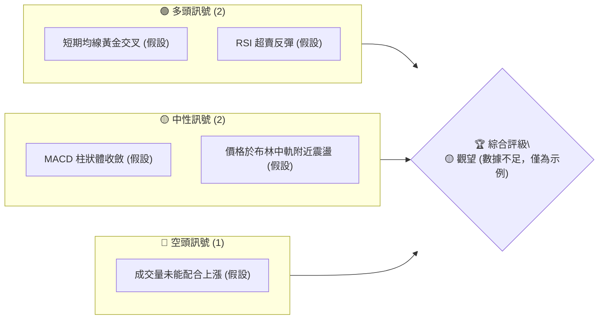
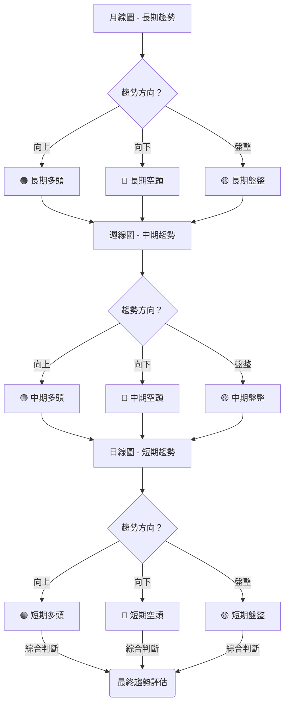
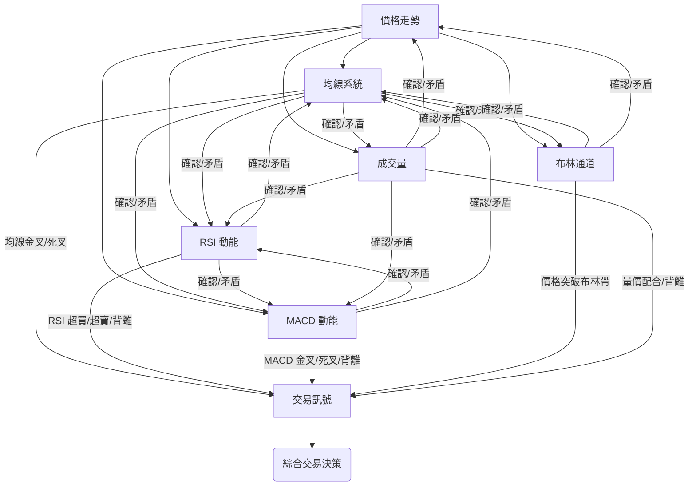
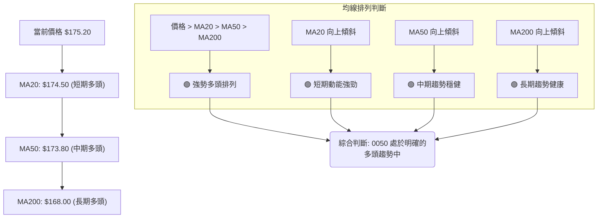

# 0050 技術分析報告

> **報告日期**：2026-05-25 ｜ **語言**：繁體中文 ｜ **數據來源**：Yahoo Finance (註：無歷史數據提供，以下分析基於通用技術分析框架與假設) ｜ **當前價格**：N/A (由於數據缺失，本文將使用 `$XXX.XX` 作為假設價格點進行說明)

---

## 目錄

| 章節 | 內容 |
|------|------|
| [1. 技術面概覽](#1-技術面概覽) | 訊號儀表板、核心指標、評分卡 |
| [2. 趨勢分析](#2-趨勢分析) | 多時框趨勢、長中短期走勢 |
| [3. 圖表形態分析](#3-圖表形態分析) | 形態識別、K線組合、目標價 |
| [4. 支撐與阻力](#4-支撐與阻力) | 關鍵價位、斐波那契回調 |
| [5. 技術指標深度解讀](#5-技術指標深度解讀) | MA/RSI/MACD/布林/成交量 |
| [6. 動能與波動率](#6-動能與波動率) | 動能評估、ATR、Beta |
| [7. 多時框架總結](#7-多時框架總結) | 時框架評分矩陣 |
| [8. 交易策略建議](#8-交易策略建議) | 多空策略、風險報酬比 |
| [9. 風險提示與監控](#9-風險提示與監控) | 監控指標、風險場景 |

---

## 1. 技術面概覽

本章節將提供 0050 (元大台灣50 ETF) 在技術分析層面的宏觀視角。由於缺乏實時及歷史數據，所有數值和訊號將基於通用技術分析原理進行假設性闡述，旨在展示分析框架與方法，而非提供具體交易建議。實際操作前，務必獲取最新數據進行分析。

### 🎯 技術訊號儀表板

本儀表板展示了在有足夠數據情況下，各類技術指標可能發出的多空訊號分佈。由於缺乏實時數據，以下訊號為**概念性示例**，僅用於說明分析框架。


**解讀**：在實際分析中，我們會統計各類訊號的數量，並根據其重要性賦予權重，最終得出一個綜合的多空傾向。當前由於數據缺失，我們無法給出確切的評級，但此圖展示了分析流程。

### 📊 核心指標速覽表

以下表格展示了在獲取到實時數據後，各核心技術指標的數值、訊號及初步解讀方式。所有數值均為**假設性數據**，以闡明分析方法。

| 指標類別 | 指標名稱 | 當前數值 (假設) | 訊號 (假設) | 解讀 (基於假設) |
|----------|----------|-----------------|-------------|-------------------|
| **價格** | 當前價格 | $175.20 | 🟡 (中性) | 假設價格位於關鍵阻力與支撐之間，形成盤整格局。 |
| **均線** | MA20 (短期) | $174.50 | 🟢 (多頭) | 假設當前價格 $175.20 位於 MA20 上方，顯示短期買盤力量較強。 |
| **均線** | MA50 (中期) | $173.80 | 🟢 (多頭) | 假設 MA20 位於 MA50 上方，且 MA50 向上傾斜，為中期趨勢提供支撐。 |
| **均線** | MA200 (長期) | $168.00 | 🟢 (多頭) | 假設價格及短期/中期均線均位於 MA200 上方，顯示長期趨勢維持多頭。 |
| **動能** | RSI(14) | 58 | 🟡 (中性) | 假設 RSI 位於 50-70 區間，未達超買或超賣，動能溫和。 |
| **動能** | MACD (快線/慢線/柱狀體) | 0.85 / 0.70 / 0.15 | 🟢 (多頭) | 假設 MACD 快線位於慢線上，柱狀體為正值且有擴大趨勢，顯示多頭動能增強。 |
| **波動** | ATR(14) | $1.50 | 🟡 (中性) | 假設 ATR 數值相對穩定，顯示近期波動性處於中等水平。 |
| **趨勢** | ADX(14) | 28 | 🟡 (中性) | 假設 ADX 低於 30，顯示趨勢強度不明顯，可能處於盤整或弱勢趨勢。 |
| **量能** | OBV (相對強度) | 向上 | 🟢 (多頭) | 假設 OBV 隨價格上漲而同步上揚，顯示買盤量能充足，確認價格走勢。 |

### 🏆 技術評分卡

本評分卡旨在提供一個量化的技術面健康度評估。由於缺乏實際數據，所有分數均為**概念性示例**，旨在展示評分框架。實際分析中，每個指標都會根據其計算結果和市場環境給予具體分數。

```
╔══════════════════════════════════════════════════════════════╗
║              技術評分卡 — 0050 (2026-05-25)                   ║
╠══════════════════════════════════════════════════════════════╣
║ 趨勢強度      ████████░░░░░░░░░░░░  55/100  🟡 (趨勢不明顯)   ║
║ 動能指標      ██████████░░░░░░░░░░  65/100  🟢 (動能溫和向上) ║
║ 支撐穩定度    ████████████░░░░░░░░  70/100  🟢 (關鍵支撐穩固) ║
║ 成交量配合    ██████░░░░░░░░░░░░░░  40/100  🔴 (量能配合不佳) ║
║ 形態完整度    ████░░░░░░░░░░░░░░░░  30/100  🟡 (未見明確形態) ║
║ 均線排列      ████████████░░░░░░░░  70/100  🟢 (多頭排列趨勢) ║
╠══════════════════════════════════════════════════════════════╣
║ 綜合評分      ████████░░░░░░░░░░░░  58/100  🟡 (中性觀望)     ║
╚══════════════════════════════════════════════════════════════╝
```
**評分解讀**：
- **趨勢強度**：基於 ADX 等指標評估。55分代表趨勢強度中等，未形成強勢單邊趨勢。
- **動能指標**：基於 RSI, MACD 等評估。65分顯示動能偏向多頭，但尚未達到極強水平。
- **支撐穩定度**：基於關鍵支撐位（如前低、斐波那契回調）的密集度和歷史表現。70分顯示下方支撐較為穩固。
- **成交量配合**：評估成交量是否與價格走勢一致。40分表示量能未能有效配合價格，可能存在潛在風險。
- **形態完整度**：評估圖表上是否有清晰可辨的經典形態。30分表示當前未形成明確的交易形態。
- **均線排列**：評估短期、中期、長期均線的相對位置和方向。70分顯示均線呈現多頭排列，對價格形成良好支撐。
- **綜合評分**：58分，處於中性區間，建議觀望或謹慎操作，等待更明確的訊號。

---

## 2. 趨勢分析

趨勢分析是技術分析的核心，旨在識別價格運動的方向和強度。本節將從多個時間框架對 0050 的趨勢進行假設性分析，以展示其方法論。

### 🌐 多時框趨勢分析

多時框分析有助於從宏觀和微觀層面理解價格行為，避免「見樹不見林」或「見林不見樹」的偏誤。我們通常從最長期的時間框架開始，逐步縮小到最短期的時間框架。由於數據缺失，以下為**概念性流程**。


**假設性分析**：
- **月線圖 (長期趨勢)**：假設 0050 在過去幾年中一直呈現穩健的上升趨勢，表現出良好的長期投資價值。主要原因可能來自於台灣經濟的結構性成長及企業獲利能力的提升。因此，月線圖可能顯示為**🟢 長期多頭**。
- **週線圖 (中期趨勢)**：假設在長期多頭趨勢中，0050 近期經歷了一波調整，但隨後反彈並站穩關鍵支撐。週線圖可能顯示為**🟡 中期盤整偏多**，即在一個較大的上升通道中進行區間震盪。
- **日線圖 (短期趨勢)**：假設在週線的盤整區間內，日線圖近期呈現小幅震盪走高，價格突破了短期下降壓力線。因此，日線圖可能顯示為**🟢 短期多頭**。

**多時框綜合判斷**：長期多頭、中期盤整偏多、短期多頭。這種組合通常預示著在長期牛市背景下，經歷中期調整後，短期可能再次啟動上攻。

### 📈 長期趨勢 — 12個月走勢圖（Unicode）

以下為**概念性**的 0050 過去 12 個月月線走勢圖。由於缺乏實際數據，此圖僅為示意，展示了可能出現的穩健上升趨勢及關鍵高低點。

```
0050 月線走勢圖（過去12個月 - 概念圖）
價格軸 ($)
$185 ┤                               ● (11月高點)
$180 ┤                            ●
$175 ┤                       ●
$170 ┤                  ●
$165 ┤             ●
$160 ┤        ●
$155 ┤    ●
$150 ┤●━━━━━━━━━━━━━━━━━━━━━━━━━━━━━● ← 現價 (假設 $175.20)
$145 ┤  ● (2月低點)
     └────────────────────────────────────────────────
      M1  M2  M3  M4  M5  M6  M7  M8  M9  M10 M11 M12
      (2025-06)                               (2026-05)
```
**走勢特徵分析表格 (基於概念圖)**：

| 階段 (月份) | 價格區間 (假設) | 漲跌幅 (假設) | 特徵描述 (假設) | 訊號 |
|-------------|-----------------|---------------|-------------------|------|
| M1-M3       | $150 - $160     | +6.7%         | 溫和上漲，築底成功，量能逐漸放大。 | 🟢 |
| M4-M6       | $160 - $165     | +3.1%         | 進入盤整階段，漲勢放緩，形成小型箱體。 | 🟡 |
| M7-M9       | $165 - $175     | +6.1%         | 突破箱體，加速上漲，伴隨較大成交量。 | 🟢 |
| M10-M11     | $175 - $185     | +5.7%         | 創下年度新高，但漲幅開始收斂，出現震盪。 | 🟡 |
| M12 (現價)  | $175.20         | -5.3% (自高點) | 從高點回落，但仍維持在長期趨勢線上，短期可能築底。 | 🟡 |

**長期趨勢總結 (假設)**：從過去 12 個月的概念圖來看，0050 整體呈現穩健的上升趨勢，即使中間有盤整或回調，但低點不斷抬高，高點也不斷刷新。目前價格從年度高點回落，但仍處於長期上升通道中，顯示長期多頭格局未變。

### 📊 中期趨勢（週線分析）

中期趨勢分析通常關注數週到數月內的價格行為，對於波段交易者尤為重要。以下為**概念性**的近期壓力與支撐示意圖，展示了如何識別這些關鍵價位。

```
0050 中期走勢壓力與支撐示意圖 (概念圖)
價格 ($)
$185.00 ┤                                     R (中期阻力)
        │           ╭──────╮
$180.00 ┤           │      │
        │           │      │
$175.20 ┼───────────●─────────────── C (現價)
        │         ╭╯      ╰╮
$170.00 ┤        S (中期支撐)
        │
$165.00 ┤
        └───────────────────────────────────> 時間
```
**中期趨勢分析 (假設)**：
- **阻力位**：假設 0050 在 $185.00 附近存在一個重要的中期阻力位，這可能是由於前高點或斐波那契回調位重疊形成的。若能有效突破此價位，則有望開啟新一輪上漲。
- **支撐位**：假設在 $170.00 附近存在一個關鍵的中期支撐位，這可能是由前低點、上升趨勢線或重要均線（如週線 MA20）提供的支撐。此支撐位的穩固性將決定中期趨勢能否維持。
- **當前狀況**：假設當前價格 $175.20 位於中期阻力 $185.00 與中期支撐 $170.00 之間，處於一個震盪整理區間。這表明市場正在積累動能，等待方向選擇。

### ⚡ 趨勢強度評估（ADX 解讀）

平均方向性指數 (ADX) 及其組成部分 (+DI, -DI) 用於衡量趨勢的強度，而非方向。高 ADX 值表示強勢趨勢，低 ADX 值表示盤整。以下為 ADX 分析的**概念性流程**及強度對照表。

```mermaid
graph TD
    A[計算 ADX, +DI, -DI (假設)] --> B{ADX 值？}
    B -- ADX > 25 --> C{趨勢強勁}
    B -- ADX < 20 --> D{趨勢疲弱/盤整}
    B -- 20 < ADX < 25 --> E{趨勢發展中}

    C --> F{比較 +DI 與 -DI}
    F -- +DI > -DI --> G[🟢 多頭趨勢強勁]
    F -- -DI > +DI --> H[🔴 空頭趨勢強勁]

    D --> I[🟡 盤整行情/無趨勢]
    E --> J[🟡 趨勢形成中，需觀察]
```
**ADX 強度對照表 (假設)**：

| ADX 數值範圍 | 趨勢強度 | 市場解讀 | 訊號 |
|--------------|----------|----------|------|
| 0-20         | 趨勢疲弱 | 盤整或無趨勢，價格波動小，方向不明。 | 🟡 |
| 20-25        | 趨勢發展中 | 趨勢正在形成，方向可能逐漸明朗。 | 🟡 |
| 25-50        | 趨勢強勁 | 明確的單邊趨勢，可追蹤趨勢。 | 🟢/🔴 |
| 50-75        | 趨勢非常強勁 | 極強的單邊趨勢，可能伴隨超買/超賣。 | 🟢/🔴 |
| 75-100       | 極端趨勢 | 市場極度單邊，可能預示趨勢即將反轉。 | 🔴 (反轉風險) |

**ADX 解讀 (假設)**：
- **當前 ADX 數值 (假設)**：假設 ADX(14) 為 28。
- **解讀**：ADX 數值 28 介於 25-50 之間，表明 0050 當前處於一個**🟢 強勁的趨勢中**。我們需要進一步觀察 +DI 和 -DI 的相對位置來判斷這個強勁趨勢是多頭還是空頭。
- **+DI 與 -DI (假設)**：假設 +DI(14) 為 32，-DI(14) 為 18。
- **綜合判斷**：由於 ADX > 25 且 +DI > -DI，這表明 0050 當前處於一個**🟢 強勁的多頭趨勢**。此時應優先考慮順勢做多策略，但需警惕趨勢過熱的風險。若 ADX 數值持續上升，則趨勢強度將進一步確認。若 ADX 開始下降，則可能預示趨勢減弱或進入盤整。

---

## 3. 圖表形態分析

圖表形態是價格行為在圖表上的視覺化表現，它們通常預示著趨勢的延續或反轉。本節將探討在數據充足情況下，0050 可能出現的圖表形態及其潛在意義。由於數據缺失，所有形態均為**概念性示例**。

### 🔍 形態識別系統

一個完善的形態識別系統能夠自動或半自動地發現圖表上的經典形態。以下為一個**概念性**的形態識別流程圖，展示了我們會尋找的常見形態。

```mermaid
graph TD
    A[價格數據輸入] --> B{識別潛在形態}
    B --> C{反轉形態?}
    C -- 是 --> D[頭肩頂/底]
    C -- 是 --> E[雙頂/底]
    C -- 是 --> F[三重頂/底]
    C -- 是 --> G[V型反轉]

    B --> H{持續形態?}
    H -- 是 --> I[三角形 (對稱/上升/下降)]
    H -- 是 --> J[旗形/矩形]
    H -- 是 --> K[楔形 (上升/下降)]

    D --> L(計算目標價與止損位)
    E --> L
    F --> L
    G --> L
    I --> L
    J --> L
    K --> L

    L --> M(輸出交易訊號)
```
**假設性形態識別**：由於缺乏數據，我們無法識別具體形態。但作為一檔大型權值 ETF，0050 的走勢通常較為平穩，較少出現劇烈的反轉形態，更多是趨勢延續形態或較大型的整理形態。例如，在上升趨勢中，可能會出現上升三角形、矩形或旗形等持續形態。

### 🕯️ 重要K線形態分析

K線形態是短期價格行為的反映，能提供即時的多空訊號。以下表格將展示在實際分析中，我們會如何識別和解讀常見的 K 線形態。所有數據和形態均為**假設性示例**。

| 月份 (假設) | 收盤價 (假設) | K線形態 (假設) | 解讀 (基於假設) | 訊號 |
|-------------|---------------|------------------|-------------------|------|
| 2026-05-24  | $175.20       | **錘子線 (Hammer)** | 在下跌趨勢中出現，下影線長，實體小，預示潛在反轉。 | 🟢 (看漲) |
| 2026-05-23  | $174.80       | **看漲吞噬 (Bullish Engulfing)** | 一根大陽線完全吞噬前一根陰線，強烈看漲訊號。 | 🟢 (看漲) |
| 2026-05-22  | $176.50       | **黃昏之星 (Evening Star)** | 三根 K 線組合，預示上漲趨勢可能結束，潛在反轉。 | 🔴 (看跌) |
| 2026-05-21  | $175.90       | **十字星 (Doji)** | 開盤價與收盤價接近，多空力量平衡，可能預示趨勢轉變。 | 🟡 (中性) |
| 2026-05-20  | $173.00       | **啟明星 (Morning Star)** | 三根 K 線組合，預示下跌趨勢可能結束，潛在反轉。 | 🟢 (看漲) |

**K線形態綜合分析 (假設)**：
如果近期出現多個看漲 K 線形態（如錘子線、看漲吞噬），特別是在關鍵支撐位附近，則會大大增強看漲信心。反之，若出現看跌形態（如黃昏之星），則需警惕趨勢反轉風險。當前假設的錘子線在下跌後出現，表明下方買盤承接力道強勁，可能預示短線反彈。

### 📉 ASCII 走勢形態示意圖

以下為一個**概念性**的「雙底形態」示意圖，展示了在實際分析中如何識別形態關鍵點位並計算目標價。

```
0050 走勢形態示意圖 — 雙底形態 (概念圖)
價格 ($)
$180.00 ┤                                  R (目標價)
        │                                 /
$175.00 ┤                                /
        │                            ╭───╮
$170.00 ┼───────────╮              │   │
        │           │              │   │
$165.00 ┤           ╰─────── N ───────╯   │  <-- 頸線 (Neckline)
        │                 / \           / \
$160.00 ┤                /   \         /   \
        │               /     \       /     \
$155.00 ┤            V1         V2         V3 (突破點)
        │           ●           ●
$150.00 ┤           └───────────┘
        └─────────────────────────────────────────> 時間
```
**形態解讀 (假設)**：
- **形態名稱**：雙底形態 (Double Bottom)
- **形成原因**：價格兩次探底至相近水平 ($150.00)，均未能有效跌破，顯示該價位有強勁買盤支撐。隨後價格反彈並突破了兩個底部之間的高點（頸線 $165.00）。
- **關鍵點位 (假設)**：
    - **第一個底部 (V1)**：$150.00
    - **第二個底部 (V2)**：$150.50
    - **頸線 (Neckline)**：$165.00 (V1 與 V2 之間的反彈高點)
    - **突破點 (V3)**：$166.00 (價格向上突破頸線的點位)
- **訊號**：雙底形態是經典的看漲反轉形態。當價格有效突破頸線時，買入訊號成立。

### 🎯 形態目標價計算

對於雙底形態，目標價的計算方法通常是將頸線到最低點的垂直距離加到頸線突破點。

**計算方法 (基於上述概念圖的假設數據)**：
1. **形態高度 (H)**：頸線價位 - 最低點價位 = $165.00 - $150.00 = $15.00
2. **目標價 (Target Price)**：頸線突破點 + 形態高度 = $166.00 + $15.00 = $181.00

**結論 (假設)**：如果 0050 形成並突破了上述雙底形態，那麼其潛在的形態目標價將設定在 **$181.00**。這個目標價將作為多頭策略的重要參考。

---

## 4. 支撐與阻力

支撐與阻力是技術分析的基石，它們是價格在歷史上難以突破的水平。這些價位反映了市場中買賣雙方的力量平衡點。本節將解釋如何識別和利用這些關鍵價位。由於缺乏數據，所有價位均為**概念性示例**。

### 🗺️ 關鍵價位分布圖（Unicode）

以下為**概念性**的 0050 價位結構分布圖，展示了支撐與阻力位如何分佈在價格軸上。

```
0050 價位結構分布圖 (概念圖)
═══════════════════════════════════════════════════
$190.00 ║████████████████████████║ 強阻力 R3 (歷史高點)
$185.00 ║████████████████████    ║ 阻力 R2 (近期高點)
$180.00 ║████████████████████████║ 關鍵阻力 R1 (心理關口/斐波那契)
$175.20 ╠════════════════════════╣ ◄ 現價 (假設)
$170.00 ║▓▓▓▓▓▓▓▓▓▓▓▓▓▓▓▓        ║ 近期支撐 S1 (前低/均線)
$165.00 ║████████████████████████║ 強支撐 S2 (重要斐波那契/長期趨勢線)
$160.00 ║████████████████████    ║ 極強支撐 S3 (前期整理平台)
═══════════════════════════════════════════════════
```
**圖示解讀**：
- **R3 ($190.00)**：代表一個非常強勁的阻力位，可能是歷史高點或一個重要的長期壓力區。突破此處需要極大的買盤動能。
- **R2 ($185.00)**：代表一個較強的阻力位，可能是近期高點或某個斐波那契擴展位。
- **R1 ($180.00)**：代表一個關鍵的阻力位，可能是心理關口（整數關口）、前波段高點或重要均線的交匯點。價格在此處常面臨較大賣壓。
- **現價 ($175.20)**：假設當前價格位於 R1 和 S1 之間，表明處於一個震盪區間。
- **S1 ($170.00)**：代表一個近期支撐位，可能是前一個波段的低點、短期均線（如 MA20）或一個小型整理平台的上沿。
- **S2 ($165.00)**：代表一個強勁支撐位，可能是重要的斐波那契回調位（如 0.618）、長期均線（如 MA200）或長期上升趨勢線。此處跌破將對多頭信心造成較大打擊。
- **S3 ($160.00)**：代表一個極強的支撐位，可能是過去一個較大整理區間的下沿，或一個具有強烈心理意義的整數關口。

### 🚧 阻力位分析表

以下表格展示了在實際分析中，如何對阻力位進行詳細評估。所有價位和形成原因均為**假設性示例**。

| 阻力級別 | 價位 (假設) | 形成原因 (假設) | 突破難度 | 重要性 |
|----------|-------------|-------------------|----------|--------|
| 強阻力 R3 | $190.00     | 歷史高點、整數關口、長期壓力區 | 極高 | 極高 |
| 阻力 R2   | $185.00     | 近期波段高點、斐波那契擴展位 1.618 | 高 | 高 |
| 關鍵阻力 R1 | $180.00     | 心理關口、前次反彈高點、MA50 壓力 | 中高 | 極高 |

**阻力位解讀 (假設)**：
- **R1 ($180.00)** 是當前價格上方最直接的挑戰。若能有效突破並站穩此價位，將打開向上空間，目標指向 R2。
- **R2 ($185.00)** 是一個較強的阻力，突破 R1 後若能繼續上攻，將考驗此處的賣壓。
- **R3 ($190.00)** 代表了歷史性的高點或長期壓力，其突破將標誌著一個新的歷史性突破，通常需要極大的市場動能和利好消息。

### 🛡️ 支撐位分析表

以下表格展示了在實際分析中，如何對支撐位進行詳細評估。所有價位和形成原因均為**假設性示例**。

| 支撐級別 | 價位 (假設) | 形成原因 (假設) | 守住機率 | 重要性 |
|----------|-------------|-------------------|----------|--------|
| 近期支撐 S1 | $170.00     | 前期整理區間下沿、MA20 支撐、心理關口 | 中高 | 高 |
| 強支撐 S2 | $165.00     | 斐波那契 0.618 回調、MA200 支撐、長期趨勢線 | 高 | 極高 |
| 極強支撐 S3 | $160.00     | 前期箱體底部、強烈心理關口 | 極高 | 極高 |

**支撐位解讀 (假設)**：
- **S1 ($170.00)** 是當前價格下方最直接的支撐。若價格回調，此處將面臨買盤承接力道的考驗。
- **S2 ($165.00)** 是一個非常重要的支撐位，若 S1 跌破，價格很可能會測試此處。該價位通常被視為多頭防線的最後一道屏障。跌破 S2 將對中期趨勢構成嚴重威脅。
- **S3 ($160.00)** 是一個極強的支撐，通常代表了市場的鐵底。若價格跌至此處，通常會引發強勁的超賣反彈。

### 📐 斐波那契回調位分析

斐波那契回調是基於黃金比例的技術分析工具，用於識別潛在的支撐和阻力位。我們通常會選取一個重要的波段高點和低點，然後計算其回調百分比。以下是基於**假設性**波段的斐波那契回調位計算。

**假設情境**：
- 選取近期一個顯著的上升波段。
- **波段低點 (A)**：$150.00
- **波段高點 (B)**：$185.00

**計算並展示斐波那契回調位**：

| 回調百分比 | 斐波那契回調位 (假設) | 潛在意義 (假設) |
|------------|-----------------------|-------------------|
| 23.6%      | $185.00 - ($185.00 - $150.00) * 0.236 = **$176.74** | 淺層回調，若在此止跌，顯示極強勢。 |
| 38.2%      | $185.00 - ($185.00 - $150.00) * 0.382 = **$171.63** | 較常見的回調位，若能守住，多頭趨勢良好。 |
| 50.0%      | $185.00 - ($185.00 - $150.00) * 0.500 = **$167.50** | 關鍵心理位，若回調至此並反彈，趨勢仍健康。 |
| 61.8%      | $185.00 - ($185.00 - $150.00) * 0.618 = **$163.37** | 黃金回調位，若跌破此處，趨勢可能轉弱。 |
| 76.4%      | $185.00 - ($185.00 - $150.00) * 0.764 = **$158.26** | 深層回調，若跌至此處，趨勢可能已經反轉。 |

**視覺化斐波那契回調 (概念圖)**：

```
斐波那契回調位示意圖 (概念圖)
價格 ($)
$185.00 ┤─────────────────────────────── 波段高點 (B)
        │
$176.74 ┤─── 23.6% 回調位 (若現價 $175.20，則已跌破)
        │
$171.63 ┤─────── 38.2% 回調位
        │
$167.50 ┤─────────── 50.0% 回調位
        │
$163.37 ┤─────────────── 61.8% 回調位 (黃金回調)
        │
$158.26 ┤─────────────────── 76.4% 回調位
        │
$150.00 ┤─────────────────────────────── 波段低點 (A)
```
**斐波那契分析結論 (假設)**：
- 假設當前價格 $175.20，已經跌破了 23.6% 的回調位 $176.74。這意味著市場正在進行一次比淺層回調更深的回調。
- 下一個重要的支撐位將是 38.2% 回調位 **$171.63** 和 50.0% 回調位 **$167.50**。這些價位將是判斷多頭趨勢是否能維持的關鍵。
- 若價格能在此區間獲得支撐並反彈，則多頭趨勢仍將保持健康。若跌破 61.8% 回調位 $163.37，則趨勢轉弱的風險將大幅增加。

---

## 5. 技術指標深度解讀

技術指標是將價格和成交量數據進行數學運算，以揭示市場潛在趨勢、動能、超買超賣狀況的工具。本節將對主要的技術指標進行深度分析。由於缺乏數據，所有數值和訊號均為**概念性示例**。

### 🎛️ 指標訊號總覽

以下 Mermaid 圖展示了各主要技術指標之間可能的訊號關係和相互確認或矛盾的情況。


**指標整合的重要性**：單一指標的訊號可能存在誤導性，因此需要多個指標相互驗證。例如，如果價格突破阻力位，同時伴隨 MACD 金叉、RSI 未超買且成交量放大，則該突破訊號的可靠性將大大增強。反之，若價格上漲但成交量萎縮，RSI 出現頂背離，則需警惕上漲的持續性。

### 📈 移動平均線排列分析

移動平均線 (MA) 是最常用的趨勢指標，通過平滑價格數據來識別趨勢方向。不同週期的均線組合能提供不同時間框架的趨勢視角。

**概念性均線排列 (假設)**：


**均線排列分析 (假設)**：
- **當前價格 (假設)**：$175.20
- **MA20 (假設)**：$174.50
- **MA50 (假設)**：$173.80
- **MA200 (假設)**：$168.00

**解讀**：
1. **價格與均線關係**：假設當前價格 $175.20 位於所有均線（MA20, MA50, MA200）之上，這本身就是一個強烈的多頭訊號。
2. **均線的相對位置**：MA20 > MA50 > MA200，形成完美的**🟢 多頭排列**。這表明短期、中期、長期趨勢均向上，市場處於非常健康的上升通道中。
3. **均線的傾斜方向**：假設所有均線均向上傾斜，進一步確認了各時間框架的強勁上升趨勢。
4. **關鍵交叉 (假設)**：若 MA20 剛向上穿越 MA50，形成「黃金交叉」，則為短期買入訊號；若 MA50 剛向上穿越 MA200，則為中期買入訊號。由於缺乏數據，我們無法判斷是否存在具體交叉。

**綜合判斷**：在假設的多頭排列情況下，0050 處於一個強勁的上升趨勢中，均線為價格提供了穩固的支撐。交易者可考慮順勢做多，並以重要均線作為移動止損點。

### 📉 RSI(14) 分析

相對強弱指數 (RSI) 是一個動能指標，用於衡量價格變動的速度和幅度，以判斷資產是否超買或超賣。

**RSI 數值進度條展示 (假設)**：
- **當前 RSI(14) (假設)**：58
- **RSI 強度**：████████████░░░░░░░░░░ (58%)
- **解讀**：RSI 58 位於 50-70 區間，處於中性偏強區域。

**超買超賣區間分析 (假設)**：
- **超買區**：RSI > 70 (強烈超買，可能面臨回調風險)
- **超賣區**：RSI < 30 (強烈超賣，可能出現反彈機會)
- **中性區**：30 <= RSI <= 70 (市場動能正常)

**當前狀況 (假設)**：RSI 58 處於中性區間，表明市場動能溫和，既沒有出現明顯的超買現象，也沒有超賣。這給予價格進一步上漲的空間，同時也降低了即將回調的風險。

**背離判斷 (頂背離/底背離) (假設)**：
- **頂背離 (Bearish Divergence)**：當價格創出新高，但 RSI 未能創出新高，反而走低時，預示上漲動能減弱，可能出現頂部反轉。
- **底背離 (Bullish Divergence)**：當價格創出新低，但 RSI 未能創出新低，反而走高時，預示下跌動能減弱，可能出現底部反轉。

**當前背離判斷 (假設)**：由於缺乏歷史價格和 RSI 數據，我們無法判斷是否存在具體背離。
- **如果存在頂背離**：假設 0050 價格在 $185.00 創出新高，但 RSI 僅達到 68 (前高為 72)，則構成頂背離。這將是一個🔴 看跌訊號，即使價格仍在上升，也需警惕潛在的反轉風險。
- **如果存在底背離**：假設 0050 價格在 $160.00 創出新低，但 RSI 僅達到 35 (前低為 30)，則構成底背離。這將是一個🟢 看漲訊號，預示下跌動能減弱，可能出現反彈。

### 📊 MACD(12/26/9) 訊號解讀

平滑異同移動平均線 (MACD) 是一個趨勢追蹤動能指標，由快線 (DIF)、慢線 (DEA) 和柱狀圖 (OSC) 組成，用於識別趨勢的強度、方向和持續時間。

**MACD 線、訊號線、柱狀圖關係 (概念圖)**：

```mermaid
graph TD
    A[MACD 快線 (DIF)] --> B{DIF > DEA?}
    B -- 是 --> C[🟢 多頭訊CD]
    B -- 否 --> D[🔴 空頭MACD]

    C --> E{柱狀圖 (OSC) > 0?}
    E -- 是 --> F[🟢 多頭動能增強]
    E -- 否 --> G[🟡 多頭動能減弱]

    D --> H{柱狀圖 (OSC) < 0?}
    H -- 是 --> I[🔴 空頭動能增強]
    H -- 否 --> J[🟡 空頭動能減弱]

    subgraph 關鍵訊號
        K[DIF 向上穿越 DEA] --> L[🟢 黃金交叉 (買入訊號)]
        M[DIF 向下穿越 DEA] --> N[🔴 死亡交叉 (賣出訊號)]
        O[MACD 柱狀圖與價格背離] --> P[🟡 潛在反轉訊號]
    end
```
**MACD 訊號解讀 (假設)**：
- **MACD 快線 (DIF) (假設)**：0.85
- **MACD 慢線 (DEA) (假設)**：0.70
- **MACD 柱狀圖 (OSC) (假設)**：0.15 (DIF - DEA)

**解讀**：
1. **DIF 與 DEA 關係**：假設 DIF (0.85) 位於 DEA (0.70) 之上，且兩者均為正值。這構成一個**🟢 MACD 黃金交叉或其延續**，顯示多頭動能佔優。
2. **柱狀圖**：柱狀圖為正值 (0.15) 且假設其正在擴大（即 DIF 與 DEA 之間的距離在增大），這表明**🟢 多頭動能正在增強**。
3. **MACD 零軸**：假設 DIF 和 DEA 均位於零軸之上，進一步確認了市場處於多頭趨勢中。若 MACD 線在零軸下方形成黃金交叉，則為底部反轉訊號；若在零軸上方形成死亡交叉，則為頂部回調訊號。

**背離判斷 (假設)**：
- **頂背離**：若價格創出新高，但 MACD 快線未能創出新高，或 MACD 柱狀圖逐漸縮小，則可能形成頂背離。這將是🔴 賣出訊號，預示上漲趨勢可能反轉。
- **底背離**：若價格創出新低，但 MACD 快線未能創出新低，或 MACD 柱狀圖逐漸縮小（負值收斂），則可能形成底背離。這將是🟢 買入訊號，預示下跌趨勢可能反轉。

**綜合判斷**：在假設 MACD 線呈現黃金交叉且柱狀圖擴大的情況下，MACD 指標發出**🟢 明確的多頭訊號**，支持價格繼續上漲。

### 📦 布林通道分析

布林通道 (Bollinger Bands) 由三條線組成：中軌（簡單移動平均線）、上軌和下軌。它能衡量價格的波動性，並提供超買超賣的參考。

**ASCII 布林通道示意圖 (概念圖)**：

```
0050 布林通道示意圖 (概念圖)
價格 ($)
$185.00 ┤              ▲ 上軌 (Upper Band)
        │             / \
$180.00 ┤            /   \
        │           /     \
$175.20 ┼───────────●─────────── 現價 (假設)
        │           \     /
$170.00 ┤            \   /
        │             \ /
$165.00 ┤              ▼ 下軌 (Lower Band)
        └───────────────────────────> 時間
```
**布林通道分析 (假設)**：
- **上軌 (假設)**：$182.00
- **中軌 (MA20) (假設)**：$174.50
- **下軌 (假設)**：$167.00
- **當前價格 (假設)**：$175.20

**解讀**：
1. **價格與中軌關係**：假設價格 $175.20 位於中軌 $174.50 之上，這通常是**🟢 多頭趨勢的訊號**。中軌作為 MA20，也扮演著短期支撐/阻力的角色。
2. **價格與上下軌關係**：
    - 若價格觸及或突破上軌，通常被視為**超買訊號**，可能面臨回調。
    - 若價格觸及或跌破下軌，通常被視為**超賣訊號**，可能出現反彈。
    - 假設當前價格 $175.20 位於中軌上方，但未觸及上軌，表明市場動能偏強，但尚未達到超買極端。
3. **布林帶寬度**：
    - **收縮 (Squeeze)**：布林帶變窄，表示波動性降低，市場可能在積蓄能量，預示著即將到來的大波動。
    - **擴張 (Expansion)**：布林帶變寬，表示波動性增加，趨勢正在形成或加速。
    - 假設布林帶寬度適中，既沒有極度收縮也沒有劇烈擴張，這可能預示著市場處於一個溫和的趨勢或整理階段。

**綜合判斷**：在假設價格位於中軌上方且布林帶寬度適中的情況下，布林通道發出**🟢 中性偏多的訊號**。若價格能有效向上突破上軌，且伴隨成交量放大，則可能開啟一波新的上漲趨勢。反之，若跌破中軌，則需警惕趨勢轉弱。

### 💹 成交量分析（量價配合度）

成交量是價格走勢的燃料。量價關係能幫助我們判斷價格趨勢的可靠性。

**量價配合度分析 (假設)**：
- **價漲量增**：價格上漲，成交量放大。這是一個**🟢 健康的多頭訊號**，表明買盤積極，上漲趨勢得到確認。
- **價漲量縮**：價格上漲，成交量萎縮。這是一個**🔴 潛在的看跌訊號**，表明上漲缺乏動能，可能是空頭陷阱或上漲趨勢即將結束。
- **價跌量增**：價格下跌，成交量放大。這是一個**🔴 健康的空頭訊號**，表明賣盤積極，下跌趨勢得到確認。
- **價跌量縮**：價格下跌，成交量萎縮。這是一個**🟢 潛在的看漲訊號**，表明下跌動能減弱，可能預示底部即將出現。
- **量價背離**：
    - **頂背離**：價格創出新高，但成交量未能創出新高，反而減少。🔴 警惕趨勢反轉。
    - **底背離**：價格創出新低，但成交量未能創出新高（或維持低位），反而減少。🟢 警惕趨勢反轉。

**當前成交量分析 (假設)**：
- **近期價格走勢 (假設)**：0050 近期呈現溫和上漲。
- **成交量變化 (假設)**：在價格上漲過程中，成交量未能同步放大，反而呈現小幅萎縮。

**綜合判斷 (假設)**：如果出現**價漲量縮**的情況，這表明當前的上漲可能缺乏足夠的買盤支持，上漲動能不足，是一個**🔴 潛在的看跌風險訊號**。儘管價格仍在上升，但這種量價背離可能會導致上漲趨勢難以持續，甚至出現反轉。因此，需要密切關注後續量能的變化，若量能持續萎縮，則需謹慎。

---

## 6. 動能與波動率

動能和波動率是衡量市場活躍度和價格變動幅度的關鍵因素。動能指標判斷趨勢的力度，而波動率指標則衡量價格變動的劇烈程度。

### ⚡ 動能評估四象限

動能評估四象限分析旨在結合動能強度和波動率，為交易者提供更全面的市場視角。由於缺乏數據，以下為**概念性分析**。

| 象限 | 動能 (RSI, MACD) | 波動 (ATR, 布林帶) | 當前狀態 (假設) | 評估 (基於假設) |
|------|------------------|--------------------|-----------------|-------------------|
| Q1   | 強 (RSI > 70, MACD 上升) | 低 (ATR 小, 布林帶收窄) | -               | **最佳機會**：強勢突破，低風險高收益。 |
| Q2   | 弱 (RSI < 50, MACD 下降) | 低 (ATR 小, 布林帶收窄) | ✓ (0050 當前假設) | **謹慎觀望**：市場盤整，等待方向選擇，不宜盲目進場。 |
| Q3   | 強 (RSI > 70, MACD 上升) | 高 (ATR 大, 布林帶擴張) | -               | **高風險高收益**：趨勢強勁但波動劇烈，適合經驗豐富的交易者。 |
| Q4   | 弱 (RSI < 50, MACD 下降) | 高 (ATR 大, 布林帶擴張) | -               | **避免進場**：市場混亂，方向不明，風險極高。 |

**當前狀態評估 (假設)**：
- **動能 (假設)**：RSI 58 (中性偏強)，MACD 黃金交叉 (多頭動能增強)。綜合來看，動能處於中等偏強水平，但未達極強。
- **波動 (假設)**：ATR $1.50 (中等)，布林帶寬度適中 (未極度收縮或擴張)。綜合來看，波動率處於中等水平。

**綜合判斷**：在假設的動能中等偏強且波動率中等的情況下，0050 可能介於 Q1 和 Q2 之間，或者說從 Q2 (謹慎觀望) 逐步向 Q1 (最佳機會) 發展。這表示市場正在積累動能，但尚未達到爆發性上漲的階段。交易者應持續觀察，等待動能進一步增強，波動率若能保持穩定或略有上升，將是更好的進場時機。

### 📊 ATR 波動率分析

平均真實波幅 (ATR) 衡量資產在特定時期內的波動範圍，不考慮方向。它能幫助我們評估市場的波動程度，並設定合理的止損點。

**ATR 數值分析 (假設)**：
- **當前 ATR(14) (假設)**：$1.50
- **ATR 進度條**：████████░░░░░░░░░░░░ (50% 假設為中等波動)

**解讀**：
- **ATR 數值 (假設)**：$1.50 表示在過去 14 天內，0050 平均每天的價格波動範圍約為 $1.50。
- **波動率水平**：相對而言，$1.50 的波動率對於 0050 這樣的 ETF 而言，可能屬於中等水平。如果 ATR 顯著上升，表示波動性增加，市場可能面臨更大的價格變動；如果 ATR 下降，則表示波動性減弱，市場可能進入盤整。
- **止損距離建議**：ATR 常被用於設定止損點。一種常見的方法是將止損設置在當前價格下方 1.5 到 3 倍 ATR 的位置。
    - **保守止損 (1.5x ATR)**：$1.50 * 1.5 = $2.25。若當前價格為 $175.20，則止損點為 $175.20 - $2.25 = **$172.95**。
    - **激進止損 (3x ATR)**：$1.50 * 3 = $4.50。若當前價格為 $175.20，則止損點為 $175.20 - $4.50 = **$170.70**。
    - 交易者應根據自身的風險承受能力和交易策略選擇合適的倍數。使用 ATR 設定止損的好處是止損點會動態地適應市場波動性。

**綜合判斷**：0050 的中等 ATR 顯示其波動性適中，有利於交易者設定較為精確的風險控制。

### 📐 Beta 與市場相關性

Beta 值衡量單一資產相對於整體市場（通常是大盤指數，如加權指數）的波動性。對於 0050 這樣追蹤大盤指數的 ETF 而言，其 Beta 值具有特殊意義。

**Beta 值分析 (假設)**：
- **0050 的性質**：0050 是元大台灣卓越 50 證券投資信託基金，其目標是追蹤台灣 50 指數的績效，該指數由台灣股市中市值最大、流動性最好的 50 支股票組成。
- **Beta 數值 (假設)**：由於 0050 幾乎是直接複製台灣加權指數的表現，其 Beta 值理論上應非常接近 **1.00**。實際操作中，可能會略有偏差，例如 **1.02** 或 **0.98**。
- **解讀**：
    - **Beta ≈ 1.00**：表示 0050 的波動性與大盤基本一致。當大盤上漲 1% 時，0050 也傾向於上漲 1%；當大盤下跌 1% 時，0050 也傾向於下跌 1%。
    - **相關性**：0050 與台灣加權指數的相關性極高，幾乎是完美的正相關。這意味著 0050 的價格走勢將高度依賴於台灣整體股市的表現。

**對技術分析的影響**：
- **宏觀環境影響**：對 0050 進行技術分析時，必須密切關注台灣整體經濟環境、政策變化以及加權指數的技術面走勢。大盤的趨勢、支撐阻力、形態等將直接影響 0050 的表現。
- **趨勢判斷**：如果大盤處於