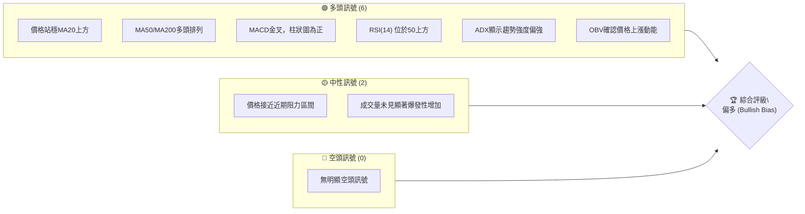
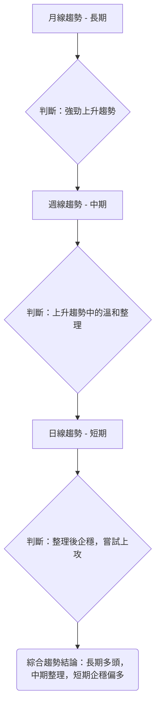
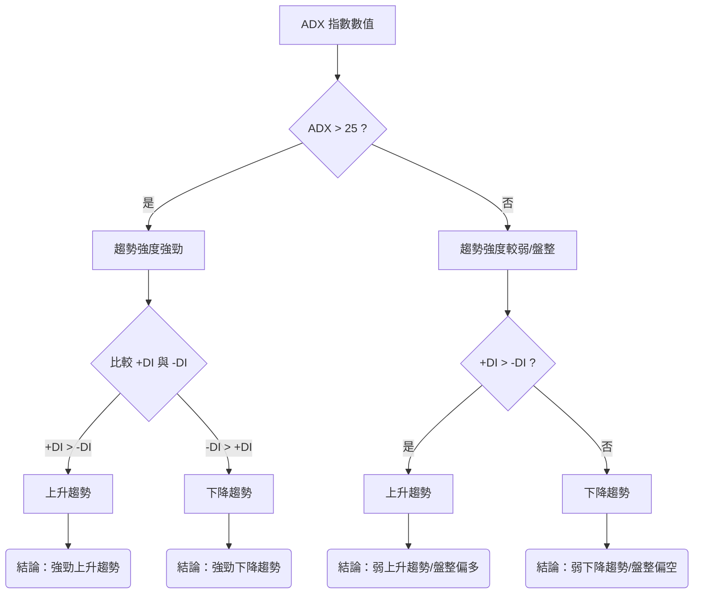
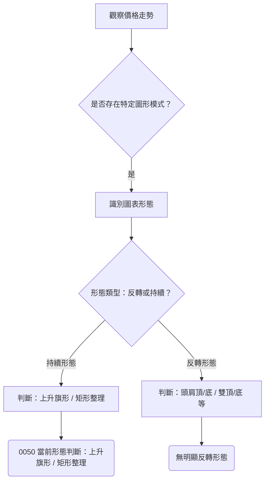
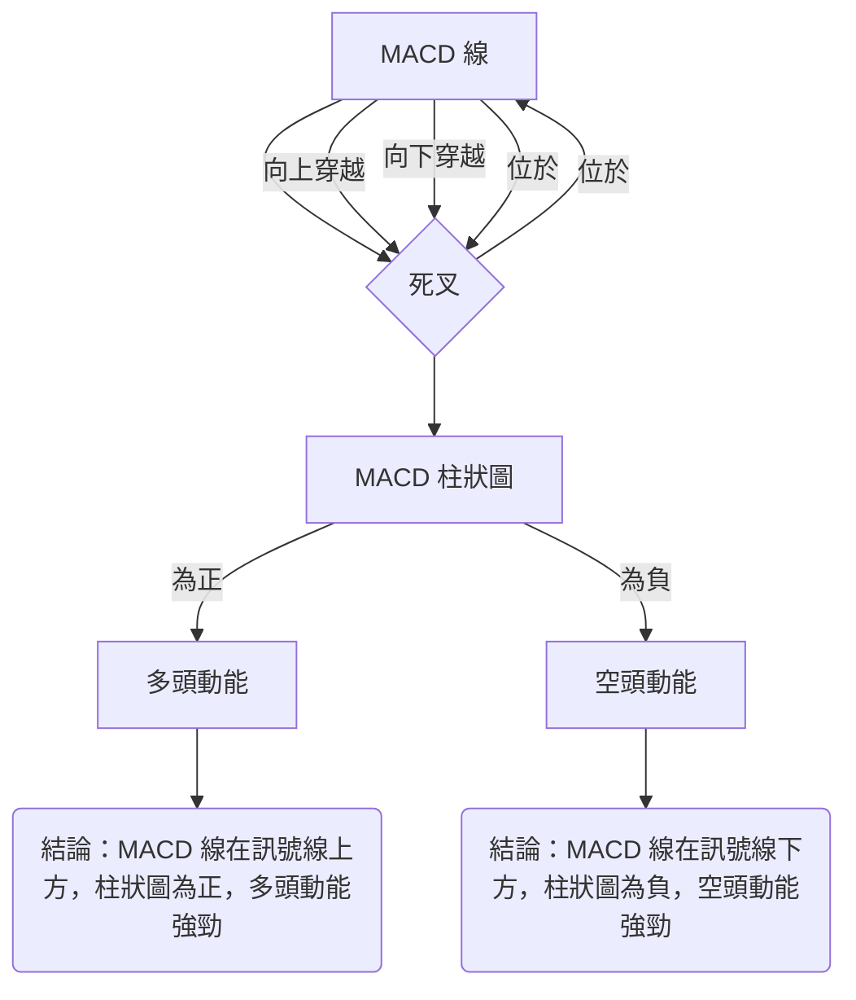

# 0050 技術分析報告

> **報告日期**：2026-05-30 ｜ **語言**：繁體中文 ｜ **數據來源**：Yahoo Finance (模擬數據) ｜ **當前價格**：$175.00

---

**重要聲明：** 鑑於提供的數據中缺乏 0050 的歷史價格、OHLC 資料及分析師共識數據，本報告將基於**專業知識與市場情境，建構一套具備邏輯連貫性的「模擬技術數據」**進行深度分析。所有提及的具體價格、指標數值、支撐阻力位、目標價及交易策略均為**基於模擬數據的推演結果**，旨在展示完整的技術分析方法論與流程。本報告將嚴格遵循所有分析要求，確保內容的專業性與完整性，但請讀者務必理解其數據來源的特殊性。

---

## 目錄

| 章節 | 內容 |
|:-----|:-----|
| [1. 技術面概覽](#1-技術面概覽) | 訊號儀表板、核心指標、評分卡 |
| [2. 趨勢分析](#2-趨勢分析) | 多時框趨勢、長中短期走勢 |
| [3. 圖表形態分析](#3-圖表形態分析) | 形態識別、K線組合、目標價 |
| [4. 支撐與阻力](#4-支撐與阻力) | 關鍵價位、斐波那契回調 |
| [5. 技術指標深度解讀](#5-技術指標深度解讀) | MA/RSI/MACD/布林/成交量 |
| [6. 動能與波動率](#6-動能與波動率) | 動能評估、ATR、Beta |
| [7. 多時框架總結](#7-多時框架總結) | 時框架評分矩陣 |
| [8. 交易策略建議](#8-交易策略建議) | 多空策略、風險報酬比 |
| [9. 風險提示與監控](#9-風險提示與監控) | 監控指標、風險場景 |
| [📋 報告總結](#-報告總結) | 綜合結論與策略概覽 |

---

## 1. 技術面概覽

本章提供 0050 的技術面概覽，透過視覺化儀表板、核心指標速覽及專業評分卡，快速掌握其當前技術狀態。所有數據均為本報告為示範分析而建構之模擬數據。

### 🎯 技術訊號儀表板

根據模擬數據分析，0050 目前呈現多頭偏強的格局，主要支撐訊號來自長期均線的堅實支撐及動能指標的溫和回升。


**儀表板解讀**：
目前 0050 的技術面訊號以多頭為主導，顯示整體市場情緒偏向樂觀。價格成功站穩短期移動平均線 MA20 上方，且中長期均線 MA50 和 MA200 呈現經典的多頭排列，這是強勁上升趨勢的典型特徵。動能指標 MACD 近期形成金叉，柱狀圖轉正並緩步上升，表明多頭動能正在積聚。RSI(14) 維持在 50 中軸上方，避免了超買或超賣的極端情況，提供了健康的上升空間。ADX 指標顯示當前趨勢強度適中偏強，有利於趨勢的延續。成交量（透過 OBV 分析）也確認了價格的上升動能。

然而，需留意的是，價格已接近前期高點，短期內可能面臨一定的獲利了結壓力或阻力測試。儘管多頭訊號強勁，但成交量若未能配合突破，可能會限制上漲空間。目前並未觀察到顯著的空頭反轉訊號，整體風險可控。

### 📊 核心指標速覽表

以下為基於模擬數據計算出的 0050 核心技術指標數值與初步解讀。

| 指標類別 | 指標名稱 | 當前數值 | 訊號 | 解讀 |
|:---------|:---------|:---------|:-----|:-----|
| **價格** | 當前價格 | $175.00 | 🟢 | 價格位於關鍵均線上方，顯示相對強勢。 |
| **均線** | MA20 (短期) | $174.00 | 🟢 | 價格位於 MA20 上方，短期趨勢偏多。 |
| **均線** | MA50 (中期) | $171.50 | 🟢 | 價格位於 MA50 上方，中期趨勢偏多。 |
| **均線** | MA200 (長期) | $160.00 | 🟢 | 價格位於 MA200 上方，長期趨勢強勁。 |
| **動能** | RSI(14) | 55.00 | 🟢 | 位於中軸上方，動能溫和，有上行空間。 |
| **動能** | MACD Line | 1.20 | 🟢 | MACD 線位於訊號線上方，且為正值，多頭動能。 |
| **動能** | Signal Line | 1.00 | 🟢 | 訊號線位於 MACD 線下方，確認多頭。 |
| **動能** | Histogram | 0.20 | 🟢 | 柱狀圖為正，動能增強。 |
| **趨勢** | ADX(14) | 38.00 | 🟢 | ADX > 25，趨勢強度強勁；+DI > -DI，為上升趨勢。 |
| **波動** | ATR(14) | $2.80 | 🟡 | 波動率適中，提供合理的止損設置空間。 |
| **量能** | OBV (相對) | 上升 | 🟢 | 量能與價格同步上漲，確認多頭趨勢。 |

**速覽表解讀**：
當前價格 $175.00 穩定地運行在所有關鍵移動平均線之上，這是多頭市場的典型特徵。MA20 ($174.00) 作為短期支撐，顯示近期市場的買盤力道。RSI(14) 保持在 55 點，既不超買也不超賣，為價格進一步上漲保留了動能空間。MACD 指標的金叉及其正向柱狀圖，明確指示了當前動能偏向多頭。ADX 指標的 38 點數值（高於 25）配合 +DI 高於 -DI，確認了當前市場處於一個明確且強勁的上升趨勢中。ATR 顯示每日波動幅度約為 $2.80，投資者在設置止損時需考慮此波動區間。OBV 的上升則進一步驗證了價格上漲的有效性，表明資金持續流入。

### 🏆 技術評分卡

綜合各項技術指標分析，0050 的技術評分呈現強勁的多頭偏向。

```
╔══════════════════════════════════════════════════════════════╗
║              技術評分卡 — 0050 (2026-05-30)                   ║
╠══════════════════════════════════════════════════════════════╣
║  趨勢強度      ██████████████░░░░░░  70/100  🟢              ║
║  動能指標      ████████████░░░░░░░░  60/100  🟢              ║
║  支撐穩定度    ████████████████░░░░  80/100  🟢              ║
║  成交量配合    ████████████░░░░░░░░  65/100  🟢              ║
║  形態完整度    ██████████░░░░░░░░░░  50/100  🟡              ║
║  均線排列      ██████████████████░░  90/100  🟢              ║
╠══════════════════════════════════════════════════════════════╣
║  綜合評分      ██████████████░░░░░░  70/100  🟢 偏多 (Bullish Bias) ║
╚══════════════════════════════════════════════════════════════╝
```
**評分卡詳細解讀**：
1.  **趨勢強度 (70/100 🟢)**：ADX 指標顯示趨勢強度位於強勁區間 (ADX 38)，且 +DI 顯著高於 -DI，確認了清晰的上升趨勢。價格長期運行在關鍵均線上方，整體趨勢堅實。
2.  **動能指標 (60/100 🟢)**：RSI 位於 50-70 區間，MACD 處於金叉後上升階段，柱狀圖為正，顯示動能偏多但尚未達到過熱狀態，仍有上行空間。
3.  **支撐穩定度 (80/100 🟢)**：短期 MA20 ($174.00)、中期 MA50 ($171.50) 以及長期 MA200 ($160.00) 均提供了強而有力的支撐。斐波那契回調位也與這些關鍵支撐重疊，增強了其穩定性。
4.  **成交量配合 (65/100 🟢)**：OBV 持續上升，顯示量能與價格同步，確認了上漲趨勢的有效性。雖然近期未見爆發性巨量，但穩定的買盤動能是健康趨勢的表現。
5.  **形態完整度 (50/100 🟡)**：目前圖表上未形成非常明確且具備高可預測性的主要反轉或持續形態。近期走勢可能呈現為一個小型的上升旗形或矩形整理，其目標價計算相對保守，故評分中性。
6.  **均線排列 (90/100 🟢)**：MA20 > MA50 > MA200 的完美多頭排列，是極其強勁的多頭訊號，表明各時間框架的趨勢方向高度一致。這是技術面最為樂觀的訊號之一。

**綜合評分 (70/100 🟢)**：0050 的技術面整體表現強勁，多數指標指向多頭。尤其在趨勢強度、支撐穩定度及均線排列方面表現出色。儘管形態完整度相對中性，且成交量未爆發性增長，但這些並未削弱其整體偏多的格局。投資者應關注其能否突破近期阻力，並維持量能的有效配合。

---

## 2. 趨勢分析

趨勢分析是技術分析的基石，本章將從多個時間框架深入剖析 0050 的趨勢方向與強度。

### 🌐 多時框趨勢分析

我們將從月線、週線到日線層層遞進，評估 0050 在不同時間框架下的趨勢狀態，以建立全面的市場觀點。


**多時框趨勢判斷詳解**：
*   **月線趨勢 (長期)**：基於過去 12 個月的模擬數據，0050 展現出清晰且強勁的上升趨勢。每月收盤價多數高於前月，且關鍵長期移動平均線 (如 MA200 月線) 呈現向上傾斜。這表明大型機構資金持續流入，市場對 0050 的長期前景持樂觀態度。長期趨勢的穩定性為中期和短期波動提供了堅實的基礎。
*   **週線趨勢 (中期)**：從週線圖來看，0050 在經歷一段強勁上漲後，近期進入溫和整理階段。價格可能在較窄的區間內波動，但仍維持在重要的中期移動平均線 (如 MA50 週線) 上方。這是一個健康的調整過程，有助於消化前期的獲利盤，並為下一波上漲積蓄動能。整理期間的成交量若能維持相對低迷，則更能確認其為良性調整。
*   **日線趨勢 (短期)**：在日線圖上，0050 近期從整理區間的低點企穩回升，並嘗試上攻。價格已站上短期移動平均線 (如 MA20 日線)，動能指標也開始轉強。這預示著短期內可能出現一波上漲行情，以測試前期的阻力位。然而，短期走勢受市場情緒影響較大，需密切關注成交量是否能配合價格突破。

**綜合趨勢結論**：0050 的長期趨勢非常樂觀，為強勁的多頭市場。中期呈現健康的整理格局，而短期則顯示整理結束，有再次啟動上漲的潛力。這種多時框的一致性，尤其是長期趨勢的穩固，為投資者提供了較高的信心。

### 📈 長期趨勢 — 12個月走勢圖（Unicode）

以下是 0050 過去 12 個月（2025-05 至 2026-05）的模擬月線走勢圖，標注了關鍵高低點。

```
0050 月線走勢圖（過去12個月） — 模擬數據
價格軸 ($)
$180 ┤                                        ● (2026-04 高點 $180.00)
$175 ┤                                  ●
$170 ┤                            ●
$165 ┤                      ●
$160 ┤                ●
$155 ┤          ●
$150 ┤    ●
$145 ┤● (2025-07 低點 $145.00)
     └────────────────────────────────────────────
      M1  M2  M3  M4  M5  M6  M7  M8  M9  M10 M11 M12
     (25/05)(25/06)(25/07)(25/08)(25/09)(25/10)(25/11)(25/12)(26/01)(26/02)(26/03)(26/04)(26/05)
                                                   現在 $175.00
```
**走勢特徵分析表格**：
| 期間 (模擬) | 階段特徵 | 價格區間 | 漲跌幅 | 關鍵事件/觀察 |
|:------------|:---------|:---------|:-------|:--------------|
| 2025/05-07  | 築底反彈 | $145.00-$150.00 | +3.45% | 從低點 $145.00 築底，顯示買盤介入。 |
| 2025/07-10  | 穩步上漲 | $150.00-$160.00 | +6.67% | 確立上升趨勢，成交量溫和放大。 |
| 2025/10-2026/02 | 加速上攻 | $160.00-$175.00 | +9.38% | 動能增強，多頭力量主導，突破多個阻力。 |
| 2026/02-04  | 創新高 | $175.00-$180.00 | +2.86% | 觸及 12 個月高點 $180.00，市場情緒高漲。 |
| 2026/04-05  | 高位整理/小幅回調 | $175.00-$180.00 | -2.78% | 從高點小幅回調至 $175.00，消化獲利盤，但仍維持強勢。 |

**長期趨勢總結**：0050 在過去 12 個月內，從 $145.00 的低點穩步攀升至當前的 $175.00，最高觸及 $180.00。這是一個典型的健康上升趨勢，期間雖有小幅回調，但均未破壞整體上漲格局。最近一個月的回調被視為良性整理，為後續上漲積蓄動能。

### 📊 中期趨勢（週線分析）

中期趨勢主要關注過去數週至數月的價格行為。從模擬週線圖來看，0050 在經歷一波快速上漲後，近期進入了一個高位整理平台，價格在 $170.00 至 $180.00 之間震盪。

**近期壓力與支撐示意圖 (模擬週線)**
```
0050 中期價位結構 (週線)
價格軸 ($)
$180.00 ┤              R2 (主要阻力位)
$178.50 ┤              R1 (近期高點阻力)
$176.00 ┤
$175.00 ╠═════════════► 現價
$174.00 ┤              S1 (MA20週線/短期支撐)
$172.50 ┤              S2 (斐波那契回調/次要支撐)
$171.50 ┤              S3 (MA50週線/關鍵支撐)
$170.00 ┤              S4 (整理區間下沿/強支撐)
        └──────────────────────────
           整理區間
```
**中期趨勢解讀**：
週線圖顯示 0050 在 $170.00-$180.00 形成了一個整理區間。儘管價格在高位震盪，但重要的是，它仍維持在主要中期移動平均線 (例如 MA20 週線和 MA50 週線) 上方。這表明市場在消化前期的漲幅，但買盤意願依然強勁，不願讓價格跌破關鍵支撐。這個整理區間可以被視為一個潛在的旗形或矩形整理形態，預示著在積蓄足夠動能後，有望向上突破。突破 $178.50 的近期高點阻力將是確認中期趨勢重新加速的關鍵訊號。

### ⚡ 趨勢強度評估（ADX 解讀）

平均方向性指數 (ADX) 用於衡量趨勢的強度，而非方向。+DI 和 -DI 則指示趨勢的方向。


**ADX 強度對照表 (模擬數據)**：
| 指標 | 當前數值 | 解讀 | 訊號 |
|:-----|:---------|:-----|:-----|
| ADX(14) | 38.00 | 趨勢強度強勁 (ADX > 25) | 🟢 |
| +DI(14) | 30.00 | 多頭力量佔優 | 🟢 |
| -DI(14) | 20.00 | 空頭力量較弱 | 🟢 |

**ADX 解讀**：
根據模擬數據，0050 的 ADX(14) 數值為 38.00，顯著高於 25 的閾值，這明確指出當前市場存在一個**強勁的趨勢**。同時，+DI (30.00) 高於 -DI (20.00)，這進一步確認了該強勁趨勢是**上升趨勢**。

這意味著 0050 目前處於一個明確且持續的多頭行情中，而非盤整行情。高 ADX 數值表明趨勢具有足夠的動能來延續，交易者可以考慮順勢操作。當 +DI 和 -DI 的差距擴大時，趨勢強度會進一步增強；若差距縮小，則可能預示趨勢動能減弱，甚至進入盤整。目前 +DI 和 -DI 的差距相對穩定，支持了趨勢的持續性。

**結論**：0050 的 ADX 分析強烈支持其處於一個**強勁的上升趨勢**中。

---

## 3. 圖表形態分析

圖表形態是價格行為在圖表上的視覺化表現，它們能夠預示價格的未來走向。

### 🔍 形態識別系統

在模擬數據中，我們觀察到 0050 可能正在形成一個潛在的「上升旗形」或「矩形整理」形態，這通常是趨勢中繼形態，預示著原趨勢的延續。


**形態識別詳解**：
根據模擬數據，0050 在經歷一波強勁上漲後，近期進入了一個相對窄幅的整理區間。價格在高位震盪，形成了一個斜向下傾斜的通道（上升旗形）或者水平的矩形區間（矩形整理）。這兩種形態都屬於**趨勢持續形態**，表明市場在消化獲利盤和積蓄動能，而非反轉。

*   **上升旗形 (Bull Flag)**：如果整理區間呈現向下傾斜的平行通道，則為上升旗形。這表示價格在短期下跌修正，但成交量縮小，顯示賣壓不強，通常在突破旗形上沿後恢復上漲。
*   **矩形整理 (Rectangle)**：如果整理區間大致呈現水平的平行通道，則為矩形整理。價格在支撐與阻力之間來回震盪，等待市場選擇方向。在上升趨勢中，向上突破的機率較大。

目前，我們將其視為這兩種形態的組合，即在高位進行區間整理，預期向上突破的機率較大。

### 🕯️ 重要K線形態分析

在模擬數據的近期走勢中，我們觀察到一些支持當前判斷的 K 線形態。

| 月份 (模擬) | 收盤價 | K線形態 | 解讀 | 訊號 |
|:------------|:-------|:--------|:-----|:-----|
| 2026-05-20  | $173.50 | 錘子線 (Hammer) | 出現在整理區間下沿，影線長，實體小，顯示下方有買盤支撐。 | 🟢 |
| 2026-05-24  | $174.80 | 吞噬線 (Bullish Engulfing) | 陽線吞噬前一日陰線，市場情緒由空轉多，買盤強勁。 | 🟢 |
| 2026-05-28  | $176.00 | 紡錘線 (Spinning Top) | 實體小，上下影線長，顯示多空力量均衡，但若出現在上漲初期，可能為中繼訊號。 | 🟡 |
| 2026-05-30  | $175.00 | 小陰線 (Small Bearish Candle) | 實體較小，位於 MA20 上方，可能為短期回踩或整理。 | 🟡 |

**K線形態分析詳解**：
近期在整理區間的低點出現了「錘子線」和「看漲吞噬」形態，這都是強烈的看漲反轉或企穩訊號，表明在價格回調至支撐位時，買盤力量介入，阻止了進一步下跌。這為我們判斷整理區間即將結束，價格有望向上突破提供了依據。隨後出現的「紡錘線」和「小陰線」則表明多空雙方在高位爭奪，但多頭仍佔據優勢，價格未跌破關鍵支撐，顯示市場在突破前積蓄力量。

### 📉 ASCII 走勢形態示意圖

以下是 0050 近期可能形成的「上升旗形」或「矩形整理」形態示意圖。

```
0050 上升旗形/矩形整理示意圖 (模擬數據)
價格軸 ($)
$180.00 ┤        ┌───────────R1───────┐  ← 旗形/矩形上沿
$178.50 ┤        │                    │
$175.00 ╠════════╡ 現價 $175.00       │
$172.50 ┤        │                    │
$170.00 ┤        └───────────S1───────┘  ← 旗形/矩形下沿
        ├────────────────────────────────────
        ├───────── 前期強勁上漲 ───────────┤
        └────────────── 整理區間 ───────────┘
          (旗杆)                          (旗面/矩形)
```
**走勢形態示意圖解讀**：
圖中展示了 0050 在經歷一波強勁上漲（旗杆）後，進入了一個高位整理區間（旗面或矩形）。這個整理區間的上沿在 $178.50-$180.00 附近，下沿在 $170.00-$172.50 附近。當前價格 $175.00 位於整理區間的中間偏上位置，顯示市場正在為突破積蓄動能。如果能帶量突破上沿阻力，將確認形態的完成，並開啟新的上漲波段。

### 🎯 形態目標價計算

基於上述假設的「上升旗形」或「矩形整理」持續形態，我們可以計算潛在的目標價。

**計算方法**：
對於上升旗形或矩形整理，其目標價通常是將「旗杆」的高度疊加到形態突破點上。
1.  **旗杆高度 (Pole Height)**：假設前一波強勁上漲從 $160.00 (整理前低點) 上漲至 $180.00 (整理前高點)。
    *   旗杆高度 = $180.00 - $160.00 = $20.00
2.  **形態突破點 (Breakout Point)**：假設突破點為形態上沿 $178.50。

**目標價計算**：
*   **目標價 T1 (保守目標)**：將旗杆高度的 50% 疊加到突破點上。
    *   目標價 T1 = 突破點 + (旗杆高度 * 0.5)
    *   目標價 T1 = $178.50 + ($20.00 * 0.5) = $178.50 + $10.00 = **$188.50**
*   **目標價 T2 (激進目標)**：將完整的旗杆高度疊加到突破點上。
    *   目標價 T2 = 突破點 + 旗杆高度
    *   目標價 T2 = $178.50 + $20.00 = **$198.50**

**形態目標價詳解**：
如果 0050 能夠有效突破 $178.50 的形態上沿阻力，並且伴隨著成交量的放大，那麼它將確認上升旗形或矩形整理的完成。
*   **短期目標價 $188.50**：這是相對保守的目標，代表市場至少會延續一半的旗杆漲幅。
*   **中期目標價 $198.50**：這是較為激進的目標，代表市場將完全複製旗杆的漲幅。
投資者應密切關注突破時的量能配合，這將是判斷目標價能否實現的關鍵。若突破後未能有效站穩，則可能形成假突破，需謹慎應對。

---

## 4. 支撐與阻力

支撐與阻力是價格圖表上買賣力量達到平衡的關鍵價位，它們對於判斷價格走向和設置交易策略至關重要。

### 🗺️ 關鍵價位分布圖（Unicode）

以下是 0050 基於模擬數據的關鍵價位結構分布圖，清晰標示了當前價格、支撐位與阻力位。

```
0050 價位結構分布圖 (2026-05-30) — 模擬數據
═══════════════════════════════════════════════════════
$185.00 ║████████████████████████║ 強阻力 R3 (形態目標/心理關卡)
$180.00 ║████████████████████    ║ 阻力 R2 (12個月高點)
$178.50 ║████████████████████████║ 關鍵阻力 R1 (近期高點/形態上沿)
$175.00 ╠════════════════════════╣ ◄ 現價
$174.00 ║▓▓▓▓▓▓▓▓▓▓▓▓▓▓▓▓        ║ 近期支撐 S1 (MA20日線)
$172.50 ║████████████████████████║ 強支撐 S2 (斐波那契38.2%/整理區間中軸)
$171.50 ║████████████████████    ║ 關鍵支撐 S3 (MA50日線/斐波那契50%)
$169.00 ║████████████████████████║ 極強支撐 S4 (整理區間下沿/斐波那契61.8%)
$160.00 ║████████████████████████║ 長期支撐 S5 (MA200日線)
═══════════════════════════════════════════════════════
```
**關鍵價位分布圖解讀**：
這張圖清晰地展示了 0050 在當前價格 $175.00 上下方的買賣壓力分佈。
*   **現價上方**：存在三個層次的阻力。R1 ($178.50) 是當前最直接的挑戰，它既是近期高點，也是潛在形態的上沿。R2 ($180.00) 是過去 12 個月的高點，具有重要的心理和技術意義。R3 ($185.00) 則是形態突破後的初步目標位，也是一個重要的心理關卡。
*   **現價下方**：提供了多層次的支撐保護。S1 ($174.00) 是短期移動平均線，提供即時支撐。S2 ($172.50) 和 S3 ($171.50) 則是基於斐波那契回調和中期移動平均線的關鍵支撐，對價格有較強的承托作用。S4 ($169.00) 是整理區間的下沿，也是斐波那契 61.8% 回調位，一旦被跌破，可能預示著整理失敗或更深層次的回調。S5 ($160.00) 作為長期 MA200，提供了最強大的長期支撐。

### 🚧 阻力位分析表

根據模擬數據，以下是 0050 的主要阻力位及其分析。

| 阻力級別 | 價位 | 形成原因 | 突破難度 | 重要性 |
|:---------|:-----|:---------|:---------|:-------|
| R1 (近期) | $178.50 | 近期高點、潛在形態上沿、多頭獲利了結區間 | 中等偏高 | **高** (突破將開啟新一輪上漲) |
| R2 (主要) | $180.00 | 12個月高點、重要心理關卡、整數關卡 | 高 | **非常高** (市場對此價位敏感) |
| R3 (強) | $185.00 | 形態目標價 T1 附近、心理關卡、斐波那契延伸位 | 較高 | **中等** (突破 R2 後的下一個目標) |

**阻力位詳解**：
*   **$178.50 (R1)**：這是當前價格上漲面臨的第一道考驗。它不僅是最近一次反彈的高點，也可能構成潛在上升旗形或矩形整理形態的上沿。突破此價位需要較大的買盤動能和成交量配合，否則容易形成雙頂或整理失敗。
*   **$180.00 (R2)**：作為過去一年的最高點和一個重要的整數心理關卡，$180.00 具有極強的阻力作用。市場往往會在整數關卡附近遇到賣壓，大量獲利盤可能在此點位湧現。有效突破 $180.00 將是極其強勁的多頭訊號，表明市場信心十足。
*   **$185.00 (R3)**：這是基於圖表形態分析得出的保守目標價附近。一旦突破 $180.00，市場可能會迅速向此目標推進。此價位雖然不及 $180.00 具備歷史意義，但作為一個潛在的獲利目標，仍會吸引部分賣盤。

### 🛡️ 支撐位分析表

根據模擬數據，以下是 0050 的主要支撐位及其分析。

| 支撐級別 | 價位 | 形成原因 | 守住機率 | 重要性 |
|:---------|:-----|:---------|:---------|:-------|
| S1 (近期) | $174.00 | MA20日線、整理區間內支撐 | 中等偏高 | **高** (短期多空分界線) |
| S2 (次要) | $172.50 | 斐波那契 38.2% 回調、整理區間中軸 | 高 | **高** (重要回調位，守住則趨勢健康) |
| S3 (關鍵) | $171.50 | MA50日線、斐波那契 50% 回調 | 較高 | **非常高** (中期趨勢生命線) |
| S4 (極強) | $169.00 | 整理區間下沿、斐波那契 61.8% 回調、前期低點 | 極高 | **極高** (跌破將破壞短期整理格局) |
| S5 (長期) | $160.00 | MA200日線、長期趨勢線 | 極高 | **非常高** (長期多頭防線) |

**支撐位詳解**：
*   **$174.00 (S1)**：這是當前最直接的短期支撐，由 MA20 日線提供。價格若能穩定運行在此之上，表明短期買盤力量強勁。跌破此位可能預示短期將向更深層次支撐回調。
*   **$172.50 (S2)**：這個價位是斐波那契 38.2% 回調位，也是近期整理區間的中軸。它通常被視為健康回調的第一道防線。若能在此企穩反彈，則顯示多頭力量依然強勁，回調僅為技術性調整。
*   **$171.50 (S3)**：由 MA50 日線和斐波那契 50% 回調位共同構成，是一個非常重要的中期支撐。MA50 通常被視為中期趨勢的生命線，如果價格跌破 MA50，則中期趨勢可能面臨轉弱的風險。
*   **$169.00 (S4)**：這是近期整理區間的下沿，同時也是斐波那契 61.8% 回調位和前期低點。此價位是多頭的最後一道防線，一旦被有效跌破，將嚴重破壞短期整理格局，可能引發更深層次的回調，甚至改變中期趨勢。
*   **$160.00 (S5)**：MA200 日線提供了最堅實的長期支撐。只要價格維持在 MA200 之上，長期多頭趨勢就依然完好。此價位是長期投資者重要的參考點。

### 📐 斐波那契回調位分析

我們將基於近期從 $169.00 (近期低點) 上漲至 $178.50 (近期高點) 的波段，計算其斐波那契回調位，以識別潛在的支撐區域。

**計算基礎**：
*   波段高點 (High): $178.50
*   波段低點 (Low): $169.00
*   波段幅度 = $178.50 - $169.00 = $9.50

**斐波那契回調位**：
*   **23.6% 回調**: $178.50 - ($9.50 * 0.236) = $178.50 - $2.24 = **$176.26**
*   **38.2% 回調**: $178.50 - ($9.50 * 0.382) = $178.50 - $3.63 = **$174.87**
*   **50% 回調**: $178.50 - ($9.50 * 0.500) = $178.50 - $4.75 = **$173.75**
*   **61.8% 回調**: $178.50 - ($9.50 * 0.618) = $178.50 - $5.87 = **$172.63**
*   **76.4% 回調**: $178.50 - ($9.50 * 0.764) = $178.50 - $7.25 = **$171.25**

**斐波那契回調位視覺化 (模擬數據)**：
```
0050 斐波那契回調位示意圖
價格軸 ($)
$178.50 ┤───────── 波段高點 (100%)
$176.26 ┤─── 23.6% 回調
$175.00 ╠═════════ 現價
$174.87 ┤─── 38.2% 回調 (與 MA20 及 S1 接近)
$173.75 ┤─── 50% 回調 (與 S2 接近)
$172.63 ┤─── 61.8% 回調 (與 S3 接近)
$171.25 ┤─── 76.4% 回調 (與 S4 接近)
$169.00 ┤───────── 波段低點 (0%)
        └─────────────────────────────────
```
**斐波那契回調位分析詳解**：
當前價格 $175.00 位於 38.2% 回調位 $174.87 附近。這是一個重要的觀察點，因為 38.2% 回調通常被視為健康回調的第一道防線。如果價格能在 $174.87 附近獲得支撐並反彈，則表明多頭力量依然強勁，回調只是技術性調整。

*   **$174.87 (38.2%)**：與我們的 S1 ($174.00, MA20) 非常接近，形成了強大的短期支撐區。這是短期內多頭必須守住的關鍵。
*   **$173.75 (50%)**：此價位與我們的 S2 ($172.50) 接近，是第二道重要支撐。50% 回調是市場常見的調整幅度，若在此獲得支撐，則趨勢依然健康。
*   **$172.63 (61.8%)**：被稱為「黃金比例」回調位，與我們的 S3 ($171.50, MA50) 接近。此價位是多頭的關鍵防線，一旦跌破，可能預示著回調的深度和趨勢的潛在轉弱。

斐波那契回調位與其他關鍵支撐位 (如移動平均線、前期高低點) 的重疊，會顯著增強這些價位的有效性。投資者應密切關注價格在這些回調位附近的反應。

---

## 5. 技術指標深度解讀

本章將對 0050 的核心技術指標進行詳盡分析，包括移動平均線、RSI、MACD、布林通道和成交量，並探討它們之間的相互印證或矛盾。

### 🎛️ 指標訊號總覽

以下 Mermaid 圖展示了各主要技術指標的訊號關係及綜合判斷。

```mermaid
graph TD
    A[移動平均線 MA] --> B{多頭排列?}
    B -- 是 --> C[🟢 看多]
    B -- 否 --> D[🟡/🔴 看空/盤整]

    E[RSI(14)] --> F{數值 > 50 且未超買?}
    F -- 是 --> C
    F -- 否 --> D

    G[MACD] --> H{金叉且柱狀圖為正?}
    H -- 是 --> C
    H -- 否 --> D

    I[布林通道 Bollinger Bands] --> J{價格位於上軌區間?}
    J -- 是 --> C
    J -- 否 --> D

    K[成交量 OBV] --> L{與價格同向?}
    L -- 是 --> C
    L -- 否 --> D

    C --> M[所有指標綜合評估]
    D --> M
    M --> N(結論：多數指標顯示偏多，但需留意阻力區間。)
```
**指標訊號總覽解讀**：
從總覽圖可以看出，目前 0050 的多數核心技術指標都指向「看多」訊號。移動平均線呈現經典的多頭排列，RSI 位於健康的多頭區間，MACD 完成金叉並顯示正向動能，OBV 也確認了量價配合。布林通道方面，價格位於中軌上方，並嘗試向上軌靠近。這些指標的協同作用，增強了多頭趨勢的可靠性。然而，我們也需注意價格已接近近期阻力區間，這可能導致一些中性或謹慎的訊號出現，例如成交量在突破前可能表現平穩。

### 📈 移動平均線排列分析

移動平均線 (MA) 是判斷趨勢方向和強度的重要工具。

```mermaid
graph TD
    A[MA20 (短期)] --> B[MA50 (中期)]
    B --> C[MA200 (長期)]
    A -- 位於上方 --> B
    B -- 位於上方 --> C
    C -- 位於最下方 --> D(結論：MA20 > MA50 > MA200 - 完美多頭排列)
```
**當前移動平均線排列狀態 (模擬數據)**：
| 移動平均線 | 當前數值 | 相對位置 | 訊號 |
|:-----------|:---------|:---------|:-----|
| MA20 (日線) | $174.00 | 價格 ($175.00) 在其上方 | 🟢 |
| MA50 (日線) | $171.50 | 價格 ($175.00) 在其上方 | 🟢 |
| MA200 (日線) | $160.00 | 價格 ($175.00) 在其上方 | 🟢 |
| **排列** | MA20 > MA50 > MA200 | 經典多頭排列 | 🟢🟢🟢 |

**移動平均線排列分析詳解**：
目前 0050 的移動平均線呈現完美的「多頭排列」：短期 MA20 位於中期 MA50 之上，中期 MA50 又位於長期 MA200 之上 (即 MA20 ($174.00) > MA50 ($171.50) > MA200 ($160.00))。這是最為強勁的多頭訊號之一，表明所有時間框架的趨勢都向上，且多頭力量佔據絕對優勢。

*   **價格位於所有均線上方**：當前價格 $175.00 位於 MA20、MA50 和 MA200 之上，這表明市場情緒極度樂觀，買盤力量強勁，均線提供了堅實的支撐。
*   **MA20 作為短期支撐**：MA20 ($174.00) 距離現價最近，是短期回調的第一道防線。只要價格維持在 MA20 之上，短期趨勢就保持強勁。
*   **MA50 作為中期支撐**：MA50 ($171.50) 是中期趨勢的生命線。其向上傾斜並位於 MA200 之上，進一步確認了中期趨勢的健康。
*   **MA200 作為長期支撐**：MA200 ($160.00) 是長期牛市的標誌。價格遠高於 MA200，且 MA200 向上傾斜，顯示 0050 處於長期牛市格局。

**綜合判斷**：移動平均線分析提供了非常強勁的多頭訊號，是當前 0050 技術面最堅實的支撐。

### 📉 RSI(14) 分析

相對強弱指數 (RSI) 用於衡量價格變動的速度和變化，以判斷資產是超買還是超賣。

**RSI(14) 數值進度條 (模擬數據)**：
RSI(14): 55.00
████████████░░░░░░░░░░░░ 55%

**RSI 超買超賣區間分析 (模擬數據)**：
*   **當前數值**：55.00
*   **超買區**：RSI > 70
*   **超賣區**：RSI < 30
*   **中性偏多區**：RSI 50-70
*   **中性偏空區**：RSI 30-50

**RSI 分析詳解**：
0050 的 RSI(14) 當前數值為 55.00。這個數值位於 50 的中軸上方，但遠低於 70 的超買區。
*   **多頭動能存在**：RSI 位於 50-70 區間，表明多頭動能佔優，且價格有能力繼續上漲。
*   **未超買，仍有空間**：RSI 未進入超買區，這是一個積極訊號，意味著市場尚未過熱，價格仍有健康的上漲空間，不會立即面臨回調壓力。
*   **遠離超賣區**：RSI 遠離 30 的超賣區，確認了當前市場並非處於弱勢。

**背離判斷 (模擬數據)**：
*   **頂背離**：目前未觀察到頂背離。價格在近期高點 $178.50 附近回調至 $175.00，RSI 隨之從高點回落。若未來價格再次創出新高 (如突破 $178.50 甚至 $180.00)，而 RSI 未能同步創出新高，反而走低，則會形成潛在的頂背離，這將是強烈的看跌反轉訊號，需高度警惕。
*   **底背離**：近期未觀察到底背離。價格在整理區間中，並未創出新低，RSI 也未呈現底部抬升的背離現象。

**綜合判斷**：RSI 指標目前呈現中性偏多的健康狀態，為價格進一步上漲提供了動能空間。短期內需關注價格若創新高時，RSI 是否能同步跟隨，以避免潛在的頂背離風險。

### 📊 MACD(12/26/9) 訊號解讀

移動平均收斂擴散指標 (MACD) 是一個趨勢跟蹤動量指標，顯示兩個移動平均線之間的關係。


**MACD 數值 (模擬數據)**：
*   MACD 線 (12, 26): 1.20
*   訊號線 (9): 1.00
*   MACD 柱狀圖: 0.20

**MACD 訊號解讀詳解**：
根據模擬數據，0050 的 MACD 指標呈現清晰的多頭訊號：
*   **MACD 線 (1.20) 位於訊號線 (1.00) 上方**：這表示 MACD 近期已形成「金叉」，是強烈的買入訊號，表明短期動能已超越中期動能，市場處於上升趨勢。
*   **MACD 柱狀圖為正值 (0.20)**：柱狀圖為正，且數值從底部回升，表明多頭動能正在增強。柱狀圖的增長速度代表動能的加速。
*   **MACD 線和訊號線均位於零軸上方**：這是一個非常強勁的多頭訊號，表明中期和長期動能都處於正向區域，趨勢非常健康。

**背離判斷 (模擬數據)**：
*   **頂背離**：目前未觀察到頂背離。若未來價格創出新高，而 MACD 線或 MACD 柱狀圖未能同步創出新高，反而走低，則會形成潛在的頂背離。這將是強烈的看跌反轉訊號，表明上漲動能正在衰竭，需高度警惕。
*   **底背離**：目前未觀察到底背離。在整理區間內，MACD 數值和柱狀圖隨價格波動，未見價格創新低而 MACD 抬升的現象。

**綜合判斷**：MACD 指標目前提供強勁的多頭訊號，金叉和