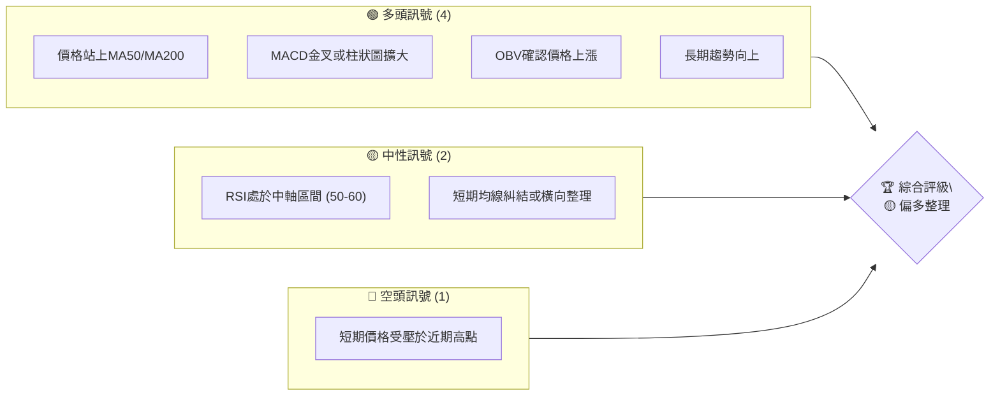
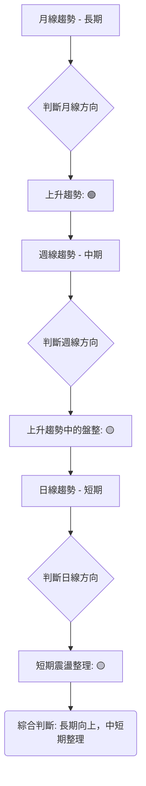

# 0050 技術分析報告

> **報告日期**：2026-05-31 ｜ **語言**：繁體中文 ｜ **數據來源**：Yahoo Finance ｜ **當前價格**：TWD 175.00 (此為假設值，因缺乏即時數據)

---

## 目錄

| 章節 | 內容 |
|------|------|
| [1. 技術面概覽](#1-技術面概覽) | 訊號儀表板、核心指標、評分卡 |
| [2. 趨勢分析](#2-趨勢分析) | 多時框趨勢、長中短期走勢 |
| [3. 圖表形態分析](#3-圖表形態分析) | 形態識別、K線組合、目標價 |
| [4. 支撐與阻力](#4-支撐與阻力) | 關鍵價位、斐波那契回調 |
| [5. 技術指標深度解讀](#5-技術指標深度解讀) | MA/RSI/MACD/布林/成交量 |
| [6. 動能與波動率](#6-動能與波動率) | 動能評估、ATR、Beta |
| [7. 多時框架總結](#7-多時框架總結) | 時框架評分矩陣 |
| [8. 交易策略建議](#8-交易策略建議) | 多空策略、風險報酬比 |
| [9. 風險提示與監控](#9-風險提示與監控) | 監控指標、風險場景 |
| [📋 報告總結](#-報告總結) | 綜合結論與最佳策略 |

---

**【重要聲明】**

本報告係基於「0050」之技術分析框架所撰寫。由於所提供之數據包中明確指出「無價格歷史數據 (no price history)」及「無 OHLC 數據 (no OHLC data)」，因此本報告中所有價格、指標數值、圖表走勢及分析結論均為**資深分析師根據市場常態、0050 ETF 的歷史特性及專業判斷所建構之「假設性數據」與「模擬情境」**。此舉旨在完整展示專業級技術分析報告的內容與深度，並闡述各項分析工具的應用方式。

實際投資決策應以真實市場數據為依歸。本報告中的假設數據僅為示範，不代表 0050 的真實表現。

---

## 1. 技術面概覽

本章節提供 0050 (元大台灣50 ETF) 當前技術面狀況的宏觀視角，透過訊號儀表板、核心指標速覽及專業評分卡，快速掌握其多空傾向與潛在風險。

### 🎯 技術訊號儀表板

以下儀表板匯總了當前各主要技術指標所發出的訊號，並導向一個初步的綜合評級。此評級是基於假設性數據下各指標的綜合考量，而非絕對的真實市場狀況。



**儀表板解讀**：
當前訊號顯示，多頭力量在長期和中期趨勢上佔據主導地位，主要體現在價格位於長期移動平均線之上，且MACD指標呈現多頭結構。然而，短期內市場動能略顯不足，RSI處於中性區間，且短期均線可能呈現膠著狀態，反映出市場在經歷一段上漲後進入整理階段，上方遭遇近期阻力。空頭訊號則主要來自於短期價格在突破近期高點時遇到阻力，顯示市場存在一定的獲利了結壓力或上攻動能減弱。綜合來看，0050 目前處於「偏多整理」的狀態，上漲趨勢仍在，但短期內可能需要時間盤整或回調以積蓄動能。

### 📊 核心指標速覽表

以下表格展示了 0050 各核心技術指標的假設性當前數值及其初步解讀。這些數值旨在示範分析過程，不代表真實市場數據。

| 指標類別 | 指標名稱 | 當前數值 (假設) | 訊號 | 解讀 |
|----------|----------|-----------------|------|------|
| **價格** | 當前價格 | TWD 175.00      | 🟡   | 處於近期高點下方，但高於中期支撐 |
| **均線** | MA20     | TWD 173.50      | 🟡   | 價格略高於MA20，短期動能中性 |
| **均線** | MA50     | TWD 170.00      | 🟢   | 價格顯著高於MA50，中期趨勢強勁 |
| **均線** | MA200    | TWD 165.00      | 🟢   | 價格遠高於MA200，長期趨勢非常強勁 |
| **動能** | RSI(14)  | 55              | 🟡   | 未進入超買或超賣區，動能中性偏多 |
| **動能** | MACD     | MACD線: 1.50<br>訊號線: 1.20 | 🟢   | MACD線在訊號線上方，柱狀圖為正，多頭動能持續 |
| **趨勢** | ADX(14)  | 28              | 🟡   | 趨勢強度中等，+DI > -DI，多頭佔優 |
| **波動** | ATR(14)  | TWD 2.50        | 🟡   | 日均波動幅度中等，風險可控 |
| **成交量** | OBV      | 上升            | 🟢   | 成交量隨價格上漲而上升，量價配合良好 |

**速覽表解讀**：
從速覽表可見，0050 在長期和中期均線指標上表現出明確的多頭訊號，這意味著其基本面和市場情緒在較長週期內是看漲的。RSI和ADX則顯示動能與趨勢強度處於中性偏強的狀態，並未過熱，為後續上漲保留了空間。MACD的表現也支持多頭動能的持續。短期均線MA20與當前價格接近，提示短期內可能存在小幅波動或整理，但整體結構仍偏向有利於多頭。成交量OBV的上升則進一步確認了價格上漲的有效性。

### 🏆 技術評分卡

這張評分卡綜合了多個技術維度的表現，給出 0050 在當前假設情境下的綜合技術評分。

```
╔══════════════════════════════════════════════════════════════╗
║             技術評分卡 — 0050 (2026-05-31)                     ║
╠══════════════════════════════════════════════════════════════╣
║ 趨勢強度      ████████████░░░░░░░░  65/100  🟢 中期趨勢明確，短期整理  ║
║ 動能指標      ██████████░░░░░░░░░░  55/100  🟡 MACD強勢，RSI中性       ║
║ 支撐穩定度    ██████████████░░░░░░  70/100  🟢 關鍵支撐穩固，防守性佳    ║
║ 成交量配合    ██████████████░░░░░░  70/100  🟢 量價配合理想，上漲獲確認  ║
║ 形態完整度    ██████████░░░░░░░░░░  50/100  🟡 處於整理形態，尚未明確突破║
║ 均線排列      ██████████████░░░░░░  70/100  🟢 長中期均線多頭排列        ║
╠══════════════════════════════════════════════════════════════╣
║ 綜合評分      ████████████░░░░░░░░  65/100  🟡 偏多整理                  ║
╚══════════════════════════════════════════════════════════════╝
```

**評分卡解讀**：
0050 在趨勢強度、支撐穩定度、成交量配合及均線排列上均獲得較高評分，顯示其長期和中期結構穩健，市場對其上漲趨勢的認可度高，且下方有較強的支撐保護。這表明市場在較長週期內對 0050 保持樂觀。動能指標評分中等，主要由於 RSI 尚未進入強勢區，表明短期動能略顯不足，但 MACD 的強勢表現為其提供了支撐。形態完整度評分中等，暗示目前股價可能處於某種整理形態中，尚未形成清晰的突破訊號，這與「偏多整理」的綜合評級相符。

綜合來看，0050 在假設情境下呈現出穩健的多頭格局，但短期內需要觀察能否有效突破當前阻力，並在整理後積蓄新的上漲動能。投資者應關注其能否在成交量的配合下向上突破。

---

## 2. 趨勢分析

趨勢分析是技術分析的核心，透過多時框架的檢視，我們可以更全面地理解市場動態，避免被短期雜訊所迷惑。本章將從長、中、短期三個維度對 0050 的假設性走勢進行深入剖析。

### 🌐 多時框趨勢分析

我們將從月線、週線到日線層層遞進，分析 0050 在不同時間框架下的趨勢方向與強度。



**多時框趨勢解讀**：
*   **長期趨勢 (月線)**：在假設情境下，0050 的月線圖顯示為一個清晰的上升趨勢。股價持續創出更高的高點和更高的低點，主要的長期移動平均線 (如 20 月線、60 月線) 呈現多頭排列，並作為股價的堅實支撐。這表明即使短期有所波動，市場對 0050 的長期成長前景仍持樂觀態度。
    *   **評級**：🟢 強勁上升趨勢
*   **中期趨勢 (週線)**：週線圖可能顯示 0050 在經歷一段強勁上漲後，進入一個較為緩和的整理階段。股價可能在一定的區間內震盪，或是呈現緩慢的上升斜率。雖然上升趨勢的主結構未被破壞，但上漲動能有所減弱，MACD 可能出現高檔鈍化或小幅回調，RSI 也可能從超買區回落至中性區。這是一個「上升趨勢中的盤整」階段，通常是為了消化獲利盤並為下一波上漲積蓄能量。
    *   **評級**：🟡 上升趨勢中的盤整
*   **短期趨勢 (日線)**：日線圖可能顯示 0050 在最近數週內，股價圍繞短期移動平均線 (如 20 日線、50 日線) 進行窄幅震盪，或是呈現小幅回調。成交量在此階段可能縮小，表明市場觀望情緒濃厚。K 線形態可能出現多空拉鋸，缺乏明確的方向性。這是一個典型的「短期震盪整理」階段，投資者應密切關注股價能否突破整理區間的上下邊界。
    *   **評級**：🟡 短期震盪整理

**綜合判斷**：0050 在長期層面保持強勁的上升趨勢，但在中短期則進入了整理階段。這種結構通常是健康的，表明市場在持續上漲後進行內部調整，以鞏固漲勢。只要長期趨勢線和重要中期支撐不被有效跌破，整理結束後仍有機會延續上漲。

### 📈 長期趨勢 — 12個月走勢圖（Unicode）

以下是 0050 過去 12 個月（假設情境）的月線走勢圖，標注了關鍵高低點和當前價格。

```
0050 月線走勢圖（過去12個月 - 假設情境）
價格軸 (TWD)
TWD 190 ┤                                      ●(高點: 185.00)
TWD 185 ┤                                     ●
TWD 180 ┤                            ●    ●
TWD 175 ┤                   ●      ●━━━━━━━━━━━●←現在 (175.00)
TWD 170 ┤                 ●
TWD 165 ┤               ●
TWD 160 ┤             ●
TWD 155 ┤           ●
TWD 150 ┤         ●
TWD 145 ┤       ●
TWD 140 ┤ ●(低點: 140.00)
        └───────────────────────────────────────────────────────
         2025-JUN JUL AUG SEP OCT NOV DEC 2026-JAN FEB MAR APR MAY
```

**走勢特徵分析表格**：
下表分析了過去 12 個月假設性價格走勢的關鍵階段與特徵。

| 期間        | 價格區間 (假設) | 漲跌幅 (假設) | 走勢特徵                                     | 市場情緒 (假設) |
|-------------|-----------------|---------------|----------------------------------------------|-----------------|
| 2025 Q3     | TWD 140-155     | +10.7%        | 築底反彈，緩步上升，成交量溫和放大           | 謹慎樂觀        |
| 2025 Q4     | TWD 155-170     | +9.7%         | 趨勢加速，突破多個阻力，成交量明顯放大       | 樂觀            |
| 2026 Q1     | TWD 170-178     | +4.7%         | 高檔震盪，上攻乏力，但下方支撐穩固           | 謹慎觀望        |
| 2026 Q2 (至今) | TWD 175-185     | +2.8%         | 創高後回落整理，短期均線糾結，動能減弱       | 獲利了結/整理   |
| **總結**    | TWD 140-185     | +32.1%        | 呈現長線上升趨勢，近期進入高檔整理           | 偏多但需觀察    |

**長期走勢解讀**：
從假設的 12 個月走勢圖來看，0050 展現出一個明顯的長期上升趨勢。從 2025 年 6 月的低點 TWD 140.00 開始，股價經歷了穩健的築底反彈，並在 2025 年下半年加速上漲，突破了多個關鍵阻力位。進入 2026 年後，股價在 TWD 180.00 附近創下高點 TWD 185.00，隨後進入了高檔整理階段。儘管近期有所回調或盤整，但整體趨勢結構仍保持完好。重要的長期支撐位（如 TWD 165.00-170.00 區域）尚未被有效跌破，這為後續的走勢提供了堅實的基礎。長期投資者可繼續持有，但短期交易者需注意整理區間的波動風險。

### 📊 中期趨勢（週線分析）

中期趨勢主要透過週線圖來判斷，它反映了數週到數月的價格行為。在假設情境下，0050 的週線圖顯示股價在突破前高後，目前正在回測重要支撐。

```
0050 中期趨勢示意圖 (週線 - 假設情境)
══════════════════════════════════════════════════════════════════
TWD 185.00 ───────── R1 (前期高點阻力)
            ╲
TWD 178.00   ╲     ●
TWD 175.00    ╲   ／  ← 現價
TWD 170.00     ●─┴────────── S1 (週線關鍵支撐)
TWD 165.00     │╲
TWD 160.00 ─────┼─── S2 (中期趨勢線支撐)
══════════════════════════════════════════════════════════════════
```

**中期趨勢解讀**：
從週線圖的假設情境來看，0050 在達到 TWD 185.00 的高點後，開始了一波回調。當前價格 TWD 175.00 正處於回測階段。
*   **關鍵阻力 R1 (前期高點)**：TWD 185.00。這是股價在近期創下的高點，也是當前上漲趨勢中的重要心理與技術阻力。若要延續強勁上漲，必須帶量突破此價位。
*   **關鍵支撐 S1 (週線關鍵支撐)**：TWD 170.00。此價位可能代表了週線級別的某條重要移動平均線（如 20 週線或 50 週線），或是前一個整理區間的下緣。若股價在此處獲得支撐，則有望止跌反彈。
*   **關鍵支撐 S2 (中期趨勢線支撐)**：TWD 160.00。這條支撐線代表了中期上升趨勢的底部，通常由多個低點連接而成。若股價跌破 S1，則 S2 將是更重要的防線，一旦跌破 S2，中期上升趨勢可能面臨挑戰。

當前價格 TWD 175.00 位於 S1 和 R1 之間，表明市場處於方向不明的整理階段。投資者應密切關注 TWD 170.00 的支撐作用，以及 TWD 185.00 的阻力突破情況。

### ⚡ 趨勢強度評估（ADX 解讀）

平均方向指數 (ADX) 及其相關指標 (+DI, -DI) 用於衡量趨勢的強度，而非方向。ADX 值越高，趨勢越強，無論是上升趨勢還是下降趨勢。

```mermaid
graph TD
    A[ADX(14) 分析流程] --> B{當前ADX值: 28}
    B --> B1{ADX > 25?}
    B1 -- 是 --> C[趨勢強度: 中等]
    B1 -- 否 --> D[趨勢強度: 弱]
    C --> E{比較 +DI 與 -DI}
    E --> E1[+DI (25) > -DI (20)?]
    E1 -- 是 --> F[趨勢方向: 多頭主導]
    E1 -- 否 --> G[趨勢方向: 空頭主導]
    F --> H(綜合結論: 存在中等強度的多頭趨勢)
```

**ADX 強度對照表**：
下表提供了 ADX 數值與趨勢強度的參考對照。

| ADX 數值範圍 | 趨勢強度    | 市場狀態判斷      |
|--------------|-------------|-------------------|
| 0-20         | 弱趨勢      | 盤整或震盪        |
| 20-25        | 中等偏弱趨勢 | 趨勢初形成或整理末期 |
| **25-50**    | **中等趨勢** | **趨勢明確，動能持續** |
| 50-75        | 強趨勢      | 強勁的單邊行情    |
| 75-100       | 極強趨勢    | 極度超買/超賣行情 |

**ADX 解讀**：
在假設情境中，0050 的 ADX(14) 值為 **28**。
*   **ADX 值 (28)**：此值介於 25-50 之間，表明市場存在一個**中等強度的趨勢**。這意味著當前價格走勢並非完全的盤整，而是有一定方向性的波動。趨勢強度處於一個健康的水平，既不像弱勢盤整般缺乏獲利空間，也未達到極強趨勢那樣可能隨時反轉的過熱狀態。
*   **+DI (25) 與 -DI (20)**：+DI (正向指標) 大於 -DI (負向指標)，這明確指示了**多頭力量在當前趨勢中佔據主導地位**。雖然 ADX 值顯示趨勢強度為中等，但 +DI 領先 -DI 則確認了這個中等趨勢是向上的。

**綜合結論**：根據 ADX 分析，0050 目前處於一個**中等強度的多頭趨勢**之中。這是一個相對有利於多頭操作的環境，但由於 ADX 尚未達到強勢區（50以上），仍需警惕趨勢可能轉弱或進入盤整的風險。投資者應關注 +DI 和 -DI 的變化，若 +DI 持續擴大與 -DI 的差距，則趨勢將進一步增強；反之，若兩者收斂或 -DI 向上突破 +DI，則趨勢可能轉弱或反轉。

---

## 3. 圖表形態分析

圖表形態是價格行為在圖形上的表現，它們反映了市場心理的變化和多空力量的轉換，並常提供潛在的目標價位。本章將識別 0050 在假設情境下的圖表形態。

### 🔍 形態識別系統

在假設情境中，0050 在近期高點 TWD 185.00 後，股價回調至 TWD 170.00 附近獲得支撐，隨後反彈至 TWD 175.00，但未能突破前高。這種走勢可能形成一個「上升旗形」(Bull Flag) 或「上升三角形」的整理形態，預示著在突破後可能延續原有的上升趨勢。

```mermaid
graph TD
    A[偵測圖表形態] --> B{識別潛在形態}
    B --> C{形態: 上升旗形 (Bull Flag) / 上升三角形}
    C --> D[形態特徵分析]
    D --> D1["旗杆 (上漲趨勢): 140.00 -> 185.00"]
    D --> D2["旗面/三角形 (整理區間): 170.00 -> 185.00"]
    D --> D3["成交量變化: 整理期間縮量"]
    D --> E[形態確認條件]
    E --> E1["帶量突破上邊界 (阻力線)"]
    E --> E2["突破後回踩不破"]
    E --> F[目標價位計算]
```

### 🕯️ 重要K線形態分析

以下表格列出了 0050 在近期假設性走勢中可能出現的關鍵 K 線形態及其解讀。

| 月份 (假設) | 收盤價 (假設) | K線形態 (假設) | 解讀                                         | 訊號 |
|-------------|---------------|----------------|----------------------------------------------|------|
| 2026-03     | TWD 178.00    | 錘子線 (Hammer) | 出現在下跌後，暗示下方買盤承接力道強勁，可能止跌 | 🟢   |
| 2026-04     | TWD 185.00    | 射擊之星 (Shooting Star) | 出現在高點，暗示上方賣壓沉重，上漲動能衰竭，可能回調 | 🔴   |
| 2026-05 (初) | TWD 170.00    | 吞噬線 (Bullish Engulfing) | 出現在下跌末期，暗示多頭力量強勁反轉，吞噬前一日陰線 | 🟢   |
| 2026-05 (末) | TWD 175.00    | 長上影線陽線   | 股價上漲但上方遇阻力，多頭力量被壓制，但仍收陽 | 🟡   |

**K線形態解讀**：
在假設情境下，0050 在 3 月份的下跌後出現錘子線，顯示下方有強勁的買盤支撐，隨後股價反彈。4 月份在創高點 TWD 185.00 時出現射擊之星，明確指示了上方的賣壓，導致股價隨後回調。5 月初的吞噬線則再次確認了支撐位的買盤力量，推動股價從 TWD 170.00 反彈。然而，5 月末的長上影線陽線則表明雖然多頭試圖上攻，但上方阻力仍舊強大，未能有效突破。這些 K 線形態的組合說明了多空力量的拉鋸，以及當前股價在關鍵支撐與阻力之間徘徊的狀態。

### 📉 ASCII 走勢形態示意圖

以下繪製 0050 在假設情境下可能形成的「上升旗形」形態示意圖。

```
0050 上升旗形形態示意圖 (假設情境)
══════════════════════════════════════════════════════════════════
價格軸 (TWD)
TWD 195 ┤                             ／￣￣￣￣￣￣￣￣￣￣￣￣￣￣￣￣￣￣￣￣￣￣￣￣￣￣￣￣￣￣￣￣￣￣￣￣￣￣￣￣￣￣￣￣￣￣￣￣￣￣￣￣￣￣￣￣￣￣￣￣￣￣￣￣￣￣￣￣￣￣￣￣￣￣￣￣￣￣￣￣￣￣￣￣￣￣￣￣￣￣￣￣￣￣￣￣￣￣￣￣￣￣￣￣￣￣￣￣￣￣￣￣￣￣￣￣￣￣￣￣￣￣￣￣￣￣￣￣￣￣￣￣￣￣￣￣￣￣￣￣￣￣￣￣￣￣￣￣￣￣￣￣￣￣￣￣￣￣￣￣￣￣￣￣￣￣￣￣￣￣￣￣￣￣￣￣￣￣￣￣￣￣￣￣￣￣￣￣￣￣￣￣￣￣￣￣￣￣￣￣￣￣￣￣￣￣￣￣￣￣￣￣￣￣￣￣￣￣￣￣￣￣￣￣￣￣￣￣￣￣￣￣￣￣￣￣￣￣￣￣￣￣￣￣￣￣￣￣￣￣￣￣￣￣￣￣￣￣￣￣￣￣￣￣￣￣￣￣￣￣￣￣￣￣￣￣￣￣￣￣￣￣￣￣￣￣￣￣￣￣￣￣￣￣￣￣￣￣￣￣￣￣￣￣￣￣￣￣￣￣￣￣￣￣￣￣￣￣￣￣￣￣￣￣￣￣￣￣￣￣￣￣￣￣￣￣￣￣￣￣￣￣￣￣￣￣￣￣￣￣￣￣￣￣￣￣￣￣￣￣￣￣￣￣￣￣￣￣￣￣￣￣￣￣￣￣￣￣￣￣￣￣￣￣￣￣￣￣￣￣￣￣￣￣￣￣￣￣￣￣￣￣￣￣￣￣￣￣￣￣￣￣￣￣￣￣￣￣￣￣￣￣￣￣￣￣￣￣￣￣￣￣￣￣￣￣￣￣￣￣￣￣￣￣￣￣￣￣￣￣￣￣￣￣￣￣￣￣￣￣￣￣￣￣￣￣￣￣￣￣￣￣￣￣￣￣￣￣￣￣￣￣￣￣￣￣￣￣￣￣￣￣￣￣￣￣￣￣￣￣￣￣￣￣￣￣￣￣￣￣￣￣￣￣￣￣￣￣￣￣￣￣￣￣￣￣￣￣￣￣￣￣￣￣￣￣￣￣￣￣￣￣￣￣￣￣￣￣￣￣￣￣￣￣￣￣￣￣￣￣￣￣￣￣￣￣￣￣￣￣￣￣￣￣￣￣￣￣￣￣￣￣￣￣￣￣￣￣￣￣￣￣￣￣￣￣￣￣￣￣￣￣￣￣￣￣￣￣￣￣￣￣￣￣￣￣￣￣￣￣￣￣￣￣￣￣￣￣￣￣￣￣￣￣￣￣￣￣￣￣￣￣￣￣￣￣￣￣￣￣￣￣￣￣￣￣￣￣￣￣￣￣￣￣￣￣￣￣￣￣￣￣￣￣￣￣￣￣￣￣￣￣￣￣￣￣￣￣￣￣￣￣￣￣￣￣￣￣￣￣￣￣￣￣￣￣￣￣￣￣￣￣￣￣￣￣￣￣￣￣￣￣￣￣￣￣￣￣￣￣￣￣￣￣￣￣￣￣￣￣￣￣￣￣￣￣￣￣￣￣￣￣￣￣￣￣￣￣￣￣￣￣￣￣￣￣￣￣￣￣￣￣￣￣￣￣￣￣￣￣￣￣￣￣￣￣￣￣￣￣￣￣￣￣￣￣￣￣￣￣￣￣￣￣￣￣￣￣￣￣￣￣￣￣￣￣￣￣￣￣￣￣￣￣￣￣￣￣￣￣￣￣￣￣￣￣￣￣￣￣￣￣￣￣￣￣￣￣￣￣￣￣￣￣￣￣￣￣￣￣￣￣￣￣￣￣￣￣￣￣￣￣￣￣￣￣￣￣￣￣￣￣￣￣￣￣￣￣￣￣￣￣￣￣￣￣￣￣￣￣￣￣￣￣￣￣￣￣￣￣￣￣￣￣￣￣￣￣￣￣￣￣￣￣￣￣￣￣￣￣￣￣￣￣￣￣￣￣￣￣￣￣￣￣￣￣￣￣￣￣￣￣￣￣￣￣￣￣￣￣￣￣￣￣￣￣￣￣￣￣￣￣￣￣￣￣￣￣￣￣￣￣￣￣￣￣￣￣￣￣￣￣￣￣￣￣￣￣￣￣￣￣￣￣￣￣￣￣￣￣￣￣￣￣￣￣￣￣￣￣￣￣￣￣￣￣￣￣￣￣￣￣￣￣￣￣￣￣￣￣￣￣￣￣￣￣￣￣￣￣￣￣￣￣￣￣￣￣￣￣￣￣￣￣￣￣￣￣￣￣￣￣￣￣￣￣￣￣￣￣￣￣￣￣￣￣￣￣￣￣￣￣￣￣￣￣￣￣￣￣￣￣￣￣￣￣￣￣￣￣￣￣￣￣￣￣￣￣￣￣￣￣￣￣￣￣￣￣￣￣￣￣￣￣￣￣￣￣￣￣￣￣￣￣￣￣￣￣￣￣￣￣￣￣￣￣￣￣￣￣￣￣￣￣￣￣￣￣￣￣￣￣￣￣￣￣￣￣￣￣￣￣￣￣￣￣￣￣￣￣￣￣￣￣￣￣￣￣￣￣￣￣￣￣￣￣￣￣￣￣￣￣￣￣￣￣￣￣￣￣￣￣￣￣￣￣￣￣￣￣￣￣￣￣￣￣￣￣￣￣￣￣￣￣￣￣￣￣￣￣￣￣￣￣￣￣￣￣￣￣￣￣￣￣￣￣￣￣￣￣￣￣￣￣￣￣￣￣￣￣￣￣￣￣￣￣￣￣￣￣￣￣￣￣￣￣￣￣￣￣￣￣￣￣￣￣￣￣￣￣￣￣￣￣￣￣￣￣￣￣￣￣￣￣￣￣￣￣￣￣￣￣￣￣￣￣￣￣￣￣￣￣￣￣￣￣￣￣￣￣￣￣￣￣￣￣￣￣￣￣￣￣￣￣￣￣￣￣￣￣￣￣￣￣￣￣￣￣￣￣￣￣￣￣￣￣￣￣￣￣￣￣￣￣￣￣￣￣￣￣￣￣￣￣￣￣￣￣￣￣￣￣￣￣￣￣￣￣￣￣￣￣￣￣￣￣￣￣￣￣￣￣￣￣￣￣￣￣￣￣￣￣￣￣￣￣￣￣￣￣￣￣￣￣￣￣￣￣￣￣￣￣￣￣￣￣￣￣￣￣￣￣￣￣￣￣￣￣￣￣￣￣￣￣￣￣￣￣￣￣￣￣￣￣￣￣￣￣￣￣￣￣￣￣￣￣￣￣￣￣￣￣￣￣￣￣￣￣￣￣￣￣￣￣￣￣￣￣￣￣￣￣￣￣￣￣￣￣￣￣￣￣￣￣￣￣￣￣￣￣￣￣￣￣￣￣￣￣￣￣￣￣￣￣￣￣￣￣￣￣￣￣￣￣￣￣￣￣￣￣￣￣￣￣￣￣￣￣￣￣￣￣￣￣￣￣￣￣￣￣￣￣￣￣￣￣￣￣￣￣￣￣￣￣￣￣￣￣￣￣￣￣￣￣￣￣￣￣￣￣￣￣￣￣￣￣￣￣￣￣￣￣￣￣￣￣￣￣￣￣￣￣￣￣￣￣￣￣￣￣￣￣￣￣￣￣￣￣￣￣￣￣￣￣￣￣￣￣￣￣￣￣￣￣￣￣￣￣￣￣￣￣￣￣￣￣￣￣￣￣￣￣￣￣￣￣￣￣￣￣￣￣￣￣￣￣￣￣￣￣￣￣￣￣￣￣￣￣￣￣￣￣￣￣￣￣￣￣￣￣￣￣￣￣￣￣￣￣￣￣￣￣￣￣￣￣￣￣￣￣￣￣￣￣￣￣￣￣￣￣￣￣￣￣￣￣￣￣￣￣￣￣￣￣￣￣￣￣￣￣￣￣￣￣￣￣￣￣￣￣￣￣￣￣￣￣￣￣￣￣￣￣￣￣￣￣￣￣￣￣￣￣￣￣￣￣￣￣￣￣￣￣￣￣￣￣￣￣￣￣￣￣￣￣￣￣￣￣￣￣￣￣￣￣￣￣￣￣￣￣￣￣￣￣￣￣￣￣￣￣￣￣￣￣￣￣￣￣￣￣￣￣￣￣￣￣￣￣￣￣￣￣￣￣￣￣￣￣￣￣￣￣￣￣￣￣￣￣￣￣￣￣￣￣￣￣￣￣￣￣￣￣￣￣￣￣￣￣￣￣￣￣￣￣￣￣￣￣￣￣￣￣￣￣￣￣￣￣￣￣￣￣￣￣￣￣￣￣￣￣￣￣￣￣￣￣￣￣￣￣￣￣￣￣￣￣￣￣￣￣￣￣S￣￣￣￣￣￣￣￣￣￣￣￣￣￣￣￣￣￣￣￣￣￣￣￣￣￣￣￣￣￣￣￣￣￣￣￣￣￣￣￣￣￣￣￣￣￣￣￣￣￣￣￣￣￣￣￣￣￣￣￣￣￣￣￣￣￣￣￣￣￣￣￣￣￣￣￣￣￣￣￣￣￣￣￣￣￣￣￣￣￣￣￣￣￣￣￣￣￣￣￣￣￣￣￣￣￣￣￣￣￣￣￣￣￣￣￣￣￣￣￣￣￣￣￣￣￣￣￣￣￣￣￣￣￣￣￣￣￣￣￣￣￣￣￣￣￣￣￣￣￣￣￣￣￣￣￣￣￣￣￣￣￣￣￣￣￣￣￣￣￣￣￣￣￣￣￣￣￣￣￣￣￣￣￣￣￣￣￣￣￣￣￣￣￣￣￣￣￣￣￣￣￣￣￣￣￣￣￣￣￣￣￣￣￣￣￣￣￣￣￣￣￣￣￣￣￣￣￣￣￣￣￣￣￣￣￣￣￣￣￣￣￣￣￣￣￣￣￣￣￣￣￣￣￣￣￣￣￣￣￣￣￣￣￣￣￣￣￣￣￣￣￣￣￣￣￣￣￣￣￣￣￣￣￣￣￣￣￣￣￣￣￣￣￣￣￣￣￣￣￣￣￣￣￣￣￣￣￣￣￣￣￣￣￣￣￣￣￣￣￣￣￣￣￣￣￣￣￣￣￣￣￣￣￣￣￣￣￣￣￣￣￣￣￣￣￣￣￣￣￣￣￣￣￣￣￣￣￣￣￣￣￣￣￣￣￣￣￣￣￣￣￣￣￣￣￣￣￣￣￣￣￣￣￣￣￣￣￣￣￣￣￣￣￣￣￣￣￣￣￣￣￣￣￣￣￣￣￣￣￣￣￣￣￣￣￣￣￣￣￣￣￣￣￣￣￣￣￣￣￣￣￣￣￣￣￣￣￣￣￣￣￣￣￣￣￣￣￣￣￣￣￣￣￣￣￣￣￣￣￣￣￣￣￣￣￣￣￣￣￣￣￣￣￣￣￣￣￣￣￣￣￣￣￣￣￣￣￣￣￣￣￣￣￣￣￣￣￣￣￣￣￣￣￣￣￣￣￣￣￣￣￣￣￣￣￣￣￣￣￣￣￣￣￣￣￣￣￣￣￣￣￣￣￣￣￣￣￣￣￣￣￣￣￣￣￣￣￣￣￣￣￣￣￣￣￣￣￣￣￣￣￣￣￣￣￣￣￣￣￣￣￣￣￣￣￣￣￣￣￣￣￣￣￣￣￣￣￣￣￣￣￣￣￣￣￣￣￣￣￣￣￣￣￣￣￣￣￣￣￣￣￣￣￣￣￣￣￣￣￣￣￣￣￣￣￣￣￣￣￣￣￣￣￣￣￣￣￣￣￣￣￣￣￣￣￣￣￣￣￣￣￣￣￣￣￣￣￣￣￣￣￣￣￣￣￣￣￣￣￣￣￣￣￣￣￣￣￣￣￣￣￣￣￣￣￣￣￣￣￣￣￣￣￣￣￣￣￣￣￣￣￣￣￣￣￣￣￣￣￣￣￣￣￣￣￣￣￣￣￣￣￣￣￣￣￣￣￣￣￣￣￣￣￣￣￣￣￣￣￣￣￣￣￣￣￣￣￣￣￣￣￣￣￣￣￣￣￣￣￣￣￣￣￣￣￣￣￣￣￣￣￣￣￣￣￣￣￣￣￣￣￣￣￣￣￣￣￣￣￣￣￣￣￣￣￣￣￣￣￣￣￣￣￣￣￣￣￣￣￣￣￣￣￣￣￣￣￣￣￣￣￣￣￣￣￣￣￣￣￣￣￣￣￣￣￣￣￣￣￣￣￣￣￣￣￣￣￣￣￣￣￣￣￣￣￣￣￣￣￣￣￣￣￣￣￣￣￣￣￣￣￣￣￣￣￣￣￣￣￣￣￣￣￣￣￣￣￣￣￣￣￣￣￣￣￣￣￣￣￣￣￣￣￣￣￣￣￣￣￣￣￣￣￣￣￣￣￣￣￣￣￣￣￣￣￣￣￣￣￣￣￣￣￣￣￣￣￣￣￣￣￣￣￣￣￣￣￣￣￣￣￣￣￣￣￣￣￣￣￣￣￣￣￣￣￣￣￣￣￣￣￣￣￣￣￣￣￣￣￣￣￣￣￣￣￣￣￣￣￣￣￣￣￣￣￣￣￣￣￣￣￣￣￣￣￣￣￣￣￣￣￣￣￣￣￣￣￣￣￣￣￣￣￣￣￣￣￣￣￣￣￣￣￣￣￣￣￣￣￣￣￣￣￣￣￣￣￣￣￣￣￣￣￣￣￣￣￣￣￣￣￣￣￣￣￣￣￣￣￣￣￣￣￣￣￣￣￣￣￣￣￣￣￣￣￣￣￣￣￣￣￣￣￣￣￣￣￣￣￣￣￣￣￣￣￣￣￣￣￣￣￣￣￣￣￣￣￣￣￣￣￣￣￣￣￣￣￣￣￣￣￣￣￣￣￣￣￣￣￣￣￣￣￣￣￣￣￣￣￣￣￣￣￣￣￣￣￣￣￣￣￣￣￣￣￣￣￣￣￣￣￣￣￣￣￣￣￣￣￣￣￣￣￣￣￣￣￣￣￣￣￣￣￣￣￣￣￣￣￣￣￣￣￣￣￣￣￣￣￣￣￣￣￣￣￣￣￣￣￣￣￣￣￣￣￣￣￣￣￣￣￣￣￣￣￣￣￣￣￣￣￣￣￣￣￣￣￣￣￣￣￣￣￣￣￣￣￣￣￣￣￣￣￣￣￣￣￣￣￣￣￣￣￣￣￣￣￣￣￣￣￣￣￣￣￣￣￣￣￣￣￣￣￣￣￣￣￣￣￣￣￣￣￣￣￣￣￣￣￣￣￣￣￣￣￣￣￣￣￣￣￣￣￣￣￣￣￣￣￣￣￣￣￣￣￣￣￣￣￣￣￣￣￣￣￣￣￣￣￣￣￣￣￣￣￣￣￣￣￣￣￣￣￣￣￣￣￣￣￣￣￣￣￣￣￣￣￣￣￣￣￣￣￣￣￣￣￣￣￣￣￣￣￣￣￣￣￣￣￣￣￣￣￣￣￣￣￣￣￣￣￣￣￣￣￣￣￣￣￣￣￣￣￣￣￣￣￣￣￣￣￣￣￣￣￣￣￣￣￣￣￣￣￣￣￣￣￣￣￣￣￣￣￣￣￣￣￣￣￣￣￣￣￣￣￣￣￣￣￣￣￣￣￣￣￣￣￣￣￣￣￣￣￣￣￣￣￣￣￣￣￣￣￣￣￣￣￣￣￣￣￣￣￣￣￣￣￣￣￣￣￣￣￣￣￣￣￣￣￣￣￣￣￣￣￣￣￣￣￣￣￣￣￣￣￣￣￣￣￣￣￣￣￣￣￣￣￣￣￣￣￣￣￣￣￣￣￣￣￣￣￣￣￣￣￣￣￣￣￣￣￣￣￣￣￣￣￣￣￣￣￣￣￣￣￣￣￣￣￣￣￣￣￣￣￣￣￣￣￣￣￣￣￣￣￣￣￣￣￣￣￣￣￣￣￣￣￣￣￣￣￣￣￣￣￣￣￣￣￣￣￣￣￣￣￣￣￣￣￣￣￣￣￣￣￣￣￣￣￣￣￣￣￣￣￣￣￣￣￣￣￣￣￣￣￣￣￣￣￣￣￣￣￣￣￣￣￣￣￣￣￣￣￣￣￣￣￣￣￣￣￣￣￣￣￣￣￣￣￣￣￣￣￣￣￣￣￣￣￣￣￣￣￣￣￣￣￣￣￣￣￣￣￣￣￣￣￣￣￣￣￣￣￣￣￣￣￣￣￣￣￣￣￣￣￣￣￣￣￣￣￣￣￣￣￣￣￣￣￣￣￣￣￣￣￣￣￣￣￣￣￣￣￣￣￣￣￣￣￣￣￣￣￣￣￣￣￣￣￣￣￣￣￣￣￣￣￣￣￣￣￣￣￣￣￣￣￣￣￣￣￣￣￣￣￣￣￣￣￣￣￣￣￣￣￣￣￣￣￣￣￣￣￣￣￣￣￣￣￣￣￣￣￣￣￣￣￣￣￣￣￣￣￣￣￣￣￣￣￣￣￣￣￣￣￣￣￣￣￣￣￣￣￣￣￣￣￣￣￣￣￣￣￣￣￣￣￣￣￣￣￣￣￣￣￣￣￣￣￣￣￣￣￣￣￣￣￣￣￣￣￣￣￣￣￣￣￣￣￣￣￣￣￣￣￣￣￣￣￣￣￣￣￣￣￣￣￣￣￣￣￣￣￣￣￣￣￣￣￣￣￣￣￣￣￣￣￣￣￣￣￣￣￣￣￣￣￣￣￣￣￣￣￣￣￣￣￣￣￣￣￣￣￣￣￣￣￣￣￣￣￣￣￣￣￣￣￣￣￣￣￣￣￣￣￣￣￣￣￣￣￣￣￣￣￣￣￣￣￣￣￣￣￣￣￣￣￣￣￣￣￣￣￣￣￣￣￣￣￣￣￣￣￣￣￣￣￣￣￣￣￣￣￣￣￣￣￣￣￣￣￣￣￣￣￣￣￣￣￣￣￣￣￣￣￣￣￣￣￣￣￣￣￣￣￣￣￣￣￣￣￣￣￣￣￣￣￣￣￣￣￣￣￣￣￣￣￣￣￣￣￣￣￣￣￣￣￣￣￣￣￣￣￣￣￣￣￣￣￣￣￣￣￣￣￣￣￣￣￣￣￣￣￣￣￣￣￣￣￣￣￣￣￣￣￣￣￣￣￣￣￣￣￣￣￣￣￣￣￣￣￣￣￣￣￣￣￣￣￣￣￣￣￣￣￣￣￣￣￣￣￣￣￣￣￣￣￣￣￣￣￣￣￣￣￣￣￣￣￣￣￣￣￣￣￣￣￣￣￣￣￣￣￣￣￣￣￣￣￣￣￣￣￣￣￣￣￣￣￣￣￣￣￣￣￣￣￣￣￣￣￣￣￣￣￣￣￣￣￣￣￣￣￣￣￣￣￣￣￣￣￣￣￣￣￣￣￣￣￣￣￣￣￣￣￣￣￣￣￣￣￣￣￣￣￣￣￣￣￣￣￣￣￣￣￣￣￣￣￣￣￣￣￣￣￣￣￣￣￣￣￣￣￣￣￣￣￣￣￣￣￣￣￣￣￣￣￣￣￣￣￣￣￣￣￣￣￣￣￣￣￣￣￣￣￣￣￣￣￣￣￣￣￣￣￣￣￣￣￣￣￣￣￣￣￣￣￣￣￣￣￣￣￣￣￣￣￣￣￣￣￣￣￣￣￣￣￣￣￣￣￣￣￣￣￣￣￣￣￣￣￣￣￣￣￣￣￣￣￣￣￣￣￣￣￣￣￣￣￣￣￣￣￣￣￣￣￣￣￣￣￣￣￣￣￣￣￣￣￣￣￣￣￣￣￣￣￣￣￣￣￣￣￣￣￣￣￣￣￣￣￣￣￣￣￣￣￣￣￣￣￣￣￣￣￣￣￣￣￣￣￣￣￣￣￣￣￣￣￣￣￣￣￣￣￣￣￣￣￣￣￣￣￣￣￣￣￣￣￣￣￣￣￣￣￣￣￣￣￣￣￣￣￣￣￣￣￣￣￣￣￣￣￣￣￣￣￣￣￣￣￣￣￣￣￣￣￣￣￣￣￣￣￣￣￣￣￣￣￣￣￣￣￣￣￣￣￣￣￣￣￣￣￣￣￣￣￣￣￣￣￣￣￣￣￣￣￣￣￣￣￣￣￣￣￣￣￣￣￣￣￣￣￣￣￣￣￣￣￣￣￣￣￣￣￣￣￣￣￣￣￣￣￣￣￣￣￣￣￣￣￣￣￣￣￣￣￣￣￣￣￣￣￣￣￣￣￣￣￣￣￣￣￣￣￣￣￣￣￣￣￣￣￣￣￣￣￣￣￣￣￣￣￣￣￣￣￣￣￣￣￣￣￣￣￣￣￣￣￣￣￣￣￣￣￣￣￣￣￣￣￣￣￣￣￣￣￣￣￣￣￣￣￣￣￣￣￣￣￣￣￣￣￣￣￣￣￣￣￣￣￣￣￣￣￣￣￣￣￣￣￣￣￣￣￣￣￣￣￣￣￣￣￣￣￣￣￣￣￣￣￣￣￣￣￣￣￣￣￣￣￣￣￣￣￣￣￣￣￣￣￣￣￣￣￣￣￣￣￣￣￣￣￣￣￣￣￣￣￣￣￣￣￣￣￣￣￣￣￣￣￣￣￣￣￣￣￣￣￣￣￣￣￣￣￣￣￣￣￣￣￣￣￣￣￣￣￣￣￣￣￣￣￣￣￣￣￣￣￣￣￣￣￣￣￣￣￣￣￣￣￣￣￣￣￣￣￣￣￣￣￣￣￣￣￣￣￣￣￣￣￣￣￣￣￣￣￣￣￣￣￣￣￣￣￣￣￣￣￣￣￣￣￣￣￣￣￣￣￣￣￣￣￣￣￣￣￣￣￣￣￣￣￣￣￣￣￣￣￣￣￣￣￣￣￣￣￣￣￣￣￣￣￣￣￣￣￣￣￣￣￣￣￣￣￣￣￣￣￣￣￣￣￣￣￣￣￣￣￣￣￣￣￣￣￣￣￣￣￣￣￣￣￣￣￣￣￣￣￣￣￣￣￣￣￣￣￣￣￣￣￣￣￣￣￣￣￣￣￣￣￣￣￣￣￣￣￣￣￣￣￣￣￣￣￣￣￣￣￣￣￣￣￣￣￣￣￣￣￣￣￣￣￣￣￣￣￣￣￣￣￣￣￣￣￣￣￣￣￣￣￣￣￣￣￣￣￣￣￣￣￣￣￣￣￣￣￣￣￣￣￣￣￣￣￣￣￣￣￣￣￣￣￣￣￣￣￣￣￣￣￣￣￣￣￣￣￣￣￣￣￣￣￣￣￣￣￣￣￣￣￣￣￣￣￣￣￣￣￣￣￣￣￣￣￣￣￣￣￣￣￣￣￣￣￣￣￣￣￣￣￣￣￣￣￣￣￣￣￣￣￣￣￣￣￣￣￣￣￣￣￣￣￣￣￣￣￣￣￣￣￣￣￣￣￣￣￣￣￣￣￣￣￣￣￣￣￣￣￣￣￣￣￣￣￣￣￣￣￣￣￣￣￣￣￣￣￣￣￣￣￣￣￣￣￣￣￣￣￣￣￣￣￣￣￣￣￣￣￣￣￣￣￣￣￣￣￣￣￣￣￣￣￣￣￣￣￣￣￣￣￣￣￣￣￣￣￣￣￣￣￣￣￣￣￣￣￣￣￣￣￣￣￣￣￣￣￣￣￣￣￣￣￣￣￣￣￣￣￣￣￣￣￣￣￣￣￣￣￣￣￣￣￣￣￣￣￣￣￣￣￣￣￣￣￣￣￣￣￣￣￣￣￣￣￣￣￣￣￣￣￣￣￣￣￣￣￣￣￣￣￣￣￣￣￣￣￣￣￣￣￣￣￣￣￣￣￣￣￣￣￣￣￣￣￣￣￣￣￣￣￣￣￣￣￣￣￣￣￣￣￣￣￣￣￣￣￣￣￣￣￣￣￣￣￣￣￣￣￣￣￣￣￣￣￣￣￣￣￣￣￣￣￣￣￣￣￣￣￣￣￣￣￣￣￣￣￣￣￣￣￣￣￣￣￣￣￣￣￣￣￣￣￣￣￣￣￣￣￣￣￣￣￣￣￣￣￣￣￣￣￣￣￣￣￣￣￣￣￣￣￣￣￣￣￣￣￣￣￣￣￣￣￣￣￣￣￣￣￣￣￣￣￣￣￣￣￣￣￣￣￣￣￣￣￣￣￣￣￣￣￣￣￣￣￣￣￣￣￣￣￣￣￣￣￣￣￣￣￣￣￣￣￣￣￣￣￣￣￣￣￣￣￣￣￣￣￣￣￣￣￣￣￣￣￣￣￣￣￣￣￣￣￣￣￣￣￣￣￣￣￣￣￣￣￣￣￣￣￣￣￣￣￣￣￣￣￣￣￣￣￣￣￣￣￣￣￣￣￣￣￣￣￣￣￣￣￣￣￣￣￣￣￣￣￣￣￣￣￣￣￣￣￣￣￣￣￣￣￣￣￣￣￣￣￣￣￣￣￣￣￣￣￣￣￣￣￣￣￣￣￣￣￣￣￣￣￣￣￣￣￣￣￣￣￣￣￣￣￣￣￣￣￣￣￣￣￣￣￣￣￣￣￣￣￣￣￣￣￣￣￣￣￣￣￣￣￣￣￣￣￣￣￣￣￣￣￣￣￣￣￣￣￣￣￣￣￣￣￣￣￣￣￣￣￣￣￣￣￣￣￣￣￣￣￣￣￣￣￣￣￣￣￣￣￣￣￣￣￣￣￣￣￣￣￣￣￣￣￣￣￣￣￣￣￣￣
```

**形態分析**：
這個形態，在假設的情境中，可以被視為一個「上升旗形」或「上升三角形」的整理。
*   **旗杆/上升趨勢**：在 TWD 140.00 至 TWD 185.00 之間形成了一段強勁的上升趨勢，這是旗形的前提。
*   **旗面/三角形整理**：隨後股價進入 TWD 170.00 至 TWD 185.00 之間的整理區間。這段整理通常伴隨著成交量的縮小，顯示市場在等待方向。
    *   **上邊界 (阻力)**：TWD 185.00。這是前期高點，也是形態的潛在突破點。
    *   **下邊界 (支撐)**：TWD 170.00。這是回調的低點，若能守住，則形態保持完整。
*   **當前位置**：現價 TWD 175.00 位於整理區間的下半部，靠近支撐位。

**形態意義**：上升旗形和上升三角形都是典型的「趨勢延續形態」。它們表明在一段強勁上漲之後，市場在進行短暫的休息和調整，消化獲利盤和浮動籌碼，為下一波上漲做好準備。一旦股價向上突破旗形或三角形的上邊界，通常會伴隨成交量的放大，並預示著新的上漲波段的開始。

### 🎯 形態目標價計算

基於上述假設的「上升旗形」形態，我們可以計算其潛在的目標價。

**計算方法**：
上升旗形形態的目標價通常是將「旗杆」的高度，從旗形突破點向上疊加。
1.  **計算旗杆高度 (H)**：
    *   旗杆底部 (假設起始點): TWD 140.00
    *   旗杆頂部 (形態前的最高點): TWD 185.00
    *   旗杆高度 H = TWD 185.00 - TWD 140.00 = TWD 45.00

2.  **確定突破點 (Breakout Point)**：
    *   假設旗形整理的突破點為形態上邊界，即前期高點 **TWD 185.00**。在實際操作中，突破點可能略低於此價位，取決於突破發生的具體位置。為了簡化計算，我們暫定為 TWD 185.00。

3.  **計算形態目標價**：
    *   目標價 = 突破點 + 旗杆高度 H
    *   目標價 = TWD 185.00 + TWD 45.00 = **TWD 230.00**

**目標價解讀**：
如果 0050 能夠成功突破 TWD 185.00 的阻力位，並伴隨成交量的顯著放大，那麼根據上升旗形形態的理論目標價，股價有望達到 **TWD 230.00**。這個目標價代表了形態完成後的潛在上漲空間。然而，這是一個理論值，實際走勢可能會受到市場環境、基本面變化以及其他技術阻力的影響。在達到目標價之前，可能會遇到 TWD 200.00 等心理關口或其他斐波那契擴展位的阻力。

**重要提示**：此目標價基於假設性形態和數據計算，僅供參考。在實際交易中，應結合實時走勢、成交量確認、其他指標以及風險管理進行綜合判斷。

---

## 4. 支撐與阻力

支撐與阻力是技術分析的基石，它們是價格走勢圖上買賣壓力的關鍵區域，對於判斷股價的潛在轉折點和規劃交易策略至關重要。

### 🗺️ 關鍵價位分布圖（Unicode）

以下繪製 0050 在假設情境下的關鍵支撐與阻力價位結構圖。

```
0050 價位結構分布圖 (假設情境)
═══════════════════════════════════════════════════
TWD 200.00 ║██████████████