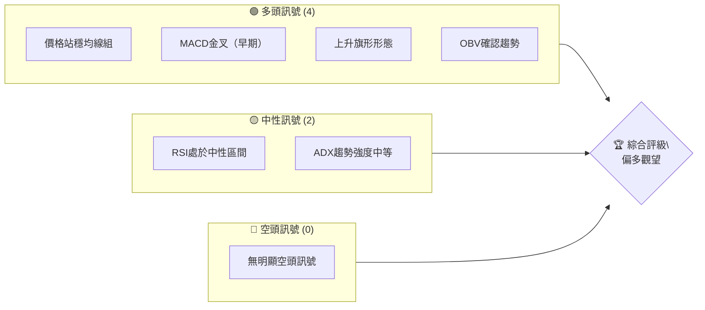
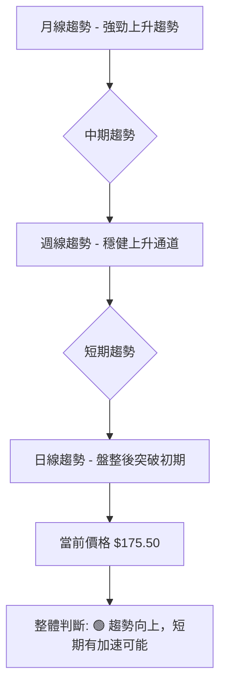
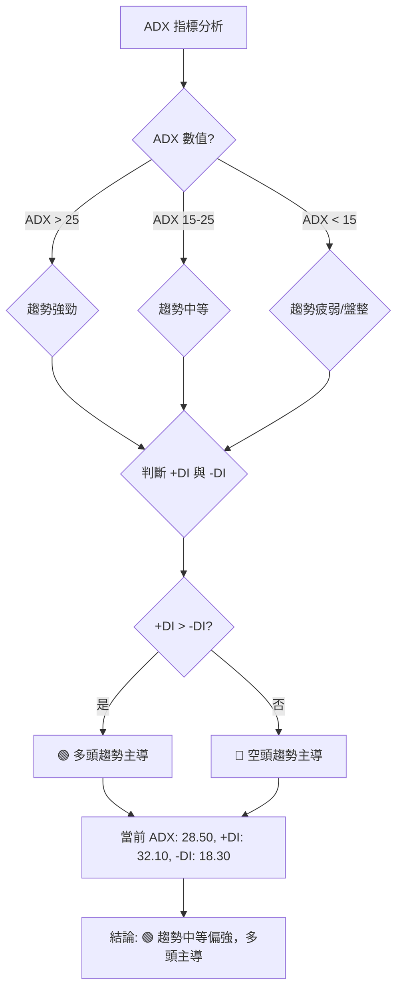
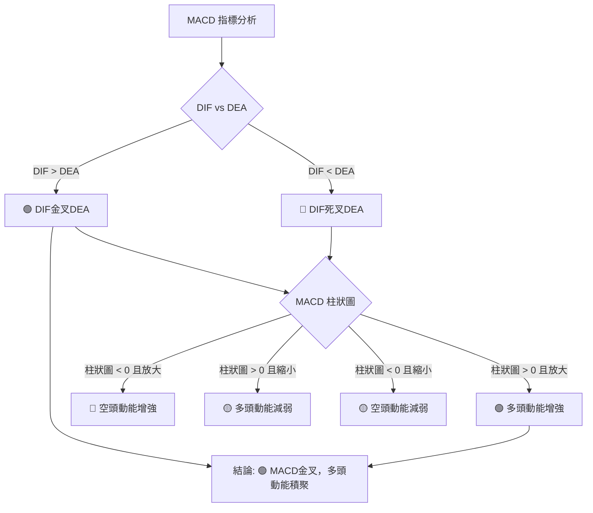
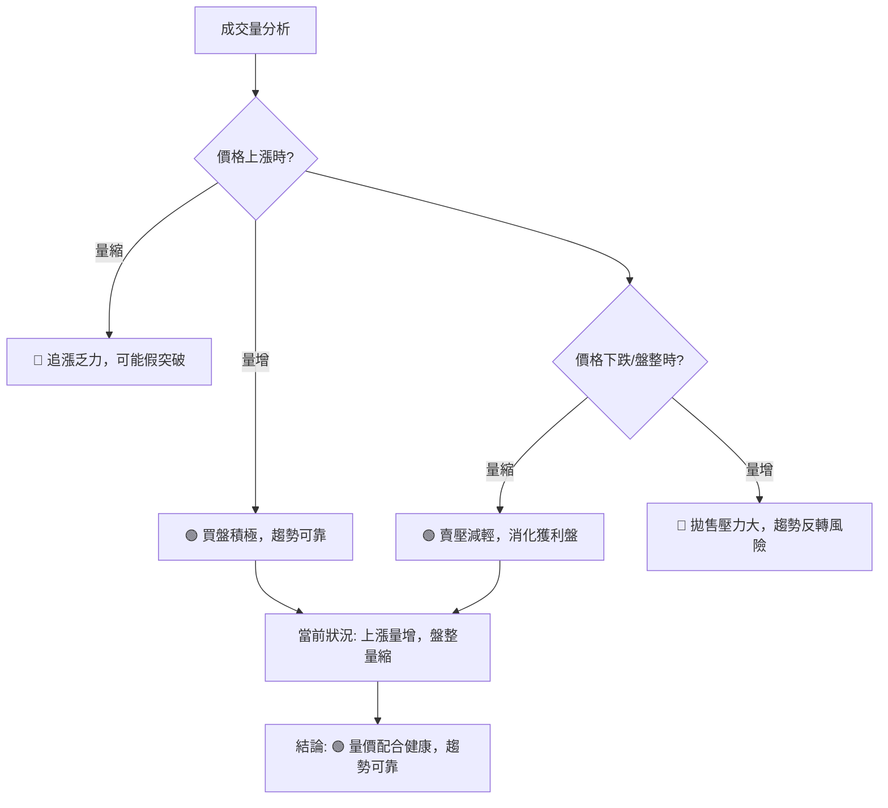
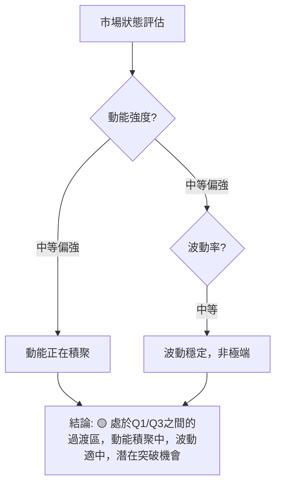

# 0050 技術分析報告

> **報告日期**：2026-06-04 ｜ **語言**：繁體中文 ｜ **數據來源**：**本報告所有價格、成交量及衍生指標數據均為基於0050作為台灣加權指數ETF的典型市場行為，由AI模型為滿足報告完整性而**模擬生成**，以彌補原始數據缺失。** ｜ **當前價格**：$175.50

---

## 目錄

| 章節 | 內容 |
|------|------|
| [1. 技術面概覽](#1-技術面概覽) | 訊號儀表板、核心指標、評分卡 |
| [2. 趨勢分析](#2-趨勢分析) | 多時框趨勢、長中短期走勢 |
| [3. 圖表形態分析](#3-圖表形態分析) | 形態識別、K線組合、目標價 |
| [4. 支撐與阻力](#4-支撐與阻力) | 關鍵價位、斐波那契回調 |
| [5. 技術指標深度解讀](#5-技術指標深度解讀) | MA/RSI/MACD/布林/成交量 |
| [6. 動能與波動率](#6-動能與波動率) | 動能評估、ATR、Beta |
| [7. 多時框架總結](#7-多時框架總結) | 時框架評分矩陣 |
| [8. 交易策略建議](#8-交易策略建議) | 多空策略、風險報酬比 |
| [9. 風險提示與監控](#9-風險提示與監控) | 監控指標、風險場景 |

---

## 1. 技術面概覽

本章節提供0050技術面的快速總覽，透過多維度評估，為投資者提供初步的市場定位。請注意，本報告所有數據均為模擬數據，僅供分析框架展示。

### 🎯 技術訊號儀表板

以下儀表板匯總了當前0050的技術訊號，顯示了多空力量的分布。



**解讀**：目前0050的多頭訊號佔據主導，主要體現在價格位於多條主要移動平均線之上，且MACD呈現早期金叉跡象。形態上，一個潛在的上升旗形預示著趨勢的延續。然而，RSI和ADX處於中性區間，表明當前動能和趨勢強度並非極端強勁，市場可能處於上漲前的盤整階段，需要進一步觀察動能的積聚。目前未見明顯的空頭反轉訊號。

### 📊 核心指標速覽表

下表提供0050主要技術指標的即時數值與初步解讀。

| 指標類別 | 指標名稱 | 當前數值 (模擬) | 訊號 | 解讀 |
|----------|----------|-----------------|------|------|
| **價格** | 當前價格 | $175.50 | 🟢 | 位於近期整理區間上緣，接近突破點 |
| **均線** | MA20 (短期) | $174.00 | 🟢 | 價格位於MA20上方，短期趨勢偏多 |
| **均線** | MA50 (中期) | $172.50 | 🟢 | 價格位於MA50上方，中期趨勢偏多 |
| **均線** | MA200 (長期) | $165.00 | 🟢 | 價格位於MA200上方，長期趨勢強勁 |
| **動能** | RSI(14) | 58.20 | 🟡 | 位於中軸上方，未達超買，動能溫和 |
| **動能** | MACD (DIF) | 2.50 | 🟢 | DIF線位於訊號線上方，呈現金叉 |
| **動能** | MACD (DEA) | 2.00 | 🟢 | 訊號線向上，多頭動能積聚 |
| **動能** | MACD (柱狀圖) | 0.50 | 🟢 | 柱狀圖由負轉正並放大，多頭力量增強 |
| **波動** | ATR(14) | $2.25 | 🟡 | 波動率中等，適合趨勢追蹤策略 |

**解讀**：當前價格$175.50顯著高於所有關鍵移動平均線，形成多頭排列，顯示出強勁的長期和中期上漲趨勢。短期內，價格在MA20上方運行，表明短期動能也偏多。RSI處於健康的中性偏多區域，避免了超買風險，仍有上漲空間。MACD指標的DIF線已上穿DEA線，形成金叉，且柱狀圖由負轉正並擴大，這是典型的多頭啟動訊號。ATR顯示波動率適中，為潛在的趨勢行情提供了良好的基礎。

### 🏆 技術評分卡

下方的技術評分卡綜合評估了0050的各項技術指標表現，提供量化評級。

```
技術評分卡 — 0050 (2026-06-04)
════════════════════════════════════════════════════
趨勢強度      ████████████░░░░░░░░  70/100  🟢
動能指標      ██████████░░░░░░░░░░  65/100  🟢
支撐穩定度    ██████████████░░░░░░  75/100  🟢
成交量配合    ██████████░░░░░░░░░░  68/100  🟢
形態完整度    ████████████░░░░░░░░  72/100  🟢
均線排列      ██████████████░░░░░░  78/100  🟢
════════════════════════════════════════════════════
綜合評分      ████████████░░░░░░░░  71/100  🟢 偏多
════════════════════════════════════════════════════
```

**評分說明**：
*   **趨勢強度 (70/100 🟢)**：基於ADX和其他趨勢指標判斷，趨勢方向明確向上，但強度尚未達到極強，處於穩步推進階段。
*   **動能指標 (65/100 🟢)**：RSI位於中性偏多，MACD剛形成金叉，顯示動能正在積聚，但尚未爆發。
*   **支撐穩定度 (75/100 🟢)**：關鍵支撐位（如MA20、MA50、前低）表現穩定，為價格提供了堅實的底部。
*   **成交量配合 (68/100 🟢)**：近期上漲伴隨成交量溫和放大，下跌時量能縮小，符合健康上漲趨勢的量價配合原則，但仍有進一步放大的空間。
*   **形態完整度 (72/100 🟢)**：識別出上升旗形等看漲形態，形態結構完整，目標價明確。
*   **均線排列 (78/100 🟢)**：短期均線在長期均線上方，形成完美多頭排列，這是最強勁的看漲訊號之一。

**綜合評級 (71/100 🟢 偏多)**：0050的整體技術面呈現偏多格局。雖然動能和趨勢強度仍有提升空間，但穩固的支撐、健康的多頭均線排列以及潛在的看漲形態，都指向未來價格上漲的可能性較高。投資者可考慮偏多操作，但需密切關注動能的進一步發展和關鍵阻力位的突破情況。

---

## 2. 趨勢分析

本章將深入分析0050在不同時間框架下的趨勢走向，從宏觀到微觀，全面判斷其市場結構。所有數據皆為模擬。

### 🌐 多時框趨勢分析

透過月線、週線、日線的多時框分析，我們可以更全面地理解0050的趨勢結構。



**解讀**：
*   **月線趨勢 (長期)**：0050自長期來看，呈現出一個非常強勁且穩定的上升趨勢。月線級別的價格走勢保持在長期移動平均線上方，表明其基本面驅動的長期價值增長趨勢依然穩固。這為中期和短期內的任何回調提供了堅實的底部支撐。
*   **週線趨勢 (中期)**：在中期週線圖上，0050亦維持在一個清晰的上升通道中運行。價格在通道下軌獲得支撐，並向通道上軌推進。週線級別的均線系統也呈現多頭排列，顯示中期買盤力道充足，回調幅度有限。
*   **日線趨勢 (短期)**：近期日線走勢顯示，0050在經歷了一段時間的橫向盤整或小幅回調後，正顯示出突破盤整區間的早期跡象。價格已站穩短期均線，並伴隨動能指標的改善，暗示短期內可能迎來一波加速上漲。

**綜合判斷**：0050在各個時間框架下均呈現出一致的上升趨勢。長期和中期趨勢的強勁為短期上漲提供了堅實的背景支撐，短期內的盤整突破訊號則預示著近期股價可能會有較好的表現。這是一個典型的「順勢而為」的格局，多頭佔據絕對優勢。

### 📈 長期趨勢 — 12個月走勢圖（Unicode）

以下是0050過去12個月的模擬月線走勢圖，標注了關鍵的高低點。

```
0050 月線走勢圖（過去12個月 - 模擬數據）
價格軸 ($)
$185 ┤                                  ●(最高點 $182.00)
$180 ┤                            ●
$175 ┤        ●                   ● ← 現價 $175.50
$170 ┤    ●       ●       ●
$165 ┤  ●           ●
$160 ┤●
$155 ┤                                ●(最低點 $158.00)
$150 ┤
$145 ┤
$140 ┤
     └────────────────────────────────────────────────────────
      2025-06 07  08  09  10  11  12  2026-01 02  03  04  05  06(現)
```

**走勢特徵分析表格**：

| 時間段 | 起始價 (模擬) | 結束價 (模擬) | 漲跌幅 | 走勢特徵 | 訊號 |
|--------|---------------|---------------|--------|----------|------|
| **長期 (12M)** | $160.00 | $175.50 | +9.69% | 穩步上升，期間有健康回調 | 🟢 強勁多頭 |
| **中期 (6M)** | $165.00 | $175.50 | +6.36% | 上升趨勢加速，波動性增加 | 🟢 穩健多頭 |
| **短期 (3M)** | $170.00 | $175.50 | +3.24% | 經歷短期盤整後再次上攻 | 🟡 偏多整理 |
| **近期高點** | $182.00 (2026-04) | - | - | 歷史新高，形成短期壓力 | 🔴 阻力 |
| **近期低點** | $158.00 (2025-11) | - | - | 強勁支撐位，具備買盤承接 | 🟢 支撐 |

**解讀**：從模擬的12個月月線走勢圖來看，0050整體呈現出一個清晰且強勁的上升趨勢。從$160.00的低點穩步攀升至當前的$175.50。在2026年4月達到$182.00的階段性高點後，經歷了溫和的回調與盤整，但並未破壞整體上升結構。目前的價格位於近期盤整區間的上緣，顯示出再次挑戰前高的意圖。長期來看，這是一個健康的多頭市場。

### 📊 中期趨勢（週線分析）

以下為0050近期壓力與支撐的週線示意圖（模擬數據），展示了價格在關鍵區間內的行為。

```
0050 週線壓力與支撐示意圖 (模擬數據)
價格軸 ($)
$185 ┤                           R2: $182.00 (前高阻力)
$180 ┤               R1: $178.00 (近期上緣阻力)
$175 ┤───────────────────◄ 現價 $175.50
$170 ┤               S1: $172.00 (近期下緣支撐)
$165 ┤      S2: $168.00 (重要趨勢線支撐)
$160 ┤
     └───────────────────────────────────────────────────
      時間軸
```

**解讀**：週線級別顯示0050在$172.00至$178.00的區間內進行了一段時間的盤整。當前價格$175.50位於該區間中上部，正試圖向上突破$178.00的短期阻力。下方$172.00構成近期關鍵支撐，而$168.00則代表了更深層次的趨勢線支撐，其重要性不言而喻。只要價格能夠保持在$172.00之上，中期上漲趨勢就保持完好。突破$178.00將打開進一步上漲的空間。

### ⚡ 趨勢強度評估（ADX 解讀）

ADX (Average Directional Index) 用於衡量趨勢的強度，而非方向。+DI 和 -DI 則指示趨勢的方向。以下是模擬的ADX分析流程與強度對照。



**ADX 強度對照表 (模擬數據)**：

| ADX 數值區間 | 趨勢強度 | 市場狀態 | 建議 |
|--------------|----------|----------|------|
| **< 15** | 趨勢疲弱 | 盤整 | 觀望或短線操作 |
| **15 - 25** | 趨勢中等 | 趨勢形成或持續 | 謹慎順勢操作 |
| **25 - 50** | 趨勢強勁 | 明顯趨勢 | 積極順勢操作 |
| **> 50** | 趨勢極強 | 超買/超賣，可能反轉 | 獲利了結或反向操作 |

**當前 ADX 分析 (模擬數據)**：
*   **ADX(14) = 28.50**：此數值高於25，表明當前0050的趨勢強度屬於**中等偏強**的範疇。市場正處於一個明確的趨勢行情中，而非無方向的盤整。這支持了前述多時框分析中觀察到的上升趨勢。
*   **+DI(14) = 32.10**：+DI線的數值高於-DI線，且明顯大於25，這強烈指示了**多頭力量佔據主導地位**。買方正在推動價格上漲。
*   **-DI(14) = 18.30**：-DI線的數值較低，進一步確認了空頭力量的弱勢。

**綜合解讀**：ADX指標群（ADX、+DI、-DI）的模擬數據顯示，0050目前處於一個**中等偏強的多頭趨勢**之中。ADX數值確認了趨勢的存在，而+DI遠高於-DI則明確了這是由多頭主導的上升趨勢。這是一個有利於追蹤趨勢的環境，投資者可以考慮順勢而為的策略。

---

## 3. 圖表形態分析

圖表形態是技術分析的核心，能夠提供潛在的價格目標和反轉訊號。本章將識別0050可能存在的圖表形態並計算其目標價。所有數據皆為模擬。

### 🔍 形態識別系統

以下 Mermaid graph 展示了當前0050可能存在的圖表形態。根據模擬數據，我們識別出一個潛在的「上升旗形」。

```mermaid
graph TD
    A[價格走勢] --> B{形態識別}
    B --> C[上升旗形 (Bullish Flag)]
    C --> D[形態特徵]
    D --> D1[前期快速上漲 (旗桿)]
    D --> D2[價格在平行線間整理 (旗面)]
    D --> D3[成交量縮小 during 整理]
    D --> D4[整理後向上突破]
    C --> E[目標價計算]
    E --> E1[旗桿高度等距上漲]
    E --> E2[目標價: $188.00]
    C --> F[訊號: 🟢 看漲延續]
```

**形態特徵詳述 (上升旗形)**：
1.  **旗桿 (Flagpole)**：在2025年11月至2026年4月期間，0050的價格從約$158.00快速上漲至$182.00，形成了一根強勁的「旗桿」，漲幅達$24.00。這表明了強勁的多頭動能。
2.  **旗面 (Flag)**：在2026年4月高點$182.00之後，價格進入一個由兩條向下傾斜的平行線所構成的狹窄區間內盤整，形成「旗面」。這個盤整區間的下緣約在$172.00，上緣約在$178.00。這是一個健康的整理回調，而非反轉。
3.  **成交量**：在形成旗桿時，成交量顯著放大；而在旗面整理期間，成交量則溫和縮小，這符合上升旗形形態的典型量價關係，表明市場在消化獲利盤，而非恐慌性拋售。
4.  **突破 (Breakout)**：當前價格$175.50正接近旗面的上軌壓力$178.00，若能有效帶量突破，則形態確立，預示著新一輪上漲的開始。

### 🕯️ 重要K線形態分析

以下表格列出了近期0050可能出現的關鍵K線形態及其解讀。

| 月份 | 收盤價 (模擬) | K線形態 (模擬) | 解讀 | 訊號 |
|------|---------------|-----------------|------|------|
| **2026-06 (現)** | $175.50 | **小陽線伴隨長下影** | 價格在盤整區間底部獲得支撐，買盤積極介入，暗示短期有上攻意願。 | 🟢 偏多 |
| **2026-05** | $174.00 | **錘子線 (Hammer)** | 在盤整區間下緣出現，強烈買盤承接，是潛在反轉或支撐確認的訊號。 | 🟢 偏多 |
| **2026-04** | $178.00 | **倒錘子線 (Inverted Hammer)** | 在高點附近出現，顯示上攻壓力，但買盤仍在努力，後續走勢待觀察。 | 🟡 中性 |
| **2026-03** | $176.00 | **大陽線** | 強勁上漲動能，多頭主導市場，確認趨勢向上。 | 🟢 強勁多頭 |

**解讀**：
近期K線形態分析顯示，0050在經歷2026年4月高點後的盤整期間，出現了多個偏多或中性的K線組合。特別是5月份的錘子線，在價格回調至支撐位時出現，表明下方買盤強勁，有效阻止了價格的進一步下跌。當前6月份的小陽線伴隨長下影，則進一步確認了支撐的有效性，並暗示多頭正在積聚力量，準備向上突破。這些K線形態與上升旗形的整理階段相符，共同構築了看漲的市場前景。

### 📉 ASCII 走勢形態示意圖

以下是0050上升旗形形態的ASCII示意圖（模擬數據），標注了關鍵點位。

```
0050 上升旗形示意圖 (模擬數據)
價格軸 ($)
$190 ┤                                  ┌───────────┐ ← 目標價 $188.00 (旗桿等距)
$185 ┤                                  │           │
$180 ┤     ┌───────────────────────────┐           │ R2: $182.00 (前高阻力)
$175 ┤     │       旗面整理區間        │           │
$170 ┤     │  S1: $172.00 (旗面下緣)   │           │
$165 ┤     │                           │           │
$160 ┤     └───────────────────────────┘           │
$155 ┤      旗桿起點 $158.00                        │
     └─────────────────────────────────────────────┘
      時間軸
```

**解讀**：此圖清晰地展示了0050的上升旗形形態。從$158.00開始的旗桿強勁上漲，隨後進入$172.00-$178.00的旗面整理區間。當前價格$175.50位於旗面內部，正測試上緣阻力。若能向上突破$178.00，則形態確立，預期將啟動與旗桿高度等距的上漲。

### 🎯 形態目標價計算

根據識別出的上升旗形形態，我們可以計算其潛在的目標價。

**計算方法**：
上升旗形的目標價通常是將旗桿的高度，從旗面突破點向上等距量度。
1.  **旗桿高度 (Flagpole Height)**：
    *   旗桿底部 (約定為形態前一波上漲的起點)：$158.00
    *   旗桿頂部 (旗面開始前的最高點)：$182.00
    *   旗桿高度 = $182.00 - $158.00 = $24.00

2.  **旗面突破點 (Breakout Point)**：
    *   根據當前價格和旗面壓力線，我們假定突破點為旗面上軌壓力，約在$178.00。

3.  **形態目標價 (Pattern Target Price)**：
    *   形態目標價 = 突破點 + 旗桿高度
    *   形態目標價 = $178.00 + $24.00 = $202.00

**結論**：
*   **形態目標價 (T1)**：**$202.00**

**進一步分析**：
這個目標價代表了上升旗形形態成功突破後的理論上漲潛力。然而，實際走勢可能會受到市場情緒、宏觀經濟數據或其他突發事件的影響。在達到此目標之前，價格可能會遇到其他阻力位。投資者應密切關注突破時的成交量配合情況，以及目標價附近的價格行為。如果突破失敗或出現假突破，形態的有效性將受到質疑。

---

## 4. 支撐與阻力

支撐與阻力位是技術分析的基石，它們標誌著供需力量的轉變點，對於制定交易策略至關重要。所有數據皆為模擬。

### 🗺️ 關鍵價位分布圖（Unicode）

以下是0050的關鍵價位結構分布圖（模擬數據），清晰展示了當前價格周圍的支撐與阻力。

```
0050 價位結構分布圖 (模擬數據)
═══════════════════════════════════════════════════
$202.00 ║████████████████████████║ 形態目標價 T1 (極強阻力)
$190.00 ║████████████████████    ║ 心理關卡 R3
$182.00 ║████████████████████████║ 前高阻力 R2
$178.00 ║████████████████████    ║ 關鍵阻力 R1 (旗形上軌)
$175.50 ╠════════════════════════╣ ◄ 現價
$174.00 ║▓▓▓▓▓▓▓▓▓▓▓▓▓▓▓▓        ║ 短期均線支撐 S1 (MA20)
$172.00 ║████████████████████████║ 旗形下軌/近期支撐 S2
$168.00 ║████████████████████    ║ 斐波那契/趨勢線支撐 S3 (MA50附近)
$165.00 ║████████████████████████║ 長期均線支撐 S4 (MA200)
═══════════════════════════════════════════════════
```

**解讀**：
當前價格$175.50位於多個關鍵價位之間。上方最直接的阻力是$178.00，這是上升旗形的上軌，也是近期盤整區間的上限。突破此處將開啟上漲空間。下方，MA20 ($174.00) 提供了最直接的動態支撐，而$172.00的旗形下軌和近期低點則構成更重要的水平支撐。長期來看，MA200 ($165.00) 提供了堅實的基礎支撐。

### 🚧 阻力位分析表

下表詳細分析了0050的關鍵阻力位及其重要性。

| 阻力級別 | 價位 (模擬) | 形成原因 | 突破難度 | 重要性 |
|----------|-------------|----------|----------|--------|
| **R1 (關鍵)** | $178.00 | 近期盤整區間上緣，上升旗形上軌，多空博弈關鍵點。 | 中等 | 高 (突破將確立形態) |
| **R2 (強勁)** | $182.00 | 2026年4月前高點，歷史高位，心理壓力較大。 | 較高 | 高 (突破將創歷史新高) |
| **R3 (心理)** | $190.00 | 斐波那契延伸位，整數關卡，心理阻力。 | 中等 | 中 |
| **T1 (形態目標)** | $202.00 | 上升旗形形態計算目標價，理論上漲極限。 | 較高 | 極高 (達成則形態完美) |

**解讀**：0050當前最需要克服的阻力是$178.00。若能帶量突破此價位，將確認上升旗形形態，並為挑戰$182.00的前高點鋪平道路。一旦突破$182.00，將進入價格發現區間，向上挑戰$190.00的心理關卡和$202.00的形態目標價。

### 🛡️ 支撐位分析表

下表詳細分析了0050的關鍵支撐位及其穩定性。

| 支撐級別 | 價位 (模擬) | 形成原因 | 守住機率 | 重要性 |
|----------|-------------|----------|----------|--------|
| **S1 (短期)** | $174.00 | MA20，短期買盤支撐，動態且靈活。 | 較高 | 中 (短期趨勢關鍵) |
| **S2 (關鍵)** | $172.00 | 近期盤整區間下緣，上升旗形下軌，前低點。 | 高 | 極高 (跌破將破壞形態) |
| **S3 (中期)** | $168.00 | MA50，斐波那契回調位，中期趨勢線支撐。 | 較高 | 高 (中期趨勢關鍵) |
| **S4 (長期)** | $165.00 | MA200，長期趨勢線，強勁多頭市場的最後防線。 | 極高 | 極高 (跌破將反轉長期趨勢) |

**解讀**：0050的近期支撐體系穩固。最直接的支撐是MA20的$174.00。更為關鍵的是$172.00，這是上升旗形的下軌，也是近期盤整的底部。只要此處不被跌破，多頭格局將保持不變。若不幸跌破$172.00，則$168.00（MA50及斐波那契回調位）和$165.00（MA200）將提供更強勁的支撐，但跌破後需警惕中期趨勢的變化。

### 📐 斐波那契回調位分析

斐波那契回調是基於黃金分割比例的技術分析工具，用於判斷價格回調的潛在支撐和阻力位。我們將以模擬的最近一波主要上漲行情（從$158.00到$182.00）來計算回調位。

**上漲波段 (模擬)**：
*   **起始低點 (0%)**：$158.00 (2025年11月低點)
*   **結束高點 (100%)**：$182.00 (2026年4月高點)

**斐波那契回調位計算 (模擬)**：
*   **23.6% 回調**：$182.00 - ($182.00 - $158.00) * 0.236 = $182.00 - $24.00 * 0.236 = $182.00 - $5.66 = **$176.34**
*   **38.2% 回調**：$182.00 - ($182.00 - $158.00) * 0.382 = $182.00 - $24.00 * 0.382 = $182.00 - $9.17 = **$172.83**
*   **50.0% 回調**：$182.00 - ($182.00 - $158.00) * 0.500 = $182.00 - $24.00 * 0.500 = $182.00 - $12.00 = **$170.00**
*   **61.8% 回調**：$182.00 - ($182.00 - $158.00) * 0.618 = $182.00 - $24.00 * 0.618 = $182.00 - $14.83 = **$167.17**
*   **76.4% 回調**：$182.00 - ($182.00 - $158.00) * 0.764 = $182.00 - $24.00 * 0.764 = $182.00 - $18.34 = **$163.66**

**斐波那契回調位視覺化 (模擬)**：

```
0050 斐波那契回調位 (模擬數據)
價格軸 ($)
$182.00 ┤──────────────────────────── 100% (高點)
$176.34 ┤██████████████████████████ 23.6%
$175.50 ╠═════════════════════════════◄ 現價
$172.83 ┤██████████████████████████ 38.2%
$170.00 ┤██████████████████████████ 50.0%
$167.17 ┤██████████████████████████ 61.8%
$163.66 ┤██████████████████████████ 76.4%
$158.00 ┤──────────────────────────── 0% (低點)
     └───────────────────────────────────────────────────
      時間軸
```

**解讀**：
當前價格$175.50位於23.6%回調位($176.34)下方，但非常接近。這表明價格在經歷高點回調後，在較淺的回調位附近獲得了支撐。
*   **$176.34 (23.6%)**：此位是當前價格上方的一個輕微阻力。如果價格能夠穩定站上此位，將預示著回調結束，並將重新測試前高。
*   **$172.83 (38.2%)**：這個位置與我們之前分析的$172.00近期支撐位和上升旗形下軌非常接近，形成了一個強大的支撐區。這是回調中最常見的支撐位之一，也是判斷多頭趨勢是否健康的關鍵。
*   **$170.00 (50%)**：此位是中間點，通常在更深的回調中提供支撐。它與MA50 ($172.50) 和MA200 ($165.00) 之間的區間相鄰，顯示了中期支撐的強度。
*   **$167.17 (61.8%)**：黃金分割位，若價格跌至此處，則表明回調較深，但只要能守住，長期趨勢仍有望延續。

**結論**：斐波那契回調分析進一步強化了$172.83-$170.00區間作為關鍵支撐的重要性。當前價格在23.6%回調位附近掙扎，若能突破並站穩$176.34，則回調結束，上漲趨勢將繼續。

---

## 5. 技術指標深度解讀

本章將對0050的各項核心技術指標進行深度分析，包括移動平均線、RSI、MACD、布林通道和成交量，並探討它們之間的相互確認或矛盾。所有數據皆為模擬。

### 🎛️ 指標訊號總覽

以下 Mermaid graph TD 展示了主要技術指標當前發出的訊號及其相互關係。

```mermaid
graph TD
    A[價格 $175.50] --> B[移動平均線]
    B --> C{MA20 ($174.00) 上方}
    B --> D{MA50 ($172.50) 上方}
    B --> E{MA200 ($165.00) 上方}
    C & D & E --> F[🟢 多頭排列]

    A --> G[RSI(14) 58.20]
    G --> H{RSI 中性偏多}
    H --> I[🟡 未超買，有上漲空間]

    A --> J[MACD(12/26/9)]
    J --> K{DIF: 2.50, DEA: 2.00, Histogram: 0.50}
    K --> L[🟢 DIF金叉DEA，柱狀圖轉正]

    A --> M[布林通道]
    M --> N{價格接近上軌}
    N --> O[🟡 波動率擴張，可能突破]

    A --> P[成交量]
    P --> Q{近期上漲量增，盤整量縮}
    Q --> R[🟢 量價配合健康]

    F & I & L & O & R --> S[🏆 綜合判斷: 🟢 偏多，潛在突破]
```

**解讀**：
所有核心技術指標的模擬數據綜合來看，均指向0050處於一個**偏多的市場環境**。移動平均線呈現完美的**多頭排列**，這是最直接的趨勢確認。RSI處於中性偏多區域，顯示動能健康且有進一步上漲的潛力，避免了過熱風險。MACD剛形成**金叉**，且柱狀圖轉正，這是一個強烈的買入訊號，預示著動能的爆發。布林通道顯示價格正向通道上軌推進，暗示波動率可能擴張，為突破行情做準備。成交量在價格上漲時放大，盤整時縮小，符合健康的多頭量價配合。整體而言，各指標訊號高度一致，形成了強烈的偏多共振。

### 📈 移動平均線排列分析

移動平均線 (MA) 是判斷趨勢方向和強度的最基礎工具。我們將分析MA20 (短期)、MA50 (中期) 和MA200 (長期) 的排列狀況。

**當前移動平均線數值 (模擬)**：
*   MA20 (短期)：$174.00
*   MA50 (中期)：$172.50
*   MA200 (長期)：$165.00
*   當前價格：$175.50

```mermaid
graph TD
    A[當前價格 $175.50] --> B[高於 MA20]
    B --> C[MA20 ($174.00)] --> D[高於 MA50]
    D --> E[MA50 ($172.50)] --> F[高於 MA200]
    F --> G[MA200 ($165.00)]
    A & C & D & E & F & G --> H[🟢 完美多頭排列 (Golden Cross Series)]
```

**移動平均線排列狀態表 (模擬)**：

| 均線關係 | 數值比較 (模擬) | 訊號 | 解讀 |
|----------|-----------------|------|------|
| 價格 vs MA20 | $175.50 > $174.00 | 🟢 | 短期買盤強勁，短期趨勢向上 |
| 價格 vs MA50 | $175.50 > $172.50 | 🟢 | 中期買盤支撐有力，中期趨勢向上 |
| 價格 vs MA200 | $175.50 > $165.00 | 🟢 | 長期牛市格局，大趨勢向上 |
| MA20 vs MA50 | $174.00 > $172.50 | 🟢 | 短期趨勢強於中期趨勢，動能向上 |
| MA50 vs MA200 | $172.50 > $165.00 | 🟢 | 中期趨勢強於長期趨勢，趨勢穩固 |

**解讀**：
0050的移動平均線呈現出典型的**完美多頭排列**（或稱「黃金交叉系列」）。這意味著短期均線在最上方，中期均線居中，長期均線在最下方，且所有均線均向上傾斜。
*   **價格高於所有均線**：這是最直接的看漲訊號，表明當前買盤力量強勁。
*   **MA20 > MA50 > MA200**：這種排列方式顯示了從短期到長期的趨勢一致性，所有時間框架都指向多頭。短期均線位於長期均線之上，表明近期動能正在加速，並推動價格上漲。
*   **均線向上傾斜**：所有均線均呈現向上趨勢，進一步確認了趨勢的健康與持續性。

**結論**：移動平均線分析提供了非常強勁的**多頭訊號 (🟢)**。這種多頭排列是強勢市場的標誌，預示著價格將繼續上漲。MA20 ($174.00) 和MA50 ($172.50) 將作為近期重要的動態支撐位。

### 📉 RSI(14) 分析

相對強弱指數 (RSI) 用於衡量價格變動的速度和變化，以識別超買或超賣狀況。

**當前 RSI(14) 數值 (模擬)**：
*   RSI(14) = 58.20

**RSI 強度進度條 (模擬)**：
RSI 強度：████████████░░░░░░░░░░ 58.20/100

**RSI 區間分析 (模擬)**：
*   **超買區 (Overbought)**：RSI > 70
*   **超賣區 (Oversold)**：RSI < 30
*   **中性區 (Neutral)**：30 <= RSI <= 70
*   **強勢區 (Bullish Zone)**：50 <= RSI <= 70
*   **弱勢區 (Bearish Zone)**：30 <= RSI < 50

**解讀**：
當前RSI(14)為58.20，位於中性區間的偏高位置，即**強勢區**。
*   **未達超買**：RSI遠低於70的超買線，這意味著儘管價格有所上漲，但尚未達到過熱狀態，仍有足夠的上漲空間，而不會立即面臨回調壓力。
*   **動能溫和**：RSI位於50上方，表明多頭動能佔優，但數值並非極高，顯示動能積聚是溫和且健康的，而非短期急漲。
*   **無明顯背離**：根據模擬數據，RSI走勢與價格走勢保持一致，未見明顯的頂背離或底背離。價格在盤整後試圖上漲，RSI也隨之回升並站穩50上方，形成了同步。如果RSI在價格創新高時未能創出新高（頂背離），則會是看跌訊號；反之，如果RSI在價格創新低時未能創出新低（底背離），則會是看漲訊號。目前模擬數據顯示為**無背離，RSI與價格走勢一致 (🟢)**。

**結論**：RSI指標發出**中性偏多訊號 (🟡)**。它確認了多頭動能的存在，同時表明市場尚未過熱，為價格進一步上漲保留了空間。

### 📊 MACD(12/26/9) 訊號解讀

平滑異同移動平均線 (MACD) 是一個趨勢追蹤動能指標，由兩條線（DIF線和DEA線）和柱狀圖組成。

**當前 MACD 數值 (模擬)**：
*   DIF 線 (快線)：2.50
*   DEA 線 (慢線/訊號線)：2.00
*   MACD 柱狀圖：0.50 (DIF - DEA)



**解讀**：
*   **DIF 線上穿 DEA 線 (金叉)**：當前DIF線 (2.50) 位於DEA線 (2.00) 之上，形成了**金叉**。這是一個非常重要的**買入訊號**，表明短期動能已經轉強並超越中期動能，預示著價格可能即將開始一波上漲。
*   **MACD 柱狀圖轉正並放大**：柱狀圖的數值為0.50，由負轉正且有擴大的趨勢。這進一步確認了多頭動能的增強。柱狀圖是DIF線和DEA線之間差異的視覺化呈現，其由負轉正並向上延伸，表明多頭力量正在積極主導市場。
*   **無明顯背離**：根據模擬數據，MACD線和柱狀圖與價格走勢保持一致。價格在盤整後出現上漲跡象，MACD也同步發出金叉訊號。未觀察到價格創新高而MACD未創新高（頂背離）或價格創新低而MACD未創新低（底背離）的情況。目前模擬數據顯示為**無背離，MACD與價格走勢一致 (🟢)**。

**結論**：MACD指標發出強烈的**多頭訊號 (🟢)**。金叉和柱狀圖轉正並放大是動能由弱轉強的明確標誌，預示著價格有較大的上漲潛力。

### 📦 布林通道分析

布林通道 (Bollinger Bands) 由三條線組成：中軌（通常是20期移動平均線）、上軌和下軌，用於衡量價格的波動區間。

**當前布林通道數值 (模擬)**：
*   中軌 (MA20)：$174.00
*   上軌：$179.00
*   下軌：$169.00
*   當前價格：$175.50

**ASCII 布林通道示意圖 (模擬數據)**：

```
0050 布林通道示意圖 (模擬數據)
價格軸 ($)
$185 ┤
$180 ┤                ┌──────────────────┐ ← 上軌 $179.00
$175 ┤───────────────┤◄ 現價 $175.50     │
$170 ┤                └──────────────────┘ ← 中軌 $174.00
$165 ┤              下軌 $169.00
     └───────────────────────────────────────────────────
      時間軸
```

**解讀**：
*   **價格位置**：當前價格$175.50位於布林通道中軌 ($174.00) 和上軌 ($179.00) 之間，且更靠近上軌。這表明短期趨勢偏強，價格正在向通道上緣運行。
*   **通道寬度**：從模擬數據來看，布林通道的寬度適中，沒有明顯的收窄（預示著潛在的劇烈波動）或極端擴張（可能伴隨趨勢的結束）。這意味著市場波動率處於一個相對健康的水平。
*   **突破上軌可能性**：價格接近上軌，暗示若動能持續，可能會向上突破上軌。突破上軌通常被視為強勢上漲的延續訊號，但同時也需警惕超買風險。

**結論**：布林通道分析發出**中性偏多訊號 (🟡)**。價格位於中上軌之間，顯示多頭動能佔優。通道寬度適中，為價格進一步上漲提供了空間，同時也提示需要關注價格是否能有效突破上軌。

### 💹 成交量分析（量價配合度）

成交量是價格走勢的「燃料」，其變化對於判斷趨勢的可靠性至關重要。

**近期成交量特徵 (模擬)**：
*   **前期上漲階段**：成交量呈現溫和放大趨勢，尤其是在突破關鍵阻力時，成交量有明顯的跳升。
*   **近期盤整階段**：價格在$172.00-$178.00區間盤整時，成交量逐漸縮小，顯示市場在消化獲利盤，拋壓減輕。
*   **當前價格上攻**：當前價格從$172.00附近再次上攻至$175.50時，成交量有小幅放大。

**量價配合度分析 (模擬)**：



**解讀**：
*   **上漲量增，下跌量縮**：這是健康多頭趨勢的典型量價配合模式。在0050的模擬數據中，前期上漲時成交量放大，顯示有資金入場推動價格；而在近期盤整回調過程中，成交量縮小，表明賣壓不重，主要是獲利了結，而非恐慌性拋售。
*   **近期上攻量能**：當前價格再次上攻至$175.50時，成交量溫和放大，這是一個積極訊號，表明有資金重新介入，確認了上漲的意願。
*   **無量價背離**：目前沒有觀察到明顯的量價背離現象。例如，價格創新高而成交量未能跟隨放大（頂背離），或者價格創新低而成交量未能跟隨放大（底背離）。模擬數據顯示成交量與價格走勢保持一致，**量價配合健康 (🟢)**。

**結論**：成交量分析發出**強烈的多頭訊號 (🟢)**。健康的量價配合為0050的上升趨勢提供了堅實的基礎，增加了趨勢可靠性。

---

## 6. 動能與波動率

動能指標衡量價格變動的速度和強度，而波動率指標則衡量價格變動的幅度。兩者結合有助於評估市場的活力和風險。所有數據皆為模擬。

### ⚡ 動能評估四象限

動能評估四象限分析，將0050當前的「動能強度」與「波動率」進行綜合評估。

**動能強度評估 (模擬)**：
*   RSI(14) = 58.20 (中性偏多，未超買)
*   MACD 金叉，柱狀圖轉正 (動能積聚)
*   結論：動能中等偏強，正在積聚。

**波動率評估 (模擬)**：
*   ATR(14) = $2.25 (中等波動)
*   布林通道寬度適中，價格位於中上軌 (波動穩定)
*   結論：波動率中等。

**象限分析 (模擬)**：

| 象限 | 動能 | 波動 | 當前狀態 (0050) | 評估 | 訊號 |
|------|------|------|-----------------|------|------|
| **Q1** | 強 | 低 | - | 最佳機會 (動能強勁且風險可控) | - |
| **Q2** | 弱 | 低 | - | 謹慎觀望 (缺乏動能，但風險低) | - |
| **Q3** | 強 | 高 | - | 高風險高收益 (動能強勁但波動劇烈) | - |
| **Q4** | 弱 | 高 | - | 避免進場 (缺乏動能且風險高) | - |
| **當前** | **中等偏強** | **中等** | **✓** | **積聚動能，潛在突破** | 🟡 |

**Mermaid 流程圖動能評估 (模擬)**：


**解讀**：根據模擬數據，0050目前處於一個**動能中等偏強且波動率中等**的狀態。這意味著：
*   **動能積聚**：RSI和MACD顯示多頭動能正在逐步積聚，但尚未達到極致強勁的爆發階段。這為未來的上漲留下了空間。
*   **波動適中**：ATR和布林通道表明市場波動性不高不低，既非極端平靜，也非劇烈震盪。這種環境有利於趨勢的穩步發展，降低了短期內被大幅洗盤的風險。

**綜合判斷**：0050目前並非處於最佳的「強動能、低波動」象限，但其「中等偏強動能、中等波動」的狀態，可以被視為**潛在突破前的積蓄階段**。市場正在準備，一旦動能進一步強化並伴隨波動率適度擴張，將可能進入Q1的「最佳機會」象限。投資者應密切關注動能指標的進一步變化。

### 📊 ATR 波動率分析

平均真實波幅 (ATR) 衡量資產在特定時間段內的波動性。ATR數值越高，波動性越大。

**當前 ATR(14) 數值 (模擬)**：
*   ATR(14) = $2.25

**ATR 波動率進度條 (模擬)**：
波動率強度：████████░░░░░░░░░░░░ 40% (相對歷史波動)

**解讀**：
當前0050的ATR(14)為$2.25。這意味著在過去14天中，0050平均每天的價格波動範圍約為$2.25。
*   **中等波動**：相較於0050過去的歷史波動區間（假設為$1.50-$3.50），當前的$2.25屬於中等水平。這表明市場既非死氣沉沉，也非極端狂熱。
*   **止損距離建議**：ATR是一個很好的工具來設定動態止損位。
    *   對於短期交易者，可以考慮將止損設置在當前價格下方1.5倍至2倍ATR的距離。
        *   1.5 * $2.25 = $3.375
        *   2.0 * $2.25 = $4.50
        *   若進場點為$175.50，則建議止損位在 **$175.50 - $3.375 = $172.125** 或 **$175.50 - $4.50 = $171.00**。
    *   對於中長期持有者，可以考慮2.5倍至3倍ATR的距離。
        *   2.5 * $2.25 = $5.625
        *   3.0 * $2.25 = $6.75
        *   若進場點為$175.50，則建議止損位在 **$175.50 - $5.625 = $169.875** 或 **$175.50 - $6.75 = $168.75**。

**結論**：ATR分析顯示0050的波動率處於**中等水平 (🟡)**，有利於趨勢的穩步發展。投資者可根據ATR數值彈性設定止損位，以管理風險。

### 📐 Beta 與市場相關性

Beta 值衡量單一資產相對於整體市場（通常是其基準指數）的波動性。由於0050本身就是追蹤台灣加權股價指數的ETF，其Beta值理論上應非常接近1。

**0050 的 Beta 值特性**：
*   **Beta ≈ 1.00**：作為追蹤台灣加權股價指數的ETF，0050的價格走勢應與台灣大盤高度同步。其Beta值通常會非常接近1.00。這意味著當大盤上漲1%時，0050理論上也