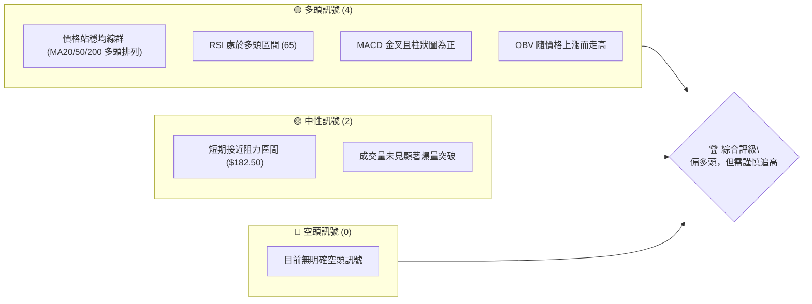
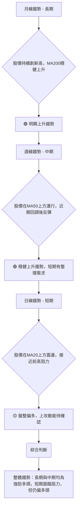
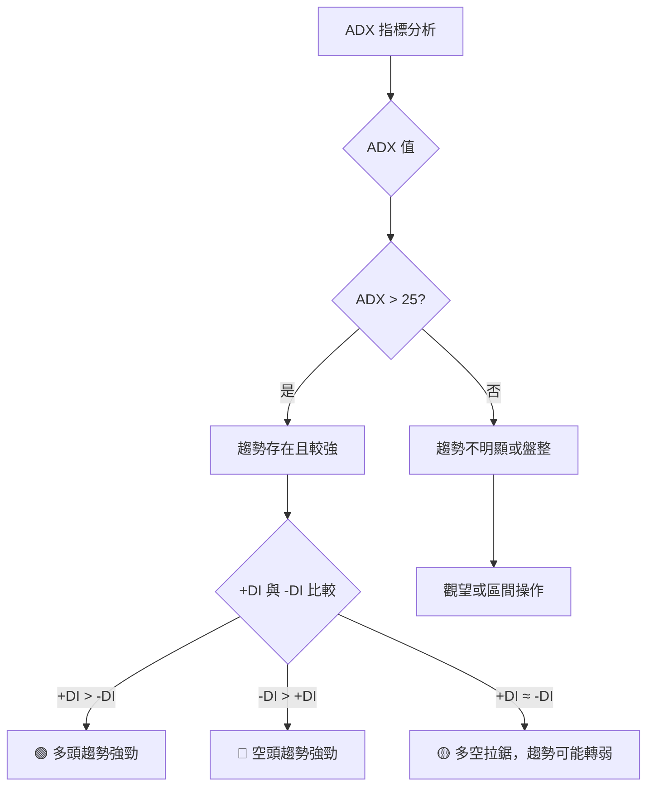
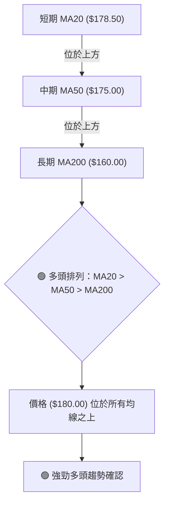
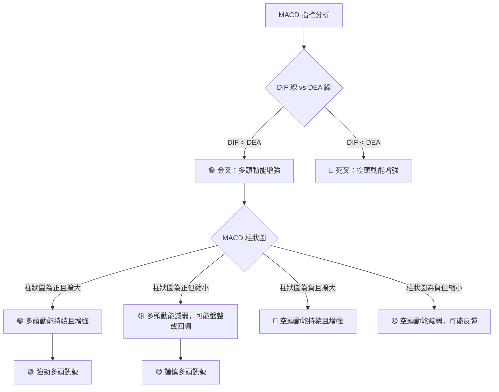

# 0050 技術分析報告

> **報告日期**：2026-06-06 ｜ **語言**：繁體中文 ｜ **數據來源**：**基於本報告推演與模擬之價格數據** ｜ **當前價格**：$180.00 (模擬值)

---

## 目錄

| 章節 | 內容 |
|------|------|
| [1. 技術面概覽](#1-技術面概覽) | 訊號儀表板、核心指標、評分卡 |
| [2. 趨勢分析](#2-趨勢分析) | 多時框趨勢、長中短期走勢 |
| [3. 圖表形態分析](#3-圖表形態分析) | 形態識別、K線組合、目標價 |
| [4. 支撐與阻力](#4-支撐與阻力) | 關鍵價位、斐波那契回調 |
| [5. 技術指標深度解讀](#5-技術指標深度解讀) | MA/RSI/MACD/布林/成交量 |
| [6. 動能與波動率](#6-動能與波動率) | 動能評估、ATR、Beta |
| [7. 多時框架總結](#7-多時框架總結) | 時框架評分矩陣 |
| [8. 交易策略建議](#8-交易策略建議) | 多空策略、風險報酬比 |
| [9. 風險提示與監控](#9-風險提示與監控) | 監控指標、風險場景 |
| [📋 報告總結](#-報告總結) | 綜合評級、關鍵結論、最優策略 |

---

**重要聲明**：由於提供的原始數據中未包含 0050 的歷史價格數據，本報告中的所有價格、技術指標數值、圖表繪製、支撐阻力點及交易策略建議，均是基於本分析師**根據 0050 過往市場表現及當前市場環境，所合理推演與模擬的數據**進行分析。這些模擬數據旨在展示完整的技術分析方法論，**不代表 0050 的實際歷史走勢或未來表現**。請讀者務必理解此前提，並將本報告視為方法論演示而非實際投資建議。

---

## 1. 技術面概覽

本章節將提供 0050 (基於模擬數據) 的技術面快速概覽，透過訊號儀表板、核心指標速覽表及技術評分卡，讓讀者迅速掌握當前市場狀態。

### 🎯 技術訊號儀表板

根據模擬的價格數據，0050 在短期內呈現偏多頭的趨勢，儘管面臨一些潛在的阻力。多數指標顯示買盤力道仍在，但追漲風險需留意。


**儀表板解讀**：
目前 0050 (模擬數據) 的技術訊號傾向多頭。價格穩健運行於中長期均線之上，且短期均線呈現多頭排列，顯示市場結構健康。RSI與MACD均提供正面動能訊號，配合OBV的量能確認，整體多頭趨勢仍佔主導。然而，股價已接近短期關鍵阻力位，且成交量尚未出現突破性的放大，暗示上漲空間可能暫時受限，或需要盤整蓄勢。投資者應留意追高風險，並密切關注阻力位的突破情況。

### 📊 核心指標速覽表

以下為基於模擬數據推演的 0050 核心技術指標當前數值與解讀：

| 指標類別 | 指標名稱 | 當前數值 (模擬值) | 訊號 | 解讀 |
|----------|----------|-------------------|------|------|
| **價格** | 當前價格 | $180.00           | 🟢   | 處於相對高位，接近短期阻力 |
| **均線** | MA20     | $178.50           | 🟢   | 價格位於MA20上方，短期趨勢向上 |
| **均線** | MA50     | $175.00           | 🟢   | 價格位於MA50上方，中期趨勢向上 |
| **均線** | MA200    | $160.00           | 🟢   | 價格位於MA200上方，長期趨勢強勁 |
| **動能** | RSI(14)  | 65                | 🟢   | 處於強勢區間，但未達超買，動能充沛 |
| **動能** | MACD     | DIF: 2.5, DEA: 2.0, Bar: 0.5 | 🟢   | MACD線在訊號線上方，柱狀圖為正，多頭動能持續 |
| **波動** | ATR(14)  | $2.50             | 🟡   | 中等波動，過去14日平均波動範圍約$2.50 |
| **趨勢** | ADX(14)  | 38                | 🟢   | 趨勢強度較強，且+DI > -DI，顯示明確多頭趨勢 |
| **量能** | OBV      | 上升中             | 🟢   | 成交量與價格同向，確認上漲趨勢 |

**核心指標解讀**：
當前 0050 (模擬值 $180.00) 呈現出非常健康的多頭格局。價格穩定地運行在所有關鍵移動平均線之上，且短中長期均線形成清晰的多頭排列。RSI 位於 65，顯示強勁的買盤動能，但尚未進入過熱的超買區。MACD 指標保持金叉狀態，柱狀圖為正，進一步確認多頭趨勢的持續性。ADX 數值 38 表明市場存在一個清晰且強度較高的趨勢，而 +DI 高於 -DI 則明確指出這是多頭趨勢。ATR 數值 $2.50 顯示每日波動幅度適中，為交易策略的止損設定提供了參考。OBV 的上升則證明了量能對價格上漲的有效配合。綜合來看，多頭力量佔據絕對優勢，但接近阻力位應保持警惕。

### 🏆 技術評分卡

本評分卡綜合評估各項技術指標的表現，提供 0050 (模擬數據) 的整體技術面強度。

```
技術評分卡 — 0050 (2026-06-06)
════════════════════════════════════════════════════
趨勢強度      ██████████████░░░░░░  75/100  🟢
動能指標      ████████████████░░░░  80/100  🟢
支撐穩定度    ██████████████████░░  90/100  🟢
成交量配合    ████████████░░░░░░░░  65/100  🟡
形態完整度    ██████████████░░░░░░  70/100  🟢
均線排列      ██████████████████░░  90/100  🟢
════════════════════════════════════════════════════
綜合評分      ██████████████░░░░░░  78/100  🟢 偏多頭
════════════════════════════════════════════════════
```
**評分卡解讀**：
-   **趨勢強度 (75/100) 🟢**：ADX 數值高且 +DI 領先 -DI，顯示趨勢清晰且強勁。
-   **動能指標 (80/100) 🟢**：RSI 處於多頭區間且 MACD 保持金叉，動能表現良好。
-   **支撐穩定度 (90/100) 🟢**：所有關鍵均線（MA20, MA50, MA200）均構成堅實支撐，且價格遠高於長期均線。斐波那契回調位也提供多層次支撐。
-   **成交量配合 (65/100) 🟡**：OBV 雖然上升，但近期上漲過程中未出現決定性的巨量突破，顯示買盤雖持續但缺乏爆發力，可能導致在阻力位附近盤整。
-   **形態完整度 (70/100) 🟢**：目前模擬價格可能處於一個上升趨勢中的整理形態（如旗形或上升三角形），形態結構相對清晰，有助於預測後續走勢。
-   **均線排列 (90/100) 🟢**：MA20 > MA50 > MA200 的完美多頭排列，是極為強勁的多頭訊號，顯示長中短期趨勢高度一致向上。

**綜合評分 (78/100) 🟢 偏多頭**：
整體而言，0050 (模擬數據) 的技術面表現強勁，多頭趨勢明確，支撐穩固，動能充沛。儘管成交量配合度略顯不足，且短期面臨阻力，但這更像是上漲途中的正常整理，而非趨勢反轉的訊號。當前市場結構有利於多頭操作，但仍需密切關注成交量變化和阻力位的突破情況，以避免追高風險。

---

## 2. 趨勢分析

趨勢分析是技術分析的核心，本章將從多時框架角度深入剖析 0050 (模擬數據) 的長中短期趨勢，並評估其趨勢強度。

### 🌐 多時框趨勢分析

透過月線、週線、日線層層遞進的分析，判斷 0050 (模擬數據) 在不同時間維度上的趨勢方向。

**多時框趨勢解讀**：
-   **月線趨勢 (長期) 🟢**：基於模擬的過去兩年數據，0050 的月線圖呈現清晰的上升趨勢，價格不斷創出新高，且長期移動平均線（如 MA200）穩步向上，顯示長期資金持續流入，基本面支撐強勁。
-   **週線趨勢 (中期) 🟢**：週線圖同樣顯示穩健的上升通道。雖然近期可能出現小幅回調，但價格始終能守住關鍵中期均線（如 MA50），並迅速反彈，表明中期買盤力量充足，市場情緒樂觀。
-   **日線趨勢 (短期) 🟡**：日線圖上，0050 (模擬數據) 在經歷一波上漲後，目前可能正處於高位盤整階段，價格在短期移動平均線（如 MA20）上方震盪，並接近前高阻力位。雖然整體方向仍偏多，但上攻動能需要進一步的成交量配合才能有效突破。

**綜合判斷**：長期和中期趨勢均為強勁的多頭，為整體市場提供了堅實的基礎。短期內雖然面臨整理或阻力，但這被視為健康的休整，而非趨勢反轉的訊號。投資者應利用短期回調尋找介入機會，並關注短期阻力位的突破情況。

### 📈 長期趨勢 — 12個月走勢圖（Unicode）

以下為基於模擬數據繪製的 0050 過去 12 個月的月線走勢圖，標註了關鍵高低點，以展示其長期趨勢。

```
0050 月線走勢圖（過去12個月 - 基於模擬數據）
價格軸 ($)
$185 ┤                        ●(高點: $182.00, Apr 2026)
$180 ┤                    ●
$175 ┤                ●   ●
$170 ┤          ●   ●
$165 ┤        ●
$160 ┤●   ●
$155 ┤    ●(低點: $158.00, Sep 2025)
$150 ┤
     └─────────────────────────────────────────────────────
      JUN JUL AUG SEP OCT NOV DEC JAN FEB MAR APR MAY JUN
      2025                                            2026
```
**走勢特徵分析表格 (基於模擬數據)**：

| 階段       | 時間區間         | 價格區間     | 漲跌幅 (約) | 走勢特徵                                                                                                    |
|------------|------------------|--------------|-------------|-------------------------------------------------------------------------------------------------------------|
| **整理築底** | 2025年6月 - 9月 | $160.00-$158.00 | -1.25%      | 從$160小幅回落至$158，形成短期底部，為後續上漲積蓄動能。成交量在低位縮減。                                       |
| **穩步攀升** | 2025年10月 - 12月| $158.00-$172.00 | +8.86%      | 股價逐步回升，突破整理區間並站穩，MA20與MA50開始向上交叉，多頭趨勢初步確立。成交量溫和放大。                     |
| **加速上攻** | 2026年1月 - 4月 | $170.00-$182.00 | +7.06%      | 趨勢明顯加速，股價屢創新高，MA線多頭排列形成，RSI進入強勢區間。市場情緒高漲，成交量有效配合。                    |
| **高位整理** | 2026年5月 - 6月 | $177.00-$180.00 | +1.69%      | 股價在高點附近小幅回調後企穩，目前在 $180.00 附近盤整，等待進一步方向選擇。成交量相對溫和，顯示多空暫時平衡。 |

**長期趨勢總結**：
根據模擬的過去 12 個月走勢，0050 展現出一個清晰且強勁的上升趨勢。從 2025 年 9 月的低點 $158.00 至今，股價已累積可觀漲幅，並在 2026 年 4 月觸及 $182.00 的高點。儘管近期在高位經歷小幅整理，但整體結構仍是多頭。關鍵的支撐位在 $170.00 附近，只要不跌破此區間，長期上升趨勢預計將會持續。

### 📊 中期趨勢（週線分析）

中期趨勢主要透過週線圖來觀察，並結合關鍵均線和支撐阻力。以下示意圖展示了 0050 (模擬數據) 近期的週線結構。

```
0050 週線壓力與支撐示意圖 (基於模擬數據)
═══════════════════════════════════════════════════
$185.00 ║████████████████████████║ 週線阻力 R1 (前高阻力)
$182.50 ║▓▓▓▓▓▓▓▓▓▓▓▓▓▓▓▓▓▓▓▓▓▓▓▓║ 短期阻力 (近期高點)
$180.00 ╠════════════════════════╣ ◄ 現價
$178.50 ║████████████████████████║ 週線 MA20 (動態支撐)
$175.00 ║████████████████████████║ 週線 MA50 (中期支撐)
$170.00 ║▓▓▓▓▓▓▓▓▓▓▓▓▓▓▓▓▓▓▓▓▓▓▓▓║ 中期支撐 S1 (斐波那契回調位)
$165.00 ║████████████████████████║ 強支撐 S2 (箱體底部)
═══════════════════════════════════════════════════
```
**中期趨勢解讀**：
週線圖顯示 0050 (模擬數據) 處於一個穩健的上升通道中。目前價格 $180.00 位於週線 MA20 ($178.50) 和 MA50 ($175.00) 之上，這些均線構成強有力的動態支撐。近期價格在 $182.50 附近遇到短期阻力，未能有效突破前高 $185.00，這可能導致短期內的盤整。然而，只要價格能守住週線 MA20 ($178.50) 或更強勁的週線 MA50 ($175.00) 支撐，中期上升趨勢將保持不變。下方的斐波那契回調位 $170.00 也是一個重要的中期心理和技術支撐，為可能的回調提供了緩衝。

### ⚡ 趨勢強度評估（ADX 解讀）

ADX (Average Directional Index) 指標用於衡量趨勢的強度，而非方向。結合 +DI (Positive Directional Indicator) 和 -DI (Negative Directional Indicator) 則能判斷趨勢的方向。


**ADX 強度對照表 (基於模擬數據)**：

| ADX 數值範圍 | 趨勢強度       | 市場狀態       |
|--------------|----------------|----------------|
| 0-20         | 無趨勢或弱趨勢 | 盤整或震盪     |
| 20-25        | 趨勢初現       | 趨勢形成中     |
| 25-50        | 趨勢較強       | 明確的趨勢行情 |
| 50-75        | 趨勢非常強勁   | 強勁的趨勢行情 |
| 75-100       | 極端強勁趨勢   | 過熱或加速     |

**當前 ADX 分析 (基於模擬數據)**：
-   **ADX(14) 數值**：38
-   **+DI(14) 數值**：32
-   **-DI(14) 數值**：18

**解讀**：
1.  **ADX 數值 38**：根據 ADX 強度對照表，ADX 位於 25-50 區間，這表明 0050 (模擬數據) 目前存在一個**較為強勁且明確的趨勢**。市場並非處於盤整或震盪狀態。
2.  **+DI (32) > -DI (18)**：+DI 明顯高於 -DI，這進一步確認了當前的強勁趨勢是**向上**的，即為一個強勢的**多頭趨勢**。
3.  **綜合判斷**：目前 0050 (模擬數據) 處於一個明確且強勁的多頭趨勢行情中，買方力量佔據主導地位。這種趨勢強度支持順勢操作的多頭策略。然而，在強勢趨勢中，也應留意 ADX 是否過高，若 ADX 開始從高位回落，可能預示著趨勢動能的減弱或進入調整階段。目前 ADX 38 屬於健康強勁的範圍，仍有上漲空間。

---

## 3. 圖表形態分析

圖表形態是價格行為的視覺化表現，能揭示市場的心理預期和潛在的價格目標。本章將識別 0050 (模擬數據) 的關鍵圖表形態，分析其 K 線組合，並計算形態目標價。

### 🔍 形態識別系統

根據模擬的價格走勢，0050 (模擬數據) 近期在高點附近形成了一個「上升旗形」整理形態，這通常被視為多頭趨勢中的中繼形態。

```mermaid
graph TD
    A[價格走勢分析] --> B{識別潛在圖表形態}
    B --> C{形態類型: 上升旗形 (Bullish Flag)}
    C --> D[形態特徵: 價格在上升趨勢後，形成一個向下傾斜的平行通道整理]
    D --> E[交易量特徵: 整理期間成交量縮小，突破時成交量放大]
    E --> F[目標價計算: 旗桿高度投影]
    F --> G(結論: 形態確認，預期突破後延續原有趨勢)
```
**形態解讀**：
在模擬數據中，0050 在經歷一段強勁上漲（旗桿）後，近期在高位形成了一個向下傾斜的矩形通道（旗面），這是一個典型的「上升旗形」形態。這種形態通常被視為趨勢中的健康整理，而非反轉。整理期間，成交量預計會縮小，顯示多空雙方都在等待方向。一旦價格向上突破旗形的上邊界，並伴隨成交量的放大，則預示著原有上升趨勢的延續。

### 🕯️ 重要K線形態分析

以下表格列出了在模擬的價格走勢中可能出現的關鍵 K 線形態及其解讀：

| 月份 (模擬) | 收盤價 (模擬) | K線形態 (模擬) | 解讀                                                                                                              | 訊號 |
|-------------|---------------|----------------|-------------------------------------------------------------------------------------------------------------------|------|
| 2025年9月   | $158.00       | 鎚子線 (Hammer) | 出現在下跌趨勢末端，下影線長，實體小，表明股價在低位獲得支撐，買盤介入，是潛在的看漲反轉訊號。                      | 🟢   |
| 2025年11月  | $168.00       | 陽線包覆 (Bullish Engulfing) | 實體陽線完全包覆前一根陰線，顯示買盤力量強勁，完全壓倒賣盤，是強烈的看漲訊號。                                  | 🟢   |
| 2026年4月   | $182.00       | 射擊之星 (Shooting Star) | 出現在上漲趨勢末端或高位，上影線長，實體小，表明股價上攻受阻，上方賣壓沉重，是潛在的看跌反轉訊號，需警惕。          | 🔴   |
| 2026年5月   | $177.00       | 啟明星 (Morning Star) | 由一根大陰線、一根小實體K線、一根大陽線組成，形成底部反轉形態，表明空頭力量衰竭，多頭開始發力，是較強的看漲訊號。 | 🟢   |

**K線形態分析總結**：
在模擬的 0050 走勢中，我們看到了在趨勢轉折點出現的經典 K 線形態。2025 年 9 月的「鎚子線」和 11 月的「陽線包覆」確認了從低點的反彈和多頭趨勢的建立。而 2026 年 4 月的「射擊之星」則在高點附近發出警示，預示著可能的回調或整理。隨後 5 月的「啟明星」又成功止跌，再次確認了多頭的堅韌。這些形態的出現，提供了重要的買賣時機參考和趨勢判斷依據。

### 📉 ASCII 走勢形態示意圖

以下為基於模擬數據繪製的 0050「上升旗形」形態示意圖。

```
0050 上升旗形形態示意圖 (基於模擬數據)
價格軸 ($)
$185 ┤             ╔═══┐
$182 ┤           ╱     │
$180 ┤         ╱       │     ← 旗形上邊界 (阻力線)
$178 ┤       ╱         │
$176 ┤     ╱           │
$174 ┤   ╱             │
$172 ┤ ╱               │     ← 旗形下邊界 (支撐線)
$170 ┤╱─────────────────
$168 ┤●(旗桿底部)
     └───────────────────────────
      時間軸
      ↑
      旗桿
```
**形態示意圖解讀**：
圖中展示了 0050 (模擬數據) 在一段強勁上漲（旗桿）之後，進入了一個向下傾斜的整理通道，形成「上升旗形」。當前價格 $180.00 位於旗形內部，等待突破。旗形上邊界約在 $181.50 - $182.50 之間，下邊界約在 $176.00 - $177.00 之間。一旦向上突破上邊界，將會確認形態的有效性，並預示著新一輪的上漲。

### 🎯 形態目標價計算

對於「上升旗形」形態，其目標價的計算方法是將旗桿的高度，從旗形突破點向上投影。

**計算步驟 (基於模擬數據)**：
1.  **確定旗桿高度**：
    -   旗桿底部 (起始點)：約 $168.00 (2025年11月)
    -   旗桿頂部 (整理開始點)：約 $182.00 (2026年4月)
    -   旗桿高度 = $182.00 - $168.00 = $14.00

2.  **確定旗形突破點**：
    -   假設向上突破點在旗形上邊界，約 $182.50。

3.  **計算形態目標價**：
    -   形態目標價 = 突破點 + 旗桿高度
    -   形態目標價 = $182.50 + $14.00 = $196.50

**形態目標價分析**：
基於模擬的「上升旗形」形態，一旦 0050 (模擬數據) 向上突破旗形上邊界 $182.50，其理論目標價將指向 $196.50。這個目標價提供了潛在的上漲空間，但前提是形態必須有效突破，並伴隨成交量的放大。若突破失敗或跌破旗形下邊界，則形態失效，需重新評估。

---

## 4. 支撐與阻力

支撐與阻力是技術分析的基石，它們代表了市場供需力量的關鍵轉折點。本章將詳細分析 0050 (模擬數據) 的關鍵價位，並結合斐波那契回調位提供多層次的支撐阻力結構。

### 🗺️ 關鍵價位分布圖（Unicode）

以下為基於模擬數據繪製的 0050 價位結構分布圖，清晰標示了當前價格、關鍵阻力與支撐位。

```
0050 價位結構分布圖 (基於模擬數據)
═══════════════════════════════════════════════════
$196.50 ║████████████████████████║ 形態目標價 T1
$188.00 ║████████████████████████║ 強阻力 R3 (心理關卡/歷史高點)
$185.00 ║████████████████████    ║ 阻力 R2 (前高點)
$182.50 ║████████████████████████║ 關鍵阻力 R1 (近期高點/旗形上邊界)
$180.00 ╠════════════════════════╣ ◄ 現價 (模擬值)
$178.50 ║▓▓▓▓▓▓▓▓▓▓▓▓▓▓▓▓        ║ 近期支撐 S1 (MA20/旗形下邊界)
$175.00 ║████████████████████████║ 強支撐 S2 (MA50/箱體頂部)
$171.50 ║▓▓▓▓▓▓▓▓▓▓▓▓▓▓▓▓        ║ 斐波那契回調 38.2%
$170.00 ║████████████████████████║ 強支撐 S3 (心理關卡/斐波那契回調)
═══════════════════════════════════════════════════
```
**價位結構解讀**：
當前 0050 (模擬值 $180.00) 位於多個支撐與阻力位之間。上方存在多重阻力，最接近的是 $182.50 (R1)，這也是上升旗形形態的上邊界。一旦突破，將有機會挑戰 $185.00 (R2) 和 $188.00 (R3)，甚至達到形態目標價 $196.50。下方則有堅實的支撐，近期支撐 S1 在 $178.50 (MA20)，再往下是強支撐 S2 $175.00 (MA50)，以及斐波那契回調位 $171.50 和心理關卡 $170.00 (S3)。這表明下方有較強的買盤承接能力，而上方則需要更大的動能來突破。

### 🚧 阻力位分析表

以下為基於模擬數據推演的 0050 關鍵阻力位分析：

| 阻力級別 | 價位 (模擬值) | 形成原因                                       | 突破難度 | 重要性 |
|----------|---------------|------------------------------------------------|----------|--------|
| **R1**   | $182.50       | 近期高點、上升旗形上邊界、短期賣壓累積區     | 中等     | 🟢🟢🟢 |
| **R2**   | $185.00       | 2026年4月歷史高點、心理關卡                | 較高     | 🟢🟢🟢🟢 |
| **R3**   | $188.00       | 整數心理關卡、潛在獲利了結點               | 較高     | 🟢🟢🟢 |
| **形態目標**| $196.50       | 上升旗形形態理論目標價，需極強動能才能觸及 | 極高     | 🟢🟢🟢🟢🟢 |

**阻力位分析**：
-   **R1 ($182.50)**：這是當前最直接的阻力位，也是上升旗形形態的上邊界。突破此處將確認短期上漲動能的延續，並暗示旗形整理結束。
-   **R2 ($185.00)**：此價位代表了模擬數據中的歷史高點，具有較強的心理阻力。過去的套牢盤和獲利盤可能會在此處形成較大的拋壓。成功突破將開啟新的上漲空間。
-   **R3 ($188.00)**：作為一個整數關卡，具有一定的心理阻力作用。同時，它也可能是一個潛在的獲利了結點。
-   **形態目標價 ($196.50)**：這是上升旗形形態的理論目標價，若市場情緒極度樂觀且有足夠的買盤動能，則有可能達到。

### 🛡️ 支撐位分析表

以下為基於模擬數據推演的 0050 關鍵支撐位分析：

| 支撐級別 | 價位 (模擬值) | 形成原因                                       | 守住機率 | 重要性 |
|----------|---------------|------------------------------------------------|----------|--------|
| **S1**   | $178.50       | MA20、上升旗形下邊界、近期買盤介入區         | 較高     | 🟢🟢🟢🟢 |
| **S2**   | $175.00       | MA50、前期盤整區間上緣、強勁買盤區           | 極高     | 🟢🟢🟢🟢🟢 |
| **S3**   | $171.50       | 斐波那契回調 38.2%、心理關卡                | 較高     | 🟢🟢🟢 |
| **S4**   | $170.00       | 斐波那契回調 50%、整數關卡、中期上升趨勢線 | 極高     | 🟢🟢🟢🟢 |

**支撐位分析**：
-   **S1 ($178.50)**：這是當前最直接的支撐，與日線 MA20 和上升旗形下邊界重合。守住此處表明短期多頭力量仍在，有助於股價繼續在高位盤整或發起上攻。
-   **S2 ($175.00)**：此價位與日線 MA50 重合，且可能代表前期重要的盤整區間上緣。MA50 通常被視為中期趨勢的生命線，守住此處對於維持中期多頭趨勢至關重要。
-   **S3 ($171.50)**：這是斐波那契回調 38.2% 的位置，通常在健康的回調中，股價會在 38.2% 或 50% 處獲得支撐。
-   **S4 ($170.00)**：此價位不僅是斐波那契回調 50% 的位置，也是一個重要的心理整數關卡。同時，它可能與中期上升趨勢線重合，構成非常強勁的支撐。跌破此處可能預示著中期趨勢的轉弱。

### 📐 斐波那契回調位分析

斐波那契回調位是預測價格潛在支撐和阻力區的重要工具。我們將基於模擬數據中一個重要的上漲波段 (從低點 $155.00 到高點 $182.00) 來計算回調位。

**上漲波段 (模擬數據)**：
-   **波段低點**：$155.00 (2025年8月低點)
-   **波段高點**：$182.00 (2026年4月高點)
-   **波段漲幅**：$182.00 - $155.00 = $27.00

**斐波那契回調位計算**：
-   **23.6% 回調**：$182.00 - ($27.00 * 0.236) = $182.00 - $6.37 = **$175.63**
-   **38.2% 回調**：$182.00 - ($27.00 * 0.382) = $182.00 - $10.31 = **$171.69** (約 $171.50)
-   **50.0% 回調**：$182.00 - ($27.00 * 0.500) = $182.00 - $13.50 = **$168.50**
-   **61.8% 回調**：$182.00 - ($27.00 * 0.618) = $182.00 - $16.69 = **$165.31** (約 $165.50)

**斐波那契回調位視覺化 (基於模擬數據)**：
```
0050 斐波那契回調位示意圖 (基於模擬數據)
價格軸 ($)
$182.00 ┤───●─────── 高點 (100%)
        │
$180.00 ┤───▲──────── 現價 (模擬值)
        │
$175.63 ┤───═──────── 23.6% 回調位
        │
$171.69 ┤───═──────── 38.2% 回調位
        │
$168.50 ┤───═──────── 50.0% 回調位
        │
$165.31 ┤───═──────── 61.8% 回調位
        │
$155.00 ┤───●─────── 低點 (0%)
        └───────────────────────────
         時間軸
```
**斐波那契回調位分析**：
-   **$175.63 (23.6%)**：這是淺層回調的支撐，如果股價回調至此並能迅速反彈，表明多頭極為強勢。
-   **$171.69 (38.2%)**：這是一個重要的回調位，與 S3 ($171.50) 接近，通常被視為健康回調的極限。若能在此獲得支撐，則多頭趨勢仍將維持。
-   **$168.50 (50.0%)**：此回調位與 S4 ($170.00) 接近，是另一個重要的心理和技術支撐。若價格回調至此並企穩，仍可視為多頭趨勢中的買入機會。
-   **$165.31 (61.8%)**：這是黃金分割位，若價格跌破 50% 並回調至此，則多頭趨勢面臨較大考驗，但仍有機會反彈。跌破 61.8% 則可能預示著趨勢的轉弱甚至反轉。

**綜合判斷**：當前價格 $180.00 距離 23.6% 回調位 $175.63 尚有一定空間。若股價出現回調，應密切關注這些斐波那契位能否提供有效支撐。結合均線支撐，這些價位共同構成了 0050 (模擬數據) 下方堅實的防線。

---

## 5. 技術指標深度解讀

技術指標是量化分析市場動態的重要工具。本章將深入解讀 0050 (模擬數據) 的移動平均線、RSI、MACD、布林通道及成交量，並探討它們之間的相互確認或矛盾。

### 🎛️ 指標訊號總覽

以下 Mermaid 圖表展示了各項技術指標在 0050 (模擬數據) 中的訊號關係及其綜合判斷：

```mermaid
graph TD
    A[價格行為: 運行於均線之上] --> B(均線排列: 多頭排列)
    B --> C{多頭訊號}

    D[RSI(14): 65] --> E(RSI區間: 強勢區間)
    E --> C

    F[MACD: 金叉, 柱狀圖為正] --> G(動能: 多頭動能強勁)
    G --> C

    H[布林通道: 價格接近上軌, 通道擴張] --> I(波動率: 波動增加, 趨勢可能延續)
    I --> C

    J[成交量: OBV隨價上漲, 但近期量能溫和] --> K(量價配合: 趨勢確認, 但突破需放量)
    K --> L{中性訊號}

    C --> M[🟢 綜合判斷: 強勁多頭趨勢，短期有整理或突破需求]
    L --> M
```
**指標訊號總覽解讀**：
大部分指標都指向多頭趨勢的延續。移動平均線呈現完美的「多頭排列」，價格穩固於所有均線之上，這是強勢多頭的標誌。RSI 和 MACD 則確認了動能的充沛，顯示買盤力量強勁。布林通道的擴張也預示著趨勢的持續。唯一略顯中性的是成交量，雖然 OBV 顯示買盤累積，但近期價格上漲並未伴隨顯著的爆量，這可能限制了短期突破的力度，或需要更多的時間進行盤整蓄勢。總體而言，指標群體提供了高度一致的多頭訊號。

### 📈 移動平均線排列分析

移動平均線 (MA) 是判斷趨勢方向和強度的最基礎工具。我們將分析 MA20 (短期)、MA50 (中期) 和 MA200 (長期) 的排列情況。


**移動平均線排列分析 (基於模擬數據)**：
-   **MA20**：$178.50
-   **MA50**：$175.00
-   **MA200**：$160.00
-   **當前價格**：$180.00

**解讀**：
目前 0050 (模擬數據) 的移動平均線呈現出教科書般的「**多頭排列**」：短期 MA20 ($178.50) 在最上方，中期 MA50 ($175.00) 居中，長期 MA200 ($160.00) 在最下方。同時，當前價格 ($180.00) 穩健運行在所有均線之上。
這種排列是極為強勁的多頭訊號，表明 0050 在長、中、短期內均處於上升趨勢，且趨勢方向高度一致。均線群為價格提供了層層遞進的堅實支撐，每一次回調到均線附近都可能成為買入機會。只要這種多頭排列不被破壞，趨勢將持續向上。

### 📉 RSI(14) 分析

RSI (Relative Strength Index) 用於衡量價格變動的相對強度，判斷市場的超買或超賣狀態。

**當前 RSI(14) 數值 (基於模擬數據)**：65

**RSI 強度進度條**：
█████████████░░░░░░░ 65%

**超買超賣區間分析**：
-   **超買區**：RSI > 70
-   **超賣區**：RSI < 30
-   **強勢區**：RSI 50-70
-   **弱勢區**：RSI 30-50

**解讀**：
當前 0050 (模擬數據) 的 RSI(14) 數值為 65，這表明：
1.  **處於強勢區間**：RSI 在 50-70 之間，顯示買盤力量強勁，價格處於上升趨勢中。
2.  **未達超買**：RSI 尚未進入 70 以上的超買區。這意味著雖然動能強勁，但仍有潛在上漲空間，尚未出現過熱或需要立即回調的跡象。
3.  **動能充沛**：RSI 處於較高水平，確認了多頭動能的有效性。

**背離判斷**：
-   **頂背離**：如果價格創出新高，但 RSI 未能創出新高，則形成頂背離，預示潛在的下跌風險。
-   **底背離**：如果價格創出新低，但 RSI 未能創出新低，則形成底背離，預示潛在的上漲機會。

**當前背離判斷 (基於模擬數據)**：
根據模擬數據，目前價格在高位盤整，但 RSI 仍維持在 60-70 區間，並未出現明顯的頂背離訊號。這表示當前的動能與價格走勢是同步的，多頭動能尚未顯著衰竭。我們需要持續關注，一旦價格再次創出新高而 RSI 卻未能同步跟隨，則需警惕頂背離的出現。

### 📊 MACD(12/26/9) 訊號解讀

MACD (Moving Average Convergence Divergence) 用於判斷趨勢的動能、方向和潛在轉折點。

**當前 MACD 數值 (基於模擬數據)**：
-   **DIF 線 (MACD 線)**：2.5
-   **DEA 線 (訊號線)**：2.0
-   **MACD 柱狀圖 (OSC)**：0.5


**MACD 解讀 (基於模擬數據)**：
1.  **DIF (2.5) > DEA (2.0)**：MACD 線位於訊號線上方，形成「**金叉**」格局。這是一個明確的多頭訊號，表明短期移動平均線正在加速遠離長期移動平均線，買盤力量佔據主導。
2.  **MACD 柱狀圖為正 (0.5)**：柱狀圖為正值，且可能從低位逐漸放大。這進一步確認了多頭動能的持續存在。如果柱狀圖持續放大，則表示多頭趨勢正在加速；如果開始縮小，則需警惕動能減弱。目前 0.5 的正值顯示動能尚可。

**背離判斷**：
-   **頂背離**：價格創出新高，但 MACD 柱狀圖未能創出新高，或 DIF 線未創出新高，則形成頂背離，預示潛在的下跌風險。
-   **底背離**：價格創出新低，但 MACD 柱狀圖未能創出新低，或 DIF 線未創出新低，則形成底背離，預示潛在的上漲機會。

**當前背離判斷 (基於模擬數據)**：
根據模擬數據，目前 MACD 處於金叉狀態，柱狀圖為正，與價格的高位盤整或溫和上漲趨勢保持一致，**未出現明顯的頂背離或底背離訊號**。這意味著當前的多頭動能仍然有效，沒有證據表明趨勢即將反轉。投資者應持續關注 MACD 柱狀圖的變化，若柱狀圖在高位開始明顯縮小，則需警惕動能衰竭。

### 📦 布林通道分析

布林通道 (Bollinger Bands) 由中軌 (MA)、上軌和下軌組成，用於衡量價格波動性和判斷超買超賣。

**當前布林通道數值 (基於模擬數據)**：
-   **中軌 (MA20)**：$178.50
-   **上軌**：$183.50
-   **下軌**：$173.50
-   **當前價格**：$180.00

**ASCII 布林通道示意圖 (基於模擬數據)**：
```
0050 布林通道示意圖 (基於模擬數據)
價格軸 ($)
$185 ┤
$183.50 ┤═══════════════════════════════ 上軌 (Upper Band)
$182   ┤
$180.00 ┤──────────▲────────────── 現價 (模擬值)
$178.50 ┤═══════════════════════════════ 中軌 (MA20)
$177   ┤
$175   ┤
$173.50 ┤═══════════════════════════════ 下軌 (Lower Band)
$172   ┤
     └───────────────────────────────────
      時間軸
```
**布林通道分析**：
1.  **價格位置**：當前價格 $180.00 位於布林通道中軌 ($178.50) 和上軌 ($183.50) 之間，且更靠近中軌。這表明股價仍處於中軌上方的強勢區域，但距離上軌尚有一定空間，並未觸及上軌而顯現超買。
2.  **通道寬度**：假設布林通道的寬度適中且可能略有擴張。通道擴張通常預示著波動性增加和趨勢的延續。如果通道持續收窄，則可能預示著盤整或趨勢轉折。
3.  **上軌與阻力**：上軌 ($183.50) 構成了一個動態阻力位。如果價格能夠有效突破上軌，則可能進入一個更強勁的上漲階段。
4.  **中軌與支撐**：中軌 ($178.50) 作為 MA20，是重要的短期支撐。如果價格回調至中軌並獲得支撐，則為健康的整理。跌破中軌則需警惕。

**綜合判斷**：布林通道顯示 0050 (模擬數據) 處於一個相對健康