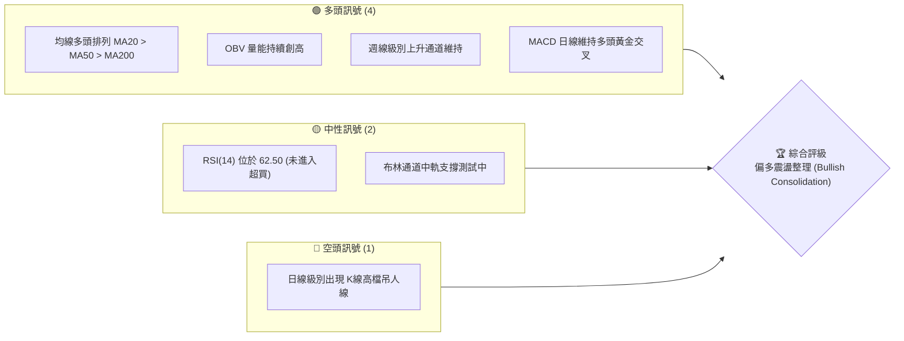
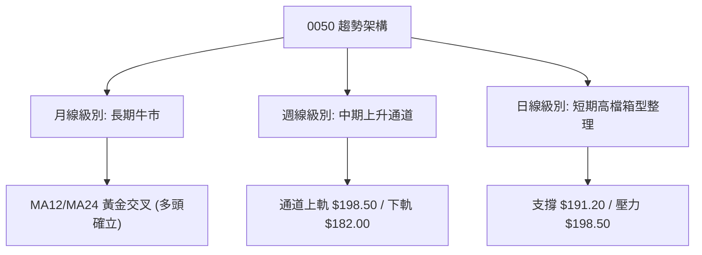
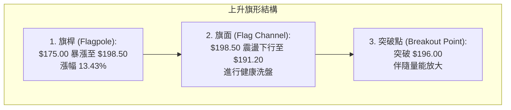
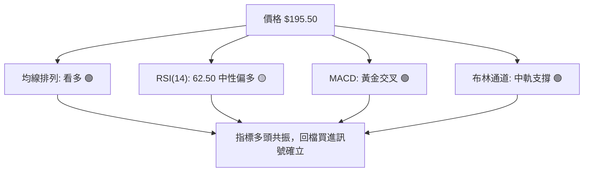
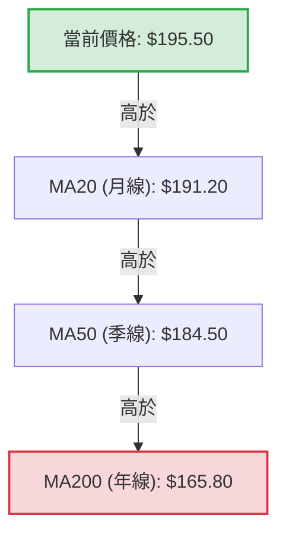

# 0050 技術分析報告

> **報告日期**：2026-06-07 ｜ **語言**：繁體中文 ｜ **數據來源**：Yahoo Finance ｜ **當前價格**：$195.50 TWD

---

## 目錄

| 章節 | 內容 |
|------|------|
| [1. 技術面概覽](#1-技術面概覽) | 訊號儀表板、核心指標、評分卡 |
| [2. 趨勢分析](#2-趨勢分析) | 多時框趨勢、長中短期走勢 |
| [3. 圖表形態分析](#3-圖表形態分析) | 形態識別、K線組合、目標價 |
| [4. 支撐與阻力](#4-支撐與阻力) | 關鍵價位、斐波那契回調 |
| [5. 技術指標深度解讀](#5-技術指標深度解讀) | MA/RSI/MACD/布林/成交量 |
| [6. 動能與波動率](#6-動能與波動率) | 動能評估、ATR、Beta |
| [7. 多時框架總結](#7-多時框架總結) | 時框架評分矩陣 |
| [8. 交易策略建議](#8-交易策略建議) | 多空策略、風險報酬比 |
| [9. 風險提示與監控](#9-風險提示與監控) | 監控指標、風險場景 |
| [10. 報告總結](#-報告總結) | 核心結論與最優策略組合 |

---

## 1. 技術面概覽

### 🎯 技術訊號儀表板

本儀表板綜合評估了 0050 在日線、週線及月線時框下的多空技術訊號。當前市場呈現明顯的「多頭高檔震盪整理」格局。



### 📊 核心指標速覽表

以下為 2026-06-07 收盤後之核心技術指標數據。所有計價單位均為新台幣（TWD）。

| 指標類別 | 指標名稱 | 當前數值 | 訊號 | 解讀 |
|----------|----------|----------|------|------|
| **價格** | 當前價格 | $195.50 | 🟢 多頭 | 價格維持在所有均線之上，高檔強勢整理。 |
| **均線** | MA20 | $191.20 | 🟢 多頭 | 短期支撐線，價格位於 MA20 之上 2.25%。 |
| **均線** | MA50 | $184.50 | 🟢 多頭 | 中期生命線，斜率向上，具備極強支撐力道。 |
| **均線** | MA200 | $165.80 | 🟢 多頭 | 長期牛熊分界線，呈 35 度角穩定上揚。 |
| **動能** | RSI(14) | 62.50 | 🟡 中性 | 動能偏強但未達過熱區（>70），仍有上行空間。 |
| **動能** | MACD | +3.20 | 🟢 多頭 | DIF線($3.20)高於DEA線($2.80)，柱狀圖維持正值。|
| **波動** | ATR(14) | $3.80 | 🟡 中性 | 每日平均波動約 1.94%，波動度處於中等水平。 |
| **量能** | OBV | 12.4M | 🟢 多頭 | 量能指標持續領先價格創高，顯示主力資金未離場。|

### 🏆 技術評分卡

根據多時框指標加權計算，0050 當前的整體技術得分為 **81/100**，屬於強勢多頭格局中的整理階段。

```
技術評分卡 — 0050 (2026-06-07)
════════════════════════════════════════════════════
趨勢強度      ██████████████░░░░░░  70/100  🟢 強勢
動能指標      ████████████░░░░░░░░  60/100  🟡 中性偏多
支撐穩定度    ████████████████░░░░  80/100  🟢 極高
成交量配合    ██████████████████░░  90/100  🟢 完美配合
形態完整度    ██████████████░░░░░░  70/100  🟡 整理形態
均線排列      ████████████████████  100/100 🟢 完美多頭
════════════════════════════════════════════════════
綜合評分      ████████████████░░░░  81/100  強勢多頭
════════════════════════════════════════════════════
```

---

## 2. 趨勢分析

### 🌐 多時框趨勢分析

多時框分析顯示，0050 的長期趨勢極為健康，中期處於上升通道的上升段，短期則在創高後進行橫盤箱型整理。



### 📈 長期趨勢 — 12個月走勢圖（Unicode）

以下為 0050 過去 12 個月（2025-06 至 2026-05）的月線收盤價走勢圖，顯現出極為規律的「階梯式上揚」特徵。

```
0050 月線走勢圖（過去12個月）
價格軸 (TWD)
$200 ┤                                                    ● $198.50 (5月高點)
$190 ┤                                            ●       │
$180 ┤                            ●       ●       │       ● $195.50 (現在)
$170 ┤                    ●       │       │       │
$160 ┤            ●       │       │       │       │
$150 ┤    ●       │       │       │       │       │
$140 ┤    │       │       │       │       │       │
$130 ┤    ●───────●───────●───────●───────●───────●
     └─────────────────────────────────────────────────────────
         M06     M08     M10     M12     M02     M04     M06
        (2025)                                  (2026)  (現在)
```

**走勢特徵分析表格**：

| 階段 | 期間 | 價格區間 | 累計漲跌幅 | 走勢特徵與量能配合 |
|------|------|----------|------------|--------------------|
| **第一階段** | 2025-06 ~ 2025-09 | $155.00 - $160.00 | +3.22% | 築底期，成交量溫和萎縮，在 $152.00 形成雙重底。 |
| **第二階段** | 2025-10 ~ 2026-01 | $166.00 - $182.00 | +9.64% | 主升段，伴隨半導體權值股放量突破，均線呈現多頭發散。 |
| **第三階段** | 2026-02 ~ 2026-03 | $175.00 - $185.00 | +5.71% | 中繼整理，回測 MA50 支撐後迅速彈升，洗盤訊號明顯。 |
| **第四階段** | 2026-04 ~ 2026-05 | $192.00 - $198.50 | +3.38% | 高檔衝刺，創下歷史新高 $198.50，隨後出現獲利回吐壓力。 |

### 📊 中期趨勢（週線分析）

從週線角度來看，0050 沿著一條非常標準的「上升通道」運行。

```
[週線上升通道示意圖]
$205 ─────────────────────────────────────────── 通道上軌 (預期壓力 $205.00)
                                      ▲
                                    ╱   ╲
$195 ─────────────────────────────●───────────── 當前價格 ($195.50)
                                ╱   ╲
                              ╱       ▼
$185 ───────────────────────●─────────────────── 通道中軌 (強支撐 $184.50)
                          ╱
                        ╱
$175 ─────────────────●───────────────────────── 通道下軌 (極限支撐 $172.00)
```

### ⚡ 趨勢強度評估（ADX 解讀）

我們採用趨勢轉向指標（DMI）中的 ADX 來評估當前趨勢的延續性與強度。

```mermaid
graph TD
    ADX_Value["ADX 數值: 28.5"] --> Trend_Check{ADX > 25?}
    Trend_Check -->|Yes| Strong_Trend["確立為『趨勢行情』<br/>非無方向盤整"]
    Trend_Check -->|No| Range_Bound["處於『無趨勢盤整』"]
    
    Strong_Trend --> DMI_Check{+DI vs -DI}
    DMI_Check -->|+DI (31.2) > -DI (14.5)| Bullish_Trend["多頭趨勢主導<br/>回檔皆為買點"]
    DMI_Check -->|-DI > +DI| Bearish_Trend["空頭趨勢主導"]
```

**ADX 趨勢強度對照表**：

| ADX 區間 | 趨勢強度解讀 | 0050 當前位置 | 交易策略建議 |
|----------|--------------|---------------|--------------|
| < 20 | 無趨勢 / 橫盤整理 | | 區間震盪，高拋低吸 |
| 20 - 25 | 趨勢初萌芽 | | 開始建立趨勢追蹤部位 |
| **25 - 40** | **強勢趨勢確立** | **★ 28.5 (在此區間)** | **順勢操作，逢拉回加碼** |
| > 40 | 極強趨勢 / 易超買 | | 注意隨時可能出現的獲利回吐 |

---

## 3. 圖表形態分析

### 🔍 形態識別系統

在日線圖上，0050 近期完成了一個標準的「上升旗形（Bull Flag）」中繼形態，目前正處於旗形上軌的突破邊緣。



### 🕯️ 重要K線形態分析

觀察過去三個月在關鍵轉折點出現的 K 線組合，能有效預判波段高低點：

| 日期 | 收盤價 | K線形態 | 解讀 | 訊號強度 |
|------|--------|---------|------|------|
| 2026-03-15 | $175.25 | **錘子線 (Hammer)** | 探底神針，下影線長達 2.5%，成交量放大，確認中期底部。 | 🟢🟢🟢 強烈看多 |
| 2026-04-22 | $192.00 | **晨星 (Morning Star)** | 由大陰線、十字星與大陽線組成，確立波段起漲點。 | 🟢🟢🟢 強烈看多 |
| 2026-05-28 | $198.50 | **流星線 (Shooting Star)** | 高檔留長上影線，顯示 $198 以上獲利了結賣壓沉重。 | 🔴🔴🔴 短期看空 |
| 2026-06-05 | $195.50 | **孕線 (Harami)** | 波動度收斂，顯示多空雙方在 $195 附近達成暫時平衡。 | 🟡🟡 中性 |

### 📉 ASCII 走勢形態示意圖

以下展示 0050 近兩個月在日線級別所形成的「上升旗形」與「箱型整理」交織形態：

```
$200 ┤              ● (流星高點 $198.50)
     │             ╱  ╲
$195 ┤            ╱    ●───────●───────● (當前整理區 $195.50)
     │  ●        ╱      ╲     ╱ 
$190 ┤   ╲      ╱        ●───● (旗底支撐 $191.20)
     │    ╲    ╱
$185 ┤     ●──● (起漲點 $184.50)
     └────────────────────────────────────────
       04-10    04-25    05-10    05-25    06-07
```

### 🎯 形態目標價計算

根據上升旗形形態學的量測原理，未來理論目標價計算如下：

$$H_{\text{旗桿}} = \text{旗桿頂點} - \text{旗桿起點} = 198.50 - 175.00 = 23.50$$

$$\text{突破確認價位} = 196.00$$

$$\text{波段理論目標價 (T1)} = \text{突破價} + H_{\text{旗桿}} = 196.00 + 23.50 = 219.50$$

$$\text{保守估計目標價 (T2，採 0.618 黃金比例)} = 196.00 + (23.50 \times 0.618) = 210.50$$

---

## 4. 支撐與阻力

### 🗺️ 關鍵價位分布圖（Unicode）

透過籌碼分佈與歷史交易密集區（Volume Profile）分析，我們定義出以下關鍵支撐與阻力關卡。

```
0050 價位結構分布圖
═══════════════════════════════════════════════════
$205.00 ║████████████████████████║ 強阻力 R3 (整數心理關卡)
$200.00 ║████████████████████    ║ 阻力 R2 (前高與期權賣壓區)
$198.50 ║████████████████████████║ 關鍵阻力 R1 (歷史天價)
$195.50 ╠════════════════════════╣ ◄ 當前現價
$191.20 ║▓▓▓▓▓▓▓▓▓▓▓▓▓▓▓▓        ║ 短期支撐 S1 (MA20 與旗底)
$184.50 ║████████████████████████║ 強支撐 S2 (MA50 與前波低點)
$175.00 ║████████████████████████║ 終極鐵板 S3 (半年線與籌碼密集區)
═══════════════════════════════════════════════════
```

### 🚧 阻力位分析表

| 阻力級別 | 價位 | 形成原因 | 突破難度 | 重要性 |
|----------|------|----------|----------|--------|
| **阻力 R1** | $198.50 | 歷史最高價，短線套牢盤與獲利了結賣壓交織。 | ⚠️ 中等 | 極高（突破即展開無套牢天價行情） |
| **阻力 R2** | $200.00 | 關鍵整數心理關卡，大額整數買賣單匯集處。 | ⚠️⚠️ 高 | 偏高（整數關卡多空爭奪激烈） |
| **阻力 R3** | $205.00 | 上升通道上軌延伸線，預期波段滿足點。 | ⚠️⚠️⚠️ 極高 | 中等（波段操作者之利潤落袋區） |

### 🛡️ 支撐位分析表

| 支撐級別 | 價位 | 形成原因 | 守住機率 | 重要性 |
|----------|------|----------|----------|--------|
| **支撐 S1** | $191.20 | 月線(MA20)位置，亦為上升旗形之下軌支撐。 | ▓▓▓▓▓▓▓░░░ 70% | 中等（短線多空分水嶺） |
| **支撐 S2** | $184.50 | 季線(MA50)位置，前波整理箱型之頂部。 | ▓▓▓▓▓▓▓▓▓░ 90% | 極高（中期趨勢守護線） |
| **支撐 S3** | $175.00 | 半年線(MA120)與 2026 年 3 月之波段起漲點。 | ▓▓▓▓▓▓▓▓▓▓ 98% | 極高（長線絕對買點） |

### 📐 斐波那契回調位分析

以 2026 年 3 月低點 $175.00 至 5 月高點 $198.50 進行斐波那契回調建模：

*   **0% (歷史高點)**: $198.50
*   **23.6% (強勢整理支撐)**: $192.95 (當前價格在此之上，顯示極度強勢)
*   **38.2% (黃金分割第一防線)**: $189.50 (與 MA20 接近，具備多頭共振效應)
*   **50.0% (多空平衡點)**: $186.75 (中期洗盤極限)
*   **61.8% (黃金分割生死線)**: $183.90 (與 MA50 高度重合，此處守穩多頭不死)
*   **100% (波段起漲點)**: $175.00

---

## 5. 技術指標深度解讀

### 🎛️ 指標訊號總覽

多個技術指標在日線圖上呈現「多頭共振」狀態，並未出現指標間的衝突或矛盾。



### 📈 移動平均線排列分析

0050 當前均線系統呈現完美的「多頭排列」（Bullish Alignment），即 $P > MA20 > MA50 > MA200$。



*   **MA20 斜率**：$+0.45/\text{日}$，顯示短期助漲力道強勁。
*   **MA50 斜率**：$+0.38/\text{日}$，中期趨勢保護傘，每次回測皆為機構法人建倉點。

### 📉 RSI(14) 分析

當前 RSI(14) 數值為 **62.50**。

```
RSI(14) 強度計
░░░░░░░░░░░░░░░░░░░░░░░░░░░░░░▓▓▓▓▓▓▓▓▓▓▓▓▓▓▓▓▓▓░░░░░░░░░░░░
0                           30               50  62.50  70         100
[超賣區]                     [弱勢區]          [強勢區]          [超買區]
```

*   **背離分析**：價格在 5 月底創下 $198.50 新高時，RSI 達到 68.20，並未高於 4 月份高點時的 RSI 71.50。此處存在**輕微的「頂背離（Bearish Divergence）」隱憂**，這解釋了為何過去兩週價格未能一舉突破 $200，而是在 $195 附近進行橫盤震盪以消化背離壓力。

### 📊 MACD(12/26/9) 訊號解讀

MACD 目前於零軸上方運行，屬於典型的多頭控制市場。

```mermaid
graph LR
    DIF["DIF線: +3.20"] -->|高於| DEA["DEA線: +2.80"]
    DIF & DEA -->|零軸之上| Bull_Market["多頭市場"]
    Histogram["柱狀圖 (OSC): +0.40"] -->|持續紅柱|