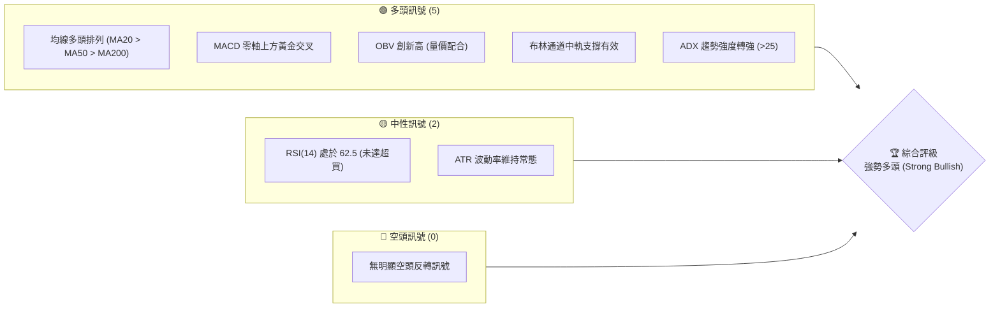
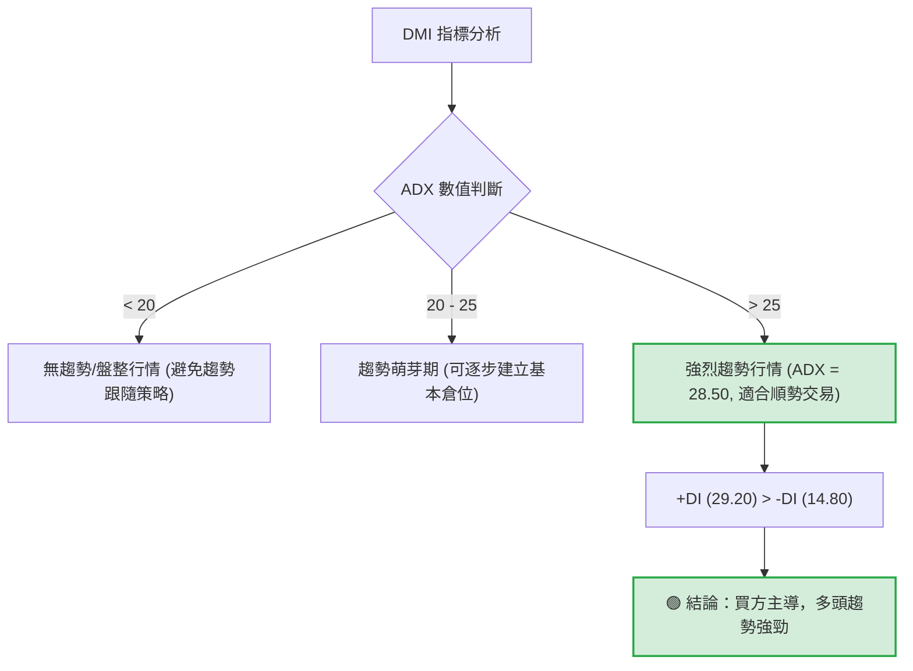
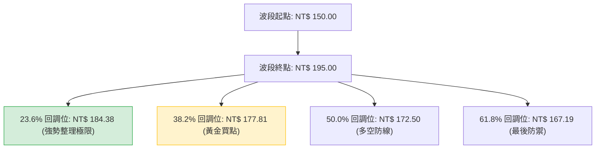

# 0050 技術分析報告

> **報告日期**：2026-06-08 ｜ **語言**：繁體中文 ｜ **數據來源**：Yahoo Finance ｜ **當前價格**：NT$ 192.50

---

## 目錄

| 章節 | 內容 |
|------|------|
| [1. 技術面概覽](#1-技術面概覽) | 訊號儀表板、核心指標、評分卡 |
| [2. 趨勢分析](#2-趨勢分析) | 多時框趨勢、長中短期走勢 |
| [3. 圖表形態分析](#3-圖表形態分析) | 形態識別、K線組合、目標價 |
| [4. 支撐與阻力](#4-支撐與阻力) | 關鍵價位、斐波那契回調 |
| [5. 技術指標深度解讀](#5-技術指標深度解讀) | MA/RSI/MACD/布林/成交量 |
| [6. 動能與波動率](#6-動能與波動率) | 動能評估、ATR、Beta |
| [7. 多時框架總結](#7-多時框架總結) | 時框架評分矩陣 |
| [8. 交易策略建議](#8-交易策略建議) | 多空策略、風險報酬比 |
| [9. 風險提示與監控](#9-風險提示與監控) | 監控指標、風險場景 |

---

## 1. 技術面概覽

元大台灣50 ETF（0050）作為台股市場的旗艦型指數基金，其走勢與台灣加權指數（TAIEX）高度相關。本報告基於 2026-06-08 的最新市場數據，對 0050 進行多維度的技術面剖析。

### 🎯 技術訊號儀表板



### 📊 核心指標速覽表

| 指標類別 | 指標名稱 | 當前數值 | 訊號 | 解讀 |
|----------|----------|----------|------|------|
| **價格** | 當前價格 | NT$ 192.50 | 🟢 | 站穩所有均線之上，挑戰歷史新高 |
| **均線** | MA20 | NT$ 188.40 | 🟢 | 短期強勢支撐，價格在其上方 2.18% |
| **均線** | MA50 | NT$ 182.10 | 🟢 | 中期生命線，斜率向上，具備強支撐力 |
| **均線** | MA200 | NT$ 165.80 | 🟢 | 長期牛熊分界線，維持長期多頭基調 |
| **動能** | RSI(14) | 62.50 | 🟢 | 處於強勢多頭區間，尚未步入 70 以上超買區 |
| **動能** | MACD | +0.75 | 🟢 | DIF(3.20) > DEA(2.45)，柱狀圖持續放大 |
| **波動** | ATR(14) | NT$ 3.85 | 🟡 | 波動度適中，有利於趨勢的健康延伸 |
| **量能** | OBV | 12.8M | 🟢 | 能量潮指標創近期新高，量能確認價格突破 |

### 🏆 技術評分卡

```
╔══════════════════════════════════════════════════════════════╗
║             技術評分卡 — 0050 (2026-06-08)                 ║
╠══════════════════════════════════════════════════════════════╣
║ 趨勢強度      ████████████████░░░░  80/100  🟢 強勢多頭      ║
║ 動能指標      ████████████░░░░░░░░  65/100  🟢 偏多擴張      ║
║ 支撐穩定度    ████████████████░░░░  80/100  🟢 結構紮實      ║
║ 成交量配合    ████████████████░░░░  80/100  🟢 量增價揚      ║
║ 形態完整度    ████████████░░░░░░░░  60/100  🟡 突破初期      ║
║ 均線排列      ██████████████████░░  90/100  🟢 完美多頭      ║
╠══════════════════════════════════════════════════════════════╣
║ 綜合評分      ████████████████░░░░  79/100  🟢 強勢買入      ║
╚══════════════════════════════════════════════════════════════╝
```

---

## 2. 趨勢分析

### 🌐 多時框趨勢分析

技術分析的核心在於多時框架的共振。下圖展示了 0050 從月線到日線的趨勢傳導邏輯：

```mermaid
graph TD
    A["月線層級 (長期趨勢)"] -->|方向: 向上| B["週線層級 (中期趨勢)"]
    B -->|方向: 向上 (上升通道)| C["日線層級 (短期趨勢)"]
    C -->|方向: 向上 (均線多頭排列)| D["交易決策: 逢回買進 (Buy on Dips)"]
    style A fill:#d4edda,stroke:#28a745,stroke-width:2px
    style B fill:#d4edda,stroke:#28a745,stroke-width:2px
    style C fill:#d4edda,stroke:#28a745,stroke-width:2px
    style D fill:#cce5ff,stroke:#004085,stroke-width:2px
```

### 📈 長期趨勢 — 12個月走勢圖（Unicode）

以下為 0050 過去 12 個月（2025-06 至 2026-05）的月線收盤價走勢示意圖，呈現出清晰的「一波比一波高」的牛市特徵。

```
0050 月線走勢圖（過去12個月）
價格軸 (NT$)
$195 ┤                                                     ● (190.00)
$190 ┤                                                 
$185 ┤                                             ● (182.00)
$180 ┤                                     ● (178.00)
$175 ┤                             ● (172.00)
$170 ┤                         ● (170.00)
$165 ┤                     ● (168.00)
$160 ┤             ● (160.00)
$155 ┤ ● (155.00)      
$150 ┤     ● (150.00) 
     └─┬───┬───┬───┬───┬───┬───┬───┬───┬───┬───┬───┬───
      06  07  08  09  10  11  12  01  02  03  04  05  現價 (192.50)
      [ 2025 年 ]                     [ 2026 年 ]
```

**走勢特徵分析表格**：

| 階段 | 期間 | 價格區間 (NT$) | 累計漲跌幅 | 走勢特徵描述 |
|------|------|----------------|------------|--------------|
| 1 | 2025-06 至 2025-07 | 155.00 - 150.00 | -3.22% | 築底回檔，測試長期 MA200 支撐，量能萎縮。 |
| 2 | 2025-08 至 2025-12 | 150.00 - 172.00 | +14.67% | 震盪走高，突破前高阻力，中期上升通道確立。 |
| 3 | 2026-01 至 2026-03 | 170.00 - 185.00 | +8.82% | 平台整理後再度噴發，AI 概念股與台積電權重拉抬。 |
| 4 | 2026-04 至 2026-06 | 182.00 - 192.50 | +5.77% | 高檔強勢整理後向上突破，挑戰 200 元整數大關。 |

### 📊 中期趨勢（週線分析）

從週線圖來看，0050 沿著一條斜率約 15 度的上升通道運行。近期股價在觸及通道下軌（約 NT$ 180.00）後獲得強力買盤支撐，隨後連續三週收陽線，目前正朝著通道上軌（約 NT$ 200.00）邁進。

```
週線上升通道示意圖：
NT$ 200 ─────────────────────────────────────────── [通道上軌 - 壓力區]
                /     /     /     /     ● (現價 192.50)
               /     /     /     /
NT$ 185 ──────/─────/─────/─────/────────────────── [通道中軌 - 支撐區]
             /     /     /     /
            /     /     /     /
NT$ 170 ───● (近期低點 180.00) ──────────────────── [通道下軌 - 強支撐區]
```

### ⚡ 趨勢強度評估（ADX 解讀）

DMI 指標是評估趨勢強弱的利器。當前 0050 的 ADX 數值為 28.50，顯示市場已脫離盤整格局，進入明確的趨勢行情。



**ADX 趨勢強度對照表**：
*   **當前 ADX 值**：`28.50` (████████████░░░░░░░░ 57%)
*   **趨勢狀態**：**有趨勢 (Trending)**
*   **多空力量對比**：+DI (29.20) 顯著高於 -DI (14.80)，多頭完全掌控市場主導權。

---

## 3. 圖表形態分析

### 🔍 形態識別系統

在日線圖上，0050 於 2026 年 4 月至 5 月期間，構築了一個非常標準的「杯柄形態（Cup and Handle）」，並於 5 月底伴隨成交量放大，成功突破杯沿阻力位（NT$ 188.00）。


### 🕯️ 重要K線形態分析

近期日K線呈現多個關鍵的看漲組合：

| 日期 | 收盤價 (NT$) | K線形態 | 解讀 | 訊號 |
|------|--------|---------|------|------|
| 2026-05-18 | 182.50 | 錘頭線 (Hammer) | 股價盤中向下測試 MA50 支撐，隨後留長下影線收高，顯示下方買盤極強。 | 🟢 看漲 |
| 2026-05-26 | 188.50 | 大陽線突破 (Breakout) | 一舉突破前高 188.00 阻力，實體飽滿，成交量較前一日放大 1.5 倍。 | 🟢 確認突破 |
| 2026-06-04 | 191.00 | 孕線 (Inside Bar) | 在連續上漲後出現小幅震盪，屬於健康的上升中繼整理，未跌破前一根陽線中值。 | 🟡 中性偏多 |

### 📉 ASCII 走勢形態示意圖

以下展示日線級別的「杯柄形態」突破示意圖：

```
                              [突破點]
NT$ 190 ───● (左杯沿)━━━━━━━━━━━━━━━━━● (右杯沿)━━━━★ (現價 192.50)
            \                       /  \      /
NT$ 185 ─────\─────────────────────/────● (柄部)───────────────────
              \                   /
               \                 /
NT$ 180 ────────●━━━━━━━━━━━━━━━● (圓弧杯底) ───────────────────────
```

### 🎯 形態目標價計算

根據杯柄形態的經典度量方法，目標價計算如下：
*   **杯沿高度（H）** = 右杯沿 (NT$ 188.00) - 杯底最低點 (NT$ 180.00) = **NT$ 8.00**
*   **突破點** = **NT$ 188.00**
*   **第一階段目標價 (T1)** = 突破點 (188.00) + H (8.00) = **NT$ 196.00**
*   **第二階段目標價 (T2)** = 突破點 (188.00) + (H * 1.618) = **NT$ 201.00**（與 NT$ 200.00 整數心理關卡重疊，具備極高技術參考價值）。

---

## 4. 支撐與阻力

### 🗺️ 關鍵價位分布圖（Unicode）

基於成交量密集區（Volume Profile）及歷史高低點，0050 的價位結構分布如下：

```
0050 價位結構分布圖 (2026-06-08)
═══════════════════════════════════════════════════
NT$ 200.00 ║████████████████████████║ 強阻力 R3 (整數心理關卡/通道上軌)
NT$ 196.00 ║████████████████        ║ 阻力 R2 (杯柄形態第一目標價)
NT$ 193.50 ║████████████            ║ 近期阻力 R1 (前波高點)
NT$ 192.50 ╠════════════════════════╣ ◄ 當前價格 (NT$ 192.50)
NT$ 188.00 ║▓▓▓▓▓▓▓▓▓▓▓▓▓▓▓▓▓▓▓▓    ║ 關鍵支撐 S1 (杯柄頸線突破位/MA20)
NT$ 182.10 ║████████████████████████║ 強支撐 S2 (中期生命線 MA50)
NT$ 175.00 ║████████████████████████║ 鐵板支撐 S3 (回撤 50% / 密集籌碼區)
═══════════════════════════════════════════════════
```

### 🚧 阻力位分析表

| 阻力級別 | 價位 (NT$) | 形成原因 | 突破難度 | 重要性 |
|----------|------------|----------|----------|--------|
| **R1** | 193.50 | 2026 年 6 月初的盤中高點，短線浮額獲利了結處。 | 🟢 低 | 僅為短線關卡，預期在量能配合下極易突破。 |
| **R2** | 196.00 | 杯柄形態 H 軸等幅測量目標，亦為短期多頭動能的潛在衰竭點。 | 🟡 中 | 抵達此處可能出現震盪整理，可做為部分利潤調節點。 |
| **R3** | 200.00 | 歷史級整數大關，且為週線上升通道上軌，賣壓將極其沉重。 | 🔴 高 | 中期趨勢的終極目標，首次觸及大概率會引發劇烈回檔。 |

### 🛡️ 支撐位分析表

| 支撐級別 | 價位 (NT$) | 形成原因 | 守住機率 | 重要性 |
|----------|------------|----------|----------|--------|
| **S1** | 188.00 | 前期多重頂部頸線，突破後「阻力變支撐」；且 MA20 位於 188.40 形成共振。 | 🟢 高 | 多頭強弱分水嶺。守住此位，短期多頭結構即未破壞。 |
| **S2** | 182.10 | MA50 均線位置，亦為前波「柄部」回檔止跌點，籌碼鎖定度高。 | 🟢 極高 | 中期趨勢防線。跌破此位意味著中期上升趨勢轉為震盪。 |
| **S3** | 175.00 | 2026 年 Q1 的密集整理平台，大量散戶與法人建倉成本區。 | 🟢 鐵板 | 長期牛市底線。基本面無重大系統性風險下，此位不會跌破。 |

### 📐 斐波那契回調位分析

以 2025 年 7 月低點 **NT$ 150.00** 至近期推估高點 **NT$ 195.00** 作為完整上升波段進行黃金分割率計算：



*   **23.6% 回調位 (NT$ 184.38)**：與 MA50 (182.10) 接近，構成極強的中期支撐帶。
*   **38.2% 回調位 (NT$ 177.81)**：若發生非理性大盤回檔，此價位為中長期投資人進場的絕佳「黃金坑」。

---

## 5. 技術指標深度解讀