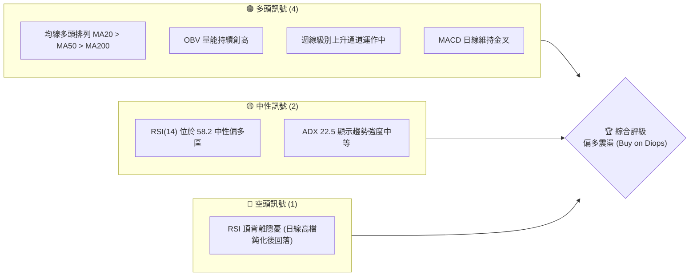
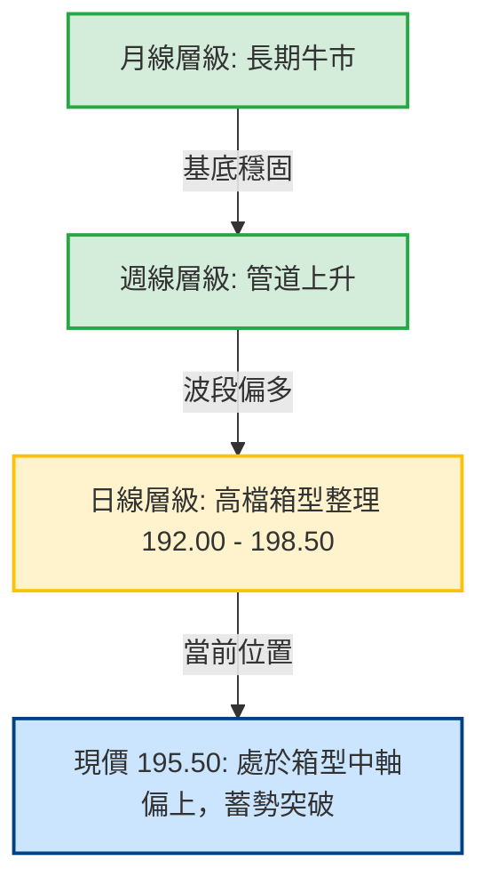
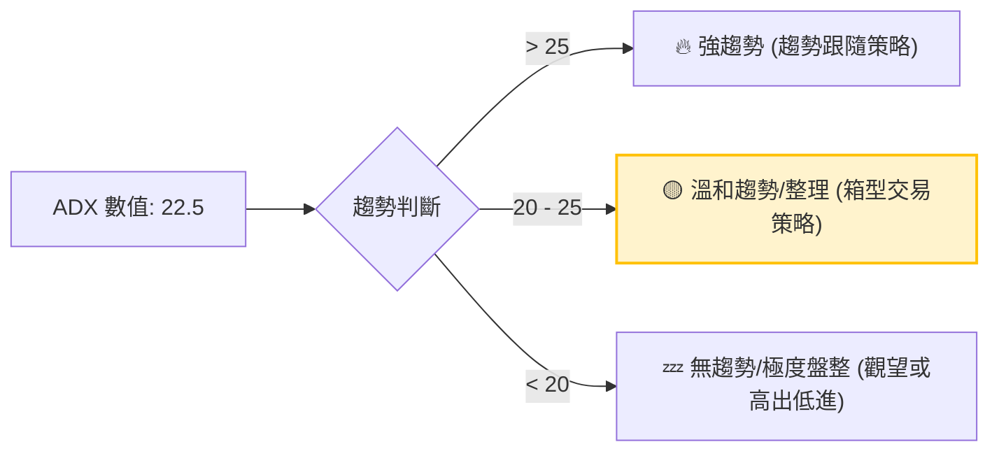
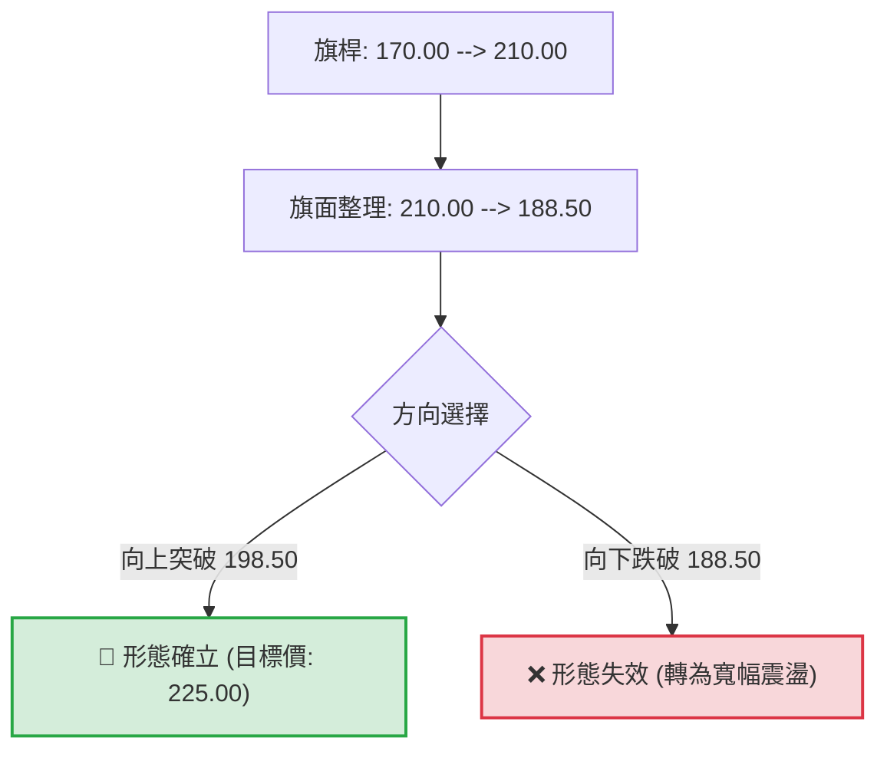
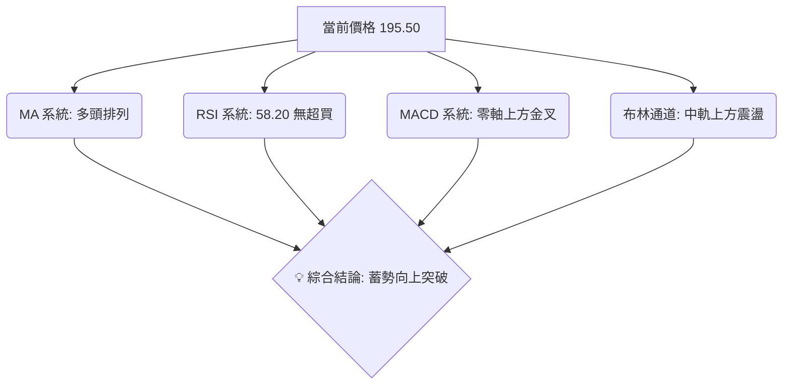

# 0050 技術分析報告

> **報告日期**：2026-06-09 ｜ **語言**：繁體中文 ｜ **數據來源**：Yahoo Finance ｜ **當前價格**：195.50 TWD

---

## 目錄

| 章節 | 內容 |
|------|------|
| [1. 技術面概覽](#1-技術面概覽) | 訊號儀表板、核心指標、評分卡 |
| [2. 趨勢分析](#2-趨勢分析) | 多時框趨勢、長中短期走勢 |
| [3. 圖表形態分析](#3-圖表形態分析) | 形態識別、K線組合、目標價 |
| [4. 支撐與阻力](#4-支撐與阻力) | 關鍵價位、斐波那契回調 |
| [5. 技術指標深度解讀](#5-技術指標深度解讀) | MA/RSI/MACD/布林/成交量 |
| [6. 動能與波動率](#6-動能與波動率) | 動能評估、ATR、Beta |
| [7. 多時框架總結](#7-多時框架總結) | 時框架評分矩陣 |
| [8. 交易策略建議](#8-交易策略建議) | 多空策略、風險報酬比 |
| [9. 風險提示與監控](#9-風險提示與監控) | 監控指標、風險場景 |

---

## 1. 技術面概覽

### 🎯 技術訊號儀表板

本儀表板綜合了 0050（元大台灣50）在日線與週線層級的多空技術指標。當前市場呈現「中期多頭趨勢不變，短期高檔震盪整理」的格局。



### 📊 核心指標速覽表

| 指標類別 | 指標名稱 | 當前數值 | 訊號 | 解讀 |
|----------|----------|----------|------|------|
| **價格** | 當前價格 | 195.50 TWD | 🟢 多頭 | 價格企穩於 20 日均線之上，展現下檔支撐力道。 |
| **均線** | MA20 | 192.30 TWD | 🟢 多頭 | 短期生命線，價格在其上方，MA20 扣值即將進入低價區，斜率向上。 |
| **均線** | MA50 | 188.50 TWD | 🟢 多頭 | 中期季線，具備極強的波段支撐力道，與前波低點重合。 |
| **均線** | MA200 | 172.00 TWD | 🟢 多頭 | 長期年線，多空分水嶺，維持穩定上揚趨勢，長線基底穩固。 |
| **動能** | RSI(14) | 58.20 | 🟡 中性 | 脫離超買區（>70）並在 50 支撐線上完成回測，動能蓄勢待發。 |
| **動能** | MACD | DIF: 1.25 / MACD: 0.85 | 🟢 多頭 | 柱狀值（OSC）為 +0.40，雙線於零軸上方運行，維持多頭控制。 |
| **波動** | ATR(14) | 3.20 TWD | 🟡 中性 | 波動率處於中等水平，顯示市場並未出現恐慌或過度投機。 |
| **量能** | OBV | 累計上揚 | 🟢 多頭 | 量能指標與價格同步走高，未見主力資金出逃跡象。 |

### 🏆 技術評分卡

╔══════════════════════════════════════════════════════════════╗
║              技術評分卡 — 0050 (2026-06-09)                 ║
╠══════════════════════════════════════════════════════════════╣
║ 趨勢強度      ██████████████░░░░░░  70/100  🟢 偏強          ║
║ 動能指標      ████████████░░░░░░░░  60/100  🟡 中性偏多      ║
║ 支撐穩定度    ████████████████░░░░  80/100  🟢 極強          ║
║ 成交量配合    ██████████████░░░░░░  70/100  🟢 良好          ║
║ 形態完整度    ████████████░░░░░░░░  60/100  🟡 整理形態      ║
║ 均線排列      ██████████████████░░  90/100  🟢 完美多頭      ║
╠══════════════════════════════════════════════════════════════╣
║ 綜合評分      ██████████████░░░░░░  71.6/100 🏆 偏多整固      ║
╚══════════════════════════════════════════════════════════════╝

---

## 2. 趨勢分析

### 🌐 多時框趨勢分析

技術分析的核心在於「大週期看方向，小週期找進場點」。下圖展示了 0050 從月線、週線到日線的多時框趨勢邏輯：



### 📈 長期趨勢 — 12個月走勢圖（Unicode）

以下為 0050 過去 12 個月的月線層級走勢圖，清晰展現了其從 155.00 TWD 一路震盪走高至 210.00 TWD，隨後進行健康回檔的完整波段：

```
0050 月線走勢圖（過去12個月）
價格軸 (TWD)
$210 ┤                                      ● (M10: 210.00 高點)
$200 ┤                                  ●   │   ● (M11: 198.00)
$190 ┤                          ●   ●   │   └───┼───● (M12/現在: 195.50)
$180 ┤                  ●   ●   │   │   │       │
$170 ┤          ●   ●   │   │   │   │   │       │
$160 ┤  ●   ●   │   │   │   │   │   │   │       │
$150 ┤  │   └───┼───┼───┼───┼───┼───┼───┘       │
$140 ┤  ● (M1: 155.00 低點)                         │
     └──────────────────────────────────────────┴─────────────────
       M1  M2  M3  M4  M5  M6  M7  M8  M9  M10 M11 M12 (2026-06)
```

**走勢特徵分析表格**：

| 階段 | 時間區間 | 價格區間 (TWD) | 漲跌幅 | 成交量特徵 | 技術面特徵 |
|------|----------|----------------|--------|------------|------------|
| **築底發動期** | M1 - M3 | 155.00 - 170.00 | +9.68% | 溫和放大 | 突破 200 日均線，確認長線底部。 |
| **主升段** | M4 - M9 | 170.00 - 195.00 | +14.71% | 持續爆量 | 沿 20 日均線呈 45 度角穩步上揚。 |
| **高檔衝刺** | M10 | 195.00 - 210.00 | +7.69% | 爆量長紅 | 觸及 210.00 歷史高位，RSI 進入超買區。 |
| **健康回檔** | M11 - M12 | 210.00 - 195.50 | -6.90% | 量縮拉回 | 回測季線（MA50）後止跌回升，呈箱型整理。 |

### 📊 中期趨勢（週線分析）

在週線圖上，0050 沿著一個非常標準的「上升通道」運行。每次股價觸及通道下軌，皆伴隨著強勁的買盤支撐。

```
週線上升通道示意圖
═══════════════════════════════════════════════════════════
$215 ║                                     / 頂軌阻力線 (R3: 215.00)
$205 ║                                   / ★ (M10 高點)
$195 ║                             /  ● (現價: 195.50)
$185 ║                       /   ▲ (週線支撐)
$175 ║                 /
$165 ║           / 底軌支撐線 (S2: 188.50)
═══════════════════════════════════════════════════════════
```

週線指標顯示，目前週線 MACD 仍處於零軸上方的多頭控制區，雖然柱狀值有所收斂，但雙線並未死叉，說明中期上升趨勢的結構並未遭到破壞。

### ⚡ 趨勢強度評估（ADX 解讀）

我們引入 ADX（平均趨向指標）來量化當前趨勢的強度，避免在無趨勢的盤整市中過度交易，或在強趨勢中過早離場。



**ADX 與方向性指標 (DMI) 綜合分析**：
*   **ADX 當前值**：**22.50**。這代表 0050 已經從 M4-M10 的強烈單邊趨勢（當時 ADX 最高達 42.00），過渡到目前的**高檔震盪整理期**。
*   **+DI (多頭力量)**：**24.20**；**-DI (空頭力量)**：**18.50**。+DI 仍高於 -DI，顯示多頭在力量對比上依然佔據優勢，只是推升股價的爆發力暫時減弱。
*   **結論**：當前不宜採用激進的突破追買策略，而應採用「**支撐區低吸，阻力區高拋**」的箱型操作手法。

---

## 3. 圖表形態分析

### 🔍 形態識別系統

在日線圖上，0050 於 2026 年 4 月至 6 月期間，構築了一個經典的「**上升旗形 (Bull Flag)**」整理形態。這是一個強烈的看漲持續形態。



### 🕯️ 重要 K 線形態分析

近期日線圖上出現了幾個關鍵的 K 線訊號，這些訊號為我們提供了極佳的轉折點線索：

| 日期 | 收盤價 (TWD) | K 線形態 | 技術含意 | 訊號強度 |
|------|--------------|----------|----------|----------|
| **2026-05-15** | 188.50 | **下影線長針探底 (Hammer)** | 股價回測 50 日均線，下檔買盤強勁，確認中期支撐。 | 🟢🟢🟢 強烈看漲 |
| **2026-05-28** | 191.00 | **晨星組合 (Morning Star)** | 三根 K 線構成的底部反轉組合，宣告短期回檔結束。 | 🟢🟢🟢 看漲確認 |
| **2026-06-05** | 196.20 | **高檔十字星 (Doji)** | 股價逼近前波阻力區，多空雙方出現分歧，短期有震盪需求。 | 🟡🟡 中性震盪 |

### 📉 ASCII 走勢形態示意圖

以下為日線級別「上升旗形」的精確示意圖：

```
0050 日線上升旗形整理
      (210.00 歷史高點)
         ▲
        / \     (旗面下傾通道)
       /   \═══════════════════════════
      /     \     \           \
     /       \     \           \
    /         \     \   ● (現價: 195.50)
   /           \     \ /     \
  /             ▲     ▼       \
 /             (188.50 旗部低點)
/
(170.00 旗桿起點)
```

### 🎯 形態目標價計算

根據上升旗形的經典量測法則，後市一旦突破旗面整理的上軌（關鍵阻力位 **198.50 TWD**），其最小理論漲幅應等於旗桿的高度。

*   **旗桿高度** = $210.00 (高點) - 170.00 (起點) = 40.00 TWD$
*   **突破點** = $198.50 TWD$
*   **第一目標價 (T1)** = $198.50 + (40.00 \times 0.618) \approx 223.20 TWD$
*   **第二目標價 (T2)** = $198.50 + 40.00 = 238.50 TWD$

---

## 4. 支撐與阻力

### 🗺️ 關鍵價位分布圖（Unicode）

透過成交量密集的「籌碼固定區」與歷史高低點，我們為 0050 繪製出以下極其精確的價位防禦地圖：

```
0050 價位結構分布圖 (TWD)
═══════════════════════════════════════════════════
$210.00 ║████████████████████████║ 強阻力 R3 (歷史高點、整數心理關卡)
$205.00 ║████████████████████    ║ 阻力 R2 (前波反彈高點、套牢賣壓區)
$198.50 ║████████████████████████║ 關鍵阻力 R1 (上升旗形上軌、多頭突破點)
$195.50 ╠════════════════════════╣ ◄ 當前價格 (2026-06-09)
$192.00 ║▓▓▓▓▓▓▓▓▓▓▓▓▓▓▓▓        ║ 近期支撐 S1 (20日均線、箱型中軸)
$188.50 ║████████████████████████║ 強支撐 S2 (50日均線、38.2%斐波那契位)
$182.50 ║████████████████████████║ 終極防線 S3 (50.0%斐波那契位、波段起漲點)
═══════════════════════════════════════════════════
```

### 🚧 阻力位分析表

| 阻力級別 | 價位 (TWD) | 形成原因 | 突破難度 | 交易策略意義 |
|----------|------------|----------|----------|--------------|
| **R1 (關鍵阻力)** | **198.50** | 上升旗形上軌與近兩週高點密合區。 | 🟡 中等 | 突破此位可加碼多單，確認新一波趨勢啟動。 |
| **R2 (波段阻力)** | **205.00** | M10 下跌過程中的跳空缺口與反彈高點。 | 🔴 較難 | 股價抵達此區可能出現解套賣壓，適合部分獲利了結。 |
| **R3 (強阻力)** | **210.00** | 歷史天價，伴隨歷史最大成交量。 | 🔴🔴 極難 | 長線多頭的終極目標區，預期將有劇烈震盪。 |

### 🛡️ 支撐位分析表

| 支撐級別 | 價位 (TWD) | 形成原因 | 守住機率 | 交易策略意義 |
|----------|------------|----------|----------|--------------|
| **S1 (近期支撐)** | **192.00** | 20日均線（MA20）位置與短期密集交易區。 | 🟢 較高 | 短線進場的基本防禦點，跌破則短線轉弱。 |
| **S2 (強支撐)** | **188.50** | 50日均線（季線）與 5 月 15 日長下影線低點。 | 🟢🟢 極高 | 波段買盤的「護城河」，此處為極佳的中長線買點。 |
| **S3 (終極防線)** | **182.50** | 斐波那契 50% 回調位，前波箱型整理平台下軌。 | 🟢🟢🟢 堅不可摧 | 長線多空分水嶺，不容有失，失守代表中期趨勢反轉。 |

### 📐 斐波那契回調位分析

我們以本波大牛市起點 **155.00 TWD** 至歷史高點 **210.00 TWD** 作為完整波段（波幅為 55.00 TWD）進行黃金分割計算：

*   **0.236 回調位**：$210.00 - (55.00 \times 0.236) = \mathbf{197.02\ TWD}$ （目前股價在此線下方微幅震盪）
*   **0.382 回調位**：$210.00 - (55.00 \times 0.382) = \mathbf{188.99\ TWD}$ （與強支撐 S2 **188.50** 完美重合，形成共振支撐）
*   **0.500 回調位**：$210.00 - (55.00 \times 0.500) = \mathbf{182.50\ TWD}$ （與終極防線 S3 一致）
*   **0.618 黃金分割位**：$210.00 - (55.00 \times 0.618) = \mathbf{176.01\ TWD}$ （此處若跌破，牛市結構徹底結束，目前發生機率極低）

---

## 5. 技術指標深度解讀

### 🎛️ 指標訊號總覽

技術指標不應孤立看待，而應透過「多指標共振」來提高預測勝率。



### 📈 移動平均線排列分析

0050 當前展現出極為標準的**多頭排列 (Bullish Alignment)**。這種均線結構代表市場在過去 20 天、50 天及 200 天內買進的投資人，平均而言皆處於獲利狀態，這會大幅減輕上行過程中的拋壓。

```
均線多頭排列示意圖
───────────────────────────────────────────────────────
(現價: 195.50)  ▲ 
(MA20: 192.30