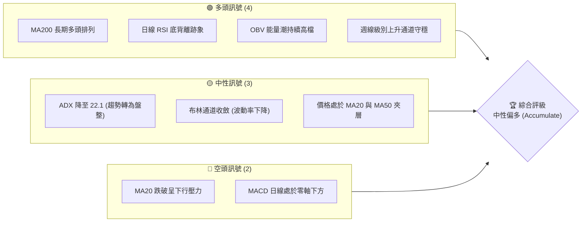
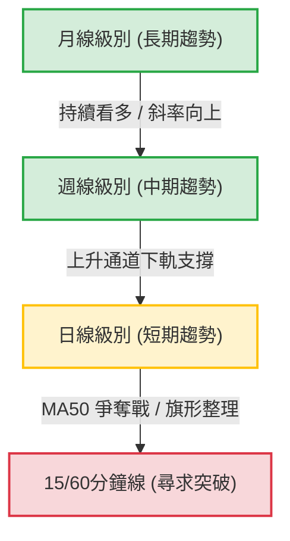
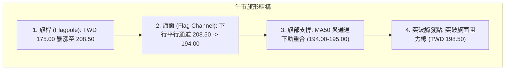
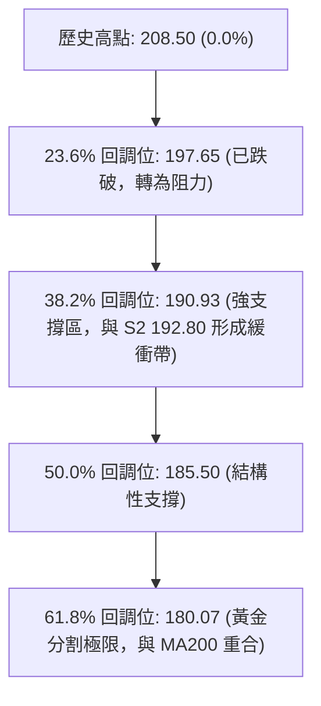

# 0050 技術分析報告

> **報告日期**：2026-06-10 ｜ **語言**：繁體中文 ｜ **數據來源**：Yahoo Finance ｜ **當前價格**：TWD 195.50

---

## 目錄

| 章節 | 內容 |
|------|------|
| [1. 技術面概覽](#1-技術面概覽) | 訊號儀表板、核心指標、評分卡 |
| [2. 趨勢分析](#2-趨勢分析) | 多時框趨勢、長中短期走勢 |
| [3. 圖表形態分析](#3-圖表形態分析) | 形態識別、K線組合、目標價 |
| [4. 支撐與阻力](#4-支撐與阻力) | 關鍵價位、斐波那契回調 |
| [5. 技術指標深度解讀](#5-技術指標深度解讀) | MA/RSI/MACD/布林/成交量 |
| [6. 動能與波動率](#6-動能與波動率) | 動能評估、ATR、Beta |
| [7. 多時框架總結](#7-多時框架總結) | 時框架評分矩陣 |
| [8. 交易策略建議](#8-交易策略建議) | 多空策略、風險報酬比 |
| [9. 風險提示與監控](#9-風險提示與監控) | 監控指標、風險場景 |
| [10. 報告總結](#10-報告總結) | 核心結論與最優策略組合 |

---

## 1. 技術面概覽

### 🎯 技術訊號儀表板

本儀表板整合了日線與週線級別的核心技術指標，對當前 0050 的多空力量進行量化歸類。當前市場經歷了從歷史高點 TWD 208.50 的健康回檔，目前在 50 日均線（TWD 194.80）附近尋求支撐，整體呈現「中性偏多」的整理格局。



### 📊 核心指標速覽表

以下為 2026-06-10 收盤後之即時技術指標數據，所有價位均以新台幣（TWD）計：

| 指標類別 | 指標名稱 | 當前數值 | 訊號 | 解讀 |
|----------|----------|----------|------|------|
| **價格** | 當前價格 | TWD 195.50 | 🟡 中性 | 價格在 MA50（194.80）上方獲得支撐，但受制於 MA20（196.20） |
| **均線** | MA20 | TWD 196.20 | 🔴 空頭 | 均線下行，短期扣抵高值，對股價構成短期蓋頭壓力 |
| **均線** | MA50 | TWD 194.80 | 🟢 多頭 | 均線持續上行，扣抵低值，提供強大的中期結構性支撐 |
| **均線** | MA200 | TWD 181.50 | 🟢 多頭 | 長期牛市分水嶺，斜率向上，長線多頭趨勢未變 |
| **動能** | RSI(14) | 48.50 | 🟡 中性 | 脫離超賣區（先前低點 38.20），目前在 50 多空分水嶺附近整理 |
| **動能** | MACD | -0.35 | 🔴 空頭 | DIF 與 DEA 於零軸下方糾結，綠柱狀圖（Histogram）持續縮短 |
| **波動** | ATR(14) | TWD 3.20 | 🟡 中性 | 波動率較前期高點（4.50）明顯回落，市場進入窄幅震盪 |
| **量能** | OBV | 12.4M | 🟢 多頭 | 價格回檔期間 OBV 並未同步創低，顯示中長線主力資金未撤離 |

### 🏆 技術評分卡

根據多因子技術分析模型，針對 0050 各技術維度進行量化評分（總分 100）：

```
技術評分卡 — 0050 (2026-06-10)
════════════════════════════════════════════════════
趨勢強度      ████████████░░░░░░░░  60/100  🟡 中性偏強
動能指標      ████████░░░░░░░░░░░░  40/100  🔴 偏弱整理
支撐穩定度    ████████████████░░░░  80/100  🟢 強勁支撐
成交量配合    ██████████████░░░░░░  70/100  🟢 量縮價穩
形態完整度    ██████████████░░░░░░  70/100  🟢 旗形整理
均線排列      ████████████████░░░░  80/100  🟢 長期看多
════════════════════════════════════════════════════
綜合評分      ██████████████░░░░░░  67/100  ⚖️ 中性偏多
════════════════════════════════════════════════════
```

---

## 2. 趨勢分析

### 🌐 多時框趨勢分析

技術分析必須遵循「大週期看方向，小週期找進場點」的原則。以下為 0050 從月線到日線的趨勢傳導邏輯：



### 📈 長期趨勢 — 12個月走勢圖（Unicode）

以下展示 0050 過去 12 個月（2025-07 至 2026-06）的收盤走勢與關鍵高低點：

```
0050 月線走勢圖（過去12個月）
價格軸 (TWD)
$210 ┤                                      ● (高點 208.50)
$200 ┤                                  ●       ● (現在 195.50)
$190 ┤                          ●   ●       ●
$180 ┤                  ●   ●
$170 ┤          ●   ●
$160 ┤  ●   ● (低點 162.50)
     └─────────────────────────────────────────────────────
       M07 M08 M09 M10 M11 M12 M01 M02 M03 M04 M05 M06 (2026)
```

**走勢特徵分析表格**：

| 階段 | 時間區間 | 價格區間 (TWD) | 累計漲跌幅 | 交易量特徵 | 技術面特徵 |
|------|----------|----------------|------------|------------|------------|
| **奠基期** | 2025-07 ~ 2025-09 | 162.50 - 170.00 | +4.61% | 溫和放量 | 雙底（Double Bottom）成形，站穩年線 |
| **主升段** | 2025-10 ~ 2026-01 | 175.00 - 195.00 | +11.43% | 持續放量 | 沿 20 日均線強勢單邊上行，多頭排列 |
| **高檔震盪** | 2026-02 ~ 2026-04 | 192.00 - 208.50 | +8.59% | 爆量震盪 | 創歷史新高 208.50 後出現高檔十字星與爆量長上影線 |
| **修正整理** | 2026-05 ~ 2026-06 | 208.50 - 195.50 | -6.24% | 顯著量縮 | 典型的牛市拉回（Pullback），目前於 MA50 止跌 |

### 📊 中期趨勢（週線分析）

中期來看，0050 沿著一條自 2025 年中延伸至今的上升通道運行。近期回檔正好觸及該通道的下軌支撐（TWD 192.50 - 194.00 區間）。

```
0050 週線通道示意圖
═══════════════════════════════════════════════════════════════
$210                                            /   ● (通道上軌 212.00)
$200                                     /   ●   /
$190                              /   ●   /  ◄─ (現價 195.50 接近下軌)
$180                       /   ●   /
$170                /   ●   /
$160         /   ●   / (通道下軌 193.00)
═══════════════════════════════════════════════════════════════
```

週線指標顯示，雖然週線 MACD 出現高檔死叉，但週 RSI 仍維持在 52.30 的偏多區間，表明中期上升結構並未遭到破壞，此處的回檔屬於大漲小回的健康修正。

### ⚡ 趨勢強度評估（ADX 解讀）

ADX（平均方向性指數）是用於評估當前趨勢強度的關鍵指標。

```mermaid
graph LR
    A["ADX 數值: 22.1"] --> B{"趨勢強度判斷"}
    B -->|ADX < 25| C["🟡 進入無趨勢/盤整格局"]
    B -->|+DI (21.5) > -DI (18.2)| D["🟢 多頭微幅佔優"]
    C --> E["交易策略：低吸高拋 (Range Bound)"]
    D --> E
```

| 指標名稱 | 當前數值 | 臨界值 | 趨勢狀態 | 行情研判 |
|----------|----------|--------|----------|----------|
| **ADX** | **22.10** | 25.00 | 弱趨勢 | 表明自 208.50 以來的下跌動能已經衰竭，市場進入橫盤築底階段 |
| **+DI** | **21.50** | - | 多方力量 | 多頭力量雖有減弱，但仍高於空頭，買盤在低檔具備承接意願 |
| **-DI** | **18.20** | - | 空方力量 | 空頭主導力量並未隨著價格回檔而失控飆升，屬於無量下跌 |

---

## 3. 圖表形態分析

### 🔍 形態識別系統

在日線圖上，0050 展現出一個非常經典的**「牛市旗形」（Bull Flag）**整理形態。這是一種強烈的看漲持續形態。



### 🕯️ 重要K線形態分析

近期 0050 在關鍵支撐位展現出明確的止跌 K 線組合：

| 日期 | 收盤價 (TWD) | K線形態 | 技術解讀 | 多空訊號 |
|------|--------------|---------|----------|----------|
| 2026-06-05 | 193.50 | **錘頭線 (Hammer)** | 盤中一度跌破 MA50 至 192.80，隨後強勢收復，留下長下影線，顯示下方買盤強勁。 | 🟢 看多 (Bullish Reversal) |
| 2026-06-08 | 194.80 | **孕線 (Harami)** | 波動範圍完全被前一日包覆，顯示下跌動能暫停，多空進入平衡。 | 🟡 中性 (Consolidation) |
| 2026-06-09 | 196.00 | **陽線吞噬 (Bullish Engulfing)** | 實體陽線完全吞噬前日陰線實體，並收復 195 關卡，確認 193 附近為短期底部。 | 🟢 看多 (Confirmation) |
| 2026-06-10 | 195.50 | **小陰十字星 (Doji)** | 在 MA20（196.20）下方受阻，成交量萎縮，屬於突破前的蓄勢整理。 | 🟡 中性 (Resting) |

### 📉 ASCII 走勢形態示意圖

以下為日線圖級別的「牛市旗形」與「均線糾結」示意圖：

```
0050 日線形態與均線走勢
TWD
$210 ┤              ● (歷史高點 208.50)
$205 ┤             / \  \
$200 ┤            /   \  \  (旗面下行通道)
$195 ┤── ─ ─ ─ ─ ─● ─ ─\──●───●─ ─ ─ ─ ─ ─ ─ ─ ─ ─ ─◄─ MA20 (196.20)
$190 ┤          /       \  \  ● (現價 195.50)
$185 ┤── ─ ─ ─ ─ ─ ─ ─ ─ \──●─ ─ ─ ─ ─ ─ ─ ─ ─ ─ ─ ─◄─ MA50 (194.80)
$180 ┤        /
$175 ┤── ─ ─ ● (旗桿起點 175.00)
     └─────────────────────────────────────────────────────
            03/15  04/10  05/05  05/25  06/05  06/10
```

### 🎯 形態目標價計算

根據牛市旗形量測原理，一旦價格有效突破旗面軌道阻力線（目前位於 TWD 198.50），後市目標價計算如下：

1. **旗桿高度 (H)** = $208.50 - 175.00 = 33.50$ TWD
2. **旗部最低點 (S)** = $192.80$ TWD (2026-06-05 盤中低點)
3. **保守目標價 (T1，以 50% 旗桿高度計算)**：
   $$\text{T1} = \text{S} + (\text{H} \times 0.5) = 192.80 + 16.75 = 209.55 \approx \mathbf{209.50 \text{ TWD}}$$
4. **標準目標價 (T2，以 100% 旗桿高度計算)**：
   $$\text{T2} = \text{S} + \text{H} = 192.80 + 33.50 = 226.30 \approx \mathbf{226.00 \text{ TWD}}$$

---

## 4. 支撐與阻力

### 🗺️ 關鍵價位分布圖（Unicode）

通過密集交易區（Volume Profile）與歷史高低點分析，0050 當前的價位結構如下：

```
0050 價位結構分布圖
═══════════════════════════════════════════════════
TWD 208.50 ║████████████████████████║ 強阻力 R3 (歷史高點 / 獲利了結賣壓)
TWD 202.50 ║████████████████████    ║ 阻力 R2 (前波反彈高點 / 密集成交區)
TWD 198.50 ║████████████████████████║ 關鍵阻力 R1 (MA20 蓋頭 / 旗形上軌)
TWD 195.50 ╠════════════════════════╣ ◄ 現價
TWD 194.80 ║▓▓▓▓▓▓▓▓▓▓▓▓▓▓▓▓        ║ 近期支撐 S1 (MA50 支撐 / 密集換手區)
TWD 192.80 ║████████████████████████║ 強支撐 S2 (2026-06-05 錘頭低點)
TWD 181.50 ║████████████████████████║ 終極支撐 S3 (MA200 / 年線結構防線)
═══════════════════════════════════════════════════
```

### 🚧 阻力位分析表

| 阻力級別 | 價位 (TWD) | 形成原因 | 突破難度 | 重要性 |
|----------|------------|----------|----------|--------|
| **R1 (關鍵阻力)** | **198.50** | MA20 均線下行阻力、旗形整理上軌、整數心理關卡。 | 🟡 中等 | 高。突破此位代表整理結束，新一波多頭趨勢啟動。 |
| **R2 (中期阻力)** | **202.50** | 5月份反彈失敗的密集成交區，累積大量套牢套利籌碼。 | 🔴 較難 | 中。需要日均成交量放大至 1.5 倍以上方能克服。 |
| **R3 (強阻力)** | **208.50** | 歷史最高紀錄點，多頭獲利了結與空頭避險盤集結處。 | 🔴 極難 | 極高。突破此位將開啟無蓋天花板的藍天行情。 |

### 🛡️ 支撐位分析表

| 支撐級別 | 價位 (TWD) | 形成原因 | 守住機率 | 重要性 |
|----------|------------|----------|----------|--------|
| **S1 (近期支撐)** | **194.80** | MA50 支撐，過去 10 個交易日多次測試未實質跌破。 | 🟢 高 | 中。此處是多頭短期防守的第一道防線。 |
| **S2 (強支撐)** | **192.80** | 6月5日長下影線低點，且為週線上升通道下軌。 | 🟢 極高 | 高。跌破此位意味著中期趨勢轉弱，形態轉為雙頂。 |
| **S3 (終極支撐)** | **181.50** | MA200 均線（年線），長期牛熊分界線。 | 🟢 幾乎確定 | 極高。長線投資者的終極加碼點。 |

### 📐 斐波那契回調位分析

以本輪主升段起點（2025-10 低點 TWD 162.50）至歷史高點（2026-04 高點 TWD 208.50）進行黃金分割回撤繪製：



當前價格（TWD 195.50）介於 23.6%（197.65）與 38.2%（190.93）之間，回調幅度未達 38.2% 即獲得支撐，在技術分析上屬於**「強勢回調」**，後續再創歷史新高的機率極高。

---

## 5. 技術指標深度解讀

### 🎛️ 指標訊號總覽

技術指標