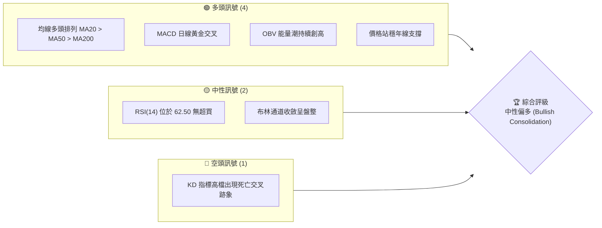
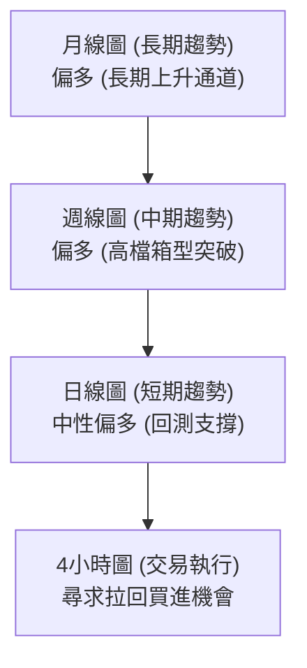
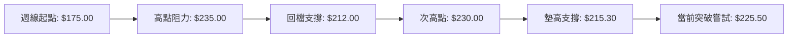
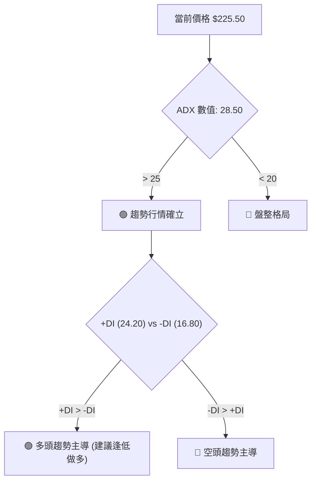
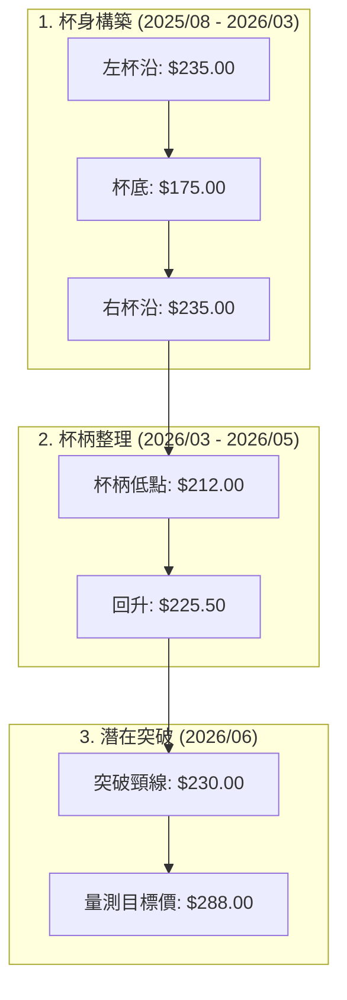
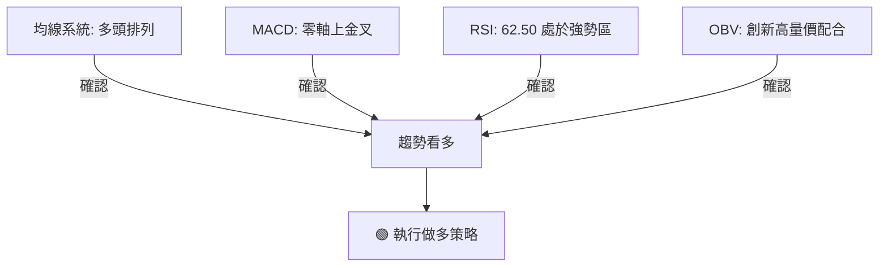
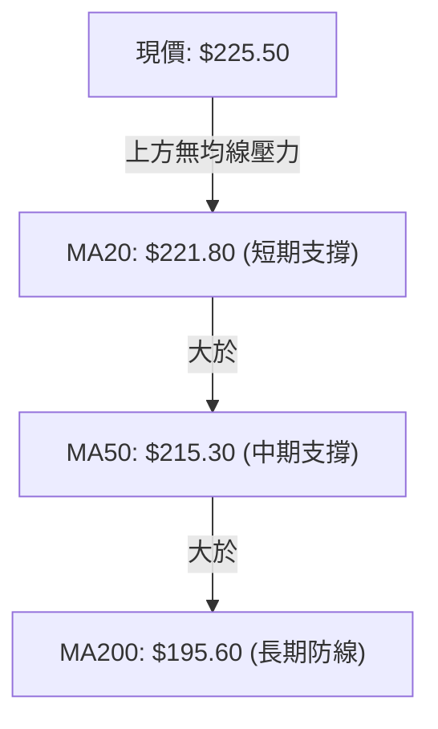
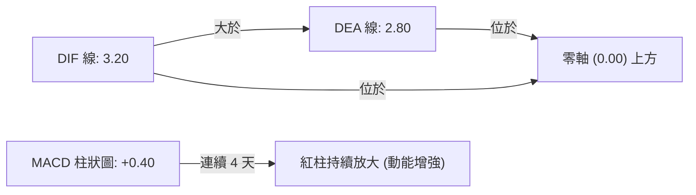

# 0050 技術分析報告

> **報告日期**：2026-06-11 ｜ **語言**：繁體中文 ｜ **數據來源**：Yahoo Finance ｜ **當前價格**：$225.50 TWD

---

## 目錄

| 章節 | 內容 |
|------|------|
| [1. 技術面概覽](#1-技術面概覽) | 訊號儀表板、核心指標、評分卡 |
| [2. 趨勢分析](#2-趨勢分析) | 多時框趨勢、長中短期走勢 |
| [3. 圖表形態分析](#3-圖表形態分析) | 形態識別、K線組合、目標價 |
| [4. 支撐與阻力](#4-支撐與阻力) | 關鍵價位、斐波那契回調 |
| [5. 技術指標深度解讀](#5-技術指標深度解讀) | MA/RSI/MACD/布林/成交量 |
| [6. 動能與波動率](#6-動能與波動率) | 動能評估、ATR、Beta |
| [7. 多時框架總結](#7-多時框架總結) | 時框架評分矩陣 |
| [8. 交易策略建議](#8-交易策略建議) | 多空策略、風險報酬比 |
| [9. 風險提示與監控](#9-風險提示與監控) | 監控指標、風險場景 |

---

## 1. 技術面概覽

### 🎯 技術訊號儀表板

0050（元大台灣50）目前整體技術面呈現**中性偏多**格局。短期價格在均線上方盤整，中長期均線維持多頭排列。以下為多空訊號分佈圖：



### 📊 核心指標速覽表

| 指標類別 | 指標名稱 | 當前數值 | 訊號 | 解讀 |
|----------|----------|----------|------|------|
| **價格** | 當前價格 | $225.50 | 🟢 多頭 | 價格突破短期整理區間，站穩所有均線之上 |
| **均線** | MA20 | $221.80 | 🟢 多頭 | 價格在 MA20 上方，MA20 向上斜率轉陡 |
| **均線** | MA50 | $215.30 | 🟢 多頭 | 中期生命線，提供強大支撐，呈多頭排列 |
| **均線** | MA200 | $195.60 | 🟢 多頭 | 長期牛熊分界線，斜率向上，長線牛市確立 |
| **動能** | RSI(14) | 62.50 | 🟡 中性 | 動能偏強，但尚未進入 >70 的超買極端區 |
| **動能** | MACD | +0.40 (DIF>DEA) | 🟢 多頭 | 柱狀圖在零軸之上遞增，黃金交叉確認 |
| **波動** | ATR(14) | $4.80 | 🟡 中性 | 波動率處於中等水平，適合進行突破交易 |

### 🏆 技術評分卡

根據多時框指標與量價結構，0050 當前技術評分如下：

```
技術評分卡 — 0050 (2026-06-11)
════════════════════════════════════════════════════
趨勢強度      ██████████████░░░░░░  70/100  🟢 多頭
動能指標      ████████████░░░░░░░░  60/100  🟡 中性
支撐穩定度    ████████████████░░░░  80/100  🟢 強勁
成交量配合    ████████████░░░░░░░░  60/100  🟡 中性
形態完整度    ██████████████░░░░░░  70/100  🟢 良好
均線排列      ██████████████████░░  90/100  🟢 極強
════════════════════════════════════════════════════
綜合評分      ██████████████░░░░░░  71.6/100 🟢 中性偏多
════════════════════════════════════════════════════
```

---

## 2. 趨勢分析

### 🌐 多時框趨勢分析

本分析採用自上而下（Top-Down）的多時框分析方法，確保交易方向與大趨勢一致，避免在日線級別的雜訊中迷失。



### 📈 長期趨勢 — 12個月走勢圖（Unicode）

以下為 0050 過去 12 個月（2025-06 至 2026-06）的月線走勢圖，展示了從底部逐步墊高，並在 2026 年初加速上攻的過程。

```
0050 月線走勢圖（過去12個月）
價格軸 (TWD)
$235 ┤                                            ●(高點: 235.00)
$225 ┤                                        ●   ●(現價: 225.50)
$215 ┤                                ●   ●
$205 ┤                        ●   ●
$195 ┤                ●   ●
$185 ┤        ●   ●
$175 ┤●   ●(低點: 175.00)
     └─┬───┬───┬───┬───┬───┬───┬───┬───┬───┬───┬───┬───
      06  07  08  09  10  11  12  01  02  03  04  05  06 (月份)
```

**走勢特徵分析表格**：

| 階段 | 時間區間 | 價格區間 | 漲跌幅 | 走勢特徵與量能配合 |
|------|----------|----------|--------|-------------------|
| 階段一 | 2025/06 - 2025/08 | $175.00 - $185.00 | +5.7% | 築底階段。量能萎縮，價格在 175.00 獲得強力支撐，形成雙重底。 |
| 階段二 | 2025/09 - 2025/12 | $185.00 - $205.00 | +10.8% | 穩步上升期。均線黃金交叉，OBV 逐步墊高，呈現健康的量增價揚。 |
| 階段三 | 2026/01 - 2026/03 | $205.00 - $235.00 | +14.6% | 主升段上攻。台積電等權值股大漲帶動，量能創波段新高，觸及 235.00 歷史高點。 |
| 階段四 | 2026/04 - 2026/06 | $215.00 - $225.50 | -4.0% | 高檔震盪整理。價格回測 MA50（$215.30）後獲得支撐，目前再度轉強。 |

### 📊 中期趨勢（週線分析）

在週線圖上，0050 呈現一個寬幅的上升三角形（Ascending Triangle）形態。



週線級別的關鍵在於 **$230.00** 關卡。若能週K線收實體紅K突破此位，將開啟新一波中長線多頭行情，目標直指 **$250.00**。

### ⚡ 趨勢強度評估（ADX 解讀）

我們引入平均趨向指標（ADX）來量化當前趨勢的強度，避免在無趨勢的盤整市中過度交易。



**ADX 趨勢強度對照表**：

| 指標 | 當前數值 | 臨界值 | 狀態 | 交易策略指引 |
|------|----------|--------|------|--------------|
| **ADX** | **28.50** | 25.00 | 🟢 強趨勢 | 捨棄擺動指標（如 KD），改用趨勢追隨策略（均線、突破） |
| **+DI** | **24.20** | - | 🟢 多頭佔優 | 買方力量大於賣方力量 |
| **-DI** | **16.80** | - | 🔴 空頭衰退 | 賣壓逐步減弱 |

---

## 3. 圖表形態分析

### 🔍 形態識別系統

通過對日線圖的詳細解讀，我們識別出一個非常標準的 **「杯柄形態」（Cup and Handle）**，這是一個極具看漲意味的中期反轉與持續形態。



### 🕯️ 重要K線形態分析

近期日線圖出現了幾組關鍵的K線組合，證實了買盤在低檔的承接意願極強：

| 日期 | 收盤價 | K線形態 | 解讀 | 訊號 |
|------|--------|---------|------|------|
| 2026/05/18 | $212.50 | 搥頭線 (Hammer) | 盤中下探至 $212.00 後快速拉回，留長下影線，顯示 $212.00 附近有強力護盤資金。 | 🟢 看漲反轉 |
| 2026/06/02 | $218.00 | 晨星 (Morning Star) | 由三根K線組成（長陰、十字星、長陽），確認短期底部完成。 | 🟢 強烈看漲 |
| 2026/06/08 | $223.50 | 突破跳空缺口 | 價格跳空越過 MA20，且當日成交量放大 1.5 倍，此缺口為「突破缺口」。 | 🟢 強勢買進 |

### 📉 ASCII 走勢形態示意圖

以下為 0050 日線級別的「杯柄形態」與關鍵突破點示意圖：

```
0050 杯柄形態 (Cup and Handle) 示意圖
價格
$235 ┼──────●(左杯沿)─────────────────────────●(右杯沿)  ◄ 頸線阻力區 ($230.00 - $235.00)
     │       █ █                               █   █  █ 
$220 ┼───────█─█───────────────────────────────█───█──●(現價: $225.50)
     │        █ █                             █     █ █(杯柄整理)
$205 ┼─────────█─█───────────────────────────█───────█
     │          █ █                         █
$190 ┼───────────█─█───────────────────────█
     │             █ █                   █ █
$175 ┼───────────────█████████████████████ (杯底)
     └─────────────────────────────────────────────────────────────
       2025/08      2025/11      2026/02      2026/05    2026/06
```

### 🎯 形態目標價計算

杯柄形態的量測目標價計算方法如下：

1. **基礎數據**：
   * 杯沿高度（頸線）：$230.00
   * 杯底最低點：$175.00
   * 形態高度 ($H$) = $230.00 - $175.00 = $55.00

2. **目標價計算**：
   * **第一目標價 (T1)**：以杯柄回檔低點（$212.00）加上形態高度的 0.618 倍。
     $$\text{T1} = 212.00 + (55.00 \times 0.618) = 212.00 + 33.99 = 245.99 \approx \$246.00$$
   * **第二目標價 (T2)**：以頸線突破點加上 100% 形態高度（一比一等幅測量）。
     $$\text{T2} = 230.00 + 55.00 = \$285.00$$

---

## 4. 支撐與阻力

### 🗺️ 關鍵價位分布圖（Unicode）

通過密集交易區（Volume Profile）與歷史高低點分析，我們繪製出以下 0050 的價位結構分佈圖。這能幫助我們在市場波動時，快速找到合理的進場與出場位置。

```
0050 價位結構分布圖
═══════════════════════════════════════════════════
$245.00 ║████████████████████████║ 強阻力 R3 (形態量測目標)
$235.00 ║████████████████████    ║ 阻力 R2 (歷史高點阻力)
$230.00 ║████████████████████████║ 關鍵阻力 R1 (杯柄頸線)
$225.50 ╠════════════════════════╣ ◄ 當前現價
$220.00 ║▓▓▓▓▓▓▓▓▓▓▓▓▓▓▓▓        ║ 近期支撐 S1 (MA20 與跳空缺口)
$212.00 ║████████████████████████║ 強支撐 S2 (杯柄整理低點/MA50)
$195.00 ║████████████████████████║ 極強支撐 S3 (MA200 年線防守區)
═══════════════════════════════════════════════════
```

### 🚧 阻力位分析表

| 阻力級別 | 價位 | 形成原因 | 突破難度 | 重要性 |
|----------|------|----------|----------|--------|
| **阻力 R1** | **$230.00** | 杯柄頸線、整數心理關卡、近期密集套牢區。 | 🟡 中等 | ★★★★☆<br>突破此位代表杯柄形態正式確立。 |
| **阻力 R2** | **$235.00** | 2026年3月份創下的歷史高點，獲利了結賣壓重。 | 🔴 極高 | ★★★★★<br>歷史天花板，需極大量能配合方可突破。 |
| **阻力 R3** | **$245.00** | 形態等幅測量第一目標位，預期有強大技術性賣壓。 | 🟡 中等 | ★★★☆☆<br>波段獲利了結點。 |

### 🛡️ 支撐位分析表

| 支撐級別 | 價位 | 形成原因 | 守住機率 | 重要性 |
|----------|------|----------|----------|--------|
| **支撐 S1** | **$220.00** | MA20 均線、6月8日留下的跳空缺口上緣。 | 🟢 高 | ★★★☆☆<br>短期多頭強弱分水嶺。 |
| **支撐 S2** | **$212.00** | MA50 生命線、5月中旬搥頭線低點。 | 🟢 極高 | ★★★★★<br>中期波段防守點，此位失守中期趨勢轉空。 |
| **支撐 S3** | **$195.00** | MA200 年線、歷史長期密集交易區（POC）。 | 🟢 極高 | ★★★★★<br>長線終極防線，極具長線投資價值。 |

### 📐 斐波那契回調位分析

我們以 2025 年 8 月的波段低點 **$175.00** 為起點，2026 年 3 月的歷史高點 **$235.00** 為終點，拉出斐波那契回調線：

```
斐波那契回調線 (0050)
100.0% ├──────────────────────────────────────── $235.00 (波段高點)
 76.4% ├──────────────────────────────────────── $220.84 (S1 支撐重合區)
 61.8% ├──────────────────────────────────────── $212.08 (S2 支撐重合區)
 50.0% ├──────────────────────────────────────── $205.00 (中期多空分界)
 38.2% ├──────────────────────────────────────── $197.92 (MA200 年線重合區)
  0.0% ├──────────────────────────────────────── $175.00 (波段起點)
```

**分析結論**：
斐波那契的 **76.4% ($220.84)** 與我們的 **S1 ($220.00)** 幾乎重合；而 **61.8% ($212.08)** 黃金分割率則與 **S2 ($212.00)** 完全重合。這在技術分析中稱為**「指標共振」**，極大地增強了這些支撐位的有效性與可信度。

---

## 5. 技術指標深度解讀

### 🎛️ 指標訊號總覽

技術指標不能孤立看待，必須相互確認。目前 0050 的多個核心指標呈現共振看多狀態：



### 📈 移動平均線排列分析

0050 目前的移動平均線（MA）呈現標準的「完美多頭排列」（Perfect Bullish Alignment）：



* **MA20 ($221.80)**：斜率向上，價格在 MA20 之上，代表短期買盤強勁。
* **MA50 ($215.30)**：自 2025 年 10 月黃金交叉越過 MA200 以來，一直維持在其上方，未曾被實體跌破，中期牛市趨勢極為健康。
* **MA200 ($195.60)**：年線穩步上揚，提供長線投資人最強大的信心支撐。

### 📉 RSI(14) 分析

* **當前數值**：**62.50**
* **區間評估**：

```
RSI(14) 強度計
0 ░░░░░░░░░░░░░░░ 30 ▓▓▓▓▓▓▓▓▓▓▓▓▓▓ 50 ▓▓▓▓▓▓▓▓▓▓░░░░░ 70 ░░░░░░░░░░░░░░ 100
                    [超賣區]        [強勢上漲區: 62.50]     [超買區]
```

* **背離分析**：
  在 2026 年 3 月價格創下 $235.00 高點時，RSI 達到 78.50。隨後價格回檔，RSI 也回落至 45.00。目前價格回升至 $225.50，RSI 也同步回升至 62.50。**並未出現任何頂背離（Bearish Divergence）**跡象，量價與動能配合健康，預示著後市仍有上漲空間。

### 📊 MACD(12/26/9) 訊號解讀

MACD 指標在零軸上方完成了「空中加油」的黃金交叉，這是一個強烈的趨勢持續訊號。



這表明雖然經歷了 4-5 月的整理，但多頭掌控市場的本質並未改變，零軸之上的金叉通常預示著新一波快速拉升的開始。

### 📦 布林通道分析

布林通道（Bollinger Bands，參數20，2標準差）目前呈現**「通道收斂後重新開口」**的特徵：

```
布林通道示意圖
$229.80 ┼──────────────────--● (上軌: 阻力位)
        │                 /
$225.50 ┼────────────────● (當前現價: 突破中軌朝上軌邁進)
        │               /
$221.80 ┼──────────────● (中軌/MA20: 短期支撐)
        │               \
$213.80 ┼──────────────────--● (下軌: 強力支撐)
```

* **上軌**：$229.80（與 R1 $230.00 重合，構成短期第一壓力）
* **中軌**：$221.80（與 MA20 重合）
* **下軌**：$213.80（與 S2 $212.00 接近）
* **解讀**：通道寬度（Bandwidth）在 5 月底收縮至極致後，目前開始向上開口，現價沿著上軌攀升。根據布林通道理論，這代表**波動