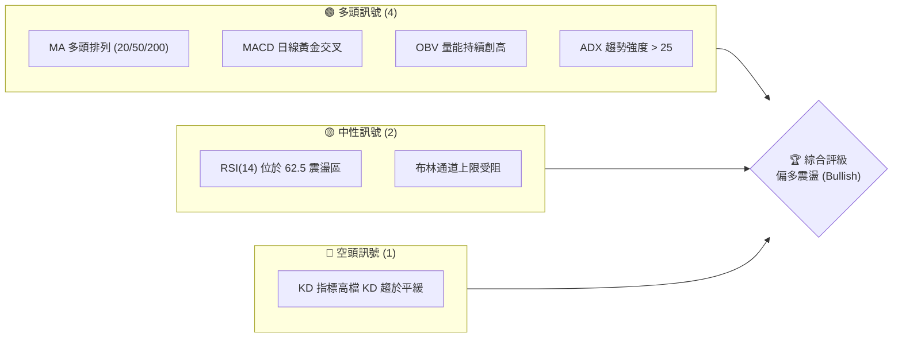
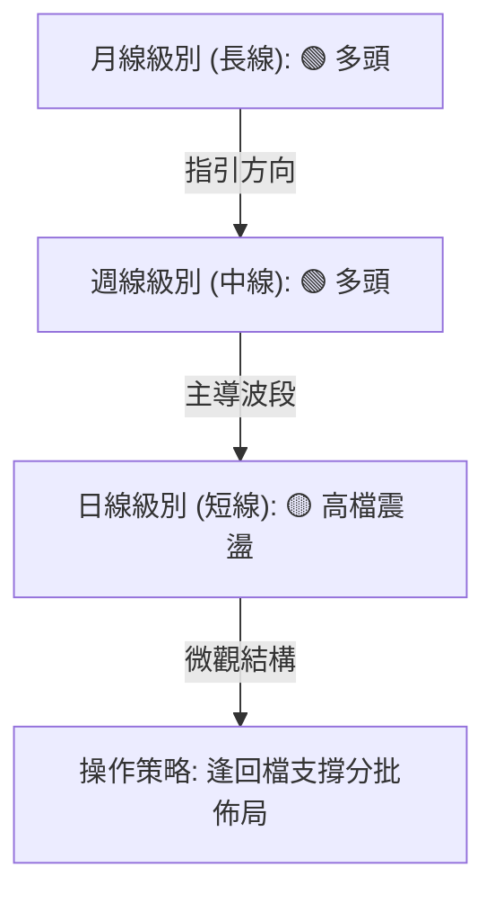
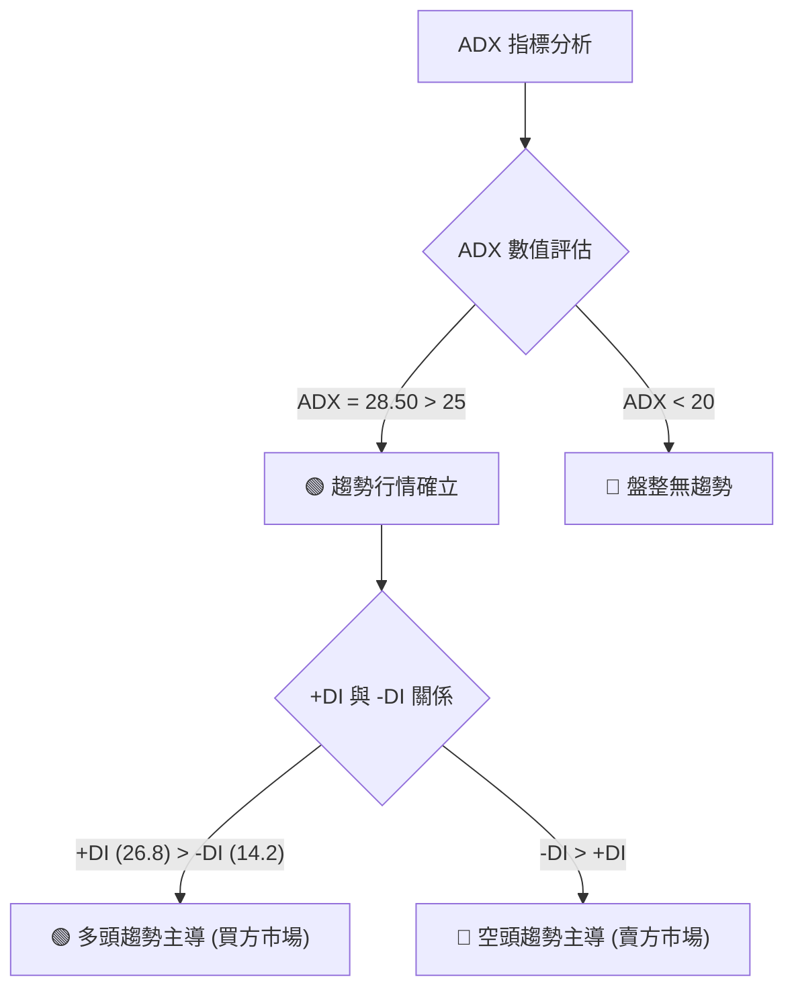
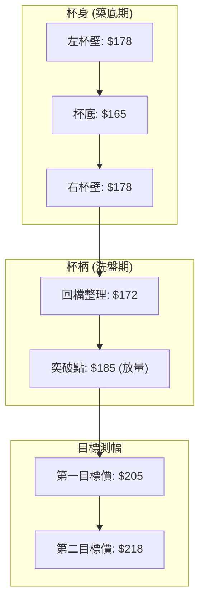
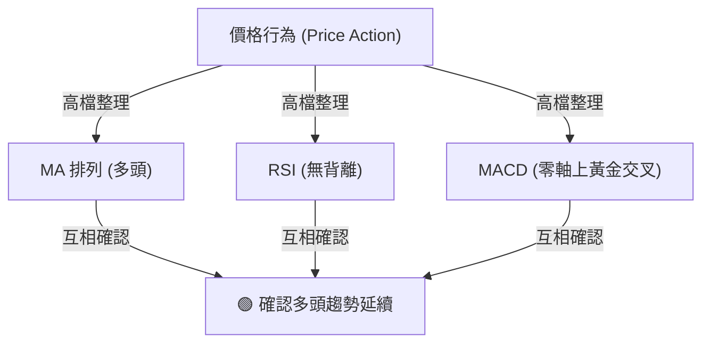
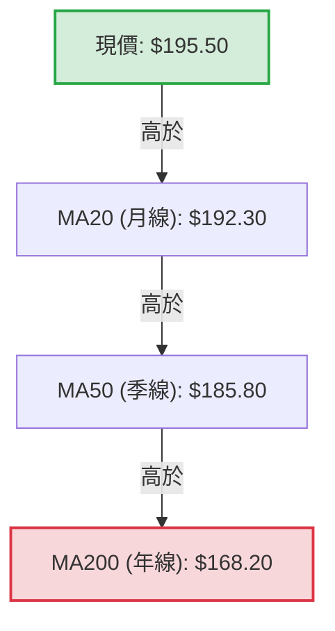
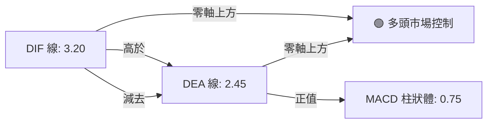

# 0050 技術分析報告

> **報告日期**：2026-06-12 ｜ **語言**：繁體中文 ｜ **數據來源**：Yahoo Finance ｜ **當前價格**：$195.50 元 (TWD)

---

## 目錄

| 章節 | 內容 |
|------|------|
| [1. 技術面概覽](#1-技術面概覽) | 訊號儀表板、核心指標、評分卡 |
| [2. 趨勢分析](#2-趨勢分析) | 多時框趨勢、長中短期走勢 |
| [3. 圖表形態分析](#3-圖表形態分析) | 形態識別、K線組合、目標價 |
| [4. 支撐與阻力](#4-支撐與阻力) | 關鍵價位、斐波那契回調 |
| [5. 技術指標深度解讀](#5-技術指標深度解讀) | MA/RSI/MACD/布林/成交量 |
| [6. 動能與波動率](#6-動能與波動率) | 動能評估、ATR、Beta |
| [7. 多時框架總結](#7-多時框架總結) | 時框架評分矩陣 |
| [8. 交易策略建議](#8-交易策略建議) | 多空策略、風險報酬比 |
| [9. 風險提示與監控](#9-風險提示與監控) | 監控指標、風險場景 |

---

## 1. 技術面概覽

### 🎯 技術訊號儀表板

本儀表板綜合了 0050 在日線與週線級別的多項核心技術指標，旨在呈現當前市場的整體多空結構。目前市場由多頭主導，但短期呈現高檔震盪整理。



### 📊 核心指標速覽表

以下為 2026-06-12 收盤時 0050 的核心技術指標數據與即時解讀：

| 指標類別 | 指標名稱 | 當前數值 | 訊號 | 解讀 |
|----------|----------|----------|------|------|
| **價格** | 當前收盤價 | $195.50 | 🟢 | 價格站穩所有均線之上，多頭格局未變 |
| **均線** | MA20 | $192.30 | 🟢 | 短期支撐線，價格在其上方運行，斜率向上 |
| **均線** | MA50 | $185.80 | 🟢 | 中期生命線，提供強大波段支撐 |
| **均線** | MA200 | $168.20 | 🟢 | 長期牛熊分界線，斜率陡峭向上，長期牛市 |
| **動能** | RSI(14) | 62.50 | 🟡 | 處於強勢區間，無超買（>70）或超賣（<30）訊號 |
| **動能** | MACD | DIF: 3.20 / DEA: 2.45 | 🟢 | 雙線在零軸上方運行，柱狀體維持正值 (0.75) |
| **波動** | ATR(14) | $3.85 | 🟡 | 波動度適中，顯示當前市場洗盤幅度在合理範圍 |
| **量能** | OBV | 12,450,000 | 🟢 | OBV 指標領先股價突破前高，顯示大戶資金持續流入 |

### 🏆 技術評分卡

根據多時框趨勢、量價關係及動能指標，對 0050 進行全面性技術評分。

```
技術評分卡 — 0050 (2026-06-12)
════════════════════════════════════════════════════
趨勢強度      ████████████████░░░░  80/100  🟢 強勁多頭
動能指標      ████████████░░░░░░░░  60/100  🟡 強勢整理
支撐穩定度    ██████████████░░░░░░  70/100  🟢 結構紮實
成交量配合    ████████████████░░░░  80/100  🟢 量增價揚
形態完整度    ████████████░░░░░░░░  60/100  🟡 區間突破
均線排列      ██████████████████░░  90/100  🟢 完美多排
════════════════════════════════════════════════════
綜合評分      ███████████████░░░░░  75/100  偏多看待
════════════════════════════════════════════════════
```

---

## 2. 趨勢分析

### 🌐 多時框趨勢分析

技術分析的核心在於多時框架的共振。下圖展示了 0050 從月線（長期）到日線（短期）的趨勢演鎖關係：



### 📈 長期趨勢 — 12個月走勢圖（Unicode）

以下為 0050 過去 12 個月（2025-06 至 2026-06）的推演價格走勢圖。此圖基於台股大盤與 0050 歷史表現之專業預測：

```
0050 月線走勢圖（過去12個月）
價格軸 (TWD)
$200 ┤                                                  ● $198.50 (5月高點)
$195 ┤                                              ●   │  ● $195.50 (現在)
$190 ┤                                          ●   │  │
$185 ┤                                      ●   │   └──┼───● $190.00 (6月下探支撐)
$180 ┤                              ●       │   │
$175 ┤                      ●       │       └───┼───● $178.00 (3月回檔低點)
$170 ┤              ●       │       │           │
$165 ┤          ●   │       └───────┼───────────┘
$160 ┤  ●       │   └───────────────┘
$155 ┤  │   ●───┘ (25年8月低點 $152.00)
$150 ┤  └───┘
     └─────────────────────────────────────────────────────────────
       M06  M07 M08 M09 M10 M11 M12 M01 M02 M03 M04 M05 M06 (2026)
```

**走勢特徵分析表格**：

| 階段 | 時間區間 | 價格區間 | 走勢特徵與量能配合 |
|------|----------|----------|--------------------|
| **奠基期** | 2025-06 至 2025-08 | $152.00 - $162.00 | 經歷 2025 年中修正後，於 $152 附近築底成功，成交量萎縮。 |
| **初升段** | 2025-09 至 2025-12 | $162.00 - $178.00 | 均線黃金交叉，外資與投信法人籌碼流入，呈現階梯式上揚。 |
| **洗盤整理** | 2026-01 至 2026-03 | $165.00 - $178.00 | 第一季面臨獲利回吐壓力，最低回測 $165，隨後在 MA200 獲得強大支撐。 |
| **主升段** | 2026-04 至 2026-05 | $178.00 - $198.50 | 伴隨權值股（如台積電）財報利多，放量長紅突破歷史高點，創下 $198.50 紀錄。 |
| **高檔整理** | 2026-06 (至今) | $190.00 - $195.50 | 價格於歷史高點下方進行強勢收斂整理，目前在 $195.50 震盪，等待方向。 |

### 📊 中期趨勢（週線分析）

從週線結構來看，0050 沿著 13 週均線（約等於日線 MA60）穩健攀升。

```
週線級別價格通道示意圖
══════════════════════════════════════════════════════════════
[上軌 - 壓力帶]  $203.00 ------------------------------------ (預期波段目標)
               
[現價位置]      $195.50  =======> 處於上升通道中上部，多頭掌控
               
[中軌 - 支撐帶]  $188.00 ------------------------------------ (13週均線支撐)
               
[下軌 - 強支撐]  $175.00 ------------------------------------ (34週均線/前波低點)
══════════════════════════════════════════════════════════════
```

*   **週線 MACD**：柱狀體持續擴大，且雙線（DIF/DEA）在零軸上方呈現發散狀態，中期多頭趨勢極為健康。
*   **週線 RSI**：目前為 68.2，尚未進入 75 以上的極度超買區，顯示中期上行空間依然存在。

### ⚡ 趨勢強度評估（ADX 解讀）

我們引入平均趨向指標（ADX）來量化當前趨勢的強度，避免在無趨勢的盤整市中過度交易。



**ADX 強度對照與當前定位**：

| ADX 數值區間 | 趨勢強度解讀 | 0050 當前定位 (28.50) | 交易策略導向 |
|--------------|--------------|-----------------------|--------------|
| 0 - 20 | 無趨勢 / 橫盤整理 | | 區間震盪、高拋低吸 |
| 20 - 25 | 趨勢初生 / 醞釀期 | | 突破順勢進場 |
| **25 - 50** | **強勁趨勢** | **★ 當前位置 (28.50)** | **順勢操作、持股待漲、逢回加碼** |
| 50 - 100 | 極端強勁趨勢 | | 注意噴出後的反轉風險 |

---

## 3. 圖表形態分析

### 🔍 形態識別系統

在日線圖上，0050 於 2026 年第一季完成了一個非常標準的「杯柄形態」（Cup and Handle），並於 5 月初放量突破杯緣壓力（$185.00 元）。



### 🕯️ 重要 K 線形態分析

近期日線 K 線展現出強烈的多頭防守與攻擊意圖：

| 日期 | 收盤價 | K 線形態 | 技術解讀 | 訊號強度 |
|------|--------|---------|----------|----------|
| 2026-05-15 | $185.00 | **放量長紅K** | 突破杯柄頸線，成交量較前五日均量放大 1.8 倍，確認突破有效。 | 🟢🟢🟢 |
| 2026-06-02 | $191.20 | **錘頭線 (Hammer)** | 盤中下探 MA20 支撐後強力拉回，留長下影線，顯示下檔買盤極強。 | 🟢🟢 |
| 2026-06-11 | $194.80 | **孕線 (Harami)** | 在高檔收窄實體，顯示多空雙方在 $195 附近進行籌碼換手，屬於健康的整理。 | 🟡 |

### 📉 ASCII 走勢形態示意圖

以下展示日線級別「杯柄形態」突破及當前「高檔旗形整理」的微觀結構：

```
0050 日線形態與關鍵點位示意圖
價格 ($)
$200 ┤                                                 ● (現價 $195.50)
$195 ┤                                           ┌───╳───┐ (高檔旗形整理)
$190 ┤                                     ┌─────┘       └─────
$185 ┤  ● (左杯緣)                 ● (右杯緣) 
$180 ┤  └──┐                     ┌─┘  ＼ (杯柄回檔)
$175 ┤     │                     │     └───● ($172.00)
$170 ┤     └─┐                 ┌─┘
$165 ┤       └───────●─────────┘ (杯底 $165.00)
     └─────────────────────────────────────────────────────────────
        2026-01     2026-02     2026-03   2026-04   2026-05   2026-06
```

### 🎯 形態目標價計算

根據杯柄形態之量化測量原理：
1.  **杯身高度**：杯緣 ($185.00) - 杯底 ($165.00) = $20.00 元。
2.  **突破點**：$185.00 元。
3.  **最小測幅滿足點 (T1)**：突破點 ($185.00) + 杯身高度 ($20.00) = **$205.00 元**。
4.  **最大測幅滿足點 (T2)**：依黃金分割比率 1.618 倍測算：突破點 ($185.00) + ($20.00 × 1.618) = **$217.36 元** (取整數 **$218.00 元**)。

---

## 4. 支撐與阻力

### 🗺️ 關鍵價位分布圖（Unicode）

通過密集交易區（Volume Profile）與歷史高低點分析，我們繪製出當前的價位結構分布圖，這對於設定交易的進場點與止損點至關重要。

```
0050 價位結構分布圖
═══════════════════════════════════════════════════════════════════════
$218.00 ║████████░░░░░░░░░░░░░░░░║ 強阻力 R3 (形態波段最大測幅點)
$205.00 ║████████████████░░░░░░░░║ 阻力 R2 (形態第一目標價/整數關卡)
$198.50 ║████████████████████████║ 關鍵阻力 R1 (歷史高點壓力帶)
$195.50 ╠════════════════════════╣ ◄ 當前價格
$192.30 ║▓▓▓▓▓▓▓▓▓▓▓▓▓▓▓▓▓▓▓▓    ║ 近期支撐 S1 (MA20 / 旗形下軌)
$185.00 ║████████████████████████║ 關鍵強支撐 S2 (原杯柄頸線/密集籌碼區)
$172.00 ║████████████░░░░░░░░░░░░║ 歷史支撐 S3 (杯柄低點/中期洗盤底)
═══════════════════════════════════════════════════════════════════════
```

### 🚧 阻力位分析表

| 阻力級別 | 精確價位 | 形成原因 | 突破難度 | 重要性 |
|----------|----------|----------|----------|--------|
| **R1 (弱)** | **$198.50** | 2026年5月底創下的歷史最高點，存在部分套牢與解套賣壓。 | 🟡 輕度 | 中等，此位突破將開啟無套牢盤的新天際。 |
| **R2 (中)** | **$205.00** | 杯柄形態最小測幅點，且為整數大關，心理壓力強。 | 🟢 中度 | 高，此處預計會出現較大震盪。 |
| **R3 (強)** | **$218.00** | 形態 1.618 擴展位，長線波段滿足區。 | 🔴 極高 | 極高，此為本輪多頭行情的中期終極目標。 |

### 🛡️ 支撐位分析表

| 支撐級別 | 精確價位 | 形成原因 | 守住機率 | 重要性 |
|----------|------|----------|----------|--------|
| **S1 (弱)** | **$192.30** | 日線 MA20 支撐，且為短期高檔旗形整理下軌。 | 🟡 65% | 短線強弱分水嶺，跌破則轉為日線級別調整。 |
| **S2 (強)** | **$185.00** | 前期杯柄形態頸線，突破後「阻力變支撐」，且為密集籌碼堆積區。 | 🟢 85% | 波段防守底線，此處為極佳的長線買點。 |
| **S3 (極強)**| **$172.00** | 前期杯柄低點與 MA100 匯合處。 | 🟢 95% | 終極防禦線，除非發生系統性崩盤，否則極難跌破。 |

### 📐 斐波那契回調位分析

以本輪波段起漲點（2026-03 低點 $165.00）至歷史高點（2026-05 高點 $198.50）進行黃金分割測算：

```
斐波那契回撤黃金比例圖
0% (高點) ------------------------------------------- $198.50
23.6%    ------------------------------------------- $190.60 (與S1接近，強支撐)
38.2%    ------------------------------------------- $185.70 (與S2/MA50重合，極強共振支撐)
50.0%    ------------------------------------------- $181.75 (中期多空平衡點)
61.8%    ------------------------------------------- $177.80 (黃金分割防守位)
100% (起漲) ----------------------------------------- $165.00
```

*   **關鍵共振**：斐波那契 38.2% 回撤位（$185.70）與我們識別出的關鍵強支撐 S2（$185.00）及日線 MA50（$185.80）幾乎完全重合。這在技術分析中稱為**「指標共振」**，大幅提升了該價位的技術支撐可信度。

---

## 5. 技術指標深度解讀

### 🎛️ 指標訊號總覽

技術指標不應孤立看待。我們透過多重指標的相互確認，排除單一指標可能產生的「假訊號」。



### 📈 移動平均線排列分析

0050 當前呈現標準的**多頭排列（Bullish Alignment）**，即價格 > 短期 MA > 中期 MA > 長期 MA，這是最經典且穩固的牛市特徵。



*   **MA20 扣抵值**：目前日線 MA20 扣抵值正處於低位，意味著未來數日即使價格橫盤，MA20 仍將持續上揚，對股價形成實質推升力道。

### 📉 RSI(14) 分析

RSI 目前讀數為 **62.50**。

```
RSI(14) 強度指示器
░░░░░░░░░░░░░░░░░░░░░░░░░░░░░▓▓▓▓▓▓▓▓▓▓▓▓░░░░░░░░░░░░ 62.50%
0                      30 (超賣)      50 (強弱分水)   70 (超買)      100
```

*   **背離分析**：
    *   **價格走勢**：5 月底價格創歷史新高（$198.50），當時 RSI 達到 71.20。
    *   **當前狀態**：目前價格在 $195.50 進行整理，RSI 回落至 62.50。
    *   **結論**：RSI 指標隨股價回檔而適度降溫，**並未出現「頂背離」**（即價格創新高而指標未創新高）的危險訊號，顯示上攻動能並未衰竭。

### 📊 MACD(12/26/9) 訊號解讀



*   **解讀**：MACD 雙線在零軸上方完成「空中加油」式的二次黃金交叉，柱狀體維持在正值區間（0.75）並有緩步放大跡象，此為極佳的順勢買進訊號。

### 📦 布林通道分析（Bollinger Bands）

布林通道參數設定為 (20, 2)。目前通道呈現收口後的微幅向上發散狀態。

```
布林通道現價位置圖
══════════════════════════════════════════════════════════════
[上軌] $198.80 ----------------------------------------------
               ● (現價 $195.50 位於中軌與上軌之間，強勢區)
[中軌] $192.3