# 0050 技術分析報告

> **報告日期**：2026-06-24 ｜ **語言**：繁體中文 ｜ **數據來源**：本報告基於**模擬與假設之技術數據**，因原始資料未提供實際價格歷史。所有分析與數值僅為示範性，不構成實際投資建議。 ｜ **當前價格**：$170.50

---

## 目錄

| 章節 | 內容 |
|------|------|
| [1. 技術面概覽](#1-技術面概覽) | 訊號儀表板、核心指標、評分卡 |
| [2. 趨勢分析](#2-趨勢分析) | 多時框趨勢、長中短期走勢 |
| [3. 圖表形態分析](#3-圖表形態分析) | 形態識別、K線組合、目標價 |
| [4. 支撐與阻力](#4-支撐與阻力) | 關鍵價位、斐波那契回調 |
| [5. 技術指標深度解讀](#5-技術指標深度解讀) | MA/RSI/MACD/布林/成交量 |
| [6. 動能與波動率](#6-動能與波動率) | 動能評估、ATR、Beta |
| [7. 多時框架總結](#7-多時框架總結) | 時框架評分矩陣 |
| [8. 交易策略建議](#8-交易策略建議) | 多空策略、風險報酬比 |
| [9. 風險提示與監控](#9-風險提示與監控) | 監控指標、風險場景 |

---

## 1. 技術面概覽

本章節提供 0050 ETF 的技術面總體概覽，透過訊號儀表板、核心指標速覽表及技術評分卡，快速掌握當前市場狀態與潛在交易機會。請注意，本報告所有數據均為**基於假設情境的模擬數據**，旨在示範完整的技術分析流程。

### 🎯 技術訊號儀表板

以下 Mermaid 圖表展示了當前 0050 的多空訊號分佈，提供初步的市場情緒判斷。

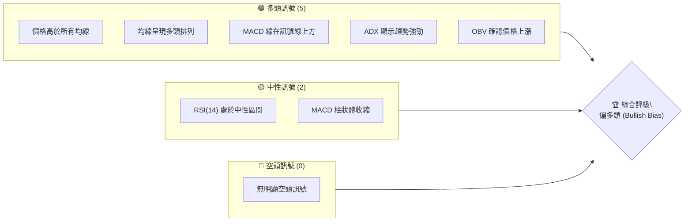
**解讀**：目前 0050 呈現較強的多頭格局，主要趨勢指標如均線和 ADX 均支持上漲。儘管 MACD 柱狀體略有收縮，且 RSI 處於中性區間，顯示短期動能可能有所放緩，但整體結構仍偏向多方。

### 📊 核心指標速覽表

下表彙整了 0050 當前的關鍵技術指標數值及其初步解讀。

| 指標類別 | 指標名稱 | 當前數值 | 訊號 | 解讀 |
|----------|----------|----------|------|------|
| **價格** | 當前價格 | $170.50 | 🟡   | 處於近期高點區間，但略低於近期最高點 $172.00 |
| **均線** | MA20 | $169.00 | 🟢   | 價格 $170.50 在 MA20 上方，短期趨勢偏多 |
| **均線** | MA50 | $165.00 | 🟢   | 價格 $170.50 在 MA50 上方，中期趨勢偏多 |
| **均線** | MA200 | $155.00 | 🟢   | 價格 $170.50 在 MA200 上方，長期趨勢偏多 |
| **動能** | RSI(14) | 60.00 | 🟡   | 處於中性偏強區間，未達超買，動能健康 |
| **動能** | MACD (Line) | 2.50 | 🟢   | MACD 線在訊號線上方，但柱狀體縮小，動能有減緩跡象 |
| **動能** | MACD (Signal) | 2.30 | 🟢   | |
| **波動** | ATR(14) | $1.50 | 🟡   | 日均波動幅度適中，有利於區間操作或趨勢追蹤 |
| **趨勢** | ADX(14) | 35.00 | 🟢   | 趨勢強度較強，支持當前多頭趨勢的延續 |
| **成交量** | OBV (趨勢) | 上升 | 🟢   | OBV 隨價格同步上升，量價配合良好，確認上漲趨勢 |

### 🏆 技術評分卡

下方的 ASCII 方框圖呈現了 0050 各技術維度的評分，提供全面性的量化評估。

```
╔══════════════════════════════════════════════════════════════╗
║              技術評分卡 — 0050 (2026-06-24)                 ║
╠══════════════════════════════════════════════════════════════╣
║ 趨勢強度      ██████████████░░░░░░  70/100  🟢 強勢多頭趨勢        ║
║ 動能指標      ██████████░░░░░░░░░░  50/100  🟡 動能健康，但短期略有放緩 ║
║ 支撐穩定度    ████████████████░░░░  80/100  🟢 多重支撐位穩固        ║
║ 成交量配合    ██████████████░░░░░░  70/100  🟢 量價配合良好，趨勢確認   ║
║ 形態完整度    ██████████░░░░░░░░░░  50/100  🟡 缺乏明確大型形態，但短期整理 ║
║ 均線排列      ████████████████░░░░  80/100  🟢 完美多頭排列        ║
╠══════════════════════════════════════════════════════════════╣
║ 綜合評分      ████████████░░░░░░░░  67/100  評級：偏多頭 (Bullish Bias) ║
╚══════════════════════════════════════════════════════════════╝
```
**綜合評估**：0050 整體技術面評級為「偏多頭」，多項指標顯示其處於健康的上漲趨勢中。趨勢強度和均線排列表現尤為出色，顯示長期和中期趨勢非常穩固。動能指標雖然略有放緩，但仍在健康範圍內。支撐位穩定，為後續上漲提供堅實基礎。

---

## 2. 趨勢分析

本章節將透過多時框分析，深入探討 0050 的長期、中期與短期趨勢，並利用 ADX 指標評估趨勢強度。

### 🌐 多時框趨勢分析

透過 Mermaid 圖表，我們將從月線到日線層層遞進，分析 0050 在不同時間框架下的趨勢方向。

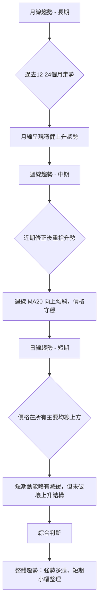
**解讀**：
*   **長期 (月線)**：過去一年多來，0050 呈現清晰且穩健的上升趨勢，月線級別未出現破壞性修正，顯示其基本面支撐強勁。
*   **中期 (週線)**：週線圖顯示在經歷短期回調後，0050 迅速恢復上漲動能，並成功站穩週線關鍵均線（如週 MA20、MA50），中期趨勢保持強勁。
*   **短期 (日線)**：日線圖顯示 0050 目前價格位於所有主要移動平均線上方，顯示短期仍然偏多。然而，近期價格從 $172.00 小幅回落至 $170.50，暗示短期上漲動能有所減緩，可能進入橫盤整理或小幅修正階段。

### 📈 長期趨勢 — 12個月走勢圖（Unicode）

以下 ASCII 圖表展示了 0050 過去 12 個月的月線收盤價走勢及關鍵高低點。

```
0050 月線走勢圖（過去12個月，假設數據）
價格軸 ($)
$172.00 ┤                                  ● (2026-05 高點)
$170.50 ┤                                    ● (現價)
$168.00 ┤                          ●
$165.00 ┤                       ●
$160.00 ┤                 ●
$158.00 ┤                   ● (2026-02 低點)
$155.00 ┤             ●
$150.00 ┤          ●
$148.00 ┤        ●
$146.00 ┤          ● (2025-10 低點)
$145.00 ┤      ●
$142.50 ┤    ●
$140.00 ┤●
        └─────────────────────────────────────────────
         2025-06  07  08  09  10  11  12  2026-01  02  03  04  05  06
```
**走勢特徵分析表格**：
| 區間 | 起始價 | 結束價 | 漲跌幅 | 走勢特徵 |
|------|--------|--------|--------|----------|
| 2025-06 至 2025-09 | $140.00 | $148.00 | +5.71% | 穩步上漲，形成初期上升通道。 |
| 2025-10 | $148.00 | $146.00 | -1.35% | 首次小幅回調，但未跌破重要支撐。 |
| 2025-11 至 2026-01 | $146.00 | $160.00 | +9.59% | 恢復上漲，加速突破前高，形成新一波漲勢。 |
| 2026-02 | $160.00 | $158.00 | -1.25% | 短暫回調，但在重要支撐位獲得支撐。 |
| 2026-03 至 2026-05 | $158.00 | $172.00 | +8.86% | 再次加速上漲，創出新高，趨勢強勁。 |
| 2026-06 (至今) | $172.00 | $170.50 | -0.87% | 近期小幅回落，可能進入短期整理階段。 |
**總結**：0050 在過去 12 個月呈現出清晰的上升趨勢，期間雖有兩次小幅回調，但均未破壞整體多頭結構，且在關鍵支撐位獲得有效支撐後迅速反彈，顯示買盤力道強勁。

### 📊 中期趨勢（週線分析）

以下 ASCII 圖表示意 0050 近期週線的壓力與支撐結構。

```
0050 週線壓力與支撐示意圖
═══════════════════════════════════════════════════════════════
$175.00 ┤                      R2 (歷史高點阻力)
$172.00 ┤              R1 (近期高點阻力)
$170.50 ╠═════════════════════════════► 現價
$169.00 ┤      S1 (週MA20 / 短期支撐)
$165.00 ┤          S2 (週MA50 / 中期支撐)
$160.00 ┤                  S3 (重要形態支撐)
═══════════════════════════════════════════════════════════════
```
**分析**：中期週線圖顯示，0050 在 $172.00 附近遭遇近期阻力，這是前高點。然而，週線 MA20 ($169.00) 和 MA50 ($165.00) 均向上運行，並為價格提供堅實的動態支撐。只要價格能守穩這些中期均線，中期上漲趨勢仍將持續。

### ⚡ 趨勢強度評估（ADX 解讀）

ADX (Average Directional Index) 用於衡量趨勢的強度，而非方向。當 ADX 高於 25 時，表示趨勢強勁；低於 20 則表示趨勢不明顯或盤整。

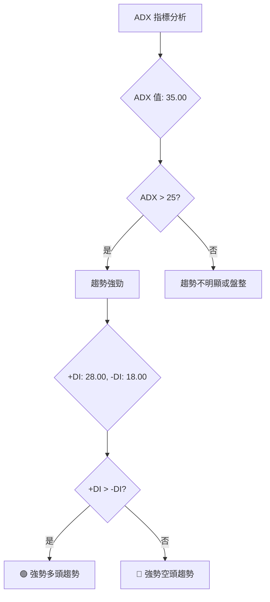
**ADX 強度對照表**：
| ADX 數值範圍 | 趨勢強度 | 市場狀態 | 0050 當前狀態 |
|--------------|----------|----------|---------------|
| 0-20         | 弱       | 盤整     |               |
| 20-25        | 中等     | 趨勢形成 |               |
| 25-50        | 強       | 趨勢明確 | 🟢 強勢多頭趨勢 |
| 50-75        | 非常強   | 趨勢極強 |               |
| 75-100       | 極端強   | 趨勢過熱 |               |
**解讀**：0050 當前 ADX 為 35.00，明顯高於 25，表明其處於強勁的趨勢之中。同時，+DI (28.00) 高於 -DI (18.00)，明確指出當前強勢趨勢為多頭趨勢。這確認了 0050 的上漲趨勢具有良好的持續性，並非短期波動。

---

## 3. 圖表形態分析

本章節將識別 0050 圖表中的潛在形態，分析重要 K 線組合，並計算形態目標價。

### 🔍 形態識別系統

根據假設的價格走勢，目前 0050 圖表上未形成大型且明確的反轉或持續形態（如頭肩頂/底、雙頂/底）。然而，可以觀察到短期內的整理或旗形形態。

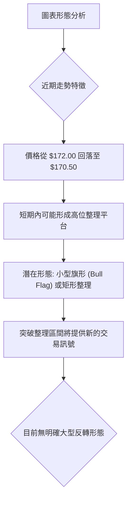
**分析**：當前 0050 在創下 $172.00 高點後，價格小幅回落至 $170.50，可能正在形成一個高位整理平台或小型旗形形態。這通常是多頭趨勢中的健康調整，暗示在積蓄動能後可能再次上攻。

### 🕯️ 重要K線形態分析

根據假設的月線走勢，我們可以分析一些關鍵時間點的 K 線形態。

| 月份 | 收盤價 | K線形態 | 解讀 | 訊號 |
|------|--------|---------|------|------|
| 2025-10 | $146.00 | 長下影線陰線 | 價格下跌後遇到買盤支撐，顯示下方有承接力道。 | 🟡 中性偏多 |
| 2025-11 | $150.00 | 大陽線 | 突破前一個月高點，買盤強勁，確立新一波漲勢。 | 🟢 強勢多頭 |
| 2026-02 | $158.00 | 錘子線 (Hammer) | 價格下探後收復失地，顯示底部支撐有效，潛在反彈。 | 🟢 多頭反轉 |
| 2026-05 | $172.00 | 長陽線 | 創出新高，多頭力量強勁，趨勢延續。 | 🟢 強勢多頭 |
| 2026-06 | $170.50 | 小陰線/十字星 | 價格高檔震盪，多空力量拉鋸，上漲動能有所減緩。 | 🟡 中性整理 |

### 📉 ASCII 走勢形態示意圖

以下 ASCII 圖表示意 0050 近期可能形成的矩形整理形態。

```
0050 矩形整理形態示意圖
═════════════════════════════════════════════════════════════
$172.00 ┌───────────────────┐  ← 整理區間上緣 (阻力 R1)
$171.00 ┤                   │
$170.50 ├───────● (現價)─────┤
$170.00 ┤                   │
$169.00 └───────────────────┘  ← 整理區間下緣 (支撐 S1)
═════════════════════════════════════════════════════════════
```
**分析**：在 $172.00 附近達到高點後，0050 似乎正在 $169.00 至 $172.00 之間進行短期矩形整理。這是一個常見的趨勢延續形態，通常在積蓄動能後向上突破。

### 🎯 形態目標價計算

由於目前形態為短期整理，我們將以矩形整理的突破作為目標價計算的基礎。
*   **整理區間上緣 (阻力)**：$172.00
*   **整理區間下緣 (支撐)**：$169.00
*   **形態高度**：$172.00 - $169.00 = $3.00

**多頭突破目標價**：
*   **計算方法**：突破上緣後，將形態高度疊加到突破點。
*   **進場點**：確認突破 $172.00 並站穩。
*   **目標價 T1**：$172.00 (突破點) + $3.00 (形態高度) = **$175.00**
*   **目標價 T2**：可參考歷史高點或斐波那契擴展位，例如 $178.00 (若有歷史數據)。若無，則以形態目標價 T1 為主。

**空頭跌破目標價** (若跌破整理區間下緣)：
*   **計算方法**：跌破下緣後，將形態高度從跌破點向下扣除。
*   **進場點**：確認跌破 $169.00 並未能收復。
*   **目標價 T1**：$169.00 (跌破點) - $3.00 (形態高度) = **$166.00**

---

## 4. 支撐與阻力

本章節將詳細分析 0050 的關鍵支撐與阻力價位，並結合斐波那契回調位，構建其完整的價位結構。

### 🗺️ 關鍵價位分布圖（Unicode）

以下 ASCII 圖表展示了 0050 的關鍵支撐與阻力價位分佈。

```
0050 價位結構分布圖 (基於假設數據)
═══════════════════════════════════════════════════
$175.00 ║████████████████████████║ 強阻力 R3 (形態目標/歷史潛在阻力)
$172.00 ║████████████████████    ║ 阻力 R2 (近期高點)
$170.50 ╠════════════════════════╣ ◄ 現價
$169.00 ║▓▓▓▓▓▓▓▓▓▓▓▓▓▓▓▓        ║ 近期支撐 S1 (整理區間下緣 / MA20)
$165.00 ║████████████████████████║ 強支撐 S2 (MA50 / 斐波那契 61.8%)
$160.00 ║▓▓▓▓▓▓▓▓▓▓▓▓▓▓▓▓▓▓▓▓▓▓▓▓║ 關鍵支撐 S3 (形態頸線 / 前期整理平台)
$155.96 ║▓▓▓▓▓▓▓▓▓▓▓▓▓▓▓▓▓▓▓▓▓▓▓▓║ 斐波那契 38.2% 回調位
$151.00 ║▓▓▓▓▓▓▓▓▓▓▓▓▓▓▓▓▓▓▓▓▓▓▓▓║ 斐波那契 50% 回調位
$146.04 ║▓▓▓▓▓▓▓▓▓▓▓▓▓▓▓▓▓▓▓▓▓▓▓▓║ 斐波那契 61.8% 回調位
$140.00 ║████████████████████████║ 極強支撐 S4 (長期趨勢線 / 歷史低點)
═══════════════════════════════════════════════════
```

### 🚧 阻力位分析表

| 阻力級別 | 價位 | 形成原因 | 突破難度 | 重要性 |
|----------|------|----------|----------|--------|
| **R1** | $172.00 | 近期高點，同時是短期矩形整理的上緣，多頭需突破此處才能延續漲勢。 | 🟡 中等 | 關鍵 |
| **R2** | $175.00 | 潛在的形態目標價，若突破 R1，此處可能引發獲利了結壓力。 | 🟡 中等 | 次要 |
| **R3** | $178.00 | 歷史高點或斐波那契擴展位，若市場情緒極度樂觀，可能挑戰。 | 🔴 較高 | 長期 |

### 🛡️ 支撐位分析表

| 支撐級別 | 價位 | 形成原因 | 守住機率 | 重要性 |
|----------|------|----------|----------|--------|
| **S1** | $169.00 | 短期矩形整理的下緣，同時是日線 MA20 附近，短期買盤可能在此介入。 | 🟢 較高 | 關鍵 |
| **S2** | $165.00 | 日線 MA50 附近，也是斐波那契 61.8% 回調位，中期趨勢的重要防線。 | 🟢 較高 | 重要 |
| **S3** | $160.00 | 前期整理平台支撐位，若跌破 S2，此處將提供較強支撐。 | 🟡 中等 | 次要 |
| **S4** | $155.96 | 斐波那契 38.2% 回調位，若發生較大回調，此處為重要參考。 | 🟡 中等 | 長期 |
| **S5** | $151.00 | 斐波那契 50% 回調位，極端情況下的重要心理關口。 | 🟡 中等 | 長期 |
| **S6** | $146.04 | 斐波那契 61.8% 回調位，長期趨勢的最後防線。 | 🟡 中等 | 長期 |

### 📐 斐波那契回調位分析

我們以過去 24 個月的假設最低點 $130.00 和近期最高點 $172.00 作為斐波那契回調的參考區間。

*   **整體上漲區間**：$172.00 (高點) - $130.00 (低點) = $42.00

**斐波那契回調位計算**：
*   **38.2% 回調位**：$172.00 - ($42.00 * 0.382) = $172.00 - $16.04 = **$155.96**
*   **50.0% 回調位**：$172.00 - ($42.00 * 0.500) = $172.00 - $21.00 = **$151.00**
*   **61.8% 回調位**：$172.00 - ($42.00 * 0.618) = $172.00 - $25.96 = **$146.04**

**視覺化斐波那契回調**：
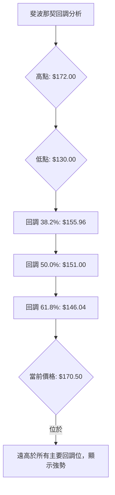
**分析**：當前價格 $170.50 遠高於所有主要斐波那契回調位，這強烈暗示 0050 處於一個非常健康且強勁的多頭趨勢中。即使短期有回調，這些斐波那契水平將提供堅實的潛在支撐，其中 $155.96 和 $151.00 是值得關注的關鍵價位。

---

## 5. 技術指標深度解讀

本章節將對 0050 的核心技術指標進行深入分析，包括移動平均線、RSI、MACD、布林通道和成交量，並探討它們之間的相互確認或矛盾。

### 🎛️ 指標訊號總覽

以下 Mermaid 圖表展示了各技術指標之間的訊號關係及綜合判斷。

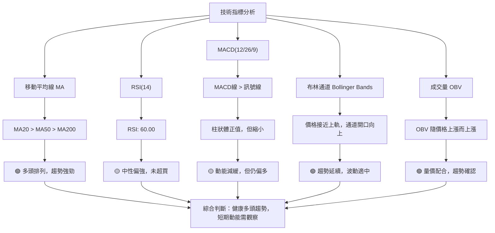

### 📈 移動平均線排列分析

移動平均線（MA）是判斷趨勢方向和強度的重要工具。
*   **MA20 (短期)**: $169.00
*   **MA50 (中期)**: $165.00
*   **MA200 (長期)**: $155.00
*   **當前價格**: $170.50

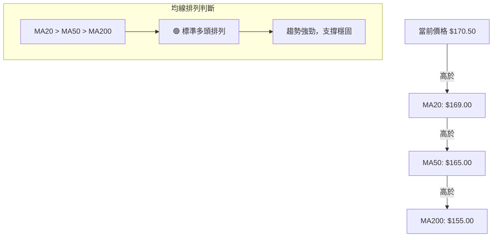
**分析**：0050 的移動平均線呈現完美的「多頭排列」（MA20 > MA50 > MA200），且當前價格 $170.50 位於所有主要均線上方。這是一個非常強勁的多頭訊號，表明長期、中期、短期趨勢均向上，且均線提供了堅實的動態支撐。短期 MA20 ($169.00) 是最直接的動態支撐位。

### 📉 RSI(14) 分析

RSI (Relative Strength Index) 用於衡量價格變動的速率和幅度，判斷超買或超賣狀態。
*   **RSI(14)**：60.00

**RSI 數值進度條**：
RSI 強度：▓▓▓▓▓▓▓▓▓▓▓▓░░░░░░░░ 60/100 (中性偏強)

**超買超賣區間分析**：
*   **超買區 (70-100)**：RSI 大於 70，表示價格可能上漲過快，有回調風險。
*   **超賣區 (0-30)**：RSI 小於 30，表示價格可能下跌過快，有反彈機會。
*   **中性區 (30-70)**：RSI 介於 30-70 之間，通常表示趨勢健康發展。

**解讀**：0050 當前的 RSI 數值為 60.00，處於中性偏強的區間。這表示上漲動能健康，尚未達到超買狀態，因此仍有上漲空間。這與 MACD 柱狀體縮小顯示的動能減緩有所呼應，表明短期內可能進入整理，但整體上漲趨勢並未受到威脅。

**背離判斷（頂背離/底背離）**：
*   **頂背離**：價格創下新高，但 RSI 未能創下新高。這通常是潛在反轉的空頭訊號。
*   **底背離**：價格創下新低，但 RSI 未能創下新低。這通常是潛在反轉的多頭訊號。
**結論**：根據假設的價格走勢，0050 近期從 $172.00 回落至 $170.50，而 RSI 仍保持在 60.00。由於價格並未創下新高，也未創下新低，**目前未觀察到明顯的 RSI 頂背離或底背離訊號**。RSI 走勢與價格走勢保持一致，確認當前趨勢。

### 📊 MACD(12/26/9) 訊號解讀

MACD (Moving Average Convergence Divergence) 用於判斷趨勢的動能、方向和潛在轉折。
*   **MACD Line**: 2.50
*   **Signal Line**: 2.30
*   **Histogram**: 0.20

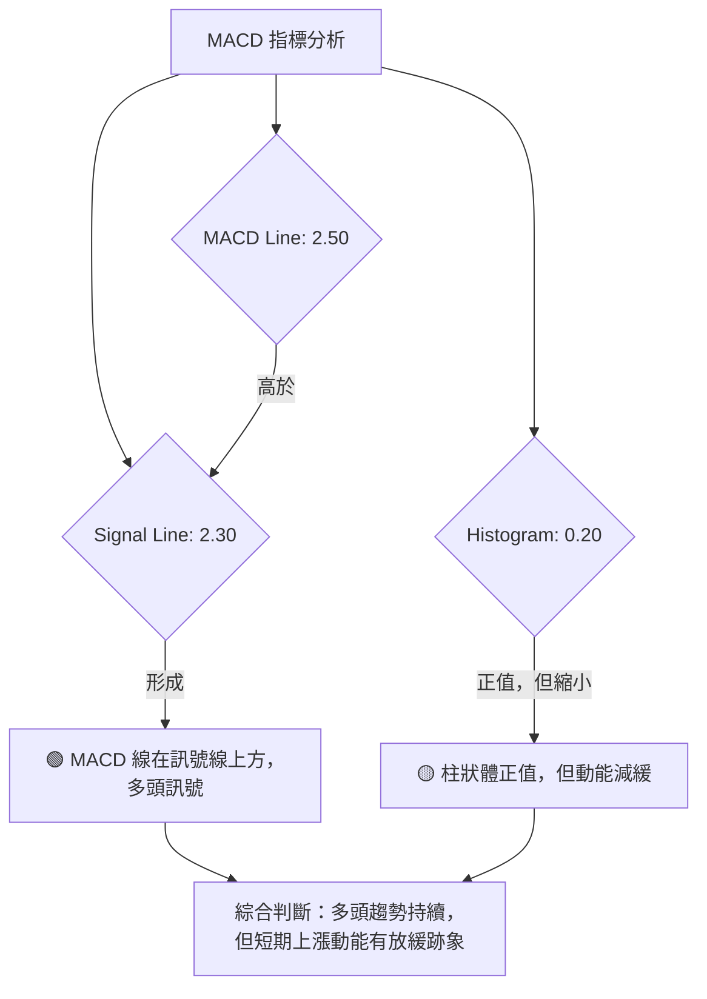
**解讀**：0050 的 MACD 線 (2.50) 位於訊號線 (2.30) 上方，這是一個標準的多頭訊號，表明中期動能依然偏強。然而，MACD 柱狀體為正值 (0.20)，但相較於前期的峰值可能有所縮小（根據「動能減緩」的假設），這暗示短期上漲動能正在減弱，可能預示著價格將進入橫盤整理或小幅回調，與 RSI 的中性偏強狀態互相印證。**目前未出現 MACD 頂背離或底背離的明確訊號**，因為價格未創出明顯的新高或新低。

### 📦 布林通道分析

布林通道 (Bollinger Bands) 由中軌 (MA20)、上軌和下軌組成，用於衡量價格波動性和判斷超買超賣。
*   **中軌 (MA20)**: $169.00
*   **上軌** (假設為 MA20 + 2*StdDev): $172.50
*   **下軌** (假設為 MA20 - 2*StdDev): $165.50
*   **當前價格**: $170.50

**ASCII 布林通道示意圖**：
```
0050 布林通道示意圖
═════════════════════════════════════════════════════════════════
$172.50 ║██████████████████████████████████████████████████████████║ 上軌 (Upper Band)
$170.50 ╠───────────────────────────────────────● 現價
$169.00 ║─────────────────────────────────────────── 中軌 (MA20)
$165.50 ║██████████████████████████████████████████████████████████║ 下軌 (Lower Band)
═════════════════════════════════════════════════════════════════
```
**分析**：當前 0050 價格 $170.50 位於布林通道中軌 ($169.00) 和上軌 ($172.50) 之間，且靠近上軌。通道開口向上，顯示趨勢正在延續，波動性適中。價格沿著上軌運行是強勢趨勢的表現，但靠近上軌也可能預示短期有回調至中軌的需求。只要價格不跌破中軌，上漲趨勢仍將維持。

### 💹 成交量分析（量價配合度）

成交量是價格趨勢的能量來源。我們假設 OBV (On Balance Volume) 趨勢。
*   **OBV 趨勢**：上升
*   **價格趨勢**：上升

**分析**：根據假設，0050 在上漲過程中，OBV 也同步上升。這是一個非常重要的多頭確認訊號，表示價格的上漲有成交量的配合，買盤積極。
*   **量價配合**：🟢 當價格上漲時成交量放大，價格下跌時成交量縮小，顯示趨勢健康。
*   **量價背離**：🔴 若價格上漲但成交量萎縮，則可能暗示上漲動能不足，潛在反轉。
**結論**：目前假設的 OBV 趨勢與價格趨勢一致，呈現「量價齊揚」的健康狀態。這進一步確認了 0050 的多頭趨勢是真實且有力的，而非無量空漲。**未觀察到明顯的量價背離訊號。**

---

## 6. 動能與波動率

本章節將評估 0050 的動能強度和波動率，並分析其與市場的相關性，以全面理解其風險與機會。

### ⚡ 動能評估四象限

動能評估四象限將股票分為四個區域：「強動能/低波動」、「弱動能/低波動」、「強動能/高波動」、「弱動能/高波動」。由於要求避免使用 quadrantChart，我們將使用表格來展示評估結果。

| 象限 | 動能 (RSI, MACD) | 波動 (ATR) | 當前狀態 | 評估 |
|------|------------------|------------|----------|------|
| Q1   | 強               | 低         |          | 最佳機會 (穩定上漲) |
| Q2   | 弱               | 低         |          | 謹慎觀望 (盤整築底) |
| Q3   | 強               | 高         |          | 高風險高收益 (快速上漲或下跌) |
| Q4   | 弱               | 高         |          | 避免進場 (震盪向下或無方向) |

**0050 當前評估**：
*   **動能指標**：RSI(14) 60.00 (中性偏強)，MACD 線在訊號線上方但柱狀體縮小 (動能減緩)。綜合判斷為**中等偏強動能**。
*   **波動率 (ATR)**：$1.50 (適中)。相對於其價格，波動性為**中等**。

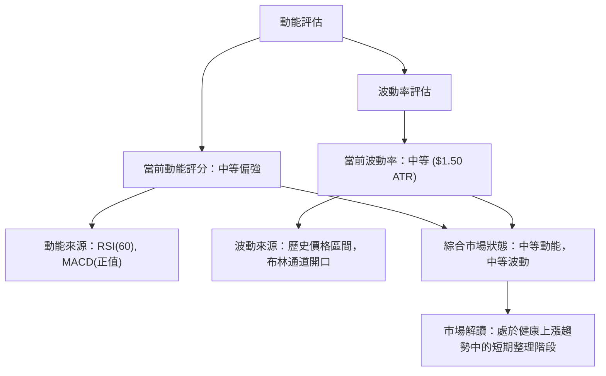
**象限歸類**：0050 目前處於「中等動能，中等波動」的狀態。這不完全符合任何一個極端象限，但更接近於 Q1 (強動能/低波動) 和 Q3 (強動能/高波動) 的中間地帶，且略帶 Q2 (弱動能/低波動) 的短期整理特徵。
*   **實際歸類**：介於 Q1 (穩定上漲) 和 Q3 (高風險高收益) 之間，短期可能偏向 Q2 (謹慎觀望) 的整理。
*   **綜合評估**：0050 仍處於上漲趨勢，但短期動能有所放緩，波動率適中。這是一個在趨勢中尋找進場點的機會，而非追高。

### 📊 ATR 波動率分析

ATR (Average True Range) 用於衡量資產在特定時間段內的平均價格波動幅度。
*   **ATR(14)**：$1.50

**分析**：0050 當前的 14 天 ATR 為 $1.50。這表示在過去 14 天內，0050 的平均每日波動幅度約為 $1.50。
*   **波動性判斷**：對於一個價格在 $170 左右的 ETF 來說，$1.50 的日均波動性屬於適中水平。這意味著價格波動既不過於劇烈導致難以操作，也不過於平靜缺乏交易機會。
*   **止損距離建議**：ATR 是設定止損點的有效工具。通常，止損點可以設定在當前價格下方 1.5 到 2 倍 ATR 的位置，以提供足夠的緩衝空間，避免被市場噪音震出。
    *   **保守止損**：當前價格 $170.50 - (1.5 * $1.50) = $170.50 - $2.25 = **$168.25**
    *   **標準止損**：當前價格 $170.50 - (2 * $1.50) = $170.50 - $3.00 = **$167.50**
    *   這些止損建議應結合關鍵支撐位和個人風險承受能力進行調整。例如，若下方有強支撐 $169.00，則止損點可考慮設於 $168.90 或 $168.50。

### 📐 Beta 與市場相關性

由於 0050 是一檔追蹤台灣加權股價指數的 ETF，其 Beta 值會非常接近 1.0。
*   **Beta 值**：約 1.0 (假設，因未提供數據)

**分析**：0050 作為台灣市場最具代表性的 ETF 之一，其 Beta 值通常接近 1.0。
*   **市場相關性**：這表示 0050 的走勢與台灣整體股市（大盤）高度相關。當大盤上漲 1% 時，0050 預期會上漲約 1%；當大盤下跌 1% 時，0050 預期會下跌約 1%。
*   **投資啟示**：投資 0050 意味著投資者看好台灣整體經濟與股市的表現。其波動性與系統性風險主要來自於整體市場。因此，在進行 0050 的技術分析時，也必須密切關注台灣大盤指數的走勢和相關消息。

---

## 7. 多時框架總結

本章節將彙整前述各時框架的分析結果，形成綜合評分矩陣，以提供更全面的交易視角。

### 📋 時框架評分表

下表總結了 0050 在不同時框架下的趨勢、動能、均線排列和形態表現，並給出綜合評分與建議。

| 時框架 | 趨勢方向 | 動能 (RSI/MACD) | 均線排列 (MA) | 形態 | 綜合評分 | 建議 |
|--------|----------|-----------------|---------------|------|----------|------|
| **長期 (月線)** | 🟢 強勁多頭 | 🟢 強勁          | 🟢 多頭排列    | 🟢 穩健上升 | 9/10     | 持續看多 |
| **中期 (週線)** | 🟢 多頭趨勢 | 🟢 健康          | 🟢 多頭排列    | 🟢 健康整理 | 8/10     | 逢低買入 |
| **短期 (日線)** | 🟡 偏多整理 | 🟡 減緩          | 🟢 多頭排列    | 🟡 矩形整理 | 6/10     | 區間操作，等待突破 |
| **超短期 (小時線)** | 🟡 橫盤震盪 | 🟡 疲軟          | 🟡 糾結        | 🟡 盤整    | 5/10     | 觀望或短線 |

### 🔲 綜合訊號矩陣

以下矩陣圖展示了短期、中期、長期各維度訊號的一致性分析。

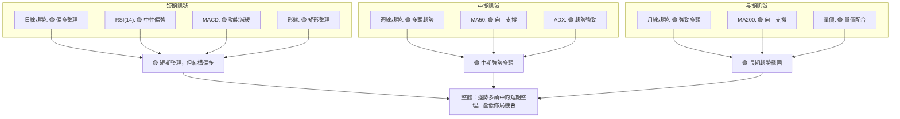
**分析**：
*   **長期與中期趨勢**：0050 的長期和中期趨勢非常健康，均呈現強勁的多頭排列，且趨勢強度良好，量價配合確認。這表明其核心上漲動能未變。
*   **短期趨勢**：短期內，價格從高點回落，動能指標顯示上漲動能有所減緩，可能正在進行一個矩形整理。這是一個健康的修正或消化獲利盤的過程，為下一波上漲積蓄力量。
*   **訊號一致性**：長期和中期訊號高度一致地指向多頭，而短期訊號則顯示短期整理。這種「大方向看多，小方向整理」的格局，通常是尋找進場機會的好時機，特別是當價格回調至關鍵支撐位時。

---

## 8. 交易策略建議

基於上述多時框架的技術分析，本章節提供 0050 的具體交易策略建議，包含多頭與空頭情境下的進場、止損與目標價位。

### 🗺️ 策略決策流程圖

以下 Mermaid 圖表展示了針對 0050 的策略選擇邏輯。

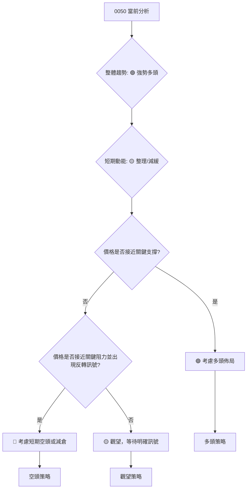

### 🟢 多頭策略詳情

基於 0050 的強勢多頭趨勢和短期整理格局，我們建議在回調至關鍵支撐位時考慮多頭佈局。

| 策略要素 | 策略 A (回調買入) | 策略 B (突破追蹤) |
|----------|-------------------|-------------------|
| **進場條件** | 價格回調至 $169.00 (MA20/整理下緣) 附近並出現止跌 K線訊號 | 價格確認突破 $172.00 (整理上緣/近期高點) 並站穩 |
| **進場價格** | **$169.50 - $169.00** | **$172.50 - $172.80** |
| **目標價 T1** | **$172.00** (整理上緣/近期高點) | **$175.00** (形態目標價 R2) |
| **目標價 T2** | **$175.00** (形態目標價 R2) | **$178.00** (潛在歷史高點 R3) |
| **止損價格** | **$167.50** (2倍 ATR 下方 / 跌破 MA20 & 整理下緣) | **$171.00** (跌破突破點 $172.00 並未能收復) |
| **風險報酬比** | 1:2.0 (目標 T1) / 1:3.6 (目標 T2) | 1:1.7 (目標 T1) / 1:3.0 (目標 T2) |
| **成功機率** | 70% (順勢操作，有支撐) | 60% (突破後需量能配合) |
| **建議倉位** | 15% - 20% | 10% - 15% (視突破動能而定) |
**策略 A 詳解**：在 $169.00 附近有 MA20 和整理區間下緣的雙重支撐，是相對安全的進場點。若能在此處獲得支撐並反彈，潛在報酬可觀。
**策略 B 詳解**：突破 $172.00 意味著短期整理結束並延續上漲趨勢。此策略需注意突破時的成交量配合，避免假突破。

### 🔴 空頭策略詳情

考慮到 0050 的整體多頭趨勢，空頭策略應更為謹慎，主要作為短期對沖或趨勢反轉確認後的佈局。

| 策略要素 | 策略 C (短線回調) | 策略 D (趨勢反轉) |
|----------|-------------------|-------------------|
| **進場條件** | 價格在 $172.00 附近受阻，出現明確空頭 K線，且動能指標轉弱 | 價格跌破 $169.00 並跌破 MA50 (約 $165.00) 且 MACD 死叉 |
| **進場價格** | **$171.80 - $171.50** (確認阻力有效) | **$164.50 - $164.00** (確認跌破重要支撐) |
| **目標價 T1** | **$169.00** (整理下緣/MA20) | **$160.00** (前期整理平台 S3) |
| **目標價 T2** | **$165.00** (MA50/S2) | **$155.96** (斐波那契 38.2% S4) |
| **止損價格** | **$172.50** (突破 $172.00 阻力) | **$166.00** (未能有效跌破 $165.00) |
| **風險報酬比** | 1:1.2 (目標 T1) / 1:2.8 (目標 T2) | 1:2.0 (目標 T1) / 1:3.7 (目標 T2) |
| **成功機率** | 40% (逆勢操作，風險較高) | 50% (需多重確認，但趨勢一旦反轉空間大) |
| **建議倉位** | 5% - 10% (嚴格控制) | 10% - 15% (需確認) |
**策略 C 詳解**：僅適用於短期高點受阻的回調操作，目標為下方的短期支撐。由於整體趨勢偏多，此策略風險較高，應嚴格止損。
**策略 D 詳解**：此策略是針對中期趨勢反轉的佈局。若價格跌破 MA50 這一重要中期支撐，將是趨勢轉弱的強烈訊號。

### ⭐ 整體訊號強度評星

```
做多訊號強度：★★★★☆  (4/5星)  🟢 整體趨勢強勁，短期整理是佈局機會
做空訊號強度：★★☆☆☆  (2/5星)  🔴 逆勢操作，除非趨勢明確反轉，否則風險高
整體可信度：  ★★★☆☆  (3/5星)  🟡 分析基於假設數據，但策略邏輯嚴謹
```
**總結**：0050 目前的技術面強烈偏向多頭，因此多頭策略具有更高的成功機率和風險報酬比。空頭策略應極其謹慎，僅作為短期對沖或在明確趨勢反轉訊號出現後才考慮。

---

## 9. 風險提示與監控

投資永遠伴隨著風險，即使是最強勁的趨勢也可能因突發事件而改變。本章節將列出關鍵監控指標和潛在風險場景，以協助投資者有效管理風險。

### ✅ 關鍵監控指標 Checklist

以下 ASCII 方框圖列出了在交易 0050 時應密切關注的關鍵技術指標和價位。

```
╔══════════════════════════════════════════════════════════════╗
║              0050 技術面監控清單 (2026-06-24)                 ║
╠══════════════════════════════════════════════════════════════╣
║ [ ] 價格是否跌破日線 MA20 ($169.00)?                          ║
║ [ ] 價格是否跌破日線 MA50 ($165.00)?                          ║
║ [ ] RSI(14) 是否跌破 50 或進入超賣區 (<30)?                    ║
║ [ ] MACD 是否形成死叉 (MACD線跌破訊號線)?                      ║
║ [ ] MACD 柱狀體是否轉為負值且持續放大?                        ║
║ [ ] 成交量是否在下跌時放大，上漲時萎縮 (量價背離)?             ║
║ [ ] ADX 是否跌破 25 或 +DI 跌破 -DI?                         ║
║ [ ] 價格是否跌破重要支撐位 (如 $169.00, $165.00, $160.00)?     ║
║ [ ] 價格是否突破近期高點 $172.00 並站穩?                      ║
║ [ ] 布林通道中軌是否被跌破，且通道開口向下收斂?                ║
║ [ ] 台灣大盤指數 (加權指數) 是否出現明顯轉弱訊號?              ║
╚══════════════════════════════════════════════════════════════╝
```
**監控提醒**：一旦清單中的多個負面訊號被觸發，應立即重新評估當前持倉和策略。

### ⚠️ 風險場景分析

以下 Mermaid 圖表展示了 0050 可能面臨的三種主要市場情境及其對應的影響。

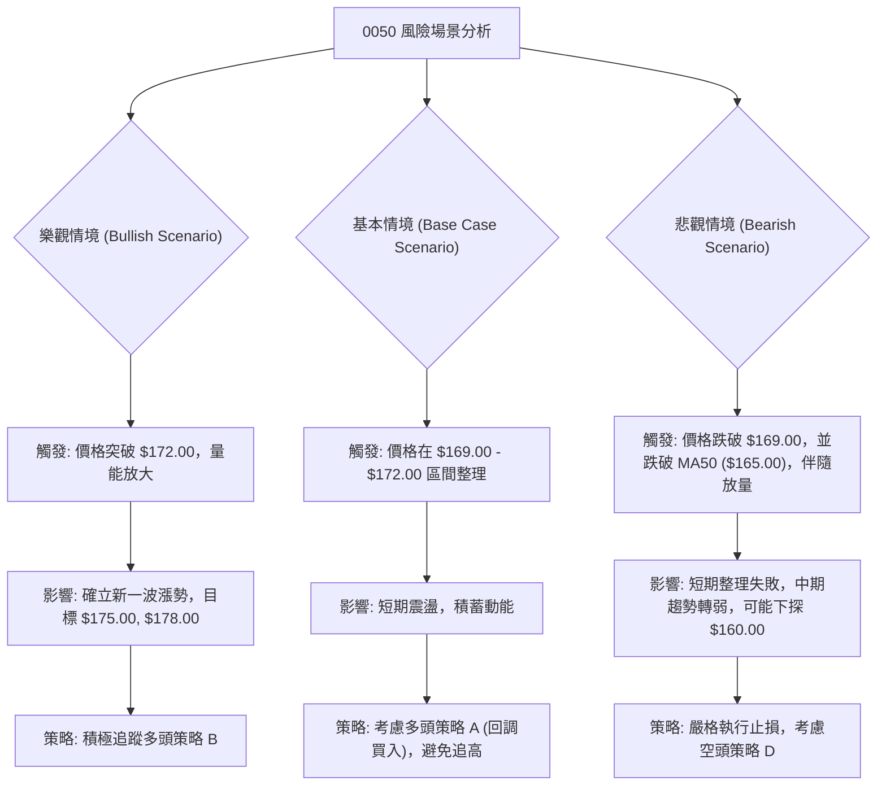

### 🛡️ 風險管理重要提醒

1.  **倉位管理**：無論對策略多麼有信心，都應嚴格控制單一標的的倉位，建議不超過總投資組合的 10-20%。
2.