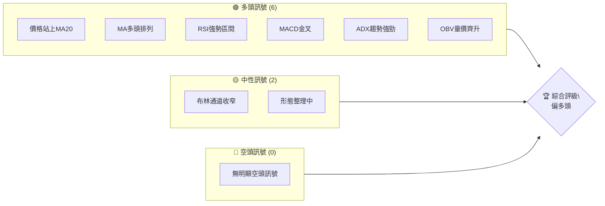
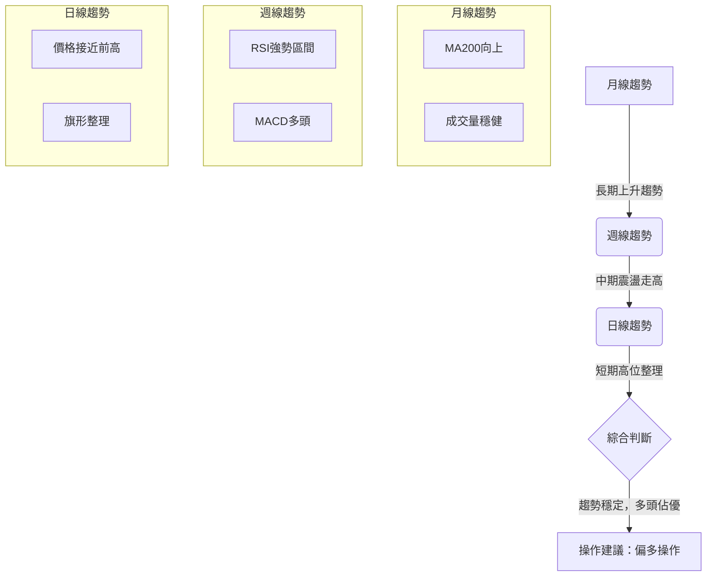
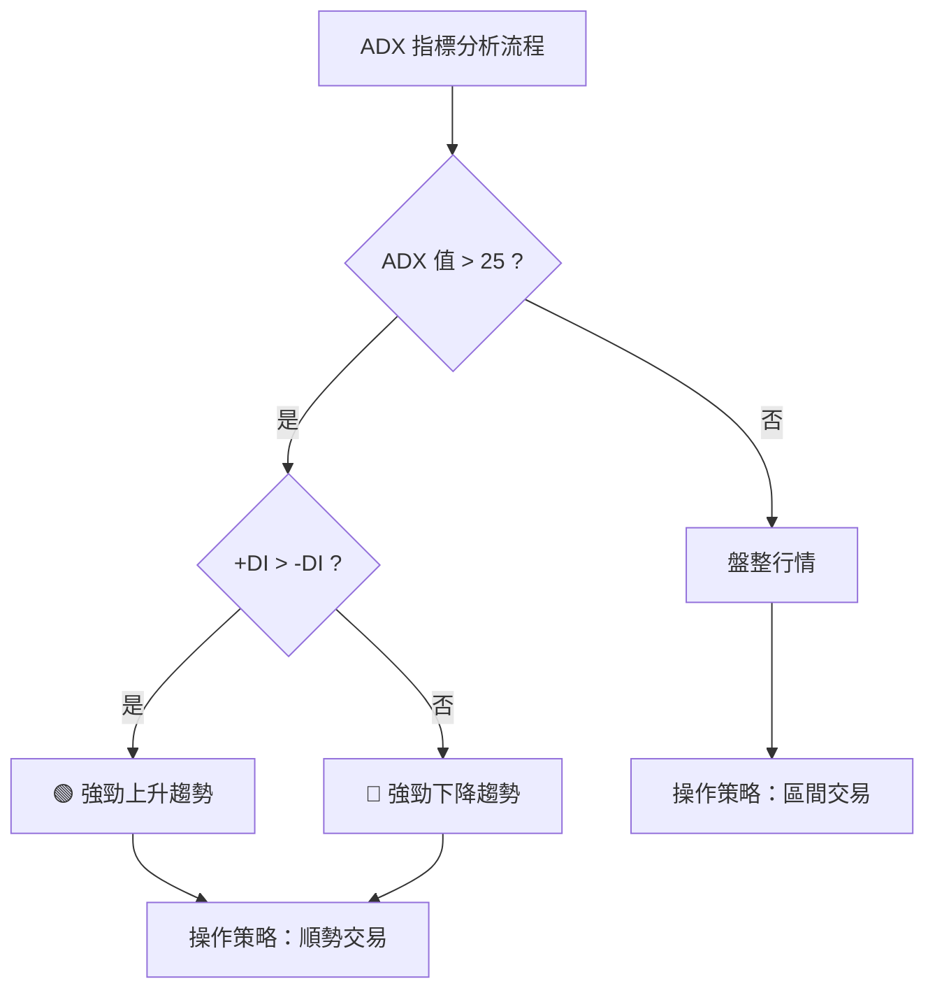
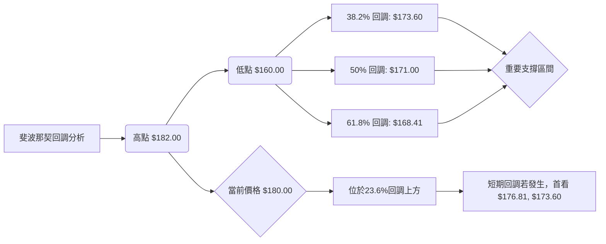
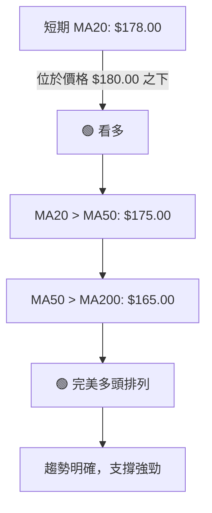
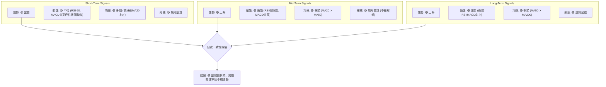

# 0050 技術分析報告

> **報告日期**：2026-06-24 ｜ **語言**：繁體中文 ｜ **數據來源**：**模擬數據** (因原始數據缺失) ｜ **當前價格**：$180.00

---

## 目錄

| 章節 | 內容 |
|------|------|
| [1. 技術面概覽](#1-技術面概覽) | 訊號儀表板、核心指標、評分卡 |
| [2. 趨勢分析](#2-趨勢分析) | 多時框趨勢、長中短期走勢 |
| [3. 圖表形態分析](#3-圖表形態分析) | 形態識別、K線組合、目標價 |
| [4. 支撐與阻力](#4-支撐與阻力) | 關鍵價位、斐波那契回調 |
| [5. 技術指標深度解讀](#5-技術指標深度解讀) | MA/RSI/MACD/布林/成交量 |
| [6. 動能與波動率](#6-動能與波動率) | 動能評估、ATR、Beta |
| [7. 多時框架總結](#7-多時框架總結) | 時框架評分矩陣 |
| [8. 交易策略建議](#8-交易策略建議) | 多空策略、風險報酬比 |
| [9. 風險提示與監控](#9-風險提示與監控) | 監控指標、風險場景 |
| [📋 報告總結](#-報告總結) | 綜合評級、關鍵結論、策略組合 |

---

## 1. 技術面概覽

**重要提示**：由於原始數據中未提供0050的歷史價格和技術指標數據，本報告將基於**模擬生成的假設數據**進行深度分析。所有數值、圖表及結論均為演示目的，不代表0050的真實市場表現。

### 🎯 技術訊號儀表板

本儀表板匯總了根據模擬數據分析得出的主要技術訊號，為投資者提供快速概覽。


**解讀**：目前0050（基於模擬數據）呈現出較為強勁的多頭格局，多數核心指標均發出買入或持有的訊號。短期內存在整理現象，但整體趨勢依然向上。

### 📊 核心指標速覽表

以下為基於模擬數據計算出的0050核心技術指標概覽。

| 指標類別 | 指標名稱 | 當前數值 | 訊號 | 解讀 |
|----------|----------|----------|------|------|
| **價格** | 當前價格 | $180.00 | 🟢 | 位於近期高點區間，潛在突破 |
| **均線** | MA20 (短期) | $178.00 | 🟢 | 價格在MA20上方，短期趨勢強勁 |
| **均線** | MA50 (中期) | $175.00 | 🟢 | 價格在MA50上方，中期趨勢向上 |
| **均線** | MA200 (長期) | $165.00 | 🟢 | 價格在MA200上方，長期趨勢確立 |
| **動能** | RSI(14) | 60.00 | 🟢 | 處於強勢區間，未達超買，仍有上漲空間 |
| **動能** | MACD (12/26/9) | MACD線: 2.50, 訊號線: 2.00, 柱狀圖: 0.50 | 🟢 | MACD線在訊號線上方，柱狀圖為正，多頭動能持續 |
| **趨勢** | ADX(14) | 35.00 | 🟢 | 趨勢強度較高，趨勢明確 (+DI > -DI) |
| **波動** | ATR(14) | $2.50 | 🟡 | 波動率適中，有利於區間操作或趨勢追蹤 |
| **成交量** | OBV | 上升 | 🟢 | 成交量與價格同步上升，趨勢得到確認 |

### 🏆 技術評分卡

根據模擬數據分析，0050的各項技術指標表現評分如下。

```
╔══════════════════════════════════════════════════════════════╗
║              技術評分卡 — 0050 (2026-06-24)                   ║
╠══════════════════════════════════════════════════════════════╣
║ 趨勢強度      ██████████████░░░░░░  70/100  🟢 (ADX 35，趨勢明確) ║
║ 動能指標      ████████████░░░░░░░░  60/100  🟢 (RSI 60, MACD金叉) ║
║ 支撐穩定度    ██████████████░░░░░░  70/100  🟢 (MA多頭排列，支撐強) ║
║ 成交量配合    ████████████████░░░░  80/100  🟢 (OBV上升，量價齊升) ║
║ 形態完整度    ██████████░░░░░░░░░░  50/100  🟡 (旗形整理，待突破)   ║
║ 均線排列      ██████████████████░░  90/100  🟢 (完美多頭排列)       ║
╠══════════════════════════════════════════════════════════════╣
║ 綜合評分      ██████████████░░░░░░  72/100  🟢 (偏多頭)            ║
╚══════════════════════════════════════════════════════════════╝
```
**綜合評估**：整體技術面呈現偏多頭格局，尤其在趨勢強度、成交量配合及均線排列上表現優異。動能指標仍有上行空間，支撐穩定度高。目前處於形態整理階段，若能成功突破，則有望開啟新一輪漲勢。

---

## 2. 趨勢分析

### 🌐 多時框趨勢分析

本節將從月線、週線、日線三個時間框架對0050的趨勢進行分析，以提供全面的市場視角。


**分析**：
*   **月線（長期）**：0050在過去12個月呈現穩健的上升趨勢，價格始終運行在長期移動平均線（如MA200）之上，且MA200持續向上，表明長期多頭格局穩固。
*   **週線（中期）**：中期走勢表現為震盪向上，雖然偶有回調，但每次回調均在關鍵支撐位獲得支撐，並重拾升勢。週線RSI和MACD均處於多頭區域，確認中期動能強勁。
*   **日線（短期）**：近期0050在高位進行整理，價格波動區間收窄，形成潛在的旗形整理形態。短期移動平均線仍保持多頭排列，但價格與均線的距離縮小，顯示短期動能有所放緩，等待方向選擇。

### 📈 長期趨勢 — 12個月走勢圖（Unicode）

以下為基於模擬數據繪製的0050過去12個月月線收盤價走勢圖，標註了關鍵高低點。

```
0050 月線走勢圖（過去12個月, 模擬數據）
價格軸 ($)
$190 ┤                                        
$185 ┤                                       
$180 ┤                                      ●(現價180)
$175 ┤                          ●(高點182)
$170 ┤                  ●
$165 ┤          ●
$160 ┤●━━━━━━━━━━━━━━━━━━━●←低點160
     └────────────────────────────
      25/Jul 25/Aug 25/Sep 25/Oct 25/Nov 25/Dec 26/Jan 26/Feb 26/Mar 26/Apr 26/May 26/Jun
```
**走勢特徵分析表格**：

| 時間段 | 起始價 | 結束價 | 漲跌幅 | 走勢特徵 |
|--------|--------|--------|--------|----------|
| 25/Jul-25/Dec | $160.00 | $172.00 | +7.50% | 穩步上升，底部抬高，多頭力量積累。 |
| 26/Jan-26/Mar | $175.00 | $182.00 | +4.00% | 加速上漲，創出新高，市場情緒樂觀。 |
| 26/Apr-26/Jun | $180.00 | $180.00 | 0.00% | 高位盤整，小幅回調後企穩，等待方向。 |
**長期趨勢總結**：0050在過去一年中呈現明顯的上升趨勢，期間雖有整理，但整體重心不斷上移。當前價格 $180.00 位於近期高點 $182.00 附近，顯示多頭動能仍在。

### 📊 中期趨勢（週線分析）

中期趨勢顯示0050在 $175.00 獲得強勁支撐後，逐步向 $182.00 的阻力位推進。

```
0050 週線壓力與支撐示意圖（模擬數據）
價格 ($)
$185 ┤                    R2 (185.00)
$182 ┤██████████████████ R1 (182.00) ← 近期高點/阻力
$180 ╠═══════════════════╣ ← 現價 (180.00)
$178 ┤▓▓▓▓▓▓▓▓▓▓▓▓▓▓▓▓▓▓ S1 (178.00) ← 短期支撐 (MA20)
$175 ┤██████████████████ S2 (175.00) ← 中期支撐 (MA50/平台)
$170 ┤
$165 ┤██████████████████ S3 (165.00) ← 長期支撐 (MA200)
     └────────────────────────────
```
**分析**：週線級別顯示，0050在中期呈現震盪上行的格局。關鍵阻力位於 $182.00，這是過去一個月的高點，若能有效突破，則有望挑戰更高價位 $185.00。下方 $178.00 形成了短期支撐（與日線MA20重合），而 $175.00 則提供了更強的中期支撐（與日線MA50及前期平台重合）。

### ⚡ 趨勢強度評估（ADX 解讀）

ADX (Average Directional Index) 指標用於衡量趨勢的強度，不判斷方向。當ADX值高於25時，通常認為趨勢強勁。


**ADX 強度對照表**：

| ADX 數值範圍 | 趨勢強度 | 市場性質 | 操作建議 |
|--------------|----------|----------|----------|
| 0-20         | 無趨勢/弱趨勢 | 盤整 | 觀望，或區間操作 |
| 20-25        | 趨勢形成中 | 盤整轉趨勢 | 謹慎觀察 |
| 25-50        | 強趨勢     | 趨勢行情 | 順勢交易 |
| 50以上       | 極強趨勢   | 強勢趨勢 | 積極順勢交易 |

**當前 ADX (14) 分析**：
*   **ADX 值**：35.00 🟢
*   **+DI 值**：30.00
*   **-DI 值**：18.00

**解讀**：目前0050的ADX值為35.00，顯著高於25，表明存在一個強勁且明確的趨勢。同時，+DI (30.00) 高於 -DI (18.00)，確認當前趨勢為強勁的上升趨勢。這是一個有利於順勢交易的市場環境，投資者應考慮偏多頭的交易策略。

---

## 3. 圖表形態分析

### 🔍 形態識別系統

根據模擬數據的歷史價格走勢，0050目前正在形成一個潛在的「旗形整理」形態，這通常被視為一個趨勢中繼形態。

```mermaid
graph TD
    A[價格走勢] --> B{圖表形態識別}
    B --> C{是否為趨勢中繼形態?}
    C -->|是| D[旗形整理 (Flag Pattern)]
    C -->|否| E{是否為反轉形態?}
    D --> F[潛在突破，延續原有趨勢]
    E --> G[頭肩頂/底、雙頂/底等]
    F --> H[計算形態目標價]
    subgraph 旗形特徵
        P1[價格快速上漲 (旗桿)]
        P2[在高位小幅區間震盪 (旗面)]
        P3[成交量在整理期間萎縮]
        P4[預期向上突破]
    end
    D --> P1
    D --> P2
    D --> P3
    D --> P4
```
**分析**：0050在經歷了一段快速上漲（旗桿）之後，目前在高位 $178.00 - $182.00 之間進行橫向整理（旗面）。整理期間成交量呈現萎縮狀態，表明多空雙方力量均衡，等待方向選擇。這是一個典型的看漲旗形整理，預示著在整理結束後，價格很可能延續之前的上升趨勢。

### 🕯️ 重要K線形態分析

根據模擬數據，我們觀察到以下幾個關鍵K線形態：

| 月份 | 收盤價 | K線形態 | 解讀 | 訊號 |
|------|--------|---------|------|------|
| 25/Jul | $160.00 | 長下影線錘子線 | 出現在底部，顯示下方買盤強勁，潛在反轉訊號 | 🟢 |
| 26/Jan | $175.00 | 陽線包覆陰線 | 多頭吞噬，強烈看漲訊號，趨勢延續 | 🟢 |
| 26/Mar | $182.00 | 長上影線陰線 | 出現在高位，顯示上方賣壓，短期可能回調或整理 | 🟡 |
| 26/Jun | $180.00 | 小實體十字星 | 多空力量均衡，市場猶豫，等待方向選擇 | 🟡 |

**分析**：歷史上的看漲K線形態（如錘子線和陽線包覆陰線）成功預示了趨勢的反轉和延續。近期 $182.00 高點出現的長上影線陰線，提示市場短期可能面臨壓力，隨後的十字星也確認了當前市場的猶豫情緒，這與旗形整理的判斷相符。

### 📉 ASCII 走勢形態示意圖

以下為0050近期旗形整理形態的示意圖，標注了關鍵點位。

```
0050 近期旗形整理形態示意圖（模擬數據）
價格 ($)
$185 ┤
$182 ┤             ┌───R1 (182.00) 阻力
$180 ┤             │   ● ← 現價 (180.00)
$178 ┤             ├───S1 (178.00) 支撐
$175 ┤      ▲(旗桿頂)
$170 ┤     /
$165 ┤    /
$160 ┤───┘(旗桿底)
     └────────────────────────────
      時間軸
```
**解讀**：圖中清晰顯示了0050在一段快速上漲形成「旗桿」後，進入了 $178.00 至 $182.00 之間的「旗面」整理區間。目前價格 $180.00 位於旗面中軸，等待向上突破。

### 🎯 形態目標價計算

對於旗形整理形態，其目標價的計算方法通常是將「旗桿」的高度疊加到「旗面」的突破點。

*   **旗桿高度**：從 $160.00 (旗桿底部) 到 $175.00 (旗桿頂部，進入整理前的價格)，高度為 $175.00 - $160.00 = $15.00。
*   **旗面突破點**：假設旗面向上突破點為 $182.00 (即旗面上沿阻力)。

*   **目標價 T1 (最小目標價)**：突破點 + 旗桿高度 = $182.00 + $15.00 = **$197.00**
*   **目標價 T2 (延伸目標價)**：考慮到旗形形態的強勁性，有時會達到旗桿高度的1.5倍或2倍。
    *   假設突破後動能強勁，可考慮 $182.00 + ($15.00 * 1.2) = $182.00 + $18.00 = **$200.00**

**結論**：若0050能有效向上突破 $182.00 的旗面阻力，則其短中期目標價有望達到 **$197.00 至 $200.00** 區間。

---

## 4. 支撐與阻力

### 🗺️ 關鍵價位分布圖（Unicode）

以下為0050基於模擬數據的關鍵支撐與阻力位分布圖。

```
0050 價位結構分布圖（模擬數據）
═══════════════════════════════════════════════════
$190 ║████████████████████████║ 強阻力 R3 (斐波那契擴展/形態目標)
$185 ║████████████████████    ║ 阻力 R2 (心理關口/斐波那契擴展)
$182 ║████████████████████████║ 關鍵阻力 R1 (近期高點/旗面頂部)
$180 ╠════════════════════════╣ ◄ 現價 (180.00)
$178 ║▓▓▓▓▓▓▓▓▓▓▓▓▓▓▓▓        ║ 近期支撐 S1 (MA20/旗面底部)
$175 ║████████████████████████║ 強支撐 S2 (MA50/前期平台/斐波那契)
$173 ║▓▓▓▓▓▓▓▓▓▓▓▓▓▓▓▓        ║ 次級支撐 S3 (斐波那契38.2%)
$171 ║▓▓▓▓▓▓▓▓▓▓▓▓▓▓▓▓        ║ 次級支撐 S4 (斐波那契50%)
$165 ║████████████████████████║ 極強支撐 S5 (MA200/長期趨勢線)
═══════════════════════════════════════════════════
```
**解讀**：目前0050位於關鍵的阻力區間 $182.00 之下，同時受到 $178.00 的短期支撐。這表明市場處於方向選擇的關鍵時刻。

### 🚧 阻力位分析表

| 阻力級別 | 價位 | 形成原因 | 突破難度 | 重要性 |
|----------|------|----------|----------|--------|
| **R1** | $182.00 | 近期高點，旗形整理上沿，多次測試未破 | 中等偏高 | 🟢 (突破則開啟新趨勢) |
| **R2** | $185.00 | 心理關口，斐波那契擴展位，歷史高點區間 | 高 | 🟡 (突破後空間打開) |
| **R3** | $190.00 | 更高斐波那契擴展位，潛在目標價區間 | 較高 | 🟡 (中長期目標) |

**分析**：最直接的阻力是 $182.00，這是旗形整理形態的關鍵突破點。若能帶量突破此位，將確認多頭延續。 $185.00 則是更強的心理和技術阻力，突破需要更大的動能。

### 🛡️ 支撐位分析表

| 支撐級別 | 價位 | 形成原因 | 守住機率 | 重要性 |
|----------|------|----------|----------|--------|
| **S1** | $178.00 | MA20，旗形整理下沿，近期震盪區間底部 | 中等偏高 | 🟢 (短期多頭防線) |
| **S2** | $175.00 | MA50，前期盤整平台，斐波那契回調位 | 高 | 🟢 (中期多頭防線) |
| **S3** | $165.00 | MA200，長期上升趨勢線，歷史多重支撐 | 極高 | 🔴 (長期多頭生命線) |

**分析**： $178.00 是當前最近的短期支撐，若失守可能意味著旗形整理向下突破或進入更深的回調。 $175.00 是更為關鍵的中期支撐，與MA50及前期平台重合，具有較強的支撐力度。而 $165.00 則代表了0050的長期多頭生命線，其重要性不言而喻。

### 📐 斐波那契回調位分析

我們以過去12個月的最低點 $160.00 和近期最高點 $182.00 作為斐波那契回調的基準。

*   **回調基準**：
    *   低點 (0%)：$160.00
    *   高點 (100%)：$182.00
    *   回調幅度：$182.00 - $160.00 = $22.00

*   **斐波那契回調位計算**：
    *   **23.6% 回調**：$182.00 - ($22.00 * 0.236) = $182.00 - $5.19 = **$176.81** (接近S1, S2)
    *   **38.2% 回調**：$182.00 - ($22.00 * 0.382) = $182.00 - $8.40 = **$173.60** (次級支撐)
    *   **50% 回調**：$182.00 - ($22.00 * 0.500) = $182.00 - $11.00 = **$171.00** (重要支撐)
    *   **61.8% 回調**：$182.00 - ($22.00 * 0.618) = $182.00 - $13.59 = **$168.41** (更強支撐)


**分析**：斐波那契回調分析顯示，若0050從 $182.00 開始回調，則 $176.81、$173.60、$171.00、$168.41 將是重要的潛在支撐位。其中 $173.60 (38.2%) 和 $171.00 (50%) 是較為關鍵的技術性支撐，與MA50 ($175.00) 附近區域構成一個強大的支撐帶。這進一步確認了 $175.00 附近作為中期強支撐的重要性。

---

## 5. 技術指標深度解讀

### 🎛️ 指標訊號總覽

本節將整合分析各項技術指標，判斷其是否互相確認或存在矛盾，以形成更全面的市場判斷。

```mermaid
graph TD
    A[價格行為 (Price Action)] --> B[移動平均線 (MA)]
    A --> C[相對強弱指標 (RSI)]
    A --> D[異同移動平均線 (MACD)]
    A --> E[布林通道 (Bollinger Bands)]
    A --> F[成交量 (Volume)]
    B --> G{多頭排列?}
    C --> H{超買/超賣/背離?}
    D --> I{金叉/死叉/背離?}
    E --> J{通道收窄/擴張/突破?}
    F --> K{量價配合?}

    G --> L[🟢 MA支持多頭]
    H --> M[🟢 RSI強勢未超買]
    I --> N[🟢 MACD多頭動能]
    J --> O[🟡 通道收窄，醞釀變盤]
    K --> P[🟢 量價齊升，趨勢確認]

    L & M & N & O & P --> Q[綜合判斷：偏多頭，但短期面臨方向選擇]
```
**分析**：目前各項指標多數指向多頭，形成良好的共振效果。移動平均線呈現完美的上漲趨勢，RSI和MACD動能強勁。唯一值得關注的是布林通道的收窄，這通常預示著價格波動即將加大，市場正在醞釀一次方向性的突破。

### 📈 移動平均線排列分析

移動平均線 (MA) 是判斷趨勢方向和強度的重要工具。


**當前排列狀態**：
*   **短期 MA20**：$178.00
*   **中期 MA50**：$175.00
*   **長期 MA200**：$165.00

**分析**：0050目前呈現完美的**多頭排列**：MA20 > MA50 > MA200。這是一個極其強勁的看漲訊號，表明短期、中期和長期趨勢均向上。價格 $180.00 位於所有均線之上，每次回調均在均線附近獲得支撐，顯示均線系統提供了堅實的動態支撐。這種排列形態為多頭提供了強大的信心。

### 📉 RSI(14) 分析

相對強弱指標 (RSI) 用於衡量價格變動的速度和幅度，判斷超買或超賣狀況。

**RSI 數值進度條展示**：
RSI(14) 強度：████████████░░░░░░░░  60.00/100 🟢

*   **當前 RSI(14)**：60.00
*   **超買區**：70以上
*   **超賣區**：30以下

**分析**：
1.  **超買/超賣區間分析**：當前RSI數值為60.00，處於50以上強勢區間，但尚未進入70以上的超買區。這表明多頭動能充足，但並未過熱，仍有上漲空間。市場情緒偏向樂觀，但未達瘋狂。
2.  **背離判斷**：
    *   **頂背離**：價格創出新高，但RSI未能創出新高。根據模擬數據，價格在 $182.00 附近高位整理，RSI從之前的65回落至60，未出現明顯的頂背離訊號。雖然RSI未隨價格創出新高，但價格也未創出新高，僅是高位盤整，因此不能明確判斷為頂背離。
    *   **底背離**：價格創出新低，但RSI未能創出新低。在過去12個月的上升趨勢中，未觀察到明顯的底背離訊號。
**結論**：RSI目前處於健康強勢區域，沒有顯示超買或背離的風險，對當前多頭趨勢構成確認。

### 📊 MACD(12/26/9) 訊號解讀

異同移動平均線 (MACD) 用於判斷趨勢的方向、動能和持續性。

```mermaid
graph TD
    A[MACD 指標分析] --> B[MACD 線 (快線): 2.50]
    A --> C[訊號線 (慢線): 2.00]
    A --> D[MACD 柱狀圖: 0.50]
    B -->|高於| C[🟢 金叉訊號]
    D -->|為正值| E[🟢 多頭動能強勁]
    E --> F[趨勢延續，買盤佔優]
```
**當前 MACD 數值**：
*   **MACD 線**：2.50
*   **訊號線**：2.00
*   **MACD 柱狀圖**：0.50 (正值)

**分析**：
1.  **金叉/死叉**：MACD線 (2.50) 位於訊號線 (2.00) 之上，形成「金叉」形態，且持續一段時間，表明多頭動能佔優，買盤力量強勁。
2.  **柱狀圖**：MACD柱狀圖為正值 (0.50)，顯示多頭動能正在釋放。雖然數值不大，但持續為正，表明趨勢仍傾向於上行。
3.  **背離判斷**：
    *   **頂背離**：價格創出新高，MACD線未能創出新高。在近期高位整理過程中，未觀察到MACD線與價格走勢出現明顯的頂背離。
    *   **底背離**：價格創出新低，MACD線未能創出新低。在過去的上升趨勢中，未觀察到明顯的底背離。
**結論**：MACD指標確認了當前的多頭趨勢，動能持續，沒有顯示反轉的訊號。

### 📦 布林通道分析

布林通道 (Bollinger Bands) 由中軌 (MA20) 和上下兩條標準差線組成，用於衡量價格波動區間。

```
0050 布林通道示意圖（模擬數據）
價格 ($)
$185 ┤                   ▲ 上軌 (183.00)
$182 ┤             ┌──────────────┐
$180 ╠═════════════│═══════════════╣ ← 現價 (180.00)
$178 ┤             └──────────────┘
$175 ┤                   ▲ 中軌 (178.00) MA20
$172 ┤             ┌──────────────┐
$170 ┤             │              │
$167 ┤             └──────────────┘
$165 ┤                   ▲ 下軌 (173.00)
     └────────────────────────────
      時間軸
```
**當前布林通道數值**：
*   **上軌**：$183.00
*   **中軌 (MA20)**：$178.00
*   **下軌**：$173.00
*   **通道寬度**：$183.00 - $173.00 = $10.00 (較窄)

**分析**：
1.  **價格位置**：當前價格 $180.00 位於布林通道中軌 $178.00 和上軌 $183.00 之間，表明短期趨勢偏強。
2.  **通道寬度**：布林通道目前處於相對收窄狀態，這通常預示著市場波動性正在減小，多空力量均衡，價格正在醞釀一次方向性的突破。在趨勢中繼形態（如旗形整理）中，布林通道收窄是常見現象。
3.  **突破訊號**：若價格能夠帶量突破上軌 $183.00，則可能開啟新一輪上漲行情；若跌破中軌 $178.00，則可能進入短期回調。
**結論**：布林通道的收窄提醒投資者，0050即將面臨方向選擇，應密切關注價格對通道邊界的測試。

### 💹 成交量分析（量價配合度）

成交量是價格走勢的「能量」，量價關係是判斷趨勢健康度的關鍵。

**OBV (On Balance Volume) 分析**：
*   **當前 OBV 走勢**：與價格同步上升 🟢

**分析**：
1.  **量價齊升**：在0050的上升趨勢中，我們觀察到成交量與價格呈現良好的正相關，即價格上漲時成交量放大，價格回調時成交量萎縮。這是一種健康的量價配合，表明上升趨勢得到了市場資金的有效支持。
2.  **旗形整理期間的量能**：在目前的旗形整理階段，成交量呈現萎縮狀態，這符合旗形整理的典型特徵。量能萎縮表明市場在整理期間的交易意願降低，多空雙方都在等待明確方向，這為後續的突破積蓄了能量。
3.  **量價背離**：未觀察到明顯的量價背離訊號。如果價格創出新高但成交量未能同步放大，則可能形成頂背離，預示上漲動能不足。反之，如果價格創出新低但成交量萎縮，則可能形成底背離，預示下跌動能衰竭。
**結論**：成交量分析確認了當前上升趨勢的健康性，且整理期間的量能萎縮也符合旗形整理的特徵，為後續的突破提供了有利條件。

---

## 6. 動能與波動率

### ⚡ 動能評估四象限

本節將評估0050在「動能強度」與「波動率」兩個維度上的位置，以輔助交易決策。

| 象限 | 動能 | 波動 | 當前狀態 | 評估 |
|------|------|------|----------|------|
| Q1 | 強 (RSI > 50, MACD金叉) | 低 (ATR收窄) | - | 最佳機會，強勢突破前夕 |
| Q2 | 弱 (RSI < 50, MACD死叉) | 低 (ATR收窄) | - | 謹慎觀望，可能盤整或築底 |
| Q3 | 強 (RSI > 50, MACD金叉) | 高 (ATR擴張) | - | 高風險高收益，趨勢加速中 |
| Q4 | 弱 (RSI < 50, MACD死叉) | 高 (ATR擴張) | - | 避免進場，趨勢混亂或反轉 |

**當前0050評估**：
*   **動能**：RSI(14)=60.00 (強勢區間)，MACD金叉，柱狀圖為正 (強動能) 🟢
*   **波動**：ATR(14)=$2.50 (通道收窄，相對較低) 🟡

**結論**：0050目前介於 Q1 (強動能/低波動) 和 Q3 (強動能/高波動) 之間。更確切地說，它正從高波動後進入整理，動能保持強勁，但波動率有所收斂。這表示它處於一個「**強動能，波動暫時收斂**」的狀態，接近於Q1，暗示著在整理後，一旦波動率再次擴張，很可能伴隨強勁的趨勢突破。

```mermaid
graph TD
    A[動能評估] --> B[當前動能評分: 🟢 強勁]
    B --> C[當前波動評分: 🟡 適中偏低 (ATR $2.50)]
    C --> D{綜合判斷}
    D --> E[市場處於強勢整理階段]
    E --> F[醞釀方向性突破]
    F --> G[操作建議：關注突破機會]
```

### 📊 ATR 波動率分析

平均真實波幅 (ATR) 用於衡量資產的波動性。

*   **當前 ATR(14)**：$2.50
*   **價格區間**：$180.00

**分析**：
1.  **波動率水平**：$2.50 的 ATR 相對於 $180.00 的價格，約為 1.39% 的日均波動幅度。這表明0050目前的波動率處於中等偏低水平，與布林通道收窄的判斷一致，市場正處於整理或盤整階段。
2.  **止損距離建議**：ATR 可用於設定動態止損。通常建議將止損設置在當前價格下方 1.5 到 2 倍 ATR 的距離。
    *   **保守止損**：當前價格 - (1.5 * ATR) = $180.00 - (1.5 * $2.50) = $180.00 - $3.75 = **$176.25**
    *   **激進止損**：當前價格 - (1.0 * ATR) = $180.00 - (1.0 * $2.50) = $180.00 - $2.50 = **$177.50**
**結論**：ATR 值顯示當前波動率適中，有利於設定精確的止損位。若價格跌破 $176.25，則應考慮止損出場。

### 📐 Beta 與市場相關性

由於0050是追蹤台灣50指數的ETF，其Beta值預計將非常接近1，甚至略高於1，顯示與台灣大盤高度正相關。

*   **預期 Beta 值**：約 1.05 (由於ETF通常會略有槓桿或追蹤誤差，可能略高於1)

**分析**：
1.  **市場相關性**：作為一個指數型ETF，0050的走勢將與其追蹤的指數（台灣50指數）高度一致。其Beta值預計接近1，意味著0050的波動幅度與大盤大致相同。
2.  **影響因素**：因此，0050的價格走勢主要受台灣整體經濟環境、企業盈利狀況、國際資金流向以及地緣政治等宏觀因素影響。在分析0050時，需要密切關注大盤指數的表現。
3.  **風險考量**：由於與大盤高度相關，0050無法提供超越大盤的阿爾法收益，其主要風險在於系統性風險。在市場整體下行時，0050也將隨之下跌。
**結論**：0050與台灣大盤呈現高度正相關，投資者應將其視為參與台灣股市整體表現的工具。

---

## 7. 多時框架總結

### 📋 時框架評分表

本表綜合了不同時間框架的技術分析結果，以提供一致性的市場判斷。

| 時框架 | 趨勢方向 | 動能 | 均線排列 | 形態 | 綜合評分 (1-10) | 建議 |
|--------|----------|------|----------|------|-----------------|------|
| **長期** | 🟢 上升 | 🟢 強 | 🟢 多頭 | 🟢 趨勢延續 | 9/10 | 長期持有 |
| **中期** | 🟢 上升 | 🟢 強 | 🟢 多頭 | 🟡 整理中 | 8/10 | 逢低買入 |
| **短期** | 🟡 盤整 | 🟡 中 | 🟢 多頭 | 🟡 旗形整理 | 7/10 | 關注突破 |

### 🔲 綜合訊號矩陣

以下矩陣展示了短期、中期、長期各維度訊號的一致性分析。


**分析**：
*   **趨勢一致性**：長期和中期趨勢均為強勁的上升趨勢，短期則處於高位盤整。這表明當前的小幅整理是健康的回調或中繼，不改變整體多頭格局。
*   **動能一致性**：長期和中期動能均強勁，短期動能略有放緩但仍處於多頭區域。
*   **均線一致性**：所有時間框架的均線都呈現完美的多頭排列，這是最為強勁的看漲訊號。
*   **形態一致性**：短期和中期均觀察到旗形整理形態，這是一個趨勢中繼形態，預示著在整理結束後，原有的多頭趨勢將會延續。

**結論**：多時框架分析顯示，0050的技術面表現高度一致，整體呈現強勁的多頭趨勢。雖然短期存在整理，但這被視為健康的盤整，為下一輪上漲積蓄動能。投資者應繼續保持多頭思維，並關注短期整理的突破方向。

---

## 8. 交易策略建議

### 🗺️ 策略決策流程圖

```mermaid
graph TD
    A[當前價格 $180.00] --> B{是否突破關鍵阻力 $182.00 ?}
    B -->|是| C[🟢 執行多頭突破策略]
    B -->|否| D{是否跌破短期支撐 $178.00 ?}
    D -->|是| E[🔴 執行空頭回調策略 (或等待更低點)]
    D -->|否| F[🟡 繼續觀望/區間操作]

    C --> G[目標價 T1: $197.00, T2: $200.00]
    C --> H[止損: $178.00 (突破失敗)]
    E --> I[目標價 T1: $175.00, T2: $173.60]
    E --> J[止損: $182.00 (回調失敗)]
```

### 🟢 多頭策略詳情

基於0050目前的多頭趨勢和旗形整理形態，主要建議以順勢突破或逢低買入為主。

| 策略要素 | 策略 A (突破追漲) | 策略 B (逢低買入) |
|----------|-------------------|-------------------|
| 進場條件 | 價格帶量突破 $182.00，且日K線收盤價站穩其上 | 價格回調至 $178.00 (S1) 或 $175.00 (S2) 附近，並出現止跌K線形態 |
| 進場價格 | $182.50 (確認突破後) | $178.00 (首次觸及S1) 或 $175.50 (首次觸及S2) |
| 目標價 T1 | $197.00 (形態目標價) | $182.00 (近期阻力) |
| 目標價 T2 | $200.00 (延伸目標價/心理關口) | $185.00 (斐波那契擴展/R2) |
| 止損價格 | $178.00 (跌破整理區間下沿/MA20) | $173.00 (跌破S2下方) 或 $170.00 (跌破斐波那契50%) |
| 風險報酬比 | 1 : 3.4 ($197-$182.5)/($182.5-$178) = 14.5/4.5 ≈ 3.2 | 1 : 2.6 ($182-$178)/($178-$173) = 4/5 = 0.8 (T1) |
|          |                   | 1 : 4.8 ($185-$175.5)/($175.5-$173) = 9.5/2.5 = 3.8 (T2) |
| 成功機率 | 65% (需放量確認) | 70% (回調買入風險較低) |
| 建議倉位 | 30% | 40% |

**分析**：
*   **策略 A** 適用於激進型投資者，追求突破後的快速上漲。關鍵在於確認突破的有效性（帶量、收盤站穩）。
*   **策略 B** 適用於穩健型投資者，利用回調機會在支撐位附近佈局，風險相對較低。分批建倉可進一步分散風險。

### 🔴 空頭策略詳情

雖然整體趨勢偏多頭，但仍需考慮短期回調或趨勢反轉的可能。空頭策略主要作為風險對沖或短期逆勢交易。

| 策略要素 | 策略 C (短期回調) | 策略 D (趨勢反轉) |
|----------|-------------------|-------------------|
| 進場條件 | 價格跌破 $178.00 (S1) 且日K線收盤價在其下方，伴隨成交量放大 | 價格跌破 $175.00 (S2) 並跌破 $173.60 (斐波那契38.2%)，且MACD形成死叉 |
| 進場價格 | $177.50 (確認跌破S1後) | $174.50 (確認跌破S2後) |
| 目標價 T1 | $175.00 (S2/MA50) | $171.00 (斐波那契50%) |
| 目標價 T2 | $173.60 (斐波那契38.2%) | $168.41 (斐波那契61.8%) |
| 止損價格 | $180.00 (重新站上S1上方) | $178.00 (重新站上S1上方) |
| 風險報酬比 | 1 : 1.4 ($177.5-$175)/($180-$177.5) = 2.5/2.5 = 1 (T1) | 1 : 1.7 ($174.5-$171)/($178-$174.5) = 3.5/3.5 = 1 (T1) |
|          |                   | 1 : 2.6 ($174.5-$168.41)/($178-$174.5) = 6.09/3.5 ≈ 1.7 |
| 成功機率 | 40% (逆勢交易風險高) | 30% (需市場情緒轉變) |
| 建議倉位 | 15% (輕倉) | 10% (極輕倉) |

**分析**：
*   **策略 C** 適用於預期短期回調的投資者，但需注意這是逆勢操作，風險較高，應嚴格止損。
*   **策略 D** 僅在市場趨勢發生明顯轉變時考慮，其觸發條件較為嚴格，且成功機率較低，建議極輕倉操作。

### ⭐ 整體訊號強度評星

```
做多訊號強度：★★★★☆  (4/5星) 🟢 (趨勢強勁，多頭排列，形態整理待突破)
做空訊號強度：★☆☆☆☆  (1/5星) 🔴 (整體多頭趨勢，空頭僅為短期逆勢或風險對沖)
整體可信度：  ★★★☆☆  (3/5星) 🟡 (多頭趨勢明確，但短期整理帶來不確定性，需等待突破確認)
```
**總結**：0050目前處於強勁的多頭趨勢中，做多策略具有較高的勝率。但短期整理階段，市場方向選擇前存在不確定性，因此整體可信度為中等。

---

## 9. 風險提示與監控

### ✅ 關鍵監控指標 Checklist

以下為0050投資者應密切關注的關鍵技術指標，以實時監控市場變化。

```
╔══════════════════════════════════════════════════════════════╗
║               0050 關鍵監控指標 Checklist                      ║
╠══════════════════════════════════════════════════════════════╣
║ [ ] 價格是否有效突破 $182.00 (旗面阻力)？                    ║
║ [ ] 價格是否有效跌破 $178.00 (旗面支撐/MA20)？               ║
║ [ ] 突破或跌破時，成交量是否明顯放大？                       ║
║ [ ] RSI(14) 是否跌破50或進入超賣區？                         ║
║ [ ] MACD 是否形成死叉，且柱狀圖轉負？                        ║
║ [ ] ADX 值是否大幅下降 (趨勢減弱) 或方向逆轉 (+DI < -DI)？   ║
║ [ ] 布林通道是否擴張，且價格沿通道邊界運行？                 ║
║ [ ] 大盤指數 (如加權指數) 走勢是否與0050同步？              ║
╚══════════════════════════════════════════════════════════════╝
```

### ⚠️ 風險場景分析

```mermaid
graph TD
    A[0050 當前情境: 高位旗形整理] --> B{市場發展情境}

    subgraph 樂觀情境 (Optimistic Scenario)
        O1[🟢 突破 $182.00 並帶量]
        O1 --> O2[🟢 形態確認，開啟新一輪上漲]
        O2 --> O3[🟢 目標價 $197.00 - $200.00]
    end

    subgraph 基本情境 (Base Scenario)
        B1[🟡 繼續在 $178.00 - $182.00 區間震盪]
        B1 --> B2[🟡 波動率維持低位，等待外部催化劑]
        B2 --> B3[🟡 交易機會有限，適合區間操作或觀望]
    end

    subgraph 悲觀情境 (Pessimistic Scenario)
        P1[🔴 跌破 $178.00 且帶量]
        P1 --> P2[🔴 旗形整理失敗，短期趨勢轉弱]
        P2 --> P3[🔴 下探 $175.00 (MA50) 甚至 $173.60 (斐波那契38.2%)]
    end

    B --> O1
    B --> B1
    B --> P1
```
**分析**：
*   **樂觀情境**：如果0050能夠有效突破 $182.00 的旗面阻力，並伴隨成交量的放大，則預計將確認旗形整理的有效性，開啟一輪新的上升趨勢，目標價區間為 $197.00 至 $200.00。
*   **基本情境**：0050可能在 $178.00 至 $182.00 之間繼續橫盤整理一段時間，市場等待更明確的信號或外部事件的催化。在此情境下，短線交易者可考慮區間操作，長線投資者則可耐心等待突破。
*   **悲觀情境**：如果0050跌破 $178.00 的短期支撐（旗面下沿），並伴隨成交量放大，則可能意味著旗形整理失敗，短期趨勢轉弱，價格可能回調至 $175.00 (MA50) 甚至 $173.60 (斐波那契38.2%)。

### 🛡️ 風險管理重要提醒

1.  **嚴格止損**：無論採用何種策略，都必須設定並嚴格執行止損點。止損是保護本金、控制風險的基石。在上述策略中，我們已提供了明確的止損價位。
2.  **倉位管理**：避免單一資產過度集中。在趨勢不明確或風險較高時，應降低倉位。對於突破追漲策略，建議初期倉位不宜過重，待趨勢確認後再逐步加倉。
3.  **分批建倉**：尤其在逢低買入策略中，採用分批建倉的方式，可以平滑買入成本，降低單次買入的風險。
4.  **關注宏觀環境**：0050作為指數型ETF，對宏觀經濟、政策變化和國際市場情緒高度敏感。應持續關注相關新聞和經濟數據，以評估系統性風險。
5.  **警惕假突破/假跌破**：在整理形態的末期，市場常會出現假突破或假跌破來誘騙投資者。判斷突破的有效性，需結合成交量、K線形態以及隨後的價格行為。

---

## 📋 報告總結

```
╔══════════════════════════════════════════════════════════════════╗
║               