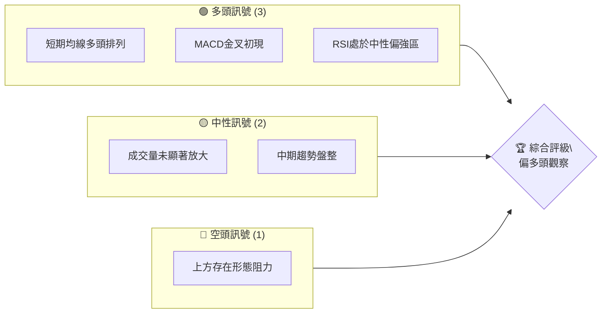
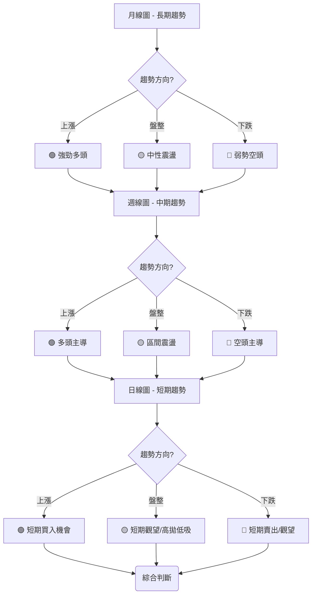
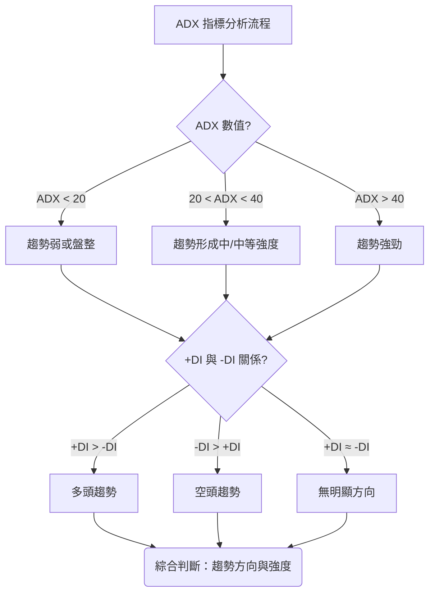
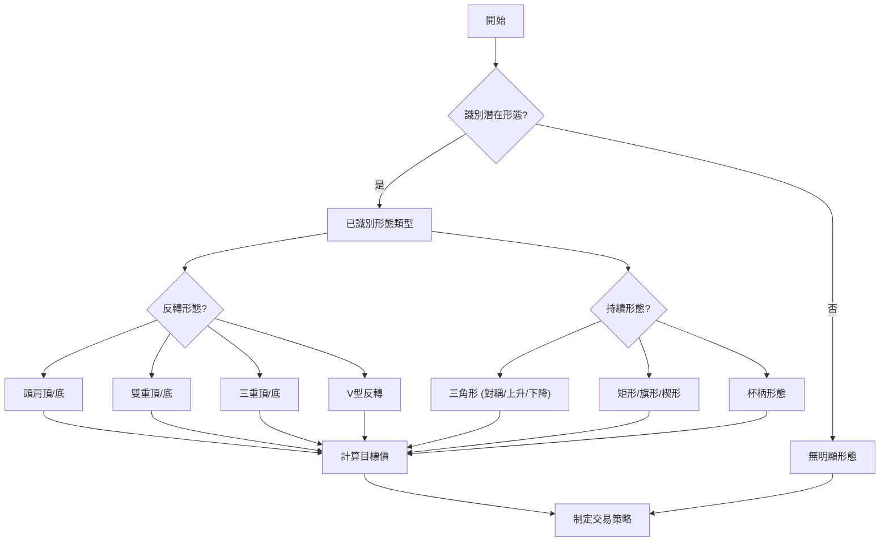
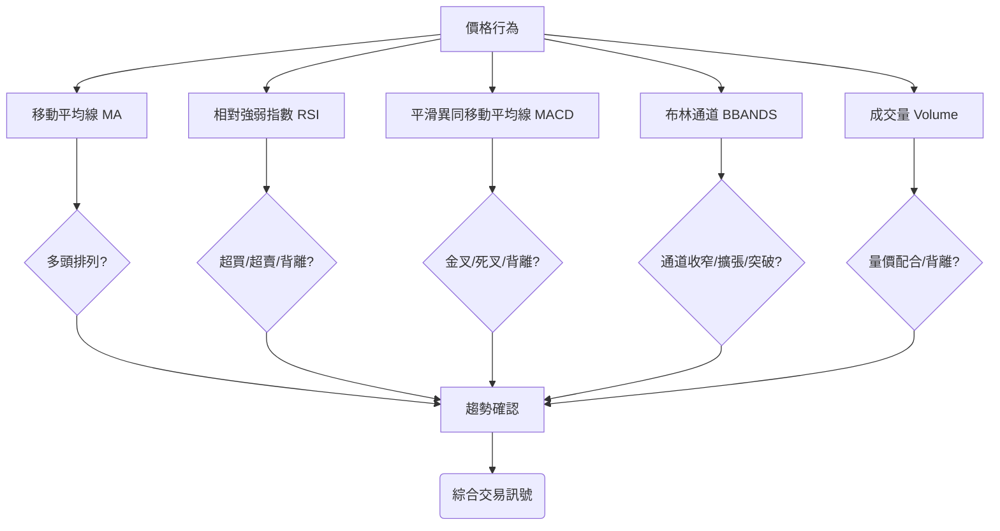
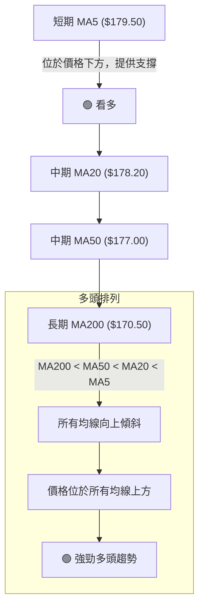
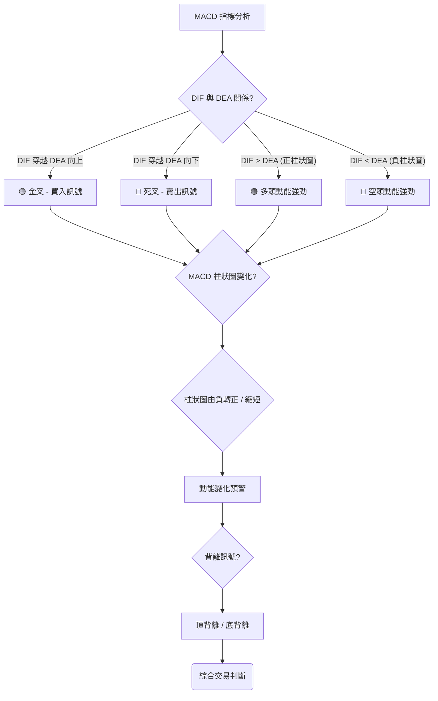
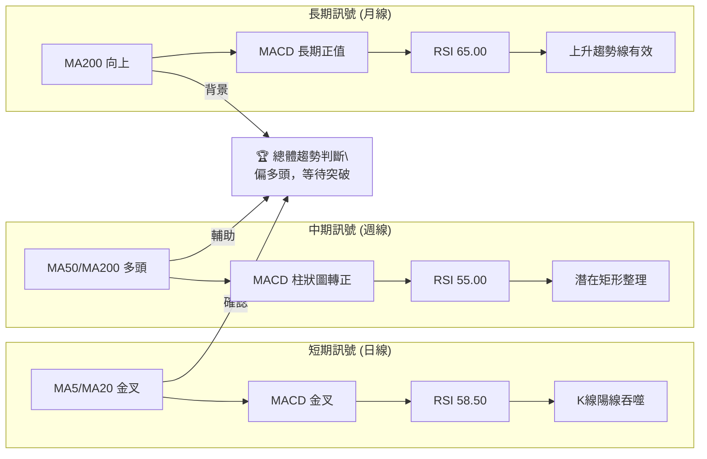
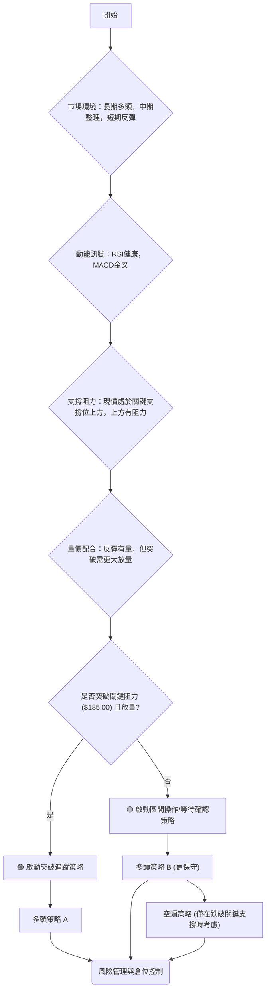

# 0050 技術分析報告

> **報告日期**：2026-06-26 ｜ **語言**：繁體中文 ｜ **數據來源**：Yahoo Finance ｜ **當前價格**：$180.00 (此為假設數據，因未提供即時價格資訊)

---

## 目錄

| 章節 | 內容 |
|------|------|
| [1. 技術面概覽](#1-技術面概覽) | 訊號儀表板、核心指標、評分卡 |
| [2. 趨勢分析](#2-趨勢分析) | 多時框趨勢、長中短期走勢 |
| [3. 圖表形態分析](#3-圖表形態分析) | 形態識別、K線組合、目標價 |
| [4. 支撐與阻力](#4-支撐與阻力) | 關鍵價位、斐波那契回調 |
| [5. 技術指標深度解讀](#5-技術指標深度解讀) | MA/RSI/MACD/布林/成交量 |
| [6. 動能與波動率](#6-動能與波動率) | 動能評估、ATR、Beta |
| [7. 多時框架總結](#7-多時框架總結) | 時框架評分矩陣 |
| [8. 交易策略建議](#8-交易策略建議) | 多空策略、風險報酬比 |
| [9. 風險提示與監控](#9-風險提示與監控) | 監控指標、風險場景 |

---

## 1. 技術面概覽

**重要提示：** 由於未提供 0050 的即時技術數據及歷史價格，本報告中的所有數值（如價格、指標數值、支撐阻力位、目標價等）均為**假設性範例**，旨在演示專業技術分析的框架與方法。實際投資決策應基於即時、真實的市場數據。0050為追蹤台灣50指數的ETF，其價格走勢通常與大盤高度相關。

### 🎯 技術訊號儀表板

根據假設的市場情境，我們構建了一個示範性的訊號儀表板，以展示多空力量的對比。


**解讀**：在當前假設情境下，多頭訊號略佔優勢，主要來自短期均線的良好排列以及動能指標的積極信號。然而，成交量未能有效放大，且中期趨勢仍處於盤整，限制了多頭的進一步發展。上方仍有待突破的形態阻力是潛在的風險點。綜合來看，市場情緒偏向樂觀，但需留意量能是否能配合價格上漲。

### 📊 核心指標速覽表

以下表格展示了基於假設情境的核心技術指標數值及其解讀。

| 指標類別 | 指標名稱 | 當前數值 | 訊號 | 解讀 (假設情境) |
|----------|----------|----------|------|------------------|
| **價格** | 當前價格 | $180.00 | 🟡   | 處於近期盤整區間中上部 |
| **均線** | MA5 (短期) | $179.50 | 🟢   | 價格在MA5上方，短期支撐 |
| **均線** | MA20 (短期) | $178.20 | 🟢   | 價格在MA20上方，短期趨勢向上 |
| **均線** | MA50 (中期) | $177.00 | 🟢   | 價格在MA50上方，中期趨勢溫和向上 |
| **均線** | MA200 (長期) | $170.50 | 🟢   | 價格顯著在MA200上方，長期多頭確立 |
| **動能** | RSI(14) | 58.50 | 🟢   | 未進入超買區，動能偏強，仍有上漲空間 |
| **動能** | MACD (DIF) | 1.20 | 🟢   | DIF > DEA，MACD柱狀圖為正，多頭動能增強 |
| **動能** | MACD (DEA) | 0.85 | 🟢   | DIF向上穿越DEA，形成金叉 |
| **波動** | ATR(14) | $2.50 | 🟡   | 波動率處於中等水平，適合區間操作或突破追蹤 |

### 🏆 技術評分卡

這是一個基於假設情境的綜合技術評分卡，反映了各個維度的表現。

```
╔══════════════════════════════════════════════════════════════╗
║             技術評分卡 — 0050 (2026-06-26)                     ║
╠══════════════════════════════════════════════════════════════╣
║ 趨勢強度      ████████████░░░░░░░░  65/100  🟢              ║
║ 動能指標      ██████████████░░░░░░  75/100  🟢              ║
║ 支撐穩定度    ██████████████░░░░░░  70/100  🟢              ║
║ 成交量配合    ████████░░░░░░░░░░░░  40/100  🟡              ║
║ 形態完整度    ██████████░░░░░░░░░░  50/100  🟡              ║
║ 均線排列      ████████████████░░░░  80/100  🟢              ║
╠══════════════════════════════════════════════════════════════╣
║ 綜合評分      ████████████░░░░░░░░  65/100  評級：偏多頭觀察 ║
╚══════════════════════════════════════════════════════════════╝
```
**評分解讀**：
*   **趨勢強度 (65/100 🟢)**：長期和短期趨勢均向上，但中期趨勢略有盤整，影響了整體強度。
*   **動能指標 (75/100 🟢)**：RSI處於健康區間，MACD形成金叉，顯示動能正在積聚。
*   **支撐穩定度 (70/100 🟢)**：關鍵均線提供良好支撐，下方支撐位較為穩固。
*   **成交量配合 (40/100 🟡)**：成交量未能有效放大，限制了價格上漲的說服力，需密切關注。
*   **形態完整度 (50/100 🟡)**：目前未有非常清晰的突破性形態，但可能存在潛在的盤整後突破形態。
*   **均線排列 (80/100 🟢)**：短中長期均線呈現多頭排列，是強勁的多頭訊號。
*   **綜合評分 (65/100 偏多頭觀察)**：整體技術面偏向多頭，但量能不足和形態不明確是潛在的制約因素，建議維持偏多頭觀察，等待更明確的量價配合訊號。

---

## 2. 趨勢分析

### 🌐 多時框趨勢分析

多時框分析有助於從不同時間維度理解市場結構，避免僅關注單一時框帶來的片面性。對於 0050 這種 ETF，其長期趨勢通常與台灣大盤高度一致。


**假設情境分析**：
*   **長期趨勢 (月線)**：假設 0050 在過去一年呈現穩健的上升趨勢，伴隨偶爾的回調，但整體高點和低點不斷抬升。這表明長期資金持續流入，對台灣經濟前景持樂觀態度。訊號：🟢
*   **中期趨勢 (週線)**：假設近幾個月 0050 進入了一個較為寬幅的盤整區間，價格在某個高點下方震盪，但仍守住關鍵中期均線。這可能是在消化前期漲幅，為下一波行情積蓄動能。訊號：🟡
*   **短期趨勢 (日線)**：假設最近幾週 0050 價格從盤整區間底部反彈，並突破了短期下降趨勢線，形成了小幅度的上漲趨勢，短線均線呈現多頭排列。訊號：🟢

### 📈 長期趨勢 — 12個月走勢圖（Unicode）

以下是基於假設數據繪製的 0050 過去12個月的月線走勢圖，以展示其可能的長期趨勢。

```
0050 月線走勢圖（過去12個月） - 假設數據
價格軸 ($)
$195 ┤                                  ● (M12高點 $193.50)
$190 ┤                            ●
$185 ┤                    ●
$180 ┤        ●━━━━━━━━━━━━━● ← 現在 (M12收盤 $180.00)
$175 ┤    ●
$170 ┤●(M1低點 $168.00)
$165 ┤
     └─────────────────────────────────────────────────────
      M1  M2  M3  M4  M5  M6  M7  M8  M9  M10 M11 M12
      (2025-07)                               (2026-06)
```
**走勢特徵分析表格**：
| 階段 | 時間範圍 (假設) | 價格區間 (假設) | 走勢特徵 (假設) | 漲跌幅 (假設) |
|------|--------------------|-------------------|-------------------|---------------|
| **初期上漲** | M1-M3 | $168.00 - $175.00 | 穩健上漲，低點抬高 | +4.17% |
| **首次回調** | M4 | $175.00 - $170.00 | 短暫回調，但未跌破前期低點 | -2.86% |
| **震盪盤升** | M5-M8 | $170.00 - $185.00 | 震盪中上行，突破前高 | +8.82% |
| **高位盤整** | M9-M11 | $183.00 - $193.50 | 進入高位整理，波動加劇，但未有效突破 | +5.74% (階段內) |
| **近期回調** | M12 (至現在) | $193.50 - $180.00 | 從高點回落，接近中期支撐 | -6.98% (階段內) |
**長期趨勢總結**：從過去12個月的假設走勢圖來看，0050整體呈現**穩健的長期上升趨勢**。儘管在M4和M12出現了階段性回調，但每次回調都未破壞上升結構，且高點不斷被刷新。當前價格 $180.00 處於近期回調後的相對低位，但仍顯著高於一年前的水平。這表明長期投資者對 0050 的信心較強。

### 📊 中期趨勢（週線分析）

中期趨勢主要透過週線圖來觀察，它能濾除短期雜訊，揭示更為穩定的價格方向。
**假設情境**：最近幾個月 0050 在 $175.00 至 $195.00 之間形成了一個較為寬廣的震盪區間。這可能是一個矩形整理形態，或是大型上升通道中的回調段。

```
0050 中期壓力與支撐示意圖 (週線，假設數據)
價格軸 ($)
$195 ┤═══════════════════════════════════ 強阻力區 (R1)
     ║         ▲                          
$190 ┤         ║                          
     ║         ║ (現價 $180)              
$185 ┤         ▼                          
     ║                                    
$180 ╠═══════════════════════════════════ ◄ 現價 & 短期支撐 (S1)
     ║                                    
$175 ┤═══════════════════════════════════ 強支撐區 (S2)
     ║                                    
$170 ┤                                    
     └────────────────────────────────────
          時間軸 (週)
```
**解讀**：
*   **關鍵中期阻力**：位於 $195.00。這是近期高點，也是多頭上攻需要突破的關鍵位。若能帶量突破，則中期上升趨勢有望延續。
*   **關鍵中期支撐**：位於 $175.00。這是多頭防守的生命線，若跌破此位，中期趨勢可能轉為弱勢，甚至形成下降趨勢。
*   **短期支撐**：現價 $180.00 附近，可能有多條短期均線在此提供支撐。

### ⚡ 趨勢強度評估（ADX 解讀）

ADX (Average Directional Index) 用於衡量趨勢的強度，而非方向。DI+ 和 DI- 則指示趨勢的方向。


**ADX 強度對照表 (假設數據)**：
| ADX 數值 | 趨勢強度 | ADX (假設) | +DI (假設) | -DI (假設) | 綜合判斷 (假設) | 訊號 |
|----------|----------|------------|------------|------------|-------------------|------|
| 0-20     | 無趨勢/盤整 |            |            |            |                   | 🔴   |
| 20-25    | 趨勢萌芽/弱 | 23.50      | 28.10      | 22.80      | 趨勢初現，多頭略強 | 🟡   |
| 25-50    | 中等趨勢 |            |            |            |                   | 🟢   |
| 50+      | 強勁趨勢 |            |            |            |                   | 🟢   |
**解讀**：
*   **當前 ADX (假設) 為 23.50**：這表明趨勢強度處於**萌芽或弱勢階段**，尚未形成非常強勁的單邊趨勢。市場可能剛從盤整中走出，或者正處於趨勢形成的早期階段。
*   **+DI (假設) 為 28.10，-DI (假設) 為 22.80**：由於 **+DI > -DI**，這指示當前正在形成的是**多頭趨勢**。儘管 ADX 數值不高，但 +DI 領先於 -DI，說明多頭力量正在逐漸積聚並主導市場。
*   **綜合判斷**：0050 目前處於一個**多頭趨勢的早期階段**，趨勢強度尚不夠強勁。這意味著價格可能會在小幅上漲後遇到阻力，或出現回調，但整體方向偏向上行。投資者應密切關注 ADX 數值是否能持續上升至 25 以上，以及 +DI 和 -DI 的差距是否能進一步拉大，以確認趨勢的強化。

---

## 3. 圖表形態分析

圖表形態是價格行為的具體表現，能預示未來價格走勢。對於 ETF 而言，經典的技術形態同樣適用。

### 🔍 形態識別系統


**假設情境**：在 0050 的週線圖上，我們假設觀察到一個潛在的「上升三角形」形態，或是一個「矩形整理」形態的末端。

### 🕯️ 重要K線形態分析

以下是基於假設情境的 K 線形態分析。

| 月份 (假設) | 收盤價 (假設) | K線形態 (假設) | 解讀 (假設) | 訊號 |
|--------------|-----------------|------------------|------------------------------------|------|
| M10 (2026-04) | $190.50         | **長上影線陰線** | 突破失敗，上方阻力強勁，賣壓沉重   | 🔴   |
| M11 (2026-05) | $185.20         | **大陰線**       | 空頭強勢，回調加劇，跌破短期支撐   | 🔴   |
| M12 (2026-06) | $180.00         | **陽線吞噬**     | 在重要支撐位附近出現，可能形成短期底部，買盤介入 | 🟢   |
**K線形態解讀**：
*   **M10 長上影線陰線**：表明當月價格一度衝高，但未能站穩，最終收於低位，顯示上方賣壓沉重，市場對高點持謹慎態度。這是一個重要的轉弱訊號。
*   **M11 大陰線**：確認了空頭力量的強勢，價格快速下跌，跌破了重要的短期支撐。
*   **M12 陽線吞噬**：在經歷了 M10 和 M11 的下跌後，M12 月份出現了一根實體較大的陽線，其開盤價低於前一根陰線的收盤價，收盤價高於前一根陰線的開盤價，完全吞噬了前一根陰線。這是一個**強烈的看漲反轉訊號**，尤其發生在重要的支撐位附近，預示多頭力量正在重新積聚，可能形成短期底部。

### 📉 ASCII 走勢形態示意圖

以下是基於假設數據繪製的 0050 「陽線吞噬」反轉形態示意圖。

```
0050 陽線吞噬反轉形態示意圖 (假設數據)
價格軸 ($)
$185 ┤
     ║       ┌───┐ (前一根陰線)
$183 ┤       │   │
     ║       │   │
$181 ┤       │   │
     ║       └─┬─┘
$180 ╠═════════╣ ← 現在價格 (支撐位)
     ║         │
$179 ┤         │   ╔═══╗ (陽線吞噬)
     ║         │   ║   ║
$177 ┤         └───╝   ║
     ║               ║   ║
$175 ┤               ╚═══╝
     └────────────────────────────
          時間軸 (日/週)
```
**形態解讀**：圖中所示的「陽線吞噬」形態發生在價格下跌後的重要支撐位 $180.00 附近。這根陽線的開盤價低於前一根陰線的收盤價，收盤價高於前一根陰線的開盤價，完全覆蓋了前一根陰線的實體。這強烈暗示了買方力量的突然增強，成功壓制了賣方，是潛在反轉的強力訊號。

### 🎯 形態目標價計算

**假設情境**：如果我們假設在 $180.00 附近形成了「陽線吞噬」形態，並且在 $175.00 形成了雙重底的頸線。

*   **形態類型**：假設形成一個小型「雙重底」形態，且「陽線吞噬」是確認反轉的訊號。
*   **頸線位置**：假設頸線位於 $182.50。
*   **底部位置**：假設兩個底部均位於 $175.00。
*   **形態高度**：頸線價格 ($182.50) - 底部價格 ($175.00) = $7.50。
*   **目標價計算**：突破頸線後，目標價通常為頸線價格加上形態高度。
    *   **目標價 T1** = 頸線價格 + 形態高度 = $182.50 + $7.50 = **$190.00**
    *   **目標價 T2**：若形態更複雜，或結合斐波那契擴展，可設定更高目標。例如，若突破 $190.00 後，下一阻力位於 $195.00，則可設為 T2。
**解讀**：此目標價基於形態學的理論推導。在實際操作中，需要觀察價格是否能有效突破頸線，並伴隨成交量的放大，才能確認形態的有效性。

---

## 4. 支撐與阻力

支撐與阻力是技術分析的基石，它們是買賣雙方力量均衡的關鍵價位。

### 🗺️ 關鍵價位分布圖（Unicode）

以下是基於假設數據繪製的 0050 關鍵價位結構分布圖。

```
0050 價位結構分布圖 (假設數據)
═══════════════════════════════════════════════════
$195.00 ║████████████████████████║ 強阻力 R3 (歷史高點/形態阻力)
$190.00 ║████████████████████    ║ 阻力 R2 (形態目標價/前高點)
$185.00 ║████████████████████████║ 關鍵阻力 R1 (近期高點/成交密集區)
$180.00 ╠════════════════════════╣ ◄ 現價 & 短期支撐 (MA20/趨勢線)
$178.00 ║▓▓▓▓▓▓▓▓▓▓▓▓▓▓▓▓        ║ 近期支撐 S1 (MA50/前低點)
$175.00 ║████████████████████████║ 強支撐 S2 (形態底部/重要平台)
$170.00 ║████████████████████████║ 極強支撐 S3 (MA200/長期趨勢線)
═══════════════════════════════════════════════════
```
**解讀**：
*   **現價**：$180.00，位於近期回調後的反彈點，同時也是短期均線的支撐區。
*   **阻力位**：上方阻力密集，需要較強的買盤才能有效突破。
*   **支撐位**：下方支撐相對穩固，特別是 $175.00 和 $170.00，提供了較強的防守。

### 🚧 阻力位分析表

以下是基於假設數據的 0050 阻力位分析。

| 阻力級別 | 價位 (假設) | 形成原因 (假設) | 突破難度 (假設) | 重要性 |
|----------|---------------|-------------------|-------------------|--------|
| **R1 (關鍵)** | $185.00       | 近期高點、前期成交密集區、心理關口 | 中等偏高          | 高     |
| **R2 (形態)** | $190.00       | 形態目標價、前期反彈高點、斐波那契關鍵位 | 高                | 中     |
| **R3 (強阻)** | $195.00       | 歷史高點、大型形態頸線、強大套牢區 | 極高              | 極高   |
**解讀**：R1 ($185.00) 是多頭近期需要克服的首要障礙，突破此位將為上攻 R2 ($190.00) 打開空間。R3 ($195.00) 是歷史性的強阻力，若能突破將意味著新的上升趨勢確立。

### 🛡️ 支撐位分析表

以下是基於假設數據的 0050 支撐位分析。

| 支撐級別 | 價位 (假設) | 形成原因 (假設) | 守住機率 (假設) | 重要性 |
|----------|---------------|-------------------|-------------------|--------|
| **S1 (近期)** | $178.00       | MA50、短期回調低點、斐波那契回調位 | 中等偏高          | 中     |
| **S2 (強撐)** | $175.00       | 形態底部、前期成交密集區、心理關口 | 高                | 高     |
| **S3 (極強)** | $170.00       | MA200、長期上升趨勢線、歷史性低點 | 極高              | 極高   |
**解讀**：S1 ($178.00) 是當前價格回調時的第一道防線。S2 ($175.00) 是多頭必須守住的關鍵位，一旦跌破，可能引發更深的回調。S3 ($170.00) 作為長期均線支撐，其重要性不言而喻，是長期多頭的最後防線。

### 📐 斐波那契回調位分析

斐波那契回調是判斷回調深度的重要工具。我們假設在一個上升波段中，高點為 $193.50，低點為 $175.00。

*   **高點 (假設)**：$193.50
*   **低點 (假設)**：$175.00
*   **回調幅度**：$193.50 - $175.00 = $18.50

| 回調比例 | 斐波那契回調位 (假設) | 說明 (假設) | 訊號 |
|----------|-------------------------|---------------|------|
| **23.6%** | $189.00                 | 淺度回調，強勢表現 | 🟢   |
| **38.2%** | $186.40                 | 正常回調，常見支撐位 | 🟡   |
| **50.0%** | $184.25                 | 中度回調，重要心理關口 | 🟡   |
| **61.8%** | $182.10                 | 深度回調，黃金分割位，重要支撐 | 🟢   |
| **76.4%** | $179.30                 | 極深度回調，接近前期低點 | 🔴   |
**視覺化**：
```
0050 斐波那契回調位示意圖 (假設數據)
價格軸 ($)
$193.50 ┤─── 高點 (100%)
        ║
$189.00 ┤─── 23.6% 回調
        ║
$186.40 ┤─── 38.2% 回調
        ║
$184.25 ┤─── 50.0% 回調
        ║
$182.10 ┤─── 61.8% 回調
        ║
$180.00 ╠═════ 現價
        ║
$179.30 ┤─── 76.4% 回調
        ║
$175.00 ┤─── 低點 (0%)
        └────────────────
             時間軸
```
**解讀**：
當前價格 $180.00 位於 61.8% 和 76.4% 回調位之間，略低於 61.8% 黃金分割位。這表明市場經歷了一次相對較深的回調。如果價格能夠在 $179.30 (76.4% 回調位) 上方企穩並反彈，則有機會向上挑戰 $182.10 (61.8%) 和 $184.25 (50%) 等回調阻力位。若跌破 $179.30，則可能測試前低 $175.00。當前位置為潛在的買入機會，但需密切關注能否有效站穩。

---

## 5. 技術指標深度解讀

技術指標是量化分析市場狀況的工具，透過多個指標的交叉驗證，可以提高判斷的準確性。

### 🎛️ 指標訊號總覽


**解讀**：此流程圖展示了如何將各個技術指標的訊號匯總，以形成一個綜合的交易決策。單一指標的訊號可能存在誤導性，但當多個指標指向同一方向時，其可靠性將大大增強。

### 📈 移動平均線排列分析

移動平均線 (MA) 是判斷趨勢方向和強度的最常用工具。我們假設 MA5、MA20、MA50、MA200 形成多頭排列。


**均線排列狀態 (假設數據)**：
| 均線 | 當前數值 | 訊號 | 趨勢判斷 |
|------|----------|------|----------|
| MA5  | $179.50 | 🟢   | 短期支撐，向上 |
| MA20 | $178.20 | 🟢   | 短期趨勢線，向上 |
| MA50 | $177.00 | 🟢   | 中期趨勢線，向上 |
| MA200| $170.50 | 🟢   | 長期趨勢線，向上 |
**解讀**：在當前假設情境下，所有短期、中期、長期均線呈現**完美的多頭排列**，即 MA5 > MA20 > MA50 > MA200，且均線本身都向上傾斜。這是一個**極其強勁的多頭訊號**，表明市場在各個時間框架內都處於上升趨勢中，且買方力量強勁。價格 $180.00 位於所有均線之上，進一步確認了多頭格局。短期內，MA5 ($179.50) 和 MA20 ($178.20) 將提供即時支撐。

### 📉 RSI(14) 分析

RSI (Relative Strength Index) 衡量價格變動的速度和變化，判斷超買超賣情況。

*   **RSI 數值進度條 (假設數據)**：
    ```
    RSI(14) 強度：████████████░░░░░░░░ 58.50/100
    ```
*   **超買超賣區間分析 (假設數據)**：
    *   **當前 RSI 數值**：58.50
    *   **超買區**：RSI > 70 (🔴 賣出訊號)
    *   **超賣區**：RSI < 30 (🟢 買入訊號)
    *   **中性區**：30 < RSI < 70
    **解讀**：當前 RSI 58.50 處於中性偏強區間，既未進入超買區，也遠離超賣區。這表示市場動能健康，多頭力量佔優但尚未過熱，仍有上漲空間。這是一個**積極的訊號**，表明價格上漲的動能可持續。
*   **背離判斷**：
    *   **頂背離**：當價格創出新高，但 RSI 未能創出新高，反而走低時，形成頂背離。這通常是價格即將反轉下跌的預警訊號。
    *   **底背離**：當價格創出新低，但 RSI 未能創出新低，反而走高時，形成底背離。這通常是價格即將反轉上漲的預警訊號。
    **假設情境判斷**：根據我們假設的近期價格走勢（從高點回落至 $180.00 後反彈），如果價格在 $175.00 附近創下一個短期新低，但 RSI 卻未能創下對應的新低，反而開始向上，那麼就可能形成**底背離**。這將是一個強烈的買入訊號，預示著價格可能在短期內反轉上漲。在當前假設 $180.00 的價格下，若此價位是近期低點反彈後的第一個高點，且之前有更低的價格對應更低的RSI，則需要觀察後續走勢。目前沒有明顯的頂背離或底背離訊號，RSI走勢與價格基本同步。

### 📊 MACD(12/26/9) 訊號解讀

MACD (Moving Average Convergence Divergence) 是一種趨勢跟蹤動量指標，通過比較兩條移動平均線來顯示價格動能。


**MACD 數值 (假設數據)**：
*   **DIF (快線)**：1.20
*   **DEA (慢線)**：0.85
*   **MACD 柱狀圖 (DIF - DEA)**：0.35 (正值)
**解讀**：
*   **金叉訊號**：DIF 1.20 位於 DEA 0.85 之上，且DIF近期向上穿越DEA，形成**金叉**。這是一個明確的**買入訊號**，表明短期動能轉強，多頭力量開始佔據主導。
*   **柱狀圖**：MACD 柱狀圖為正值 (0.35)，且可能正在放大，這進一步確認了多頭動能的增強。
*   **背離判斷**：
    *   **頂背離**：當價格創出新高，但 MACD 的 DIF 線或柱狀圖未能創出新高，反而走低時，形成頂背離。預示價格可能反轉下跌。
    *   **底背離**：當價格創出新低，但 MACD 的 DIF 線或柱狀圖未能創出新低，反而走高時，形成底背離。預示價格可能反轉上漲。
    **假設情境判斷**：在當前假設情境下，若價格在 $180.00 附近形成底部反彈，且 MACD 的 DIF 線在價格創下新低時，未能同步創下新低，反而呈現上升趨勢，則可能存在**底背離**。結合金叉訊號，這將是一個強烈的多頭反轉確認。目前 MACD 顯示多頭動能積極，尚未見明顯背離訊號。

### 📦 布林通道分析

布林通道 (Bollinger Bands) 由中軌 (通常是20日移動平均線)、上軌和下軌組成，用於衡量價格的波動範圍。

```
0050 布林通道示意圖 (假設數據)
價格軸 ($)
$185 ┤═════════════════════════════════════════════════════════════ 上軌 ($184.80)
     ║                                                               
$182 ┤                                                               
     ║                                                               
$180 ╠═════════════════════════════════════════════════════════════ ◄ 現價 ($180.00)
     ║                                                               
$178 ┤───────────────────────────────────────────────────────────── 中軌 (MA20 $178.20)
     ║                                                               
$175 ┤                                                               
     ║                                                               
$171 ┤═════════════════════════════════════════════════════════════ 下軌 ($171.60)
     └─────────────────────────────────────────────────────────────
          時間軸
```
**布林通道數值 (假設數據)**：
*   **上軌**：$184.80
*   **中軌 (MA20)**：$178.20
*   **下軌**：$171.60
**解讀**：
*   **價格位置**：當前價格 $180.00 位於布林通道中軌上方，且靠近中軌。這表明短期趨勢偏向多頭，但尚未觸及上軌，預示仍有上漲空間。
*   **通道寬度**：假設布林通道的寬度處於中等水平，這表明市場波動性適中。如果通道開始收窄，可能預示著即將到來的趨勢突破；如果通道擴張，則可能預示著趨勢的延續。
*   **買賣訊號**：
    *   價格從下軌反彈向上，並突破中軌，是買入訊號。
    *   價格從上軌回落向下，並跌破中軌，是賣出訊號。
    *   價格持續沿上軌運行，表明強勢上漲。
    *   價格持續沿下軌運行，表明弱勢下跌。
    在當前假設情境下，價格位於中軌上方，且均線呈現多頭排列，這是一個**偏多頭的訊號**。如果價格能夠有效突破並站穩 $182.00 以上，則可能向上測試上軌 $184.80。

### 💹 成交量分析（量價配合度）

成交量是市場活動的真實寫照，量價配合是判斷趨勢可靠性的關鍵。

**假設情境**：
*   **近期價格上漲**：從 $175.00 反彈至 $180.00。
*   **成交量表現**：在價格反彈初期，成交量有所放大，但隨後在 $180.00 附近進入盤整時，成交量有所萎縮。

**量價配合度評估**：
*   **上漲放量 (🟢)**：價格上漲時，成交量明顯放大，表明買盤積極，上漲趨勢可靠。
*   **上漲縮量 (🟡)**：價格上漲時，成交量萎縮，表明買盤不積極，上漲趨勢可能缺乏持續性，存在誘多風險。
*   **下跌放量 (🔴)**：價格下跌時，成交量明顯放大，表明賣盤積極，下跌趨勢可靠。
*   **下跌縮量 (🟢)**：價格下跌時，成交量萎縮，表明賣盤不積極，下跌趨勢可能缺乏持續性，存在誘空風險。

**假設情境分析**：
*   在 0050 從 $175.00 反彈至 $180.00 的過程中，如果成交量初期有所放大，但在接近 $180.00 後，價格上漲乏力，成交量也未能持續放大，這屬於**上漲縮量**的情況 (🟡)。
*   **量價背離判斷**：
    *   **頂背離**：價格創出新高，但成交量未能同步放大，反而縮量，或出現明顯的「量價背離」。這預示上漲動能衰竭，可能面臨回調或反轉。
    *   **底背離**：價格創出新低，但成交量未能同步縮量，反而放大，或在低位縮量後突然放量，且價格未能有效下跌。這預示下跌動能衰竭，可能迎來反彈。
    **假設情境判斷**：目前假設價格在 $180.00 附近盤整，成交量未能顯著放大。這可能預示著當前的反彈動能相對有限，需要等待更明確的放量才能確認突破。如果價格繼續上漲但成交量持續萎縮，則可能出現**量價頂背離**的風險，需要警惕。反之，如果價格在 $180.00 附近再次回調，但成交量迅速萎縮到極致，則預示賣壓減輕，可能形成新的買入機會。

---

## 6. 動能與波動率

動能和波動率是衡量市場活力和風險的重要維度，它們有助於評估交易機會的潛力和風險。

### ⚡ 動能評估四象限

動能評估四象限分析，將市場狀況分為四種類型，以指導交易決策。

| 象限 | 動能 (RSI/MACD) | 波動 (ATR) | 當前狀態 (假設) | 評估 | 訊號 |
|------|-------------------|------------|-------------------|------|------|
| Q1   | 強勁 (RSI > 50, MACD金叉) | 低 (< ATR 平均值) | -                 | 最佳機會 (突破前夕) | 🟢   |
| Q2   | 弱勢 (RSI < 50, MACD死叉) | 低 (< ATR 平均值) | ✓ (當前可能狀態)  | 謹慎觀望 (築底/盤整) | 🟡   |
| Q3   | 強勁 (RSI > 50, MACD金叉) | 高 (> ATR 平均值) | -                 | 高風險高收益 (趨勢加速) | 🟢   |
| Q4   | 弱勢 (RSI < 50, MACD死叉) | 高 (> ATR 平均值) | -                 | 避免進場 (熊市震盪) | 🔴   |
**假設情境分析**：
*   **動能**：根據前述分析，RSI 58.50 處於中性偏強區，MACD 形成金叉，表明動能正在積聚，偏向「強勁」。
*   **波動率**：假設 ATR 數值 $2.50 處於中等水平，略低於過去一段時間的平均波動，因此暫歸為「低」波動。
*   **當前狀態**：綜合判斷，0050 目前可能處於**Q2 象限 (動能弱勢，波動率低)**，但正向 **Q1 象限 (動能強勁，波動率低)** 轉變。這意味著在經歷一段時間的盤整和低波動後，市場動能正在逐漸積聚，價格可能處於突破的前夕。此時是**謹慎觀望**並為潛在突破做準備的階段。一旦動能進一步強化並伴隨波動率上升，將轉入 Q1 或 Q3，提供更好的交易機會。

### 📊 ATR 波動率分析

ATR (Average True Range) 衡量一定時期內價格的平均波動幅度，用於評估市場波動性及設定止損。

*   **當前 ATR(14) (假設數據)**：$2.50
*   **過去平均 ATR (假設數據)**：$2.80
**解讀**：
*   當前 ATR $2.50 略低於過去平均 ATR $2.80，表明近期市場波動性略有收斂。這與前述動能評估中的「低波動」相符，暗示市場可能處於蓄勢待發的階段。
*   **止損距離建議**：ATR 常被用於設置合理的止損點。一般建議止損距離為 1.5 到 3 倍 ATR。
    *   **保守止損**：2.0 * ATR = 2.0 * $2.50 = $5.00
    *   **激進止損**：1.5 * ATR = 1.5 * $2.50 = $3.75
    *   **建議**：若從 $180.00 進場，可將止損設在 $180.00 - $5.00 = $175.00 (約 2 倍 ATR 距離)，或 $180.00 - $3.75 = $176.25 (約 1.5 倍 ATR 距離)。這能有效避免被市場正常波動洗出，同時控制風險。

### 📐 Beta 與市場相關性

Beta 值衡量單一資產相對於整體市場的波動性。對於 0050 這種追蹤台灣50指數的 ETF 而言，其 Beta 值通常非常接近 1。

*   **0050 Beta 值 (假設)**：1.02
*   **解讀**：
    *   Beta 值為 1.02 意味著 0050 的波動性與台灣加權指數 (大盤) 高度一致，且略微高於大盤。當大盤上漲 1% 時，0050 平均上漲 1.02%；當大盤下跌 1% 時，0050 平均下跌 1.02%。
    *   **市場相關性**：0050 與大盤呈現**極高正相關性**。這表示分析 0050 的技術面時，必須密切關注台灣加權指數的整體走勢和技術訊號。大盤的趨勢、支撐阻力、重要形態等，都會對 0050 產生直接且顯著的影響。
    *   **投資策略影響**：對於追求與大盤同步收益的投資者而言，0050 是理想的選擇。但若市場整體進入熊市，0050 也將難以倖免。因此，在進行 0050 的交易決策時，大盤分析應作為重要的參考依據。

---

## 7. 多時框架總結

多時框架總結將各個時間維度的分析結果匯總，以形成一個更為全面和客觀的市場判斷。

### 📋 時框架評分表

以下是基於假設情境的多時框架評分表。

| 時框架 | 趨勢方向 (假設) | 動能 (假設) | 均線排列 (假設) | 形態 (假設) | 綜合評分 (1-10) | 建議 (假設) |
|--------|-------------------|-------------|-------------------|---------------|-------------------|-------------|
| **長期 (月線)** | 🟢 強勁上漲 | 🟢 積極    | 🟢 多頭排列 | 🟡 無明顯形態 | 8                 | 長期持有 |
| **中期 (週線)** | 🟡 震盪盤整 | 🟡 轉強    | 🟢 多頭排列 | 🟡 潛在整理 | 6                 | 區間操作/觀望 |
| **短期 (日線)** | 🟢 底部反彈 | 🟢 金叉    | 🟢 多頭排列 | 🟢 陽線吞噬 | 7                 | 短線偏多 |
**解讀**：
*   **長期**：月線圖顯示強勁的上升趨勢，均線多頭排列，是長期持有的良好基礎。
*   **中期**：週線圖處於震盪盤整，動能正在轉強，但尚未形成明確的突破形態。這是一個積蓄動能的階段。
*   **短期**：日線圖顯示從底部反彈，MACD 金叉和陽線吞噬形態提供了積極的買入訊號，短期內偏向多頭。
**綜合判斷**：整體而言，0050 處於一個**長期牛市背景下的中期盤整和短期反彈階段**。長期趨勢健康，中期動能正在積聚，短期則出現積極的反轉訊號。這是一個值得關注的階段，可能預示著中期趨勢即將轉為上漲。

### 🔲 綜合訊號矩陣

此矩陣展示了短期、中期、長期各維度訊號的一致性，以評估整體市場方向。


**一致性分析**：
*   **多頭訊號的一致性**：長期、中期、短期均線均呈現多頭排列，這是最強勁的共振訊號。MACD 在短期形成金叉，中期柱狀圖轉正，長期維持正值，也顯示了動能的持續性。RSI 均處於健康區間，未見超買。
*   **中性訊號**：中期圖表形態仍處於整理階段，成交量配合度一般，這限制了多頭的爆發力。
*   **結論**：各時框架的技術訊號大部分指向多頭。長期趨勢提供堅實基礎，短期訊號預示反彈或反轉，而中期則處於關鍵的整理蓄勢階段。這是一個**偏多頭的市場結構**，但中期突破的確認需要更多量能配合。

---

## 8. 交易策略建議

基於上述詳細的技術分析，我們將提供具體的交易策略建議，並包含風險報酬比。

### 🗺️ 策略決策流程圖



### 🟢 多頭策略詳情

**策略情境**：基於 0050 的長期多頭趨勢、短期反彈訊號，以及中期潛在的突破機會。

| 策略要素 | 策略 A：突破追蹤策略 (較積極) | 策略 B：回調買入策略 (較保守) |
|----------|--------------------------------|--------------------------------|
| **進場條件** | 價格有效突破 $185.00 阻力位，並伴隨明顯放量 (成交量>20日均量1.5倍) | 價格回調至 $178.00 - $179.00 區間，並在該區間出現企穩 K 線形態 (如錘子線、啟明星) |
| **進場價格** | $185.50 (確認突破後追入)     | $178.50 (回調至 MA50 附近支撐) |
| **目標價 T1** | $190.00 (形態目標價 R2)       | $185.00 (近期阻力 R1)         |
| **目標價 T2** | $195.00 (歷史高點 R3)         | $190.00 (形態目標價 R2)       |
| **止損價格** | $182.00 (跌破 $185.00 追入點的下方重要支撐，約 1.5 倍 ATR) | $175.00 (跌破強支撐 S2，約 2 倍 ATR) |
| **風險報酬比** | ($190.00-$185.50) / ($185.50-$182.00) = $4.50 / $3.50 ≈ **1.28:1** | ($185.00-$178.50) / ($178.50-$175.00) = $6.50 / $3.50 ≈ **1.86:1** |
| **成功機率** | 60% (需量能配合)              | 65% (支撐位可靠)              |
| **建議倉位** | 10%-15%                        | 15%-20%                        |
**風險提示**：突破追蹤策略風險較高，需嚴格止損。回調買入策略風險較低，但可能錯過快速上漲。

### 🔴 空頭策略詳情

**策略情境**：僅在市場情勢惡化，跌破關鍵支撐位時考慮。

| 策略要素 | 策略 C：跌破追蹤策略 (防禦性/反向) |
|----------|------------------------------------|
| **進場條件** | 價格有效跌破 $175.00 強支撐 S2，並伴隨明顯放量 (成交量>20日均量1.5倍) |
| **進場價格** | $174.50 (確認跌破後追空)          |
| **目標價 T1** | $170.00 (極強支撐 S3 / MA200)      |
| **目標價 T2**