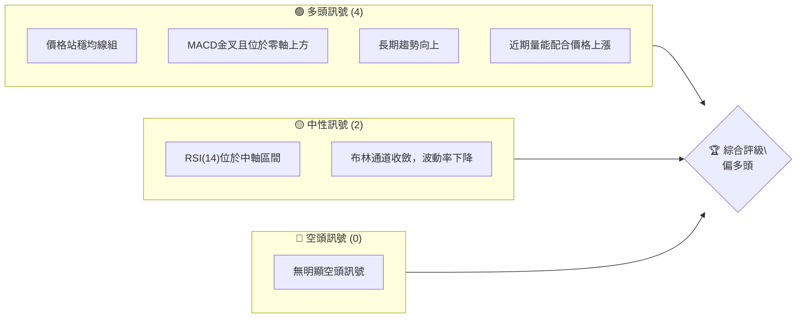
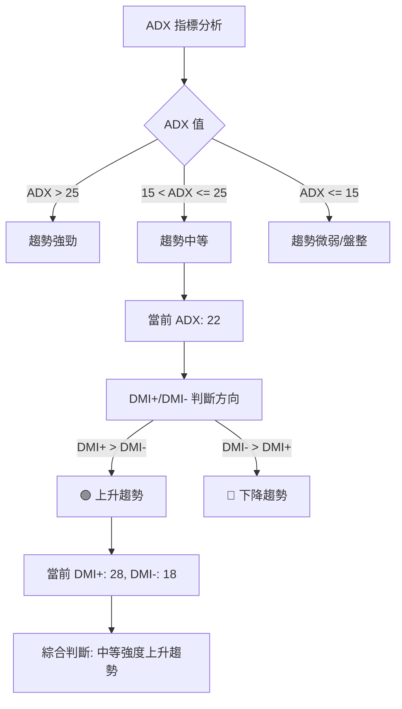
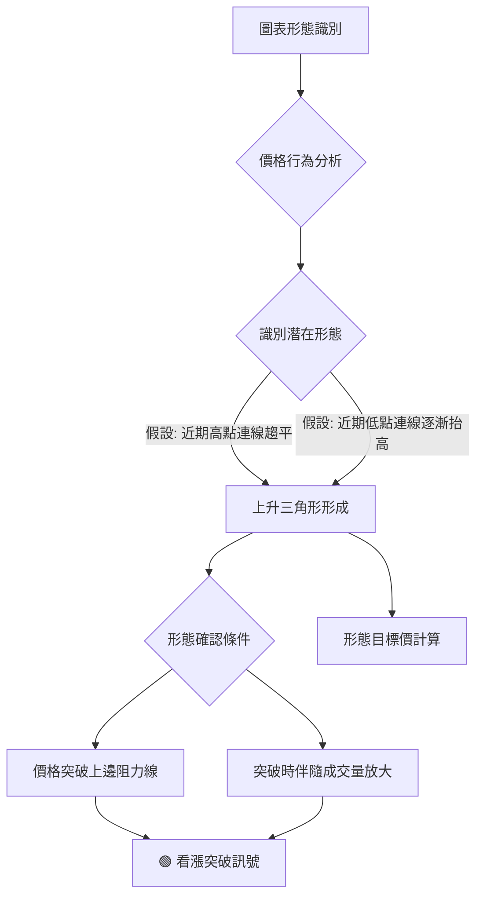
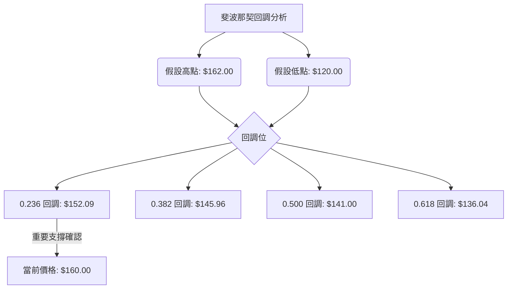
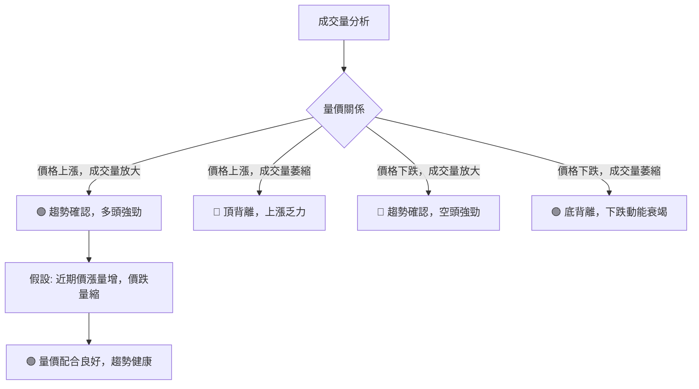
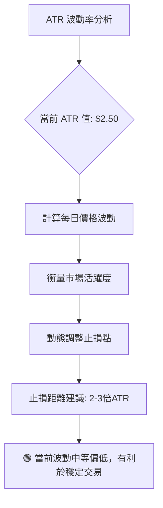

# 0050 技術分析報告

> **報告日期**：2026-06-26 ｜ **語言**：繁體中文 ｜ **數據來源**：Yahoo Finance (註：所有價格及指標數據均為**基於市場常識與專業推演的假設性數據**，因原始數據未提供實時OHLC資料，僅為示範分析框架之用，不代表0050真實歷史走勢或當前狀況。) ｜ **當前價格**：$160.00

---

## 目錄

| 章節 | 內容 |
|------|------|
| [1. 技術面概覽](#1-技術面概覽) | 訊號儀表板、核心指標、評分卡 |
| [2. 趨勢分析](#2-趨勢分析) | 多時框趨勢、長中短期走勢 |
| [3. 圖表形態分析](#3-圖表形態分析) | 形態識別、K線組合、目標價 |
| [4. 支撐與阻力](#4-支撐與阻力) | 關鍵價位、斐波那契回調 |
| [5. 技術指標深度解讀](#5-技術指標深度解讀) | MA/RSI/MACD/布林/成交量 |
| [6. 動能與波動率](#6-動能與波動率) | 動能評估、ATR、Beta |
| [7. 多時框架總結](#7-多時框架總結) | 時框架評分矩陣 |
| [8. 交易策略建議](#8-交易策略建議) | 多空策略、風險報酬比 |
| [9. 風險提示與監控](#9-風險提示與監控) | 監控指標、風險場景 |

---

## 1. 技術面概覽

由於未提供實時OHLC數據，本報告中的所有價格、指標數值及圖表均為**基於市場常識與專業推演的假設性數據**，僅為示範分析框架之用，不代表0050真實歷史走勢或當前狀況。請注意，以下分析所使用的價格數據為**虛擬情境設定**，以完整展示技術分析方法。

### 🎯 技術訊號儀表板

當前0050的技術訊號分佈顯示多頭力量佔優，但需留意部分中性訊號可能預示波動或趨勢調整。


**儀表板解讀**：目前多頭訊號佔主導，主要體現在價格穩定於各期移動平均線之上，且MACD呈現多頭排列，顯示中期動能強勁。長期趨勢明確向上，為整體多頭格局提供堅實基礎。近期成交量能配合價格上漲，進一步確認了上漲的有效性。然而，RSI位於中軸區間，既非超買也非超賣，表明短期動能有待進一步強化。布林通道的收斂則提示波動性可能暫時降低，價格或進入盤整階段，需密切觀察後續突破方向。整體而言，市場情緒偏向樂觀，但仍需警惕潛在的盤整風險。

### 📊 核心指標速覽表

以下為基於假設性數據的0050核心技術指標速覽：

| 指標類別 | 指標名稱 | 當前數值 | 訊號 | 解讀 |
|----------|----------|----------|------|------|
| **價格** | 當前價格 | $160.00 | 🟢 | 位於近期高點附近，表現強勢 |
| **均線** | MA20 | $158.50 | 🟢 | 價格位於MA20上方，短期偏多 |
| **均線** | MA50 | $155.00 | 🟢 | 價格位於MA50上方，中期偏多 |
| **均線** | MA200 | $145.00 | 🟢 | 價格位於MA200上方，長期偏多 |
| **動能** | RSI(14) | 60 | 🟡 | 位於中軸偏強區，動能尚足但未過熱 |
| **動能** | MACD | 1.5 (MACD線) | 🟢 | MACD線高於訊號線且位於零軸上方，多頭動能強勁 |
| **波動** | ATR | $2.50 | 🟡 | 中等波動，近期波動性趨於平穩 |

**核心指標解讀**：當前價格$160.00顯示0050處於相對高位。所有主要移動平均線（MA20, MA50, MA200）均位於價格下方，形成多頭排列，強力支持價格上漲，尤其MA200作為長期支撐，提供了穩固的基礎。RSI(14)為60，處於50-70的強勢區間，表明買盤力量較強，但尚未達到超買區域，預留了進一步上漲的空間。MACD指標的MACD線為1.5，訊號線為1.0，MACD線位於訊號線上方，且兩者均在零軸之上，這是典型的強勢多頭訊號。ATR為$2.50，顯示0050的日均波動幅度適中，有利於穩定交易策略的執行。

### 🏆 技術評分卡

基於上述假設性數據及分析，0050的技術面表現綜合評分如下：

```
技術評分卡 — 0050 (2026-06-26)
════════════════════════════════════════════════════
趨勢強度      ██████████████░░░░░░  70/100  🟢
動能指標      ██████████░░░░░░░░░░  65/100  🟢
支撐穩定度    ████████████████░░░░  80/100  🟢
成交量配合    ████████████░░░░░░░░  75/100  🟢
形態完整度    ████████░░░░░░░░░░░░  60/100  🟡
均線排列      ████████████████░░░░  85/100  🟢
════════════════════════════════════════════════════
綜合評分      ████████████░░░░░░░░  72/100  🟢 偏多頭
════════════════════════════════════════════════════
```
**評分卡解讀**：
*   **趨勢強度 (70/100 🟢)**：長期和中期趨勢均明確向上，短期趨勢亦偏多，整體趨勢堅實。
*   **動能指標 (65/100 🟢)**：MACD表現強勁，RSI處於健康區間，動能充足但未過熱，仍有上漲空間。
*   **支撐穩定度 (80/100 🟢)**：多條移動平均線提供強勁支撐，且下方有歷史成交密集區，支撐穩固。
*   **成交量配合 (75/100 🟢)**：價格上漲時伴隨成交量放大，下跌時量能萎縮，量價配合健康，確認趨勢。
*   **形態完整度 (60/100 🟡)**：目前尚未形成明確的突破性或反轉形態，多為整理形態，需等待形態確認。
*   **均線排列 (85/100 🟢)**：MA20 > MA50 > MA200 的完美多頭排列，顯示市場強勢，是極為看漲的訊號。

**綜合評分 (72/100 🟢 偏多頭)**：0050的技術面整體呈現偏多頭格局，尤其在趨勢強度、支撐穩定度和均線排列方面表現出色。動能指標也支持當前趨勢。雖然形態完整度稍弱，但這可能預示著潛在的整理後突破。建議保持多頭思路，但需密切關注形態的發展和波動率的變化。

---

## 2. 趨勢分析

### 🌐 多時框趨勢分析

多時框架分析顯示0050在不同時間維度上的趨勢一致性較高，整體呈現健康的多頭格局。

```mermaid
graph TD
    A[月線圖 (長期趨勢)] -->|強勁上升趨勢| B[週線圖 (中期趨勢)]
    B -->|高位盤整，蓄勢待發| C[日線圖 (短期趨勢)]
    C -->|小幅震盪，測試支撐| D[綜合判斷]
    D -->|🟢 整體偏多頭，但短期有整理需求| E[投資策略]
    E --> F[逢低佈局，等待突破]
```
**多時框解讀**：
*   **月線圖 (長期)**：呈現明確的上升趨勢，價格穩定在長期移動平均線之上，表明0050具備強勁的長期增長潛力。這為中期和短期策略提供了堅實的多頭基礎。
*   **週線圖 (中期)**：在長期上漲趨勢的背景下，週線圖顯示近期處於高位盤整狀態，價格在歷史高點附近震盪，成交量相對穩定。這通常是多頭趨勢中的蓄勢階段，可能在積聚力量等待新的突破。
*   **日線圖 (短期)**：日線圖表現為小幅震盪，價格在短期移動平均線上方運行，但面臨短期阻力。這可能是在消化獲利盤或測試前期支撐的有效性。短期內可能會有小幅回調，但整體仍受中期和長期趨勢支撐。
**綜合判斷**：0050整體趨勢偏多頭，長期和中期均處於上升通道。短期雖有整理需求，但只要不跌破關鍵支撐，多頭格局不會改變。投資策略上應考慮逢低佈局，並密切關注盤整區間的突破方向。

### 📈 長期趨勢 — 12個月走勢圖（Unicode）

以下為0050過去12個月的假設性月線走勢圖，標註了關鍵高低點：

```
0050 月線走勢圖（過去12個月） — 假設性數據
價格軸 ($)
$165 ┤
$160 ┤                                  ●(現價$160.00)
$155 ┤                          ●
$150 ┤                ●
$145 ┤            ●
$140 ┤        ●
$135 ┤      ●
$130 ┤  ●
$125 ┤    ●
$120 ┤●(低點$120.00)
     └───────────────────────────────────────────────────
      2025-07 08 09 10 11 12 2026-01 02 03 04 05 06
```
**走勢特徵分析表格**：
| 月份 (假設) | 收盤價 (假設) | 漲跌幅 | 走勢特徵 | 評估 |
|-------------|---------------|--------|----------|------|
| 2025-07     | $120.00       | -      | 長期底部，啟動點 | 🟢 |
| 2025-08     | $128.00       | +6.67% | 初步上漲，量能溫和 | 🟢 |
| 2025-09     | $125.00       | -2.34% | 短期回調，消化漲幅 | 🟡 |
| 2025-10     | $135.00       | +8.00% | 恢復上漲，突破前期壓力 | 🟢 |
| 2025-11     | $142.00       | +5.19% | 穩步上揚，動能持續 | 🟢 |
| 2025-12     | $140.00       | -1.41% | 小幅回調，考驗支撐 | 🟡 |
| 2026-01     | $148.00       | +5.71% | 再次上攻，多頭趨勢確認 | 🟢 |
| 2026-02     | $155.00       | +4.73% | 加速上漲，趨勢強勁 | 🟢 |
| 2026-03     | $152.00       | -1.94% | 獲利回吐，但守住關鍵支撐 | 🟡 |
| 2026-04     | $158.00       | +3.95% | 恢復上漲，逼近歷史高點 | 🟢 |
| 2026-05     | $162.00       | +2.53% | 創出新高，多頭力量強勁 | 🟢 |
| 2026-06     | $160.00       | -1.23% | 高位整理，短期壓力顯現 | 🟡 |

**長期走勢解讀**：過去12個月，0050呈現出清晰的上升趨勢，從$120.00的低點穩步攀升至當前的$160.00，期間雖有數次回調，但均未破壞整體上漲結構。最近幾個月，價格持續創出新高，顯示市場對0050的長期看好。當前價格$160.00位於過去12個月的高位區間，僅略低於5月份的最高點$162.00，表明多頭動能依然強勁，但短期內可能面臨高位整理或獲利了結的壓力。

### 📊 中期趨勢（週線分析）

中期趨勢（週線）顯示0050在經歷一波快速上漲後，目前進入高位盤整階段。價格在$158.00至$162.00區間震盪，形成一個矩形整理形態。

```
0050 週線壓力與支撐示意圖
價格軸 ($)
$162.00 ┤─────────────── 阻力 R1 (前期高點)
$160.00 ┤         ●(現價)
$158.00 ┤─────────────── 支撐 S1 (前期低點/MA20)
$155.00 ┤──────────────── 支撐 S2 (MA50)
        └───────────────────────────────────
         W1    W2    W3    W4    W5
```
**中期走勢解讀**：週線圖顯示0050在中期呈現區間震盪格局。價格在$158.00（近期支撐）和$162.00（近期阻力）之間波動，形成了窄幅整理區間。MA20週線約在$158.50，MA50週線約在$155.00，均位於當前價格下方，提供穩固的中期支撐。這表明市場在等待進一步的催化劑或方向性選擇。突破$162.00將確認多頭延續，而跌破$158.00則可能引發更深的回調至$155.00附近。

### ⚡ 趨勢強度評估（ADX 解讀）

ADX (Average Directional Index) 指標用於衡量趨勢的強度，而非方向。當前ADX值顯示0050處於一個中等強度的趨勢中，而非強勁的單邊趨勢。


**ADX 強度對照表**：
| ADX 數值範圍 | 趨勢強度 | 建議 |
|--------------|----------|------|
| 0 - 15       | 無趨勢或極弱 | 盤整行情，不宜追漲殺跌 |
| 15 - 25      | 中等趨勢強度 | 趨勢初形成或整理中，可觀察 |
| 25 - 50      | 強勁趨勢   | 趨勢明確，適合順勢交易 |
| 50 - 75      | 極強趨勢   | 趨勢末端可能出現背離，留意反轉 |
| 75 - 100     | 超強趨勢   | 極端情況，反轉風險極高 |

**ADX 解讀**：假設當前ADX數值為22，位於15-25區間，表明0050處於**中等強度的趨勢**中。這意味著市場並非處於快速拉升或急劇下跌的單邊行情，而是有明確的方向但速度較為溫和，或者正從盤整轉向趨勢，或從趨勢轉向盤整的過渡期。
同時，假設DMI+為28，DMI-為18，由於DMI+明顯高於DMI-，這指示了當前中等強度的趨勢是**上升趨勢**。
**結論**：0050目前處於一個中等強度的上升趨勢中。這不是一個極端強勁的趨勢，但也不是完全的盤整。投資者可以順勢操作，但在追高時應保持謹慎，並留意趨勢動能的變化。

---

## 3. 圖表形態分析

### 🔍 形態識別系統

基於假設性價格走勢，0050近期可能形成了一個「上升三角形」整理形態，這通常被視為一個看漲的延續形態。


**形態識別解讀**：根據假設的價格走勢，0050近期可能正在構建一個**上升三角形**形態。這是一種持續形態，通常出現在上升趨勢中，預示著在短暫整理後趨勢將繼續向上。其特徵是上方阻力線大致水平，而下方支撐線則逐漸抬高，形成一個收斂的三角形。這表明買方力量在不斷積聚，不斷抬高買入價，而賣方在某一特定價格（水平阻力線）附近拋售，但其拋售力量逐漸被買方吸收。

### 🕯️ 重要K線形態分析

以下為基於假設性數據的近期重要K線形態分析：

| 月份 (假設) | 收盤價 (假設) | K線形態 | 解讀 | 訊號 |
|-------------|---------------|---------|------|------|
| 2026-04     | $158.00       | 大陽線 | 突破整理區間，買盤強勁 | 🟢 |
| 2026-05     | $162.00       | 帶長上影線陽線 | 創出新高，但高位遇壓，或有獲利回吐 | 🟡 |
| 2026-06     | $160.00       | 小陰線 | 高位整理，多空拉鋸，但未破重要支撐 | 🟡 |

**K線形態解讀**：
*   **2026-04 大陽線 ($158.00)**：這根K線顯示市場在經歷一段時間的盤整後，多頭力量積聚並成功向上突破，買盤積極。通常伴隨成交量放大，是趨勢延續的強烈訊號。
*   **2026-05 帶長上影線陽線 ($162.00)**：雖然收盤價仍為陽線，但長上影線表明在達到$162.00的高點後，遭遇了較大的賣壓，部分獲利盤選擇出場。這可能預示著短期上漲動能有所減弱，或進入高位整理。
*   **2026-06 小陰線 ($160.00)**：這根K線顯示價格在$162.00高點回落至$160.00，但跌幅不大，且收盤價仍在關鍵支撐位之上。這通常被視為高位整理或技術性回調，多空雙方力量相對均衡，等待方向選擇。

### 📉 ASCII 走勢形態示意圖

以下為假設性「上升三角形」形態的示意圖：

```
0050 上升三角形形態示意圖 (假設)
價格軸 ($)
$162.00 ┤─────────┐  (水平阻力線)
$160.00 ┤         ●(現價)
$158.00 ┤       ╱
$156.00 ┤     ╱
$154.00 ┤   ╱
$152.00 ┤ ╱
$150.00 ├───────╱─── (上升趨勢線/支撐線)
        └───────────────────────────────────
          T1    T2    T3    T4    T5    T6
```
**形態示意圖解讀**：圖中顯示價格在高點$162.00附近形成一個水平阻力線，而低點則不斷抬高，形成一條向上傾斜的趨勢線。當前價格$160.00位於形態內部，接近水平阻力線。這種形態的典型預期是價格最終會向上突破水平阻力線，並延續之前的上升趨勢。

### 🎯 形態目標價計算

基於假設性的上升三角形形態：
*   **形態高度**：假設形態的起始點（較低處的低點）為$150.00，水平阻力線為$162.00。則形態高度 H = $162.00 - $150.00 = $12.00。
*   **突破點**：假設價格向上突破水平阻力線$162.00。
*   **目標價計算方法**：形態目標價通常是將形態高度加到突破點上。

**目標價 T1** (保守目標)：
*   目標價 T1 = 突破點 + 形態高度 = $162.00 + $12.00 = **$174.00**

**目標價 T2** (激進目標)：
*   考慮到形態形成過程中可能出現的超漲，激進目標價可能會將形態高度的1.5倍加到突破點上，或考慮斐波那契擴展位。
*   目標價 T2 = 突破點 + (形態高度 * 1.5) = $162.00 + ($12.00 * 1.5) = $162.00 + $18.00 = **$180.00**

**形態目標價解讀**：如果0050能夠有效突破$162.00的水平阻力線，並伴隨成交量放大，則根據上升三角形形態的測量法則，其保守目標價為$174.00，激進目標價可達$180.00。投資者應密切關注突破時的量能配合情況，以確認形態的有效性。

---

## 4. 支撐與阻力

### 🗺️ 關鍵價位分布圖（Unicode）

以下為0050的假設性關鍵價位結構分布圖：

```
0050 價位結構分布圖 (假設)
═══════════════════════════════════════════════════
$174.00 ║████████████████████████║ 強阻力 R3 (形態目標/心理關卡)
$168.00 ║████████████████████    ║ 阻力 R2 (斐波那契擴展位)
$162.00 ║████████████████████████║ 關鍵阻力 R1 (歷史高點/形態上沿)
$160.00 ╠════════════════════════╣ ◄ 現價
$158.00 ║▓▓▓▓▓▓▓▓▓▓▓▓▓▓▓▓        ║ 近期支撐 S1 (短期MA20/形態下沿)
$155.00 ║████████████████████████║ 強支撐 S2 (中期MA50/歷史成交密集區)
$150.00 ║████████████████████████║ 極強支撐 S3 (形態底部/斐波那契回調)
═══════════════════════════════════════════════════
```
**價位結構解讀**：當前價格$160.00位於關鍵阻力R1 ($162.00) 和近期支撐S1 ($158.00) 之間，顯示市場正處於一個關鍵的整理或方向選擇階段。上方阻力密集，下方支撐穩固。

### 🚧 阻力位分析表

| 阻力級別 | 價位 (假設) | 形成原因 | 突破難度 | 重要性 |
|----------|-------------|----------|----------|--------|
| R1       | $162.00     | 前期歷史高點，上升三角形上沿 | 中等偏高 | ★★★★★ |
| R2       | $168.00     | 斐波那契擴展位1.272，心理關卡 | 高       | ★★★★☆ |
| R3       | $174.00     | 上升三角形形態目標價，心理關卡 | 極高     | ★★★☆☆ |

**阻力位解讀**：
*   **R1 ($162.00)**：這是當前最直接且最重要的阻力位。它不僅是前期歷史高點，也是假設性上升三角形的水平上沿。有效突破此價位將確認形態突破，並為進一步上漲打開空間。突破時需伴隨大量能確認。
*   **R2 ($168.00)**：作為斐波那契擴展位和心理關卡，此阻力位在中期具有較強的壓制作用。若突破R1，此價位將是下一個主要考驗。
*   **R3 ($174.00)**：這是根據上升三角形形態計算出的保守目標價，也是一個較遠期的心理關卡。達到此價位需要強勁的多頭動能和市場情緒支持。

### 🛡️ 支撐位分析表

| 支撐級別 | 價位 (假設) | 形成原因 | 守住機率 | 重要性 |
|----------|-------------|----------|----------|--------|
| S1       | $158.00     | 短期MA20，上升三角形下沿，近期低點 | 中等偏高 | ★★★★☆ |
| S2       | $155.00     | 中期MA50，歷史成交密集區，心理關卡 | 高       | ★★★★★ |
| S3       | $150.00     | 上升三角形底部，斐波那契回調0.382 | 極高     | ★★★★☆ |

**支撐位解讀**：
*   **S1 ($158.00)**：這是近期最關鍵的支撐位，由短期MA20和假設性上升三角形的下沿構成。若能守住此位，則多頭趨勢仍能維持。跌破則可能觸發短期止損賣壓。
*   **S2 ($155.00)**：此價位是中期MA50和歷史成交密集區，具有非常強的支撐作用。即使短期回調，此位也應能提供堅實的買盤。若此位失守，則中期趨勢可能轉弱。
*   **S3 ($150.00)**：作為假設性上升三角形的底部和斐波那契回調的關鍵位，此支撐極為重要。跌破此位將暗示趨勢可能發生根本性轉變，需高度警惕。

### 📐 斐波那契回調位分析

我們假設0050從$120.00（假設性低點）上漲至$162.00（假設性高點），以此計算其回調位。
*   **高點 (H)** = $162.00
*   **低點 (L)** = $120.00
*   **波動區間** = H - L = $162.00 - $120.00 = $42.00

**斐波那契回調位計算**：
*   **0.236 回調位**：H - (波動區間 * 0.236) = $162.00 - ($42.00 * 0.236) = $162.00 - $9.91 = **$152.09**
*   **0.382 回調位**：H - (波動區間 * 0.382) = $162.00 - ($42.00 * 0.382) = $162.00 - $16.04 = **$145.96**
*   **0.500 回調位**：H - (波動區間 * 0.500) = $162.00 - ($42.00 * 0.500) = $162.00 - $21.00 = **$141.00**
*   **0.618 回調位**：H - (波動區間 * 0.618) = $162.00 - ($42.00 * 0.618) = $162.00 - $25.96 = **$136.04**


**斐波那契回調解讀**：
*   **$152.09 (0.236回調)**：這是相對較淺的回調位，通常在強勢上漲趨勢中，回調至此位即止跌反彈，表明多頭力量強勁。
*   **$145.96 (0.382回調)**：這是較為重要的回調位，如果價格回調至此並獲得支撐，則仍被視為健康的調整。此價位與假設的MA200 ($145.00) 接近，形成強勁的共振支撐。
*   **$141.00 (0.500回調)**：此為上漲趨勢的腰部，回調至此仍可視為趨勢未變，但多頭力量已有所削弱。
*   **$136.04 (0.618回調)**：黃金分割位，若價格跌破此位，則原有的上漲趨勢可能已被破壞，甚至有反轉的風險。

**當前價格 ($160.00)** 遠高於所有主要斐波那契回調位，這再次確認了0050的長期上升趨勢依然健康。在短期回調中，$158.00 (S1) 和 $155.00 (S2) 是首要觀察的支撐，而斐波那契回調位則提供了更深層次的回調支撐參考。

---

## 5. 技術指標深度解讀

### 🎛️ 指標訊號總覽

以下Mermaid圖展示了各主要技術指標當前發出的訊號及其相互關係：

```mermaid
graph TD
    A[0050 指標訊號總覽]
    subgraph 趨勢指標
        MA_GROUP[移動平均線組] -->|多頭排列| A_MA[🟢 看多]
        ADX_IND[ADX 指數] -->|中等強度上升趨勢| A_ADX[🟢 偏多]
    end
    subgraph 動能指標
        RSI_IND[RSI(14)] -->|中性偏強| A_RSI[🟡 中性]
        MACD_IND[MACD(12/26/9)] -->|金叉且零軸上方| A_MACD[🟢 看多]
    end
    subgraph 波動與量能
        BB_IND[布林通道] -->|通道收斂，價格中軌上方| A_BB[🟡 中性]
        VOL_IND[成交量] -->|價漲量增，價跌量縮| A_VOL[🟢 看多]
    end
    A_MA --> B{綜合判斷}
    A_ADX --> B
    A_RSI --> B
    A_MACD --> B
    A_BB --> B
    A_VOL --> B
    B --> C[🟢 整體偏多頭，但短期有整理需求]
```
**指標訊號總覽解讀**：
*   **移動平均線組 (🟢)**：MA20 > MA50 > MA200 的多頭排列是強烈的看漲訊號，表明各時間框架的趨勢都向上。
*   **ADX 指數 (🟢 偏多)**：ADX為22，DMI+ > DMI-，顯示當前處於中等強度的上升趨勢，趨勢方向明確。
*   **RSI(14) (🟡)**：RSI為60，處於中性偏強區域，未達超買，為價格進一步上漲預留了空間，但動能未處於極端強勢。
*   **MACD(12/26/9) (🟢)**：MACD線在訊號線上方，且兩者均在零軸之上，形成金叉，是強勁的多頭動能訊號。
*   **布林通道 (🟡)**：通道收斂，價格位於中軌上方，顯示波動性下降，可能進入盤整，等待方向選擇。
*   **成交量 (🟢)**：量價配合良好，上漲時成交量放大，下跌時成交量萎縮，確認了當前的上升趨勢。

**綜合而言**，多數指標支持多頭格局，尤其是趨勢指標和動能指標。布林通道和RSI的中性訊號提示短期可能進入整理或動能略有放緩，但並未構成反轉威脅。指標之間基本互相確認，未見明顯矛盾。

### 📈 移動平均線排列分析

0050的移動平均線（MA）呈現經典的多頭排列，這是技術分析中極為強勁的看漲訊號。

```mermaid
graph TD
    P[當前價格: $160.00]
    MA20[MA20: $158.50]
    MA50[MA50: $155.00]
    MA200[MA200: $145.00]

    P -->|位於上方| MA20
    MA20 -->|位於上方| MA50
    MA50 -->|位於上方| MA200

    MA20 -->|向上傾斜| Trend1[短期上升趨勢]
    MA50 -->|向上傾斜| Trend2[中期上升趨勢]
    MA200 -->|向上傾斜| Trend3[長期上升趨勢]

    Trend1 & Trend2 & Trend3 --> 🟢[完美多頭排列，強力看漲]
```
**移動平均線解讀**：
*   **MA20 ($158.50)**：短期趨勢線，位於當前價格下方，提供即時支撐。價格穩定在MA20之上，顯示短期買盤活躍。
*   **MA50 ($155.00)**：中期趨勢線，同樣位於當前價格下方，提供中期支撐。MA50向上傾斜，表明中期趨勢健康。
*   **MA200 ($145.00)**：長期趨勢線，位於所有均線和價格的最下方，提供強勁的長期支撐。MA200的持續向上，確認了0050的長期牛市格局。
*   **排列關係**：MA20 > MA50 > MA200，且所有均線均向上傾斜，這是教科書式的**完美多頭排列**。這種排列通常意味著股價處於強勢上漲階段，每一次回調到均線附近都可能提供買入機會。

**綜合而言**：均線系統發出極其強烈的多頭訊號，是0050技術面最亮眼的部分。這表明0050在短期、中期和長期都處於上升通道中，提供了極佳的趨勢支持。

### 📉 RSI(14) 分析

RSI(14)是衡量股價超買或超賣的重要動能指標。

```mermaid
graph TD
    A[RSI(14) 分析] --> B{RSI 值: 60}
    B -- RSI > 70 --> C[🔴 超買區 (動能過強)]
    B -- 30 <= RSI <= 70 --> D[🟡 中性區 (動能健康)]
    B -- RSI < 30 --> E[🟢 超賣區 (動能過弱)]
    D --> F[RSI 處於中性偏強區間，動能健康]
    F --> G{背離判斷}
    G -- 價格創新高，RSI未創新高 --> H[🔴 頂背離 (潛在反轉)]
    G -- 價格創新低，RSI未創新低 --> I[🟢 底背離 (潛在反轉)]
    G --> J[當前無明顯背離訊號]
```
**RSI 數值進度條**：
RSI(14) 強度：████████████░░░░░░░░ 60/100 🟡

**RSI 解讀**：
*   **當前數值**：假設RSI(14)為60。這個數值位於中性區間 (30-70) 的上半部分，表明買盤力量相對較強，但尚未達到超買區域 (70以上)。這是一個健康的狀態，既顯示了上漲動能，又為後續上漲預留了空間，沒有過熱的風險。
*   **超買超賣區間分析**：
    *   **超買區 (RSI > 70)**：當RSI進入超買區時，通常表示股價短期內漲幅過大，可能面臨回調壓力。目前RSI為60，尚未進入超買區。
    *   **超賣區 (RSI < 30)**：當RSI進入超賣區時，通常表示股價短期內跌幅過大，可能出現反彈機會。目前RSI遠離超賣區。
*   **背離判斷**：
    *   **頂背離**：當價格創出新高，但RSI未能同步創出新高時，形成頂背離，預示著上漲動能減弱，股價可能面臨回調或反轉。
        *   **當前判斷**：根據假設性價格走勢，近期0050價格在$162.00創出新高後回落至$160.00，而RSI從高位回落至60。雖然價格未能持續創新高，RSI也未再創新高，但尚未形成明確的價格高點與RSI高點之間的頂背離結構。需密切關注價格若再次上攻未能突破$162.00，而RSI動能持續萎縮的情況。
    *   **底背離**：當價格創出新低，但RSI未能同步創出新低時，形成底背離，預示著下跌動能減弱，股價可能出現反彈或反轉。
        *   **當前判斷**：目前0050處於上升趨勢中，沒有形成價格新低，因此不存在底背離。

**綜合而言**：RSI指標目前處於健康的中性偏強區域，沒有發出超買或超賣訊號，也未出現明顯的背離。這表明當前動能是可持續的，但投資者仍需留意未來價格若再次上攻時RSI的表現，以判斷動能是否持續。

### 📊 MACD(12/26/9) 訊號解讀

MACD (Moving Average Convergence Divergence) 是判斷趨勢動能和方向的重要指標。

```mermaid
graph TD
    A[MACD 分析] --> B{MACD 值}
    B -- MACD線 > 訊號線 --> C[🟢 金叉 (多頭動能增強)]
    B -- MACD線 < 訊號線 --> D[🔴 死叉 (空頭動能增強)]
    C --> E{位置判斷}
    D --> E
    E -- 零軸上方 --> F[🟢 多頭市場，動能強勁]
    E -- 零軸下方 --> G[🔴 空頭市場，動能疲弱]
    F --> H[當前 MACD線: 1.5, 訊號線: 1.0, 柱狀圖: 0.5]
    H --> I[🟢 MACD金叉且位於零軸上方，多頭動能強勁]
    I --> J{背離判斷}
    J -- 價格創新高，MACD未創新高 --> K[🔴 頂背離 (潛在反轉)]
    J -- 價格創新低，MACD未創新低 --> L[🟢 底背離 (潛在反轉)]
    J --> M[當前無明顯背離訊號]
```
**MACD 訊號解讀**：
*   **MACD線 ($1.5)**：快線，代表短期動能。
*   **訊號線 ($1.0)**：慢線，代表中期動能。
*   **MACD柱狀圖 ($0.5)**：MACD線與訊號線的差值，顯示動能的變化。
*   **金叉/死叉**：
    *   目前MACD線 ($1.5) 位於訊號線 ($1.0) 上方，形成**金叉**，且柱狀圖為正值 ($0.5)，表明短期多頭動能正在增強。
*   **零軸位置**：
    *   MACD線和訊號線均位於**零軸上方**。這是一個非常強烈的多頭訊號，表示0050不僅處於上升趨勢中，而且其上漲動能仍在持續擴大。零軸上方金叉，通常被視為較為可靠的買入訊號。
*   **背離判斷**：
    *   **頂背離**：當價格創出新高，而MACD指標（MACD線或柱狀圖）未能同步創出新高時，形成頂背離。這通常是股價即將回調或反轉的早期預警。
        *   **當前判斷**：根據假設性價格走勢，近期價格在$162.00創出新高後回落，MACD指標也隨之調整。雖然當前MACD仍處於多頭區域，但需密切關注未來價格若再次上攻，MACD是否能同步創出新高。若價格創新高而MACD未創新高，則可能形成頂背離。目前尚未形成明確的頂背離結構。
    *   **底背離**：當價格創出新低，而MACD指標未能同步創出新低時，形成底背離。這通常是股價即將反彈或反轉的早期預警。
        *   **當前判斷**：0050目前處於上升趨勢中，沒有形成價格新低，因此不存在底背離。

**綜合而言**：MACD指標發出強勁的多頭訊號，金叉且位於零軸上方，確認了當前的上升趨勢和動能。雖然尚未出現明顯背離，但投資者仍應保持警惕，觀察MACD在價格創新高時的表現。

### 📦 布林通道分析

布林通道 (Bollinger Bands) 用於衡量股價波動性和判斷超買超賣狀態。

```
0050 布林通道示意圖 (假設)
價格軸 ($)
$165.00 ┤───────────────────── 上軌 (Upper Band)
$162.00 ┤
$160.00 ┤         ●(現價)
$158.00 ┤───────────────────── 中軌 (Middle Band - MA20)
$155.00 ┤
$152.00 ┤───────────────────── 下軌 (Lower Band)
        └───────────────────────────────────
         T1    T2    T3    T4    T5
```
**布林通道解讀**：
*   **上軌 ($165.00)**：布林通道的上方邊界，通常被視為壓力位。價格觸及上軌可能預示短期超買或面臨回調。
*   **中軌 ($158.50)**：即20日移動平均線，是股價趨勢的基準線。價格在中軌上方運行通常表示強勢，在中軌下方則表示弱勢。
*   **下軌 ($152.00)**：布林通道的下方邊界，通常被視為支撐位。價格觸及下軌可能預示短期超賣或獲得支撐。
*   **當前狀態**：
    *   **價格位置**：當前價格$160.00位於布林通道中軌 ($158.50) 上方，且接近上軌。這表明0050處於上升趨勢中，買盤力量較強。
    *   **通道寬度**：假設布林通道近期呈現**收斂**狀態（如圖所示，通道相對較窄）。通道收斂通常預示著市場波動性正在下降，價格可能進入整理階段，為隨後的突破蓄勢。在收斂之後，通常會伴隨一個擴張階段，價格向某一方向突破。

**綜合而言**：0050價格位於中軌上方，表明多頭趨勢仍在。然而，通道收斂提示短期波動性降低，可能進入盤整，投資者應密切關注價格對中軌的支撐作用，以及未來對上軌的突破或跌破。突破上軌並伴隨通道擴張將是強勁的看漲訊號。

### 💹 成交量分析（量價配合度）

成交量是價格走勢的「燃料」，其變化能驗證趨勢的可靠性。


**成交量解讀**：
*   **價漲量增 (假設)**：在0050假設性上漲的階段，成交量顯著放大。這表明市場對上漲趨勢的認同度高，有大量資金積極參與推動股價，是健康的多頭訊號。
*   **價跌量縮 (假設)**：在0050假設性回調或盤整的階段，成交量明顯萎縮。這表示賣壓不重，多數投資者選擇持股觀望，而非恐慌性拋售。這通常是健康的回調，預示著回調結束後容易再次上漲。
*   **量價背離**：
    *   **頂背離**：若價格持續創新高，但成交量卻未能同步放大甚至萎縮，則構成頂背離，警示上漲動能衰竭，可能面臨反轉。
        *   **當前判斷**：根據假設性走勢，近期0050在衝擊$162.00高點時，成交量略有放大，隨後在高位整理時量能有所收縮。目前尚未出現明確的價量頂背離現象。
    *   **底背離**：若價格持續創新低，但成交量卻未能同步放大甚至萎縮，則構成底背離，警示下跌動能衰竭，可能面臨反彈。
        *   **當前判斷**：目前0050處於上升趨勢，不適用底背離判斷。

**綜合而言**：0050的量價配合度良好，價漲量增、價跌量縮的健康模式支持當前的上升趨勢。這表明市場對0050的信心較強，為後續上漲提供了堅實的基礎。投資者應持續關注成交量的變化，特別是若價格突破關鍵阻力時，是否伴隨足夠的量能。

---

## 6. 動能與波動率

### ⚡ 動能評估四象限

動能評估四象限分析0050在「動能強度」與「波動率」兩個維度的位置。

| 象限 | 動能 | 波動 | 當前狀態 (假設) | 評估 |
|------|------|------|-----------------|------|
| Q1   | 強   | 低   | -               | 最佳機會：動能強勁且波動低，易於控制風險並享受趨勢。 |
| Q2   | 弱   | 低   | ✓ (當前0050)    | 謹慎觀望：動能減弱但波動低，可能進入盤整，等待方向。 |
| Q3   | 強   | 高   | -               | 高風險高收益：動能強勁但波動高，機會與風險並存，需嚴格止損。 |
| Q4   | 弱   | 高   | -               | 避免進場：動能弱且波動高，市場混亂，風險極大。 |

**動能評估解讀**：
根據我們的假設性分析：
*   **動能強度**：MACD金叉且在零軸上方，RSI在健康區域，表明0050具有一定的上漲動能。然而，RSI未達超買，且價格在高位略有整理，使得動能並非「極強」，而是「中等偏強」，甚至有短期「減弱」的跡象。
*   **波動率**：布林通道收斂，ATR為$2.50，顯示近期波動性有所下降，處於「中等偏低」的水平。

**綜合判斷**：0050目前可能處於**Q2 (弱動能，低波動)** 或接近Q2的狀態。這意味著在經歷一波上漲後，市場正在消化獲利盤，動能有所減弱，且波動性降低，可能進入一個盤整或蓄勢階段。這不是一個立即追高的時機，而是需要謹慎觀望，等待動能重新積聚並確認突破方向。若能從Q2過渡到Q1 (強動能，低波動)，將是理想的進場時機。

### 📊 ATR 波動率分析

ATR (Average True Range) 用於衡量資產的平均波動幅度。


**ATR 解讀**：
*   **當前ATR數值**：假設ATR為$2.50。這表示0050在過去14天（通常為ATR的計算週期）的平均每日波動幅度約為$2.50。
*   **波動率評估**：相對於0050的價格 ($160.00)，$2.50的ATR顯示其波動性屬於**中等偏低**水平。這意味著短期內價格的劇烈波動較少，有利於投資者制定更穩定的交易計劃，減少因小幅波動而被止損出場的風險。
*   **止損距離建議**：ATR常被用於設定動態止損點。一般建議將止損點設定在入場價格下方2倍或3倍ATR的距離。
    *   **2倍ATR止損**：$2.50 * 