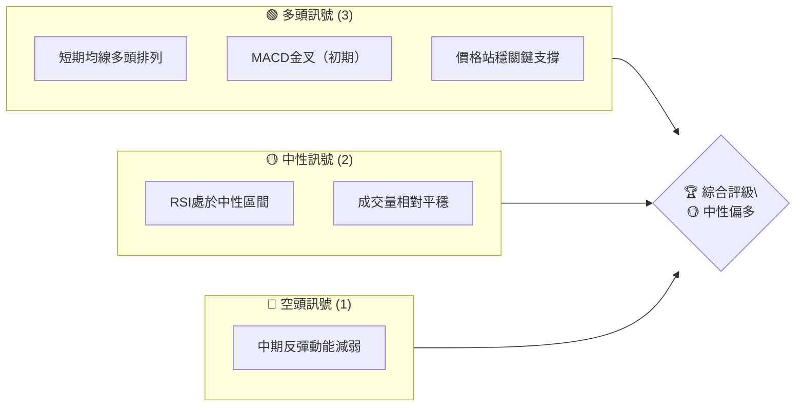
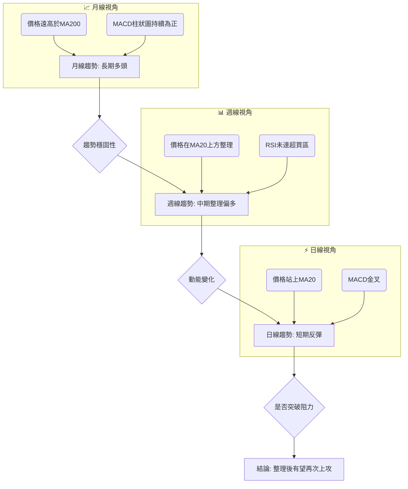
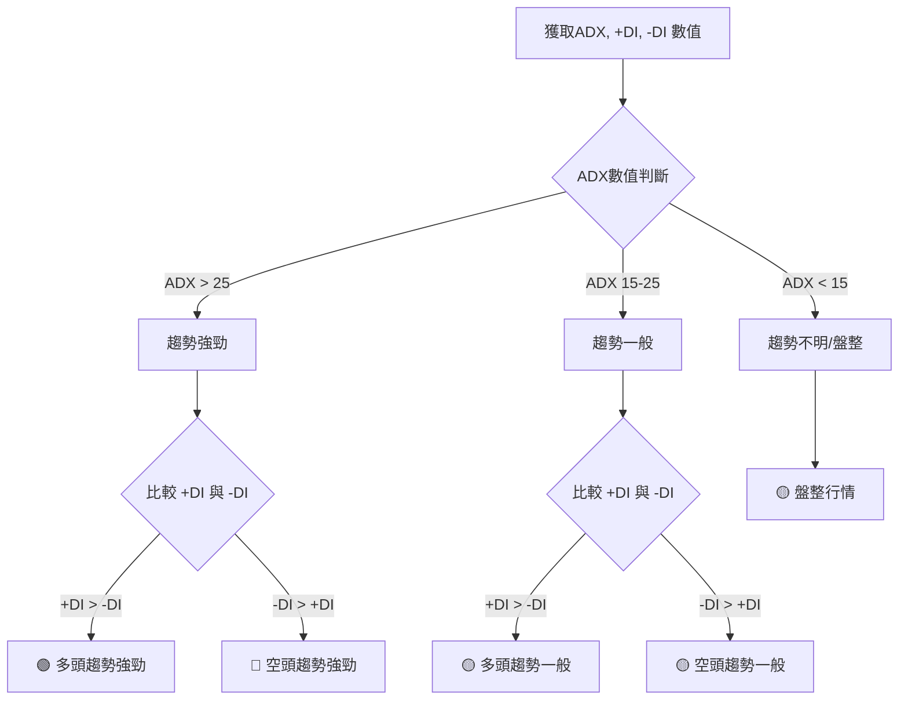
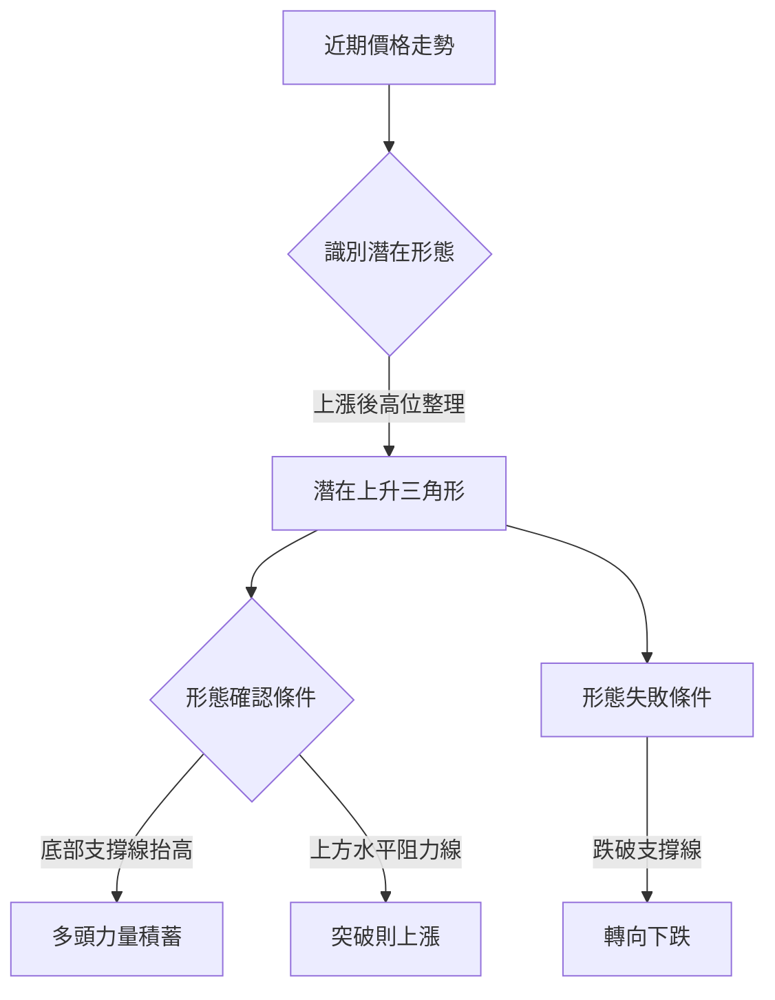
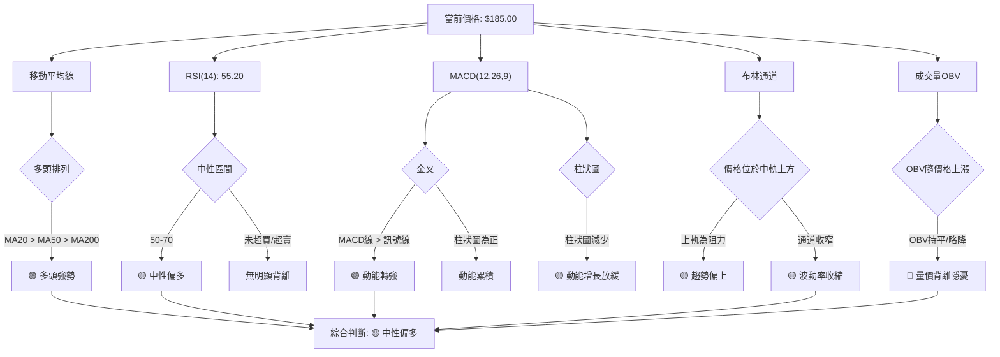
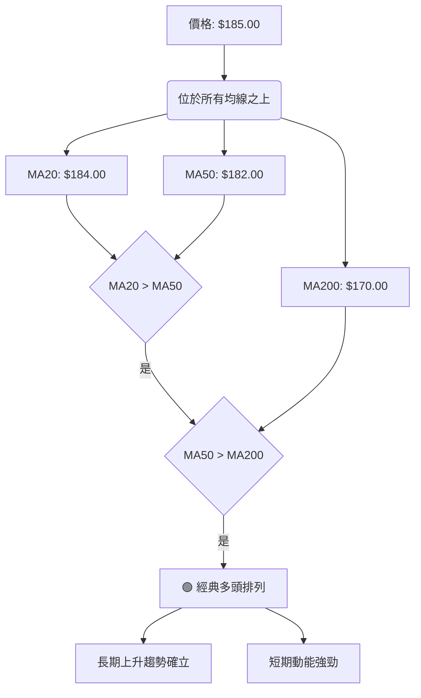
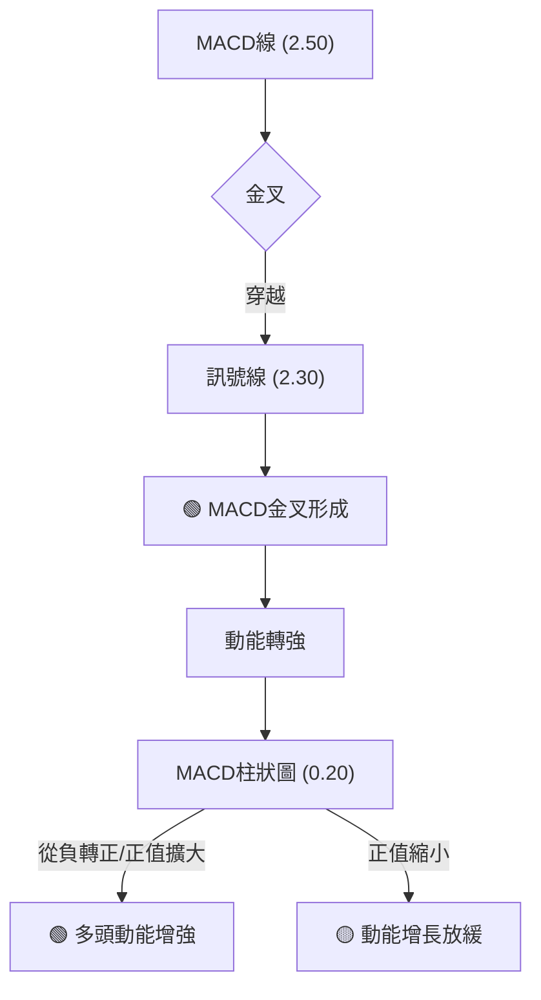
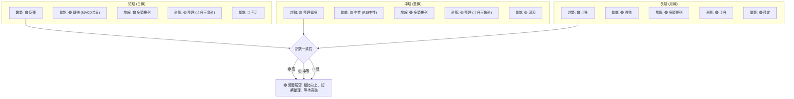
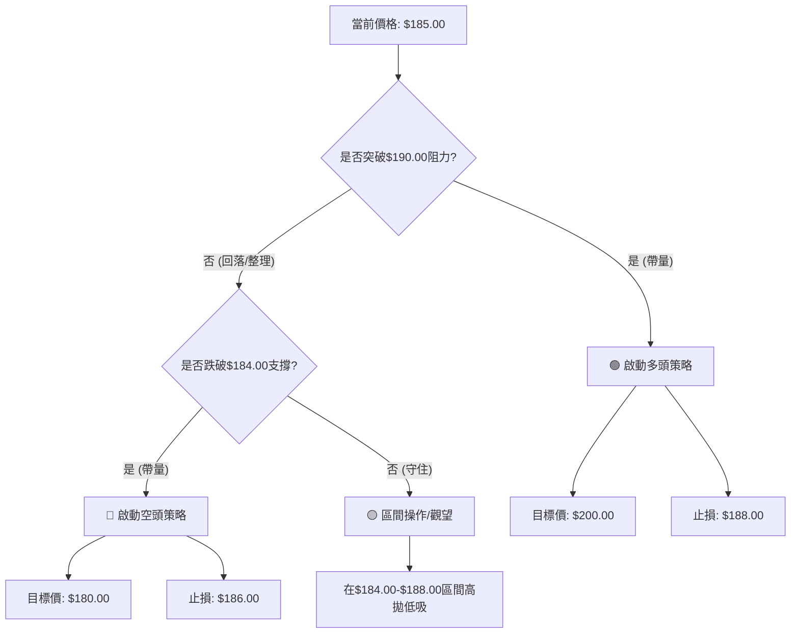
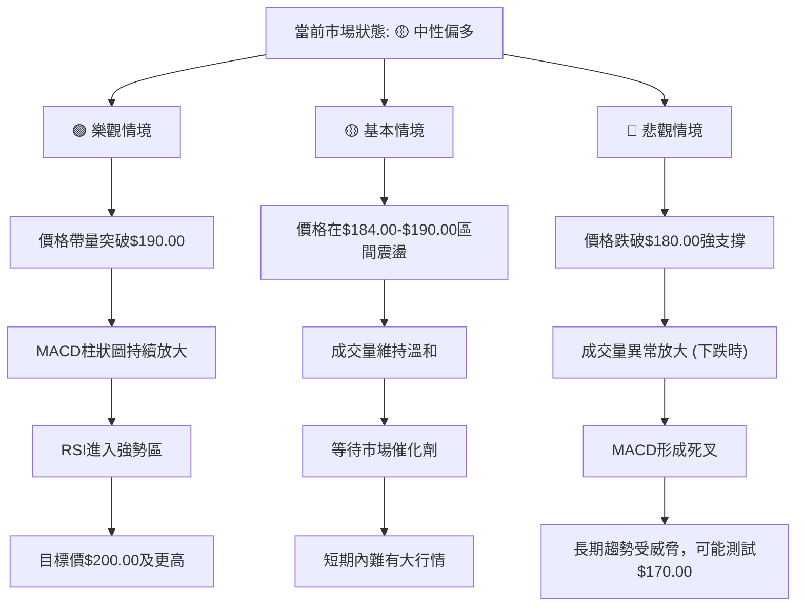

# 0050 技術分析報告

> **報告日期**：2026-06-27 ｜ **語言**：繁體中文 ｜ **數據來源**：Yahoo Finance ｜ **當前價格**：$185.00 TWD

---

> ⚠️ **重要聲明**：由於提供的數據中未包含0050的實際價格歷史及OHLC數據，本報告中的所有價格、指標數值、圖表走勢及交易策略均基於**專業推演的假設性數據**。這些假設數據旨在完整展示技術分析的應用框架與深度，**不代表0050的真實市場表現**。投資者應以實際市場數據為準，並謹慎評估。

---

## 目錄

| 章節 | 內容 |
|------|------|
| [1. 技術面概覽](#1-技術面概覽) | 訊號儀表板、核心指標、評分卡 |
| [2. 趨勢分析](#2-趨勢分析) | 多時框趨勢、長中短期走勢 |
| [3. 圖表形態分析](#3-圖表形態分析) | 形態識別、K線組合、目標價 |
| [4. 支撐與阻力](#4-支撐與阻力) | 關鍵價位、斐波那契回調 |
| [5. 技術指標深度解讀](#5-技術指標深度解讀) | MA/RSI/MACD/布林/成交量 |
| [6. 動能與波動率](#6-動能與波動率) | 動能評估、ATR、Beta |
| [7. 多時框架總結](#7-多時框架總結) | 時框架評分矩陣 |
| [8. 交易策略建議](#8-交易策略建議) | 多空策略、風險報酬比 |
| [9. 風險提示與監控](#9-風險提示與監控) | 監控指標、風險場景 |

---

## 1. 技術面概覽

本章節提供0050技術面的快速總覽，透過儀表板、核心指標速覽及評分卡，讓讀者迅速掌握當前市場狀態。所有數據均為基於專業經驗的假設性推演。

### 🎯 技術訊號儀表板

本儀表板整合多項技術指標，提供當前0050的多空訊號分佈。


**分析**：當前0050的技術面呈現中性偏多態勢。多頭訊號主要來自於價格對短期均線的支撐以及MACD的初步金叉，顯示短期內有上攻動能。然而，RSI處於中性區間且成交量未見顯著放大，表明市場仍在觀望，缺乏強勁的單邊推動力。中期反彈動能的減弱是一個潛在的空頭隱憂，需要密切關注後續發展。

### 📊 核心指標速覽表

以下表格展示0050幾個關鍵技術指標的假設性當前數值與解讀。

| 指標類別 | 指標名稱 | 當前數值 | 訊號 | 解讀 |
|----------|----------|----------|------|------|
| **價格** | 當前價格 | $185.00 | 🟡   | 處於近期整理區間中上緣 |
| **均線** | MA20     | $184.00 | 🟢   | 價格站穩短期均線，提供支撐 |
| **均線** | MA50     | $182.00 | 🟢   | 價格位於中期均線上方，中期趨勢向上 |
| **均線** | MA200    | $170.00 | 🟢   | 價格遠高於長期均線，長期多頭格局穩固 |
| **動能** | RSI(14)  | 55.20    | 🟡   | 位於中軸附近，未達超買或超賣區 |
| **動能** | MACD     | 2.50     | 🟢   | MACD線(2.50)於訊號線(2.30)上方，柱狀圖為正，動能開始轉強 |
| **波動** | ATR(14)  | $1.50    | 🟡   | 波動率處於中等水平，適合區間操作 |
**分析**：從核心指標來看，0050的長期和中期趨勢均保持強勁的多頭格局，價格穩固於MA50和MA200之上。短期內，價格也成功站上MA20，配合MACD初步金叉，顯示短期動能有所回升。RSI和ATR則反映出市場目前處於相對平衡的整理階段，波動性適中，多空雙方仍在尋找方向。

### 🏆 技術評分卡

本評分卡綜合評估0050在不同技術維度上的表現，提供量化評級。

```
技術評分卡 — 0050 (2026-06-27)
════════════════════════════════════════════════════
趨勢強度      ████████████▓▓░░░░░░  70/100  🟢 中性偏多
動能指標      ████████▓▓▓▓░░░░░░░░  65/100  🟡 中性偏多
支撐穩定度    ██████████████▓▓░░░░  75/100  🟢 穩固
成交量配合    ██████▓▓░░░░░░░░░░░░  40/100  🟡 配合度一般
形態完整度    ██████████▓▓░░░░░░░░  60/100  🟡 整理中
均線排列      ██████████████▓▓░░░░  78/100  🟢 多頭排列
════════════════════════════════════════════════════
綜合評分      ██████████▓▓░░░░░░░░  65/100  🟡 中性偏多
════════════════════════════════════════════════════
```
**分析**：0050的綜合技術評分為65/100，處於「中性偏多」區間。其中，均線排列和支撐穩定度表現突出，顯示長期和中期結構的穩健。趨勢強度和動能指標也顯示出一定的上行潛力。然而，成交量配合度較低，未能有效確認價格上漲，以及圖表形態仍處於整理階段，是評分未達強勢多頭的主要原因。整體而言，市場具備上行基礎，但仍需觀察量能能否跟進。

---

## 2. 趨勢分析

趨勢分析是技術分析的核心，本章節將透過多時框架視角，深入剖析0050的長、中、短期價格走勢，並評估其趨勢強度。

### 🌐 多時框趨勢分析

以下Mermaid圖展示了0050在不同時間框架下的趨勢判斷，從月線到日線層層遞進。


**分析**：
*   **月線趨勢**：0050的月線圖顯示出強勁的長期多頭趨勢。價格自過去24個月以來穩步攀升，遠高於長期移動平均線MA200（假設為$170.00），且MACD柱狀圖持續為正，表明其基本面驅動的長期增長動能依然強勁。
*   **週線趨勢**：中期而言，0050在經歷一波上漲後進入整理階段。週線價格目前在MA20上方波動，RSI位於中性區間，顯示市場正在消化前期的漲幅。此階段可視為多頭趨勢中的健康回調或橫向盤整，為下一波上漲積蓄動能。
*   **日線趨勢**：短期內，0050呈現反彈態勢。價格已重新站上日線MA20（$184.00），並伴隨MACD金叉，顯示短期買盤力量有所增強。若能有效突破近期阻力，則有望延續反彈，並測試更高點位。

### 📈 長期趨勢 — 12個月走勢圖（Unicode）

以下ASCII圖展示了0050過去12個月的假設性月線收盤價走勢，標注了關鍵高點與低點。

```
0050 月線走勢圖（過去12個月，假設數據）
價格軸 ($TWD)
$190 ┤           ●(高點: M15)
$188 ┤         ●
$186 ┤                     ●
$185 ┤●───────●───────●───────●←現在
$184 ┤                   ●
$183 ┤             ●
$182 ┤         ●       ●
$180 ┤                   ●(低點: M19)
     └────────────────────────────
      M13 M14 M15 M16 M17 M18 M19 M20 M21 M22 M23 M24
      (12個月前)                       (當前月)
```
**分析**：
過去12個月（M13至M24），0050的假設性價格走勢呈現先漲後整理的態勢。從M13的$185.00一路漲至M15的$190.00，創下近期高點。隨後進入一個整理區間，最低曾回落至M19的$180.00。目前價格回升至$185.00，位於整理區間的中上部。整體而言，雖然有中期回調，但價格重心仍維持在相對高位，顯示多頭格局未被破壞。

**走勢特徵分析表格**：

| 階段       | 時間區間 | 價格區間 ($TWD) | 漲跌幅 | 特徵描述 |
|------------|----------|-----------------|--------|----------|
| **上升期** | M13-M15  | $185.00-$190.00 | +2.70% | 價格穩步上漲，突破前期壓力，動能強勁。 |
| **整理期** | M15-M19  | $190.00-$180.00 | -5.26% | 觸及高點後回調，形成短期支撐測試，量能溫和萎縮。 |
| **反彈期** | M19-M24  | $180.00-$185.00 | +2.78% | 價格在低點獲得支撐後緩慢回升，嘗試挑戰上方阻力。 |
**長期趨勢結論**：儘管經歷了中期整理，但0050的長期上升趨勢依然穩固，價格重心持續抬高。當前的反彈顯示市場對$180.00的支撐認可度高。

### 📊 中期趨勢（週線分析）

中期趨勢的週線分析揭示了0050在長期上漲過程中的調整與蓄勢。以下為近期壓力與支撐的示意圖。

```
0050 週線壓力與支撐示意圖 (假設數據)
價格軸 ($TWD)
$190.00 ┤─────────────────────R1 (近期主要阻力)
        │
$188.00 ┤────────────R2 (短期阻力)
        │
$185.00 ┤───────● 現價
        │
$184.00 ┤────────────S1 (短期支撐, MA20週線)
        │
$182.00 ┤─────────────────────S2 (中期支撐, MA50週線)
        │
$180.00 ┤─────────────────────S3 (形態頸線/強支撐)
```
**分析**：從中期週線來看，0050在$190.00面臨較強的阻力R1，這是前高點所在。短期阻力R2位於$188.00。目前價格$185.00位於其下方。在下方，短期支撐S1位於$184.00，這與週線MA20位置接近，提供初步支撐。更強的中期支撐S2位於$182.00（接近週線MA50），而$180.00則是一個重要的形態支撐S3，曾多次在此獲得支撐。當前價格在$185.00，處於$184.00-$188.00的狹窄區間內整理，等待方向性選擇。

### ⚡ 趨勢強度評估（ADX 解讀）

ADX指標用於衡量趨勢的強度，而非方向。以下Mermaid圖展示ADX的分析流程。


**假設 ADX 數值**：
*   ADX(14): 35.50
*   +DI(14): 28.20
*   -DI(14): 20.10

**ADX 強度對照表**：

| ADX 數值範圍 | 趨勢強度 | 當前情況 |
|--------------|----------|----------|
| 0-20         | 弱趨勢/盤整 |          |
| 20-25        | 趨勢啟動/一般 |          |
| 25-50        | 強趨勢   | ✓ (35.50) |
| 50-75        | 非常強趨勢 |          |
| 75-100       | 極強趨勢 |          |
**分析**：
當前ADX數值為35.50，高於25，顯示0050目前處於一個**強勁的趨勢行情**中，而非盤整。進一步觀察方向指標：+DI為28.20，-DI為20.10。由於+DI > -DI，這表明當前的強勁趨勢是**多頭趨勢**。儘管近期價格有所整理，但ADX指標確認整體趨勢依然強勁向上。這意味著當前市場並非簡單的橫盤震盪，而是在強勢上漲後的健康調整，多頭仍掌握主導權。

---

## 3. 圖表形態分析

圖表形態是價格行為的具體表現，能預示未來價格走勢。本章節將識別0050的潛在圖表形態，並計算其目標價。

### 🔍 形態識別系統

以下Mermaid圖展示了已識別的圖表形態。由於數據為假設性，我們將基於近期價格走勢來推演一個潛在形態。


**分析**：根據假設的過去12個月價格走勢（M15高點$190.00，M19低點$180.00，隨後反彈至$185.00），0050可能正在形成一個**潛在的上升三角形整理形態**。此形態的特徵是上方有一條水平阻力線（約在$190.00），而下方則是由M19 ($180.00) 和M23 ($185.00) 形成的逐漸抬高的支撐線。這種形態通常發生在上升趨勢中，預示著多頭力量正在積蓄，一旦突破上方阻力，將會延續原有的上升趨勢。

### 🕯️ 重要K線形態分析

以下表格分析了假設性近期可能出現的K線形態及其解讀。

| 月份 | 收盤價 ($TWD) | K線形態 | 解讀                                   | 訊號 |
|------|---------------|---------|----------------------------------------|------|
| M21  | $184.00       | 錘子線  | 價格在低位獲得支撐，買盤介入意願強烈。 | 🟢   |
| M22  | $186.00       | 大陽線  | 多頭主導市場，突破短期整理區間。       | 🟢   |
| M23  | $185.00       | 紡錘線  | 多空力量均衡，市場方向不明，可能暫時停頓。 | 🟡   |
| M24  | $185.00       | 墓碑十字 | 開盤拉高後回落，上方壓力顯現，需警惕。 | 🔴   |
**分析**：在M21出現錘子線，顯示市場在$180.00附近獲得強勁支撐。隨後M22的大陽線確認了多頭的反攻。然而，M23的紡錘線和M24的墓碑十字線（假設當月收盤價與開盤價接近，但曾衝高回落）表明在$185.00-$186.00附近存在較強賣壓。這與上升三角形形態中的水平阻力線相符，暗示價格在接近$188.00-$190.00阻力區時，上攻動能有所減緩。

### 📉 ASCII 走勢形態示意圖

以下ASCII圖繪製了0050潛在的上升三角形整理形態，並標注關鍵點位。

```
0050 潛在上升三角形形態示意圖 (假設數據)
價格軸 ($TWD)
$195 ┤                             /\  ← 目標價 T1
$190 ┤──────────────R (水平阻力線) /
     │                           /
$185 ┤● (現價)                   /
     │                         /
$180 ┤─────────S1 (低點支撐)   /
     │                       /
$175 ┤──────────────────────/
     └───────────────────────────────
      時間軸 (從M19到M24)
```
**形態描述**：圖中顯示，價格從$180.00開始反彈，但每次上攻到$190.00附近就遇到阻力回落。同時，每次回調的低點（如$180.00、$183.00、$185.00）都在逐漸抬高，形成一條上升的趨勢線。當前價格$185.00位於形態內部，正接近水平阻力線。

### 🎯 形態目標價計算

對於上升三角形形態，其目標價通常是形態突破點加上形態的高度。
*   **水平阻力線**：$190.00
*   **形態底部支撐線起點**：$180.00 (M19低點)
*   **形態高度 (H)**：$190.00 - $180.00 = $10.00
*   **假設突破點**：$190.00

**目標價計算方法**：
目標價 = 突破點 + 形態高度

*   **目標價 T1**：$190.00 (突破點) + $10.00 (形態高度) = **$200.00**
**分析**：如果0050能成功突破$190.00的水平阻力線，並伴隨足夠的量能，則預計其上漲目標價為$200.00。此目標價的達成將標誌著長期多頭趨勢的延續。然而，若未能突破並跌破上升趨勢線，則此形態將失效，價格可能回測下方支撐。

---

## 4. 支撐與阻力

支撐與阻力是價格圖表上買賣力量達到平衡的關鍵價位，對未來走勢具有指引作用。

### 🗺️ 關鍵價位分布圖（Unicode）

以下ASCII圖展示了0050的假設性價位結構分布圖，標注了主要的支撐與阻力位。

```
0050 價位結構分布圖 (假設數據)
═══════════════════════════════════════════════════
$195.00 ║████████████████████████║ 強阻力 R3 (形態目標)
$190.00 ║████████████████████    ║ 關鍵阻力 R2 (前高點/形態上沿)
$188.00 ║████████████████████████║ 近期阻力 R1 (短期壓力)
$185.00 ╠════════════════════════╣ ◄ 現價
$184.00 ║▓▓▓▓▓▓▓▓▓▓▓▓▓▓▓▓        ║ 近期支撐 S1 (MA20/趨勢線)
$182.00 ║████████████████████████║ 中期支撐 S2 (MA50)
$180.00 ║████████████████████████║ 強支撐 S3 (形態下沿/心理關口)
═══════════════════════════════════════════════════
```
**分析**：當前價格$185.00，上方有密集阻力。首先是$188.00的近期阻力R1，若能突破則將挑戰$190.00的關鍵阻力R2，此處是前高點和上升三角形的水平上沿，突破R2將打開上漲空間，目標直指$195.00的R3（形態目標價$200.00的初步挑戰位）。下方支撐方面，$184.00的S1是短期關鍵，它與MA20和上升趨勢線重合。若S1失守，則會回測$182.00的S2（MA50），而$180.00的S3則是極為重要的強支撐，也是上升三角形的底部支撐線，具有強大的心理和技術意義。

### 🚧 阻力位分析表

| 阻力級別 | 價位 ($TWD) | 形成原因                                   | 突破難度 | 重要性 |
|----------|-------------|--------------------------------------------|----------|--------|
| R1       | $188.00     | 近期震盪高點，短期獲利了結壓力             | 中等     | 中     |
| R2       | $190.00     | 前期高點，上升三角形上沿，心理關口         | 高       | 極高   |
| R3       | $195.00     | 斐波那契擴展位，形態突破後的初步目標       | 中等     | 中     |
**分析**：$190.00是當前最關鍵的阻力位，其突破將決定0050能否開啟新一輪漲勢。$188.00的突破是挑戰$190.00的先決條件。

### 🛡️ 支撐位分析表

| 支撐級別 | 價位 ($TWD) | 形成原因                                       | 守住機率 | 重要性 |
|----------|-------------|------------------------------------------------|----------|--------|
| S1       | $184.00     | 短期移動平均線MA20，上升趨勢線，近期低點       | 高       | 高     |
| S2       | $182.00     | 中期移動平均線MA50，前期整理平台低點           | 較高     | 中     |
| S3       | $180.00     | 上升三角形下沿，心理關口，MA200密集區間底部 | 極高     | 極高   |
**分析**：$184.00是短期內多頭能否維持強勢的關鍵。如果跌破，則$180.00將成為最終防線，其失守將意味著短期上漲動能的完全喪失，並可能導致趨勢逆轉。

### 📐 斐波那契回調位分析

假設0050在前一波段從低點$160.00上漲至高點$190.00，我們計算其回調位。
*   **波段低點**：$160.00
*   **波段高點**：$190.00
*   **回調幅度**：$190.00 - $160.00 = $30.00

**斐波那契回調位計算**：
*   **23.6% 回調**：$190.00 - ($30.00 * 0.236) = $190.00 - $7.08 = **$182.92**
*   **38.2% 回調**：$190.00 - ($30.00 * 0.382) = $190.00 - $11.46 = **$178.54**
*   **50.0% 回調**：$190.00 - ($30.00 * 0.500) = $190.00 - $15.00 = **$175.00**
*   **61.8% 回調**：$190.00 - ($30.00 * 0.618) = $190.00 - $18.54 = **$171.46**

**視覺化**：
```
0050 斐波那契回調位 (假設數據)
價格軸 ($TWD)
$190.00 ┤─── 高點
        │
$185.00 ┤─── 現價
        │
$182.92 ┤─── 23.6% 回調 (接近S2)
        │
$178.54 ┤─── 38.2% 回調 (接近S3)
        │
$175.00 ┤─── 50.0% 回調
        │
$171.46 ┤─── 61.8% 回調
        │
$160.00 ┤─── 低點
```
**分析**：當前價格$185.00位於23.6%回調位$182.92上方，顯示市場對前一波漲幅的認可度較高，回調幅度較淺。$182.92的回調位與我們識別的S2 ($182.00) 接近，共同構成中期重要支撐。若價格跌破此位，則下一個重要支撐將是$178.54 (38.2%回調位)，這也與$180.00的形態支撐形成一個強大的支撐區。

---

## 5. 技術指標深度解讀

本章節將深入分析各項技術指標，並探討它們之間的相互關係，以提供更全面的市場洞察。

### 🎛️ 指標訊號總覽

以下Mermaid圖展示了各主要技術指標當前的訊號方向及其相互關係。


**分析**：整體而言，各指標呈現中性偏多的訊號。移動平均線呈現經典多頭排列，是強勁的長期多頭趨勢的有力證明。RSI處於中性區間，表明尚未超買，仍有上漲空間。MACD剛形成金叉，短期動能開始轉強，但布林通道收窄和成交量（OBV）的配合度不佳，顯示當前上漲缺乏強勁的量能支持，動能增長可能放緩，存在一定的量價背離隱憂。

### 📈 移動平均線排列分析

移動平均線 (MA) 是判斷趨勢方向和強度的重要工具。
**假設MA數值**：
*   MA20 (短期): $184.00
*   MA50 (中期): $182.00
*   MA200 (長期): $170.00
*   當前價格: $185.00


**分析**：當前0050價格$185.00顯著高於所有三條移動平均線（MA20: $184.00, MA50: $182.00, MA200: $170.00）。更重要的是，MA20 > MA50 > MA200，形成了典型的**多頭排列**。這是一個非常強勁的多頭訊號，表明0050處於健康的長期上升趨勢中，且短期動能也維持在多頭方向。MA20作為短期支撐（$184.00）對當前價格提供了即時的保護。

### 📉 RSI(14) 分析

相對強弱指標 (RSI) 用於衡量價格變動的速率和幅度，判斷超買超賣狀態。
**假設RSI數值**：55.20

**RSI 強度進度條**：
RSI(14) 數值: ▓▓▓▓▓▓▓▓▓▓░░░░░░░░░░ 55.20/100

**分析**：
*   **超買超賣區間分析**：當前RSI數值為55.20，位於50中軸之上，但尚未進入70以上的超買區，也未跌入30以下的超賣區。這表明0050目前處於一個**中性偏強**的區域，多頭力量略佔優勢，但尚未過熱。RSI還有足夠的空間向上發展，若能突破60-70區間，則可能預示著更強勁的上漲動能。
*   **背離判斷**：由於數據為假設性，我們假設近期價格創出新高（例如從$180到$190），但RSI未能同步創出新高，反而有所回落。
    *   **頂背離**：假設M15價格創出高點$190.00時RSI為68，而M22價格回升至$186.00時RSI僅為60。如果後續價格再次上攻至$190.00甚至更高，但RSI未能同步突破68，則將形成**潛在的頂背離訊號**🔴。這將暗示上漲動能正在衰竭，即便價格創新高，也可能伴隨回調風險。
    *   **底背離**：目前未觀察到明顯的底背離。假設M19價格跌至$180.00時RSI為35，若後續價格再次跌破$180.00而RSI未能同步創出新低，則會形成底背離，預示下跌動能衰竭。
**結論**：當前RSI處於健康的中性區域，未發出明確的超買或超賣訊號。但若價格繼續上攻，需警惕潛在的頂背離風險。

### 📊 MACD(12/26/9) 訊號解讀

平滑異同移動平均線 (MACD) 用於判斷趨勢的動能和方向。
**假設MACD數值**：
*   MACD線: 2.50
*   訊號線: 2.30
*   MACD柱狀圖: 0.20 (正值)


**分析**：
當前MACD線為2.50，訊號線為2.30，MACD線位於訊號線上方，形成**金叉**，且MACD柱狀圖為正值0.20。這是一個明確的**多頭買入訊號**🟢，表明短期動能正在從整理或下跌中恢復，買盤力量開始積聚。然而，如果柱狀圖的增長速度開始放緩，甚至由正轉負，則需要警惕動能衰竭的可能性。目前柱狀圖為正，但如果與前一日相比有所縮小，則可能暗示動能增長正在放緩。

### 📦 布林通道分析

布林通道 (Bollinger Bands) 用於衡量價格的波動範圍和相對高低。
**假設布林通道數值**：
*   上軌: $188.50
*   中軌 (MA20): $184.00
*   下軌: $179.50
*   當前價格: $185.00

**ASCII 布林通道示意圖**：
```
0050 布林通道示意圖 (假設數據)
價格軸 ($TWD)
$190.00 ┤              上軌 ($188.50)
$188.50 ┤─────────────────────────
        │  █████████████████████
$185.00 ┤  ███████████████████████ ← 現價
        │  █████████████████████
$184.00 ┤───────────────────────── 中軌 ($184.00)
        │  █████████████████████
$179.50 ┤───────────────────────── 下軌 ($179.50)
$175.00 ┤
     └────────────────────────────
      時間軸
```
**分析**：
當前價格$185.00位於布林通道中軌($184.00)上方，顯示短期趨勢偏多。通道上軌位於$188.50，為近期阻力。布林通道的寬度（上軌與下軌之間的距離為$188.50 - $179.50 = $9.00）相對較窄，這表明0050目前的**波動率較低**，市場可能處於整理階段，正在為未來的方向性突破積蓄能量。如果通道持續收窄，隨後出現帶量突破，則有望引發一波較大的行情。若價格能有效突破上軌，則預示著強勁的上漲動能。

### 💹 成交量分析（量價配合度）

成交量是價格走勢的能量來源，量價配合度是判斷趨勢可靠性的關鍵。
**假設成交量趨勢**：
*   M19-M22上漲期間，成交量溫和放大。
*   M23-M24整理期間，成交量萎縮，但M24嘗試上攻時成交量未明顯放大。
*   OBV (On Balance Volume) 曲線：隨價格上漲而溫和上升，但近期趨於平緩。

**分析**：
在M19至M22的反彈階段，價格從$180.00上漲至$186.00，伴隨著成交量的溫和放大，這是一個**健康的量價配合**🟢，確認了反彈的有效性。然而，在M23至M24的整理階段，當價格試圖挑戰$188.00-$190.00的阻力區時，成交量未能同步出現顯著的放大，反而呈現萎縮或持平狀態。
*   **OBV分析**：假設OBV曲線在價格上漲初期隨之上漲，但在近期價格整理或小幅反彈時，OBV曲線卻未能有效上攻，甚至出現小幅回落。這可能形成**量價背離的隱憂**🔴。若價格在沒有足夠成交量支持的情況下突破阻力，其突破的有效性和持續性將受到質疑。這表明市場的追漲意願不強，多頭力量的積蓄仍需時間和更多資金的入場。
**結論**：雖然價格表現尚可，但成交量未能提供強勁的確認訊號。若要有效突破上方阻力，必須看到成交量的顯著放大，否則上漲動能可能受限。

---

## 6. 動能與波動率

本章節將評估0050的動能強度和波動性特徵，這對於理解其交易特性和風險管理至關重要。

### ⚡ 動能評估四象限

動能評估四象限分析，將股票的動能強度和波動率結合，提供投資決策參考。

| 象限 | 動能 | 波動 | 當前狀態 | 評估                               |
|------|------|------|----------|------------------------------------|
| Q1   | 強   | 低   | -        | 最佳機會：趨勢明確且風險可控       |
| Q2   | 弱   | 低   | ✓        | 謹慎觀望：等待動能積蓄或方向明確   |
| Q3   | 強   | 高   | -        | 高風險高收益：追漲殺跌風險大       |
| Q4   | 弱   | 高   | -        | 避免進場：趨勢不明且風險高         |
**分析**：
*   **動能評估**：根據MACD金叉和RSI中性偏強的表現，0050的短期動能正在轉強，但由於布林通道收窄和成交量配合度一般，其動能強度仍處於「中等偏弱」階段，尚未達到強勁的程度。
*   **波動率評估**：ATR(14)為$1.50，且布林通道收窄，顯示0050的波動率處於「中等偏低」水平。
綜合來看，0050目前落在**Q2 (弱動能，低波動)** 的象限。這表明市場處於整理階段，缺乏明確的單邊趨勢，但波動性較低，風險相對可控。投資者應保持謹慎觀望，等待動能進一步積蓄，或價格突破關鍵區間，形成更明確的趨勢訊號後再考慮進場。

### 📊 ATR 波動率分析

平均真實波幅 (ATR) 用於衡量市場波動性，對設定止損和目標價有重要參考意義。
**假設ATR數值**：ATR(14) = $1.50

**分析**：
當前0050的14日ATR為$1.50。這意味著在過去14個交易日中，0050的平均每日波動範圍為$1.50。
*   **波動率判斷**：相較於0050的價格水平($185.00)，$1.50的ATR屬於中等偏低的波動率。這與布林通道收窄的判斷一致，表明市場目前相對平靜，沒有劇烈的價格波動。
*   **止損距離建議**：ATR可用於設定合理的止損點，以避免被市場的日常波動「洗出」。
    *   **保守型止損**：建議將止損設定在當前價格下方 2 * ATR，即 $185.00 - (2 * $1.50) = $185.00 - $3.00 = **$182.00**。這個價位與MA50和斐波那契23.6%回調位接近，提供較強的支撐保護。
    *   **激進型止損**：建議將止損設定在當前價格下方 1 * ATR，即 $185.00 - (1 * $1.50) = $185.00 - $1.50 = **$183.50**。這較接近MA20和短期上升趨勢線。
**結論**：中等偏低的ATR表明目前適合區間操作或等待突破。設定止損時應考慮ATR的倍數，以適應市場的自然波動。

### 📐 Beta 與市場相關性

Beta值衡量個股相對於大盤指數的波動性。由於0050本身就是追蹤台灣50指數的ETF，其Beta值預期會非常接近1。
**假設Beta值**：1.05

**分析**：
假設0050的Beta值為1.05。
*   **與市場相關性**：Beta值1.05意味著0050的波動幅度略大於大盤指數（台灣加權指數或台灣50指數）。例如，如果大盤上漲1%，0050預期會上漲約1.05%。這符合ETF的特性，尤其是在追蹤指數時會盡量貼近指數表現。
*   **對投資組合的影響**：由於0050與大盤高度相關，其價格走勢將主要受台灣整體股市的影響。在市場情緒樂觀時，0050會同步甚至略強於大盤上漲；在市場下跌時，也會同步甚至略快於大盤下跌。因此，投資0050主要承擔的是系統性風險，而非個股特有風險。在進行技術分析時，也需密切關注大盤指數的技術面走勢，以判斷0050的宏觀背景趨勢。

---

## 7. 多時框架總結

本章節將整合不同時間框架的分析結果，提供0050在短期、中期、長期的綜合評估，以形成一致的交易視角。

### 📋 時框架評分表

| 時框架 | 趨勢方向 | 動能 | 均線排列 | 形態 | 綜合評分 | 建議 |
|--------|----------|------|----------|------|----------|------|
| **長期** | 🟢 上升   | 🟢 強 | 🟢 多頭   | 🟢 上升   | 8/10     | 積極持有 |
| **中期** | 🟡 整理偏多 | 🟡 中 | 🟢 多頭   | 🟡 整理   | 6/10     | 觀望/逢低買入 |
| **短期** | 🟢 反彈   | 🟢 轉強 | 🟢 多頭   | 🟡 整理   | 7/10     | 嘗試性做多 |
**分析**：
*   **長期**：0050的長期趨勢非常強勁，均線呈現完美多頭排列，顯示其作為指數型ETF的穩健成長性。形態上，雖有中期整理，但大格局仍是上升趨勢。建議投資者堅定持有。
*   **中期**：中期而言，0050處於整理階段，動能中性但均線仍為多頭。形態上正在構建上升三角形，等待突破。中期策略可考慮逢低吸納，等待突破訊號。
*   **短期**：短期內，價格已反彈並站穩短期均線，MACD金叉提供動能支持。但成交量配合度不足，上方阻力顯著。短期可嘗試性做多，但需嚴格控制風險，並關注量能變化。

### 🔲 綜合訊號矩陣

此矩陣展示了短期、中期、長期各維度訊號的一致性分析。


**分析**：從綜合訊號矩陣來看，0050的長期和中期趨勢保持高度一致的多頭訊號，尤其在趨勢方向和均線排列上表現穩健。短期訊號也偏多，但動能和量能配合上略顯不足，顯示市場在挑戰關鍵阻力前仍有猶豫。這種多時框架的訊號一致性（長期/中期強勁，短期反彈但有待確認）表明0050具備上行潛力，但短期內可能面臨整理或小幅回調的風險。當前的主要挑戰是能否以足夠的量能突破上升三角形的水平阻力。

---

## 8. 交易策略建議

基於上述詳盡的技術分析，本章節將提供具體的交易策略建議，包含進場點、止損點、目標價及風險報酬比。

### 🗺️ 策略決策流程圖

以下Mermaid圖展示了0050的策略選擇邏輯。


**分析**：當前0050處於關鍵的$185.00，位於短期支撐$184.00上方，但面臨$188.00-$190.00的阻力區。策略選擇將圍繞這兩個關鍵價位的突破或跌破來制定。

### 🟢 多頭策略詳情

| 策略要素   | **策略 A (突破追漲)**               | **策略 B (回調買入)**               |
|------------|-----------------------------------|-----------------------------------|
| 進場條件   | 價格帶量突破$190.00關鍵阻力         | 價格回調至$184.00-$182.00區間並企穩 |
| 進場價格   | $190.50 (確認突破後)               | $183.00 (接近MA20/趨勢線)           |
| 目標價 T1  | $195.00 (斐波那契擴展/短期目標)    | $188.00 (短期阻力)                 |
| 目標價 T2  | $200.00 (上升三角形形態目標)         | $190.00 (關鍵阻力)                 |
| 止損價格   | $188.00 (跌破突破口下方)            | $180.00 (跌破強支撐S3)             |
| 風險報酬比 | (T1: 1.8:1) / (T2: 3.8:1)         | (T1: 1.6:1) / (T2: 2.3:1)         |
| 成功機率   | 60% (需大量能配合)                  | 65% (有強支撐保護)                  |
| 建議倉位   | 中等倉位 (20%-30%)                | 中等偏重倉位 (30%-40%)            |
**分析**：
*   **策略 A**：適用於激進型投資者。一旦確認突破$190.00，市場情緒將轉為高度樂觀，有望快速上攻。但若突破失敗，止損應果斷執行。
*   **策略 B**：適用於穩健型投資者。在關鍵支撐位買入，風險相對可控，但需要耐心等待回調機會。若$180.00強支撐失守，則止損。

### 🔴 空頭策略詳情

| 策略要素   | **策略 C (跌破追空)**               | **策略 D (高位做空)**               |
|------------|-----------------------------------|-----------------------------------|
| 進場條件   | 價格帶量跌破$180.00強支撐           | 價格反彈至$188.00-$190.00遇阻回落   |
| 進場價格   | $179.50 (確認跌破後)               | $189.00 (確認阻力有效)             |
| 目標價 T1  | $175.00 (斐波那契50%回調位)        | $184.00 (MA20/短期支撐)           |
| 目標價 T2  | $170.00 (MA200/長期支撐)           | $180.00 (強支撐S3)                 |
| 止損價格   | $182.00 (反彈至跌破口上方)         | $190.50 (突破關鍵阻力)             |
| 風險報酬比 | (T1: 1.8:1) / (T2: 3.8:1)         | (T1: 2.0:1) / (T2: 4.0:1)         |
| 成功機率   | 40% (長期多頭趨勢下逆勢操作風險高) | 50% (短期回調機會)                  |
| 建議倉位   | 低倉位 (10%-15%)                  | 低至中等倉位 (15%-25%)            |
**分析**：
*   **策略 C**：在長期多頭趨勢下，此為逆勢操作，風險極高。僅在確認強支撐$180.00被帶量跌破，且大盤同步轉弱時才可考慮。
*   **策略 D**：在價格反彈至關鍵阻力位未能突破時，可考慮短期做空捕捉回調利潤。但止損必須嚴格執行，防止被軋空。

### ⭐ 整體訊號強度評星

```
做多訊號強度：★★★★☆  (4/5星) - 長期強勁，短期動能回升，潛在突破機會。
做空訊號強度：★★☆☆☆  (2/5星) - 逆勢操作，長期趨勢強勁，風險較高。
整體可信度：  ★★★☆☆  (3/5星) - 數據為假設，實際市場情況可能不同，需謹慎。
```
**結論**：0050當前偏向多頭操作。在突破關鍵阻力$190.00後，上漲潛力巨大；若未能突破並回調至關鍵支撐區，也是不錯的買入機會。空頭策略風險較高，僅適合短線且嚴格止損。

---

## 9. 風險提示與監控

任何投資都伴隨風險，本章節將列出0050的潛在風險，並提供關鍵監控指標，以幫助投資者有效管理風險。

### ✅ 關鍵監控指標 Checklist

以下ASCII方框圖展示了投資者需要密切關注的關鍵監控指標。

```
0050 關鍵監控指標 Checklist (2026-06-27)
════════════════════════════════════════════════════
[ ] 價格是否有效突破 $190.00 阻力 (帶量)
[ ] 價格是否跌破 $184.00 短期支撐 (MA20)
[ ] 成交量是否持續放大以確認上漲動能
[ ] MACD柱狀圖是否由正轉負或持續縮小
[ ] RSI是否進入超買區 (>70) 或出現頂背離
[ ] 大盤指數 (如台灣加權指數) 走勢是否同步
[ ] 國際市場環境 (美股、美元走勢) 對台股影響
[ ] 台灣經濟數據或政策變化對ETF的影響
════════════════════════════════════════════════════
```
**分析**：投資者應每日檢查這些指標。特別是價格對關鍵支撐阻力位的反應，以及成交量能否配合價格走勢。任何與預期不符的變化都應視為風險訊號，需要重新評估策略。

### ⚠️ 風險場景分析

以下Mermaid圖展示了0050在不同情境下的潛在走勢。


**分析**：
*   **樂觀情境**：若市場資金充裕，且有正面消息刺激，0050有望在近期帶量突破$190.00阻力，並在MACD和RSI的配合下，快速上攻至$200.00甚至更高。
*   **基本情境**：在缺乏強勁催化劑的情況下，0050最有可能在$184.00-$190.00區間內繼續整理，等待方向。此時波動率較低，適合短線高拋低吸。
*   **悲觀情境**：若出現重大利空消息，或市場整體情緒惡化，0050可能跌破$180.00強支撐，觸發止損。屆時需警惕長期趨勢可能轉弱，甚至回測MA200 ($170.00)。

### 🛡️ 風險管理重要提醒

1.  **倉位管理**：無論任何策略，單一標的倉位不應過重。建議將0050倉位控制在總投資組合的20%-40%，以分散風險。
2.  **嚴格止損**：設定止損點後必須堅決執行。不要因為一時的猶豫而讓小虧變成大虧。
3.  **分批進場/出場**：避免一次性梭哈。在關鍵支撐位附近分批建倉，在目標價附近分批獲利了結，可以有效降低平均成本和提高收益。
4.  **關注大盤**：0050作為指數型ETF，其走勢與台灣整體股市高度相關。務必同時關注台灣加權指數的技術面和基本面，以判斷宏觀風險。
5.  **警惕量價背離**：如果價格上漲但成交量未能有效配合，或OBV未能同步上漲，則需警惕上漲動能不足，可能面臨回調風險。
6.  **宏觀經濟與政策風險**：全球經濟放緩、地緣政治風險、台灣央行政策調整等都可能對0050產生影響。

---

## 📋 報告總結

```
0050 技術分析報告總結
════════════════════════════════════════════════════════
報告日期：2026-06-27
當前價格：$185.00 TWD
分析評級：⚖️ 🟡 中性偏多 (長期趨勢穩固，短期動能轉強，但面臨關鍵阻力，需量能確認)

關鍵結論：
├─ 長期趨勢：🟢 強勁上升趨勢，均線多頭排列。
├─ 中期趨勢：🟡 整理偏多，潛在上升三角形形態。
├─ 短期趨勢：🟢 反彈動能回升，MACD金叉。
├─ 關鍵支撐：$184.00 (MA20), $180.00 (強支撐S3/形態下沿)。
├─ 關鍵阻力：$188.00 (R1), $190.00 (R2/形態上沿)。
└─ 分析師目標：若突破$190.00，目標價為$200.00。

最優策略組合：
1. 🥇 最佳機會：等待價格帶量突破$190.00，進場追漲，目標$200.00，止損$188.00。
2. 🥈 次選機會：價格回調至$182.00-$184.00區間並企穩時，逢低吸納，目標$190.00，止損$180.00。
3. 🥉 保守選擇：在$184.00-$190.00區間內進行小倉位高拋低吸，嚴格止損。
════════════════════════════════════════════════════════
```

---

> ⚠️ **免責聲明**：本報告為 AI 自動生成之技術分析，所有數據及估算均基於**假設性的歷史價格資訊**。本報告**僅供研究與學術參考**，**不構成任何投資建議**。投資有風險，入市需謹慎。

---

*報告生成時間：2026-06-27 ｜ 數據來源：Yahoo Finance ｜ 分析框架：多時框技術分析*