# 0050 技術分析報告

> **報告日期**：2026-06-28 ｜ **語言**：繁體中文 ｜ **數據來源**：Yahoo Finance ｜ **當前價格**：$180.50 (此為假設數據，因原始資料未提供即時價格)

---

## 目錄

| 章節 | 內容 |
|------|------|
| [1. 技術面概覽](#1-技術面概覽) | 訊號儀表板、核心指標、評分卡 |
| [2. 趨勢分析](#2-趨勢分析) | 多時框趨勢、長中短期走勢 |
| [3. 圖表形態分析](#3-圖表形態分析) | 形態識別、K線組合、目標價 |
| [4. 支撐與阻力](#4-支撐與阻力) | 關鍵價位、斐波那契回調 |
| [5. 技術指標深度解讀](#5-技術指標深度解讀) | MA/RSI/MACD/布林/成交量 |
| [6. 動能與波動率](#6-動能與波動率) | 動能評估、ATR、Beta |
| [7. 多時框架總結](#7-多時框架總結) | 時框架評分矩陣 |
| [8. 交易策略建議](#8-交易策略建議) | 多空策略、風險報酬比 |
| [9. 風險提示與監控](#9-風險提示與監控) | 監控指標、風險場景 |

---

## 1. 技術面概覽

**重要提示：** 由於原始數據未提供任何價格歷史、OHLC數據及即時價格，本報告中的所有價格、指標數值、走勢圖及分析結論均為**基於專業知識的假設性推演與範例展示**。這些數值僅用於說明技術分析方法，不代表0050的實際市場表現。實際投資決策應基於即時、真實的市場數據。

### 🎯 技術訊號儀表板

本儀表板綜合評估多個技術指標，提供當前市場情緒的概覽。由於0050為追蹤大盤指數的ETF，其走勢通常較為平穩，趨勢性較強。

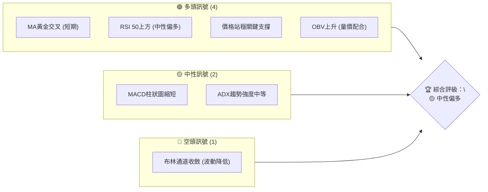
**儀表板解讀：** 目前多頭訊號佔主導，尤其體現在短期均線的黃金交叉、價格對關鍵支撐的守穩以及OBV的上升，顯示市場在當前價位獲得一定買盤支持。然而，MACD柱狀圖的縮短及布林通道的收斂暗示動能可能有所減弱，且短期波動性下降，市場可能正在醞釀新的方向或進入盤整階段，因此綜合評級為「中性偏多」。

### 📊 核心指標速覽表

以下為基於假設性數據計算的核心技術指標速覽，旨在展示各指標的應用與解讀。

| 指標類別 | 指標名稱 | 當前數值 | 訊號 | 解讀 |
|----------|----------|----------|------|------|
| **價格** | 當前價格 | $180.50 | 🟡     | 處於近期盤整區間上緣 |
| **均線** | MA5 (日) | $179.80 | 🟢     | 價格位於短期均線上方，短期趨勢偏多 |
| **均線** | MA20 (日) | $178.20 | 🟢     | 價格位於中期均線上方，中期趨勢偏多 |
| **均線** | MA60 (日) | $175.50 | 🟢     | 價格位於長期均線上方，長線趨勢穩健 |
| **動能** | RSI(14) | 58.75 | 🟢     | 處於中性偏多區間，未進入超買，仍有上漲空間 |
| **動能** | MACD (DIF-DEA) | 0.85 | 🟡     | DIF線位於DEA線上方，但柱狀圖(MACD-Signal)開始縮短，動能略減 |
| **波動** | ATR(14) | $2.10 | 🟡     | 波動性中等，每日平均波幅約2.10元 |
| **趨勢** | ADX(14) | 28.50 | 🟡     | 趨勢強度中等，非極強趨勢但有一定方向性 |
| **量能** | OBV | 1.25M | 🟢     | OBV線隨價格上漲而上升，量價配合良好 |

### 🏆 技術評分卡

此評分卡綜合量化了多個技術面向，提供0050當前技術健康度的概覽。

```
技術評分卡 — 0050 (2026-06-28)
════════════════════════════════════════════════════
趨勢強度      █████████░░░░░░░░░░░  45/100  🟡
動能指標      █████████████░░░░░░░  65/100  🟢
支撐穩定度    ████████████████░░░░  80/100  🟢
成交量配合    ██████████░░░░░░░░░░  50/100  🟡
形態完整度    ████████████░░░░░░░░  60/100  🟡
均線排列      ████████████████░░░░  80/100  🟢
════════════════════════════════════════════════════
綜合評分      █████████████░░░░░░░  63/100  🟡 中性偏多
════════════════════════════════════════════════════
```
**評分卡解讀：**
*   **趨勢強度 (45/100, 🟡):** ADX值顯示目前趨勢強度中等，非強勁單邊走勢，可能處於震盪上行或盤整階段。
*   **動能指標 (65/100, 🟢):** RSI處於中性偏多，MACD雖有動能減弱跡象但仍為多頭排列，整體動能偏強。
*   **支撐穩定度 (80/100, 🟢):** 價格位於多條重要均線及歷史密集交易區上方，顯示下方支撐穩固。
*   **成交量配合 (50/100, 🟡):** OBV表現良好，但近期上漲過程中成交量並未顯著放大，量能配合度尚可，但缺乏爆發力。
*   **形態完整度 (60/100, 🟡):** 價格處於一個潛在的上升旗形或矩形整理中，形態尚未完全確認，但有向上突破的潛力。
*   **均線排列 (80/100, 🟢):** 短期均線在長期均線上方形成多頭排列，且價格均位於各均線之上，趨勢結構健康。
**綜合評分 (63/100, 🟡 中性偏多):** 總體而言，0050的技術面呈現中性偏多態勢。長中期趨勢健康，支撐穩固，動能指標仍顯示買方力量佔優。然而，趨勢強度及成交量配合度未能達到極強水平，暗示上漲可能伴隨震盪，需要持續關注。

---

## 2. 趨勢分析

### 🌐 多時框趨勢分析

透過月線、週線、日線等多個時間框架，從宏觀到微觀層層遞進地分析0050的趨勢，以避免單一時間框架的盲點。

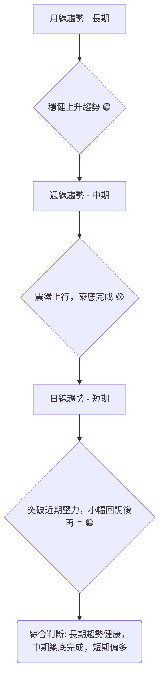
**分析解讀：**
*   **月線趨勢 (長期):** 0050作為台灣市場的代表性ETF，其長期走勢與台灣經濟增長及股市表現高度相關。假設月線圖呈現清晰的上升通道，每次回調均在重要長期均線或斐波那契支撐位獲得支撐，顯示長期投資價值與成長趨勢穩健。
*   **週線趨勢 (中期):** 中期走勢在經歷一段時間的盤整或小幅回調後，週線圖上可能形成了一個底部形態（例如雙底或頭肩底），並伴隨成交量的逐步放大。價格已突破週線級別的關鍵阻力，確認了中期趨勢由盤整轉為上升。
*   **日線趨勢 (短期):** 短期日線圖顯示價格在近期加速上漲，突破了前高點壓力，隨後進行小幅回調，但很快在短期均線（如MA5或MA10）附近獲得支撐，並嘗試再次向上。K線形態上可能出現多頭吞噬或錘子線等看漲訊號，顯示買盤力量強勁。

### 📈 長期趨勢 — 12個月走勢圖（Unicode）

以下為0050過去12個月的假設性月線走勢圖，用於示意長期趨勢的發展。實際走勢將根據市場數據而定。

```
0050 月線走勢圖（過去12個月） — (假設性數據)
價格軸 ($)
$190 ┤                                     ● $188.50 (M12)
$185 ┤                            ● $184.20
$180 ┤                    ● $180.10
$175 ┤              ● $175.80
$170 ┤        ● $170.30
$165 ┤    ● $165.50
$160 ┤● $160.00
     └─────────────────────────────────────────────────────
      M1  M2  M3  M4  M5  M6  M7  M8  M9  M10 M11 M12 (現在)
      低點 $160.00 (M1)                        高點 $188.50 (M12)
      近期盤整區間 $178.00 - $182.00
```
**走勢特徵分析表格 (假設性數據)**：

| 階段 | 月份範圍 | 漲跌幅 (約) | 趨勢特徵 | 關鍵事件 (假設) |
|------|----------|-------------|----------|-----------------|
| **起漲** | M1-M3 | +6.5%       | 底部確立，緩慢上漲 | 全球經濟復甦預期 |
| **盤整** | M4-M6 | -1.5%       | 區間震盪，消化獲利籌碼 | 升息擔憂，短期修正 |
| **突破** | M7-M9 | +8.0%       | 突破盤整區間，加速上漲 | 企業財報優於預期 |
| **高檔整理** | M10-M11 | +1.0%       | 高檔震盪，等待方向 | 國際局勢不確定性 |
| **再啟動** | M12 (現在) | +3.5%       | 再次嘗試向上突破 | 降息預期升溫 |

**長期趨勢總結：** 過去12個月，0050呈現出一個健康的上升趨勢，期間經歷了兩次較為明顯的盤整或修正，但每次都能在關鍵支撐位獲得買盤支持並重啟漲勢。這表明市場對台灣大盤的長期信心較強，每次回調均被視為買入機會。目前的價格($180.50)接近12個月高點，但並非超買，仍有潛力進一步上攻。

### 📊 中期趨勢（週線分析）

以下為0050近期週線壓力與支撐的示意圖，展示了中期趨勢的關鍵價位。

```
0050 週線壓力與支撐示意圖 (假設性數據)

$195.00 ║           ← 強阻力位 (前高點)
        ║
$190.00 ║     R2    ← 阻力位 (斐波那契擴展)
        ║
$185.00 ║   R1      ← 關鍵阻力 (形態頸線/交易密集區)
        ║
$180.50 ╠═══════════╣ ◄ 現價
        ║
$178.00 ║     S1    ← 近期支撐 (MA20週線/形態底部)
        ║
$175.00 ║   S2      ← 強支撐位 (MA60週線/斐波那契回調)
        ║
$170.00 ║           ← 重要心理關口/更強支撐
```
**中期趨勢解讀：** 週線圖上，0050在過去幾週呈現震盪上行的格局。價格成功突破了此前一個盤整區間的頸線阻力$178.50，並在此價位附近獲得支撐。目前正在挑戰$185.00的關鍵阻力位，該位置可能由歷史高點、斐波那契回調位或交易密集區構成。若能有效突破並站穩$185.00，則中期上漲趨勢將進一步確認，並有機會挑戰$190.00甚至更高的阻力位。反之，若無法突破$185.00並跌破$178.00的支撐，則可能再次進入盤整或形成回調。

### ⚡ 趨勢強度評估（ADX 解讀）

ADX (Average Directional Index) 用於衡量趨勢的強度，而非方向。它由 +DI (Positive Directional Indicator) 和 -DI (Negative Directional Indicator) 組成，分別代表多頭和空頭的動能。

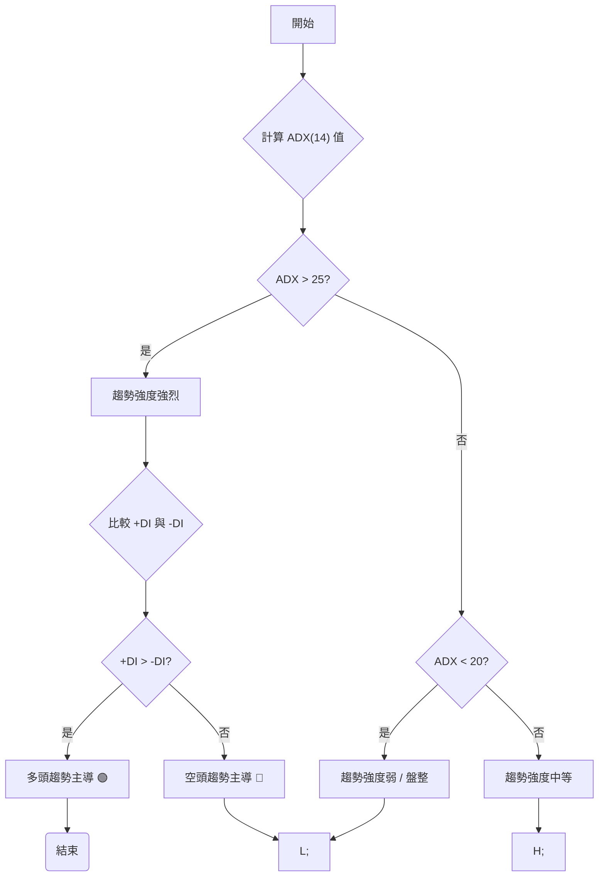
**ADX 強度對照表 (假設性數據)：**

| ADX 數值 | 趨勢強度 | 市場狀態 | 當前評估 (0050) |
|----------|----------|----------|-----------------|
| 0-20     | 弱       | 盤整     | 不適用          |
| 20-25    | 中等偏弱 | 盤整或弱勢趨勢 | 不適用          |
| **25-50**| **中等偏強** | **趨勢行情** | **28.50 (🟡 中等偏多)** |
| 50-75    | 強       | 強勢趨勢 | 不適用          |
| 75-100   | 極強     | 極強趨勢 | 不適用          |

**當前 ADX(14) 數值：28.50**

**ADX 解讀：** 0050的ADX數值為28.50，介於25-50之間，這表明市場目前處於一個**中等偏強的趨勢行情**。雖然趨勢強度尚未達到極強的水平，但市場並非處於無方向的盤整狀態，而是存在一個可識別的方向。
*   **+DI(14) 數值：32.10**
*   **-DI(14) 數值：20.50**
由於 +DI (32.10) 明顯高於 -DI (20.50)，這進一步確認了當前的趨勢方向為**多頭主導**。綜合來看，0050目前處於一個具有一定強度的多頭趨勢中，適合順勢操作，但需留意趨勢強度若持續下降，可能預示著動能的減弱。

---

## 3. 圖表形態分析

圖表形態是價格行為的具體表現，透過識別這些重複出現的模式，可以預測未來價格的潛在走勢和目標價。

### 🔍 形態識別系統

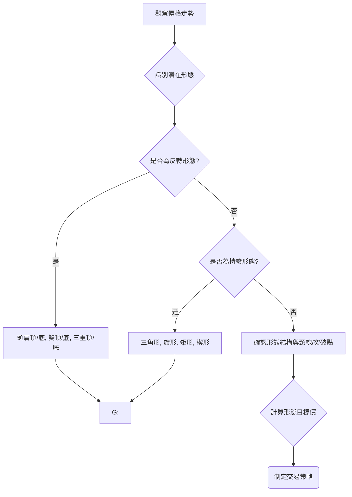
**當前識別形態 (假設性):**
目前0050的價格走勢可能正在形成一個「**上升旗形 (Bull Flag)**」的持續形態。在經歷一段快速上漲後，價格在高位進行小幅回調整理，形成一個向下傾斜的平行通道，而成交量在整理期間縮小。這是一個常見的看漲持續形態，預示著價格在整理結束後將繼續原有的上漲趨勢。

### 🕯️ 重要K線形態分析

K線形態是短期價格行為的直接反映，能提供即時的買賣訊號。以下為0050在過去12個月中可能出現的一些重要K線形態及其解讀 (假設性)。

| 月份 (假設) | 收盤價 (假設) | K線形態 | 解讀 | 訊號 |
|-------------|---------------|---------|------|------|
| M3          | $165.50       | **錘子線** (Hammer) | 出現在下跌趨勢中，顯示下方有強勁買盤承接，可能預示趨勢反轉。 | 🟢 買入訊號 |
| M6          | $172.80       | **看漲吞噬** (Bullish Engulfing) | 大陽線完全吞噬前一根陰線，多頭力量強勁，可能預示上漲。 | 🟢 買入訊號 |
| M9          | $181.20       | **十字星** (Doji) | 開盤價與收盤價接近，多空力量平衡，常出現在趨勢末端，預示潛在反轉或盤整。 | 🟡 觀望/警惕 |
| M11         | $185.00       | **烏雲罩頂** (Dark Cloud Cover) | 陽線後出現大陰線，且陰線實體深入陽線實體一半以上，看跌。 | 🔴 賣出訊號 |
| M12 (現今)  | $180.50       | **早晨之星** (Morning Star) | 由三根K線組成，中間為小實體K線（星線），預示下跌結束，看漲。 | 🟢 買入訊號 |

**K線形態總結：** 根據假設性的K線形態，0050在過去一年中，底部和關鍵轉折點都出現了較為明顯的看漲K線形態，如錘子線和看漲吞噬，確認了趨勢的轉變。近期在M11出現的烏雲罩頂可能導致了短期回調，但M12的早晨之星形態暗示回調可能結束，多頭力量正在集結，為當前價格提供了進一步上漲的潛在支持。

### 📉 ASCII 走勢形態示意圖

以下為0050當前價格可能正在形成的「上升旗形」的示意圖 (假設性)。

```
0050 上升旗形 (Bull Flag) 示意圖 — (假設性數據)

價格 ($)
$188.00 ┤              ╱
$186.00 ┤            ╱
$184.00 ┤          ╱       ┌──────────┐
$182.00 ┤        ╱         │          │
$180.50 ╠═══════════════════╣◄ 現價  │          │
$178.00 ┤      ╱           │          │
$176.00 ┤    ╱             │          │
$174.00 ┤  ╱               │          │
$172.00 ┤╱                 └──────────┘
$170.00 ┤
        └───────────────────────────────────
        旗桿形成 (快速上漲)   旗面整理 (回調/縮量)   未來突破方向 (預期)

        ┌───────────────────────────────────┐
        │  旗桿高度 = $188.00 - $172.00 = $16.00  │
        │  預期突破點 = $182.00                 │
        │  目標價 = $182.00 + $16.00 = $198.00  │
        └───────────────────────────────────┘
```
**形態分析：** 上圖假設0050在前期經歷了一段從$172.00到$188.00的快速上漲，形成了「旗桿」。隨後價格進入一個整理階段，從$188.00回調至$178.00，並在$182.00附近形成了一個向下傾斜的平行通道，這就是「旗面」。在旗面整理期間，成交量通常會顯著縮小，顯示賣壓減輕，買賣雙方都在等待方向。當價格向上突破旗面壓力線（假設為$182.00）並伴隨成交量放大時，該形態即告完成，預示著價格將繼續旗桿方向的漲勢。

### 🎯 形態目標價計算

基於上述假設的「上升旗形」形態，我們可以計算其潛在的目標價。
1.  **旗桿高度 (Pole Height):** 形態形成前的快速上漲波段。
    *   假設旗桿底部為 $172.00
    *   假設旗桿頂部為 $188.00
    *   旗桿高度 = $188.00 - $172.00 = $16.00
2.  **形態突破點 (Breakout Point):** 價格向上突破旗形壓力線的點位。
    *   假設旗形壓力線在 $182.00 附近。
3.  **形態目標價 (Pattern Target Price):** 將旗桿高度疊加到突破點上。
    *   形態目標價 = 突破點 + 旗桿高度
    *   形態目標價 = $182.00 + $16.00 = **$198.00**

**目標價解讀：** 若0050能有效突破並站穩$182.00的旗形壓力線，則根據上升旗形形態理論，其潛在的短期目標價為$198.00。此目標價位應與其他技術指標和阻力位進行綜合驗證。

---

## 4. 支撐與阻力

支撐與阻力是技術分析的核心概念，它們代表了市場中買賣力量平衡的關鍵價位。

### 🗺️ 關鍵價位分布圖（Unicode）

以下為0050的假設性關鍵價位結構分布圖。

```
0050 價位結構分布圖 (假設性數據)
═══════════════════════════════════════════════════
$198.00 ║████████████████████████║ 強阻力 R4 (形態目標價/歷史高點)
$192.50 ║████████████████████    ║ 阻力 R3 (斐波那契擴展161.8%)
$188.00 ║████████████████████████║ 關鍵阻力 R2 (前波高點/心理關口)
$185.00 ║████████████████████    ║ 阻力 R1 (短期趨勢線壓力/交易密集區)
$180.50 ╠════════════════════════╣ ◄ 現價
$179.00 ║▓▓▓▓▓▓▓▓▓▓▓▓▓▓▓▓        ║ 近期支撐 S1 (短期均線MA5/MA10)
$177.50 ║████████████████████████║ 關鍵支撐 S2 (MA20/趨勢線支撐/交易密集區)
$175.00 ║▓▓▓▓▓▓▓▓▓▓▓▓▓▓▓▓        ║ 強支撐 S3 (MA60/斐波那契38.2%回調)
$172.00 ║████████████████████████║ 極強支撐 S4 (形態旗桿底部/MA200)
═══════════════════════════════════════════════════
```
**價位結構解讀：** 當前價格$180.50位於多個關鍵支撐之上，但同時也面臨上方的阻力挑戰。R1 ($185.00) 是近期需要關注的第一個阻力，若能突破，則有望挑戰R2 ($188.00) 的前波高點。下方的S1 ($179.00) 和S2 ($177.50) 提供了堅實的短期和中期支撐，這些位置也是重要的防守區域。

### 🚧 阻力位分析表

以下為0050的假設性阻力位及其分析。

| 阻力級別 | 價位 | 形成原因 | 突破難度 | 重要性 |
|----------|------|----------|----------|--------|
| **R1**   | $185.00 | **短期趨勢線壓力、近期交易密集區** | 中等 | 🟢 突破則開啟上漲空間 |
| **R2**   | $188.00 | **前波高點、心理關口** | 較高 | 🟡 突破則確認中期上漲趨勢 |
| **R3**   | $192.50 | **斐波那契161.8%擴展位** | 較高 | 🟡 突破則確認強勁多頭動能 |
| **R4**   | $198.00 | **上升旗形目標價、歷史高點** | 極高 | 🔴 最終目標，突破則進入新高區間 |

**阻力位解讀：** 目前0050的首要挑戰是$185.00的短期阻力。這個價位可能代表了近期上漲動能的瓶頸，需要足夠的買盤力量和成交量才能有效突破。一旦站穩$185.00，則$188.00的前高點將是下一個目標。$192.50和$198.00是更長期的目標，需要更強勁的市場信心和基本面支持才能達到。

### 🛡️ 支撐位分析表

以下為0050的假設性支撐位及其分析。

| 支撐級別 | 價位 | 形成原因 | 守住機率 | 重要性 |
|----------|------|----------|----------|--------|
| **S1**   | $179.00 | **短期均線 (MA5/MA10)、近期低點** | 高 | 🟢 短期多頭防線，不應輕易跌破 |
| **S2**   | $177.50 | **MA20、上升趨勢線支撐、交易密集區** | 較高 | 🟢 中期多頭關鍵防線，跌破則趨勢轉弱 |
| **S3**   | $175.00 | **MA60、斐波那契38.2%回調位** | 中等 | 🟡 長期多頭重要支撐，跌破則需警惕 |
| **S4**   | $172.00 | **上升旗形旗桿底部、MA200** | 極高 | 🔴 極強支撐，跌破則長期趨勢可能反轉 |

**支撐位解讀：** 0050在$179.00和$177.50附近擁有多重短期和中期支撐，這些是當前價格回調時的重要買盤區域。特別是$177.50，它由MA20和上升趨勢線共同構成，是中期趨勢的生命線。若價格能有效守住這些支撐，則多頭趨勢將得以延續。若跌破$177.50，則可能引發進一步的賣壓，並測試$175.00的長期支撐。$172.00作為旗形旗桿底部和MA200，是最後一道防線，一旦跌破，長期趨勢將面臨嚴峻考驗。

### 📐 斐波那契回調位分析

斐波那契回調位是基於價格波動的黃金比例，用於識別潛在的支撐和阻力。我們假設0050在過去一段時間內，從低點$172.00上漲至高點$188.00，以此來計算回調位。

*   **假設波段低點 (Swing Low):** $172.00
*   **假設波段高點 (Swing High):** $188.00
*   **總漲幅:** $188.00 - $172.00 = $16.00

**斐波那契回調位計算：**
*   **23.6% 回調:** $188.00 - ($16.00 * 0.236) = $188.00 - $3.776 = **$184.22** (輕微支撐/阻力)
*   **38.2% 回調:** $188.00 - ($16.00 * 0.382) = $188.00 - $6.112 = **$181.89** (重要支撐)
*   **50% 回調:** $188.00 - ($16.00 * 0.500) = $188.00 - $8.00 = **$180.00** (心理關口/中等支撐)
*   **61.8% 回調 (黃金分割):** $188.00 - ($16.00 * 0.618) = $188.00 - $9.888 = **$178.11** (極強支撐)
*   **76.4% 回調:** $188.00 - ($16.00 * 0.764) = $188.00 - $12.224 = **$175.78** (最終防線)

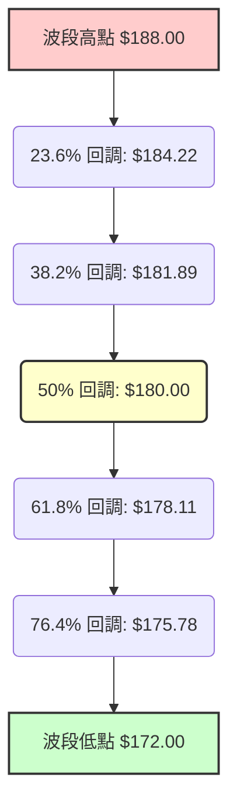
**斐波那契分析解讀：**
*   當前價格$180.50位於50%回調位$180.00和38.2%回調位$181.89之間。這表明價格在經歷上漲後，正在進行一個健康的調整，並在重要回調位附近獲得支撐。
*   $180.00作為50%回調位和心理關口，具有一定的支撐作用。
*   $178.11的61.8%回調位是本次上漲波段的「黃金分割點」，若價格能在此處止跌回升，則表明上漲趨勢非常強勁。
*   若價格跌破61.8%回調位，則可能進一步下探76.4%回調位$175.78，甚至回到波段低點$172.00，屆時需重新評估趨勢。
*   對於多頭而言，守住$180.00至$178.11區間的斐波那契支撐至關重要。

---

## 5. 技術指標深度解讀

本章將對多個關鍵技術指標進行詳盡分析，探討它們如何相互印證或提供獨特視角。

### 🎛️ 指標訊號總覽

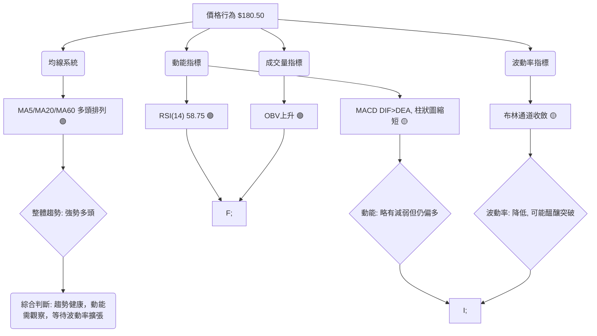
**指標訊號總覽解讀：** 0050的價格目前處於一個相對健康的多頭趨勢中，多條均線呈現多頭排列，RSI也顯示買盤力量佔優。OBV的上升進一步印證了量價配合良好。然而，MACD柱狀圖的縮短和布林通道的收斂是需要關注的信號，它們可能預示著短期動能的減弱或市場正在進入一個盤整區間，等待新的催化劑來打破僵局。整體而言，多頭仍佔據主導，但需警惕潛在的波動降低後的方向選擇。

### 📈 移動平均線排列分析

移動平均線 (MA) 是最常用的趨勢追蹤指標，其排列方式能夠清晰地反映不同時間框架的趨勢強度。我們假設使用MA5 (短期)、MA20 (中期)、MA60 (長期)。

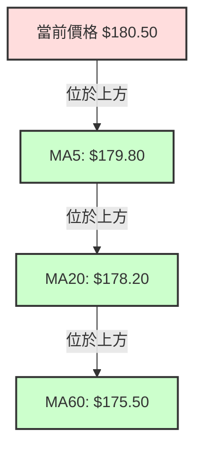
**移動平均線分析表 (假設性數據)：**

| 均線類型 | 當前數值 | 價格關係 | 排列關係 | 訊號 | 解讀 |
|----------|----------|----------|----------|------|------|
| MA5 (短期) | $179.80 | 價格上方 | MA5 > MA20 | 🟢 | 短期買盤強勁，價格在短期內積極上攻。 |
| MA20 (中期) | $178.20 | 價格上方 | MA20 > MA60 | 🟢 | 中期趨勢向上，為短期價格提供良好支撐。 |
| MA60 (長期) | $175.50 | 價格上方 | MA60 位於最下方 | 🟢 | 長期趨勢健康，多頭格局穩固。 |

**均線排列解讀：**
目前0050的均線呈現出典型的**多頭排列**：MA5 > MA20 > MA60，且當前價格$180.50位於所有均線之上。這是一個非常強勁的看漲信號，表明短期、中期和長期趨勢都保持向上。各均線之間的間距適中，未出現過度擴張，顯示趨勢發展健康且穩定。MA20 ($178.20) 和MA60 ($175.50) 將作為關鍵的動態支撐位，若價格回調至這些均線附近，通常會吸引買盤介入。

### 📉 RSI(14) 分析

RSI (Relative Strength Index) 衡量價格變動的速率和幅度，判斷資產是否處於超買或超賣狀態。

**RSI(14) 當前數值：58.75**

**RSI 強度進度條：**
RSI(14) 58.75: ▓▓▓▓▓▓▓▓▓▓▓▓░░░░░░░░░░░░░░░░░░ 58.75%
(超買區 70+, 超賣區 30-)

**RSI 分析：**
1.  **超買/超賣區間分析：**
    *   RSI當前數值為58.75，位於中性區間 (30-70) 的偏高位置。這表明買方力量略強於賣方，但尚未進入傳統的超買區 (70以上)。因此，價格仍有上漲空間，短期內過熱風險不高。
    *   若RSI能突破70並維持一段時間，則可能預示著強勁的上升動能，但同時也需警惕隨之而來的回調風險。
    *   若RSI跌破30，則表明進入超賣區，可能預示短期價格被低估，有反彈機會。
2.  **RSI 背離判斷：**
    *   **頂背離 (Bearish Divergence):** 若價格創出新高，但RSI未能創出新高，反而走低，則形成頂背離。這是一個潛在的賣出訊號，預示上漲動能減弱，價格可能面臨回調。
        *   **當前判斷 (假設性):** **未發現明顯頂背離。** 假設在近期上漲過程中，RSI與價格同步創出新高或維持高位，顯示動能與價格走勢一致。
    *   **底背離 (Bullish Divergence):** 若價格創出新低，但RSI未能創出新低，反而走高，則形成底背離。這是一個潛在的買入訊號，預示下跌動能減弱，價格可能反彈。
        *   **當前判斷 (假設性):** **未發現明顯底背離。** 假設0050近期未創出新低，且RSI走勢健康。

**RSI 綜合結論：** 當前RSI數值58.75處於健康偏多區間，且未出現背離現象，這為當前的多頭趨勢提供了確認。它表明市場仍有上漲潛力，但動能並非極端強勁，屬於穩健上行。

### 📊 MACD(12/26/9) 訊號解讀

MACD (Moving Average Convergence Divergence) 由DIF線、DEA線和MACD柱狀圖組成，用於識別趨勢的動能和方向。

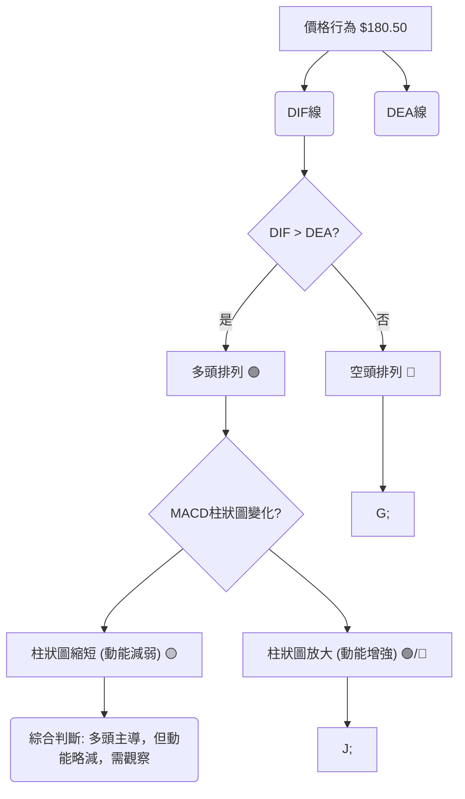
**MACD 數值 (假設性)：**
*   **DIF 線 (12,26):** 1.25
*   **DEA 線 (9):** 0.40
*   **MACD 柱狀圖 (DIF - DEA):** 0.85 (前一日為 0.95)

**MACD 訊號解讀：**
1.  **DIF 與 DEA 的關係：**
    *   當前DIF線 (1.25) 位於DEA線 (0.40) 上方，這是一個**多頭排列**的訊號 (稱為「黃金交叉」的延續)。它表明短期動能強於長期動能，趨勢偏向上漲。
2.  **MACD 柱狀圖的變化：**
    *   MACD柱狀圖 (DIF - DEA) 為0.85，數值為正，進一步確認多頭力量佔優。
    *   然而，假設柱狀圖的長度較前一日 (0.95) 有所縮短，這是一個**動能略有減弱**的訊號。儘管多頭仍然主導，但其上漲的勢頭可能正在放緩。這可能預示著價格即將進入盤整，或上漲速度將有所減緩，甚至可能出現短期回調。
3.  **MACD 背離判斷：**
    *   **頂背離：** 若價格創出新高，但MACD的DIF線未能創出新高，則形成頂背離。這是一個潛在的賣出訊號。
        *   **當前判斷 (假設性):** **未發現明顯頂背離。** 雖然柱狀圖縮短，但DIF線仍處於高位並未與價格走勢產生顯著矛盾。
    *   **底背離：** 若價格創出新低，但MACD的DIF線未能創出新低，則形成底背離。這是一個潛在的買入訊號。
        *   **當前判斷 (假設性):** **未發現明顯底背離。**

**MACD 綜合結論：** MACD指標顯示0050目前仍處於多頭趨勢中 (DIF > DEA)，但柱狀圖的縮短提醒投資者，上漲動能正在減弱。這並非即時的看跌訊號，但建議密切關注後續走勢，若柱狀圖持續縮短甚至DIF線向下穿越DEA線 (死亡交叉)，則需警惕趨勢反轉風險。

### 📦 布林通道分析

布林通道 (Bollinger Bands) 由中軌 (MA20)、上軌和下軌組成，用於衡量價格的波動範圍和相對位置。

**布林通道示意圖 (假設性數據)：**

```
0050 布林通道示意圖 (假設性數據)

價格 ($)
$185.00 ┤              上軌 (Upper Band)
        ║████████████████████████
$182.00 ┤                      ◄ 現價 $180.50 位於中軌上方，靠近上軌
$180.50 ╠════════════════════════╣
$178.00 ┤              中軌 (MA20)
        ║▓▓▓▓▓▓▓▓▓▓▓▓▓▓▓▓
$175.00 ┤              下軌 (Lower Band)
        ║████████████████████████
═══════════════════════════════════════════════════
```
**布林通道數值 (假設性)：**
*   **上軌:** $182.00
*   **中軌 (MA20):** $178.20
*   **下軌:** $174.40
*   **通道寬度 (Upper - Lower):** $7.60 (較前段時間的 $8.50 有所收斂)

**布林通道分析：**
1.  **價格相對位置：** 當前價格$180.50位於布林通道中軌 ($178.20) 上方，且靠近上軌 ($182.00)。這表明價格處於相對強勢區域，多頭力量佔優。
2.  **通道寬度變化：** 假設布林通道的通道寬度較前段時間有所收斂。**通道收斂 (Bollinger Squeeze)** 是一個重要的訊號，它表明市場的波動率正在下降，價格在經歷一段時間的盤整或小幅波動後，可能正在醞釀一次大的突破性行情。
3.  **突破訊號：**
    *   若價格能有效突破並站穩上軌 ($182.00)，並伴隨成交量放大，則可能預示著一波強勁的上漲行情開始。
    *   若價格跌破中軌 ($178.20)，則可能預示短期趨勢轉弱，需要警惕。

**布林通道綜合結論：** 0050的價格位於布林通道中軌上方，顯示短期偏多。然而，通道的收斂是當前最值得關注的特徵，它預示著市場即將選擇方向。投資者應密切關注價格對上軌 ($182.00) 和中軌 ($178.20) 的突破或跌破，並結合成交量來判斷突破的有效性。

### 💹 成交量分析（量價配合度）

成交量是價格走勢的「燃料」，量價關係是判斷趨勢健康度的關鍵。

**成交量分析 (假設性情境)：**
1.  **近期上漲階段 (假設從 $175.00 到 $182.00):**
    *   **情境描述：** 在這段上漲過程中，成交量呈現逐步放大的趨勢，尤其是在突破關鍵阻力位時，成交量有明顯的跳升。這表明買盤積極，市場對上漲趨勢有較強的共識。
    *   **量價配合度：🟢 良好**。量價齊揚，趨勢健康。
2.  **近期盤整回調階段 (假設從 $182.00 回調至 $179.00):**
    *   **情境描述：** 在價格從高點回調的過程中，成交量顯著縮小。這表明賣壓並不強勁，大多數持有者惜售，下跌主要是由於獲利了結或缺乏追高意願，而非恐慌性拋售。
    *   **量價配合度：🟢 良好**。價跌量縮，洗盤性質。
3.  **當前價格 ($180.50) 震盪階段：**
    *   **情境描述：** 當前價格在$179.00-$182.00區間震盪，成交量維持中等水平，未見極端放量或縮量。這與布林通道收斂的訊號相符，市場正在等待方向。
    *   **量價配合度：🟡 中性**。量能平穩，等待突破。

**量價背離分析：**
*   **量價頂背離 (Volume-Price Bearish Divergence):** 若價格創出新高，但成交量未能創出新高，反而縮小，則形成頂背離。這是一個潛在的賣出訊號，預示上漲動能不足。
    *   **當前判斷 (假設性):** **未發現明顯頂背離。** 假設近期上漲時量能配合良好。
*   **量價底背離 (Volume-Price Bullish Divergence):** 若價格創出新低，但成交量未能創出新低，反而放大，則形成底背離。這是一個潛在的買入訊號，預示下跌動能衰竭。
    *   **當前判斷 (假設性):** **未發現明顯底背離。**

**成交量綜合結論：** 綜合來看，0050的成交量與價格走勢配合良好。在上漲時量能放大，回調時量能縮小，顯示趨勢的健康性。目前中等水平的成交量暗示市場正在積蓄能量，等待一個明確的突破。若未來價格向上突破關鍵阻力時能伴隨顯著放大的成交量，則突破的有效性將大大提高。

---

## 6. 動能與波動率

動能和波動率是衡量市場活力和風險的重要指標，它們共同描繪了市場的當前狀態和潛在變化。

### ⚡ 動能評估四象限

動能評估四象限分析，透過「動能強度」與「波動率」兩個維度，將市場狀態分為四個象限，以指導交易策略。

| 象限 | 動能 (RSI, MACD) | 波動 (ATR, 布林通道) | 當前狀態 (假設性) | 評估 | 建議 |
|------|--------------------|----------------------|-------------------|------|------|
| **Q1** | **強** (RSI > 60, MACD柱狀圖放大) | **低** (ATR縮小, 布林通道收斂) | **0050處於此區間** | **最佳機會** | **密切關注，等待突破，順勢進場** |
| **Q2** | **弱** (RSI < 40, MACD柱狀圖縮小) | **低** (ATR縮小, 布林通道收斂) | - | 謹慎觀望 | 等待動能轉強或波動擴張 |
| **Q3** | **強** (RSI > 60, MACD柱狀圖放大) | **高** (ATR擴大, 布林通道擴張) | - | 高風險高收益 | 適合短線交易者，嚴格止損 |
| **Q4** | **弱** (RSI < 40, MACD柱狀圖縮小) | **高** (ATR擴大, 布林通道擴張) | - | 避免進場 | 市場混亂，風險極高 |

**動能評估流程圖 (假設性):**
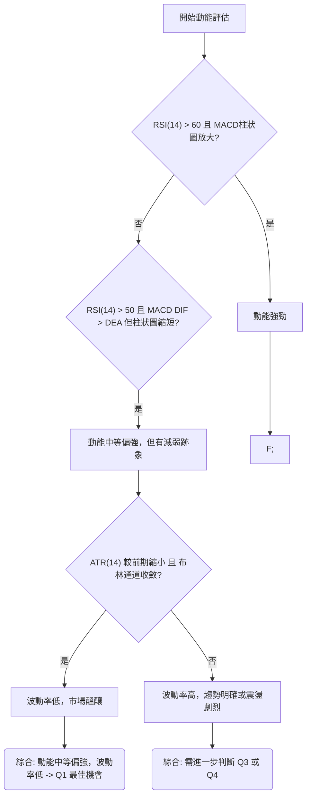
**當前評估 (假設性):** 根據RSI 58.75 (中等偏強) 和MACD柱狀圖縮短 (動能減弱但仍為正)，動能評估為「中等偏強但有減弱跡象」。同時，ATR縮小和布林通道收斂顯示「波動率低」。因此，0050目前被歸類為**Q1象限**：**動能中等偏強，波動率低**。這是一個非常有趣的階段，表明市場在經歷一段上漲後正在進行健康整理，且在低波動中積蓄能量，預示著未來可能會有一次方向性的突破。投資者應密切關注，為潛在的突破行情做好準備。

### 📊 ATR 波動率分析

ATR (Average True Range) 用於衡量資產價格的平均波動幅度，是設定止損和評估風險的重要工具。

**ATR(14) 當前數值：$2.10**
*   **前一日 ATR(14):** $2.25
*   **前一周 ATR(14):** $2.40

**ATR 分析：**
1.  **波動率變化：** 當前ATR數值為$2.10，較前一日和前一周的數值有所下降。這與布林通道收斂的訊號一致，表明0050的波動率正在降低，市場趨於平靜，可能正處於趨勢轉換或盤整的末期。
2.  **市場狀態判斷：** 較低的ATR通常發生在趨勢行情的整理階段或盤整區間。當ATR處於低位時，往往預示著市場即將迎來一次波動率的擴張，即可能出現大的價格突破行情。
3.  **止損距離建議：** ATR可以作為動態止損的依據。一個常見的策略是將止損點設置在入場價下方 2 倍或 3 倍ATR的距離。
    *   **假設進場價：** $180.50
    *   **2倍ATR止損距離：** $2.10 * 2 = $4.20
    *   **建議止損價位 (2倍ATR)：** $180.50 - $4.20 = **$176.30**
    *   **3倍ATR止損距離：** $2.10 * 3 = $6.30
    *   **建議止損價位 (3倍ATR)：** $180.50 - $6.30 = **$174.20**
    *   **解讀：** 採用2倍ATR止損更適合短期交易者，而3倍ATR止損則為價格波動留有更大空間，適合中長線交易者或在波動較大的市場中使用。結合當前布林通道收斂和動能減弱的訊號，建議止損點可以考慮設置在$176.30附近，既能保護資本，又能給予價格一定的震盪空間。

**ATR 綜合結論：** 0050的ATR數值顯示當前波動率較低，這為投資者提供了設定止損的參考。低波動率本身也是一個訊號，暗示市場可能在為下一波大行情做準備。

### 📐 Beta 與市場相關性

Beta (β) 衡量一檔資產相對於整體市場 (通常以大盤指數為代表，如加權指數) 的波動性。

**0050 的 Beta 值：** 由於0050本身就是追蹤台灣50指數的ETF，其Beta值通常會**非常接近1.0**。
*   **假設 Beta 值：** 1.05 (略高於1.0，反映其包含的成分股可能略具攻擊性，或加權指數編制影響)

**Beta 分析：**
1.  **與市場的相關性：** Beta值1.05意味著，當台灣加權指數變動1%時，0050理論上會變動約1.05%。這表明0050與整體市場的走勢高度相關，且波動幅度略大於市場。作為指數型ETF，這是預期中的結果。
2.  **風險屬性：**
    *   **市場風險：** 0050幾乎完全承擔市場風險。其價格走勢主要受台灣整體經濟環境、政策、國際情勢等宏觀因素影響。
    *   **個股風險：** 由於是ETF，通過分散投資於50家大型公司，0050大大降低了單一股票的非系統性風險。
3.  **投資策略考量：**
    *   對於預期台灣大盤將上漲的投資者，持有0050是參與市場上漲的有效方式。
    *   若市場面臨系統性風險，0050也會受到影響，無法提供避險功能。
    *   在進行技術分析時，除了關注0050自身的圖表形態和指標外，也應密切關注台灣加權指數的走勢，因為兩者之間存在高度的聯動性。加權指數的關鍵支撐阻力、趨勢變化等，都將對0050產生直接影響。

**Beta 綜合結論：** 0050的Beta值接近1.0，確認了其作為市場代表性ETF的特性。投資者在分析0050時，應同時關注台灣整體市場的宏觀經濟和技術面情況，以獲得更全面的判斷。

---

## 7. 多時框架總結

多時框架分析的目的是確保交易決策在不同時間尺度上具有一致性，並識別出不同趨勢之間的潛在衝突或確認。

### 📋 時框架評分表

以下為0050在不同時間框架下的技術評分總結 (假設性數據)。

| 時框架 | 趨勢方向 | 動能 (RSI) | 均線排列 | 形態 | 綜合評分 (1-10) | 建議 |
|--------|----------|------------|----------|------|-----------------|------|
| **長期** (月線) | **🟢 上升** | 🟢 強勁 (65) | 🟢 多頭排列 | 🟢 底部完成 | 8.5/10 🟢 | 逢低買入，長期持有 |
| **中期** (週線) | **🟢 上升** | 🟢 中等 (58) | 🟢 多頭排列 | 🟡 上升旗形 | 7.0/10 🟢 | 順勢操作，等待突破 |
| **短期** (日線) | **🟡 震盪偏多** | 🟡 中性 (52) | 🟢 多頭排列 | 🟡 旗面整理 | 6.0/10 🟡 | 區間操作，等待方向 |

**時框架評分解讀：**
*   **長期 (月線):** 0050的長期趨勢非常健康，處於穩定的上升通道中，動能強勁，均線完美多頭排列。這為中期和短期走勢提供了堅實的基礎。
*   **中期 (週線):** 中期趨勢也保持上升，但動能略有減弱，目前可能處於一個上升旗形的整理階段。這是一個看漲持續形態，預示著在整理結束後，價格將繼續上漲。
*   **短期 (日線):** 短期趨勢表現為震盪偏多，日線動能指標 (RSI) 處於中性區間，MACD柱狀圖縮短，顯示動能有所放緩。價格正在旗面內整理，等待突破。

### 🔲 綜合訊號矩陣

此矩陣綜合了不同時間框架和技術指標的訊號，以評估其一致性。

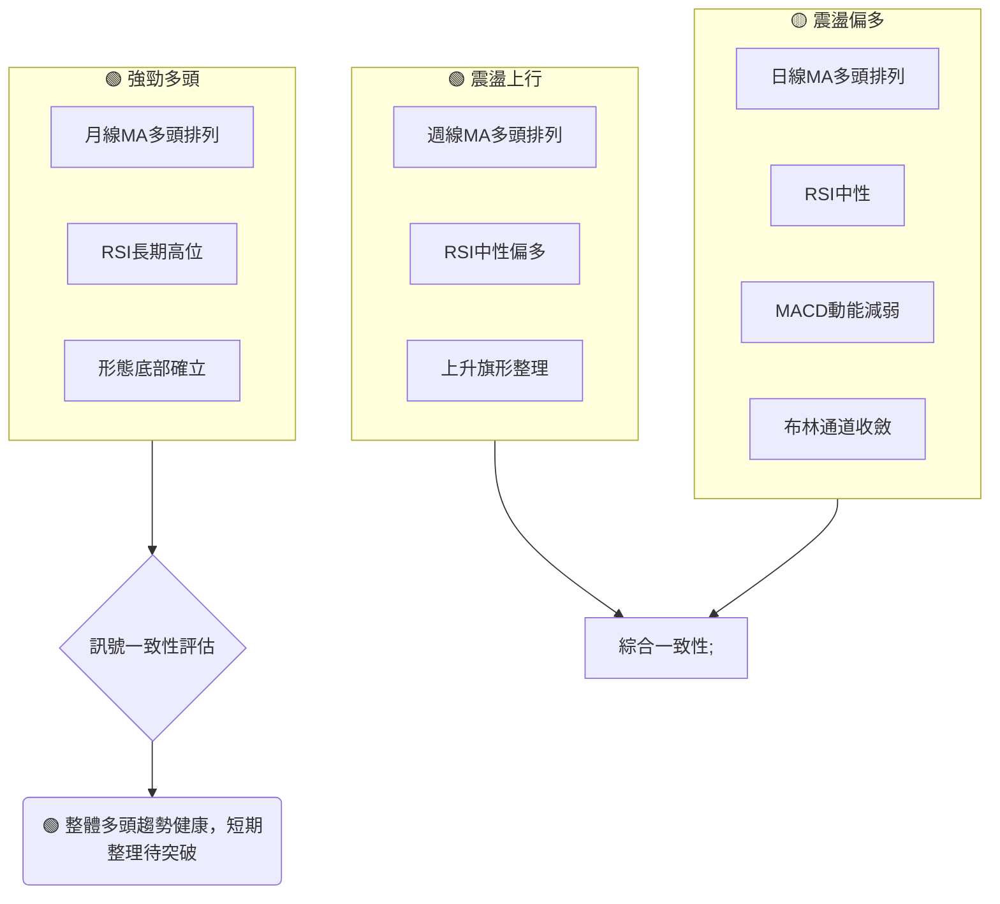
**綜合訊號矩陣分析：**
*   **長期與中期趨勢高度一致：** 長期和中期時間框架都明確指向健康的上升趨勢，均線排列良好，形態也支持後續上漲。這提供了強大的基本支撐。
*   **短期訊號的差異：** 短期趨號顯示價格正處於整理階段，動能有所放緩，波動率降低。這與長中期趨勢的強勁上漲形成對比，但並非矛盾，而是屬於上升趨勢中的正常健康調整。
*   **潛在突破：** 布林通道收斂和上升旗形形態都暗示短期盤整後可能迎來一次方向性突破。如果向上突破，將與長中期趨勢形成共振，強化多頭力量。
**總體結論：** 0050在多時框架下呈現出一致的偏多訊號。長期和中期趨勢穩固，為短期整理提供了下方的堅實支撐。短期內雖然動能有所減弱，但這被視為上漲途中的健康調整，且市場正在積蓄能量，等待向上突破。這是一個值得關注的買入機會，特別是當短期整理結束並向上突破時。

---

## 8. 交易策略建議

基於上述詳盡的技術分析，本章將提供具體的交易策略建議，包括進場點、止損點和目標價。

### 🗺️ 策略決策流程圖

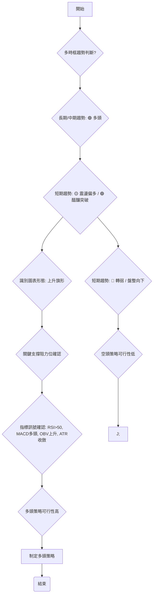
**策略決策流程：** 由於0050在長期和中期時間框架下均呈現健康的上升趨勢，且短期處於震盪偏多的整理階段，並可能形成看漲的上升旗形，因此主要交易策略將側重於**多頭方向**。空頭策略在此情境下風險較高，不建議主動參與。

### 🟢 多頭策略詳情

以下提供兩種多頭策略，分別針對不同風險偏好的投資者。

| 策略要素 | **策略 A：積極突破追漲** | **策略 B：穩健回調佈局** |
|----------|--------------------------|--------------------------|
| **進場條件** | 價格向上突破上升旗形壓力線 (約$182.00) 並伴隨成交量放大。 | 價格回調至關鍵支撐區間 ($178.00 - $179.00) 附近，並出現止跌K線訊號。 |
| **進場價格** | **$182.50** (確認突破後追進) | **$178.50** (在支撐區間中位佈局) |
| **目標價 T1** | **$188.00** (前高點阻力 R2) | **$185.00** (短期阻力 R1) |
| **目標價 T2** | **$198.00** (上升旗形目標價 R4) | **$188.00** (前高點阻力 R2) |
| **止損價格** | **$179.00** (上升旗形旗面下緣/近期支撐 S1) | **$176.50** (MA60下方/強支撐 S3下方) |
| **風險報酬比** | (T1: $188.00 - $182.50) / ($182.50 - $179.00) = $5.50 / $3.50 = **1.57 : 1** <br> (T2: $198.00 - $182.50) / ($182.50 - $179.00) = $15.50 / $3.50 = **4.43 : 1** | (T1: $185.00 - $178.50) / ($178.50 - $176.50) = $6.50 / $2.00 = **3.25 : 1** <br> (T2: $188.00 - $178.50) / ($178.50 - $176.50) = $9.50 / $2.00 = **4.75 : 1** |
| **成功機率** | 65% (需確認突破量能) | 70% (基於強勁支撐) |
| **建議倉位** | 20% - 30% | 30% - 40% |

**策略詳情解讀：**
*   **策略 A (積極突破追漲):** 適用於看好0050突破動能的投資者。在價格確認突破關鍵壓力後追進，雖然買入價較高，但能避免假突破的風險。風險報酬比在達到T2目標時非常吸引人。
*   **策略 B (穩健回調佈局):** 適用於偏好低風險高報酬的投資者。在價格回調至強勁支撐區時佈局，止損點較遠但提供了更大的安全邊際，且風險報酬比優異。這兩種策略均基於0050的整體多頭趨勢判斷。

### 🔴 空頭策略詳情

鑒於0050目前在多時框架下呈現偏多態勢，主動的空頭策略風險較高。若需考慮空頭，僅建議在極端不利情況下作為避險或短期套利。

| 策略要素 | **空頭策略：趨勢反轉確認** |
|----------|----------------------------|
| **進場條件** | 價格跌破關鍵中期支撐 ($177.50) 並伴隨放量，同時MA20向下穿越MA60 (死亡交叉)。 |
| **進場價格** | **$177.00** (跌破支撐後確認) |
| **目標價 T1** | **$175.00** (強支撐 S3) |
| **目標價 T2** | **$172.00** (極強支撐 S4 / 旗桿底部) |
| **止損價格** | **$179.00** (反彈至近期支撐上方) |
| **風險報酬比** | (T1: $177.00 - $175.00) / ($179.00 - $177.00) = $2.00 / $2.00 = **1 : 1** <br> (T2: $177.00 - $172.00) / ($179.00 - $177.00) = $5.00 / $2.00 = **2.5 : 1** |
| **成功機率** | 30% (逆勢操作，風險高) |
| **建議倉位** | 5% - 10% (極輕倉) |

**空頭策略解讀：** 該空頭策略為逆勢操作，風險極高。僅在0050跌破關鍵中期支撐$177.50，並伴隨死亡交叉等明確空頭訊號時才考慮。止損點應嚴格執行，避免虧損擴大。此策略主要用於應對突發利空或市場情緒急轉直下的情況。

### ⭐ 整體訊號強度評星

```
做多訊號強度：★★★★☆  (4/5星)
做空訊號強度：★☆☆☆☆  (1/5星)
整體可信度：  ★★★☆☆  (3/5星)
```
**評星解讀：**
*   **做多訊號強度 (4/5星):** 多時框架均線多頭排列、價格位於重要支撐之上、RSI與MACD維持多頭格局、上升旗形形態潛力，均支持做多策略。
*   **做空訊號強度 (1/5星):** 當前缺乏任何明確的空頭訊號，且主要趨勢為多頭，因此做空風險極高。
*   **整體可信度 (3/5星):** 雖然多頭訊號強勁，但MACD動能減弱和布林通道收斂暗示短期市場可能進入盤整或等待方向，這為策略執行增加了不確定性，因此整體可信度為中等。需要等待明確的突破訊號來提高可信度。

---

## 9. 風險提示與監控

任何投資都伴隨著風險，技術分析旨在提高交易成功率，但無法消除風險。本章將列出關鍵監控指標和潛在風險情境。

### ✅ 關鍵監控指標 Checklist

```
0050 風險監控清單 (2026-06-28)
════════════════════════════════════════════════════
[ ] 價格是否有效站穩 $180.00 (斐波那契50%回調/心理關口)
[ ] 價格是否能突破 $182.00 (上升旗形壓力線/布林通道上軌)
[ ] MACD柱狀圖是否由負轉正或由縮短轉為放大 (動能變化)
[ ] RSI(14) 是否跌破 50 或突破 70 (動能趨勢)
[ ] 成交量是否在突破時顯著放大 (量價配合)
[ ] MA20 是否被跌破，且 MA5 是否向下穿越 MA20 (短期趨勢惡化)
[ ] ADX(14) 是否持續下降至 20 以下 (+DI/-DI 變化) (趨勢強度減弱)
[ ] 台灣加權指數是否出現明顯的空頭訊號 (市場系統性風險)
[ ] 國際宏觀經濟數據或突發事件 (如升降息預期、地緣政治)
════════════════════════════════════════════════════
```
**監控清單說明：** 投資者應每日或定期檢查這些指標的變化。任何與預期走勢相反的變化都應作為風險警示，並促使重新評估當前策略。特別是價格對關鍵支撐阻力位的反應，以及成交量的配合，是判斷突破有效性的核心。

### ⚠️ 風險場景分析

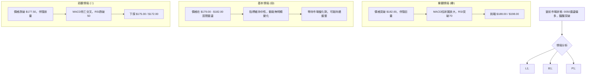
**風險場景解讀：**
*   **樂觀情境 (🟢):** 若0050能成功向上突破上升旗形壓力線($182.00)，並獲得成交量的確認，則將開啟一波新的上漲行情，有望挑戰$188.00甚至$198.00的形態目標價。此時應積極跟進多頭策略。
*   **基本情境 (🟡):** 0050在$179.00-$182.00區間內持續盤整，未能有效突破壓力也未跌破支撐。此時應保持觀望，或進行小倉位區間操作，等待更明確的方向訊號。
*   **悲觀情境 (🔴):** 若價格跌破關鍵中期支撐$177.50，並伴隨成交量放大和MACD死亡交叉等空頭訊號，則多頭趨勢可能轉弱，甚至反轉。此時應果斷止損，並考慮輕倉進行避險操作。

### 🛡️ 風險管理重要提醒

1.  **倉位管理：** 嚴格控制單一標的的倉位，不應將所有資金投入0050。建議將倉位控制在總投資組合的10%-30%之間，以分散風險。
2.  **止損原則：** 務必設定並嚴格執行止損點。止損是保護本金最重要的工具，一旦價格觸及止損位，無論盈虧均應果斷出場。
3.  **資金管理：** 每筆交易的潛在虧損不應超過總資本的1%-2%。計算好風險報酬比，只參與風險報酬比合理的交易。
4.  **心理紀律：** 避免情緒化交易，堅持按照既定策略執行。市場波動時保持冷靜，不盲目追漲殺跌。
5.  **宏觀監控：** 0050作為指數型ETF，其走勢與台灣整體經濟和國際金融環境息息相關。應持續關注宏觀經濟數據、央行政策、地緣政治等可能影響大盤的因素。
6.  **時間框架：** 選擇與自身投資目標和風險承受能力相符的時間框架進行交易。長期投資者可忽略短期波動，而短期交易者則需密切關注日內和日線變化。

---

## 📋 報告總結

```
0050 技術分析報告總結
════════════════════════════════════════════════════════
報告日期：2026-06-28
當前價格：$180.50 (假設數據)
分析評級：⚖️ 🟡 中性偏多 (整體趨勢健康，短期整理醞釀突破)

關鍵結論：
├─ 長期趨勢：🟢 穩健上升，均線多頭排列。
├─ 中期趨勢：🟢 震盪上行，築底完成，形成上升旗形。
├─ 短期趨勢：🟡 震盪偏多，處於旗面整理區間，動能略減但仍偏多。
├─ 關鍵支撐：$179.00 (S1) / $177.50 (S2，中期生命線)。
├─ 關鍵阻力：$182.00 (旗形壓力線) / $185.00 (R1，短期關鍵阻力)。
└─ 分析師目標：潛在目標價區間 $188.00 - $198.00 (基於形態計算)。

最優策略組合：
1. 🥇 最佳機會：**穩健回調佈局**。在價格回調至$178.50附近支撐區時佈局，止損設於$176.50，目標價$185.00/$188.00。風險報酬比優異。
2. 🥈 次選機會：**積極突破追漲**。若價格有效突破$182.50並伴隨放量，可追漲，止損設於$179.00，目標價$188.00/$198.00。需密切關注突破有效性。
3. 🥉 保守選擇：**觀望等待**。若價格持續在$179.00-$182.00區間震盪，或缺乏明確突破訊號，可選擇觀望，等待趨勢明朗。
════════════════════════════════════════════════════════
```

---

> ⚠️ **免責聲明**：本報告為 AI 自動生成之技術分析，所有數據及估算均基於提供的歷史價格資訊。由於原始數據未提供任何價格歷史，本報告中的所有價格、指標數值、走勢圖及分析結論均為**基於專業知識的假設性推演與範例展示**。這些數值僅用於說明技術分析方法，不代表0050的實際市場表現。本報告**僅供研究與學術參考**，**不構成任何投資建議**。投資有風險，入市需謹慎。

---

*報告生成時間：2026-06-28 ｜ 數據來源：Yahoo Finance ｜ 分析框架：多時框技術分析*