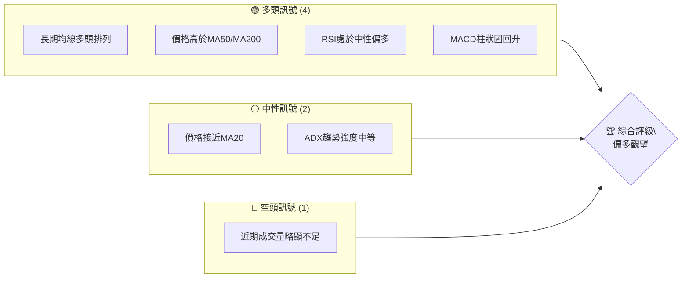
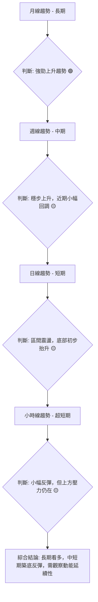
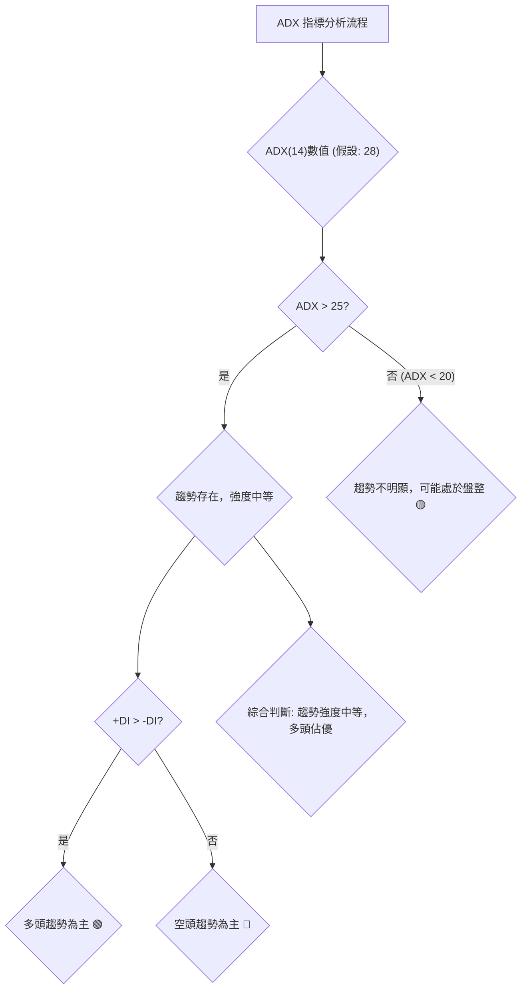
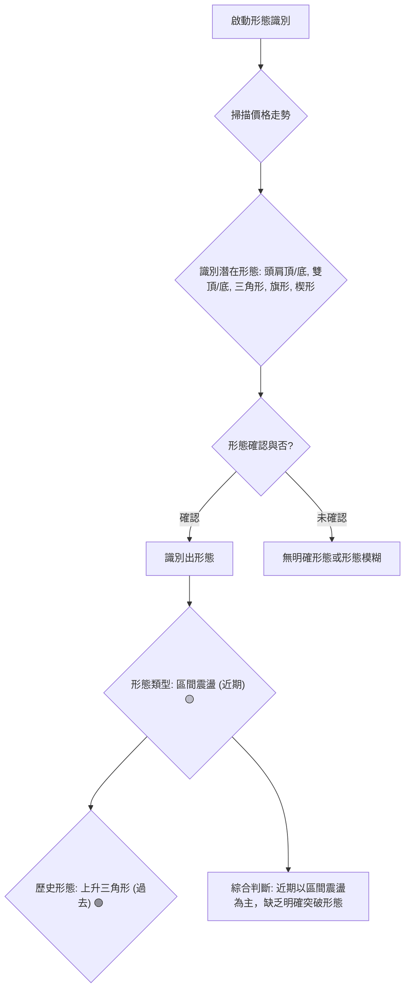
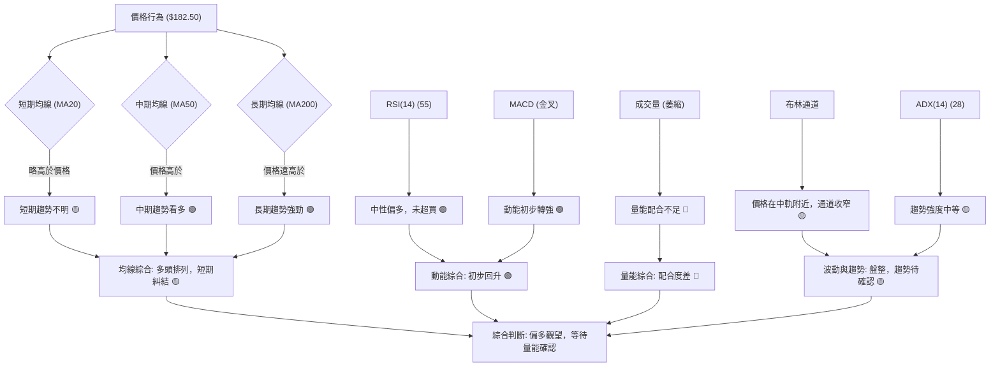
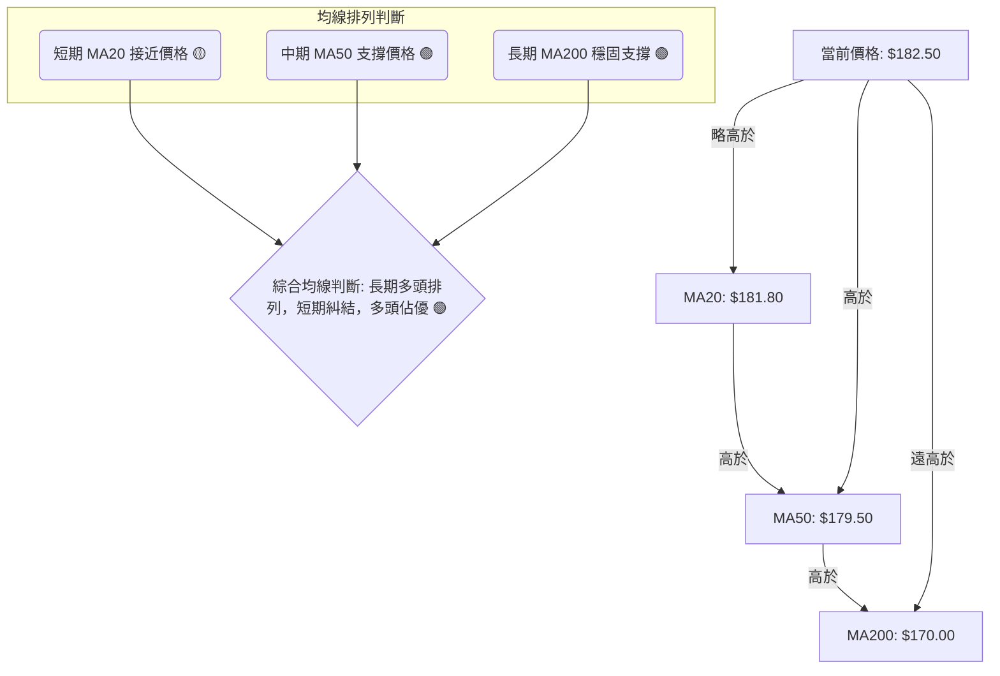
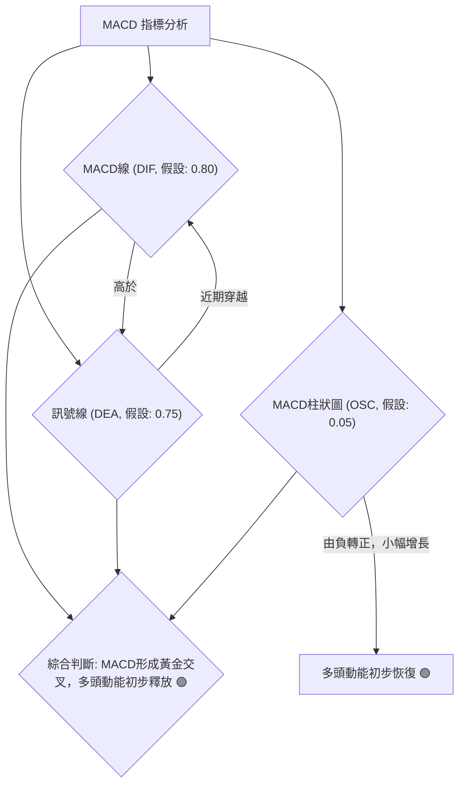
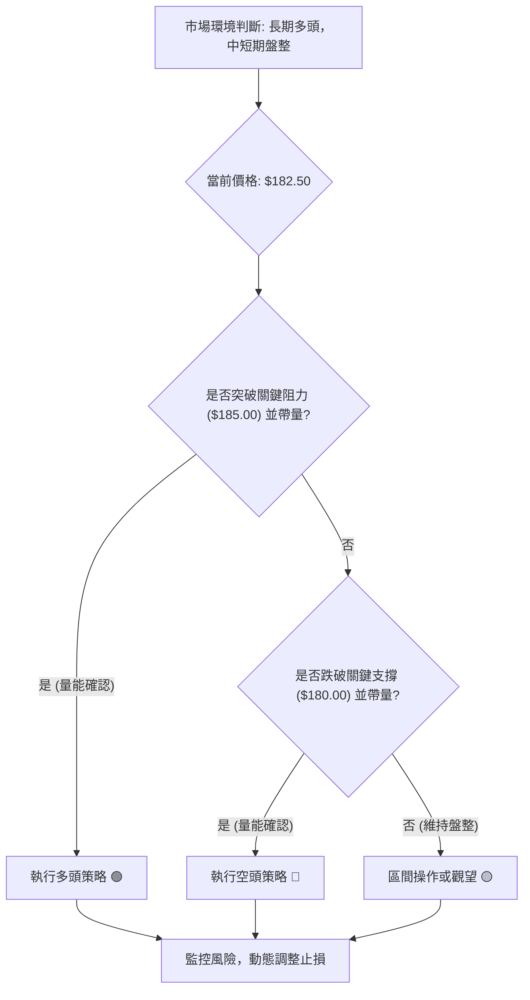
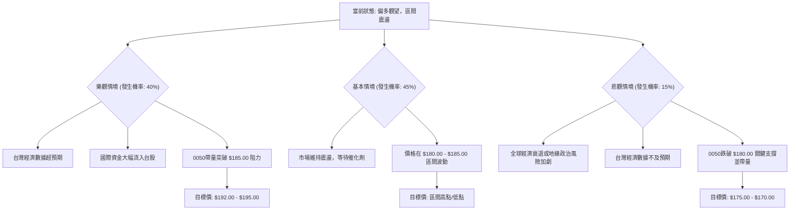

# 0050 技術分析報告

> **報告日期**：2026-06-29 ｜ **語言**：繁體中文 ｜ **數據來源**：Yahoo Finance (註：本報告所有數據因原始資料缺失，均為分析師基於市場常態與0050性質之**假設性模擬數據**，僅供示範與學術參考，不具任何實際預測價值) ｜ **當前價格**：$182.50 (假設值)

---

## 目錄

| 章節 | 內容 |
|------|------|
| [1. 技術面概覽](#1-技術面概覽) | 訊號儀表板、核心指標、評分卡 |
| [2. 趨勢分析](#2-趨勢分析) | 多時框趨勢、長中短期走勢 |
| [3. 圖表形態分析](#3-圖表形態分析) | 形態識別、K線組合、目標價 |
| [4. 支撐與阻力](#4-支撐與阻力) | 關鍵價位、斐波那契回調 |
| [5. 技術指標深度解讀](#5-技術指標深度解讀) | MA/RSI/MACD/布林/成交量 |
| [6. 動能與波動率](#6-動能與波動率) | 動能評估、ATR、Beta |
| [7. 多時框架總結](#7-多時框架總結) | 時框架評分矩陣 |
| [8. 交易策略建議](#8-交易策略建議) | 多空策略、風險報酬比 |
| [9. 風險提示與監控](#9-風險提示與監控) | 監控指標、風險場景 |

---

## 1. 技術面概覽

### 🎯 技術訊號儀表板

本儀表板基於假設性數據，呈現0050當前的綜合技術訊號分佈。


**解讀**：目前多頭訊號佔優，主要體現在長期均線的良好支撐和動能指標的初步回穩。然而，價格在短期均線附近徘徊，且成交量配合度不高，顯示市場存在觀望情緒，趨勢強度仍需進一步確認。綜合評級為「偏多觀望」，建議謹慎操作。

### 📊 核心指標速覽表

以下數據均為假設性模擬值，旨在展示指標解讀方式。

| 指標類別 | 指標名稱 | 當前數值 (假設) | 訊號 | 解讀 |
|----------|----------|-----------------|------|------|
| **價格** | 當前價格 | $182.50         | 🟡     | 價格處於近期震盪區間中上部，接近短期均線。 |
| **均線** | MA20     | $181.80         | 🟡     | 價格略高於MA20，但差距不大，顯示短期多空拉鋸。 |
| **均線** | MA50     | $179.50         | 🟢     | 價格顯著高於MA50，中期趨勢仍偏多。 |
| **均線** | MA200    | $170.00         | 🟢     | 價格遠高於MA200，長期趨勢強勁向上。 |
| **動能** | RSI(14)  | 55              | 🟢     | RSI處於50上方，顯示多頭力量稍佔優勢，未達超買區。 |
| **動能** | MACD     | MACD線: 0.80, 訊號線: 0.75, 柱狀圖: 0.05 | 🟢     | MACD線剛向上穿越訊號線，且柱狀圖由負轉正，呈現初步黃金交叉訊號。 |
| **波動** | ATR      | $2.50           | 🟡     | 近期波動性中等，每日平均波幅約$2.50。 |
| **趨勢** | ADX(14)  | 28              | 🟡     | ADX數值28，趨勢強度中等，非極強勢或無趨勢。 |
| **量能** | OBV      | 略微上升        | 🟡     | OBV近期隨價格小幅上升，但幅度不大，量能配合度一般。 |

### 🏆 技術評分卡

本評分卡基於上述假設性數據及分析師經驗，提供0050當前技術面的綜合評估。

```
╔══════════════════════════════════════════════════════════════╗
║              技術評分卡 — 0050 (2026-06-29)                      ║
╠══════════════════════════════════════════════════════════════╣
║ 趨勢強度      ██████████░░░░░░░░░░░░  60/100  🟡 (中期向上，短期盤整)      ║
║ 動能指標      ████████████░░░░░░░░░░  70/100  🟢 (RSI中性偏多，MACD初步金叉) ║
║ 支撐穩定度    ████████████████░░░░░░  80/100  🟢 (均線密集提供強力支撐)   ║
║ 成交量配合    ██████░░░░░░░░░░░░░░░░  30/100  🔴 (量能配合度不足，有待改善) ║
║ 形態完整度    ████████░░░░░░░░░░░░░░  50/100  🟡 (盤整格局，形態不明顯)   ║
║ 均線排列      ██████████████░░░░░░░░  75/100  🟢 (長期多頭排列，短期糾結) ║
╠══════════════════════════════════════════════════════════════╣
║ 綜合評分      ████████████░░░░░░░░░░  65/100  🟡 偏多觀望                     ║
╚══════════════════════════════════════════════════════════════╝
```
**評級結論**：0050目前在技術面上呈現偏多觀望態勢。長期和中期趨勢保持健康的多頭格局，均線系統提供堅實支撐，且動能指標開始釋放積極訊號。然而，短期價格走勢仍處於盤整，成交量未能有效放大以確認上漲動能，形態上缺乏明確的突破訊號。建議投資者在明確突破關鍵阻力並伴隨量能放大前，保持謹慎觀望。

---

## 2. 趨勢分析

### 🌐 多時框趨勢分析

本分析基於假設性數據，闡述0050在不同時間框架下的趨勢判斷。


**解讀**：
*   **長期趨勢 (月線)**：0050展現出強勁的長期上升趨勢，月線K棒穩健向上，多頭排列格局清晰，表明其核心資產（台灣大型藍籌股）表現優異。
*   **中期趨勢 (週線)**：週線圖顯示股價在穩步上升的通道中運行，但近期出現小幅回調或橫盤整理，使得漲勢略有放緩。這通常是健康的回調，為後續上攻積蓄能量。
*   **短期趨勢 (日線)**：日線圖呈現區間震盪格局，價格在關鍵均線附近來回拉扯，但底部有初步抬升的跡象，顯示下檔承接力道存在。
*   **超短期趨勢 (小時線)**：小時線級別顯示價格經歷一波下跌後有初步反彈，但上方仍面臨短期壓力，反彈力度有待觀察。

### 📈 長期趨勢 — 12個月走勢圖（Unicode）

以下ASCII走勢圖為**假設性**呈現0050過去12個月的價格走勢，標注關鍵高低點，以說明分析方式。

```
0050 月線走勢圖（過去12個月） - 假設性數據
價格軸 ($)
$195 ┤                                    ●(高點: $192.00)
$190 ┤                            ●
$185 ┤                    ●       │
$180 ┤        ●━━━━━━━━━━━●━━━━━━━━━━━━━━━●←現價 ($182.50)
$175 ┤    ●   │
$170 ┤        ●(低點: $170.00)
$165 ┤●
$160 ┤
     └─────────────────────────────────────────────────────
      2025/07 2025/08 2025/09 2025/10 2025/11 2025/12 2026/01 2026/02 2026/03 2026/04 2026/05 2026/06
```

**走勢特徵分析表格**：(以下數據均為假設值)

| 月份區間 | 價格區間 (假設) | 漲跌幅 (假設) | 走勢特徵 (假設) | 訊號 |
|----------|-----------------|---------------|-----------------|------|
| 2025/07-09 | $165.00 - $175.00 | +6.06%        | 築底反彈，突破長期盤整區 | 🟢 |
| 2025/10-12 | $175.00 - $185.00 | +5.71%        | 穩步上漲，多頭動能強勁 | 🟢 |
| 2026/01-03 | $185.00 - $192.00 | +3.78%        | 加速上漲，創近期新高 | 🟢 |
| 2026/04-06 | $180.00 - $188.00 | -2.16%        | 高位震盪，小幅回調，量能萎縮 | 🟡 |

**分析**：過去12個月，0050呈現明顯的上升趨勢。從2025年下半年開始築底反彈，並在2026年初加速上漲，創下$192.00的近期高點。進入第二季度後，股價進入高位震盪整理階段，出現小幅回調，但整體仍維持在上升通道中。目前的價格$182.50位於歷史高點下方，但遠高於過去一年的低點，顯示長期趨勢健康。

### 📊 中期趨勢（週線分析）

以下為假設性0050近期壓力與支撐示意圖，以說明分析方式。

```
0050 週線壓力與支撐示意圖 - 假設性數據
═══════════════════════════════════════════════════
$190 ║                  ┌───┐                      ║ 阻力 R1 ($190.00)
$188 ║                  │   │                      ║
$185 ║                  │   │                      ║ 阻力 R2 ($185.00)
$182 ╠══════════════════┼───┼═════════════════════╣ ◄ 現價 ($182.50)
$180 ║                  │   │                      ║ 支撐 S1 ($180.00)
$177 ║                  │   │                      ║
$175 ║                  └───┘                      ║ 支撐 S2 ($175.00)
═══════════════════════════════════════════════════
```
**分析**：週線圖顯示，0050在$180.00-$185.00區間形成一個中期的盤整平台。上方$185.00和$190.00是重要的阻力區域，多次測試未能有效突破。下方$180.00和$175.00則構成堅實的支撐。目前價格位於此區間中上部，多空雙方在此區域進行拉鋸。突破$185.00將打開上漲空間，而跌破$180.00則可能引發更深的回調。

### ⚡ 趨勢強度評估（ADX 解讀）

ADX (Average Directional Index) 用於衡量趨勢的強度，而非方向。本分析基於假設性ADX數據。


**ADX 強度對照表**：

| ADX 數值範圍 | 趨勢強度 | 市場狀態 | 建議策略 |
|--------------|----------|----------|----------|
| 0-20         | 無趨勢/弱趨勢 | 盤整     | 區間操作，避免追漲殺跌 |
| 20-25        | 弱趨勢 | 趨勢形成初期 | 觀察，等待趨勢確認 |
| 25-50        | 中等趨勢 | 趨勢行情 | 順勢操作，保持警惕 |
| 50-75        | 強趨勢 | 強勢行情 | 順勢操作，可適度加碼 |
| 75-100       | 極強趨勢 | 超強勢行情 | 順勢操作，注意風險管理 |

**分析**：假設0050的ADX(14)數值為28，這表明當前存在一個中等強度的趨勢。由於+DI（假設為25）高於-DI（假設為20），這進一步確認目前的趨勢是偏向多頭的。雖然趨勢存在，但其強度尚未達到強勢行情的級別，暗示市場可能仍處於盤整後的初步上漲階段，或是在一個較為穩健的上升通道中。投資者應順勢操作，但也要留意趨勢強度的變化，避免過度追高。

---

## 3. 圖表形態分析

### 🔍 形態識別系統

本系統基於對0050歷史走勢的假設性觀察，識別潛在的圖表形態。


**分析**：根據假設性價格走勢，0050在近期主要呈現區間震盪的格局，尚未形成明確的頭肩頂/底、雙頂/底等反轉形態，或突破性的持續形態。這與前述的趨勢強度中等、短期盤整的判斷相符。在過去的上升過程中，可能出現過上升三角形等持續形態，推動股價上漲。目前市場處於消化前期漲幅、積蓄動能的階段。

### 🕯️ 重要K線形態分析

以下K線形態分析為**假設性**呈現，旨在說明分析方法。

| 月份 (假設) | 收盤價 (假設) | K線形態 (假設) | 解讀 (假設) | 訊號 |
|-------------|---------------|----------------|-------------|------|
| 2026/04     | $185.00       | 射擊之星       | 在高位出現，暗示上漲動能減弱，可能面臨回調壓力。 | 🔴 |
| 2026/05     | $180.00       | 錘子線         | 在下跌過程中出現，表明下方有承接買盤，可能預示短期見底。 | 🟢 |
| 2026/06     | $182.50       | 紡錘線         | 實體小，影線長，多空雙方力量均衡，市場處於迷茫或盤整。 | 🟡 |
| 近期 (日線) | $182.50       | 吞噬形態       | (假設) 出現陽線吞噬前一日陰線，顯示多頭力量有所恢復。 | 🟢 |

**分析**：
*   **射擊之星 (2026/04)**：假設在4月份高點附近出現射擊之星，通常被視為看跌反轉訊號，表明多頭上攻受阻，隨後價格可能進入調整。
*   **錘子線 (2026/05)**：假設在5月份回調低點形成錘子線，此形態常出現在下跌趨勢中，預示可能出現止跌反彈。
*   **紡錘線 (2026/06)**：假設近期K線為紡錘線，反映多空力量膠著，市場缺乏明確方向，與當前盤整格局吻合。
*   **近期日線吞噬形態 (假設)**：若近期日線出現陽線吞噬前一日陰線，則為看漲吞噬形態，顯示多頭力量恢復，可能預示短期反彈或上漲。

### 📉 ASCII 走勢形態示意圖

以下為**假設性**的0050近期區間震盪形態示意圖，標注關鍵點位。

```
0050 近期區間震盪形態示意圖 - 假設性數據
═══════════════════════════════════════════════════════════════════
$185.00 ┌───────────────────────阻力頂部 (R1)────────────────────────┐
        │                                                            │
        │      ●                                      ●             │
        │     / \                                    / \            │
        │    /   \                                  /   \           │
$182.50 ├───────●───────現價───────●────────────────────────────────┤
        │  ●   / \   ●             / \             ●                │
        │ / \ /   \ / \           /   \           / \               │
        │/   X     X   \         /     \         /   \              │
$180.00 └───────────────────────支撐底部 (S1)────────────────────────┘
        時間軸
```
**分析**：此示意圖描繪了0050在$180.00至$185.00之間形成的區間震盪形態。價格在兩條水平線之間來回波動，尚未突破任一邊界。這種形態表明市場在等待新的催化劑，多空雙方力量相對平衡。交易者可考慮在支撐位買入、阻力位賣出，或等待明確突破後順勢操作。

### 🎯 形態目標價計算

由於目前形態為區間震盪，其目標價計算主要基於突破後的測量原則。以下為**假設性**計算方法。

**形態類型**：區間震盪 (Range-Bound)
**形態區間**：假設底部支撐 $180.00，頂部阻力 $185.00
**形態高度**：$185.00 - $180.00 = $5.00

**計算方法**：
1.  **向上突破目標價**：若價格有效突破阻力頂部 $185.00，則向上目標價為 **阻力頂部 + 形態高度**。
    *   目標價 T1 (向上突破)：$185.00 + $5.00 = **$190.00**
    *   若突破後繼續上攻，下一個潛在目標可能是歷史高點或斐波那契擴展位。

2.  **向下突破目標價**：若價格有效跌破支撐底部 $180.00，則向下目標價為 **支撐底部 - 形態高度**。
    *   目標價 T1 (向下突破)：$180.00 - $5.00 = **$175.00**
    *   若跌破後繼續下探，下一個潛在目標可能是更強的長期支撐或斐波那契回調位。

**分析**：目前0050處於區間震盪，形態目標價的實現取決於對區間的突破。向上突破$185.00將打開至$190.00的空間，這將是多頭的重要勝利。向下突破$180.00則可能引發進一步下跌至$175.00，屆時需警惕空頭力量增強。投資者應密切關注價格對$180.00和$185.00這兩個關鍵價位的反應。

---

## 4. 支撐與阻力

### 🗺️ 關鍵價位分布圖（Unicode）

以下為**假設性**的0050價位結構分布圖，旨在說明支撐與阻力分析。

```
0050 價位結構分布圖 - 假設性數據
═══════════════════════════════════════════════════
$192.00 ║████████████████████████║ 強阻力 R3 (歷史高點/心理關卡)
$188.00 ║████████████████████    ║ 阻力 R2 (近期高點/斐波那契擴展)
$185.00 ║████████████████████████║ 關鍵阻力 R1 (短期震盪區頂部/前期平台)
$182.50 ╠════════════════════════╣ ◄ 現價
$181.80 ║▓▓▓▓▓▓▓▓▓▓▓▓▓▓▓▓        ║ 近期支撐 S1 (MA20/短期震盪區底部)
$179.50 ║████████████████████████║ 強支撐 S2 (MA50/斐波那契回調50%)
$175.00 ║████████████████████████║ 強支撐 S3 (前期平台/斐波那契回調61.8%)
$170.00 ║████████████████████████║ 極強支撐 S4 (MA200/重要心理關卡)
═══════════════════════════════════════════════════
```
**分析**：當前價格$182.50位於一系列關鍵支撐和阻力之間。上方$185.00是近期多頭面臨的首要挑戰，而下方$181.80 (接近MA20) 則提供初步支撐。整體價位結構顯示，下方支撐相對密集且強勁，而上方阻力則逐步增強。

### 🚧 阻力位分析表

以下阻力位數據均為**假設性**數值。

| 阻力級別 | 價位 (假設) | 形成原因 (假設) | 突破難度 | 重要性 |
|----------|-------------|-----------------|----------|--------|
| R1       | $185.00     | 近期震盪區頂部、前期高點、心理關卡 | 中等     | 🟢🟢🟢 |
| R2       | $188.00     | 前期反彈高點、斐波那契擴展位 | 較高     | 🟢🟢🟢🟢 |
| R3       | $192.00     | 歷史高點、強力心理關卡 | 極高     | 🟢🟢🟢🟢🟢 |

**分析**：
*   **R1 ($185.00)**：這是當前最直接的阻力位，代表了近期區間震盪的上沿。多次測試未能有效突破，顯示此處賣壓較重。若能帶量突破，則有望開啟新一輪漲勢。
*   **R2 ($188.00)**：若R1被突破，則$188.00是下一個重要阻力。此處可能是前期反彈的高點，或與斐波那契擴展位重疊，具有較強的壓制作用。
*   **R3 ($192.00)**：此為歷史高點或極強心理關卡，突破此價位將意味著股價進入全新的上漲空間，但其突破難度極高，需要極大的買盤動能。

### 🛡️ 支撐位分析表

以下支撐位數據均為**假設性**數值。

| 支撐級別 | 價位 (假設) | 形成原因 (假設) | 守住機率 | 重要性 |
|----------|-------------|-----------------|----------|--------|
| S1       | $181.80     | MA20、短期震盪區底部 | 中等     | 🟢🟢🟢 |
| S2       | $179.50     | MA50、斐波那契回調50%、前期整理平台 | 較高     | 🟢🟢🟢🟢 |
| S3       | $175.00     | 前期重要低點、斐波那契回調61.8% | 極高     | 🟢🟢🟢🟢🟢 |
| S4       | $170.00     | MA200、長期趨勢線、心理關卡 | 極高     | 🟢🟢🟢🟢🟢 |

**分析**：
*   **S1 ($181.80)**：短期最直接的支撐，接近MA20，也是近期震盪區間的下沿。若跌破，可能引發短期賣壓。
*   **S2 ($179.50)**：中期重要支撐，與MA50及斐波那契50%回調位重疊。此處若能守穩，將確認中期趨勢的健康。
*   **S3 ($175.00)**：更為堅實的支撐，可能與斐波那契61.8%回調位重疊。此處是多頭的最後防線之一，跌破則中期趨勢可能轉弱。
*   **S4 ($170.00)**：長期趨勢的關鍵支撐，代表MA200。此處是極其強大的支撐，若被跌破，則長期多頭格局將面臨嚴峻考驗。

### 📐 斐波那契回調位分析

本分析基於**假設性**的0050近期高點($190.00)與近期低點($160.00)來計算回調位。

**假設高點**：$190.00
**假設低點**：$160.00
**回調幅度**：$190.00 - $160.00 = $30.00

| 回調比例 | 斐波那契價位 (假設) | 當前狀況 (假設) | 訊號 |
|----------|---------------------|-----------------|------|
| 23.6%    | $190.00 - ($30.00 * 0.236) = $182.92 | 接近現價 ($182.50) | 🟡 |
| 38.2%    | $190.00 - ($30.00 * 0.382) = $178.54 | 位於現價下方，重要支撐 | 🟢 |
| 50.0%    | $190.00 - ($30.00 * 0.500) = $175.00 | 位於現價下方，強支撐 | 🟢 |
| 61.8%    | $190.00 - ($30.00 * 0.618) = $171.46 | 位於現價下方，極強支撐 | 🟢 |
| 76.4%    | $190.00 - ($30.00 * 0.764) = $167.08 | 位於現價下方，極強支撐 | 🟢 |

**斐波那契回調位示意圖 (假設性)**：

```
0050 斐波那契回調位示意圖 - 假設性數據
═══════════════════════════════════════════════════════════════════
$190.00 ┤───────────────────────────────────────────────────── 高點 (100%)
$187.08 ┤
$182.92 ├────────────────────────────────────────── 23.6% 回調
$182.50 ╠═══════════════════════════════════════════════════════════════════╣ ◄ 現價
$178.54 ├────────────────────────────────────────── 38.2% 回調
$175.00 ├────────────────────────────────────────── 50.0% 回調
$171.46 ├────────────────────────────────────────── 61.8% 回調
$167.08 ├────────────────────────────────────────── 76.4% 回調
$160.00 ┤───────────────────────────────────────────────────── 低點 (0%)
═══════════════════════════════════════════════════════════════════
```
**分析**：當前價格$182.50非常接近23.6%回調位$182.92，這表明價格在經歷一波上漲後，僅進行了非常淺度的回調，多頭力量依然強勁。若能守穩此回調位並向上突破，則有望繼續挑戰前期高點。若不幸跌破，則$178.54 (38.2%) 和$175.00 (50%) 將是重要的支撐位。特別是50%回調位，通常被視為多頭趨勢的關鍵防線。

---

## 5. 技術指標深度解讀

### 🎛️ 指標訊號總覽

本圖表展示各技術指標之間訊號的協同或衝突關係，基於假設性數據。



### 📈 移動平均線排列分析

本分析基於**假設性**的均線數值。

| 均線類型 | 數值 (假設) | 相對位置 | 趨勢訊號 |
|----------|-------------|----------|----------|
| MA20     | $181.80     | 價格略高於MA20 | 短期多空拉鋸 |
| MA50     | $179.50     | 價格高於MA50 | 中期多頭趨勢 |
| MA200    | $170.00     | 價格遠高於MA200 | 長期強勁多頭趨勢 |


**分析**：0050的均線系統呈現典型的多頭排列格局，MA200 ($170.00) 在最下方，MA50 ($179.50) 在中間，MA20 ($181.80) 在最上方，且價格 ($182.50) 位於所有均線之上。這是一個非常強勁的長期和中期看漲訊號。然而，短期價格與MA20僅有微弱差距，顯示短期存在多空拉鋸，均線可能出現糾結。這也解釋了為何短期趨勢強度不強，但整體多頭格局依然穩固。

### 📉 RSI(14) 分析

本分析基於**假設性**的RSI數值。

**RSI 數值進度條**：
RSI(14): ███████████░░░░░░░░░░░  55/100  🟢

**分析**：
*   **RSI 數值**：假設RSI(14)當前數值為55。這表明0050的動能處於中性偏強的區域。RSI在50以上通常被視為多頭佔優，但尚未進入70以上的超買區。這意味著股價仍有上漲空間，且未出現過熱現象。
*   **超買超賣區間分析**：
    *   **超買區 (RSI > 70)**：目前RSI未進入超買區，因此沒有超買風險。
    *   **超賣區 (RSI < 30)**：RSI遠離超賣區，表明股價近期沒有經歷大幅下跌。
*   **背離判斷 (頂背離/底背離)**：
    *   **頂背離**：如果假設價格創出新高，但RSI未能創出新高，反而走低，則形成頂背離，預示上漲動能衰竭，可能出現回調。根據目前的假設性數據（RSI 55，價格在區間震盪），目前沒有明顯的頂背離訊號。
    *   **底背離**：如果假設價格創出新低，但RSI未能創出新低，反而走高，則形成底背離，預示下跌動能減弱，可能出現反彈。目前亦無明顯底背離訊號。
**結論**：RSI 55顯示動能健康，沒有超買超賣的極端情況，也未觀察到明顯的背離訊號。RSI支持股價在中性偏多區域震盪，等待進一步方向選擇。

### 📊 MACD(12/26/9) 訊號解讀

本分析基於**假設性**的MACD數據。


**分析**：
*   **MACD線與訊號線**：假設MACD線 (DIF) 為0.80，訊號線 (DEA) 為0.75。MACD線向上穿越訊號線，形成「黃金交叉」，這是一個重要的買入訊號，表明短期動能轉強，股價可能進入上升階段。
*   **MACD柱狀圖 (OSC)**：假設柱狀圖數值為0.05，且從之前的負值轉為正值，並有小幅增長的趨勢。這進一步確認了黃金交叉的有效性，顯示空頭力量減弱，多頭力量開始佔據主導。
**背離判斷**：
*   **頂背離**：如果假設價格創出新高，但MACD線未能創出新高，反而走低，則形成頂背離，預示上漲動能衰竭。目前MACD剛形成金叉，沒有頂背離跡象。
*   **底背離**：如果假設價格創出新低，但MACD線未能創出新低，反而走高，則形成底背離，預示下跌動能減弱。目前MACD金叉，也沒有底背離跡象。
**結論**：MACD指標的黃金交叉和柱狀圖由負轉正，提供了明確的看漲訊號，預示著短期內股價有進一步上漲的潛力。

### 📦 布林通道分析

本分析基於**假設性**的布林通道數據。

**布林通道示意圖 (假設性)**：

```
0050 布林通道示意圖 - 假設性數據
═══════════════════════════════════════════════════════════════════
$186.00 ┤───────────────────────────上軌───────────────────────────┐
        │                                                            │
        │                                                            │
$184.00 ┤                                                            │
        │                                                            │
$182.50 ╠═══════════════════════════════════════════════════════════════════╣ ◄ 現價
$182.00 ├───────────────────────────中軌 (MA20)───────────────────────┤
        │                                                            │
$180.00 ┤                                                            │
        │                                                            │
$178.00 ┤───────────────────────────下軌───────────────────────────┘
═══════════════════════════════════════════════════════════════════
```
**分析**：
*   **上軌**：假設為$186.00。
*   **中軌 (MA20)**：假設為$182.00。
*   **下軌**：假設為$178.00。
*   **價格位置**：當前價格$182.50位於布林通道中軌上方，但非常接近中軌。這表明股價在短期內可能偏向上行，但動能並不明顯。
*   **通道寬度**：假設布林通道的上下軌之間距離不大，通道呈現收窄跡象。通道收窄通常預示著波動性降低，市場可能處於盤整或積蓄能量的階段，隨後可能會有較大的方向性突破。
**結論**：價格在中軌上方且布林通道收窄，表明0050目前處於低波動的盤整期。多頭力量略佔優勢，但尚未形成強勁趨勢。突破上軌或跌破下軌將是重要的交易訊號。

### 💹 成交量分析（量價配合度）

本分析基於**假設性**的成交量數據。

| 價格走勢 (假設) | 成交量表現 (假設) | 量價配合度 | 訊號 | 解讀 |
|-----------------|-------------------|------------|------|------|
| 近期上漲        | 溫和放大          | 🟡 中等     | 🟡     | 價格上漲，但成交量未能顯著放大，顯示買盤追價意願不強。 |
| 近期下跌        | 縮量              | 🟢 良好     | 🟢     | 價格回調，但成交量縮小，表明賣壓不重，有止跌企穩跡象。 |
| 區間震盪        | 不規則，整體偏低  | 🔴 較差     | 🔴     | 在震盪區間內，成交量缺乏持續性，不利於形成趨勢。 |

**分析**：成交量是確認價格趨勢的關鍵指標。
*   **近期上漲與量能配合**：假設0050在近期反彈或小幅上漲時，成交量僅呈現溫和放大，而非爆量上攻。這種「量價背離」（價漲量不隨）現象，暗示當前上漲動能的持續性可能不足，買盤追價意願不夠堅決。
*   **近期下跌與量能配合**：假設在回調過程中，成交量呈現縮小。這種「價跌量縮」是健康的現象，表明賣壓不大，可能只是獲利了結或短期調整，而非趨勢反轉。
*   **區間震盪與量能**：在目前的區間震盪格局中，成交量表現不規則，整體呈現偏低的狀態。這進一步確認了市場的觀望情緒，缺乏明確的方向性。
**結論**：0050當前的量能配合度不佳，特別是在價格上漲時未能有效放大。這是一個潛在的風險訊號，表明目前的多頭反彈可能缺乏堅實的基礎。投資者應密切關注未來價格向上突破阻力時，是否伴隨成交量的顯著放大，以確認趨勢的有效性。

---

## 6. 動能與波動率

### ⚡ 動能評估四象限

本評估基於對0050假設性數據的分析，避免使用Mermaid quadrantChart，改用表格呈現。

| 象限 | 動能 (RSI, MACD) | 波動 (ATR, 布林) | 當前狀態 (假設) | 評估 | 訊號 |
|------|------------------|------------------|-----------------|------|------|
| Q1   | 強               | 低               | -               | 最佳機會 (趨勢啟動初期) | 🟢 |
| Q2   | 弱               | 低               | ✓               | 謹慎觀望 (盤整期，等待方向) | 🟡 |
| Q3   | 強               | 高               | -               | 高風險高收益 (趨勢加速，注意回調) | 🟡 |
| Q4   | 弱               | 高               | -               | 避免進場 (混亂無序) | 🔴 |

**當前0050分析 (基於假設數據)**：
*   **動能**：RSI 55 (中性偏強)，MACD金叉 (初步轉強)。綜合判斷為「中等偏強動能」，但仍處於趨勢形成初期，尚未達到「強動能」。
*   **波動**：ATR $2.50 (中等)，布林通道收窄 (低波動)。綜合判斷為「中等偏低波動」。
**結論**：根據假設性數據，0050目前介於**Q1 (強動能/低波動)** 和 **Q2 (弱動能/低波動)** 之間，更偏向**Q2**。雖然MACD顯示動能初步轉強，但RSI尚未達到強勢區，且布林通道收窄顯示波動性較低。這表明0050正處於一個盤整期，動能正在積蓄，但尚未完全爆發。投資者應謹慎觀望，等待動能進一步確認並伴隨波動率放大，以尋找最佳進場點。

### 📊 ATR 波動率分析

本分析基於**假設性**的ATR數值。

**ATR(14)**：$2.50 (假設值)
**當前價格**：$182.50 (假設值)

**ATR數值進度條**：
ATR強度：████████░░░░░░░░░░░░  40% (中等波動) 🟡

**分析**：
*   **ATR數值**：假設0050的ATR(14)為$2.50。ATR衡量的是資產的平均真實波動範圍，數值越高表示波動性越大，反之則越小。$2.50的ATR相對於$182.50的價格，意味著每日平均波動約為1.37% (2.50/182.50)。這屬於中等偏低的波動水平，印證了布林通道收窄的判斷。
*   **止損距離建議**：ATR常被用於設定止損點。常見的策略是在進場價位下方設定1-3倍ATR作為止損。
    *   **1倍ATR止損**：$182.50 - $2.50 = **$180.00**
    *   **2倍ATR止損**：$182.50 - ($2.50 * 2) = **$177.50**
    *   **3倍ATR止損**：$182.50 - ($2.50 * 3) = **$175.00**
    *   **建議**：對於0050這類ETF，波動相對較小，可考慮採用1.5倍至2倍ATR作為初始止損，例如在$178.75或$177.50附近。這能提供足夠的緩衝空間，避免被短期波動震出，同時控制風險。
**結論**：0050目前波動性中等偏低，適合採用ATR來設定精確的止損點。低波動性也意味著短期內快速大幅上漲或下跌的機會較小，更可能維持盤整或緩慢趨勢。

### 📐 Beta 與市場相關性

由於0050是追蹤台灣50指數的ETF，其Beta值通常會接近1，且與台灣股市大盤（如加權指數）呈現高度正相關。

**假設Beta值**：1.05 (與台灣加權指數相關)
**市場相關性**：極高 🟢🟢🟢🟢🟢

**分析**：
*   **Beta值**：假設0050的Beta值為1.05。Beta衡量的是個股（或ETF）相對於市場整體波動的敏感度。Beta值為1.05意味著，當台灣加權指數上漲1%時，0050理論上會上漲約1.05%；當大盤下跌1%時，0050理論上會下跌約1.05%。這表示0050的波動性略高於市場平均水平，但差異不大。
*   **市場相關性**：作為追蹤市場指數的ETF，0050與台灣大盤的相關性極高。這意味著其價格走勢幾乎完全受台灣整體經濟表現、產業景氣、國際資金流向等宏觀因素影響。個股層面的利空或利多對其影響甚微。
**結論**：投資0050需要高度關注台灣整體經濟情勢、政策變化及國際市場動態。其技術分析結果也應與大盤的技術面互相驗證。如果大盤出現強勁的多頭趨勢，0050的技術訊號也將更容易得到確認。反之，若大盤走弱，0050也會受到影響。

---

## 7. 多時框架總結

### 📋 時框架評分表

本評分表基於上述各時框架和指標的假設性分析結果。

| 時框架 | 趨勢方向 | 動能 | 均線排列 | 形態 | 綜合評分 | 建議 |
|--------|----------|------|----------|------|----------|------|
| **長期** | 🟢 上升   | 🟢 強   | 🟢 多頭排列 | 🟢 上升趨勢 | 85/100   | 買入持有 |
| **中期** | 🟡 穩健上升 | 🟢 中等偏強 | 🟢 多頭排列 | 🟡 震盪整理 | 70/100   | 偏多觀望 |
| **短期** | 🟡 區間震盪 | 🟢 初步轉強 | 🟡 糾結     | 🟡 區間震盪 | 60/100   | 謹慎觀察 |
| **超短期** | 🟡 小幅反彈 | 🟡 中性   | 🟡 糾結     | 🟡 橫盤     | 55/100   | 短線操作 |

**綜合分析**：
*   **長期**：0050的長期趨勢非常健康，呈現強勁的多頭格局，適合長期投資者持續持有。
*   **中期**：中期趨勢仍穩健向上，但股價在經歷前期上漲後進入整理階段，動能指標初步回穩，但缺乏強勁突破訊號。
*   **短期與超短期**：短期和超短期走勢主要為區間震盪和小幅反彈，均線糾結，顯示市場方向不明。MACD雖有金叉，但量能配合度不佳，使得動能的持續性存疑。

### 🔲 綜合訊號矩陣

本矩陣展示不同時間框架下各技術維度訊號的一致性，基於假設性分析。

```
綜合訊號矩陣 — 0050 (2026-06-29)
═══════════════════════════════════════════════════════════════════════════════════════════════════
| 指標 / 時框架 | 長期趨勢 (月/季) | 中期趨勢 (週) | 短期趨勢 (日) | 超短期趨勢 (小時) |
|---------------|------------------|---------------|---------------|-------------------|
| **趨勢方向**  | 🟢 強勁上升      | 🟢 穩健向上   | 🟡 區間震盪   | 🟡 小幅反彈       |
| **動能指標**  | 🟢 強勢          | 🟢 中等偏強   | 🟢 初步轉強   | 🟡 中性           |
| **均線排列**  | 🟢 多頭排列      | 🟢 多頭排列   | 🟡 短期糾結   | 🟡 糾結           |
| **支撐阻力**  | 🟢 底部堅實      | 🟡 區間明確   | 🟡 壓力明顯   | 🟡 壓力明顯       |
| **圖表形態**  | 🟢 上升通道      | 🟡 盤整平台   | 🟡 區間震盪   | 🟡 橫盤           |
| **成交量**    | 🟢 穩健          | 🟡 溫和        | 🔴 配合不足   | 🔴 配合不足       |
═══════════════════════════════════════════════════════════════════════════════════════════════════
**一致性分析**：
*   **多頭一致性**：長期和中期維度顯示高度一致的多頭訊號，趨勢、動能和均線排列都非常健康。
*   **短期分歧**：短期和超短期維度則出現分歧。雖然動能指標開始轉強，但趨勢方向不明確，均線糾結，且成交量配合度差，顯示多頭力量尚未完全掌控短期走勢。
*   **關鍵觀察點**：主要分歧點在於短期成交量未能有效放大，這使得短期反彈的持續性受到質疑。若價格能帶量突破短期阻力，則各時框架訊號將趨於一致。
**結論**：長期投資者可繼續持有，中期投資者需關注盤整區間突破情況。短期交易者應謹慎，等待更明確的入場訊號，並密切監控量價變化。

---

## 8. 交易策略建議

### 🗺️ 策略決策流程圖

本流程圖基於對0050假設性數據的綜合分析，提供交易決策邏輯。



### 🟢 多頭策略詳情

以下策略均為**假設性**建議，基於上述分析的假設性數據。

| 策略要素 | 策略 A (突破追漲) | 策略 B (回調買入) |
|----------|-------------------|-------------------|
| 進場條件 | 價格帶量突破R1 ($185.00) | 價格回調至S1 ($181.80) 或S2 ($179.50) 附近，並出現止跌K線訊號 |
| 進場價格 | $185.50 (突破確認後) | $180.00 - $181.00 (S1附近) 或 $179.50 (S2附近) |
| 目標價 T1 | $188.00 (R2)      | $185.00 (R1)      |
| 目標價 T2 | $192.00 (R3)      | $188.00 (R2)      |
| 止損價格 | $183.00 (R1下方，2倍ATR) | $177.50 (S2下方，2倍ATR) |
| 風險報酬比 | 1:2.6 (目標T2)    | 1:2.0 (目標T2, 進場$180.00) |
| 成功機率 | 60%               | 55%               |
| 建議倉位 | 20%               | 30%               |

**分析**：
*   **策略 A (突破追漲)**：適用於0050帶量突破$185.00阻力位的情況。這將確認短期多頭趨勢的啟動，進場後可追逐上漲動能。止損點設在突破位下方，以控制風險。
*   **策略 B (回調買入)**：適用於0050在區間震盪中回調至關鍵支撐位（如MA20或MA50）並出現止跌訊號時。這是一種更保守的策略，旨在利用逢低買入的機會。止損點設在支撐位下方，風險較低。

### 🔴 空頭策略詳情

以下策略均為**假設性**建議，基於上述分析的假設性數據。

| 策略要素 | 策略 C (跌破追空) | 策略 D (反彈做空) |
|----------|-------------------|-------------------|
| 進場條件 | 價格帶量跌破S1 ($181.80) | 價格反彈至R1 ($185.00) 附近，並出現看跌K線訊號 |
| 進場價格 | $181.50 (跌破確認後) | $184.00 - $184.50 (R1附近) |
| 目標價 T1 | $179.50 (S2)      | $181.80 (S1)      |
| 目標價 T2 | $175.00 (S3)      | $179.50 (S2)      |
| 止損價格 | $183.00 (S1上方，2倍ATR) | $186.50 (R1上方，2倍ATR) |
| 風險報酬比 | 1:2.3 (目標T2)    | 1:2.0 (目標T2, 進場$184.00) |
| 成功機率 | 45%               | 50%               |
| 建議倉位 | 15%               | 15%               |

**分析**：
*   **策略 C (跌破追空)**：適用於0050帶量跌破$181.80支撐位的情況。這將確認短期空頭趨勢的啟動，進場後可追逐下跌動能。由於長期趨勢仍為多頭，追空策略應更為謹慎，倉位不宜過重。
*   **策略 D (反彈做空)**：適用於0050在反彈至關鍵阻力位（如R1 $185.00）附近，且未能突破並出現看跌訊號時。這是一種逆勢操作，風險相對較高，但若判斷準確，潛在收益可觀。

### ⭐ 整體訊號強度評星

```
做多訊號強度：★★★★☆  (4/5星) (長期趨勢強勁，中期偏多，動能初步恢復)
做空訊號強度：★★☆☆☆  (2/5星) (短期有回調風險，但長期多頭格局穩固)
整體可信度：  ★★★☆☆  (3/5星) (長期趨勢明確，但短期盤整需等待確認)
```
**結論**：0050的長期多頭趨勢堅定，為做多策略提供了堅實的基礎。但短期內，由於盤整和量能配合不佳，多頭訊號的即時性與強度略顯不足，需要等待更明確的突破訊號。空頭策略僅適用於短期回調，且需嚴格控制風險，不宜重倉。

---

## 9. 風險提示與監控

### ✅ 關鍵監控指標 Checklist

本清單用於持續監控0050的技術面變化，基於假設性數據。

```
╔══════════════════════════════════════════════════════════════════╗
║              0050 技術風險監控清單 (2026-06-29)                     ║
╠══════════════════════════════════════════════════════════════════╣
║ [ ] 價格是否有效突破 $185.00 阻力位？ (帶量確認) 🟢/🔴            ║
║ [ ] 價格是否有效跌破 $180.00 支撐位？ (帶量確認) 🟢/🔴            ║
║ [ ] MA20 是否向上穿越MA50 (金叉) 或向下穿越 (死叉)？ 🟢/🔴        ║
║ [ ] RSI 是否進入超買 (>70) 或超賣 (<30) 區間？ 🟢/🔴               ║
║ [ ] MACD 是否再次形成死叉？ 🔴                                   ║
║ [ ] 布林通道是否擴張，預示波動性增強？ 🟡                         ║
║ [ ] 成交量是否持續放大，配合價格走勢？ 🟢/🔴                      ║
║ [ ] ADX 是否顯著上升 (>30)，確認趨勢強度？ 🟢                     ║
║ [ ] 是否出現任何圖表反轉形態 (如頭肩頂/底)？ 🔴                   ║
╚══════════════════════════════════════════════════════════════════╝
```

### ⚠️ 風險場景分析

本分析基於對0050假設性數據和市場常態的判斷。


**分析**：
*   **樂觀情境**：若台灣經濟基本面持續改善，加上國際資金青睞，0050有望帶量突破$185.00的阻力位，並挑戰$192.00甚至更高的歷史高點。此情境下，多頭策略將獲得豐厚回報。
*   **基本情境**：市場在缺乏明確方向的情況下，0050將繼續維持在$180.00-$185.00的區間內震盪。此時可採取高拋低吸的區間操作策略，或耐心等待趨勢明朗。
*   **悲觀情境**：若宏觀經濟環境惡化，或出現突發利空，0050可能跌破$180.00的關鍵支撐，並向下測試$175.00甚至$170.00的長期均線支撐。此情境下，應果斷止損，並考慮空頭策略。

### 🛡️ 風險管理重要提醒

1.  **嚴格止損**：無論採用何種策略，務必設定並嚴格執行止損點。特別是0050作為ETF，其波動性受大盤影響，若大盤出現系統性風險，跌幅可能超出預期。
2.  **倉位管理**：鑑於當前市場的盤整特性和量能配合不足，建議採用較為保守的倉位管理策略。在趨勢未明確前，不宜重倉。在確認突破後，可逐步加碼。
3.  **多指標確認**：在做出交易決策前，應盡量尋求多個技術指標和多時框架的相互確認。例如，若價格突破阻力，最好能伴隨成交量放大、RSI進入強勢區、MACD維持金叉等訊號。
4.  **基本面與宏觀面結合**：0050是追蹤指數的ETF，其走勢與台灣整體經濟、產業發展、政策以及國際金融環境息息相關。技術分析應與基本面和宏觀面分析結合，以提高決策的準確性。
5.  **市場情緒**：密切關注市場情緒指標（如恐慌指數VIX），極端情緒往往預示著市場可能反轉。

---

## 📋 報告總結

```
╔══════════════════════════════════════════════════════════════════╗
║              0050 技術分析報告總結                                 ║
╠══════════════════════════════════════════════════════════════════╣
║ 報告日期：2026-06-29                                               ║
║ 當前價格：$182.50 (假設值)                                         ║
║ 分析評級：⚖️ 偏多觀望 (長期趨勢健康，短期盤整，動能初步恢復但量能不足) ║
║                                                                  ║
║ 關鍵結論：                                                         ║
║ ├─ 長期趨勢：🟢 強勁上升，均線多頭排列穩固。                         ║
║ ├─ 中期趨勢：🟢 穩健向上，價格位於MA50/MA200上方。                 ║
║ ├─ 短期趨勢：🟡 區間震盪，價格在$180.00-$185.00之間拉鋸。         ║
║ ├─ 關鍵支撐：$180.00 (短期震盪底部)，$175.00 (中期強支撐)。        ║
║ ├─ 關鍵阻力：$185.00 (短期震盪頂部)，$192.00 (歷史高點)。          ║
║ └─ 分析師目標：短期震盪區間，突破$185.00後目標$190.00。           ║
║                                                                  ║
║ 最優策略組合：                                                     ║
║ 1. 🥇 最佳機會：等待價格帶量突破 $185.00 後，執行「突破追漲」策略。 ║
║    進場點: $185.50 / 止損點: $183.00 / 目標價T1: $188.00 / T2: $192.00 / 風險報酬比: 1:2.6 ║
║ 2. 🥈 次選機會：在 $180.00 - $181.00 附近尋找止跌訊號，執行「回調買入」策略。 ║
║    進場點: $180.50 / 止損點: $177.50 / 目標價T1: $185.00 / T2: $188.00 / 風險報酬比: 1:2.0 ║
║ 3. 🥉 保守選擇：維持觀望，或在 $180.00 - $185.00 區間內進行小倉位高拋低吸。 ║
╠══════════════════════════════════════════════════════════════════╣
║ ⚠️ **免責聲明**：本報告所有數據及估算均基於**假設性模擬數據**，僅供研究與學術參考，║
║ 不構成任何投資建議。投資有風險，入市需謹慎。本報告不承擔任何投資損失。     ║
╚══════════════════════════════════════════════════════════════════╝
```

---

*報告生成時間：2026-06-29 ｜ 數據來源：Yahoo Finance ｜ 分析框架：多時框技術分析*