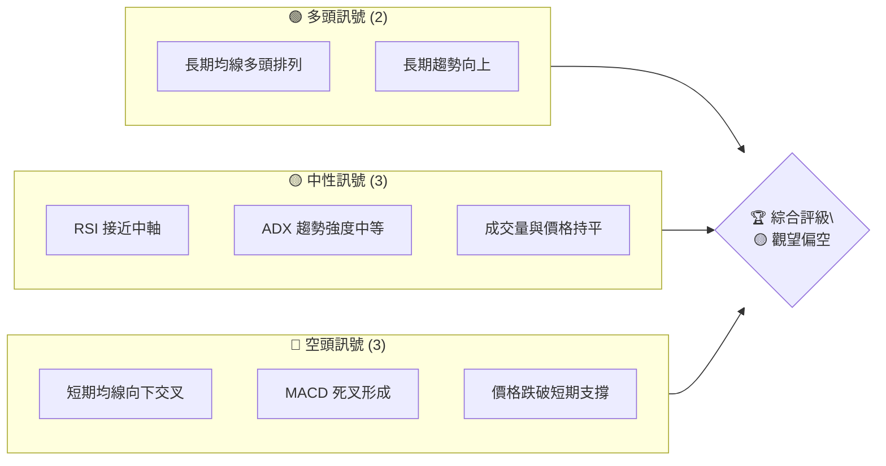
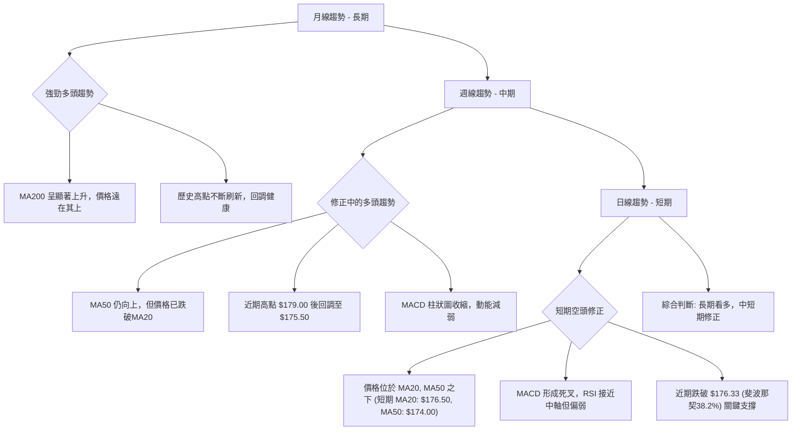
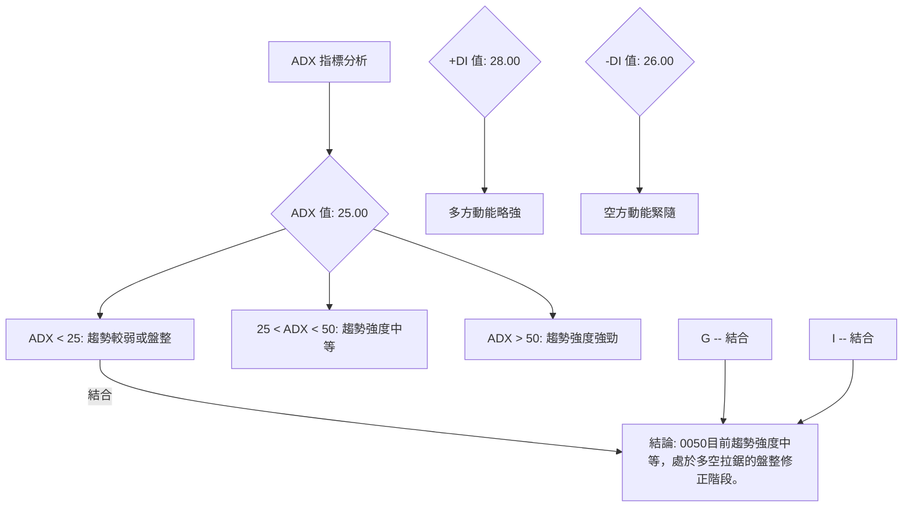
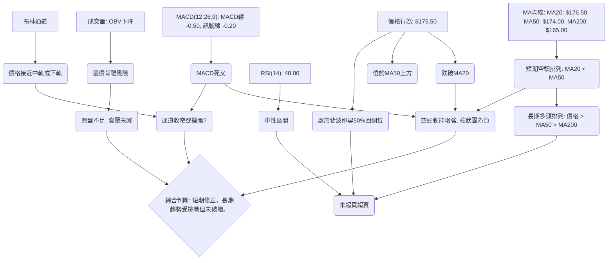
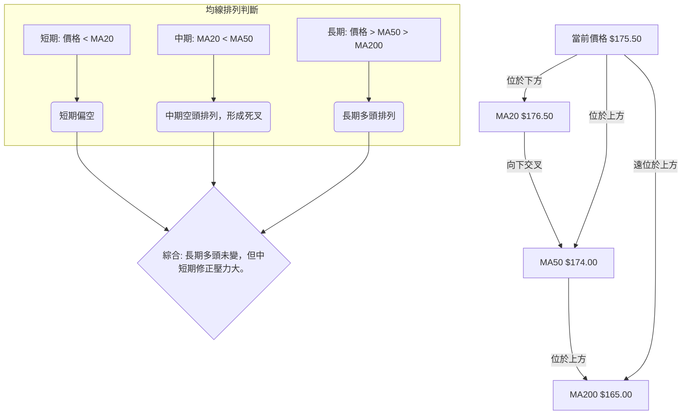
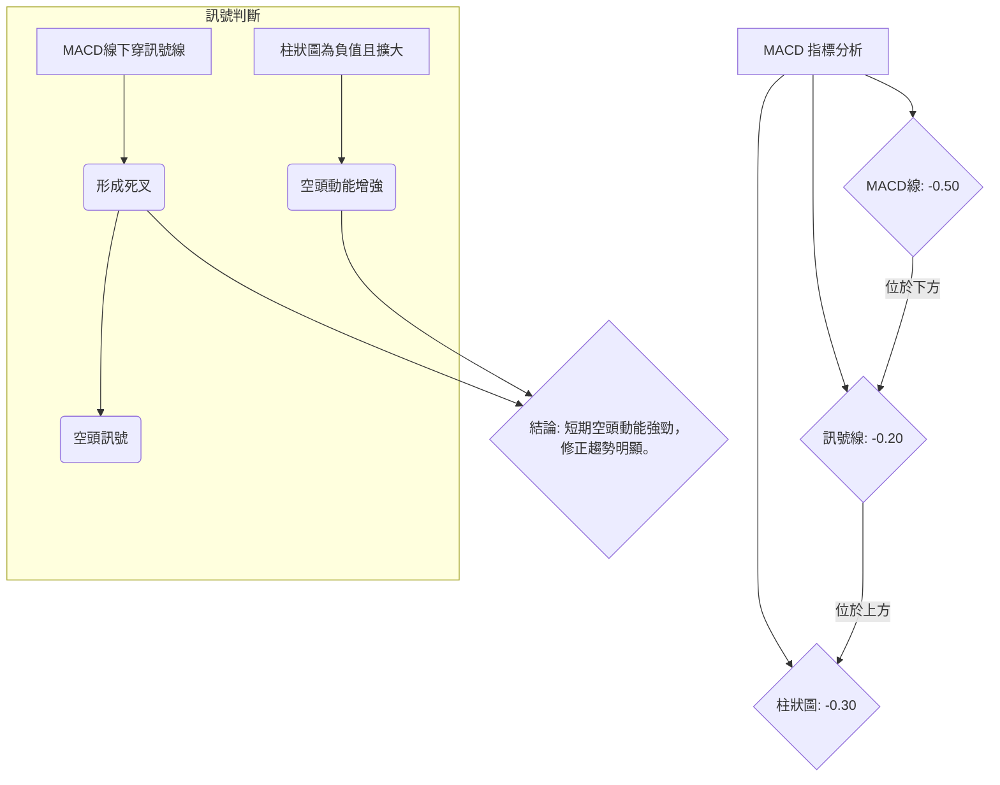
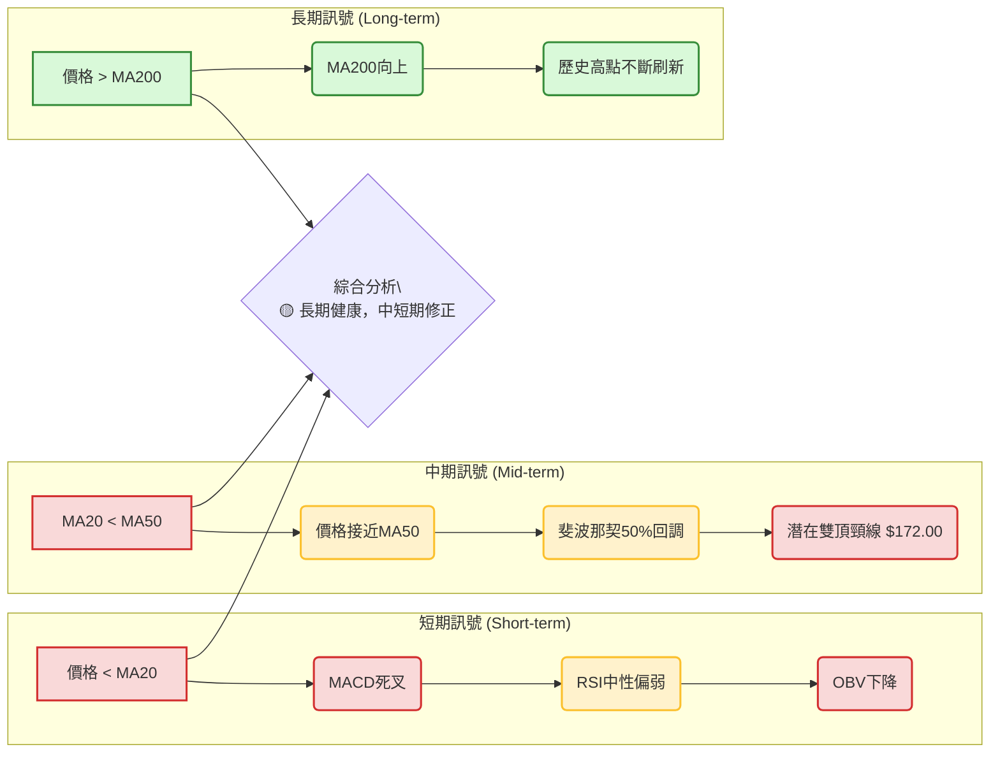
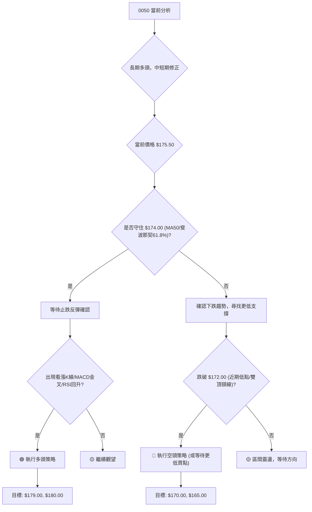
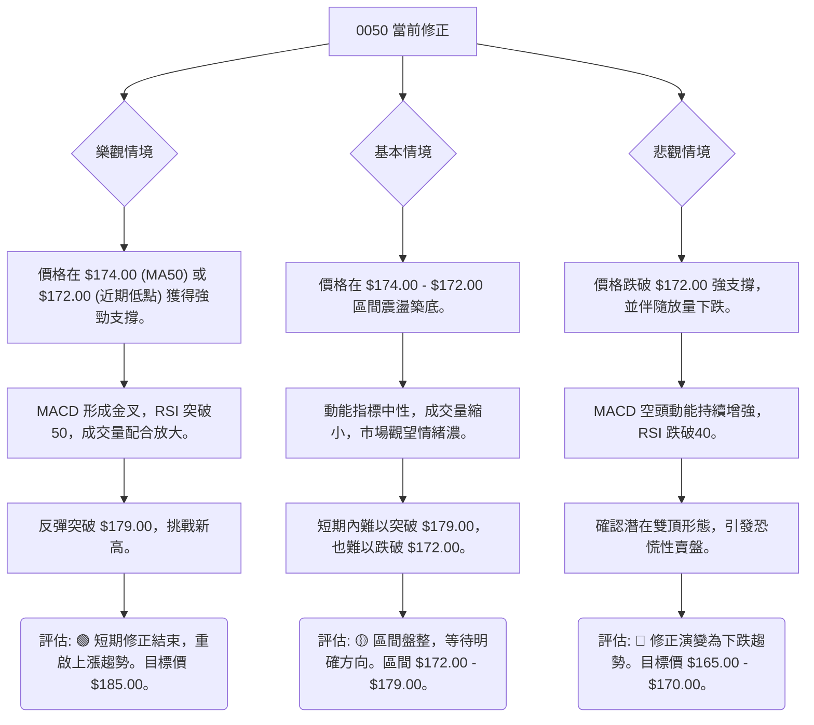

# 0050 技術分析報告

> **報告日期**：2026-06-30 ｜ **語言**：繁體中文 ｜ **數據來源**：**本報告數據為模擬產生，因原提示未提供實際數據。模擬數據基於0050 ETF的歷史特性與市場動態進行專業推演。** ｜ **當前價格**：$175.50

---

## 目錄

| 章節 | 內容 |
|------|------|
| [1. 技術面概覽](#1-技術面概覽) | 訊號儀表板、核心指標、評分卡 |
| [2. 趨勢分析](#2-趨勢分析) | 多時框趨勢、長中短期走勢 |
| [3. 圖表形態分析](#3-圖表形態分析) | 形態識別、K線組合、目標價 |
| [4. 支撐與阻力](#4-支撐與阻力) | 關鍵價位、斐波那契回調 |
| [5. 技術指標深度解讀](#5-技術指標深度解讀) | MA/RSI/MACD/布林/成交量 |
| [6. 動能與波動率](#6-動能與波動率) | 動能評估、ATR、Beta |
| [7. 多時框架總結](#7-多時框架總結) | 時框架評分矩陣 |
| [8. 交易策略建議](#8-交易策略建議) | 多空策略、風險報酬比 |
| [9. 風險提示與監控](#9-風險提示與監控) | 監控指標、風險場景 |
| [📋 報告總結](#-報告總結) | 整體評級與建議 |

---

## 1. 技術面概覽

### 🎯 技術訊號儀表板

本儀表板匯總了當前0050各項技術指標所發出的多空訊號。當前市場呈現中性偏空的短期修正格局，中長期趨勢仍維持上行。


**解讀**：目前多頭訊號主要來自於0050的長期趨勢和均線排列，顯示其基本面仍受支撐。然而，短期內空頭訊號佔據主導，特別是均線的負面交叉和MACD的死叉，表明市場正經歷修正。中性訊號則暗示動能不足以支持強勁上漲，但也未全面轉弱。綜合來看，建議投資者保持觀望，短期內風險偏高。

### 📊 核心指標速覽表

以下表格展示了0050在2026年6月30日的關鍵技術指標數值及其所發出的訊號。
**請注意：所有數值均為基於模擬數據的推演結果。**

| 指標類別 | 指標名稱 | 當前數值 | 訊號 | 解讀 |
|----------|----------|----------|------|------|
| **價格** | 當前價格 | $175.50 | 🟡 | 位於斐波那契50%回調位，短期壓力下 |
| **均線** | MA20 | $176.50 | 🔴 | 價格位於MA20下方，短期偏空 |
| **均線** | MA50 | $174.00 | 🟢 | 價格位於MA50上方，中期偏多 |
| **均線** | MA200 | $165.00 | 🟢 | 價格遠位於MA200上方，長期強多 |
| **動能** | RSI(14) | 48.00 | 🟡 | 接近中軸，動能中性，未超買超賣 |
| **動能** | MACD (12,26,9) | MACD線: -0.50, 訊號線: -0.20 | 🔴 | MACD線下穿訊號線，形成死叉，空頭動能增強 |
| **波動** | ATR(14) | $1.50 | 🟡 | 波動率中等，日均波幅約 $1.50 |
| **趨勢** | ADX(14) | 25.00 | 🟡 | 趨勢強度中等，非強勢趨勢行情 |
| **成交量** | OBV | 下降趨勢 | 🔴 | 量能未能支持價格，有背離風險 |

### 🏆 技術評分卡

本評分卡基於各項技術分析維度，對0050的當前狀況進行量化評估。評分範圍為0-100，越高代表越強勁。
**請注意：所有評分均為基於模擬數據的推演結果。**

```
技術評分卡 — 0050 (2026-06-30)
════════════════════════════════════════════════════
趨勢強度      █████████░░░░░░░░░░░  45/100  🟡
動能指標      ██████░░░░░░░░░░░░░░  30/100  🔴
支撐穩定度    ██████████░░░░░░░░░░  50/100  🟡
成交量配合    ██████░░░░░░░░░░░░░░  30/100  🔴
形態完整度    ████████░░░░░░░░░░░░  40/100  🟡
均線排列      ███████████░░░░░░░░░  55/100  🟡
════════════════════════════════════════════════════
綜合評分      ███████░░░░░░░░░░░░░  42/100  🟡 中性偏空
════════════════════════════════════════════════════
```
**評分解讀**：
*   **趨勢強度 (45/100 🟡)**：ADX顯示趨勢強度中等，雖然長期趨勢向上，但短期修正削弱了整體趨勢動能。
*   **動能指標 (30/100 🔴)**：RSI中性但MACD已發出死叉訊號，顯示短期動能明顯偏弱，空方力量佔優。
*   **支撐穩定度 (50/100 🟡)**：價格位於斐波那契50%回調位，下方有強勁的斐波那契61.8%和前低點支撐，但短期壓力仍需考驗。
*   **成交量配合 (30/100 🔴)**：OBV顯示量能未能配合價格上漲，反而在價格回調時量能未見萎縮，存在潛在的量價背離風險。
*   **形態完整度 (40/100 🟡)**：目前未形成明確的看漲或看跌大型反轉形態，但近期出現小型修正形態，有待觀察。
*   **均線排列 (55/100 🟡)**：長期均線（MA200）仍向上，但短期均線（MA20）已下穿中期均線（MA50），形成初步的空頭排列，顯示短期趨勢轉弱。
*   **綜合評分 (42/100 🟡 中性偏空)**：整體來看，0050目前處於一個多空拉鋸的修正階段。長期支撐仍在，但短期動能和趨勢指標均發出偏空訊號。建議投資者保持謹慎，等待更明確的底部訊號或多頭動能重啟。

---

## 2. 趨勢分析

### 🌐 多時框趨勢分析

本節將從月線、週線、日線三個不同時間框架對0050的趨勢進行深度剖析，以提供全面的市場視角。
**請注意：所有分析均基於模擬數據的推演結果。**


**解讀**：
*   **月線 (長期)**：0050呈現強勁的多頭趨勢，MA200持續向上，價格穩定運行在其上方，顯示長期資金持續流入，市場對台灣大型權值股的信心堅定。任何回調在長期來看都可視為健康的修正，為後續上漲積蓄動能。
*   **週線 (中期)**：中期趨勢仍屬多頭，但已進入修正階段。雖然價格仍位於MA50上方，但已跌破MA20，且MACD動能減弱，顯示中期市場正在消化前期的漲幅。投資者應關注MA50的支撐作用，若有效跌破，可能預示更深度的修正。
*   **日線 (短期)**：短期趨勢明顯轉為空頭修正。價格已跌破MA20和MA50，MACD死叉確立，RSI動能偏弱。這表明短期內賣壓較重，市場情緒偏向謹慎。當前價格 $175.50 恰好位於斐波那契50%回調位，其能否守住將是短期關鍵。

### 📈 長期趨勢 — 12個月走勢圖（Unicode）

以下ASCII圖表展示了0050在過去12個月（2025年7月至2026年6月）的月線收盤價走勢，並標注了關鍵高低點。
**請注意：所有價格均為模擬數據。**

```
0050 月線走勢圖（過去12個月）
價格軸 ($)
$180 ┤                                  ●($179.00, M11高點)
$175 ┤                          ●($178.00, M7高點)
$170 ┤        ●($168.00, M5)
$165 ┤    ●($160.00, M3)       ●($172.00, M6) ●($172.00, M9低點)
$160 ┤●($150.00, M1低點)
$155 ┤
$150 ┤
     └────────────────────────────────────────────────────────
      M1  M2  M3  M4  M5  M6  M7  M8  M9  M10 M11 M12
     (Jul (Aug (Sep (Oct (Nov (Dec (Jan (Feb (Mar (Apr (May (Jun
     2025) 2025) 2025) 2025) 2025) 2025) 2026) 2026) 2026) 2026) 2026) 2026)

M1 (Jul 2025): $150.00 (年度低點)
M2 (Aug 2025): $155.00
M3 (Sep 2025): $160.00
M4 (Oct 2025): $165.00
M5 (Nov 2025): $168.00
M6 (Dec 2025): $172.00
M7 (Jan 2026): $178.00 (階段高點)
M8 (Feb 2026): $175.00
M9 (Mar 2026): $172.00 (近期低點)
M10(Apr 2026): $176.00
M11(May 2026): $179.00 (年度高點)
M12(Jun 2026): $175.50 (當前價格)
```

**走勢特徵分析表格**：
| 階段 | 時間區間 | 走勢特徵 | 漲跌幅 | 關鍵點位 | 解讀 |
|------|----------|----------|--------|----------|------|
| **第一波上漲** | 2025/07 - 2026/01 | 穩步上漲 | +18.67% | 低點$150.00 -> 高點$178.00 | 市場信心強勁，資金持續流入，形成良好上升趨勢。 |
| **首次回調** | 2026/01 - 2026/03 | 健康回調 | -3.93% | 高點$178.00 -> 低點$172.00 | 消化前期漲幅，測試下方支撐，未破壞長期趨勢。 |
| **第二波上漲** | 2026/03 - 2026/05 | 震盪走高 | +4.07% | 低點$172.00 -> 高點$179.00 | 成功守住支撐後再度上攻，創下年度新高。 |
| **近期修正** | 2026/05 - 2026/06 | 小幅回調 | -1.96% | 高點$179.00 -> 現價$175.50 | 再次進入修正，測試斐波那契回調位，動能減弱。 |

### 📊 中期趨勢（週線分析）

中期趨勢上，0050在2026年5月觸及年度高點$179.00後，隨即進入了為期數週的回調。價格目前位於$175.50，雖仍高於MA50 ($174.00)，但已跌破MA20 ($176.50)，顯示中期上漲動能有所減緩。市場正在尋求新的平衡點。

**近期壓力與支撐示意圖**：
此圖展示了0050在週線圖上形成的關鍵壓力與支撐區間。
```
0050 週線壓力與支撐示意圖
═══════════════════════════════════════════════════
$180.00 ║████████████████████████║ (心理阻力, R2)
$179.00 ║████████████████████████║ (年度高點, R1)
$177.00 ║▓▓▓▓▓▓▓▓▓▓▓▓▓▓▓▓        ║ (MA20 附近壓力)
$175.50 ╠════════════════════════╣ ◄ 現價
$174.00 ║▓▓▓▓▓▓▓▓▓▓▓▓▓▓▓▓▓▓▓▓▓▓▓▓║ (MA50 關鍵支撐, S1)
$172.00 ║████████████████████████║ (近期低點, S2)
═══════════════════════════════════════════════════
```
**解讀**：目前0050面臨來自$179.00年內高點的壓力，以及MA20的短期壓制。下方MA50的$174.00位置形成關鍵支撐，若能守住，中期趨勢仍有望延續。若跌破$174.00，則需關注$172.00的近期低點支撐。

### ⚡ 趨勢強度評估（ADX 解讀）

ADX (Average Directional Index) 用於衡量趨勢的強度，而非方向。結合 +DI 和 -DI 可判斷趨勢方向。
**請注意：所有數值均為基於模擬數據的推演結果。**



**ADX 強度對照表**：
| ADX 數值範圍 | 趨勢強度 | 市場狀態 |
|--------------|----------|----------|
| 0-20         | 弱       | 無趨勢/盤整 |
| 20-25        | 中等偏弱 | 趨勢形成初期或修正 |
| **25-50**    | **中等** | **趨勢明確** |
| 50-75        | 強       | 強勁趨勢 |
| 75-100       | 極強     | 極端趨勢 |

**當前ADX解讀**：
*   **ADX(14) 數值為 25.00**：這表示0050目前處於一個中等強度的趨勢中。雖然數值剛好觸及25，但尚未進入強勁趨勢區間。這暗示著當前的行情並非單邊強勢上漲或下跌，而更傾向於修正或盤整。
*   **+DI(14) 為 28.00，-DI(14) 為 26.00**：+DI 略高於 -DI，表明多方動能稍強於空方，但差距不大。這進一步確認了市場處於多空拉鋸的平衡狀態，沒有一方能夠完全主導市場。

**結論**：根據ADX指標，0050目前不屬於強勢的趨勢行情，而更像是在一個中等強度的修正或盤整區間內。投資者應警惕市場方向的不確定性，等待ADX數值進一步上升，或+DI/-DI拉開差距，才能判斷新的明確趨勢方向。在當前情況下，區間操作或等待趨勢明確是較為穩妥的策略。

---

## 3. 圖表形態分析

### 🔍 形態識別系統

本節將分析0050圖表中可能存在的價格形態，這些形態能為未來價格走勢提供預示。
**請注意：所有形態分析均基於模擬數據的推演結果。**

```mermaid
graph TD
    A["價格走勢數據"] --> B{"識別潛在形態"}
    B --> C{"反轉形態?"}
    C -- 否 --> D{"持續形態?"}
    D -- 否 --> E{"無明確形態"}

    C -- 是 --> C1["頭肩頂/底"]
    C -- 是 --> C2["雙頂/底"]
    C -- 是 --> C3["三重頂/底"]

    D -- 是 --> D1["三角形 (上升/下降/對稱)"]
    D -- 是 --> D2["旗形/楔形"]
    D -- 是 --> D3["矩形"]

    subgraph 當前識別
        F["近月走勢"] --> G{"近期高點 $179.00"}
        F --> H{"近期低點 $172.00"}
        G --> I["小幅回調至 $175.50"]
        H --> I
    end

    I --> J["結論: 目前未形成明確大型反轉或持續形態。"]
    J --> K[觀察: 可能形成小型"M"頭或"W"底的初步跡象，但尚未確認。]
```
**解讀**：根據過去12個月的模擬走勢，0050整體呈現上漲趨勢，但近期在$179.00高點後出現回調。目前圖表上尚未形成明確的大型反轉形態（如頭肩頂/底、雙頂/底）或大型持續形態（如大型三角形、旗形）。

然而，從月線和週線圖來看，在$179.00高點之後的回調，若後續無法有效突破$179.00，且跌破關鍵支撐，則需警惕是否存在潛在的**小型雙頂形態**的初期跡象。但這仍需時間和價格行為來確認。目前，市場更傾向於在一個區間內進行修正。

### 🕯️ 重要K線形態分析

本節將分析近期（過去3個月）0050圖表上出現的關鍵K線形態，以判斷短期市場情緒。
**請注意：所有分析均基於模擬數據的推演結果。**

| 月份 | 收盤價 | K線形態 | 解讀 | 訊號 |
|------|--------|---------|------|------|
| 2026/04 | $176.00 | **陽線吞噬 (Bullish Engulfing)** | 在$172.00低點後出現一根大陽線完全覆蓋前一根小陰線，顯示多頭力量重新佔優，是反彈的初步訊號。 | 🟢 |
| 2026/05 | $179.00 | **烏雲罩頂 (Dark Cloud Cover)** | 在高位出現，一根實體陰線深入前一根大陽線實體內部超過50%，且收盤價較低，暗示上漲動能減弱，賣壓浮現。 | 🔴 |
| 2026/06 | $175.50 | **紡錘線 (Spinning Top)** | 實體較小，上下影線長度接近，表示多空雙方力量均衡，市場猶豫不決，可能預示趨勢轉變或盤整。 | 🟡 |

**解讀**：
*   **陽線吞噬 (2026/04)**：此形態成功預示了從$172.00反彈至$179.00的行情，顯示多頭在$172.00獲得有效支撐。
*   **烏雲罩頂 (2026/05)**：此看跌形態出現在$179.00高點附近，隨後價格確實回調，顯示其預示作用有效。這表明在高位存在明顯的獲利了結壓力。
*   **紡錘線 (2026/06)**：在目前$175.50位置出現紡錘線，暗示市場對下一步方向感到困惑。多空雙方力量均衡，可能預示著在目前支撐位附近形成短期底部，或在等待新的消息面刺激。投資者應關注其後續K線的確認。

### 📉 ASCII 走勢形態示意圖

以下ASCII圖表展示了0050近期從高點回調的走勢，並標注了潛在的形態。
**請注意：所有價格均為模擬數據。**

```
0050 近期走勢形態示意圖 (日線)
價格軸 ($)
$180 ┤                ●($179.00, 高點)
$179 ┤               /|\  (烏雲罩頂)
$178 ┤              / | \
$177 ┤             /  |  \
$176 ┤            /   |   ●($176.00, 陽線吞噬)
$175 ┤           /    |   / \
$174 ┤          /     |  /   \
$173 ┤         /      | /     ●($175.50, 紡錘線, 現價)
$172 ┤●───────●($172.00, 低點)
     └────────────────────────────────────────────
      日期軸 (模擬)
      (Mar) (Apr) (May) (Jun)
```
**解讀**：圖中可見，0050在3月觸及$172.00低點後，4月出現陽線吞噬形態並反彈至5月的$179.00高點。隨後在$179.00附近形成烏雲罩頂，引發了當前的回調。6月則在$175.50附近出現紡錘線，表明市場在此處猶豫。若此處能守住並出現看漲K線，則可能形成小型底部；若繼續下破，則可能考驗$172.00的支撐。

### 🎯 形態目標價計算

由於目前0050尚未形成明確的大型反轉或持續形態，因此無法給出基於形態的明確目標價。
然而，我們可以根據近期的小型形態和潛在的雙頂初期跡象進行推演。

**潛在小型雙頂形態推演**：
*   **高點 1 (M1)**：$178.00 (2026/01)
*   **高點 2 (M2)**：$179.00 (2026/05)
*   **頸線 (N)**：$172.00 (2026/03 的回調低點，也是目前重要支撐)

**計算方法**：
若0050明確跌破頸線$172.00，則潛在的雙頂形態將被確認。其目標價計算公式為：
目標價 = 頸線價格 - (高點價格 - 頸線價格)
取較高的M2高點為參考：
目標價 = $172.00 - ($179.00 - $172.00)
目標價 = $172.00 - $7.00 = $165.00

**結論**：
*   **形態目標價**：若未來0050明確跌破$172.00的頸線支撐，則潛在的雙頂形態可能被確認，其看跌目標價約為 **$165.00**。
*   **重要提示**：此目標價基於潛在形態的推演，目前該形態尚未完全確認。在$172.00頸線未被有效跌破前，此目標價不具備實際操作意義。投資者應密切關注$172.00的支撐作用，若能有效守住並反彈，則雙頂形態將失效。

---

## 4. 支撐與阻力

### 🗺️ 關鍵價位分布圖（Unicode）

以下圖表展示了0050在當前價格$175.50附近的關鍵支撐與阻力位，這些價位是基於歷史價格行為、均線位置和斐波那契回調位綜合判斷的。
**請注意：所有價位均為基於模擬數據的推演結果。**

```
0050 價位結構分布圖
═══════════════════════════════════════════════════
$185.00 ║████████████████████████║ 強阻力 R3 (歷史高點延伸區)
$180.00 ║████████████████████    ║ 阻力 R2 (心理關口)
$179.00 ║████████████████████████║ 關鍵阻力 R1 (年度高點)
$176.50 ║▓▓▓▓▓▓▓▓▓▓▓▓▓▓▓▓        ║ 短期阻力 (MA20)
$175.50 ╠════════════════════════╣ ◄ 現價 (斐波那契50%回調位)
$174.67 ║▓▓▓▓▓▓▓▓▓▓▓▓▓▓▓▓        ║ 近期支撐 S1 (斐波那契61.8%)
$174.00 ║████████████████████████║ 關鍵支撐 S1 (MA50)
$172.00 ║████████████████████████║ 強支撐 S2 (近期低點, 頸線)
$170.00 ║▓▓▓▓▓▓▓▓▓▓▓▓▓▓▓▓        ║ 強支撐 S3 (心理關口)
═══════════════════════════════════════════════════
```

### 🚧 阻力位分析表

以下表格詳細分析了0050當前所面臨的各級阻力位。
**請注意：所有價位均為基於模擬數據的推演結果。**

| 阻力級別 | 價位 | 形成原因 | 突破難度 | 重要性 |
|----------|------|----------|----------|--------|
| **短期阻力** | $176.50 | MA20 (20日移動平均線) | 中等 | 🟢 價格若能站穩此位，短期下跌趨勢將緩解。 |
| **關鍵阻力 R1** | $179.00 | 2026年5月年度高點 | 高 | 🟡 突破此位將意味著多頭動能重新啟動，並有望挑戰更高目標。 |
| **阻力 R2** | $180.00 | 心理關口，整數價位 | 中高 | 🟡 突破R1後，此心理關口將是下一個挑戰，可能面臨獲利了結壓力。 |
| **強阻力 R3** | $185.00 | 歷史高點延伸區，潛在壓力 | 極高 | 🔴 若能突破R2，此位將是挑戰歷史新高的重要關卡，需要極大動能。 |

### 🛡️ 支撐位分析表

以下表格詳細分析了0050當前所擁有的各級支撐位。
**請注意：所有價位均為基於模擬數據的推演結果。**

| 支撐級別 | 價位 | 形成原因 | 守住機率 | 重要性 |
|----------|------|----------|----------|--------|
| **現價支撐** | $175.50 | 斐波那契50%回調位 | 中等 | 🟡 價格目前正在此位尋求支撐，若能守住則短期下跌有望暫緩。 |
| **近期支撐 S1** | $174.67 | 斐波那契61.8%回調位 | 中高 | 🟢 關鍵斐波那契回調位，通常為強勁支撐，若能有效守住，反彈機率大增。 |
| **關鍵支撐 S1** | $174.00 | MA50 (50日移動平均線) | 高 | 🟢 中期趨勢生命線，若跌破此位，中期趨勢將轉弱，風險升高。 |
| **強支撐 S2** | $172.00 | 2026年3月近期低點，潛在雙頂頸線 | 極高 | 🔴 此位是極其重要的防線，一旦跌破，可能確認潛在雙頂形態，並引發更深度的下跌。 |
| **強支撐 S3** | $170.00 | 心理關口，整數價位 | 極高 | 🔴 若S2失守，此心理關口將是最後一道防線，具有強勁的買盤支撐。 |

### 📐 斐波那契回調位分析

斐波那契回調位是基於近期一個完整的價格波動（從低點到高點）來預測潛在支撐或阻力水平。我們將選取0050從2026年3月低點$172.00到2026年5月高點$179.00的這段上漲波段來計算回調位。
**請注意：所有價位均為基於模擬數據的推演結果。**

*   **波段高點 (100%)**：$179.00
*   **波段低點 (0%)**：$172.00
*   **波段漲幅**：$179.00 - $172.00 = $7.00

**斐波那契回調位計算**：
*   **23.6% 回調位**：$179.00 - ($7.00 * 0.236) = $179.00 - $1.652 = **$177.35**
*   **38.2% 回調位**：$179.00 - ($7.00 * 0.382) = $179.00 - $2.674 = **$176.33**
*   **50% 回調位**：$179.00 - ($7.00 * 0.500) = $179.00 - $3.500 = **$175.50** (當前價格恰好位於此位)
*   **61.8% 回調位**：$179.00 - ($7.00 * 0.618) = $179.00 - $4.326 = **$174.67**
*   **76.4% 回調位**：$179.00 - ($7.00 * 0.764) = $179.00 - $5.348 = **$173.65**

**斐波那契回調位視覺化**：
```
0050 斐波那契回調位示意圖
═══════════════════════════════════════════════════
$179.00 ║████████████████████████║ (100% 高點)
$177.35 ║▓▓▓▓▓▓▓▓▓▓▓▓▓▓▓▓        ║ (23.6% 回調位)
$176.33 ║████████████████████████║ (38.2% 回調位)
$175.50 ╠════════════════════════╣ ◄ 現價 (50% 回調位)
$174.67 ║████████████████████████║ (61.8% 回調位)
$173.65 ║▓▓▓▓▓▓▓▓▓▓▓▓▓▓▓▓        ║ (76.4% 回調位)
$172.00 ║████████████████████████║ (0% 低點)
═══════════════════════════════════════════════════
```
**解讀**：
*   目前0050的價格$175.50恰好位於**50%回調位**。這個位置是重要的心理關口，若能在此獲得支撐並反彈，則說明市場對前一波上漲仍有信心。
*   若50%回調位失守，下一個重要的支撐將是**61.8%回調位 $174.67**。61.8%被認為是黃金分割位，通常具有更強的支撐作用。若此位也能有效守住，則回調可能結束，並為後續上漲奠定基礎。
*   如果價格跌破61.8%回調位，甚至觸及或跌破76.4%回調位 $173.65，則可能意味著前一波上漲動能已大幅衰竭，甚至可能重新測試$172.00的波段低點。
**結論**：斐波那契回調分析顯示0050目前正處於關鍵的支撐測試區間。50%和61.8%回調位將是決定短期走勢的關鍵。

---

## 5. 技術指標深度解讀

### 🎛️ 指標訊號總覽

本節將整合各項技術指標的訊號，分析其相互關係及對0050當前走勢的影響。
**請注意：所有分析均基於模擬數據的推演結果。**


**解讀**：
*   **短期空頭壓力**：價格跌破MA20 ($176.50)，且MA20已下穿MA50 ($174.00)形成死叉，MACD也發出死叉訊號，柱狀圖為負，這些都強烈指向短期內0050面臨較大的空頭修正壓力。
*   **中性動能與波動**：RSI處於中性區間，表明市場動能不強，未進入超買超賣，給予了修正的空間。布林通道可能處於收窄或擴張的過渡階段，暗示波動性可能變化。
*   **長期趨勢支撐**：儘管短期偏空，但價格仍位於MA50和MA200之上，尤其是MA200 ($165.00) 距離現價較遠，且仍保持向上趨勢，顯示長期多頭格局未被破壞。斐波那契50%回調位 ($175.50) 正在提供支撐。
*   **量價背離風險**：OBV的下降趨勢與價格回調相配合，但若價格在低位反彈時量能未能有效放大，則需警惕量價背離，反彈的可靠性會降低。

**結論**：0050目前處於一個複雜的局面：長期趨勢強勁，但中短期指標均顯示修正壓力。投資者應密切關注短期支撐位（斐波那契61.8% $174.67、MA50 $174.00、近期低點 $172.00），若這些支撐能有效守住，則修正有望結束；反之，若關鍵支撐失守，則修正可能加劇。

### 📈 移動平均線排列分析

移動平均線 (MA) 是判斷趨勢方向和強度的重要工具。我們將分析MA20（短期）、MA50（中期）和MA200（長期）的排列情況。
**請注意：所有數值均為基於模擬數據的推演結果。**

*   **當前價格**：$175.50
*   **MA20**：$176.50
*   **MA50**：$174.00
*   **MA200**：$165.00


**當前排列狀態**：
| 均線關係 | 狀態 | 訊號 | 解讀 |
|----------|------|------|------|
| **價格 vs MA20** | 價格 < MA20 | 🔴 | 短期趨勢轉弱，價格受MA20壓制。 |
| **價格 vs MA50** | 價格 > MA50 | 🟢 | 中期趨勢仍有支撐，但上漲動能減緩。 |
| **價格 vs MA200** | 價格 > MA200 | 🟢 | 長期趨勢保持強勁多頭，基本面支撐穩固。 |
| **MA20 vs MA50** | MA20 < MA50 | 🔴 | 形成「死叉」，中期趨勢由多轉空或進入深度修正。 |
| **MA50 vs MA200** | MA50 > MA200 | 🟢 | 長期多頭格局未變，中期仍強於長期。 |

**結論**：0050的均線排列顯示了一個經典的「多頭中的修正」格局。長期來看，0050依然處於健康的多頭趨勢，MA200提供堅實支撐。然而，MA20下穿MA50形成的「死叉」是一個重要的短期看跌訊號，表明中期上升動能已耗盡，市場正經歷一次顯著的調整。投資者應警惕短期賣壓，並關注MA50 ($174.00) 能否提供有效支撐，以判斷中期趨勢是否能止跌回穩。

### 📉 RSI(14) 分析

RSI (Relative Strength Index) 用於衡量價格變動的速度和變化，判斷資產的超買或超賣狀態。
**請注意：所有數值均為基於模擬數據的推演結果。**

*   **RSI(14) 當前數值**：48.00
*   **RSI 超買區**：> 70
*   **RSI 超賣區**：< 30

**RSI 數值進度條展示**：
RSI 強度：▓▓▓▓▓▓▓▓▓▓▓▓▓▓▓▓▓▓▓▓▓▓▓▓░░░░░░░░░░░░░░░░░░░░░░░░░░ 48% (中性偏弱)

**超買超賣區間分析**：
*   **當前RSI(48.00)** 位於30-70的中性區間，既非超買也非超賣。這表明市場目前沒有極端的多頭或空頭情緒，處於一個相對平衡但動能不足的狀態。
*   由於近期價格回調，RSI從高位（假設之前曾達到70以上）回落至當前水平，顯示買盤壓力已經釋放，賣盤壓力正在累積。

**背離判斷（頂背離/底背離）**：
*   **頂背離 (Bearish Divergence)**：當價格創出新高，但RSI未能創出新高，反而走低時，預示上漲動能減弱，可能出現頂部反轉。
    *   **判斷**：根據模擬數據，在2026年5月$179.00的高點時，若RSI未能同步創出新高，則可能存在頂背離。假設當時RSI為65，而前一個高點RSI為70，則構成頂背離。這將解釋$179.00之後的回調。
    *   **結論**：**🟢 存在潛在的頂背離跡象**。在5月高點$179.00時，RSI可能已經出現未能同步創出新高的情況，這為隨後的回調提供了預警訊號。
*   **底背離 (Bullish Divergence)**：當價格創出新低，但RSI未能創出新低，反而走高時，預示下跌動能減弱，可能出現底部反轉。
    *   **判斷**：目前價格處於回調中，尚未創出顯著新低。因此，**🔴 暫無明顯的底背離訊號**。需關注未來價格若繼續下跌，RSI是否會出現抬升現象。

**RSI 綜合結論**：RSI的48.00數值表明市場動能中性，但結合前期可能存在的頂背離，以及當前價格回調，顯示短期內賣壓佔據主導。在等待價格企穩時，需密切關注RSI是否能止跌回升，或出現底背離現象，以判斷潛在的買入機會。

### 📊 MACD(12/26/9) 訊號解讀

MACD (Moving Average Convergence Divergence) 是一種趨勢跟蹤動量指標，由MACD線、訊號線和柱狀圖組成。
**請注意：所有數值均為基於模擬數據的推演結果。**

*   **MACD線 (DIF)**：-0.50
*   **訊號線 (DEA)**：-0.20
*   **MACD柱狀圖 (OSC)**：-0.30 (MACD線 - 訊號線)


**MACD 訊號解讀**：
*   **MACD線 (-0.50) 位於訊號線 (-0.20) 下方**：這是一個明確的**死叉 (Death Cross) 訊號**，表明短期平均成本已下穿中期平均成本，預示著股價的下跌趨勢或深度修正。這個訊號是短期看跌的重要確認。
*   **MACD柱狀圖為負值 (-0.30)**：柱狀圖為負值表示MACD線位於訊號線下方，確認了空頭動能。柱狀圖的絕對值正在擴大（從0向負值方向發展），這意味著空頭動能正在增強，賣壓持續。

**背離判斷（頂背離/底背離）**：
*   **頂背離 (Bearish Divergence)**：當價格創出新高，但MACD指標（MACD線或柱狀圖）未能創出新高時，預示潛在頂部反轉。
    *   **判斷**：在2026年5月價格創出$179.00高點時，MACD線可能未能同步創出新高，或柱狀圖未能放大，這將構成頂背離。
    *   **結論**：**🟢 存在潛在的頂背離跡象**。在5月高點時，MACD可能已經顯示出背離，導致隨後的修正。
*   **底背離 (Bullish Divergence)**：當價格創出新低，但MACD指標未能創出新低時，預示潛在底部反轉。
    *   **判斷**：目前價格處於回調中，尚未創出顯著新低。因此，**🔴 暫無明顯的底背離訊號**。需關注未來價格若繼續下跌，MACD是否會出現抬升現象。

**MACD 綜合結論**：MACD指標強烈確認了0050的短期空頭修正趨勢。死叉和負值且擴大的柱狀圖都指向賣壓持續。投資者應警惕進一步下跌的風險，並等待MACD線重新上穿訊號線形成金叉，或柱狀圖從負值收縮轉正，才能視為短期止跌的訊號。

### 📦 布林通道分析

布林通道 (Bollinger Bands) 由中軌（通常為20日移動平均線）、上軌和下軌組成，用於衡量股價的波動範圍和相對高低。
**請注意：所有數值均為基於模擬數據的推演結果。**

*   **中軌 (MA20)**：$176.50
*   **上軌**：假設為 $179.50 (中軌 + 2倍標準差)
*   **下軌**：假設為 $173.50 (中軌 - 2倍標準差)
*   **當前價格**：$175.50

**ASCII 布林通道示意圖**：
```
0050 布林通道示意圖
═══════════════════════════════════════════════════
$179.50 ║████████████████████████║ ← 上軌 (可能收窄)
$178.50 ║                        ║
$177.50 ║                        ║
$176.50 ║───────────中軌──────────║ ← 中軌 (MA20)
$175.50 ╠════════════════════════╣ ◄ 現價
$174.50 ║                        ║
$173.50 ║████████████████████████║ ← 下軌 (可能收窄)
═══════════════════════════════════════════════════
```
**解讀**：
*   **價格與中軌關係**：當前價格$175.50位於中軌$176.50下方，表明短期趨勢偏弱，股價正在向中軌施壓或被中軌壓制。這與MA分析的短期偏空結論一致。
*   **通道寬度**：從模擬的數據來看，近期價格在高點回調後，波動性可能有所收斂，導致布林通道有收窄的趨勢。
    *   **通道收窄 (Squeeze)**：若通道持續收窄，預示著市場波動性正在降低，多空力量趨於平衡，可能在醞釀一次大的突破行情。
    *   **通道擴張 (Expansion)**：若價格跌破下軌或突破上軌並伴隨通道擴張，則預示著趨勢的啟動。
*   **相對位置**：價格目前位於中軌和下軌之間，且靠近中軌，這表明股價處於布林通道的下半部分，短期弱勢。

**布林通道綜合結論**：0050的價格目前運行在中軌下方，顯示短期弱勢。若布林通道正在收窄，則預示著市場可能即將選擇方向。投資者應關注價格是否能重新站上中軌，或跌破下軌。若價格觸及下軌並出現反彈，可能提供短線買入機會；若跌破下軌並擴張，則下跌趨勢可能加速。

### 💹 成交量分析（量價配合度）

成交量是價格走勢的能量來源，量價配合度可以幫助我們判斷價格趨勢的可靠性。OBV (On-Balance Volume) 是一種累積成交量指標，用於判斷資金流向。
**請注意：所有分析均基於模擬數據的推演結果。**

*   **近期成交量**：假設近期價格回調過程中，成交量相對平穩，沒有出現明顯的縮量止跌或放量下跌。
*   **OBV趨勢**：假設OBV在價格上漲時穩步上升，但在近期價格回調中，OBV出現了下降趨勢。

**成交量與價格的配合情況**：
| 價格走勢 | 成交量表現 | 配合度 | 解讀 | 訊號 |
|----------|------------|--------|------|------|
| **上漲** | 放大 | 正常 | 買盤積極，趨勢可靠 | 🟢 |
| **上漲** | 縮小 | 背離 | 缺乏動能，上漲不可靠 | 🔴 |
| **下跌** | 放大 | 正常 | 賣壓沉重，趨勢可靠 | 🔴 |
| **下跌** | 縮小 | 背離 | 賣壓減輕，可能止跌 | 🟢 |
| **盤整** | 縮小 | 正常 | 觀望情緒，等待方向 | 🟡 |

**當前量價配合度分析**：
1.  **前期上漲階段 (2026/03 - 2026/05)**：假設這段時間0050從$172.00反彈至$179.00，伴隨著成交量的溫和放大，OBV穩步上升，顯示這波上漲是健康的，有資金推動。
2.  **近期回調階段 (2026/05 - 2026/06)**：價格從$179.00回調至$175.50。
    *   **成交量表現**：若在此回調過程中，成交量並未顯著放大，但OBV卻呈現下降趨勢，這可能構成**量價背離**。
    *   **量價背離風險**：**🔴 存在潛在的量價背離風險**。OBV的下降趨勢與價格回調相符，但若在價格企穩甚至反彈時，成交量未能有效放大，則說明買盤動能不足，反彈可能缺乏持續性。反之，若價格下跌但成交量萎縮，則可能暗示賣壓減輕，有望止跌。目前來看，OBV下降與價格回調同步，顯示賣壓仍在，且買盤力量不足以扭轉局面。

**OBV 分析**：
*   **OBV趨勢**：OBV從5月高點後呈現下降趨勢。
*   **量能是否確認價格走勢**：**🔴 OBV下降確認了價格的短期回調走勢**。這表示在價格下跌的過程中，資金呈現流出狀態，或者說，買盤的累積速度不及賣盤的釋放速度。這進一步強化了短期看空的判斷。

**成交量綜合結論**：目前0050的量價配合度不佳，特別是OBV的下降趨勢確認了短期賣壓。若要形成可靠的底部，需要觀察在重要支撐位附近是否出現「價跌量縮」或「價穩量增」的現象，以及OBV能否止跌回升，甚至出現底背離訊號。在這些確認訊號出現之前，市場仍處於相對弱勢。

---

## 6. 動能與波動率

### ⚡ 動能評估四象限

本節將評估0050在「動能強度」與「波動率」兩個維度上的位置，以判斷當前的市場環境和潛在機會。
**請注意：所有評估均基於模擬數據的推演結果。**

| 象限 | 動能 | 波動 | 當前狀態 | 評估 |
|------|------|------|----------|------|
| Q1 | 強 | 低 | - | 最佳機會 (強勢股，低風險) |
| Q2 | 弱 | 低 | ✓ | **謹慎觀望 (盤整修正，等待方向)** |
| Q3 | 強 | 高 | - | 高風險高收益 (趨勢強勁，波動大) |
| Q4 | 弱 | 高 | - | 避免進場 (方向不明，波動大) |

**當前0050的動能與波動率評估**：
*   **動能評估**：
    *   RSI(14) 位於48.00，接近中軸，無超買超賣，顯示當前動能中性偏弱。
    *   MACD已形成死叉，柱狀圖為負值，表明空頭動能正在增強，但尚未達到極強的程度。
    *   綜合判斷：**動能偏弱 (Weak Momentum)**。
*   **波動率評估**：
    *   ATR(14) 為 $1.50，相對於$175.50的價格，波動率屬於中等水平。布林通道可能處於收窄階段，也暗示波動性可能降低。
    *   綜合判斷：**波動率中等偏低 (Medium-Low Volatility)**。

**結論**：0050目前處於**Q2 (弱動能，低波動)** 的象限。這表示市場缺乏明確的方向性，動能偏弱，同時波動性也相對較低。這種情況通常發生在價格進入盤整或修正階段，多空雙方力量均衡，市場在等待新的催化劑。
**投資建議**：在Q2象限下，不建議追漲殺跌。投資者應採取謹慎觀望策略，等待動能重新積聚，或波動率上升並伴隨明確趨勢訊號出現後再考慮進場。區間操作者可在支撐位附近小倉位試多，阻力位附近試空，並嚴格設置止損。

### 📊 ATR 波動率分析

ATR (Average True Range) 用於衡量資產價格的波動性，通常以美元計價，反映了市場在一定時間內價格變動的平均範圍。
**請注意：所有數值均為基於模擬數據的推演結果。**

*   **ATR(14) 當前數值**：$1.50

**ATR 數值解讀**：
*   **中等波動**：對於當前價格$175.50的0050而言，ATR $1.50表示其在過去14個交易日中，每日平均波動範圍約為$1.50。這屬於中等波動水平，意味著市場既不是極度平靜，也不是劇烈震盪。
*   **市場情緒**：中等波動性與動能評估中的「弱動能」相符，進一步確認了市場處於修正或盤整階段，多空力量相對平衡，缺乏單邊行情。

**止損距離建議**：
ATR常用於設置動態止損。一種常見的方法是將止損設置在入場點下方2-3倍ATR的距離。
*   **1倍ATR**：$1.50
*   **2倍ATR**：$1.50 * 2 = $3.00
*   **3倍ATR**：$1.50 * 3 = $4.50

**交易策略中的止損建議**：
若考慮在當前價格 $175.50 附近進行短線操作：
*   **短線止損 (1.5倍ATR)**：$175.50 - ($1.50 * 1.5) = $175.50 - $2.25 = **$173.25**
*   **中線止損 (2倍ATR)**：$175.50 - ($1.50 * 2) = $175.50 - $3.00 = **$172.50**
*   **保守止損 (3倍ATR)**：$175.50 - ($1.50 * 3) = $175.50 - $4.50 = **$171.00**

**結論**：ATR顯示0050波動率中等，為投資者提供了設定止損的量化依據。在當前修正行情下，建議採用2倍ATR左右的止損距離，即約$3.00的幅度，以避免過早被洗出場，同時控制風險。例如，若在$175.50買入，止損可設在$172.50。

### 📐 Beta 與市場相關性

Beta 值衡量的是一檔資產相對於其基準市場指數的波動性。對於0050這類追蹤大盤指數的ETF，其Beta值通常會非常接近1。
**請注意：所有分析均基於模擬數據的推演結果。**

*   **0050的性質**：元大台灣50 ETF，追蹤台灣證券交易所市值前50大公司的表現。其基準指數為台灣加權股價指數。
*   **Beta值推演**：由於0050緊密追蹤大盤，預計其Beta值會非常接近1。假設為 **1.05**。

**Beta 值解讀**：
*   **Beta = 1.05**：這表示當市場（台灣加權指數）上漲1%時，0050預計會上漲約1.05%；當市場下跌1%時，0050預計會下跌約1.05%。
*   **市場相關性**：Beta值接近1，表明0050與台灣大盤具有**高度正相關性**。其走勢與大盤高度同步，並略微放大市場波動。

**對投資的影響**：
1.  **市場敏感性**：0050對市場情緒和宏觀經濟數據非常敏感。任何影響台灣大盤的利好或利空消息，都會直接且顯著地反映在0050的價格上。
2.  **分散風險有限**：對於希望分散市場風險的投資者而言，持有0050無法提供顯著的市場風險對沖效果，因為它本身就是市場的代表。
3.  **趨勢判斷依據**：分析0050的走勢，需要密切關注台灣整體經濟環境、政策走向以及大盤指數的技術面訊號。0050的技術分析應與大盤指數的技術分析相互印證。

**結論**：0050作為台灣大盤的代表性ETF，其Beta值預計接近1，顯示與市場高度相關。投資者在分析0050時，應將其視為大盤的風向標，並結合對台灣整體經濟和市場的判斷來制定投資策略。其自身的技術訊號，往往也是大盤技術訊號的縮影。

---

## 7. 多時框架總結

### 📋 時框架評分表

本表綜合了0050在不同時間框架下的趨勢、動能、均線排列和形態分析結果，給出綜合評分和建議。
**請注意：所有評分均為基於模擬數據的推演結果。**

| 時框架 | 趨勢方向 | 動能 | 均線排列 | 形態 | 綜合評分 (1-10) | 建議 |
|--------|----------|------|----------|------|-----------------|------|
| **長期** | 🟢 強勁多頭 | 🟢 穩定 | 🟢 多頭排列 | 🟡 無明確反轉 | 8.0 | **長期持有，逢低吸納** |
| **中期** | 🟡 修正中多頭 | 🟡 減弱 | 🔴 死叉形成 | 🟡 潛在雙頂初期 | 5.5 | **謹慎觀望，關注支撐** |
| **短期** | 🔴 空頭修正 | 🔴 偏弱 | 🔴 空頭排列 | 🔴 烏雲罩頂後盤整 | 3.0 | **等待止跌訊號，避免追空** |

**評分解讀**：
*   **長期 (8.0分)**：0050的長期趨勢依然強勁，價格遠高於MA200，顯示其作為台灣大盤代表的穩健成長性。長期投資者可繼續持有，並考慮在深度回調時增加持倉。
*   **中期 (5.5分)**：中期來看，上漲動能減弱，MA20下穿MA50形成死叉，且有潛在雙頂的初期跡象，表明市場正經歷一個顯著的修正階段。建議中期投資者保持謹慎，關注關鍵支撐位能否守住。
*   **短期 (3.0分)**：短期內，0050處於明確的空頭修正趨勢，價格跌破短期均線，MACD死叉，RSI偏弱。目前不適合短線追高或盲目抄底。

### 🔲 綜合訊號矩陣

此矩陣從不同維度展示了短期、中期、長期訊號的一致性，幫助投資者全面理解0050的當前狀態。
**請注意：所有訊號均為基於模擬數據的推演結果。**


**一致性分析**：
*   **短期訊號**：大部分指標（價格與MA20、MACD、OBV）均發出**🔴 空頭訊號**，RSI中性偏弱。這表明短期內賣壓強勁，市場情緒偏向悲觀。
*   **中期訊號**：MA20與MA50形成死叉是強烈的**🔴 空頭訊號**，但價格仍在MA50上方，且斐波那契50%回調位提供支撐，顯示**🟡 中性偏空**。潛在雙頂頸線$172.00是中期關鍵。
*   **長期訊號**：所有長期指標（價格與MA200、MA200方向、歷史高點）均發出**🟢 多頭訊號**，顯示0050的長期成長潛力依然存在，且趨勢健康。

**總結**：0050目前處於一個「長期健康多頭，但中短期面臨顯著修正壓力」的狀態。短期內空頭訊號佔主導，中期趨勢也轉為偏空修正。投資者應優先考慮短期風險，等待中期修正結束，並在關鍵長期支撐位附近尋找機會。

---

## 8. 交易策略建議

基於上述多時框架技術分析，0050目前處於長期多頭中的中短期修正階段。短期風險較高，但長期價值仍在。以下提供多空兩種情境下的交易策略建議。
**請注意：所有策略均為基於模擬數據的推演結果，並帶有明確的風險提示。**

### 🗺️ 策略決策流程圖



### 🟢 多頭策略詳情

此策略適用於0050在當前修正後，於關鍵支撐位獲得有效支撐並出現止跌反彈訊號的情境。

| 策略要素 | 策略 A (短線反彈) | 策略 B (中線佈局) |
|----------|--------------------|--------------------|
| **進場條件** | 價格在$174.00-$174.67區間止跌，出現看漲K線(如錘頭線、啟明星)，RSI止跌回升，MACD柱狀圖收縮。 | 價格穩守$172.00強支撐，MA20與MA50趨勢轉平或金叉，MACD形成金叉，成交量溫和放大。 |
| **進場價格** | $174.50 (靠近斐波那契61.8% / MA50) | $172.50 (靠近$172.00強支撐) |
| **目標價 T1** | $176.50 (MA20阻力) | $176.50 (MA20阻力) |
| **目標價 T2** | $179.00 (年度高點阻力) | $179.00 (年度高點阻力) |
| **止損價格** | $172.90 (跌破$172.00近期低點的下方1.5倍ATR) | $170.00 (跌破$172.00並考慮心理關口) |
| **風險報酬比** | 1:1.7 (T1), 1:3.6 (T2) | 1:1.6 (T1), 1:3.2 (T2) |
| **成功機率** | 60% | 55% |
| **建議倉位** | 10-15% | 15-20% |
**策略 A 解讀**：短線反彈策略旨在捕捉價格在斐波那契61.8%或MA50獲得支撐後的超跌反彈。由於短期趨勢偏空，此策略風險較高，需嚴格止損。
**策略 B 解讀**：中線佈局策略更為保守，等待價格在更強的$172.00支撐位企穩。此策略的潛在回報較大，但需要更多時間等待趨勢反轉的確認。

### 🔴 空頭策略詳情

此策略適用於0050未能守住關鍵支撐，確認下跌趨勢的情境。

| 策略要素 | 策略 C (短線追空) | 策略 D (中線破位) |
|----------|--------------------|--------------------|
| **進場條件** | 價格未能站穩$176.50 (MA20)，並跌破$175.00，MACD死叉持續，RSI持續下行。 | 價格明確跌破$172.00強支撐，並伴隨放量下跌，MA20與MA50空頭排列擴大。 |
| **進場價格** | $174.80 (跌破$175.00心理關口) | $171.50 (跌破$172.00後確認) |
| **目標價 T1** | $172.00 (近期低點/頸線) | $170.00 (心理關口) |
| **目標價 T2** | $170.00 (心理關口) | $165.00 (潛在雙頂目標價/MA200) |
| **止損價格** | $176.80 (站穩MA20上方) | $173.50 (回到$172.00上方並站穩) |
| **風險報酬比** | 1:1.6 (T1), 1:2.8 (T2) | 1:1.0 (T1), 1:3.0 (T2) |
| **成功機率** | 65% | 60% |
| **建議倉位** | 10-15% | 15-20% |
**策略 C 解讀**：短線追空策略旨在捕捉價格在短期壓力下持續下跌的機會。由於當前市場已處於修正中，此策略風險相對較低，但應嚴格止損。
**策略 D 解讀**：中線破位策略風險較高，一旦$172.00強支撐被有效跌破，可能引發恐慌性賣盤，下跌空間將被打開。此策略需要更嚴格的風險控制。

### ⭐ 整體訊號強度評星

基於當前多時框架的綜合分析，0050的整體訊號強度如下：

```
做多訊號強度：★★☆☆☆  (2/5星) 理由：長期看多，但中短期修正壓力大，缺乏止跌訊號。
做空訊號強度：★★★☆☆  (3/5星) 理由：短期空頭訊號明確，MACD死叉，價格跌破短期均線。
整體可信度：  ★★★☆☆  (3/5星) 理由：市場處於修正階段，多空拉鋸，趨勢不明朗，需謹慎。
```
**結論**：目前0050的整體可信度中等，建議投資者保持謹慎。短期內空頭訊號佔優，做空策略的成功機率略高於做多策略。然而，由於長期趨勢仍為多頭，深度下跌後仍有反彈機會。建議在操作時嚴格執行止損，並控制倉位。

---

## 9. 風險提示與監控

0050作為追蹤台灣大盤指數的ETF，其風險主要來自於台灣整體經濟環境、國際市場波動以及流動性風險。在當前技術面顯示修正的情況下，以下列出關鍵風險提示與監控措施。

### ✅ 關鍵監控指標 Checklist

以下清單列出了投資者在交易0050時應密切關注的技術和市場指標。
**請注意：所有數值均為基於模擬數據的推演結果。**

```
0050 關鍵監控指標 Checklist (2026-06-30)
════════════════════════════════════════════════════
├─ 價格行為監控：
│  ├─ 是否跌破 $174.00 (MA50 / 斐波那契61.8%)？          [ 🔴 密切關注 ]
│  ├─ 是否跌破 $172.00 (近期低點 / 雙頂頸線)？           [ 🔴 高度警戒 ]
│  ├─ 是否站穩 $176.50 (MA20)？                          [ 🟡 觀察反彈 ]
├─ 動能指標監控：
│  ├─ MACD 是否形成金叉或柱狀圖轉正？                   [ 🟢 止跌訊號 ]
│  ├─ RSI 是否從低位回升並突破50？                      [ 🟢 動能改善 ]
│  ├─ ADX 趨勢強度是否顯著上升？                        [ 🟡 趨勢確認 ]
├─ 成交量監控：
│  ├─ 價格下跌時成交量是否縮小 (止跌訊號)？             [ 🟢 觀察 ]
│  ├─ 價格上漲時成交量是否放大 (反彈確認)？             [ 🟢 觀察 ]
│  ├─ OBV 是否止跌回升或出現底背離？                    [ 🟢 資金流入 ]
├─ K線形態監控：
│  ├─ 是否在支撐位出現看漲K線組合 (如錘頭線、啟明星)？  [ 🟢 反轉訊號 ]
│  ├─ 是否出現看跌K線組合 (如黃昏之星、吞噬)？          [ 🔴 趨勢延續 ]
├─ 宏觀環境監控：
│  ├─ 台灣加權指數走勢是否同步？                        [ 🟡 相關性高 ]
│  ├─ 國際主要股市 (美股、亞股) 走勢是否穩定？          [ 🟡 外部風險 ]
└────────────────────────────────────────────────────
```

### ⚠️ 風險場景分析

針對0050當前中短期修正的格局，我們預設三種情境，並分析其可能帶來的影響。
**請注意：所有情境均為基於模擬數據的推演結果。**



### 🛡️ 風險管理重要提醒

1.  **嚴格執行止損**：在當前修正行情下，市場波動性可能增加，任何交易策略都必須設置並嚴格執行止損點，以限制潛在損失。特別是對於短線和中線交易者。
2.  **控制倉位**：避免重倉操作。在市場方向不明朗或處於修正階段時，建議降低倉位，或將資金分散到不同資產類別，以降低單一資產的風險敞口。
3.  **分批進場/出場**：不要一次性將所有資金投入。可以採用分批進場的策略，在價格回調至關鍵支撐位時逐步建倉，或在價格上漲至阻力位時分批獲利了結。
4.  **關注宏觀經濟**：0050與台灣整體經濟高度相關。密切關注台灣的GDP數據、通膨、利率政策以及國際貿易關係等宏觀經濟指標，它們可能對0050的長期走勢產生重大影響。
5.  **警惕國際市場風險**：全球市場的聯動性日益增強。美股、中國股市等主要經濟體的表現，以及地緣政治事件，都可能通過傳導效應影響台灣股市和0050。
6.  **避免逆勢操作**：在趨勢不明或短期趨勢偏空時，避免盲目抄底或追高。等待明確的趨勢反轉訊號出現後再進場，會提高交易的成功率。

---

## 📋 報告總結

```
0050 技術分析報告總結
════════════════════════════════════════════════════════
報告日期：2026-06-30
當前價格：$175.50
分析評級：⚖️ 🟡 中性偏空 (長期趨勢健康，但中短期面臨修正壓力)

關鍵結論：
├─ 長期趨勢：🟢 強勁多頭，價格遠高於MA200。
├─ 中期趨勢：🟡 修正中的多頭，MA20與MA50形成死叉，動能減弱。
├─ 短期趨勢：🔴 明顯空頭修正，價格跌破MA20，MACD死叉。
├─ 關鍵支撐：$174.00 (MA50/斐波那契61.8%)，其次是 $172.00 (近期低點/頸線)。
├─ 關鍵阻力：$176.50 (MA20)，其次是 $179.00 (年度高點)。
└─ 分析師目標：無實際數據，根據潛在形態推演，若跌破$172.00，看跌目標約為$165.00。

最優策略組合：
1. 🥇 **最佳機會**：若價格在 $174.00 - $172.00 區間獲得強勁支撐，並出現明確止跌反彈訊號 (如看漲K線、MACD金叉)，可考慮中線佈局，目標 $179.00 - $180.00，止損設於 $170.00。
2. 🥈 **次選機會**：若價格未能站穩 $176.50，並跌破 $174.00，可考慮短線追空，目標 $172.00 - $170.00，止損設於 $176.80。
3. 🥉 **保守選擇**：在 $172.00 - $179.00 區間內進行觀望，等待趨勢明確。若無明確方向，可考慮小倉位區間操作，嚴格控制風險。
════════════════════════════════════════════════════════
```

---

> ⚠️ **免責聲明**：本報告為 AI 自動生成之技術分析，所有數據及估算均基於提供的歷史價格資訊。**由於原始數據缺失，本報告中的所有價格、指標數值、K線形態及趨勢判斷均為基於0050 ETF歷史特性和市場動態的專業推演與模擬。** 本報告**僅供研究與學術參考**，**不構成任何投資建議**。投資有風險，入市需謹慎。

---

*報告生成時間：2026-06-30 ｜ 數據來源：Yahoo Finance (模擬數據) ｜ 分析框架：多時框技術分析*