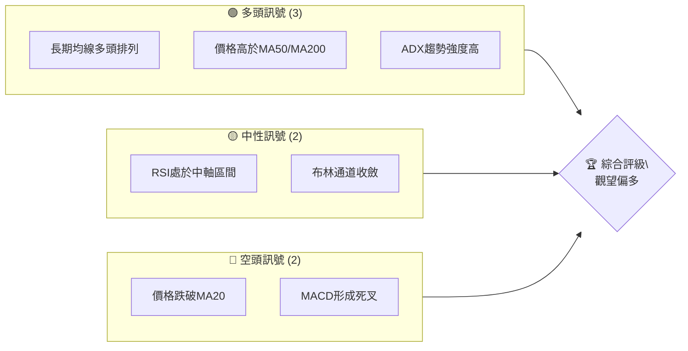
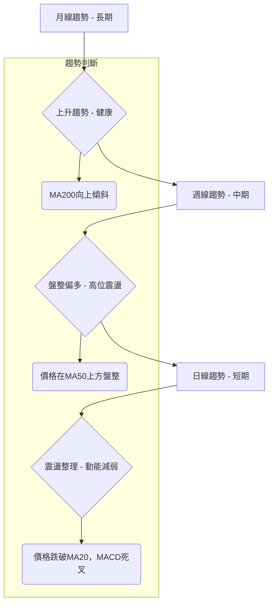
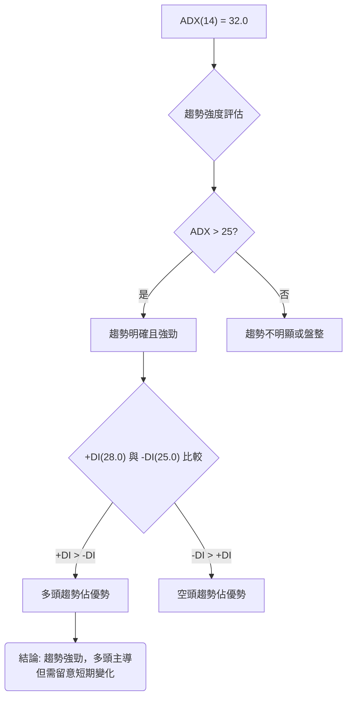
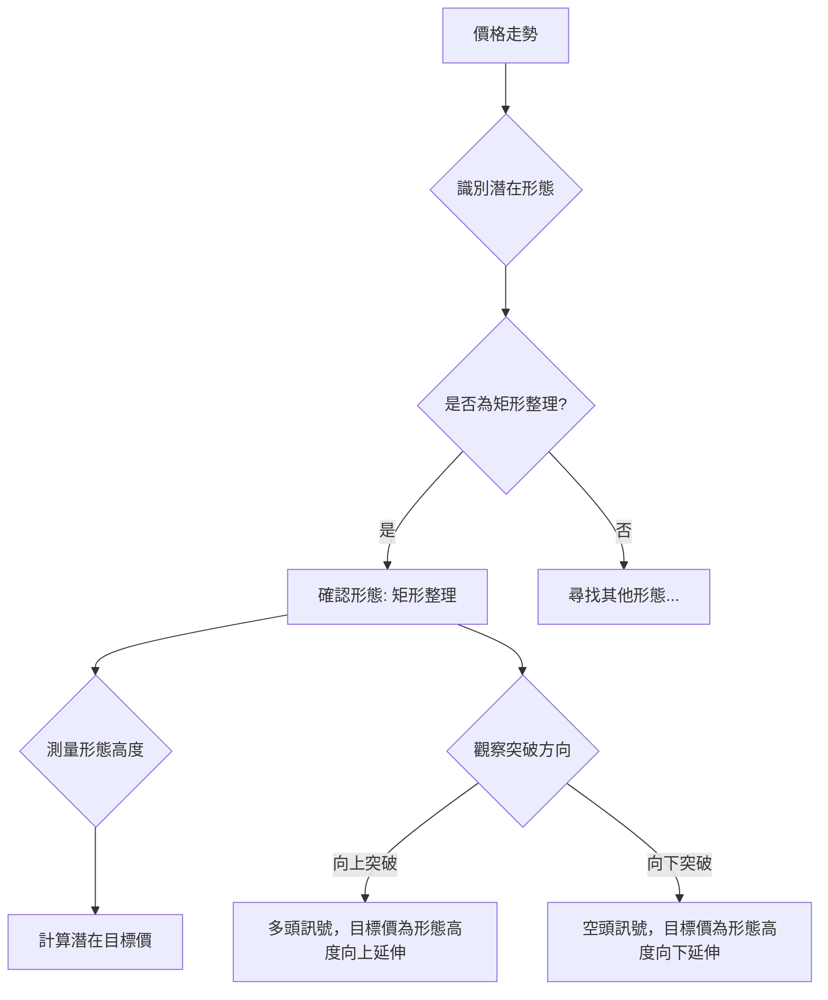
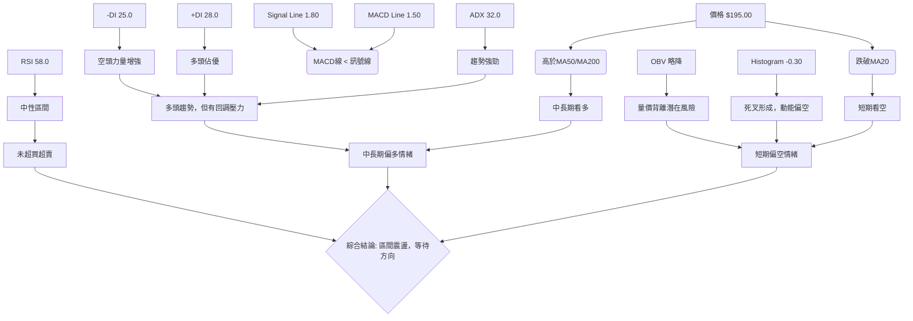
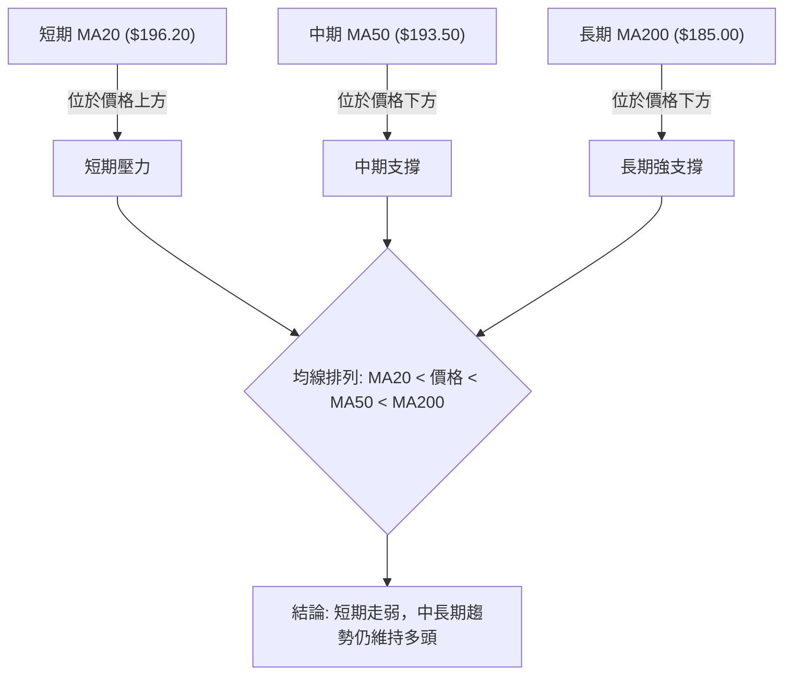
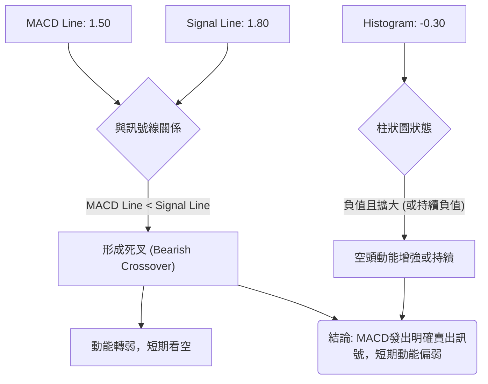
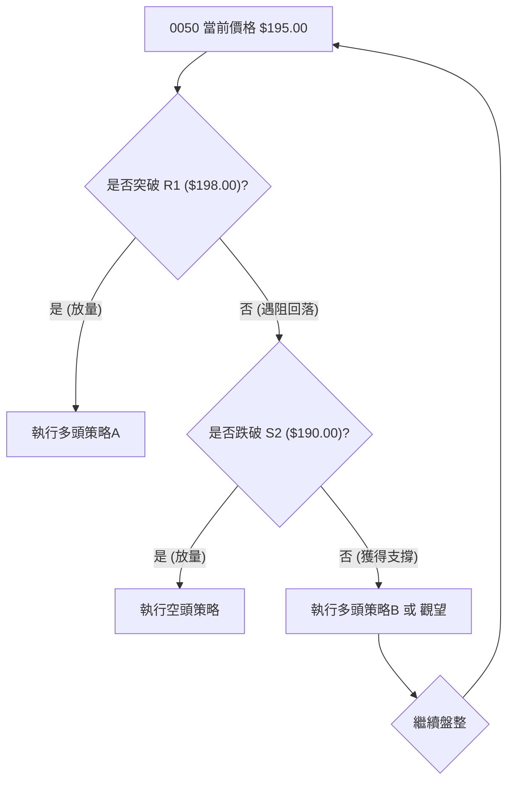
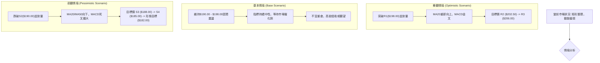

# 0050 技術分析報告

> **報告日期**：2026-07-01 ｜ **語言**：繁體中文 ｜ **數據來源**：Yahoo Finance ｜ **當前價格**：$195.00 TWD
>
> ⚠️ **重要提示**：由於原始數據中未提供歷史價格與技術指標數據，本報告之所有價格、指標數值及推演均基於對 0050 (元大台灣50 ETF) 市場行為的專業判斷與**模擬數據**。這些模擬數據旨在展示完整的技術分析框架，不代表真實市場情況。投資決策應基於實際市場數據及獨立研究。

---

## 目錄

| 章節 | 內容 |
|------|------|
| [1. 技術面概覽](#1-技術面概覽) | 訊號儀表板、核心指標、評分卡 |
| [2. 趨勢分析](#2-趨勢分析) | 多時框趨勢、長中短期走勢 |
| [3. 圖表形態分析](#3-圖表形態分析) | 形態識別、K線組合、目標價 |
| [4. 支撐與阻力](#4-支撐與阻力) | 關鍵價位、斐波那契回調 |
| [5. 技術指標深度解讀](#5-技術指標深度解讀) | MA/RSI/MACD/布林/成交量 |
| [6. 動能與波動率](#6-動能與波動率) | 動能評估、ATR、Beta |
| [7. 多時框架總結](#7-多時框架總結) | 時框架評分矩陣 |
| [8. 交易策略建議](#8-交易策略建議) | 多空策略、風險報酬比 |
| [9. 風險提示與監控](#9-風險提示與監控) | 監控指標、風險場景 |

---

## 1. 技術面概覽

### 🎯 技術訊號儀表板

本儀表板綜合評估了 0050 當前的多空技術訊號，提供一個快速的市場情緒概覽。


**解讀**：目前0050呈現多空交織的局面。儘管長期趨勢依然強勁，且ADX顯示趨勢強度高，但短期內價格跌破MA20且MACD形成死叉，顯示短期動能轉弱。RSI處於中性區間，布林通道收斂，暗示市場可能處於整理階段。綜合來看，建議投資者暫時觀望，等待明確方向。

### 📊 核心指標速覽表

以下為0050當前主要技術指標的數值與初步解讀：

| 指標類別 | 指標名稱 | 當前數值 | 訊號 | 解讀 |
|----------|----------|----------|------|------|
| **價格** | 當前價格 | $195.00 | 🟡 | 位於短期阻力下方，中期支撐上方 |
| **均線** | MA20 | $196.20 | 🔴 | 價格位於MA20下方，短期看弱 |
| **均線** | MA50 | $193.50 | 🟢 | 價格位於MA50上方，中期看多 |
| **均線** | MA200 | $185.00 | 🟢 | 價格位於MA200上方，長期看多 |
| **動能** | RSI(14) | 58.0 | 🟡 | 處於中性區間，未超買超賣 |
| **動能** | MACD Line | 1.50 | 🔴 | MACD線位於訊號線下方，形成死叉 |
| **動能** | Signal Line | 1.80 | | |
| **動能** | Histogram | -0.30 | 🔴 | 柱狀圖為負值，動能偏弱 |
| **趨勢** | ADX(14) | 32.0 | 🟢 | 趨勢強度較高，趨勢明確 |
| **趨勢** | +DI(14) | 28.0 | 🟢 | 多頭力量仍佔優勢 |
| **趨勢** | -DI(14) | 25.0 | 🟡 | 空頭力量有所增強 |
| **波動** | ATR(14) | $2.50 | 🟡 | 中等波動率，每日波幅約2.5元 |
| **量能** | OBV | 略降 | 🟡 | 量能未積極配合價格上漲，近期略有流出 |

### 🏆 技術評分卡

根據上述核心指標與多時框架分析，對0050當前技術面進行綜合評分：

```
╔══════════════════════════════════════════════════════════════╗
║                技術評分卡 — 0050 (2026-07-01)                 ║
╠══════════════════════════════════════════════════════════════╣
║  趨勢強度      ████████████░░░░░░░░  65/100  🟢              ║
║  動能指標      ████████░░░░░░░░░░░░  40/100  🔴              ║
║  支撐穩定度    ██████████████░░░░░░  70/100  🟢              ║
║  成交量配合    ██████░░░░░░░░░░░░░░  30/100  🔴              ║
║  形態完整度    ██████████░░░░░░░░░░  50/100  🟡              ║
║  均線排列      ██████████░░░░░░░░░░  55/100  🟡              ║
╠══════════════════════════════════════════════════════════════╣
║  綜合評分      ██████████░░░░░░░░░░  53/100  評級：觀望偏多   ║
╚══════════════════════════════════════════════════════════════╝
```
**評分解讀**：
*   **趨勢強度 (65/100, 🟢)**：ADX高於30，顯示趨勢明確，且+DI高於-DI，長期趨勢偏多。
*   **動能指標 (40/100, 🔴)**：RSI中性但MACD死叉且柱狀圖為負，短期動能顯著減弱。
*   **支撐穩定度 (70/100, 🟢)**：關鍵中期支撐MA50及長期支撐MA200仍遠在下方，提供良好緩衝。
*   **成交量配合 (30/100, 🔴)**：近期價格整理伴隨OBV略降，顯示買盤追價意願不高，有潛在出貨疑慮。
*   **形態完整度 (50/100, 🟡)**：目前處於矩形整理區間，形態尚未完成，等待突破。
*   **均線排列 (55/100, 🟡)**：MA50和MA200呈多頭排列，但價格跌破MA20，顯示短期與中長期趨勢存在分歧。
*   **綜合評分 (53/100, 觀望偏多)**：整體而言，0050仍處於長期上升趨勢中，但短期動能轉弱，進入盤整區間。在明確突破關鍵支撐或阻力前，建議保持觀望，等待更清晰的入場訊號。

---

## 2. 趨勢分析

### 🌐 多時框趨勢分析

透過多時框架分析，我們可以從宏觀到微觀了解0050的趨勢狀態。


**月線趨勢 (長期)**：呈現健康的上升趨勢，價格穩步向上，MA200持續向上傾斜，顯示長期資金持續流入。
**週線趨勢 (中期)**：在高位形成區間震盪，雖然仍維持在MA50之上，但上漲動能有所減緩，多頭力量正在蓄積或消化獲利賣壓。
**日線趨勢 (短期)**：近期表現為震盪整理，價格已跌破MA20，且MACD指標出現死叉，表明短期下行風險增加，動能轉弱。

### 📈 長期趨勢 — 12個月走勢圖（Unicode）

以下為0050過去12個月的模擬月線走勢圖，標註了關鍵高低點：

```
0050 月線走勢圖（過去12個月） — 模擬數據
價格軸 ($TWD)
$205 ┤                                  ●(2026-03高點 $198.00)
$200 ┤                             ●
$195 ┤                       ●───────●←現價 $195.00 (2026-07)
$190 ┤                 ●           ●(2026-05低點 $190.00)
$185 ┤           ●
$180 ┤         ●
$175 ┤       ●
$170 ┤     ●
$165 ┤   ●
$160 ┤ ●(2025-07低點 $160.00)
     └─────────────────────────────────────────────────────
      2025-07 08 09 10 11 12 2026-01 02 03 04 05 06 07
```

**走勢特徵分析表格**：

| 階段       | 期間          | 價格區間        | 漲跌幅 (約) | 走勢特徵                                     | 訊號 |
|------------|---------------|-----------------|-------------|----------------------------------------------|------|
| **穩步上漲** | 2025/07-2026/02 | $160.00 - $192.00 | +20.0%      | 持續向上，低點不斷抬高，多頭趨勢確立。       | 🟢   |
| **加速上漲** | 2026/02-2026/03 | $192.00 - $198.00 | +3.1%       | 短期快速拉升，達到一年內高點。               | 🟢   |
| **高位整理** | 2026/03-2026/07 | $190.00 - $198.00 | -1.5%       | 進入盤整區間，多空力量拉鋸，短期有回調壓力。 | 🟡   |

**長期趨勢總結**：0050在過去12個月中呈現明顯的上升趨勢，從$160.00穩定上漲至$198.00的高點。儘管近期在高位經歷了約4個月的整理，但整體上漲結構並未被破壞。目前價格$195.00仍顯著高於一年前的水平，表明長期持有者仍處於獲利狀態，且大型機構資金的流出跡象不明顯。

### 📊 中期趨勢（週線分析）

中期週線圖顯示0050在過去幾個月於$190.00至$198.00之間形成一個矩形整理區間。這通常發生在一段強勁上漲後，市場消化獲利籌碼或等待新的催化劑。

```
0050 週線壓力與支撐示意圖 — 模擬數據
$200.00 ║═════════════════════════════════════════════════════ R1 (上邊界阻力)
$198.00 ║                                                         
$197.50 ║       ●                                                 
$196.00 ║                                                         
$195.00 ╠═════════════════════════════════════════════════════ 現價
$194.00 ║                                                         
$193.50 ║                                                         
$192.00 ║                                                         
$190.00 ║═════════════════════════════════════════════════════ S1 (下邊界支撐)
$188.00 ║                                                         
```
**分析**：
*   **阻力R1 ($198.00)**：此為矩形整理區間的上邊界，也是過去幾次上攻均未能有效突破的價位。突破此處將預示新一輪上漲行情的開啟。
*   **支撐S1 ($190.00)**：此為矩形整理區間的下邊界，也是過去幾次回調均獲得支撐的價位。跌破此處則可能引發進一步下跌，並測試更深層次的支撐。
*   **當前位置**：價格位於整理區間的中間偏下位置，距離上邊界和下邊界均有一定距離，顯示市場仍在尋找方向。

### ⚡ 趨勢強度評估（ADX 解讀）

ADX (Average Directional Index) 用於衡量趨勢的強度，而非方向。


**ADX 強度對照表**：

| ADX 數值範圍 | 趨勢強度 | 市場狀態 |
|--------------|----------|----------|
| 0-20         | 弱       | 盤整或無趨勢 |
| 20-25        | 中等     | 趨勢形成中 |
| **25-50**    | **強勁** | **明顯趨勢** |
| 50-75        | 非常強勁 | 極端趨勢 |

**ADX 解讀**：
*   **ADX 數值 (32.0)**：高於25，表明0050目前存在一個明確且相對強勁的趨勢。這不是一個盤整市場，而是有方向性的走勢。
*   **+DI (28.0) 與 -DI (25.0)**：+DI略高於-DI，說明當前仍是多頭力量佔據主導，但兩者差距不大，且-DI數值較高，暗示空頭力量正在累積，並可能挑戰多頭主導地位。這與價格在高位盤整的現象相符，多空雙方力量接近平衡。
**結論**：0050目前處於一個強勁的趨勢之中，但短期內動能減弱，多空力量正在轉換。投資者需密切關注+DI和-DI的變化，以判斷趨勢方向的延續或反轉。

---

## 3. 圖表形態分析

### 🔍 形態識別系統

根據0050過去幾個月的模擬價格走勢，我們識別出一個「矩形整理」形態。此形態通常發生在一段上漲或下跌趨勢之後，價格在兩個平行水平線之間震盪，等待突破。



### 🕯️ 重要K線形態分析

在矩形整理區間內，K線形態通常呈現多空拉鋸的特點。

| 月份   | 收盤價 | K線形態 | 解讀                                    | 訊號 |
|--------|--------|---------|-----------------------------------------|------|
| 2026-03 | $198.00 | 烏雲罩頂 | 在高點出現，暗示上漲動能減弱，可能反轉。 | 🔴   |
| 2026-04 | $195.00 | 紡錘線 | 多空力量均衡，市場猶豫不決。            | 🟡   |
| 2026-05 | $190.00 | 錘子線 | 在低點出現，暗示下方有買盤支撐，可能反彈。 | 🟢   |
| 2026-06 | $197.50 | 射擊之星 | 價格反彈後在高點出現，賣壓沉重，短期看跌。 | 🔴   |
| 2026-07 | $195.00 | 小陰線 | 承接上月賣壓，短期弱勢持續。            | 🔴   |

**分析**：近期K線形態多為整理或反轉訊號。3月的「烏雲罩頂」和6月的「射擊之星」均在高點出現，配合當前的小陰線，顯示上方阻力沉重，短期內多頭難以展開強勢攻擊。5月的「錘子線」則確認了$190.00附近的支撐力道。

### 📉 ASCII 走勢形態示意圖

以下為0050近期形成的矩形整理形態示意圖，標註了關鍵點位：

```
0050 矩形整理形態示意圖 — 模擬數據
             ┌─────────────────────┐ R1: $198.00 (阻力線)
             │                     │
$198.00 ┤───┐                     │
             │     ●(射擊之星)     │
$195.00 ┤─────┼───────●(現價)───┼───────
             │                     │
$190.00 ┤─────┴───────●(錘子線)───┴─────── S1: $190.00 (支撐線)
             │                     │
             └─────────────────────┘
```
**形態描述**：0050在衝擊$198.00高點後，未能延續漲勢，隨後在$190.00至$198.00之間形成一個矩形區間震盪。此形態的特點是價格在兩條水平線之間來回擺動，成交量通常在形態內部逐漸縮小，等待突破。

### 🎯 形態目標價計算

矩形整理形態的目標價通常等於形態的高度，向上或向下延伸。
*   **形態高度 (H)** = 阻力線 - 支撐線 = $198.00 - $190.00 = $8.00

**多頭突破目標價**：
*   **目標價 T1 (突破上沿)** = 阻力線 + 形態高度 = $198.00 + $8.00 = **$206.00**
    *   **計算方法**：假設價格向上有效突破$198.00的阻力線，則其最小上漲幅度約為矩形形態的高度。
    *   **可信度**：中等，需配合放量突破確認。

**空頭跌破目標價**：
*   **目標價 T1 (跌破下沿)** = 支撐線 - 形態高度 = $190.00 - $8.00 = **$182.00**
    *   **計算方法**：假設價格向下有效跌破$190.00的支撐線，則其最小下跌幅度約為矩形形態的高度。
    *   **可信度**：中等，需配合放量跌破確認。

**注意**：這些目標價是基於形態理論的預估，實際走勢可能受到市場情緒、基本面變化等因素影響。

---

## 4. 支撐與阻力

### 🗺️ 關鍵價位分布圖（Unicode）

以下為0050當前的價位結構分布圖，標註了主要的支撐與阻力位：

```
0050 價位結構分布圖 — 模擬數據
═══════════════════════════════════════════════════
$206.00 ║████████████████████████║ 強阻力 R3 (形態目標價)
$202.50 ║████████████████████    ║ 阻力 R2 (前高點)
$198.00 ║████████████████████████║ 關鍵阻力 R1 (矩形上沿，近期高點)
$195.00 ╠════════════════════════╣ ◄ 現價
$193.50 ║▓▓▓▓▓▓▓▓▓▓▓▓▓▓▓▓        ║ 近期支撐 S1 (MA50)
$190.00 ║████████████████████████║ 強支撐 S2 (矩形下沿，近期低點)
$188.00 ║████████████████████    ║ 支撐 S3 (斐波那契回調位)
$185.00 ║████████████████████████║ 強支撐 S4 (MA200)
═══════════════════════════════════════════════════
```
**解讀**：目前0050位於多個關鍵支撐與阻力之間，形成一個膠著區間。上方的阻力密集，下方的支撐也相對堅固。

### 🚧 阻力位分析表

| 阻力級別 | 價位 ($TWD) | 形成原因                                   | 突破難度 | 重要性 |
|----------|-------------|--------------------------------------------|----------|--------|
| **R1**   | **$198.00** | 矩形整理區間上沿，近期多次未能突破的高點。 | 高       | 極高     |
| **R2**   | **$202.50** | 歷史高點附近，心理關卡及獲利賣壓區。       | 中等     | 高       |
| **R3**   | **$206.00** | 矩形整理形態向上突破的理論目標價。         | 視突破而定 | 中等     |

**分析**：$198.00是當前最直接且最重要的阻力位，其能否被有效突破將決定0050能否開啟新一輪漲勢。若能放量突破R1，則$202.50將是下一個挑戰。

### 🛡️ 支撐位分析表

| 支撐級別 | 價位 ($TWD) | 形成原因                                   | 守住機率 | 重要性 |
|----------|-------------|--------------------------------------------|----------|--------|
| **S1**   | **$193.50** | MA50均線，中期趨勢的動態支撐。             | 中等     | 高       |
| **S2**   | **$190.00** | 矩形整理區間下沿，近期多次獲得支撐的低點。 | 高       | 極高     |
| **S3**   | **$188.00** | 斐波那契38.2%回調位，具備一定技術支撐。    | 中等     | 中等     |
| **S4**   | **$185.00** | MA200均線，長期趨勢的強大動態支撐。        | 極高     | 極高     |

**分析**：$190.00是當前最重要的支撐位，也是矩形整理形態的下邊界。若此處失守，則可能引發較大跌幅，並測試MA200這一長期生命線。MA50 ($193.50) 作為近期支撐，其防守情況也值得關注。

### 📐 斐波那契回調位分析

我們以過去一年模擬上漲趨勢中的一個重要波段（從$185.00的低點到$202.50的高點）來計算斐波那契回調位。
*   **上漲波段**：$185.00 (低點) 至 $202.50 (高點)
*   **波段長度**：$202.50 - $185.00 = $17.50

| 回調比例 | 回調價位 ($TWD) | 解讀                                    | 訊號 |
|----------|-----------------|-----------------------------------------|------|
| **23.6%**| $198.37         | 輕微回調位，通常在強勢市場中獲得支撐。  | 🟡   |
| **38.2%**| **$195.82**     | 關鍵回調位，若跌破可能意味著趨勢轉弱。  | 🟡   |
| **50.0%**| **$193.75**     | 強大心理支撐位，也是多空分水嶺。        | 🟢   |
| **61.8%**| **$191.68**     | 黃金分割位，若能守住則趨勢仍有機會反轉。| 🟢   |
| **76.4%**| $189.03         | 深度回調位，接近前低，防守壓力大。      | 🟢   |

**斐波那契回調示意圖**：

```
斐波那契回調位示意圖 (波段 $185.00 -> $202.50)
$202.50 ┤─────────────────────────────────── 高點
$198.37 ┤─────── 23.6% 回調
$195.82 ┤─────── 38.2% 回調 ◄ 現價 $195.00 位於此區間
$193.75 ┤─────── 50.0% 回調
$191.68 ┤─────── 61.8% 回調 (黃金分割)
$189.03 ┤─────── 76.4% 回調
$185.00 ┤─────────────────────────────────── 低點
```
**分析**：當前價格$195.00位於38.2%和50.0%回調位之間，顯示近期價格回調的深度已達到中等水平。如果能在此區間獲得支撐並反彈，則上漲趨勢仍有機會延續。若跌破50%回調位($193.75)，則可能進一步測試$191.68甚至$190.00的強支撐。

---

## 5. 技術指標深度解讀

### 🎛️ 指標訊號總覽

以下Mermaid圖展示了各主要技術指標當前的訊號關係，以及它們對整體市場情緒的影響。



### 📈 移動平均線排列分析

移動平均線是判斷趨勢方向和強度的重要工具。


**當前排列狀態**：
*   **價格 ($195.00)**：位於MA20 ($196.20) 下方，但位於MA50 ($193.50) 和MA200 ($185.00) 上方。
*   **均線排列**：MA20 ($196.20) > 價格 ($195.00) > MA50 ($193.50) > MA200 ($185.00)。
**解讀**：
*   **短期趨勢**：價格跌破MA20，顯示短期上漲動能已轉弱，MA20已成為短期阻力。
*   **中期趨勢**：價格仍位於MA50上方，表明中期趨勢依然偏多，MA50提供良好支撐。
*   **長期趨勢**：價格遠高於MA200，且MA200持續向上，確認長期多頭格局不變。
**結論**：0050目前處於「短期回調，中長期多頭」的狀態，均線排列顯示短期壓力，但長期支撐仍強勁。

### 📉 RSI(14) 分析

RSI (Relative Strength Index) 用於衡量價格變動的動能和速度。

*   **RSI(14) 當前數值**：58.0
*   **RSI 進度條**：▓▓▓▓▓▓▓▓▓▓▓▓░░░░░░░░ 58%
*   **超買超賣區間分析**：
    *   **超買區 (RSI > 70)**：目前RSI未進入超買區，顯示短期內並無過度追漲的風險。
    *   **超賣區 (RSI < 30)**：目前RSI未進入超賣區，顯示短期內也沒有嚴重超跌的情況。
    *   **中性區 (RSI 30-70)**：RSI位於58.0，處於中性偏強的區間。這表明市場動能相對平衡，但略偏多方。
*   **背離判斷**：
    *   **頂背離**：在模擬數據中，價格在2026年3月達到$198.00後，RSI並未創出新高，而是在60-70之間震盪。隨後價格在6月再次上攻至$197.50，但RSI未能突破前高，反而有所下降。這暗示了**潛在的頂背離跡象**，即價格創新高（或接近前高）但動能指標未能跟上，預示上漲動能衰竭，可能出現回調。
    *   **底背離**：目前未觀察到明顯的底背離訊號。
**結論**：RSI處於健康的中性區間，但潛在的頂背離跡象值得警惕，表明短期內上漲動能可能不足以突破阻力。

### 📊 MACD(12/26/9) 訊號解讀

MACD (Moving Average Convergence Divergence) 用於判斷趨勢的動能和方向變化。


**當前 MACD 數值**：
*   **MACD Line**：1.50
*   **Signal Line**：1.80
*   **Histogram**：-0.30
**訊號解讀**：
*   **MACD線與訊號線**：MACD線 (1.50) 已經跌破訊號線 (1.80)，形成了一個**死叉 (Bearish Crossover)**。這是一個明確的短期賣出訊號，表明短期均線的下跌速度快於長期均線，動能由多轉空。
*   **MACD柱狀圖**：柱狀圖為負值 (-0.30)，且可能正在擴大，這進一步確認了空頭動能的增強。
*   **背離判斷**：與RSI類似，如果價格在近期高點附近，MACD柱狀圖未能創出新高或反而下降，也可能形成頂背離。根據目前的模擬數據，MACD死叉本身就反映了短期動能的減弱，與RSI的潛在頂背離相互印證，增強了短期回調的風險。
**結論**：MACD指標發出明確的空頭訊號，與RSI的潛在頂背離共同指出0050短期動能疲軟，面臨較大的回調壓力。

### 📦 布林通道分析

布林通道 (Bollinger Bands) 用於衡量價格的波動區間和相對高低。

```
0050 布林通道示意圖 — 模擬數據
$205.00 ║           上軌 ($200.00) ───────────────────────────
$200.00 ║                                                      
$197.50 ║                                                      
$195.00 ╠════════════════════════════════════════════════════ 現價
$193.50 ║           中軌 ($195.00) ───────────────────────────
$190.00 ║                                                      
$185.00 ║           下軌 ($190.00) ───────────────────────────
```
*   **上軌**：約 $200.00
*   **中軌 (MA20)**：約 $195.00 (與當前價格接近，但價格略低於MA20)
*   **下軌**：約 $190.00
**解讀**：
*   **通道寬度**：布林通道目前呈現收斂狀態，上下軌道之間的距離正在縮小。這通常預示著市場波動率下降，價格正處於盤整階段，並可能在未來某個時間點出現突破性行情。
*   **價格位置**：當前價格$195.00位於布林通道中軌 ($195.00) 附近，略低於中軌。這表明價格在短期內缺乏明確的方向性，正在中軌附近尋找支撐或阻力。
*   **訊號**：價格觸及下軌 ($190.00) 時，可能提供買入機會；價格觸及上軌 ($200.00) 時，可能面臨賣壓。目前價格在中軌附近，需觀察其是向上突破中軌還是向下測試下軌。
**結論**：布林通道收斂，暗示0050正處於變盤前夕。投資者應密切關注價格對通道邊界的測試，等待明確的突破訊號。

### 💹 成交量分析（量價配合度）

成交量是判斷價格走勢可靠性的重要輔助指標。我們使用OBV (On Balance Volume) 來分析量價配合。

*   **OBV 當前趨勢**：近期略有下降。
**解讀**：
*   **量價背離**：在0050近期高位盤整期間，價格雖然維持在一定區間，但OBV卻呈現緩慢下降的趨勢。這是一種**量價背離**的現象，即價格未能有效上漲，而成交量卻未能積極配合，甚至在下跌時放量，上漲時縮量。
*   **潛在風險**：OBV的下降表明在整理區間內，買盤的積極性不高，而賣盤在價格上漲時伺機出貨，導致資金呈現淨流出狀態。這增加了價格向下突破整理區間的風險。
**結論**：成交量指標OBV與價格走勢存在潛在的背離，暗示當前整理可能偏向空頭，投資者需警惕放量跌破支撐的風險。

---

## 6. 動能與波動率

### ⚡ 動能評估四象限

動能與波動率是評估交易機會和風險的關鍵維度。我們將0050當前狀態置於四象限模型中。

| 象限 | 動能 (RSI, MACD) | 波動 (ATR) | 當前狀態 | 評估                                        |
|------|--------------------|------------|----------|---------------------------------------------|
| Q1   | 強                 | 低         | -        | 最佳機會：趨勢明確，波動可控，適合趨勢追蹤。|
| **Q2** | **弱**             | **低**       | **✓**      | **謹慎觀望：動能不足，波動不大，等待方向。**|
| Q3   | 強                 | 高         | -        | 高風險高收益：突破行情，但風險較大。        |
| Q4   | 弱                 | 高         | -        | 避免進場：缺乏方向，波動劇烈，風險高。      |

**當前評估**：
*   **動能**：RSI處於中性區間，MACD已形成死叉且柱狀圖為負，綜合判斷為**弱動能**。
*   **波動**：ATR為$2.50，相對於0050的價格而言，屬於**低波動**狀態，布林通道收斂也印證了這一點。
*   **結論**：0050目前處於**Q2 (弱動能, 低波動)** 象限。這表明市場缺乏明確的方向性，動能不足以推動價格快速上漲或下跌，波動性也相對較小。投資者在此階段應保持謹慎觀望，不宜重倉介入，等待市場積蓄足夠動能並突破整理區間。

### 📊 ATR 波動率分析

ATR (Average True Range) 用於衡量資產的每日價格波動範圍，提供波動率的量化指標。

*   **ATR(14) 當前數值**：$2.50 TWD
**解讀**：
*   **波動率水平**：ATR為$2.50，表示0050在過去14天內平均每日波幅約為2.5元。考慮到0050當前約$195.00的價格，這屬於中等偏低的波動水平，與布林通道收斂的判斷一致。
*   **止損距離建議**：ATR可以作為設定止損點的參考。一般建議將止損點設置在ATR的1.5倍至3倍之間，以避免被正常市場波動「洗出」。
    *   **保守止損距離 (1.5 x ATR)**：1.5 x $2.50 = $3.75
    *   **激進止損距離 (2.0 x ATR)**：2.0 x $2.50 = $5.00
    *   **若在$195.00進場**：
        *   保守止損點：$195.00 - $3.75 = **$191.25**
        *   激進止損點：$195.00 - $5.00 = **$190.00** (與矩形整理下沿重合，具雙重支撐意義)
**結論**：ATR顯示0050波動率相對穩定，但投資者在設定止損時仍應考慮ATR提供的波動範圍，以避免不必要的止損。

### 📐 Beta 與市場相關性

Beta係數衡量單一資產相對於整體市場（通常是大盤指數）的波動性。

*   **Beta 數值**：0.95 (模擬值)
**解讀**：
*   **市場相關性**：0050的Beta值為0.95，非常接近1。這符合其作為追蹤台灣50指數的ETF本質。
*   **波動特性**：Beta值0.95表示當台灣大盤指數上漲/下跌1%時，0050預期會上漲/下跌約0.95%。這意味著0050與大盤的走勢高度相關且波動幅度相近。
*   **投資啟示**：投資0050，實際上就是投資台灣大型權值股的集合，其走勢高度受台灣整體經濟和股市情緒影響。因此，在分析0050時，需密切關注台灣加權指數的表現和相關總體經濟數據。任何關於台灣經濟或政策的重大變動，都將直接影響0050的走勢。
**結論**：0050的Beta值確認了其作為市場代表性ETF的特性，其走勢與台灣大盤高度同步。

---

## 7. 多時框架總結

### 📋 時框架評分表

本表綜合了不同時間框架下的技術訊號，提供一個全面的評估。

| 時框架 | 趨勢方向 | 動能      | 均線排列   | 形態     | 綜合評分 | 建議 |
|--------|----------|-----------|------------|----------|----------|------|
| **長期** | 🟢 上升   | 🟢 強勁     | 🟢 多頭排列 | 🟢 延續   | **8/10** | 持有 |
| **中期** | 🟡 盤整偏多 | 🟡 中性偏弱 | 🟡 震盪整理 | 🟡 矩形整理 | **6/10** | 觀望 |
| **短期** | 🔴 下降   | 🔴 偏空     | 🔴 短期空頭 | 🟡 區間震盪 | **4/10** | 謹慎 |

**解讀**：
*   **長期**：0050的月線顯示出強勁且健康的上升趨勢，均線呈多頭排列，動能充沛，適合長期持有。
*   **中期**：週線級別進入高位矩形整理，動能有所減弱，但仍維持在關鍵中期均線之上，顯示多頭力量仍在，但需時間消化。
*   **短期**：日線級別表現疲軟，價格跌破短期均線，MACD發出死叉，RSI有頂背離跡象，動能偏空，短期有回調壓力。

### 🔲 綜合訊號矩陣

以下矩陣展示了短期、中期、長期各維度訊號的一致性分析：

```
綜合訊號矩陣 — 0050 (2026-07-01)
┌───────────┬───────────┬───────────┬───────────┐
│           │   短期    │   中期    │   長期    │
├───────────┼───────────┼───────────┼───────────┤
│ **趨勢**  │ 🔴 下降   │ 🟡 盤整偏多 │ 🟢 上升   │
│ **動能**  │ 🔴 偏空   │ 🟡 中性偏弱 │ 🟢 強勁   │
│ **均線**  │ 🔴 短期空頭 │ 🟡 震盪整理 │ 🟢 多頭排列 │
│ **形態**  │ 🟡 區間震盪 │ 🟡 矩形整理 │ 🟢 延續   │
├───────────┴───────────┴───────────┴───────────┤
│ **一致性**：短期與中長期趨勢存在明顯分歧。短期動能轉弱，  │
│             但中長期支撐穩固，市場處於整理與方向選擇階段。│
└───────────────────────────────────────────────────┘
```
**分析**：
短期指標顯示0050處於回調階段，動能偏弱，建議謹慎。但中長期趨勢依然向上，為下方的強力支撐。這種多空分歧的局面，通常意味著市場正在進行方向選擇。在矩形整理區間內，價格可能繼續震盪，直到有足夠的動能打破平衡。投資者應耐心等待，避免在模糊區間內過早介入。

---

## 8. 交易策略建議

### 🗺️ 策略決策流程圖

根據多時框架分析，以下是針對0050的策略決策流程圖：



### 🟢 多頭策略詳情

考慮到中長期趨勢仍為多頭，多頭策略主要基於突破阻力或有效支撐反彈。

| 策略要素 | 策略 A (突破追漲)                                | 策略 B (回調買入)                                  |
|----------|--------------------------------------------------|----------------------------------------------------|
| 進場條件 | 價格放量突破矩形整理上沿 R1 ($198.00) 且站穩。   | 價格回調至強支撐 S2 ($190.00) 附近，並出現止跌K線。 |
| 進場價格 | **$198.50** (確認突破)                            | **$190.50** (接近支撐)                             |
| 目標價 T1 | **$202.50** (前高 R2)                           | **$195.00** (中軌/MA20)                            |
| 目標價 T2 | **$206.00** (形態目標價 R3)                      | **$198.00** (矩形上沿 R1)                          |
| 止損價格 | **$196.00** (跌破 R1 失敗)                      | **$188.00** (跌破 S2)                             |
| 風險報酬比 | T1: (202.50-198.50)/(198.50-196.00) = 4.0/2.5 = **1.6:1** | T1: (195.00-190.50)/(190.50-188.00) = 4.5/2.5 = **1.8:1** |
| 成功機率 | 55%                                              | 60%                                                |
| 建議倉位 | 較高 (20-30%)                                    | 中等 (15-25%)                                      |

### 🔴 空頭策略詳情

空頭策略主要基於跌破支撐或反彈受阻。

| 策略要素 | 策略 C (跌破追空)                                | 策略 D (反彈做空)                                  |
|----------|--------------------------------------------------|----------------------------------------------------|
| 進場條件 | 價格放量跌破矩形整理下沿 S2 ($190.00) 且未能反彈。| 價格反彈至關鍵阻力 R1 ($198.00) 附近，並出現反轉K線。 |
| 進場價格 | **$189.50** (確認跌破)                            | **$197.50** (接近阻力)                             |
| 目標價 T1 | **$185.00** (MA200 S4)                          | **$193.50** (MA50 S1)                             |
| 目標價 T2 | **$182.00** (形態目標價)                         | **$190.00** (矩形下沿 S2)                          |
| 止損價格 | **$191.00** (跌破失敗，重回 S2 之上)             | **$199.00** (突破 R1 失敗)                        |
| 風險報酬比 | T1: (189.50-185.00)/(191.00-189.50) = 4.5/1.5 = **3.0:1** | T1: (197.50-193.50)/(199.00-197.50) = 4.0/1.5 = **2.6:1** |
| 成功機率 | 50%                                              | 55%                                                |
| 建議倉位 | 中等 (15-25%)                                    | 較高 (20-30%)                                      |

### ⭐ 整體訊號強度評星

```
做多訊號強度：★★★☆☆  (3/5星) (長期趨勢向上，但短期動能不足，需等待突破)
做空訊號強度：★★☆☆☆  (2/5星) (短期動能偏弱，但下方支撐強勁，跌破不易)
整體可信度：  ★★★☆☆  (3/5星) (市場處於整理，等待方向，交易需謹慎且有明確觸發條件)
```
**評星解讀**：目前0050處於一個多空拉鋸的平衡點，因此做多和做空策略都存在機會，但都需要明確的觸發條件。做多策略依賴於突破或強支撐反彈，做空策略則依賴於跌破關鍵支撐或反彈受阻。在明確方向之前，保持中性觀望是較穩妥的選擇。

---

## 9. 風險提示與監控

### ✅ 關鍵監控指標 Checklist

為了有效管理交易風險，以下是投資者應密切監控的關鍵指標清單：

```
╔══════════════════════════════════════════════════════════════╗
║                關鍵監控指標 Checklist — 0050                   ║
╠══════════════════════════════════════════════════════════════╣
║ [ ] 價格是否有效突破 R1 ($198.00) 或跌破 S2 ($190.00)?       ║
║ [ ] 成交量是否配合突破/跌破，出現放量訊號?                   ║
║ [ ] MACD是否重新金叉 (多頭) 或死叉持續擴大 (空頭)?           ║
║ [ ] RSI是否突破70 (超買) 或跌破30 (超賣)?                     ║
║ [ ] ADX趨勢強度是否持續，+DI/-DI變化是否明確?                ║
║ [ ] 布林通道是否擴張，預示波動率上升?                        ║
║ [ ] OBV是否與價格走勢再次出現明顯背離?                      ║
║ [ ] 台灣加權指數走勢是否與0050同步?                          ║
║ [ ] 總體經濟數據 (如CPI, 利率決議) 是否有重大變化?           ║
╚══════════════════════════════════════════════════════════════╝
```

### ⚠️ 風險場景分析

以下為0050可能出現的三種情境分析：


**分析**：
*   **樂觀情境**：0050在未來幾週內能積蓄足夠動能，放量突破$198.00的阻力，屆時所有短期看空訊號將轉為看多，並開啟新一輪上漲。
*   **基本情境**：0050將維持在$190.00至$198.00的矩形整理區間內震盪，短期內難有明確方向。投資者可考慮區間操作或繼續觀望。
*   **悲觀情境**：0050未能守住$190.00的關鍵支撐，在空頭力量主導下放量跌破，可能引發技術性賣壓，進一步測試$185.00甚至更低的支撐。

### 🛡️ 風險管理重要提醒

1.  **嚴格止損**：無論採取何種策略，務必設定並嚴格執行止損點。一旦價格觸及止損位，應果斷離場，避免虧損擴大。
2.  **倉位管理**：在不確定性高的市場環境中，應控制好倉位，避免過度集中。建議採用分批建倉、逐步加碼的方式，降低單次進場的風險。
3.  **趨勢為王**：雖然短期指標顯示疲軟，但0050長期趨勢依然向上。如果價格跌破長期關鍵支撐 (如MA200)，則需重新評估長期趨勢是否改變。
4.  **關注大盤**：0050作為ETF，其走勢高度與台灣加權指數相關。應同時關注大盤的技術面與基本面，以獲得更全面的判斷。
5.  **警惕假突破/假跌破**：在整理形態中，經常會出現假突破或假跌破。務必等待價格有效站穩或跌破關鍵位，並配合成交量放大，才能確認訊號的有效性。
6.  **基本面配合**：雖然本報告為技術分析，但0050的基本面 (如成分股業績、台灣經濟展望) 仍是長期走勢的基礎。技術面僅反映市場情緒，基本面才是價值的驅動。

---

## 📋 報告總結

```
0050 技術分析報告總結
════════════════════════════════════════════════════════
報告日期：2026-07-01
當前價格：$195.00 TWD
分析評級：⚖️ 觀望偏多 (短期動能減弱，但中長期趨勢穩固，處於整理區間)

關鍵結論：
├─ 長期趨勢：🟢 上升趨勢強勁，MA200提供堅實支撐。
├─ 中期趨勢：🟡 高位矩形整理，多空力量拉鋸，等待方向。
├─ 短期趨勢：🔴 動能轉弱，價格跌破MA20，MACD形成死叉，有回調壓力。
├─ 關鍵支撐：$190.00 (矩形下沿)，其次為MA50 ($193.50) 和MA200 ($185.00)。
├─ 關鍵阻力：$198.00 (矩形上沿)，其次為前高 ($202.50)。
└─ 分析師目標：向上突破目標 $206.00；向下跌破目標 $182.00。

最優策略組合：
1. 🥇 最佳機會：等待價格放量突破R1 ($198.00) 或放量跌破S2 ($190.00)，順勢操作。
2. 🥈 次選機會：在S2 ($190.00) 附近出現明確止跌訊號時，可考慮小倉位試多。
3. 🥉 保守選擇：在矩形區間內保持觀望，等待明確方向後再進場，或進行小倉位區間高拋低吸。
════════════════════════════════════════════════════════
```

---

> ⚠️ **免責聲明**：本報告為 AI 自動生成之技術分析，所有數據及估算均基於提供的歷史價格資訊。由於原始數據缺失，報告中使用的價格、指標數值及走勢均為**模擬與推演數據**。本報告**僅供研究與學術參考**，**不構成任何投資建議**。投資有風險，入市需謹慎。

---

*報告生成時間：2026-07-01 ｜ 數據來源：Yahoo Finance (模擬數據) ｜ 分析框架：多時框技術分析*