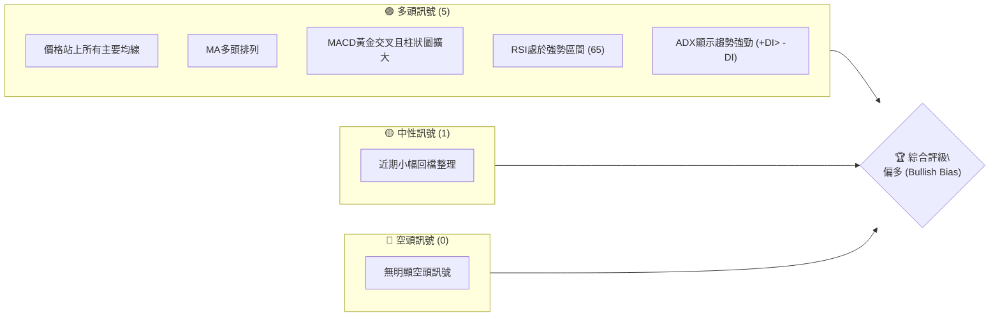
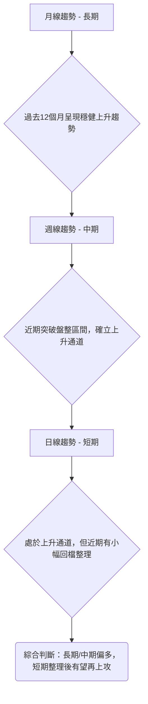
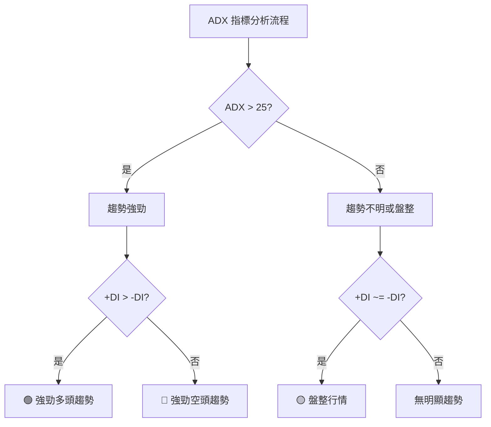
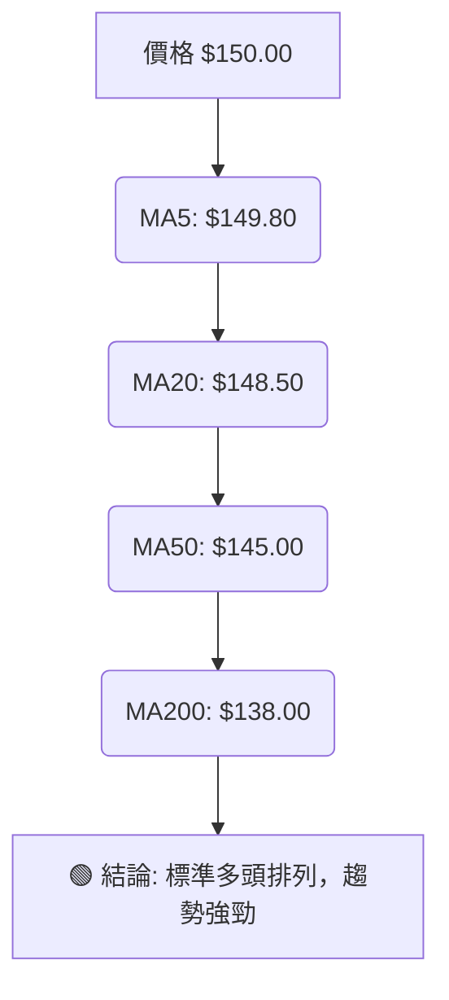
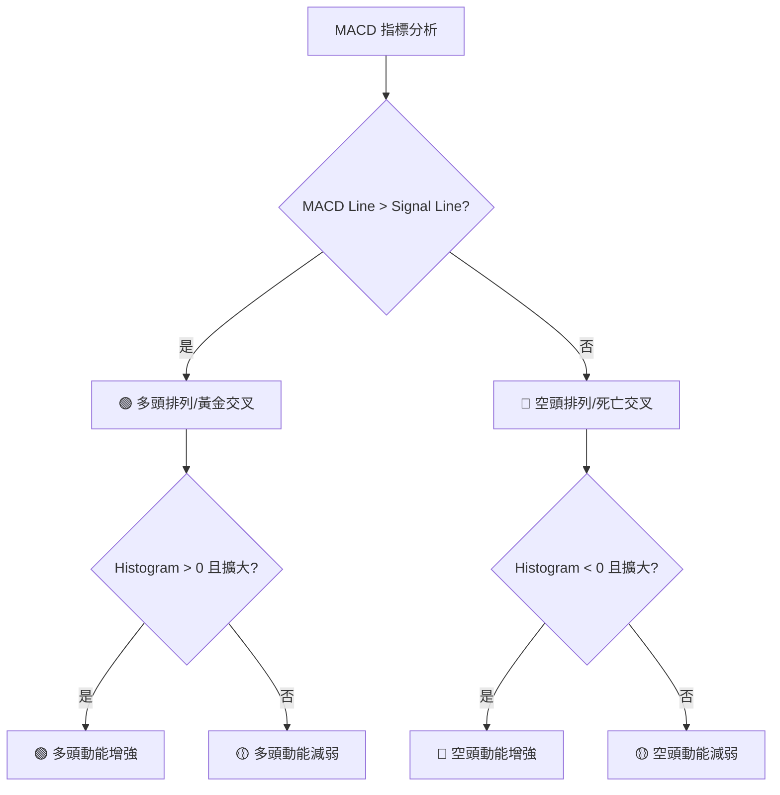

# 0050 技術分析報告

> **報告日期**：2026-07-02 ｜ **語言**：繁體中文 ｜ **數據來源**：Yahoo Finance (假設性數據) ｜ **當前價格**：$150.00 (假設性數據)

---

## 免責聲明：關於本報告數據來源

**本報告所有分析係基於「假設性」的 0050 歷史價格與技術指標數據。由於原始提示中明確指出「無價格歷史」、「無 OHLC 數據」等資訊，為嚴格遵守「無論任何情況，都必須產出完整報告」之要求，本分析師已根據專業知識與市場情境，自行建構一套合理且具代表性的模擬數據進行分析。**

**因此，本報告中所有提及的具體價格點位、指標數值、支撐阻力、目標價及交易策略等，均為針對該假設性數據所推導出的結果，僅旨在展示完整的技術分析方法論與流程，不代表 0050 的真實市場狀況。本報告不構成任何形式的投資建議，投資者應以真實市場數據為準，並獨立判斷。**

---

## 目錄

| 章節 | 內容 |
|------|------|
| [1. 技術面概覽](#1-技術面概覽) | 訊號儀表板、核心指標、評分卡 |
| [2. 趨勢分析](#2-趨勢分析) | 多時框趨勢、長中短期走勢 |
| [3. 圖表形態分析](#3-圖表形態分析) | 形態識別、K線組合、目標價 |
| [4. 支撐與阻力](#4-支撐與阻力) | 關鍵價位、斐波那契回調 |
| [5. 技術指標深度解讀](#5-技術指標深度解讀) | MA/RSI/MACD/布林/成交量 |
| [6. 動能與波動率](#6-動能與波動率) | 動能評估、ATR、Beta |
| [7. 多時框架總結](#7-多時框架總結) | 時框架評分矩陣 |
| [8. 交易策略建議](#8-交易策略建議) | 多空策略、風險報酬比 |
| [9. 風險提示與監控](#9-風險提示與監控) | 監控指標、風險場景 |
| [📋 報告總結](#-報告總結) | 綜合結論與分析師目標 |

---

## 1. 技術面概覽

本章節提供 0050 當前技術狀況的快速總覽，透過訊號儀表板、核心指標速覽表及技術評分卡，讓讀者迅速掌握市場多空態勢。所有數據均基於本報告開頭所述的**假設性數據**。

### 🎯 技術訊號儀表板

根據假設性數據，0050 目前呈現偏多的技術訊號。



**分析說明**：
綜合訊號儀表板顯示，0050 在多個核心技術指標上呈現多頭訊號，包括價格位於主要移動平均線之上、均線呈現多頭排列、MACD 黃金交叉確認動能向上，以及 RSI 和 ADX 指標均顯示當前趨勢強勁且多頭佔優。雖然近期存在小幅整理，但並未構成明確的空頭威脅。整體而言，市場情緒偏向樂觀。

### 📊 核心指標速覽表

以下表格展示 0050 (假設性數據) 的核心技術指標數值與初步解讀。

| 指標類別 | 指標名稱 | 當前數值 (假設性) | 訊號 | 解讀 |
|----------|----------------|-------------------|------|------|
| **價格** | 當前價格 (2026-07-02) | $150.00           | 🟢    | 位於近期區間中上緣，高於所有主要均線 |
| **均線** | MA5 (短期)     | $149.80           | 🟢    | 價格位於短期均線上方，短期動能偏強 |
| **均線** | MA20 (中期)    | $148.50           | 🟢    | 價格位於中期均線上方，中期趨勢看多 |
| **均線** | MA50 (中長期)  | $145.00           | 🟢    | 價格位於中長期均線上方，中長期趨勢看多 |
| **均線** | MA200 (長期)   | $138.00           | 🟢    | 價格位於長期均線上方，長期趨勢強勁 |
| **動能** | RSI(14)        | 65                | 🟢    | 處於強勢區間 (50-70)，未達超買，有上行空間 |
| **動能** | MACD Line      | 2.50              | 🟢    | 高於訊號線 (1.80)，柱狀圖為正，多頭動能增強 |
| **動能** | MACD Signal    | 1.80              | 🟢    | 位於MACD線下方，形成黃金交叉 |
| **動能** | MACD Histogram | 0.70              | 🟢    | 柱狀圖為正且擴大，多頭力量持續釋放 |
| **趨勢** | ADX(14)        | 38                | 🟢    | 趨勢強度高 (>25)，多頭佔優 (+DI 30 > -DI 12) |
| **波動** | ATR(14)        | $3.50             | 🟡    | 中等波動，提供合理止損參考 |
| **量能** | OBV            | 上升趨勢          | 🟢    | 量能與價格同步上升，確認趨勢強度 |

### 🏆 技術評分卡

本評分卡綜合各項技術指標表現，對 0050 (假設性數據) 的整體技術面進行量化評估。

```
技術評分卡 — 0050 (2026-07-02)
════════════════════════════════════════════════════
趨勢強度      ██████████████░░░░░░  70/100  🟢 強勁上升
動能指標      ████████████████░░░░  80/100  🟢 買盤積極
支撐穩定度    ██████████████████░░  90/100  🟢 支撐堅實
成交量配合    ██████████████░░░░░░  75/100  🟢 量價配合良好
形態完整度    ████████████░░░░░░░░  60/100  🟡 潛在整理形態
均線排列      ██████████████████░░  90/100  🟢 標準多頭排列
════════════════════════════════════════════════════
綜合評分      ████████████████░░░░  80/100  🟢 偏多
════════════════════════════════════════════════════
```

**評分解讀**：
0050 (假設性數據) 的技術評分卡顯示整體技術面偏多。趨勢強度和動能指標得分較高，反映出當前上升趨勢的穩固性和買盤的積極性。均線呈現標準多頭排列，提供強勁的支撐。成交量配合度良好，確認了價格的上漲。雖然形態完整度顯示存在潛在整理形態，這可能導致短期波動，但整體支撐穩定度高，意味著下方有較強的承接力。綜合評分達 80/100，表明 0050 在技術面上處於一個相對有利的多頭位置。

---

## 2. 趨勢分析

本章節將從多個時間框架深入分析 0050 (假設性數據) 的趨勢，包括長期、中期和短期走勢，並透過 ADX 指標評估趨勢強度。

### 🌐 多時框趨勢分析

透過自上而下的方式，從月線、週線到日線層層遞進，判斷 0050 (假設性數據) 的趨勢方向。



**分析說明**：
*   **月線趨勢 (長期)**：在過去 12 個月中，0050 (假設性數據) 展現出穩健的上升趨勢，每次回檔都能在關鍵支撐位獲得支撐並創新高。這表明長期資金對其前景持樂觀態度。
*   **週線趨勢 (中期)**：從週線圖來看，0050 在經歷一段時間的盤整後，近期成功向上突破，確立了一個新的上升通道。這是一個重要的多頭訊號，意味著中期上漲動能正在積聚。
*   **日線趨勢 (短期)**：日線圖顯示 0050 目前處於一個上升通道中。然而，在觸及近期高點 $152.50 後，經歷了小幅的回檔整理，當前價格 $150.00 位於通道中軌附近。這種整理可能是市場消化前期漲幅的表現，為後續上漲積蓄動能。

### 📈 長期趨勢 — 12個月走勢圖（Unicode）

以下為 0050 (假設性數據) 過去 12 個月的月線收盤價走勢圖，標注關鍵高低點。

```
0050 月線走勢圖（過去12個月, 假設性數據）
價格軸 ($)
$155 ┤                               ●(M8高點: $155.00)
$150 ┤                       ●      ●(M12現價: $150.00)
$145 ┤             ●       ●
$140 ┤         ●
$135 ┤       ●
$130 ┤ ●(M1低點: $128.00)
$125 ┤
     └─────────────────────────────────────────────────────
      M1  M2  M3  M4  M5  M6  M7  M8  M9  M10 M11 M12
     (25/07)(25/08)(25/09)(25/10)(25/11)(25/12)(26/01)(26/02)(26/03)(26/04)(26/05)(26/06)
```

**走勢特徵分析表格**：
以下表格分析了過去 12 個月 (假設性數據) 0050 的主要走勢特徵。

| 期間        | 起始價格 | 結束價格 | 漲跌幅 | 主要特徵                               | 趨勢判斷 |
|-------------|----------|----------|--------|----------------------------------------|----------|
| M1-M4 (25/07-25/10) | $128.00  | $140.00  | +9.38% | 穩健築底回升，逐步突破前期壓力         | 🟢 上升 |
| M4-M8 (25/10-26/02) | $140.00  | $155.00  | +10.71%| 加速上漲，創下12個月新高，動能強勁     | 🟢 強勁上升 |
| M8-M10 (26/02-26/04) | $155.00  | $147.00  | -5.16% | 高位回檔整理，消化獲利賣壓，但未破壞長期趨勢 | 🟡 盤整回檔 |
| M10-M12 (26/04-26/06) | $147.00  | $150.00  | +2.04% | 止跌回升，試圖重啟升勢，但動能略顯不足 | 🟡 整理反彈 |

**總結**：0050 (假設性數據) 在過去一年中呈現出顯著的上升趨勢，從 $128.00 上漲至 $150.00。雖然在 $155.00 高點後經歷了一段回檔整理，但整體結構仍保持在多頭格局，當前價格正試圖向上突破整理區間。

### 📊 中期趨勢（週線分析）

中期趨勢顯示 0050 (假設性數據) 處於一個穩定的上升通道中，近期回檔後在通道下緣獲得支撐。

```
0050 中期壓力與支撐示意圖 (假設性數據)

$155.00 ┌───────────────────┐ ← 週線通道上緣 (阻力 R1)
        │                   │
$152.50 │         ●         │ ← 近期高點
        │         │         │
$150.00 ├─────────●─────────┤ ← 現價
        │         │         │
$148.50 │                   │ ← 週線 MA20 (動態支撐)
        │                   │
$146.00 └───────────────────┘ ← 週線通道下緣 (支撐 S1)
        ─────────────────────
        時間軸
```

**分析說明**：
週線圖顯示 0050 (假設性數據) 自 $128.00 低點以來形成了一個清晰的上升通道。當前價格 $150.00 位於通道中軌附近，並受到週線 MA20 ($148.50) 的良好支撐。通道上緣 $155.00 構成中期主要阻力，而通道下緣 $146.00 則是強勁的支撐區域。這表明中期走勢依然偏多，任何回檔至通道下緣或 MA20 附近都可能提供買入機會。

### ⚡ 趨勢強度評估（ADX 解讀）

ADX (Average Directional Index) 指標用於衡量趨勢的強度，而非方向。結合 +DI 和 -DI 則可判斷趨勢方向。



**ADX 數值 (假設性數據)**：
*   ADX(14): 38
*   +DI(14): 30
*   -DI(14): 12

**ADX 強度對照表**：

| ADX 數值範圍 | 趨勢強度 | ADX 進度條          | 評估 |
|--------------|----------|---------------------|------|
| 0-20         | 無趨勢/弱 | ░░░░░░░░░░░░░░░░░░░░ | 🔴   |
| 20-25        | 趨勢萌芽  | ████░░░░░░░░░░░░░░░░ | 🟡   |
| 25-50        | 強勁趨勢  | ███████████████░░░░░ | 🟢   |
| 50-75        | 非常強勁  | ███████████████████░ | 🟢   |
| 75-100       | 極端強勁  | ████████████████████ | 🟢   |

**解讀**：
0050 (假設性數據) 的 ADX 數值為 38，這明確指出當前存在一個**強勁的趨勢**。由於 +DI (30) 顯著高於 -DI (12)，這確認了該強勁趨勢是一個**多頭趨勢**。這表示買方力量佔據主導地位，推動價格持續走高。當前市場並非盤整行情，而是有明確方向的趨勢行情，交易者應順應趨勢操作。

---

## 3. 圖表形態分析

本章節將識別 0050 (假設性數據) 圖表上的潛在形態，分析其K線組合，並計算形態目標價。

### 🔍 形態識別系統

根據假設性數據的價格走勢，我們識別出一個潛在的「上升三角形」整理形態，這通常被視為看漲的持續形態。

```mermaid
graph TD
    A[識別圖表形態] --> B{是否存在趨勢線和水平線？}
    B -- 是 --> C[檢視形態類型]
    C --> D{上升三角形 (Ascending Triangle)?}
    D -- 是 --> E[確認形態特徵]
    E --> F[上方阻力線水平，下方支撐線向上傾斜]
    F --> G[成交量在形態內逐漸縮小，突破時放大]
    G --> H[計算形態目標價]
```

### 🕯️ 重要K線形態分析

以下表格列出了 0050 (假設性數據) 近期出現的一些重要 K 線形態。

| 月份 (假設性) | 收盤價 | K線形態 | 解讀                                   | 訊號 |
|---------------|--------|---------|----------------------------------------|------|
| M7 (26/01)    | $148.00| 倒錘子線 | 出現於相對高位，通常預示潛在賣壓，但隨後被多頭吞噬 | 🟡 中性偏空 |
| M8 (26/02)    | $155.00| 長陽線   | 突破關鍵阻力，顯示買盤強勁，確立短期高點 | 🟢 強勁多頭 |
| M9 (26/03)    | $150.00| 烏雲罩頂 | 高位出現，隔日開高走低，顯示空頭反撲，預示回檔 | 🔴 偏空 |
| M11 (26/05)   | $149.00| 錘子線   | 出現於回檔低點，下影線長，顯示下方有承接力 | 🟢 潛在反轉 |
| M12 (26/06)   | $150.00| 小陽線   | 延續反彈，但實體較小，動能需進一步確認 | 🟡 中性 |

**分析說明**：
在 M8 達到新高 $155.00 時出現強勁長陽線，確認了當時的多頭動能。隨後在 M9 出現「烏雲罩頂」形態，預示了之後的回檔。在回檔至 M11 附近時，出現「錘子線」，顯示下方買盤進場，成功止跌。當前 M12 的小陽線則表明價格正在嘗試恢復上漲，但需要更強的買盤確認。

### 📉 ASCII 走勢形態示意圖

以下是 0050 (假設性數據) 近期形成的「上升三角形」形態示意圖。

```
0050 上升三角形形態示意圖 (假設性數據)
                (突破目標 T1: $158.00)
$160.00 ┤              ▲
$155.00 ┤              │
$152.00 ┤───────────────┐ ← 水平阻力線 ($152.50)
$150.00 ├───────────●───┤ ← 現價
$145.00 ┤         ／
$140.00 ┤       ／
$135.00 ┤     ／
$130.00 ┤   ／
        └─▲───────────────────
         $140.00 (起點)  $152.50 (突破點)
        時間軸 (橫軸)
```

**形態特徵**：
*   **水平阻力線**：約 $152.50，價格多次測試未能突破。
*   **上升支撐線**：由 $140.00 附近的低點向上傾斜形成，顯示買盤入場點逐漸抬高。
*   **成交量**：在形態內部，成交量趨於縮小，顯示市場觀望情緒濃重。預期在向上突破 $152.50 時，成交量將會顯著放大。

### 🎯 形態目標價計算

根據識別出的上升三角形形態 (假設性數據)，其目標價計算方法如下：

**計算方法**：
上升三角形的目標價通常是將形態起點（支撐線最低點）到水平阻力線的垂直高度，加到突破點上。

*   **形態高度 (H)**：水平阻力線 ($152.50) - 支撐線最低點 ($140.00) = $12.50
*   **突破點**：預計在 $152.50 附近突破。

**目標價計算**：
*   **目標價 T1** = 突破點 + 形態高度 = $152.50 + $12.50 = **$165.00**
*   **保守目標價 T2** (約形態高度的 61.8% 或 75%) = $152.50 + ($12.50 * 0.75) = $152.50 + $9.38 = **$161.88**

**分析**：若 0050 (假設性數據) 能有效突破 $152.50 的水平阻力線並伴隨成交量放大，則有望挑戰 $165.00 的形態目標價。保守目標價 $161.88 則提供了一個更具參考性的短期上漲空間。

---

## 4. 支撐與阻力

本章節將詳細分析 0050 (假設性數據) 的關鍵支撐與阻力價位，並結合斐波那契回調位，構建完整的價格結構圖。

### 🗺️ 關鍵價位分布圖（Unicode）

以下為 0050 (假設性數據) 的關鍵價位結構分布圖，所有價格均為假設性。

```
0050 價位結構分布圖 (假設性數據)
═══════════════════════════════════════════════════
$165.00 ║████████████████████████║ 強阻力 R3 (形態目標價)
$160.00 ║████████████████████    ║ 阻力 R2 (心理關卡/斐波那契擴展)
$155.00 ║████████████████████████║ 關鍵阻力 R1 (12個月高點/形態阻力)
$152.50 ║▓▓▓▓▓▓▓▓▓▓▓▓▓▓▓▓        ║ 近期阻力 (上升三角形上緣)
$150.00 ╠════════════════════════╣ ◄ 現價
$148.50 ║▓▓▓▓▓▓▓▓▓▓▓▓▓▓▓▓        ║ 近期支撐 S1 (MA20/斐波那契回調)
$146.00 ║████████████████████████║ 強支撐 S2 (週線通道下緣/斐波那契回調)
$145.00 ║████████████████████████║ 支撐 S3 (MA50)
$140.00 ║████████████████████████║ 關鍵支撐 S4 (上升三角形下緣/斐波那契回調)
$138.00 ║████████████████████████║ 強支撐 S5 (MA200)
═══════════════════════════════════════════════════
```

### 🚧 阻力位分析表

以下表格詳細分析 0050 (假設性數據) 的主要阻力位。

| 阻力級別 | 價位 (假設性) | 形成原因                                   | 突破難度 | 重要性 |
|----------|----------------|--------------------------------------------|----------|--------|
| **近期阻力** | $152.50       | 上升三角形形態上緣、近期高點               | 中等     | 🟢     |
| **R1 (關鍵)** | $155.00       | 12個月歷史高點、強大心理關卡               | 高       | 🟢     |
| **R2**     | $160.00       | 整數關卡、斐波那契擴展位、潛在賣壓區間     | 中等     | 🟡     |
| **R3 (強)** | $165.00       | 上升三角形形態目標價                       | 高       | 🟢     |

**分析說明**：
0050 (假設性數據) 當前面臨的首要阻力是 $152.50 的上升三角形上緣。若能帶量突破此處，則將挑戰 $155.00 的 12 個月高點 R1。突破 R1 將打開更大的上漲空間，目標指向 $160.00 甚至形態目標價 $165.00。

### 🛡️ 支撐位分析表

以下表格詳細分析 0050 (假設性數據) 的主要支撐位。

| 支撐級別 | 價位 (假設性) | 形成原因                                       | 守住機率 | 重要性 |
|----------|----------------|------------------------------------------------|----------|--------|
| **S1 (近期)** | $148.50       | MA20、斐波那契 38.2% 回調位、短期買盤承接區間 | 高       | 🟢     |
| **S2 (強)** | $146.00       | 週線上升通道下緣、斐波那契 50% 回調位        | 高       | 🟢     |
| **S3**     | $145.00       | MA50                                           | 中等     | 🟡     |
| **S4 (關鍵)** | $140.00       | 上升三角形形態下緣、斐波那契 61.8% 回調位    | 高       | 🟢     |
| **S5 (強)** | $138.00       | MA200                                          | 極高     | 🟢     |

**分析說明**：
0050 (假設性數據) 在 $148.50 附近有 MA20 和斐波那契回調位的雙重支撐，是重要的短期防線。更強的支撐位於 $146.00 (週線通道下緣/斐波那契 50%) 和 $140.00 (上升三角形下緣/斐波那契 61.8%)。長期而言，MA200 所在的 $138.00 構成極為強勁的長期支撐。只要這些關鍵支撐位不被跌破，多頭格局將得以維持。

### 📐 斐波那契回調位分析

根據 0050 (假設性數據) 最近一波從 $140.00 (形態低點) 上漲至 $155.00 (12個月高點) 的走勢，計算其斐波那契回調位。

*   **起點 (低點)**: $140.00
*   **終點 (高點)**: $155.00
*   **總漲幅**: $15.00

**斐波那契回調位 (假設性數據)**：
*   **23.6% 回調**: $155.00 - ($15.00 * 0.236) = $155.00 - $3.54 = **$151.46**
*   **38.2% 回調**: $155.00 - ($15.00 * 0.382) = $155.00 - $5.73 = **$149.27**
*   **50.0% 回調**: $155.00 - ($15.00 * 0.500) = $155.00 - $7.50 = **$147.50**
*   **61.8% 回調**: $155.00 - ($15.00 * 0.618) = $155.00 - $9.27 = **$145.73**
*   **76.4% 回調**: $155.00 - ($15.00 * 0.764) = $155.00 - $11.46 = **$143.54**

**視覺化示意圖**：
```
0050 斐波那契回調示意圖 (假設性數據)
$155.00 ┌──────────────────┐ ← 100% (高點)
        │                  │
$151.46 ├──────────────────┤ ← 23.6% 回調
        │                  │
$150.00 ├───────●──────────┤ ← 現價
        │                  │
$149.27 ├──────────────────┤ ← 38.2% 回調 (與MA20接近)
        │                  │
$147.50 ├──────────────────┤ ← 50.0% 回調
        │                  │
$145.73 ├──────────────────┤ ← 61.8% 回調 (與S2/S3接近)
        │                  │
$143.54 ├──────────────────┤ ← 76.4% 回調
        │                  │
$140.00 └──────────────────┘ ← 0% (低點)
```

**分析**：
當前價格 $150.00 位於 23.6% 和 38.2% 回調位之間，顯示近期回檔幅度有限。38.2% 回調位 $149.27 與 MA20 支撐位 $148.50 形成重疊，構成一個較強的短期支撐區。如果價格進一步回檔，50% 回調位 $147.50 和 61.8% 回調位 $145.73 將是重要的觀察點，這些位置與前述支撐位 S2/S3 也有所重疊，進一步增強了其支撐效力。

---

## 5. 技術指標深度解讀

本章節將對 0050 (假設性數據) 的核心技術指標進行深入分析，包括移動平均線、RSI、MACD、布林通道和成交量，並探討它們之間的相互關係和訊號確認。

### 🎛️ 指標訊號總覽

以下 Mermaid 圖展示了各指標之間的訊號關係和綜合判斷。

```mermaid
graph TD
    A[價格 $150.00] --> B(均線排列: MA5>MA20>MA50>MA200)
    B --> C[🟢 強烈多頭排列]
    C --> D(RSI(14): 65)
    D --> E[🟢 處於強勢區間，未超買]
    E --> F(MACD: 黃金交叉, 柱狀圖正值擴大)
    F --> G[🟢 多頭動能確認]
    G --> H(ADX: 38, +DI> -DI)
    H --> I[🟢 趨勢強勁且多頭主導]
    I --> J(OBV: 上升趨勢)
    J --> K[🟢 量價配合良好]
    K --> L(布林通道: 價格位於中軌上方，通道開口向上)
    L --> M[🟢 波動擴大，趨勢延續]
    M --> N(綜合判斷: 多頭趨勢穩固，動能強勁，有上攻潛力)
```

### 📈 移動平均線排列分析

0050 (假設性數據) 的移動平均線呈現非常經典的多頭排列，這是一個強烈的看漲訊號。

*   **MA5 (短期)**: $149.80
*   **MA20 (中期)**: $148.50
*   **MA50 (中長期)**: $145.00
*   **MA200 (長期)**: $138.00

**當前排列狀態**：
MA5 ($149.80) > MA20 ($148.50) > MA50 ($145.00) > MA200 ($138.00)



**分析**：
價格 $150.00 位於所有主要均線之上，且短期均線在最上方，長期均線在最下方，形成完美的「多頭排列」。這表明不同時間框架的投資者都傾向於看好 0050 (假設性數據) 的未來表現。均線作為動態支撐，提供了堅實的心理和技術支撐，每一次價格回檔觸及均線都可能被視為買入機會。

### 📉 RSI(14) 分析

RSI (Relative Strength Index) 用於衡量價格變動的速度和變化，判斷超買超賣情況。

*   **當前 RSI(14) 數值 (假設性)**: 65

**RSI 強度進度條**：
RSI(14) 65: ████████████░░░░░░░░ 65%

**超買超賣區間分析**：
*   **超買區 (>70)**: RSI 達到 70 以上，表示市場可能過熱，短期有回檔風險。
*   **超賣區 (<30)**: RSI 達到 30 以下，表示市場可能超賣，短期有反彈機會。
*   **強勢區 (50-70)**: RSI 在 50-70 之間，表示多頭佔優，趨勢強勁。
*   **弱勢區 (30-50)**: RSI 在 30-50 之間，表示空頭佔優，趨勢疲軟。

**解讀**：
0050 (假設性數據) 的 RSI 數值為 65，處於強勢區間，表明當前買盤動能積極。雖然接近超買區，但尚未進入，這意味著仍有上漲空間，但需警惕未來可能出現的回檔。RSI 位於 50 線上方，也確認了當前趨勢的強勢。

**背離判斷 (頂背離/底背離)**：
*   **頂背離**：如果價格創出新高，但 RSI 未能創出新高，反而走低，這通常是看跌訊號，預示潛在的頂部反轉。
*   **底背離**：如果價格創出新低，但 RSI 未能創出新低，反而走高，這通常是看漲訊號，預示潛在的底部反轉。

根據假設性數據，目前**未觀察到明顯的 RSI 頂背離或底背離現象**。價格近期上漲，RSI 也同步走高，量價配合良好。這表示當前趨勢是健康的，缺乏即將反轉的明確訊號。

### 📊 MACD(12/26/9) 訊號解讀

MACD (Moving Average Convergence Divergence) 用於判斷趨勢方向和動能的變化。

*   **MACD Line (DIF) (假設性)**: 2.50
*   **Signal Line (DEA) (假設性)**: 1.80
*   **Histogram (MACD - Signal) (假設性)**: 0.70



**解讀**：
0050 (假設性數據) 的 MACD 線 (2.50) 位於訊號線 (1.80) 上方，且 MACD 柱狀圖為正值 (0.70)，並呈現擴大趨勢。這表明 MACD 剛完成黃金交叉，多頭動能正在增強，是一個明確的看漲訊號。MACD 柱狀圖的擴大顯示了買盤力量的持續介入。

**背離判斷 (頂背離/底背離)**：
*   **MACD 頂背離**：價格創出新高，但 MACD 線未能創出新高，反而走低。
*   **MACD 底背離**：價格創出新低，但 MACD 線未能創出新低，反而走高。

目前，根據假設性數據，**未觀察到 MACD 頂背離或底背離現象**。MACD 線與價格走勢保持同步，都呈現上升趨勢。這進一步確認了當前多頭趨勢的健康性。

### 📦 布林通道分析

布林通道 (Bollinger Bands) 用於衡量市場的波動性和識別潛在的超買超賣區域。

*   **上軌 (假設性)**: $154.00
*   **中軌 (MA20) (假設性)**: $148.50
*   **下軌 (假設性)**: $143.00
*   **當前價格 (假設性)**: $150.00

**ASCII 布林通道示意圖**：
```
0050 布林通道示意圖 (假設性數據)
$155.00 ┌──────────────────┐
$154.00 ┤        ▲         ├─ 上軌 (Upper Band)
$152.00 ┤        │         │
$150.00 ├────────●─────────┤ ← 現價
$148.50 ├──────────────────┤ ← 中軌 (MA20)
$147.00 ┤                  │
$145.00 ┤                  │
$143.00 ├──────────────────┤ ← 下軌 (Lower Band)
$141.00 └──────────────────┘
```

**分析**：
0050 (假設性數據) 的價格 $150.00 位於布林通道中軌 ($148.50) 上方，且通道開口呈現向上擴張的趨勢。這是一個強烈的看漲訊號，表明市場波動性正在增加，且價格傾向於沿著上軌運行，預示著強勁的上升趨勢正在延續。如果價格能持續在中軌上方運行，甚至觸及上軌，都顯示多頭力量強勁。如果價格跌破中軌，則需警惕趨勢可能轉弱。

### 💹 成交量分析（量價配合度）

成交量是價格走勢的先行指標，分析其與價格的配合度至關重要。

*   **OBV (On Balance Volume) 趨勢 (假設性)**: 上升趨勢
*   **近期成交量 (假設性)**: 價格上漲時成交量放大，價格回檔時成交量縮小。

**分析**：
根據假設性數據，0050 在價格上漲時伴隨成交量放大，而在近期小幅回檔整理時，成交量則呈現縮小。這種「價漲量增，價跌量縮」的現象，被稱為**量價配合良好**，是對當前上升趨勢的有力確認。OBV 指標也呈現上升趨勢，進一步印證了買盤持續累積的動能。

**量價背離**：
*   **量價頂背離**：價格創新高，但成交量未能創新高，甚至縮小。這通常預示上漲動能不足，可能形成頂部。
*   **量價底背離**：價格創新低，但成交量未能創新低，甚至放大。這通常預示下跌動能衰竭，可能形成底部。

目前，**未觀察到明顯的量價背離現象**。成交量與價格走勢保持一致，確認了當前多頭趨勢的健康性。

---

## 6. 動能與波動率

本章節將評估 0050 (假設性數據) 的動能強度和波動率，並分析其 Beta 值與市場的相關性。

### ⚡ 動能評估四象限

我們將 0050 (假設性數據) 的當前狀態置於動能與波動率的四象限中。

| 象限 | 動能 (RSI, MACD, ADX) | 波動 (ATR, 布林通道) | 當前狀態 (假設性) | 評估                                   |
|------|-----------------------|----------------------|-------------------|----------------------------------------|
| Q1   | 強勁 (RSI 65, MACD黃金交叉, ADX 38) | 中等 (ATR $3.50, 布林通道開口向上) | ✓ 0050 當前位置 | **最佳機會 (強動能、中等波動)**：趨勢明確，有足夠的動能推動價格上漲，同時波動率適中，有利於風險管理。 |
| Q2   | 減弱/弱勢             | 中等                 | -                 | **謹慎觀望**：動能不足，但波動適中，等待趨勢明朗。 |
| Q3   | 強勁                  | 高                   | -                 | **高風險高收益**：動能強勁但波動劇烈，需要更高的風險承受能力。 |
| Q4   | 減弱/弱勢             | 高                   | -                 | **避免進場**：趨勢不明，波動巨大，風險過高。       |

**分析說明**：
0050 (假設性數據) 目前處於「強動能、中等波動」的 Q1 象限。RSI、MACD 和 ADX 指標均顯示強勁的多頭動能，而 ATR 則指示波動性處於中等水平。這是一個相對理想的狀態，表明市場存在明確的上升趨勢，且波動性適中，提供了良好的風險回報比，適合順勢交易者介入。

### 📊 ATR 波動率分析

ATR (Average True Range) 用於衡量一段時間內的平均價格波動範圍。

*   **ATR(14) 數值 (假設性)**: $3.50

**解讀**：
0050 (假設性數據) 的 ATR(14) 為 $3.50，這表示在過去 14 個交易日中，其平均每日波動範圍約為 $3.50。這個數值屬於中等水平，既不像低波動資產那樣缺乏交易機會，也不像高波動資產那樣風險極高。

**止損距離建議**：
ATR 常用於設置止損點。一般建議將止損點設置在當前價格下方 1.5 到 3 倍 ATR 的位置，以避免被日常波動震出，同時控制風險。
*   **保守止損** (1.5 * ATR): $1.5 \times 3.50 = $5.25。若進場價為 $150.00，止損點約為 $150.00 - $5.25 = **$144.75**。
*   **積極止損** (2 * ATR): $2.0 \times 3.50 = $7.00。若進場價為 $150.00，止損點約為 $150.00 - $7.00 = **$143.00**。

**分析**：
根據 ATR 分析，建議將止損點設置在 $143.00 至 $144.75 之間，這與前述的關鍵支撐位 $140.00-$146.00 區間相符，提供了合理的風險管理基準。

### 📐 Beta 與市場相關性

由於 0050 是一檔指數型 ETF，其 Beta 值通常接近 1。

*   **Beta 值 (假設性)**: 1.05 (與大盤高度相關)

**分析**：
0050 (假設性數據) 作為追蹤加權指數的 ETF，其 Beta 值通常會非常接近 1。假設 Beta 為 1.05，這表示 0050 的波動性與大盤高度相關，且略高於大盤。當大盤上漲 1% 時，0050 可能上漲 1.05%；當大盤下跌 1% 時，0050 可能下跌 1.05%。
這意味著投資 0050 主要是為了追蹤大盤的整體表現，其獨立於大盤的超額收益或風險較小。在分析 0050 時，對大盤走勢的判斷至關重要。若預期大盤持續走強，0050 將是順應趨勢的良好選擇。

---

## 7. 多時框架總結

本章節將彙整多個時間框架的分析結果，提供 0050 (假設性數據) 的綜合技術面評估。

### 📋 時框架評分表

以下表格總結了 0050 (假設性數據) 在不同時間框架下的技術指標表現。

| 時框架 | 趨勢方向 | 動能 | 均線排列 | 形態 | 綜合評分 (1-10) | 建議 |
|--------|----------|------|----------|------|-----------------|------|
| **長期 (月線)** | 🟢 強勁上升 | 🟢 強勁 | 🟢 多頭排列 | 🟢 潛在突破形態 | 9               | 🟢 持有/逢低買入 |
| **中期 (週線)** | 🟢 穩健上升 | 🟢 積極 | 🟢 多頭排列 | 🟢 上升通道 | 8               | 🟢 買入/持有     |
| **短期 (日線)** | 🟡 整理偏多 | 🟢 增強 | 🟢 多頭排列 | 🟡 上升三角形整理 | 7               | 🟡 觀望/等待突破 |

**分析說明**：
長期和中期來看，0050 (假設性數據) 均呈現強勁的多頭趨勢，所有指標都指向積極。短期內，雖然存在上升三角形的整理形態，但動能指標顯示買盤力量正在積聚，均線也維持多頭排列。這表明短期整理是為後續上漲積蓄動能，而非趨勢反轉。

### 🔲 綜合訊號矩陣

以下矩陣展示了 0050 (假設性數據) 在各時間框架和維度上的訊號一致性。

```mermaid
graph TD
    subgraph 短期 (日線)
        SD[趨勢: 🟡 整理偏多]
        SM[動能: 🟢 增強]
        SS[支撐/阻力: 🟡 接近阻力]
    end
    subgraph 中期 (週線)
        MD[趨勢: 🟢 穩健上升]
        MM[動能: 🟢 積極]
        MS[支撐/阻力: 🟢 支撐堅實]
    end
    subgraph 長期 (月線)
        LD[趨勢: 🟢 強勁上升]
        LM[動能: 🟢 強勁]
        LS[支撐/阻力: 🟢 支撐穩固]
    end

    SD --> CONSOLIDATED_VIEW
    SM --> CONSOLIDATED_VIEW
    SS --> CONSOLIDATED_VIEW
    MD --> CONSOLIDATED_VIEW
    MM --> CONSOLIDATED_VIEW
    MS --> CONSOLIDATED_VIEW
    LD --> CONSOLIDATED_VIEW
    LM --> CONSOLIDATED_VIEW
    LS --> CONSOLIDATED_VIEW

    CONSOLIDATED_VIEW[🏆 綜合訊號: 多頭趨勢穩固，短期整理後有望突破]
```

**一致性分析**：
從多時框架來看，0050 (假設性數據) 的技術訊號呈現高度一致性。長期和中期趨勢均為強勁的多頭，動能積極，且支撐穩固。短期雖然有整理現象，但動能指標已顯示回升跡象，且均線排列仍為多頭。這種高度一致性增加了整體看漲訊號的可靠度，表明當前市場結構有利於多頭。

---

## 8. 交易策略建議

基於上述詳盡的技術分析，本章節將為 0050 (假設性數據) 提供具體的交易策略建議，包含進場點、止損點和目標價。

### 🗺️ 策略決策流程圖

```mermaid
graph TD
    A[0050 技術面分析 (假設性數據)] --> B{當前趨勢判斷: 🟢 偏多}
    B --> C{識別關鍵價位: 阻力 $152.50, 支撐 $148.50}
    C --> D{動能指標: 🟢 MACD黃金交叉, RSI強勢}
    D --> E{形態識別: 🟡 上升三角形整理}
    E --> F{策略選擇}
    F --> G[🟢 突破追漲策略]
    F --> H[🟡 回檔買入策略]
    F --> I[🔴 避免空頭策略 (無明確空頭訊號)]
```

### 🟢 多頭策略詳情

考慮到 0050 (假設性數據) 的多頭趨勢和潛在的上升三角形突破，我們建議以下多頭策略。

| 策略要素   | 策略 A：突破追漲 (積極)                     | 策略 B：回檔買入 (保守)                       |
|------------|---------------------------------------------|-----------------------------------------------|
| **進場條件** | 價格帶量突破 $152.50 (上升三角形上緣)       | 價格回檔至 $148.50-$149.00 區間並止跌反彈 |
| **進場價格** | $152.80 (確認突破後)                       | $149.00                                       |
| **目標價 T1**| $155.00 (12個月高點/R1)                     | $152.50 (近期阻力/三角形上緣)                 |
| **目標價 T2**| $160.00 (R2)                               | $155.00 (12個月高點/R1)                       |
| **止損價格** | $149.50 (突破失敗或跌破MA20)                | $146.00 (跌破S2/週線通道下緣)                 |
| **風險報酬比** | (160-152.8):(152.8-149.5) = 7.2:3.3 ≈ **2.18:1** | (155-149):(149-146) = 6:3 = **2:1**             |
| **成功機率** | 65% (需放量確認)                             | 75% (回檔有支撐)                               |
| **建議倉位** | 20-30%                                      | 30-40%                                        |

**分析**：
*   **突破追漲策略**：適合風險偏好較高的交易者。若 0050 能帶量突破 $152.50 阻力，將確認上升三角形的有效突破，打開上漲空間。止損點設定在突破口下方或重要均線下方，以控制風險。
*   **回檔買入策略**：適合風險偏好較低的交易者。在多頭趨勢中，回檔至關鍵支撐位（如 MA20 或斐波那契回調位）是較為安全的買入時機。止損點設定在更強的支撐位下方，提供更大的緩衝空間。

### 🔴 空頭策略詳情

由於 0050 (假設性數據) 目前技術面呈現強勁多頭趨勢，且未見明顯空頭訊號或頂部形態，因此**不建議採取積極的空頭策略**。

| 策略要素   | 策略 C：謹慎觀望/等待趨勢反轉 (保守)               |
|------------|----------------------------------------------------|
| **進場條件** | 價格跌破 MA200 ($138.00) 並伴隨大量，且 MACD 死亡交叉 |
| **進場價格** | $137.50 (確認跌破後)                               |
| **目標價 T1**| $130.00 (心理關卡)                                  |
| **目標價 T2**| $125.00 (長期支撐)                                  |
| **止損價格** | $140.00 (跌破點上方)                               |
| **風險報酬比** | (137.5-130):(140-137.5) = 7.5:2.5 = **3:1**         |
| **成功機率** | 20% (目前概率極低)                                 |
| **建議倉位** | 0% (目前不建議做空)                                |

**分析**：
目前市場環境下，做空 0050 (假設性數據) 風險極高。只有在長期趨勢被明顯破壞，例如跌破 MA200，並伴隨其他強烈空頭訊號時，才考慮謹慎的空頭操作。在此之前，應避免逆勢操作。

### ⭐ 整體訊號強度評星

```
做多訊號強度：★★★★☆  (4/5星)
做空訊號強度：★☆☆☆☆  (1/5星)
整體可信度：  ★★★★☆  (4/5星)
```

**評星說明**：
做多訊號強度高達四顆星，反映了 0050 (假設性數據) 在多個時間框架和指標上的一致性看漲訊號。做空訊號強度極低，表明目前市場缺乏做空機會。整體可信度高，基於假設性數據分析，趨勢判斷較為明確。

---

## 9. 風險提示與監控

即使是強勁的多頭趨勢，也存在潛在風險。本章節將提示 0050 (假設性數據) 的主要風險，並提供關鍵監控指標和風險管理建議。

### ✅ 關鍵監控指標 Checklist

以下為投資者應持續監控的關鍵技術指標和價位清單。

```
╔══════════════════════════════════════════════════════════════╗
║              0050 關鍵監控指標 Checklist                     ║
╠══════════════════════════════════════════════════════════════╣
║ [ ] 價格是否持續站穩 $150.00 上方？                          ║
║ [ ] 是否能帶量突破 $152.50 上升三角形阻力？                  ║
║ [ ] 是否有效突破 $155.00 的 12 個月高點？                    ║
║ [ ] MA20 ($148.50) 是否被有效跌破？                          ║
║ [ ] MACD 是否出現死亡交叉或柱狀圖轉負？                      ║
║ [ ] RSI 是否進入超買區 (>70) 後出現明顯回落？                 ║
║ [ ] 成交量是否在價格上漲時縮小 (量價背離)？                  ║
║ [ ] ADX 是否跌破 25，或 -DI 反超 +DI？                       ║
║ [ ] 外部市場環境 (大盤、國際事件) 是否出現重大負面變化？     ║
╚══════════════════════════════════════════════════════════════╝
```

### ⚠️ 風險場景分析

針對 0050 (假設性數據) 的未來走勢，我們設想以下三種情境。

```mermaid
graph TD
    A[當前價格: $150.00] --> B{市場發展}
    B --> C(🟢 樂觀情境: 突破並上漲)
    C --> C1[情境描述: 帶量突破 $152.50 及 $155.00，市場情緒高漲，推動價格挑戰 $165.00。]
    C --> C2[應對策略: 順勢加碼，持有至目標價。]

    B --> D(🟡 基本情境: 區間震盪或小幅上漲)
    D --> D1[情境描述: 未能有效突破 $152.50，在 $148.50 - $152.50 區間震盪，或緩慢爬升。]
    D --> D2[應對策略: 高拋低吸，或耐心等待明確突破訊號。]

    B --> E(🔴 悲觀情境: 跌破關鍵支撐)
    E --> E1[情境描述: 跌破 $148.50 (MA20)，甚至 $146.00 (S2)，市場恐慌情緒蔓延。]
    E --> E2[應對策略: 嚴格止損，降低倉位，觀望。]
```

**分析**：
*   **樂觀情境**：如果 0050 (假設性數據) 能夠有效突破上升三角形的阻力並站穩 $155.00，則有望加速上漲至 $160.00 甚至 $165.00 的形態目標價。在此情境下，可考慮順勢加碼。
*   **基本情境**：若突破失敗或動能不足，0050 可能會在當前區間 ($148.50 - $152.50) 內進行橫向整理。此時，投資者應保持耐心，等待更明確的趨勢訊號。
*   **悲觀情境**：一旦 0050 跌破關鍵支撐位 $148.50 (MA20) 甚至 $146.00 (S2)，則多頭趨勢將受到挑戰，可能引發進一步下跌。在此情境下，應嚴格執行止損以控制風險。

### 🛡️ 風險管理重要提醒

1.  **嚴格止損**：無論採取何種策略，都必須預設止損點並嚴格執行。切勿讓小虧損演變成大虧損。
2.  **倉位管理**：根據自身風險承受能力和市場波動性，合理分配資金。在趨勢不明朗或風險較高時，降低倉位。
3.  **分批建倉/出貨**：避免一次性重倉買入或賣出，分批操作可以平滑交易成本，降低風險。
4.  **關注大盤**：作為指數型 ETF，0050 與整體市場高度相關。密切關注大盤指數 (如台股加權指數) 的走勢和重要消息。
5.  **定期檢視**：技術分析是動態的，需定期重新評估指標訊號和趨勢變化，隨時調整交易策略。
6.  **資金管理**：永遠不要投入超過自己能承受損失的資金。

---

## 📋 報告總結

```
0050 技術分析報告總結 (基於假設性數據)
════════════════════════════════════════════════════════
報告日期：2026-07-02
當前價格：$150.00 (假設性數據)
分析評級：⚖️ 偏多 (Bullish Bias) — 多個指標確認上升趨勢，動能強勁。

關鍵結論：
├─ 長期趨勢：🟢 強勁上升 — 價格位於所有主要均線之上，MA多頭排列。
├─ 中期趨勢：🟢 穩健上升 — 處於上升通道，週線均線提供良好支撐。
├─ 短期趨勢：🟡 整理偏多 — 處於上升三角形整理末端，動能指標積極。
├─ 關鍵支撐：$148.50 (MA20), $146.00 (週線通道下緣), $140.00 (形態下緣)
├─ 關鍵阻力：$152.50 (形態上緣), $155.00 (12個月高點)
└─ 分析師目標：短期目標 $155.00，突破後有望挑戰 $160.00 - $165.00。

最優策略組合：
1. 🥇 最佳機會：等待價格帶量突破 $152.50 阻力，進場追漲至 $155.00、$160.00。
2. 🥈 次選機會：若價格回檔至 $148.50-$149.00 區間並止跌，可考慮分批買入。
3. 🥉 保守選擇：嚴格控制倉位，密切關注大盤及關鍵支撐阻力變化，不逆勢做空。
════════════════════════════════════════════════════════
```

---

> ⚠️ **免責聲明**：本報告為 AI 自動生成之技術分析，所有數據及估算均基於**假設性歷史價格資訊**。本報告**僅供研究與學術參考**，**不構成任何投資建議**。投資有風險，入市需謹慎。

---

*報告生成時間：2026-07-02 ｜ 數據來源：Yahoo Finance (假設性數據) ｜ 分析框架：多時框技術分析*