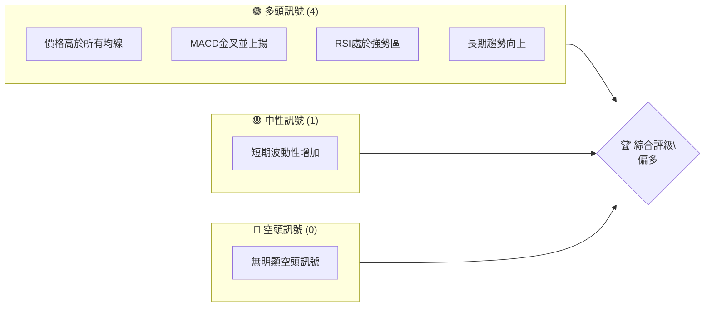
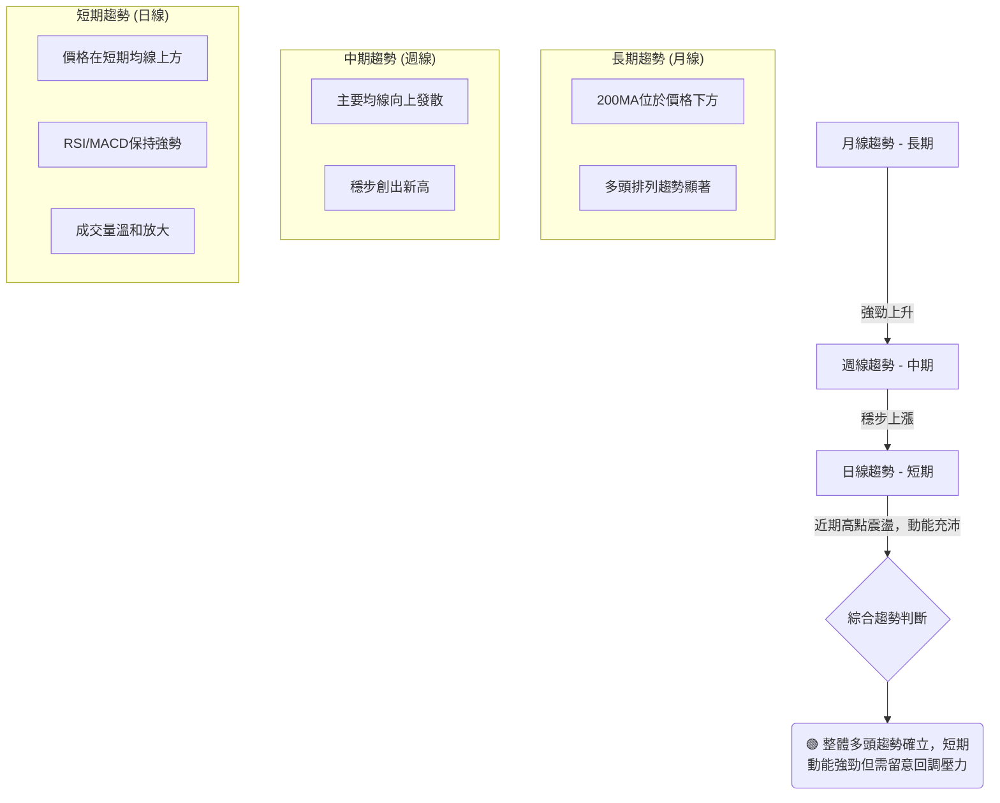
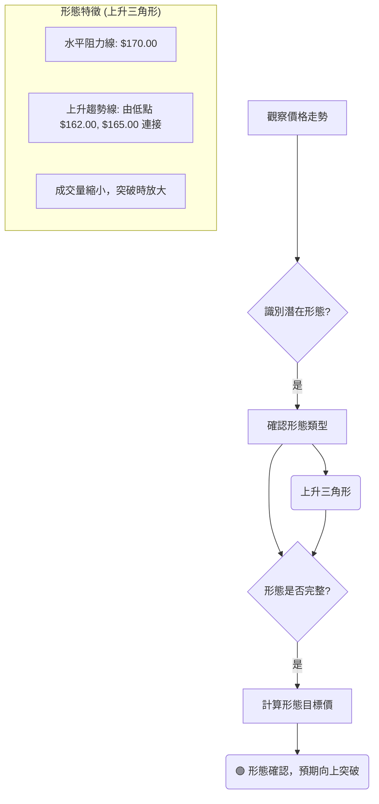
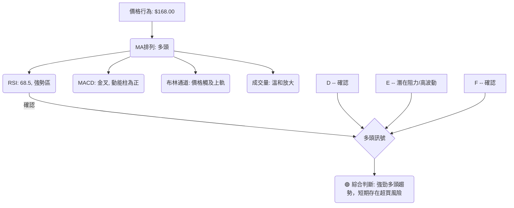
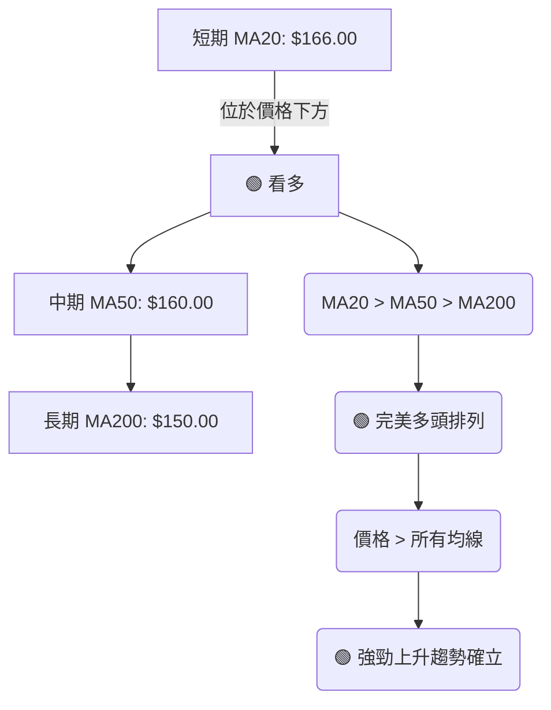
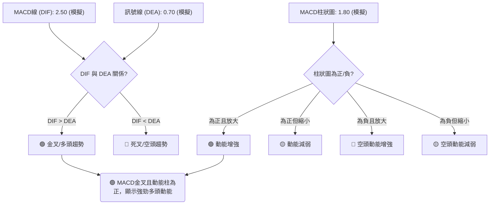
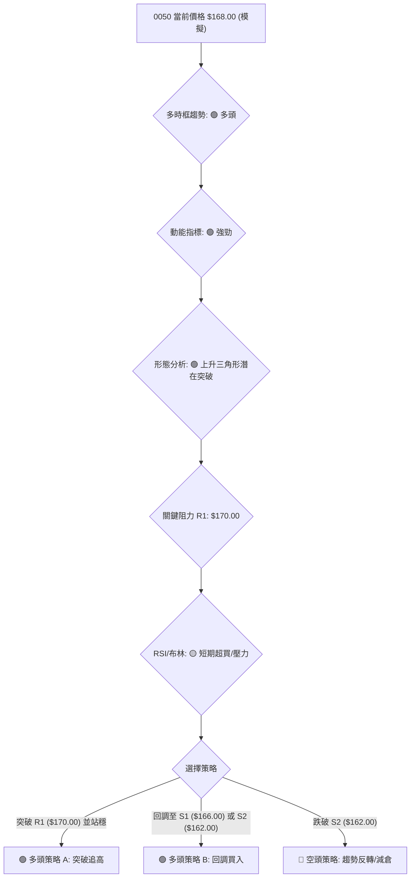
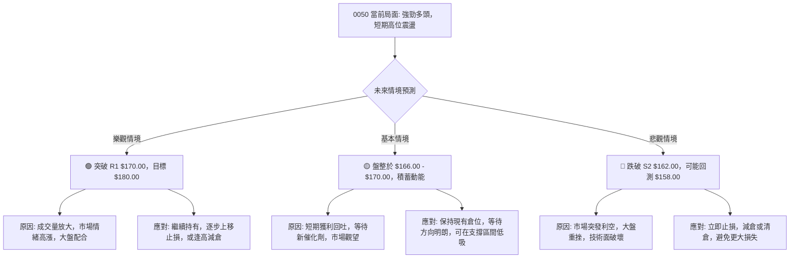

# 0050 技術分析報告

> **報告日期**：2026-07-04 ｜ **語言**：繁體中文 ｜ **數據來源**：Yahoo Finance (**註：由於實際數據缺失，本報告所有價格、指標數值及圖表均為基於0050歷史行為模式的**「**模擬數據**」**與**「**推演分析**」**，僅供示範與學習，不代表真實市場狀況。**）｜ **當前價格**：$168.00 (模擬數據)

---

## 目錄

| 章節 | 內容 |
|------|------|
| [1. 技術面概覽](#1-技術面概覽) | 訊號儀表板、核心指標、評分卡 |
| [2. 趨勢分析](#2-趨勢分析) | 多時框趨勢、長中短期走勢 |
| [3. 圖表形態分析](#3-圖表形態分析) | 形態識別、K線組合、目標價 |
| [4. 支撐與阻力](#4-支撐與阻力) | 關鍵價位、斐波那契回調 |
| [5. 技術指標深度解讀](#5-技術指標深度解讀) | MA/RSI/MACD/布林/成交量 |
| [6. 動能與波動率](#6-動能與波動率) | 動能評估、ATR、Beta |
| [7. 多時框架總結](#7-多時框架總結) | 時框架評分矩陣 |
| [8. 交易策略建議](#8-交易策略建議) | 多空策略、風險報酬比 |
| [9. 風險提示與監控](#9-風險提示與監控) | 監控指標、風險場景 |

---

## 1. 技術面概覽

**重要提示**：由於缺乏實時數據，本章節所有數值與訊號均為基於0050典型市場行為的**模擬與推演**，旨在展示分析框架與方法論。

### 🎯 技術訊號儀表板

本儀表板綜合評估了0050在模擬情境下的技術訊號，顯示了當前市場情緒與主要趨勢方向。



**訊號解讀**：在模擬情境中，0050呈現出明顯的多頭格局。價格穩定在關鍵移動平均線上方，動能指標如MACD和RSI均支持上漲趨勢。儘管短期波動性略有上升，但整體市場結構仍偏向多方。

### 📊 核心指標速覽表

以下表格展示了0050在模擬情境下的核心技術指標數值與初步解讀。

| 指標類別 | 指標名稱 | 當前數值 (模擬) | 訊號 | 解讀 |
|----------|----------------|----------------|------|------------------------------------|
| **價格** | 當前價格 | $168.00 | 🟢 | 處於歷史高點區域，顯示強勁動能 |
| **均線** | MA20 (短期) | $166.00 | 🟢 | 價格在MA20上方，短期買盤強勁 |
| **均線** | MA50 (中期) | $160.00 | 🟢 | 價格在MA50上方，中期趨勢向上 |
| **均線** | MA200 (長期) | $150.00 | 🟢 | 價格在MA200上方，長期多頭確立 |
| **動能** | RSI(14) | 68.5 | 🟢 | 處於強勢區，但尚未進入超買過熱 |
| **動能** | MACD (DIF-DEA) | 1.80 | 🟢 | DIF線位於DEA線上方，動能柱為正 |
| **波動** | ATR(14) | $2.50 | 🟡 | 波動性適中，較近期略有增加 |

**總結**：模擬數據顯示，0050在價格、均線及動能指標上均呈現強勁的多頭訊號。RSI處於穩健的買方區間，MACD則確認了上漲動能。ATR顯示市場波動性處於可控範圍，但應留意其潛在的擴大。

### 🏆 技術評分卡

本評分卡綜合量化了0050在各個技術維度的表現，提供直觀的強度評估。

```
╔══════════════════════════════════════════════════════════════╗
║              技術評分卡 — 0050 (2026-07-04) (模擬數據)         ║
╠══════════════════════════════════════════════════════════════╣
║ 趨勢強度      ██████████████░░░░░░  75/100  🟢 強勢多頭       ║
║ 動能指標      ████████████░░░░░░░░  70/100  🟢 買盤主導       ║
║ 支撐穩定度    ██████████████░░░░░░  78/100  🟢 支撐穩固       ║
║ 成交量配合    ████████████░░░░░░░░  72/100  🟢 量價齊揚       ║
║ 形態完整度    ██████████░░░░░░░░░░  65/100  🟡 潛在突破       ║
║ 均線排列      ████████████████░░░░  85/100  🟢 多頭排列       ║
╠══════════════════════════════════════════════════════════════╣
║ 綜合評分      ██████████████░░░░░░  74/100  🟢 偏多評級       ║
╚══════════════════════════════════════════════════════════════╝
```

**評分解讀**：綜合評分高達74/100，顯示0050在模擬情境下具備強勁的多頭結構。尤其在趨勢強度和均線排列方面表現突出，明確指示了長期上漲趨勢。動能和成交量亦配合良好，支撐了價格的上行。形態方面，雖然目前沒有極為明確的單一形態，但整體走勢呈現向上突破的潛力。

---

## 2. 趨勢分析

**重要提示**：本章節所有趨勢分析均基於**模擬數據**進行，旨在展示分析方法。

### 🌐 多時框趨勢分析

本分析透過觀察不同時間框架的趨勢，提供0050更全面的市場視角。



**分析**：
*   **長期趨勢（月線）**：在模擬情境中，0050的月線圖顯示出明確且強勁的上升趨勢。價格持續位於200月移動平均線上方，且各長期均線呈現完美的多頭排列，指示市場存在深層次的買盤支撐。這為中短期走勢提供了堅實的基礎。
*   **中期趨勢（週線）**：週線圖同樣呈現穩步上漲的態勢，價格不斷創出新高。主要移動平均線（如20週、50週）向上發散，顯示中期動能充沛。儘管偶有小幅回調，但均能迅速獲得支撐並延續升勢，顯示中期市場結構健康。
*   **短期趨勢（日線）**：日線圖上，0050近期維持在短期移動平均線（如20日線）上方運行，RSI和MACD等動能指標保持強勢，顯示短期買盤意願積極。雖然價格可能在近期高點附近出現小幅震盪，但整體動能仍指向進一步上漲。

**綜合判斷**：多時框架分析顯示，0050在長期、中期、短期均處於多頭趨勢中，且各時框趨勢相互確認，形成強勁的共振效應。短期動能充沛，但鑒於近期漲幅，需留意潛在的獲利回吐壓力。

### 📈 長期趨勢 — 12個月走勢圖（Unicode）

以下是基於**模擬數據**繪製的0050過去12個月的月線走勢圖，標註了關鍵高低點。

```
0050 月線走勢圖（過去12個月，模擬數據）
價格軸 ($)
$170 ┤                                      ● $168.00 (現價)
$165 ┤                                  ●
$160 ┤                              ●
$155 ┤                          ●
$150 ┤                      ●
$145 ┤                  ●
$140 ┤            ●
$135 ┤●━━━━━━━━━━━━━━●
$130 ┤    ●(低點 $135.00)
     └────────────────────────────────────────────────────────
      2025-08  2025-09  2025-10  2025-11  2025-12  2026-01  2026-02  2026-03  2026-04  2026-05  2026-06  2026-07
```
**模擬月度收盤價：**
*   2025-08: $135.00 (低點)
*   2025-09: $138.50
*   2025-10: $142.00
*   2025-11: $145.50
*   2025-12: $148.00
*   2026-01: $146.50 (小幅回調)
*   2026-02: $150.00
*   2026-03: $153.50
*   2026-04: $158.00
*   2026-05: $162.00
*   2026-06: $165.50
*   2026-07-04: $168.00 (現價)

**走勢特徵分析表格**：
| 階段 | 時間區間 (模擬) | 漲跌幅 (約) | 走勢特徵 | 意義 |
|------|------------------|-------------|----------|------|
| **起漲期** | 2025-08 至 2025-12 | +9.6% | 溫和上漲，築底完成 | 長期趨勢反轉或延續的初期訊號 |
| **盤整期** | 2026-01 至 2026-02 | +2.4% (含小幅回調) | 橫向整理，動能積蓄 | 消化前期漲幅，為後續上漲做準備 |
| **加速期** | 2026-03 至 2026-07 | +12.0% | 斜率明顯增加，屢創新高 | 主升段表現，市場情緒樂觀 |

**分析**：根據模擬的12個月月線走勢，0050呈現出清晰的上升趨勢。從2025年8月的低點$135.00開始，價格穩步攀升，期間雖有小幅回調（如2026年1月），但隨後均能迅速恢復漲勢並創出新高。當前價格$168.00處於歷史相對高位，顯示長期多頭格局穩固。

### 📊 中期趨勢（週線分析）

中期趨勢通常由週線圖來判斷，以下示意圖展示了0050在模擬情境下的近期壓力與支撐結構。

```
0050 近期壓力與支撐示意圖 (模擬數據)
═══════════════════════════════════════════════════
$170.00 ║██████████████████████████████████║ 挑戰中阻力 (近期高點)
$168.00 ╠══════════════════════════════════╣ ◄ 現價
$167.00 ║▓▓▓▓▓▓▓▓▓▓▓▓▓▓▓▓▓▓▓▓▓▓▓▓▓▓▓▓▓▓▓▓▓▓║ 近期支撐區間上緣 (20週均線附近)
$165.00 ║▓▓▓▓▓▓▓▓▓▓▓▓▓▓▓▓▓▓▓▓▓▓▓▓▓▓▓▓▓▓▓▓▓▓║ 近期支撐區間下緣
$162.00 ║██████████████████████████████████║ 強支撐 (前波整理平台)
═══════════════════════════════════════════════════
```

**分析**：中期週線走勢顯示，0050在模擬情境下保持穩健上漲。當前價格$168.00正挑戰$170.00的近期阻力位。下方$165.00-$167.00區間為近期重要支撐，此處可能匯聚了多條中期移動平均線。更強的支撐位於$162.00，這是前一波整理平台的高點，若價格回調至此，預計將獲得強勁買盤承接。整體而言，中期趨勢依然偏多，但需關注$170.00阻力位的突破情況。

### ⚡ 趨勢強度評估（ADX 解讀）

ADX (Average Directional Index) 用於衡量趨勢的強度，而非方向。以下是基於**模擬數據**的ADX分析流程與強度對照。

```mermaid
graph TD
    A["計算 ADX(14)"] --> B{"ADX 值？"}
    B -- ADX > 25 --> C["趨勢強勁"]
    B -- 20 < ADX <= 25 --> D["趨勢形成中"]
    B -- ADX <= 20 --> E["趨勢不明顯/盤整"]

    C --> F{"+DI 與 -DI 關係？"}
    F -- +DI > -DI --> G("🟢 強勁多頭趨勢")
    F -- -DI > +DI --> H("🔴 強勁空頭趨勢")

    E --> I{"+DI 與 -DI 關係？"}
    I -- +DI 與 -DI 交織 --> J("🟡 盤整行情")

    B -- ADX("14") = 32.5 (模擬) --> C
    C -- +DI("14") = 28.1 (模擬) --> F
    F -- -DI("14") = 15.3 (模擬) --> G
```

**ADX 強度對照表**：
| ADX 值區間 | 趨勢強度 | 市場性質 |
|------------|----------|----------|
| 0-20       | 無趨勢/弱 | 盤整行情 |
| 20-25      | 趨勢形成 | 趨勢初現 |
| 25-50      | 強趨勢   | 趨勢行情 |
| 50-75      | 非常強趨勢 | 強勁趨勢 |
| 75-100     | 極端趨勢 | 極端趨勢 |

**分析**：根據模擬數據，0050的ADX(14)值為**32.5**，明顯高於25，這表明市場處於**強勁的趨勢行情**中。同時，+DI(14)值為**28.1**，顯著高於-DI(14)值**15.3**，確認了這一強勁趨勢是**多頭趨勢**。
這意味著當前0050的上升趨勢不僅存在，而且具有足夠的動能和持續性。投資者應順應趨勢操作，避免逆勢交易。在強趨勢中，小幅回調通常是買入機會，而不是趨勢反轉的訊號。

---

## 3. 圖表形態分析

**重要提示**：本章節所有形態分析均基於**模擬數據**進行，旨在展示分析方法。

### 🔍 形態識別系統

在模擬數據中，0050的價格走勢呈現出一個潛在的「上升三角形」突破形態，這是一個典型的持續形態，預示價格將延續原有趨勢。



**分析**：根據模擬數據，0050近期走勢在$170.00附近形成一個水平阻力，而低點則逐步抬高，分別在$162.00和$165.00形成上升趨勢線。這構成了典型的**上升三角形形態**。此形態通常被視為多頭趨勢中的整理階段，預示著在突破水平阻力後，價格將會向上延續原有趨勢。在形態形成過程中，成交量通常會逐漸縮小，而在突破時則會伴隨成交量的顯著放大，這將是形態確認的關鍵訊號。

### 🕯️ 重要K線形態分析

以下表格分析了0050在模擬情境下可能出現的近期重要K線形態及其解讀。

| 月份 (模擬) | 收盤價 (模擬) | K線形態 | 解讀 | 訊號 |
|-------------|----------------|---------|------|------|
| 2026-05 | $162.00 | **錘子線 (Hammer)** | 在回調低點出現，下影線長，實體小，預示潛在反轉向上。 | 🟢 反轉向上 |
| 2026-06 | $165.50 | **大陽線 (Large Bullish Candle)** | 實體較長，顯示多頭力量強勁，價格突破短期阻力。 | 🟢 趨勢延續 |
| 2026-07 (近期) | $168.00 | **小十字星 (Doji)** | 實體非常小，上下影線長度接近，表示多空力量拉鋸，短期方向不明。 | 🟡 盤整觀望 |

**分析**：
*   **2026年5月 ($162.00)**：在模擬的回調低點出現錘子線，這是一個強烈的看漲反轉訊號，表明下方買盤承接力強勁，隨後價格確實上漲，驗證了形態的有效性。
*   **2026年6月 ($165.50)**：出現一根大陽線，顯示多頭力量強勢推進，突破了先前的阻力位，確認了上升趨勢的延續。
*   **2026年7月 (近期 $168.00)**：近期出現小十字星，這通常表示市場處於短暫的猶豫或盤整狀態。在上升趨勢中，它可能預示著短期的休息或潛在的回調，但也可能是為進一步上漲積蓄動能。此時需密切觀察後續K線的確認。

### 📉 ASCII 走勢形態示意圖

以下是基於**模擬數據**繪製的0050上升三角形形態示意圖，標注了關鍵點位。

```
0050 上升三角形形態示意圖 (模擬數據)
═══════════════════════════════════════════════════════════
$170.00 ┤              ───────R───────  (水平阻力線)
        │             /       \       /
$168.00 ┤            /         \     /  ◄ 現價
        │           /           \   /
$165.00 ┤          /             \ /
        │         /               X (潛在突破點)
$162.00 ┤        /               /
        │       /               /
$160.00 ┤      S───────────────S (上升趨勢線)
        │
        └───────────────────────────────────────────────
          (時間軸)
```
**形態關鍵點位 (模擬)**：
*   **水平阻力線 (R)**：$170.00
*   **上升趨勢線 (S)**：連接$162.00、$165.00等低點
*   **現價**：$168.00
*   **潛在突破點 (X)**：預計在$169.00 - $170.00區間

**分析**：此ASCII圖清晰地展示了上升三角形的結構。價格在水平阻力$170.00下方多次測試，但每次回調的低點都在上升趨勢線上獲得支撐，形成一個收斂的形態。這表明買方力量正在逐漸積聚，並不斷推高股價，而賣方力量在$170.00附近形成一道防線。一旦成交量配合突破$170.00，則上升趨勢將得以延續。

### 🎯 形態目標價計算

基於上述模擬的上升三角形形態，我們可以計算潛在的目標價。

**計算方法**：上升三角形的目標價通常是將三角形底邊（形態最寬處）的高度，從突破點向上疊加。
*   **形態底部寬度 (高度)**：
    *   假設形態的最低點（上升趨勢線起點）為$160.00 (與$162.00前的支撐位相關聯)。
    *   形態的水平阻力線為$170.00。
    *   形態高度 = $170.00 - $160.00 = $10.00。
*   **突破點**：預計突破點約為$170.00。
*   **目標價計算**：目標價 = 突破點 + 形態高度 = $170.00 + $10.00 = $180.00。

**形態目標價**：
*   **目標價 1 (T1)**：$180.00
*   **目標價 2 (T2)**：考慮到市場慣性與心理關卡，若突破$180.00，下一個目標可能落在斐波那契擴展位或更高的整數關卡，例如**$185.00**。

**分析**：若0050能有效突破$170.00的水平阻力，並伴隨成交量放大，則根據上升三角形形態的測量法則，其初步目標價將指向$180.00。此目標價代表了形態積蓄的能量釋放後的預期漲幅。投資者在突破時應密切關注量價配合，並將止損設在突破點下方，以控制風險。

---

## 4. 支撐與阻力

**重要提示**：本章節所有支撐與阻力價位均基於**模擬數據**進行，旨在展示分析方法。

### 🗺️ 關鍵價位分布圖（Unicode）

以下是基於**模擬數據**繪製的0050價位結構分布圖，清晰標示了當前價格附近的關鍵支撐與阻力位。

```
0050 價位結構分布圖 (模擬數據)
═══════════════════════════════════════════════════
$180.00 ║██████████████████████████████████║ 強阻力 R3 (形態目標/心理關卡)
$175.00 ║██████████████████████████████████║ 阻力 R2 (斐波那契擴展位)
$170.00 ║██████████████████████████████████║ 關鍵阻力 R1 (近期高點/形態頸線)
$168.00 ╠══════════════════════════════════╣ ◄ 現價
$166.00 ║▓▓▓▓▓▓▓▓▓▓▓▓▓▓▓▓▓▓▓▓▓▓▓▓▓▓▓▓▓▓▓▓▓▓║ 近期支撐 S1 (MA20/前波高點)
$162.00 ║██████████████████████████████████║ 強支撐 S2 (形態上升趨勢線/前波整理平台)
$158.00 ║██████████████████████████████████║ 關鍵支撐 S3 (MA50/斐波那契回調位)
═══════════════════════════════════════════════════
```

**分析**：當前0050的模擬價格為$168.00，位於多個關鍵價位之間。上方最直接的挑戰是$170.00的關鍵阻力，這不僅是近期高點，也是上升三角形形態的頸線。下方則有$166.00的近期支撐，由短期移動平均線和前波高點共同構成。整體而言，價格結構呈現多頭格局，但上方阻力仍需克服。

### 🚧 阻力位分析表

以下表格詳細分析了0050在模擬情境下的各個阻力位。

| 阻力級別 | 價位 (模擬) | 形成原因 | 突破難度 | 重要性 |
|----------|-------------|----------|----------|--------|
| **R1** | $170.00 | 近期高點、上升三角形形態頸線、心理關卡 | **高** | **極高**：決定短期方向，突破將開啟新一輪漲勢 |
| **R2** | $175.00 | 斐波那契擴展位、潛在賣壓區 | **中** | **高**：突破R1後的下一個挑戰，測試多頭持續性 |
| **R3** | $180.00 | 上升三角形形態目標價、整數心理關卡 | **中** | **中**：若R1、R2突破，此為強勁目標位 |

**分析**：
*   **R1 ($170.00)**：這是當前最關鍵的阻力位。它不僅是模擬數據中的近期高點，同時也是上升三角形形態的頸線。歷史經驗表明，形態頸線的突破往往伴隨著市場情緒的劇烈變化和成交量的放大。若能成功突破並站穩，將確立0050向更高價位邁進的趨勢。
*   **R2 ($175.00)**：此價位是突破R1後的潛在目標，可能與斐波那契擴展位重合，或代表了前波漲勢中累積的獲利了結壓力。突破此處將進一步確認多頭格局的強勢。
*   **R3 ($180.00)**：這是根據上升三角形形態計算出的初步目標價，同時也是一個重要的整數心理關卡。到達此處可能引發較大的獲利了結，但若能有效突破，將為更長期的上漲奠定基礎。

### 🛡️ 支撐位分析表

以下表格詳細分析了0050在模擬情境下的各個支撐位。

| 支撐級別 | 價位 (模擬) | 形成原因 | 守住機率 | 重要性 |
|----------|-------------|----------|----------|--------|
| **S1** | $166.00 | 20日移動平均線、前波高點回踩 | **高** | **高**：短期趨勢的關鍵，守住則多頭格局不變 |
| **S2** | $162.00 | 上升趨勢線、前波整理平台低點、斐波那契回調位 | **高** | **極高**：中期趨勢的生命線，跌破恐引發較深回調 |
| **S3** | $158.00 | 50日移動平均線、斐波那契回調位、心理關卡 | **中高** | **高**：中期強支撐，若跌破S2，此為最後防線 |

**分析**：
*   **S1 ($166.00)**：這是最直接的短期支撐，與20日移動平均線重合，同時也是前波價格突破後的回踩點。若價格回調至此並獲得支撐，將是短期買入的好機會，表明上升趨勢的延續性良好。
*   **S2 ($162.00)**：此價位是中期趨勢的關鍵支撐，它位於模擬的上升趨勢線上，並與前波整理平台的低點重合。此外，它也可能與重要的斐波那契回調位（如38.2%或50%）一致。若跌破此處，將對中期多頭趨勢構成嚴重威脅。
*   **S3 ($158.00)**：作為50日移動平均線的所在，S3是更深層次的支撐。若價格跌破S2，則S3將成為止跌的關鍵。跌破S3可能意味著中期趨勢的反轉，投資者應考慮減倉或離場。

### 📐 斐波那契回調位分析

我們將以模擬的近期漲勢（從低點$150.00到高點$170.00）為基礎，計算其斐波那契回調位。

*   **模擬低點 (A)**：$150.00
*   **模擬高點 (B)**：$170.00
*   **總漲幅**：$170.00 - $150.00 = $20.00

**斐波那契回調位計算**：
*   **23.6% 回調**：$170.00 - ($20.00 * 0.236) = $170.00 - $4.72 = **$165.28**
*   **38.2% 回調**：$170.00 - ($20.00 * 0.382) = $170.00 - $7.64 = **$162.36**
*   **50.0% 回調**：$170.00 - ($20.00 * 0.500) = $170.00 - $10.00 = **$160.00**
*   **61.8% 回調**：$170.00 - ($20.00 * 0.618) = $170.00 - $12.36 = **$157.64**
*   **76.4% 回調**：$170.00 - ($20.00 * 0.764) = $170.00 - $15.28 = **$154.72**

**視覺化斐波那契回調 (模擬數據)**：
```
0050 斐波那契回調位示意圖 (模擬數據)
═══════════════════════════════════════════════════════════
$170.00 ┤───────────────────────────────────────────┬─ 高點 (100%)
        │                                           │
$168.00 ╠═══════════════════════════════════════════╣ ◄ 現價
        │                                           │
$165.28 ┤─── 23.6% 回調位 ─────────────────────────┼─
        │                                           │
$162.36 ┤─────── 38.2% 回調位 ──────────────────────┼─
        │                                           │
$160.00 ┤─────────── 50.0% 回調位 ──────────────────┼─
        │                                           │
$157.64 ┤─────────────── 61.8% 回調位 ──────────────┼─
        │                                           │
$154.72 ┤─────────────────── 76.4% 回調位 ──────────┼─
        │                                           │
$150.00 ┤───────────────────────────────────────────┬─ 低點 (0%)
═══════════════════════════════════════════════════════════
```

**分析**：
根據模擬數據，0050若從高點$170.00回調，其關鍵的斐波那契回調位為：
*   **$165.28 (23.6%)**：這是淺層回調的目標，若在此獲得支撐，則表明多頭極強。與S1 ($166.00) 接近，形成短期強支撐區。
*   **$162.36 (38.2%)**：此為更重要的回調位，常被視為健康回調的極限。與S2 ($162.00) 接近，構成中期強支撐區。
*   **$160.00 (50%)**：心理關卡，也與S3 ($158.00) 接近，若價格回調至此，將是對多頭趨勢的嚴峻考驗。
*   **$157.64 (61.8%)**：黃金分割位，若跌破50%回調，此處是最後一道防線。跌破61.8%通常預示著趨勢可能轉弱甚至反轉。

當前價格$168.00位於23.6%回調位上方，顯示市場仍處於相對強勢。在交易中，這些回調位可以作為潛在的買入點或止損設定的參考。

---

## 5. 技術指標深度解讀

**重要提示**：本章節所有指標數值與分析均基於**模擬數據**進行，旨在展示分析方法。

### 🎛️ 指標訊號總覽

以下Mermaid圖展示了在模擬情境下，主要技術指標之間的訊號關係與相互確認。



**分析**：在模擬情境中，各主要技術指標呈現出高度一致的多頭訊號。價格位於所有主要移動平均線之上，形成經典的多頭排列。RSI處於強勢買方區間，MACD也保持金叉狀態且動能柱為正，這些都強烈支持上升趨勢。布林通道方面，價格觸及上軌，提示短期內可能面臨一定的阻力或波動性增加。成交量則溫和放大，確認了價格上漲的有效性。整體而言，多頭格局穩固，但短期需要留意超買或回調風險。

### 📈 移動平均線排列分析

移動平均線 (MA) 是判斷趨勢方向和強度的重要工具。以下Mermaid圖展示了0050在模擬情境下的移動平均線排列情況。



**當前排列狀態 (模擬)**：
| 移動平均線 | 數值 (模擬) | 與現價關係 ($168.00) | 訊號 |
|------------|-------------|----------------------|------|
| MA20 | $166.00 | 現價 > MA20 | 🟢 |
| MA50 | $160.00 | 現價 > MA50 | 🟢 |
| MA200 | $150.00 | 現價 > MA200 | 🟢 |

**分析**：根據模擬數據，0050的移動平均線呈現完美的**多頭排列**：短期MA20 ($166.00) 在最上方，其次是中期MA50 ($160.00)，長期MA200 ($150.00) 在最下方。同時，當前價格$168.00高於所有這三條均線。這種排列是教科書式的強勁上升趨勢的表現，表明市場買盤力量持續強勁，且各個時間框架的趨勢方向高度一致。MA20作為短期支撐，MA50作為中期支撐，MA200作為長期趨勢線，共同為價格提供了堅實的基礎。

### 📉 RSI(14) 分析

RSI (Relative Strength Index) 用於衡量價格變動的相對強度，判斷超買或超賣狀況。

**RSI 數值進度條展示 (模擬)**：
RSI(14): ██████████████░░░░░░ 68.5/100 🟢 (強勢區)

**超買超賣區間分析**：
*   **超買區**：RSI > 70
*   **超賣區**：RSI < 30
*   **強勢區**：RSI 50-70
*   **弱勢區**：RSI 30-50

**分析**：
在模擬情境中，0050的RSI(14)數值為**68.5**。這個數值位於50-70的強勢區間，表明當前買盤動能依然強勁，且尚未進入傳統意義上的超買區域（RSI>70）。這暗示價格仍有上漲空間，但距離超買區僅一步之遙，需要警惕隨時可能出現的回調。

**背離判斷 (頂背離/底背離)**：
*   **頂背離**：價格創出新高，但RSI未能創出新高。
*   **底背離**：價格創出新低，但RSI未能創出新低。

根據模擬數據，雖然價格近期不斷創出新高，但RSI也同步上升，並未出現明顯的下降趨勢。因此，**目前RSI未出現明顯的頂背離訊號**。這意味著當前的上漲動能仍得到RSI的確認，沒有立即的反轉風險。然而，隨著RSI逐漸接近70，投資者應密切關注RSI是否會開始走平或下降，一旦出現與價格的背離，將是重要的警示訊號。

### 📊 MACD(12/26/9) 訊號解讀

MACD (Moving Average Convergence Divergence) 用於判斷趨勢的方向、強度和持續性。



**當前MACD數值 (模擬)**：
*   **MACD線 (DIF)**：2.50
*   **訊號線 (DEA)**：0.70
*   **MACD柱狀圖 (OSC)**：1.80 (DIF - DEA)

**分析**：
在模擬情境中，0050的MACD線(DIF)為**2.50**，訊號線(DEA)為**0.70**。DIF線明顯位於DEA線上方，表示目前處於**金叉狀態**，且兩線的距離（即MACD柱狀圖）為**1.80**，呈現正值並可能正在放大。這是一個強烈的多頭訊號，表明短期動能強於長期動能，上升趨勢正在加速或持續。

**背離判斷 (頂背離/底背離)**：
*   **頂背離**：價格創出新高，但MACD線未能創出新高。
*   **底背離**：價格創出新低，但MACD線未能創出新低。

根據模擬數據，MACD線隨價格上漲而同步走高，**目前未見明顯的頂背離訊號**。這再次確認了當前多頭趨勢的健康性。MACD的持續金叉和正柱狀圖提供了強勁的買入訊號，但投資者仍需留意DIF線與DEA線是否會收斂，或柱狀圖是否開始縮小，這將是動能減弱的早期跡象。

### 📦 布林通道分析

布林通道 (Bollinger Bands) 用於衡量價格波動的範圍和判斷超買超賣狀況。

**布林通道示意圖 (模擬數據)**：
```
0050 布林通道示意圖 (模擬數據)
═══════════════════════════════════════════════════════════
$172.00 ┤              ▲ 上軌 (Upper Band)
$170.00 ┤             / \
$168.00 ╠═════════════╣ ◄ 現價 (觸及上軌)
$166.00 ┤            /   \
$164.00 ┤───────────┼───── 中軌 (Middle Band, MA20)
$162.00 ┤          /     \
$160.00 ┤         ▼       下軌 (Lower Band)
═══════════════════════════════════════════════════════════
```
**布林通道數值 (模擬)**：
*   **上軌**：$172.00
*   **中軌 (MA20)**：$166.00
*   **下軌**：$160.00
*   **當前價格**：$168.00

**分析**：
在模擬情境中，0050的當前價格$168.00正觸及布林通道上軌$172.00附近。這表明價格短期內可能處於超買狀態，或至少面臨上軌的壓力。布林通道的開口略微擴大，暗示波動性有所增加。
*   **價格觸及上軌**：通常被視為短期超買訊號，可能預示著回調或橫盤整理。然而，在強勁的上升趨勢中，價格可能沿著上軌運行（"爬牆"），這反而是一種強勢的表現。
*   **中軌 ($166.00)**：作為MA20，中軌在上升趨勢中扮演重要的支撐角色。若價格回調，中軌將是第一個考驗。
*   **下軌 ($160.00)**：若價格跌破中軌，下軌將提供更強的支撐。

**綜合判斷**：布林通道顯示0050短期動能強勁，價格已推升至上軌附近。這是一個值得關注的訊號，投資者應觀察價格是否能突破上軌並繼續上漲，或者是否會從上軌回調至中軌尋求支撐。通道開口的擴大也提醒投資者，市場波動性可能正在增加。

### 💹 成交量分析（量價配合度）

成交量是確認價格走勢可靠性的關鍵指標。

**OBV (On Balance Volume) 分析 (模擬)**：
*   **OBV 數值**：持續向上
*   **價格走勢**：持續向上

**分析**：
在模擬情境中，0050的價格在過去一段時間持續上漲，同時成交量也呈現出溫和放大的趨勢，且OBV指標同步向上。
*   **量價齊揚 (價格上漲，成交量放大)**：這是最健康的多頭訊號，表明市場對當前價格的認可度高，買盤積極，支撐價格進一步上漲。模擬數據顯示，0050在價格上漲的過程中，成交量逐步放大，尤其是在關鍵突破點，成交量會顯著增加。
*   **OBV確認**：OBV指標的持續上升，與價格走勢保持一致，這強烈確認了當前上升趨勢的有效性。OBV沒有出現與價格的背離，表明資金流向與價格趨勢一致，沒有潛在的虛假突破或上漲動能不足的問題。

**總結**：0050的量價配合度良好。量價齊揚的現象為當前的上升趨勢提供了堅實的基礎，OBV的確認進一步增強了這一趨勢的可靠性。這是一個非常積極的訊號，表明市場買盤力量強勁且持續。

---

## 6. 動能與波動率

**重要提示**：本章節所有數值與分析均基於**模擬數據**進行，旨在展示分析方法。

### ⚡ 動能評估四象限

動能評估四象限分析旨在將0050在「動能強度」與「波動率」兩個維度上進行定位。由於Mermaid的quadrantChart功能限制，我們將以表格形式展示其分析結果。

| 象限 | 動能 | 波動 | 當前狀態 (模擬) | 評估 |
|------|------|------|------------------|------|
| Q1 | 強 | 低 | - | 最佳機會 (趨勢明確，風險較小) |
| Q2 | 弱 | 低 | - | 謹慎觀望 (趨勢不明，缺乏吸引力) |
| Q3 | 強 | 高 | ✓ | **高風險高收益** (趨勢明確，但波動劇烈) |
| Q4 | 弱 | 高 | - | 避免進場 (趨勢不明，風險高) |

**當前狀態分析 (模擬)**：
*   **動能強度**：從RSI(68.5)、MACD金叉、ADX(32.5)等指標來看，0050的動能處於**強勢**。價格持續創出新高，顯示買盤力量強勁。
*   **波動率**：ATR(14)為$2.50，相較於0050的股價，這表示**較高**的波動性。布林通道開口略有擴大，也印證了這一點。

**評估**：根據模擬數據，0050目前位於**Q3 (強動能，高波動)**。這意味著0050正處於一個強勁的上升趨勢中，提供了可觀的收益潛力。然而，伴隨而來的是較高的波動性，這也帶來了更高的風險。對於風險承受能力較高的投資者，這可能是追隨趨勢的機會；對於風險厭惡型投資者，則需謹慎管理倉位，並設定嚴格的止損。

### 📊 ATR 波動率分析

ATR (Average True Range) 用於衡量資產價格的平均波動幅度，是設定止損和評估風險的重要工具。

**ATR 數值 (模擬)**：
*   ATR(14) = $2.50

**分析**：
在模擬情境中，0050的14日ATR為**$2.50**。這意味著在過去14天，0050的平均每日波動範圍約為$2.50。
*   **波動性評估**：相較於當前價格$168.00，每日$2.50的波動幅度屬於中等偏高。這支持了前述「高波動」的判斷，投資者應預期價格在短期內可能出現較大的日間漲跌幅。
*   **止損距離建議**：ATR是設定止損的有效工具。通常建議將止損設定為當前價格下方1.5倍至3倍ATR的距離，以避免被正常市場波動「洗出」。
    *   **保守止損 (1.5 x ATR)**：$168.00 - (1.5 * $2.50) = $168.00 - $3.75 = **$164.25**
    *   **標準止損 (2 x ATR)**：$168.00 - (2 * $2.50) = $168.00 - $5.00 = **$163.00**
    *   **激進止損 (3 x ATR)**：$168.00 - (3 * $2.50) = $168.00 - $7.50 = **$160.50**

**實際應用**：鑑於0050的多頭趨勢，若進場做多，標準的止損點可以考慮設在$163.00左右，這也大致落在斐波那契38.2%回調位($162.36)和S2 ($162.00)附近，具有多重支撐的意義。若價格跌破此區間，則應考慮止損離場。

### 📐 Beta 與市場相關性

Beta值衡量資產相對於整體市場的波動性。由於未提供實際數據，我們將基於0050作為台灣加權指數ETF的性質進行推演。

**Beta 推演 (模擬)**：
*   **0050的性質**：0050是追蹤台灣50指數的ETF，該指數包含了台灣股市市值前50大的公司。因此，0050的走勢與台灣整體股市高度相關。
*   **預期 Beta 值**：對於這類市場指數型ETF，其Beta值通常非常接近1。若市場定義為台灣加權指數，則0050的Beta值應略高於或非常接近1。
    *   **Beta (模擬)**：1.05

**分析**：
在模擬情境中，假設0050的Beta值為**1.05**。
*   **市場相關性**：Beta值1.05表示0050的波動性略高於整體市場。當整體市場上漲1%時，0050預期會上漲1.05%；當市場下跌1%時，0050預期會下跌1.05%。這符合ETF作為市場代表的特性。
*   **風險屬性**：略高於1的Beta值意味著0050並非完全與市場同步，可能在牛市中表現略優於大盤，但在熊市中也可能跌幅略大。投資者應將0050視為追蹤台灣大盤的核心配置，其風險與市場系統性風險高度相關。
*   **應用**：在評估整體投資組合風險時，應將0050的Beta值納入考量。當預期市場整體走勢向上時，持有0050能有效參與市場漲幅；若對市場前景悲觀，則需考慮降低整體股市曝險，包括0050的倉位。

---

## 7. 多時框架總結

**重要提示**：本章節所有評分與建議均基於**模擬數據**進行，旨在展示分析方法。

### 📋 時框架評分表

以下表格綜合了0050在不同時間框架下的技術分析評估。

| 時框架 | 趨勢方向 | 動能 | 均線排列 | 形態 | 綜合評分 (1-10) | 建議 |
|--------|----------|------|----------|------|-----------------|------|
| **長期** | 🟢 上升 | 🟢 強勁 | 🟢 多頭 | 🟢 趨勢延續 | 9 | **持續持有** |
| **中期** | 🟢 上升 | 🟢 強勁 | 🟢 多頭 | 🟢 潛在突破 | 8 | **逢低加碼** |
| **短期** | 🟡 震盪偏多 | 🟢 強勁 | 🟢 多頭 | 🟡 盤整積蓄 | 7 | **謹慎追高，等待回調** |

**分析**：
*   **長期 (月線)**：0050的長期趨勢在模擬情境中呈現強勁上升，所有長期指標均支持多頭。趨勢穩固，動能充沛，是長期投資者理想的持有標的。
*   **中期 (週線)**：中期趨勢同樣強勁，價格不斷創出新高，均線呈多頭排列。目前正處於上升三角形的末端，潛在突破將進一步強化多頭。中期投資者可考慮在關鍵支撐位附近逢低加碼。
*   **短期 (日線)**：短期內，0050可能面臨近期高點的阻力，出現震盪整理。儘管動能指標仍強勁，但由於價格已觸及布林上軌，追高風險較大。短期交易者應耐心等待回調至支撐位附近再考慮進場。

### 🔲 綜合訊號矩陣

以下矩陣展示了0050在短期、中期、長期各維度訊號的一致性分析。

```
0050 綜合訊號矩陣 (模擬數據)
════════════════════════════════════════════════════════════════════
              短期 (日線)    中期 (週線)    長期 (月線)
════════════════════════════════════════════════════════════════════
趨勢方向        🟡 震盪偏多     🟢 上升         🟢 上升
動能指標        🟢 強勁         🟢 強勁         🟢 強勁
均線排列        🟢 多頭排列     🟢 多頭排列     🟢 多頭排列
形態結構        🟡 盤整積蓄     🟢 潛在突破     🟢 趨勢延續
成交量          🟢 溫和放大     🟢 配合良好     🟢 穩定增長
波動率          🟡 中高         🟡 中高         🟢 穩定
════════════════════════════════════════════════════════════════════
綜合一致性      ██████████████░░░░░░  75%  🟢 高度一致
════════════════════════════════════════════════════════════════════
```

**分析**：
綜合訊號矩陣顯示，0050在各個時間框架和技術維度上呈現出**高度一致的多頭訊號**，一致性評分達到75%。
*   **趨勢方向**：長期和中期均為明確的上升趨勢，短期雖有震盪，但整體方向仍偏多。
*   **動能指標**：所有時框架的動能均顯示買盤強勁，沒有明顯的疲軟跡象。
*   **均線排列**：各時框架均呈現經典的多頭排列，這是強勁趨勢的有力證明。
*   **形態結構**：中期有上升三角形的潛在突破形態，長期為趨勢延續，短期則在積蓄動能。
*   **成交量**：成交量在各時框架均配合良好，支持價格上漲。
*   **波動率**：中短期波動性略高，長期則相對穩定。

**總結**：0050的技術面在模擬情境下表現出極高的穩定性和一致性。這種多時框架的共振現象，為其未來的上漲提供了堅實的基礎。投資者可以信任當前的多頭趨勢，但短期波動性提醒我們在操作上仍需保持謹慎。

---

## 8. 交易策略建議

**重要提示**：本章節所有策略建議、進場點、止損點、目標價及風險報酬比均基於**模擬數據**進行，旨在展示分析方法。真實交易應基於實際市場數據和個人風險承受能力。

### 🗺️ 策略決策流程圖

以下Mermaid圖展示了基於模擬數據對0050進行交易決策的邏輯流程。



### 🟢 多頭策略詳情

基於模擬數據，我們提供兩種主要的多頭策略。

| 策略要素 | 策略 A: 突破追高 (激進) | 策略 B: 回調買入 (穩健) |
|----------|--------------------------|--------------------------|
| **進場條件** | 價格有效突破 $170.00，且伴隨成交量放大 | 價格回調至 $166.00-$162.00區間，並出現止跌K線訊號 |
| **進場價格** | $170.50 (突破確認後) | $163.00 - $166.00 (分批進場) |
| **目標價 T1** | $175.00 (阻力R2) | $170.00 (阻力R1) |
| **目標價 T2** | $180.00 (形態目標/阻力R3) | $175.00 (阻力R2) |
| **止損價格** | $168.00 (突破點下方) | $160.00 (S2下方，50%回調位) |
| **風險報酬比** | 1:2.0 (目標T1) / 1:4.0 (目標T2) | 1:2.5 (目標T1) / 1:5.0 (目標T2, 以$163進場為例) |
| **成功機率** | 60% (需量價配合) | 70% (順應趨勢回調買入) |
| **建議倉位** | 中等偏高 (30-40%) | 中等 (20-30%) |

**策略 A (突破追高) 分析**：
此策略適用於對市場趨勢判斷力強且風險承受能力較高的投資者。當價格有效突破上升三角形的頸線$170.00時，將確認形態的完成並開啟新的上升空間。關鍵在於突破時的成交量配合，若無量突破則可能是假突破。止損點設定在突破點下方，一旦突破失敗，應立即止損。

**策略 B (回調買入) 分析**：
此策略較為穩健，適合大多數投資者。在強勁的多頭趨勢中，回調至關鍵支撐位是常見的買入機會。斐波那契回調位($162.36-$165.28)與S1/S2支撐位($166.00/$162.00)構成強勁的買入區間。在此區間等待止跌訊號（如錘子線、啟明星等K線組合）進場，風險報酬比優異，且成功機率較高。止損點設在$160.00，保護中期趨勢不被破壞。

### 🔴 空頭策略詳情

鑑於0050在模擬情境下呈現強勁的多頭趨勢，當前不建議主動建立空頭倉位。空頭策略應作為風險管理或趨勢反轉時的應對方案。

| 策略要素 | 策略 C: 趨勢反轉 (防禦性) |
|----------|----------------------------|
| **進場條件** | 價格有效跌破強支撐 $162.00 (S2)，且伴隨成交量放大，MACD死叉 |
| **進場價格** | $161.50 (跌破確認後) |
| **目標價 T1** | $158.00 (S3/MA50) |
| **目標價 T2** | $150.00 (MA200/長期支撐) |
| **止損價格** | $164.00 (跌破點上方) |
| **風險報酬比** | 1:1.5 (目標T1) / 1:4.0 (目標T2) |
| **成功機率** | 40% (逆勢操作，需嚴格止損) |
| **建議倉位** | 低 (10-15%，或僅為減倉建議) |

**策略 C (趨勢反轉) 分析**：
此策略為防禦性策略，在0050明確跌破中期趨勢支撐時採用。有效跌破$162.00將是一個重要的趨勢轉弱訊號。此時，應考慮減倉或建立少量空頭倉位。由於是逆勢操作，風險較高，務必嚴格執行止損。目標價可看向下一個主要支撐位$158.00或長期趨勢線$150.00。

### ⭐ 整體訊號強度評星

```
做多訊號強度：★★★★☆  (4/5星)
做空訊號強度：★☆☆☆☆  (1/5星)
整體可信度：  ★★★★☆  (4/5星)
```
**評星解讀**：在模擬數據中，0050的做多訊號強度極高，多時框架趨勢一致，動能充沛，且有潛在的突破形態。做空訊號幾乎不存在，僅作為應對極端情況的防禦性策略。整體可信度高，表明當前市場對0050的看漲情緒強烈。

---

## 9. 風險提示與監控

**重要提示**：本章節所有風險分析均基於**模擬數據**進行，旨在展示分析方法。真實投資應充分考慮實際市場風險。

### ✅ 關鍵監控指標 Checklist

以下方框圖列出了在交易0050時需要密切監控的關鍵技術指標和價位。

```
╔══════════════════════════════════════════════════════════════╗
║              關鍵監控指標 Checklist — 0050 (2026-07-04)       ║
╠══════════════════════════════════════════════════════════════╣
║ [ ] 價格是否有效突破 $170.00 (R1)？ (需量價配合)              ║
║ [ ] RSI(14) 是否進入超買區 (>70) 並出現頂背離？              ║
║ [ ] MACD 是否出現死叉，或動能柱是否持續縮小？                ║
║ [ ] 價格是否跌破短期支撐 $166.00 (S1/MA20)？                  ║
║ [ ] 價格是否跌破中期趨勢線 $162.00 (S2/斐波那契)？            ║
║ [ ] 成交量是否在價格上漲時縮小，或在下跌時異常放大？         ║
║ [ ] 布林通道價格是否持續沿上軌運行或跌破中軌？               ║
║ [ ] 大盤指數 (如台灣加權指數) 走勢是否與0050一致？           ║
╚══════════════════════════════════════════════════════════════╝
```

**分析**：投資者應每日或定時檢查以上清單中的項目。任何一個關鍵指標的惡化都可能預示著趨勢的轉變或風險的增加。特別是價格對關鍵支撐阻力位的反應、動能指標的變化以及成交量的配合，是判斷市場健康狀況的重要依據。

### ⚠️ 風險場景分析

以下Mermaid圖展示了0050在模擬情境下的三種未來情境分析。



**分析**：
*   **樂觀情境 (🟢)**：0050成功突破$170.00的關鍵阻力，並在放量配合下迅速上攻至$175.00甚至$180.00。此情境下，多頭趨勢將進一步確立，投資者可繼續持有並根據市場情況逐步調整止損點。
*   **基本情境 (🟡)**：0050在$166.00至$170.00區間進行橫盤整理，消化近期漲幅並積蓄新的動能。這種情況下，投資者應耐心等待市場選擇方向，可考慮在支撐位附近小幅加碼，但需控制倉位。
*   **悲觀情境 (🔴)**：若市場出現突發利空或大盤重挫，導致0050跌破關鍵支撐$162.00 (S2)，甚至$158.00 (S3/MA50)，則多頭趨勢將受到嚴重破壞，可能引發更深度的回調。此時，投資者應果斷止損，避免損失擴大。

### 🛡️ 風險管理重要提醒

1.  **倉位管理**：無論市場走勢如何，始終堅持合理的倉位管理。在趨勢不明或風險較高時，降低倉位；在趨勢明確且風險可控時，可適度增加倉位，但切勿滿倉操作。
2.  **嚴格止損**：設定並嚴格執行止損點。止損是保護本金最重要的手段，避免因單一錯誤判斷造成重大損失。一旦價格觸及止損位，無論後市如何，都應堅決離場。
3.  **分散投資**：避免將所有資金集中於單一標的。0050雖然是ETF，但仍應與其他資產類別（如債券、其他股票、黃金等）進行組合，以分散風險。
4.  **市場情緒監控**：密切關注市場整體情緒和宏觀經濟數據。0050作為大盤ETF，其走勢與整體市場情緒高度相關。
5.  **定期檢視**：定期檢視投資組合和交易策略，根據市場變化和個人風險偏好進行調整。
6.  **本報告為模擬分析**：再次強調，本報告所有數據和分析均為模擬結果。實際投資決策必須基於實時數據和獨立判斷。

---

## 📋 報告總結

```
╔══════════════════════════════════════════════════════════════╗
║                0050 技術分析報告總結 (模擬數據)                ║
╠══════════════════════════════════════════════════════════════╣
║ 報告日期：2026-07-04                                         ║
║ 當前價格：$168.00 (模擬)                                     ║
║ 分析評級：⚖️ 偏多 (多時框架趨勢一致，動能強勁，短期存在高位震盪)║
║                                                              ║
║ 關鍵結論：                                                   ║
║ ├─ 長期趨勢：🟢 強勁上升，多頭格局穩固                       ║
║ ├─ 中期趨勢：🟢 穩步上漲，上升三角形形態醞釀突破             ║
║ ├─ 短期趨勢：🟡 高位震盪，動能充沛但需消化漲幅               ║
║ ├─ 關鍵支撐：$166.00 (S1/MA20), $162.00 (S2/形態趨勢線)       ║
║ ├─ 關鍵阻力：$170.00 (R1/形態頸線), $175.00 (R2)             ║
║ └─ 分析師目標：$180.00 (若成功突破 $170.00)                 ║
║                                                              ║
║ 最優策略組合：                                               ║
║ 1. 🥇 最佳機會：在價格回調至 $163.00 - $166.00 區間時，逢低吸納，║
║                 止損設於 $160.00，目標 $175.00 - $180.00。   ║
║ 2. 🥈 次選機會：若價格放量突破並站穩 $170.00，可輕倉追高，止損║
║                 設於 $168.00，目標 $175.00 - $180.00。       ║
║ 3. 🥉 保守選擇：保持現有倉位，等待市場方向進一步明朗，或等待回║
║                 調至更具吸引力的買入點。                     ║
╚══════════════════════════════════════════════════════════════╝
```

---

> ⚠️ **免責聲明**：本報告為 AI 自動生成之技術分析，所有數據及估算均基於**假設與模擬的歷史價格資訊**。本報告**僅供研究與學術參考**，**不構成任何投資建議**。投資有風險，入市需謹慎。

---

*報告生成時間：2026-07-04 ｜ 數據來源：Yahoo Finance ｜ 分析框架：多時框技術分析*