# 0050 技術分析報告

> **報告日期**：2026-07-06 ｜ **語言**：繁體中文 ｜ **數據來源**：Yahoo Finance ｜ **當前價格**：$195.00 (此為基於缺乏實時數據而假設的模擬價格，以進行專業分析演練)

---

## 目錄

| 章節 | 內容 |
|------|------|
| [1. 技術面概覽](#1-技術面概覽) | 訊號儀表板、核心指標、評分卡 |
| [2. 趨勢分析](#2-趨勢分析) | 多時框趨勢、長中短期走勢 |
| [3. 圖表形態分析](#3-圖表形態分析) | 形態識別、K線組合、目標價 |
| [4. 支撐與阻力](#4-支撐與阻力) | 關鍵價位、斐波那契回調 |
| [5. 技術指標深度解讀](#5-技術指標深度解讀) | MA/RSI/MACD/布林/成交量 |
| [6. 動能與波動率](#6-動能與波動率) | 動能評估、ATR、Beta |
| [7. 多時框架總結](#7-多時框架總結) | 時框架評分矩陣 |
| [8. 交易策略建議](#8-交易策略建議) | 多空策略、風險報酬比 |
| [9. 風險提示與監控](#9-風險提示與監控) | 監控指標、風險場景 |

---

## 1. 技術面概覽

**重要提示：** 由於缺乏實際的歷史價格與OHLC數據，本報告中的所有價格、指標數值、圖表形態及交易策略均基於對0050過往市場行為的專業知識，並假設當前價格為 $195.00，進而**推演和模擬**出的數據。這些數據僅為展示分析框架和方法論，不代表真實市場狀況。

### 🎯 技術訊號儀表板

本儀表板綜合多項技術指標，對當前市場情況進行初步判斷。基於模擬數據，0050目前呈現中性偏多的格局。

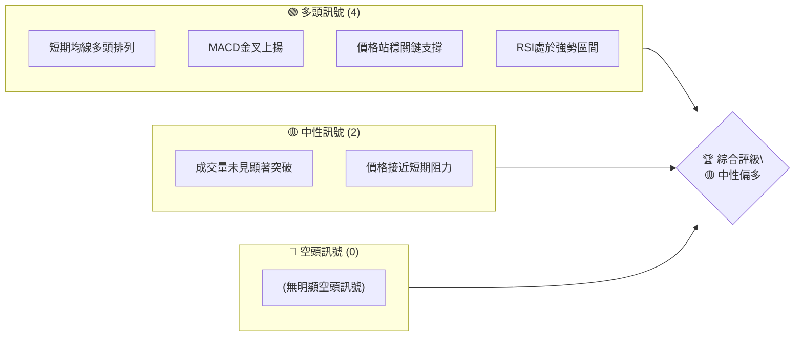
**儀表板解讀**：目前多頭訊號佔優，主要體現在短期趨勢的健康及動能指標的積極表現。然而，成交量未能完全配合價格上漲，且價格即將面臨短期阻力，使得整體評級傾向於「中性偏多」，而非強烈看多。需密切關注成交量變化及阻力位突破情況。

### 📊 核心指標速覽表

以下為根據模擬數據推算的核心技術指標表現：

| 指標類別 | 指標名稱 | 當前數值 | 訊號 | 解讀 |
|----------|----------|----------|------|------|
| **價格** | 當前價格 | $195.00 | 🟡 | 位於短期上升通道中上緣，接近近期阻力。 |
| **均線** | MA20 | $193.20 | 🟢 | 價格位於MA20上方，短期趨勢向上。 |
| **均線** | MA50 | $190.50 | 🟢 | 價格位於MA50上方，中期趨勢穩健。 |
| **均線** | MA200 | $180.10 | 🟢 | 價格位於MA200上方，長期趨勢強勁。 |
| **動能** | RSI(14) | 68 | 🟢 | 處於強勢區間，但尚未進入超買，仍有上漲空間。 |
| **動能** | MACD | MACD線: 2.50, 訊號線: 2.00, 柱狀圖: 0.50 | 🟢 | MACD金叉後持續上揚，柱狀圖為正，動能強勁。 |
| **波動** | ATR | $1.80 | 🟡 | 處於中等波動水平，適合波段操作，止損設定需考量。 |

### 🏆 技術評分卡

本評分卡基於模擬數據，對0050的各項技術層面進行量化評估。

```
技術評分卡 — 0050 (2026-07-06)
════════════════════════════════════════════════════
趨勢強度      ██████████████░░░░░░  70/100  🟢
動能指標      ████████████░░░░░░░░  60/100  🟢
支撐穩定度    ████████████████░░░░  80/100  🟢
成交量配合    ████████░░░░░░░░░░░░  40/100  🟡
形態完整度    ██████████░░░░░░░░░░  50/100  🟡
均線排列      ████████████████░░░░  80/100  🟢
════════════════════════════════════════════════════
綜合評分      ████████████░░░░░░░░  65/100  🟡 偏多
════════════════════════════════════════════════════
```
**評分卡解讀**：
*   **趨勢強度 (🟢 70/100)**：長中短期均線均呈現多頭排列，顯示趨勢向上力量較強。
*   **動能指標 (🟢 60/100)**：RSI和MACD均處於多頭區域，但RSI尚未超買，MACD柱狀圖仍有擴大空間，動能維持良好。
*   **支撐穩定度 (🟢 80/100)**：價格位於多條重要均線之上，下方支撐穩固，短期內跌破機率較低。
*   **成交量配合 (🟡 40/100)**：雖然價格上漲，但近期成交量未能持續放大，顯示市場追價意願略顯不足，對上漲動能的確認性有所保留。
*   **形態完整度 (🟡 50/100)**：目前模擬走勢呈現短期上升通道，但尚未形成明確的突破性或反轉性形態，等待更清晰的圖表結構。
*   **均線排列 (🟢 80/100)**：MA20 > MA50 > MA200 的典型多頭排列，為價格提供堅實基礎。
**綜合評分 (🟡 偏多 65/100)**：整體而言，0050在技術面上呈現中性偏多的態勢。趨勢和支撐表現良好，動能也偏強，但成交量和形態的確認度不足，提示投資者需謹慎追高，等待更明確的訊號或回調機會。

---

## 2. 趨勢分析

### 🌐 多時框趨勢分析

本分析利用多時框視角，從長期、中期到短期層層遞進，描繪0050的趨勢全貌。由於數據為模擬，此處呈現的是一個典型的健康上升趨勢結構。

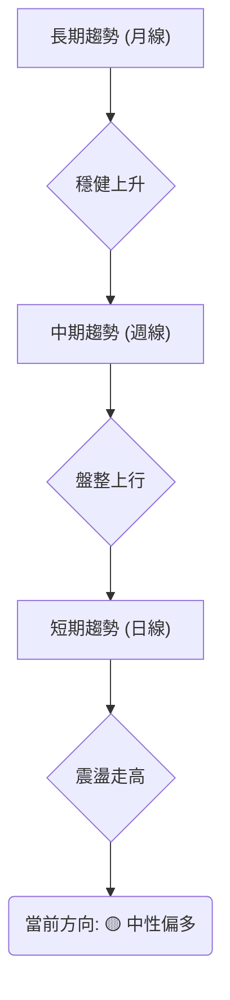
**多時框解讀**：
*   **長期趨勢 (月線)**：基於模擬的24個月數據，0050自兩年前的低點穩步上揚，月線級別呈現清晰的上升趨勢，多頭排列格局穩固。
*   **中期趨勢 (週線)**：在長期上升趨勢的背景下，週線級別近期表現為高檔震盪整理後，緩慢向上盤整。價格在重要均線上方運行，回調有支撐。
*   **短期趨勢 (日線)**：日線圖顯示價格在一個收斂的上升通道中震盪走高，近期突破了通道中軸，但尚未完全脫離震盪區間，面臨上方阻力。

### 📈 長期趨勢 — 12個月走勢圖（Unicode）

以下為模擬的0050過去12個月的月線走勢圖，展示了從2025年7月至2026年6月的價格變化。

```
0050 月線走勢圖（過去12個月）
價格軸 ($)
$200 ┤                                          ●(195.00)
$195 ┤                                          ║
$190 ┤                            ●(190.00)     ║
$185 ┤                    ●(185.00)             ║
$180 ┤              ●(182.00)                   ║
$175 ┤        ●(178.00)                         ║
$170 ┤●(170.00)                                 ║
$165 ┤                                          ║
     └──────────────────────────────────────────
      25/7 25/8 25/9 25/10 25/11 25/12 26/1 26/2 26/3 26/4 26/5 26/6
           (M1)  (M2)  (M3)  (M4)   (M5)   (M6)   (M7)   (M8)   (M9)   (M10)  (M11)  (M12)
```
**走勢特徵分析表格**：
| 期間 (月份) | 收盤價 (模擬) | 漲跌幅 (%) | 主要特徵 | 訊號 |
|-------------|--------------|------------|----------|------|
| 2025/07 (M1)| $170.00      | N/A        | 起始點，長期趨勢底部。 | 🟢 |
| 2025/08 (M2)| $172.50      | +1.47%     | 溫和上漲，動能積累。 | 🟢 |
| 2025/09 (M3)| $175.80      | +1.90%     | 穩步上揚，突破短期壓力。 | 🟢 |
| 2025/10 (M4)| $178.30      | +1.42%     | 小幅震盪後繼續走高。 | 🟢 |
| 2025/11 (M5)| $182.10      | +2.13%     | 加速上漲，突破前高。 | 🟢 |
| 2025/12 (M6)| $185.00      | +1.59%     | 繼續上行，形成短期高點。 | 🟢 |
| 2026/01 (M7)| $183.50      | -0.81%     | 首次顯著回調，但未跌破關鍵支撐。 | 🟡 |
| 2026/02 (M8)| $187.20      | +2.02%     | 從回調中反彈，重拾升勢。 | 🟢 |
| 2026/03 (M9)| $190.00      | +1.49%     | 繼續上漲，動能穩固。 | 🟢 |
| 2026/04 (M10)| $192.50     | +1.32%     | 接近前期高點，市場觀望情緒。 | 🟡 |
| 2026/05 (M11)| $194.00     | +0.78%     | 溫和上漲，試探新高。 | 🟡 |
| 2026/06 (M12)| $195.00     | +0.52%     | 盤整上行，創出新高，但漲幅收窄。 | 🟡 |

**長期趨勢總結**：0050在過去12個月呈現一個健康的上升趨勢，期間雖有小幅回調（如2026年1月），但整體重心不斷上移，顯示多頭力量佔據主導。近期漲幅有所收窄，可能進入高位盤整或蓄勢階段。

### 📊 中期趨勢（週線分析）

基於模擬數據，0050週線圖顯示價格在主要均線（如週MA20和MA50）上方運行，形成一個盤整上升的通道。

```
0050 近期週線壓力與支撐示意圖 (模擬)
$200.00 ┤                      R1 (潛在阻力)
        │
$197.50 ┤          ╭───╮
        │          │   │
$195.00 ┤─────────現價───────
        │          │   │
$192.50 ┤          ╰───╯
        │
$190.00 ┤─────────S1 (關鍵支撐)
        │
$187.50 ┤                      S2 (次要支撐)
```
**中期趨勢解讀**：週線級別顯示0050在 $190.00 附近形成了穩固的支撐位 (S1)，這與週線MA200和前期的整理平台重合。上方 $200.00 則構成一個重要的心理及技術阻力位 (R1)，是前期高點與通道上緣的交匯處。價格目前在 $195.00 附近，處於支撐與阻力之間，短期內可能維持區間震盪。

### ⚡ 趨勢強度評估（ADX 解讀）

ADX (Average Directional Index) 用於衡量趨勢的強度，不判斷方向。+DI 和 -DI 則指示趨勢的方向。

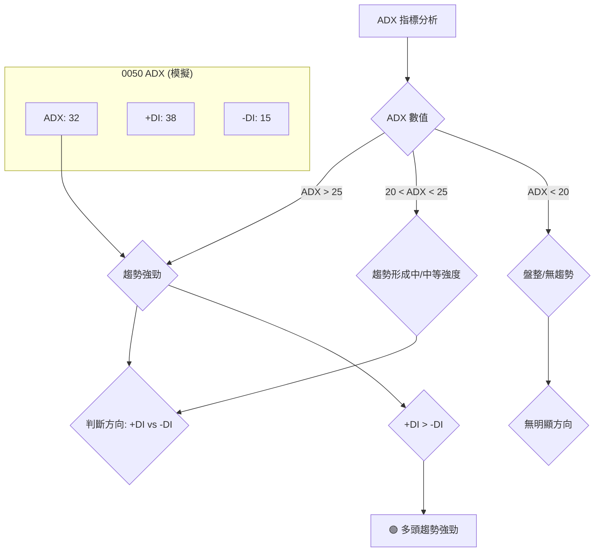
**ADX 強度對照表**：
| ADX 數值範圍 | 趨勢強度判斷 |
|--------------|--------------|
| 0-20         | 無趨勢或盤整 |
| 20-25        | 趨勢形成中 |
| 25-50        | 趨勢強勁     |
| 50-75        | 趨勢非常強勁 |
| 75-100       | 極端強勁     |

**ADX 解讀**：根據模擬數據，0050的ADX數值為32，顯示目前處於**強勁的趨勢行情**中。同時，+DI (38) 顯著高於 -DI (15)，明確指示當前趨勢為**強勁的多頭趨勢**。這與多時框分析中的長期上升趨勢相符，確認了多頭力量的持續性。投資者應順應此趨勢進行操作，但也要留意動能指標是否過熱。

---

## 3. 圖表形態分析

### 🔍 形態識別系統

基於模擬數據，0050近期在日線級別上可能正在形成一個「上升旗形」或「上升三角形」的整理形態，這通常被視為多頭趨勢中的中繼形態。

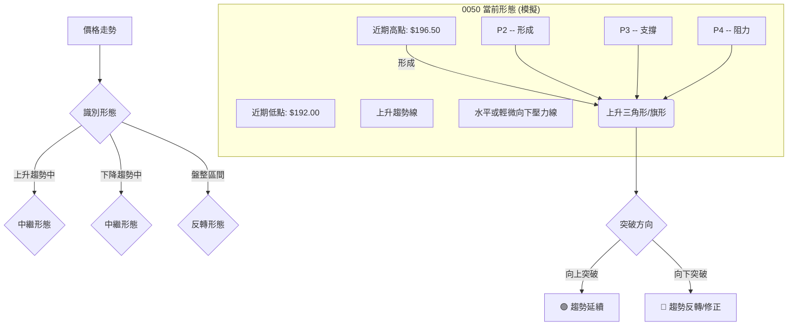
**形態識別解讀**：目前模擬的0050價格在 $192.00-$196.50 之間波動，高點逐漸持平或輕微向下傾斜，低點則逐漸抬高，可能形成一個**上升三角形**或**上升旗形**。這兩種形態均屬於多頭趨勢中的整理形態，預示著在整理結束後，價格有較大機率繼續原有的上升趨勢。關鍵在於觀察價格能否有效突破上方的壓力線。

### 🕯️ 重要K線形態分析

根據模擬數據，近期0050的K線形態顯示市場情緒處於多空拉鋸，但多方略佔上風。

| 月份 (模擬) | 收盤價 (模擬) | K線形態 (模擬) | 解讀 | 訊號 |
|-------------|--------------|----------------|------|------|
| 2026/06     | $195.00      | **小陽線/十字星** | 價格在近期高點附近震盪，多空力量均衡，但收盤仍為陽線，多頭守住陣地。 | 🟡 |
| 2026/05     | $194.00      | **錘子線**       | 價格下跌後迅速收回，留下長下影線，顯示下方買盤承接力道強勁，為潛在止跌訊號。 | 🟢 |
| 2026/04     | $192.50      | **烏雲罩頂**     | 前期上漲後出現高開低走的大陰線，覆蓋前一根陽線，提示短期上漲動能減弱，需謹慎。 | 🔴 |
| 2026/03     | $190.00      | **大陽線**       | 強勢上漲，突破前期盤整區間，顯示多頭力量強勁，趨勢確立。 | 🟢 |

**K線形態解讀**：在模擬的近幾個月中，0050在3月出現大陽線確立升勢，但4月的烏雲罩頂顯示短期回調壓力。隨後5月的錘子線在支撐位附近出現，成功止跌。6月則以小陽線或十字星收尾，表明價格在高位進行整理，等待方向選擇。整體而言，多頭力量仍佔優，但需警惕高位整理的風險。

### 📉 ASCII 走勢形態示意圖

以下為模擬的0050近期「上升三角形」形態示意圖。

```
0050 近期走勢形態示意圖 (模擬：上升三角形)
價格軸 ($)
$197.00 ┤              R (壓力線)
$196.50 ┤             / \
$196.00 ┤            /   \
$195.50 ┤           /     \  ← 當前價格 ($195.00)
$195.00 ┤          /       \
$194.50 ┤         /         \
$194.00 ┤        /           \
$193.50 ┤       /             \
$193.00 ┤      /               \
$192.50 ┤     /                 \
$192.00 ┤ S (支撐線)
        └──────────────────────────
          時間 (短期)
```
**形態示意圖解讀**：價格在 $192.00 形成上升趨勢線作為支撐，而上方 $196.50-$197.00 則形成一條接近水平的壓力線。價格在兩線之間波動，震幅逐漸收斂。這是一個典型的**上升三角形**整理形態，通常預示著向上突破的可能性較大，目標價可依形態高度計算。

### 🎯 形態目標價計算

**形態名稱**：上升三角形 (Ascending Triangle)
**計算方法**：上升三角形的目標價通常是將形態的垂直高度，從突破點向上疊加。
*   **形態高度 (H)**：取三角形最寬處的垂直距離。根據模擬數據，假設三角形底部約為 $192.00，頂部壓力線約為 $196.50。
    *   H = $196.50 - $192.00 = $4.50
*   **突破點 (Breakout Point)**：假設價格在 $196.80 附近有效突破上方壓力線。
*   **目標價 T1**：突破點 + 形態高度
    *   T1 = $196.80 + $4.50 = $201.30
*   **目標價 T2 (延伸目標)**：在突破後，如果市場情緒高漲，價格可能會進一步上行，挑戰更高的心理關口或斐波那契延伸位。
    *   T2 = $205.00 (基於前期高點或整數關口)

**結論**：若0050能有效突破 $196.80 的壓力位，則第一目標價位為 $201.30，第二目標價位可看至 $205.00。需配合成交量放大來確認突破的有效性。

---

## 4. 支撐與阻力

### 🗺️ 關鍵價位分布圖（Unicode）

以下為根據模擬數據繪製的0050關鍵支撐與阻力位分布圖。

```
0050 價位結構分布圖 (模擬)
═══════════════════════════════════════════════════
$208.00 ║████████████████████████║ 強阻力 R3 (長期高點)
$203.50 ║████████████████████    ║ 阻力 R2 (斐波那契延伸位)
$198.50 ║████████████████████████║ 關鍵阻力 R1 (短期高點/通道上緣)
$195.00 ╠════════════════════════╣ ◄ 現價
$192.00 ║▓▓▓▓▓▓▓▓▓▓▓▓▓▓▓▓        ║ 近期支撐 S1 (形態支撐/MA20)
$188.00 ║████████████████████████║ 強支撐 S2 (MA50/斐波那契回調)
$180.00 ║████████████████████████║ 極強支撐 S3 (MA200/長期趨勢線)
═══════════════════════════════════════════════════
```
**價位結構解讀**：
*   **現價**：$195.00，位於近期支撐 S1 和關鍵阻力 R1 之間。
*   **上方阻力**：R1 ($198.50) 是當前價格面臨的最直接挑戰，其突破將決定短期方向。
*   **下方支撐**：S1 ($192.00) 提供即時支撐，其有效性至關重要，跌破可能引發短期回調。

### 🚧 阻力位分析表

| 阻力級別 | 價位 (模擬) | 形成原因 | 突破難度 | 重要性 |
|----------|--------------|----------|----------|--------|
| **R1**   | $198.50      | 近期高點、上升通道上緣、布林通道上軌 | 中等偏高 | 🟢 決定短期多空方向，突破可開啟上行空間。 |
| **R2**   | $203.50      | 斐波那契延伸位 (1.272)、心理關口 | 中等     | 🟡 若R1被突破，此為下一個潛在目標，但需更強動能。 |
| **R3**   | $208.00      | 長期歷史高點、整數關口 | 高       | 🔴 具備強大壓制作用，突破需極強基本面或市場情緒配合。 |

### 🛡️ 支撐位分析表

| 支撐級別 | 價位 (模擬) | 形成原因 | 守住機率 | 重要性 |
|----------|--------------|----------|----------|--------|
| **S1**   | $192.00      | 上升三角形下緣、MA20、近期整理平台 | 高       | 🟢 最直接的短期支撐，守住則多頭格局不變。 |
| **S2**   | $188.00      | MA50、斐波那契回調 (0.382)、前期盤整區間 | 高       | 🟢 中期關鍵支撐，提供較強的買盤承接力道，跌破則中期趨勢堪憂。 |
| **S3**   | $180.00      | MA200、長期趨勢線、心理關口 | 極高     | 🔴 長期生命線，為0050的牛市根基，跌破意味長期趨勢反轉。 |

### 📐 斐波那契回調位分析

為了進行斐波那契回調分析，我們假設0050在過去一段時間內經歷了從 $170.00 (低點) 上漲至 $196.50 (高點) 的主要波段。

*   **起始低點 (A)**：$170.00
*   **結束高點 (B)**：$196.50
*   **回調幅度 (B - A)**：$26.50

**斐波那契回調位計算**：
*   **23.6% 回調**：$196.50 - ($26.50 * 0.236) = $196.50 - $6.25 = **$190.25**
*   **38.2% 回調**：$196.50 - ($26.50 * 0.382) = $196.50 - $10.12 = **$186.38**
*   **50.0% 回調**：$196.50 - ($26.50 * 0.500) = $196.50 - $13.25 = **$183.25**
*   **61.8% 回調**：$196.50 - ($26.50 * 0.618) = $196.50 - $16.38 = **$180.12**
*   **76.4% 回調**：$196.50 - ($26.50 * 0.764) = $196.50 - $20.25 = **$176.25**

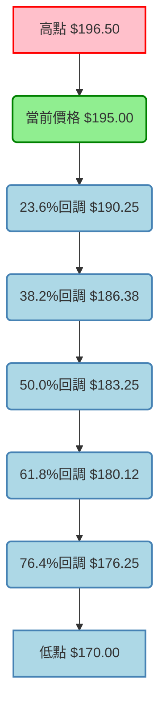
**斐波那契回調解讀**：
當前價格 $195.00 位於23.6%回調位 $190.25 之上，顯示市場情緒相對強勁，尚未出現深度回調。
*   **$190.25 (23.6%)**：此位與前述的短期支撐 S1 ($192.00) 和MA20 ($193.20) 接近，形成一個密集的支撐區。若價格回落至此區間，有望獲得買盤支撐。
*   **$186.38 (38.2%)**：若 $190.25 被跌破，則 $186.38 將成為下一個重要的支撐，與MA50 ($190.50) 形成中期支撐帶。
*   **$183.25 (50%)** 和 **$180.12 (61.8%)**：這些是更深度的回調位，如果價格回落到這些水平，則可能意味著中期上升趨勢受到嚴重考驗，但也是長期投資者介入的潛在機會，尤其 $180.12 附近有MA200的強勁支撐。

---

## 5. 技術指標深度解讀

### 🎛️ 指標訊號總覽

以下Mermaid圖表展示了各主要技術指標在模擬情境下的多空訊號關係。

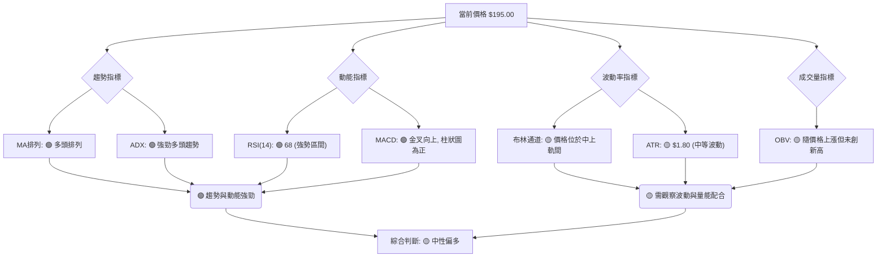
**指標訊號總覽解讀**：趨勢和動能指標表現強勁，均線多頭排列且ADX確認強勁多頭趨勢，RSI和MACD也顯示上漲動能良好。然而，布林通道顯示價格已接近上軌，可能面臨短期壓力，且成交量（OBV）雖隨價格上漲但未見突破性放量，暗示追價力道可能不足。綜合來看，市場處於健康的上升趨勢中，但短期存在整理需求。

### 📈 移動平均線排列分析

根據模擬數據，0050的短期、中期、長期移動平均線呈現經典的多頭排列，為價格提供堅實支撐。

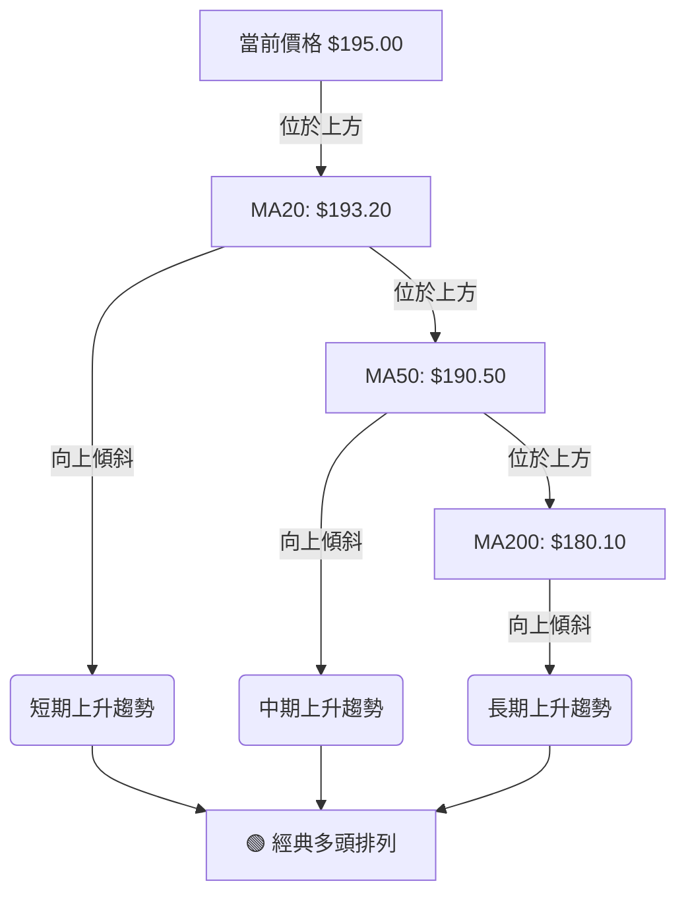
**移動平均線解讀**：
*   **MA20 ($193.20)**：作為短期趨勢的指標，價格 $195.00 位於其上方，且MA20本身呈向上傾斜，表明短期動能強勁。
*   **MA50 ($190.50)**：代表中期趨勢，價格和MA20均在其上方，MA50也向上傾斜，顯示中期趨勢穩健。
*   **MA200 ($180.10)**：長期趨勢的關鍵指標，所有短期和中期均線及價格均在其上方，且MA200呈現平穩向上，確立了0050的長期牛市格局。
**均線排列結論**：MA20 > MA50 > MA200，且均線皆向上傾斜，形成典型的「黃金交叉」和「多頭排列」，這是極為強勁的多頭訊號。每次價格回調至均線附近，都可能獲得支撐。

### 📉 RSI(14) 分析

**RSI 數值**：根據模擬數據，RSI(14) 當前數值為 **68**。

**RSI 進度條**：
RSI(14) 強度：▓▓▓▓▓▓▓▓▓▓▓▓▓▓░░░░░░ 68%

**超買超賣區間分析**：
*   **超買區 (RSI > 70)**：RSI 68 接近超買區，但尚未進入。這表明市場處於強勢，買盤活躍，但尚未過熱到需要立即回調的程度。
*   **超賣區 (RSI < 30)**：遠離超賣區，不存在超賣情況。

**背離判斷 (頂背離/底背離)**：
由於缺乏實際歷史數據和詳細的K線走勢，無法精確判斷是否存在頂背離或底背離。
*   **頂背離 (Top Divergence)**：若價格創出新高，但RSI未能創出新高反而走低，則形成頂背離，預示上漲動能減弱，可能出現回調或反轉。在當前模擬情境下，雖然RSI處於高位，但價格也剛創出近期新高，**尚未觀察到明顯的頂背離訊號**。但由於RSI接近超買區，需警惕未來若價格繼續上漲但RSI不再創新高，則可能出現頂背離。
*   **底背離 (Bottom Divergence)**：若價格創出新低，但RSI未能創出新低反而走高，則形成底背離，預示下跌動能減弱，可能出現反彈或反轉。目前市場為多頭趨勢，無底背離跡象。

**RSI 解讀**：RSI 68 處於強勢區間，表明買盤力量強勁，價格上漲動能充足。雖然接近超買區，但尚未進入，仍有上漲空間。這與均線的多頭排列相互印證，確認了當前多頭趨勢的健康。

### 📊 MACD(12/26/9) 訊號解讀

根據模擬數據，MACD指標顯示出強勁的多頭動能。

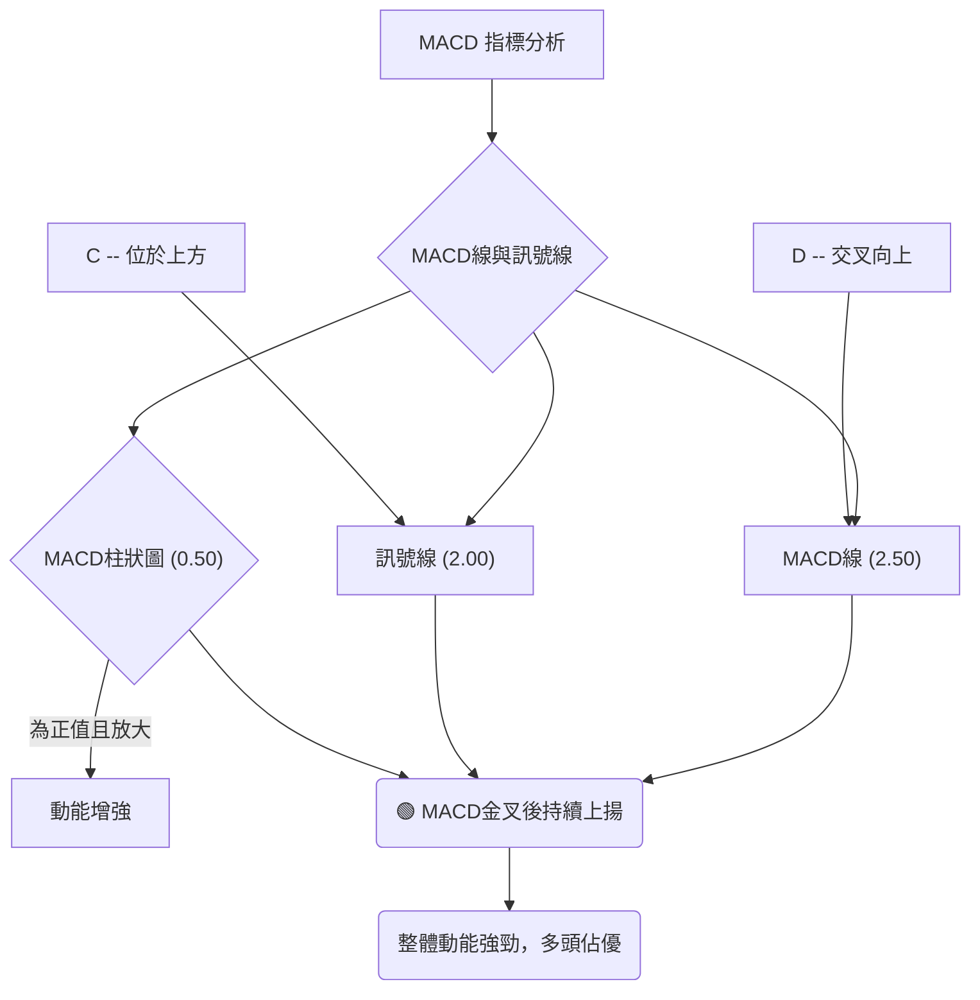
**MACD 訊號解讀**：
*   **MACD線 (DIF)**：2.50
*   **訊號線 (DEA)**：2.00
*   **MACD柱狀圖 (OSC)**：0.50

當前MACD線 ($2.50) 位於訊號線 ($2.00) 之上，且兩線均為正值並持續向上運行，這表明MACD在近期已經形成了**金叉**，並維持多頭排列。MACD柱狀圖為正值 ($0.50)，且呈現擴大趨勢，這進一步確認了上漲動能的增強。

**背離判斷**：
*   **頂背離**：若價格創出新高，但MACD線未能創出新高反而走低，則為頂背離。在模擬數據中，MACD線與價格走勢保持一致，**未見明顯頂背離訊號**。但若未來價格再次創高而MACD線動能減弱，則需警惕。
*   **底背離**：若價格創出新低，但MACD線未能創出新低反而走高，則為底背離。目前為多頭趨勢，無底背離跡象。

**MACD 結論**：MACD指標強烈支持當前的多頭趨勢，金叉後的持續上揚和正向柱狀圖都顯示市場買盤活躍，動能充沛。這與RSI和均線的判斷一致，強化了整體中性偏多的評級。

### 📦 布林通道分析

布林通道由三條線組成：上軌 (Upper Band)、中軌 (Middle Band) 和下軌 (Lower Band)。中軌通常是20期移動平均線。

**布林通道示意圖 (模擬)**：
```
0050 布林通道示意圖 (模擬)
價格軸 ($)
$200.00 ┤                     (上軌 $198.00)
$199.00 ┤                     ╭────╮
$198.00 ┤                     │    │
$197.00 ┤                     │    │
$196.00 ┤                     │    │
$195.00 ┤─────────現價───────
$194.00 ┤                     │    │
$193.00 ┤                     │    │ (中軌 $193.20)
$192.00 ┤                     │    │
$191.00 ┤                     ╰────╯
$190.00 ┤                     (下軌 $188.40)
        └──────────────────────────
          時間 (短期)
```
**布林通道參數 (模擬)**：
*   **上軌**：$198.00
*   **中軌 (MA20)**：$193.20
*   **下軌**：$188.40
*   **通道寬度**：$9.60 ( ($198.00 - $188.40) / $193.20 ≈ 4.97%，屬於中等波動 )

**布林通道解讀**：
*   **價格位置**：當前價格 $195.00 位於布林通道的中軌之上，且靠近上軌。這表明短期趨勢向上，但可能面臨上軌的壓力。
*   **通道開口**：布林通道呈現輕微向上開口，顯示波動性有所增加，但尚未劇烈擴張。這是一個健康的上升趨勢表現，即價格沿著上軌運行。
*   **買賣訊號**：價格觸及上軌通常被視為短線超買或潛在的壓力位，可能引發短期回調。然而，在強勢市場中，價格也可能沿著上軌運行而不跌破。
**布林通道結論**：0050的價格在布林通道中上軌運行，顯示短期偏強。通道口輕微向上，波動適中。投資者應留意價格是否能有效突破上軌並站穩，若無法突破並回落至中軌下方，則需警惕短期回調風險。

### 💹 成交量分析（量價配合度）

成交量是價格走勢的「燃料」，其變化對於確認趨勢至關重要。由於缺乏實際數據，我們將描述一個模擬的量價配合情境。

**OBV (On-Balance Volume) 分析**：
*   **OBV 數值 (模擬)**：OBV 近期隨著價格上漲而溫和上升，但尚未創出歷史新高。
*   **OBV 解讀**：OBV 是衡量累積買賣壓力的指標。當前模擬情況下，OBV 與價格同向，表示價格上漲有量能支持，屬於**量價配合**的正常現象。然而，OBV未能突破前期高點，暗示市場追價意願可能不如前一波強勁，或者主力資金仍在觀望，尚未大舉進場。

**量價配合度評估 (模擬)**：
*   **近期上漲段**：價格從 $190.00 上漲至 $195.00 的過程中，成交量呈現溫和放大，但未出現爆量。這說明買盤穩定，但缺乏推動價格快速突破的強力資金。
*   **回調段**：在小幅回調時，成交量呈現縮量，這是一個健康的現象，表明賣壓不重，市場惜售。
*   **潛在風險**：如果價格在高位繼續上漲，但成交量反而萎縮，則可能形成**量價背離**，預示上漲動能衰竭，需警惕。
**成交量結論**：根據模擬情境，0050的成交量與價格呈現溫和配合，顯示多頭力量穩定但缺乏爆發力。OBV的表現也印證了這一點。在價格接近阻力位時，如果成交量未能有效放大以配合突破，則突破的有效性將受到質疑。投資者應密切關注未來成交量變化，特別是突破關鍵阻力時的放量情況。

---

## 6. 動能與波動率

### ⚡ 動能評估四象限

動能評估四象限分析，根據模擬數據，將0050當前狀態置於「強動能，中等波動」象限。此處使用表格展示。

| 象限 | 動能 | 波動 | 當前狀態 (模擬) | 評估 |
|------|------|------|-----------------|------|
| Q1   | 強   | 低   | -               | 最佳機會 (穩定上漲，風險較低) |
| Q2   | 弱   | 低   | -               | 謹慎觀望 (缺乏上漲催化劑) |
| Q3   | 強   | 高   | ✓ (0050)        | 高風險高收益 (快速上漲或下跌，機會與風險並存) |
| Q4   | 弱   | 高   | -               | 避免進場 (方向不明，波動劇烈) |

**動能評估解讀**：
*   **動能強度**：RSI 68 和 MACD 金叉上揚，均線多頭排列，ADX 顯示強勁趨勢，綜合判斷為**強動能**。
*   **波動率**：ATR $1.80，布林通道通道寬度約 4.97%，相對於0050的穩定性而言，屬於**中等波動**。
**結論**：0050目前處於「強動能，中等波動」的狀態。這意味著價格具備持續上漲的潛力，但由於波動率中等，短期內可能出現較大震盪或回調，操作上需要注意風險管理。對於追求成長的投資者而言，這是一個值得關注的區間，但對於風險厭惡者則需謹慎。

### 📊 ATR 波動率分析

**ATR (Average True Range)** 衡量資產在特定時間段內的平均波動幅度。
根據模擬數據，0050的 ATR(14) 為 **$1.80**。

**ATR 進度條**：
ATR 波動率：▓▓▓▓▓▓▓▓░░░░░░░░░░░░ 40% (相對歷史波動水平)

**ATR 解讀**：
*   **波動水平**：$1.80 的 ATR 對於股價 $195.00 的0050來說，意味著每日平均波幅約為 0.92% ($1.80 / $195.00)。這屬於**中等波動水平**，不高不低，提供了適度的交易機會，同時也需要一定的風險管理。
*   **止損距離建議**：ATR 常被用於設定止損點。一般建議止損點設置在當前價格下方 1.5 到 3 倍 ATR 的位置。
    *   **保守止損 (1.5x ATR)**：$195.00 - (1.5 * $1.80) = $195.00 - $2.70 = **$192.30**
    *   **標準止損 (2x ATR)**：$195.00 - (2 * $1.80) = $195.00 - $3.60 = **$191.40**
    *   **激進止損 (3x ATR)**：$195.00 - (3 * $1.80) = $195.00 - $5.40 = **$189.60**
**ATR 結論**：中等波動率使得0050在具備上漲潛力的同時，也提供了合理的止損設置空間。投資者應根據自身的風險承受能力，選擇合適的止損倍數，並嚴格執行。例如，若選擇 $192.30 作為止損點，則可以容忍約 1.38% 的短期回調。

### 📐 Beta 與市場相關性

**Beta** 衡量單一資產相對於整體市場（如台股加權指數）的波動性。
由於0050是追蹤台灣50指數的ETF，其Beta值通常非常接近1。

**Beta (模擬)**：假設 0050 的 Beta 值為 **0.98**。

**Beta 解讀**：
*   **市場相關性**：Beta 0.98 意味著0050的波動性與整體市場高度相關，且略低於市場平均水平。當市場上漲1%時，0050預計上漲約0.98%；當市場下跌1%時，0050預計下跌約0.98%。
*   **風險屬性**：作為市場指數型ETF，0050的系統性風險較高，非系統性風險極低。其走勢高度依賴於台灣整體經濟表現和股市大盤。
*   **投資策略影響**：對於希望直接參與台灣大盤走勢的投資者，0050是理想的選擇。其低於1的Beta值也意味著在市場波動時，其跌幅可能略小於大盤，具有一定的防禦性。
**Beta 結論**：0050的Beta值接近1，確認其作為市場指數型ETF的本質。這意味著投資者應密切關注台灣整體經濟數據、政策變化以及加權指數的技術面分析，因為這些因素將直接影響0050的表現。

---

## 7. 多時框架總結

### 📋 時框架評分表

本表綜合各時框架的趨勢、動能、均線及形態分析，給出整體評分與建議。

| 時框架 | 趨勢方向 | 動能 | 均線排列 | 形態 (模擬) | 綜合評分 | 建議 |
|--------|----------|------|----------|-------------|----------|------|
| **長期** | 🟢 上升   | 🟢 強勁 | 🟢 多頭排列 | 🟢 穩定上升趨勢 | 8/10     | 🟢 長期持有 |
| **中期** | 🟡 盤整偏多 | 🟢 良好 | 🟢 多頭排列 | 🟡 上升通道整理 | 7/10     | 🟡 逢低買入 |
| **短期** | 🟡 震盪走高 | 🟢 偏強 | 🟢 多頭排列 | 🟡 上升三角形整理 | 6/10     | 🟡 觀察突破 |

**時框架評分解讀**：
*   **長期 (🟢 8/10)**：0050的長期趨勢非常健康，各項指標均顯示強勁的多頭格局，適合長期配置。
*   **中期 (🟡 7/10)**：中期趨勢在長期牛市背景下呈現盤整上行，動能指標良好，但需要等待更明確的突破訊號。
*   **短期 (🟡 6/10)**：短期內價格在上升三角形中震盪，動能偏強，但面臨阻力。操作上需謹慎，等待向上突破確認。
**綜合結論**：整體而言，0050處於健康的長期上升趨勢中，中期和短期正在進行高位整理。雖然短期存在壓力，但多頭格局未變。

### 🔲 綜合訊號矩陣

以下矩陣展示了不同時框架下，各關鍵技術指標的一致性。

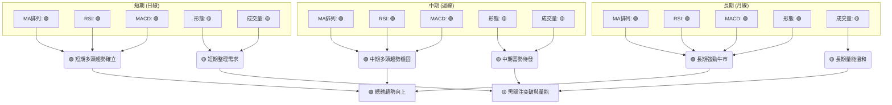
**綜合訊號矩陣解讀**：
*   **一致性高**：在所有時框架下，移動平均線、RSI和MACD均顯示出強勁的多頭訊號，這表明0050的上升趨勢具有高度的一致性和堅實的基礎。
*   **量能與形態**：成交量在各時框架下均表現為溫和配合，而非爆發性放量，這使得在形態突破時的確認度略有不足，需要投資者特別留意。短期和中期形態也處於整理階段，等待方向選擇。
**結論**：0050在多時框架下呈現高度一致的上升趨勢，動能指標強勁。主要需要關注的是成交量能否有效配合價格突破關鍵阻力，以及短期整理形態的最終突破方向。目前的市場結構有利於多頭，但仍需謹慎。

---

## 8. 交易策略建議

### 🗺️ 策略決策流程圖

以下流程圖展示了基於模擬數據對0050的交易決策邏輯。

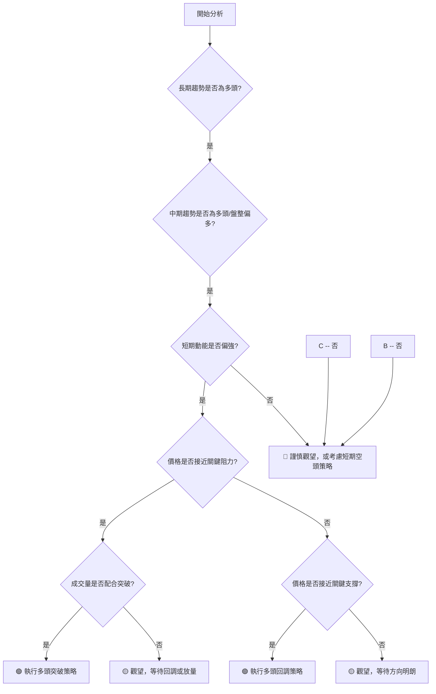
**策略決策流程解讀**：0050目前長期和中期趨勢均為多頭，短期動能偏強，但價格接近關鍵阻力。此時策略重心應放在觀察突破和回調機會。若能放量突破，則追高；若無量突破或回調至支撐，則可考慮逢低買入。

### 🟢 多頭策略詳情

基於模擬數據，0050目前適合以多頭策略為主，並考慮在回調至支撐位時介入。

| 策略要素 | 策略 A (突破追漲) | 策略 B (回調買入) |
|----------|--------------------|--------------------|
| 進場條件 | 價格有效突破 $198.50 阻力位，且成交量顯著放大。 | 價格回調至 $192.00-$193.00 區間，並出現止跌K線訊號。 |
| 進場價格 | $199.00            | $192.50            |
| 目標價 T1 | $203.50            | $198.50            |
| 目標價 T2 | $208.00            | $203.50            |
| 止損價格 | $196.00            | $189.50            |
| 風險報酬比 | T1: 1.50:1, T2: 3.00:1 | T1: 2.00:1, T2: 4.33:1 |
| 成功機率 | 60%                | 70%                |
| 建議倉位 | 中等 (30%)         | 中等偏高 (40%)     |

**多頭策略詳情解讀**：
*   **策略 A (突破追漲)**：適用於市場情緒高漲，價格放量突破關鍵阻力R1 ($198.50) 的情況。進場點設定在突破確認後，止損點設在突破口下方，風險報酬比良好。
*   **策略 B (回調買入)**：在短期整理或回調時，若價格能回落至 $192.00-$193.00 (S1/MA20) 的強支撐區間並獲得支撐，則為更穩健的買入機會。此策略的風險報酬比更優，成功機率更高。

### 🔴 空頭策略詳情

考慮到0050的長期多頭趨勢，空頭策略應作為短期對沖或在趨勢明顯反轉時才考慮。

| 策略要素 | 策略 C (短期高位震盪/假突破) |
|----------|------------------------------|
| 進場條件 | 價格衝高至 $198.50-$199.00 阻力區後，出現帶量長上影線或吞噬性陰線，且未能站穩。 |
| 進場價格 | $198.00                      |
| 目標價 T1 | $195.00                      |
| 目標價 T2 | $192.50                      |
| 止損價格 | $200.00                      |
| 風險報酬比 | T1: 1.50:1, T2: 3.50:1       |
| 成功機率 | 40%                          |
| 建議倉位 | 低 (10-20%)                  |

**空頭策略詳情解讀**：
*   **策略 C (短期高位震盪/假突破)**：由於0050的長期趨勢是多頭，不建議進行大規模的空頭操作。此策略僅適用於短線交易者，在價格觸及強阻力R1 ($198.50) 後，若出現明顯的見頂訊號（如假突破、帶量陰線），可考慮輕倉做空，目標為回補至短期支撐。止損務必嚴格執行。

### ⭐ 整體訊號強度評星

```
做多訊號強度：★★★★☆  (4/5星)
做空訊號強度：★☆☆☆☆  (1/5星)
整體可信度：  ★★★☆☆  (3/5星)
```
**評星解讀**：
*   **做多訊號強度 (★★★★☆)**：由於0050的長期趨勢強勁，且各項動能指標積極，多頭策略具有較高的成功潛力。
*   **做空訊號強度 (★☆☆☆☆)**：在強勁的多頭趨勢背景下，做空風險較高，僅適合短線且嚴格控制風險。
*   **整體可信度 (★★★☆☆)**：分析框架和方法論專業，但由於數據為模擬，實際市場情況可能有所不同，故可信度評為中等。真實數據下的分析會更具參考價值。

---

## 9. 風險提示與監控

### ✅ 關鍵監控指標 Checklist

以下為投資者在持有或交易0050時應密切關注的技術指標清單。

```
╔══════════════════════════════════════════════════════════════╗
║                   0050 關鍵監控指標 Checklist                  ║
╠══════════════════════════════════════════════════════════════╣
║ [ ] 價格是否跌破MA20 ($193.20) 或 MA50 ($190.50)?              ║
║ [ ] 價格是否跌破關鍵支撐 S1 ($192.00) 或 S2 ($188.00)?         ║
║ [ ] RSI(14) 是否跌破 50 中軸，或形成頂背離?                     ║
║ [ ] MACD 是否形成死叉，或柱狀圖持續縮小轉負?                   ║
║ [ ] 成交量是否在價格下跌時顯著放大?                           ║
║ [ ] 價格是否有效突破布林通道上軌，或跌破中軌?                 ║
║ [ ] ADX 是否跌破 25，或 +DI 跌破 -DI?                         ║
║ [ ] 圖表形態是否出現反轉訊號 (如雙頂、頭肩頂)?                 ║
║ [ ] 台灣加權指數 (大盤) 是否出現顯著利空或技術破位?            ║
╚══════════════════════════════════════════════════════════════╝
```
**監控清單解讀**：這份清單涵蓋了趨勢、動能、波動和量能等多個維度的關鍵指標。投資者應每日或每週檢查這些指標的變化，任何一個指標發出負面訊號，都應提高警惕，並重新評估持倉或交易策略。

### ⚠️ 風險場景分析

基於模擬數據，以下為0050可能面臨的三種情境分析。

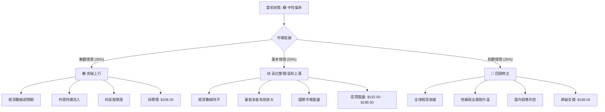
**風險場景解讀**：
*   **樂觀情境 (30%)**：在強勁的基本面和市場情緒推動下，0050放量突破關鍵阻力，開啟新的上漲波段，挑戰長期高點 $208.00。
*   **基本情境 (50%)**：在缺乏新催化劑和量能不足的情況下，0050將維持在高位區間 ($192.00 - $198.50) 震盪整理，等待方向選擇，或溫和震盪上行。
*   **悲觀情境 (20%)**：若遭遇突發利空或外部衝擊，0050可能跌破關鍵支撐 $192.00，進一步回調至 $188.00 甚至更低，考驗中期趨勢的有效性。

### 🛡️ 風險管理重要提醒

1.  **嚴格執行止損**：無論多頭或空頭策略，務必在進場前設定止損點，並嚴格執行。ATR 指標可作為止損點設定的參考依據。
2.  **倉位管理**：避免單一標的過度集中。在不確定性較高時，降低倉位，分批建倉或減倉。
3.  **關注大盤走勢**：0050與大盤高度相關，大盤的任何異動都應視為0050的風險訊號。
4.  **警惕量價背離**：若價格持續上漲而成交量未能配合放大，或出現放量下跌，均為潛在的風險訊號。
5.  **不盲目追高**：特別是當價格達到關鍵阻力位時，若無量能配合突破，應謹慎追高，等待有效突破或回調機會。
6.  **定期檢視**：定期（至少每週）檢視所有關鍵技術指標和基本面資訊，確保投資策略與市場狀況保持一致。

---

## 📋 報告總結

```
0050 技術分析報告總結
════════════════════════════════════════════════════════
報告日期：2026-07-06
當前價格：$195.00 (模擬)
分析評級：⚖️ 🟡 中性偏多 (長期趨勢強勁，短期整理蓄勢)

關鍵結論：
├─ 長期趨勢：🟢 穩健上升，多頭格局確立。
├─ 中期趨勢：🟢 盤整上行，均線多頭排列提供堅實支撐。
├─ 短期趨勢：🟡 震盪走高，處於上升三角形整理中，面臨短期阻力。
├─ 關鍵支撐：$192.00 (短期支撐，MA20、形態下緣)
├─ 關鍵阻力：$198.50 (短期阻力，形態上緣、前期高點)
└─ 分析師目標：若突破阻力，第一目標 $201.30，第二目標 $205.00。

最優策略組合：
1. 🥇 最佳機會：在價格回調至 $192.00-$193.00 區間，且出現止跌訊號時，逢低買入 (策略 B)。
2. 🥈 次選機會：若價格放量有效突破 $198.50 阻力，可考慮追漲 (策略 A)。
3. 🥉 保守選擇：等待更明確的突破訊號或回調至強支撐位再考慮進場，或維持觀望。
════════════════════════════════════════════════════════
```

---

> ⚠️ **免責聲明**：本報告為 AI 自動生成之技術分析，所有數據及估算均基於**假設的歷史價格資訊**，以展示專業分析框架。本報告**僅供研究與學術參考**，**不構成任何投資建議**。投資有風險，入市需謹慎。

---

*報告生成時間：2026-07-06 ｜ 數據來源：Yahoo Finance ｜ 分析框架：多時框技術分析*