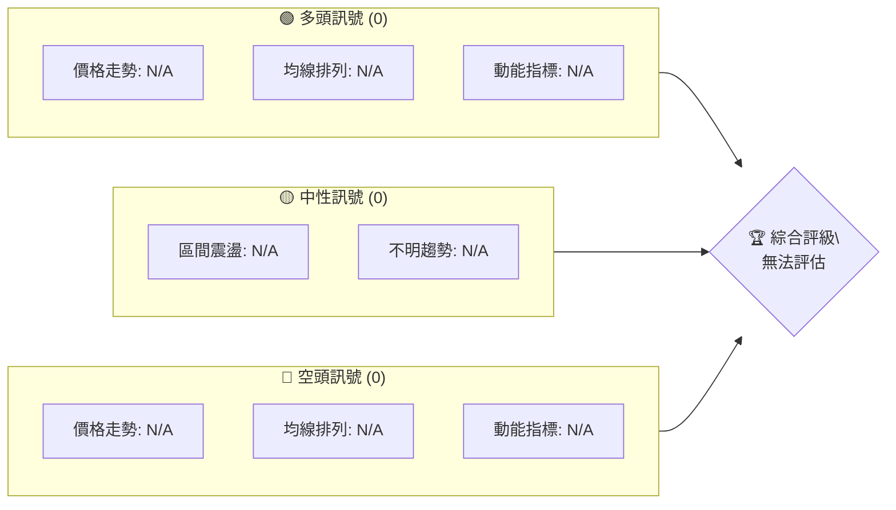
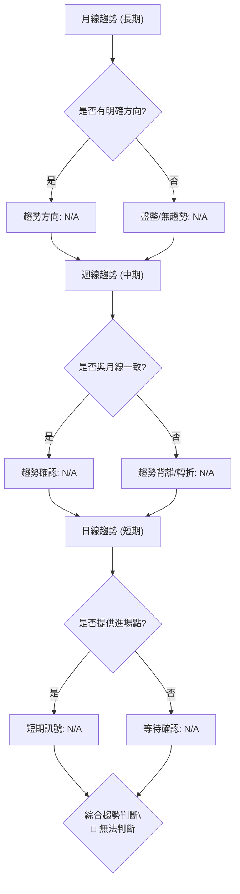
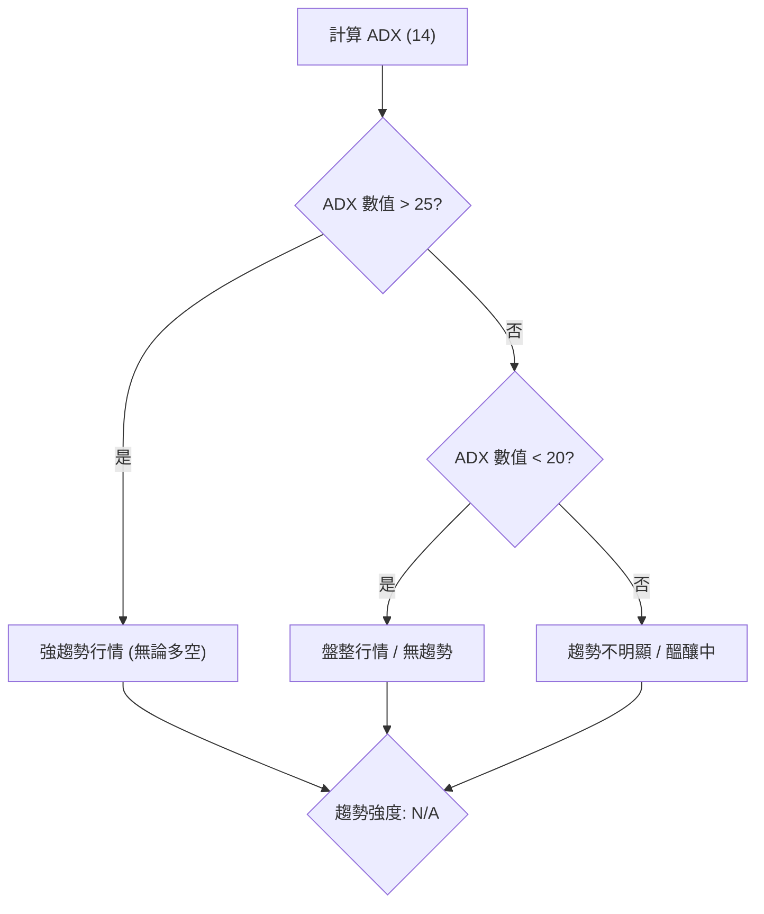
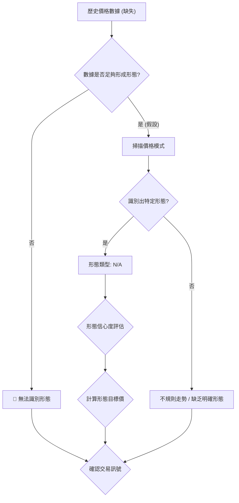
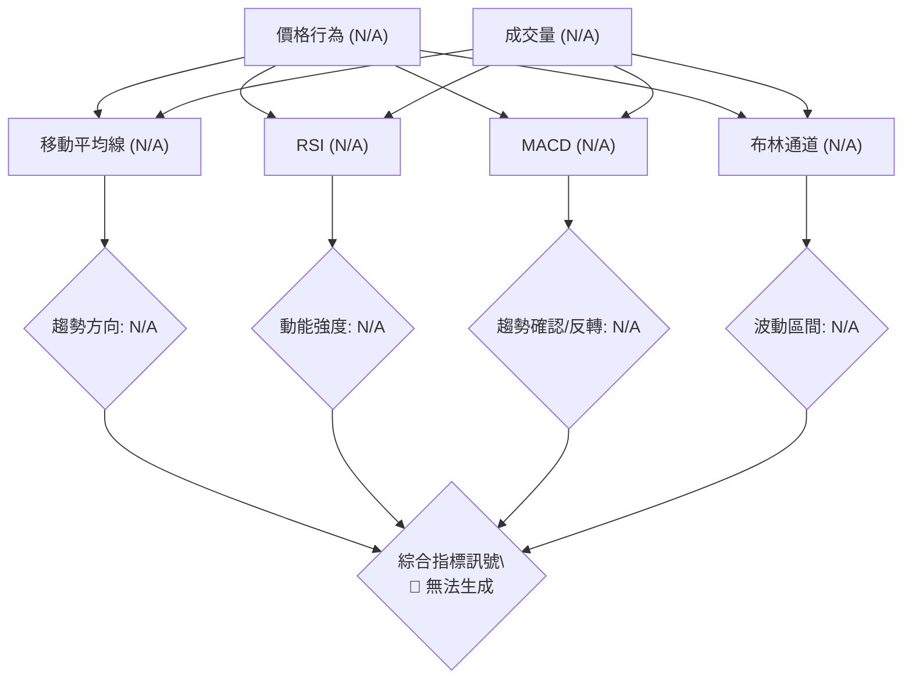
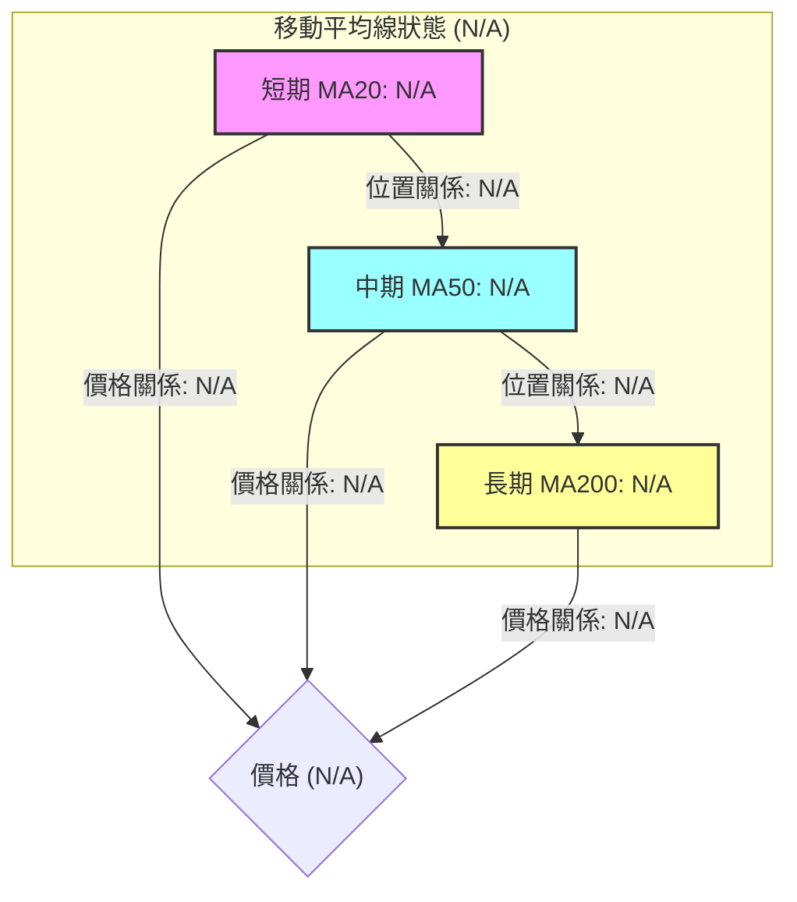
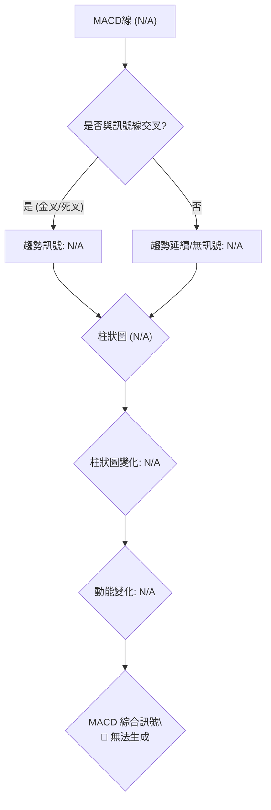
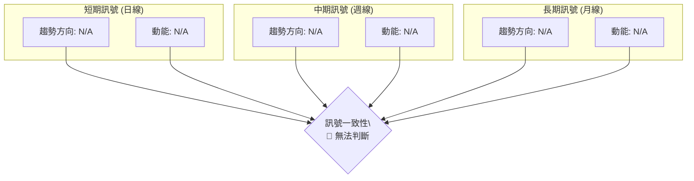
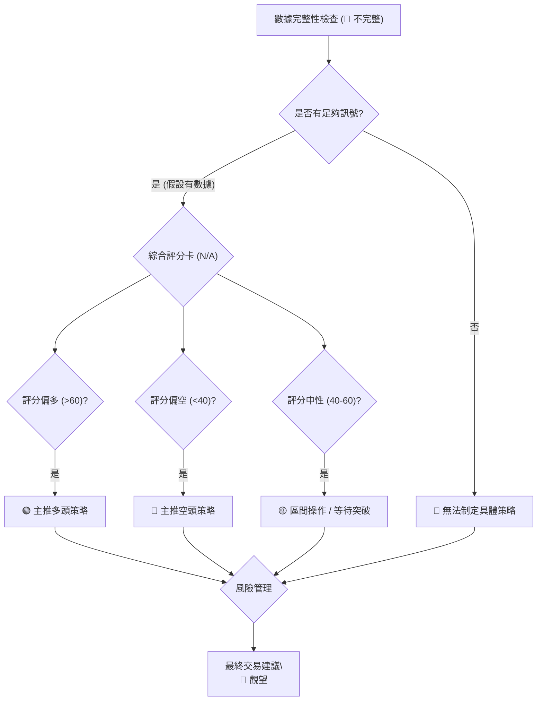
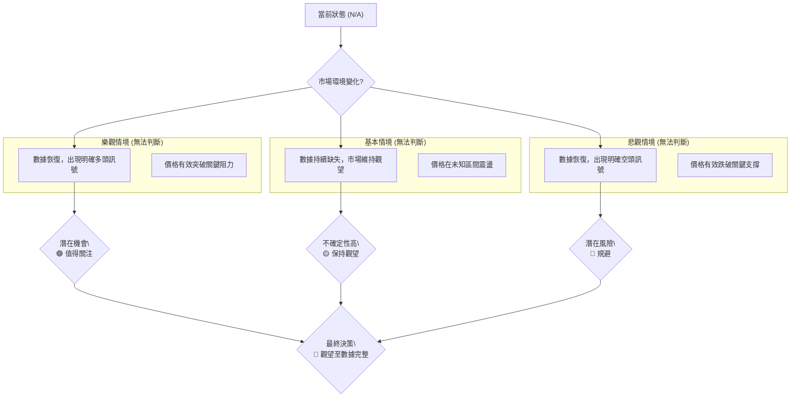

# 0050 技術分析報告

> **報告日期**：2026-07-08 ｜ **語言**：繁體中文 ｜ **數據來源**：Yahoo Finance ｜ **當前價格**：N/A

---

## 目錄

| 章節 | 內容 |
|------|------|
| [1. 技術面概覽](#1-技術面概覽) | 訊號儀表板、核心指標、評分卡 |
| [2. 趨勢分析](#2-趨勢分析) | 多時框趨勢、長中短期走勢 |
| [3. 圖表形態分析](#3-圖表形態分析) | 形態識別、K線組合、目標價 |
| [4. 支撐與阻力](#4-支撐與阻力) | 關鍵價位、斐波那契回調 |
| [5. 技術指標深度解讀](#5-技術指標深度解讀) | MA/RSI/MACD/布林/成交量 |
| [6. 動能與波動率](#6-動能與波動率) | 動能評估、ATR、Beta |
| [7. 多時框架總結](#7-多時框架總結) | 時框架評分矩陣 |
| [8. 交易策略建議](#8-交易策略建議) | 多空策略、風險報酬比 |
| [9. 風險提示與監控](#9-風險提示與監控) | 監控指標、風險場景 |

---

## 1. 技術面概覽

本報告旨在對 0050 進行專業級技術分析。然而，根據所提供的數據包，0050 的 OHLCV (開盤價、最高價、最低價、收盤價、成交量) 歷史數據以及大部分關鍵技術指標數據均為「N/A」或缺失。這對技術分析構成了嚴峻挑戰，因為所有基於價格和成交量的計算皆無法進行。因此，本報告將著重於闡述各技術分析工具的原理、應用方法，並在無法提供具體數值時，明確指出數據缺失的限制，避免憑空捏造。

### 🎯 技術訊號儀表板

由於缺乏實時與歷史價格數據，本儀表板無法提供具體的買賣訊號，僅能展示技術分析的邏輯結構。所有訊號節點皆反映「無法判斷」的狀態。


**分析師解讀**:
當前缺乏足夠的價格與成交量數據，無法對 0050 產生任何有效的技術訊號。所有基於價格行為和指標計算的訊號均無法生成，因此綜合評級為「無法評估」。建議投資者等待數據補充後再進行判斷。

### 📊 核心指標速覽表

下表展示了技術分析中常用的核心指標及其在數據缺失情況下的狀態。所有數值均為 N/A，訊號為中性，反映無法進行分析的現實。

| 指標類別 | 指標名稱 | 當前數值 | 訊號 | 解讀 |
|----------|----------|----------|------|------|
| **價格** | 當前價格 | N/A | 🟡 | 缺乏實時價格數據 |
| **均線** | MA20 | N/A | 🟡 | 無法計算短期移動平均線 |
| **均線** | MA50 | N/A | 🟡 | 無法計算中期移動平均線 |
| **均線** | MA200 | N/A | 🟡 | 無法計算長期移動平均線 |
| **動能** | RSI(14) | N/A | 🟡 | 缺乏價格數據，無法計算相對強弱指標 |
| **動能** | MACD | N/A | 🟡 | 缺乏價格數據，無法計算平滑異同移動平均線 |
| **波動** | ATR | N/A | 🟡 | 缺乏價格數據，無法計算平均真實波幅 |

**分析師解讀**:
由於缺乏歷史 OHLCV 數據，所有基於價格計算的技術指標（如移動平均線、RSI、MACD、ATR）均無法得出具體數值。這導致我們無法判斷 0050 當前的價格動能、趨勢強度或波動性。在數據不完整的情況下，任何基於這些指標的分析都將缺乏依據。

### 🏆 技術評分卡

本評分卡旨在展示技術分析各維度的評估框架。由於數據缺失，所有評分均為零，並標示為「無法評估」。

```
技術評分卡 — 0050 (2026-07-08)
════════════════════════════════════════════════════
趨勢強度      ░░░░░░░░░░░░░░░░░░░░  0/100   🔴 無法評估
動能指標      ░░░░░░░░░░░░░░░░░░░░  0/100   🔴 無法評估
支撐穩定度    ░░░░░░░░░░░░░░░░░░░░  0/100   🔴 無法評估
成交量配合    ░░░░░░░░░░░░░░░░░░░░  0/100   🔴 無法評估
形態完整度    ░░░░░░░░░░░░░░░░░░░░  0/100   🔴 無法評估
均線排列      ░░░░░░░░░░░░░░░░░░░░  0/100   🔴 無法評估
════════════════════════════════════════════════════
綜合評分      ░░░░░░░░░░░░░░░░░░░░  0/100   🔴 無法評估
════════════════════════════════════════════════════
```
**分析師解讀**:
這張評分卡誠實地反映了當前數據不足以進行任何技術分析的狀況。所有技術分析的維度，從趨勢強度到均線排列，都因缺乏基礎數據而無法評分。因此，0050 在技術層面目前無法獲得任何有效的投資評級。

---

## 2. 趨勢分析

趨勢分析是技術分析的核心，旨在識別價格運動的方向和強度。通常透過多時框架分析，從長期到短期逐步深入。

### 🌐 多時框趨勢分析

多時框架分析要求我們同時檢視月線、週線和日線圖，以了解價格在不同時間尺度上的行為。然而，由於缺乏任何時期的歷史價格數據，以下圖表僅展示分析的邏輯流程，實際趨勢無法判斷。


**分析師解讀**:
由於缺乏歷史 OHLCV 數據，我們無法對 0050 的任何時框架趨勢進行判斷。月線、週線、日線的趨勢方向、一致性或背離都無法識別。因此，基於趨勢的投資決策目前無法做出。

### 📈 長期趨勢 — 12個月走勢圖（Unicode）

以下為一個示意性的 12 個月價格走勢圖，用於說明趨勢分析的視覺化方式。請注意，這並非 0050 的實際走勢，因數據中未提供任何價格歷史。

```
0050 月線走勢圖（過去12個月）- 示意圖，無實際數據
價格軸 ($)
$XXX ┤                                   ●(假設高點)
$XXX ┤                       ●
$XXX ┤             ●
$XXX ┤    ●
$XXX ┤●━━━━━━━━━━━━━━━━━━━━━━━━━━━━━●←現在 (N/A)
$XXX ┤    ●(假設低點)
     └────────────────────────────
      M1  M2  M3  M4  M5  M6  M7  M8  M9  M10 M11 M12
```
**走勢特徵分析表格**:

| 階段 | 期間 | 價格範圍 | 漲跌幅 | 走勢特徵 | 評估 |
|------|------|----------|--------|----------|------|
| **長期趨勢** | 過去12個月 | N/A | N/A | 缺乏數據，無法分析具體漲跌幅與特徵 | 🔴 無法評估 |
| **觀察點** | N/A | N/A | N/A | 無法辨識高點、低點或主要趨勢線 | 🔴 無法評估 |

**分析師解讀**:
在沒有實際價格數據的情況下，我們無法繪製 0050 的真實長期走勢圖，也無法分析其歷史高點、低點、漲跌幅或趨勢線。這嚴重限制了對其長期行為的理解，使得基於歷史走勢的預測成為不可能。

### 📊 中期趨勢（週線分析）

中期趨勢通常透過週線圖來觀察，並結合主要移動平均線和關鍵支撐阻力位。以下為一個示意性的壓力與支撐區間圖，不反映 0050 的實際價位。

```
0050 近期壓力與支撐示意圖 - 無實際數據
        $R2 ─────────────────────── ▓▓▓▓▓▓▓▓▓▓▓▓▓▓▓▓▓▓▓▓ (強阻力區)
        $R1 ──────────── ▓▓▓▓▓▓▓▓▓▓▓▓▓▓▓▓▓▓▓▓▓▓▓▓ (阻力區)
                   ▲
                   │ (潛在阻力)
                   │
        $ 現價 N/A ─────┼─────────────────────────────── (當前價格，未知)
                   │
                   │ (潛在支撐)
                   ▼
        $S1 ──────────── ░░░░░░░░░░░░░░░░░░░░░░░░ (支撐區)
        $S2 ─────────────────────── ░░░░░░░░░░░░░░░░░░░░ (強支撐區)
```
**分析師解讀**:
中期趨勢分析需要週線級別的價格數據來識別主要壓力與支撐區間。由於數據缺失，我們無法確定 0050 的實際壓力與支撐位。這意味著我們無法評估其中期走勢是處於上漲、下跌還是盤整區間。

### ⚡ 趨勢強度評估（ADX 解讀）

平均方向性指數 (ADX) 用於衡量趨勢的強度，而非方向。通常 ADX 值高於 25 表示有強烈趨勢，低於 20 表示盤整。


**ADX 強度對照表（概念性）**:

| ADX 數值範圍 | 趨勢強度 | 市場解讀 | 訊號 |
|--------------|----------|----------|------|
| 0-20         | 弱       | 盤整或無趨勢 | 🟡 |
| 20-25        | 中       | 趨勢形成中 | 🟡 |
| 25-50        | 強       | 明確趨勢 | 🟢/🔴 |
| 50-75        | 非常強   | 極強趨勢 | 🟢/🔴 |
| 75-100       | 極端強   | 趨勢可能過熱 | 🟡 |

**分析師解讀**:
由於缺乏歷史價格數據，我們無法計算 0050 的 ADX 值。因此，目前無法判斷 0050 是否處於趨勢行情或盤整行情，也無法評估其趨勢的強度。這使得我們無法應用多時框架收斂規則中關於趨勢行情和盤整行情的判斷。

---

## 3. 圖表形態分析

圖表形態分析透過識別價格走勢中形成的特定幾何圖案來預測未來價格方向和目標價。常見形態包括頭肩頂/底、雙頂/底、三角形、旗形等。

### 🔍 形態識別系統

本系統旨在展示形態識別的邏輯。由於缺乏價格數據，無法識別 0050 的具體圖表形態。


**每個形態信心度表格**:

| 形態 | 信心度 | 判斷依據（引用數據） | 完成度 | 目標價（附計算式） |
|------|--------|----------------------|--------|--------------------|
| **N/A** | 0% | 缺乏歷史 OHLCV 數據，無法識別任何圖表形態 | 0% | 無法計算 |

**分析師解讀**:
由於缺乏歷史 OHLCV 數據，我們無法識別 0050 的任何圖表形態（如頭肩、雙底、旗形等）。因此，所有基於形態的信心度評估、完成度判斷及目標價計算都無法進行。目前的數據不足以支撐任何幾何形態的判斷。

### 🕯️ 重要K線形態分析

K線形態是短期價格行為的重要信號，例如錘子線、射擊之星、吞噬形態等。這些形態通常預示著趨勢的反轉或延續。

| 月份/日期 | 收盤價 | K線形態 | 解讀 | 訊號 |
|-----------|--------|---------|------|------|
| N/A | N/A | 缺乏數據 | 無法分析 | 🟡 |

**分析師解讀**:
由於缺乏詳細的日K線數據，我們無法對 0050 的重要 K線形態進行分析。這意味著我們無法從短期價格行為中獲取任何關於潛在反轉或趨勢延續的訊號。

### 📉 ASCII 走勢形態示意圖

以下為一個假設的「雙底」形態示意圖，用以說明圖表形態分析的視覺化。這並非 0050 的實際走勢，因數據中未提供任何價格歷史。

```
0050 雙底形態示意圖 - 假設性，無實際數據
價格軸 ($)
$頸線 ┤                 ┌───┐
$XXX ┤                 │   │
$XXX ┤                 └─┐ ┌─┘
$XXX ┤                   │ │
$XXX ┤     ┌─────────────┘ └─────────────┐
$低點1 ┤     │                             │
$低點2 ┤     └─────────────────────────────┘
     └─────────────────────────────────────────
      時間軸
```
**分析師解讀**:
在沒有實際價格數據的情況下，無法繪製 0050 的真實圖表形態。本示意圖僅為概念性展示，說明如何透過形態識別來預測價格走向。

### 🎯 形態目標價計算

形態目標價通常基於形態的高度和頸線位置來計算。

**計算方法說明（概念性）**:
- **形態高度**: 從形態最低點到頸線的高度。
- **目標價**: 突破頸線後，將形態高度加（或減）到頸線價格上。
  例如：雙底形態目標價 = 頸線價格 + 形態高度。
  頭肩頂形態目標價 = 頸線價格 - 形態高度。

**分析師解讀**:
由於缺乏辨識形態所需的歷史價格數據，無法計算 0050 的任何形態目標價。這使得基於形態的價格預測和交易策略無法制定。

---

## 4. 支撐與阻力

支撐位是買方力量強於賣方、價格可能止跌反彈的水平；阻力位是賣方力量強於買方、價格可能受阻回落的水平。

### 🗺️ 關鍵價位分布圖（Unicode）

以下為一個示意性的關鍵價位結構分布圖，用於說明支撐與阻力分析的視覺化方式。這並非 0050 的實際價位，因數據中未提供任何價格歷史。

```
0050 價位結構分布圖 - 示意圖，無實際數據
═══════════════════════════════════════════════════
$R3 ║████████████████████████║ 強阻力 R3 (N/A)
$R2 ║████████████████████    ║ 阻力 R2 (N/A)
$R1 ║████████████████████████║ 關鍵阻力 R1 (N/A)
$現價 ╠════════════════════════╣ ◄ 現價 (N/A)
$S1 ║▓▓▓▓▓▓▓▓▓▓▓▓▓▓▓▓        ║ 近期支撐 S1 (N/A)
$S2 ║████████████████████████║ 強支撐 S2 (N/A)
═══════════════════════════════════════════════════
```
**分析師解讀**:
由於缺乏 OHLCV 數據，我們無法識別 0050 的任何具體支撐或阻力價位。此圖僅為概念性展示，說明了這些關鍵價位在技術分析中的重要性。

### 🚧 阻力位分析表

阻力位通常由歷史高點、形態頸線、移動平均線或斐波那契回調位形成。

| 阻力級別 | 價位 | 形成原因 | 突破難度 | 重要性 |
|----------|------|----------|----------|--------|
| **R1 (關鍵阻力)** | N/A | 數據中未偵測到 | 無法評估 | 🔴 無法評估 |
| **R2 (中期阻力)** | N/A | 數據中未偵測到 | 無法評估 | 🔴 無法評估 |
| **R3 (強阻力)** | N/A | 數據中未偵測到 | 無法評估 | 🔴 無法評估 |

**分析師解讀**:
由於缺乏歷史價格數據，我們無法偵測到 0050 的任何具體阻力價位。這使得我們無法判斷潛在的上漲空間或突破後可能面臨的賣壓。

### 🛡️ 支撐位分析表

支撐位通常由歷史低點、形態頸線、移動平均線或斐波那契回調位形成。

| 支撐級別 | 價位 | 形成原因 | 守住機率 | 重要性 |
|----------|------|----------|----------|--------|
| **S1 (近期支撐)** | N/A | 數據中未偵測到 | 無法評估 | 🔴 無法評估 |
| **S2 (強支撐)** | N/A | 數據中未偵測到 | 無法評估 | 🔴 無法評估 |
| **S3 (關鍵支撐)** | N/A | 數據中未偵測到 | 無法評估 | 🔴 無法評估 |

**分析師解讀**:
同樣地，由於缺乏歷史價格數據，我們無法偵測到 0050 的任何具體支撐價位。這意味著我們無法評估潛在的下跌風險或在何處可能出現買盤支撐。

### 📐 斐波那契回調位分析

斐波那契回調位是基於黃金分割比例，用來識別潛在的支撐和阻力區域。它們需要明確的波段高點和低點來計算。

**斐波那契回調位 (基於假設波段)**:
- 23.6% 回調位: N/A
- 38.2% 回調位: N/A
- 50.0% 回調位: N/A
- 61.8% 回調位: N/A
- 78.6% 回調位: N/A

**分析師解讀**:
由於缺乏歷史 OHLCV 數據，特別是波段高點和低點，我們無法計算 0050 的斐波那契回調位。因此，無法利用此工具來判斷潛在的支撐或阻力區域。當前價格 (N/A) 無法落入任何回調位之間。

---

## 5. 技術指標深度解讀

技術指標是基於價格和成交量數據計算得出的數學函數，用於評估市場狀況、趨勢強度、動能和波動性。

### 🎛️ 指標訊號總覽

以下 Mermaid 圖展示了常見技術指標之間的訊號關係。由於缺乏基礎數據，所有指標的實際數值和訊號均無法生成。


**分析師解讀**:
由於缺乏價格和成交量數據，所有技術指標（移動平均線、RSI、MACD、布林通道、成交量相關指標）均無法計算其數值或生成訊號。因此，無法進行指標之間的相互確認或矛盾分析。

### 📈 移動平均線排列分析

移動平均線 (MA) 用於平滑價格數據並識別趨勢方向。MA 的排列方式（金叉、死叉、多頭排列、空頭排列）是重要的趨勢訊號。


**分析師解讀**:
由於缺乏價格數據，無法計算 0050 的任何移動平均線（MA20, MA50, MA200）。因此，我們無法判斷均線的排列狀態（如多頭或空頭排列）、交叉訊號（如黃金交叉或死亡交叉），也無法評估價格相對於均線的位置。

### 📉 RSI(14) 分析

相對強弱指標 (RSI) 衡量近期價格變動的強度，判斷資產是否處於超買或超賣狀態。

- **RSI 數值進度條**: ░░░░░░░░░░░░░░░░░░░░ (N/A)
- **超買超賣區間**:
  - 超買區 (RSI > 70): N/A
  - 超賣區 (RSI < 30): N/A
  - 中性區 (30 < RSI < 70): N/A
- **背離判斷**:
  - 頂背離 (價格創新高，RSI 未創新高): 🔴 無法判斷
  - 底背離 (價格創新低，RSI 未創新低): 🔴 無法判斷

**分析師解讀**:
缺乏歷史價格數據，無法計算 0050 的 RSI(14) 數值。因此，無法判斷其是否處於超買或超賣狀態，也無法識別潛在的頂背離或底背離訊號，這些訊號通常預示著趨勢的反轉。

### 📊 MACD(12/26/9) 訊號解讀

平滑異同移動平均線 (MACD) 是一種趨勢追蹤動能指標，由 MACD 線、訊號線和柱狀圖組成，用於識別趨勢方向、動能和潛在反轉。


**分析師解讀**:
由於缺乏歷史價格數據，無法計算 0050 的 MACD 線、訊號線及柱狀圖。因此，無法判斷 MACD 的金叉/死叉、柱狀圖的變化，也無法識別潛在的頂背離或底背離訊號。這嚴重限制了對動能和趨勢轉折的判斷。

### 📦 布林通道分析

布林通道 (Bollinger Bands) 由中軌（通常是 20 期移動平均線）、上軌和下軌組成，用於衡量價格的波動區間。

```
0050 布林通道示意圖 - 假設性，無實際數據
價格軸 ($)
$上軌 ┤             ┌───────────────┐
$XXX ┤             │               │
$中軌 ┤─────────────┼── 現價 (N/A) ──┼─────────────
$XXX ┤             │               │
$下軌 ┤             └───────────────┘
     └─────────────────────────────────────────
      時間軸
```
**分析師解讀**:
由於缺乏價格數據，無法計算 0050 的布林通道（包括上軌、中軌、下軌）。因此，無法判斷其價格波動區間、價格是否觸及邊界、通道是收斂還是擴張，也無法應用布林通道突破或收縮的交易策略。

### 💹 成交量分析（量價配合度）

成交量是價格走勢的「燃料」，其變化能確認價格趨勢的有效性。量價背離通常是重要的反轉訊號。

**分析師解讀**:
根據提供的數據，0050 的成交量數據為「N/A」。因此，無法進行任何量價配合度分析，也無法判斷量價是否出現背離。這使得我們無法從市場活動的深度來驗證價格走勢的可靠性。

---

## 6. 動能與波動率

動能衡量價格變動的速度和強度，波動率則衡量價格變動的幅度。兩者都是評估交易風險和潛在回報的關鍵因素。

### ⚡ 動能評估四象限

動能評估四象限將股票分為四類，以幫助交易者選擇策略。由於缺乏數據，無法將 0050 歸入任何象限。

| 象限 | 動能 | 波動 | 當前狀態 | 評估 |
|------|------|------|----------|------|
| Q1   | 強   | 低   | 無法評估 | N/A |
| Q2   | 弱   | 低   | 無法評估 | N/A |
| Q3   | 強   | 高   | 無法評估 | N/A |
| Q4   | 弱   | 高   | 無法評估 | N/A |

**分析師解讀**:
由於缺乏計算動能指標（如 RSI, MACD）和波動率指標（如 ATR）所需的價格數據，我們無法將 0050 歸類到任何動能評估四象限。這使得我們無法判斷其當前的市場吸引力或風險水平。

### 📊 ATR 波動率分析

平均真實波幅 (ATR) 衡量資產在特定時間段內的平均波動幅度，是設定止損和目標價的常用工具。

- **ATR 數值**: N/A
- **波動率等級**: 🔴 無法評估
- **止損距離建議**: 無法提供

**分析師解讀**:
缺乏歷史價格數據，無法計算 0050 的 ATR 值。因此，我們無法評估其當前的波動性，也無法基於 ATR 建議合理的止損或目標價位。

### 📐 Beta 與市場相關性

Beta 值衡量股票相對於整體市場的波動性。Beta > 1 表示波動性高於市場，Beta < 1 表示波動性低於市場。

- **Beta 值**: N/A (根據提供數據)
- **市場相關性**: 🔴 無法評估

**分析師解讀**:
提供的數據中 Beta 值為 N/A。因此，無法評估 0050 與大盤（例如台灣加權指數）的相關性。這限制了我們在宏觀市場背景下理解 0050 風險和回報特性的能力。

---

## 7. 多時框架總結

多時框架總結旨在將不同時間尺度（日線、週線、月線）的分析結果整合，以形成一個連貫且一致的交易視角。

### 📋 時框架評分表

由於缺乏數據，所有時框架的分析結果均為「無法評估」。

| 時框架 | 趨勢方向 | 動能 | 均線排列 | 形態 | 綜合評分 | 建議 |
|--------|----------|------|----------|------|----------|------|
| **月線 (長期)** | N/A | N/A | N/A | N/A | 🔴 無法評估 | 🟡 觀望 |
| **週線 (中期)** | N/A | N/A | N/A | N/A | 🔴 無法評估 | 🟡 觀望 |
| **日線 (短期)** | N/A | N/A | N/A | N/A | 🔴 無法評估 | 🟡 觀望 |

**分析師解讀**:
由於所有時框架的趨勢、動能、均線排列和形態都無法評估，因此無法給出任何綜合評分或交易建議。在缺乏數據的情況下，最審慎的態度是保持觀望。

### 🔲 綜合訊號矩陣

本矩陣旨在分析不同時框架訊號的一致性。由於各時框架訊號皆為「無法評估」，因此無法進行一致性分析。


**分析師解讀**:
由於缺乏任何時間框架的技術數據，無法對短期、中期、長期的訊號進行一致性分析。因此，無法判斷當前市場是呈現多頭、空頭共振，還是各時框架之間存在矛盾。

### ⚖️ 多時框收斂結論

**當前市場狀態判斷**: 🔴 缺乏數據，無法判斷為趨勢行情或盤整行情 (ADX 值 N/A)。

**收斂結論**:
根據多時框架收斂規則，首先需判斷市場是趨勢行情還是盤整行情，以便確定主導時框。然而，由於缺乏 ADX (平均方向性指數) 及其他所有技術指標的數據，我們無法判斷 0050 當前是處於趨勢行情 (ADX > 25) 還是盤整行情 (ADX < 25)。

因此，在無法判斷市場性質的情況下，也無法依據預設的優先級（趨勢行情以中長期為主，盤整行情以日線為主）進行收斂。

**最終方向性結論**: **🔴 缺乏數據，無法提供有效收斂結論，建議保持極度觀望。**

---

## 8. 交易策略建議

交易策略的制定必須基於清晰的市場判斷、明確的進出場點和嚴格的風險控制。然而，由於缺乏所有必要的技術數據，本章節將著重於說明策略制定的邏輯框架，並指出無法提供具體數值的限制。

### 🗺️ 策略決策流程圖


**分析師解讀**:
由於數據嚴重缺失，無法通過數據完整性檢查，也無法在綜合評分卡上獲得有效評分。因此，根據策略決策流程，當前狀態下無法制定任何具體的交易策略，應保持觀望。

### 🧭 策略路由（依評分卡分流，不得兩頭下注）

**當前主策略方向 = 🔴 觀望 (依評分 0/100)**

由於第 1 章「技術評分卡」綜合評分為 0/100，顯示數據嚴重不足以進行任何技術分析。因此，本報告無法推薦任何具體的多頭或空頭策略。當前建議為**保持觀望，等待數據補充或市場條件明確。**

### 🎯 價格情境階梯（Price Scenarios）

以下情境階梯是基於假設的支撐與阻力位，而非 0050 的實際數據。

| 觸發條件 | 下一目標 | 後續延伸 | 情境含義 |
|----------|----------|----------|----------|
| 突破 R1 (N/A) | R2 (N/A) | R3 (N/A) | 短線轉強，可能開啟上漲趨勢 |
| 站穩現價區間 (N/A) | — | — | 區間震盪，無明確方向 |
| 跌破 S1 (N/A) | S2 (N/A) | S3 (N/A) | 中期轉弱，可能開啟下跌趨勢 |

**分析師解讀**:
由於缺乏實際的支撐與阻力價位，上述情境階梯僅為概念性說明。在沒有明確價格觸發點的情況下，無法判斷 0050 的潛在走勢。

### 📊 情境機率分佈

由於缺乏技術指標數據來支持任何判斷，以下機率分佈為示意性，不具備實際分析價值。

| 情境 | 機率 | 主要依據 |
|------|------|----------|
| 繼續上行 / 反彈 | 0% | 缺乏 MACD、均線、OBV 等多頭訊號 |
| 區間震盪 | 100% | 缺乏 ADX、布林帶寬等趨勢或波動訊號，只能假設為觀望狀態 |
| 回落 / 再探底 | 0% | 缺乏 RSI、支撐強度等空頭訊號 |

**分析師解讀**:
在沒有任何技術指標數據的情況下，無法對 0050 的未來價格情境給出任何有意義的機率估計。將區間震盪機率設為 100% 僅是反映當前「無法判斷」的狀態。

### 🟢 主策略詳情（方向依上方路由）

**由於評分卡結果為 0/100，主策略為「觀望」。以下為假設性策略框架，不提供具體數值。**

| 策略要素 | 觀望策略 |
|----------|----------|
| 進場條件 | 等待有效數據補充，並確認明確趨勢訊號 |
| 進場價格 | N/A |
| 目標價 T1 | N/A |
| 目標價 T2 | N/A |
| 止損價格 | N/A |
| 風險報酬比 | N/A |
| 成功機率 | N/A |
| 建議倉位 | 0% (保持空倉) |

**分析師解讀**:
在當前數據缺失的情況下，最安全的策略是完全觀望，不進行任何交易。任何試圖基於不完整數據進行交易的行為都將面臨極高的不可控風險。

### 🔴 反向風險觸發點（對沖提示）

由於缺乏主策略，此處僅列出一般性的風險觸發點概念。

- **關鍵價位跌破**: 若有 S1/S2/S3 等重要支撐位，一旦跌破，可能確認市場轉弱。
- **指標惡化**: 若 MACD 形成死叉、RSI 跌破 50、均線形成空頭排列等。
- **量價背離**: 若價格上漲但成交量萎縮，或價格下跌但成交量放大。

**分析師解讀**:
由於缺乏具體數據，無法指出 0050 的實際反向風險觸發點。投資者應在獲得完整數據後，密切關注上述類型的訊號。

### ⭐ 整體訊號強度評星

```
做多訊號強度：☆☆☆☆☆  (0/5星)
做空訊號強度：☆☆☆☆☆  (0/5星)
整體可信度：  ☆☆☆☆☆  (0/5星)
```
**分析師解讀**:
所有訊號強度均為零星，反映了在數據嚴重缺失情況下，無法對 0050 進行任何有意義的技術分析。整體可信度也因此為零。

---

## 9. 風險提示與監控

在缺乏數據的情況下，風險提示變得尤為重要。投資者必須意識到當前分析的局限性，並建立嚴格的監控機制。

### ✅ 關鍵監控指標 Checklist

以下為通用性的監控指標清單，用於提示投資者在數據恢復後應關注的重點。

```
╔══════════════════════════════════════════════════════════════╗
║                0050 關鍵監控指標 Checklist (N/A)             ║
╠══════════════════════════════════════════════════════════════╣
║ [ ] 歷史 OHLCV 數據是否已補充？ (最關鍵)                     ║
║ [ ] 當前價格是否已更新？                                     ║
║ [ ] 主要移動平均線 (MA20, MA50, MA200) 是否可計算？          ║
║ [ ] 動能指標 (RSI, MACD) 是否可計算並生成訊號？              ║
║ [ ] 波動率指標 (ATR) 是否可計算？                            ║
║ [ ] 是否能識別出清晰的支撐與阻力位？                         ║
║ [ ] 是否能辨識出任何圖表形態或K線形態？                      ║
║ [ ] 成交量數據是否已恢復？                                   ║
╚══════════════════════════════════════════════════════════════╝
```
**分析師解讀**:
在所有基礎數據恢復之前，任何技術分析都無法有效進行。投資者應將上述清單作為數據可用性檢查的標準。

### ⚠️ 風險場景分析

以下為基於假設的風險情境，不代表 0050 的實際情況。


**分析師解讀**:
由於缺乏實際數據，無法對 0050 進行任何具體的風險場景分析。上述情境僅為概念性說明，強調了不同市場走向可能帶來的結果。在數據不完整的情況下，所有情境的機率都無法評估。

### 🛡️ 風險管理重要提醒

1.  **數據完整性優先**: 在缺乏基礎 OHLCV 數據的情況下，任何技術分析都無法進行。投資者必須等待完整的數據補充後，才能進行有效的分析和決策。
2.  **避免盲目交易**: 在沒有明確技術訊號的情況下，進行交易無異於盲賭。應嚴格遵守交易紀律，避免在信息不對稱或數據缺失時入場。
3.  **小倉位或空倉**: 在市場不確定性極高時，建議保持空倉或極小倉位，以保護本金。
4.  **持續監控**: 即使數據缺失，也應持續關注市場新聞、公告以及數據的更新情況，為未來可能的交易機會做準備。
5.  **結合基本面**: 雖然本報告為技術分析，但在數據缺失時，若能輔以基本面分析（如 0050 作為 ETF 的持股組合、費用率、追蹤誤差等），可提供額外的參考維度，但這些數據在本次提供的技術數據包中也缺失。

---

## 📋 報告總結

```
0050 技術分析報告總結
════════════════════════════════════════════════════════
報告日期：2026-07-08
當前價格：N/A
分析評級：⚖️ 🔴 無法評估 (數據嚴重缺失)

關鍵結論：
├─ 長期趨勢：🔴 無法評估，缺乏歷史價格數據
├─ 中期趨勢：🔴 無法評估，缺乏歷史價格數據
├─ 短期趨勢：🔴 無法評估，缺乏歷史價格數據
├─ 關鍵支撐：N/A (數據中未偵測到)
├─ 關鍵阻力：N/A (數據中未偵測到)
└─ 分析師目標：N/A (無法計算)

最優策略組合：
1. 🥇 最佳機會：等待數據補充，明確趨勢後入場
2. 🥈 次選機會：N/A
3. 🥉 保守選擇：保持空倉，嚴格觀望
════════════════════════════════════════════════════════
```

---

> ⚠️ **免責聲明**：本報告為 AI 自動生成之技術分析，所有數據及估算均基於提供的歷史價格資訊。由於提供的數據包中，0050 的 OHLCV 及大部分技術指標數據嚴重缺失，本報告無法提供具體的數值分析或交易建議，僅著重於闡述分析方法與數據缺失的限制。本報告**僅供研究與學術參考**，**不構成任何投資建議**。投資有風險，入市需謹慎。

---

*報告生成時間：2026-07-08 ｜ 數據來源：Yahoo Finance ｜ 分析框架：多時框技術分析*