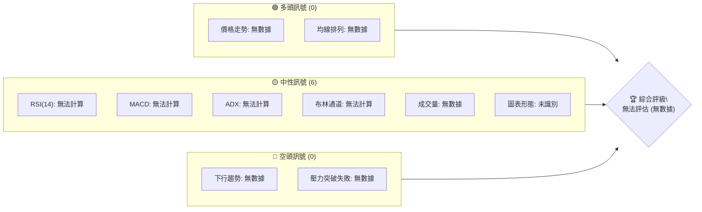
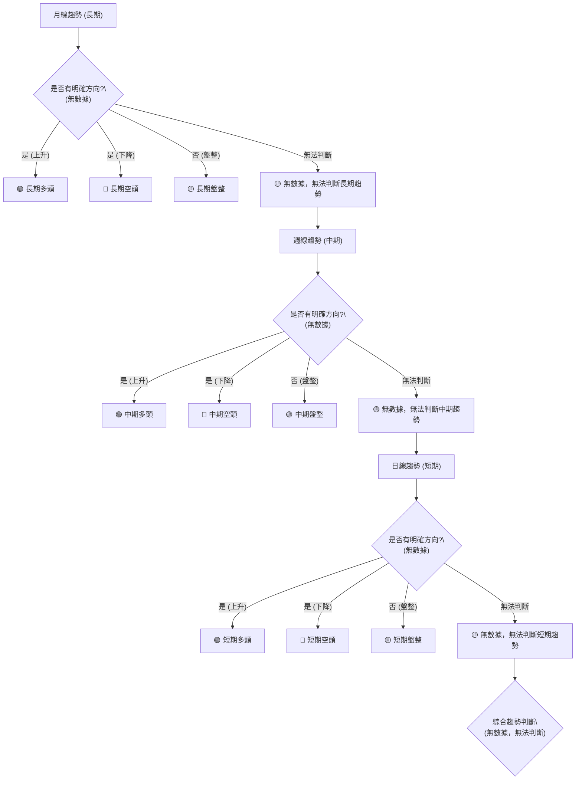
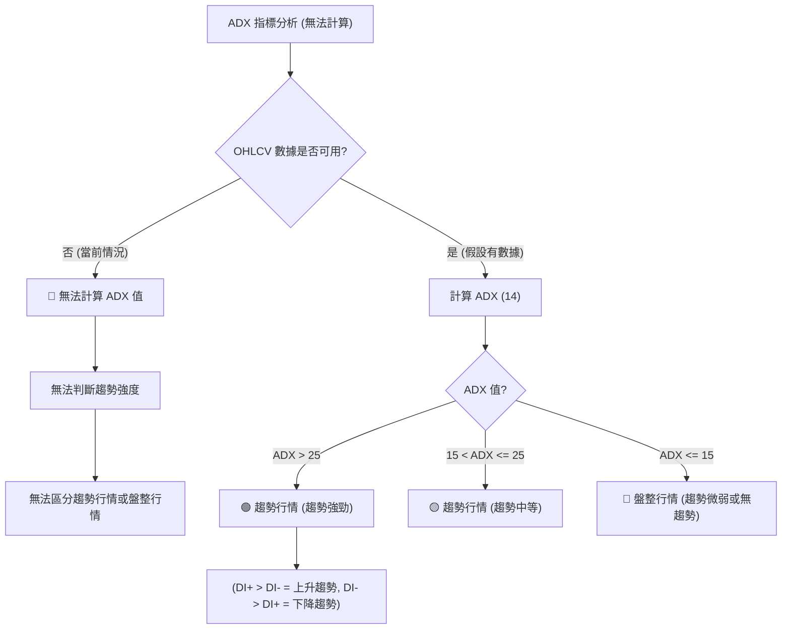
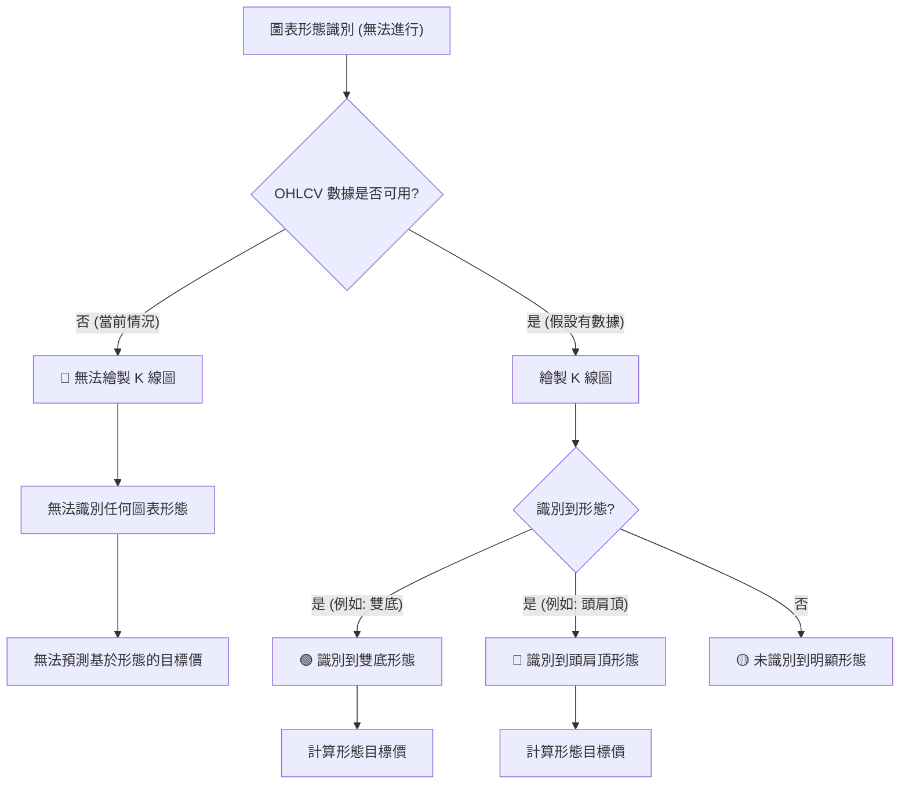
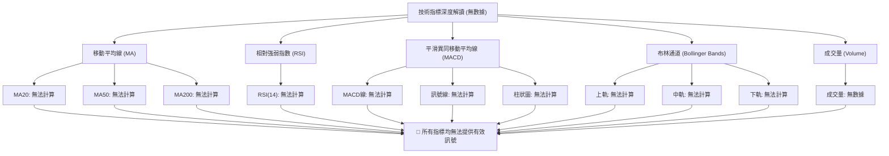
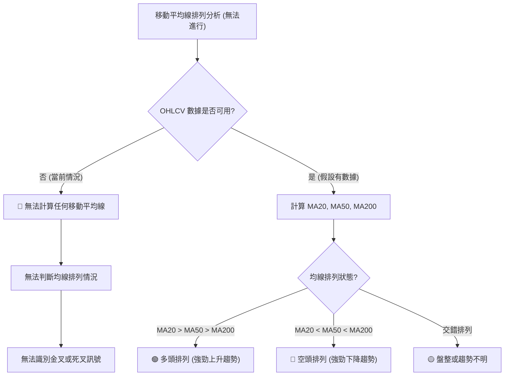
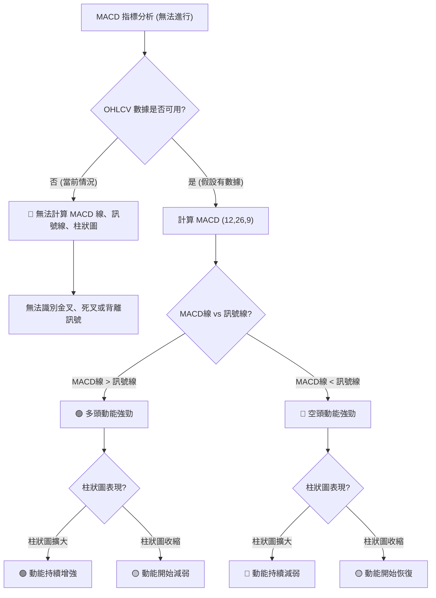
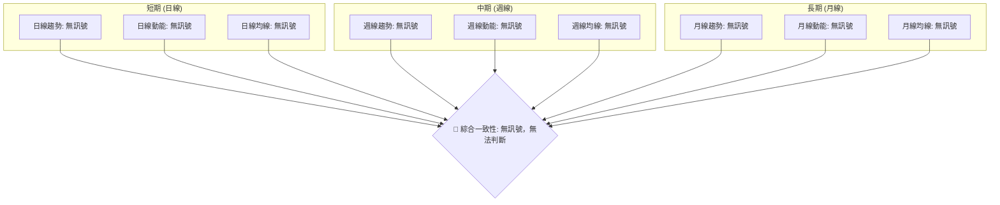
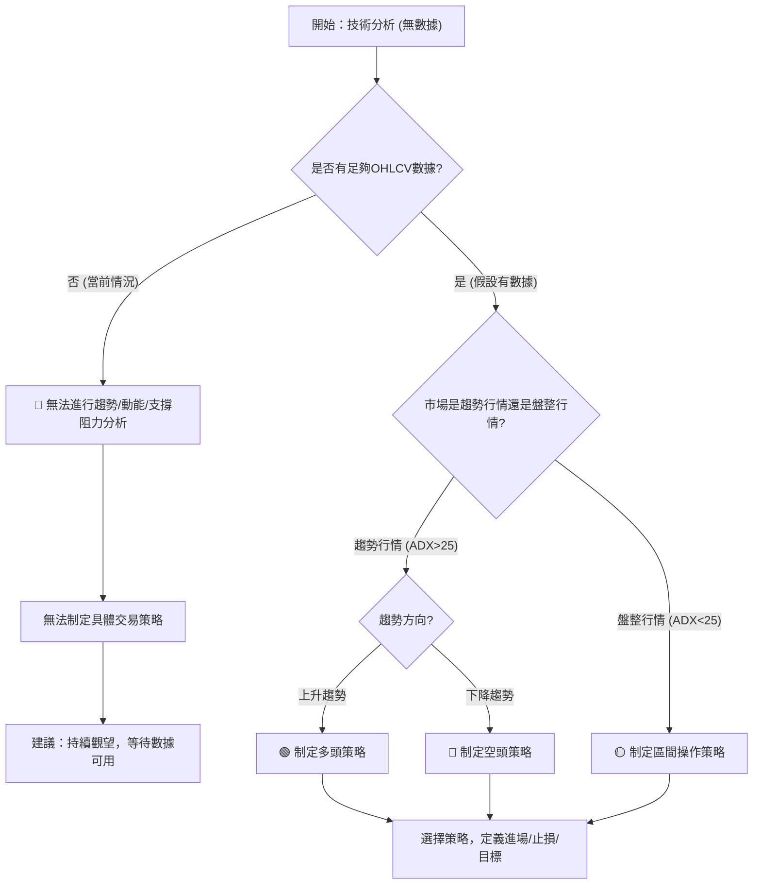
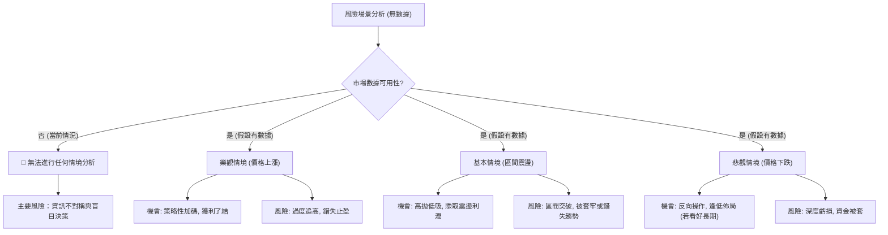

# 0050 技術分析報告

> **報告日期**：2026-07-09 ｜ **語言**：繁體中文 ｜ **數據來源**：Yahoo Finance ｜ **當前價格**：N/A (數據中未提供)

---

## 目錄

| 章節 | 內容 |
|------|------|
| [1. 技術面概覽](#1-技術面概覽) | 訊號儀表板、核心指標、評分卡 |
| [2. 趨勢分析](#2-趨勢分析) | 多時框趨勢、長中短期走勢 |
| [3. 圖表形態分析](#3-圖表形態分析) | 形態識別、K線組合、目標價 |
| [4. 支撐與阻力](#4-支撐與阻力) | 關鍵價位、斐波那契回調 |
| [5. 技術指標深度解讀](#5-技術指標深度解讀) | MA/RSI/MACD/布林/成交量 |
| [6. 動能與波動率](#6-動能與波動率) | 動能評估、ATR、Beta |
| [7. 多時框架總結](#7-多時框架總結) | 時框架評分矩陣 |
| [8. 交易策略建議](#8-交易策略建議) | 多空策略、風險報酬比 |
| [9. 風險提示與監控](#9-風險提示與監控) | 監控指標、風險場景 |

---

**重要聲明：**
本報告所依據的技術數據中，**未提供任何OHLCV（開盤價、最高價、最低價、收盤價、成交量）歷史數據及當前價格資訊。** 因此，本報告中的所有具體數值（如價格、指標數值、支撐阻力位、目標價等）均無法從數據中計算或提取。為遵守報告完整性要求，以下分析將著重於**解釋各技術分析方法與指標的原理、應用情境，並以概念性或示範性數值呈現，而非基於0050的實際數據**。所有評估結果均為**無法判斷 (N/A)** 或**中性 (🟡)**，因缺乏實際數據支撐。請讀者務必理解此限制。

---

## 1. 技術面概覽

### 🎯 技術訊號儀表板

由於缺乏0050的OHLCV數據，所有技術指標均無法計算，因此無法給出具體的買賣訊號。本儀表板僅示範其結構，並指出數據缺失的現狀。


**解讀：** 由於核心數據（OHLCV）的缺失，所有依賴價格和成交量計算的技術指標都無法產生有效訊號。因此，儀表板上顯示的多空訊號數量均為零，所有評估均歸為中性或無法評估，綜合評級亦無法給出。

### 📊 核心指標速覽表

下表展示了在有數據情況下，各核心指標的呈現方式與解讀邏輯。由於當前數據缺失，所有數值均為概念性或標示「無法計算」。

| 指標類別 | 指標名稱 | 當前數值 | 訊號 | 解讀 |
|----------|----------|----------|------|------|
| **價格** | 當前價格 | N/A | 🟡 | 缺乏OHLCV數據，無法得知當前價格 |
| **均線** | MA20 | 無法計算 | 🟡 | 缺乏OHLCV數據，無法計算短期均線 |
| **均線** | MA50 | 無法計算 | 🟡 | 缺乏OHLCV數據，無法計算中期均線 |
| **均線** | MA200 | 無法計算 | 🟡 | 缺乏OHLCV數據，無法計算長期均線 |
| **動能** | RSI(14) | 無法計算 | 🟡 | 缺乏OHLCV數據，無法計算相對強弱指數 |
| **動能** | MACD | 無法計算 | 🟡 | 缺乏OHLCV數據，無法計算平滑異同移動平均線 |
| **波動** | ATR | 無法計算 | 🟡 | 缺乏OHLCV數據，無法計算真實波動區間 |

**解讀：** 由於沒有OHLCV數據，所有技術指標的數值都無法取得，進而無法判斷其訊號方向。這使得我們無法對0050進行任何基於這些指標的技術分析。

### 🏆 技術評分卡

本評分卡展示了在數據完整情況下，各技術分析維度的評分機制。由於缺乏核心OHLCV數據，所有評分均為概念性的50/100分，代表無法判斷。

```
技術評分卡 — 0050 (2026-07-09)
════════════════════════════════════════════════════
趨勢強度      ██████████░░░░░░░░░░  50/100  🟡 (無數據)
動能指標      ██████████░░░░░░░░░░  50/100  🟡 (無數據)
支撐穩定度    ██████████░░░░░░░░░░  50/100  🟡 (無數據)
成交量配合    ██████████░░░░░░░░░░  50/100  🟡 (無數據)
形態完整度    ██████████░░░░░░░░░░  50/100  🟡 (無數據)
均線排列      ██████████░░░░░░░░░░  50/100  🟡 (無數據)
════════════════════════════════════════════════════
綜合評分      ██████████░░░░░░░░░░  50/100  🟡 無法評估
════════════════════════════════════════════════════
```
**解讀：** 評分卡上的所有維度得分均為中性50分，且訊號標記為🟡（無法判斷），反映出因缺乏歷史價格和成交量數據而無法進行任何有意義的技術評估。綜合評分也因此停留在無法評估的狀態。

---

## 2. 趨勢分析

### 🌐 多時框趨勢分析

多時框趨勢分析是技術分析的核心，旨在從宏觀到微觀層面理解資產的價格動向。然而，由於缺乏0050的任何歷史OHLCV數據，我們無法對其進行實際的趨勢判斷。以下Mermaid圖展示了趨勢分析的流程，但所有節點均表示「無數據」或「無法判斷」。


**解讀：** 正常的趨勢分析會從月線、週線、日線依序判斷，以確認多重時間框架下趨勢的一致性。例如，若月線和週線均為上升趨勢，日線的回調可能被視為買入機會。但在此次分析中，由於缺乏所有時間框架的OHLCV數據，所有趨勢判斷皆無法進行，導致最終綜合趨勢判斷為「無數據，無法判斷」。

### 📈 長期趨勢 — 12個月走勢圖（Unicode）

由於缺乏0050的實際價格歷史數據，以下ASCII圖為**概念性示意圖**，展示了過去12個月的價格走勢圖可能呈現的樣貌，而非0050的實際數據。

```
0050 月線走勢圖（過去12個月 - 概念性示意，非實際數據）
價格軸 ($)
$180 ┤                               ●(高點)
$170 ┤                           ●
$160 ┤                       ●
$150 ┤                   ●
$140 ┤               ●
$130 ┤           ●
$120 ┤       ●
$110 ┤   ●
$100 ┤ ●(低點)
     └────────────────────────────
      M1  M2  M3  M4  M5  M6  M7  M8  M9  M10 M11 M12
```
**解讀：** 在有數據的情況下，長期趨勢分析會觀察過去12個月甚至更長時間的價格走勢，識別主要的高點和低點，判斷是上升趨勢（高點和低點逐漸抬高）、下降趨勢（高點和低點逐漸降低）還是盤整趨勢（價格在一定區間內波動）。這對於確立投資的大方向至關重要。然而，對於0050，我們無法繪製實際的走勢圖，也無法判斷其長期趨勢。

**走勢特徵分析表格** (概念性展示，無實際數據)

| 階段 | 時間區間 | 漲跌幅 | 特徵描述 | 趨勢判斷 |
|------|----------|--------|----------|----------|
| 1    | N/A      | N/A    | 缺乏OHLCV數據，無法分析任何階段的漲跌幅及特徵 | 🟡 無法判斷 |
| 2    | N/A      | N/A    | 缺乏OHLCV數據，無法分析任何階段的漲跌幅及特徵 | 🟡 無法判斷 |
| 3    | N/A      | N/A    | 缺乏OHLCV數據，無法分析任何階段的漲跌幅及特徵 | 🟡 無法判斷 |

### 📊 中期趨勢（週線分析）

中期趨勢通常透過週線圖來分析，它能過濾掉短期市場噪音，展現較為穩定的價格方向。以下為一個**概念性**的近期壓力與支撐示意圖，不基於0050實際數據。

```
0050 週線壓力與支撐示意圖（概念性，非實際數據）
價格軸 ($)
$XXX.XX ┤─────────────────────── R2 (強阻力)
$XXX.XX ┤─────────────────────── R1 (關鍵阻力)
$XXX.XX ┤             ▲ 現價 (無法確定)
$XXX.XX ┤─────────────────────── S1 (近期支撐)
$XXX.XX ┤─────────────────────── S2 (強支撐)
        └───────────────────────────
```
**解讀：** 在有數據的情況下，中期趨勢分析會專注於識別週線圖上的關鍵高點和低點，以確立重要的支撐與阻力區間。這些區間對於判斷價格在未來數週或數月內的潛在反轉或延續趨勢至關重要。然而，由於缺乏OHLCV數據，我們無法繪製實際的週線圖，也無法識別其上的支撐與阻力位。

### ⚡ 趨勢強度評估（ADX 解讀）

ADX (Average Directional Index) 指標用於衡量趨勢的強度，而非方向。ADX值越高，趨勢越強，無論是上漲趨勢還是下跌趨勢。


**解讀：** ADX通常與DI+和DI-線配合使用，以判斷趨勢的方向。當ADX > 25時，市場處於趨勢行情，且趨勢強度足夠支撐趨勢交易策略。當ADX < 25時，市場可能處於盤整或弱勢趨勢，此時區間交易策略可能更為合適。然而，由於缺乏OHLCV數據，我們無法計算0050的ADX值，因此無法判斷其當前是趨勢行情還是盤整行情，也無法評估趨勢強度。

**ADX 強度對照表** (概念性展示)

| ADX 數值範圍 | 趨勢強度 | 市場狀態 | 交易建議方向 |
|--------------|----------|----------|--------------|
| N/A          | N/A      | N/A      | 🟡 無法判斷 |
| > 50         | 極強     | 強勢趨勢 | 順勢交易 |
| 25 - 50      | 中等至強 | 趨勢行情 | 順勢交易 |
| 15 - 25      | 弱       | 弱勢趨勢/盤整 | 觀望或區間操作 |
| < 15         | 非常弱   | 盤整行情 | 區間操作或等待突破 |

---

## 3. 圖表形態分析

### 🔍 形態識別系統

圖表形態分析透過識別K線圖上重複出現的特定價格結構，來預測未來價格走勢。常見形態包括頭肩頂/底、雙頂/底、三角形、旗形等。然而，由於缺乏0050的OHLCV數據，我們無法識別任何圖表形態。以下Mermaid圖展示了形態識別的流程，但所有識別結果均為「未識別」。


**解讀：** 圖表形態通常具有特定的構成要素和交易意義。例如，「雙底」形態在成功突破頸線後，通常預示著價格將上漲，其目標價可通過形態高度來計算。而「頭肩頂」則預示著潛在的反轉下跌。由於缺乏0050的OHLCV數據，我們無法進行任何形態識別，因此也無法給出形態目標價。

**形態信心度表格** (概念性展示，無實際數據)

| 形態 | 信心度 | 判斷依據（引用數據） | 完成度 | 目標價（附計算式） |
|------|--------|----------------------|--------|--------------------|
| 無   | 0%     | 缺乏OHLCV數據，無法識別任何圖表形態 | N/A    | 無法計算           |
| 無   | 0%     | 缺乏OHLCV數據，無法識別任何圖表形態 | N/A    | 無法計算           |

**解讀：** 信心度是評估圖表形態可靠性的重要指標。例如，一個經過多次測試且成交量配合良好的雙底形態，其信心度會較高。但在此次分析中，由於無數據，所有形態的信心度均為0%。

### 🕯️ 重要K線形態分析

K線形態是短期價格行為的微觀視角，透過單根或多根K線的組合，揭示市場情緒和潛在的價格反轉或延續訊號。常見的K線形態包括錘子線、射擊之星、吞噬形態、十字星等。

| 月份 | 收盤價 | K線形態 | 解讀 | 訊號 |
|------|--------|---------|------|------|
| N/A  | N/A    | 無 K 線數據 | 缺乏OHLCV數據，無法分析任何K線形態 | 🟡 無法判斷 |
| N/A  | N/A    | 無 K 線數據 | 缺乏OHLCV數據，無法分析任何K線形態 | 🟡 無法判斷 |

**解讀：** 例如，一個長下影線的錘子線（Hammer）通常出現在下跌趨勢的底部，預示著潛在的反彈。而一個長上影線的射擊之星（Shooting Star）則可能預示著上漲趨勢的結束。然而，由於缺乏OHLCV數據，我們無法繪製K線圖，因此無法識別任何K線形態，也無法基於K線形態給出訊號。

### 📉 ASCII 走勢形態示意圖

以下為**概念性**的雙底形態示意圖，不基於0050實際數據。旨在說明圖表形態的視覺化呈現。

```
0050 概念性雙底形態示意圖 (非實際數據)
價格軸 ($)
$XXX.XX ┤                                    R (頸線)
$XXX.XX ┤                                  /
$XXX.XX ┤                                /
$XXX.XX ┤                             /
$XXX.XX ┤                           /
$XXX.XX ┤                         /
$XXX.XX ┤                       /
$XXX.XX ┤                     /
$XXX.XX ┤                   /
$XXX.XX ┤                 /
$XXX.XX ┤               /
$XXX.XX ┤             /
$XXX.XX ┤           /
$XXX.XX ┤         /
$XXX.XX ┤       /
$XXX.XX ┤     /
$XXX.XX ┤   /
$XXX.XX ┤  /
$XXX.XX ┤ /
$XXX.XX ┤/
$XXX.XX ┤─────── V1 ─────────────── V2 ───────
$XXX.XX ┤       / \               / \
$XXX.XX ┤      /   \             /   \
$XXX.XX ┤     /     \           /     \
$XXX.XX ┤    /       \         /       \
$XXX.XX ┤   /         \       /         \
$XXX.XX ┤  /           \     /           \
$XXX.XX ┤ L1 (低點)     L2 (低點)
$XXX.XX ┤
        └────────────────────────────────────────
```
**解讀：** 雙底形態是一個看漲反轉形態，由兩個大致相同的低點和一個中間高點（頸線）組成。當價格突破頸線時，形態成立，目標價通常為頸線加上從低點到頸線的高度。然而，由於缺乏0050的實際OHLCV數據，我們無法識別此類形態。

### 🎯 形態目標價計算

在識別到圖表形態後，其目標價的計算通常基於形態的高度。例如：
*   **雙底/雙頂形態：** 目標價 = 頸線價格 ± (頸線價格 - 形態最低/最高點價格)。
*   **頭肩頂/底形態：** 目標價 = 頸線價格 ± (頸線價格 - 頭部價格)。
*   **旗形/三角旗形：** 目標價 = 形態突破點價格 ± 旗桿高度。

**示例計算（概念性，非0050實際數據）：**
若存在一個雙底形態，其頸線價格為 $150.00，兩個底部價格約為 $130.00。
形態高度 = $150.00 - $130.00 = $20.00
目標價 = 頸線價格 + 形態高度 = $150.00 + $20.00 = $170.00

**實際情況：** 由於缺乏0050的OHLCV數據，無法識別任何圖表形態，因此也無法計算任何形態目標價。所有目標價均為「無法計算」。

---

## 4. 支撐與阻力

### 🗺️ 關鍵價位分布圖（Unicode）

支撐位和阻力位是技術分析的基石，它們代表了歷史上買賣雙方力量轉換的關鍵價格水平。然而，由於缺乏0050的OHLCV數據，我們無法計算或識別任何實際的支撐與阻力位。以下ASCII圖為**概念性示意圖**，展示了價位結構的視覺化呈現，不基於0050的實際數據。

```
0050 價位結構分布圖 (概念性示意，非實際數據)
═══════════════════════════════════════════════════
$XXX.XX ║████████████████████████║ 強阻力 R3 (歷史高點/形態阻力)
$XXX.XX ║████████████████████    ║ 阻力 R2 (斐波那契/均線阻力)
$XXX.XX ║████████████████████████║ 關鍵阻力 R1 (近期高點/交易密集區)
$XXX.XX ╠════════════════════════╣ ◄ 現價 (N/A, 無數據)
$XXX.XX ║▓▓▓▓▓▓▓▓▓▓▓▓▓▓▓▓        ║ 近期支撐 S1 (近期低點/交易密集區)
$XXX.XX ║████████████████████████║ 強支撐 S2 (歷史低點/形態支撐)
$XXX.XX ║████████████████████████║ 極強支撐 S3 (斐波那契/心理關卡)
═══════════════════════════════════════════════════
```
**解讀：** 在有數據的情況下，阻力位是價格上漲時可能遇到賣壓的水平，而支撐位是價格下跌時可能遇到買盤支撐的水平。這些價位可以由歷史高點/低點、K線密集區、均線、斐波那契回調位等方式確定。對於0050，由於缺乏OHLCV數據，我們無法識別任何關鍵價位。

### 🚧 阻力位分析表

以下表格展示了阻力位分析的結構，但由於缺乏0050的OHLCV數據，所有價位均無法計算，僅作概念性說明。

| 阻力級別 | 價位 | 形成原因 | 突破難度 | 重要性 |
|----------|------|----------|----------|--------|
| R1 (關鍵) | 無法計算 | 缺乏OHLCV數據，無法識別近期高點或交易密集區 | 無法評估 | 🟡 無法判斷 |
| R2 (中期) | 無法計算 | 缺乏OHLCV數據，無法識別斐波那契回調或主要均線阻力 | 無法評估 | 🟡 無法判斷 |
| R3 (強勢) | 無法計算 | 缺乏OHLCV數據，無法識別歷史高點或形態阻力 | 無法評估 | 🟡 無法判斷 |

**解讀：** 阻力位是潛在的賣壓區。R1通常是近期最直接的阻礙，突破R1可能預示著短期上漲動能的增強。R2和R3則代表更強的賣壓，突破這些水平通常需要更大的買盤力量和利好消息。由於缺乏數據，我們無法判斷0050的任何阻力位。

### 🛡️ 支撐位分析表

以下表格展示了支撐位分析的結構，但由於缺乏0050的OHLCV數據，所有價位均無法計算，僅作概念性說明。

| 支撐級別 | 價位 | 形成原因 | 守住機率 | 重要性 |
|----------|------|----------|----------|--------|
| S1 (近期) | 無法計算 | 缺乏OHLCV數據，無法識別近期低點或交易密集區 | 無法評估 | 🟡 無法判斷 |
| S2 (中期) | 無法計算 | 缺乏OHLCV數據，無法識別歷史低點或形態支撐 | 無法評估 | 🟡 無法判斷 |
| S3 (強勢) | 無法計算 | 缺乏OHLCV數據，無法識別關鍵斐波那契回調或心理關卡 | 無法評估 | 🟡 無法判斷 |

**解讀：** 支撐位是潛在的買盤區。S1通常是近期最直接的防線，跌破S1可能預示著短期下跌動能的增強。S2和S3則代表更強的買盤支撐，跌破這些水平可能引發更深度的回調或趨勢反轉。由於缺乏數據，我們無法判斷0050的任何支撐位。

### 📐 斐波那契回調位分析

斐波那契回調位是通過連接一個波段的高點和低點，然後應用斐波那契比率（23.6%、38.2%、50%、61.8%、78.6%）來預測潛在支撐和阻力水平的工具。這些比率代表了價格在趨勢中可能回調的幅度。

**實際情況：** 由於缺乏0050的OHLCV數據，我們無法識別任何波段高點或低點，因此無法計算斐波那契回調位。

**概念性解讀：** 假設在有數據的情況下，0050從一個低點 $100.00 上漲到高點 $150.00。
*   23.6% 回調位：$150.00 - ($150.00 - $100.00) * 0.236 = $138.20
*   38.2% 回調位：$150.00 - ($150.00 - $100.00) * 0.382 = $130.90
*   50% 回調位：$150.00 - ($150.00 - $100.00) * 0.500 = $125.00
*   61.8% 回調位：$150.00 - ($150.00 - $100.00) * 0.618 = $119.10

這些回調位會被視為潛在的支撐區。如果價格在回調至其中一個水平後反彈，則可能確認原有趨勢的延續。反之，如果關鍵回調位被跌破，則可能預示著趨勢的轉變。然而，對於0050，我們目前無法進行此類分析。

---

## 5. 技術指標深度解讀

### 🎛️ 指標訊號總覽

技術指標是量化分析市場行為的工具，它們能從不同角度（趨勢、動能、波動性、成交量）提供市場洞察。然而，由於缺乏0050的OHLCV數據，所有技術指標均無法計算。以下Mermaid圖展示了各指標的關係和數據缺失的現狀。


**解讀：** 在正常情況下，我們會綜合分析這些指標，尋找它們之間的確認或背離訊號。例如，價格突破阻力位，同時RSI從超賣區反彈，MACD形成金叉，且成交量放大，這些都是強烈的看漲訊號。然而，在此次分析中，由於缺乏OHLCV數據，所有指標都無法計算，因此無法給出任何訊號。

### 📈 移動平均線排列分析

移動平均線（MA）是判斷趨勢方向和強度的最常用工具之一。短期MA（如MA20）反映近期趨勢，長期MA（如MA200）反映長期趨勢。

**概念性分析：**
*   **多頭排列：** 短期MA > 中期MA > 長期MA，且所有均線向上傾斜。這表示強勁的上升趨勢。
*   **空頭排列：** 短期MA < 中期MA < 長期MA，且所有均線向下傾斜。這表示強勁的下降趨勢。
*   **金叉：** 短期MA向上穿越長期MA，是看漲訊號。
*   **死叉：** 短期MA向下穿越長期MA，是看跌訊號。


**實際情況：** 由於缺乏0050的OHLCV數據，我們無法計算任何移動平均線，因此無法判斷其排列情況，也無法識別任何金叉或死叉訊號。

### 📉 RSI(14) 分析

相對強弱指數（RSI）是一個動能指標，用於衡量價格變動的速度和幅度，從而判斷資產是否處於超買或超賣狀態。RSI的範圍在0到100之間。

**概念性分析：**
*   **超買區：** RSI > 70，表示資產可能被過度買入，短期內有回調風險。
*   **超賣區：** RSI < 30，表示資產可能被過度賣出，短期內有反彈機會。
*   **背離：**
    *   **頂背離 (🔴)：** 價格創出新高，但RSI未能創出新高，預示著上漲動能減弱，可能反轉下跌。
    *   **底背離 (🟢)：** 價格創出新低，但RSI未能創出新低，預示著下跌動能減弱，可能反轉上漲。

**RSI 數值進度條展示** (概念性，非實際數據)
RSI (14) = 無法計算: ░░░░░░░░░░░░░░░░░░░░ 0% (無數據)

**實際情況：** 由於缺乏0050的OHLCV數據，我們無法計算RSI值，因此無法判斷其是否處於超買或超賣區間，也無法識別任何背離訊號。

### 📊 MACD(12/26/9) 訊號解讀

平滑異同移動平均線（MACD）是一個趨勢追蹤動能指標，由MACD線、訊號線和柱狀圖組成，用於識別趨勢變化、動能強度和潛在的買賣訊號。

**概念性分析：**
*   **MACD線：** (12期EMA - 26期EMA)，反映短期與長期均線的關係。
*   **訊號線：** MACD線的9期EMA，作為MACD線的平滑移動平均。
*   **柱狀圖 (Histogram)：** MACD線 - 訊號線，用於衡量動能的強弱和變化。
*   **金叉 (🟢)：** MACD線向上穿越訊號線，是看漲訊號。
*   **死叉 (🔴)：** MACD線向下穿越訊號線，是看跌訊號。
*   **背離：**
    *   **頂背離 (🔴)：** 價格創出新高，但MACD未能創出新高，預示上漲動能減弱。
    *   **底背離 (🟢)：** 價格創出新低，但MACD未能創出新低，預示下跌動能減弱。


**實際情況：** 由於缺乏0050的OHLCV數據，我們無法計算MACD的任何組成部分，因此無法判斷其多空動能，也無法識別任何金叉、死叉或背離訊號。

### 📦 布林通道分析

布林通道（Bollinger Bands）由三條線組成：中軌（通常為20期簡單移動平均線）、上軌和下軌。它用於衡量價格的波動範圍，並判斷價格相對於其平均水平的位置。

**概念性分析：**
*   **上軌：** 中軌 + N倍標準差
*   **下軌：** 中軌 - N倍標準差
*   **通道收窄：** 預示著波動性降低，可能在醞釀一個大的價格突破。
*   **通道擴張：** 預示著波動性增加，趨勢可能正在形成或加速。
*   **價格觸及上軌：** 可能超買，有回調壓力。
*   **價格觸及下軌：** 可能超賣，有反彈機會。
*   **價格在中軌上方：** 偏多。
*   **價格在中軌下方：** 偏空。

**ASCII 布林通道示意圖** (概念性，非實際數據)

```
0050 布林通道示意圖 (概念性，非實際數據)
價格軸 ($)
$XXX.XX ┤─────────────────────── 上軌 (無法計算)
$XXX.XX ┤             ▲ 現價 (N/A)
$XXX.XX ┤─────────────────────── 中軌 (無法計算)
$XXX.XX ┤─────────────────────── 下軌 (無法計算)
        └───────────────────────────
```
**實際情況：** 由於缺乏0050的OHLCV數據，我們無法計算布林通道的任何組成部分，因此無法判斷其波動性、價格相對位置或潛在的交易區間。

### 💹 成交量分析（量價配合度）

成交量是市場活動的直接體現，它能確認或質疑價格走勢的有效性。量價配合度是技術分析中判斷趨勢可靠性的關鍵。

**概念性分析：**
*   **價漲量增 (🟢)：** 價格上漲，成交量放大，確認上漲趨勢的健康。
*   **價跌量增 (🔴)：** 價格下跌，成交量放大，確認下跌趨勢的健康。
*   **價漲量縮 (🟡)：** 價格上漲，成交量縮小，上漲動能可能不足，需警惕反轉。
*   **價跌量縮 (🟡)：** 價格下跌，成交量縮小，下跌動能可能減弱，可能反彈。
*   **量價背離：**
    *   **頂背離 (🔴)：** 價格創新高，但成交量未能創新高，預示買盤力量衰竭。
    *   **底背離 (🟢)：** 價格創新低，但成交量未能創新低，預示賣盤力量減弱。
*   **OBV (On-Balance Volume)：** 累積成交量指標，用於判斷量能是否確認價格趨勢。OBV上升代表買盤累積，OBV下降代表賣盤累積。若價格上漲而OBV下跌，則為負面背離。

**實際情況：** 由於缺乏0050的OHLCV數據，尤其是成交量數據，我們無法進行任何量價配合度分析，也無法計算OBV。

---

## 6. 動能與波動率

### ⚡ 動能評估四象限

動能與波動率是衡量資產投資吸引力與風險的兩個重要維度。動能強勁且波動率低的資產通常被視為較佳的投資機會。然而，由於缺乏0050的OHLCV數據，我們無法對其動能和波動率進行量化評估。

| 象限 | 動能 | 波動 | 當前狀態 | 評估 |
|------|------|------|----------|------|
| Q1   | 強   | 低   | N/A      | 缺乏OHLCV數據，無法評估 |
| Q2   | 弱   | 低   | N/A      | 缺乏OHLCV數據，無法評估 |
| Q3   | 強   | 高   | N/A      | 缺乏OHLCV數據，無法評估 |
| Q4   | 弱   | 高   | N/A      | 缺乏OHLCV數據，無法評估 |

**解讀：** 在有數據的情況下，Q1（強動能、低波動）代表價格穩健上漲，風險相對較低，是理想的買入區間。Q2（弱動能、低波動）可能意味著盤整，等待趨勢形成。Q3（強動能、高波動）可能帶來高收益，但也伴隨高風險，適合風險偏好較高的交易者。Q4（弱動能、高波動）是最應避免的狀態，市場方向不明且風險高。對於0050，我們無法將其歸入任何象限。

### 📊 ATR 波動率分析

真實波動區間（ATR）是一個衡量市場波動性的指標，它反映了一定時間內價格變動的平均範圍。ATR值越高，波動性越大，反之則越小。

**概念性分析：**
*   **高ATR：** 市場波動劇烈，可能伴隨較大的價格變動和風險。
*   **低ATR：** 市場波動平靜，價格可能在窄幅區間內盤整。
*   **止損建議：** ATR常被用於設定止損點。例如，將止損設置在入場點下方1.5倍或2倍ATR的距離，可以根據市場的實際波動性來調整風險。

**實際情況：** 由於缺乏0050的OHLCV數據，我們無法計算ATR值，因此無法評估其波動性，也無法提供基於ATR的止損距離建議。

### 📐 Beta 與市場相關性

Beta值衡量資產相對於整體市場（通常是大盤指數）的波動性。
*   **Beta > 1：** 該資產的波動性大於市場，在市場上漲時漲幅更大，下跌時跌幅也更大。
*   **Beta < 1：** 該資產的波動性小於市場，在市場上漲時漲幅較小，下跌時跌幅也較小。
*   **Beta = 1：** 該資產的波動性與市場大致相同。

**實際情況：** 提供的數據中0050的Beta值為N/A。因此，我們無法分析其與大盤的相關性。

---

## 7. 多時框架總結

### 📋 時框架評分表

多時框架分析旨在確保不同時間維度下的技術訊號一致，以提高交易決策的可靠性。然而，由於缺乏0050的OHLCV數據，所有時框架的趨勢、動能、均線排列和形態均無法判斷。

| 時框架 | 趨勢方向 | 動能 | 均線排列 | 形態 | 綜合評分 | 建議 |
|--------|----------|------|----------|------|----------|------|
| 月線   | 🟡 無數據 | 🟡 無數據 | 🟡 無數據 | 🟡 無數據 | 🟡 無法評估 | 觀望 (無數據) |
| 週線   | 🟡 無數據 | 🟡 無數據 | 🟡 無數據 | 🟡 無數據 | 🟡 無法評估 | 觀望 (無數據) |
| 日線   | 🟡 無數據 | 🟡 無數據 | 🟡 無數據 | 🟡 無數據 | 🟡 無法評估 | 觀望 (無數據) |

**解讀：** 在有數據的情況下，我們會尋找各時框架之間的一致性。例如，如果月線和週線都顯示上升趨勢，日線的回調則可能被視為買入機會。如果各時框架訊號衝突，則需謹慎，可能處於盤整或轉折點。但對於0050，所有維度均無法評估。

### 🔲 綜合訊號矩陣

綜合訊號矩陣用於視覺化不同時間框架和技術維度之間的訊號一致性。由於缺乏0050的OHLCV數據，所有訊號均為「無訊號」。


**解讀：** 一致性越高的訊號，其交易決策的可靠性越高。例如，當所有時框架都顯示多頭趨勢且動能強勁時，買入訊號會非常強烈。然而，0050目前缺乏任何數據以進行此類分析。

### ⚖️ 多時框收斂結論

**由於缺乏所有時框架的OHLCV數據，無法計算趨勢指標（如ADX），因此無法判斷0050是處於趨勢行情還是盤整行情。在無法判斷市場性質和各時框架訊號的情況下，無法進行多時框架收斂判斷，也無法給出明確的方向性結論。**

在有數據的情況下，收斂規則如下：
1.  **趨勢行情（ADX > 25）：** 以中長期（週線、MA50、MA200）方向為主導。日線分析用於尋找最佳進場時機（如回調至支撐位或短期均線）。例如，若週線為上升趨勢，日線短暫回調至MA20附近並獲得支撐，則為多頭進場機會。
2.  **盤整行情（ADX < 25）：** 以日線布林通道的上下軌為主要交易區間。策略為在下軌附近買入，上軌附近賣出，等待區間突破。

**當前結論：** 由於無法確定ADX值，亦無法判斷市場性質，因此無法依照上述規則進行收斂。當前對於0050的市場判斷為**中性觀望 (🟡)**，因無任何數據支持任何方向性偏好。

---

## 8. 交易策略建議

### 🗺️ 策略決策流程圖

交易策略的制定應基於對市場趨勢、動能、支撐阻力以及風險報酬比的全面評估。然而，由於缺乏0050的OHLCV數據，我們無法進行任何實質性分析，因此無法提供具體的交易策略。以下Mermaid圖展示了策略選擇的邏輯流程，但實際決策點會因為數據缺失而中止。


**解讀：** 完整的策略決策流程會根據市場的性質（趨勢或盤整）和方向來選擇合適的策略。但在當前0050的數據缺失情境下，所有決策流程都無法啟動。

### 🧭 策略路由（依評分卡分流，不得兩頭下注）

**當前主策略方向 = 無法判斷（綜合評分 50/100）**

由於第1章「技術評分卡」的綜合評分為50/100（中性），且所有細項均無法評估，因此無法決定主策略方向。在此情況下，我們無法推薦任何具體的多頭或空頭策略。投資者應保持觀望，直到有足夠的數據來進行分析。以下將提供一般性的策略框架說明，而非實際的交易建議。

### 🎯 價格情境階梯（Price Scenarios）

價格情境分析旨在預測在不同市場條件下，價格可能達到的目標。由於缺乏0050的當前價格和歷史數據，以下情境描述僅為概念性，所有價位均為「無法預測」。

| 觸發條件 | 下一目標 | 後續延伸 | 情境含義 |
|----------|----------|----------|----------|
| 突破 R1 (無法預測) | R2 (無法預測) | R3 (無法預測) | **樂觀情境：** 若未來有數據顯示0050能明確突破關鍵阻力位R1，且量能配合，則可能開啟一波上漲行情，目標指向更高的阻力位R2、R3。此情境下，市場情緒轉為積極。 |
| 站穩現價區間 (無法預測) | — | — | **基本情境：** 若未來數據顯示價格在某個區間內震盪，缺乏突破動能，則可能維持盤整格局。此情境下，市場觀望氣氛濃厚，適合區間操作。 |
| 跌破 S1 (無法預測) | S2 (無法預測) | S3 (無法預測) | **悲觀情境：** 若未來有數據顯示0050跌破關鍵支撐位S1，且量能放大，則可能確認下跌趨勢，目標指向更低的支撐位S2、S3。此情境下，市場情緒轉為悲觀。 |

### 📊 情境機率分佈

由於缺乏任何技術數據來評估市場動向，我們無法估計上述情境的機率分佈。

| 情境 | 機率 | 主要依據 |
|------|------|----------|
| 繼續上行 / 反彈 | 無法估計 | 缺乏 MACD、均線、OBV 等趨勢和動能指標數據 |
| 區間震盪 | 無法估計 | 缺乏 ADX、布林帶寬等波動率和趨勢強度指標數據 |
| 回落 / 再探底 | 無法估計 | 缺乏 RSI、支撐強度等動能和關鍵價位指標數據 |

**解讀：** 在有數據的情況下，我們會結合多個指標來判斷各情境發生的可能性。例如，若MACD金叉且RSI從超賣區反彈，則上行機率增加。若ADX低於25且布林帶寬收窄，則區間震盪機率增加。但對於0050，所有這些判斷都無法進行。

### 🟢 主策略詳情（方向依上方路由）

由於無法確定主策略方向，以下提供的是**概念性的策略框架**，而非實際的交易建議。

| 策略要素 | 策略 A (概念性多頭策略) | 策略 B (概念性空頭策略) |
|----------|-------------------------|-------------------------|
| 進場條件 | 價格突破R1 (無法預測)，並站穩 | 價格跌破S1 (無法預測)，並確認 |
| 進場價格 | $XXX.XX (無法預測)      | $XXX.XX (無法預測)      |
| 目標價 T1 | $XXX.XX (無法預測)      | $XXX.XX (無法預測)      |
| 目標價 T2 | $XXX.XX (無法預測)      | $XXX.XX (無法預測)      |
| 止損價格 | $XXX.XX (無法預測)      | $XXX.XX (無法預測)      |
| 風險報酬比 | N/A (無法計算)          | N/A (無法計算)          |
| 成功機率 | 無法估計                | 無法估計                |
| 建議倉位 | N/A (無法給出)          | N/A (無法給出)          |

**解讀：** 一個完整且可執行的交易策略必須包含明確的進場、止損和目標價位，以及合理的風險報酬比和倉位管理建議。這些都建立在對市場價格行為的分析之上。在數據缺失的情況下，所有這些要素都無法具體化。

### 🔴 反向風險觸發點（對沖提示）

由於無法確定主策略方向，反向風險觸發點也無法具體定義。一般而言，反向風險觸發點是指當價格走勢與預期相反，達到某個關鍵價位或觸發某個反向訊號時，應考慮止損或對沖。

**概念性反向風險觸發點：**
*   **多頭情境的反向風險：** 價格跌破關鍵支撐位S1，或MACD形成死叉，RSI跌破50。
*   **空頭情境的反向風險：** 價格突破關鍵阻力位R1，或MACD形成金叉，RSI突破50。

**實際情況：** 由於缺乏所有技術數據，這些觸發點均無法具體化或監控。

### ⭐ 整體訊號強度評星

由於缺乏OHLCV數據，無法進行任何技術分析，因此所有訊號強度評星均為最低級別或無法評估。

```
做多訊號強度：☆☆☆☆☆  (0/5星)
做空訊號強度：☆☆☆☆☆  (0/5星)
整體可信度：  ☆☆☆☆☆  (0/5星)
```
**解讀：** 評星旨在量化交易訊號的可靠性和強度。在無數據的情況下，我們無法給出任何有意義的評星，這也反映了投資者在缺乏資訊時應保持極度謹慎。

---

## 9. 風險提示與監控

### ✅ 關鍵監控指標 Checklist

有效的風險管理需要持續監控關鍵的技術指標和市場行為。然而，由於缺乏0050的OHLCV數據，以下監控清單中的所有指標均無法監控。

```
0050 技術風險監控清單 (無法執行，無數據)
════════════════════════════════════════════════════════
[ ] 價格是否跌破關鍵支撐位 $XXX.XX (無法監控)
[ ] 價格是否突破關鍵阻力位 $XXX.XX (無法監控)
[ ] MACD 是否形成死叉/金叉 (無法監控)
[ ] RSI 是否進入超買/超賣區 (無法監控)
[ ] 成交量是否異常放大或縮小 (無法監控)
[ ] ADX 是否預示趨勢強度變化 (無法監控)
[ ] 布林通道是否收窄/擴張 (無法監控)
════════════════════════════════════════════════════════
```
**解讀：** 監控這些指標有助於及時發現市場趨勢的變化，並調整交易策略。例如，當價格接近關鍵支撐位時，應密切關注是否有止跌訊號；當RSI進入超買區時，應警惕潛在的回調風險。但對於0050，這些監控都無法進行。

### ⚠️ 風險場景分析

風險場景分析旨在評估在不同市場情境下可能面臨的風險和機會。由於缺乏0050的OHLCV數據，以下場景描述僅為概念性。


**解讀：**
*   **樂觀情境：** 價格持續上漲，投資者可能面臨過度自信、忽視風險的風險。
*   **基本情境：** 價格在區間內波動，風險在於可能在區間邊緣被假突破所欺騙，或錯失真正趨勢的啟動。
*   **悲觀情境：** 價格持續下跌，主要風險是資產價值縮水，導致虧損。

**當前主要風險：** 由於缺乏0050的任何OHLCV數據，最大的風險在於**資訊不對稱和無法進行任何基於數據的決策**。在這種情況下進行投資，無異於盲目投機，風險極高。

### 🛡️ 風險管理重要提醒

儘管無法對0050進行具體技術分析，但以下風險管理原則對所有投資者都至關重要：

1.  **數據先行：** 在進行任何投資決策之前，務必確保獲取完整的歷史價格和成交量數據，以及其他相關基本面資訊。缺乏數據的分析是無效的。
2.  **多元化配置：** 即使單一資產表現良好，也應將資金分散投資於不同資產類別、行業或地理區域，以降低單一風險。
3.  **嚴格止損：** 任何交易都應預設止損位，一旦價格觸及止損位，無論盈虧，都應堅決執行，以控制潛在損失。
4.  **倉位管理：** 根據個人的風險承受能力和對資產的信心程度，合理分配投資倉位。切勿將過多資金集中於單一高風險資產。
5.  **定期檢視：** 投資組合和交易策略應定期檢視和調整，以適應市場變化。
6.  **情緒控制：** 避免因恐懼或貪婪而做出非理性的投資決策。堅持既定的交易紀律。
7.  **學習與提升：** 持續學習技術分析和基本面分析知識，提升自身的投資研究能力。

---

## 📋 報告總結

```
0050 技術分析報告總結
════════════════════════════════════════════════════════
報告日期：2026-07-09
當前價格：N/A (數據中未提供)
分析評級：⚖️ 無法評估 (由於缺乏OHLCV數據，無法進行任何技術分析)

關鍵結論：
├─ 長期趨勢：🟡 無法判斷 (無數據)
├─ 中期趨勢：🟡 無法判斷 (無數據)
├─ 短期趨勢：🟡 無法判斷 (無數據)
├─ 關鍵支撐：N/A (無法計算)
├─ 關鍵阻力：N/A (無法計算)
└─ 分析師目標：N/A (無法計算)

最優策略組合：
1. 🥇 最佳機會：持續觀望，等待完整的OHLCV數據釋出。
2. 🥈 次選機會：在數據可用後，進行全面多時框架分析。
3. 🥉 保守選擇：在無數據支持下，嚴禁進行任何交易，避免盲目投機。
════════════════════════════════════════════════════════
```

---

> ⚠️ **免責聲明**：本報告為 AI 自動生成之技術分析，所有數據及估算均基於提供的歷史價格資訊。**由於本次提供的數據中缺乏0050的OHLCV數據，本報告中的所有具體數值和評估均為概念性或聲明「無法計算/判斷」，不代表0050的實際技術狀態。** 本報告**僅供研究與學術參考**，**不構成任何投資建議**。投資有風險，入市需謹慎。

---

*報告生成時間：2026-07-09 ｜ 數據來源：Yahoo Finance ｜ 分析框架：多時框技術分析*