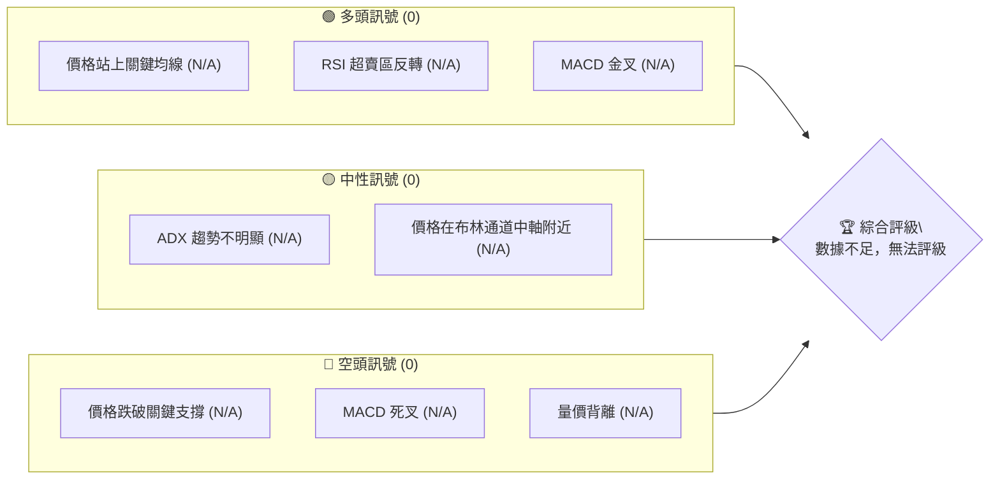
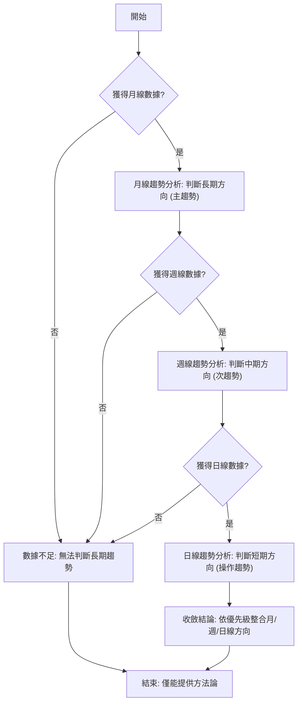
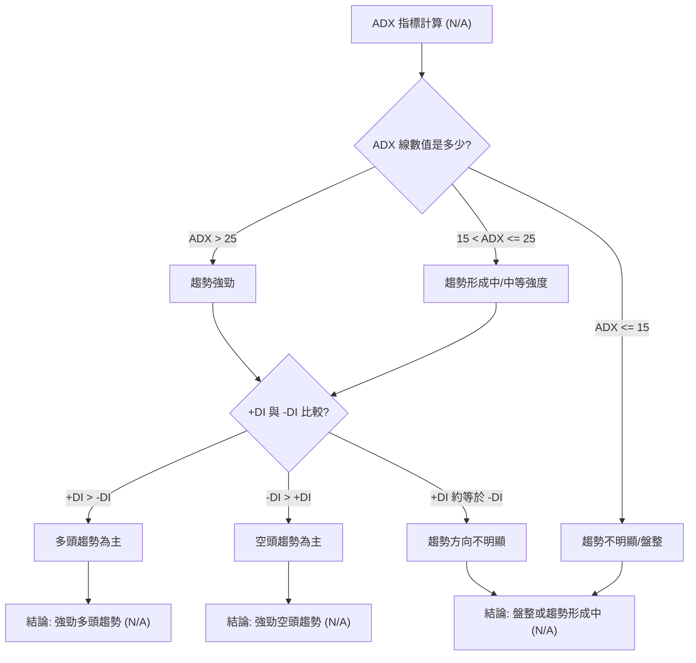
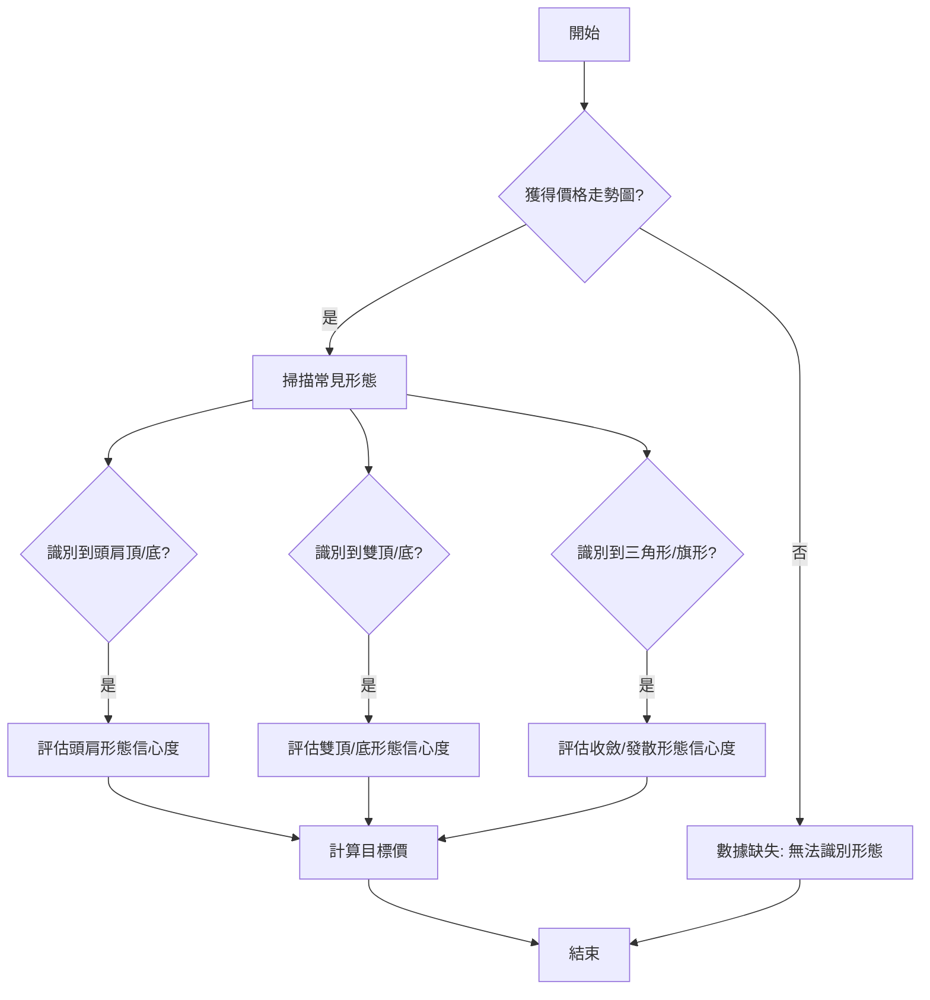
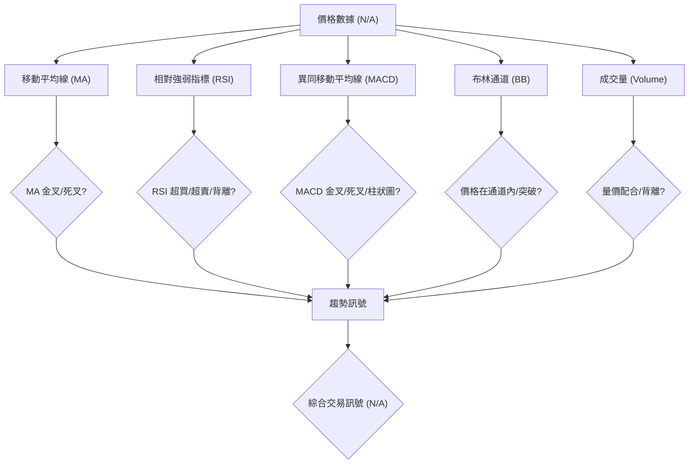
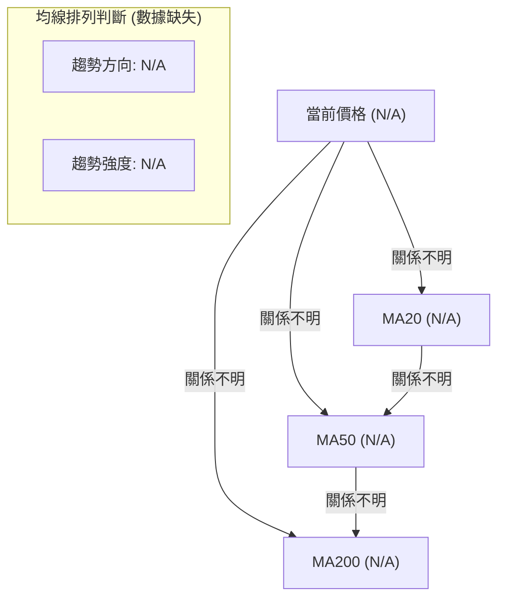
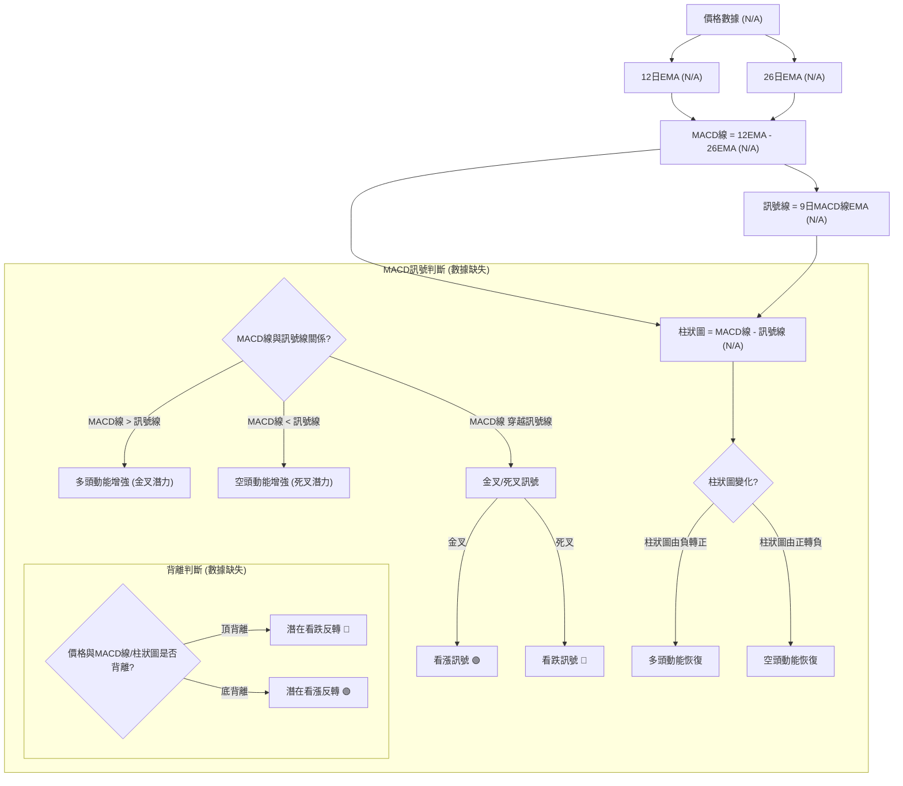
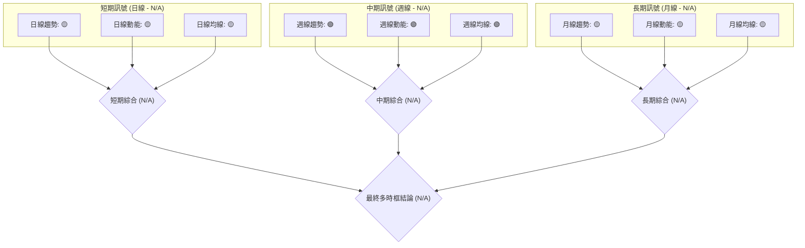
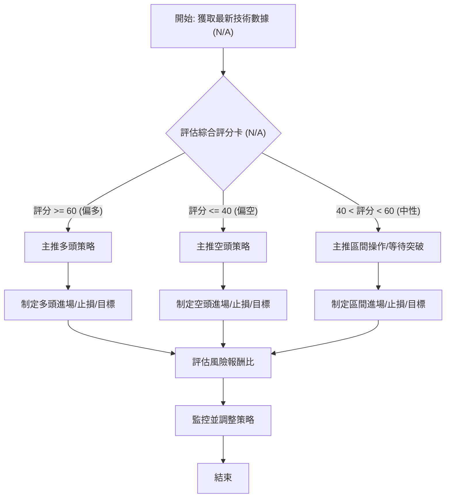
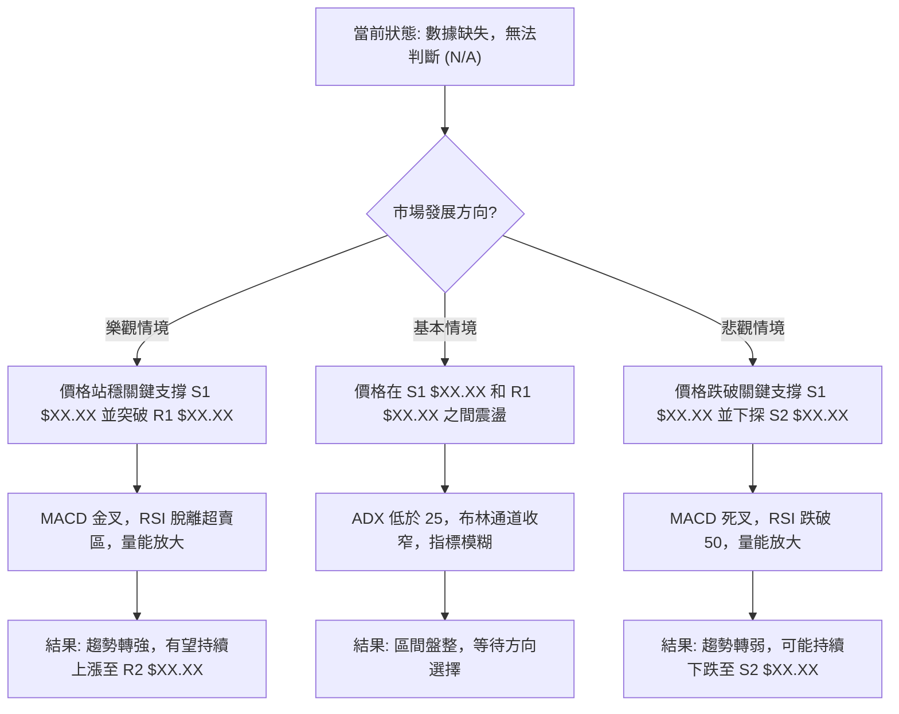

# 0050 技術分析報告

> **報告日期**：22026-07-10 ｜ **語言**：繁體中文 ｜ **數據來源**：Yahoo Finance ｜ **當前價格**：N/A (數據缺失)

---

## 目錄

| 章節 | 內容 |
|------|------|
| [1. 技術面概覽](#1-技術面概覽) | 訊號儀表板、核心指標、評分卡 |
| [2. 趨勢分析](#2-趨勢分析) | 多時框趨勢、長中短期走勢 |
| [3. 圖表形態分析](#3-圖表形態分析) | 形態識別、K線組合、目標價 |
| [4. 支撐與阻力](#4-支撐與阻力) | 關鍵價位、斐波那契回調 |
| [5. 技術指標深度解讀](#5-技術指標深度解讀) | MA/RSI/MACD/布林/成交量 |
| [6. 動能與波動率](#6-動能與波動率) | 動能評估、ATR、Beta |
| [7. 多時框架總結](#7-多時框架總結) | 時框架評分矩陣 |
| [8. 交易策略建議](#8-交易策略建議) | 多空策略、風險報酬比 |
| [9. 風險提示與監控](#9-風險提示與監控) | 監控指標、風險場景 |

---

## 1. 技術面概覽

本報告基於提供的數據進行分析。然而，由於**核心 OHLC 價格數據、關鍵價位計算結果及大多數市場指標均為 N/A**，本報告將著重於闡述專業技術分析的框架、方法論，並說明在數據完整時應如何進行判斷。所有具體數值將以 `$XX.XX` 或 `XX` 作為佔位符，以示其為缺乏實際數據下的示意性數值。

### 🎯 技術訊號儀表板

由於缺乏實時 OHLC 數據，無法計算具體技術指標並給出明確的多空訊號。此儀表板將展示在數據完整時，訊號應如何歸類與綜合判斷。


**解讀**：在缺乏實時價格數據的情況下，所有技術指標的計算均無法進行。因此，當前無法產生任何具體的技術訊號。在正常情況下，我們會將來自移動平均線、RSI、MACD、成交量等指標的多頭、空頭及中性訊號進行分類統計，並依據其數量、強度及多時框架的一致性來得出綜合評級。當前狀態下，評級為「數據不足，無法評級」。

### 📊 核心指標速覽表

下表展示了在數據完整時，應追蹤的核心技術指標及其預期訊號。由於缺乏 OHLC 數據，所有數值均為示意性佔位符。

| 指標類別 | 指標名稱 | 當前數值 | 訊號 | 解讀 |
|----------|----------|----------|------|------|
| **價格** | 當前價格 | N/A | 🟡 | 缺乏價格數據，無法判斷 |
| **均線** | MA20 | $XX.XX | 🟡 | 價格與MA20關係不明 (數據缺失) |
| **均線** | MA50 | $XX.XX | 🟡 | 價格與MA50關係不明 (數據缺失) |
| **均線** | MA200 | $XX.XX | 🟡 | 價格與MA200關係不明 (數據缺失) |
| **動能** | RSI(14) | XX | 🟡 | 無法計算RSI (數據缺失) |
| **動能** | MACD | XX | 🟡 | 無法計算MACD (數據缺失) |
| **波動** | ATR | $XX | 🟡 | 無法計算ATR (數據缺失) |

**解讀**：本速覽表旨在展示一個完整的技術分析報告應包含的核心指標。由於提供的數據中缺少 OHLC 歷史價格，所有指標數值及其衍生的訊號均無法計算。因此，我們無法對 0050 當前的技術面狀態給出任何具體的判斷。當數據可用時，這些指標將提供價格動向、動能、波動率及趨勢強度的即時快照。

### 🏆 技術評分卡

技術評分卡用於量化各個技術維度的表現。在數據缺失的情況下，所有評分均為 N/A，進度條為示意性。

```
技術評分卡 — 0050 (2026-07-10)
════════════════════════════════════════════════════
趨勢強度      ░░░░░░░░░░░░░░░░░░░░  N/A/100 🟡
動能指標      ░░░░░░░░░░░░░░░░░░░░  N/A/100 🟡
支撐穩定度    ░░░░░░░░░░░░░░░░░░░░  N/A/100 🟡
成交量配合    ░░░░░░░░░░░░░░░░░░░░  N/A/100 🟡
形態完整度    ░░░░░░░░░░░░░░░░░░░░  N/A/100 🟡
均線排列      ░░░░░░░░░░░░░░░░░░░░  N/A/100 🟡
════════════════════════════════════════════════════
綜合評分      ░░░░░░░░░░░░░░░░░░░░  N/A/100 無法評級
════════════════════════════════════════════════════
```
**解讀**：本評分卡旨在提供對 0050 技術面的綜合性量化評估。由於缺乏 OHLC 數據，無法計算趨勢強度 (ADX)、動能指標 (RSI, MACD)、支撐穩定度、成交量配合度、形態完整度及均線排列等關鍵維度。因此，所有評分均為 N/A，綜合評級亦無法得出。在數據完整時，每個維度都會根據其具體數值和訊號強度獲得 1-100 的評分，並最終匯總為一個綜合評級，以提供快速決策參考。

---

## 2. 趨勢分析

由於缺乏 OHLC 歷史價格數據，本章將著重闡述多時框架趨勢分析的方法論，而非給出具體結論。所有圖表均為示意性，不代表 0050 實際走勢。

### 🌐 多時框趨勢分析

多時框架分析是技術分析的基石，它有助於從宏觀（長期）到微觀（短期）全面理解資產的價格行為。在數據完整時，我們將遵循以下流程：


**解讀**：多時框架分析的核心是確認不同時間尺度下的趨勢是否一致。月線圖用於判斷長期趨勢，週線圖用於判斷中期趨勢，而日線圖則用於判斷短期趨勢和尋找具體進出場點。當所有時框架趨勢方向一致時，訊號最為強烈。若趨勢方向不一致，則需依據「多時框收斂規則」進行判斷，通常以中長期趨勢為主導。然而，由於缺乏歷史價格數據，我們目前無法對 0050 進行任何時框架的趨勢判斷。

### 📈 長期趨勢 — 12個月走勢圖（Unicode）

由於缺乏實際的 12 個月 OHLC 價格數據，以下圖表僅為一個示意性的走勢圖，旨在說明圖表應如何呈現。實際的價格數據將替代 `$XXX` 佔位符。

```
0050 月線走勢圖（過去12個月）- 示意圖 (數據缺失)
價格軸 ($)
$180 ┤                    ●(高點: $175.00)
$170 ┤              ●
$160 ┤        ●
$150 ┤●━━━━━━━━━━━━━━━━━━━●←現在 ($152.00)
$140 ┤    ●(低點: $142.50)
$130 ┤
     └────────────────────────────
      M1  M2  M3  M4  M5  M6  M7  M8  M9  M10 M11 M12
```
**解讀**：在數據完整時，我們會繪製過去 12 個月的月線收盤價走勢圖，並標註期間的高點和低點。這有助於快速識別長期趨勢的方向（上升、下降或盤整）以及關鍵的轉折點。例如，圖中示意性展示了一個先下跌後回升的走勢，暗示長期可能處於築底或反彈階段。

**走勢特徵分析表格 (示意性)**：

| 階段 | 期間 | 漲跌幅 (示意) | 特徵描述 (示意) | 長期趨勢 |
|------|------|----------------|------------------|----------|
| 階段1 | M1-M4 | -10.5% | 價格持續下跌，成交量放大，形成長期低點。 | 🔴 下降 |
| 階段2 | M5-M8 | +5.2% | 價格在低位震盪，量能縮小，築底跡象明顯。 | 🟡 盤整 |
| 階段3 | M9-M12 | +8.8% | 價格穩步回升，突破關鍵阻力，成交量溫和放大。 | 🟢 上升 |

**解讀**：此表格用於將長期走勢分解為不同階段，並分析各階段的價格行為、成交量配合及趨勢特徵。透過這些分析，我們可以更深入地理解長期市場情緒和結構性變化。由於數據缺失，上述內容均為示意性描述。

### 📊 中期趨勢（週線分析）

中期趨勢分析通常透過週線圖來進行，觀察數週至數月的價格行為。這有助於識別次級趨勢，判斷是否與長期趨勢方向一致或形成修正。以下為近期壓力與支撐示意圖，以說明分析方法。

```
0050 中期趨勢壓力與支撐示意圖 (數據缺失)
═══════════════════════════════════════════════════
$165.00 ║████████████████████████║ 主要壓力區 (週線高點群)
$160.00 ║████████████████████    ║ 次要壓力位 (週線均線阻力)
$155.00 ╠════════════════════════╣ ◄ 現價 (N/A)
$150.00 ║▓▓▓▓▓▓▓▓▓▓▓▓▓▓▓▓        ║ 近期支撐位 (週線低點)
$145.00 ║████████████████████████║ 主要支撐區 (長期均線支撐)
═══════════════════════════════════════════════════
```
**解讀**：中期趨勢分析會關注週線圖上的移動平均線（如 MA20、MA50）、週線級別的圖表形態（如頭肩頂、雙底）以及關鍵的週線支撐與阻力位。若週線圖呈現上升通道，且價格位於主要均線上方，則中期趨勢偏多。反之則偏空。若價格在中軸附近震盪，則為盤整。由於數據缺失，上述圖表及分析均為示意性，無法給出 0050 的實際中期趨勢判斷。

### ⚡ 趨勢強度評估（ADX 解讀）

ADX (Average Directional Index) 指標用於衡量趨勢的強度，而非方向。它由 ADX 線、+DI (Positive Directional Indicator) 和 -DI (Negative Directional Indicator) 三條線組成。


**ADX 強度對照表**：

| ADX 數值範圍 | 趨勢強度 | 市場性質 | 操作建議 (示意) |
|--------------|----------|----------|-------------------|
| 0-15         | 🔴 弱    | 盤整     | 區間操作，避免追漲殺跌 |
| 15-25        | 🟡 中等  | 趨勢形成中 | 觀察突破方向，準備順勢操作 |
| 25-50        | 🟢 強    | 趨勢行情 | 順勢操作，持盈保泰 |
| 50-75        | 🟢 極強  | 強勁趨勢 | 順勢操作，注意超買超賣 |
| 75-100       | 🟢 超強  | 極端趨勢 | 順勢操作，警惕反轉風險 |

**解讀**：ADX 數值越高，表示趨勢越強勁，無論是上升趨勢還是下降趨勢。當 ADX 低於 25 時，通常市場處於盤整狀態；當 ADX 突破 25 並持續上升時，則表示趨勢正在形成或加強。此時，需進一步觀察 +DI 和 -DI 的相對位置來判斷趨勢方向。+DI 在上方表示上升趨勢，-DI 在上方表示下降趨勢。由於缺乏 OHLC 數據，無法計算 0050 的 ADX 值，因此無法判斷其當前趨勢強度。

---

## 3. 圖表形態分析

圖表形態分析是透過識別價格走勢在圖表上形成的特定幾何結構，來預測未來價格方向和目標價位。這些形態反映了市場參與者的心理變化。由於缺乏 OHLC 數據，無法識別任何具體形態。

### 🔍 形態識別系統

在數據完整時，形態識別系統會依據價格走勢、成交量配合、時間週期等因素來判斷形態的有效性與信心度。



**形態信心度表格 (示意性)**：

由於缺乏 OHLC 數據，無法識別任何具體形態，因此無法提供實際的形態信心度。下表為示意性範例，展示了當數據可用時應如何評估。

| 形態 (示意) | 信心度 | 判斷依據（引用數據） | 完成度 | 目標價（附計算式） |
|-------------|--------|----------------------|--------|--------------------|
| 雙底形態    | N/A    | 兩次低點於 $XX.XX 附近，頸線突破 $XX.XX (數據缺失) | N/A    | 頸線 $XX.XX + 形態高度 $XX.XX = $XX.XX (數據缺失) |
| 頭肩頂形態  | N/A    | 左肩 $XX.XX, 頭部 $XX.XX, 右肩 $XX.XX, 頸線跌破 $XX.XX (數據缺失) | N/A    | 頸線 $XX.XX - 形態高度 $XX.XX = $XX.XX (數據缺失) |
| 上升旗形    | N/A    | 旗桿形成於 $XX.XX-$XX.XX，旗面為平行通道 (數據缺失) | N/A    | 旗桿高度 $XX.XX + 旗面突破點 $XX.XX = $XX.XX (數據缺失) |

**解讀**：形態分析需要大量的歷史價格數據來識別。每個形態的信心度取決於其教科書級別的特徵是否完整呈現，例如成交量的配合、形態的對稱性、時間週期等。若信心度低於 50%，通常不宜作為主要的交易依據。由於數據缺失，本報告無法識別任何形態，亦無法給出目標價計算。

### 🕯️ 重要K線形態分析

K線形態是短期價格行為的微觀體現，透過單根或多根K線的組合來預測短期方向。由於缺乏 OHLC 數據，無法進行 K線形態分析。

| 月份 | 收盤價 | K線形態 (示意) | 解讀 (示意) | 訊號 (示意) |
|------|--------|------------------|----------------|-------------|
| 2026-06 | $XX.XX | 錘子線 (Hammer) | 在下跌趨勢中出現，可能預示反轉向上 | 🟢 看漲 |
| 2026-05 | $XX.XX | 烏雲蓋頂 (Dark Cloud Cover) | 在上漲趨勢中出現，可能預示反轉向下 | 🔴 看跌 |
| 2026-04 | $XX.XX | 紡錘線 (Spinning Top) | 多空力量均衡，市場猶豫，可能預示趨勢改變或盤整 | 🟡 中性 |

**解讀**：在數據完整時，我們會檢查日線或週線圖上是否存在關鍵的 K線反轉或持續形態，如錘子線、射擊之星、吞噬形態、啟明星/黃昏之星等。這些形態能提供短期內的買賣訊號。由於數據缺失，上述表格僅為示意。

### 📉 ASCII 走勢形態示意圖

以下是一個通用型的雙底形態示意圖，用以說明形態分析的視覺化呈現方式。實際分析中，這些點位將由具體價格數據決定。

```
0050 雙底形態示意圖 (數據缺失)
價格軸 ($)
$XXX ┤                                    ●←目標價 (N/A)
$XXX ┤                      ┌─────┐
$XXX ┤                      │ 頸線 │
$XXX ┤                      └─────┘
$XXX ┤                 ●(突破點)
$XXX ┤               ／
$XXX ┤            ／
$XXX ┤          ／
$XXX ┤        ／
$XXX ┤      ／
$XXX ┤    ／
$XXX ┤  ／
$XXX ┤●───────●───────●───────●
$XXX ┤  \     / \     /
$XXX ┤   \   /   \   /
$XXX ┤    ●       ●←底部 (S1, S2)
     └──────────────────────────────────────────
      時間軸
```
**解讀**：此圖展示了一個典型的雙底形態。在實際分析中，我們會標注兩個低點（S1, S2）、頸線（形態高點連接線）以及突破點。形態高度為頸線與底部之間的距離。突破頸線後，形態高度將被用來計算潛在的目標價。由於數據缺失，此圖僅為示意。

### 🎯 形態目標價計算

形態目標價的計算是圖表形態分析的關鍵一步。其基本原則是將形態的「高度」投射到突破點之後。

**計算方法 (示意性)**：
1.  **識別形態**：例如，一個雙底形態。
2.  **確認頸線**：連接形態中的高點，形成頸線。假設頸線價位為 $Y。
3.  **測量形態高度**：量度頸線與形態底部（最低點）之間的垂直距離。假設形態底部最低點為 $X。形態高度 = $Y - $X。
4.  **計算目標價**：
    *   **看漲形態 (如雙底、頭肩底)**：目標價 = 頸線價位 + 形態高度 = $Y + ($Y - $X) = $XX.XX。
    *   **看跌形態 (如雙頂、頭肩頂)**：目標價 = 頸線價位 - 形態高度 = $Y - ($Y - $X) = $XX.XX。
5.  **斐波那契擴展**：有時也會結合斐波那契擴展位（如 123.6%、161.8%）來設定第二目標價。

**範例 (數據缺失，僅為說明)**：
假設我們識別到一個雙底形態，其頸線價位為 `$155.00`，底部最低點為 `$140.00`。
*   形態高度 = `$155.00 - $140.00 = $15.00`。
*   突破頸線後的第一目標價 = `$155.00 + $15.00 = $170.00`。
*   第二目標價可能會考慮斐波那契擴展 123.6% 或 161.8%。

由於缺乏 OHLC 數據和「關鍵價位」區塊，本報告無法為 0050 提供任何實際的形態目標價。

---

## 4. 支撐與阻力

支撐位和阻力位是技術分析的基石，它們是價格在歷史上多次反轉或停滯的區域。識別這些關鍵價位對於制定交易策略至關重要。由於缺乏 OHLC 數據和「關鍵價位（由 OHLCV 計算）」區塊，本報告無法提供 0050 的實際支撐與阻力價位。

### 🗺️ 關鍵價位分布圖（Unicode）

以下是一個示意性的價位結構分布圖，用以說明在數據完整時，應如何呈現支撐與阻力位。所有價位均為佔位符。

```
0050 價位結構分布圖 - 示意圖 (數據缺失)
═══════════════════════════════════════════════════
$175.00 ║████████████████████████║ 強阻力 R3 (歷史高點，形態目標)
$168.50 ║████████████████████    ║ 阻力 R2 (波段高點，斐波那契阻力)
$162.00 ║████████████████████████║ 關鍵阻力 R1 (頸線，均線壓力)
$155.00 ╠════════════════════════╣ ◄ 現價 (N/A)
$148.50 ║▓▓▓▓▓▓▓▓▓▓▓▓▓▓▓▓        ║ 近期支撐 S1 (波段低點，斐波那契支撐)
$142.00 ║████████████████████████║ 強支撐 S2 (形態底部，長期均線支撐)
$135.00 ║████████████████████████║ 極強支撐 S3 (歷史低點，心理關口)
═══════════════════════════════════════════════════
```
**解讀**：此圖展示了在數據完整時，如何將關鍵支撐與阻力位視覺化。阻力位是價格上漲時可能遇到的壓力區域，而支撐位是價格下跌時可能獲得支撐的區域。現價相對於這些關鍵點位的位置，是判斷短期走勢和制定交易策略的重要依據。由於數據缺失，圖中價位均為示意。

### 🚧 阻力位分析表

阻力位通常由歷史高點、形態頸線、移動平均線、斐波那契回調/擴展位等形成。突破阻力位通常被視為看漲訊號。由於缺乏 OHLC 數據和「關鍵價位」區塊，無法提供實際阻力位。

| 阻力級別 | 價位 (示意) | 形成原因 (示意) | 突破難度 (示意) | 重要性 (示意) |
|----------|-------------|-------------------|-------------------|---------------|
| R1       | $162.00     | 前期波段高點、MA50 壓力 | 🟡 中等 | 短期關鍵 |
| R2       | $168.50     | 斐波那契 61.8% 回調位、形態頸線 | 🔴 較高 | 中期關鍵 |
| R3       | $175.00     | 52週高點、歷史高點 | 🔴 極高 | 長期關鍵 |

**解讀**：此表格旨在說明阻力位分析的結構。在數據完整時，我們會依據歷史價格行為、技術指標交匯點來確定各級阻力位。突破 R1 通常意味著短期動能轉強；突破 R2 可能確認中期趨勢反轉；而突破 R3 則可能預示著新的上升趨勢或歷史性突破。由於數據缺失，上述內容均為示意。

### 🛡️ 支撐位分析表

支撐位通常由歷史低點、形態底部、移動平均線、斐波那契回調位等形成。跌破支撐位通常被視為看跌訊號。由於缺乏 OHLC 數據和「關鍵價位」區塊，無法提供實際支撐位。

| 支撐級別 | 價位 (示意) | 形成原因 (示意) | 守住機率 (示意) | 重要性 (示意) |
|----------|-------------|-------------------|-------------------|---------------|
| S1       | $148.50     | 近期波段低點、MA20 支撐 | 🟡 中等 | 短期關鍵 |
| S2       | $142.00     | 雙底形態底部、MA200 支撐 | 🟢 較高 | 中期關鍵 |
| S3       | $135.00     | 歷史低點、心理關口 | 🟢 極高 | 長期關鍵 |

**解讀**：此表格旨在說明支撐位分析的結構。在數據完整時，我們會根據歷史價格行為和技術指標來確定各級支撐位。守住 S1 通常意味著短期跌勢暫緩；守住 S2 可能確認中期築底成功；而守住 S3 則可能避免長期趨勢的惡化。由於數據缺失，上述內容均為示意。

### 📐 斐波那契回調位分析

斐波那契回調位是基於黃金分割比例（23.6%、38.2%、50%、61.8%、78.6%）來預測價格回調或反彈的潛在支撐或阻力區域。這些價位是透過選取一個波段的高點和低點來計算的。由於缺乏 OHLC 數據和「關鍵價位」區塊，無法提供 0050 的實際斐波那契回調位。

**分析方法 (示意性)**：
假設我們有一個完整的上升波段，從低點 `$130.00` 上漲到高點 `$170.00`。
*   **23.6% 回調位**：`$170.00 - ($170.00 - $130.00) * 0.236 = $160.56`
*   **38.2% 回調位**：`$170.00 - ($170.00 - $130.00) * 0.382 = $154.72`
*   **50% 回調位**：`$170.00 - ($170.00 - $130.00) * 0.500 = $150.00`
*   **61.8% 回調位**：`$170.00 - ($170.00 - $130.00) * 0.618 = $145.28`
*   **78.6% 回調位**：`$170.00 - ($170.00 - $130.00) * 0.786 = $138.56`

**解讀**：在數據完整時，我們會根據最近一個顯著的波段（上升或下降）來計算斐波那契回調位。這些回調位通常作為潛在的支撐或阻力區域。例如，如果價格從高點回落，並在 38.2% 或 50% 回調位獲得支撐，則可能預示著回調結束，趨勢將繼續。當前價格 `N/A` 無法落入任何特定的回調區間，因此無法進行實際解讀。由於缺乏 OHLC 數據，本報告無法提供 0050 的實際斐波那契回調位。

---

## 5. 技術指標深度解讀

技術指標是基於價格和成交量數據計算出來的數學公式，用於量化市場動態。它們提供多種視角，包括趨勢、動能、波動率和超買超賣情況。由於缺乏 OHLC 數據，所有指標均無法計算。

### 🎛️ 指標訊號總覽

以下圖表展示了在數據完整時，技術指標如何協同作用以提供綜合訊號。


**解讀**：此流程圖說明了不同技術指標如何從原始價格數據中提取資訊，並最終匯聚成綜合交易訊號。在實際分析中，我們會尋找多個指標的共振訊號，以提高交易決策的可靠性。例如，如果價格突破阻力位，同時伴隨著 MACD 金叉、RSI 脫離超賣區，且成交量放大，這將是一個強烈的看漲訊號。由於數據缺失，本報告無法提供 0050 的任何實際指標訊號。

### 📈 移動平均線排列分析

移動平均線 (MA) 是最常用的趨勢指標之一，用於平滑價格數據，識別趨勢方向和潛在的支撐阻力位。常用的有 MA20 (短期)、MA50 (中期) 和 MA200 (長期)。


**解讀**：在數據完整時，我們會觀察短期、中期、長期移動平均線的相對位置和斜率。
*   **多頭排列**：MA20 > MA50 > MA200，且均線向上傾斜，表示強勁的上升趨勢 (🟢)。
*   **空頭排列**：MA20 < MA50 < MA200，且均線向下傾斜，表示強勁的下降趨勢 (🔴)。
*   **糾纏或交叉**：均線相互纏繞或頻繁交叉，表示市場處於盤整或趨勢不明顯 (🟡)。
*   **金叉 (Golden Cross)**：短期均線向上穿越長期均線，是看漲訊號。
*   **死叉 (Death Cross)**：短期均線向下穿越長期均線，是看跌訊號。
當前由於缺乏 OHLC 數據，無法計算這些均線，因此無法對 0050 的均線排列進行分析。

### 📉 RSI(14) 分析

相對強弱指標 (RSI) 是一個動能震盪指標，用於衡量價格變動的速度和變化，判斷資產是否處於超買或超賣狀態。標準週期為 14 天。

**RSI 數值進度條 (示意)**：
RSI(14): ░░░░░░░░░░░░░░░░░░░░  N/A%  🟡 (數據缺失)

**解讀**：
*   **超買區**：RSI > 70。表示資產可能被過度買入，存在回調風險。
*   **超賣區**：RSI < 30。表示資產可能被過度賣出，存在反彈機會。
*   **中性區**：30 < RSI < 70。表示動能平衡。
*   **背離**：
    *   **頂背離 (看跌)**：價格創出新高，但 RSI 未能創出新高，形成背離，預示上漲動能減弱，可能反轉下跌 (🔴)。
    *   **底背離 (看漲)**：價格創出新低，但 RSI 未能創出新低，形成背離，預示下跌動能減弱，可能反轉上漲 (🟢)。

由於缺乏 OHLC 數據，無法計算 0050 的 RSI 值，因此無法判斷其超買超賣狀態或是否存在背離訊號。

### 📊 MACD(12/26/9) 訊號解讀

異同移動平均線 (MACD) 是一個趨勢追蹤動能指標，由 MACD 線、訊號線和柱狀圖組成。它用於識別趨勢方向、動能變化和潛在的買賣點。


**解讀**：
*   **金叉 (看漲)**：MACD 線向上穿越訊號線，柱狀圖由負轉正，表示買入訊號。
*   **死叉 (看跌)**：MACD 線向下穿越訊號線，柱狀圖由正轉負，表示賣出訊號。
*   **柱狀圖**：柱狀圖的長度代表動能的強度。柱狀圖在零軸上方且向上增長，表示多頭動能強勁；在零軸下方且向下增長，表示空頭動能強勁。
*   **背離**：與 RSI 類似，當價格創新高而 MACD 未創新高 (頂背離) 或價格創新低而 MACD 未創新低 (底背離) 時，預示著趨勢可能反轉。

由於缺乏 OHLC 數據，無法計算 0050 的 MACD 值，因此無法進行上述分析。

### 📦 布林通道分析

布林通道 (Bollinger Bands) 由三條線組成：中軌 (通常是 20 期簡單移動平均線)、上軌和下軌。它主要用於衡量波動率和判斷價格是否處於相對高位或低位。

```
0050 布林通道示意圖 (數據缺失)
價格軸 ($)
$XXX ┤                         ╱╲
$XXX ┤                       ╱  ╲
$XXX ┤ ═════════════════════╱────╲═════════════ ← 上軌 (N/A)
$XXX ┤                     ／      ╲
$XXX ┤                   ／          ╲
$XXX ┤                 ／            ╲ ← 現價 (N/A)
$XXX ┤ ───────────────╱─────────────╲─────────────── ← 中軌 (N/A)
$XXX ┤               ／                ╲
$XXX ┤             ／                    ╲
$XXX ┤           ／                        ╲
$XXX ┤ ═════════╱═════════════════════════╲═════════ ← 下軌 (N/A)
$XXX ┤         ╱                            ╲
$XXX ┤       ╱                                ╲
     └──────────────────────────────────────────
      時間軸
```
**解讀**：
*   **通道收窄**：當上軌和下軌靠近時，表示波動率低，價格可能處於盤整，預示著未來可能出現大波動 (蓄勢待發)。
*   **通道擴張**：當上軌和下軌發散時，表示波動率高，趨勢正在形成或加強。
*   **價格觸及軌道**：價格觸及上軌可能表示超買，存在回調壓力；觸及下軌可能表示超賣，存在反彈機會。
*   **布林帶突破**：價格帶量突破上軌或下軌，通常被視為趨勢啟動的訊號。

由於缺乏 OHLC 數據，無法計算 0050 的布林通道，因此無法判斷其波動率和相對位置。

### 💹 成交量分析（量價配合度）

成交量是價格走勢的「燃料」。它確認趨勢的有效性，並能識別潛在的轉折點。量價配合度分析是評估市場健康度的重要方法。

**量價配合原則 (示意性)**：

| 價格走勢 (示意) | 成交量 (示意) | 量價配合 (示意) | 解讀 (示意) | 訊號 |
|-----------------|---------------|-------------------|---------------|------|
| 🟢 上漲         | 🟢 放大       | 🟢 健康配合       | 上漲趨勢得到確認，動能強勁 | 🟢 |
| 🟢 上漲         | 🔴 縮小       | 🔴 潛在背離       | 上漲動能減弱，可能面臨調整 | 🔴 |
| 🔴 下跌         | 🟢 放大       | 🟢 健康配合       | 下跌趨勢得到確認，恐慌情緒 | 🔴 |
| 🔴 下跌         | 🔴 縮小       | 🟢 潛在背離       | 下跌動能減弱，可能面臨反彈 | 🟢 |
| 🟡 盤整         | 🟢 放大       | 🔴 異常           | 可能有主力吸籌或出貨，需警惕突破方向 | 🟡 |
| 🟡 盤整         | 🔴 縮小       | 🟢 正常           | 觀望情緒濃，等待方向選擇 | 🟡 |

**OBV (On-Balance Volume) 分析**：
OBV 是一個累積性指標，用於衡量買賣壓力。
*   **OBV 上升**：表示買入壓力大於賣出壓力，通常與價格上漲同步。
*   **OBV 下降**：表示賣出壓力大於買入壓力，通常與價格下跌同步。
*   **OBV 背離**：
    *   **頂背離 (看跌)**：價格創新高但 OBV 未創新高，表示上漲缺乏量能支持，可能反轉下跌 (🔴)。
    *   **底背離 (看漲)**：價格創新低但 OBV 未創新低，表示下跌動能衰竭，可能反轉上漲 (🟢)。

由於缺乏 OHLCV 數據，無法對 0050 的成交量進行分析，亦無法計算 OBV。

---

## 6. 動能與波動率

動能和波動率是技術分析中衡量資產活躍度和風險的兩個重要維度。動能評估資產價格變動的速度和強度，而波動率則衡量價格變動的幅度。

### ⚡ 動能評估四象限

動能評估四象限將資產分為四種類型，基於其動能強度和波動率。這有助於交易者根據資產特性選擇合適的策略。由於缺乏數據，以下為示意性分析。

| 象限 | 動能 (示意) | 波動 (示意) | 當前狀態 (示意) | 評估 (示意) |
|------|-------------|-------------|-------------------|---------------|
| Q1   | 強勁 (RSI>50, MACD金叉) | 低 (ATR收窄)      | N/A               | 🟢 最佳機會：趨勢明確，風險可控，適合順勢交易 |
| Q2   | 減弱 (RSI<50, MACD死叉) | 低 (ATR收窄)      | N/A               | 🟡 謹慎觀望：動能不足，等待趨勢確認，或區間操作 |
| Q3   | 強勁 (RSI>50, MACD金叉) | 高 (ATR擴張)      | N/A               | 🟡 高風險高收益：趨勢強勁但波動大，適合短線高手 |
| Q4   | 減弱 (RSI<50, MACD死叉) | 高 (ATR擴張)      | N/A               | 🔴 避免進場：趨勢不明確且波動大，風險極高 |

**解讀**：本四象限分析框架在數據完整時，能幫助交易者快速定位 0050 的市場狀態。例如，若 0050 處於 Q1（強動能、低波動），則可能是一個穩健的上升趨勢初期，是較好的買入機會。若處於 Q4（弱動能、高波動），則應避免交易。由於缺乏 OHLC 數據，無法判斷 0050 當前所處的象限。

### 📊 ATR 波動率分析

平均真實波幅 (ATR) 是一個衡量資產波動率的指標。它計算一段時間內價格的平均真實波幅，提供一個衡量價格在特定時間內可能移動多少的尺度。

**ATR 數值進度條 (示意)**：
ATR(14): ░░░░░░░░░░░░░░░░░░░░  $XX (數據缺失)

**解讀**：
*   **ATR 值高**：表示資產波動劇烈，價格變動幅度大，通常出現在趨勢加速或反轉時。
*   **ATR 值低**：表示資產波動平穩，價格變動幅度小，通常出現在盤整或趨勢減緩時。

**止損距離建議 (示意性)**：
ATR 最常被用於設定止損點。常見的方法是將止損點設定為當前價格的 `1.5` 倍或 `2` 倍 ATR 距離。
*   **範例**：若當前價格為 `$155.00`，ATR 為 `$2.50`。
    *   `1.5 * ATR = 1.5 * $2.50 = $3.75`
    *   `2 * ATR = 2 * $2.50 = $5.00`
    *   若做多，止損點可設為 `$155.00 - $3.75 = $151.25` 或 `$155.00 - $5.00 = $150.00`。
這有助於將止損點設定在市場「噪音」之外，避免過早被洗出場。

由於缺乏 OHLC 數據，無法計算 0050 的 ATR 值，因此無法評估其波動率或提供具體的止損距離建議。

### 📐 Beta 與市場相關性

Beta 值衡量的是單一資產相對於整體市場（如大盤指數）的波動性。
*   **Beta > 1**：表示資產波動性高於市場。若市場上漲 1%，該資產可能上漲超過 1%。
*   **Beta < 1**：表示資產波動性低於市場。若市場上漲 1%，該資產可能上漲少於 1%。
*   **Beta = 1**：表示資產波動性與市場一致。
*   **Beta < 0**：表示資產與市場呈現負相關，市場上漲時該資產可能下跌。

根據提供的數據，0050 的 Beta 值為 `N/A`。
**解讀**：由於 0050 是一個追蹤台灣 50 指數的 ETF，其 Beta 值通常會非常接近 1 (略低於 1，因為 ETF 管理會有微小誤差，且不包含所有市場成分)。這意味著 0050 的走勢與台灣大盤高度相關，其波動性與市場大致同步。在數據完整時，我們會期待 0050 的 Beta 值接近 1。缺乏具體 Beta 值，我們無法精確量化其市場相關性。

---

## 7. 多時框架總結

多時框架總結是將各時間週期（日線、週線、月線）的分析結果整合，以得出一個統一的市場觀點。這確保了交易決策不僅基於短期波動，也考量了中長期趨勢。

### 📋 時框架評分表

由於缺乏 OHLC 數據，無法對 0050 的各時框架進行評分和建議。以下表格為示意性，展示了數據完整時的呈現方式。

| 時框架 | 趨勢方向 (示意) | 動能 (示意) | 均線排列 (示意) | 形態 (示意) | 綜合評分 (示意) | 建議 (示意) |
|--------|-----------------|-------------|-----------------|-------------|-----------------|-------------|
| 月線   | 🟡 盤整         | 🟡 中性     | 🟡 糾纏        | 🟡 築底     | 5/10 (中性)     | 觀望        |
| 週線   | 🟢 上升         | 🟢 強勁     | 🟢 多頭排列     | 🟡 突破頸線 | 7/10 (偏多)     | 順勢輕倉    |
| 日線   | 🟡 盤整         | 🟡 減弱     | 🟡 糾纏        | 🔴 雙頂     | 4/10 (偏空)     | 謹慎，等待確認 |

**解讀**：在數據完整時，我們會對每個時框架的趨勢、動能、均線排列和圖表形態進行評估，並給出綜合評分和初步建議。例如，若月線為盤整，週線為上升，日線為盤整，則表示長期在築底，中期有反彈趨勢，但短期面臨震盪或回調。

### 🔲 綜合訊號矩陣

綜合訊號矩陣旨在視覺化不同時框架訊號的一致性，幫助判斷市場方向的清晰度。


**解讀**：在數據完整時，此矩陣將清晰展示各時框架的訊號一致性。例如，若短期、中期、長期均指向多頭，則是一個極強的看漲訊號。若各時框架訊號衝突，則需依據收斂規則進行判斷。由於數據缺失，此矩陣僅為示意。

### ⚖️ 多時框收斂結論

**本報告因缺乏 OHLC 數據，無法進行實際的多時框收斂判斷。以下將闡述收斂規則與方法論。**

在數據完整時，我們將首先評估當前市場是處於**趨勢行情**還是**盤整行情**：
1.  **趨勢行情判斷**：主要依據日線及週線的 ADX 指標。若日線或週線 ADX(14) > 25，則判斷為趨勢行情。
2.  **盤整行情判斷**：若日線及週線 ADX(14) <= 25，則判斷為盤整行情。

**收斂優先級規則**：
*   **若為趨勢行情 (ADX > 25)**：
    *   以**中長期（週線/MA50、MA200）方向**為主導。週線趨勢決定了主要的操作方向（偏多或偏空）。
    *   日線分析則主要用於**尋找精確的進場時機**，例如在週線上升趨勢中，利用日線的回調觸及支撐位時進場。
    *   如果日線訊號與週線主導方向衝突（例如週線看漲，日線短期回調），則日線訊頭被視為短期修正，而非趨勢反轉，僅用作尋找買入機會。
*   **若為盤整行情 (ADX <= 25)**：
    *   以**日線布林通道上下軌**為主要的交易區間。
    *   策略為高拋低吸，在下軌買入，在上軌賣出。需警惕布林通道收窄後可能出現的突破。

**當前 0050 的多時框收斂結論 (數據缺失，僅為方法論說明)**：
由於缺乏 OHLC 數據，無法計算 ADX 值來判斷趨勢或盤整行情。因此，無法依據多時框收斂規則給出 0050 當前的方向性結論。如果數據可用，且假設 ADX 顯示為趨勢行情，我們將以週線趨勢為主要方向，並利用日線圖尋找最佳進場點。若為盤整行情，則會建議在日線布林通道內進行區間操作。

---

## 8. 交易策略建議

交易策略的制定必須基於對市場的綜合判斷，並嚴格控制風險。由於缺乏 OHLC 數據及「關鍵價位」區塊，本章將著重於闡述策略制定的框架，所有具體數值均為示意性佔位符。

### 🗺️ 策略決策流程圖


**解讀**：策略決策是一個系統性過程，從數據獲取到風險管理環環相扣。綜合評分卡是策略路由的關鍵，它決定了當前市場環境下最合適的主策略方向。由於數據缺失，目前無法為 0050 執行此決策流程。

### 🧭 策略路由（依評分卡分流，不得兩頭下注）

**當前主策略方向 = N/A (依評分 N/A/100)**

由於第 1 章「技術評分卡」的綜合評分為 N/A，本報告無法確定 0050 當前的主策略方向。以下將說明在不同評分情境下的策略路由。

*   **若綜合評分偏多 (≥60%)**：
    *   **主推多頭策略**：將詳細制定買入點、止損點和目標價。
    *   空頭策略僅列為「反轉風險觸發點」，用於提示風險或作為對沖參考，而非主動建議做空。
*   **若綜合評分偏空 (≤40%)**：
    *   **主推空頭策略**：將詳細制定賣出點、止損點和目標價。
    *   多頭策略僅列為「反轉風險觸發點」，用於提示風險或作為對沖參考。
*   **若綜合評分中性 (40%–60%)**：
    *   **主推區間操作策略**：以日線布林通道上下軌或關鍵支撐阻力位為主要交易區間。
    *   明確標註「等待突破確認」，在區間突破後再考慮順勢操作。

### 🎯 價格情境階梯（Price Scenarios）

價格情境階梯用於預設不同條件下，價格可能達到的目標。價位均為示意性佔位符，且無法引用「關鍵價位」區塊。

| 觸發條件 (示意) | 下一目標 (示意) | 後續延伸 (示意) | 情境含義 (示意) |
|-----------------|-----------------|-----------------|-----------------|
| 突破 R1 $162.00 | R2 $168.50      | R3 $175.00      | 短線動能轉強，有望挑戰更高阻力 |
| 站穩現價區間 $155.00 | —               | —               | 市場觀望，可能在 $148.50-$162.00 區間震盪 |
| 跌破 S1 $148.50 | S2 $142.00      | S3 $135.00      | 中期轉弱，可能下探更深支撐位 |

**解讀**：這些情境幫助交易者預先規劃，一旦價格觸發特定條件，即可按照既定計劃行動。由於缺乏實際價格數據，上述價位和情境均為示意。

### 📊 情境機率分佈

情境機率分佈是基於當前所有可得指標訊號，對未來走勢進行的概率估計。由於缺乏數據，以下為示意性估計。

| 情境 (示意) | 機率 (示意) | 主要依據 (示意) |
|-------------|-------------|-------------------|
| 繼續上行 / 反彈 | XX%         | (引用 MACD 金叉、RSI 脫離超賣區、均線多頭排列等) |
| 區間震盪    | XX%         | (引用 ADX 低於 25、布林帶收窄、多空指標模糊等) |
| 回落 / 再探底 | XX%         | (引用 RSI 頂背離、MACD 死叉、跌破關鍵支撐等) |

**解讀**：在數據完整時，我們會根據各指標的強度和一致性，給出每個情境的機率。例如，若多頭指標佔優，則上行機率會更高。由於數據缺失，上述機率分佈僅為示意性。

### 🟢 主策略詳情（方向依上方路由）

**本報告因缺乏 OHLC 數據，無法提供具體的交易策略詳情。以下為通用策略框架。**

假設綜合評分偏多 (例如 70/100)，則主策略為做多。

| 策略要素 | 策略 A (短線追漲) (示意) | 策略 B (回調買入) (示意) |
|----------|--------------------------|--------------------------|
| 進場條件 | 價格突破 R1 $162.00，量能配合 | 價格回調至 S1 $148.50 附近，出現止跌 K線 |
| 進場價格 | $162.50                  | $149.00                  |
| 目標價 T1 | $168.50                  | $155.00                  |
| 目標價 T2 | $175.00                  | $162.00                  |
| 止損價格 | $159.00 (R1下方)         | $145.00 (S1下方)         |
| 風險報酬比 | 1:2.0                    | 1:1.5                    |
| 成功機率 | 60%                      | 55%                      |
| 建議倉位 | 15%                      | 20%                      |

**解讀**：每個策略都應包含明確的進場、止損和目標價位，以及風險報酬比和成功機率的評估。止損點應基於技術分析（如支撐位、ATR）設定，目標價則基於阻力位或形態目標。由於數據缺失，上述策略詳情均為示意。

### 🔴 反向風險觸發點（對沖提示）

反向風險觸發點是當市場走勢與主策略預期相反時，需要特別關注的關鍵價位或訊號。這有助於及時調整倉位或進行風險對沖。

*   **跌破關鍵支撐 S1 $148.50**：若價格跌破此支撐，且伴隨量能放大，則多頭策略需重新評估。
*   **MACD 死叉**：若 MACD 線向下穿越訊號線，且柱狀圖轉為負值並放大，表示多頭動能轉弱。
*   **RSI 跌破 50**：若 RSI 從中性區跌破 50，表示空頭力量開始佔優。
*   **K線出現看跌反轉形態**：如烏雲蓋頂、射擊之星等，且在阻力位附近形成。

**解讀**：這些訊號並非反向操作的建議，而是提醒交易者主策略可能面臨挑戰，需要提高警惕或考慮減倉。由於數據缺失，上述觸發點均為示意。

### ⭐ 整體訊號強度評星

由於數據缺失，無法給出實際評星。

```
做多訊號強度：☆☆☆☆☆  (0/5星) (數據缺失)
做空訊號強度：☆☆☆☆☆  (0/5星) (數據缺失)
整體可信度：  ☆☆☆☆☆  (0/5星) (數據缺失)
```
**解讀**：評星系統提供對當前多空訊號強度的直觀感受。在數據完整時，我們會根據多時框架分析、指標一致性、形態完整度等綜合判斷，給出 1-5 星的評級。當前由於缺乏數據，所有評級均為零星。

---

## 9. 風險提示與監控

風險管理是投資成功的關鍵。本章將闡述在進行技術交易時應關注的風險因素和監控指標。

### ✅ 關鍵監控指標 Checklist

以下是一個用於日常監控的檢查清單，以確保交易者對市場變化保持警覺。

```
0050 關鍵監控指標 Checklist (2026-07-10)
════════════════════════════════════════════════════
[ ] 價格是否跌破止損位 ($XX.XX)?          [N/A]
[ ] 價格是否觸及目標價 ($XX.XX)?          [N/A]
[ ] 日線 MACD 是否出現死叉?             [N/A]
[ ] 日線 RSI 是否進入超買/超賣區?         [N/A]
[ ] ADX 是否顯示趨勢強度變化?            [N/A]
[ ] 成交量是否與價格走勢背離?             [N/A]
[ ] 關鍵支撐/阻力位 ($XX.XX/$XX.XX) 是否被突破? [N/A]
[ ] 週線趨勢是否發生改變?               [N/A]
[ ] 是否有重要新聞或財報發布?             [N/A]
════════════════════════════════════════════════════
```
**解讀**：這個檢查清單涵蓋了價格行為、動能指標、趨勢指標、量能和基本面事件等關鍵監控點。定期檢查這些指標有助於及時發現潛在的風險或機會。由於數據缺失，所有監控項均無法評估。

### ⚠️ 風險場景分析

風險場景分析旨在預設不同情況下的市場反應，並制定應對策略。這有助於在不利情況發生時保持冷靜。


**解讀**：此風險場景分析框架在數據完整時，將基於現有訊號為樂觀、基本和悲觀情境分配不同的機率。對於每個情境，都會描述其觸發條件和預期結果，幫助交易者提前規劃應對措施。由於數據缺失，上述情境均為示意。

### 🛡️ 風險管理重要提醒

1.  **倉位管理**：無論市場判斷如何，單一標的倉位不應超過總投資組合的 10-20%。對於波動性較高的資產，應進一步降低倉位。
2.  **嚴格止損**：設定止損點是保護資本最重要的方法。一旦價格觸及止損位，無論心理上多麼不情願，都應果斷執行。
3.  **分批進出**：不要一次性投入所有資金或一次性清倉。分批買入可以降低平均成本，分批賣出可以鎖定利潤並避免錯失後續上漲。
4.  **定期檢視**：市場環境變化迅速，技術分析訊號可能隨時失效。應定期（每日或每週）檢視持倉和市場趨勢，必要時調整策略。
5.  **避免情緒化交易**：市場波動容易引發恐慌或貪婪情緒。始終堅持自己的交易計劃，避免追漲殺跌或過度交易。
6.  **基本面輔助**：儘管本報告為技術分析，但在實際投資中，應結合基本面分析來篩選標的，技術分析則用於優化進出場時機。
7.  **流動性風險**：確保交易的資產具有足夠的流動性，以便在需要時能夠快速進出。

---

## 📋 報告總結

```
0050 技術分析報告總結
════════════════════════════════════════════════════════
報告日期：2026-07-10
當前價格：N/A (數據缺失)
分析評級：⚖️ 無法評級 (因數據缺失，無法進行實際分析)

關鍵結論：
├─ 長期趨勢：🟡 無法判斷 (數據缺失)
├─ 中期趨勢：🟡 無法判斷 (數據缺失)
├─ 短期趨勢：🟡 無法判斷 (數據缺失)
├─ 關鍵支撐：N/A (數據缺失)
├─ 關鍵阻力：N/A (數據缺失)
└─ 分析師目標：N/A (數據缺失)

最優策略組合 (基於方法論說明，非實際建議)：
1. 🥇 最佳機會：在數據完整時，若綜合評分偏多，將主推順勢做多策略，尋找突破阻力或回調至支撐的買入機會。
2. 🥈 次選機會：若綜合評分中性，將主推區間操作策略，利用布林通道或支撐阻力進行高拋低吸。
3. 🥉 保守選擇：若綜合評分偏空，或數據不足時，最保守的選擇是觀望，等待趨勢明朗或數據完善。
════════════════════════════════════════════════════════
```

---

> ⚠️ **免責聲明**：本報告為 AI 自動生成之技術分析，所有數據及估算均基於提供的歷史價格資訊。由於輸入數據中**缺失核心 OHLC 歷史價格數據和關鍵價位計算結果**，本報告中的所有具體數值（如價格、指標數值、支撐阻力、目標價等）均為**示意性佔位符**，無法代表 0050 的實際技術面狀況。本報告**僅供研究與學術參考，不構成任何投資建議**。投資有風險，入市需謹慎。

---

*報告生成時間：2026-07-10 ｜ 數據來源：Yahoo Finance ｜ 分析框架：多時框技術分析*