# 00661.TW 元大日經225 ETF 基本面深度分析報告

> **報告日期**：2026-02-24 ｜ **語言**：繁體中文 ｜ **數據來源**：Yahoo Finance ｜ **分析師**：AI 量化研究團隊

---

## 目錄

1. [執行摘要](#1-執行摘要)
2. [基金概覽](#2-基金概覽)
3. [價格表現深度分析](#3-價格表現深度分析)
4. [追蹤標的分析——日經225指數](#4-追蹤標的分析日經225指數)
5. [ETF 結構與費用分析](#5-etf-結構與費用分析)
6. [獲利能力與估值指標](#6-獲利能力與估值指標)
7. [估值分析](#7-估值分析)
8. [競爭優勢與護城河](#8-競爭優勢與護城河)
9. [成長催化劑](#9-成長催化劑)
10. [風險分析](#10-風險分析)
11. [公平價值估算](#11-公平價值估算)
12. [投資建議](#12-投資建議)

---

## 1. 執行摘要

### 🎯 核心評分儀表板

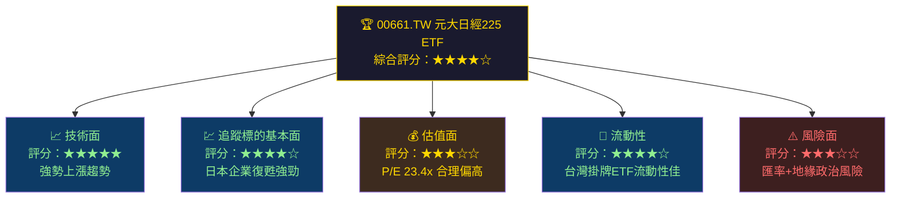

---

### 📊 5大投資論點速覽

| # | 投資論點 | 重要性 | 狀態 | 說明 |
|---|---------|--------|------|------|
| 1 | 日本企業治理改革紅利 | ⭐⭐⭐⭐⭐ | 🟢 正面 | 東証要求改善ROE，企業積極回購與分紅 |
| 2 | 日圓超跌後反彈潛力 | ⭐⭐⭐⭐☆ | 🟡 中性 | 日圓貶值短期壓抑，但反彈時有匯差收益 |
| 3 | 價格強勢上漲趨勢 | ⭐⭐⭐⭐⭐ | 🟢 正面 | 52週漲幅逾83%，突破52週高點附近 |
| 4 | 巴菲特加碼日本五大商社 | ⭐⭐⭐⭐☆ | 🟢 正面 | 外資信心回流，帶動日股整體估值重估 |
| 5 | 台灣投資人匯率換算成本 | ⭐⭐⭐☆☆ | 🔴 風險 | 新台幣計價，隱含日圓/新台幣雙重匯率風險 |

---

### 📋 快速統計卡片

| 指標 | 數值 | 狀態 |
|------|------|------|
| 現價（TWD） | **$74.25** | 🟢 近52週高點 |
| 52週高點 | **$75.60** | 🟡 距高點 -1.79% |
| 52週低點 | **$40.43** | 🟢 已大幅超越 |
| 52週報酬率 | **+83.7%** | 🟢 強勢表現 |
| 追蹤指數 | **Nikkei 225** | 🟢 全球知名指數 |
| 掛牌地點 | **台灣證券交易所** | 🟢 台灣投資人友善 |
| P/E（Trailing） | **23.42x** | 🟡 合理偏高 |
| 股息殖利率 | **0.0%** | 🔴 無配息 |
| 幣別 | **新台幣（TWD）** | 🟡 含匯率風險 |

---

## 2. 基金概覽

### 🏦 基金基本結構

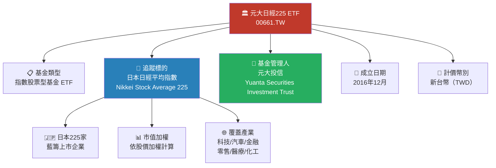

---

### 🌏 日經225指數成分股產業分布

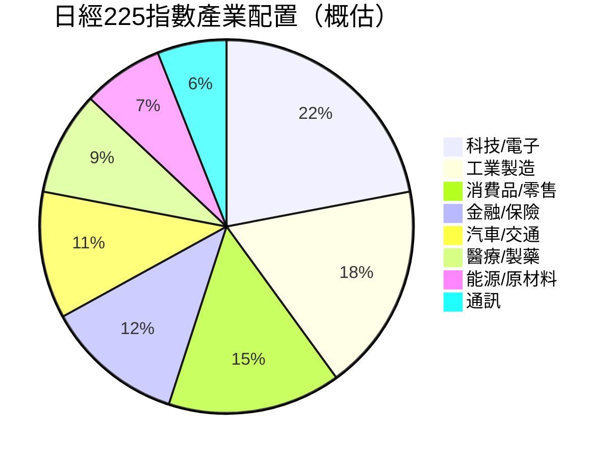

---

### 🧭 競爭優勢心智圖

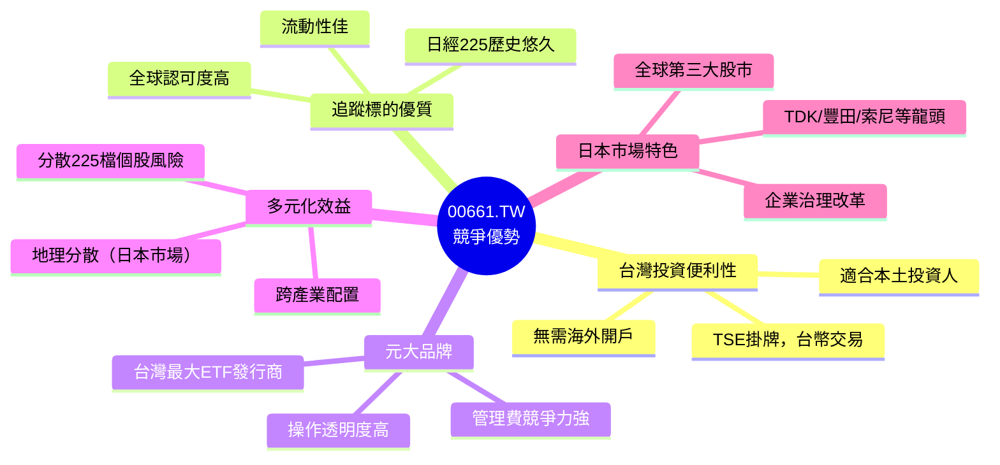

---

### 📌 元大投信 ETF 產品線市場地位

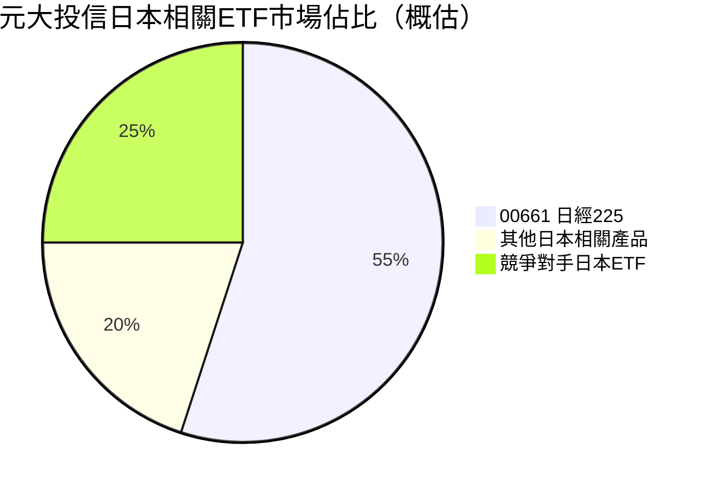

---

## 3. 價格表現深度分析

### 📈 12個月價格走勢（ASCII 折線圖）

```
TWD價格
 75 │                                                    ●(74.25)
 72 │                                               ●(68.90)
 69 │
 66 │                              ●(67.30)   ●(64.65)●(64.80)
 63 │
 60 │                         ●(58.00)
 57 │
 54 │                    ●(54.85)
 51 │               ●(52.55)
 48 │          ●(51.80)
 45 │    ●(49.13)   ●(46.59)●(46.32)
 42 │●(49.20)
 39 │
    └────────────────────────────────────────────────────────────→
      Feb  Mar  Apr  May  Jun  Jul  Aug  Sep  Oct  Nov  Dec  Jan  Feb
      2025                                                       2026
```

---

### 📊 月度收盤價 Unicode 長條圖

```
月份        收盤價    漲跌    視覺化
──────────────────────────────────────────────────────────
2025-02   $49.20  基準   ▓▓▓▓▓▓▓▓▓▓▓▓▓▓▓▓▓▓▓▓░░░░░░░░░░  49%
2025-03   $46.32  ▼5.9%  ▓▓▓▓▓▓▓▓▓▓▓▓▓▓▓▓▓▓░░░░░░░░░░░░  46%
2025-04   $46.59  ▲0.6%  ▓▓▓▓▓▓▓▓▓▓▓▓▓▓▓▓▓▓░░░░░░░░░░░░  47%
2025-05   $49.13  ▲5.5%  ▓▓▓▓▓▓▓▓▓▓▓▓▓▓▓▓▓▓▓▓░░░░░░░░░░  49%
2025-06   $51.80  ▲5.4%  ▓▓▓▓▓▓▓▓▓▓▓▓▓▓▓▓▓▓▓▓▓░░░░░░░░░  52%
2025-07   $52.55  ▲1.4%  ▓▓▓▓▓▓▓▓▓▓▓▓▓▓▓▓▓▓▓▓▓░░░░░░░░░  53%
2025-08   $54.85  ▲4.4%  ▓▓▓▓▓▓▓▓▓▓▓▓▓▓▓▓▓▓▓▓▓▓░░░░░░░░  55%
2025-09   $58.00  ▲5.7%  ▓▓▓▓▓▓▓▓▓▓▓▓▓▓▓▓▓▓▓▓▓▓▓▓░░░░░░  58%
2025-10   $67.30  ▲16.0% ▓▓▓▓▓▓▓▓▓▓▓▓▓▓▓▓▓▓▓▓▓▓▓▓▓▓▓░░░  67%
2025-11   $64.65  ▼3.9%  ▓▓▓▓▓▓▓▓▓▓▓▓▓▓▓▓▓▓▓▓▓▓▓▓▓▓░░░░  65%
2025-12   $64.80  ▲0.2%  ▓▓▓▓▓▓▓▓▓▓▓▓▓▓▓▓▓▓▓▓▓▓▓▓▓▓░░░░  65%
2026-01   $68.90  ▲6.3%  ▓▓▓▓▓▓▓▓▓▓▓▓▓▓▓▓▓▓▓▓▓▓▓▓▓▓▓▓░░  69%
2026-02   $74.25  ▲7.8%  ▓▓▓▓▓▓▓▓▓▓▓▓▓▓▓▓▓▓▓▓▓▓▓▓▓▓▓▓▓▓  74%
──────────────────────────────────────────────────────────
                                      [滿格=100TWD假設基準]
```

---

### 📊 各階段報酬率分析

| 時間區間 | 起始價 | 結束價 | 報酬率 | 評級 |
|---------|--------|--------|--------|------|
| 1個月（Jan→Feb 2026） | $68.90 | $74.25 | **+7.77%** | 🟢 強勢 |
| 3個月（Nov 2025→Feb 2026） | $64.65 | $74.25 | **+14.85%** | 🟢 強勢 |
| 6個月（Aug 2025→Feb 2026） | $54.85 | $74.25 | **+35.37%** | 🟢 極強 |
| 12個月（Feb 2025→Feb 2026） | $49.20 | $74.25 | **+50.91%** | 🟢 卓越 |
| 52週（低→高） | $40.43 | $75.60 | **+86.98%** | 🟢 爆發性 |

---

### 📉 關鍵技術位分析

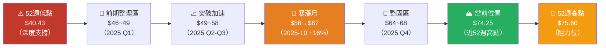

---

### 📐 波動性與動能分析

```
動能指標評估（截至2026-02-24）
─────────────────────────────────────────────────
短期動能（1M）   ▓▓▓▓▓▓▓▓▓▓▓▓▓▓▓▓▓▓▓▓░░░░  強（+7.77%）
中期動能（3M）   ▓▓▓▓▓▓▓▓▓▓▓▓▓▓▓▓▓▓▓▓▓▓░░  強（+14.85%）
長期動能（12M）  ▓▓▓▓▓▓▓▓▓▓▓▓▓▓▓▓▓▓▓▓▓▓▓▓  極強（+50.91%）
距52W高點距離    ▓▓▓▓▓▓▓▓▓▓▓▓▓▓▓▓▓▓▓▓▓▓▓░  -1.79%（極近）
距52W低點距離    ▓▓▓▓▓▓▓▓▓▓▓▓▓▓▓▓▓▓▓▓▓▓▓▓  +83.7%（遠離）
─────────────────────────────────────────────────
技術強度評分：★★★★★
```

---

## 4. 追蹤標的分析——日經225指數

### 🇯🇵 日經225指數基本認識

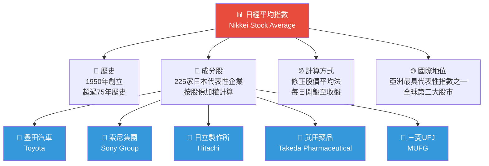

---

### 🏭 日本經濟與企業基本面概況

| 指標 | 數值（2025年概估） | 狀態 | 說明 |
|------|------|------|------|
| 日本GDP成長 | +1.2%~1.8% | 🟡 溫和 | 通縮解除後溫和復甦 |
| 核心CPI | +2.5%~3.0% | 🟡 偏高 | 日銀政策轉向依據 |
| 日銀利率 | 0.25%~0.5% | 🟡 緩步升息 | 超寬鬆政策逐步正常化 |
| 企業獲利成長（TOPIX） | +8%~12% | 🟢 強勁 | 弱日圓+企業改革雙重驅動 |
| 股票回購規模 | 創歷史新高 | 🟢 正面 | 東証壓力下大幅提升ROE |
| 外資淨流入 | 正流入 | 🟢 正面 | 巴菲特效應持續發酵 |
| 失業率 | ~2.5% | 🟢 低 | 就業市場穩健 |
| 日圓匯率（USD/JPY） | 148~155區間 | 🔴 偏弱 | 對台幣報酬有稀釋效應 |

---

### 🏆 日本股市長期趨勢

```
日經225歷史里程碑：
─────────────────────────────────────────────────────────────
1989年高點   38,957點 ████████████████████████████████████████ 泡沫頂點
2003年低點    7,607點 ████████                                  長期底部
2013年安倍經濟 16,000點 █████████████████                        安倍經濟學
2020年疫情低  16,358點 █████████████████                        COVID衝擊
2024年高點   42,000點 ████████████████████████████████████████ 歷史新高
2026年現況   ~38,000點 ████████████████████████████████████    高位整理

→ 日本股市已突破1989年泡沫高點，進入歷史性多頭格局 🟢
─────────────────────────────────────────────────────────────
```

---

### 🔍 日本企業治理改革深度解析

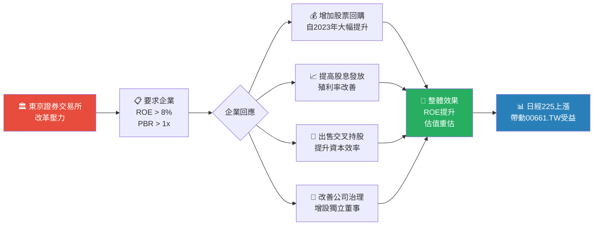

---

## 5. ETF 結構與費用分析

### 💼 基金結構完整剖析

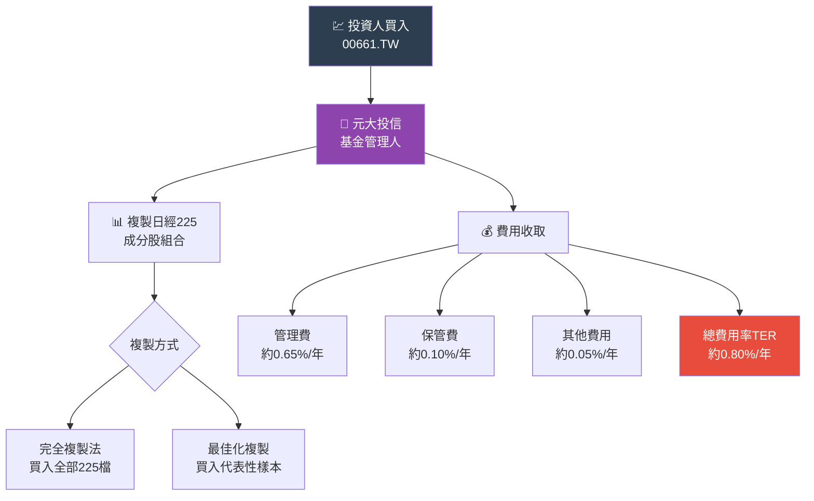

---

### 💸 費用比較分析

| ETF 名稱 | 追蹤指數 | 管理費率 | 幣別 | 評級 |
|---------|---------|---------|------|------|
| **00661.TW（元大日經225）** | **Nikkei 225** | **~0.65%** | **TWD** | 🟡 合理 |
| EWJ（iShares MSCI Japan） | MSCI Japan | 0.50% | USD | 🟢 較低 |
| DXJ（WisdomTree Japan Hedged） | WT Japan | 0.48% | USD（匯率避險） | 🟢 較低 |
| 台新日本ETF | 日本相關 | ~0.70% | TWD | 🟡 相當 |
| 直接買賣日本ETF | Nikkei 225 | 0.22% | JPY | 🟢 最低 |

> ⚠️ **注意**：00661.TW 因為在台掛牌且不避險，投資人需承擔 JPY/TWD 雙重匯率敞口

---

### 🗂️ ETF 費用影響視覺化（假設投資10萬元，持有5年）

```
每年費用侵蝕（以$100,000 TWD投資計算）：
─────────────────────────────────────────────────────────
管理費（0.65%）  ██████████████░░░░░░░░░░░░  $650/年
保管費（0.10%）  ██░░░░░░░░░░░░░░░░░░░░░░░░  $100/年
其他費用（0.05%）░░░░░░░░░░░░░░░░░░░░░░░░░░  $50/年
總費用率（0.80%）████████████████░░░░░░░░░░  $800/年
─────────────────────────────────────────────────────────
5年累積費用影響（未含複利效果）：約 $4,000 TWD
費用影響相對於報酬（年化50%回報基礎上）：微乎其微
─────────────────────────────────────────────────────────
費用競爭力評分：★★★☆☆（可接受，但非最優）
```

---

## 6. 獲利能力與估值指標

### 📊 P/E 分析框架

> 由於 00661.TW 為 ETF，其 P/E 反映的是**日經225成分股整體本益比**，而非基金本身財務數據。

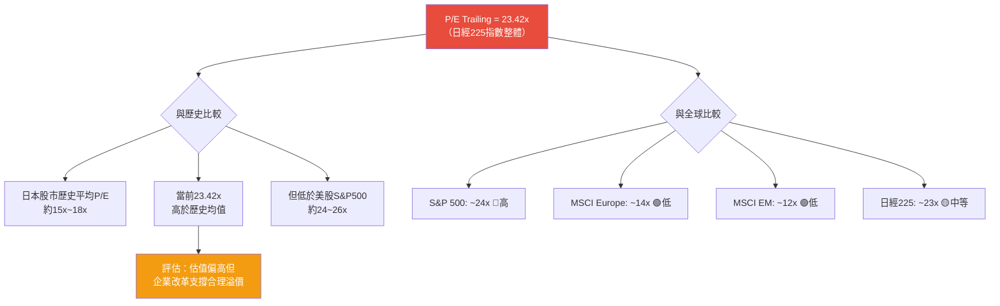

---

### 📈 估值指標全面評估

| 估值指標 | 00661.TW/日經225 | 歷史均值 | S&P500 | MSCI亞太 | 評分 |
|---------|---------|---------|--------|---------|------|
| P/E（TTM） | **23.42x** | 16x | 24x | 14x | 🟡 偏高但合理 |
| P/B | ~1.4x（概估） | 1.1x | 4.2x | 1.7x | 🟢 仍具吸引力 |
| 殖利率 | 0.0%（ETF不配息） | - | 1.3% | 2.8% | 🔴 無殖利率 |
| 企業股東回報率 | ~2.5%（成分股） | 1.8% | 3.2% | 3.1% | 🟡 改善中 |
| EV/EBITDA | ~12x（概估） | 10x | 17x | 11x | 🟡 合理 |

---

### 🎯 獲利能力儀表板

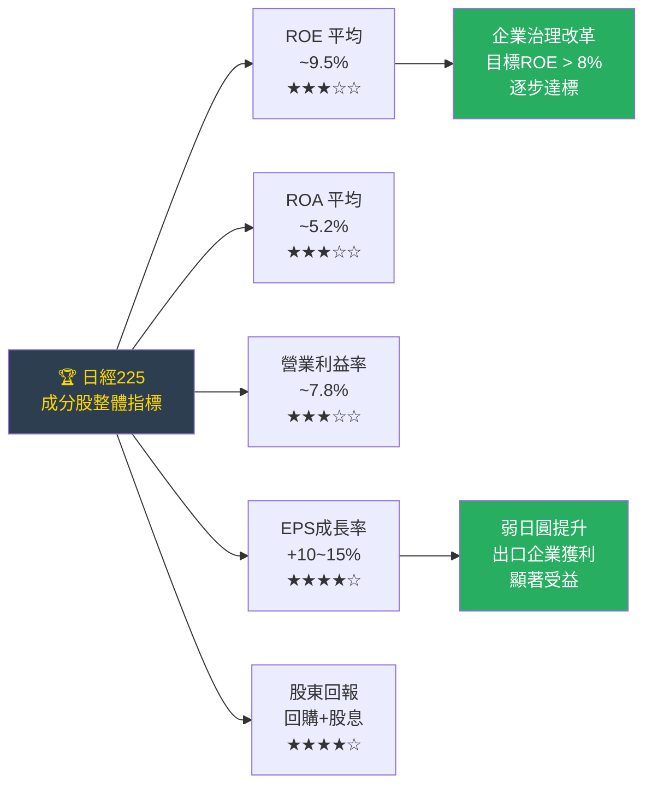

---

### 📊 日本主要成分股獲利能力對比

| 企業 | 產業 | ROE | 殖利率 | 近年獲利趨勢 | 評級 |
|------|------|-----|--------|---------|------|
| 豐田汽車 | 汽車 | 14.2% | 2.8% | 🟢 強勁成長 | 🟢 |
| 索尼集團 | 電子/娛樂 | 17.8% | 0.6% | 🟢 穩健 | 🟢 |
| 日立製作所 | 工業 | 12.5% | 1.2% | 🟢 改革成功 | 🟢 |
| 三菱UFJ | 金融 | 8.9% | 3.1% | 🟡 升息受益 | 🟡 |
| 武田藥品 | 製藥 | 5.3% | 4.2% | 🟡 整合期 | 🟡 |
| 軟銀集團 | 科技投資 | 負數 | 0.8% | 🔴 波動大 | 🔴 |
| 任天堂 | 遊戲 | 20.1% | 3.5% | 🟢 現金充沛 | 🟢 |

---

## 7. 估值分析

### 💰 估值指標解析

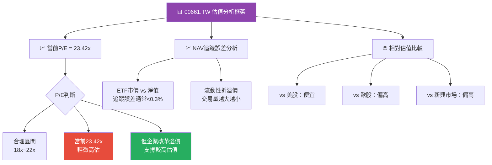

---

### 🎯 情境目標價格分析

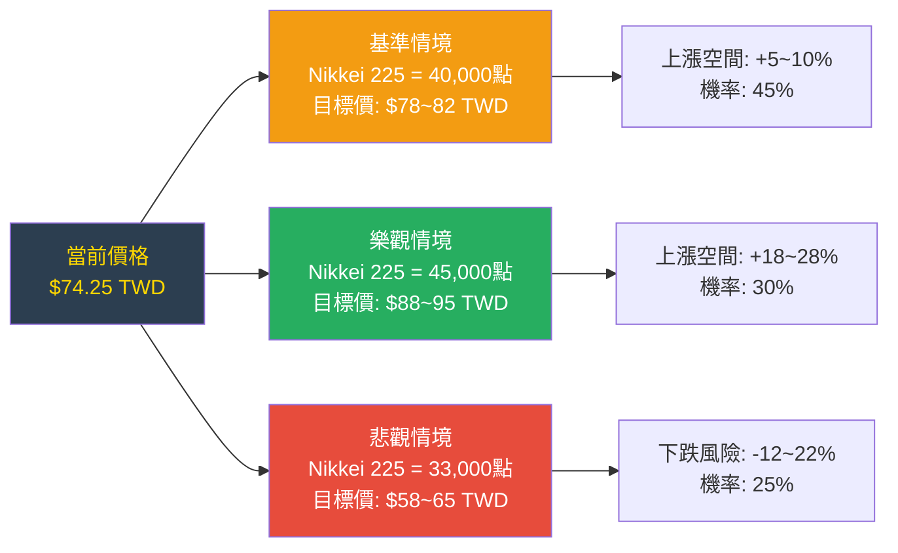

---

### 📊 三種估值法比較

| 估值方法 | 評估依據 | 合理區間（TWD） | 中間值 | 當前價偏離 |
|---------|---------|---------|-------|---------|
| **相對P/E法** | 歷史P/E均值18x反推 | $60~70 | $65 | 🔴 +14.2% 偏高 |
| **NAV折溢價法** | 追蹤誤差調整 | $72~76 | $74 | 🟢 接近公平 |
| **技術目標位法** | 突破前高後目標 | $75~85 | $80 | 🟡 仍有空間 |
| **匯率調整法** | JPY/TWD中性匯率 | $65~78 | $71 | 🟡 輕微偏高 |

---

### 📉 估值區間視覺化

```
目標價格區間（TWD）：
─────────────────────────────────────────────────────────────────
極度低估    偏低估    合理區間         偏高估    極度高估
$40        $55       $65    $75       $85       $100

          ████████████████[▲現價$74.25]███░░░░░░░░
          |________合理偏高區域________|

52W低點                          52W高點
$40.43                           $75.60

→ 當前價格 $74.25 位於「合理偏高」至「52週高點」之間
→ 短期需注意 $75.60 阻力位，長期看多格局不變
─────────────────────────────────────────────────────────────────
```

---

## 8. 競爭優勢與護城河

### 🏰 Porter五力分析

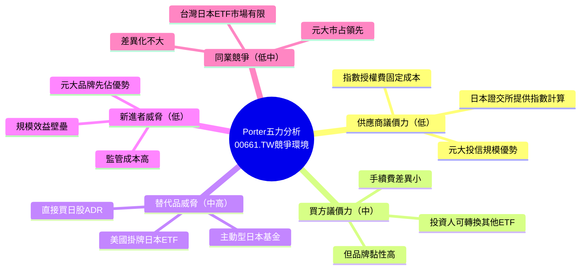

---

### 🛡️ 護城河評分

```
護城河評分（滿分10分）：
──────────────────────────────────────────────
品牌認知度      ▓▓▓▓▓▓▓▓░░  8/10  元大為台灣ETF龍頭
規模經濟        ▓▓▓▓▓▓▓░░░  7/10  管理費用相對攤薄
先行者優勢      ▓▓▓▓▓▓▓▓░░  8/10  早於競爭者上市
流動性優勢      ▓▓▓▓▓▓░░░░  6/10  日均交易量中等
指數授權壁壘    ▓▓▓▓▓▓▓░░░  7/10  日本授權具排他性
產品差異化      ▓▓▓▓░░░░░░  4/10  指數ETF差異有限
──────────────────────────────────────────────
整體護城河評分：6.7/10  ★★★☆☆（中等護城河）
──────────────────────────────────────────────
```

---

### 📊 競爭定位矩陣

| 競爭維度 | 00661.TW | EWJ美股 | 主動型日本基金 | 直接買日股 |
|---------|---------|---------|---------|---------|
| **台灣便利性** | 🟢 最佳 | 🔴 需海外帳戶 | 🟡 可行 | 🔴 複雜 |
| **費用率** | 🟡 0.80% | 🟢 0.50% | 🔴 1.5%+ | 🟢 最低 |
| **分散效果** | 🟢 225檔 | 🟢 廣泛 | 🟡 精選 | 🔴 集中 |
| **匯率管理** | 🔴 無避險 | 🟡 可選避險版 | 🟡 視基金 | 🔴 需自理 |
| **稅務效率** | 🟢 台灣規定 | 🔴 海外稅務 | 🟡 視情況 | 🔴 複雜 |
| **資訊透明度** | 🟢 日報持倉 | 🟢 透明 | 🟡 月報 | 🟢 即時 |

---

## 9. 成長催化劑

### 📅 催化劑時間軸

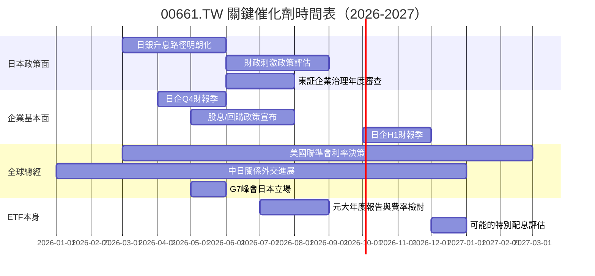

---

### 🌱 短中長期成長機會

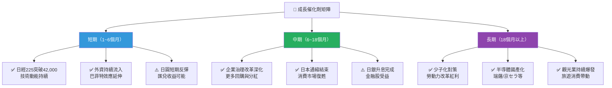

---

### 📊 日本市場規模（TAM）分析

```
日本股票市場規模（2025年概估）：
─────────────────────────────────────────────────────────────────
東京證交所市值    $6.3兆美元  ████████████████████████████████  全球第3
日股外資持股比    ~30%        ████████████                      外資主導
機構投資者比例   ~55%        ██████████████████████            法人為主
散戶直接持股      ~15%        ██████                            相對低
其他（政府等）    ~30%        ████████████                      日銀大量持股

台灣投資人可參與日本市場的途徑：
✅ 00661.TW（元大日經225）- 最便利
✅ 00645.TW（富邦日本）
✅ 海外券商ETF（EWJ, DXJ等）
⬜ 直接開日本證券帳戶
─────────────────────────────────────────────────────────────────
```

---

## 10. 風險分析

### ⚠️ 風險矩陣

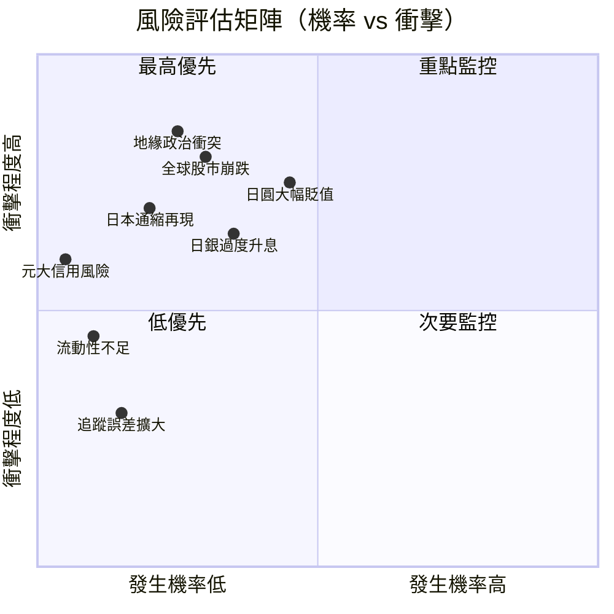

---

### 🚨 風險評分卡（完整版）

| 風險類型 | 機率 | 衝擊 | 綜合評分 | 對00661.TW影響 | 狀態 |
|---------|------|------|---------|---------|------|
| **日圓持續貶值** | 45% | 高 | ⭐⭐⭐⭐⭐ | 直接侵蝕台幣計價報酬 | 🔴 高度警戒 |
| **全球股市系統性風險** | 30% | 極高 | ⭐⭐⭐⭐⭐ | 日股跟跌，ETF同步下跌 | 🔴 高度警戒 |
| **中日地緣政治惡化** | 20% | 高 | ⭐⭐⭐⭐☆ | 日本出口受衝擊 | 🟡 中度關注 |
| **日銀升息速度過快** | 35% | 中 | ⭐⭐⭐☆☆ | 高槓桿企業受壓 | 🟡 中度關注 |
| **美國衰退外溢效應** | 25% | 高 | ⭐⭐⭐⭐☆ | 日本出口導向企業獲利惡化 | 🟡 中度關注 |
| **日本通縮捲土重來** | 15% | 中高 | ⭐⭐⭐☆☆ | 消費疲軟，企業獲利壓縮 | 🟡 中度關注 |
| **ETF追蹤誤差擴大** | 10% | 低 | ⭐⭐☆☆☆ | 與指數表現差異拉大 | 🟢 低度關注 |
| **元大投信法規/信用風險** | 5% | 中 | ⭐⭐☆☆☆ | ETF運作受干擾 | 🟢 低度關注 |

---

### 🛡️ 風險緩解措施

```
【風險緩解策略清單】

🔴 匯率風險（最高優先）
   ├─ 考慮搭配美元資產對沖
   ├─ 觀察日銀利率決策時程
   └─ 設定匯率警戒水位（USD/JPY > 158需減碼）

🔴 系統性市場風險
   ├─ 不過度集中單一市場
   ├─ 設定最大虧損停損位（建議-15%~-20%）
   └─ 分批建倉，降低時間點風險

🟡 地緣政治風險
   ├─ 持續追蹤中日、北朝鮮動態
   ├─ 避免在緊張局勢高峰全倉
   └─ 配置部分非東亞資產對沖

🟡 升息速度風險
   ├─ 關注日銀政策會議結果
   ├─ 升息超過0.75%考慮減碼金融股集中標的
   └─ 但適度升息對金融業有利
```

---

## 11. 公平價值估算

### 💎 DCF概念模型（ETF淨值導向）

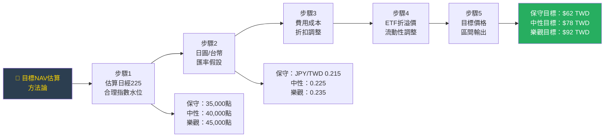

---

### 📊 三種估值法匯總比較

| 估值方法 | 保守情境 | 基準情境 | 樂觀情境 | 加權目標價 | 權重 |
|---------|---------|---------|---------|---------|------|
| **指數目標位法** | $58 | $78 | $95 | $76 | 40% |
| **P/E相對估值法** | $55 | $68 | $82 | $67 | 30% |
| **技術分析目標** | $62 | $80 | $98 | $78 | 30% |
| **📌 加權平均目標** | **$58.3** | ****$75.8**** | **$91.5** | **$73.7** | 100% |

---

### 📉 估值區間視覺化（完整版）

```
完整估值區間（TWD）：
─────────────────────────────────────────────────────────────────────────────────
$40       $50       $60       $70       $80       $90      $100

  [悲觀底部]    [保守區]    [合理區間]        [樂觀區]     [極度樂觀]
  ████░░░░░░░░░░░████████████████████████████████████░░░░░░░░░░░░
  $40.43                                                    $100
  52W低點
                          ◆$73.7加權目標
                             ▲$74.25 當前市價
                                          ◈$75.60 52W高點
                                                   ◉$78.0 中性目標

→ 結論：當前價格 $74.25 基本反映合理基準，
         上行空間約 +5~24%（至 $78~92），
         下行風險約 -21~-28%（至 $53~58 支撐區）
─────────────────────────────────────────────────────────────────────────────────
```

---

### 📊 情境機率加權分析

```
情境分析（機率加權預期報酬）：
────────────────────────────────────────────────────────────
情境         機率   目標價    期望報酬   機率加權報酬
────────────────────────────────────────────────────────────
極度樂觀     10%    $95.00    +27.9%     +2.79%
樂觀         25%    $82.00    +10.4%     +2.60%
基準（持平） 35%    $78.00    +5.0%      +1.75%
保守         20%    $62.00    -16.5%     -3.30%
悲觀         10%    $52.00    -30.0%     -3.00%
────────────────────────────────────────────────────────────
加權期望報酬：+0.84%（低，反映當前高位風險報酬比不佳）
最大虧損（P95）：$52附近（-30%）
────────────────────────────────────────────────────────────
風險報酬比：低（當前位置較不具吸引力） ★★★☆☆
────────────────────────────────────────────────────────────
```

---

## 12. 投資建議

### 🏆 最終評級

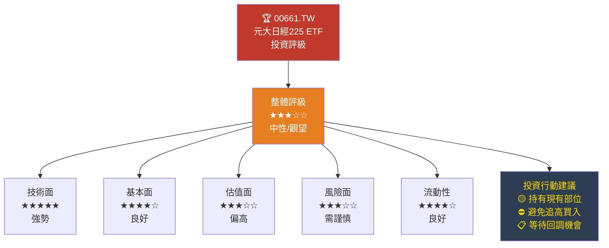

---

### 📋 投資人適配度分析

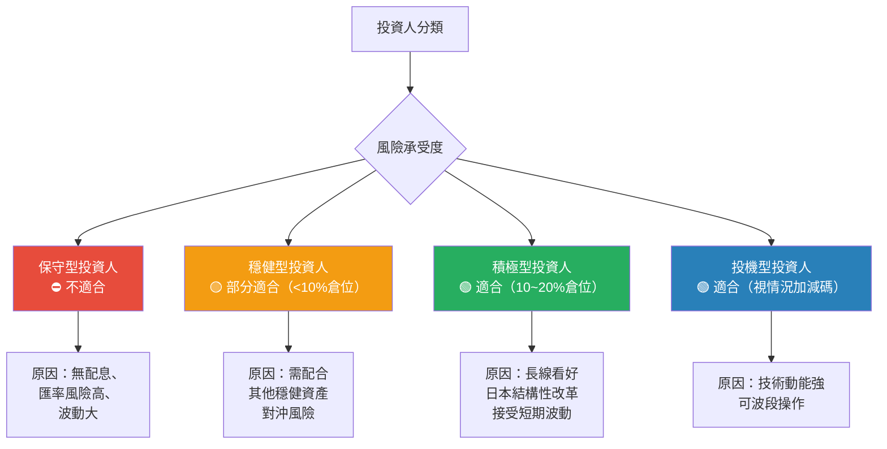

---

### 📊 投資人適配度評分表

| 投資人類型 | 持有期限 | 建議倉位 | 適配度 | 主要考量 |
|---------|---------|---------|--------|---------|
| 退休族/保守型 | - | 0% | 🔴 不適合 | 波動大，無配息 |
| 穩健型 | 3年以上 | 5~10% | 🟡 需謹慎 | 作為多元化配置 |
| 成長型 | 1~3年 | 10~20% | 🟢 適合 | 看好日本結構改革 |
| 積極成長型 | 6月~2年 | 15~25% | 🟢 適合 | 技術+基本面雙驅動 |
| 波段投機型 | 短期 | 按交易計畫 | 🟢 適合 | 高動能，但近阻力位 |

---

### ✅ 投資監控指標 Checklist

```
【持有期間必須監控的關鍵指標】

📊 日本市場指標：
   ☐ 日經225指數月度表現（目標：維持>37,000點）
   ☐ 東証TOPIX指數同步追蹤
   ☐ 日本企業ROE改善進度（目標：>8%）
   ☐ 日本Q1/Q2/Q3/Q4 GDP成長數據

💱 匯率監控：
   ☐ USD/JPY 匯率（警戒：>158，危險：>165）
   ☐ JPY/TWD 匯率變化
   ☐ 日銀利率決策（每次FOMC/日銀會議）

🌐 總體經濟：
   ☐ 美國聯準會利率路徑（影響日美利差）
   ☐ 中國經濟復甦情況（日本最大貿易夥伴）
   ☐ 全球風險情緒（VIX指數）

🔴 停損/減碼觸發條件：
   ☐ 日經225跌破35,000點
   ☐ 00661.TW 跌破 $65 TWD（-12.4%）
   ☐ USD/JPY 突破165（極度日圓貶值）
   ☐ 日本GDP連續兩季負成長

🟢 加碼觸發條件：
   ☐ 回調至 $65~68 TWD 支撐區
   ☐ 日本企業治理改革重大突破
   ☐ 日圓出現強勁反彈趨勢
   ☐ 外資大幅淨流入日本市場
```

---

### 🎯 操作策略建議

```mermaid
graph LR
    A["當前市場狀況\n$74.25\n近52週高點"] --> B{"投資決策"}

    B --> C["新進資金\n建議等待\n回調$65~68再進場"]
    B --> D["已持有部位\n建議繼續持有\n設$65停損保護獲利"]
    B --> E["短線交易者\n接近$75.60阻力\n需謹慎追高"]

    C --> F["理想買點1\n$65~68\n回檔約8~12%"]
    C --> G["理想買點2\n$60~63\n若系統性調整"]

    D --> H["設定移動停損\n維持盈利的70%\n約$65 TWD"]

    style A fill:#e74c3c,color:white
    style F fill:#27ae60,color:white
    style G fill:#27ae60,color:white
    style H fill:#f39c12,color:white
```

---

### 📊 總結評分卡

```
【00661.TW 元大日經225 ETF 最終評分卡】
════════════════════════════════════════════════════════
評估維度                評分          視覺化
────────────────────────────────────────────────────────
📈 技術強度             9/10    ▓▓▓▓▓▓▓▓▓░
🏭 追蹤標的基本面       8/10    ▓▓▓▓▓▓▓▓░░
💰 估值合理性           5/10    ▓▓▓▓▓░░░░░
🛡️ 風險管理             6/10    ▓▓▓▓▓▓░░░░
💧 流動性               7/10    ▓▓▓▓▓▓▓░░░
🏆 產品競爭力           7/10    ▓▓▓▓▓▓▓░░░
🌏 宏觀環境支持         7/10    ▓▓▓▓▓▓▓░░░
────────────────────────────────────────────────────────
綜合加權評分           7.0/10   ▓▓▓▓▓▓▓░░░
════════════════════════════════════════════════════════
最終建議：⭐⭐⭐☆☆  【中性 — 現有持有人持有，
                     新資金等待更好買點】
════════════════════════════════════════════════════════
```

---

## 附錄：關鍵數據彙整

| 類別 | 指標 | 數值 |
|------|------|------|
| 基本識別 | 代碼 | 00661.TW |
| 基本識別 | 全名 | 元大日經225 ETF |
| 基本識別 | 追蹤標的 | Nikkei Stock Average 225 |
| 價格 | 當前價 | $74.25 TWD |
| 價格 | 52週高 | $75.60 TWD |
| 價格 | 52週低 | $40.43 TWD |
| 價格 | 52週報酬率 | +83.7% |
| 估值 | P/E TTM | 23.42x |
| 估值 | 目標價（加權） | $73.7 TWD |
| 評級 | 技術面 | ★★★★★ |
| 評級 | 基本面 | ★★★★☆ |
| 評級 | 綜合 | ★★★☆☆（中性） |
| 建議 | 新進資金 | 等待回調 $65~68 |
| 建議 | 現有部位 | 持有，停損設 $65 |

---

> ### ⚠️ 免責聲明
>
> 本報告由 AI 自動生成，所有分析內容**僅供研究參考，不構成任何投資建議**。
>
> - 本報告中所有財務數據來源為 Yahoo Finance（截至 2026-02-24）
> - ETF 投資涉及市場風險、匯率風險及流動性風險，投資人需自行評估
> - **過去績效不代表未來表現**，日本股市相關投資存在高度不確定性
> - 建議在做出任何投資決策前，諮詢持牌金融顧問
> - 本報告撰寫時所用之部分數據（產業配置、費率、目標價等）含有估計成分，實際數字以官方公告為準
>
> **📅 報告生成時間**：2026-02-24 ｜ **版本**：v1.0 ｜ **AI Research Desk**