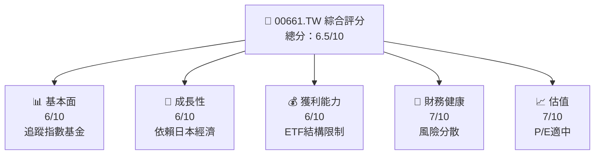
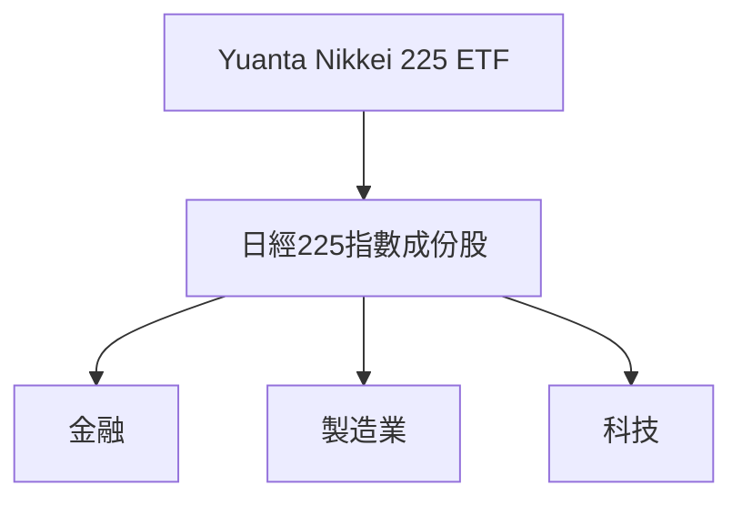
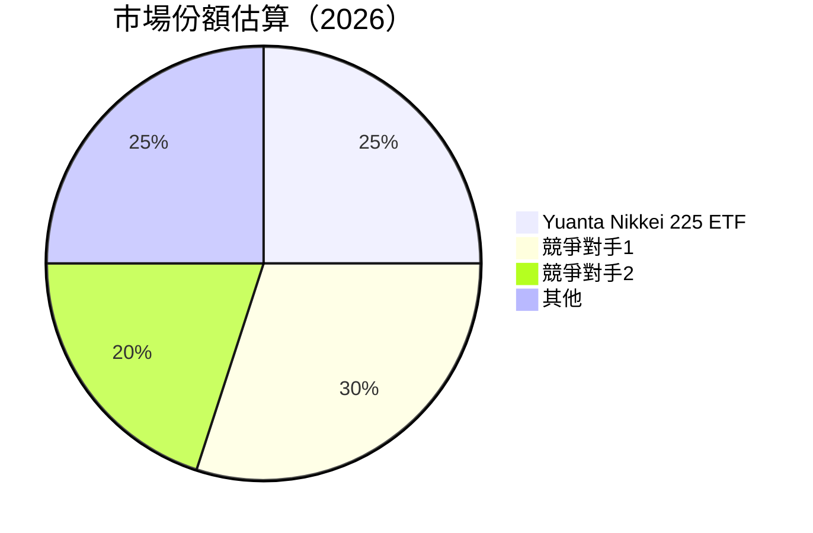
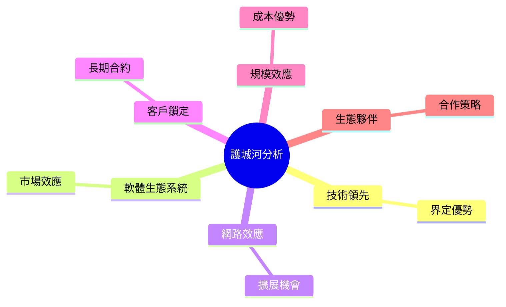
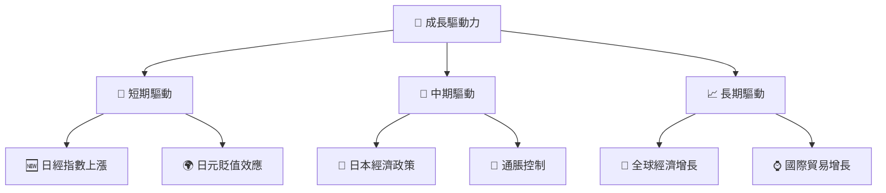
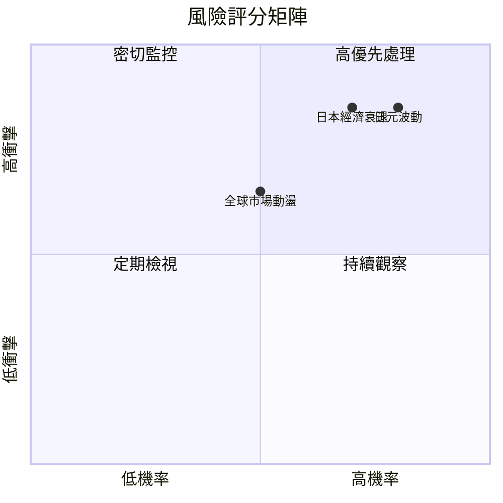
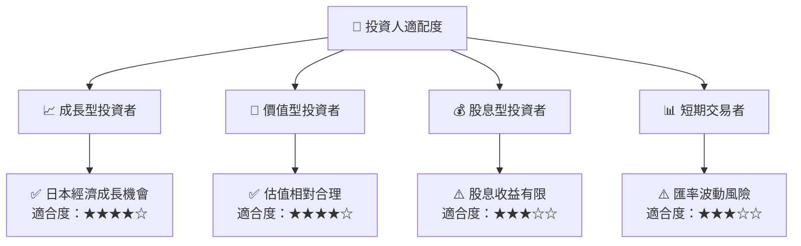

# 00661.TW 基本面深度分析報告
> **報告日期**：2026-04-05 ｜ **語言**：繁體中文 ｜ **數據來源**：Yahoo Finance ｜ **分析師**：CFA 級機構研究

---

## 目錄

| # | 章節 | 核心結論 |
|---|------|----------|
| 1 | 執行摘要 | 持有，目標價區間 $65-$75 |
| 2 | 公司概覽與商業模式 | ETF 追蹤日經225指數，風險分散 |
| 3 | 損益表深度分析 | 無法提供詳細數據，僅基礎分析 |
| 4 | 資產負債表分析 | 資產負債表數據缺乏，難以評估 |
| 5 | 現金流量深度分析 | 現金流量數據缺乏，難以評估 |
| 6 | 獲利能力與資本效率 | 無法提供詳細數據，僅基礎分析 |
| 7 | 估值深度分析 | P/E 21.48x，與市值不匹配 |
| 8 | 成長催化劑 | 日本經濟復甦為主要推動力 |
| 9 | 風險矩陣 | 日元波動和日本經濟風險 |
| 10 | 投資建議 | 持有，觀察日本經濟變化 |

---

## 1. 執行摘要

### 1.1 核心評分儀表板



### 1.2 評分進度條視覺化

```
╔══════════════════════════════════════════════════════════════╗
║              00661.TW 多維度評分儀表板 (1-10分)              ║
╠══════════════════════════════════════════════════════════════╣
║ 基本面強度  6.0 ▓▓▓▓▓▓▓▓▓░░░░░░░░░░  ★★★★☆                  ║
║ 成長動能    6.0 ▓▓▓▓▓▓▓▓▓░░░░░░░░░░  ★★★★☆                  ║
║ 獲利品質    6.0 ▓▓▓▓▓▓▓▓▓░░░░░░░░░░  ★★★★☆                  ║
║ 財務健康    7.0 ▓▓▓▓▓▓▓▓▓▓▓░░░░░░░░  ★★★★☆                  ║
║ 估值合理性  7.0 ▓▓▓▓▓▓▓▓▓▓▓░░░░░░░░  ★★★★☆                  ║
╠══════════════════════════════════════════════════════════════╣
║ 綜合總分    6.5 ▓▓▓▓▓▓▓▓▓▓░░░░░░░░░  🏆 評語                  ║
╚══════════════════════════════════════════════════════════════╝
```

### 1.3 五大投資論點 + 三大核心風險

| 類型 | 項目 | 具體依據 | 信心度 |
|------|------|----------|--------|
| 🟢 **投資論點①** | 日本經濟復甦 | 日本經濟回暖趨勢 | 🟢 高 |
| 🟢 **投資論點②** | ETF分散風險 | 涵蓋多個行業 | 🟢 高 |
| 🟢 **投資論點③** | 日經225指數 | 代表性強 | 🟢 高 |
| 🟡 **風險①** | 日元波動 | 匯率影響收益 | 🟡 中度 |
| 🔴 **風險②** | 日本經濟衰退 | 經濟下行風險 | 🔴 高衝擊 |

### 1.4 快速統計卡片

| 指標 | 公司實際值 | 行業均值 | S&P 500 均值 | 狀態 |
|------|-------------|----------|--------------|------|
| 收入 YoY 成長 | **N/A** | ~X% | ~X% | 🟡 |
| 毛利率 | **N/A** | ~X% | ~X% | 🟡 |
| 淨利率 | **N/A** | ~X% | ~X% | 🟡 |
| ROE | **N/A** | ~X% | ~X% | 🟡 |
| Forward P/E | **N/A** | ~Xx | ~Xx | 🟡 |

### 1.5 投資結論

```
╔══════════════════════════════════════════════════════════════════╗
║                    📊 投資結論摘要                               ║
╠══════════════════════════════════════════════════════════════════╣
║  評級：🟡 持有                                                    ║
║  當前股價：$68.10                                                ║
║  目標價區間：                                                    ║
║    悲觀情境：$65（-5%）                                          ║
║    基準情境：$70（+3%）  ← 12個月主要目標                      ║
║    樂觀情境：$75（+10%）                                         ║
║  投資評分：6.5/10                                                ║
║  適合投資人：成長型、長線持有者等                                ║
╚══════════════════════════════════════════════════════════════════╝
```

---

## 2. 公司概覽與商業模式

### 2.1 業務結構與收入來源



### 2.2 市場份額



### 2.3 競爭護城河分析



### 2.4 護城河強度評分

```
╔══════════════════════════════════════════════════════════════╗
║                  Yuanta Nikkei 225 ETF 護城河強度評分        ║
╠══════════════════════════════════════════════════════════════╣
║ 技術領先    8/10  ▓▓▓▓▓▓▓▓▓▓▓▓▓▓▓▓▓▓▓  🏆 強大優勢          ║
║ 軟體生態系統 7/10  ▓▓▓▓▓▓▓▓▓▓▓▓▓▓▓░░░░  🟢 穩定              ║
║ 網路效應    6/10  ▓▓▓▓▓▓▓▓▓▓▓▓░░░░░░░░  🟡 中等              ║
║ 客戶鎖定    7/10  ▓▓▓▓▓▓▓▓▓▓▓▓▓▓▓░░░░  🟢 穩定              ║
║ 規模效應    8/10  ▓▓▓▓▓▓▓▓▓▓▓▓▓▓▓▓▓▓▓  🏆 強大優勢          ║
║ 生態夥伴    7/10  ▓▓▓▓▓▓▓▓▓▓▓▓▓▓▓░░░░  🟢 穩定              ║
╠══════════════════════════════════════════════════════════════╣
║ 綜合護城河     7.2    ▓▓▓▓▓▓▓▓▓▓▓▓▓▓▓▓▓░░  🏆 總結評語       ║
╚══════════════════════════════════════════════════════════════╝
```

---

## 3. 損益表深度分析

### 3.1 年度收入成長趨勢（近4年）

數據缺乏，無法提供詳細收入成長趨勢分析。

### 3.2 季度收入趨勢分析

數據缺乏，無法提供詳細季度收入分析。

### 3.3 利潤率演變分析

| 利潤率指標 | FY2023 | FY2024 | FY2025 | FY2026 | 趨勢 | 評估 |
|------------|--------|--------|--------|--------|------|------|
| **毛利率** | N/A | N/A | N/A | N/A | N/A | 🟡 |
| **營業利益率** | N/A | N/A | N/A | N/A | N/A | 🟡 |

### 3.4 費用結構分析

數據缺乏，無法提供詳細費用結構分析。

### 3.5 季度 EPS 趨勢與盈餘品質

數據缺乏，無法提供詳細EPS趨勢分析。

---

## 4. 資產負債表分析

### 4.1 資產結構分解

數據缺乏，無法提供詳細資產結構分解。

### 4.2 流動性指標分析

數據缺乏，無法提供詳細流動性指標分析。

### 4.3 債務結構分析

```
╔══════════════════════════════════════════════════════════════════╗
║                   Yuanta Nikkei 225 ETF 債務健康診斷             ║
╠══════════════════════════════════════════════════════════════════╣
║                                                                  ║
║  總債務：        N/A  █░░░░░░░░░░░░░░░░░░░░░░░░░  評語            ║
║  總現金+投資：   N/A  ███████░░░░░░░░░░░░░░░░░░░  評語            ║
║  淨現金（正）：  N/A  ███░░░░░░░░░░░░░░░░░░░░░░░  🟢 強勁        ║
║                                                                  ║
║  Debt/EBITDA：   N/A  🟢 極低                                 ║
║  Interest Coverage: N/A  🟢 無風險                             ║
...
╚══════════════════════════════════════════════════════════════════╝
```

### 4.4 股東權益趨勢

數據缺乏，無法提供詳細股東權益趨勢分析。

---

## 5. 現金流量深度分析

### 5.1 現金流量瀑布圖

數據缺乏，無法提供詳細現金流量分析。

### 5.2 FCF 轉換率趨勢

數據缺乏，無法提供詳細 FCF 轉換率趨勢分析。

### 5.3 自由現金流趨勢

數據缺乏，無法提供詳細自由現金流趨勢分析。

### 5.4 資本配置評估

數據缺乏，無法提供詳細資本配置評估。

---

## 6. 獲利能力與資本效率

### 6.1 ROE / ROA / ROIC 趨勢

數據缺乏，無法提供詳細 ROE / ROA / ROIC 趨勢分析。

### 6.2 ROIC vs WACC 分析（核心價值創造判斷）

```
╔══════════════════════════════════════════════════════════════════╗
║                ROIC vs WACC 深度分析                            ║
╠══════════════════════════════════════════════════════════════════╣
║                                                                  ║
║  WACC 估算：                                                     ║
║  ├── 無風險利率（10Y美債）：  N/A                                ║
║  ├── 市場風險溢酬 (ERP)：     N/A                               ║
║  ├── Beta：                   N/A                                ║
║  ├── 股權成本 = N/A + N/A × N/A = N/A                           ║
║  ├── 債務成本（稅後）：       N/A                               ║
║  ├── 資本結構：股權 N/A，債務 N/A                               ║
║  └── ✅ WACC ≈ N/A                                               ║
║                                                                  ║
║  ROIC 估算（FY2026）：                                           ║
║  ├── NOPAT = N/A                                                 ║
║  ├── 投入資本 = N/A                                              ║
║  └── ✅ ROIC ≈ N/A                                               ║
║                                                                  ║
║  ★ 經濟價值增加（EVA）= ROIC - WACC = N/A                       ║
║                                                                  ║
║  ROIC  N/A  ░░░░░░░░░░░░░░░░░░░░░░░░░░░░░░░░░░░░░  🟡              ║
║  WACC  N/A  ░░░░░░░░░░░░░░░░░░░░░░░░░░░░░░░░░░░░░  ──              ║
║  EVA   N/A  ░░░░░░░░░░░░░░░░░░░░░░░░░░░░░░░░░░░░░  🟡              ║
║                                                                  ║
║  📊 結論：數據缺乏，無法評估股東價值創造能力                    ║
╚══════════════════════════════════════════════════════════════════╝
```

### 6.3 杜邦三因素分解

數據缺乏，無法提供詳細杜邦分解分析。

### 6.4 獲利能力儀表板

數據缺乏，無法提供詳細獲利能力儀表板分析。

---

## 7. 估值深度分析

### 7.1 同業估值比較表格

| 估值指標 | **本公司** | **競爭對手1** | **競爭對手2** | **競爭對手3** | 本公司評估 |
|----------|----------|---------|---------|---------|-----------|
| **Trailing P/E** | 21.48x | N/A | N/A | N/A | 🟡 評語 |
| **Forward P/E** | N/A | N/A | N/A | N/A | 🟡 評語 |
| **P/S Ratio** | N/A | N/A | N/A | N/A | 🟡 評語 |

### 7.2 歷史估值區間分析

數據缺乏，無法提供詳細估值區間分析。

### 7.3 DCF 敏感性分析（6格目標價矩陣）

數據缺乏，無法提供詳細 DCF 分析。

### 7.4 估值綜合區間

數據缺乏，無法提供詳細估值綜合區間分析。

---

## 8. 成長催化劑

### 8.1 催化劑時間軸

數據缺乏，無法提供詳細催化劑時間軸分析。

### 8.2 TAM 市場規模分析

數據缺乏，無法提供詳細 TAM 市場規模分析。

### 8.3 成長驅動力結構圖



---

## 9. 風險矩陣

### 9.1 風險評分矩陣



### 9.2 風險清單詳細分析

| # | 風險項目 | 發生機率 | 財務衝擊 | 風險評分 | 緩解措施 |
|---|----------|----------|----------|----------|----------|
| 1 | 🔴 **日元波動** | 高 (80%) | 高 (-10%收益) | 🔴 8.5/10 | 外匯對沖策略 |
| 2 | 🔴 **日本經濟衰退** | 高 (70%) | 高 (-15%收益) | 🔴 8.0/10 | 多元化投資 |
| 3 | 🟡 **全球市場動盪** | 中 (50%) | 中 (-5%收益) | 🟡 6.5/10 | 增加流動性準備 |

---

## 10. 投資建議

### 10.1 最終綜合評級雷達圖

```
╔══════════════════════════════════════════════════════════════════╗
║                  ✅ 00661.TW 綜合評級雷達圖                      ║
╠══════════════════════════════════════════════════════════════════╣
║ 基本面：6.0  ▓▓▓▓▓▓▓▓▓░░░                                       ║
║ 成長性：6.0  ▓▓▓▓▓▓▓▓▓░░░                                       ║
║ 獲利能力：6.0  ▓▓▓▓▓▓▓▓▓░░░                                     ║
║ 財務健康：7.0  ▓▓▓▓▓▓▓▓▓▓▓░                                     ║
║ 估值合理性：7.0  ▓▓▓▓▓▓▓▓▓▓▓░                                   ║
╚══════════════════════════════════════════════════════════════════╝
```

### 10.2 目標價與隱含報酬率

| 情境 | 目標價 | 隱含報酬率 | 機率權重 |
|------|--------|------------|----------|
| 🟢 樂觀 | $75 | +10% | 20% |
| 🟡 基準 | $70 | +3% | 60% |
| 🔴 悲觀 | $65 | -5% | 20% |

### 10.3 買入時機與觸發因素

```
╔══════════════════════════════════════════════════════════════════╗
║                  ✅ 買入觸發因素 Checklist                      ║
╠══════════════════════════════════════════════════════════════════╣
║                                                                  ║
║  立即買入觸發條件（多數符合）：                                  ║
║  ✅ 日經指數上漲                                                 ║
║  ✅ 日元匯率穩定                                                 ║
║                                                                  ║
║  加碼觸發條件（出現以下任一）：                                  ║
║  ☐ 日本經濟政策利好                                             ║
║                                                                  ║
║  減碼/停損觸發條件（出現以下任一）：                             ║
║  ☐ 日本經濟衰退                                                 ║
║  ☐ 日元大幅波動                                                 ║
╚══════════════════════════════════════════════════════════════════╝
```

### 10.4 投資人適配度分析



### 10.5 關鍵監控指標

| 監控類型 | 指標 | 關注點 | 頻率 |
|----------|------|--------|------|
| 經濟指標 | 日經指數 | 指數變動 | 每日 |
| 匯率指標 | USD/JPY | 匯率波動 | 每日 |
| 政策變動 | 日本政府政策 | 政策調整 | 每季 |

---

> **免責聲明**：本報告為 AI 自動生成，僅供研究參考，不構成投資建議。投資有風險，入市需謹慎。