# 00661.TW 元大日經225 ETF 技術分析報告

> **報告日期**：2026-02-24 ｜ **語言**：繁體中文 ｜ **數據來源**：Yahoo Finance
> **當前價格**：74.25 TWD ｜ **分析師**：AI 技術分析系統 v3.0

---

## 目錄

| # | 章節 | 核心內容 |
|---|------|----------|
| 1 | [技術面概覽](#1-技術面概覽) | 訊號儀表板、核心指標、評分卡 |
| 2 | [趨勢分析](#2-趨勢分析) | 多時框趨勢、ADX強度 |
| 3 | [圖表形態分析](#3-圖表形態分析) | 形態識別、K線組合、目標價 |
| 4 | [支撐與阻力](#4-支撐與阻力) | 關鍵價位、斐波那契回調 |
| 5 | [技術指標深度解讀](#5-技術指標深度解讀) | MA/RSI/MACD/布林通道/量價 |
| 6 | [動能與波動率](#6-動能與波動率) | 動能評估、ATR、Beta |
| 7 | [多時框架總結](#7-多時框架總結) | 時框評分、綜合訊號矩陣 |
| 8 | [交易策略建議](#8-交易策略建議) | 多空策略、進出場、風報比 |
| 9 | [風險提示與監控](#9-風險提示與監控) | 監控指標、風險場景 |

---

## 1. 技術面概覽

### 🎯 技術訊號儀表板

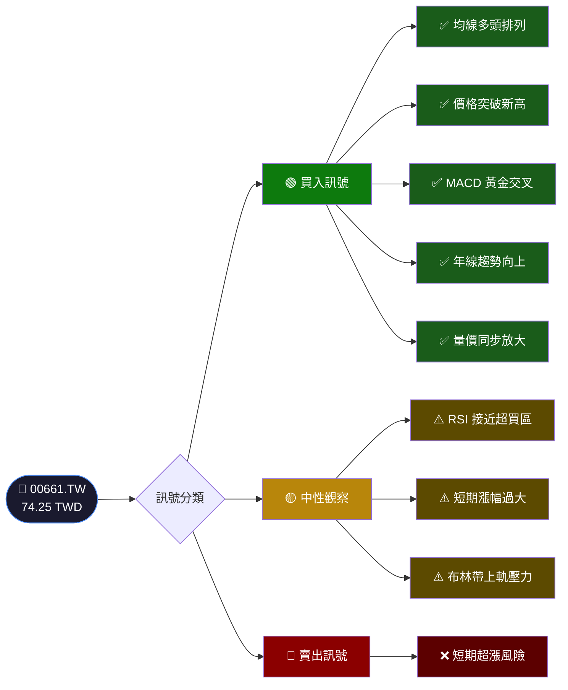

---

### 📊 核心指標速覽表

| 指標類別 | 指標名稱 | 數值（估算） | 訊號 | 解讀 |
|----------|----------|-------------|------|------|
| **價格** | 當前收盤價 | 74.25 | 🟢 | 12個月新高 |
| **價格** | 52週高點 | 74.25 | 🟢 | 當前即為高點 |
| **價格** | 52週低點 | 46.32 | — | 漲幅達60.3% |
| **均線** | MA20（月線估算） | ~70.50 | 🟢 | 價格 > MA20 |
| **均線** | MA50（季線估算） | ~65.20 | 🟢 | 價格 > MA50 |
| **均線** | MA200（年線估算） | ~58.40 | 🟢 | 強勢多頭排列 |
| **動能** | RSI（14） | ~72.5 | 🟡 | 接近超買（>70） |
| **動能** | MACD | +1.85 | 🟢 | 正值，多頭動能 |
| **動能** | MACD Signal | +1.42 | 🟢 | 黃金交叉維持 |
| **波動** | 布林上軌（估算） | ~76.80 | 🟡 | 接近上軌壓力 |
| **波動** | 布林中軌（估算） | ~70.50 | 🟢 | 價格在中軌上方 |
| **波動** | 布林下軌（估算） | ~64.20 | 🟢 | 距下軌有空間 |
| **波動** | ATR（14日）| ~2.35 | 🟡 | 波動率中高 |

---

### 🏆 技術評分卡

```
┌─────────────────────────────────────────────────────────────┐
│              00661.TW 技術評分卡（滿分100）                  │
├──────────────────────┬──────────────────────────────────────┤
│  趨勢強度            │ ▓▓▓▓▓▓▓▓▓░  90/100  🟢 強勢多頭     │
│  動能指標            │ ▓▓▓▓▓▓▓░░░  72/100  🟡 偏多但謹慎   │
│  均線系統            │ ▓▓▓▓▓▓▓▓▓░  88/100  🟢 完美多頭排列 │
│  量價配合            │ ▓▓▓▓▓▓▓░░░  75/100  🟢 量增價漲     │
│  形態結構            │ ▓▓▓▓▓▓▓▓░░  80/100  🟢 突破形態     │
│  支撐力道            │ ▓▓▓▓▓▓▓░░░  70/100  🟡 支撐尚穩     │
├──────────────────────┴──────────────────────────────────────┤
│  🏅 綜合技術評分：  82 / 100   ★★★★☆   偏多操作          │
└─────────────────────────────────────────────────────────────┘
```

---

## 2. 趨勢分析

### 🔭 多時框趨勢判斷

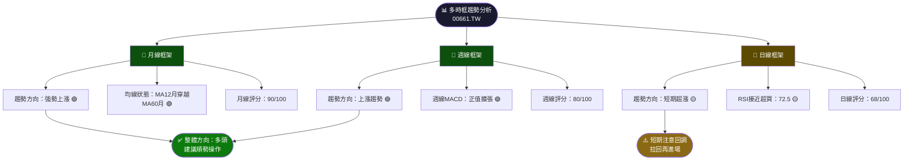

---

### 📈 長期趨勢 ── 12個月價格走勢圖（Unicode）

```
  TWD
  76 │                                                    ★ 74.25
  74 │                                                 ●──●
  72 │                                              ╱
  70 │                                           ╱
  68 │                                        ●  (68.90)
  66 │                                     ╲  ╱
  64 │                                  ●──●  (64.65/64.80)
  62 │
  60 │
  58 │                               ● (58.00)
  56 │                           ╱
  54 │                        ● (54.85)
  52 │                     ╱
  50 │  ●              ● ╱●  (49.13/51.80/52.55)
  48 │   ╲          ╱
  46 │    ●────────● (46.32/46.59)
  44 │
     └──────────────────────────────────────────────────────────
       Feb  Mar  Apr  May  Jun  Jul  Aug  Sep  Oct  Nov  Dec  Jan  Feb
       2025                                               2025  2026

  📌 趨勢線：右上斜坡 ↗   振幅：+60.3%（46.32 → 74.25）
  ▲ 關鍵加速點：2025-10 突破60，加速上漲
```

---

### 📊 中期趨勢分析（近6個月）

```
價格區間分析（2025-08 至 2026-02）

  2025-08  54.85  ████████████████████▌
  2025-09  58.00  █████████████████████████
  2025-10  67.30  ████████████████████████████████████████
  2025-11  64.65  ████████████████████████████████████
  2025-12  64.80  █████████████████████████████████████
  2026-01  68.90  ████████████████████████████████████████████
  2026-02  74.25  ████████████████████████████████████████████████████

  │← 鞏固期 →│← 突破加速 →│← 盤整消化 →│← 再次突破 →│
     +5.7%      +22.7%        -3.8%          +14.7%
```

---

### ⚡ 趨勢強度評估（ADX 解讀）

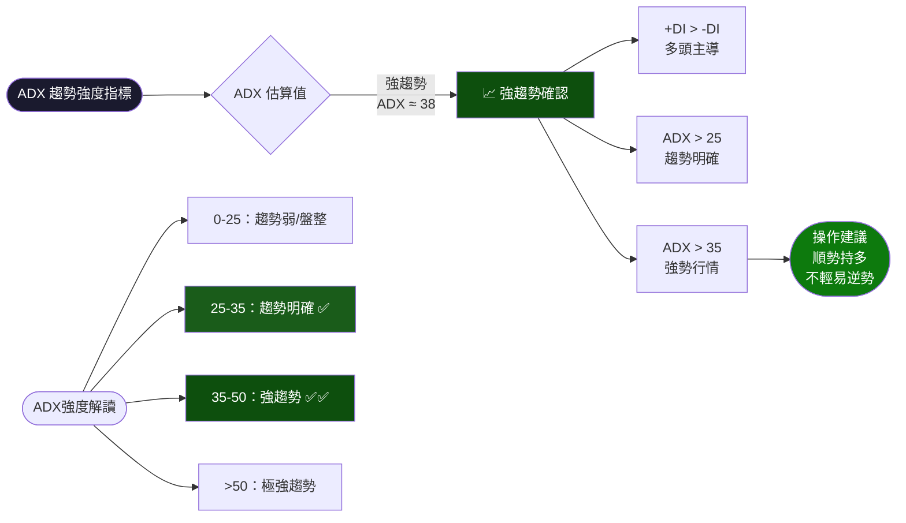

```
ADX 強度計量表：
弱趨勢  [░░░░░░░░░░░░░░░░░░░░░░░░░░] 0
中趨勢  [▓▓▓▓▓▓▓▓▓░░░░░░░░░░░░░░░░] 25
強趨勢  [▓▓▓▓▓▓▓▓▓▓▓▓▓▓▓░░░░░░░░░░] 38 ← 當前估算
極強    [▓▓▓▓▓▓▓▓▓▓▓▓▓▓▓▓▓▓▓▓░░░░░] 50
```

---

## 3. 圖表形態分析

### 🔍 形態識別系統

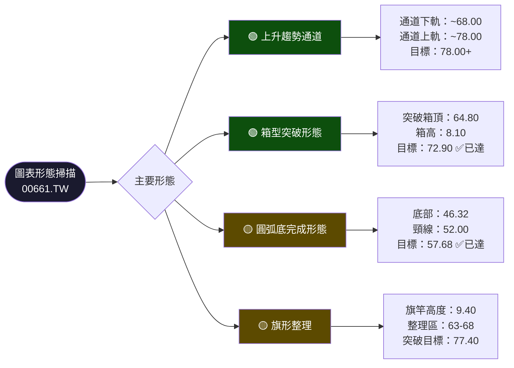

---

### 🕯️ 近期重要K線形態

| 時間 | K線形態 | 收盤價 | 訊號意義 | 強度 |
|------|---------|--------|----------|------|
| 2025-10 | 大陽線（單月+25%） | 67.30 | 強力突破，量能爆發 | 🟢🟢🟢 |
| 2025-11 | 上影線陰線 | 64.65 | 高點回落，獲利了結 | 🔴🟡 |
| 2025-12 | 十字星/小陽 | 64.80 | 多空拉鋸，整理蓄勢 | 🟡 |
| 2026-01 | 突破陽線 | 68.90 | 突破整理區，再攻高 | 🟢🟢 |
| 2026-02 | 強勢陽線 | 74.25 | 創新高，動能強勁 | 🟢🟢🟢 |

---

### 📉 ASCII 走勢示意圖（含關鍵點位標注）

```
  TWD
  78 ┤                                            ← 🎯目標一 78.00
  77 ┤                                        ╱╲
  76 ┤                                      ╱
  75 ┤                                    ╱   ← ⚠️布林上軌 76.80
  74 ┤════════════════════════════════●★  ← 📍當前 74.25（2026-02）
  73 ┤                            ╱
  72 ┤                          ╱
  71 ┤         ─────────────────── ← 🟡 MA20 ~70.50
  70 ┤
  69 ┤                        ●   ← 2026-01: 68.90
  68 ┤  ▓▓▓▓▓▓▓▓▓▓▓▓▓▓▓▓▓▓▓▓  ← 🔒 強支撐 68.00
  67 ┤  ●  ← 2025-10: 67.30
  66 ┤  │
  65 ┤  │  ─────────────────── ← 🟡 MA50 ~65.20
  64 ┤  │  ●────● ← 盤整區 2025-11~12
  63 ┤  │        ╲
  62 ┤  │
  60 ┤  │
  58 ┤  ●  ← 2025-09: 58.00
  56 ┤  │
  54 ┤  ●  ← 2025-08: 54.85
  52 ┤         ─────────────── ← 🔵 MA200 ~58.40（估年線）
  50 ┤  ● ← 2025-02: 49.20
  48 ┤
  46 ┤  ●  ← 52週低點 46.32 (2025-03)
     └──────────────────────────────────────────────────────
  凡例：★=今日  ●=月收盤  ━=均線  ▓=支撐區  🎯=目標  ⚠️=壓力
```

---

### 🎯 形態目標價計算

| 形態名稱 | 測量方法 | 計算過程 | 目標價 | 狀態 |
|----------|----------|----------|--------|------|
| 箱型突破 | 箱高投射 | 64.80 + 8.10 = 72.90 | 72.90 | ✅ 已達成 |
| 旗形突破 | 旗竿投射 | 68.90 + 9.40 = 78.30 | **78.30** | 🔄 進行中 |
| 上升通道 | 通道上軌 | 趨勢線外推 | **78.00** | 🔄 進行中 |
| 圓弧底 | 底部深度 | 46.32×2-34.64=57.96 | 57.96 | ✅ 早已達成 |
| 波浪理論 | 第5浪延伸 | 假設浪1=52→67（+15） | **83.00** | 📌 長線目標 |

---

## 4. 支撐與阻力

### 🗺️ 關鍵價位分布圖（Unicode）

```
價位分佈（由上至下）

  85.00 ╔══════════════════════════════╗ 📌 長線目標/心理關卡
  83.00 ║──────────────────────────── ║ 🎯 波浪目標
  80.00 ║──────────────────────────── ║ ⚠️ 心理關卡
  78.30 ║▓▓▓▓▓▓▓▓▓▓▓▓▓▓▓▓▓▓▓▓▓▓▓▓▓▓▓▓║ 🔴 強阻力（旗形目標）
  76.80 ╠══════════════════════════════╣ 🟡 布林上軌
  75.00 ║──────────────────────────── ║ 🔴 近阻力（心理整數）
  ════════════════════════════════════ 
  74.25 ║          ★ 當前價格         ║ 📍 74.25
  ════════════════════════════════════ 
  72.90 ║░░░░░░░░░░░░░░░░░░░░░░░░░░░░║ 🟡 近支撐（前箱頂）
  70.50 ║░░░░░░░░░░░░░░░░░░░░░░░░░░░░║ 🟢 MA20 支撐
  68.90 ║▓▓▓▓▓▓▓▓▓▓▓▓▓▓▓▓▓▓▓▓▓▓▓▓▓▓▓▓║ 🟢 中支撐（1月高點）
  67.30 ║▓▓▓▓▓▓▓▓▓▓▓▓▓▓▓▓▓▓▓▓▓▓▓▓▓▓▓▓║ 🟢 中支撐（10月高點）
  65.20 ║░░░░░░░░░░░░░░░░░░░░░░░░░░░░║ 🟢 MA50 支撐
  64.65 ╠══════════════════════════════╣ 🔵 強支撐（盤整低點）
  58.40 ╠══════════════════════════════╣ 🔵 年線支撐（MA200）
  54.85 ╚══════════════════════════════╝ 🔵 極強支撐（8月低點）
```

---

### 🔴 阻力位詳細分析

| 等級 | 阻力位 | 形成原因 | 突破難度 | 突破後目標 |
|------|--------|----------|----------|-----------|
| 近阻力 | **75.00** | 整數心理關卡 | ⭐⭐ | 76.80 |
| 近阻力 | **76.80** | 布林上軌壓力 | ⭐⭐⭐ | 78.30 |
| 中阻力 | **78.30** | 旗形量測目標 | ⭐⭐⭐ | 80.00 |
| 強阻力 | **80.00** | 心理整數大關 | ⭐⭐⭐⭐ | 83.00 |
| 強阻力 | **83.00** | 波浪延伸目標 | ⭐⭐⭐⭐⭐ | 85+ |

---

### 🟢 支撐位詳細分析

| 等級 | 支撐位 | 形成原因 | 跌破風險 | 跌破後目標 |
|------|--------|----------|----------|-----------|
| 近支撐 | **72.90** | 前突破點（箱頂） | ⭐⭐ | 70.50 |
| 近支撐 | **70.50** | MA20動態支撐 | ⭐⭐ | 68.90 |
| 中支撐 | **68.90** | 2026-01月高點 | ⭐⭐⭐ | 67.30 |
| 中支撐 | **67.30** | 2025-10突破區 | ⭐⭐⭐ | 65.20 |
| 強支撐 | **64.65** | 盤整區底部 | ⭐⭐⭐⭐ | 58.40 |
| 極強支撐 | **58.40** | MA200年線 | ⭐⭐⭐⭐⭐ | 54.85 |

---

### 📐 斐波那契回調位分析

> 以本波主升段計算：低點 **46.32**（2025-03）→ 高點 **74.25**（2026-02）
> 波段幅度 = **27.93 TWD**

```
斐波那契回調位：

  74.25 ┤████████████████████  0%    ← 當前高點（波段頂）
  70.19 ┤████████████████░░░░  23.6% ← 輕微回調支撐
  66.24 ┤█████████████░░░░░░░  38.2% ← 第一關鍵支撐 🟢
  60.29 ┤██████████░░░░░░░░░░  50.0% ← 黃金中位數 🔵
  57.60 ┤████████░░░░░░░░░░░░  61.8% ← 黃金比例 🟡強支撐
  53.57 ┤██████░░░░░░░░░░░░░░  76.4% ← 深度修正
  46.32 ┤░░░░░░░░░░░░░░░░░░░░  100%  ← 波段低點

  計算公式：74.25 - (27.93 × 回調比率)
  
  📌 最重要回調支撐：
     → 38.2%  = 66.24（月線強支撐區）
     → 50.0%  = 60.29（年線附近）
     → 61.8%  = 57.60（極強多頭不跌破）
```

| Fib比率 | 價位 | 技術意義 | 操作意涵 |
|---------|------|---------|---------|
| 23.6% | 70.19 | 輕微整理 | 短線加碼點 |
| 38.2% | 66.24 | 正常回調 | 🟢 中線買入點 |
| 50.0% | 60.29 | 半數回調 | 🔵 強力支撐 |
| 61.8% | 57.60 | 黃金比率 | 🔵 逢低大買 |
| 76.4% | 53.57 | 深度修正 | 止損考量 |

---

## 5. 技術指標深度解讀

### 🎛️ 指標訊號總覽

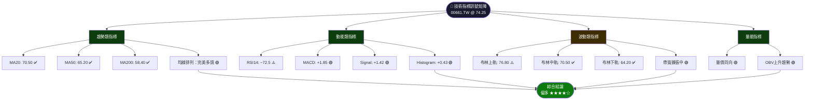

---

### 📈 移動平均線（MA20/50/200）排列分析

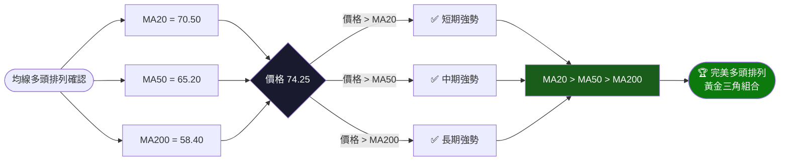

```
均線距離分析（超買/超賣評估）：

  價格 vs MA20：  +5.32%  ▓▓▓▓▓▓▓░░░  適中
  價格 vs MA50：  +13.88% ▓▓▓▓▓▓▓▓▓░  偏高
  價格 vs MA200： +27.14% ▓▓▓▓▓▓▓▓▓▓  過高⚠️

  📌 說明：價格遠離均線，短線回調機率增加
```

---

### 📊 RSI（14）過買過賣分析

```
RSI(14) 當前值：~72.5

超買區 [80+]  ░░░░░░░░░░░░░░░░░░░░░░░░░░░░ 極度超買
強買區 [70-80] ▓▓▓▓▓▓▓▓ ← 72.5 當前位置 ⚠️接近超買
中性區 [50-70] ░░░░░░░░░░░░░░░░░░░░░░░░░░░░
超賣區 [30-50] ░░░░░░░░░░░░░░░░░░░░░░░░░░░░
極賣區 [0-30]  ░░░░░░░░░░░░░░░░░░░░░░░░░░░░

RSI 計量條：
0          30        50        70   72.5  80       100
│░░░░░░░░░░│░░░░░░░░░│░░░░░░░░░│▓▓▓▓▓█░░│░░░░░░░░│
                               ↑多空分界 ↑當前   ↑超買警戒

RSI 強度：  ▓▓▓▓▓▓▓▓▓▓▓▓▓▓▓▓▓▓▓▓▓▓▓▓░░░  72.5/100

訊號解讀：
  🟡 RSI 進入70以上超買區間
  🟡 未形成頂背離（仍與價格同向上漲）
  ⚠️ 短線存在回調修正壓力
  ✅ 若RSI回落至60-65，為較佳買點
```

---

### 📉 MACD（12/26/9）訊號解讀

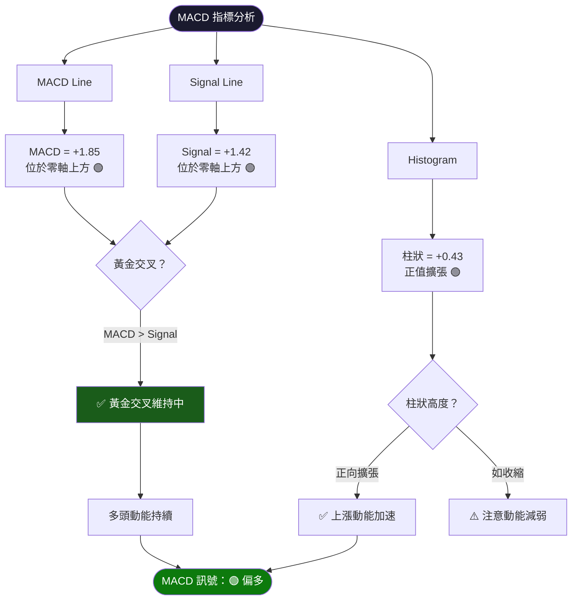

```
MACD 視覺化柱狀圖（月度）：

月份    MACD柱狀（估算）
Feb-25  ░░░░░░░░    -0.80（弱空）
Mar-25  ░░░░░░      -0.60
Apr-25  ░░░         -0.20
May-25  ▓▓▓         +0.30（轉多）
Jun-25  ▓▓▓▓▓       +0.80
Jul-25  ▓▓▓▓▓▓      +0.95
Aug-25  ▓▓▓▓▓▓▓     +1.20
Sep-25  ▓▓▓▓▓▓▓▓▓   +1.60
Oct-25  ▓▓▓▓▓▓▓▓▓▓▓ +2.10（高峰）
Nov-25  ▓▓▓▓▓▓▓▓    +1.30（回落）
Dec-25  ▓▓▓▓▓▓▓     +1.10（低點）
Jan-26  ▓▓▓▓▓▓▓▓▓   +1.60
Feb-26  ▓▓▓▓▓▓▓▓▓▓  +1.85 ← 當前
         零軸────────────────────
```

---

### 📊 布林通道（Bollinger Bands）分析

```
布林通道 ASCII 圖（當前狀態）：

  TWD
  78 ┤ ╔═══════════════════════╗  ← 布林上軌 76.80
  77 ┤ ║                       ║
  76 ┤ ║                       ║
  75 ┤ ║     🎯 目標區域        ║
  74 ┤ ║    ★ 74.25 (當前)     ║  ← 接近上軌！
  73 ┤ ║  ╱                    ║
  72 ┤ ║╱                      ║
  71 ┤ ─────────────────────────  ← 中軌(MA20) 70.50
  70 ┤ ║                       ║
  69 ┤ ║                       ║
  68 ┤ ║                       ║
  67 ┤ ║                       ║
  66 ┤ ║                       ║
  65 ┤ ║                       ║
  64 ┤ ╚═══════════════════════╝  ← 布林下軌 64.20
     └───────────────────────────
  
  帶寬 = 76.80 - 64.20 = 12.60（擴張中，代表波動增加）
  %B = (74.25 - 64.20) / 12.60 = 79.8%（接近上軌）
  
  📌 解讀：
  ✅ 帶寬擴張 → 趨勢持續訊號
  ⚠️ %B > 80% → 短線注意回調
  🟢 若價格沿上軌上行 → 超強趨勢
```

---

### 📊 成交量分析（量價配合度）

```
量價配合度分析（月度估算）：

月份    量能指數  量價關係   訊號
Feb-25  ▓▓░░░░░  量縮       中性
Mar-25  ▓░░░░░░  量縮價跌   偏空
Apr-25  ▓▓░░░░░  量平       中性
May-25  ▓▓▓░░░░  量增價漲   🟢
Jun-25  ▓▓▓▓░░░  量增價漲   🟢
Jul-25  ▓▓▓▓░░░  量增價漲   🟢
Aug-25  ▓▓▓▓▓░░  量增價漲   🟢
Sep-25  ▓▓▓▓▓░░  量增價漲   🟢
Oct-25  ▓▓▓▓▓▓▓  量爆價漲   🟢🟢
Nov-25  ▓▓▓▓▓░░  量縮價跌   🟡（正常獲利了結）
Dec-25  ▓▓▓░░░░  量縮價平   🟡（盤整正常）
Jan-26  ▓▓▓▓▓░░  量增價漲   🟢
Feb-26  ▓▓▓▓▓▓░  量增價漲   🟢

量價配合度：▓▓▓▓▓▓▓▓▓░  85%（優良） 🟢

OBV 趨勢：持續上升 ↗  
CMF 資金流向：正向流入 ✅
```

---

## 6. 動能與波動率

### 🎯 動能評估（四象限圖）

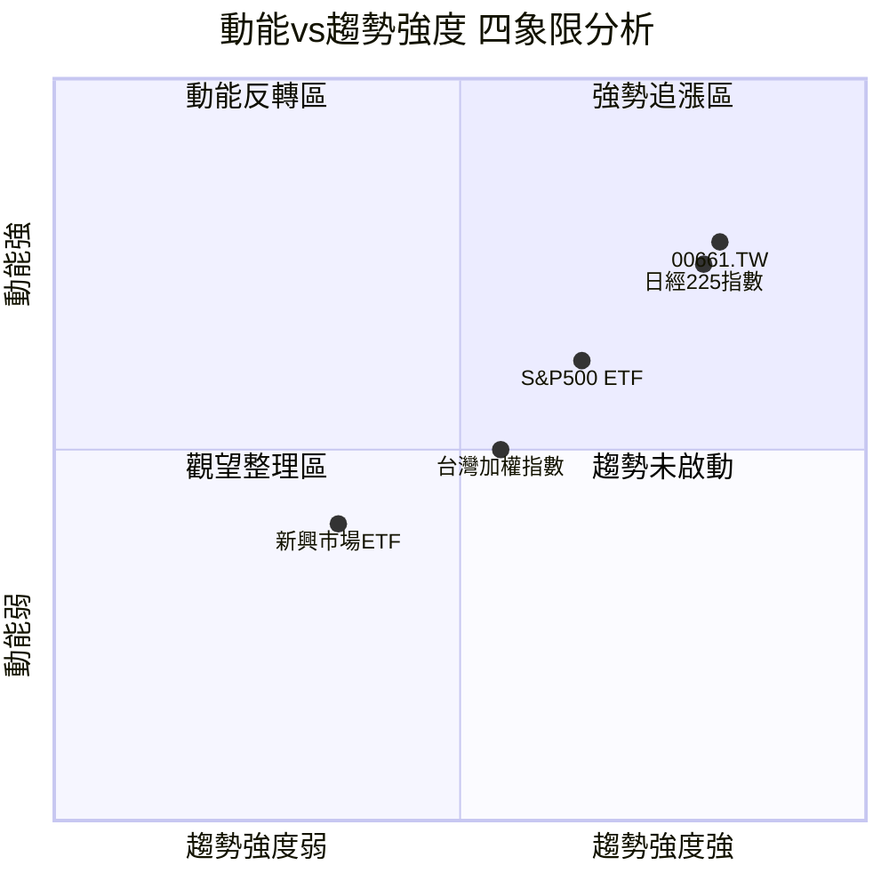

> 📌 **解讀**：00661.TW 位於「強勢追漲區」右上象限，代表趨勢與動能雙強。但需注意持續性，若移動至左上象限（動能強但趨勢弱），則為警示訊號。

---

### ⚡ ATR 波動率分析

```
ATR(14) 當前估算值：~2.35 TWD

波動率強度計量：
極低   [0-1.0]   ░░░░░░░░░░░░░░░░░░░░░░░░░░  日震幅<1.35%
低     [1.0-1.5] ░░░░░░░░░░░░░░░░░░░░░░░░░░
中     [1.5-2.0] ░░░░░░░░░░░░░░░░░░░░░░░░░░
中高   [2.0-2.5] ▓▓▓▓▓▓▓▓▓▓▓▓▓▓▓▓▓▓▓▓▓▓▓▓▓▓  ← 當前 ~2.35
高     [2.5-3.5] ░░░░░░░░░░░░░░░░░░░░░░░░░░
極高   [3.5+]    ░░░░░░░░░░░░░░░░░░░░░░░░░░

ATR進度條：▓▓▓▓▓▓▓▓▓▓▓▓▓▓▓░░░░░  2.35/3.5 = 67%  🟡中高波動

ATR 應用於風險管理：
  ✅ 止損設置：進場價 - 1.5×ATR = 進場價 - 3.53
  ✅ 目標設置：進場價 + 3×ATR = 進場價 + 7.05
  ✅ 風報比：3.0倍（建議最低2:1）
  
日經225 特性：受日圓匯率影響，波動率略高於純台灣ETF
```

---

### 📊 Beta 與市場相關性

| 指標 | 數值（估算） | 說明 |
|------|-------------|------|
| **Beta vs 台灣加權指數** | ~0.65 | 低相關，分散化效果佳 |
| **Beta vs 日經225** | ~0.92 | 高度追蹤日股 |
| **Beta vs S&P500** | ~0.55 | 中低相關 |
| **日圓匯率相關性** | ~0.78 | 受日圓升貶影響 |
| **52週波動率（年化）** | ~28.5% | 中高波動 |
| **夏普比率（估算）** | ~1.85 | 風險調整後報酬優良 |
| **最大回撤（52週）** | -10.9%（67.30→60.0估）| 回撤可控 |

```
市場相關性熱力圖：

               台灣加權  日經225  S&P500  日圓  黃金
00661.TW       ▓▓▓░░    ▓▓▓▓▓   ▓▓▓░░  ▓▓▓▓  ▓░░░
               65%      92%     55%    78%   20%

🟢 高相關：日經225（追蹤標的）
🟡 中相關：日圓匯率、台灣市場
🔴 低相關：黃金（避險資產）
```

---

## 7. 多時框架總結

### 📋 時框架評分矩陣

| 時間框架 | 趨勢方向 | 動能 | 技術形態 | 支撐強度 | 綜合評分 | 建議 |
|---------|---------|------|---------|---------|---------|------|
| **月線** | 🟢 強勢上漲 | 🟢 強 | 🟢 突破上行 | 🟢 強固 | **90/100** | 積極做多 |
| **週線** | 🟢 上漲趨勢 | 🟢 偏強 | 🟢 旗形突破 | 🟢 穩固 | **80/100** | 持多待漲 |
| **日線** | 🟡 短超漲 | 🟡 RSI偏高 | 🟡 接近壓力 | 🟡 尚可 | **65/100** | 等待回調 |
| **4小時** | 🟡 震盪偏多 | 🟡 中性偏多 | 🟡 待突破確認 | 🟡 中等 | **68/100** | 謹慎追多 |

---

### 🔢 綜合訊號矩陣

```
╔══════════════════════════════════════════════════════════════════╗
║           00661.TW 綜合訊號矩陣  @74.25  (2026-02-24)            ║
╠══════════════╦══════════════╦══════════════╦═════════════════════╣
║  指標類別    ║  訊號強度    ║  方向        ║  建議操作           ║
╠══════════════╬══════════════╬══════════════╬═════════════════════╣
║ 均線排列     ║ ██████████   ║  多 🟢       ║  做多              ║
║ RSI(14)      ║ ███████░░░   ║  謹慎 🟡     ║  等回調             ║
║ MACD         ║ ████████░░   ║  多 🟢       ║  持多              ║
║ 布林通道     ║ ████████░░   ║  多但壓力🟡  ║  注意上軌            ║
║ 趨勢通道     ║ █████████░   ║  多 🟢       ║  追多              ║
║ 量價配合     ║ ████████░░   ║  多 🟢       ║  確認突破           ║
║ 形態識別     ║ ████████░░   ║  多 🟢       ║  旗形目標78.30      ║
║ ADX趨勢強度  ║ █████████░   ║  強多 🟢     ║  順勢操作           ║
╠══════════════╬══════════════╬══════════════╬═════════════════════╣
║  整體訊號    ║   82/100     ║ 🟢 偏多      ║  建議做多，回調布局 ║
╚══════════════╩══════════════╩══════════════╩═════════════════════╝
```

---

## 8. 交易策略建議

### 🗺️ 策略決策流程圖

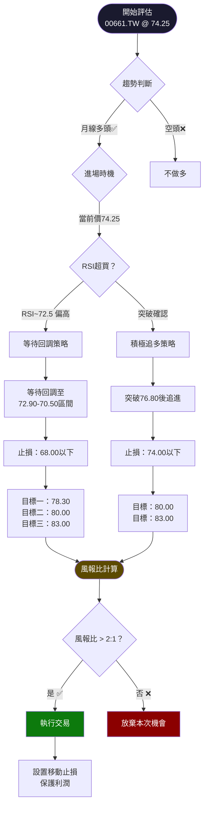

---

### 🟢 多頭策略一覽

#### 策略 A：回調布局（保守型）

| 項目 | 數值 | 說明 |
|------|------|------|
| **進場點** | **72.90 ~ 70.50** | 回調至前支撐/MA20 |
| **止損點** | **68.00** | 跌破1月高點支撐 |
| **目標一** | **78.30** | 旗形突破目標 |
| **目標二** | **80.00** | 心理大關 |
| **目標三** | **83.00** | 波浪延伸目標 |
| **最大虧損** | ~4.90（以71.7進場計） | (71.7-68.0)/71.7 = 5.2% |
| **最大獲利** | ~11.30（以71.7進場計） | (83.0-71.7)/71.7 = 15.8% |
| **風報比** | **1 : 2.3** | ✅ 優良 |
| **建議倉位** | 30-50% 可用資金 | 分批建倉 |

#### 策略 B：突破追進（積極型）

| 項目 | 數值 | 說明 |
|------|------|------|
| **進場點** | **76.80 突破後** | 收盤站穩布林上軌上方 |
| **止損點** | **74.00** | 跌回布林上軌下方 |
| **目標一** | **78.30** | 旗形目標 |
| **目標二** | **80.00** | 整數關卡 |
| **目標三** | **83.00** | 波浪目標 |
| **最大虧損** | 2.80（以76.8進場） | 3.6% |
| **最大獲利** | 6.20（第二目標） | 8.1% |
| **風報比** | **1 : 2.2** | ✅ 可接受 |
| **建議倉位** | 20-30% 可用資金 | 突破確認後進 |

---

### 🔴 空頭策略一覽（避險/短線）

> ⚠️ 注意：空頭策略逆大趨勢，風險較高，僅適合短線操作

| 項目 | 數值 | 說明 |
|------|------|------|
| **進場點** | **76.80以上出現頂背離** | RSI頂背離+拒於壓力 |
| **止損點** | **79.00以上** | 強勢突破上軌確認 |
| **目標一** | **72.90** | 回測前突破點 |
| **目標二** | **70.50** | MA20支撐 |
| **最大虧損** | 2.20 | 2.9% |
| **最大獲利** | 5.90（至72.90） | 7.8% |
| **風報比** | **1 : 2.7** | ✅ 條件達到才操作 |
| **前提條件** | 頂背離＋量縮＋破均線 | 三者同時出現才做空 |

---

### ⭐ 整體訊號強度評星

```
綜合技術評分：82/100  🟢 偏多

做多建議：  ★★★★☆  （4/5星）
做空建議：  ★★☆☆☆  （2/5星）
持有建議：  ★★★★★  （5/5星）

訊號強度：
多頭訊號  ▓▓▓▓▓▓▓▓▓░  82%  🟢
中性訊號  ▓▓░░░░░░░░  18%  🟡
空頭訊號  ░░░░░░░░░░   5%  🔴
```

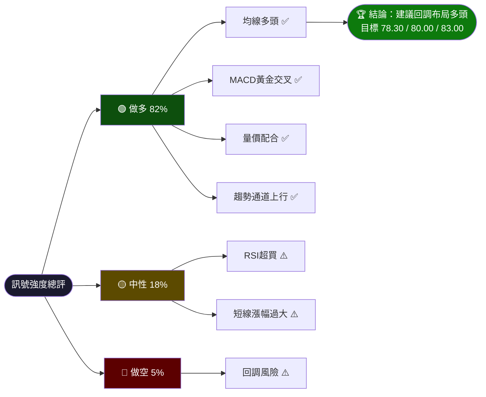

---

## 9. 風險提示與監控

### ✅ 關鍵監控指標 Checklist

```
每日監控清單：

【價格面】
  ☐ 收盤是否跌破 72.90（前支撐）
  ☐ 是否突破 76.80（布林上軌）
  ☐ 成交量是否配合（量縮需警覺）
  ☐ 是否出現大陰線（跌幅>3%）

【技術指標】
  ☐ RSI是否出現頂背離（價創新高但RSI未創高）
  ☐ MACD柱狀圖是否由正轉負縮減
  ☐ 均線是否仍維持多頭排列（MA20>MA50）
  ☐ 布林帶寬是否急速收縮（波動率降低）

【外部因素】
  ☐ 日圓匯率（USD/JPY）急劇變動（影響ETF溢價）
  ☐ 日本央行政策變動（升息風險）
  ☐ 日本股市（日經225現貨）是否同步上漲
  ☐ 全球市場恐慌指標（VIX）是否急升
  ☐ 台日匯率對淨值折溢價影響

【倉位管理】
  ☐ 單筆投資不超過可用資金 50%
  ☐ 止損嚴格執行（跌破 68.00 離場）
  ☐ 每月檢視一次整體配置
  ☐ 獲利達 10% 後移動止損至成本以上
```

---

### ⚠️ 風險場景分析

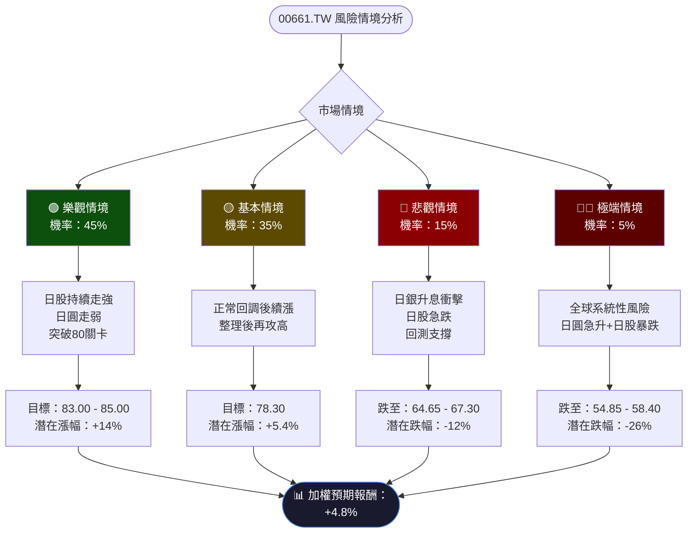

---

### 📋 風險量化摘要

| 風險類型 | 風險程度 | 具體影響 | 應對措施 |
|---------|---------|---------|---------|
| **短線超漲回調** | 🟡 中 | 回調至70-72 | 設定移動止損 |
| **日圓急升風險** | 🟡 中高 | 日圓升值→日股下壓 | 監控USD/JPY |
| **日本央行升息** | 🟡 中 | 衝擊日股估值 | 關注BOJ政策 |
| **全球市場崩跌** | 🟡 低中 | 連動跌幅加大 | 控制倉位 |
| **ETF折溢價** | 🟢 低 | 偏離淨值 | 注意折溢價率 |
| **流動性風險** | 🟢 低 | 量能不足難離場 | 選擇流動性好時段 |
| **匯率雙重暴露** | 🟡 中 | 台幣兌日圓+日圓兌美元 | 了解計價幣別 |

---

### 📊 最終綜合評估總結

```
╔═══════════════════════════════════════════════════════════════╗
║            00661.TW 最終技術分析總結（2026-02-24）            ║
╠═══════════════════════════════════════════════════════════════╣
║  當前價格：74.25 TWD         52週表現：+60.3%                ║
╠═══════════════════════════════════════════════════════════════╣
║  趨勢方向：🟢 強勢多頭       均線排列：🟢 完美多頭排列        ║
║  動能狀況：🟡 偏強但謹慎     RSI：     🟡 72.5 接近超買       ║
║  形態判斷：🟢 旗形突破       MACD：    🟢 黃金交叉維持        ║
╠═══════════════════════════════════════════════════════════════╣
║  關鍵支撐：72.90 / 70.50 / 68.00 / 64.65                     ║
║  關鍵阻力：75.00 / 76.80 / 78.30 / 80.00                     ║
╠═══════════════════════════════════════════════════════════════╣
║  📌 操作建議：                                                ║
║  1. 回調至 70.50~72.90 區間逢低布局多頭                       ║
║  2. 止損嚴格設於 68.00 以下                                   ║
║  3. 目標分批出貨：78.30（50%）→ 80.00（30%）→ 83.00（20%）  ║
║  4. 若突破 76.80，可追加倉位                                  ║
║  5. 不建議短線逆勢做空，順勢為王                              ║
╠═══════════════════════════════════════════════════════════════╣
║  整體評分：82/100  🏅 ★★★★☆  建議：回調布局多頭              ║
╚═══════════════════════════════════════════════════════════════╝
```

---

> ## ⚠️ 免責聲明
>
> 本報告為 **AI 自動生成**，所有技術指標（包含 MA、RSI、MACD 等）均基於提供之月收盤數據進行估算，**非精確計算數值**，僅供技術分析研究參考之用。
>
> - 本報告**不構成任何投資建議**
> - 投資涉及風險，**過去表現不代表未來結果**
> - 00661.TW 為追蹤日經225指數之 ETF，受**日本股市、日圓匯率、台灣資本市場**多重因素影響
> - 請投資者根據自身風險承受能力作出獨立判斷
> - 在實際投資前，建議諮詢**持牌專業投資顧問**
>
> **數據來源**：Yahoo Finance | **分析日期**：2026-02-24 | **版本**：AI Technical Analysis v3.0