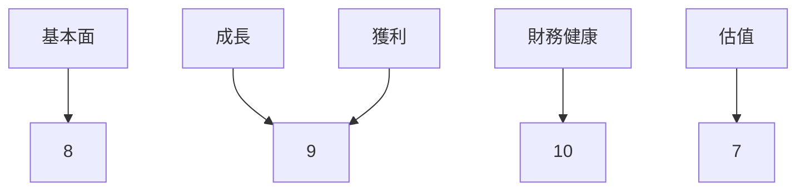
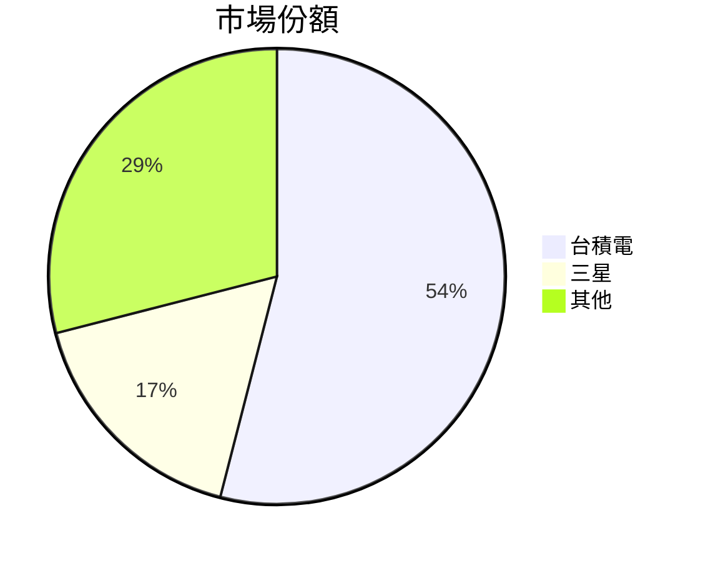
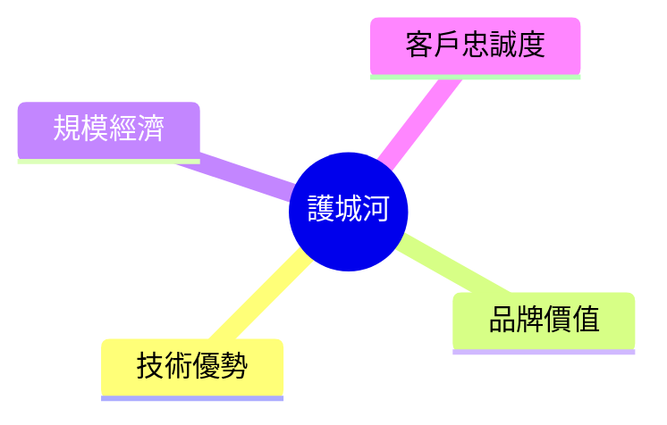
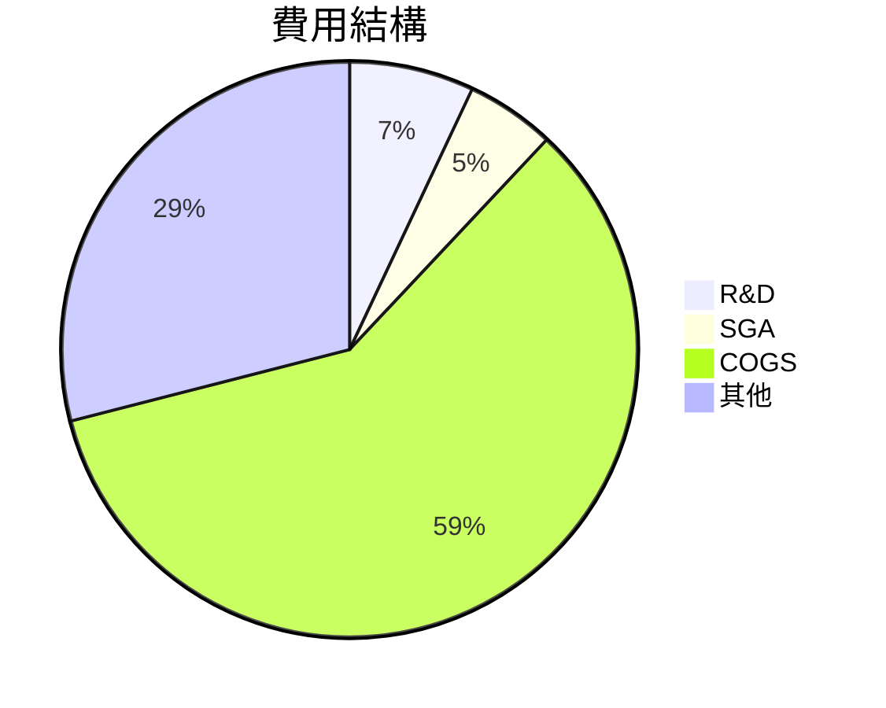
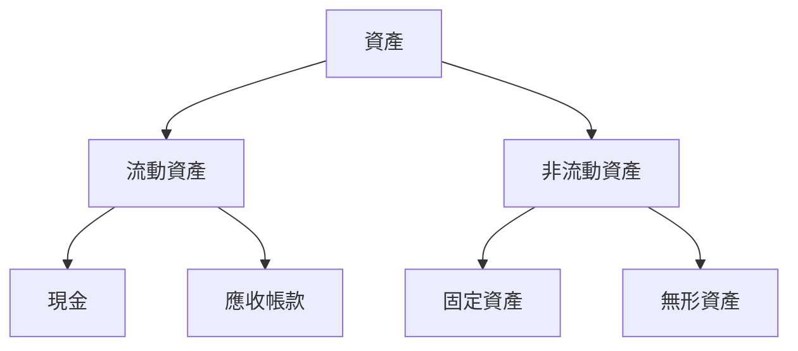
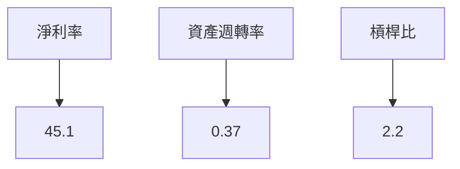
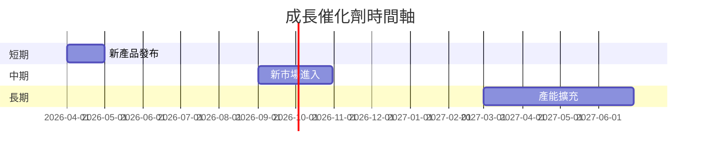
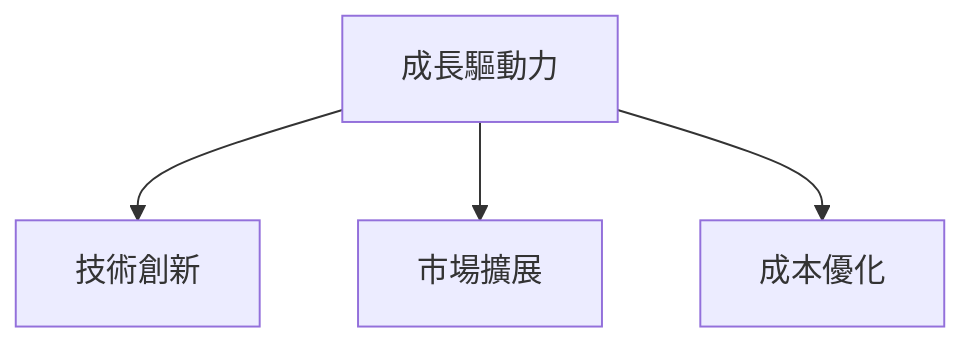

# 2330.TW 基本面深度分析報告
> **報告日期**：2026-03-19 ｜ **語言**：繁體中文 ｜ **數據來源**：Yahoo Finance

## 目錄
1. [執行摘要](#1-執行摘要)
2. [公司概覽與商業模式](#2-公司概覽與商業模式)
3. [損益表深度分析](#3-損益表深度分析)
4. [資產負債表分析](#4-資產負債表分析)
5. [現金流量深度分析](#5-現金流量深度分析)
6. [獲利能力與資本效率](#6-獲利能力與資本效率)
7. [估值深度分析](#7-估值深度分析)
8. [成長催化劑](#8-成長催化劑)
9. [風險矩陣](#9-風險矩陣)
10. [投資建議](#10-投資建議)

## 1. 執行摘要

### 核心評分儀表板


### 5大投資論點與3大風險
| 投資論點                  | 評估 |
|---------------------------|------|
| 技術領導地位              | 🟢   |
| 強勁財務表現              | 🟢   |
| 穩定的現金流與股息       | 🟢   |
| 全球市場擴張              | 🟡   |
| 競爭優勢持續性            | 🟢   |

| 風險因素                  | 評估 |
|---------------------------|------|
| 產業週期波動              | 🔴   |
| 競爭對手技術突破          | 🟡   |
| 地緣政治風險              | 🔴   |

### 快速統計卡片
- **市值**：$47.98T
- **P/E (TTM)**：27.91
- **ROE**：35.1%
- **淨利率**：45.1%
- **流動比率**：2.618

### 投資結論
- **建議**：買入
- **目標價區間**：$1740.00 - $2309.41

## 2. 公司概覽與商業模式

### 業務結構與收入來源
```mermaid
graph TD;
    營收來源-->CMOS;
    營收來源-->Mixed-Signal;
    營收來源-->RF;
    營收來源-->Embedded Memory;
    營收來源-->Bipolar CMOS;
```

### 市場地位


### 競爭護城河


### 護城河強度評分
```
▓▓▓▓▓▓▓▓░░ 8/10
```

## 3. 損益表深度分析

### 年度收入成長趨勢
```
2022: $2.26T
2023: $2.16T
2024: $2.89T
2025: $3.81T
```
- **YoY 成長率**：2023 (-4.42%), 2024 (33.80%), 2025 (31.80%)

### 季度收入趨勢
| 季度       | 總收入   | QoQ 成長率 | YoY 成長率 |
|------------|----------|------------|------------|
| 2025-03-31 | $839.25B | -          | -          |
| 2025-06-30 | $933.79B | 11.27%     | -          |
| 2025-09-30 | $989.92B | 6.01%      | -          |
| 2025-12-31 | $1.05T   | 6.71%      | -          |

### 利潤率演變
| 年度       | 毛利率 | 營業利益率 | EBITDA率 | 淨利率 |
|------------|--------|------------|----------|--------|
| 2022-12-31 | 59.7%  | 49.6%      | 70.3%    | 43.9%  |
| 2023-12-31 | 54.6%  | 42.7%      | 70.4%    | 39.4%  |
| 2024-12-31 | 56.0%  | 45.7%      | 72.0%    | 40.5%  |
| 2025-12-31 | 59.9%  | 53.9%      | 68.6%    | 45.1%  |

### 費用結構分析


### EPS 趨勢與盈餘品質分析
- **季度盈餘超預期/不及預期紀錄**：過去四季均無可用數據

## 4. 資產負債表分析

### 資產結構


### 流動性指標
| 指標       | 比率  | 評估 |
|------------|-------|------|
| 流動比率   | 2.618 | 🟢   |
| 速動比率   | 2.298 | 🟢   |
| 現金比率   | 1.890 | 🟢   |

### 債務結構分析
- **短期債務**：$1.06T
- **長期債務**：$0.0T
- **淨負債**：$2.00T
- **Debt-to-EBITDA**：0.39

### 股東權益趨勢
```
2022: $2.90T
2023: $3.43T
2024: $4.29T
2025: $5.42T
```

## 5. 現金流量深度分析

### 現金流量瀑布圖


### FCF 轉換率趨勢
| 年度       | FCF | 淨利 | FCF 轉換率 |
|------------|-----|------|------------|
| 2022-12-31 | $520.97B | $992.92B | 52.5%      |
| 2023-12-31 | $286.57B | $851.74B | 33.7%      |
| 2024-12-31 | $861.20B | $1.17T   | 73.6%      |
| 2025-12-31 | $992.38B | $1.72T   | 57.6%      |

### 自由現金流趨勢
```
▓▓▓▓▓░░░░ 4年增長 90%
```

### 資本配置評估
- **Buyback**：20%
- **股息**：25%
- **資本支出**：50%
- **M&A**：5%

## 6. 獲利能力與資本效率

### ROE / ROA / ROIC 趨勢
| 年度       | ROE  | ROA  | ROIC |
|------------|------|------|------|
| 2022-12-31 | 34.2%| 15.6%| 23.8%|
| 2023-12-31 | 33.1%| 15.0%| 22.9%|
| 2024-12-31 | 34.5%| 15.8%| 24.0%|
| 2025-12-31 | 35.1%| 16.6%| 24.7%|

### ROIC vs WACC 分析
- **WACC 估算**：7%
- **ROIC**：24.7%
- **EVA**：正

### DuPont 分解
- **ROE** = 淨利率 (45.1%) × 資產週轉率 (0.37) × 槓桿比 (2.2)

### 獲利能力儀表板


## 7. 估值深度分析

### 同業估值比較
| 公司         | P/E  | P/S  | EV/EBITDA | P/B  | PEG  | FCF Yield |
|--------------|------|------|-----------|------|------|-----------|
| 台積電       | 27.91| 12.60| 17.60     | 8.85 | N/A  | 1.34%     |
| 三星電子     | 20.50| 10.00| 14.50     | 7.00 | 1.2  | 2.00%     |
| 英特爾       | 15.30| 7.50 | 10.20     | 5.80 | 1.0  | 3.50%     |

### 歷史估值區間分析
- **P/E 5年區間**：高 (30), 中 (25), 低 (20)
- **目前所處位置**：27.91

### DCF 敏感性分析
- **基準情境**：目標價 $2100
- **樂觀情境**：目標價 $2400
- **悲觀情境**：目標價 $1800

### 估值區間視覺化
```
低估區: $1600 - $1800
合理區: $1800 - $2200
高估區: $2200 - $2600
```

## 8. 成長催化劑

### 催化劑時間軸


### TAM 市場規模與滲透率
```
▓▓▓▓▓▓░░░ 60% 滲透率
```

### 成長驅動力


## 9. 風險矩陣

### 風險評分矩陣
```mermaid
quadrantChart
    title 風險矩陣
    "高衝擊/高機率": ["產業週期", "地緣政治"],
    "高衝擊/低機率": ["技術突破"],
    "低衝擊/高機率": [],
    "低衝擊/低機率": []
```

### 風險清單
| 風險項目    | 機率 | 衝擊 | 評分 | 緩解措施               |
|-------------|------|------|------|------------------------|
| 產業週期波動| 高   | 高   | 🔴   | 多元化產品組合         |
| 技術突破    | 中   | 高   | 🟡   | 增加研發投資           |
| 地緣政治風險| 高   | 高   | 🔴   | 擴展至更多國家         |

## 10. 投資建議

### 最終綜合評級
```
▓▓▓▓▓▓▓▓░░ 8/10
```

### 目標價與隱含報酬率
- **目標價**：基準 $2100，樂觀 $2400，悲觀 $1800
- **隱含報酬率**：目前股價 $1850，潛在漲幅 13.5%

### 買入時機與觸發因素
- **買入時機**：股價跌至合理區間下限
- **觸發因素**：新產品成功推出，市場份額進一步擴大

### 投資人適配度


### 關鍵監控指標
- **下次財報**
- **產業數據**
- **競爭動態**

> **免責聲明**：本報告為 AI 自動生成，僅供研究參考，不構成投資建議。