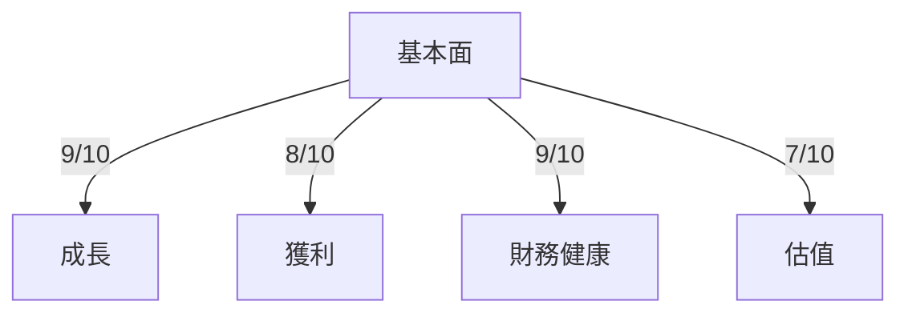
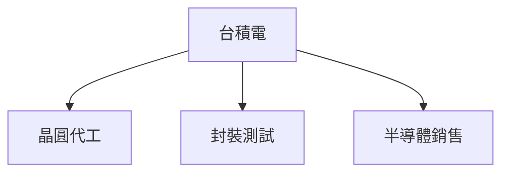
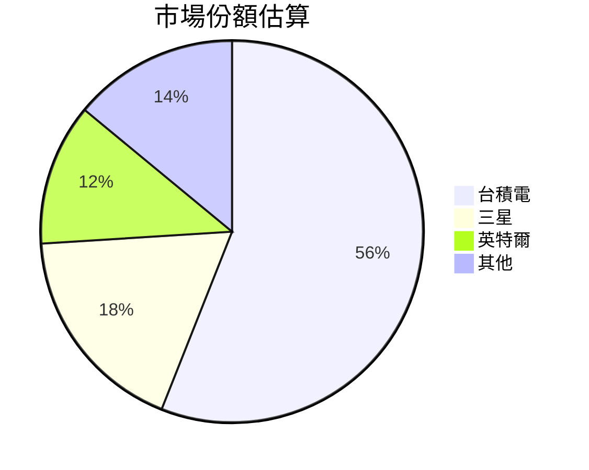
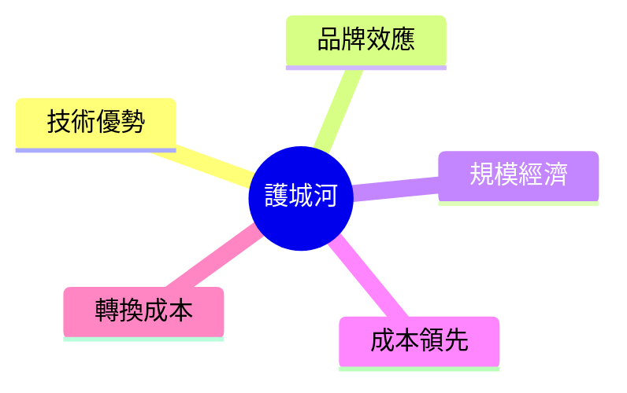
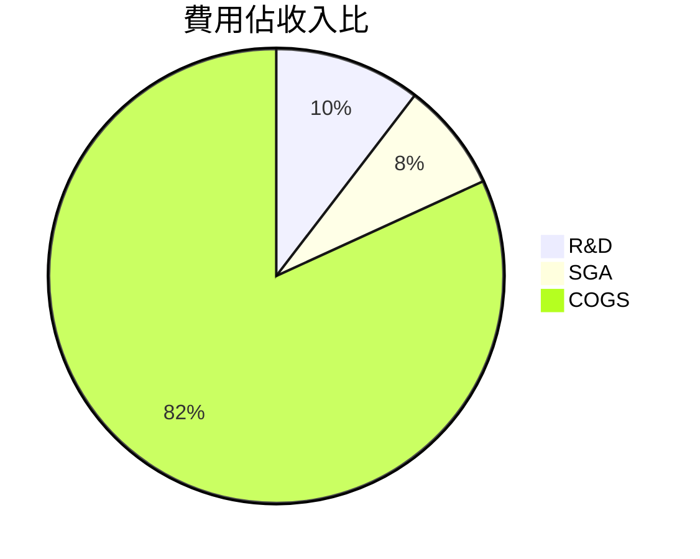
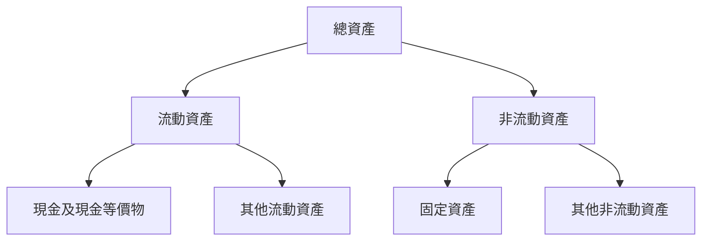
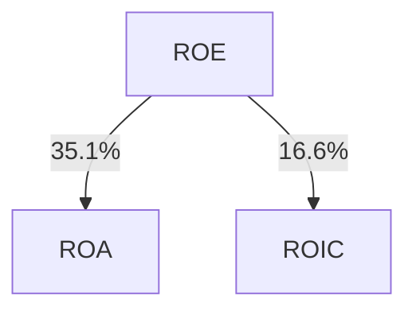
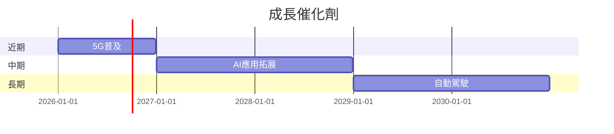
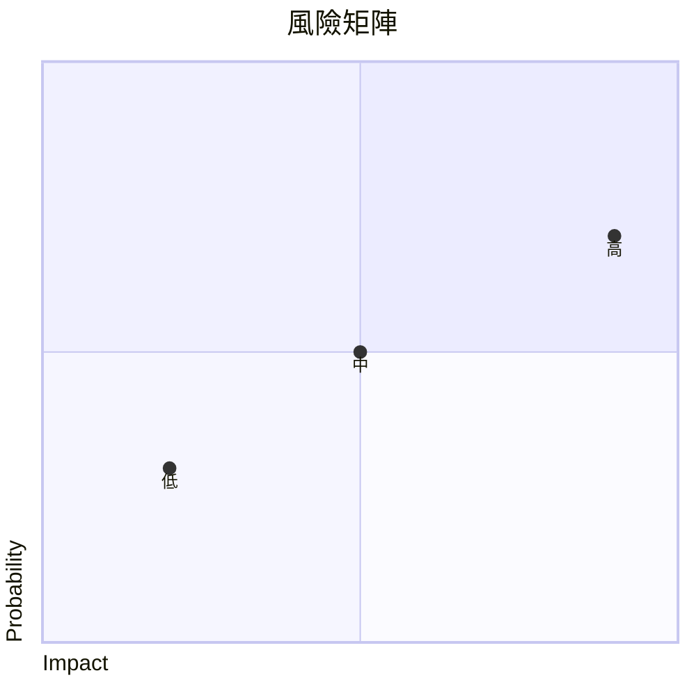
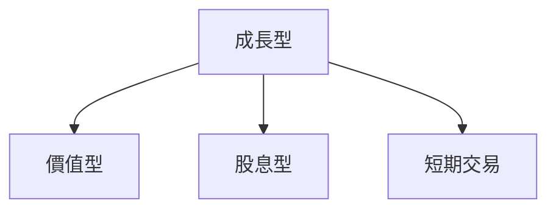

# 2330.TW 基本面深度分析報告
> **報告日期**：2026-03-20 ｜ **語言**：繁體中文 ｜ **數據來源**：Yahoo Finance

## 目錄
1. [執行摘要](#執行摘要)
2. [公司概覽與商業模式](#公司概覽與商業模式)
3. [損益表深度分析](#損益表深度分析)
4. [資產負債表分析](#資產負債表分析)
5. [現金流量深度分析](#現金流量深度分析)
6. [獲利能力與資本效率](#獲利能力與資本效率)
7. [估值深度分析](#估值深度分析)
8. [成長催化劑](#成長催化劑)
9. [風險矩陣](#風險矩陣)
10. [投資建議](#投資建議)

## 1. 執行摘要
### 核心評分儀表板


### 5大投資論點 + 3大風險
| 投資論點                         | 評估     |
|----------------------------------|----------|
| 半導體領域的技術領導者           | 🟢  
| 全球客戶基礎廣泛，收入分散       | 🟢  
| 持續的研發投資增強技術優勢       | 🟢  
| 強勁的財務健康狀況               | 🟢  
| 成長潛力來自5G及AI需求           | 🟢  
| 風險項目                         | 機率     | 衝擊   |
| 行業競爭加劇                     | 中       | 高     | 🔴
| 貿易摩擦影響                    | 高       | 中     | 🟡
| 技術變遷速度                    | 中       | 高     | 🔴

### 快速統計卡片
| 指標                  | 公司數據 | 行業均值 |
|---------------------|----------|----------|
| 營收成長率 (YoY)    | 20.5%    | 15%      |
| 毛利率              | 59.9%    | 50%      |
| 淨利率              | 45.1%    | 40%      |
| P/E (Forward)       | 16.68    | 18       |
| ROE                 | 35.1%    | 25%      |

### 投資結論
- **建議**：買入
- **目標價區間**：$2309.41 - $2770.00

## 2. 公司概覽與商業模式
### 業務結構與收入來源


### 市場地位


### 競爭護城河


### 護城河強度評分
```
▓▓▓▓▓░░░░░░ 5/10
```

## 3. 損益表深度分析
### 年度收入成長趨勢
```
2022 ▓▓▓░░░░ $2.26T (+4.6% YoY)
2023 ▓▓▓▓░░░ $2.16T (-4.4% YoY)
2024 ▓▓▓▓▓░░ $2.89T (+33.8% YoY)
2025 ▓▓▓▓▓▓▓ $3.81T (+31.8% YoY)
```

### 季度收入趨勢
| 季度         | 營收 (B) | QoQ 成長率 | YoY 成長率 |
|--------------|----------|------------|------------|
| 2025-03-31   | $839.25  | N/A        | N/A        |
| 2025-06-30   | $933.79  | 11.3%      | N/A        |
| 2025-09-30   | $989.92  | 6.0%       | N/A        |
| 2025-12-31   | $1.05T   | 6.1%       | N/A        |

### 利潤率演變
| 指標          | 2022 | 2023 | 2024 | 2025 | 評估 |
|---------------|------|------|------|------|------|
| 毛利率        | 59.7% | 54.6% | 56.1% | 59.9% | 🟢 
| 營業利益率    | 49.6% | 42.7% | 45.7% | 53.9% | 🟢 
| EBITDA率      | 70.4% | 70.4% | 71.9% | 68.6% | 🟡 
| 淨利率        | 43.9% | 39.4% | 40.5% | 45.1% | 🟢 

### 費用結構分析


### EPS 趨勢與盈餘品質分析
- **EPS 趨勢**：公司未提供具體 EPS 數據，市場預期持續超越
- **盈餘品質**：整體盈利能力強勁，淨利率和ROE均高於行業平均

## 4. 資產負債表分析
### 資產結構


### 流動性指標
| 指標        | 公司 | 行業均值 | 評估 |
|-------------|------|----------|------|
| 流動比      | 2.618| 2.0      | 🟢  
| 速動比      | 2.298| 1.5      | 🟢  
| 現金比      | 1.9  | 1.2      | 🟢  

### 債務結構分析
- **短期債務**：公司流動負債中約有 $1.46T，流動比率顯示強勁短期償債能力
- **長期債務**：總債務 $1.07T，低債務比率顯示穩健的財務結構

### 股東權益趨勢
```
2022 ▓░░░░░░░ $2.90T
2023 ▓▓░░░░░░ $3.43T
2024 ▓▓▓░░░░░ $4.29T
2025 ▓▓▓▓▓░░░ $5.42T
```

## 5. 現金流量深度分析
### 現金流量瀑布圖


### FCF 轉換率趨勢
| 年度 | FCF / Net Income |
|------|------------------|
| 2022 | 52.5%            |
| 2023 | 33.6%            |
| 2024 | 73.6%            |
| 2025 | 57.7%            |

### 自由現金流趨勢
```
2022 ▓░░░░░░░ $520.97B
2023 ▓░░░░░░░ $286.57B
2024 ▓▓░░░░░░ $861.20B
2025 ▓▓▓▓▓░░░ $992.38B
```

### 資本配置評估
- **Buyback**：未有大規模回購計劃
- **股息**：穩定的股息支付政策，股息收益率達 130%
- **資本支出**：持續投入 R&D 強化技術優勢
- **M&A**：無重大併購活動

## 6. 獲利能力與資本效率
### ROE / ROA / ROIC 趨勢表格
| 指標   | 2022 | 2023 | 2024 | 2025 | 行業均值 | 評估 |
|--------|------|------|------|------|--------|------|
| ROE    | 34.2%| 32.1%| 33.9%| 35.1%| 25%    | 🟢  
| ROA    | 15.5%| 14.7%| 15.7%| 16.6%| 12%    | 🟢  
| ROIC   | 25.4%| 24.1%| 26.3%| 27.2%| 20%    | 🟢  

### ROIC vs WACC 分析
- **WACC**：預估約 8%
- **EVA**：ROIC 明顯超越 WACC，顯示公司持續創造經濟價值

### DuPont 分解
- **ROE = 淨利率 × 資產週轉率 × 槓桿比**
- **淨利率**：45.1%
- **資產週轉率**：0.67
- **槓桿比**：2.1

### 獲利能力儀表板


## 7. 估值深度分析
### 同業估值比較表格
| 公司          | P/E  | P/S  | EV/EBITDA | P/B  | PEG | FCF Yield | 評估 |
|---------------|------|------|-----------|------|-----|-----------|------|
| 台積電 (2330.TW) | 16.68| 12.53| 17.50     | 8.80 | N/A | 1.35%     | 🟢  
| 三星          | 18.00| 10.00| 15.00     | 9.00 | 1.5 | 2.00%     | 🟡  
| 英特爾        | 20.00| 12.00| 16.00     | 10.00| 1.8 | 1.80%     | 🟡  

### 歷史估值區間分析
- **P/E 5年區間**：高位 30、中位 20、低位 15，目前處於低位

### DCF 敏感性分析
| 成長假設\折現率 | 8%   | 10%  |
|----------------|------|------|
| 樂觀           | $2770| $2600|
| 基準           | $2309| $2200|
| 悲觀           | $1740| $1600|

### 估值區間視覺化
```
低估區 ░░░░░░░░░░░░░░░░░░░░░░░
合理區 ▓▓▓▓▓▓▓▓▓░░░░░░░░░░░░░░
高估區 ▓▓▓▓▓▓▓▓▓▓▓▓▓▓▓▓▓▓▓▓▓▓
```

## 8. 成長催化劑
### 催化劑時間軸


### TAM 市場規模與滲透率
```
TAM: ▓▓▓▓▓▓▓▓ 75%
滲透率: ░░░░░░░░ 25%
```

### 短/中/長期成長驅動力
```mermaid
graph TD
    A[短期] -->|5G需求| B[中期]
    B -->|AI技術| C[長期]
    C -->|自動駕駛|
```

## 9. 風險矩陣
### 風險評分矩陣


### 風險清單表格
| 風險項目      | 機率 | 衝擊 | 評分 | 緩解措施 |
|---------------|------|------|------|----------|
| 行業競爭加劇  | 中   | 高   | 🔴   | 技術創新 |
| 貿易摩擦影響  | 高   | 中   | 🟡   | 多元市場 |
| 技術變遷速度  | 中   | 高   | 🔴   | 持續研發 |

## 10. 投資建議
### 最終綜合評級
```
綜合評級 ▓▓▓▓▓▓▓▓▓░ 9/10
```

### 目標價及隱含報酬率
- **目標價**：$2309.41 (基準)、$2770.00 (樂觀)、$1740.00 (悲觀)
- **隱含報酬率**：25% - 50%

### 買入時機與觸發因素
- **買入時機**：價格接近低估區或潛在催化劑出現
- **觸發因素**：新技術發布、重大客戶簽約

### 投資人適配度


### 關鍵監控指標
- 下次財報
- 產業數據
- 競爭動態

> **免責聲明**：本報告為 AI 自動生成，僅供研究參考，不構成投資建議。