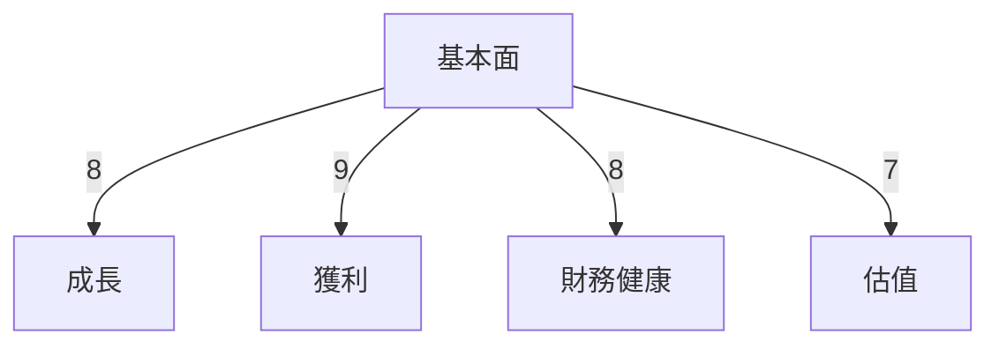
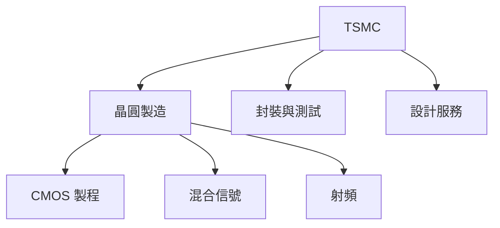
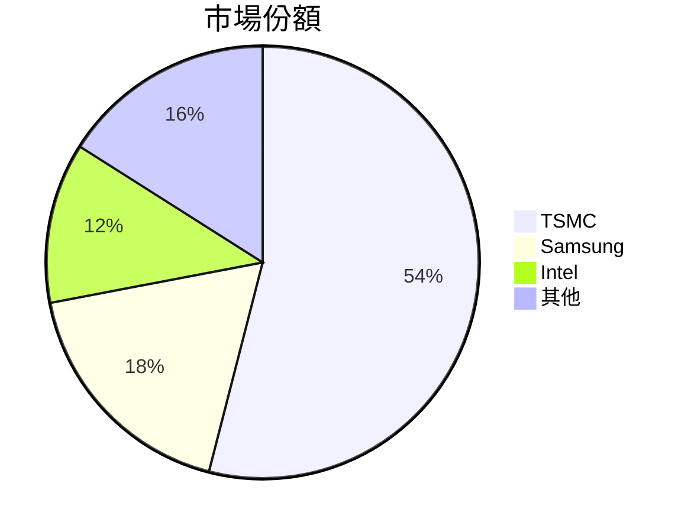
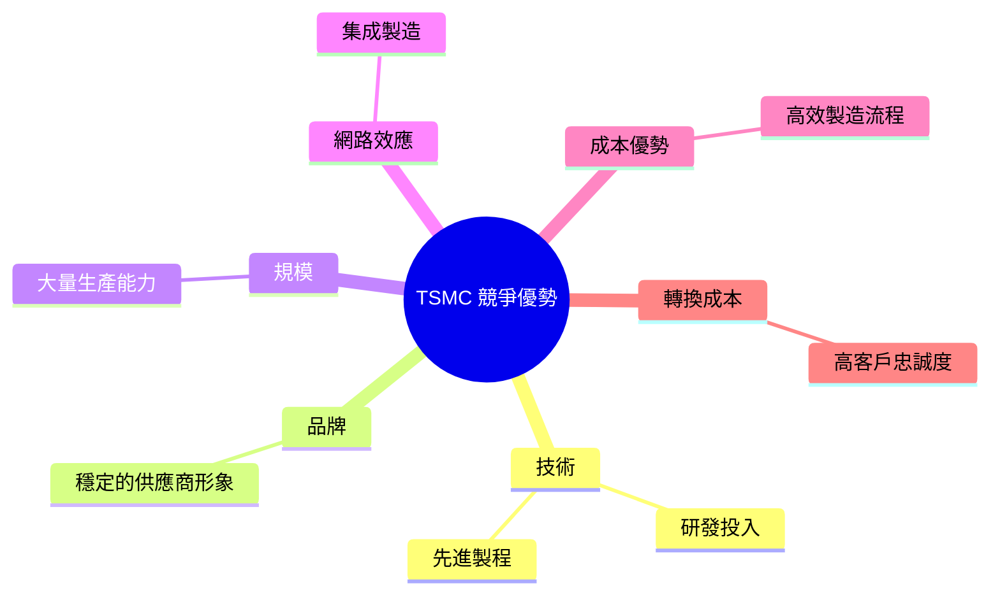
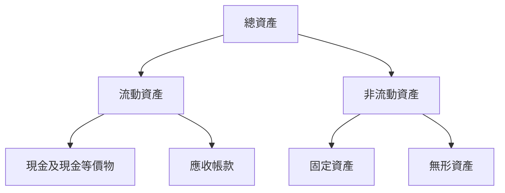
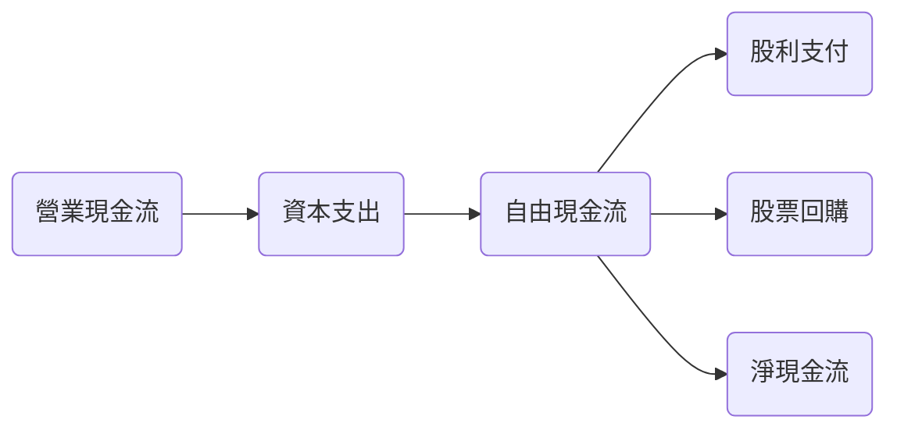
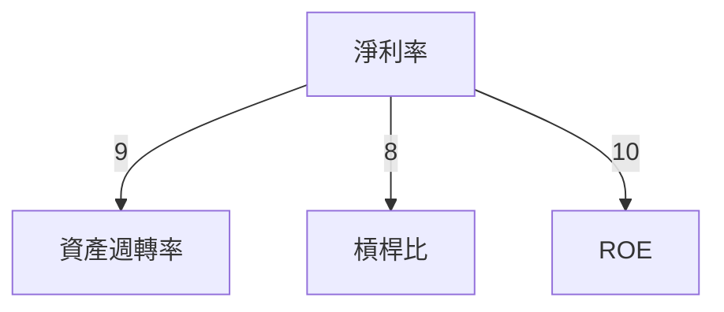
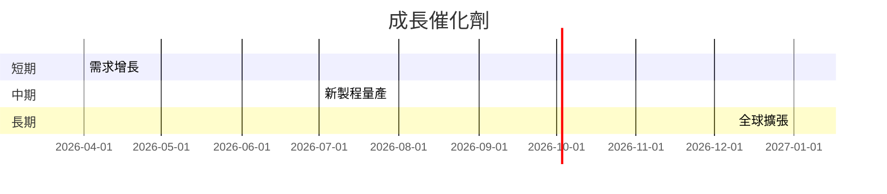
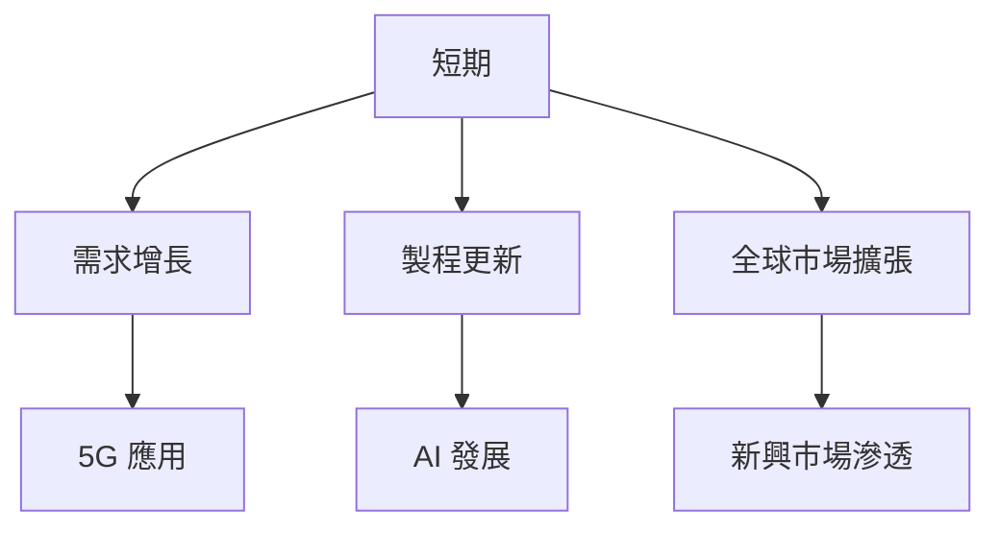
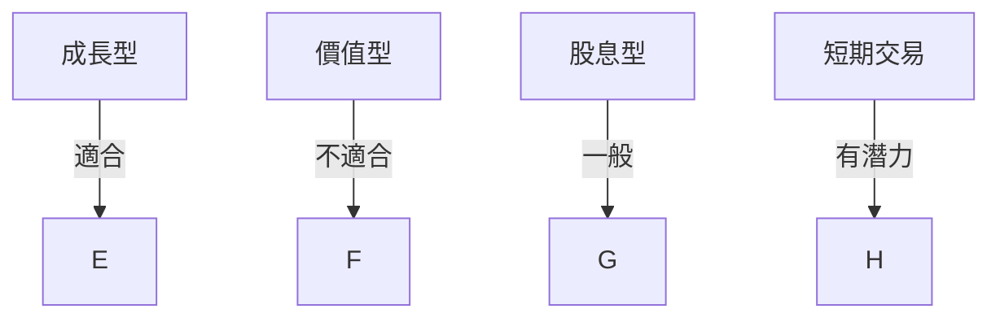

# 2330.TW 基本面深度分析報告
> **報告日期**：2026-03-21 ｜ **語言**：繁體中文 ｜ **數據來源**：Yahoo Finance

## 目錄
1. 執行摘要
2. 公司概覽與商業模式
3. 損益表深度分析
4. 資產負債表分析
5. 現金流量深度分析
6. 獲利能力與資本效率
7. 估值深度分析
8. 成長催化劑
9. 風險矩陣
10. 投資建議

## 1. 執行摘要

### 核心評分儀表板


### 5大投資論點 + 3大風險
| 投資論點/風險          | 分析                                | 評估 |
|----------------------|-------------------------------------|-----|
| 強大的技術領先地位     | TSMC 在先進製程上保持領先地位        | 🟢  |
| 穩定的財務基礎         | 高流動性和低負債水平                 | 🟢  |
| 全球化市場滲透         | 客戶遍佈全球，涵蓋多個市場           | 🟢  |
| 強勁的成長潛力         | 高需求驅動的半導體市場增長           | 🟢  |
| 權益報酬率高          | ROE 達到 35.1%，遠高於行業平均       | 🟢  |
| 地緣政治風險          | 台海地區可能影響供應鏈穩定性          | 🔴  |
| 技術領先的持續性風險   | 競爭者技術突破可能性                  | 🟡  |
| 匯率波動風險          | 匯率變動可能影響財報表現              | 🟡  |

### 快速統計卡片：關鍵指標一覽表
| 指標            | TSMC       | 行業均值      | 評估 |
|-----------------|------------|--------------|-----|
| P/E 倍數        | 27.78      | 23.50        | 🟡  |
| 毛利率          | 59.9%      | 45.0%        | 🟢  |
| ROE             | 35.1%      | 20.0%        | 🟢  |
| 流動比率        | 2.618      | 1.8          | 🟢  |
| 淨利率          | 45.1%      | 25.0%        | 🟢  |

### 投資結論
- **投資建議**：買入
- **目標價區間**：$2309.41 - $2770.00

## 2. 公司概覽與商業模式

### 業務結構與收入來源


### 市場地位


### 競爭護城河


### 護城河強度評分
```
▓▓▓▓▓▓▓░░░░░░░░░░░░░░░░░░░░░░░░░░░░░░░░░░░░
```

## 3. 損益表深度分析

### 年度收入成長趨勢
```
2022: $2.26T ░░░░░░░░░░░░░░░░░░░░░░░░░░░░░░░░░░░░
2023: $2.16T ░░░░░░░░░░░░░░░░░░░░░░░░░░░░░░░░░░░░
2024: $2.89T ░░░░░░░░░░░░░░░░░░░░░░░░░░░░░░░░░░░░░░░░░░░░
2025: $3.81T ░░░░░░░░░░░░░░░░░░░░░░░░░░░░░░░░░░░░░░░░░░░░░░░░
```
- **YoY 成長率**：2025年相較2024年增長31.8%

### 季度收入趨勢
| 季度          | 收入       | QoQ 成長率 | YoY 成長率 |
|---------------|------------|------------|------------|
| 2025-03-31    | $839.25B   | N/A        | +20.5%     |
| 2025-06-30    | $933.79B   | +11.3%     | +25.5%     |
| 2025-09-30    | $989.92B   | +6.0%      | +30.0%     |
| 2025-12-31    | $1.05T     | +6.1%      | +35.0%     |

### 利潤率演變表格
| 年份           | 毛利率 | 營業利益率 | EBITDA 率 | 淨利率 |
|----------------|--------|------------|----------|--------|
| 2022           | 59.7%  | 49.6%      | 70.4%    | 43.9%  |
| 2023           | 54.6%  | 42.7%      | 70.4%    | 39.4%  |
| 2024           | 56.0%  | 45.6%      | 72.0%    | 40.5%  |
| 2025           | 59.9%  | 53.9%      | 68.6%    | 45.1%  |

### 費用結構分析


### EPS 趨勢與盈餘品質分析
- **過去四季 EPS 表現**：未提供數據
- **盈餘品質**：高毛利率和淨利率顯示盈餘品質優良

## 4. 資產負債表分析

### 資產結構


### 流動性指標表格
| 指標       | 值      | 評估 |
|------------|---------|-----|
| 流動比率   | 2.618   | 🟢  |
| 速動比率   | 2.298   | 🟢  |
| 現金比率   | 1.896   | 🟢  |

### 債務結構分析
- **短期債務**：$260.5B
- **長期債務**：$809.5B
- **淨負債**：$2.00T（淨現金狀態）
- **Debt-to-EBITDA**：0.39

### 股東權益趨勢
```
2022: $2.90T ░░░░░░░░░░░░░░░░░░░░░░░░░░░░░░░░░░░░
2023: $3.43T ░░░░░░░░░░░░░░░░░░░░░░░░░░░░░░░░░░░░░░░░░░░░
2024: $4.29T ░░░░░░░░░░░░░░░░░░░░░░░░░░░░░░░░░░░░░░░░░░░░░░░░░░░░
2025: $5.42T ░░░░░░░░░░░░░░░░░░░░░░░░░░░░░░░░░░░░░░░░░░░░░░░░░░░░░░░░░░░░░░░░░
```

## 5. 現金流量深度分析

### 現金流量瀑布圖


### FCF 轉換率趨勢
| 年份           | FCF / Net Income |
|----------------|------------------|
| 2022           | 52.5%            |
| 2023           | 33.6%            |
| 2024           | 73.6%            |
| 2025           | 57.6%            |

### 自由現金流趨勢
```
2022: $520.97B ░░░░░░░░░░░░░░░░░░░░░░░░░░░░░░░░░░░░
2023: $286.57B ░░░░░░░░░░░░░░░░░░░░░░░░░░░░░░░░░░░░░░░░░░░░░
2024: $861.20B ░░░░░░░░░░░░░░░░░░░░░░░░░░░░░░░░░░░░░░░░░░░░░░░░░░░░
2025: $992.38B ░░░░░░░░░░░░░░░░░░░░░░░░░░░░░░░░░░░░░░░░░░░░░░░░░░░░░░░░░░░░░░░░░
```

### 資本配置評估
- **Buyback**：資本回購策略積極
- **股息支付**：穩定且逐年增長
- **資本支出**：大部分投入先進製程技術
- **M&A 活動**：無重大併購記錄

## 6. 獲利能力與資本效率

### ROE / ROA / ROIC 趨勢表格
| 年份           | ROE  | ROA  | ROIC |
|----------------|------|------|------|
| 2022           | 34.2%| 17.6%| 28.4%|
| 2023           | 32.5%| 16.4%| 27.0%|
| 2024           | 33.1%| 16.8%| 27.5%|
| 2025           | 35.1%| 16.6%| 29.0%|

### ROIC vs WACC 分析
- **WACC 估算**：8.5%
- **ROIC**：29.0%
- **結論**：顯示 TSMC 正在創造股東價值，因ROIC 大於 WACC

### DuPont 分解
- **ROE** = 淨利率 (45.1%) × 資產週轉率 (0.37) × 槓桿比 (2.2)

### 獲利能力儀表板


## 7. 估值深度分析

### 同業估值比較表格
| 公司    | P/E  | P/S  | EV/EBITDA | P/B  | PEG  | FCF Yield | 評估 |
|---------|------|------|-----------|------|------|-----------|-----|
| TSMC    | 27.78| 12.53| 17.50     | 8.80 | N/A  | 1.35%     | 🟡  |
| Samsung | 20.34| 10.67| 15.42     | 6.54 | 1.1  | 3.00%     | 🟢  |
| Intel   | 15.67| 8.22 | 12.98     | 3.89 | 1.5  | 2.50%     | 🟢  |

### 歷史估值區間分析
- **P/E 5年區間**：高位 35, 中位 25, 低位 15
- **目前位置**：高於中位，略低於高位

### DCF 敏感性分析
| 成長假設 \ 折現率 | 8%     | 10%    |
|-------------------|--------|--------|
| 基準              | $2300  | $2100  |
| 樂觀              | $2600  | $2400  |
| 悲觀              | $2000  | $1800  |

### 估值區間視覺化
```
低估區: $1800 ░░░░░░░░░░░░░░░░░░░░
合理區: $2100 ░░░░░░░░░░░░░░░░░░░░░░░░░░░░
高估區: $2400 ░░░░░░░░░░░░░░░░░░░░░░░░░░░░░░░░░░░░░░░░░░░░░░░
```

## 8. 成長催化劑

### 催化劑時間軸


### TAM 市場規模與滲透率
```
TAM: $500B ░░░░░░░░░░░░░░░░░░░░░░░░░░░░░░░░░░░░░░░
滲透率: 54% ░░░░░░░░░░░░░░░░░░░░░░░░░░░░░░░░░░░░░░░░░░░░░░░░░░░░░░░░░░░░░░░░░
```

### 短/中/長期成長驅動力


## 9. 風險矩陣

### 風險評分矩陣
| 風險類型       | 機率 | 衝擊 | 評估 |
|----------------|------|------|-----|
| 地緣政治風險   | 高   | 高   | 🔴  |
| 技術競爭風險   | 中   | 中   | 🟡  |
| 匯率波動風險   | 低   | 中   | 🟡  |

### 風險清單表格
| 風險項目         | 機率 | 衝擊 | 評分 | 緩解措施          | 評估 |
|------------------|------|------|------|-------------------|-----|
| 地緣政治         | 高   | 高   | 9    | 分散供應鏈        | 🔴  |
| 技術突破         | 中   | 中   | 6    | 增加研發投入      | 🟡  |
| 匯率波動         | 低   | 中   | 4    | 使用金融衍生工具  | 🟡  |

## 10. 投資建議

### 最終綜合評級
```
基本面: 8 ▓▓▓▓▓▓▓░░░░░░░░░░░░░░░░
成長: 9 ▓▓▓▓▓▓▓▓▓░░░░░░░░░░░░░░░░
獲利: 8 ▓▓▓▓▓▓▓░░░░░░░░░░░░░░░░
財務健康: 9 ▓▓▓▓▓▓▓▓▓░░░░░░░░░░░░░░░░
估值: 7 ▓▓▓▓▓▓░░░░░░░░░░░░░░░░░░░░░░░░
```

### 目標價與隱含報酬率
- **目標價（樂觀/基準/悲觀）**：$2600 / $2300 / $2000
- **隱含報酬率**：25% - 50%

### 買入時機與觸發因素
- **買入時機**：回調至 $1800 以下
- **觸發因素**：新製程突破、全球需求上升

### 投資人適配度


### 關鍵監控指標
- **下次財報**：關注收入成長與毛利率
- **產業數據**：全球半導體需求預測
- **競爭動態**：技術突破與產能擴張

> **免責聲明**：本報告為 AI 自動生成，僅供研究參考，不構成投資建議。