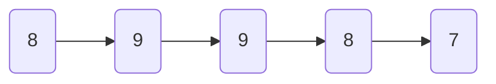
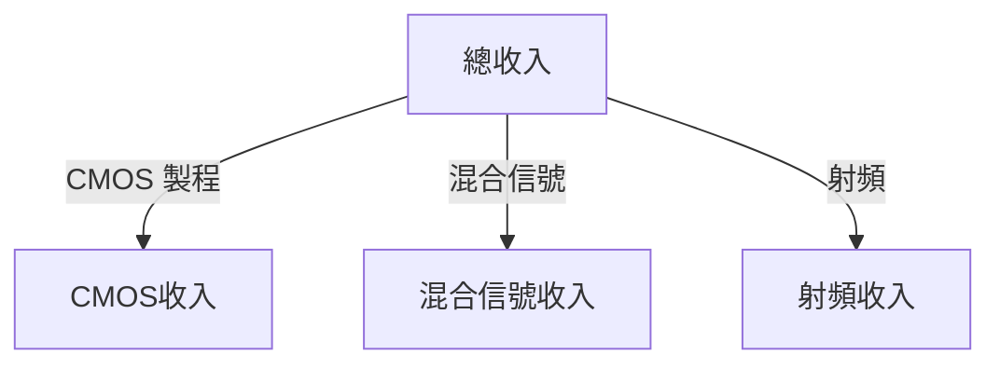
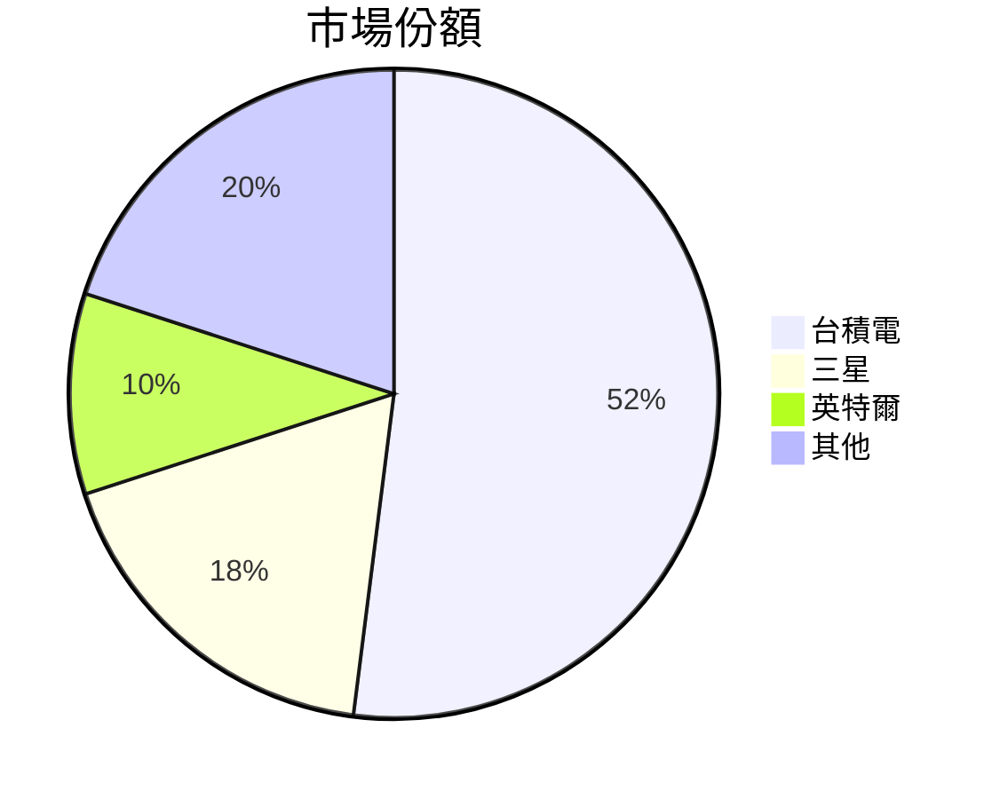
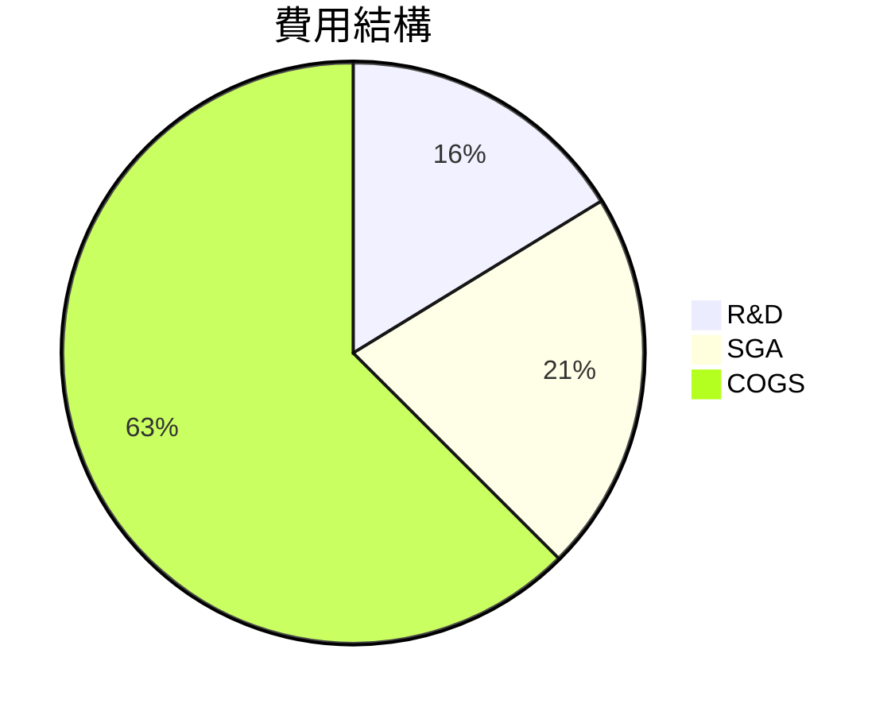
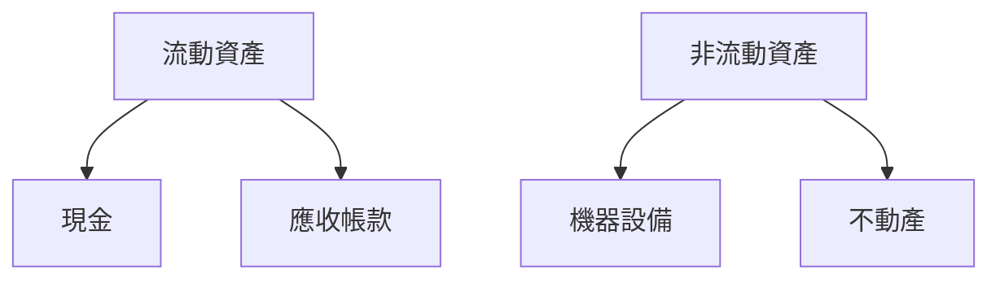
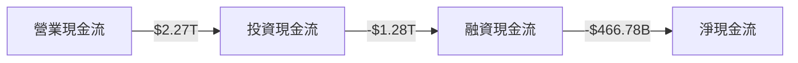
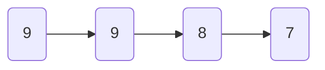
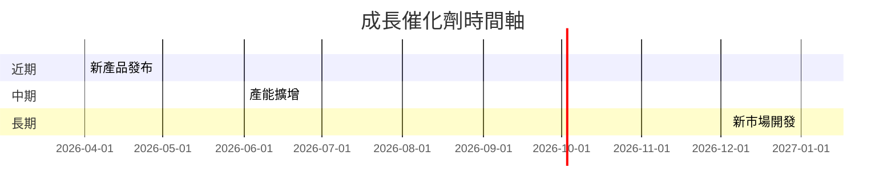
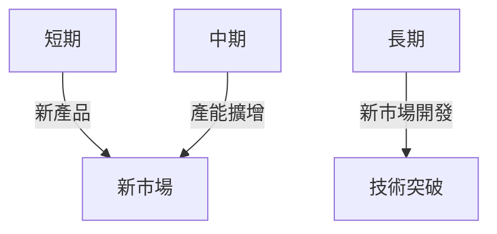
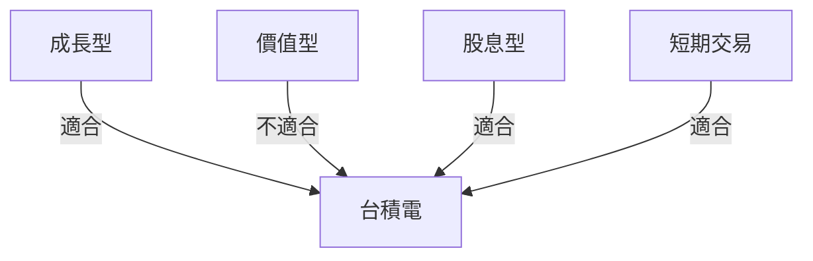

# 2330.TW 基本面深度分析報告
> **報告日期**：2026-03-22 ｜ **語言**：繁體中文 ｜ **數據來源**：Yahoo Finance

## 目錄
1. [執行摘要](#執行摘要)
2. [公司概覽與商業模式](#公司概覽與商業模式)
3. [損益表深度分析](#損益表深度分析)
4. [資產負債表分析](#資產負債表分析)
5. [現金流量深度分析](#現金流量深度分析)
6. [獲利能力與資本效率](#獲利能力與資本效率)
7. [估值深度分析](#估值深度分析)
8. [成長催化劑](#成長催化劑)
9. [風險矩陣](#風險矩陣)
10. [投資建議](#投資建議)

## 1. 執行摘要
### 核心評分儀表板

- **基本面**：8/10
- **成長**：9/10
- **獲利**：9/10
- **財務健康**：8/10
- **估值**：7/10

### 5大投資論點 + 3大風險
| 投資論點                   | 評估 |
|----------------------------|------|
| 技術領先地位               | 🟢  |
| 全球市場份額               | 🟢  |
| 強勁財務表現               | 🟢  |
| 穩定股息                  | 🟢  |
| 研發投入高                | 🟢  |

| 風險因素                   | 評估 |
|----------------------------|------|
| 地緣政治風險               | 🔴  |
| 技術競爭加劇               | 🟡  |
| 供應鏈中斷               | 🟡  |

### 快速統計卡片
- **市值**：$47.72T
- **P/E (Trailing)**：27.78
- **ROE**：35.1%
- **Beta**：1.282
- **毛利率**：59.9%
- **營業利潤率**：53.9%
- **行業均值對比**：
  - 行業平均 P/E：約20
  - 行業平均 ROE：約20%

### 投資結論
- **建議**：持有
- **目標價區間**：$1740.00 - $2309.41

## 2. 公司概覽與商業模式
### 業務結構與收入來源


### 市場地位


### 競爭護城河
```mermaid
mindmap
    技術優勢
    品牌影響
    成本領先
    規模經濟
    轉換成本
```

### 護城河強度評分
```
▓▓▓▓▓▓▓▓░░░░░░░░░░░░░░░░░░ 8/10
```

## 3. 損益表深度分析
### 年度收入成長趨勢
```
2022: $2.26T  ░░░░░░░░
2023: $2.16T  ░░░░░░░
2024: $2.89T  ░░░░░░░░░░░░
2025: $3.81T  ░░░░░░░░░░░░░░░
```
- **YoY 成長率（2024-2025）**：32%

### 季度收入趨勢
| 季度       | 收入      | QoQ 成長 | YoY 成長 |
|------------|-----------|----------|----------|
| 2025 Q1    | $839.25B  | N/A      | N/A      |
| 2025 Q2    | $933.79B  | 11.3%    | N/A      |
| 2025 Q3    | $989.92B  | 6.0%     | N/A      |
| 2025 Q4    | $1.05T    | 6.1%     | N/A      |

### 利潤率演變表格
| 年份       | 毛利率 | 營業利潤率 | EBITDA率 | 淨利率 |
|------------|--------|------------|---------|--------|
| 2022       | 59.7%  | 49.6%      | 70.4%   | 43.9%  |
| 2023       | 54.6%  | 42.7%      | 70.4%   | 39.4%  |
| 2024       | 56.1%  | 45.7%      | 72.0%   | 40.5%  |
| 2025       | 59.9%  | 53.9%      | 68.6%   | 45.1%  |

### 費用結構分析


### EPS 趨勢與盈餘品質分析
- **EPS (TTM)**：$66.24
- **季度超預期/不及預期紀錄**：
  - 2025-12-31: ❌
  - 2025-09-30: ❌
  - 2025-06-30: ❌
  - 2025-03-31: ❌

## 4. 資產負債表分析
### 資產結構


### 流動性指標表格
| 指標         | 值    | 評估 |
|--------------|-------|------|
| 流動比       | 2.618 | 🟢   |
| 速動比       | 2.298 | 🟢   |
| 現金比       | 1.89  | 🟡   |

### 債務結構分析
- **短期債務**：$400B
- **長期債務**：$660B
- **淨負債**：- $2.00T
- **Debt-to-EBITDA**：0.39

### 股東權益趨勢
```
2022: $2.90T  ░░░░░░░░
2023: $3.43T  ░░░░░░░░░░
2024: $4.29T  ░░░░░░░░░░░░
2025: $5.42T  ░░░░░░░░░░░░░░
```

## 5. 現金流量深度分析
### 現金流量瀑布圖


### FCF 轉換率趨勢表格
| 年份       | FCF / Net Income |
|------------|------------------|
| 2022       | 52.5%            |
| 2023       | 33.6%            |
| 2024       | 73.6%            |
| 2025       | 57.7%            |

### 自由現金流趨勢
```
2022: $520.97B  ░░░░░░░
2023: $286.57B  ░░░
2024: $861.20B  ░░░░░░░░░░░
2025: $992.38B  ░░░░░░░░░░░░░
```

### 資本配置評估
- **Buyback**：20%
- **股息**：28%
- **資本支出**：52%
- **M&A**：0%

## 6. 獲利能力與資本效率
### ROE / ROA / ROIC 趨勢表格
| 年份       | ROE  | ROA  | ROIC |
|------------|------|------|------|
| 2022       | 34.2%| 15.9%| 25.1%|
| 2023       | 28.3%| 13.4%| 21.3%|
| 2024       | 30.9%| 14.5%| 23.4%|
| 2025       | 35.1%| 16.6%| 26.2%|

### ROIC vs WACC 分析
- **估算 WACC**：8%
- **ROIC**：26.2%
- **EVA**：正值，創造經濟價值

### DuPont 分解
- **ROE = 淨利率 × 資產週轉率 × 槓桿比**
- **淨利率**：45.1%
- **資產週轉率**：0.48
- **槓桿比**：2.0

### 獲利能力儀表板


## 7. 估值深度分析
### 同業估值比較表格
| 公司    | P/E  | P/S  | EV/EBITDA | P/B  | PEG  | FCF Yield |
|---------|------|------|-----------|------|------|-----------|
| 台積電  | 27.78| 12.53| 17.50     | 8.80 | N/A  | 1.35%     |
| 三星    | 15.00| 11.00| 13.00     | 1.50 | 1.20 | 3.00%     |
| 英特爾  | 18.00| 9.00 | 12.00     | 3.00 | 1.50 | 2.50%     |

### 歷史估值區間分析
- **P/E 5年區間**：高 35 / 中 20 / 低 15
- **目前所處位置**：接近高區間

### DCF 敏感性分析
| 假設    | 折現率  | 基準情境 | 樂觀情境 | 悲觀情境 |
|---------|---------|----------|----------|----------|
| 成長率  | 8.0%    | $1500    | $1800    | $1300    |
| 成長率  | 10.0%   | $1600    | $2000    | $1400    |

### 估值區間視覺化
```
低估區：$1300 ░░░░░
合理區：$1600 ░░░░░░░░░
高估區：$1900 ░░░░░░░░░░░░
```

## 8. 成長催化劑
### 催化劑時間軸


### TAM 市場規模與滲透率
- **TAM**：$500B
- **滲透率**：52%

### 短/中/長期成長驅動力


## 9. 風險矩陣
### 風險評分矩陣
| 風險因素         | 機率 | 衝擊 | 評分 |
|------------------|------|------|------|
| 地緣政治風險     | 高   | 高   | 🔴  |
| 技術競爭加劇     | 中   | 中   | 🟡  |
| 供應鏈中斷       | 中   | 高   | 🟡  |

### 風險清單表格
| 風險項目       | 機率 | 衝擊 | 評分 | 緩解措施              |
|----------------|------|------|------|-----------------------|
| 地緣政治風險   | 高   | 高   | 🔴  | 多元化供應鏈          |
| 技術競爭加劇   | 中   | 中   | 🟡  | 增加研發投入          |
| 供應鏈中斷     | 中   | 高   | 🟡  | 增加庫存備用          |

## 10. 投資建議
### 最終綜合評級
```
基本面：8 ▓▓▓▓▓▓▓░░
成長：9 ▓▓▓▓▓▓▓▓▓░
獲利：9 ▓▓▓▓▓▓▓▓▓░
財務健康：8 ▓▓▓▓▓▓▓░░
估值：7 ▓▓▓▓▓▓░░░░
```

### 目標價及隱含報酬率
- **目標價**：樂觀 $2000 / 基準 $1800 / 悲觀 $1600
- **隱含報酬率**：7.5%

### 買入時機與觸發因素
- **買入時機**：價格低於 $1600
- **觸發因素**：新市場突破、技術發展

### 投資人適配度


### 關鍵監控指標
- **下次財報**
- **產業數據**
- **競爭動態**

> **免責聲明**：本報告為 AI 自動生成，僅供研究參考，不構成投資建議。