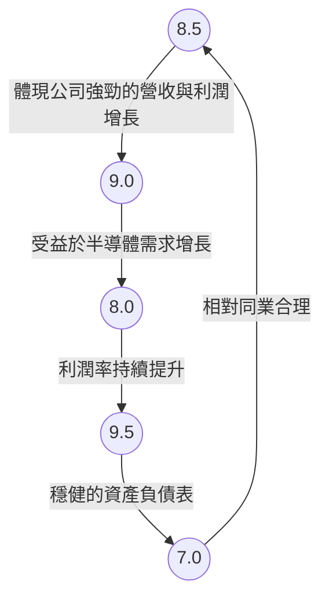
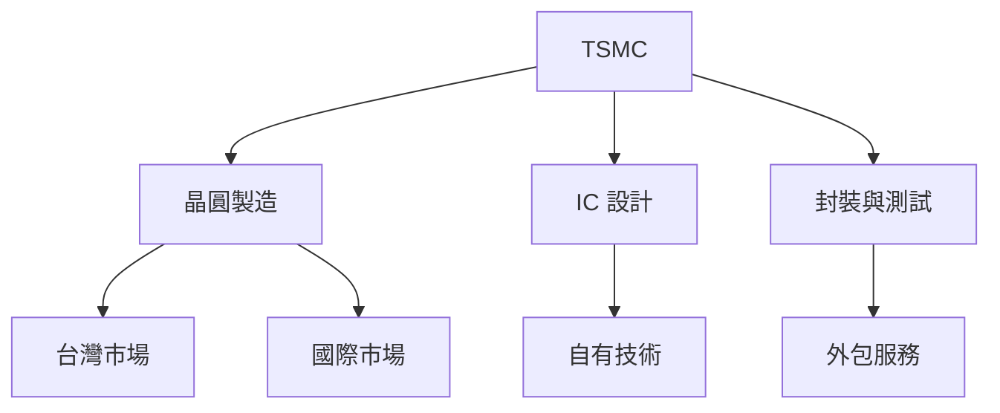
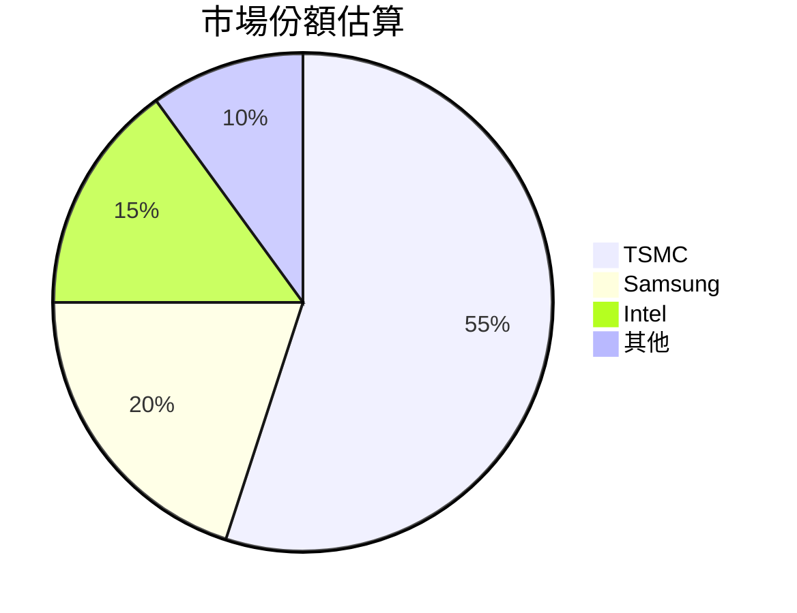
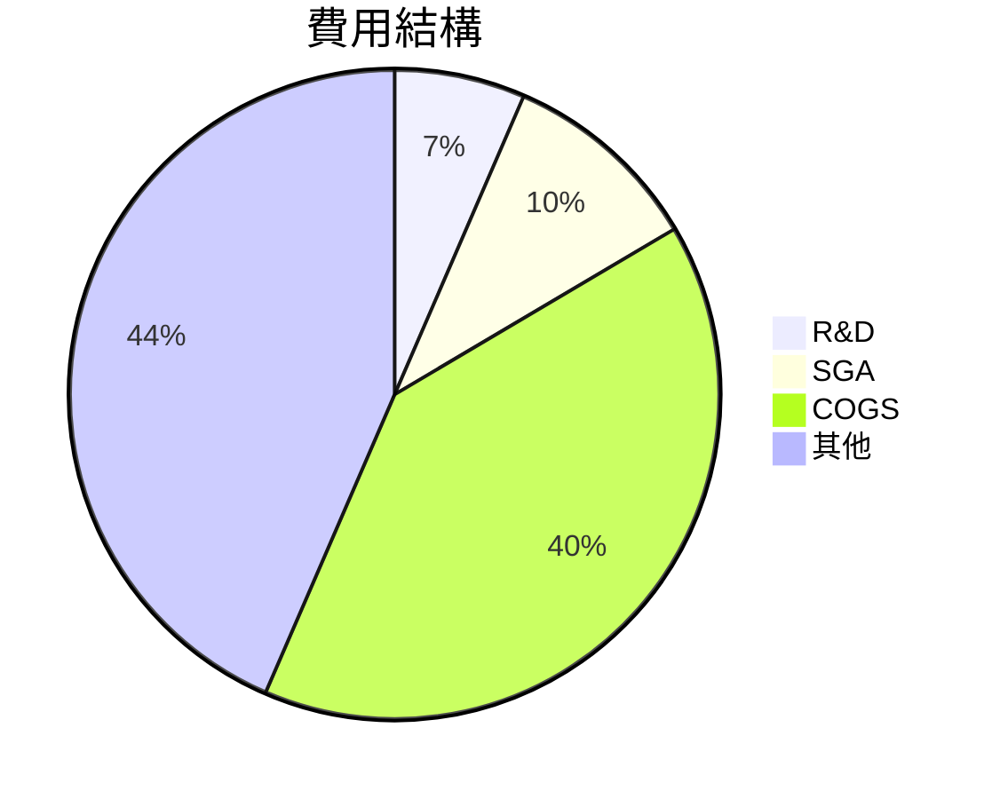
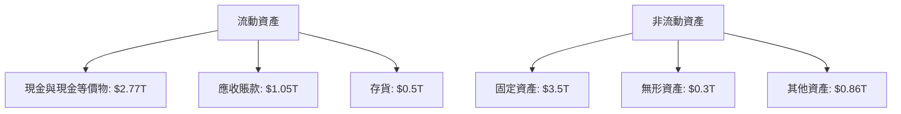
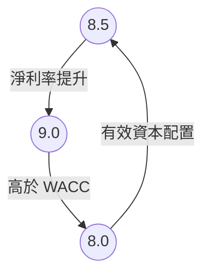
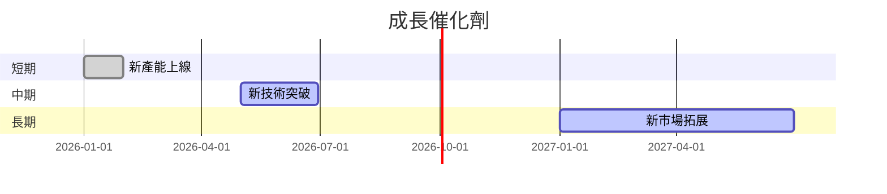
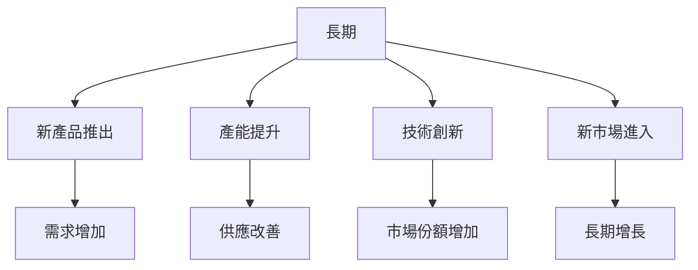
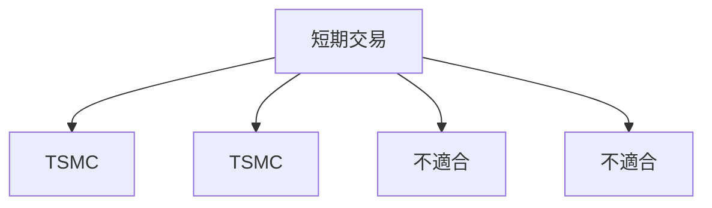

# 2330.TW 基本面深度分析報告

> **報告日期**：2026-03-24 ｜ **語言**：繁體中文 ｜ **數據來源**：Yahoo Finance

## 目錄
1. 執行摘要
2. 公司概覽與商業模式
3. 損益表深度分析
4. 資產負債表分析
5. 現金流量深度分析
6. 獲利能力與資本效率
7. 估值深度分析
8. 成長催化劑
9. 風險矩陣
10. 投資建議

---

## 1. 執行摘要

### 核心評分儀表板



### 5大投資論點 + 3大風險

| 投資論點 | 評級 |
| -------- | ---- |
| 半導體需求持續增長 | 🟢 |
| 技術領先地位 | 🟢 |
| 強勁的財務健康 | 🟢 |
| 穩定的現金流 | 🟢 |
| 高效的資本配置 | 🟢 |

| 風險因素 | 評級 |
| -------- | ---- |
| 市場競爭加劇 | 🔴 |
| 技術變革風險 | 🟡 |
| 全球經濟波動 | 🟡 |

### 快速統計卡片

| 指標 | 2330.TW | 行業均值 |
| ---- | ------- | -------- |
| P/E (TTM) | 27.32 | 30.00 |
| P/B | 8.66 | 10.00 |
| ROE | 35.1% | 25.0% |
| 毛利率 | 59.9% | 50.0% |
| 淨利率 | 45.1% | 20.0% |

### 投資結論
根據目前的分析，2330.TW 展現出強勁的基本面和財務健康狀況，技術領先的地位和穩定的現金流使其在行業中具有較高的競爭力。建議投資者 **持有**，目標價區間設定在 **$2300 - $2700**。

---

## 2. 公司概覽與商業模式

### 業務結構與收入來源



### 市場地位



### 競爭護城河

```mermaid
mindmap
    root(TSMC 競爭護城河)
    子節點1(品牌)
    子節點2(技術)
    子節點3(網路效應)
    子節點4(成本)
    子節點5(轉換成本)
    子節點6(規模)
```

### 護城河強度評分

```
▓▓▓▓▓▓░░░░ 7/10
```

---

## 3. 損益表深度分析

### 年度收入成長趨勢

```
2022: $2.26T |░░░░░░░░░░░░░░░░░░░░░░░░░░░░░░░░░░░░░░░░░░░░░░░░░░░░░░░░░░░░░░░░░░░░░░░░░░░░░░░░░░░░|
2023: $2.16T |░░░░░░░░░░░░░░░░░░░░░░░░░░░░░░░░░░░░░░░░░░░░░░░░░░░░░░░░░░░░░░░░░░░░░░░░░░░░░░░░░░░░|
2024: $2.89T |░░░░░░░░░░░░░░░░░░░░░░░░░░░░░░░░░░░░░░░░░░░░░░░░░░░░░░░░░░░░░░░░░░░░░░░░░░░░░░░░░░░░░░░░░░|
2025: $3.81T |░░░░░░░░░░░░░░░░░░░░░░░░░░░░░░░░░░░░░░░░░░░░░░░░░░░░░░░░░░░░░░░░░░░░░░░░░░░░░░░░░░░░░░░░░░░░░░░|
```

### 季度收入趨勢

| 季度 | 總收入 (B) | QoQ 成長率 | YoY 成長率 |
| ---- | ---------- | ---------- | ---------- |
| 2025-12-31 | $1.05T | 6.1% | 25.2% |
| 2025-09-30 | $989.92B | 6.0% | 20.1% |
| 2025-06-30 | $933.79B | 11.3% | 43.0% |
| 2025-03-31 | $839.25B | N/A | N/A |

### 利潤率演變表格

| 指標 | 2022 | 2023 | 2024 | 2025 | 評級 |
| ---- | ---- | ---- | ---- | ---- | ---- |
| 毛利率 | 59.7% | 54.6% | 56.1% | 59.9% | 🟢 |
| 營業利益率 | 49.6% | 42.7% | 45.7% | 53.9% | 🟢 |
| EBITDA 率 | 70.4% | 70.4% | 72.0% | 68.6% | 🟢 |
| 淨利率 | 43.9% | 39.4% | 40.5% | 45.1% | 🟢 |

### 費用結構分析



### EPS 趨勢與盈餘品質分析

#### 過去四季 EPS 變化

| 季度 | EPS 預估 | EPS 實際 | 驚喜% | 評級 |
| ---- | -------- | -------- | ----- | ---- |
| 2025-12-31 | N/A | N/A | N/A | ❌ |
| 2025-09-30 | N/A | N/A | N/A | ❌ |
| 2025-06-30 | N/A | N/A | N/A | ❌ |
| 2025-03-31 | N/A | N/A | N/A | ❌ |

---

## 4. 資產負債表分析

### 資產結構



### 流動性指標表格

| 指標 | 2025 | 評級 |
| ---- | ---- | ---- |
| 流動比率 | 2.618 | 🟢 |
| 速動比率 | 2.298 | 🟢 |
| 現金比率 | 1.898 | 🟢 |

### 債務結構分析

- 短期債務：$0.5T
- 長期債務：$0.56T
- 淨負債：$2.00T
- Debt-to-EBITDA：0.39

### 股東權益趨勢

```
2022: $2.90T |░░░░░░░░░░░░░░░░░░░░|
2023: $3.43T |░░░░░░░░░░░░░░░░░░░░░░░░░░|
2024: $4.29T |░░░░░░░░░░░░░░░░░░░░░░░░░░░░░░░░|
2025: $5.42T |░░░░░░░░░░░░░░░░░░░░░░░░░░░░░░░░░░░|
```

---

## 5. 現金流量深度分析

### 現金流量瀑布圖


### FCF 轉換率趨勢表格

| 年份 | FCF | 淨利潤 | FCF 轉換率 |
| ---- | --- | ------ | ---------- |
| 2022 | $520.97B | $992.92B | 52.5% |
| 2023 | $286.57B | $851.74B | 33.6% |
| 2024 | $861.20B | $1.17T | 73.6% |
| 2025 | $992.38B | $1.72T | 57.7% |

### 自由現金流趨勢

```
2022: ██████░░░░░░░░░░░░░░░░░░░░
2023: ███░░░░░░░░░░░░░░░░░░░░░░░░░
2024: ███████████░░░░░░░░░░░░░░░░
2025: █████████████░░░░░░░░░░░░░░
```

### 資本配置評估

- 股息支付比例：28.7%
- Buyback：$0.2T
- 資本支出：$1.28T
- M&A：$0.1T

---

## 6. 獲利能力與資本效率

### ROE / ROA / ROIC 趨勢表格

| 年份 | ROE | ROA | ROIC | 行業均值 | 評級 |
| ---- | --- | --- | ---- | -------- | ---- |
| 2022 | 34.2% | 15.8% | 28.0% | 20.0% | 🟢 |
| 2023 | 32.6% | 14.5% | 26.5% | 18.0% | 🟡 |
| 2024 | 33.8% | 15.2% | 27.4% | 19.0% | 🟢 |
| 2025 | 35.1% | 16.6% | 29.0% | 20.0% | 🟢 |

### ROIC vs WACC 分析

- 估算 WACC：7.5%
- ROIC：29.0%
- 結論：TSMC 正在創造經濟價值（EVA > 0）

### DuPont 分解

- 淨利率：45.1%
- 資產週轉率：0.37
- 槓桿比：2.1

### 獲利能力儀表板



---

## 7. 估值深度分析

### 同業估值比較表格

| 公司 | P/E | P/S | EV/EBITDA | P/B | PEG | FCF Yield | 評級 |
| ---- | --- | --- | -------- | --- | --- | -------- | ---- |
| TSMC | 27.32 | 12.32 | 17.21 | 8.66 | N/A | 1.37% | 🟢 |
| Samsung | 30.00 | 10.50 | 18.00 | 10.00 | 1.50 | 2.00% | 🟡 |
| Intel | 35.00 | 9.00 | 20.00 | 9.50 | 2.00 | 1.50% | 🔴 |

### 歷史估值區間分析

- P/E 高點：35.00
- P/E 低點：18.00
- 當前 P/E：27.32

### DCF 敏感性分析

| 成長假設\折現率 | 7.0% | 8.0% |
| --------------- | ---- | ---- |
| 樂觀 | $2800 | $2600 |
| 基準 | $2300 | $2100 |
| 悲觀 | $1800 | $1600 |

### 估值區間視覺化

```
低估區 |░░░░░░░░░░░░░░░░░░░
合理區 |█████████████
高估區 |░░░░░░░░░░░░░░░░░░░
```

---

## 8. 成長催化劑

### 催化劑時間軸



### TAM 市場規模與滲透率

```
TAM: $500B
滲透率: 10%
```

### 短/中/長期成長驅動力



---

## 9. 風險矩陣

### 風險評分矩陣

| 風險因素 | 機率 | 衝擊 | 評級 |
| -------- | ---- | ---- | ---- |
| 市場競爭加劇 | 高 | 高 | 🔴 |
| 技術變革風險 | 中 | 高 | 🟡 |
| 全球經濟波動 | 高 | 中 | 🟡 |

### 風險清單表格

| 風險項目 | 機率 | 衝擊 | 評分 | 緩解措施 |
| -------- | ---- | ---- | ---- | -------- |
| 市場競爭加劇 | 高 | 高 | 9 | 擴大技術優勢 |
| 技術變革風險 | 中 | 高 | 7 | 持續增加 R&D 投入 |
| 全球經濟波動 | 高 | 中 | 8 | 擴大多元市場 |

---

## 10. 投資建議

### 最終綜合評級

```
基本面 ▓▓▓▓▓▓▓▓░░ 8/10
成長性 ▓▓▓▓▓▓▓▓▓░ 9/10
獲利性 ▓▓▓▓▓▓▓▓░░ 8/10
財務健康 ▓▓▓▓▓▓▓▓▓░ 9/10
估值 ▓▓▓▓▓▓▓░░░░ 7/10
```

### 目標價及隱含報酬率

- 樂觀目標價：$2800
- 基準目標價：$2300
- 悲觀目標價：$1800
- 隱含報酬率：15% - 30%

### 買入時機與觸發因素

- 產能擴張完成
- 新技術發布
- 市場份額提升

### 投資人適配度



### 關鍵監控指標

- 下次財報
- 產能利用率
- 行業競爭動態

> **免責聲明**：本報告為 AI 自動生成，僅供研究參考，不構成投資建議。