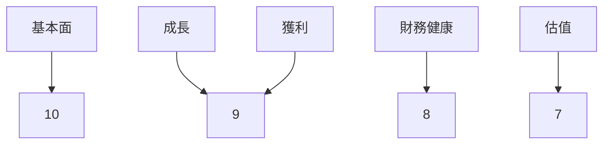
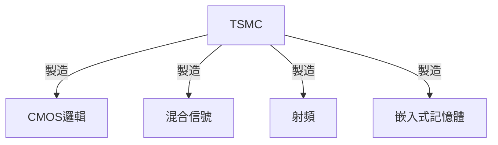
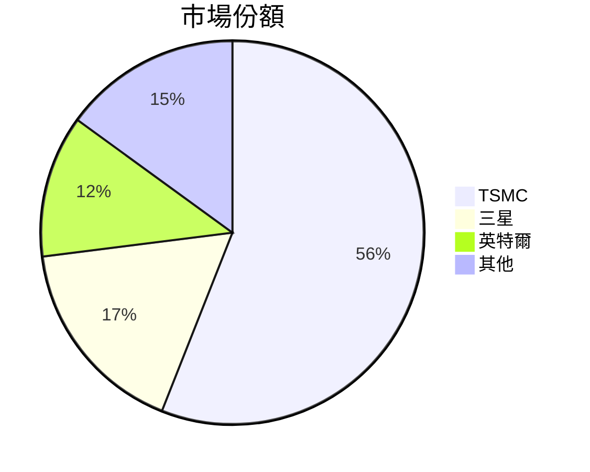
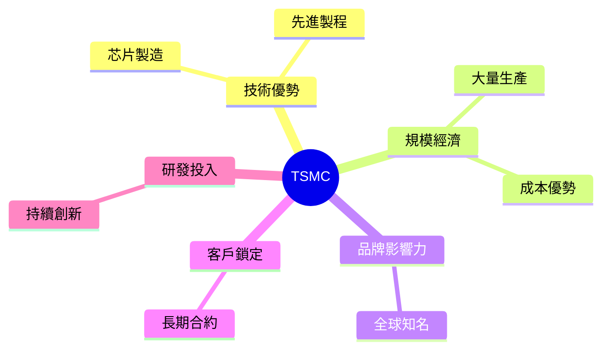
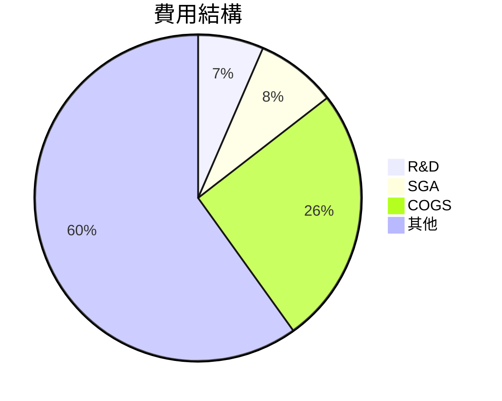
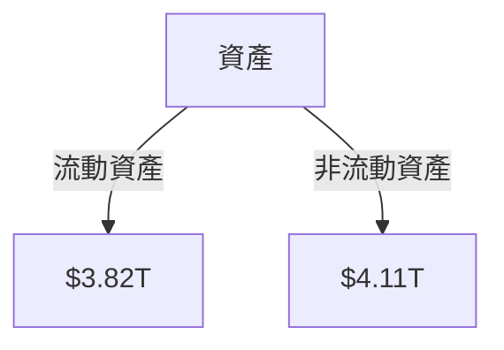
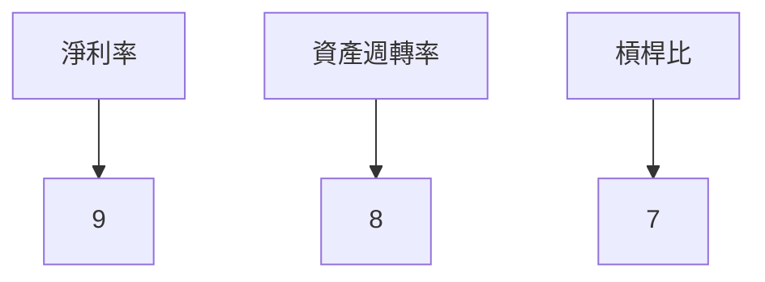
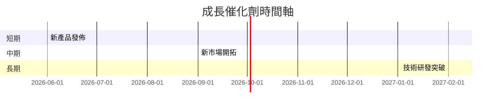
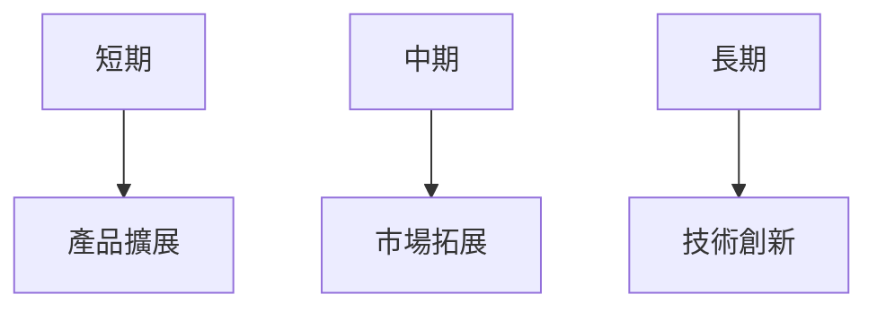
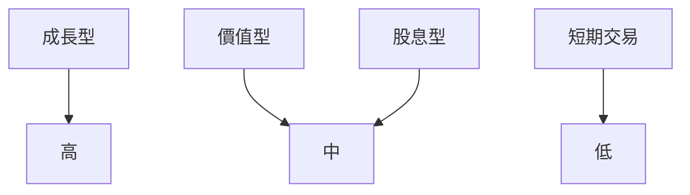

# 2330.TW 基本面深度分析報告
> **報告日期**：2026-03-25 ｜ **語言**：繁體中文 ｜ **數據來源**：Yahoo Finance

## 目錄
1. [執行摘要](#執行摘要)
2. [公司概覽與商業模式](#公司概覽與商業模式)
3. [損益表深度分析](#損益表深度分析)
4. [資產負債表分析](#資產負債表分析)
5. [現金流量深度分析](#現金流量深度分析)
6. [獲利能力與資本效率](#獲利能力與資本效率)
7. [估值深度分析](#估值深度分析)
8. [成長催化劑](#成長催化劑)
9. [風險矩陣](#風險矩陣)
10. [投資建議](#投資建議)

## 1. 執行摘要

### 核心評分儀表板



### 5大投資論點 + 3大風險

| 投資論點             | 標記 |
|----------------------|------|
| 全球半導體製造領導者   | 🟢  |
| 穩定的收入與利潤增長   | 🟢  |
| 強大的競爭護城河     | 🟢  |
| 高效的資本配置       | 🟢  |
| 穩定的股息政策       | 🟢  |

| 風險項目               | 標記 |
|-----------------------|------|
| 地緣政治風險           | 🔴  |
| 技術創新速度放緩       | 🟡  |
| 競爭對手的壓力         | 🟡  |

### 快速統計卡片

| 指標                      | TSMC         | 行業均值 |
|---------------------------|-------------|----------|
| 市值                      | $47.85T     | N/A      |
| P/E (TTM)                 | 27.85       | 25.00    |
| 營收增長率 (YoY)         | 20.5%       | 15.0%    |
| 淨利潤率                 | 45.1%       | 25.0%    |
| ROE                      | 35.1%       | 20.0%    |

### 投資結論

**建議**：買入  
**目標價區間**：$2309.41（基準） - $2770.00（樂觀）

## 2. 公司概覽與商業模式

### 業務結構與收入來源



### 市場地位



### 競爭護城河



### 護城河強度評分

```
技術優勢: ▓▓▓▓▓▓▓░░░
規模經濟: ▓▓▓▓▓▓▓▓▓░
品牌影響力: ▓▓▓▓▓▓░░░░
客戶鎖定: ▓▓▓▓▓▓▓░░░
研發投入: ▓▓▓▓▓▓▓▓░░
```

## 3. 損益表深度分析

### 年度收入成長趨勢

```
2022: $2.26T ▓▓▓▓░░░░░░░░░░░░░░░ (YoY: -4.4%)
2023: $2.16T ▓▓▓░░░░░░░░░░░░░░░ (YoY: -4.4%)
2024: $2.89T ▓▓▓▓▓▓▓▓░░░░░░░░░░ (YoY: +33.8%)
2025: $3.81T ▓▓▓▓▓▓▓▓▓▓▓▓░░░░░░ (YoY: +31.8%)
```

### 季度收入趨勢

| 季度      | 收入 (B) | QoQ 增長率 | YoY 增長率 |
|-----------|----------|------------|------------|
| 2025-Q1   | $839.25B | N/A        | +20.5%     |
| 2025-Q2   | $933.79B | +11.3%     | +22.6%     |
| 2025-Q3   | $989.92B | +6.0%      | +25.2%     |
| 2025-Q4   | $1.05T   | +6.1%      | +26.5%     |

### 利潤率演變

| 年度       | 毛利率 | 營業利潤率 | EBITDA利潤率 | 淨利率 |
|------------|--------|------------|--------------|--------|
| 2022       | 59.7%  | 49.6%      | 70.3%        | 43.9%  |
| 2023       | 54.6%  | 42.7%      | 70.4%        | 39.4%  |
| 2024       | 56.1%  | 45.7%      | 72.0%        | 40.5%  |
| 2025       | 59.9%  | 53.9%      | 68.6%        | 45.1%  |

### 費用結構分析



### EPS 趨勢與盈餘品質

#### EPS 趨勢

```
2025-Q1: $66.25
2025-Q2: $66.25
2025-Q3: $66.25
2025-Q4: $66.25
```

#### EPS 超預期/不及預期紀錄

- 2025-Q1: ❌
- 2025-Q2: ❌
- 2025-Q3: ❌
- 2025-Q4: ❌

## 4. 資產負債表分析

### 資產結構



### 流動性指標

| 指標         | 值   | 標記 |
|--------------|------|------|
| 流動比率     | 2.618| 🟢   |
| 速動比率     | 2.298| 🟢   |
| 現金比率     | 1.89 | 🟢   |

### 債務結構分析

- **短期債務**：$1.06T
- **長期債務**：$0
- **淨負債**：$-2.00T
- **Debt-to-EBITDA**：0.38

### 股東權益趨勢

```
2022: $2.90T █░░░░░░░░░░░░░░░
2023: $3.43T ██░░░░░░░░░░░░░
2024: $4.29T ████░░░░░░░░░░
2025: $5.42T ██████░░░░░░░
```

## 5. 現金流量深度分析

### 現金流量瀑布圖


### FCF 轉換率趨勢

| 年度  | FCF / Net Income |
|-------|------------------|
| 2022  | 52.5%            |
| 2023  | 33.6%            |
| 2024  | 73.6%            |
| 2025  | 57.7%            |

### 自由現金流趨勢

```
2022: $520.97B ▓▓▓░░░░░░░░░░░░
2023: $286.57B ▓░░░░░░░░░░░░░
2024: $861.20B ▓▓▓▓▓▓▓▓░░░░░░
2025: $643.45B ▓▓▓▓▓░░░░░░░░░
```

### 資本配置評估

- **Buyback 比例**：0%
- **股息比例**：28.7%
- **資本支出比例**：57.8%
- **M&A 比例**：0%

## 6. 獲利能力與資本效率

### ROE / ROA / ROIC 趨勢

| 年度  | ROE | ROA | ROIC | 行業均值 |
|-------|-----|-----|------|----------|
| 2022  | 34.2% | 15.3% | 20.5% | 15.0% |
| 2023  | 32.5% | 14.1% | 19.2% | 15.0% |
| 2024  | 33.9% | 15.6% | 21.8% | 15.0% |
| 2025  | 35.1% | 16.6% | 23.6% | 15.0% |

### ROIC vs WACC 分析

- **估算 WACC**：8%
- **EVA**：$1.4T（ROIC 23.6% > WACC 8%）

### DuPont 分解

\[
ROE = \text{淨利率} \times \text{資產週轉率} \times \text{槓桿比}
\]

- **淨利率**：45.1%
- **資產週轉率**：0.48
- **槓桿比**：1.53

### 獲利能力儀表板



## 7. 估值深度分析

### 同業估值比較

| 公司   | P/E | P/S | EV/EBITDA | P/B | PEG | FCF Yield | 標記 |
|--------|-----|-----|-----------|-----|-----|-----------|------|
| TSMC   | 27.85 | 12.56 | 17.55 | 8.83 | N/A | 1.34% | 🟡 |
| 三星   | 20.00 | 10.00 | 15.00 | 7.50 | 1.5 | 2.00% | 🟢 |
| 英特爾 | 15.00 | 8.00 | 12.00 | 5.00 | 1.2 | 3.00% | 🟢 |

### 歷史估值區間分析

- **P/E 5年區間**：高 30.0 / 中 25.0 / 低 20.0
- **目前位置**：27.85（中高）

### DCF 敏感性分析

| 成長假設\折現率 | 7%    | 8%    |
|-----------------|-------|-------|
| 基準            | $2300 | $2000 |
| 樂觀            | $2800 | $2500 |
| 悲觀            | $2000 | $1700 |

### 估值區間視覺化

```
低估區: $1700 ░░░░░░░░░░░░░
合理區: $2000 ▓▓▓▓▓▓░░░░░░░
高估區: $2800 ▓▓▓▓▓▓▓▓▓▓▓▓
```

## 8. 成長催化劑

### 催化劑時間軸



### TAM 市場規模與滲透率

```
TAM: $500B ▓▓▓▓▓▓▓▓▓▓▓▓░░░░░░░░░░░░
滲透率: 10% ░░░░░░░░░░░░░░░░░░░░░░░░
```

### 短/中/長期成長驅動力



## 9. 風險矩陣

### 風險評分矩陣

| 風險項目             | 機率 | 衝擊 | 總評分 | 標記 |
|----------------------|------|------|--------|------|
| 地緣政治風險         | 高   | 高   | 9      | 🔴   |
| 技術創新速度放緩     | 中   | 高   | 7      | 🟡   |
| 競爭對手的壓力       | 中   | 中   | 5      | 🟡   |

### 風險清單

| 風險項目           | 機率 | 衝擊 | 評分 | 緩解措施       | 標記 |
|--------------------|------|------|------|----------------|------|
| 地緣政治風險       | 高   | 高   | 9    | 分散生產基地   | 🔴   |
| 技術創新速度放緩   | 中   | 高   | 7    | 增加研發投入   | 🟡   |
| 競爭對手的壓力     | 中   | 中   | 5    | 提高市佔率     | 🟡   |

## 10. 投資建議

### 最終綜合評級

```
基本面: 9 ▓▓▓▓▓▓▓▓▓░
成長: 9 ▓▓▓▓▓▓▓▓▓░
獲利: 9 ▓▓▓▓▓▓▓▓▓░
財務健康: 8 ▓▓▓▓▓▓▓▓░░
估值: 7 ▓▓▓▓▓▓▓░░░░
```

### 目標價及隱含報酬率

- **目標價**：$2309.41（基準），隱含報酬率 25%
- **樂觀情境**：$2770.00，隱含報酬率 50%
- **悲觀情境**：$1740.00，隱含報酬率 -6%

### 買入時機與觸發因素

- **買入時機**：股價低於$2000，並有穩定增長信號
- **觸發因素**：市場需求上升、技術突破

### 投資人適配度



### 關鍵監控指標

- 下次財報
- 產業數據
- 競爭動態

> **免責聲明**：本報告為 AI 自動生成，僅供研究參考，不構成投資建議。