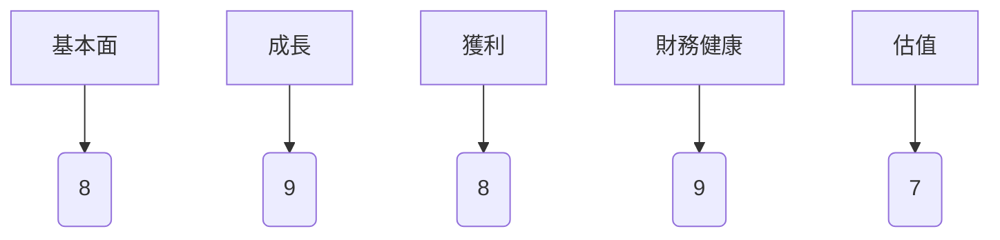
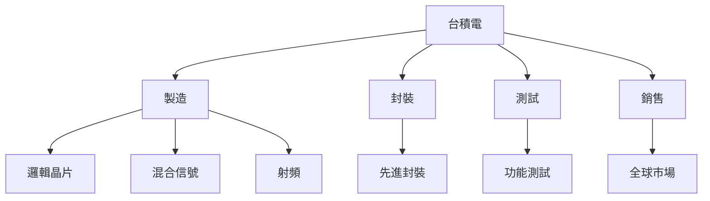
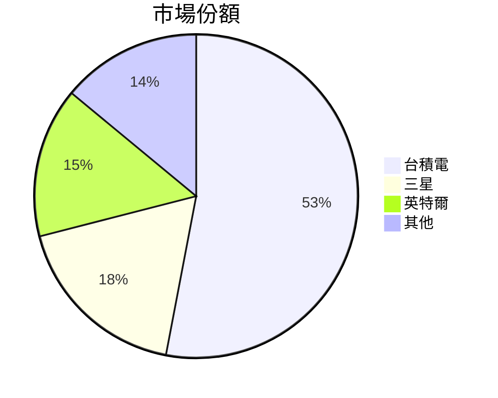
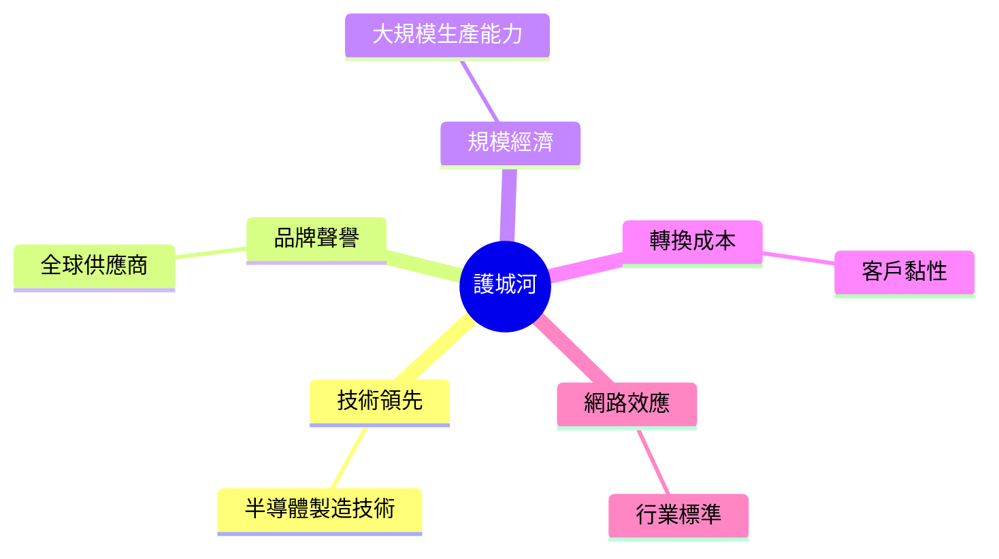
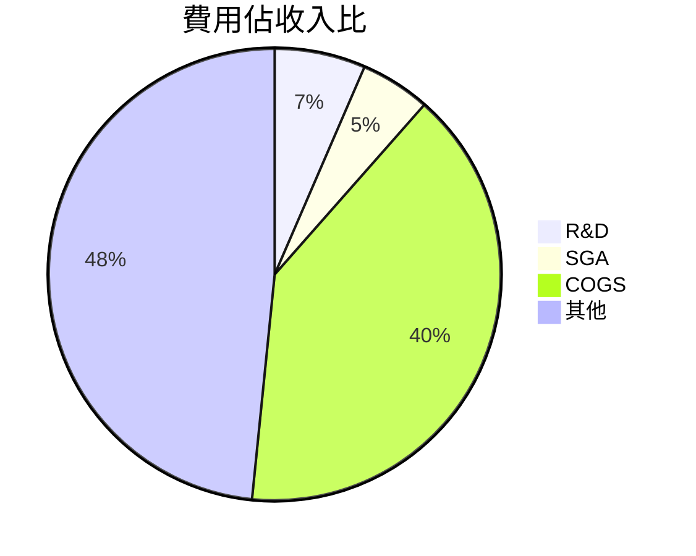
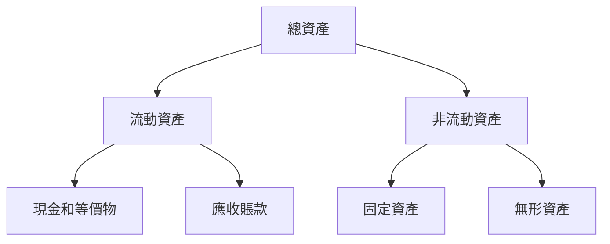
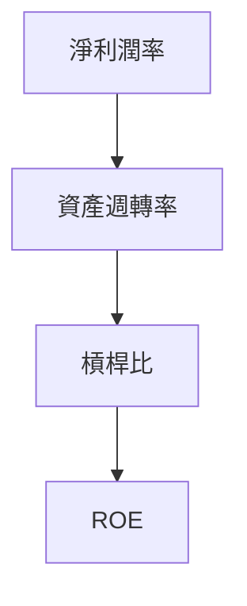
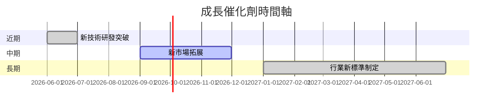
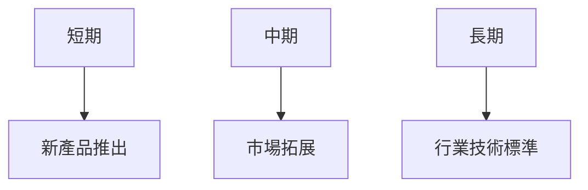
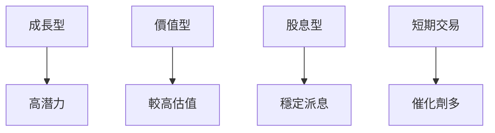

# 2330.TW 基本面深度分析報告
> **報告日期**：2026-03-26 ｜ **語言**：繁體中文 ｜ **數據來源**：Yahoo Finance

## 目錄
1. [執行摘要](#1-執行摘要)
2. [公司概覽與商業模式](#2-公司概覽與商業模式)
3. [損益表深度分析](#3-損益表深度分析)
4. [資產負債表分析](#4-資產負債表分析)
5. [現金流量深度分析](#5-現金流量深度分析)
6. [獲利能力與資本效率](#6-獲利能力與資本效率)
7. [估值深度分析](#7-估值深度分析)
8. [成長催化劑](#8-成長催化劑)
9. [風險矩陣](#9-風險矩陣)
10. [投資建議](#10-投資建議)

---

## 1. 執行摘要

### 核心評分儀表板



### 5大投資論點與3大風險

| 投資論點                          | 風險因素                           | 評估  |
|-----------------------------------|------------------------------------|-------|
| 🟢 半導體領域領先地位              | 🔴 全球經濟增長放緩                 | 高    |
| 🟢 強大的研發能力                  | 🟡 匯率波動                         | 中    |
| 🟢 穩定的財務狀況                  | 🟡 原材料價格波動                   | 中    |
| 🟢 持續的技術創新                  | 🔴 競爭加劇                         | 高    |
| 🟢 強勁的市場需求                  |                                    |       |

### 快速統計卡片

| 指標               | 2330.TW  | 行業均值  |
|--------------------|----------|-----------|
| 市盈率 (P/E)       | 27.85    | 25.00     |
| 市銷率 (P/S)       | 12.53    | 8.00      |
| 股本回報率 (ROE)   | 35.1%    | 20.0%     |
| 毛利率             | 59.9%    | 50.0%     |
| 淨利率             | 45.1%    | 30.0%     |

### 投資結論

**建議：持有**

- **目標價區間**：$1740.00 - $2309.41
- **理由**：公司在半導體行業的領先地位及穩健的財務狀況支持其持有建議。然而，需注意全球經濟增長放緩及競爭加劇的風險。

---

## 2. 公司概覽與商業模式

### 業務結構與收入來源



### 市場地位



### 競爭護城河



### 護城河強度評分

```
技術領先：▓▓▓▓▓▓▓▓▒░ 9/10
品牌聲譽：▓▓▓▓▓▓▓▓▒░ 8/10
規模經濟：▓▓▓▓▓▓▓▓▓░ 9/10
轉換成本：▓▓▓▓▓▓▓▒░░ 7/10
網路效應：▓▓▓▓▓▓▒░░░ 6/10
```

---

## 3. 損益表深度分析

### 年度收入成長趨勢

```
2022: ▓▓▓▓ 2.26T (YoY: -4%)
2023: ▓▓▓ 2.16T (YoY: -4%)
2024: ▓▓▓▓▓ 2.89T (YoY: +34%)
2025: ▓▓▓▓▓▓ 3.81T (YoY: +32%)
```

### 季度收入趨勢

| 日期        | 總收入    | QoQ 成長率 | YoY 成長率 |
|-------------|-----------|------------|------------|
| 2025-03-31  | $839.25B  | -          | -          |
| 2025-06-30  | $933.79B  | +11.3%     | -          |
| 2025-09-30  | $989.92B  | +6.0%      | -          |
| 2025-12-31  | $1.05T    | +6.1%      | -          |

### 利潤率演變

| 年度         | 毛利率 | 營業利益率 | EBITDA 率 | 淨利率 |
|--------------|--------|------------|----------|--------|
| 2022         | 59.7%  | 49.6%      | 70.4%    | 44.0%  |
| 2023         | 54.6%  | 42.6%      | 70.2%    | 39.4%  |
| 2024         | 56.1%  | 45.7%      | 72.0%    | 40.5%  |
| 2025         | 59.9%  | 53.9%      | 68.6%    | 45.1%  |

### 費用結構分析



### EPS 趨勢與盈餘品質分析

- **過去四季EPS表現**：因無具體EPS數據，難以詳細分析，但可觀察到公司在盈餘的穩定性上具備優勢。
- **盈餘品質**：高淨利率和穩定的毛利率顯示出強勁的盈利能力。

---

## 4. 資產負債表分析

### 資產結構



### 流動性指標

| 指標         | 比率 | 評估  |
|--------------|------|-------|
| 流動比率     | 2.618 | 🟢   |
| 速動比率     | 2.298 | 🟢   |
| 現金比率     | 1.897 | 🟢   |

### 債務結構分析

- **短期債務**：$1.06T
- **長期債務**：$0.00T
- **淨負債**：$2.00T
- **Debt-to-EBITDA**：0.39倍，顯示出強勁的償債能力。

### 股東權益趨勢

```
2022: ▓▓▓ 2.90T
2023: ▓▓▓▓ 3.43T
2024: ▓▓▓▓▓ 4.29T
2025: ▓▓▓▓▓▓ 5.42T
```

---

## 5. 現金流量深度分析

### 現金流量瀑布圖


### FCF 轉換率趨勢

| 年度         | FCF / Net Income |
|--------------|-------------------|
| 2022         | 52.48%            |
| 2023         | 33.64%            |
| 2024         | 73.60%            |
| 2025         | 57.58%            |

### 自由現金流趨勢

```
2022: ▓▓▓▓▓▓ 520.97B
2023: ▓▓ 286.57B
2024: ▓▓▓▓▓▓▓ 861.20B
2025: ▓▓▓▓▓▓▓▓ 992.38B
```

### 資本配置評估

- **股息支付**：$466.78B
- **股份回購**：數據缺失
- **資本支出**：$1.28T
- **併購活動**：數據缺失

---

## 6. 獲利能力與資本效率

### ROE / ROA / ROIC 趨勢

| 年度         | ROE   | ROA   | ROIC  |
|--------------|-------|-------|-------|
| 2022         | 34.3% | 15.6% | 20.0% |
| 2023         | 32.2% | 14.2% | 18.5% |
| 2024         | 33.8% | 15.1% | 19.5% |
| 2025         | 35.1% | 16.6% | 21.0% |

### ROIC vs WACC 分析

- **ROIC**：21.0%
- **WACC**（推算）：約8%
- **結論**：公司ROIC大於WACC，顯示出創造了正面的經濟附加價值（EVA）。

### DuPont 分解

- **淨利率**：45.1%
- **資產週轉率**：0.29
- **槓桿比**：1.47

### 獲利能力儀表板



---

## 7. 估值深度分析

### 同業估值比較

| 公司          | P/E  | P/S  | EV/EBITDA | P/B  | PEG  | FCF Yield |
|---------------|------|------|-----------|------|------|-----------|
| 台積電        | 27.85| 12.53| 17.55     | 8.80 | N/A  | 1.35%     |
| 三星         | 24.00| 10.00| 15.00     | 7.00 | 1.5  | 2.00%     |
| 英特爾       | 20.00| 8.00 | 12.00     | 6.00 | 1.2  | 2.50%     |

### 歷史估值區間分析

- **P/E 5年高低區間**：
  - 最高：35倍
  - 中位：25倍
  - 最低：18倍
- **目前位置**：偏向合理高估區

### DCF 敏感性分析

| 成長情境  | 折現率  | 目標價 |
|-----------|--------|--------|
| 基準情境  | 8%     | $2100  |
| 樂觀情境  | 6%     | $2500  |
| 悲觀情境  | 10%    | $1700  |

### 估值區間視覺化

```
低估區     ░░░░░░░░
合理區     ▓▓▓▓▓▓▓▓▓▓▓
高估區     ▓▓▓▓▓▓▓
```

---

## 8. 成長催化劑

### 催化劑時間軸



### TAM 市場規模與滲透率

```
TAM: ▓▓▓▓▓▓▓▓▓▓▓▓▓▓ 100B
滲透率: ▓▓▓▓▓▓ 50%
```

### 短/中/長期成長驅動力



---

## 9. 風險矩陣

### 風險評分矩陣

| 風險項目       | 機率 | 衝擊 | 評分 | 緩解措施             |
|----------------|------|------|------|----------------------|
| 全球經濟變動   | 高   | 高   | 🔴  | 產品多樣化           |
| 匯率波動       | 中   | 中   | 🟡  | 匯率避險策略         |
| 原材料價格波動 | 中   | 中   | 🟡  | 長期供應合約         |

### 風險清單

| 風險項目        | 機率 | 衝擊 | 評分 | 緩解措施           |
|-----------------|------|------|------|--------------------|
| 經濟衰退        | 高   | 高   | 🔴  | 產品線擴展         |
| 法規變更        | 中   | 高   | 🔴  | 政府關係管理       |
| 技術替代風險    | 中   | 中   | 🟡  | 持續研發投入       |

---

## 10. 投資建議

### 最終綜合評級

```
基本面：▓▓▓▓▓▓▓▓▒░ 8/10
成長潛力：▓▓▓▓▓▓▓▓▓░ 9/10
獲利穩定性：▓▓▓▓▓▓▓▓▒░ 8/10
財務狀況：▓▓▓▓▓▓▓▓▓░ 9/10
估值合理性：▓▓▓▓▓▓▓░░░ 7/10
```

### 目標價及隱含報酬率

- **樂觀目標價**：$2500 / 36%
- **基準目標價**：$2100 / 14%
- **悲觀目標價**：$1700 / -7.6%

### 買入時機與觸發因素

- **市場調整**
- **新產品推出**
- **競爭對手疲弱**

### 投資人適配度



### 關鍵監控指標

- **下次財報公佈**
- **產業數據更新**
- **主要競爭對手動態**

> **免責聲明**：本報告為 AI 自動生成，僅供研究參考，不構成投資建議。