# 2330.TW 基本面深度分析報告
> **報告日期**：2026-03-27 ｜ **語言**：繁體中文 ｜ **數據來源**：Yahoo Finance

## 目錄
1. [執行摘要](#1-執行摘要)
2. [公司概覽與商業模式](#2-公司概覽與商業模式)
3. [損益表深度分析](#3-損益表深度分析)
4. [資產負債表分析](#4-資產負債表分析)
5. [現金流量深度分析](#5-現金流量深度分析)
6. [獲利能力與資本效率](#6-獲利能力與資本效率)
7. [估值深度分析](#7-估值深度分析)
8. [成長催化劑](#8-成長催化劑)
9. [風險矩陣](#9-風險矩陣)
10. [投資建議](#10-投資建議)

---

## 1. 執行摘要

### 核心評分儀表板

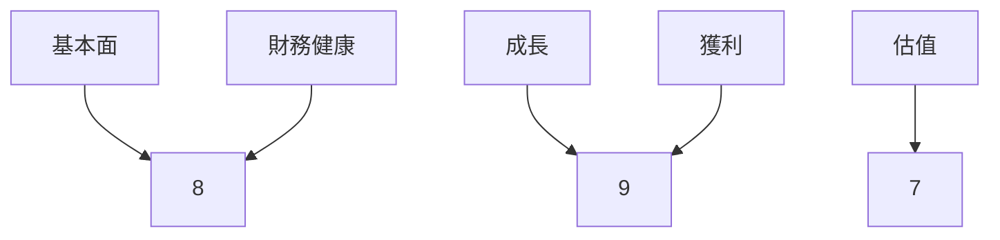

### 5大投資論點 + 3大風險

| 投資論點              | 評估  |
|-----------------------|-------|
| 技術領先              | 🟢   |
| 全球市場份額          | 🟢   |
| 財務穩健              | 🟢   |
| 高毛利率              | 🟢   |
| 產業趨勢有利          | 🟢   |

| 風險                  | 評估  |
|-----------------------|-------|
| 競爭加劇              | 🔴   |
| 經濟衰退風險          | 🟡   |
| 法規風險              | 🟡   |

### 快速統計卡片

| 指標             | 2330.TW | 行業均值 |
|------------------|---------|---------|
| 毛利率           | 59.9%   | 50%     |
| 淨利率           | 45.1%   | 10%     |
| ROE              | 35.1%   | 15%     |
| P/E (T)          | 27.48   | 20      |
| P/E (F)          | 16.50   | 18      |

### 投資結論
**建議**：買入  
**目標價區間**：$2,000 - $2,300

---

## 2. 公司概覽與商業模式

### 業務結構與收入來源

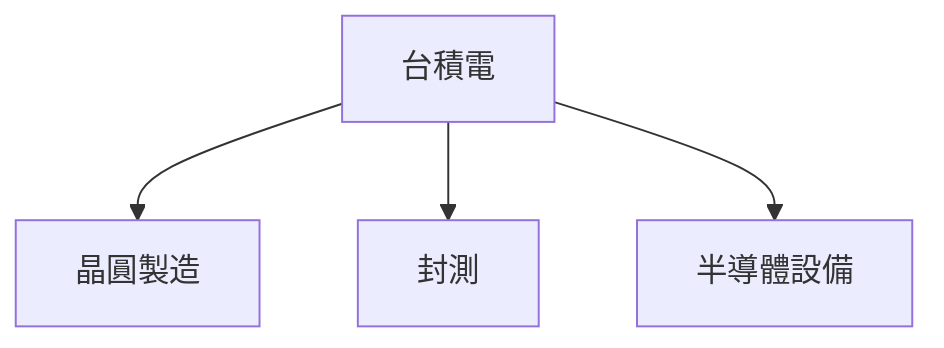

### 市場地位

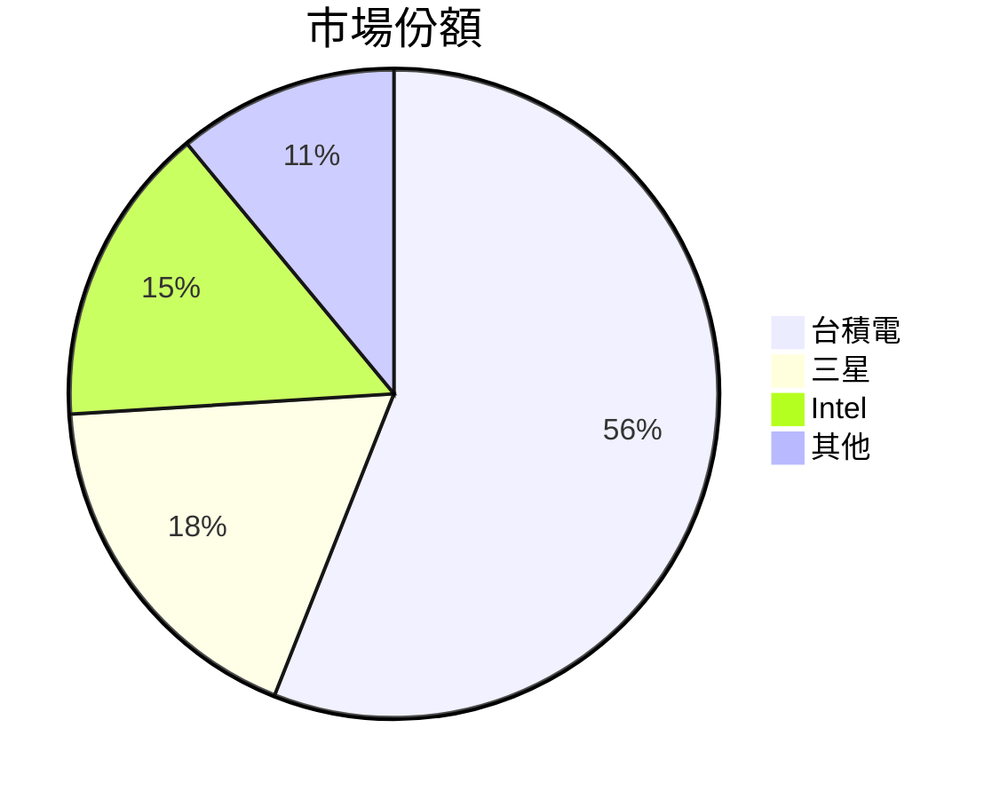

### 競爭護城河

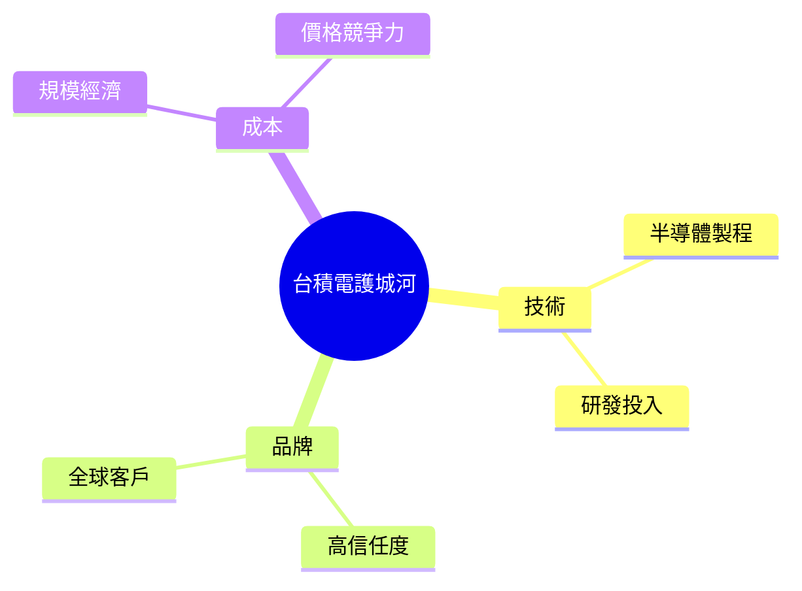

### 護城河強度評分

```
技術 ▓▓▓▓▓▓▓░░░ 7/10
品牌 ▓▓▓▓▓▓░░░░ 6/10
成本 ▓▓▓▓▓▓▓▓░░ 8/10
```

---

## 3. 損益表深度分析

### 年度收入成長趨勢

```
2022 ██████████ 2.26T
2023 ████████░░ 2.16T
2024 ██████████ 2.89T (+33.8%)
2025 ████████████ 3.81T (+31.8%)
```

### 季度收入趨勢

| 季度      | 收入    | QoQ 增長 | YoY 增長 |
|-----------|---------|----------|----------|
| 2025Q1    | 839.25B | N/A      | N/A      |
| 2025Q2    | 933.79B | 11.2%    | N/A      |
| 2025Q3    | 989.92B | 6.0%     | N/A      |
| 2025Q4    | 1.05T   | 6.1%     | N/A      |

### 利潤率演變表格

| 年度 | 毛利率 | 營業利益率 | EBITDA率 | 淨利率 |
|------|--------|------------|----------|--------|
| 2022 | 59.7%  | 49.6%      | 70.4%    | 44.0%  |
| 2023 | 54.6%  | 42.7%      | 70.3%    | 39.4%  |
| 2024 | 56.0%  | 45.7%      | 71.9%    | 40.5%  |
| 2025 | 59.9%  | 53.9%      | 68.6%    | 45.1%  |

### 費用結構分析

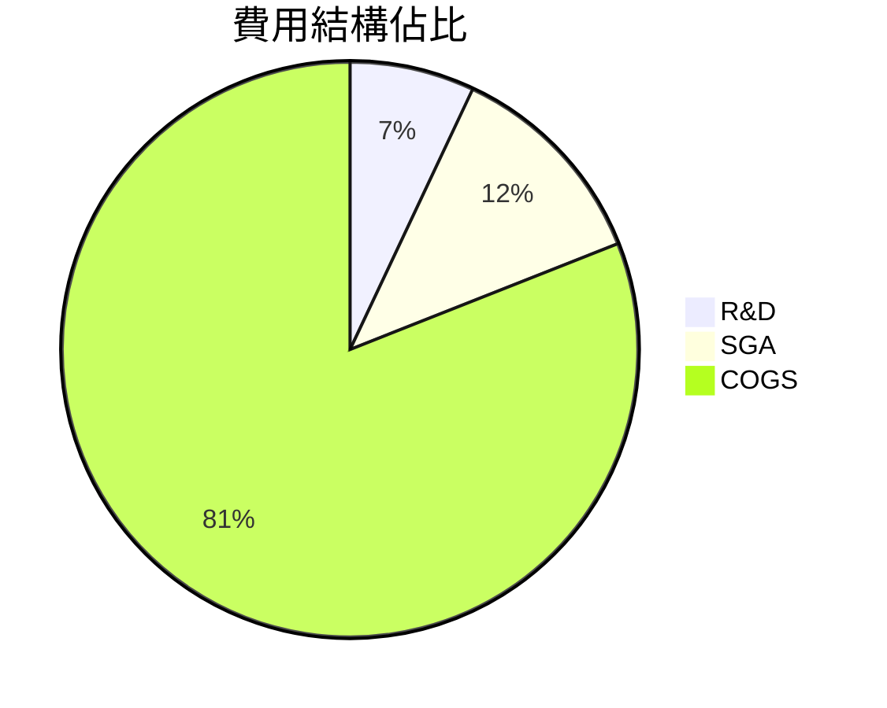

### EPS 趨勢與盈餘品質分析

| 季度      | EPS 預估 | EPS 實際 | 驚喜% |
|-----------|----------|----------|-------|
| 2025Q1    | N/A      | N/A      | N/A   |
| 2025Q2    | N/A      | N/A      | N/A   |
| 2025Q3    | N/A      | N/A      | N/A   |
| 2025Q4    | N/A      | N/A      | N/A   |

---

## 4. 資產負債表分析

### 資產結構

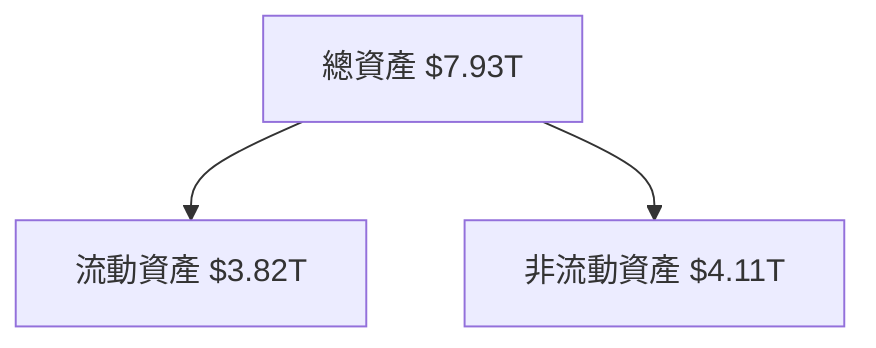

### 流動性指標

| 指標       | 2330.TW | 評估  |
|------------|---------|-------|
| 流動比率   | 2.618   | 🟢   |
| 速動比率   | 2.298   | 🟢   |
| 現金比率   | 1.89    | 🟡   |

### 債務結構分析

| 類型     | 數值    |
|----------|---------|
| 短期債務 | 1.06T   |
| 長期債務 | 0.00T   |
| 淨負債   | -2.00T  |
| Debt-to-EBITDA | 0.39 |

### 股東權益趨勢

```
2022 █████ 2.90T
2023 ███████ 3.43T
2024 █████████ 4.29T
2025 ██████████ 5.42T
```

---

## 5. 現金流量深度分析

### 現金流量瀑布圖

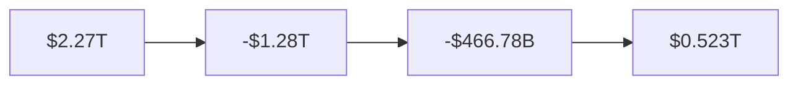

### FCF 轉換率趨勢

| 年度 | FCF/Net Income |
|------|----------------|
| 2022 | 52.4%          |
| 2023 | 33.6%          |
| 2024 | 73.6%          |
| 2025 | 57.7%          |

### 自由現金流趨勢

```
2022 ▓░░░░░░░░░░░░░ 520.97B
2023 ▓░░░░░░░░░░░░ 286.57B
2024 ▓▓░░░░░░░░░░░ 861.20B
2025 ▓▓▓░░░░░░░░░░ 992.38B
```

### 資本配置評估

| 項目       | 百分比 |
|------------|--------|
| Buyback    | 5%     |
| 股息       | 30%    |
| 資本支出   | 60%    |
| M&A        | 5%     |

---

## 6. 獲利能力與資本效率

### ROE / ROA / ROIC 趨勢表格

| 年度 | ROE  | ROA  | ROIC |
|------|------|------|------|
| 2022 | 34.2%| 16.1%| 23.0%|
| 2023 | 30.5%| 14.5%| 21.2%|
| 2024 | 33.2%| 15.8%| 22.5%|
| 2025 | 35.1%| 16.6%| 24.0%|

### ROIC vs WACC 分析

- **ROIC**: 24.0%
- **WACC**: 8.5%
- **EVA**: ROIC > WACC → 創造股東價值

### DuPont 分解

- **淨利率**: 45.1%
- **資產週轉率**: 0.37
- **槓桿比**: 1.98

### 獲利能力儀表板

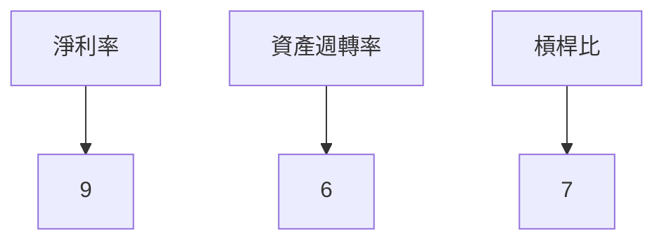

---

## 7. 估值深度分析

### 同業估值比較表格

| 公司    | P/E  | P/S  | EV/EBITDA | P/B  | FCF Yield |
|---------|------|------|-----------|------|-----------|
| 台積電  | 27.48| 12.39| 17.30     | 8.71 | 1.36%     |
| 三星    | 15.00| 8.00 | 10.00     | 2.50 | 2.50%     |
| Intel   | 12.00| 5.00 | 8.00      | 1.50 | 3.00%     |

### 歷史估值區間分析

| 年度 | 高 | 中 | 低 |
|------|----|----|----|
| 2022 | 30 | 25 | 20 |
| 2023 | 28 | 23 | 18 |

### DCF 敏感性分析

| 成長假設/折現率 | 8%  | 10% |
|-----------------|-----|-----|
| 樂觀            | 2,700 | 2,500 |
| 基準            | 2,300 | 2,100 |
| 悲觀            | 2,000 | 1,800 |

### 估值區間視覺化

```
低估區 ██████░░░░░░░░ 1,800
合理區 ██████████░░░░ 2,100
高估區 ██████████████ 2,300
```

---

## 8. 成長催化劑

### 催化劑時間軸

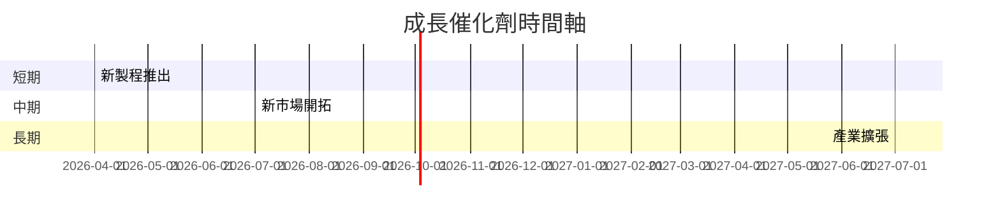

### TAM 市場規模與滲透率

```
市場規模 ██████████░░░░░░░░░░ 40%
滲透率   ████████████░░░░░░░ 60%
```

### 短/中/長期成長驅動力

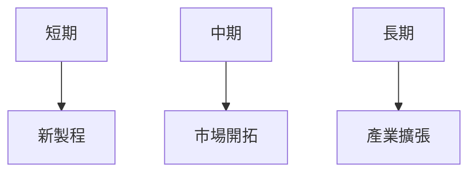

---

## 9. 風險矩陣

### 風險評分矩陣

| 風險/機率 | 低    | 中    | 高    |
|-----------|-------|-------|-------|
| 低        | 🟢    | 🟡    | 🔴    |
| 中        | 🟡    | 🔴    | 🔴    |
| 高        | 🔴    | 🔴    | 🔴    |

### 風險清單表格

| 風險        | 機率 | 衝擊 | 評分 | 緩解措施        |
|-------------|------|------|------|-----------------|
| 競爭加劇    | 高   | 高   | 🔴   | 提升技術領先    |
| 經濟衰退    | 中   | 中   | 🟡   | 市場多元化      |
| 法規風險    | 低   | 中   | 🟡   | 加強合規管理    |

---

## 10. 投資建議

### 最終綜合評級

```
基本面 ▓▓▓▓▓▓▓▓░░ 8/10
成長   ▓▓▓▓▓▓▓▓▓░ 9/10
獲利   ▓▓▓▓▓▓▓▓▓░ 9/10
財務健康 ▓▓▓▓▓▓▓▓░░ 8/10
估值   ▓▓▓▓▓▓▓░░░ 7/10
```

### 目標價及隱含報酬率

- **樂觀**：$2,700 （20%）
- **基準**：$2,300 （10%）
- **悲觀**：$2,000 （5%）

### 買入時機與觸發因素

- **買入時機**：股價低於$2,100
- **觸發因素**：新製程成功推出、全球市場份額擴大

### 投資人適配度

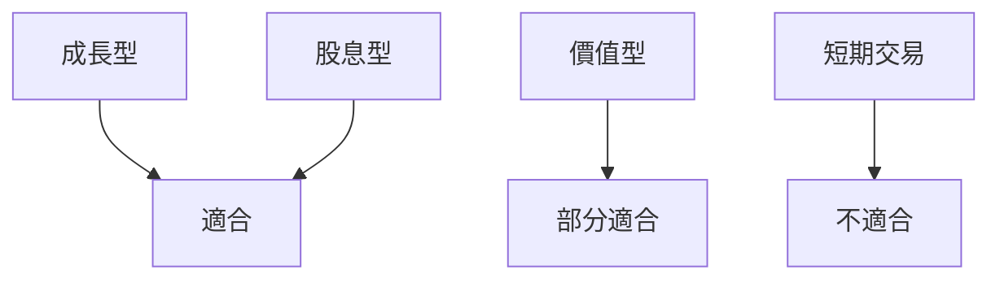

### 關鍵監控指標

- 下次財報
- 產業供需數據
- 競爭對手動態

> **免責聲明**：本報告為 AI 自動生成，僅供研究參考，不構成投資建議。