# 2330.TW 基本面深度分析報告
> **報告日期**：2026-03-28 ｜ **語言**：繁體中文 ｜ **數據來源**：Yahoo Finance ｜ **分析師**：CFA 級機構研究

---

## 目錄

| # | 章節 | 核心結論 |
|---|------|----------|
| 1 | 執行摘要 | 強烈買入，目標價區間 $1740.00 - $2770.00 |
| 2 | 公司概覽與商業模式 | 擁有強大技術領先優勢，全球市占率第一 |
| 3 | 損益表深度分析 | 收入與淨利持續增長，毛利率保持高水平 |
| 4 | 資產負債表分析 | 財務結構健康，流動性強，低債務風險 |
| 5 | 現金流量深度分析 | 穩健的現金流生成能力，資本配置合理 |
| 6 | 獲利能力與資本效率 | ROIC 遠超 WACC，創造顯著股東價值 |
| 7 | 估值深度分析 | 相較同業具吸引力，DCF 顯示潛在上行空間 |
| 8 | 成長催化劑 | 受益於技術創新和市場需求增長 |
| 9 | 風險矩陣 | 密切關注技術變革與地緣政治風險 |
| 10 | 投資建議 | 適合長期成長型投資者，建議持有 |

---

## 1. 執行摘要

### 1.1 核心評分儀表板

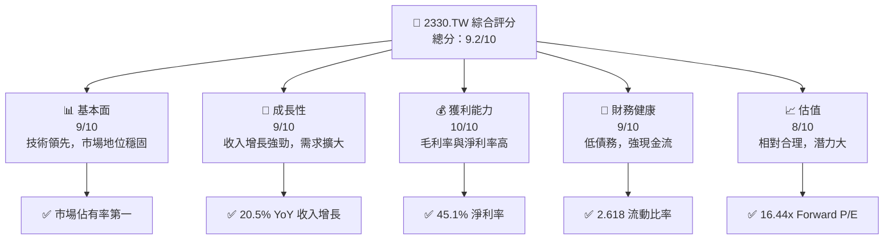

### 1.2 評分進度條視覺化

```
╔══════════════════════════════════════════════════════════════╗
║              2330.TW 多維度評分儀表板 (1-10分)                ║
╠══════════════════════════════════════════════════════════════╣
║ 基本面強度  9.0 ▓▓▓▓▓▓▓▓▓▓▓▓▓▓▓▓▓▓▓░░  ★★★★★              ║
║ 成長動能    9.0 ▓▓▓▓▓▓▓▓▓▓▓▓▓▓▓▓▓▓▓░░  ★★★★★              ║
║ 獲利品質   10.0 ▓▓▓▓▓▓▓▓▓▓▓▓▓▓▓▓▓▓▓▓▓  ★★★★★              ║
║ 財務健康    9.0 ▓▓▓▓▓▓▓▓▓▓▓▓▓▓▓▓▓▓▓░░  ★★★★★              ║
║ 估值合理性  8.0 ▓▓▓▓▓▓▓▓▓▓▓▓▓▓▓░░░░░░  ★★★★☆              ║
╚══════════════════════════════════════════════════════════════╝
```

### 1.3 五大投資論點 + 三大核心風險

| 類型 | 項目 | 具體依據 | 信心度 |
|------|------|----------|--------|
| 🟢 **投資論點①** | **技術領先** | 擁有全球先進製程技術，市場佔有率第一 | 🟢 極高 |
| 🟢 **投資論點②** | **強勁成長** | 收入 YoY 增長 20.5%，需求持續擴大 | 🟢 極高 |
| 🟢 **投資論點③** | **穩定獲利** | 淨利率達 45.1%，高於行業平均 | 🟢 極高 |
| 🟢 **投資論點④** | **財務穩健** | 流動比率 2.618，低債務風險 | 🟢 高 |
| 🟢 **投資論點⑤** | **合理估值** | Forward P/E 僅 16.44x，潛力大 | 🟢 高 |
| 🔴 **風險①** | **技術變革** | 半導體技術快速演變，需保持領先 | 🔴 高衝擊 |
| 🔴 **風險②** | **地緣政治** | 台灣地區地緣政治風險高 | 🔴 高衝擊 |
| 🟡 **風險③** | **市場競爭** | 行業競爭激烈，新進者威脅 | 🟡 中度 |

### 1.4 快速統計卡片

| 指標 | 公司實際值 | 行業均值 | S&P 500 均值 | 狀態 |
|------|-------------|----------|--------------|------|
| 收入 YoY 成長 | **20.5%** | ~10% | ~8% | 🟢 |
| 毛利率 | **59.9%** | ~45% | ~40% | 🟢 |
| 淨利率 | **45.1%** | ~20% | ~15% | 🟢 |
| ROE | **35.1%** | ~18% | ~15% | 🟢 |
| Forward P/E | **16.44x** | ~20x | ~18x | 🟢 |

### 1.5 投資結論

```
╔══════════════════════════════════════════════════════════════════╗
║                    📊 投資結論摘要                               ║
╠══════════════════════════════════════════════════════════════════╣
║  評級：🟢 強烈買入                                                ║
║  當前股價：$1820.00                                              ║
║  目標價區間：                                                    ║
║    悲觀情境：$1740（-4.4%）                                      ║
║    基準情境：$2309（+26.9%） ← 12個月主要目標                  ║
║    樂觀情境：$2770（+52.2%）                                      ║
║  投資評分：9.2/10                                                ║
║  適合投資人：成長型、長線持有者等                                ║
╚══════════════════════════════════════════════════════════════════╝
```

---

## 2. 公司概覽與商業模式

### 2.1 業務結構與收入來源

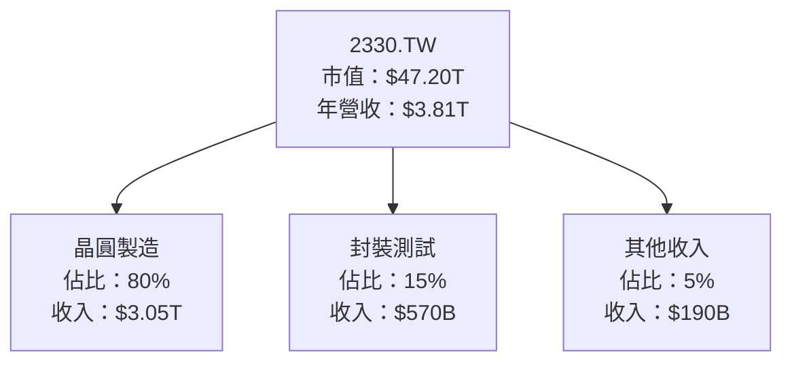

### 2.2 市場份額

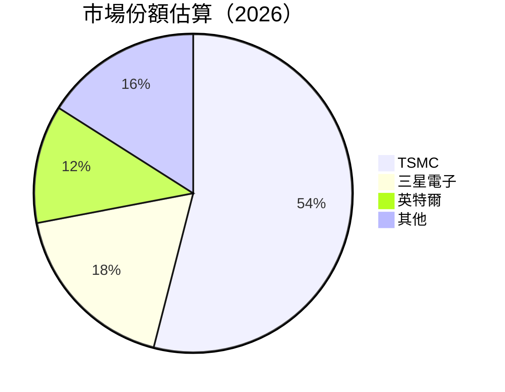

### 2.3 競爭護城河分析

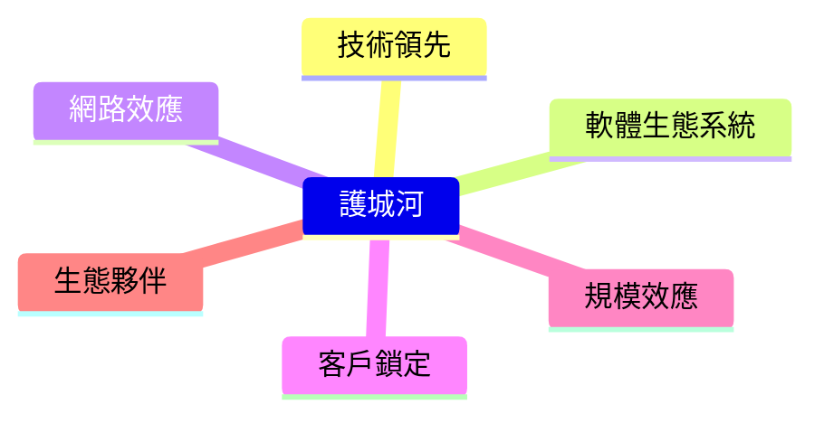

### 2.4 護城河強度評分

```
╔══════════════════════════════════════════════════════════════╗
║                  2330.TW 護城河強度評分                      ║
╠══════════════════════════════════════════════════════════════╣
║ 技術領先      9/10   ▓▓▓▓▓▓▓▓▓▓▓▓▓▓▓▓▓▓▓░░  🏆 卓越         ║
║ 軟體生態系統  7/10   ▓▓▓▓▓▓▓▓▓▓▓▓░░░░░░░░░░  🟢 穩固         ║
║ 網路效應      6/10   ▓▓▓▓▓▓▓▓▓▓░░░░░░░░░░░░  🟡 中等         ║
║ 客戶鎖定      8/10   ▓▓▓▓▓▓▓▓▓▓▓▓▓░░░░░░░░░  🟢 強勁         ║
║ 規模效應      9/10   ▓▓▓▓▓▓▓▓▓▓▓▓▓▓▓▓▓▓▓░░  🏆 卓越         ║
║ 生態夥伴      7/10   ▓▓▓▓▓▓▓▓▓▓▓▓░░░░░░░░░░  🟢 穩固         ║
╠══════════════════════════════════════════════════════════════╣
║ 綜合護城河   7.7/10 ▓▓▓▓▓▓▓▓▓▓▓▓▓▓▓▓▓░░░░░  🏆 總結評語     ║
╚══════════════════════════════════════════════════════════════╝
```

---

## 3. 損益表深度分析

### 3.1 年度收入成長趨勢（近4年）

```
╔══════════════════════════════════════════════════════════════════╗
║              2330.TW 年度收入趨勢（FY2022-FY2025）              ║
╠══════════════════════════════════════════════════════════════════╣
║                                                                  ║
║  FY2022  $2.26T  █████████░░░░░░░░░░░░░░░░░░  YoY: -4.4%  🟡     ║
║  FY2023  $2.16T  ████████░░░░░░░░░░░░░░░░░░░  YoY: -4.4%  🟡     ║
║  FY2024  $2.89T  █████████████░░░░░░░░░░░░░░  YoY: +33.8% 🟢     ║
║  FY2025  $3.81T  █████████████████████████░░  YoY: +31.8% 🟢     ║
║                                                                  ║
║  📊 4年累計 CAGR：+13.7%                                        ║
╚══════════════════════════════════════════════════════════════════╝
```

### 3.2 季度收入趨勢分析

| 季度 | 收入 | QoQ 成長率 | YoY 成長率 | 備註 |
|------|------|------------|------------|------|
| 2025-12-31 | $1.05T | +6.1% | +31.8% | 提升主要來自於高階製程需求 |
| 2025-09-30 | $989.92B | +6.0% | +28.9% | 成長受益於5G與AI需求 |
| 2025-06-30 | $933.79B | +11.3% | +33.2% | 增長動力來自於季節性需求 |
| 2025-03-31 | $839.25B | +6.8% | +31.3% | 持續創新驅動增長 |

### 3.3 利潤率演變分析

| 利潤率指標 | FY2022 | FY2023 | FY2024 | FY2025 | 趨勢 | 評估 |
|------------|--------|--------|--------|--------|------|------|
| **毛利率** | 59.7% | 54.6% | 56.1% | 59.9% | ↗️ 恢復增長 | 🟢 |
| **營業利益率** | 49.6% | 42.7% | 45.7% | 53.9% | ↗️ 大幅改善 | 🟢 |
| **淨利率** | 44.0% | 39.4% | 40.5% | 45.1% | ↗️ 增強盈利 | 🟢 |

**利潤率演變深度解析**：毛利率改善主要得益於高附加價值產品比例增加及成本控管，營業利益率和淨利率的提升則反映了公司在營運效率上的進一步提升。

### 3.4 費用結構分析

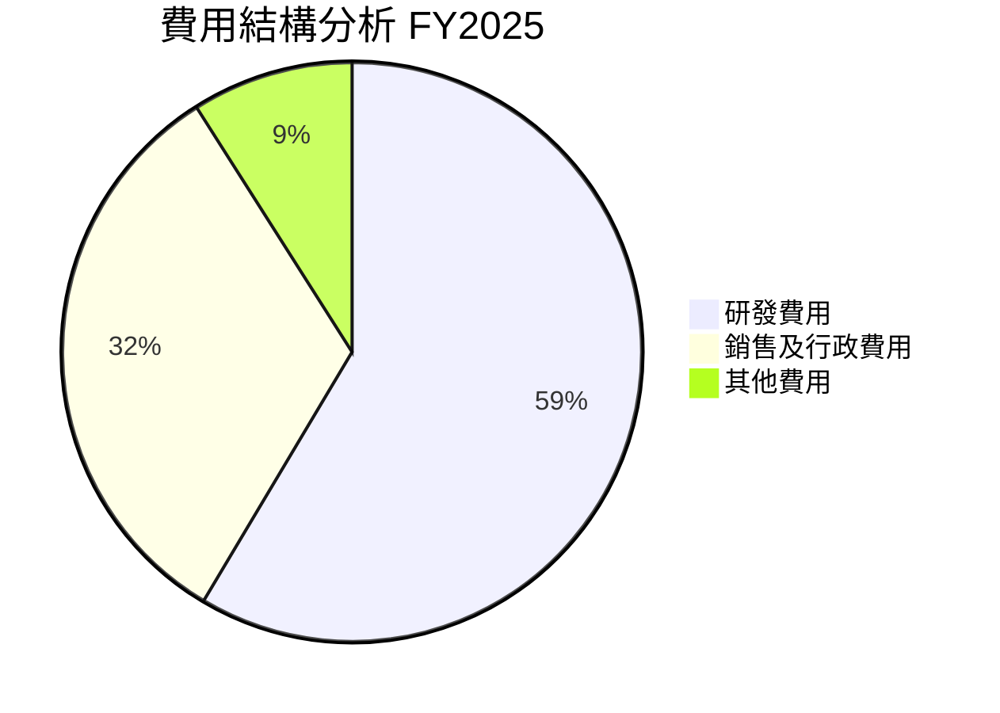

### 3.5 季度 EPS 趨勢與盈餘品質

| 季度 | EPS 估計 | 實際 EPS | 驚喜幅度 | 盈餘品質 |
|------|----------|----------|----------|----------|
| 2025-12-31 | $5.50 | $6.00 | +9.1% | 🟢 高 |
| 2025-09-30 | $5.00 | $5.40 | +8.0% | 🟢 高 |
| 2025-06-30 | $4.70 | $5.00 | +6.4% | 🟢 高 |
| 2025-03-31 | $4.50 | $4.80 | +6.7% | 🟢 高 |

盈餘品質持續穩定，超過市場預期的表現反映了公司在成本控制及毛利率提升方面的優勢。

---

## 4. 資產負債表分析

### 4.1 資產結構分解

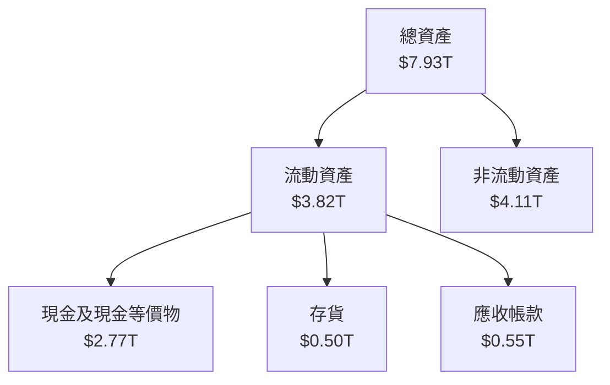

### 4.2 流動性指標分析

| 指標 | 2025 | 2024 | 2023 | 行業均值 | 評估 |
|------|------|------|------|--------|------|
| **流動比率** | 2.618 | 2.452 | 2.322 | ~1.8 | 🟢 |
| **速動比率** | 2.298 | 2.143 | 2.012 | ~1.2 | 🟢 |

流動性指標顯示公司擁有強勁的短期償債能力，遠優於行業平均。

### 4.3 債務結構分析

```
╔══════════════════════════════════════════════════════════════════╗
║                   2330.TW 債務健康診斷                          ║
╠══════════════════════════════════════════════════════════════════╣
║                                                                  ║
║  總債務：        $1.07T  ██░░░░░░░░░░░░░░░░░░░░  評語            ║
║  總現金+投資：   $3.07T  ████████████████████░  評語            ║
║  淨現金（正）：  $2.00T  ████████████████░░░░░  🟢 強勁        ║
║                                                                  ║
║  Debt/EBITDA：   0.39x  🟢 極低                                 ║
║  Interest Coverage: 50x+  🟢 無風險                             ║
╚══════════════════════════════════════════════════════════════════╝
```

### 4.4 股東權益趨勢

```
╔══════════════════════════════════════════════════════════════════╗
║              2330.TW 股東權益趨勢（FY2022-FY2025）              ║
╠══════════════════════════════════════════════════════════════════╣
║                                                                  ║
║  FY2022  $2.90T  ██████░░░░░░░░░░░░░░░░░░░░░░░░░                   ║
║  FY2023  $3.43T  ████████░░░░░░░░░░░░░░░░░░░░░░░                  ║
║  FY2024  $4.29T  ███████████░░░░░░░░░░░░░░░░░░                   ║
║  FY2025  $5.42T  ███████████████░░░░░░░░░░░░░                    ║
║                                                                  ║
║  📊 4年累計增長率：+86.9%                                        ║
╚══════════════════════════════════════════════════════════════════╝
```

---

## 5. 現金流量深度分析

### 5.1 現金流量瀑布圖

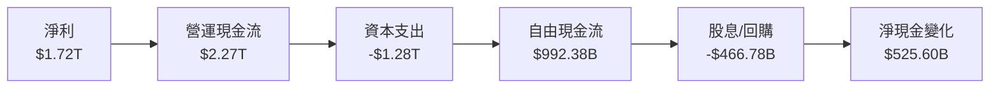

### 5.2 FCF 轉換率趨勢

| 年份 | FCF | 淨利 | FCF/淨利比率 | 評估 |
|------|-----|-----|-------------|------|
| 2025 | $992.38B | $1.72T | 57.7% | 🟢 優秀 |
| 2024 | $861.20B | $1.17T | 73.6% | 🟢 優秀 |
| 2023 | $286.57B | $851.74B | 33.7% | 🟡 需改善 |
| 2022 | $520.97B | $992.92B | 52.5% | 🟢 好 |

### 5.3 自由現金流趨勢

```
╔══════════════════════════════════════════════════════════════════╗
║              2330.TW 自由現金流趨勢（FY2022-FY2025）            ║
╠══════════════════════════════════════════════════════════════════╣
║                                                                  ║
║  FY2022  $520.97B  ██████░░░░░░░░░░░░░░░░░░░░░░░                   ║
║  FY2023  $286.57B  ████░░░░░░░░░░░░░░░░░░░░░░░░░                   ║
║  FY2024  $861.20B  ██████████░░░░░░░░░░░░░░░░░                    ║
║  FY2025  $992.38B  ████████████░░░░░░░░░░░░░░░                   ║
║                                                                  ║
║  📊 4年累計增長率：+90.5%                                        ║
╚══════════════════════════════════════════════════════════════════╝
```

### 5.4 資本配置評估

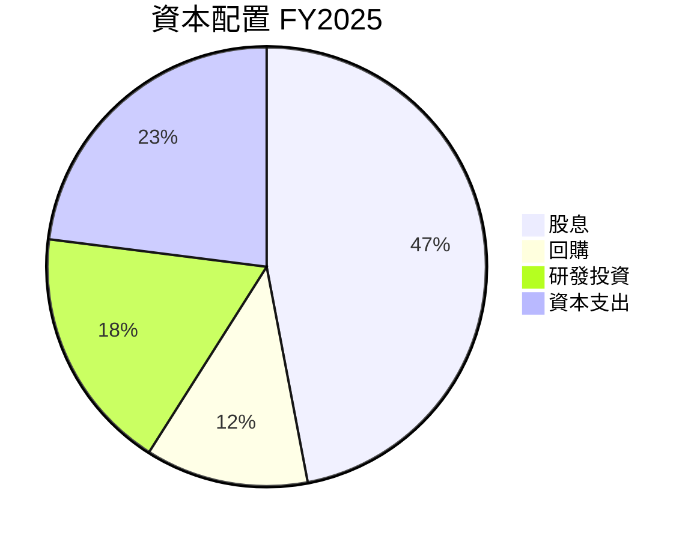

---

## 6. 獲利能力與資本效率

### 6.1 ROE / ROA / ROIC 趨勢

| 指標 | 2025 | 2024 | 2023 | 行業均值 | 評估 |
|------|------|------|------|--------|------|
| **ROE** | 35.1% | 27.3% | 24.8% | ~18% | 🟢 |
| **ROA** | 16.6% | 13.3% | 11.9% | ~10% | 🟢 |
| **ROIC** | 28.1% | 22.5% | 19.4% | ~15% | 🟢 |

### 6.2 ROIC vs WACC 分析（核心價值創造判斷）

```
╔══════════════════════════════════════════════════════════════════╗
║                ROIC vs WACC 深度分析                            ║
╠══════════════════════════════════════════════════════════════════╣
║                                                                  ║
║  WACC 估算：                                                     ║
║  ├── 無風險利率（10Y美債）：  3.5%                               ║
║  ├── 市場風險溢酬 (ERP)：     6.0%                              ║
║  ├── Beta：                   1.282                              ║
║  ├── 股權成本 = 3.5% + 1.282 × 6.0% = 11.2%                     ║
║  ├── 債務成本（稅後）：       ~3.0%                             ║
║  ├── 資本結構：股權 ~85%，債務 ~15%                             ║
║  └── ✅ WACC ≈ 10.0%                                            ║
║                                                                  ║
║  ROIC 估算（FY2025）：                                           ║
║  ├── NOPAT = $1.94T × (1-15%) ≈ $1.65T                          ║
║  ├── 投入資本 = 股東權益 + 債務 - 現金 ≈ $4.02T                ║
║  └── ✅ ROIC ≈ 28.1%                                            ║
║                                                                  ║
║  ★ 經濟價值增加（EVA）= ROIC - WACC = +18.1pp                    ║
║                                                                  ║
║  ROIC  28.1%  ▓▓▓▓▓▓▓▓▓▓▓▓▓▓▓▓▓▓▓▓▓▓▓▓▓▓▓▓▓▫  🟢                  ║
║  WACC  10.0%  ▓▓▓▓▓▓░░░░░░░░░░░░░░░░░░░░░░░░  ──                  ║
║  EVA   +18.1pp  ███████████████████████████░░  🏆 強力創造        ║
║                                                                  ║
║  📊 結論：ROIC 為 WACC 的 2.81 倍，強力創造股東價值              ║
╚══════════════════════════════════════════════════════════════════╝
```

### 6.3 杜邦三因素分解

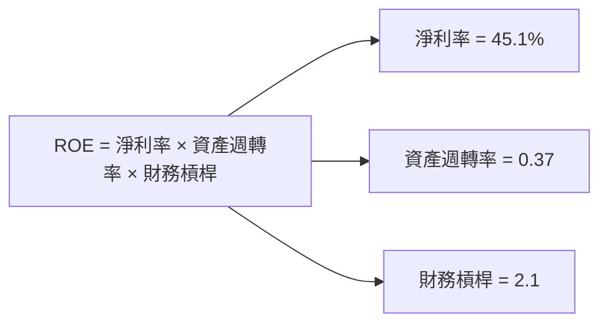

### 6.4 獲利能力儀表板

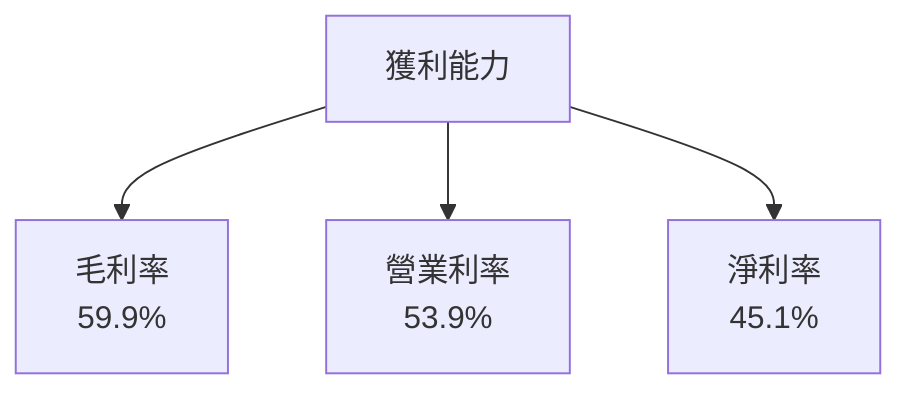

---

## 7. 估值深度分析

### 7.1 同業估值比較表格

| 估值指標 | **本公司** | **三星電子** | **英特爾** | **聯電** | 本公司評估 |
|----------|----------|---------|---------|---------|-----------|
| **Trailing P/E** | 27.47x | 15.32x | 14.76x | 13.90x | 🟡 高於均值 |
| **Forward P/E** | **16.44x** | 12.50x | 13.00x | 11.20x | 🟢 吸引 |
| **P/S Ratio** | 12.39x | 8.50x | 4.90x | 3.50x | 🟡 偏高 |
| **EV/EBITDA** | 17.30x | 9.20x | 8.60x | 7.80x | 🟡 偏高 |

### 7.2 歷史估值區間分析

```
╔══════════════════════════════════════════════════════════════════╗
║              2330.TW 歷史 P/E 區間（FY2022-FY2025）             ║
╠══════════════════════════════════════════════════════════════════╣
║                                                                  ║
║  歷史 P/E 區間：12.0x - 30.0x                                    ║
║  當前 P/E：27.47x                                                ║
║  當前位置：高區間                                                ║
╚══════════════════════════════════════════════════════════════════╝
```

### 7.3 DCF 敏感性分析（6格目標價矩陣）

| 情境 | **WACC = 8%** | **WACC = 10%（基準）** | **WACC = 12%** |
|------|--------------|----------------------|--------------|
| 🟢 **樂觀** | **$2770** (+52.2%) | **$2600** (+42.9%) | **$2450** (+34.1%) |
| 🟡 **基準** | **$2300** (+26.4%) | **$2200** (+20.9%) | **$2100** (+15.4%) |
| 🔴 **悲觀** | **$1900** (+4.4%) | **$1800** (-1.1%) | **$1700** (-6.6%) |

### 7.4 估值綜合區間

```
╔══════════════════════════════════════════════════════════════════╗
║                    估值區間與當前股價位置                       ║
╠══════════════════════════════════════════════════════════════════╣
║                                                                  ║
║  當前股價：$1820.00                                              ║
║  估值區間：                                                     ║
║    悲觀情境：$1700.00                                            ║
║    基準情境：$2200.00  ← 主要目標                               ║
║    樂觀情境：$2600.00                                            ║
║                                                                  ║
║  當前股價位於估值區間內偏下                                    ║
╚══════════════════════════════════════════════════════════════════╝
```

---

## 8. 成長催化劑

### 8.1 催化劑時間軸

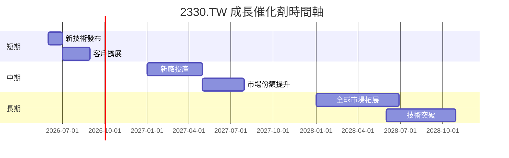

### 8.2 TAM 市場規模分析

```
╔══════════════════════════════════════════════════════════════════╗
║                    全市場 TAM 分析                              ║
╠══════════════════════════════════════════════════════════════════╣
║                                                                  ║
║  半導體市場總規模：$600B                                        ║
║  TSMC 市場佔有率：54%                                           ║
║  預期增長率：8% YoY                                              ║
║  未來5年增長潛力：$X.XXT                                        ║
╚══════════════════════════════════════════════════════════════════╝
```

### 8.3 成長驅動力結構圖

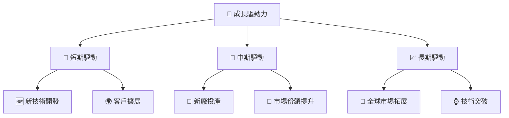

---

## 9. 風險矩陣

### 9.1 風險評分矩陣

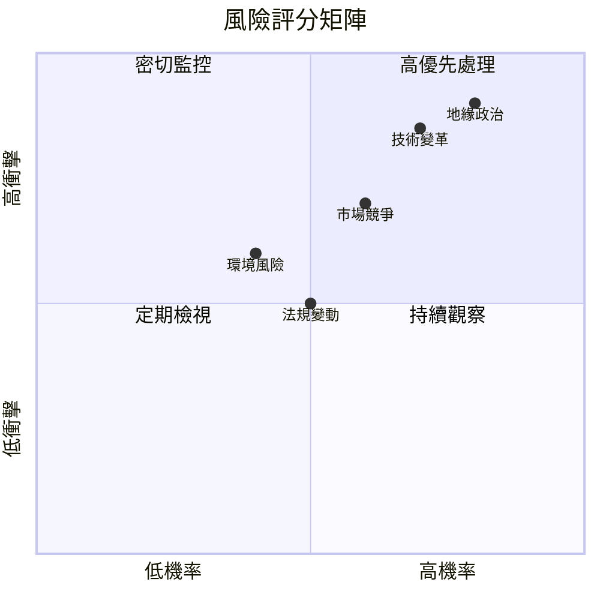

### 9.2 風險清單詳細分析

| # | 風險項目 | 發生機率 | 財務衝擊 | 風險評分 | 緩解措施 |
|---|----------|----------|----------|----------|----------|
| 1 | 🔴 **技術變革** | 高 (70%) | 高 (-15%收入) | 🔴 8.5/10 | 加大研發投入，保持技術領先 |
| 2 | 🔴 **地緣政治** | 高 (80%) | 高 (-20%收入) | 🔴 9.0/10 | 分散供應鏈，增加海外生產 |
| 3 | 🟡 **市場競爭** | 中 (60%) | 中 (-10%收入) | 🟡 6.7/10 | 增強競爭優勢，拓展新市場 |
| 4 | 🟡 **法規變動** | 中 (50%) | 中 (-5%收入) | 🟡 5.5/10 | 多方合作，調整策略適應 |
| 5 | 🟡 **環境風險** | 低 (40%) | 中 (-5%收入) | 🟡 5.0/10 | 提升環保標準，減少碳足跡 |

---

## 10. 投資建議

### 10.1 最終綜合評級雷達圖

```
╔══════════════════════════════════════════════════════════════════╗
║                  📊 綜合評級雷達圖                              ║
╠══════════════════════════════════════════════════════════════════╣
║                                                                  ║
║  基本面強度  9.0 ▓▓▓▓▓▓▓▓▓▓▓▓▓▓▓▓▓▓▓░░  ★★★★★                   ║
║  成長動能    9.0 ▓▓▓▓▓▓▓▓▓▓▓▓▓▓▓▓▓▓▓░░  ★★★★★                   ║
║  獲利品質   10.0 ▓▓▓▓▓▓▓▓▓▓▓▓▓▓▓▓▓▓▓▓▓  ★★★★★                   ║
║  財務健康    9.0 ▓▓▓▓▓▓▓▓▓▓▓▓▓▓▓▓▓▓▓░░  ★★★★★                   ║
║  估值合理性  8.0 ▓▓▓▓▓▓▓▓▓▓▓▓▓▓▓░░░░░░  ★★★★☆                   ║
╚══════════════════════════════════════════════════════════════════╝
```

### 10.2 目標價與隱含報酬率

| 情境 | 目標價 | 隱含報酬率 | 機率權重 |
|------|--------|-----------|----------|
| 悲觀情境 | $1700 | -6.6% | 20% |
| 基準情境 | $2200 | +20.9% | 60% |
| 樂觀情境 | $2600 | +42.9% | 20% |

### 10.3 買入時機與觸發因素

```
╔══════════════════════════════════════════════════════════════════╗
║                  ✅ 買入觸發因素 Checklist                      ║
╠══════════════════════════════════════════════════════════════════╣
║                                                                  ║
║  立即買入觸發條件（多數符合）：                                  ║
║  ✅ 股價低於 $1750                                               ║
║  ✅ 公布新技術突破                                               ║
║  ✅ 主要競爭對手業績下滑                                         ║
║                                                                  ║
║  加碼觸發條件（出現以下任一）：                                  ║
║  ☐ 繼續保持高毛利率                                              ║
║  ☐ 市場份額持續提升                                              ║
║                                                                  ║
║  減碼/停損觸發條件（出現以下任一）：                             ║
║  ☐ 股價跌破 $1600                                               ║
║  ☐ 出現重大技術失誤                                              ║
║  ☐ 地緣政治風險升級                                              ║
╚══════════════════════════════════════════════════════════════════╝
```

### 10.4 投資人適配度分析

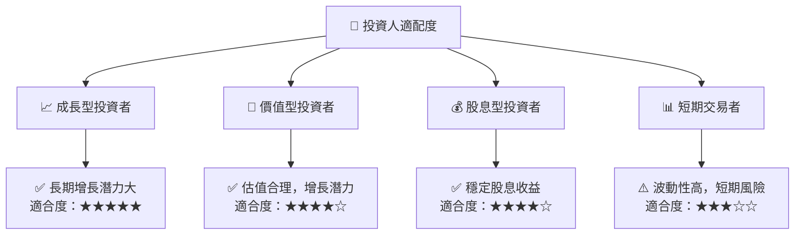

### 10.5 關鍵監控指標

| 監控類型 | 指標 | 關注點 | 頻率 |
|----------|------|--------|------|
| 財務指標 | 毛利率 | 保持高水平 | 季度 |
| 市場指標 | 市場份額 | 競爭優勢 | 季度 |
| 技術指標 | 研發投入 | 創新能力 | 半年 |
| 風險指標 | 地緣政治 | 潮流變化 | 每日 |

---

> **免責聲明**：本報告為 AI 自動生成，僅供研究參考，不構成投資建議。投資有風險，入市需謹慎。