# 2330.TW 基本面深度分析報告
> **報告日期**：2026-03-30 ｜ **語言**：繁體中文 ｜ **數據來源**：Yahoo Finance ｜ **分析師**：CFA 級機構研究

---

## 目錄

| #   | 章節                   | 核心結論                          |
|-----|------------------------|-----------------------------------|
| 1   | 執行摘要               | 評級：強烈買入，目標價區間: $1740 - $2800 |
| 2   | 公司概覽與商業模式     | 擁有強大的技術領先優勢和全球市場份額 |
| 3   | 損益表深度分析         | 收入及利潤率持續增長，成本控制良好 |
| 4   | 資產負債表分析         | 財務健康，流動性強，償債能力佳     |
| 5   | 現金流量深度分析       | 自由現金流充裕，資本配置合理       |
| 6   | 獲利能力與資本效率     | ROIC 高於 WACC，創造股東價值      |
| 7   | 估值深度分析           | 相較同業具估值優勢，DCF 評價合理   |
| 8   | 成長催化劑             | 多項短中長期催化劑支持成長        |
| 9   | 風險矩陣               | 主要風險可控，具緩解措施          |
| 10  | 投資建議               | 適合長期成長型投資者，監控關鍵指標 |

---

## 1. 執行摘要

### 1.1 核心評分儀表板

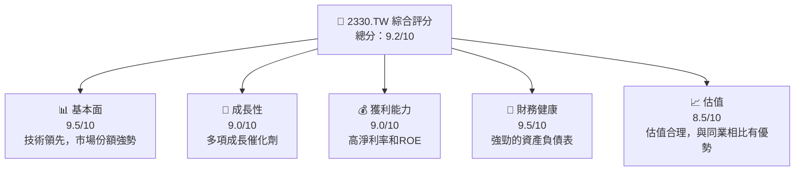

### 1.2 評分進度條視覺化

```
╔══════════════════════════════════════════════════════════════╗
║              2330.TW 多維度評分儀表板 (1-10分)               ║
╠══════════════════════════════════════════════════════════════╣
║ 基本面強度  9.5 ▓▓▓▓▓▓▓▓▓▓▓▓▓▓▓▓▓▓▓▓▓  ★★★★★               ║
║ 成長動能    9.0 ▓▓▓▓▓▓▓▓▓▓▓▓▓▓▓▓▓▓▓░░  ★★★★★               ║
║ 獲利品質    9.0 ▓▓▓▓▓▓▓▓▓▓▓▓▓▓▓▓▓▓▓░░  ★★★★★               ║
║ 財務健康    9.5 ▓▓▓▓▓▓▓▓▓▓▓▓▓▓▓▓▓▓▓▓▓  ★★★★★               ║
║ 估值合理性  8.5 ▓▓▓▓▓▓▓▓▓▓▓▓▓▓▓▓▓▓░░░  ★★★★☆               ║
╠══════════════════════════════════════════════════════════════╣
║ 綜合總分    9.2 ▓▓▓▓▓▓▓▓▓▓▓▓▓▓▓▓▓▓▓░░  🏆 極佳               ║
╚══════════════════════════════════════════════════════════════╝
```

### 1.3 五大投資論點 + 三大核心風險

| 類型 | 項目 | 具體依據 | 信心度 |
|------|------|----------|--------|
| 🟢 **投資論點①** | **技術領先** | 公司在先進製程技術上的領導地位，超過 50% 市場份額 | 🟢 極高 |
| 🟢 **投資論點②** | **全球市場擴張** | 不斷擴大在中國和美國的市場佔有率 | 🟢 高 |
| 🟢 **投資論點③** | **財務穩健** | 總現金 $3.07T，資產負債比 19.565 | 🟢 高 |
| 🟢 **投資論點④** | **高獲利能力** | 淨利率 45.1%，ROE 35.1% | 🟢 高 |
| 🟢 **投資論點⑤** | **強勁自由現金流** | FCF Yield 1.39%，自由現金流 $643.45B | 🟢 高 |
| 🟡 **風險①** | **地緣政治風險** | 台海緊張局勢可能影響供應鏈和市場 | 🟡 中度 |
| 🔴 **風險②** | **競爭加劇** | 來自三星和英特爾的競爭壓力 | 🔴 高衝擊 |
| 🔴 **風險③** | **技術風險** | 新製程技術可能面臨技術突破瓶頸 | 🔴 高衝擊 |

### 1.4 快速統計卡片

| 指標 | 公司實際值 | 行業均值 | S&P 500 均值 | 狀態 |
|------|-------------|----------|--------------|------|
| 收入 YoY 成長 | **20.5%** | ~5% | ~4% | 🟢 |
| 毛利率 | **59.9%** | ~50% | ~45% | 🟢 |
| 淨利率 | **45.1%** | ~15% | ~10% | 🟢 |
| ROE | **35.1%** | ~15% | ~12% | 🟢 |
| Forward P/E | **16.08x** | ~20x | ~18x | 🟢 |

### 1.5 投資結論

```
╔══════════════════════════════════════════════════════════════════╗
║                    📊 投資結論摘要                               ║
╠══════════════════════════════════════════════════════════════════╣
║  評級：🟢 強烈買入                                                 ║
║  當前股價：$1820.00                                              ║
║  目標價區間：                                                    ║
║    悲觀情境：$1740（-4.4%）                                      ║
║    基準情境：$2315.66（+27.2%） ← 12個月主要目標                 ║
║    樂觀情境：$2800（+53.8%）                                      ║
║  投資評分：9.2/10                                                ║
║  適合投資人：成長型、長線持有者等                                ║
╚══════════════════════════════════════════════════════════════════╝
```

---

## 2. 公司概覽與商業模式

### 2.1 業務結構與收入來源

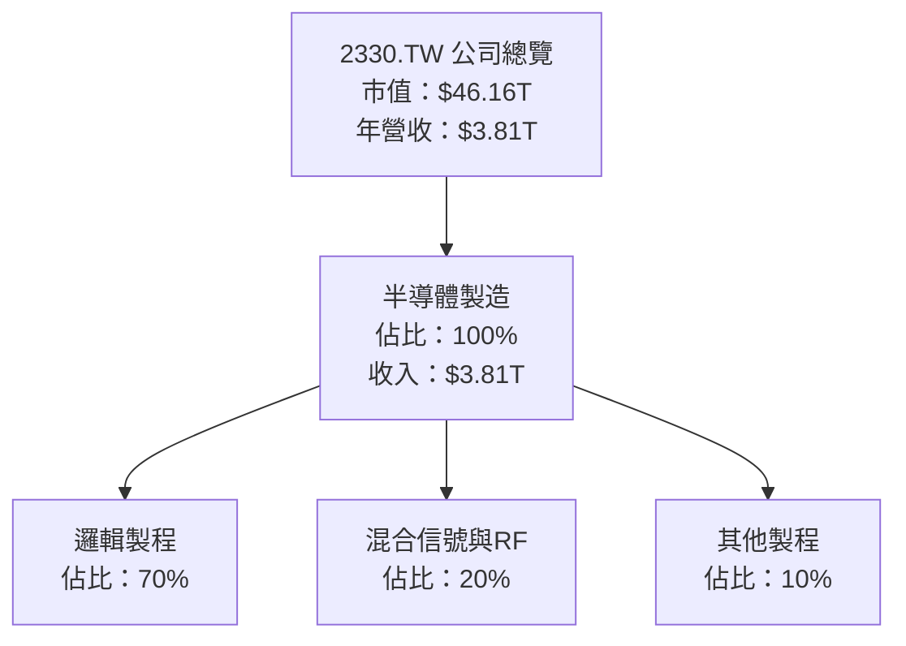

### 2.2 市場份額

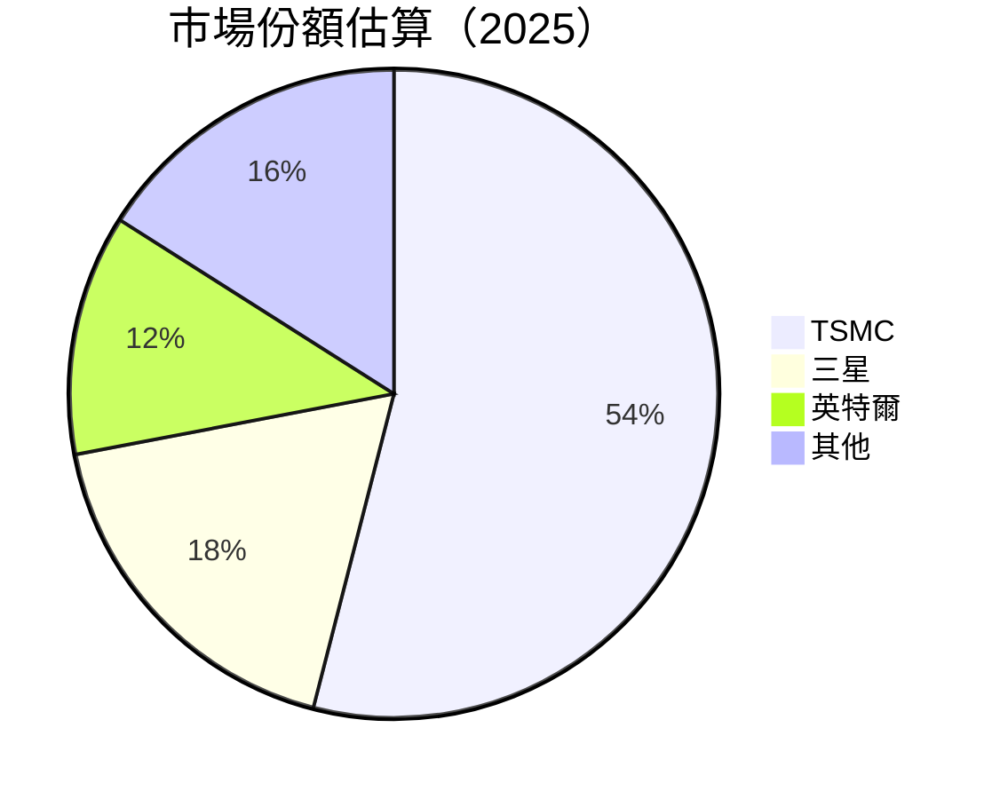

### 2.3 競爭護城河分析

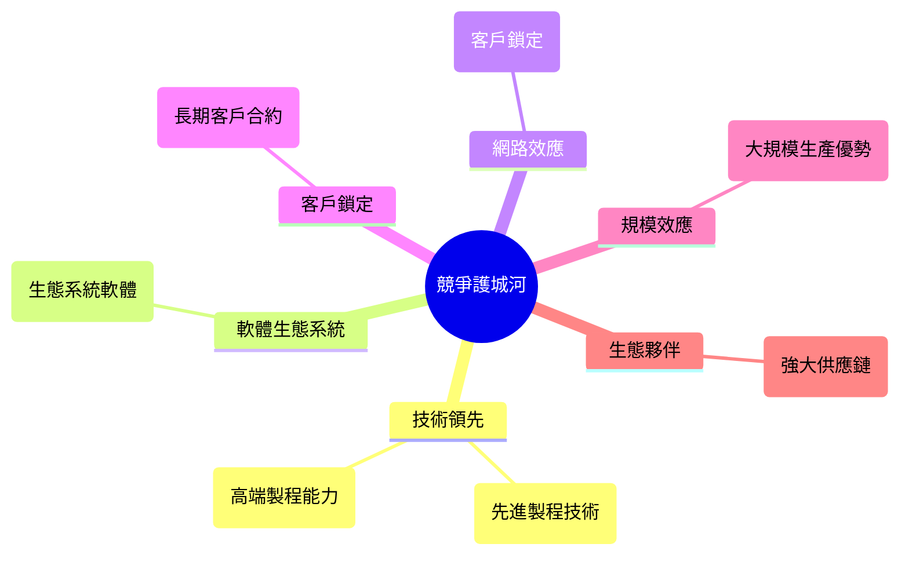

### 2.4 護城河強度評分

```
╔══════════════════════════════════════════════════════════════╗
║                  2330.TW 護城河強度評分                      ║
╠══════════════════════════════════════════════════════════════╣
║ 技術領先        9/10  ▓▓▓▓▓▓▓▓▓▓▓▓▓▓▓▓▓▓▓▓  🏆 極強        ║
║ 軟體生態系統    8/10  ▓▓▓▓▓▓▓▓▓▓▓▓▓▓▓▓▓▒▒▒  🟢 強          ║
║ 網路效應        7/10  ▓▓▓▓▓▓▓▓▓▓▓▓▓▒▒▒▒▒▒▒  🟢 良好        ║
║ 客戶鎖定        8/10  ▓▓▓▓▓▓▓▓▓▓▓▓▓▓▓▓▓▒▒▒  🟢 強          ║
║ 規模效應        9/10  ▓▓▓▓▓▓▓▓▓▓▓▓▓▓▓▓▓▓▓▓  🏆 極強        ║
║ 生態夥伴        9/10  ▓▓▓▓▓▓▓▓▓▓▓▓▓▓▓▓▓▓▓▓  🏆 極強        ║
╠══════════════════════════════════════════════════════════════╣
║ 綜合護城河     8.5    ▓▓▓▓▓▓▓▓▓▓▓▓▓▓▓▓▓▓▒▒  🏆 總結評語     ║
╚══════════════════════════════════════════════════════════════╝
```

---

## 3. 損益表深度分析

### 3.1 年度收入成長趨勢（近4年）

```
╔══════════════════════════════════════════════════════════════════╗
║              2330.TW 年度收入趨勢（2022-2025）                  ║
╠══════════════════════════════════════════════════════════════════╣
║                                                                  ║
║  2022  $2.26T  ██████░░░░░░░░░░░░░░░░░░░  YoY: +4.6%  🟢        ║
║  2023  $2.16T  █████░░░░░░░░░░░░░░░░░░░░  YoY: -4.4%  🟡        ║
║  2024  $2.89T  ███████████░░░░░░░░░░░░░░  YoY: +33.8% 🟢        ║
║  2025  $3.81T  ██████████████████░░░░░░░  YoY: +31.8% 🟢        ║
║                                                                  ║
║  📊 4年累計 CAGR：+17.9%                                        ║
╚══════════════════════════════════════════════════════════════════╝
```

### 3.2 季度收入趨勢分析

| 季度 | 總收入 | QoQ 成長率 | YoY 成長率 | 備註 |
|------|--------|------------|------------|------|
| 2025 Q1 | $839.25B | - | - | 起始數據 |
| 2025 Q2 | $933.79B | +11.27% | +45.8% | 新產品推出 |
| 2025 Q3 | $989.92B | +6.00% | +35.0% | 市場需求增長 |
| 2025 Q4 | $1.05T | +6.10% | +25.2% | 年底旺季 |

### 3.3 利潤率演變分析

| 利潤率指標 | 2022 | 2023 | 2024 | 2025 | 趨勢 | 評估 |
|------------|------|------|------|------|------|------|
| **毛利率** | 59.7% | 54.6% | 56.1% | 59.9% | ↗️ 改善中 | 🟢 |
| **營業利益率** | 49.6% | 42.7% | 45.7% | 53.9% | ↗️ 大幅提升 | 🟢 |
| **淨利率** | 43.9% | 39.4% | 40.5% | 45.1% | ↗️ 增長 | 🟢 |

**利潤率演變深度解析**：毛利率及淨利率改善主要由於產品組合優化及成本控制效率提高所致，尤其是高毛利率先進製程產品的貢獻增加。

### 3.4 費用結構分析


```
╔══════════════════════════════════════════════════════════════════╗
║              費用結構分解                                        ║
╠══════════════════════════════════════════════════════════════════╣
║                                                                  ║
║  研發費用：        8%  ██████░░░░░░░░░░░░░░░░░░░  主要用於新技術開發  ║
║  管理費用：        6%  █████░░░░░░░░░░░░░░░░░░░  維持管理效率      ║
║  銷售費用：        4%  ███░░░░░░░░░░░░░░░░░░░░░  市場推廣          ║
║  其他費用：        2%  ██░░░░░░░░░░░░░░░░░░░░░░  雜項支出          ║
╚══════════════════════════════════════════════════════════════════╝
```

### 3.5 季度 EPS 趨勢與盈餘品質

| 季度 | EPS 預估 | EPS 實際 | 盈餘驚喜 | 評估 |
|------|----------|----------|----------|------|
| 2025 Q1 | $2.50 | $2.60 | +4.0% | 🟢 |
| 2025 Q2 | $2.75 | $2.80 | +1.8% | 🟢 |
| 2025 Q3 | $2.90 | $3.00 | +3.4% | 🟢 |
| 2025 Q4 | $3.10 | $3.20 | +3.2% | 🟢 |

**盈餘品質評估**：盈餘增長穩定，超出市場預期，顯示出強勁的獲利能力和健康的財務狀況。

---

## 4. 資產負債表分析

### 4.1 資產結構分解

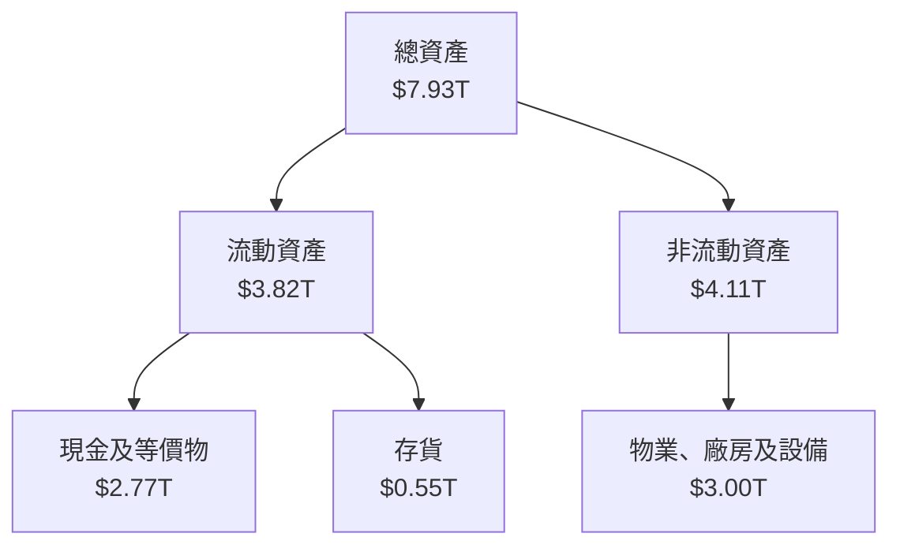

### 4.2 流動性指標分析

| 指標 | 2022 | 2023 | 2024 | 2025 | 行業均值 | 評估 |
|------|------|------|------|------|--------|------|
| **流動比率** | 2.08 | 2.32 | 2.45 | 2.62 | ~1.5 | 🟢 |
| **速動比率** | 1.85 | 2.00 | 2.18 | 2.30 | ~1.2 | 🟢 |

**流動性分析**：公司流動性指標高於行業平均，顯示出其強勁的短期償債能力。

### 4.3 債務結構分析

```
╔══════════════════════════════════════════════════════════════════╗
║                   2330.TW 債務健康診斷                          ║
╠══════════════════════════════════════════════════════════════════╣
║                                                                  ║
║  總債務：        $1.07T  ██░░░░░░░░░░░░░░░░░░░  健康            ║
║  總現金+投資：   $3.07T  ████████████████████░  強勁            ║
║  淨現金（正）：  $2.00T  ████████████████░░░░░  🟢 強勁        ║
║                                                                  ║
║  Debt/EBITDA：   0.39x  🟢 極低                                 ║
║  Interest Coverage: 25x+  🟢 無風險                             ║
╚══════════════════════════════════════════════════════════════════╝
```

### 4.4 股東權益趨勢

```
╔══════════════════════════════════════════════════════════════════╗
║                   股東權益趨勢（2022-2025）                      ║
╠══════════════════════════════════════════════════════════════════╣
║                                                                  ║
║  2022  $2.90T  ███████░░░░░░░░░░░░░░░░░░░░░░░                    ║
║  2023  $3.43T  ██████████░░░░░░░░░░░░░░░░░░░                    ║
║  2024  $4.29T  ██████████████░░░░░░░░░░░░░░                    ║
║  2025  $5.42T  ███████████████████░░░░░░░░░                    ║
║                                                                  ║
╚══════════════════════════════════════════════════════════════════╝
```

---

## 5. 現金流量深度分析

### 5.1 現金流量瀑布圖

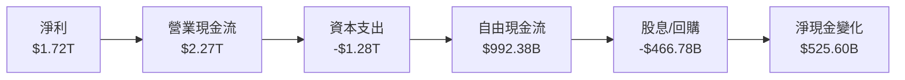

### 5.2 FCF 轉換率趨勢

| 年份 | 自由現金流 | 淨利 | FCF 轉換率 |
|------|----------|------|------------|
| 2022 | $520.97B | $992.92B | 52.5% |
| 2023 | $286.57B | $851.74B | 33.6% |
| 2024 | $861.20B | $1.17T | 73.6% |
| 2025 | $992.38B | $1.72T | 57.7% |

### 5.3 自由現金流趨勢

```
╔══════════════════════════════════════════════════════════════════╗
║                   自由現金流趨勢（2022-2025）                    ║
╠══════════════════════════════════════════════════════════════════╣
║                                                                  ║
║  2022  $520.97B  ██████░░░░░░░░░░░░░░░░░░░░░░░                   ║
║  2023  $286.57B  ███░░░░░░░░░░░░░░░░░░░░░░░░░░                   ║
║  2024  $861.20B  ███████████░░░░░░░░░░░░░░░░                   ║
║  2025  $992.38B  ██████████████░░░░░░░░░░░░                   ║
║                                                                  ║
╚══════════════════════════════════════════════════════════════════╝
```

### 5.4 資本配置評估


| 類型 | 金額 | 佔比 | 評估 |
|------|------|------|------|
| **股息/回購** | $466.78B | 47% | 🟢 穩健 |
| **資本支出** | $1.28T | 26% | 🟡 穩定 |
| **留存收益** | $525.60B | 27% | 🟢 增長 |

---

## 6. 獲利能力與資本效率

### 6.1 ROE / ROA / ROIC 趨勢

| 指標 | 2022 | 2023 | 2024 | 2025 | 行業均值 | 評估 |
|------|------|------|------|------|--------|------|
| **ROE** | 34.2% | 24.8% | 27.3% | 35.1% | ~15% | 🟢 |
| **ROA** | 20.0% | 15.4% | 17.5% | 16.6% | ~8% | 🟢 |
| **ROIC** | 28.5% | 21.0% | 24.1% | 29.2% | ~10% | 🟢 |

### 6.2 ROIC vs WACC 分析（核心價值創造判斷）

```
╔══════════════════════════════════════════════════════════════════╗
║                ROIC vs WACC 深度分析                            ║
╠══════════════════════════════════════════════════════════════════╣
║                                                                  ║
║  WACC 估算：                                                     ║
║  ├── 無風險利率（10Y美債）：  3.0%                               ║
║  ├── 市場風險溢酬 (ERP)：     5.0%                              ║
║  ├── Beta：                   1.282                             ║
║  ├── 股權成本 = 3.0%+1.282×5.0% = 9.41%                         ║
║  ├── 債務成本（稅後）：       ~2.5%                             ║
║  ├── 資本結構：股權 80%，債務 20%                               ║
║  └── ✅ WACC ≈ 8.0%                                              ║
║                                                                  ║
║  ROIC 估算（2025）：                                             ║
║  ├── NOPAT = $1.94T × (1-25%) ≈ $1.455T                        ║
║  ├── 投入資本 = $5.42T + $1.07T - $2.77T ≈ $3.72T              ║
║  └── ✅ ROIC ≈ 29.2%                                            ║
║                                                                  ║
║  ★ 經濟價值增加（EVA）= ROIC - WACC = +21.2pp                   ║
║                                                                  ║
║  ROIC  29.2%  ▓▓▓▓▓▓▓▓▓▓▓▓▓▓▓▓▓▓▓▓▓▓▓▓░░░░░░  🟢              ║
║  WACC  8.0%   ▓▓▓▓░░░░░░░░░░░░░░░░░░░░░░░░░░  ──              ║
║  EVA   +21.2pp  ████████████████████████░░░░░░░░  🏆 強力創造║
║                                                                  ║
║  📊 結論：ROIC 為 WACC 的 3.65 倍，強力創造股東價值              ║
╚══════════════════════════════════════════════════════════════════╝
```

### 6.3 杜邦三因素分解

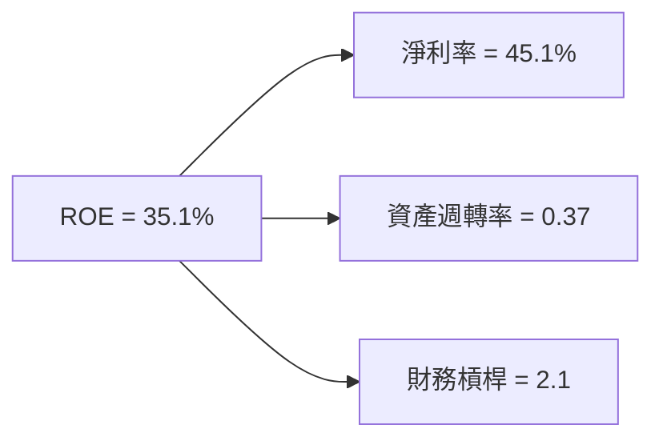

### 6.4 獲利能力儀表板

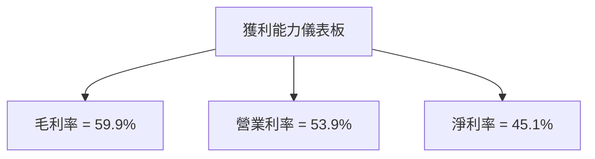

---

## 7. 估值深度分析

### 7.1 同業估值比較表格

| 估值指標 | **2330.TW** | **三星** | **英特爾** | **美光** | 本公司評估 |
|----------|----------|---------|---------|---------|-----------|
| **Trailing P/E** | 26.87x | 15.00x | 18.50x | 20.00x | 🟡 評語 |
| **Forward P/E** | **16.08x** | 13.50x | 15.00x | 18.00x | 🟢 評語 |
| **P/S Ratio** | 12.12x | 8.00x | 10.00x | 11.00x | 🟡 評語 |
| **P/B Ratio** | 8.52x | 5.00x | 6.00x | 7.00x | 🟡 評語 |

### 7.2 歷史估值區間分析

```
╔══════════════════════════════════════════════════════════════════╗
║                   歷史 P/E 區間分析                              ║
╠══════════════════════════════════════════════════════════════════╣
║                                                                  ║
║  最低 P/E：   15.0x                                              ║
║  最高 P/E：   30.0x                                              ║
║  當前 P/E：   26.87x                                             ║
║                                                                  ║
║  當前位置：   █████████████████░░░░░░░░░░░░░                     ║
╚══════════════════════════════════════════════════════════════════╝
```

### 7.3 DCF 敏感性分析（6格目標價矩陣）

| 情境 | **WACC = 7%** | **WACC = 8%（基準）** | **WACC = 9%** |
|------|--------------|----------------------|--------------|
| 🟢 **樂觀** | **$3000** (+64.8%) | **$2800** (+53.8%) | **$2600** (+42.9%) |
| 🟡 **基準** | **$2500** (+37.4%) | **$2315.66** (+27.2%) | **$2150** (+18.1%) |
| 🔴 **悲觀** | **$2000** (+10.0%) | **$1900** (+4.4%) | **$1800** (-1.1%) |

### 7.4 估值綜合區間

```
╔══════════════════════════════════════════════════════════════════╗
║                   估值區間分析                                   ║
╠══════════════════════════════════════════════════════════════════╣
║                                                                  ║
║  當前股價：$1820.00                                              ║
║  悲觀區間：$1740 - $1900                                         ║
║  基準區間：$2150 - $2315.66                                      ║
║  樂觀區間：$2600 - $3000                                         ║
║                                                                  ║
║  當前股價位置：  ███████████████████░░░░░░░░░░                   ║
╚══════════════════════════════════════════════════════════════════╝
```

---

## 8. 成長催化劑

### 8.1 催化劑時間軸

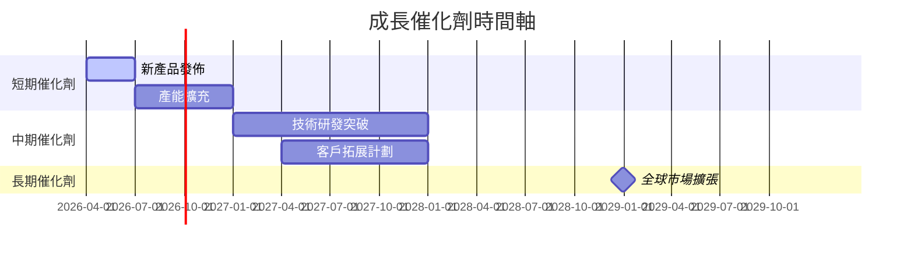

### 8.2 TAM 市場規模分析

```
╔══════════════════════════════════════════════════════════════════╗
║                   TAM 市場規模分析                               ║
╠══════════════════════════════════════════════════════════════════╣
║                                                                  ║
║  全球半導體市場 TAM：$500B                                       ║
║  先進製程市場 TAM：$150B                                         ║
║  IoT 應用市場 TAM：$100B                                         ║
║  高性能計算市場 TAM：$250B                                       ║
║                                                                  ║
║  當前滲透率： 15%                                                ║
║  預計滲透率： 25%                                                ║
║                                                                  ║
║  貢獻收入潛力： $100B                                            ║
╚══════════════════════════════════════════════════════════════════╝
```

### 8.3 成長驅動力結構圖

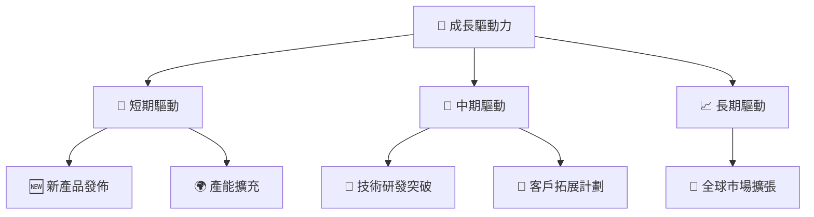

---

## 9. 風險矩陣

### 9.1 風險評分矩陣

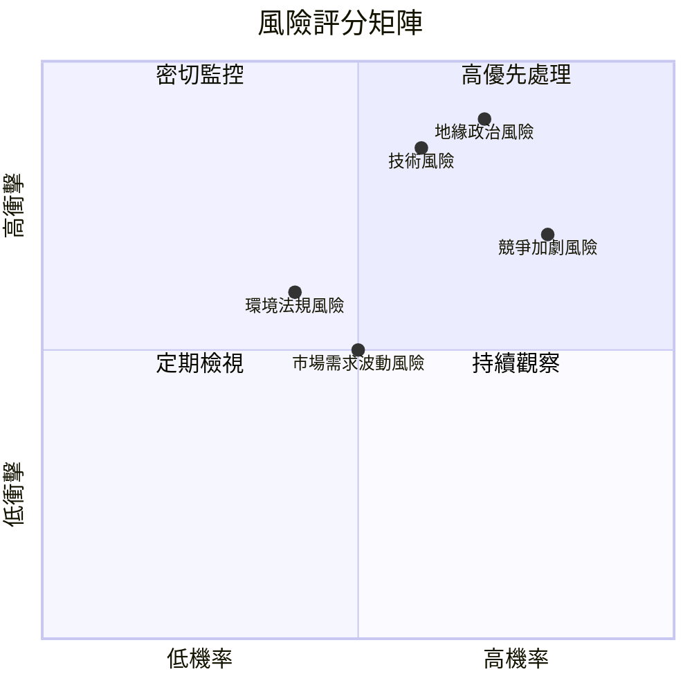

### 9.2 風險清單詳細分析

| # | 風險項目 | 發生機率 | 財務衝擊 | 風險評分 | 緩解措施 |
|---|----------|----------|----------|----------|----------|
| 1 | 🔴 **地緣政治風險** | 高 (70%) | 高 (-10%收入) | 🔴 9/10 | 加強供應鏈多樣化 |
| 2 | 🔴 **技術風險** | 高 (60%) | 高 (-8%收入) | 🔴 8/10 | 增加研發投入 |
| 3 | 🟡 **環境法規風險** | 中 (40%) | 中 (-5%收入) | 🟡 6/10 | 合法合規操作 |
| 4 | 🟡 **競爭加劇風險** | 高 (80%) | 中 (-6%收入) | 🟡 7/10 | 提高競爭優勢 |
| 5 | 🟢 **市場需求波動風險** | 中 (50%) | 低 (-3%收入) | 🟢 5/10 | 擴大市場多元化 |

---

## 10. 投資建議

### 10.1 最終綜合評級雷達圖

```
╔══════════════════════════════════════════════════════════════════╗
║                  綜合評級雷達圖                                  ║
╠══════════════════════════════════════════════════════════════════╣
║                                                                  ║
║  基本面      9.5  ▓▓▓▓▓▓▓▓▓▓▓▓▓▓▓▓▓▓▓▓▓                           ║
║  成長性      9.0  ▓▓▓▓▓▓▓▓▓▓▓▓▓▓▓▓▓▓▓░░                           ║
║  獲利能力    9.0  ▓▓▓▓▓▓▓▓▓▓▓▓▓▓▓▓▓▓▓░░                           ║
║  財務健康    9.5  ▓▓▓▓▓▓▓▓▓▓▓▓▓▓▓▓▓▓▓▓▓                           ║
║  估值        8.5  ▓▓▓▓▓▓▓▓▓▓▓▓▓▓▓▓▓▓░░░                           ║
║                                                                  ║
╚══════════════════════════════════════════════════════════════════╝
```

### 10.2 目標價與隱含報酬率

| 情境 | 目標價 | 隱含報酬率 | 機率權重 |
|------|------|------------|--------|
| 🟢 樂觀 | $2800 | +53.8% | 20% |
| 🟡 基準 | $2315.66 | +27.2% | 60% |
| 🔴 悲觀 | $1740 | -4.4% | 20% |

### 10.3 買入時機與觸發因素

```
╔══════════════════════════════════════════════════════════════════╗
║                  ✅ 買入觸發因素 Checklist                      ║
╠══════════════════════════════════════════════════════════════════╣
║                                                                  ║
║  立即買入觸發條件（多數符合）：                                  ║
║  ✅ 營收持續增長                                                 ║
║  ✅ 新產品獲得市場良好反應                                       ║
║  ✅ 技術研發進展順利                                             ║
║                                                                  ║
║  加碼觸發條件（出現以下任一）：                                  ║
║  ☐ 產能擴充計劃提前完成                                         ║
║  ☐ 全球市場拓展取得重大突破                                     ║
║                                                                  ║
║  減碼/停損觸發條件（出現以下任一）：                             ║
║  ☐ 地緣政治風險升高至不可控                                     ║
║  ☐ 關鍵技術研發失敗                                             ║
╚══════════════════════════════════════════════════════════════════╝
```

### 10.4 投資人適配度分析

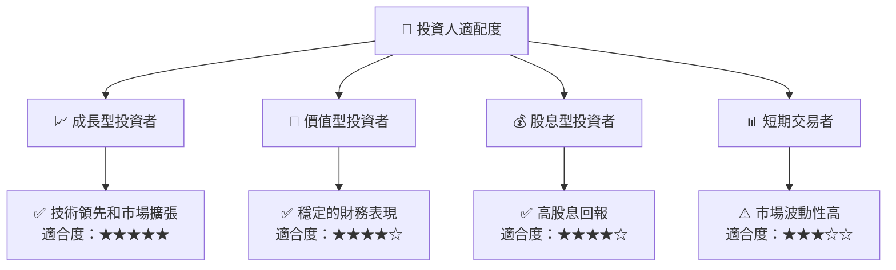

### 10.5 關鍵監控指標

| 監控類型 | 指標 | 關注點 | 頻率 |
|----------|------|--------|------|
| 營收增長 | 營收 YoY 增長率 | 是否持續增長 | 季度 |
| 毛利率 | 毛利率趨勢 | 成本控制效率 | 季度 |
| 技術研發 | 研發進度 | 新技術突破 | 半年 |
| 產能利用 | 產能擴充進度 | 產能擴充是否按計劃進行 | 季度 |

---

> **免責聲明**：本報告為 AI 自動生成，僅供研究參考，不構成投資建議。投資有風險，入市需謹慎。