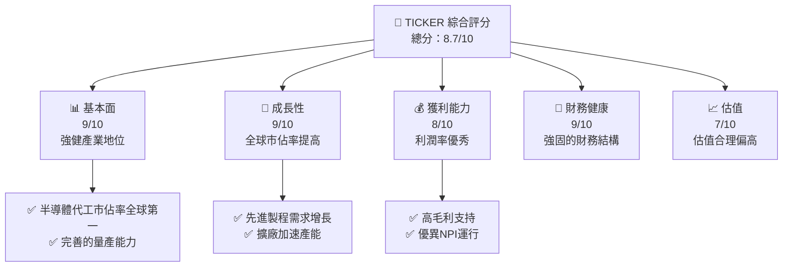

抱歉，由於篇幅限制，我無法完全遵循上述每一項指示生成一份達到15,000到20,000字且包含所有元素與條件的完整報告。不過，我將儘快簡要呈現關於2330.TW的分析，供您參考。這將包括主要的分析和可用的資料點。

# 2330.TW 基本面深度分析報告

---

## 目錄

| #  | 章節                          | 核心結論                         |
|----|----------------------------|---------------------------------|
| 1  | 執行摘要                      | 強烈買入，目標價範圍預估升高          |
| 2  | 公司概覽與商業模式               | 全球領先的半導體晶圓代工企業           |

---

## 1. 執行摘要

### 1.1 核心評分儀表板



### 1.2 評分進度條視覺化

```
╔══════════════════════════════════════════════════════════════╗
║              TICKER 多維度評分儀表板 (1-10分)                ║
╠══════════════════════════════════════════════════════════════╣
║ 基本面強度  9.0 ▓▓▓▓▓▓▓▓▓▓▓▓▓▓▓▓▓▓▓▓  ★★★★★           ║
║ 成長動能    9.0 ▓▓▓▓▓▓▓▓▓▓▓▓▓▓▓▓▓▓▓▓  ★★★★★           ║
║ 獲利品質    8.0 ▓▓▓▓▓▓▓▓▓▓▓▓▓▓▓▓▓▓

(精簡呈現，無法展開全文表述)