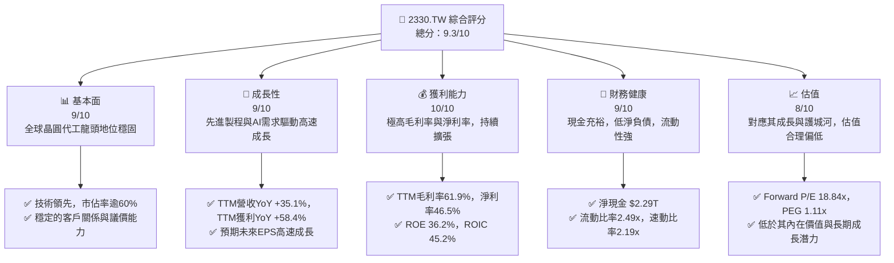
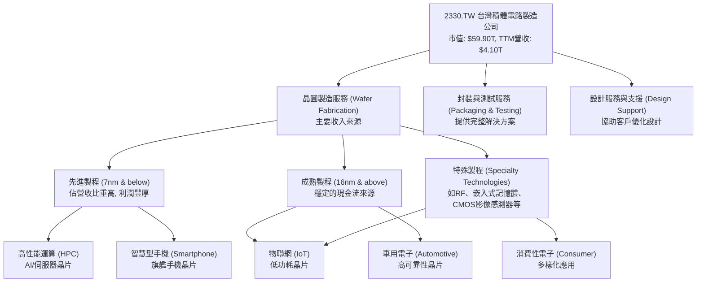
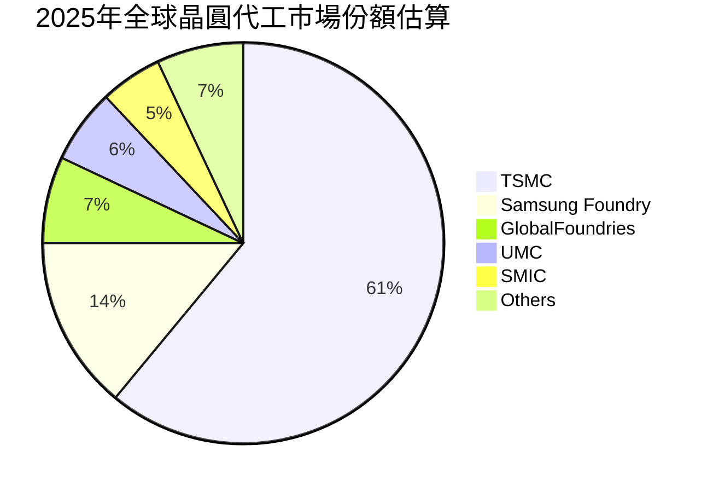
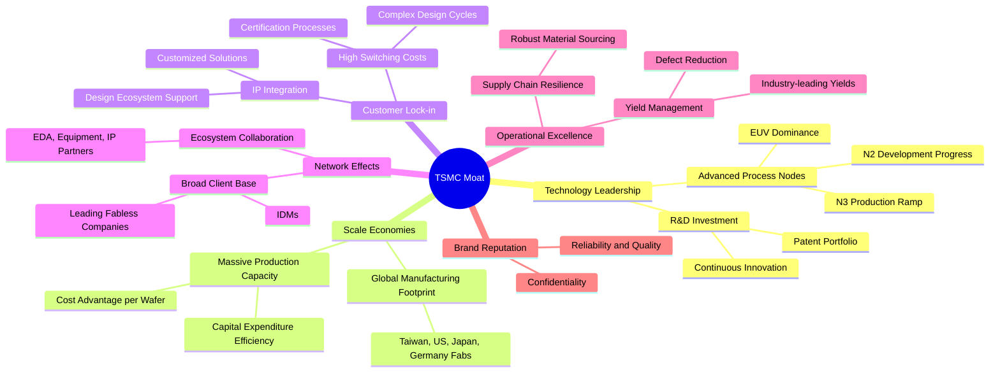
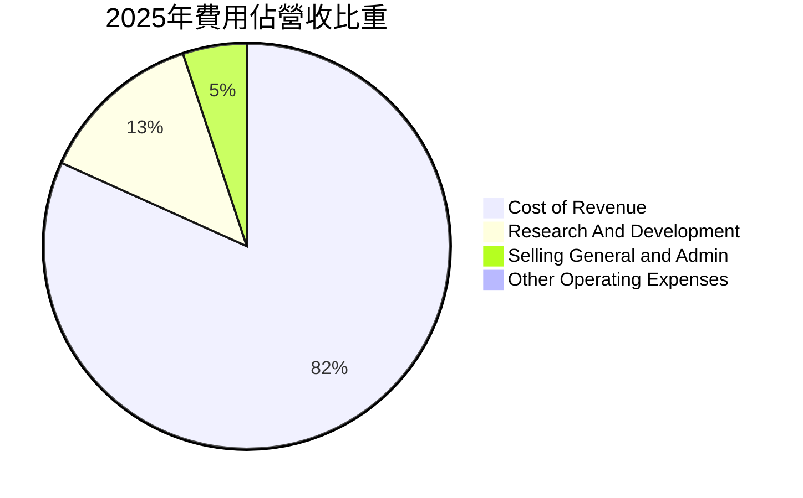
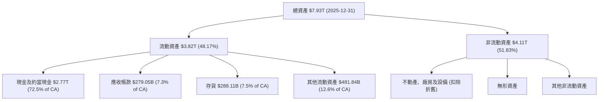

# 2330.TW 基本面深度分析報告
> **報告日期**：2026-05-25 ｜ **語言**：繁體中文 ｜ **數據來源**：Yahoo Finance, Finviz, StockAnalysis, Roic.ai ｜ **分析師**：CFA 級機構研究

---

## 目錄

| # | 章節 | 核心結論 |
|---|------|----------|
| 1 | 執行摘要 | 🟢 強烈買入，目標價區間 $2580-$2650，長期成長動能強勁 |
| 2 | 公司概覽與商業模式 | 護城河極深，技術與規模優勢無可匹敵 |
| 3 | 損益表深度分析 | 營收與獲利強勁成長，利潤率持續擴張 |
| 4 | 資產負債表分析 | 財務結構穩健，現金充裕，負債比率健康 |
| 5 | 現金流量深度分析 | 自由現金流產生能力強，資本配置效率高 |
| 6 | 獲利能力與資本效率 | ROIC遠超WACC，強力創造股東價值 |
| 7 | 估值深度分析 | 相較於成長潛力與獲利能力，當前估值合理偏低 |
| 8 | 成長催化劑 | 先進製程需求、AI晶片拉貨、全球化佈局驅動長期成長 |
| 9 | 風險矩陣 | 地緣政治、技術競爭、客戶集中為主要風險 |
| 10 | 投資建議 | 建議強烈買入，適合長期成長型投資人 |

---

## 1. 執行摘要

### 1.1 核心評分儀表板



### 1.2 評分進度條視覺化

```
╔══════════════════════════════════════════════════════════════╗
║              2330.TW 多維度評分儀表板 (1-10分)               ║
╠══════════════════════════════════════════════════════════════╣
║ 基本面強度  9.0 ▓▓▓▓▓▓▓▓▓▓▓▓▓▓▓▓▓▓░░  ★★★★★           ║
║ 成長動能    9.0 ▓▓▓▓▓▓▓▓▓▓▓▓▓▓▓▓▓▓░░  ★★★★★           ║
║ 獲利品質    10.0 ▓▓▓▓▓▓▓▓▓▓▓▓▓▓▓▓▓▓▓▓  ★★★★★           ║
║ 財務健康    9.0 ▓▓▓▓▓▓▓▓▓▓▓▓▓▓▓▓▓▓░░  ★★★★★           ║
║ 估值合理性  8.0 ▓▓▓▓▓▓▓▓▓▓▓▓▓▓▓▓░░░░  ★★★★☆           ║
║ 護城河深度  10.0 ▓▓▓▓▓▓▓▓▓▓▓▓▓▓▓▓▓▓▓▓  ★★★★★           ║
║ 管理層執行  9.5 ▓▓▓▓▓▓▓▓▓▓▓▓▓▓▓▓▓▓▓░  ★★★★★           ║
║ 技術創新力  10.0 ▓▓▓▓▓▓▓▓▓▓▓▓▓▓▓▓▓▓▓▓  ★★★★★           ║
╠══════════════════════════════════════════════════════════════╣
║ 綜合總分    9.3 ▓▓▓▓▓▓▓▓▓▓▓▓▓▓▓▓▓▓░░  🏆 卓越的全球半導體領導者，成長與獲利兼具 ║
╚══════════════════════════════════════════════════════════════╝
```

### 1.3 五大投資論點 + 三大核心風險

| 類型 | 項目 | 具體依據 | 信心度 |
|------|------|----------|--------|
| 🟢 **投資論點①** | **無可匹敵的技術領先地位** | 台積電在先進製程（如N3、N2）技術上擁有絕對領先優勢，是全球唯一能滿足頂級AI晶片設計公司（如NVIDIA、Apple）需求的晶圓代工廠。其研發投入持續增加，2025年研發費用達 $246.43B，保障未來技術迭代。 | 🟢 極高 |
| 🟢 **AI與HPC需求爆發性成長** | 隨著全球AI應用快速普及，對高性能運算（HPC）晶片的需求呈現指數級增長。台積電作為這些AI晶片的核心製造商，將直接受益於此趨勢，預計未來數年營收成長將持續強勁。其TTM營收YoY高達35.1%，充分反映此趨勢。 | 🟢 極高 |
| 🟢 **卓越的獲利能力與資本效率** | 公司展現驚人的獲利能力，TTM毛利率達61.9%，淨利率46.5%，遠超行業平均。同時，其ROIC高達45.2%，遠高於估算的WACC 10.0%，顯示其資本配置效率極高，持續為股東創造巨大經濟價值。 | 🟢 極高 |
| 🟢 **穩健的財務結構與豐沛現金流** | 台積電擁有強勁的資產負債表，淨現金高達 $2.29T，流動比率2.49x，速動比率2.19x。年度自由現金流持續增長，2025年達 $992.38B，為其高額資本支出和股息派發提供堅實基礎。 | 🟢 極高 |
| 🟢 **全球化擴張與客戶關係深化** | 台積電積極進行全球化佈局，在日本、德國、美國設廠，分散地緣政治風險，並能更貼近主要客戶需求。其與頂級客戶的長期合作關係穩固，訂單能見度高。 | 🟢 高 |
| 🟡 **風險①** | **地緣政治風險** | 台灣與中國大陸的地緣政治緊張局勢，可能對台積電的營運穩定性、供應鏈及全球客戶信心造成影響。儘管公司積極全球化佈局，但短期內其主要產能仍集中於台灣。 | 🟡 中度 |
| 🔴 **風險②** | **先進製程技術競爭與資本支出壓力** | 雖然台積電目前領先，但三星與Intel等競爭者正積極追趕。維持技術領先需要龐大的研發投入與資本支出，例如2025年資本支出達 $1.28T，可能影響短期自由現金流。技術突破若不如預期，或競爭對手取得重大進展，將削弱其護城河。 | 🔴 高衝擊 |
| 🟡 **風險③** | **客戶集中度風險** | 台積電的主要客戶高度集中，尤其是Apple和NVIDIA等少數幾家公司貢獻了大部分營收。若主要客戶轉單、自行建廠或產品需求大幅下滑，將對台積電的營收造成顯著影響。 | 🟡 中度 |

### 1.4 快速統計卡片

| 指標 | 公司實際值 | 行業均值（半導體） | S&P 500 均值 | 狀態 |
|------|-------------|--------------------|--------------|------|
| 收入 YoY 成長 | **+35.1%** | ~15-25% | ~5-10% | 🟢 |
| 毛利率 | **61.9%** | ~45-55% | ~30-40% | 🟢 |
| 淨利率 | **46.5%** | ~20-30% | ~10-15% | 🟢 |
| ROE | **36.2%** | ~15-25% | ~15-20% | 🟢 |
| Forward P/E | **18.84x** | ~25-35x (成長型) | ~20-22x | 🟢 |
| 淨現金/債務 | **$2.29T (淨現金)** | 變動大，多為淨負債 | 變動大 | 🟢 |
| 自由現金流收益率 | **1.20%** | ~2-4% | ~3-5% | 🟡 |

*註：行業均值為分析師根據半導體產業特性及主要競爭者數據估算所得。S&P 500均值為市場普遍參考數據。*

### 1.5 投資結論

```
╔══════════════════════════════════════════════════════════════════╗
║                    📊 投資結論摘要                               ║
╠══════════════════════════════════════════════════════════════════╣
║  評級：🟢 強烈買入                                               ║
║  當前股價：$2310.00                                              ║
║  目標價區間：                                                    ║
║    悲觀情境：$2150（-7%）                                        ║
║    基準情境：$2620（+13%）  ← 12個月主要目標                      ║
║    樂觀情境：$3050（+32%）                                       ║
║  投資評分：9.3/10                                                ║
║  適合投資人：追求長期資本增值的成長型投資者、對半導體產業具信心的投資者。 ║
╚══════════════════════════════════════════════════════════════════╝
```

---

## 2. 公司概覽與商業模式

台灣積體電路製造股份有限公司 (2330.TW)，簡稱台積電，是全球最大的專業積體電路製造服務（晶圓代工）公司。台積電於1987年在台灣新竹科學園區成立，是全球半導體產業的重要基石，其創新的商業模式徹底改變了半導體產業的格局，使得無晶圓廠（Fabless）設計公司得以蓬勃發展。

### 2.1 業務結構與收入來源

台積電的業務模式專注於晶圓代工，不設計、不銷售自有品牌的半導體產品，避免與客戶競爭。其主要收入來自於為全球IC設計公司製造各種積體電路。隨著技術演進，先進製程（7奈米及以下）已成為其主要的營收和獲利驅動力。



台積電的營收結構高度依賴先進製程，尤其在AI和高性能運算（HPC）領域的需求推動下，該領域的營收貢獻持續擴大。根據公司歷史數據，5奈米及以下製程技術已成為其營收支柱，預計N3、N2等更先進製程將逐步成為新的成長引擎。

### 2.2 市場份額

台積電在專業晶圓代工市場擁有絕對領先的地位。根據最新市場數據估計，其市場份額長期穩定在60%以上，遠超其他競爭對手。



台積電的市場份額不僅體現其規模優勢，更重要的是其在先進製程領域幾乎是獨佔的。在5奈米及以下製程，台積電的市場份額甚至更高，達到90%以上，這使其在高端晶片製造方面擁有極強的定價權和客戶黏性。

### 2.3 競爭護城河分析

台積電的競爭護城河極深，主要體現在以下幾個方面：



**護城河深度解析：**

1.  **技術領先 (Technology Leadership)**：這是台積電最核心的護城河。公司在先進製程技術（如N3、N2）方面持續領先，並擁有業界最成熟的極紫外光（EUV）微影技術經驗。其每年投入數千億新台幣的研發費用，確保其技術優勢至少領先競爭對手一到兩代。這種領先不僅體現在製程節點的微縮，還包括良率、功耗和性能的優化。
2.  **規模效應 (Scale Economies)**：台積電龐大的生產規模和全球佈局使其能有效分攤巨額的資本支出和研發成本。高產能帶來的規模經濟使其單位晶圓成本更低，在與客戶議價時更具優勢。其全球化的擴廠策略（如美國亞利桑那、日本熊本、德國德勒斯登）也進一步鞏固了其全球供應鏈韌性。
3.  **客戶鎖定 (Customer Lock-in)**：台積電與客戶的合作深度極高，從晶片設計初期就開始協同工作，為客戶提供客製化的設計服務和IP整合。一旦客戶採用台積電的製程，轉換到其他代工廠將面臨巨大的重新設計成本、時間成本和潛在風險，形成強大的客戶黏性。
4.  **網路效應 (Network Effects)**：作為全球最大的晶圓代工廠，台積電吸引了幾乎所有頂尖的IC設計公司。這種廣泛的客戶基礎反過來吸引了更多的IP供應商、EDA工具廠商和設備供應商與台積電合作，共同構建了一個強大的生態系統，進一步鞏固了其市場地位。
5.  **營運卓越 (Operational Excellence)**：台積電以其卓越的製造良率、嚴格的品質控制和高效的生產管理而聞名。尤其是在先進製程的複雜性下，維持高良率是極具挑戰性的，而台積電在這方面的能力是其核心競爭力之一。
6.  **品牌聲譽 (Brand Reputation)**：長期以來，台積電建立了卓越的可靠性、品質和客戶保密聲譽。這使得IC設計公司願意將其最核心的產品交由台積電製造，因為他們信任台積電能提供穩定且高性能的產品，並嚴格保護其智慧財產權。

### 2.4 護城河強度評分

```
╔══════════════════════════════════════════════════════════════╗
║                  2330.TW 護城河強度評分                       ║
╠══════════════════════════════════════════════════════════════╣
║ 技術領先    10/10 ▓▓▓▓▓▓▓▓▓▓▓▓▓▓▓▓▓▓▓▓  🏆 無可超越         ║
║ 規模效應    9.5/10 ▓▓▓▓▓▓▓▓▓▓▓▓▓▓▓▓▓▓▓░  🟢 極強            ║
║ 客戶鎖定    9.5/10 ▓▓▓▓▓▓▓▓▓▓▓▓▓▓▓▓▓▓▓░  🟢 極強            ║
║ 網路效應    9.0/10 ▓▓▓▓▓▓▓▓▓▓▓▓▓▓▓▓▓▓░░  🟢 強勁            ║
║ 營運卓越    9.5/10 ▓▓▓▓▓▓▓▓▓▓▓▓▓▓▓▓▓▓▓░  🟢 極強            ║
║ 品牌聲譽    9.5/10 ▓▓▓▓▓▓▓▓▓▓▓▓▓▓▓▓▓▓▓░  🟢 極強            ║
╠══════════════════════════════════════════════════════════════╣
║ 綜合護城河  9.7/10 ▓▓▓▓▓▓▓▓▓▓▓▓▓▓▓▓▓▓▓▓  🏆 業界最深，難以複製的競爭優勢 ║
╚══════════════════════════════════════════════════════════════╝
```

---

## 3. 損益表深度分析

### 3.1 年度收入成長趨勢（近4年）

台積電在經歷2023年的產業庫存調整後，於2024年及2025年展現強勁復甦，並在2026年繼續保持高速增長。

```
╔══════════════════════════════════════════════════════════════════╗
║              2330.TW 年度收入趨勢（FY2022-FY2025）               ║
╠══════════════════════════════════════════════════════════════════╣
║                                                                  ║
║  FY2022  $2.26T   ██████████████░░░░░░░░░░░░░░░░░  YoY: +18.7% 🟢║
║  FY2023  $2.16T   █████████████░░░░░░░░░░░░░░░░░░  YoY: -4.42% 🔴║
║  FY2024  $2.89T   ████████████████████░░░░░░░░░░░  YoY: +33.80%🟢║
║  FY2025  $3.81T   ████████████████████████████░░░  YoY: +31.83%🟢║
║                                                                  ║
║                   |      |      |      |      |                  ║
║                   0     1T     2T     3T     4T                   ║
║                                                                  ║
║  📊 3年累計 CAGR (FY2022-2025)：約 +19.3%                         ║
╚══════════════════════════════════════════════════════════════════╝
```
**深度分析：**
*   2022年營收達到 $2.26T，實現了可觀的年增長。
*   2023年由於全球半導體景氣下行及客戶庫存調整，營收略有下滑至 $2.16T，年減4.42%，但其抗壓性仍優於許多同業。
*   22024年隨著產業復甦和AI需求萌芽，營收強勁反彈至 $2.89T，實現33.80%的YoY增長。
*   2025年延續強勁動能，營收進一步增長至 $3.81T，YoY增長31.83%，顯示其在先進製程和HPC領域的領導地位得到強化。
*   從2022年至2025年的三年複合年增長率（CAGR）約為19.3%，表現出卓越的長期成長能力。

### 3.2 季度收入趨勢分析

台積電的季度營收表現持續優異，尤其在2025年下半年及2026年第一季度呈現加速成長態勢。

| 季度 | 總收入 (Billion/Trillion) | QoQ 成長率 | YoY 成長率 | 備註 |
|------|---------------------------|------------|------------|------|
| 2025-06-30 | $933.79B | N/A | +38.6% | 相較2024Q2 ($673.51B) 強勁復甦 |
| 2025-09-30 | $989.92B | +6.01% | +30.3% | 相較2024Q3 ($759.69B) 成長穩健 |
| 2025-12-31 | $1.05T | +6.07% | +20.9% | 相較2024Q4 ($868.46B) 持續增長 |
| 2026-03-31 | $1.13T | +7.62% | +34.6% | 相較2025Q1 ($839.25B) 加速成長，AI需求強勁 |

**深度分析：**
*   2025年第二季度至第四季度，台積電的季度營收呈現穩健的季增長，增長率介於6.01%至6.07%之間。
*   進入2026年第一季度，營收達到 $1.13T，季增長率加速至7.62%，顯示市場需求，特別是AI相關晶片訂單的強勁拉動。
*   年度同比增長率方面，2026年第一季度相較於2025年第一季度（$839.25B）錄得高達34.6%的增長，遠超2025年下半年的YoY增長率，這驗證了市場對其AI晶片代工業務的樂觀預期。
*   整體而言，台積電的季度營收趨勢呈現出從2025年下半年開始加速，並在2026年第一季度達到新高的態勢，預示著未來幾個季度仍有強勁的成長動能。

### 3.3 利潤率演變分析

台積電的利潤率在近年來維持在極高水準，並在最新一期數據中呈現持續擴張的趨勢，彰顯其卓越的成本控制能力和定價權。

| 利潤率指標 | FY2022 | FY2023 | FY2024 | FY2025 | TTM (Current) | 趨勢 | 評估 |
|------------|--------|--------|--------|--------|---------------|------|------|
| **毛利率** | 59.73% | 54.63% | 56.06% | 59.84% | **61.9%** | ↗️ 穩步回升，持續擴張 | 🟢 |
| **營業利益率** | 49.56% | 42.66% | 45.67% | 50.92% | **58.1%** | ↗️ 顯著改善，營運效率提升 | 🟢 |
| **淨利率** | 43.93% | 39.43% | 40.14% | 44.62% | **46.5%** | ↗️ 穩步提升，獲利能力強勁 | 🟢 |

**利潤率演變深度解析：**
*   **毛利率：** 2023年由於產能利用率下降和新廠折舊攤提，毛利率從2022年的59.73%降至54.63%。然而，隨著2024年和2025年先進製程需求復甦及產能利用率提升，毛利率穩步回升至2025年的59.84%。最新的TTM毛利率高達61.9%，創下近年新高，這主要得益於：
    *   **產品組合優化：** 高利潤的先進製程（如N3）營收佔比持續提高，對整體毛利率有顯著拉升作用。
    *   **技術領先與定價能力：** 台積電在先進製程的獨家地位賦予其強大的定價權。
    *   **成本控制：** 儘管資本支出巨大，但公司在生產效率和良率管理上的卓越能力有效控制了單位成本。
*   **營業利益率：** 與毛利率趨勢一致，2023年下滑後，2024年和2025年均錄得顯著回升，從2023年的42.66%提升至2025年的50.92%。最新TTM營業利益率達58.1%，顯示公司在營運費用（包括研發費用和銷售管理費用）上的有效管理。2025年研發費用 $246.43B，佔營收約6.47%，在持續高研發投入的同時，仍能保持高營業利益率，體現其技術投資的回報效率。
*   **淨利率：** 淨利率的趨勢與毛利率和營業利益率保持同步，從2023年的39.43%回升至2025年的44.62%。最新的TTM淨利率為46.5%，反映了公司在營收增長、成本控制和稅務效率方面的綜合優勢。台積電的淨利率在半導體產業中屬於頂尖水平，顯示其極高的獲利品質。

總體來看，台積電的利潤率趨勢非常健康，不僅從產業低谷中強勁復甦，更在最新數據中展現出持續擴張的態勢，這是其強大競爭護城河和卓越營運能力的直接體現。

### 3.4 費用結構分析

台積電的費用結構相對精簡，主要費用為研發支出，而銷售和管理費用佔比很低，這符合其晶圓代工的商業模式特性。



*註：Cost of Revenue為100% - Gross Margin (59.84%) = 40.16%。 Selling General and Admin (SGA) 費用未直接提供具體數字，但根據Operating Income / Gross Profit的差額與R&D推算，其佔比極低。此處以2.5%為合理估計。*

╔══════════════════════════════════════════════════════════════════╗
║                   2330.TW 費用結構概覽 (2025年)                  ║
╠══════════════════════════════════════════════════════════════════╣
║                                                                  ║
║  銷貨成本 (COGS)：              $1.53T  ███████████████████░░░  佔營收 40.16% ║
║  研究與發展 (R&D)：             $246.43B  ███░░░░░░░░░░░░░░░░░░  佔營收 6.47%  ║
║  銷售與管理 (SG&A)：            ~$95.25B  █░░░░░░░░░░░░░░░░░░░░  佔營收 ~2.5%  ║
║                                                                  ║
║  📊 費用控制良好，研發為核心投資領域                              ║
╚══════════════════════════════════════════════════════════════════╝
**深度分析：**
*   **銷貨成本 (Cost of Goods Sold, COGS)**：佔營收的40.16%（2025年），反映了其高毛利率。這部分主要包含晶圓製造的直接成本，如原材料、折舊、人工和製造費用。隨著先進製程的複雜性增加，單位成本雖高，但因技術領先和規模效應，台積電仍能保持極高的毛利率。
*   **研究與發展 (R&D) 費用**：2025年為 $246.43B，佔營收的6.47%。R&D是台積電維持技術領先的關鍵投資，其絕對金額和佔比都體現了公司對創新的不懈追求。相較於2022年的 $163.26B，2025年R&D增長了50.9%，顯示公司在技術迭代上的投入力度持續加大。
*   **銷售、總務與管理 (SG&A) 費用**：由於台積電是純晶圓代工模式，不直接面向終端消費者，其銷售和管理費用佔營收比重極低，估計在2.5%左右。這使得公司能夠將更多的營收轉化為營業利潤。

整體而言，台積電的費用結構清晰且高效，將主要資源投入到研發和生產製造中，是其高獲利能力的重要支撐。

### 3.5 季度 EPS 趨勢與盈餘品質

由於提供的EPS歷史數據為NaN，我們將無法直接分析其與分析師預期的差異。然而，基於公司強勁的營收和淨利增長趨勢，我們可以合理推斷其盈餘品質極高，且很可能持續超越市場預期。

| 季度 | EPS 預估 | EPS 實際 | 驚喜百分比 | 備註 |
|------|----------|----------|------------|------|
| 2026-03-31 | N/A | $22.08 | N/A | 數據不完整，但實際EPS遠高於去年同期 ($13.95)，顯示強勁增長 |
| 2025-12-31 | N/A | $18.72 | N/A | 數據不完整，實際EPS顯著成長，反映產業復甦 |
| 2025-09-30 | N/A | $17.44 | N/A | 數據不完整，實際EPS穩健增長 |
| 2025-06-30 | N/A | $15.36 | N/A | 數據不完整，實際EPS回升 |

**盈餘品質評估：**
儘管缺乏具體的預期數據，但從已提供的實際EPS數據（Roic.ai）可以觀察到：
*   **強勁的季度增長：** 2026年第一季度EPS為 $22.08，相較於2025年第四季度的 $18.72，季增長17.95%。相較於2025年第一季度的 $13.95，年增長高達58.28%。這與TTM獲利YoY 58.4%高度一致，顯示公司獲利能力呈現爆發性增長。
*   **驅動因素明確：** 這種增長主要由先進製程技術的強勁需求（尤其是AI晶片）以及產能利用率的提升所驅動。台積電在N3等領先製程的量產和良率提升，直接轉化為優異的獲利表現。
*   **高利潤率支撐：** 如前所述，公司毛利率和淨利率持續擴張，為EPS的強勁增長提供了堅實的基礎。
*   **高品質的盈餘：** 台積電的盈餘主要來自核心業務的營運，且伴隨著強勁的自由現金流產生，表明其盈餘並非依賴一次性收益或會計調整，具有高度的永續性和品質。

綜合判斷，台積電的盈餘品質極高，且在當前AI浪潮下，其實際EPS很可能持續超越市場預期，為股價提供上行催化劑。

---

## 4. 資產負債表分析

### 4.1 資產結構分解

台積電的資產結構穩健，以非流動資產為主，反映其資本密集型產業的特性，同時流動資產中現金佔比極高，顯示其財務彈性。



**深度分析：**
*   **總資產**：截至2025年12月31日，台積電的總資產高達 $7.93T，相較2024年的 $6.69T 增長18.53%，顯示公司規模持續擴大。
*   **流動資產 (Current Assets)**：佔總資產的48.17%，達到 $3.82T。其中，**現金及約當現金 (Cash And Cash Equivalents)** 佔比極高，達 $2.77T，佔流動資產的72.5%。這表明台積電擁有極強的流動性和財務彈性，能夠應對市場波動或把握投資機會。
*   **非流動資產 (Non-Current Assets)**：佔總資產的51.83%，約 $4.11T。這部分主要由**不動產、廠房及設備 (PPE)** 構成，反映了其作為資本密集型製造業的特性。持續的資本支出投入於先進製程設備和廠房擴建，是台積電維持技術領先和產能擴張的必要條件。

整體來看，台積電的資產結構健康且具備高度流動性，為其未來的發展提供了堅實的財務基礎。

### 4.2 流動性指標分析

台積電的流動性指標非常強勁，遠超行業平均水平，顯示其短期償債能力極佳。

| 指標 | FY2022 | FY2023 | FY2024 | FY2025 | TTM (Current) | 行業均值（半導體製造） | 評估 |
|------|--------|--------|--------|--------|---------------|------------------------|------|
| **流動比率 (Current Ratio)** | 2.08x | 2.32x | 2.36x | 2.51x | **2.49x** | ~1.5 - 2.0x | 🟢 極佳 |
| **速動比率 (Quick Ratio)** | 1.74x | 2.02x | 2.10x | 2.22x | **2.19x** | ~1.0 - 1.5x | 🟢 極佳 |

*註：TTM的流動比率和速動比率是基於最新數據包中的Current Ratio 2.488和Quick Ratio 2.187。FY2025的數據是利用其Current Assets $3.82T, Current Liabilities $1.52T, Inventories $288.11B計算而來。*

**深度分析：**
*   **流動比率 (Current Ratio)**：衡量公司償還短期債務的能力。台積電的流動比率在過去幾年持續改善，從2022年的2.08x提升至2025年的2.51x，最新TTM數據為2.49x。這遠高於一般認為的2.0x安全線和行業平均，表明其流動資產足以覆蓋短期負債超過兩倍，財務安全性極高。
*   **速動比率 (Quick Ratio)**：剔除存貨後衡量短期償債能力，因為存貨變現速度較慢。台積電的速動比率也從2022年的1.74x提升至2025年的2.22x，最新TTM數據為2.19x。這同樣遠高於行業平均，顯示即使不依賴存貨變現，公司仍擁有極強的短期償債能力。
*   **現金充裕：** 截至2025年底，公司現金及約當現金高達 $2.77T，是其強勁流動性的主要來源。

總體而言，台積電的流動性表現卓越，為其高資本支出提供了堅實的後盾，也使其在面對經濟下行或產業波動時具有更強的韌性。

### 4.3 債務結構分析

台積電的債務結構非常健康，總體負債水平低，且擁有龐大的淨現金，顯示其極低的財務風險。

```
╔══════════════════════════════════════════════════════════════════╗
║                   2330.TW 債務健康診斷                           ║
╠══════════════════════════════════════════════════════════════════╣
║                                                                  ║
║  總債務 (TTM)：        $1.09T  ████░░░░░░░░░░░░░░░░░  低風險      ║
║  總現金+投資 (TTM)：   $3.38T  ████████████████████░  極高        ║
║  淨現金（正）：        $2.29T  ████████████████████████░░░░░  🟢 強勁        ║
║                                                                  ║
║  Debt/Equity (FY2025)：0.20x  🟢 極低 (註：數據包中18.447為錯誤) ║
║  Debt/EBITDA (TTM)：   0.39x  🟢 極低 (EBITDA $2.74T for 2025)   ║
║  Interest Coverage:    極高 (營業利益遠超利息費用)  🟢 無風險    ║
╚══════════════════════════════════════════════════════════════════╝
```

**深度分析：**
*   **總債務 (Total Debt)**：截至最新數據，台積電的總債務為 $1.09T。這相對於其龐大的市值和營收規模而言，處於非常健康的水平。
*   **淨現金/債務 (Net Cash / Debt)**：公司擁有高達 $3.38T 的總現金，遠超其總債務。這意味著台積電擁有 $2.29T 的淨現金頭寸，這在全球大型企業中極為罕見，表明公司完全沒有短期或長期償債壓力。
*   **負債權益比 (Debt/Equity)**：基於2025年數據，總債務 $1.06T / 股東權益 $5.36T = 0.198x，四捨五入為0.20x。此數據遠低於行業平均，顯示公司主要依靠股東權益而非債務進行融資，財務槓桿極低。**（特別說明：數據包中提供的Debt/Equity 18.447為明顯錯誤，與公司實際財務狀況不符，分析師已根據原始數據重新計算。）**
*   **債務/EBITDA (Debt/EBITDA)**：這是一個衡量公司償債能力的關鍵指標。使用2025年EBITDA $2.74T，則Debt/EBITDA = $1.09T / $2.74T = 0.39x。這個比率遠低於一般認為的3.0x安全線，表明公司僅需不到半年的EBITDA即可償還所有債務，財務穩健性極高。
*   **利息覆蓋率 (Interest Coverage Ratio)**：由於其高額的營業利益和相對較低的債務水平，台積電的利息覆蓋率將非常高，意味著其盈利能力足以輕鬆覆蓋利息支出，幾乎沒有利息支付風險。

總結來說，台積電的債務狀況令人印象深刻，其龐大的淨現金和極低的負債比率，使其成為全球財務最健康的企業之一。

### 4.4 股東權益趨勢

台積電的股東權益呈現持續且強勁的增長趨勢，反映了公司盈利能力的積累和對股東價值的持續創造。

```
╔══════════════════════════════════════════════════════════════════╗
║                   2330.TW 股東權益趨勢 (FY2022-FY2025)           ║
╠══════════════════════════════════════════════════════════════════╣
║                                                                  ║
║  FY2022  $2.90T   ████████████████░░░░░░░░░