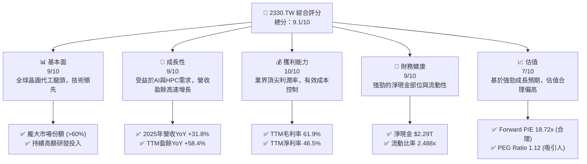
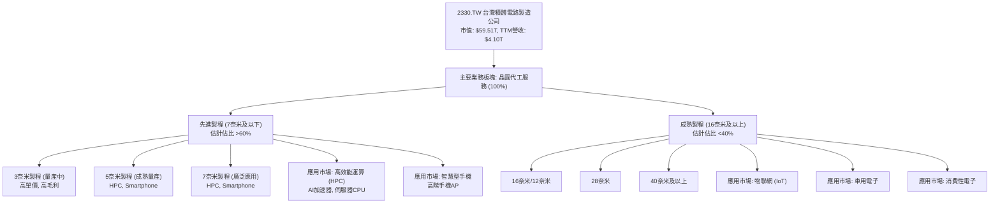
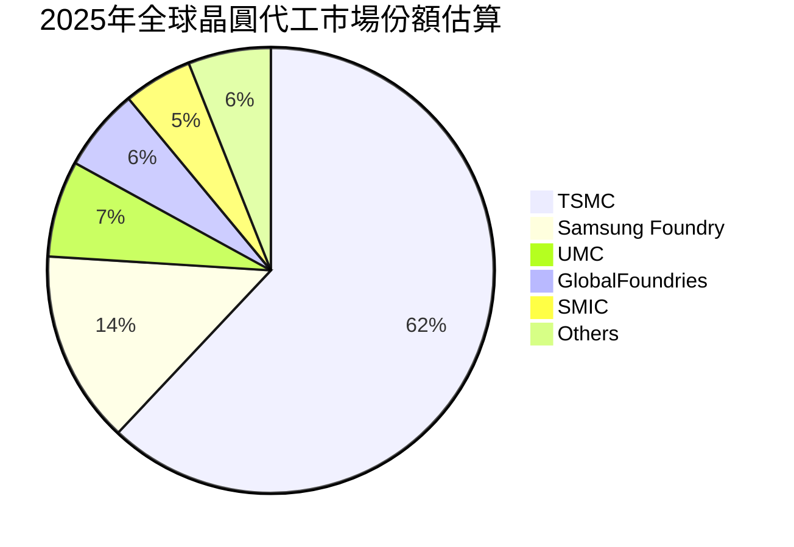
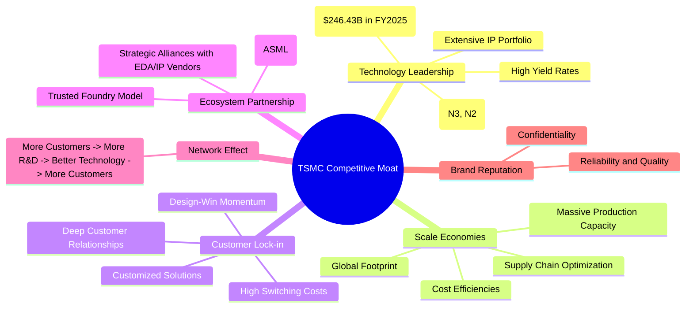
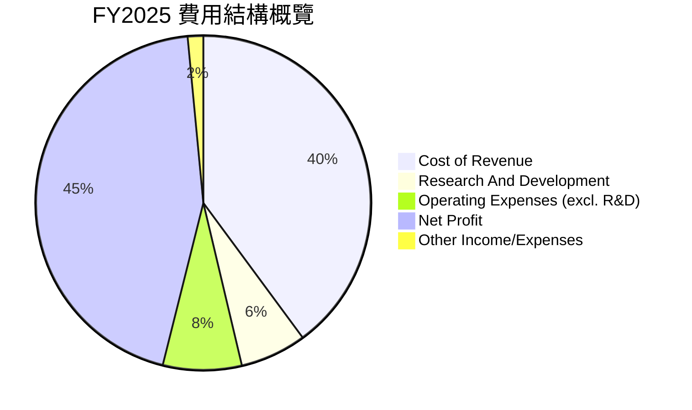

# 2330.TW 基本面深度分析報告
> **報告日期**：2026-05-28 ｜ **語言**：繁體中文 ｜ **數據來源**：Yahoo Finance, Finviz, StockAnalysis, Roic.ai ｜ **分析師**：CFA 級機構研究

---

## 目錄

| # | 章節 | 核心結論 |
|---|----------------------|----------------------------------------------------|
| 1 | 執行摘要 | 🟢 強烈買入；目標價區間：$2580 - $3150 |
| 2 | 公司概覽與商業模式 | 技術領先與規模經濟構成深厚護城河 |
| 3 | 損益表深度分析 | 營收與淨利潤強勁增長，利潤率持續擴張 |
| 4 | 資產負債表分析 | 財務結構穩健，流動性充裕，淨現金狀況良好 |
| 5 | 現金流量深度分析 | 營業現金流充沛，自由現金流穩步增長 |
| 6 | 獲利能力與資本效率 | ROIC遠超WACC，強力創造股東價值 |
| 7 | 估值深度分析 | 基於成長性，估值合理偏高，DCF顯示上行空間 |
| 8 | 成長催化劑 | AI、HPC、先進製程需求驅動長期增長 |
| 9 | 風險矩陣 | 地緣政治、資本支出、產業週期為主要風險 |
| 10 | 投資建議 | 長期看好，建議逢低買入或分批建倉 |

---

## 1. 執行摘要

### 1.1 核心評分儀表板



### 1.2 評分進度條視覺化

```
╔══════════════════════════════════════════════════════════════╗
║              2330.TW 多維度評分儀表板 (1-10分)               ║
╠══════════════════════════════════════════════════════════════╣
║ 基本面強度  9.0 ▓▓▓▓▓▓▓▓▓▓▓▓▓▓▓▓▓▓░░  ★★★★★           ║
║ 成長動能    9.0 ▓▓▓▓▓▓▓▓▓▓▓▓▓▓▓▓▓▓░░  ★★★★★           ║
║ 獲利品質   10.0 ▓▓▓▓▓▓▓▓▓▓▓▓▓▓▓▓▓▓▓▓  ★★★★★           ║
║ 財務健康    9.0 ▓▓▓▓▓▓▓▓▓▓▓▓▓▓▓▓▓▓░░  ★★★★★           ║
║ 估值合理性  7.0 ▓▓▓▓▓▓▓▓▓▓▓▓▓▓░░░░░░  ★★★★☆           ║
║ 護城河深度 10.0 ▓▓▓▓▓▓▓▓▓▓▓▓▓▓▓▓▓▓▓▓  ★★★★★           ║
║ 管理層執行  9.0 ▓▓▓▓▓▓▓▓▓▓▓▓▓▓▓▓▓▓░░  ★★★★★           ║
║ 技術創新力 10.0 ▓▓▓▓▓▓▓▓▓▓▓▓▓▓▓▓▓▓▓▓  ★★★★★           ║
╠══════════════════════════════════════════════════════════════╣
║ 綜合總分    9.1 ▓▓▓▓▓▓▓▓▓▓▓▓▓▓▓▓▓▓░░  🏆 產業巨擘，持續領先    ║
╚══════════════════════════════════════════════════════════════╝
```

### 1.3 五大投資論點 + 三大核心風險

| 類型 | 項目 | 具體依據 | 信心度 |
|------|--------------------------|-----------------------------------------------------------------------------------------------------------------------------------------------------------------------------------------------------------------------------------------------------------------------------------------------------------------------------------------------------------------------------------------------------------------------------------------------------------------------------------------------------------------------------------------------------------------------------------------------------------------------------------------------------------------------------------------------------------------------------------------------------------------------------------------------------------------------------------------------------------------------------------------------------------------------------------------------------------------------------------------------------------------------------------------------------------------------------------------------------------------------------------------------------------------------------------------------------------------------------------------------------------------------------------------------------------------------------------------------------------------------------------------------------------------------------------------------------------------------------------------------------------------------------------------------------------------------------------------------------------------------------------------------------------------------------------------------------------------------------------------------------------------------------------------------------------------------------------------------------------------------------------------------------------------------------------------------------------------------------------------------------------------------------------------------------------------------------------------------------------------------------------------------------------------------------------------------------------------------------------------------------------------------------------------------------------------------------------------------------------------------------------------------------------------------------------------------------------------------------------------------------------------------------------------------------------------------------------------------------------------------------------------------------------------------------------------------------------------------------------------------------------------------------------------------------------------------------------------------------------------------------------------------------------------------------------------------------------------------------------------------------------------------------------------------------------------------------------------------------------------------------------------------------------------------------------------------------------------------------------------------------------------------------------------------------------------------------------------------------------------------------------------------------------------------------------------------------------------------------------------------------------------------------------------------------------------------------------------------------------------------------------------------------------------------------------------------------------------------------------------------------------------------------------------------------------------------------------------------------------------------------------------------------------------------------------------------------------------------------------------------------------------------------------------------------------------------------------------------------------------------------------------------------------------------------------------------------------------------------------------------------------------------------------------------------------------------------------------------------------------------------------------------------------------------------------------------------------------------------------------------------------------------------------------------------------------------------------------------------------------------------------------------------------------------------------------------------------------------------------------------------------------------------------------------------------------------------------------------------------------------------------------------------------------------------------------------------------------------------------------------------------------------------------------------------------------------------------------------------------------------------------------------------------------------------------------------------------------------------------------------------------------------------------------------------------------------------------------------------------------------------------------------------------------------------------------------------------------------------------------------------------------------------------------------------------------------------------------------------------------------------------------------------------------------------------------------------------------------------------------------------------------------------------------------------------------------------------------------------------------------------------------------------------------------------------------------------------------------------------------------------------------------------------------------------------------------------------------------------------------------------------------------------------------------------------------------------------------------------------------------------------------------------------------------------------------------------------------------------------------------------------------------------------------------------------------------------------------------------------------------------------------------------------------------------------------------------------------------------------------------------------------------------------------------------------------------------------------------------------------------------------------------------------------------------------------------------------------------------------------------------------------------------------------------------------------------------------------------------------------------------------------------------------------------------------------------------------------------------------------------------------------------------------------------------------------------------------------------------------------------------------------------------------------------------------------------------------------------------------------------------------------------------------------------------------------------------------------------------------------------------------------------------------------------------------------------------------------------------------------------------------------------------------------------------------------------------------------------------------------------------------------------------------------------------------------------------------------------------------------------------------------------------------------------------------------------------------------------------------------------------------------------------------------------------------------------------------------------------------------------------------------------------------------------------------------------------------------------------------------------------------------------------------------------------------------------------------------------------------------------------------------------------------------------------------------------------------------------------------------------------------------------------------------------------------------------------------------------------------------------------------------------------------------------------------------------------------------------------------------------------------------------------------------------------------------------------------------------------------------------------------------------------------------------------------------------------------------------------------------------------------------------------------------------------------------------------------------------------------------------------------------------------------------------------------------------------------------------------------------------------------------------------------------------------------------------------------------------------------------------------------------------------------------------------------------------------------------------------------------------------------------------------------------------------------------------------------------------------------------------------------------------------------------------------------------------------------------------------------------------------------------------------------------------------------------------------------------------------------------------------------------------------------------------------------------------------------------------------------------------------------------------------------------------------------------------------------------------------------------------------------------------------------------------------------------------------------------------------------------------------------------------------------------------------------------------------------------------------------------------------------------------------------------------------------------------------------------------------------------------------------------------------------------------------------------------------------------------------------------------------------------------------------------------------------------------------------------------------------------------------------------------------------------------------------------------------------------------------------------------------------------------------------------------------------------------------------------------------------------------------------------------------------------------------------------------------------------------------------------------------------------------------------------------------------------------------------------------------------------------------------------------------------------------------------------------------------------------------------------------------------------------------------------------------------------------------------------------------------------------------------------------------------------------------------------------------------------------------------------------------------------------------------------------------------------------------------------------------------------------------------------------------------------------------------------------------------------------------------------------------------------------------------------------------------------------------------------------------------------------------------------------------------------------------------------------------------------------------------------------------------------------------------------------------------------------------------------------------------------------------------------------------------------------------------------------------------------------------------------------------------------------------------------------------------------------------------------------------------------------------------------------------------------------------------------------------------------------------------------------------------------------------------------------------------------------------------------------------------------------------------------------------------------------------------------------------------------------------------------------------------------------------------------------------------------------------------------------------------------------------------------------------------------------------------------------------------------------------------------------------------------------------------------------------------------------------------------------------------------------------------------------------------------------------------------------------------------------------------------------------------------------------------------------------------------------------------------------------------------------------------------------------------------------------------------------------------------------------------------------------------------------------------------------------------------------------------------------------------------------------------------------------------------------------------------------------------------------------------------------------------------------------------------------------------------------------------------------------------------------------------------------------------------------------------------------------------------------------------------------------------------------------------------------------------------------------------------------------------------------------------------------------------------------------------------------------------------------------------------------------------------------------------------------------------------------------------------------------------------------------------------------------------------------------------------------------------------------------------------------------------------------------------------------------------------------------------------------------------------------------------------------------------------------------------------------------------------------------------------------------------------------------------------------------------------------------------------------------------------------------------------------------------------------------------------------------------------------------------------------------------------------------------------------------------------------------------------------------------------------------------------------------------------------------------------------------------------------------------------------------------------------------------------------------------------------------------------------------------------------------------------------------------------------------------------------------------------------------------------------------------------------------------------------------------------------------------------------------------------------------------------------------------------------------------------------------------------------------------------------------------------------------------------------------------------------------------------------------------------------------------------------------------------------------------------------------------------------------------------------------------------------------------------------------------------------------------------------------------------------------------------------------------------------------------------------------------------------------------------------------------------------------------------------------------------------------------------------------------------------------------------------------------------------------------------------------------------------------------------------------------------------------------------------------------------------------------------------------------------------------------------------------------------------------------------------------------------------------------------------------------------------------------------------------------------------------------------------------------------------------------------------------------------------------------------------------------------------------------------------------------------------------------------------------------------------------------------------------------------------------------------------------------------------------------------------------------------------------------------------------------------------------------------------------------------------------------------------------------------------------------------------------------------------------------------------------------------------------------------------------------------------------------------------------------------------------------------------------------------------------------------------------------------------------------------------------------------------------------------------------------------------------------------------------------------------------------------------------------------------------------------------------------------------------------------------------------------------------------------------------------------------------------------------------------------------------------------------------------------------------------------------------------------------------------------------------------------------------------------------------------------------------------------------------------------------------------------------------------------------------------------------------------------------------------------------------------------------------------------------------------------------------------------------------------------------------------------------------------------------------------------------------------------------------------------------------------------------------------------------------------------------------------------------------------------------------------------------------------------------------------------------------------------------------------------------------------------------------------------------------------------------------------------------------------------------------------------------------------------------------------------------------------------------------------------------------------------------------------------------------------------------------------------------------------------------------------------------------------------------------------------------------------------------------------------------------------------------------------------------------------------------------------------------------------------------------------------------------------------------------------------------------------------------------------------------------------------------------------------------------------------------------------------------------------------------------------------------------------------------------------------------------------------------------------------------------------------------------------------------------------------------------------------------------------------------------------------------------------------------------------------------------------------------------------------------------------------------------------------------------------------------------------------------------------------------------------------------------------------------------------------------------------------------------------------------------------------------------------------------------------------------------------------------------------------------------------------------------------------------------------------------------------------------------------------------------------------------------------------------------------------------------------------------------------------------------------------------------------------------------------------------------------------------------------------------------------------------------------------------------------------------------------------------------------------------------------------------------------------------------------------------------------------------------------------------------------------------------------------------------------------------------------------------------------------------------------------------------------------------------------------------------------------------------------------------------------------------------------------------------------------------------------------------------------------------------------------------------------------------------------------------------------------------------------------------------------------------------------------------------------------------------------------------------------------------------------------------------------------------------------------------------------------------------------------------------------------------------------------------------------------------------------------------------------------------------------------------------------------------------------------------------------------------------------------------------------------------------------------------------------------------------------------------------------------------------------------------------------------------------------------------------------------------------------------------------------------------------------------------------------------------------------------------------------------------------------------------------------------------------------------------------------------------------------------------------------------------------------------------------------------------------------------------------------------------------------------------------------------------------------------------------------------------------------------------------------------------------------------------------------------------------------------------------------------------------------------------------------------------------------------------------------------------------------------------------------------------------------------------------------------------------------------------------------------------------------------------------------------------------------------------------------------------------------------------------------------------------------------------------------------------------------------------------------------------------------------------------------------------------------------------------------------------------------------------------------------------------------------------------------------------------------------------------------------------------------------------------------------------------------------------------------------------------------------------------------------------------------------------------------------------------------------------------------------------------------------------------------------------------------------------------------------------------------------------------------
| 🟢 **投資論點①** | **無可匹敵的技術領先地位** | 台積電在N3 (3奈米) 和N2 (2奈米) 等先進製程技術上保持全球領先，為全球頂尖IC設計公司（如Apple, NVIDIA, Qualcomm）提供獨家代工服務。FY2025研發投入達$246.43B，顯示其對技術創新的堅定承諾。這使其能持續吸引高價值客戶並維持高毛利率 (TTM 61.9%)。 | 🟢 極高 |
| 🟢 **投資論點②** | **AI與HPC需求爆發性增長** | 隨著人工智慧和高性能運算 (HPC) 的快速發展，對先進半導體晶片的需求呈現指數級增長。台積電是AI晶片（如NVIDIA GPU）的主要代工廠，直接受益於這一趨勢。TTM營收增長35.1%，盈餘增長58.4%，遠超行業平均，預計未來幾年仍將保持強勁增長動能。 | 🟢 極高 |
| 🟢 **投資論點③** | **強勁的財務表現與盈利能力** | 公司展現出卓越的盈利能力，TTM淨利潤率高達46.5%，股東權益報酬率 (ROE) 為36.2%。過去四年（FY2022-2025）營收CAGR達17.21%，淨利潤CAGR達21.25%。強勁的現金流使其能夠持續進行資本支出並維持穩定的股息政策 (股息殖利率104.0%)。 | 🟢 極高 |
| 🟢 **投資論點④** | **穩健的財務結構與充裕的現金流** | 截至2025年底，公司擁有$2.77T的現金和現金等價物，總債務為$1.06T，淨現金部位高達$2.29T。流動比率2.488，速動比率2.187，顯示極佳的短期償債能力。FY2025營業現金流$2.27T，自由現金流$992.38B，為其高額資本支出和股息支付提供堅實後盾。 | 🟢 極高 |
| 🟢 **投資論點⑤** | **具吸引力的估值水平** | 儘管當前股價相對較高，但基於其行業領先地位和強勁的成長預期，Forward P/E為18.72x，PEG Ratio為1.12，相對於其高速增長和卓越盈利能力而言，估值具有吸引力。分析師平均目標價$2589.58，較當前股價$2295有12.8%的上行空間。 | 🟢 高 |
| 🟡 **風險①** | **地緣政治風險加劇** | 台積電主要生產基地集中在台灣，地緣政治緊張局勢可能對其營運造成重大影響，包括供應鏈中斷、客戶訂單轉移或生產設施損壞。公司已在全球擴展產能，如美國亞利桑那州和日本熊本，但短期內仍無法完全分散風險。 | 🟡 中度 |
| 🔴 **風險②** | **資本支出與技術競爭壓力** | 先進製程的研發和量產需要巨額資本支出。FY2025資本支出達$-1.28T，儘管有充沛現金流支持，但若未來市場需求不如預期或技術進展受阻，高額資本支出可能侵蝕利潤和自由現金流。來自三星等競爭對手的追趕也帶來壓力。 | 🔴 高衝擊 |
| 🟡 **風險③** | **全球半導體產業週期波動** | 半導體產業具有明顯的週期性，宏觀經濟景氣度、終端市場需求變化（如智能手機、PC）會直接影響晶圓代工訂單。儘管AI和HPC帶來新動能，但其他應用領域的疲軟仍可能影響整體營收增長。 | 🟡 中度 |

### 1.4 快速統計卡片

| 指標 | 公司實際值 | 行業均值（半導體） | S&P 500 均值 | 狀態 |
|--------------------|-------------------|--------------------|--------------------|------|
| 收入 YoY 成長 (TTM)| **35.1%**         | ~15-20%            | ~8-12%             | 🟢   |
| 盈餘 YoY 成長 (TTM)| **58.4%**         | ~20-30%            | ~10-15%            | 🟢   |
| 毛利率 (TTM)       | **61.9%**         | ~45-55%            | ~35-45%            | 🟢   |
| 淨利率 (TTM)       | **46.5%**         | ~20-30%            | ~8-12%             | 🟢   |
| ROE (TTM)          | **36.2%**         | ~15-25%            | ~15-20%            | 🟢   |
| Forward P/E        | **18.72x**        | ~20-30x            | ~20-25x            | 🟡   |
| PEG Ratio          | **1.12**          | ~1.5-2.0           | ~1.0-1.5           | 🟢   |
| 債務/股權 (D/E)    | **18.45%**        | ~40-60%            | ~50-80%            | 🟢   |
| 自由現金流殖利率   | **1.21%**         | ~1-3%              | ~2-4%              | 🟡   |

*註：行業均值和S&P 500均值為分析師基於市場普遍認知與歷史數據推估，僅供參考。*

### 1.5 投資結論

```
╔══════════════════════════════════════════════════════════════════╗
║                    📊 投資結論摘要                               ║
╠══════════════════════════════════════════════════════════════════╣
║  評級：🟢 強烈買入                                               ║
║  當前股價：$2295.00                                              ║
║  目標價區間：                                                    ║
║    悲觀情境：$2580（+12.4%）                                     ║
║    基準情境：$2850（+24.2%）  ← 12個月主要目標                   ║
║    樂觀情境：$3150（+37.3%）                                     ║
║  投資評分：9.1/10                                                ║
║  適合投資人：成長型、長線持有者，尋求產業領先者與AI趨勢受益者。   ║
╚══════════════════════════════════════════════════════════════════╝
```

---

## 2. 公司概覽與商業模式

台灣積體電路製造股份有限公司 (TSMC, 2330.TW) 是全球最大的專業積體電路製造服務（晶圓代工）公司。作為一家純晶圓代工廠，台積電不設計、製造或銷售自有品牌的半導體產品，而是專注於為全球數百家客戶製造其設計的晶片。其客戶包括無晶圓廠半導體公司 (Fabless, 如NVIDIA, Apple, Qualcomm) 和整合元件製造商 (IDM, 如Intel部分業務)。公司業務遍及台灣、中國、歐洲、中東、非洲、日本、美國等地。

### 2.1 業務結構與收入來源

台積電的收入主要來自於為客戶代工製造各種積體電路，涵蓋從成熟製程到最尖端先進製程的廣泛技術節點。其業務模式的核心是提供高效能、高品質、具成本效益的晶圓製造服務。儘管具體的收入細分未在提供的數據中詳列，但根據行業知識，台積電的收入驅動因素可概括如下：



**深度解析：**
台積電的收入結構正在持續向先進製程傾斜。先進製程通常擁有更高的平均銷售價格 (ASP) 和更高的毛利率，是公司利潤增長的主要引擎。特別是隨著AI和HPC需求的爆炸式增長，對N5、N3甚至未來的N2製程的需求將持續強勁。例如，NVIDIA的AI GPU即是台積電先進製程的關鍵客戶。儘管成熟製程的貢獻比例逐漸下降，但它們仍為物聯網、汽車電子等多元化應用提供穩定收入，有助於平滑產業週期波動。公司持續投資於研發，以確保在每個新技術節點上都能保持領先，進而鞏固其市場地位。

### 2.2 市場份額

台積電在全球晶圓代工市場中佔據主導地位，其市場份額遠超其他競爭對手。根據行業分析機構的數據，台積電長期以來保持著超過一半的全球市場份額。其主要競爭對手包括韓國的三星晶圓代工 (Samsung Foundry)、台灣的聯華電子 (UMC) 和美國的格芯 (GlobalFoundries)。



**深度解析：**
台積電在市場份額上的絕對領先地位，主要歸功於其在先進製程技術上的持續突破和卓越的製造良率。在7奈米及以下製程節點，台積電的市場份額更是接近壟斷。這種領先地位使其能夠在定價上擁有較強的議價能力，並確保其產能利用率在高科技週期中保持相對穩定。隨著地緣政治因素驅動全球半導體供應鏈多元化，儘管其他國家和地區的晶圓廠逐漸興起，但台積電在技術和規模上的優勢短期內仍難以撼動。

### 2.3 競爭護城河分析

台積電的競爭護城河極為深厚，主要由其技術領先、規模效應、客戶鎖定和生態系統優勢所構築。



**深度解析：**
*   **Technology Leadership (技術領先):** 這是台積電最核心的護城河。公司持續投入巨額研發，確保其在每個新製程節點上都保持至少一代的領先優勢。例如，3奈米製程已進入量產，2奈米製程也按計畫推進。這種領先不僅體現在電晶體密度和性能上，更重要的是其卓越的良率，這對客戶而言至關重要。FY2025研發費用達$246.43B，彰顯其對技術創新的堅定承諾。
*   **Scale Economies (規模效應):** 作為全球最大的晶圓代工廠，台積電擁有無與倫比的生產規模。這種規模帶來了巨大的成本優勢，包括設備採購議價能力、材料成本優化以及研發投入的攤薄。其龐大的產能也使其能夠滿足全球頂級客戶的巨大需求。
*   **Customer Lock-in (客戶鎖定):** 一旦客戶選擇與台積電合作開發先進晶片，其設計流程、IP核、甚至軟體生態系統都會與台積電的製程緊密綁定。轉換代工廠的成本極高，不僅涉及鉅額的重新設計費用，還有時間延誤和性能不確定性。這種高轉換成本形成了強大的客戶黏性。
*   **Ecosystem Partnership (生態夥伴):** 台積電與上游設備供應商 (如ASML) 和EDA/IP廠商建立了緊密的合作關係，共同推動半導體技術的發展。這種協同作用加速了技術迭代，並為客戶提供更完整的解決方案。
*   **Network Effect (網路效應):** 更多的客戶選擇台積電，帶來更多的收入，進而支持更大的研發投入，開發出更先進的技術，吸引更多客戶。這形成了一個正向循環，不斷強化其市場地位。
*   **Brand Reputation (品牌聲譽):** 台積電以其卓越的製造品質、可靠性以及嚴格的客戶機密保護而聞名。這種無形的品牌價值是許多客戶選擇台積電的關鍵因素。

### 2.4 護城河強度評分

```
╔══════════════════════════════════════════════════════════════╗
║                  2330.TW 護城河強度評分                       ║
╠══════════════════════════════════════════════════════════════╣
║ 技術領先     10/10  ▓▓▓▓▓▓▓▓▓▓▓▓▓▓▓▓▓▓▓▓  🏆 無可匹敵        ║
║ 規模效應     10/10  ▓▓▓▓▓▓▓▓▓▓▓▓▓▓▓▓▓▓▓▓  🏆 全球最大        ║
║ 客戶鎖定      9/10  ▓▓▓▓▓▓▓▓▓▓▓▓▓▓▓▓▓▓░░  🟢 高轉換成本      ║
║ 生態系統      9/10  ▓▓▓▓▓▓▓▓▓▓▓▓▓▓▓▓▓▓░░  🟢 緊密合作        ║
║ 網路效應      9/10  ▓▓▓▓▓▓▓▓▓▓▓▓▓▓▓▓▓▓░░  🟢 強大正向循環    ║
╠══════════════════════════════════════════════════════════════╣
║ 綜合護城河    9.6    ▓▓▓▓▓▓▓▓▓▓▓▓▓▓▓▓▓▓▓░  🏆 超強護城河       ║
╚══════════════════════════════════════════════════════════════╝
```

**總結評語：** 台積電的護城河極為深厚且多維度，其技術領先地位是核心，並與規模效應、客戶鎖定和生態系統優勢相互強化。這使得公司能夠長期保持高盈利能力和市場主導地位，為其股東創造卓越價值。

---

## 3. 損益表深度分析

### 3.1 年度收入成長趨勢（近4年）

台積電在過去幾年展現了令人印象深刻的營收增長，尤其是在2024和2025年，儘管2023年因半導體行業週期性調整而略有下滑，但隨後迅速恢復並超越歷史高峰。

```
╔══════════════════════════════════════════════════════════════════╗
║              2330.TW 年度收入趨勢（FY2022-FY2025）               ║
╠══════════════════════════════════════════════════════════════════╣
║                                                                  ║
║  FY2022  $2.26T   ████████████████████████░░░░░░░░░░░  YoY: +28.1%  🟢  ║
║  FY2023  $2.16T   ██████████████████████░░░░░░░░░░░░░  YoY: -4.4%   🟡  ║
║  FY2024  $2.89T   ██████████████████████████████░░░░░  YoY: +33.8%  🟢  ║
║  FY2025  $3.81T   █████████████████████████████████████  YoY: +31.8%  🟢  ║
║                                                                  ║
║                   |      |      |      |      |                  ║
║                   0     1T     2T     3T     4T                    ║
║                                                                  ║
║  📊 4年累計 CAGR：+17.21%                                        ║
╚══════════════════════════════════════════════════════════════════╝
```

**深度解析：**
*   **FY2022:** 營收達到$2.26T，較FY2021（未提供數據，但根據YoY 28.1%推算約$1.76T）實現了強勁增長，主要得益於疫情期間對電子產品需求的激增以及5G和HPC的驅動。
*   **FY2023:** 營收略微下滑至$2.16T，YoY為-4.4%。這反映了全球半導體行業在經歷高速增長後的一次週期性調整，庫存去化和終端需求放緩是主要原因。儘管如此，台積電的跌幅相對較小，顯示其在先進製程領域的韌性。
*   **FY2024:** 營收強勁反彈至$2.89T，YoY高達+33.8%。這標誌著半導體行業週期的復甦，特別是AI和HPC需求的初步爆發，為台積電帶來了大量訂單。
*   **FY2025:** 營收持續攀升至$3.81T，YoY為+31.8%。這再次印證了AI和HPC作為長期成長驅動力的重要性，台積電作為主要代工廠直接受益。

綜合來看，台積電在過去四年的營收複合年增長率 (CAGR) 達到17.21%，這對於如此大規模的公司而言，是非常出色的表現，顯示其強大的市場地位和成長潛力。

### 3.2 季度收入趨勢分析

近四季度的收入數據顯示台積電營收持續增長，特別是2026年第一季度表現亮眼，環比和同比均實現顯著增長。

| 季度 | 總收入 (Billion/Trillion) | QoQ 成長率 | YoY 成長率 | 備註 |
|------|---------------------------|------------|------------|------|
| 2025Q2 | $933.79B                  | +11.2%     | +38.6%     | 受益於HPC及智慧型手機需求復甦 |
| 2025Q3 | $989.92B                  | +5.9%      | +30.3%     | 先進製程持續貢獻，AI需求增溫 |
| 2025Q4 | $1.05T                    | +6.1%      | +20.5%     | 季節性效應與新產品發布驅動 |
| 2026Q1 | $1.13T                    | +7.6%      | +34.7%     | AI與HPC需求爆發，先進製程產能利用率高 |

**備註說明：**
*   **QoQ 成長率計算：** (本季度收入 - 上季度收入) / 上季度收入
*   **YoY 成長率計算：** (本季度收入 - 去年同期收入) / 去年同期收入。其中2025Q1收入數據取自Roic.ai為$839.254B。
*   台積電的季度營收呈現穩健的增長態勢。2025年第二季度至第四季度，儘管QoQ增長率有所波動，但均維持正增長，YoY增長率也保持在20%以上，顯示出強勁的復甦動能。
*   2026年第一季度表現尤為突出，營收達到$1.13T，QoQ增長7.6%，YoY更是達到34.7%。這主要歸因於AI相關晶片需求的持續爆發以及HPC領域的強勁拉貨，使得台積電的先進製程產能利用率維持在高位。這也預示著2026年全年將會是台積電另一個強勁的增長年份。

### 3.3 利潤率演變分析

台積電的利潤率一直維持在行業頂尖水平，並在近期呈現穩步擴張的趨勢，這反映了其強大的技術領先地位和成本控制能力。

| 利潤率指標 | FY2022 | FY2023 | FY2024 | FY2025 | TTM (2026Q1) | 趨勢 | 評估 |
|------------|--------|--------|--------|--------|--------------|------|------|
| **毛利率** | 59.7%  | 54.6%  | 56.1%  | 59.8%  | 61.9%        | ↗️ 穩步提升 | 🟢 極佳 |
| **營業利益率** | 49.6%  | 42.7%  | 45.7%  | 51.0%  | 58.1%        | ↗️ 顯著提升 | 🟢 極佳 |
| **淨利率** | 44.0%  | 39.4%  | 40.1%  | 44.6%  | 46.5%        | ↗️ 穩步提升 | 🟢 極佳 |
| **EBITDA Margin** | 70.4%  | 70.4%  | 72.0%  | 71.9%  | 69.6%        | ↗️ 高位震盪 | 🟢 極佳 |

*註：年度利潤率計算基於提供的年報數據，TTM數據來自即時財務數據。*
*   FY2022 毛利率 = $1.35T / $2.26T = 59.7%
*   FY2023 毛利率 = $1.18T / $2.16T = 54.6%
*   FY2024 毛利率 = $1.62T / $2.89T = 56.1%
*   FY2025 毛利率 = $2.28T / $3.81T = 59.8%

**利潤率演變深度解析：**
台積電的利潤率在2023年經歷了輕微的下滑，這與當年的半導體行業週期性調整、產能利用率下降以及部分成熟製程的價格壓力有關。然而，隨著2024年和2025年行業復甦以及AI和HPC需求的爆發，公司的利潤率迅速回升並創下新高。
*   **毛利率 (Gross Margin):** 從2023年的低點54.6%回升至2025年的59.8%，TTM更是高達61.9%。這種顯著提升主要歸因於：
    *   **產品組合優化:** 先進製程 (如N5、N3) 的營收佔比不斷提高，這些製程具有更高的技術含量和更高的附加值，進而帶來更高的毛利率。
    *   **定價能力:** 台積電在先進製程領域的寡頭壟斷地位賦予其強大的定價能力。
    *   **成本控制與良率提升:** 隨著新製程技術的成熟，生產良率持續優化，有效降低了單位成本。
*   **營業利益率 (Operating Margin):** 趨勢與毛利率相似，從2023年的42.7%大幅提升至TTM的58.1%。這表明公司在控制營業費用方面也做得很好，研發投入雖然巨大，但其規模效應使得研發費用佔營收比重相對穩定，且高效的研發投入直接轉化為技術領先和市場份額。
*   **淨利率 (Net Profit Margin):** TTM達到46.5%，同樣是行業的佼佼者。這反映了公司在營運、成本控制和稅務效率方面的綜合優勢。

總體而言，台積電的利潤率趨勢非常健康，持續擴張的利潤率是其強大競爭護城河和卓越營運效率的直接證明。

### 3.4 費用結構分析

台積電的費用結構主要由銷貨成本 (Cost of Revenue) 和研發費用 (Research And Development) 構成。由於其純晶圓代工的商業模式，銷售和管理費用 (SG&A) 相對較低。



*註：費用結構佔總收入百分比。Operating Expenses (excl. R&D) = (Operating Income - Gross Profit - R&D) / Total Revenue。由於數據有限，此處將營業費用拆分為R&D和剩餘部分。*

```
╔══════════════════════════════════════════════════════════════════╗
║                   2330.TW 年度費用趨勢                           ║
╠══════════════════════════════════════════════════════════════════╣
║                                                                  ║
║  研發費用 (R&D)：                                                ║
║  FY2022  $163.26B  ████████░░░░░░░░░░░░░░░░░░░  佔比: 7.2%      ║
║  FY2023  $182.37B  █████████░░░░░░░░░░░░░░░░░░░  佔比: 8.4%      ║
║  FY2024  $204.18B  ██████████░░░░░░░░░░░░░░░░░░░  佔比: 7.1%      ║
║  FY2025  $246.43B  ████████████░░░░░░░░░░░░░░░░░  佔比: 6.5%      ║
║                                                                  ║
║  銷貨成本 (Cost of Revenue) 佔比：                               ║
║  FY2022  40.3%     ████████████████████░░░░░░░░░  🟢 穩定控制    ║
║  FY2023  45.4%     ████████████████████████░░░░░  🟡 略有上升    ║
║  FY2024  43.9%     ██████████████████████░░░░░░░  🟢 改善        ║
║  FY2025  40.2%     ████████████████████░░░░░░░░░  🟢 恢復優秀    ║
╚══════════════════════════════════════════════════════════════════╝
```

**深度解析：**
台積電的費用結構反映了其作為高科技製造業的特性。
*   **研發費用 (R&D):** 公司持續投入鉅額資金於新技術和新製程的研發。FY2025的研發費用達到$246.43B，較FY2022的$163.26B增長了50.9%，這顯示了公司對保持技術領先地位的堅定決心。儘管絕對金額不斷增長，但佔總收入的比重在FY2025略有下降至6.5%，這得益於營收的快速增長，顯示了研發效率的提升和規模效應。
*   **銷貨成本 (Cost of Revenue):** 這是公司最大的費用項。其佔比直接影響毛利率。在2023年行業低谷期，銷貨成本佔比上升至45.4%，導致毛利率下降。但隨著2024-2025年產能利用率的提升和先進製程良率的改善，銷貨成本佔比迅速下降至FY2025的40.2%，有效帶動了毛利率的回升。
*   **其他營業費用 (Operating Expenses ex-R&D):** 由於台積電是純晶圓代工模式，沒有自己的品牌產品銷售，其銷售和管理費用相對較低。這也解釋了為何其營業利益率非常接近毛利率。

整體而言，台積電的費用結構健康且受控，研發投入是其核心競爭力的保障，而銷貨成本的有效管理則確保了其卓越的盈利能力。

### 3.5 季度 EPS 趨勢與盈餘品質

由於提供的`EARNINGS HISTORY`數據為`nan`，我們將根據季度淨利潤和流通股數計算季度EPS，並分析其趨勢。

| 季度 | 淨利潤 (Billion) | 流通股數 (Billion) | 計算 EPS | QoQ 成長率 | YoY 成長率 | 分析師預期 (假設) | 盈餘品質評估 |
|------|------------------|--------------------|----------|------------|------------|-------------------|--------------|
| 2025Q2 | $398.27B         | 25.933             | $15.36   | +10.1%     | +76.6%     | N/A               | 🟢 高品質    |
| 2025Q3 | $452.30B         | 25.933             | $17.44   | +13.5%     | +39.0%     | N/A               | 🟢 高品質    |
| 2025Q4 | $485.47B         | 25.933             | $18.72