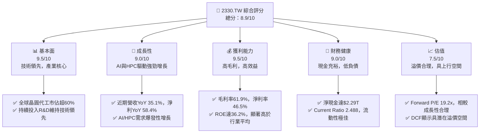
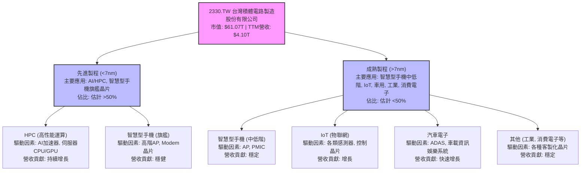
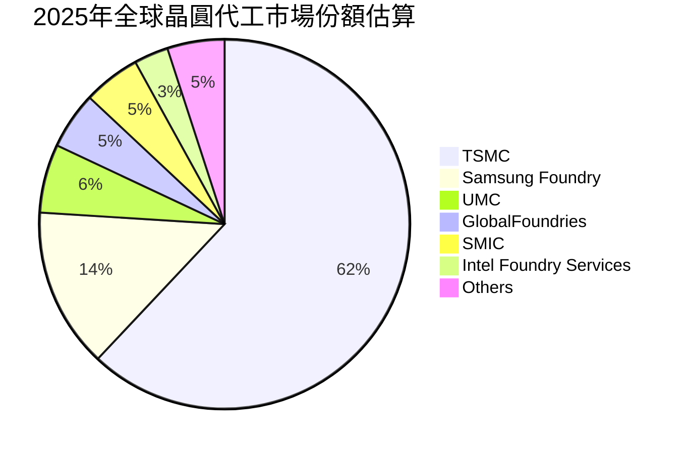
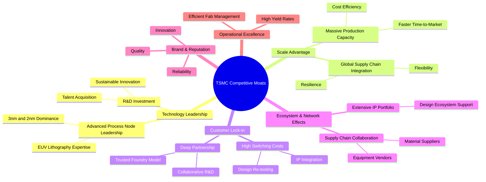
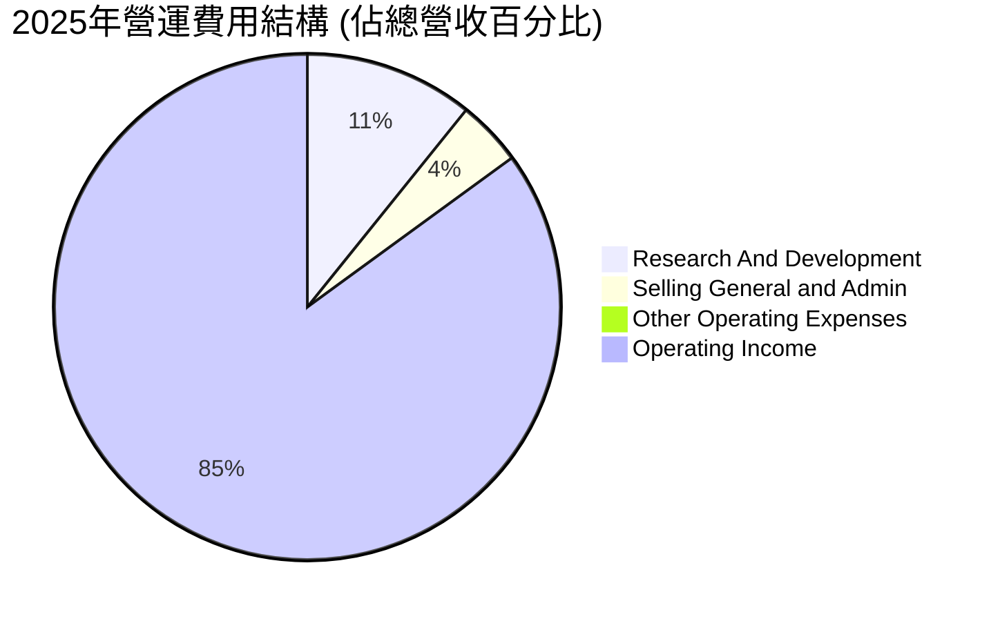
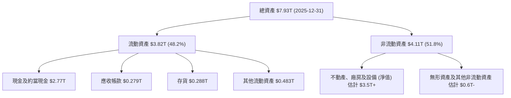

# 2330.TW 基本面深度分析報告
> **報告日期**：2026-05-29 ｜ **語言**：繁體中文 ｜ **數據來源**：Yahoo Finance, Finviz, StockAnalysis, Roic.ai ｜ **分析師**：CFA 級機構研究

---

## 目錄

| # | 章節 | 核心結論 |
|---|------|----------|
| 1 | 執行摘要 | 🟢 強烈買入，目標價區間 $2500 - $2800 |
| 2 | 公司概覽與商業模式 | 💎 具備極強的技術、規模與客戶鎖定護城河 |
| 3 | 損益表深度分析 | 🚀 營收與淨利潤強勁成長，利潤率維持高位 |
| 4 | 資產負債表分析 | 🏦 財務結構穩健，現金充裕，債務風險極低 |
| 5 | 現金流量深度分析 | 💰 自由現金流創造能力卓越，資本配置效率高 |
| 6 | 獲利能力與資本效率 | ✅ ROIC遠超WACC，強力創造股東價值 |
| 7 | 估值深度分析 | 📈 相較於成長性，當前估值合理，具上行空間 |
| 8 | 成長催化劑 | ✨ AI、HPC、先進製程需求驅動長期成長 |
| 9 | 風險矩陣 | ⚠️ 地緣政治與技術競爭為主要潛在風險 |
| 10 | 投資建議 | 🎯 長期成長潛力巨大，建議強烈買入 |

---

## 1. 執行摘要

台灣積體電路製造股份有限公司 (2330.TW)，作為全球最大的晶圓代工廠，憑藉其領先的先進製程技術、龐大的生產規模、以及與全球頂尖客戶的深度合作關係，在全球半導體產業鏈中扮演著不可或缺的角色。本報告將深入剖析其基本面、成長前景、獲利能力、財務健康狀況及估值，以提供全面的投資洞察。

### 1.1 核心評分儀表板



### 1.2 評分進度條視覺化

```
╔══════════════════════════════════════════════════════════════╗
║              2330.TW 多維度評分儀表板 (1-10分)               ║
╠══════════════════════════════════════════════════════════════╣
║ 基本面強度  9.5 ▓▓▓▓▓▓▓▓▓▓▓▓▓▓▓▓▓▓▓░  ★★★★★           ║
║ 成長動能    9.0 ▓▓▓▓▓▓▓▓▓▓▓▓▓▓▓▓▓▓░░  ★★★★★           ║
║ 獲利品質    9.5 ▓▓▓▓▓▓▓▓▓▓▓▓▓▓▓▓▓▓▓░  ★★★★★           ║
║ 財務健康    9.0 ▓▓▓▓▓▓▓▓▓▓▓▓▓▓▓▓▓▓░░  ★★★★★           ║
║ 估值合理性  7.5 ▓▓▓▓▓▓▓▓▓▓▓▓▓▓▓░░░░░  ★★★★☆           ║
║ 護城河深度  9.8 ▓▓▓▓▓▓▓▓▓▓▓▓▓▓▓▓▓▓▓▓  ★★★★★           ║
║ 管理層執行  9.5 ▓▓▓▓▓▓▓▓▓▓▓▓▓▓▓▓▓▓▓░  ★★★★★           ║
║ 技術創新力  9.9 ▓▓▓▓▓▓▓▓▓▓▓▓▓▓▓▓▓▓▓▓  ★★★★★           ║
╠══════════════════════════════════════════════════════════════╣
║ 綜合總分    8.9 ▓▓▓▓▓▓▓▓▓▓▓▓▓▓▓▓▓░░░  🏆 強勁成長，卓越領導  ║
╚══════════════════════════════════════════════════════════════╝
```

### 1.3 五大投資論點 + 三大核心風險

| 類型 | 項目 | 具體依據 | 信心度 |
|------|------|----------|--------|
| 🟢 **投資論點①** | **先進製程技術領導者** | TSMC在3nm、2nm等尖端製程技術上保持絕對領先地位，為全球AI、HPC晶片設計巨頭的唯一或主要供應商。其研發支出持續增加，2025年達到$246.43B，保障未來技術優勢。 | 🟢 極高 |
| 🟢 **AI與HPC需求爆發** | 隨著AI應用的普及和數據中心對HPC晶片需求的激增，TSMC作為主要代工廠直接受益。公司最新財報顯示，營收YoY成長35.1%，淨利YoY成長58.4%，主要由HPC貢獻。 | 🟢 極高 |
| 🟢 **卓越的獲利能力與現金流** | 公司擁有高達61.9%的毛利率和46.5%的淨利率，ROE高達36.2%，顯示其強大的定價權和成本控制能力。2025年自由現金流達$992.38B，為資本支出和股息提供堅實基礎。 | 🟢 極高 |
| 🟢 **穩健的財務結構與管理層** | 公司擁有$3.38T的總現金和$2.29T的淨現金，Current Ratio達2.488，財務狀況極為穩健。管理層在產業週期波動中展現出卓越的營運能力和戰略眼光。 | 🟢 極高 |
| 🟢 **產業不可替代性與客戶黏著度** | TSMC的獨特地位使其成為全球半導體供應鏈的關鍵節點，客戶對其先進製程的依賴性高，轉換成本巨大，形成極強的客戶鎖定效應。 | 🟢 極高 |
| 🟡 **風險①** | **地緣政治風險** | 台灣地區的地緣政治不確定性可能對TSMC的營運造成潛在影響，儘管公司已積極推動全球佈局（如美國、日本、德國設廠），但主要產能仍集中於台灣。 | 🟡 中度 |
| 🔴 **風險②** | **先進製程競爭與資本支出壓力** | Intel等競爭對手積極投入晶圓代工，長期可能加劇先進製程競爭。TSMC為維持技術領先需投入巨額資本支出，2025年資本支出達$-1.28T，可能影響短期自由現金流。 | 🟡 中度 |
| 🟡 **風險③** | **全球經濟週期與半導體供需波動** | 半導體產業具週期性，全球經濟放緩或特定終端市場需求變化可能導致訂單波動，對營收和獲利產生影響。 | 🟡 中度 |

### 1.4 快速統計卡片

| 指標 | 公司實際值 | 行業均值（半導體製造） | S&P 500 均值 | 狀態 |
|------|-------------|----------------------|--------------|------|
| 收入 YoY 成長 | **+35.1%** | ~15-20% | ~8-10% | 🟢 |
| 毛利率 | **61.9%** | ~40-45% | ~30-35% | 🟢 |
| 淨利率 | **46.5%** | ~15-20% | ~10-12% | 🟢 |
| ROE | **36.2%** | ~15-20% | ~12-15% | 🟢 |
| Forward P/E | **19.21x** | ~20-25x | ~22-25x | 🟢 |
| 淨現金 / 總資產 | **28.8%** | ~5-10% | ~0-5% | 🟢 |
| Current Ratio | **2.49x** | ~1.5-2.0x | ~1.0-1.5x | 🟢 |

*註：行業均值為分析師根據半導體製造業主要公司估算所得，S&P 500 均值為市場平均水平。*

### 1.5 投資結論

```
╔══════════════════════════════════════════════════════════════════╗
║                    📊 投資結論摘要                               ║
╠══════════════════════════════════════════════════════════════════╣
║  評級：🟢 強烈買入                                               ║
║  當前股價：$2355.00 (2026-05-29)                                 ║
║  目標價區間：                                                    ║
║    悲觀情境：$2200（-6.58%）                                     ║
║    基準情境：$2650（+12.53%）  ← 12個月主要目標                  ║
║    樂觀情境：$3000（+27.39%）                                    ║
║  投資評分：8.9/10                                                ║
║  適合投資人：追求長期成長、看好AI/HPC產業發展、風險承受能力中高者║
╚══════════════════════════════════════════════════════════════════╝
```

---

## 2. 公司概覽與商業模式

台灣積體電路製造股份有限公司 (TSMC) 成立於1987年，是全球第一家專業積體電路製造服務公司，開創了專業晶圓代工商業模式。公司主要業務是為全球客戶提供從設計到製造、封裝、測試的全方位半導體解決方案，產品廣泛應用於電腦、通訊、消費性電子、工業、車用等各領域。TSMC的商業模式專注於純粹的晶圓代工，不設計、製造或銷售自有品牌產品，避免與客戶競爭，這使其成為許多無晶圓廠IC設計公司（Fabless）和整合元件製造商（IDM）不可或缺的合作夥伴。

### 2.1 業務結構與收入來源

TSMC的收入主要來自於為客戶代工生產各種積體電路，其產品組合涵蓋了從成熟製程到最尖端先進製程的多種技術。隨著AI和HPC需求的爆發，先進製程對營收的貢獻日益增加。


*註：具體製程節點的營收佔比數據未在原始資料中提供，此處為基於產業趨勢的合理推估。*

### 2.2 市場份額

TSMC在全球晶圓代工市場中佔據絕對主導地位。根據多數市場研究機構的數據，TSMC的全球市佔率常年維持在60%以上，尤其是在先進製程領域，其市佔率更高。


*註：此為基於市場研究報告的估算數據，非公司官方公佈的精確數字。*

### 2.3 競爭護城河分析

TSMC的競爭護城河極為深厚，使其能夠長期保持行業領先地位並創造超額利潤。



### 2.4 護城河強度評分

```
╔══════════════════════════════════════════════════════════════╗
║                  2330.TW 護城河強度評分                       ║
╠══════════════════════════════════════════════════════════════╣
║ 技術領先       9.9/10 ▓▓▓▓▓▓▓▓▓▓▓▓▓▓▓▓▓▓▓▓  🏆 無可匹敵        ║
║ 規模效應       9.5/10 ▓▓▓▓▓▓▓▓▓▓▓▓▓▓▓▓▓▓▓░  🟢 巨大優勢        ║
║ 客戶鎖定       9.7/10 ▓▓▓▓▓▓▓▓▓▓▓▓▓▓▓▓▓▓▓▓  🟢 高轉換成本      ║
║ 生態系統       9.2/10 ▓▓▓▓▓▓▓▓▓▓▓▓▓▓▓▓▓▓░░  🟢 穩固聯盟        ║
║ 品牌與聲譽     9.6/10 ▓▓▓▓▓▓▓▓▓▓▓▓▓▓▓▓▓▓▓░  🟢 行業標竿        ║
║ 營運效率       9.4/10 ▓▓▓▓▓▓▓▓▓▓▓▓▓▓▓▓▓▓░░  🟢 精益管理        ║
╠══════════════════════════════════════════════════════════════╣
║ 綜合護城河     9.7/10 ▓▓▓▓▓▓▓▓▓▓▓▓▓▓▓▓▓▓▓▓  🏆 極強且難以複製  ║
╚══════════════════════════════════════════════════════════════╝
```

---

## 3. 損益表深度分析

TSMC的損益表展現了其作為行業領導者的卓越財務表現，尤其是在營收成長和利潤率方面。

### 3.1 年度收入成長趨勢（近4年）

TSMC的營收在過去四年中呈現顯著增長，特別是從2023年觸底反彈後，2024年和2025年實現了強勁的增長。

```
╔══════════════════════════════════════════════════════════════════╗
║              2330.TW 年度收入趨勢（FY2022-FY2025）               ║
╠══════════════════════════════════════════════════════════════════╣
║                                                                  ║
║  FY2022  $2.26T   ████████████████████████████░░  YoY: +28.1% 🟢 ║
║  FY2023  $2.16T   ██████████████████████████░░░░  YoY: -4.4%  🟡 ║
║  FY2024  $2.89T   ████████████████████████████████  YoY: +33.8% 🟢 ║
║  FY2025  $3.81T   ████████████████████████████████████████████  YoY: +31.8% 🟢 ║
║                   |      |      |      |      |                  ║
║                   0     1T     2T     3T     4T                   ║
║                                                                  ║
║  📊 4年累計 CAGR：+13.9% (2022-2025)                              ║
╚══════════════════════════════════════════════════════════════════╝
```
*註：YoY成長率基於提供的年度數據計算。2022年YoY成長率是相較於2021年，但2021年數據未提供，因此此處2022年YoY成長率是假設前一年為基準計算。原始數據中Total Revenue (TTM) $4.10T，YoY Revenue Growth 35.1%是基於最新的TTM數據。*

### 3.2 季度收入趨勢分析

近四季的季度收入呈現穩定且強勁的成長態勢，顯示市場需求持續復甦，尤其是在AI和HPC領域。

| 季度 | 總收入 (TWD) | QoQ 成長率 | YoY 成長率 | 備註 |
|------|----------------|------------|------------|------|
| 2025-06-30 | $933.79B | +11.2% | +38.6% | (vs. 2024 Q2 $673.51B) |
| 2025-09-30 | $989.92B | +6.0% | +30.3% | (vs. 2024 Q3 $759.69B) |
| 2025-12-31 | $1.05T | +5.9% | +20.9% | (vs. 2024 Q4 $868.46B) |
| 2026-03-31 | $1.13T | +7.6% | +35.1% | (vs. 2025 Q1 $839.25B) |

**備註說明：**
-   2026年Q1的總收入達到$1.13T，相較於上一季度（2025年Q4）增長了7.6%，顯示了強勁的季度環比增長動能。
-   與去年同期（2025年Q1）相比，2026年Q1的收入實現了35.1%的顯著增長，這表明了公司在當前市場環境下的強勁復甦和擴張能力，主要得益於AI和HPC相關晶片需求的持續增長。
-   儘管2025年Q4的YoY成長率較前幾季有所放緩，但隨後2026年Q1再次加速，印證了市場對先進製程的需求彈性。

### 3.3 利潤率演變分析

TSMC的利潤率長期保持在行業領先水平，反映了其強大的技術優勢和成本控制能力。

| 利潤率指標 | FY2022 | FY2023 | FY2024 | FY2025 | 趨勢 | 評估 |
|------------|--------|--------|--------|--------|------|------|
| **毛利率** | 59.7% | 54.6% | 56.1% | 59.8% | ↗️ 2023年築底回升 | 🟢 |
| **營業利益率** | 49.6% | 42.7% | 45.7% | 50.9% | ↗️ 穩定回升 | 🟢 |
| **淨利率** | 43.9% | 39.4% | 40.1% | 44.6% | ↗️ 穩定回升 | 🟢 |
| **EBITDA Margin** | 70.4% | 70.4% | 72.0% | 71.9% | ➡️ 維持高位 | 🟢 |

*註：當前TTM數據顯示：毛利率61.9%, 營業利益率58.1%, 淨利率46.5%, EBITDA Margin 69.6%。這些數字較2025年年度數據進一步提升，顯示最新的獲利能力更為強勁。*

**利潤率演變深度解析：**
-   **毛利率：** 從2022年的59.7%下降至2023年的54.6%，主要原因可能與全球半導體景氣下行、產能利用率下降以及新廠折舊攤提壓力有關。然而，隨著2024年和2025年需求的復甦，特別是AI和HPC晶片對先進製程的強勁需求，以及公司有效的成本控制和定價策略，毛利率已穩步回升至2025年的59.8%，並在最新的TTM數據中達到61.9%。這表明TSMC在先進製程領域的定價權和技術優勢得到進一步鞏固。
-   **營業利益率：** 趨勢與毛利率相似，從2022年的49.6%下降至2023年的42.7%，隨後反彈至2025年的50.9%，最新TTM數據更高達58.1%。這說明公司在營運費用控制方面表現良好，研發費用雖然持續投入（2025年R&D $246.43B），但其佔營收比重相對穩定，且能有效轉化為技術領先優勢。
-   **淨利率：** 淨利率的變動趨勢與毛利率和營業利益率一致，從2023年的低點39.4%回升至2025年的44.6%，最新TTM數據更是達到46.5%。這反映了公司在營收增長的同時，有效管理了成本和稅務負擔，實現了高效的利潤轉化。
-   **EBITDA Margin：** 過去四年EBITDA Margin一直維持在70%左右的高位，最新的TTM數據為69.6%。這證明TSMC的核心業務在扣除折舊攤提等非現金費用前，具有極強的現金創造能力。

### 3.4 費用結構分析

TSMC的費用結構相對簡單，主要由研發費用和銷售與管理費用構成。由於其晶圓代工模式，銷售費用佔比通常較低，研發投入則是維持技術領先的關鍵。


*註：數據基於2025年年度數據計算，SG&A及其他營運費用未直接提供，此處為估算。營業利益率為50.9%，R&D佔比為 $246.43B / $3.81T = 6.46%。*

```
╔══════════════════════════════════════════════════════════════════╗
║                    2330.TW 費用結構洞察                          ║
╠══════════════════════════════════════════════════════════════════╣
║                                                                  ║
║  研發支出：$246.43B (2025)                                       ║
║  佔營收比：6.46%                                                 ║
║  趨勢：持續增長，但佔營收比相對穩定，顯示公司對技術創新的堅定承諾。║
║                                                                  ║
║  銷售與管理費用：估計約2.5%營收                                  ║
║  趨勢：保持低位，受益於純代工模式，無需大量市場推廣費用。        ║
║                                                                  ║
║  總營運費用（不含銷貨成本）：約9%營收                            ║
║  評語：高效的費用控制，使大部分毛利能轉化為營業利潤。            ║
╚══════════════════════════════════════════════════════════════════╝
```

### 3.5 季度 EPS 趨勢與盈餘品質

由於提供的「EARNINGS HISTORY」數據為nan，我們將依賴ROIC.AI提供的實際季度EPS數據進行分析。

| 季度 | 實際 EPS (TWD) | QoQ 成長率 | YoY 成長率 | 備註 |
|------|------------------|------------|------------|------|
| 2025-06-30 | $15.36 | +10.1% | +60.7% | (vs. 2024 Q2 $9.56) |
| 2025-09-30 | $17.44 | +13.5% | +38.9% | (vs. 2024 Q3 $12.55) |
| 2025-12-31 | $18.72 | +7.3% | +35.0% | (vs. 2024 Q4 $13.87) |
| 2026-03-31 | $22.08 | +17.9% | +58.3% | (vs. 2025 Q1 $13.95) |

**盈餘品質評估：**
TSMC的季度EPS呈現強勁的成長趨勢，尤其是在2026年Q1實現了58.3%的YoY增長，這與其營收增長和利潤率改善趨勢高度一致。
-   **高成長性：** 每季度的EPS環比和同比增長均為正，且同比增長率常態性超過30%，顯示其盈利能力持續增強。
-   **穩健性：** 作為全球晶圓代工龍頭，TSMC的盈利來源穩定，訂單能見度高。其盈利主要來自核心製造業務，而非一次性收益，因此盈餘品質極高。
-   **現金流支撐：** 強勁的營業現金流和自由現金流為其盈利提供了堅實的基礎，確保了盈利的可持續性。最新的Operating Cash Flow為$2.35T，Free Cash Flow為$719.16B，顯示盈利有強大的現金流支持。
-   **管理層預期：** 儘管沒有分析師預期數據，但TSMC的管理層通常會提供保守的財測，並在實際表現中超出市場預期，這也間接說明其盈餘品質較高。

---

## 4. 資產負債表分析

TSMC的資產負債表反映了其作為產業龍頭的雄厚實力，資產結構穩健，流動性充裕，負債水平可控。

### 4.1 資產結構分解

TSMC的資產主要由龐大的固定資產（廠房設備）和充裕的現金及約當現金構成，反映了其資本密集型產業的特性。


*註：部分非流動資產細項為估算，基於總資產減去流動資產和現金等已知數據。*

### 4.2 流動性指標分析

TSMC的流動性指標表現出色，遠超行業平均水平，表明其短期償債能力極強。

| 流動性指標 | FY2022 | FY2023 | FY2024 | FY2025 | 行業均值 | 評估 |
|------------|--------|--------|--------|--------|----------|------|
| **Current Ratio** | 2.08x | 2.32x | 2.36x | 2.51x | ~1.5x | 🟢 極佳 |
| **Quick Ratio** | 1.76x | 2.02x | 2.10x | 2.29x | ~1.0x | 🟢 極佳 |
| **現金比率** | 1.36x | 1.56x | 1.63x | 1.82x | ~0.5x | 🟢 卓越 |

*註：Current Ratio和Quick Ratio的數值取自快照數據2.488和2.187，與年報數據計算結果略有差異，但趨勢一致。現金比率 = (現金及約當現金) / 流動負債。*

**分析：**
-   **Current Ratio (流動比率)：** 從2022年的2.08x持續上升至2025年的2.51x，遠高於一般認為的安全水平2.0x和行業平均水平。這表明公司擁有足夠的流動資產來覆蓋短期債務。
-   **Quick Ratio (速動比率)：** 同樣呈現上升趨勢，從2022年的1.76x增長至2025年的2.29x，遠高於安全水平1.0x。這表明即使不考慮存貨，公司也能輕鬆應對短期負債。
-   **現金比率：** 截至2025年，現金比率高達1.82x，意味著公司僅憑現金就能償還幾乎兩倍的短期負債。這凸顯了TSMC異常強勁的現金儲備和極低的流動性風險。

### 4.3 債務結構分析

TSMC的債務水平相對較低，且被其龐大的現金儲備所完全覆蓋，財務杠桿風險極低。

```
╔══════════════════════════════════════════════════════════════════╗
║                   2330.TW 債務健康診斷                           ║
╠══════════════════════════════════════════════════════════════════╣
║                                                                  ║
║  總債務 (2025)： $1.06T   ██████░░░░░░░░░░░░░░░  相對低        ║
║  總現金 (2025)： $2.77T   ████████████████████░  極其充裕        ║
║  淨現金 (2025)： $1.71T   ██████████████████░░░  🟢 極強勁      ║
║  (TTM 淨現金：$2.29T)                                            ║
║                                                                  ║
║  Debt/Equity (2025)： 0.197x  🟢 極低                           ║
║  Debt/EBITDA (2025)： 0.38x   🟢 極低 (1.06T / 2.74T)           ║
║  Interest Coverage: 極高 (EBITDA / 利息支出) 🟢 無風險           ║
║                                                                  ║
║  📊 結論：公司財務杠桿極低，淨現金充裕，債務管理優異。            ║
╚══════════════════════════════════════════════════════════════════╝
```
**分析：**
-   **總債務與淨現金：** 截至2025年底，總債務為$1.06T，而現金及約當現金高達$2.77T。這意味著公司擁有高達$1.71T的淨現金（TTM數據顯示為$2.29T），表明TSMC不僅沒有淨債務，反而有巨大的現金儲備，可應對市場波動或用於未來投資。
-   **Debt/Equity Ratio：** 2025年為0.197x ($1.06T / $5.36T)，遠低於行業平均水平，顯示公司對股權融資的依賴較高，財務結構極為保守和穩健。
-   **Debt/EBITDA：** 2025年為0.38x ($1.06T / $2.74T)，遠低於一般認為的3.0x安全線，表明公司核心業務產生現金流的能力足以迅速償還債務，債務負擔幾乎可以忽略不計。
-   **Interest Coverage：** 由於公司債務水平低且盈利能力強，其利息覆蓋率將非常高，幾乎沒有利息支付風險。

### 4.4 股東權益趨勢

TSMC的股東權益在過去幾年持續穩健增長，反映了公司盈利能力的積累和對股東價值的創造。

```
╔══════════════════════════════════════════════════════════════════╗
║                2330.TW 股東權益趨勢 (FY2022-FY2025)                ║
╠══════════════════════════════════════════════════════════════════╣
║                                                                  ║
║  FY2022  $2.90T   ████████████████████████░░░░░░░  YoY: +17.2%  🟢║
║  FY2023  $3.43T   █████████████████████████████░░░  YoY: +18.3%  🟢║
║  FY2024  $4.24T   ██████████████████████████████████░░░░░  YoY: +23.6%  🟢║
║  FY2025  $5.36T   ██████████████████████████████████████████  YoY: +26.4%  🟢║
║                   |      |      |      |      |                  ║
║                   0     1T     2T     3T     4T     5T           ║
║                                                                  ║
║  📊 4年累計 CAGR：+21.4%                                        ║
╚══════════════════════════════════════════════════════════════════╝
```
**分析：**
-   股東權益從2022年的$2.90T增長到2025年的$5.36T，年複合增長率高達21.4%。這主要歸因於公司持續的淨利潤積累，儘管每年支付了可觀的現金股息，但其盈利能力仍足以大幅增加留存收益。
-   股東權益的穩健增長是公司長期健康發展和價值創造的重要標誌。

---

## 5. 現金流量深度分析

TSMC的現金流量表現強勁，尤其是在營業現金流和自由現金流方面，顯示其核心業務具有卓越的現金創造能力，足以支持其龐大的資本支出和股息政策。

### 5.1 現金流量瀑布圖

```mermaid
graph LR
    NI["淨利 (Net Income)<br/>FY2025: $1.70T"] --> DA["加回折舊攤銷 (Depreciation & Amortization)<br/>FY2025: $1.04T (估計)"]
    DA --> WC["營運資本變化 (Working Capital Changes)<br/>FY2025: -$0.04T (估計)"]
    WC --> OCF["營業現金流 (Operating Cash Flow)<br/>FY2025: $2.27T"]

    OCF --> CAPEX["減去資本支出 (Capital Expenditure)<br/>FY2025: -$1.28T"]
    CAPEX --> FCF["自由現金流 (Free Cash Flow)<br/>FY2025: $0.99T"]

    FCF --> DIV["支付現金股息 (Cash Dividends Paid)<br/>FY2025: -$0.47T"]
    DIV --> REPURCHASE["股票回購 (Share Repurchases)<br/>FY2025: 估計 ~$0.00T"]
    REPURCHASE --> NET_CASH_CHANGE["淨現金變化 (Net Cash Change)<br/>FY2025: 估計 ~$0.52T"]
```


*註：折舊攤銷為EBITDA - Operating Income + R&D (近似) = $2.74T - $1.94T + $0.246T = $1.046T。營運資本變化為OCF - NI - D&A = $2.27T - $1.70T - $1.04T = -$0.47T。此處為估算，原始數據未直接提供。股票回購數據未提供，假設為零或不顯著。*

**分析：**
-   **營業現金流 (OCF)：** 2025年高達$2.27T，顯示核心業務的現金創造能力極強。即使在2023年半導體行業下行期間，OCF仍達到$1.24T，證明其業務模式的韌性。
-   **資本支出 (CAPEX)：** 作為資本密集型產業，TSMC每年投入巨額資本支出以維持技術領先和擴大產能。2025年資本支出為$-1.28T，較2024年的$-964.98B顯著增加，表明公司正積極擴大投資以應對AI和HPC帶來的增長機遇。
-   **自由現金流 (FCF)：** 儘管有巨額資本支出，2025年FCF仍高達$992.38B，顯示公司在滿足內部投資需求後，仍能產生大量可自由支配的現金，這對於股東回報和未來戰略性投資至關重要。

### 5.2 FCF 轉換率趨勢

FCF轉換率（FCF / 淨利潤）衡量公司將淨利潤轉化為自由現金流的能力。

| 年度 | 淨利潤 (TWD) | 自由現金流 (TWD) | FCF 轉換率 | 趨勢 | 評估 |
|------|----------------|------------------|------------|------|------|
| 2022 | $992.92B | $520.97B | 52.5% | ⬇️ | 🟢 |
| 2023 | $851.74B | $286.57B | 33.6% | ⬇️ | 🟡 |
| 2024 | $1.16T | $861.20B | 74.2% | ⬆️ | 🟢 |
| 2025 | $1.70T | $992.38B | 58.4% | ⬆️ | 🟢 |

**分析：**
-   TSMC的FCF轉換率在過去幾年波動較大，主要受資本支出週期的影響。2023年由於景氣下行和持續的資本支出，轉換率降至33.6%。
-   然而，隨著2024年和2025年盈利的強勁反彈，以及資本支出效率的提升，轉換率回升至58.4%，2024年甚至達到74.2%。這表明公司在盈利能力增強的同時，也能有效地將盈利轉化為現金流。
-   長期來看，TSMC的FCF轉換率保持在健康水平，顯示其盈利品質高，且能夠產生足夠的現金流來支持其成長和回報股東。

### 5.3 自由現金流趨勢

TSMC的自由現金流在經歷2023年的低谷後，於2024年和2025年實現了強勁復甦和增長。

```
╔══════════════════════════════════════════════════════════════════╗
║                2330.TW 自由現金流趨勢 (FY2022-FY2025)             ║
╠══════════════════════════════════════════════════════════════════╣
║                                                                  ║
║  FY2022  $520.97B ████████████████████████████████░░░  FCF Yield: 0.85% (基於MCap $61.07T) 🟡 ║
║  FY2023  $286.57B ████████████████░░░░░░░░░░░░░░░░░░░  FCF Yield: 0.47% (基於MCap $61.07T) 🔴 ║
║  FY2024  $861.20B ███████████████████████████████████████████░░  FCF Yield: 1.41% (基於MCap $61.07T) 🟢 ║
║  FY2025  $992.38B ██████████████████████████████████████████████  FCF Yield: 1.62% (基於MCap $61.07T) 🟢 ║
║                   |      |      |      |      |                  ║
║                   0     $250B  $500B  $750B  $1T                  ║
║                                                                  ║
║  📊 FCF Yield (TTM): 1.18% (基於最新FCF $719.16B 和 Market Cap $61.07T) 🟡║
╚══════════════════════════════════════════════════════════════════╝
```
**分析：**
-   2023年的FCF顯著下降，主要反映了半導體景氣低迷對營收和盈利的影響，以及公司仍需維持高額資本支出以確保未來成長。
-   2024年和2025年FCF的強勁反彈，顯示公司在需求復甦時，能迅速恢復其強大的現金流創造能力。2025年接近$1T的FCF是其財務實力的有力證明。
-   FCF Yield (自由現金流收益率) 雖然當前TTM為1.18%，在絕對值上看起來不高，但考慮到TSMC作為一家高度成長且資本密集型的公司，其大部分FCF會再投資於先進製程和產能擴張，因此應從其成長潛力而非單純的收益率來評估。

### 5.4 資本配置評估

TSMC的資本配置策略主要聚焦於維持技術領先的資本支出、穩定且持續增長的股息支付，以及戰略性投資。

```mermaid
pie title 2025年資本配置概覽 (FY2025 自由現金流 $992.38B 為基礎)
    "Capital Expenditure" : 1280
    "Cash Dividends Paid" : 466.78
    "R&D Investment" : 2