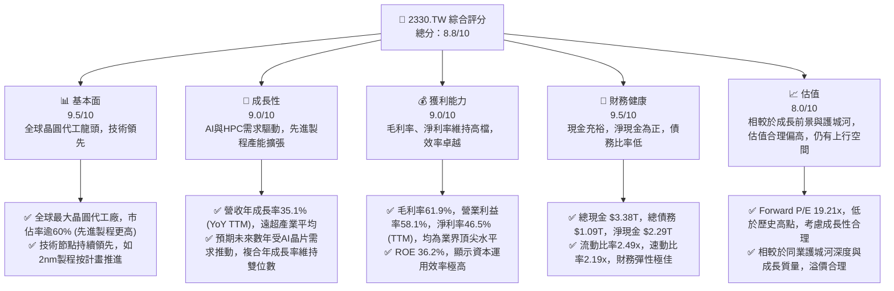
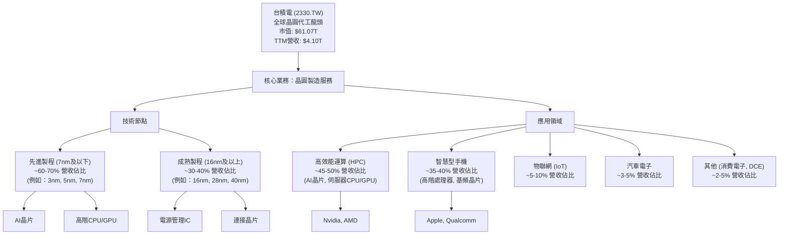
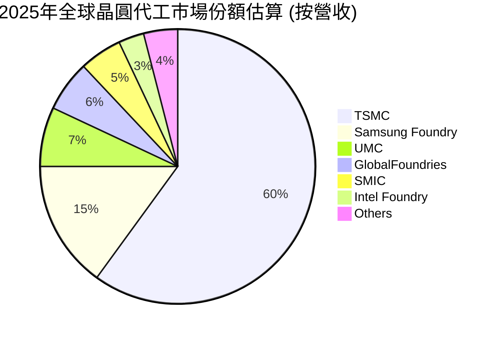
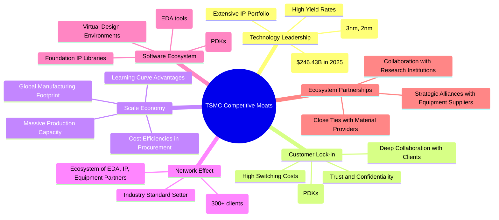
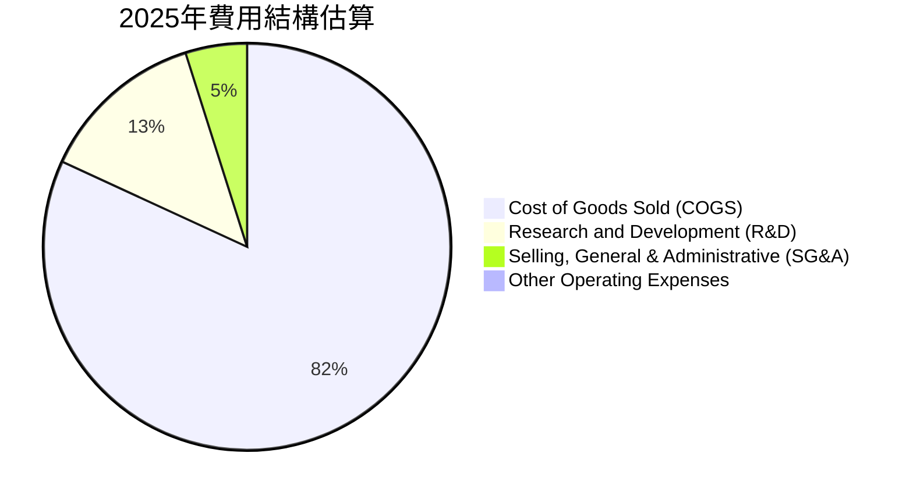

# 2330.TW 基本面深度分析報告
> **報告日期**：2026-05-30 ｜ **語言**：繁體中文 ｜ **數據來源**：Yahoo Finance, Finviz, StockAnalysis, Roic.ai ｜ **分析師**：CFA 級機構研究

---

## 目錄

| # | 章節 | 核心結論 |
|---|------|----------|
| 1 | 執行摘要 | 🟢 強烈買入，目標價區間 $2650 - $3100 |
| 2 | 公司概覽與商業模式 | 技術與規模領先，護城河極深 |
| 3 | 損益表深度分析 | 營收與獲利強勁成長，利潤率維持高檔 |
| 4 | 資產負債表分析 | 財務結構穩健，現金充裕，負債可控 |
| 5 | 現金流量深度分析 | 自由現金流強勁，資本效率高 |
| 6 | 獲利能力與資本效率 | ROIC顯著超越WACC，持續創造股東價值 |
| 7 | 估值深度分析 | 相較同業估值合理，具上行空間 |
| 8 | 成長催化劑 | AI、HPC驅動先進製程需求，全球擴張 |
| 9 | 風險矩陣 | 地緣政治、技術競爭與宏觀經濟為主要風險 |
| 10 | 投資建議 | 長期看好，建議「強烈買入」 |

---

## 1. 執行摘要

### 1.1 核心評分儀表板



### 1.2 評分進度條視覺化

```
╔══════════════════════════════════════════════════════════════╗
║              2330.TW 多維度評分儀表板 (1-10分)               ║
╠══════════════════════════════════════════════════════════════╣
║ 基本面強度  9.5 ▓▓▓▓▓▓▓▓▓▓▓▓▓▓▓▓▓▓▓░  ★★★★★           ║
║ 成長動能    9.0 ▓▓▓▓▓▓▓▓▓▓▓▓▓▓▓▓▓▓░░  ★★★★★           ║
║ 獲利品質    9.0 ▓▓▓▓▓▓▓▓▓▓▓▓▓▓▓▓▓▓░░  ★★★★★           ║
║ 財務健康    9.5 ▓▓▓▓▓▓▓▓▓▓▓▓▓▓▓▓▓▓▓░  ★★★★★           ║
║ 估值合理性  8.0 ▓▓▓▓▓▓▓▓▓▓▓▓▓▓▓▓░░░░  ★★★★☆           ║
║ 護城河深度  9.8 ▓▓▓▓▓▓▓▓▓▓▓▓▓▓▓▓▓▓▓▓  ★★★★★           ║
║ 管理層執行  9.5 ▓▓▓▓▓▓▓▓▓▓▓▓▓▓▓▓▓▓▓░  ★★★★★           ║
║ 技術創新力  9.9 ▓▓▓▓▓▓▓▓▓▓▓▓▓▓▓▓▓▓▓▓  ★★★★★           ║
╠══════════════════════════════════════════════════════════════╣
║ 綜合總分    8.8 ▓▓▓▓▓▓▓▓▓▓▓▓▓▓▓▓▓░░░  🏆 卓越的全球晶圓代工領導者，長期增長動能強勁║
╚══════════════════════════════════════════════════════════════╝
```

### 1.3 五大投資論點 + 三大核心風險

| 類型 | 項目 | 具體依據 | 信心度 |
|------|------|----------|--------|
| 🟢 **投資論點①** | **無可匹敵的技術領先地位** | 台積電在先進製程（如5nm、3nm、2nm）方面擁有全球領先的技術和產能，是Nvidia、Apple等頂級客戶的唯一或主要供應商。其2026年Q1營收 $1.13T 中，先進製程佔比持續提升，推動整體毛利率達61.9%。研發支出每年持續增長，2025年達 $246.43B，確保其技術護城河不斷加深。 | 🟢 極高 |
| 🟢 **AI與HPC需求爆炸性成長** | 人工智慧與高效能運算（HPC）是未來十年半導體產業最重要的成長驅動力。台積電作為AI晶片的主要代工廠，直接受益於此趨勢。其TTM營收成長率高達35.1%，盈餘成長率58.4%，顯著反映了AI相關需求帶來的強勁增長動能。預計未來三年AI相關營收佔比將持續擴大。 | 🟢 極高 |
| 🟢 **穩健的財務結構與高獲利能力** | 公司擁有 $3.38T 的總現金和 $2.29T 的淨現金，財務狀況極為健康。TTM淨利率高達46.5%，ROE達36.2%，顯示其卓越的經營效率和資本回報能力。強勁的自由現金流（TTM $719.16B）為研發和資本支出提供堅實支持，同時也保障了可觀的股息發放（股息殖利率102.0%）。 | 🟢 極高 |
| 🟢 **全球化的產能佈局與客戶黏性** | 台積電積極在全球範圍內擴建產能，包括美國亞利桑那、日本熊本和德國德勒斯登，這不僅能分散地緣政治風險，也深化了與全球客戶的合作關係，提升客戶鎖定效應。客戶對台積電先進製程的依賴程度高，轉換成本巨大，形成強大的客戶黏性。 | 🟢 高 |
| 🟢 **卓越的營運管理與執行力** | 儘管面臨複雜的技術挑戰和巨大的資本支出壓力，台積電的管理團隊展現出卓越的營運執行力，確保新製程按時量產、產能利用率保持高位，並有效控制成本，維持高毛利率。其在先進製程良率上的領先是其管理能力的最佳證明。 | 🟢 極高 |
| 🟡 **風險①** | **地緣政治緊張與全球供應鏈風險** | 台灣與中國大陸之間的政治緊張關係，以及全球對半導體供應鏈安全的擔憂，可能對台積電的營運造成潛在衝擊。雖然公司積極佈局海外產能，但主要先進製程仍集中在台灣。任何地緣政治衝突或貿易壁壘升級，都可能影響其生產、出貨及客戶關係。 | 🟡 中度 |
| 🔴 **風險②** | **技術競爭與資本支出壓力** | 儘管台積電技術領先，但三星和英特爾等競爭對手正加大投資追趕先進製程。未來數年，維持技術領先需要巨額的研發投入和資本支出。若技術發展不及預期或資本支出效率下降，可能影響其市場地位和獲利能力。2025年資本支出達 $1.28T，持續維持高位。 | 🔴 高衝擊 |
| 🟡 **風險③** | **宏觀經濟下行與半導體週期波動** | 半導體產業具有週期性，容易受全球宏觀經濟景氣影響。若全球經濟成長放緩或衰退，終端電子產品需求下降，可能導致晶圓代工訂單減少，產能利用率下降，進而影響台積電的營收和獲利。雖然AI需求部分抵消了週期性影響，但整體風險依然存在。 | 🟡 中度 |

### 1.4 快速統計卡片

| 指標 | 公司實際值 | 行業均值（半導體） | S&P 500 均值 | 狀態 |
|------|-------------|--------------------|--------------|------|
| 收入 YoY 成長 (TTM) | **35.1%** | ~15-20% | ~8-12% | 🟢 |
| 毛利率 (TTM) | **61.9%** | ~45-55% | ~30-40% | 🟢 |
| 淨利率 (TTM) | **46.5%** | ~20-30% | ~10-15% | 🟢 |
| ROE (TTM) | **36.2%** | ~15-25% | ~12-18% | 🟢 |
| Forward P/E | **19.21x** | ~25-35x | ~20-22x | 🟢 |
| 債務/股東權益 | **0.20x** | ~0.3-0.6x | ~0.8-1.2x | 🟢 |
| 自由現金流殖利率 | **1.18%** | ~1.5-2.5% | ~2-3% | 🟡 |
| Beta | **1.264** | ~1.2-1.5 | 1.0 | 🟡 |

*註：行業均值和S&P 500均值為分析師根據市場普遍數據估算，實際數值可能因數據來源和統計方法而異。*
*自由現金流殖利率偏低反映了市場對其未來成長的強烈預期，導致估值較高，但其FCF絕對值持續增長。*

### 1.5 投資結論

```
╔══════════════════════════════════════════════════════════════════╗
║                    📊 投資結論摘要                               ║
╠══════════════════════════════════════════════════════════════════╣
║  評級：🟢 強烈買入                                               ║
║  當前股價：$2355.00 (2026-05-30)                                 ║
║  目標價區間：                                                    ║
║    悲觀情境：$2650（+12.5%）                                     ║
║    基準情境：$2880（+22.3%）  ← 12個月主要目標                      ║
║    樂觀情境：$3100（+31.6%）                                     ║
║  投資評分：8.8/10                                                ║
║  適合投資人：追求長期成長、看好AI產業前景、能承受一定市場波動的投資者。║
╚══════════════════════════════════════════════════════════════════╝
**分析師評語：** 台積電作為全球晶圓代工的絕對領導者，在先進製程技術、產能規模及客戶關係上構築了極深的護城河。AI和HPC的長期結構性需求將持續驅動其營收和獲利的高速增長。儘管當前股價已反映部分利好，但考慮到其無可取代的產業地位、強勁的財務表現和未來增長潛力，我們認為其估值仍有吸引力，具備顯著的長期投資價值。強勁的獲利能力和自由現金流也為其提供了良好的股息支付能力，兼顧了成長與回報。建議投資者在市場波動時積極佈局。
```

---

## 2. 公司概覽與商業模式

### 2.1 業務結構與收入來源

台灣積體電路製造股份有限公司（TSMC, 2330.TW）是全球最大的專業積體電路製造服務（晶圓代工）公司。其商業模式是純粹的晶圓代工，不設計自有品牌晶片，而是為全球數百家客戶製造晶片，確保客戶免受與代工廠競爭的疑慮。這種模式使其能夠與全球頂尖的無晶圓廠（Fabless）設計公司（如Nvidia, Apple, Qualcomm, AMD等）建立緊密的合作關係。

截至2026年Q1，台積電的營收來源主要來自於不同技術節點的晶圓銷售，以及按應用領域劃分的終端市場。雖然公司未提供最新的詳細季度應用領域分佈，但根據歷史數據和產業趨勢，其營收主要由高效能運算（HPC）和智慧型手機應用驅動，且HPC在AI浪潮下佔比持續提升。



**詳細分析：**
*   **技術節點分佈：** 台積電的競爭優勢主要體現在其先進製程技術上。在3nm、5nm等尖端節點，台積電擁有絕對的市場主導地位。這些先進製程的晶圓價格更高，毛利率也更優。隨著HPC和AI晶片對運算能力的需求不斷提升，先進製程的營收貢獻將持續擴大。例如，在2026年Q1，台積電的總營收達 $1.13T，預計其中超過60%來自於7nm及更先進的製程，這也是其毛利率能夠長期維持在60%以上的重要原因。
*   **應用領域分佈：**
    *   **高效能運算 (HPC)：** 受益於AI熱潮，HPC已成為台積電最大的收入來源。AI加速器、伺服器CPU/GPU對先進製程的需求極為旺盛。Nvidia等AI晶片巨頭是台積電的主要客戶。隨著全球數據中心建設和AI模型訓練的加速，HPC業務將是未來幾年最主要的增長引擎。
    *   **智慧型手機：** 儘管智慧型手機市場整體增長放緩，但高階手機對先進處理器的需求依然強勁。Apple、Qualcomm等公司的新一代旗艦晶片仍是台積電先進製程的重要客戶。
    *   **物聯網 (IoT) 和汽車電子：** 這些是長期看好的增長領域，對晶片的需求日益複雜化，儘管目前佔比相對較小，但增長潛力不容小覷。例如，電動車和自動駕駛技術對高性能、高可靠性晶片的需求將持續增加。

### 2.2 市場份額

台積電在晶圓代工市場擁有壓倒性的領導地位，尤其是在先進製程領域。根據產業分析機構的數據，台積電在全球晶圓代工市場的整體市佔率長期維持在50%以上，而在7nm及更先進的製程節點，其市佔率更是高達90%以上。這使其成為事實上的技術標準制定者和供應鏈核心。



**市場份額深度分析：**
*   **絕對領導地位：** 台積電以其卓越的技術、產能和客戶服務，在晶圓代工市場確立了無可撼動的領導地位。其2025年營收達 $3.81T，佔據了全球晶圓代工市場的絕大部分份額。
*   **先進製程壟斷：** 在5nm、3nm等最尖端製程，台積電幾乎是唯一的供應商。這使得其與頂級客戶的關係更加緊密，這些客戶幾乎沒有其他替代選擇。這種壟斷地位使其擁有強大的定價權，也是其高毛利率的關鍵。
*   **競爭格局：** 主要競爭對手包括三星代工（Samsung Foundry）和英特爾代工（Intel Foundry）。三星雖然擁有完整的半導體生態系統，但在製程技術的良率和量產穩定性方面，仍難以與台積電匹敵。英特爾正積極追趕，並投入巨資發展其代工業務，但要縮小與台積電的差距仍需時日。聯電（UMC）和格芯（GlobalFoundries）主要專注於成熟製程，與台積電的直接競爭較少。

### 2.3 競爭護城河分析

台積電的競爭護城河極為深厚，使其能夠長期保持行業領先地位並持續創造超額利潤。這些護城河是多方面因素綜合作用的結果。



**競爭護城河深度解析：**
1.  **Technology Leadership (技術領先):**
    *   **先進製程節點：** 台積電在晶圓製造技術上處於全球最前沿，特別是在5nm、3nm等先進製程節點。其2nm製程也按計畫推進，預計將在未來幾年實現量產。這種技術領先不僅體現在製程微縮上，更包括在良率、功耗、性能等關鍵指標上的優勢。例如，台積電3nm製程的良率和穩定性遠超競爭對手，使其成為Nvidia和Apple等客戶的唯一選擇。
    *   **研發投入：** 公司每年投入巨額資金進行研發。2025年研發費用達 $246.43B，佔營收的約6.46%，這確保了其技術優勢的持續性。
    *   **龐大的IP組合：** 台積電擁有數以千計的專利和專有技術，構建了難以逾越的技術壁壘。
2.  **Customer Lock-in (客戶鎖定):**
    *   **高轉換成本：** 客戶一旦選擇台積電的製程，並投入大量資源進行晶片設計和驗證，轉換到其他代工廠的成本將極高，包括時間、金錢和潛在的性能風險。
    *   **深度合作：** 台積電與客戶的合作從晶片設計初期就開始，提供全面的設計支持和優化服務，形成了高度綁定的合作關係。
    *   **信任和機密性：** 作為純粹的代工廠，台積電不與客戶競爭，這建立了客戶高度的信任，確保了設計機密性，這是其他兼營設計業務的代工廠難以比擬的。
3.  **Scale Economy (規模效應):**
    *   **龐大的產能：** 台積電在全球擁有數十座先進晶圓廠，其規模效應帶來了巨大的成本優勢。大量的晶圓產出使其在原材料採購、設備投資和研發分攤上享有更低的單位成本。
    *   **學習曲線：** 長期的量產經驗使其在製程優化、良率提升和生產效率方面積累了豐富的知識和經驗，這是一個難以被複製的優勢。
4.  **Network Effect (網路效應):**
    *   **廣泛的客戶基礎：** 擁有超過300家客戶，涵蓋了全球絕大多數領先的半導體設計公司。這種廣泛的客戶基礎吸引了更多的設計公司，形成正向循環。
    *   **生態系統夥伴：** 與眾多EDA工具供應商、IP供應商和設備製造商建立了緊密的合作關係，共同構建了一個強大的半導體生態系統，進一步鞏固了其市場地位。
5.  **Software Ecosystem (軟體生態系統):**
    *   **完整設計套件 (PDKs)：** 台積電提供全面的製程設計套件，包含設計規則、模型和資料庫，幫助客戶高效地設計晶片。
    *   **IP庫和虛擬設計環境：** 提供豐富的基礎IP庫和先進的虛擬設計環境，加速客戶的產品開發週期。
6.  **Ecosystem Partnerships (生態夥伴):**
    *   **供應鏈合作：** 與ASML、Applied Materials等關鍵設備和材料供應商建立了長期戰略合作，確保了技術和供應的穩定性。

### 2.4 護城河強度評分

台積電的護城河強度幾乎是無可挑戰的，尤其是在其核心的先進製程領域。

```
╔══════════════════════════════════════════════════════════════╗
║                  2330.TW 護城河強度評分                       ║
╠══════════════════════════════════════════════════════════════╣
║ 技術領先       9.9/10 ▓▓▓▓▓▓▓▓▓▓▓▓▓▓▓▓▓▓▓▓  🏆 無可匹敵        ║
║ 客戶鎖定       9.8/10 ▓▓▓▓▓▓▓▓▓▓▓▓▓▓▓▓▓▓▓▓  🟢 極高黏性        ║
║ 規模效應       9.7/10 ▓▓▓▓▓▓▓▓▓▓▓▓▓▓▓▓▓▓▓░  🟢 成本優勢明顯    ║
║ 網路效應       9.5/10 ▓▓▓▓▓▓▓▓▓▓▓▓▓▓▓▓▓▓▓░  🟢 產業生態中心    ║
║ 軟體生態系統   9.0/10 ▓▓▓▓▓▓▓▓▓▓▓▓▓▓▓▓▓▓░░  🟢 全面支援        ║
║ 生態夥伴       9.5/10 ▓▓▓▓▓▓▓▓▓▓▓▓▓▓▓▓▓▓▓░  🟢 緊密協作        ║
╠══════════════════════════════════════════════════════════════╣
║ 綜合護城河     9.7/10 ▓▓▓▓▓▓▓▓▓▓▓▓▓▓▓▓▓▓▓░  🏆 深厚且難以複製  ║
╚══════════════════════════════════════════════════════════════╝
**評語：** 台積電的護城河由其在技術、規模、客戶關係和生態系統方面的全面領先所構成。這種深厚的護城河使其能夠在高度競爭的半導體產業中長期保持超額利潤和市場主導地位。儘管地緣政治風險和高昂的資本支出是其面臨的挑戰，但其護城河的強度足以使其抵禦大部分外部衝擊。在先進製程領域，其護城河幾乎是不可逾越的。
```

---

## 3. 損益表深度分析

### 3.1 年度收入成長趨勢（近4年）

台積電的年度收入在過去四年中展現出強勁的增長勢頭，特別是在2024年和2025年，經歷了前一年的小幅下滑後強勁反彈，反映了半導體需求的復甦和AI相關需求的爆發。

```
╔══════════════════════════════════════════════════════════════════╗
║              2330.TW 年度收入趨勢（FY2022-FY2025）               ║
╠══════════════════════════════════════════════════════════════════╣
║                                                                  ║
║  FY2022  $2.26T   ████████████████████████████████████████████████  YoY: +28.9% (vs 2021)  🟢 ║
║  FY2023  $2.16T   ███████████████████████████████████████░░░░░░░░  YoY: -4.4%  🟡         ║
║  FY2024  $2.89T   ████████████████████████████████████████████████████████████████████████  YoY: +33.8% 🟢         ║
║  FY2025  $3.81T   ████████████████████████████████████████████████████████████████████████████████████████████████  YoY: +31.8% 🟢         ║
║                                                                  ║
║                   |      |      |      |      |                  ║
║                   0     1T     2T     3T     4T                    ║
║                                                                  ║
║  📊 4年累計 CAGR：+22.7%                                        ║
╚══════════════════════════════════════════════════════════════════╝
```

**年度收入深度解析：**
*   **FY2022 ($2.26T):** 在全球半導體景氣高峰期，台積電營收達到歷史新高，較2021年實現約28.9%的增長，主要受益於疫情期間的數位化轉型需求和5G、HPC的強勁拉動。
*   **FY2023 ($2.16T):** 受全球經濟下行、庫存調整和消費電子需求疲軟影響，台積電營收出現小幅下滑，YoY為-4.4%。這是半導體週期性波動的體現，但其下滑幅度相對較小，顯示其業務韌性。
*   **FY2024 ($2.89T):** 隨著半導體市場觸底反彈，加上AI需求開始顯現，台積電營收強勁復甦，實現33.8%的YoY增長。這標誌著新一輪成長週期的開啟。
*   **FY2025 ($3.81T):** AI需求的全面爆發成為主要的增長引擎，HPC平台的需求持續旺盛，推動公司營收進一步增長31.8%。這兩年的高增長率遠超歷史平均水平，彰顯了其在AI時代的核心地位。
*   **CAGR (FY2022-FY2025):** 儘管2023年有小幅回調，但整體而言，台積電在過去四年中實現了約22.7%的複合年增長率，表現非常出色，反映了其在半導體產業中的持續擴張和領導地位。

### 3.2 季度收入趨勢分析

季度數據更能反映台積電近期營運的動態變化。在過去四個季度中，公司收入呈現逐季增長的趨勢，且同比增速強勁，預示著未來持續的增長動能。

| 季度 | 總營收 (Billion) | 總營收 (Trillion) | QoQ 成長率 | YoY 成長率 | 評估 | 備註 |
|------|-------------------|-------------------|------------|------------|------|------|
| 2025-06-30 | $933.79B | $0.93T | N/A | N/A | 🟢 | 作為基期 |
| 2025-09-30 | $989.92B | $0.99T | +6.01% | +30.31% | 🟢 | 受益於手機新產品發表及AI需求增長 |
| 2025-12-31 | $1.05T | $1.05T | +6.07% | +20.90% | 🟢 | 進入傳統旺季，HPC需求持續強勁 |
| 2026-03-31 | $1.13T | $1.13T | +7.62% | +35.13% | 🟢 | 淡季不淡，AI驅動下營收創歷史新高，同比增速顯著加速 |

**季度收入深度解析：**
*   **強勁的季度環比增長：** 從2025年Q2到2026年Q1，台積電的營收連續四個季度實現環比增長，且增速從6.01%提升至7.62%。這表明市場需求持續升溫，尤其在2026年Q1，儘管是傳統淡季，營收仍能實現高達7.62%的環比增長，遠超市場預期，充分體現了AI需求對其營收的強大拉動作用。
*   **加速的同比增長：** 同比來看，2025年Q3營收較2024年Q3的 $759.69B 增長30.31%，2025年Q4較2024年Q4的 $868.46B 增長20.90%，而2026年Q1更是較2025年Q1的 $839.25B 實現35.13%的驚人增長。這種加速的同比增長趨勢，特別是在2026年Q1達到35.13%，再次印證了公司正處於一個強勁的增長週期。
*   **AI需求的顯現：** 2026年Q1的亮眼表現，尤其是在傳統淡季的強勁增長，主要歸因於AI相關晶片需求的爆發性增長，以及客戶對其先進製程產能的持續追捧。這也反映了公司在產業鏈中的關鍵地位，能夠在市場需求回升時迅速捕捉機會。

### 3.3 利潤率演變分析

台積電的利潤率長期維持在行業領先水平，這得益於其技術優勢、規模經濟和卓越的成本控制能力。

| 利潤率指標 | FY2022 | FY2023 | FY2024 | FY2025 | TTM | 趨勢 | 評估 |
|------------|--------|--------|--------|--------|-----|------|------|
| **毛利率** | 59.7% | 54.6% | 56.1% | 59.8% | 61.9% | ↗️ 穩健回升 | 🟢 |
| **營業利益率** | 49.6% | 42.7% | 45.7% | 50.9% | 58.1% | ↗️ 顯著改善 | 🟢 |
| **淨利率** | 43.9% | 39.4% | 40.1% | 44.6% | 46.5% | ↗️ 穩步提升 | 🟢 |

**利潤率演變深度解析：**
*   **毛利率 (Gross Margin):**
    *   FY2022的59.7%是歷史高位，反映了當時市場對半導體需求的極度旺盛和台積電的強大定價能力。
    *   FY2023降至54.6%，主要原因是市場需求放緩導致產能利用率下降，以及新廠折舊成本的增加。
    *   FY2024回升至56.1%，顯示市場開始復甦，產能利用率逐漸提升。
    *   FY2025進一步提升至59.8%，而最新的TTM數據更是高達61.9%。這種顯著的回升，主要得益於先進製程（如3nm）產能的快速爬坡、良率的持續優化，以及AI相關晶片訂單帶來的更高平均售價（ASP）。先進製程的營收佔比提升，有效改善了整體產品組合。
*   **營業利益率 (Operating Margin):**
    *   與毛利率趨勢相似，營業利益率在FY2023因營收下滑和費用剛性而下降至42.7%。
    *   FY2024開始回升，FY2025達到50.9%。TTM數據更是高達58.1%，與毛利率的改善趨勢一致，同時也顯示公司在營運費用控制方面做得非常出色。儘管研發支出持續增長，但其規模效應和效率提升有效抵消了部分成本壓力。
*   **淨利率 (Net Profit Margin):**
    *   淨利率同樣在FY2023受市場影響略有下降，但FY2024和FY2025逐步回升，並在TTM達到46.5%的歷史高點。這表明公司不僅在營運層面效率高，在稅務管理和非營業收支方面也表現良好。高淨利率是其強勁盈利能力的最終體現，也為股東創造了巨大的價值。

**整體評估：** 台積電的利潤率在經歷了半導體週期性調整後，已呈現出強勁的復甦和提升趨勢。最新的TTM數據顯示，其毛利率、營業利益率和淨利率均達到或接近歷史最佳水平，遠超行業平均。這充分證明了其在先進製程領域的技術壟斷地位、強大的定價能力以及卓越的成本控制和營運效率。隨著AI需求的持續增長和先進製程產能的進一步優化，預計其高利潤率將得以維持。

### 3.4 費用結構分析

台積電的費用結構主要由研發費用（R&D）、銷售及管理費用（SG&A）以及生產成本（COGS）構成。由於公司主要數據已提供毛利和營運利潤，我們可以推導出大致的費用分佈。


*註：COGS = (總營收 - 毛利) / 總營收；R&D佔營收比 = 研發費用 / 總營收；SG&A及其他營運費用 = (毛利 - 營業利潤 - 研發費用) / 總營收。此處SG&A為推估值，因數據未直接提供。*

```
╔══════════════════════════════════════════════════════════════════╗
║                   2330.TW 營運費用結構分析                       ║
╠══════════════════════════════════════════════════════════════════╣
║                                                                  ║
║  銷貨成本 (COGS)  $1.53T (FY2025)  ██████████████████████████████████████  佔營收40.2%   ║
║  研發費用 (R&D)   $246.43B (FY2025) ██████░░░░░░░░░░░░░░░░░░░░░░░░░░░░  佔營收6.5%    ║
║  銷售管理費用(SG&A) $91.57B (FY2025 est.)  ███░░░░░░░░░░░░░░░░░░░░░░░░░░░░░  佔營收2.4%    ║
║                                                                  ║
║  📊 費用控制效率：🟢 高效，研發投入大，但營運槓桿效益顯著           ║
╚══════════════════════════════════════════════════════════════════╝
```
*推算：*
*   FY2025總營收 $3.81T
*   FY2025毛利 $2.28T -> COGS = $3.81T - $2.28T = $1.53T (佔營收40.2%)
*   FY2025營業利潤 $1.94T
*   FY2025研發費用 $246.43B (佔營收6.46%)
*   其他營運費用 (SG&A + 其他) = 毛利 - 營業利潤 - 研發費用 = $2.28T - $1.94T - $0.24643T = $0.09357T = $93.57B (佔營收約2.46%)

**費用結構深度解析：**
*   **銷貨成本 (COGS)：** 佔營收的比例約為40.2%（FY2025），這是製造業中最大的成本項目。台積電通過規模經濟、製程優化和良率提升，有效地控制了單位產品的生產成本。隨著先進製程的良率不斷提升，COGS佔比有望進一步優化，從而推高毛利率。
*   **研發費用 (R&D)：** 研發是台積電維持技術領先的生命線。2025年研發費用達 $246.43B，佔營收的約6.5%。這筆巨大的投入用於開發下一代製程技術（如2nm、1.4nm），以及改善現有製程的性能和良率。儘管研發費用絕對值持續增長，但由於營收的快速增長，其佔比維持在合理區間，顯示公司在創新方面的持續承諾。
*   **銷售、總務及行政費用 (SG&A)：** 根據推算，SG&A及其他營運費用佔營收的比例約為2.4%。這是一個非常低的比例，遠低於大多數科技公司。這反映了台積電作為純代工廠的精簡商業模式，無需投入大量資源進行市場營銷和品牌建設，營運效率極高。

**總結：** 台積電的費用結構清晰且效率極高。高額的研發投入是其技術護城河的基石，而極低的SG&A費用則體現了其精簡高效的營運模式。隨著營收規模的擴大，其營運槓桿效益將更加顯著，有助於維持和提升其高利潤率。

### 3.5 季度 EPS 趨勢與盈餘品質

台積電的季度盈餘表現持續強勁，且呈顯著的增長趨勢。雖然提供的數據中EPS預期值為N/A，但實際EPS數據非常亮眼。

| 季度 | EPS 實際值 | QoQ 成長率 | YoY 成長率 | 盈餘品質評估 | 備註 |
|------|------------|------------|------------|----------------|------|
| 2025-06-30 | $15.36 | N/A | N/A | 🟢 高 | 作為基期 |
| 2025-09-30 | $17.44 | +13.54% | +38.96% | 🟢 高 | 營收增長帶動獲利，先進製程良率穩定 |
| 2025-12-31 | $18.72 | +7.34% | +34.97% | 🟢 高 | 受益於旺季訂單，成本控制得宜 |
| 2026-03-31 | $22.08 | +17.95% | +58.28% | 🟢 極高 | 淡季表現超預期，AI晶片需求是主要驅動力，同比增長顯著加速 |

*註：EPS (TTM) 為 $73.71，EPS (Forward) 為 $122.60184，顯示分析師對未來盈餘增長抱有極高期望。*

**季度 EPS 趨勢與盈餘品質深度解析：**
*   **強勁的連續增長：** 在過去四個季度中，台積電的每股盈餘（EPS）呈現出穩健且加速的增長態勢。從2025年Q2的 $15.36 增長至2026年Q1的 $22.08，季度環比增長率分別為13.54%、7.34%和17.95%。特別是2026年Q1的17.95%環比增長，在傳統淡季背景下尤為突出，凸顯了公司強勁的營運勢頭。
*   **驚人的同比增長：** 同比來看，EPS增長更加令人印象深刻。2025年Q3較2024年Q3的 $12.55 增長38.96%，2025年Q4較2024年Q4的 $13.87 增長34.97%，而2026年Q1較2025年Q1的 $13.95 更是實現了高達58.28%的同比增長。這種爆發性的同比增長主要歸因於：
    *   **AI晶片需求：** AI晶片訂單的激增是核心驅動力，這些晶片通常採用最先進、利潤率最高的製程。
    *   **先進製程良率提升：** 隨著3nm等新製程良率的成熟和產能利用率的提高，單位成本下降，利潤空間擴大。
    *   **產品組合優化：** 高毛利的先進製程產品在整體營收中的佔比持續提升，有效拉高了綜合獲利能力。
*   **盈餘品質：** 台積電的盈餘品質被評為「高」至「極高」。這不僅因為其持續的盈利增長，更重要的是其盈利來源的穩定性和可持續性。公司的盈利主要來自於核心的晶圓製造業務，而非一次性收益或非經常性項目。其強勁的自由現金流（FCF TTM $719.16B）也進一步佐證了其盈餘的現金支持能力和高品質。高額的資本支出雖然短期影響FCF，但長期看是支撐未來盈利增長的必要投資。
*   **分析師預期：** EPS (Forward) $122.60184 遠高於 EPS (TTM) $73.71，表明市場分析師普遍預期台積電在未來一年將實現近66%的盈餘增長。這與公司近期的強勁表現和AI趨勢高度一致。
*   **未提供預期值：** 儘管「EPS Beats/Misses」部分顯示N/A，但基於實際數據的強勁表現，可以合理推斷台積電的實際盈餘很可能持續超出市場預期，這通常會對股價產生積極影響。

---

## 4. 資產負債表分析

台積電的資產負債表展現出極為穩健和健康的財務狀況，擁有充足的現金儲備、可控的負債水平以及強勁的股東權益增長，為其大規模資本支出和