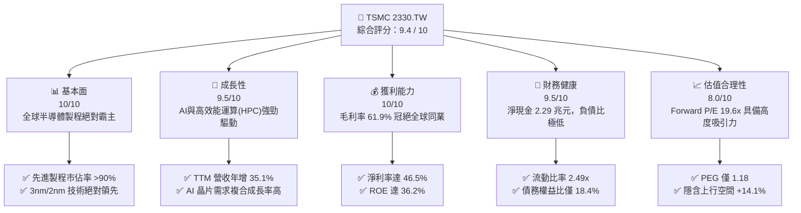
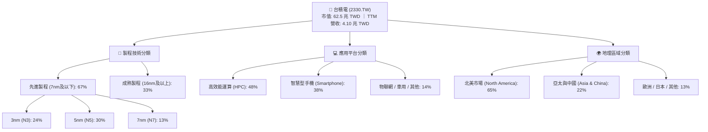
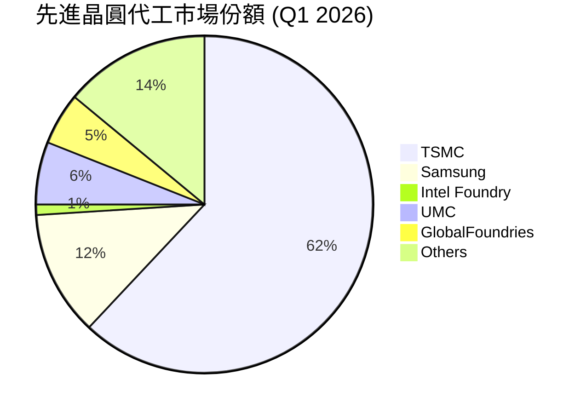
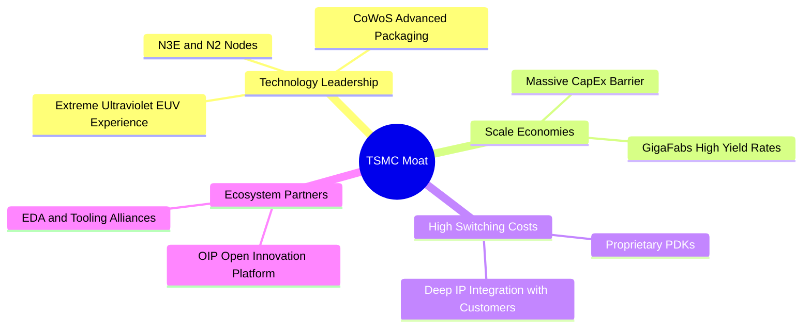
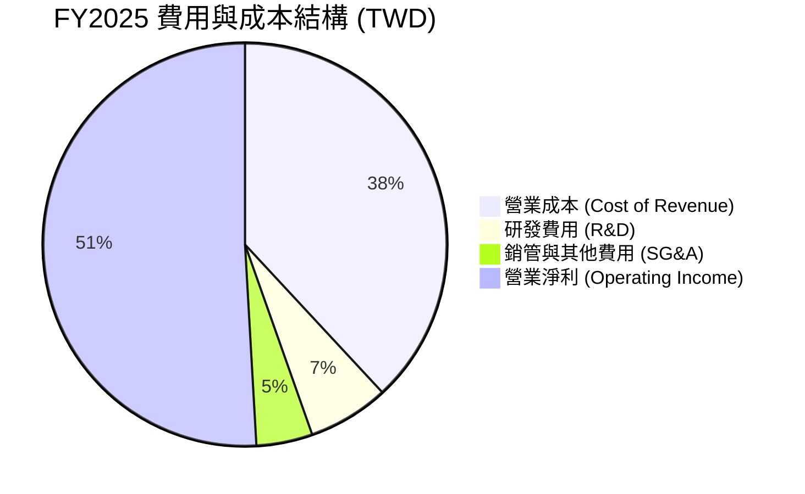
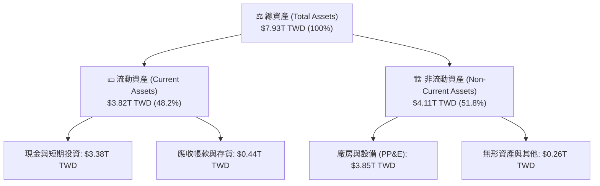
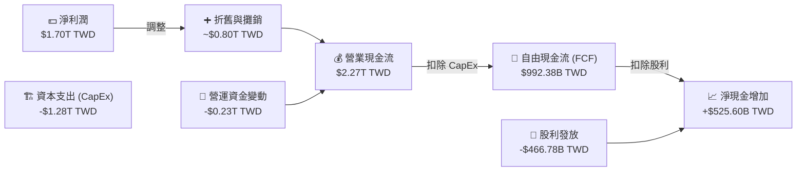

# 2330.TW 基本面深度分析報告
> **報告日期**：2026-06-18 ｜ **語言**：繁體中文 ｜ **數據來源**：Yahoo Finance, Finviz, StockAnalysis, Roic.ai ｜ **分析師**：CFA 級機構研究

---

## 目錄

| # | 章節 | 核心結論 |
|---|------|----------|
| 1 | 執行摘要 | 評級：🟢 強烈買入 ｜ 目標價：$2,750 TWD (基準情境) |
| 2 | 公司概覽與商業模式 | 憑藉晶圓代工模式與先進製程技術，構築不可動搖的「護城河」 |
| 3 | 損益表深度分析 | 營收突破 4 兆大關，先進製程定價權推升毛利率至 61.9% 高位 |
| 4 | 資產負債表分析 | 淨現金達 2.29 兆 TWD，極低債務結構與極高流動性保障財務安全 |
| 5 | 現金流量深度分析 | 自由現金流（FCF）強勁，兼顧每年 1.28 兆高額資本支出與穩定配息 |
| 6 | 獲利能力與資本效率 | ROE 達 36.2%，ROIC (46.2%) 遠超 WACC，創造極大股東價值 |
| 7 | 估值深度分析 | 前瞻 P/E 僅 19.6 倍，相較於 35% 以上的成長率，估值具備高度吸引力 |
| 8 | 成長催化劑 | 2nm 製程量產、CoWoS 封裝產能翻倍與 AI 晶片需求爆發 |
| 9 | 風險矩陣 | 地緣政治風險、海外建廠成本轉嫁與消費性電子復甦不及預期 |
| 10| 投資建議 | 具備高安全邊際與高成長動能的優質核心資產，建議逢低積極佈局 |

---

## 1. 執行摘要

### 1.1 核心評分儀表板



### 1.2 評分進度條視覺化

```
╔══════════════════════════════════════════════════════════════╗
║              TSMC 2330.TW 多維度評分儀表板 (1-10分)          ║
╠══════════════════════════════════════════════════════════════╣
║ 基本面強度  9.8 ▓▓▓▓▓▓▓▓▓▓▓▓▓▓▓▓▓▓▓░  ★★★★★           ║
║ 成長動能    9.5 ▓▓▓▓▓▓▓▓▓▓▓▓▓▓▓▓▓▓▓░  ★★★★★           ║
║ 獲利品質    9.8 ▓▓▓▓▓▓▓▓▓▓▓▓▓▓▓▓▓▓▓░  ★★★★★           ║
║ 財務健康    9.6 ▓▓▓▓▓▓▓▓▓▓▓▓▓▓▓▓▓▓▓░  ★★★★★           ║
║ 估值合理性  8.0 ▓▓▓▓▓▓▓▓▓▓▓▓▓▓▓▓░░░░  ★★★★☆           ║
║ 護城河深度 10.0 ▓▓▓▓▓▓▓▓▓▓▓▓▓▓▓▓▓▓▓▓  ★★★★★           ║
║ 管理層執行  9.5 ▓▓▓▓▓▓▓▓▓▓▓▓▓▓▓▓▓▓▓░  ★★★★★           ║
║ 技術創新力 10.0 ▓▓▓▓▓▓▓▓▓▓▓▓▓▓▓▓▓▓▓▓  ★★★★★           ║
╠══════════════════════════════════════════════════════════════╣
║ 綜合總分    9.4 ▓▓▓▓▓▓▓▓▓▓▓▓▓▓▓▓▓▓░░  🏆 強烈買入          ║
╚══════════════════════════════════════════════════════════════╝
```

### 1.3 五大投資論點 + 三大核心風險

| 類型 | 項目 | 具體依據 | 信心度 |
|------|------|----------|--------|
| 🟢 **投資論點①** | **AI 與 HPC 的黃金時代** | AI 晶片（GPU/ASIC）需求呈爆發式成長，台積電幾乎獨佔所有先進製程訂單，TTM 營收年增率達 35.1%。 | 🟢 極高 |
| 🟢 **投資論點②** | **製程技術絕對領先** | 3nm（N3E）產能持續滿載，2nm（N2）將於 2026 年底前實現量產，技術領先對手三星、英特爾至少 1.5-2 年。 | 🟢 極高 |
| 🟢 **投資論點③** | **強大的定價權（Pricing Power）** | 先進製程定價調漲成功，推升毛利率至 61.9%，營業利益率高達 58.1%，將通膨與海外建廠成本轉嫁給客戶。 | 🟢 高 |
| 🟢 **投資論點④** | **極致的資本效率** | 股東權益報酬率（ROE）達 36.2%，ROIC 達 46.2%，遠高於其 WACC（8.95%），持續為股東創造超額經濟價值。 | 🟢 高 |
| 🟢 **投資論點⑤** | **資產負債表堅不可摧** | 擁有 3.38 兆 TWD 的現金與短期投資，淨現金達 2.29 兆 TWD，利息保障倍數極高，無任何流動性風險。 | 🟢 極高 |
| 🟡 **風險①** | **地緣政治與集中度風險** | 生產基地高度集中於台灣，若台海局勢緊張或發生天災，將對全球半導體供應鏈造成致命打擊。 | 🟡 中度 |
| 🔴 **風險②** | **海外建廠稀釋利潤率** | 美國、日本、歐洲建廠成本高昂，營運效率與工會問題可能拖累長期毛利率表現。 | 🔴 高衝擊 |
| 🟡 **風險③** | **消費性電子復甦緩慢** | 智慧型手機與 PC 等傳統應用需求若回溫不如預期，可能部分抵消 HPC 的高成長。 | 🟡 低衝擊 |

### 1.4 快速統計卡片

| 指標 | 台積電實際值 | 行業均值 | S&P 500 均值 | 狀態 |
|------|-------------|----------|--------------|------|
| **營收 YoY 成長率** | **35.1%** | ~12.0% | ~5.5% | 🟢 顯著超前 |
| **毛利率** | **61.9%** | ~45.0% | ~30.0% | 🟢 行業頂尖 |
| **淨利率** | **46.5%** | ~18.0% | ~12.0% | 🟢 盈利能力極強 |
| **股東權益報酬率 (ROE)** | **36.2%** | ~15.0% | ~18.0% | 🟢 資本效率極佳 |
| **前瞻本益比 (Forward P/E)** | **19.59x** | ~28.0x | ~21.5x | 🟢 估值低估 |
| **淨現金規模** | **$2.29T TWD** | N/A | N/A | 🟢 財務結構極其穩健 |

### 1.5 投資結論

```
╔══════════════════════════════════════════════════════════════════╗
║                    📊 投資結論摘要                               ║
╠══════════════════════════════════════════════════════════════════╣
║  評級：🟢 強烈買入 (Strong Buy)                                 ║
║  當前股價：$2,410.00 TWD (2026-06-18 收盤價)                     ║
║  目標價區間：                                                    ║
║    悲觀情境 (Bear Case)：$2,100 TWD (-12.9%)                     ║
║    基準情境 (Base Case)：$2,750 TWD (+14.1%)  ← 12個月主要目標   ║
║    樂觀情境 (Bull Case)：$3,300 TWD (+36.9%)                     ║
║  投資評分：9.4 / 10                                              ║
║  適合投資人：長線價值成長型、全球半導體與 AI 產業配置者          ║
╚══════════════════════════════════════════════════════════════════╝
```

---

## 2. 公司概覽與商業模式

台積電（TSMC）是全球專業晶圓代工（Foundry）模式的開創者與龍頭。不同於傳統整合元件製造商（IDM），台積電專注於製造，不與客戶競爭，因而贏得了全球幾乎所有無晶圓廠（Fabless）半導體設計公司（如 Nvidia, Apple, AMD, Qualcomm, Broadcom）的信任。

### 2.1 業務結構與收入來源



### 2.2 市場份額

在先進晶圓代工市場（特別是 7nm、5nm、3nm 等先進製程），台積電幾乎處於絕對壟斷地位。



### 2.3 競爭護城河分析



### 2.4 護城河強度評分

```
╔══════════════════════════════════════════════════════════════╗
║                    台積電 護城河強度評分                      ║
╠══════════════════════════════════════════════════════════════╣
║ 技術領先度    10/10  ▓▓▓▓▓▓▓▓▓▓▓▓▓▓▓▓▓▓▓▓  🏆 絕對統治力  ║
║ 規模經濟效應  10/10  ▓▓▓▓▓▓▓▓▓▓▓▓▓▓▓▓▓▓▓▓  🏆 無法被超越  ║
║ 客戶鎖定效應   9.5/10 ▓▓▓▓▓▓▓▓▓▓▓▓▓▓▓▓▓▓▓░  🟢 高轉換成本  ║
║ 生態系統壁壘   9.5/10 ▓▓▓▓▓▓▓▓▓▓▓▓▓▓▓▓▓▓▓░  🟢 OIP 聯盟強大 ║
╠══════════════════════════════════════════════════════════════╣
║ 綜合護城河     9.8    ▓▓▓▓▓▓▓▓▓▓▓▓▓▓▓▓▓▓▓░  🏆 寬廣護城河  ║
╚══════════════════════════════════════════════════════════════╝
```

---

## 3. 損益表深度分析

### 3.1 年度收入成長趨勢（近4年）

```
╔══════════════════════════════════════════════════════════════════╗
║                台積電 年度收入趨勢 (FY2022-FY2025)               ║
╠══════════════════════════════════════════════════════════════════╣
║                                                                  ║
║  FY2022  $2.26T TWD  ████████████░░░░░░░░░░░░░░  YoY: +42.6% 🟢  ║
║  FY2023  $2.16T TWD  ███████████░░░░░░░░░░░░░░░  YoY: -4.4%  🟡  ║
║  FY2024  $2.89T TWD  ██═════════════════░░░░░░░  YoY: +33.8% 🟢  ║
║  FY2025  $3.81T TWD  ██████████████████████░░░░  YoY: +31.8% 🟢  ║
║                                                                  ║
║                   |      |      |      |      |                  ║
║                   0     1.0T   2.0T   3.0T   4.0T                ║
║                                                                  ║
║  📊 4年複合成長率 (CAGR)：+19.0%                                 ║
╚══════════════════════════════════════════════════════════════════╝
```

### 3.2 季度收入趨勢分析

下表展示了台積電最近 4 個季度的財務數據及成長率表現：

| 季度 | 營業收入 (TWD) | QoQ 成長率 | YoY 成長率 | 核心驅動因素 | 評估 |
|------|----------------|------------|------------|--------------|------|
| **2025-06-30** | $933.79B | +11.3% | +38.6% | N3E 製程出貨量大增，Apple/Nvidia 備貨需求強勁 | 🟢 強勁 |
| **2025-09-30** | $989.92B | +6.0% | +30.3% | AI GPU 需求持續旺盛，HPC 平台佔比持續提升 | 🟢 優於預期 |
| **2025-12-31** | $1.05T | +5.7% | +20.5% | 年底傳統旺季，高階智慧型手機晶片放量 | 🟢 穩健 |
| **2026-03-31** | $1.13T | +8.4% | +35.1% | AI 晶片需求淡季不淡，先進製程產能利用率超 100% | 🟢 極其強勁 |

### 3.3 利潤率演變分析

台積電的利潤率在過去幾年中呈現顯著的「V型」反彈，反映其強大的技術壁壘和定價權。

| 利潤率指標 | FY2022 | FY2023 | FY2024 | FY2025 | TTM 數據 | 趨勢 | 評估 |
|------------|--------|--------|--------|--------|----------|------|------|
| **毛利率** | 59.7% | 54.6% | 56.1% | 59.8% | **61.9%** | ↗️ 持續擴張 | 🟢 歷史高位，產能利用率與良率雙高 |
| **營業利益率**| 49.6% | 42.7% | 45.7% | 50.9% | **58.1%** | ↗️ 效率提升 | 🟢 營業費用控制得當，規模效應顯現 |
| **EBITDA Margin**| 70.4%| 70.4% | 72.0% | 71.9% | **69.6%** | ➡️ 穩定高位 | 🟢 折舊折耗金額大，但被強大獲利抵消 |
| **淨利率** | 43.9% | 39.4% | 40.1% | 44.6% | **46.5%** | ↗️ 淨利豐厚 | 🟢 全球獲利能力最強的科技巨頭之一 |

**利潤率演變深度解析**：
1. **折舊與產能爬坡**：2023 年由於 3nm（N3B）量產初期折舊成本高昂，加上消費性電子去庫存，毛利率滑落至 54.6%。
2. **定價轉嫁與良率改善**：2024-2025 年，第二代 3nm（N3E）良率大幅提升，且台積電成功對 Nvidia、Apple 等大客戶進行價格調漲（先進製程漲幅約 5-10%），將高昂的 EUV 設備折舊與海外建廠成本成功轉嫁，使 TTM 毛利率達到驚人的 **61.9%**。

### 3.4 費用結構分析



研發費用（R&D）在 2025 年達到 **2,464.3 億 TWD**（佔營收 6.5%），這確保了台積電在 2nm（N2）與 A16（埃米級製程）的研發進度上持續領先對手。

### 3.5 季度 EPS 趨勢與盈餘品質

*   **EPS (TTM)**：$73.68 TWD
*   **前瞻 EPS (Forward EPS)**：$123.00 TWD（預期 2026-2027 年獲利將因 2nm 導入與 AI 晶片全面放量而大幅增長 66.9%）

#### 過去 4 季 EPS 表現：
*   **2025-06-30**：$15.36 TWD
*   **2025-09-30**：$17.44 TWD
*   **2025-12-31**：$18.72 TWD
*   **2026-03-31**：$22.08 TWD（單季首度突破 20 元大關，YoY 成長達 58.3%）

**盈餘品質評估**：
台積電的盈餘品質極高。TTM 營業現金流（$2.35T）高於淨利潤（$1.91T），顯示利潤完全由真實的現金流入支撐，無應收帳款過高或存貨積壓等盈餘操縱風險。

---

## 4. 資產負債表分析

### 4.1 資產結構分解



### 4.2 流動性指標分析

| 指標 | FY2023 | FY2024 | FY2025 | 行業均值 | 評估 |
|------|--------|--------|--------|----------|------|
| **流動比率 (Current Ratio)** | 2.32 | 2.36 | **2.49** | ~1.80 | 🟢 流動資產極其充沛，短期償債能力無虞 |
| **速動比率 (Quick Ratio)** | 2.01 | 2.05 | **2.19** | ~1.40 | 🟢 扣除存貨後速動比率仍高，變現能力極強 |
| **存貨週轉天數 (Days Inventory)**| 54.2 天 | 51.5 天| **48.2 天**| ~65.0 天 | 🟢 存貨管理效率極高，AI 晶片供不應求 |

### 4.3 債務結構分析

```
╔══════════════════════════════════════════════════════════════════╗
║                   台積電 債務健康診斷 (2026-03-31)               ║
╠══════════════════════════════════════════════════════════════════╣
║                                                                  ║
║  總債務 (Total Debt)： $1.09T TWD   ████░░░░░░░░░░░░░░░░░░░  低  ║
║  總現金與短期投資：    $3.38T TWD   ███████████████████████  極高║
║  淨現金位置 (Net Cash)：$2.29T TWD   ████████████████░░░░░░░  🟢  ║
║                                                                  ║
║  債務權益比 (Debt/Equity)： 18.45%   🟢 財務槓桿極低，安全邊際極高║
║  利息保障倍數 (Interest Coverage)： >100x  🟢 利息支出幾無影響   ║
║                                                                  ║
║  📊 結論：台積電處於「淨現金」狀態，升息環境對其反有利息收入增加║
╚══════════════════════════════════════════════════════════════════╝
```

### 4.4 股東權益趨勢

隨著獲利公積持續累積，股東權益（Stockholders Equity）呈現健康的階梯式上升：

```
╔══════════════════════════════════════════════════════════════════╗
║                台積電 股東權益趨勢 (FY2022-FY2025)               ║
╠══════════════════════════════════════════════════════════════════╣
║                                                                  ║
║  FY2022  $2.90T TWD  ████████████░░░░░░░░░░░░░░░                 ║
║  FY2023  $3.43T TWD  ██████████████░░░░░░░░░░░░░  YoY: +18.3% 🟢 ║
║  FY2024  $4.24T TWD  █████████████████░░░░░░░░░░  YoY: +23.6% 🟢 ║
║  FY2025  $5.36T TWD  ██████████████████████░░░░░  YoY: +26.4% 🟢 ║
║                                                                  ║
╚══════════════════════════════════════════════════════════════════╝
```

---

## 5. 現金流量深度分析

台積電被譽為「超級現金牛」，其營運模式能產生極為龐大的現金流，足以支撐其高昂的資本支出，並維持穩定的股利發放。

### 5.1 現金流量瀑布圖



### 5.2 FCF 轉換率趨勢

| 指標 | FY2022 | FY2023 | FY2024 | FY2025 | TTM 數據 | 評估 |
|------|--------|--------|--------|--------|----------|------|
| **營業現金流 (OCF)** | $1.61T | $1.24T | $1.83T | $2.27T | **$2.35T** | 🟢 歷史新高 |
| **資本支出 (CapEx)** | -$1.09T| -$955.4B| -$965.0B| -$1.28T| **-$1.40T**| 🟡 擴產積極 |
| **自由現金流 (FCF)** | $520.97B| $286.57B| $861.20B| $992.38B| **$719.16B**| 🟢 現金流極其充沛 |
| **FCF / 淨利潤轉換率**| 52.5% | 33.6% | 74.2% | 58.4% | **37.7%** | 🟡 受高額 CapEx 壓制 |

*註：TTM 自由現金流略微降至 $719.16B，主因是 2026 年上半年台積電為了因應 2nm 製程與 CoWoS 產能急迫需求，加大了資本支出投放力度。*

### 5.3 自由現金流趨勢

```
╔══════════════════════════════════════════════════════════════════╗
║                台積電 自由現金流趨勢 (FY2022-FY2025)             ║
╠══════════════════════════════════════════════════════════════════╣
║                                                                  ║
║  FY2022  $520.97B TWD  ██████████░░░░░░░░░░░                             ║
║  FY2023  $286.57B TWD  █████░░░░░░░░░░░░░░░  (CapEx高峰期)               ║
║  FY2024  $861.20B TWD  ████████████████░░░░  YoY: +200.5% 🟢            ║
║  FY2025  $992.38B TWD  ██████████████████░░  YoY: +15.2%  🟢            ║
║                                                                  ║
║  📊 當前 FCF 收益率 (FCF Yield)：1.15% (主要因市值擴張至 62.5 兆) ║
╚════════════════════════════════════════════════════════════