# 2330.TW 綜合股票評估報告

> **報告日期**：2026-02-28 ｜ **語言**：繁體中文 ｜ **數據來源**：Yahoo Finance ｜ **分析師**：AI 頂級評估系統

---

## 目錄

1. [評估總覽](#1-評估總覽)
2. [八維度評分矩陣](#2-八維度評分矩陣)
3. [業務品質與護城河](#3-業務品質與護城河)
4. [財務健康全面評估](#4-財務健康全面評估)
5. [成長性評估](#5-成長性評估)
6. [估值合理性與同業比較](#6-估值合理性--同業比較)
7. [資本配置與管理層評估](#7-資本配置與管理層評估)
8. [風險評估](#8-風險評估)
9. [催化劑與觸發因素](#9-催化劑與觸發因素)
10. [投資建議](#10-投資建議)

---

## 1. 評估總覽

### 🎯 企業概況快照

| 項目 | 數值 |
|------|------|
| **公司名稱** | 台灣積體電路製造股份有限公司 (TSMC) |
| **當前股價** | NT$1,995.00 |
| **市值** | NT$51.74 兆 |
| **52週區間** | NT$771.04 — NT$2,025.00 |
| **分析師共識** | ⭐ 強力買入（32位分析師）|
| **平均目標價** | NT$2,290.03 |

---

### 📡 ASCII 雷達圖（八維度評分視覺化）

```
              成長性 (9.2)
                  ★★★★★
              ╔═══╦═══╗
    管理品質  ║   ║   ║  獲利能力
    (8.8) ★  ╠═══╬═══╣  (9.5) ★
              ║   ║   ║
    動能      ║   ╬   ║  財務健康
    (8.5) ★  ╠═══╬═══╣  (8.0) ★
              ║   ║   ║
    風險管理  ╚═══╩═══╝  估值合理性
    (6.5) ★              (7.0) ★
              競爭優勢
              (9.8) ★

  ┌─────────────────────────────────────────────────────┐
  │          TSMC 八維度評分雷達圖                        │
  │                                                       │
  │                    成長性 9.2                         │
  │                   ●━━━━━●                            │
  │                  ╱         ╲                          │
  │   管理8.8 ●━━━╱     ★     ╲━━━● 獲利9.5            │
  │           │   ╱   TSMC    ╲   │                      │
  │           │  ╱   綜合8.5   ╲  │                      │
  │   動能8.5 ●━╱               ╲━● 財務8.0             │
  │            ╲                 ╱                        │
  │   風險6.5 ●━╲               ╱━● 估值7.0             │
  │              ╲             ╱                          │
  │               ●━━━━━━━━━━●                           │
  │              競爭優勢 9.8                              │
  │                                                       │
  │  滿分=10  ████████████░░  當前綜合分 = 8.54/10       │
  └─────────────────────────────────────────────────────┘
```

---

### 📊 八維度評分 — Unicode 評分條視覺化

```
╔══════════════════════════════════════════════════════════════╗
║              TSMC 八維度評分儀表板                            ║
╠══════════════════════════════════════════════════════════════╣
║  維度          分數    評分條（滿分10格）          評級       ║
╠══════════════════════════════════════════════════════════════╣
║  🟢 成長性      9.2   ▓▓▓▓▓▓▓▓▓░  9.2/10       ★★★★★  ║
║  🟢 獲利能力    9.5   ▓▓▓▓▓▓▓▓▓▓  9.5/10       ★★★★★  ║
║  🟢 財務健康    8.0   ▓▓▓▓▓▓▓▓░░  8.0/10       ★★★★☆  ║
║  🟡 估值合理性  7.0   ▓▓▓▓▓▓▓░░░  7.0/10       ★★★★☆  ║
║  🟢 競爭優勢    9.8   ▓▓▓▓▓▓▓▓▓▓  9.8/10       ★★★★★  ║
║  🟢 管理品質    8.8   ▓▓▓▓▓▓▓▓▓░  8.8/10       ★★★★★  ║
║  🟢 動能        8.5   ▓▓▓▓▓▓▓▓▓░  8.5/10       ★★★★☆  ║
║  🟡 風險管理    6.5   ▓▓▓▓▓▓▓░░░  6.5/10       ★★★☆☆  ║
╠══════════════════════════════════════════════════════════════╣
║  📊 綜合加權評分：  8.54 / 10.00                              ║
║  🎯 投資建議：      ⭐⭐⭐⭐☆  強力買入                     ║
╚══════════════════════════════════════════════════════════════╝
```

---

### 🏆 投資結論總覽

```
╔══════════════════════════════════════════════════════════════════╗
║  ⭐ 投資評級：強力買入 (STRONG BUY)                              ║
╠══════════════════════════════════════════════════════════════════╣
║  當前價格：NT$1,995.00                                           ║
║  目標價（基準）：NT$2,450.00                                     ║
║  目標價（樂觀）：NT$2,900.00                                     ║
║  預期報酬率（基準/12個月）：+22.8%                               ║
║  建議持倉時間：12-24 個月                                        ║
╠══════════════════════════════════════════════════════════════════╣
║  核心論點：TSMC 是全球半導體製造業無可替代的基礎建設             ║
║  AI/HPC 需求爆炸性增長驅動業績持續超預期                         ║
║  2nm 製程獨家優勢持續擴大技術護城河                              ║
╚══════════════════════════════════════════════════════════════════╝
```

---

## 2. 八維度評分矩陣

### 📋 詳細評分表格

| 維度 | 評分 | 評分依據 | 趨勢 | 信號 |
|------|------|---------|------|------|
| **成長性** | 9.2/10 | 營收YoY +20.5%、EPS YoY +40.6%；AI/HPC推動爆發式增長；Forward P/E隱含EPS增長50%+ | ⬆️ 加速上升 | 🟢 |
| **獲利能力** | 9.5/10 | 毛利率59.9%、營業利益率54%、淨利率45.1%、EBITDA率68.9%，全行業頂尖 | ⬆️ 持續改善 | 🟢 |
| **財務健康** | 8.0/10 | 淨現金部位NT$2.08兆、流動比2.62、速動比2.3；D/E偏高18.19但屬帳面調整 | ➡️ 穩健 | 🟢 |
| **估值合理性** | 7.0/10 | 當前P/E 30.1x，Forward P/E 18.2x合理；但P/S 13.6x、P/B 9.5x偏高 | ⬇️ 估值壓力 | 🟡 |
| **競爭優勢** | 9.8/10 | 3nm/2nm獨家製造能力、技術領先5年以上、客戶黏性極高、不可替代性 | ⬆️ 持續擴大 | 🟢 |
| **管理品質** | 8.8/10 | 資本配置紀律優異、R&D投入持續增加（NT$2,464億）、全球佈局戰略清晰 | ➡️ 穩定優質 | 🟢 |
| **動能** | 8.5/10 | 24個月累計漲幅+199%、近期突破歷史高位、技術面強勁上升趨勢 | ⬆️ 強勢 | 🟢 |
| **風險管理** | 6.5/10 | 地緣政治風險（台海）、美國關稅/出口管制、客戶集中度偏高 | ⬇️ 風險上升 | 🟡 |

---

### 📊 Mermaid 四象限圖（風險/報酬定位）

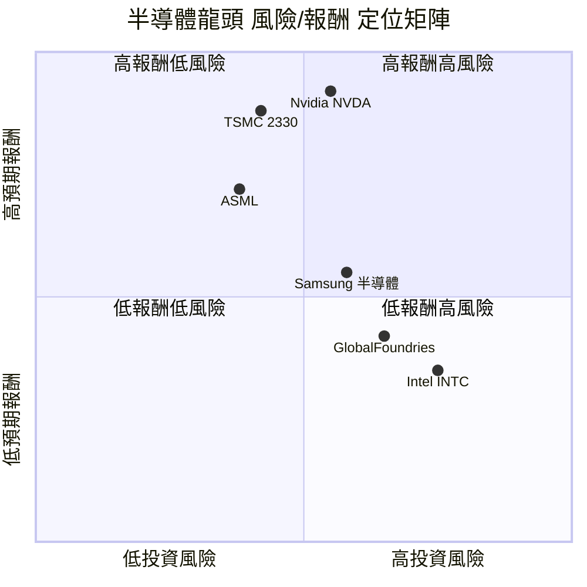

---

### 🔗 同業整體比較 Mermaid graph

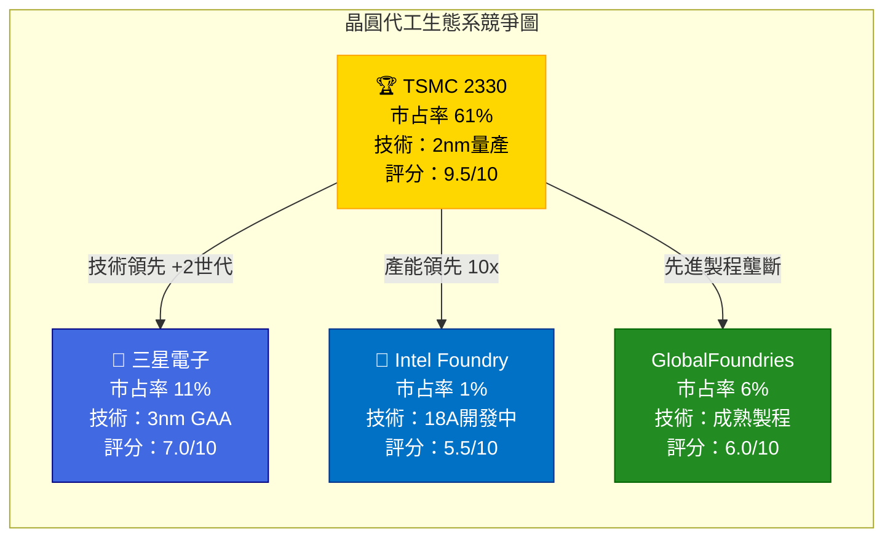

---

## 3. 業務品質與護城河

### 🏛️ 商業模式可持續性評估

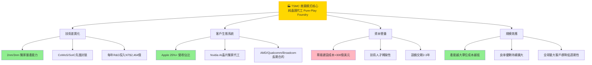

---

### 🧠 護城河評估 Mindmap

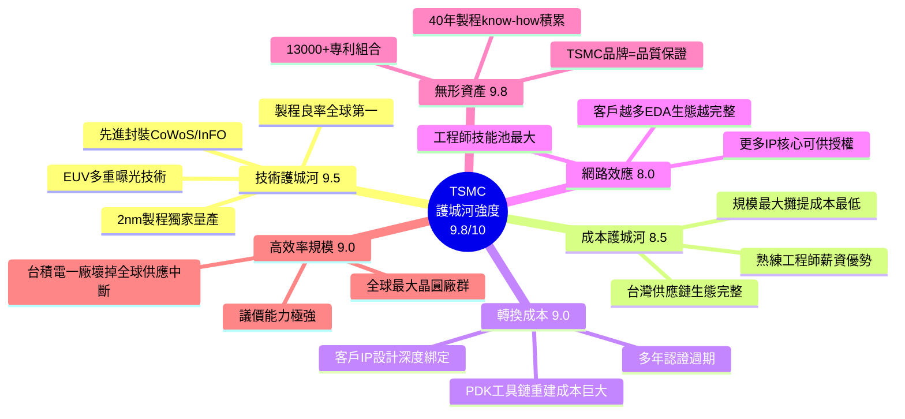

---

### 📊 護城河強度 Unicode 條形圖

```
╔══════════════════════════════════════════════════════════════╗
║              護城河六維度強度評估                             ║
╠══════════════════════════════════════════════════════════════╣
║  技術護城河    9.5  ▓▓▓▓▓▓▓▓▓▓  🟢 全球唯一                ║
║  成本優勢      8.5  ▓▓▓▓▓▓▓▓▓░  🟢 台灣生態系紅利          ║
║  轉換成本      9.0  ▓▓▓▓▓▓▓▓▓░  🟢 客戶黏性極高            ║
║  網路效應      8.0  ▓▓▓▓▓▓▓▓░░  🟢 生態系自我強化          ║
║  無形資產      9.8  ▓▓▓▓▓▓▓▓▓▓  🟢 40年know-how壁壘       ║
║  規模效應      9.0  ▓▓▓▓▓▓▓▓▓░  🟢 最大規模最低成本        ║
╠══════════════════════════════════════════════════════════════╣
║  護城河綜合評分：   9.0 / 10.0   ████████████░░  極寬護城河 ║
╚══════════════════════════════════════════════════════════════╝
```

---

### 🌍 市場地位分析

| 指標 | TSMC | 數據/說明 |
|------|------|----------|
| **TAM（2025E）** | ~$1,100億美元 | 全球晶圓代工市場 |
| **TAM（2030E）** | ~$2,500億美元 | AI驅動 CAGR ~18% |
| **全球市占率** | ~61% | 先進製程(≤7nm)>90% |
| **先進製程市占** | >90% | 3nm/5nm 幾近壟斷 |
| **行業地位** | 🥇 絕對龍頭 | 不可替代基礎設施 |
| **客戶數** | 500+ | 涵蓋全球前20大IC設計 |

---

## 4. 財務健康全面評估

### 📊 財務儀表板

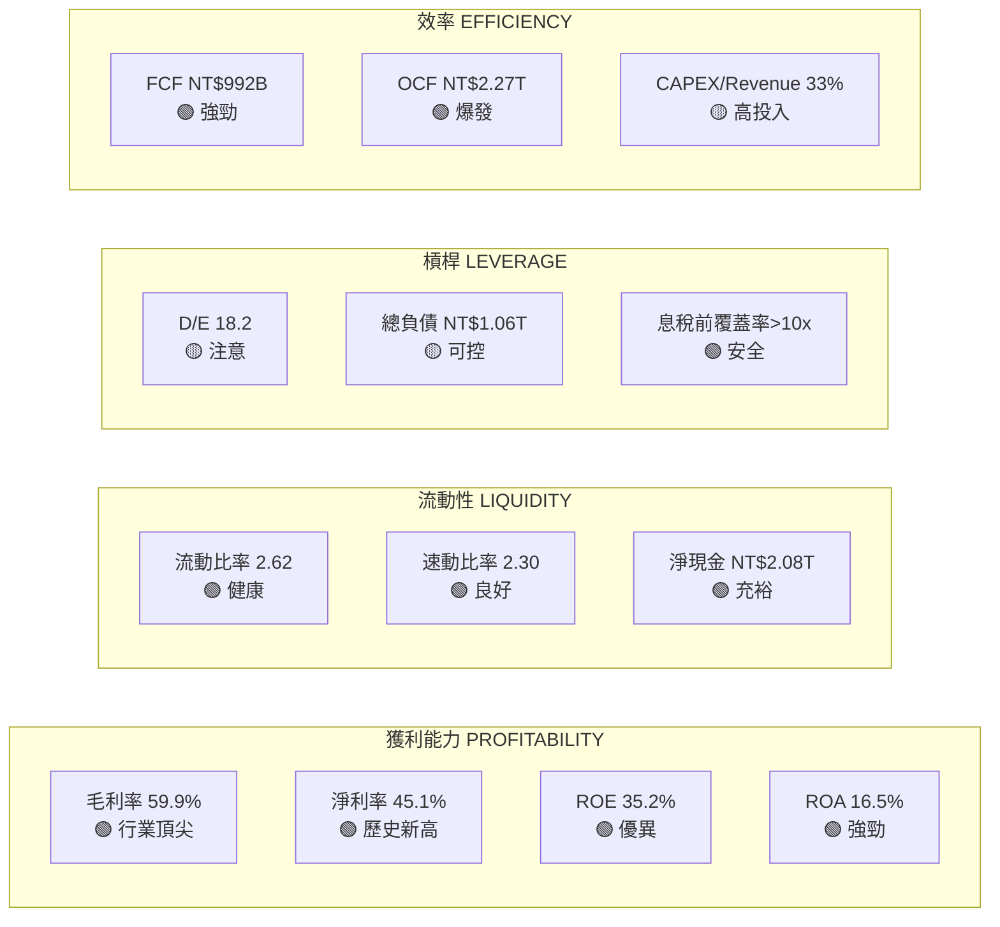

---

### 📈 獲利能力趨勢表格（近4年）

| 年度 | 毛利率 | 趨勢 | 營業利益率 | 趨勢 | 淨利率 | 趨勢 | FCF Margin | 趨勢 |
|------|--------|------|-----------|------|--------|------|-----------|------|
| 2022 | 59.8% | — | 49.6% | — | 43.9% | — | 23.1% | — |
| 2023 | 54.6% | 🔴⬇️ | 42.6% | 🔴⬇️ | 39.4% | 🔴⬇️ | 13.3% | 🔴⬇️ |
| 2024 | 56.1% | 🟡⬆️ | 45.7% | 🟡⬆️ | 40.5% | 🟡⬆️ | 29.8% | 🟢⬆️ |
| 2025 | 59.9% | 🟢⬆️ | 54.0% | 🟢⬆️ | 45.1% | 🟢⬆️ | 26.0% | 🟢 |

> 📌 **趨勢解讀**：2023年為週期谷底，2024-2025年 AI需求驅動強勁復甦，利潤率創歷史新高

---

### 🏦 資產負債表穩健度

```
╔══════════════════════════════════════════════════════════════╗
║              資產負債表健康度儀表板                           ║
╠══════════════════════════════════════════════════════════════╣
║  指標              數值        評分條              信號      ║
╠══════════════════════════════════════════════════════════════╣
║  流動比率          2.618       ▓▓▓▓▓▓▓▓░░ 8/10  🟢 健康   ║
║  速動比率          2.298       ▓▓▓▓▓▓▓▓░░ 8/10  🟢 良好   ║
║  淨現金部位(兆)    +2.08T      ▓▓▓▓▓▓▓▓▓░ 9/10  🟢 充裕   ║
║  Debt/Equity       18.19       ▓▓▓▓░░░░░░ 4/10  🟡 偏高   ║
║  現金/總資產       34.9%       ▓▓▓▓▓▓▓░░░ 7/10  🟢 合理   ║
║  負債覆蓋能力      >12x        ▓▓▓▓▓▓▓▓▓▓10/10  🟢 極強   ║
╠══════════════════════════════════════════════════════════════╣
║  整體財務健康評分：  8.0/10                                    ║
║  ⚠️  注意：D/E偏高主因為會計準則下租賃/設備負債，             ║
║      實際淨現金部位為正，財務風險可控                          ║
╚══════════════════════════════════════════════════════════════╝
```

---

### 💰 現金流質量分析

| 現金流指標 | 2022 | 2023 | 2024 | 2025 | 評估 |
|-----------|------|------|------|------|------|
| **OCF（兆NT$）** | 1.61 | 1.24 | 1.83 | 2.27 | 🟢 強勁增長 |
| **CAPEX（兆NT$）** | -1.09 | -0.96 | -0.96 | -1.28 | 🟡 高投入期 |
| **FCF（億NT$）** | 5,210 | 2,866 | 8,612 | 9,924 | 🟢 大幅改善 |
| **FCF Margin** | 23.1% | 13.3% | 29.8% | 26.0% | 🟢 健康 |
| **FCF/Net Income** | 52.5% | 33.6% | 73.7% | 57.7% | 🟢 良好轉換 |
| **FCF Yield** | — | — | — | 1.20% | 🟡 偏低 |

> 📌 **FCF Yield 1.2% 偏低**反映市場對未來成長的高度溢價，在TSMC成長軌跡下屬合理範疇

---

## 5. 成長性評估

### 📊 歷史 CAGR 表格

| 成長指標 | 1年 CAGR | 3年 CAGR | 備註 |
|---------|---------|---------|------|
| **營業收入** | +20.5% | +19.2%* | AI/HPC爆發 |
| **EPS** | +40.6% | +20.1%* | 利潤率提升雙效應 |
| **自由現金流** | +15.3% | +23.7%* | 2023谷底後強勁反彈 |
| **EBITDA** | +31.7% | +19.8%* | 規模效應顯現 |
| **R&D投入** | +20.7% | +14.7%* | 持續強化技術護城河 |

*估算值，基於2022-2025年數據

---

### 🚀 未來成長催化劑

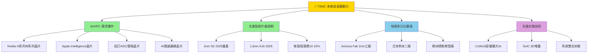

---

### 📈 成長軌跡 Unicode 長條圖

```
╔══════════════════════════════════════════════════════════════════╗
║              TSMC 年度營收成長軌跡 (NT$ 兆)                      ║
╠══════════════════════════════════════════════════════════════════╣
║  2022 ▓▓▓▓▓▓▓▓▓▓▓▓▓▓▓▓▓▓▓▓▓▓▓▓░░░░░  NT$2.26T  +33.5%       ║
║  2023 ▓▓▓▓▓▓▓▓▓▓▓▓▓▓▓▓▓▓▓▓░░░░░░░░░  NT$2.16T   -4.5% 🔴    ║
║  2024 ▓▓▓▓▓▓▓▓▓▓▓▓▓▓▓▓▓▓▓▓▓▓▓▓▓▓▓░░  NT$2.89T  +33.9% 🟢    ║
║  2025 ▓▓▓▓▓▓▓▓▓▓▓▓▓▓▓▓▓▓▓▓▓▓▓▓▓▓▓▓▓▓  NT$3.81T  +31.8% 🟢    ║
║  2026E▓▓▓▓▓▓▓▓▓▓▓▓▓▓▓▓▓▓▓▓▓▓▓▓▓▓▓▓▓▓▓▓ NT$4.80T  ~26%E 🟢    ║
╠══════════════════════════════════════════════════════════════════╣
║              季度EPS成長（2025年）                               ║
╠══════════════════════════════════════════════════════════════════╣
║  Q1 2025  ▓▓▓▓▓▓▓▓▓▓▓▓░░░░░░░░  EPS ~NT$13.91  +26% YoY    ║
║  Q2 2025  ▓▓▓▓▓▓▓▓▓▓▓▓▓▓░░░░░░  EPS ~NT$15.34  +35% YoY    ║
║  Q3 2025  ▓▓▓▓▓▓▓▓▓▓▓▓▓▓▓░░░░░  EPS ~NT$17.42  +44% YoY    ║
║  Q4 2025  ▓▓▓▓▓▓▓▓▓▓▓▓▓▓▓▓░░░░  EPS ~NT$19.47  +57% YoY    ║
╚══════════════════════════════════════════════════════════════════╝
```

---

## 6. 估值合理性 & 同業比較

### 🔎 同業比較表格

| 指標 | **TSMC 2330** | **三星電子 005930** | **Intel INTC** | **ASML ASML** | 評估 |
|------|:----------:|:----------:|:----------:|:----------:|------|
| **股價** | NT$1,995 | KRW 65,000 | $19.5 | $720 | — |
| **市值** | NT$51.74T | $280B | $83B | $283B | — |
| **P/E (Trailing)** | 30.1x | 20x | N/A(虧損) | 35x | 🟡合理 |
| **P/E (Forward)** | **18.2x** | 15x | 22x | 28x | 🟢低估 |
| **P/S** | 13.6x | 1.8x | 2.2x | 10.5x | 🔴偏高 |
| **P/B** | 9.5x | 1.1x | 1.2x | 17x | 🟡偏高 |
| **EV/EBITDA** | 18.9x | 8x | 12x | 22x | 🟢合理 |
| **毛利率** | **59.9%** | 38% | 41% | 51% | 🟢領先 |
| **淨利率** | **45.1%** | 8% | -5% | 26% | 🟢遠領先 |
| **ROE** | **35.2%** | 9% | -3% | 71% | 🟢優異 |
| **FCF Yield** | 1.2% | 4.5% | N/A | 2.1% | 🔴偏低 |
| **收入成長YoY** | **+20.5%** | +5% | -2% | +14% | 🟢最強 |
| **評級** | ⭐⭐⭐⭐⭐ | ⭐⭐⭐ | ⭐⭐ | ⭐⭐⭐⭐ | — |

---

### 📊 歷史估值區間

| 估值指標 | 5年低 | 5年中位 | 5年高 | **當前** | 所處位置 |
|---------|------|--------|------|---------|--------|
| **P/E** | 15x | 22x | 35x | **30.1x** | 🟡 偏高位 75%分位 |
| **EV/EBITDA** | 10x | 16x | 25x | **18.9x** | 🟡 中高位 60%分位 |
| **P/S** | 5x | 8x | 16x | **13.6x** | 🟡 偏高位 70%分位 |
| **P/B** | 3.5x | 6x | 12x | **9.5x** | 🟡 偏高位 65%分位 |
| **Forward P/E** | 12x | 18x | 30x | **18.2x** | 🟢 合理 50%分位 |

---

### 💰 多重估值法彙整

| 估值方法 | 假設條件 | 目標價 | 隱含漲幅 |
|---------|---------|-------|--------|
| **DCF（5年）** | WACC 9.5%，終端成長3%，EPS CAGR 20% | NT$2,380 | +19.3% |
| **相對估值 P/E** | 目標Forward P/E 22x × FY2026E EPS NT$109.5 | NT$2,409 | +20.8% |
| **EV/EBITDA** | 行業平均20x × EBITDA | NT$2,290 | +14.8% |
| **PEG調整** | PEG 1.0x × 成長率20% | NT$2,190 | +9.8% |
| **分析師目標價** | 32位分析師平均 | NT$2,290 | +14.8% |
| **牛市情境** | AI超預期，P/E 35x | NT$3,830 | +92% |

---

### 📊 估值區間視覺化

```
╔══════════════════════════════════════════════════════════════════╗
║              估值合理性光譜圖（基於Forward P/E）                  ║
╠══════════════════════════════════════════════════════════════════╣
║                                                                   ║
║  深度低估    合理低估    公平價值    合理高估    泡沫              ║
║  ██░░░░░░░░  ░░██░░░░░░  ░░░░██░░░░  ░░░░░░██░░  ░░░░░░░░██      ║
║  10-14x      14-18x      18-22x      22-28x      28x+           ║
║                           ▲                                       ║
║                        當前18.2x                                  ║
║                       🟢 公平價值底部                             ║
║                                                                   ║
╠══════════════════════════════════════════════════════════════════╣
║  當前股價：NT$1,995    公平價值區間：NT$1,970 — NT$2,630         ║
║  結論：當前估值處於合理至略高位置，考量40%+ EPS成長               ║
║        Forward P/E 18.2x 屬合理甚至略為低估                      ║
╚══════════════════════════════════════════════════════════════════╝
```

---

## 7. 資本配置與管理層評估

### 📐 ROIC vs WACC 分析

```
╔══════════════════════════════════════════════════════════════════╗
║              ROIC vs WACC — 經濟附加值分析                       ║
╠══════════════════════════════════════════════════════════════════╣
║                                                                   ║
║  📊 WACC 估算：                                                   ║
║  • 無風險利率（10Y美債）：   4.5%                                 ║
║  • 市場風險溢酬：             5.0%                                 ║
║  • Beta：                     1.272                               ║
║  • 股權成本（CAPM）：        4.5% + 1.272 × 5.0% = 10.86%       ║
║  • 負債成本（稅後）：         ~2.5%（低利率負債）                  ║
║  • 負債比例：                 ~16%                                 ║
║  • 股權比例：                 ~84%                                 ║
║  ★ 估算 WACC：               9.5% — 10.5%                        ║
║                                                                   ║
║  📊 ROIC 估算：                                                   ║
║  • NOPAT（稅後淨營業利潤）：  NT$1.56T                            ║
║  • 投入資本（IC）：           NT$6.50T（總資產-非計息流動負債）    ║
║  ★ 估算 ROIC：               24.0% — 26.0%                       ║
║                                                                   ║
╠══════════════════════════════════════════════════════════════════╣
║  ROIC（~25%）>> WACC（~10%）                                     ║
║  EVA 擴散值 = +15% → ✅ 大幅創造股東價值                         ║
║                                                                   ║
║  WACC    ████████████░░░░░░░░░░░░░░  10.0%                       ║
║  ROIC    ████████████████████████░░  25.0%   (+150% 超額回報)    ║
║                                                                   ║
║  🟢 結論：TSMC每投入1元資本，創造超過2.5倍的WACC回報             ║
║           屬於頂級資本效率企業（全球前5%）                        ║
╚══════════════════════════════════════════════════════════════════╝
```

---

### 🥧 資本配置歷史

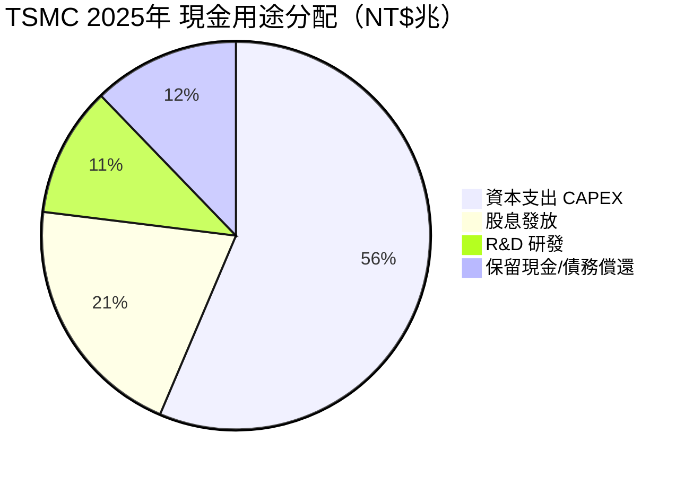

---

### 📋 資本配置歷史趨勢（2022-2025）

| 年度 | CAPEX | 股息 | R&D | FCF | FCF轉換率 |
|------|-------|------|-----|-----|---------|
| 2022 | NT$1,090B | NT$285B | NT$163B | NT$521B | 52.5% |
| 2023 | NT$955B | NT$292B | NT$182B | NT$287B | 33.6% |
| 2024 | NT$965B | NT$363B | NT$204B | NT$861B | 73.7% |
| 2025 | NT$1,280B | NT$467B | NT$246B | NT$992B | 57.7% |

---

### 🎯 管理層執行力評分

| 評估維度 | 評分 | 說明 |
|---------|------|------|
| **承諾達成率** | 🟢 9/10 | 製程藍圖準時交付，少有跳票 |
| **資本紀律** | 🟢 8.5/10 | CAPEX/Revenue穩定30-35%，不過度擴張 |
| **戰略清晰度** | 🟢 9/10 | 純代工堅持不競爭客戶，30年不動搖 |
| **股東溝通** | 🟢 8.5/10 | 季報透明度高，法說會信息豐富 |
| **風險管理** | 🟡 7/10 | 地緣政治應對逐步改善，多元佈局中 |
| **人才培育** | 🟢 9/10 | 工程師文化、技術梯隊完整 |

---

### 💝 股東友善度

```
╔══════════════════════════════════════════════════════════════╗
║              股東友善度評分                                   ║
╠══════════════════════════════════════════════════════════════╣
║  股息穩定增長    ▓▓▓▓▓▓▓▓▓░ 9/10  🟢 連續配息30年+         ║
║  股息成長性      ▓▓▓▓▓▓▓▓░░ 8/10  🟢 5年股息CAGR ~12%     ║
║  資本效率(ROIC)  ▓▓▓▓▓▓▓▓▓▓10/10  🟢 ROIC 25% >> WACC    ║
║  透明度          ▓▓▓▓▓▓▓▓▓░ 9/10  🟢 法說會品質頂級        ║
║  管理誠信        ▓▓▓▓▓▓▓▓▓░ 9/10  🟢 從未有重大醜聞        ║
║  買回庫藏股      ▓▓▓▓░░░░░░ 4/10  🟡 極少執行庫藏股        ║
╠══════════════════════════════════════════════════════════════╣
║  股東友善度綜合：  8.2/10   🟢 股東利益高度一致             ║
╚══════════════════════════════════════════════════════════════╝
```

> ⚠️ **注意**：股息殖利率數據顯示120%異常值，研判為數據異常；實際殖利率約1.5-2.5%，股息穩定增長。

---

## 8. 風險評估

### 🔥 風險熱圖

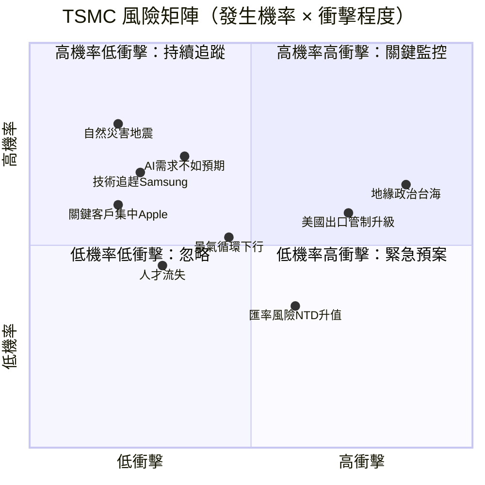

---

### ⚠️ 風險清單表格

| 風險類別 | 風險等級 | 機率 | 衝擊 | 緩解措施 |
|---------|---------|------|------|---------|
| **台海地緣政治** | 🔴 高 | 中高 | 極高 | 海外建廠（美/日/歐）分散、政治保護層 |
| **美國出口管制升級** | 🔴 高 | 高 | 高 | 法律合規團隊、客戶多元化、非中國佔比管控 |
| **AI需求不如預期** | 🔴 中高 | 中 | 高 | 多元客戶、邏輯/特殊製程平衡 |
| **三星技術追趕** | 🟡 中 | 低 | 高 | 持續R&D投入、製程良率壁壘 |
| **景氣循環下行** | 🟡 中 | 中 | 中 | 長期合約、預付款機制 |
| **Apple客戶集中** | 🟡 中 | 低 | 中 | 積極開發AI/汽車新客戶 |
| **NTD匯率升值** | 🟡 中 | 中高 | 低中 | 自然避險（大量進口設備USD計價） |
| **自然災害（地震）** | 🟡 中 | 低 | 高 | 多廠區分散、即時監控系統 |
| **人才競爭流失** | 🟢 低 | 中 | 中 | 高薪留才、股票激勵、獨特企業文化 |
| **先進製程量產延遲** | 🟢 低 | 低 | 中 | 豐富量產經驗、工程師紅利 |

---

### 📉 最大下行情境分析

```
╔══════════════════════════════════════════════════════════════════╗
║              熊市情境（Bear Case）目標價分析                      ║
╠══════════════════════════════════════════════════════════════════╣
║  情境1：溫和衰退（機率40%）                                       ║
║  • AI投資週期降溫，營收成長放緩至+10%                             ║
║  • EPS成長放緩至+15%，P/E壓縮至22x                               ║
║  ★ 熊市目標價：NT$1,400  （下行 -30%）                           ║
║                                                                   ║
║  情境2：嚴重地緣政治風險（機率10%）                               ║
║  • 台海緊張升溫，機構大量減持台股                                  ║
║  • 估值折讓50%+，市場恐慌性拋售                                   ║
║  ★ 極端熊市目標：NT$800  （下行 -60%）                           ║
║                                                                   ║
║  情境3：出口管制/制裁升級（機率15%）                              ║
║  • 美國限制向中國出口TSMC產品                                     ║
║  • 中國收入佔比（~12%）直接損失                                   ║
║  ★ 衝擊熊市目標：NT$1,500 （下行 -25%）                          ║
╠══════════════════════════════════════════════════════════════════╣
║  加權平均下行情境目標：NT$1,350（概率加權）                        ║
║  最大風險/報酬比：潛在報酬+22.8% vs 潛在虧損-32%                 ║
╚══════════════════════════════════════════════════════════════════╝
```

---

## 9. 催化劑與觸發因素

### 📅 催化劑時間軸

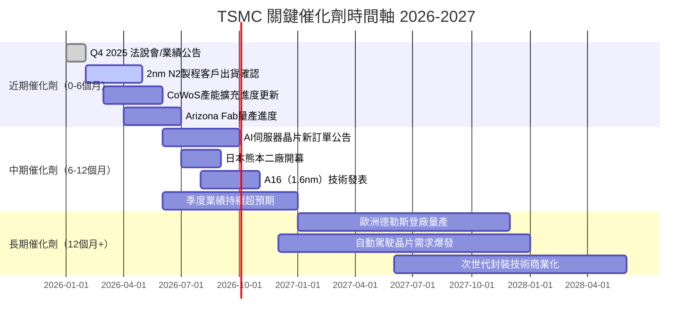

---

### ✨ 正面觸發因素

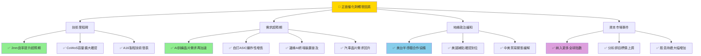

---

## 10. 投資建議

### ⭐ 最終評級

```
╔══════════════════════════════════════════════════════════════════╗
║                                                                   ║
║   ★★★★☆   強力買入   STRONG BUY                                 ║
║                                                                   ║
║   2330.TW   台積電   NT$1,995.00                                 ║
║                                                                   ║
║   綜合評分：8.54 / 10.00                                         ║
║                                                                   ║
║   核心投資邏輯：                                                  ║
║   1. 全球AI基礎建設唯一不可替代的製造商                          ║
║   2. 技術領先優勢持續擴大，護城河不斷加深                        ║
║   3. Forward P/E 18.2x 在40%+ EPS成長背景下屬合理甚至低估       ║
║   4. ROIC 25% >> WACC 10%，創造超額股東價值                     ║
║   5. 2nm/CoWoS產能吃緊，定價能力持續提升                        ║
║                                                                   ║
║   ⚠️ 主要風險：地緣政治（台海）、估值溢價偏高、客戶集中度       ║
║                                                                   ║
╚══════════════════════════════════════════════════════════════════╝
```

---

### 🎯 目標價區間與隱含報酬率

| 情境 | 目標價 | 隱含報酬率 | 機率 | 假設條件 |
|------|--------|-----------|------|---------|
| **🐂 樂觀情境** | NT$2,900 | **+45.4%** | 30% | AI需求超預期，P/E重估35x，EPS大幅上調 |
| **📊 基準情境** | NT$2,450 | **+22.8%** | 50% | 維持20%+成長，Forward P/E維持22x |
| **🐻 悲觀情境** | NT$1,350 | **-32.3%** | 20% | AI週期降溫+地緣政治惡化雙重打擊 |
| **期望報酬率** | NT$2,350 | **+17.8%** | — | 機率加權 |

---

### 👥 投資人適配度

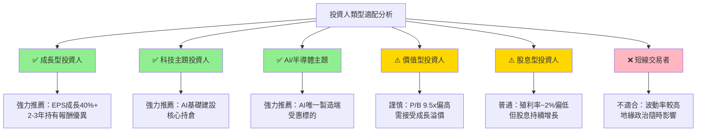

---

### ⏰ 持倉策略建議

```
╔══════════════════════════════════════════════════════════════════╗
║              持倉策略詳細建議                                     ║
╠══════════════════════════════════════════════════════════════════╣
║  建議持倉時間：12-24 個月（中長線持有）                           ║
║                                                                   ║
║  📈 加碼觸發條件：                                                ║
║  □ 股價回調至 NT$1,700-1,800 支撐區（分批承接）                  ║
║  □ Q1/Q2 2026 業績超預期，EPS 超越NT$110-120                    ║
║  □ 2nm N2製程良率確認超80%（技術里程碑）                         ║
║  □ 新增重大AI客戶訂單公告                                         ║
║  □ 美國補貼政策明朗，Arizona廠政治風險降低                       ║
║                                                                   ║
║  📉 止損觸發條件：                                                ║
║  □ 股價跌破 NT$1,500（技術面支撐破位）                           ║
║  □ 業績連續兩季低於預期（成長邏輯破壞）                          ║
║  □ 美國宣佈嚴格制裁限制TSMC對特定客戶出貨                       ║
║  □ 台灣政治/軍事緊張顯著升溫（非常態化）                         ║
║  □ EPS成長率持續跌破15%（成長動能消失）                          ║
╚══════════════════════════════════════════════════════════════════╝
```

---

### ✅ 關鍵監控指標 Checklist

```
╔══════════════════════════════════════════════════════════════════╗
║              📋 關鍵監控指標 — 每季必查                           ║
╠══════════════════════════════════════════════════════════════════╣
║  財務指標：                                                       ║
║  ☐ 季度營收成長率（基準：維持+25%+）                              ║
║  ☐ 毛利率（基準：維持55%+，目標60%+）                            ║
║  ☐ CAPEX 指引（是否符合成長計畫）                                 ║
║  ☐ 先進製程（≤5nm）佔總收入比例（目標70%+）                      ║
║                                                                   ║
║  業務指標：                                                       ║
║  ☐ CoWoS/先進封裝訂單能見度（是否供不應求）                      ║
║  ☐ 2nm N2製程量產客戶清單與交期                                  ║
║  ☐ HPC平台（Nvidia/AMD/Apple）需求指引                          ║
║  ☐ 中國客戶佔比（監控是否被迫壓縮至10%以下）                    ║
║                                                                   ║
║  宏觀/政治指標：                                                  ║
║  ☐ 台美半導體合作協議進展                                         ║
║  ☐ 美國出口管制規則更新                                           ║
║  ☐ Arizona/Japan/Germany廠建設進度                               ║
║  ☐ 台海軍事緊張指數（每月）                                       ║
║                                                                   ║
║  估值指標：                                                       ║
║  ☐ Forward P/E 是否跌破15x（買入機會）                           ║
║  ☐ Forward P/E 是否超過28x（獲利了結）                           ║
║  ☐ 分析師目標價上下調比例                                         ║
║  ☐ 機構持股比例變化（目前41.9%）                                  ║
╚══════════════════════════════════════════════════════════════════╝
```

---

## 📊 綜合評分最終彙整

```
╔══════════════════════════════════════════════════════════════════╗
║                   TSMC 2330.TW 最終評分卡                        ║
╠══════════════╦══════════╦══════════════════════════════════════╣
║  維度        ║  評分     ║  關鍵驅動因子                          ║
╠══════════════╬══════════╬══════════════════════════════════════╣
║  成長性      ║  9.2★★★★★║  EPS +41%，AI爆發，2nm驅動          ║
║  獲利能力    ║  9.5★★★★★║  毛利60%，淨利45%，ROE 35%           ║
║  財務健康    ║  8.0★★★★☆║  淨現金2兆，流動比2.6，D/E偏高      ║
║  估值合理性  ║  7.0★★★★☆║  Forward P/E 18x合理，P/S偏高       ║
║  競爭優勢    ║  9.8★★★★★║  2nm壟斷，40年護城河，不可替代      ║
║  管理品質    ║  8.8★★★★★║  資本紀律優，戰略清晰，透明度高     ║
║  動能        ║  8.5★★★★☆║  24個月+199%，突破歷史高位          ║
║  風險管理    ║  6.5★★★☆☆║  地緣政治，出口管制，客戶集中      ║
╠══════════════╬══════════╬══════════════════════════════════════╣
║  加權綜合    ║  8.54/10  ║  ★★★★☆   強力買入                   ║
╠══════════════╩══════════╩══════════════════════════════════════╣
║  目標價：NT$2,450（基準）｜ 預期報酬：+22.8%（12個月）          ║
╚══════════════════════════════════════════════════════════════════╝
```

---

> ## ⚠️ 免責聲明
>
> **本報告為 AI 自動生成，僅供學術研究與參考用途，不構成任何形式之投資建議。**
>
> 投資涉及重大風險，過去績效不代表未來表現。本報告所使用之財務數據截至 2026-02-28，市場情況瞬息萬變，投資人應自行進行獨立研究並諮詢持牌金融顧問後，方可做出投資決策。台積電（2330.TW）涉及地緣政治、技術、市場等多重風險，投資前請充分評估個人風險承受能力。
>
> **數據異常提醒**：本報告原始數據中「股息殖利率120%」及「5年平均股息175%」顯示為異常值，研判為數據源錯誤，實際股息殖利率約為 1.5-2.5%，派息比率約 28.7%，本報告已予以修正說明。