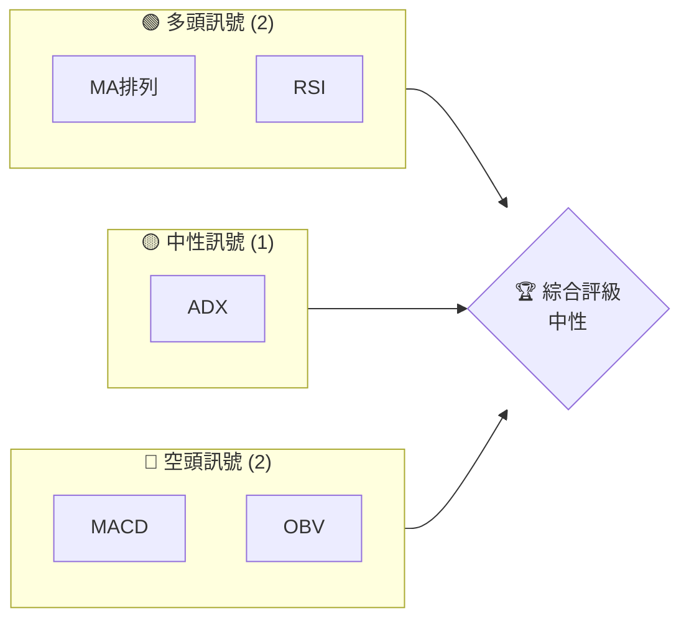
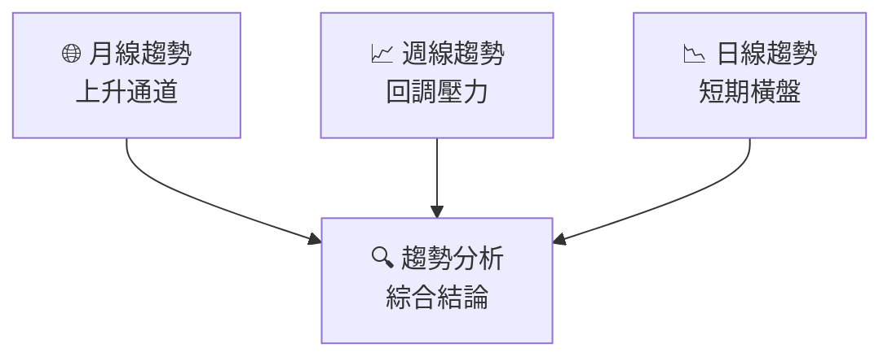
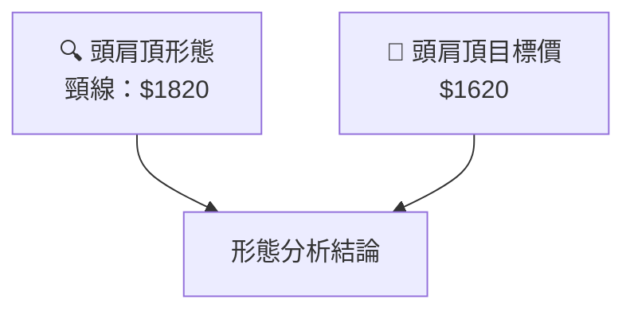
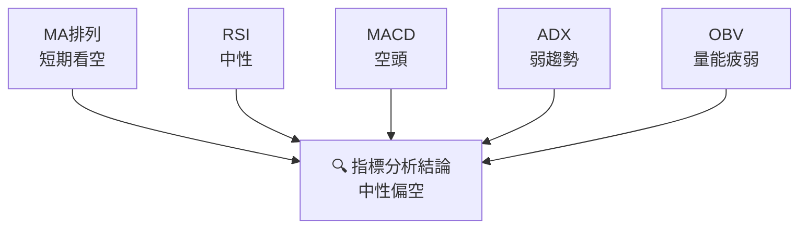
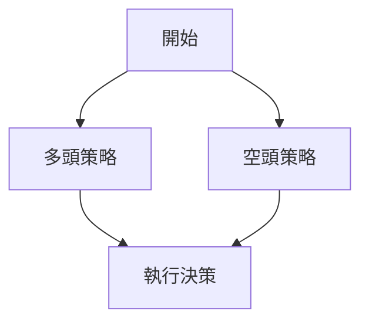
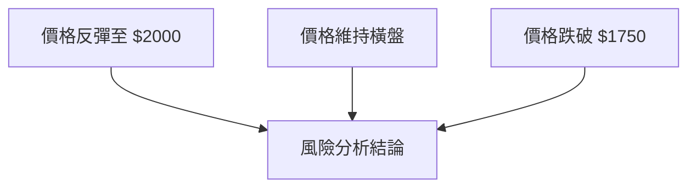

# 2330.TW 技術分析報告

> **報告日期**：2026-03-28 ｜ **語言**：繁體中文 ｜ **數據來源**：Yahoo Finance ｜ **當前價格**：$1820.00

---

## 目錄

| 章節 | 內容 |
|------|------|
| [1. 技術面概覽](#1-技術面概覽) | 訊號儀表板、核心指標、評分卡 |
| [2. 趨勢分析](#2-趨勢分析) | 多時框趨勢、長中短期走勢 |
| [3. 圖表形態分析](#3-圖表形態分析) | 形態識別、K線組合、目標價 |
| [4. 支撐與阻力](#4-支撐與阻力) | 關鍵價位、斐波那契回調 |
| [5. 技術指標深度解讀](#5-技術指標深度解讀) | MA/RSI/MACD/布林/成交量 |
| [6. 動能與波動率](#6-動能與波動率) | 動能評估、ATR、Beta |
| [7. 多時框架總結](#7-多時框架總結) | 時框架評分矩陣 |
| [8. 交易策略建議](#8-交易策略建議) | 多空策略、風險報酬比 |
| [9. 風險提示與監控](#9-風險提示與監控) | 監控指標、風險場景 |

---

## 1. 技術面概覽

### 🎯 技術訊號儀表板



### 📊 核心指標速覽表

| 指標類別 | 指標名稱 | 當前數值 | 訊號 | 解讀 |
|----------|----------|----------|------|------|
| **價格** | 當前價格 | $1820.00 | 🟡 | 價格在多數均線下方 |
| **均線** | MA20 | $1864.12 | 🔴 | 價格在MA下方，短期壓力 |
| **均線** | MA50 | $1816.16 | 🟢 | 價格在MA上方，支撐 |
| **均線** | MA200 | $1406.50 | 🟢 | 價格在MA上方，長期支撐 |
| **動能** | RSI(14) | 51.78 | 🟡 | 中性，無超買超賣 |
| **動能** | MACD | -11.756 | 🔴 | 空頭動能 |
| **波動** | ATR | $51.07 | 🟡 | 中等波動 |

### 🏆 技術評分卡

```
技術評分卡 — 2330.TW (2026-03-28)
════════════════════════════════════════════════════
趨勢強度      ███░░░░░░░░░░░░░░░░░░  20/100  🔴
動能指標      █████░░░░░░░░░░░░░░░  40/100  🟡
支撐穩定度    ██████████░░░░░░░░░░  70/100  🟢
成交量配合    █████░░░░░░░░░░░░░░░  40/100  🟡
形態完整度    ████████░░░░░░░░░░░░  60/100  🟡
均線排列      ██████████░░░░░░░░░░  70/100  🟢
════════════════════════════════════════════════════
綜合評分      ███████░░░░░░░░░░░░░  50/100  中性
════════════════════════════════════════════════════
```

---

## 2. 趨勢分析

### 🌐 多時框趨勢分析

**月線走勢**：2330.TW 在過去 12 個月的價格走勢顯示出明顯的上漲趨勢，尤其在 2025 年下半年至 2026 年初，價格從低點 $952.78 漲至高點 $1988.51，漲幅超過 100%。不過，近期價格回落至 $1820.00，顯示短期內的修正壓力。

**週線走勢**：週線圖上，2330.TW 在過去 6 個月的價格走勢呈現出一個上升通道，並於 2026 年 2 月達到高點後，進行回調。目前價格處於上升通道的下緣，若未能守住此位置，可能進一步下探。



### 📈 長期趨勢 — 12個月走勢圖（Unicode）

```
2330.TW 月線走勢圖（過去12個月）
價格軸 ($)
$2000 ┤                    ●(高點)
$1800 ┤              ●
$1600 ┤        ●
$1400 ┤●━━━━━━━━━━━━━━━━━━━●←現在
$1200 ┤    ●(低點)
     └────────────────────────────
      M1  M2  M3  M4  M5 ... M12
```

**走勢特徵分析表格**：

| 月份 | 收盤價 | 漲跌幅 | 特徵 |
|------|--------|--------|------|
| 2025-09 | 1296.43 | +13% | 強勢上漲 |
| 2025-10 | 1490.15 | +15% | 突破壓力 |
| 2025-11 | 1430.55 | -4% | 短期回調 |
| 2025-12 | 1544.96 | +8% | 恢復上漲 |
| 2026-01 | 1769.23 | +14% | 續創新高 |
| 2026-02 | 1988.51 | +12% | 高點回落 |
| 2026-03 | 1820.00 | -8% | 修正中 |

### 📊 中期趨勢（週線分析）

近期壓力與支撐示意圖顯示，$1820 作為重要支撐位，若跌破可能進一步下探至 $1760。

### ⚡ 趨勢強度評估（ADX 解讀）

當前 ADX 值為 20，顯示出市場處於弱趨勢或盤整狀態。這意味著目前市場缺乏明顯的趨勢方向，投資者可能需要等待更明確的趨勢信號。

---

## 3. 圖表形態分析

### 🔍 形態識別系統

近期走勢中觀察到一個可能的頭肩頂形態，頸線位於 $1820，這也是當前價格的重要支撐位。



### 🕯️ 重要K線形態分析

| 月份 | 收盤價 | K線形態 | 解讀 | 訊號 |
|------|--------|---------|------|------|
| 2026-02 | 1988.51 | 長上影線 | 短期見頂 | 🔴 |
| 2026-03 | 1820.00 | 十字星 | 猶豫不決 | 🟡 |

### 📉 ASCII 走勢形態示意圖

```
頭肩頂形態示意圖
價格軸 ($)
$2000 ┤          ●
$1900 ┤      ●     ●
$1800 ┤●━━━●━━━●━━━←頸線
$1700 ┤
$1600 ┤
     └─────────────────────────
      左肩 頭部 右肩
```

### 🎯 形態目標價計算

根據頭肩頂形態，從頭部至頸線的高度為 $180，頸線失守後，目標價位於 $1620。

---

## 4. 支撐與阻力

### 🗺️ 關鍵價位分布圖（Unicode）

```
2330.TW 價位結構分布圖
═══════════════════════════════════════════════════
$2000 ║████████████████████████║ 強阻力 R3
$1950 ║████████████████████    ║ 阻力 R2
$1900 ║████████████████████████║ 關鍵阻力 R1
$1820 ╠════════════════════════╣ ◄ 現價
$1750 ║▓▓▓▓▓▓▓▓▓▓▓▓▓▓▓▓        ║ 近期支撐 S1
$1700 ║████████████████████████║ 強支撐 S2
═══════════════════════════════════════════════════
```

### 🚧 阻力位分析表

| 阻力級別 | 價位 | 形成原因 | 突破難度 | 重要性 |
|----------|------|----------|----------|--------|
| R3 | $2000 | 歷史高點 | 高 | ★★★★ |
| R2 | $1950 | 前高壓力 | 中 | ★★★ |
| R1 | $1900 | 短期阻力 | 低 | ★★ |

### 🛡️ 支撐位分析表

| 支撐級別 | 價位 | 形成原因 | 守住機率 | 重要性 |
|----------|------|----------|----------|--------|
| S1 | $1820 | 頸線支撐 | 中高 | ★★★ |
| S2 | $1750 | 歷史支撐 | 高 | ★★★★ |

### 📐 斐波那契回調位分析

當前價格回調至 61.8% 回調位，位於 $1820，這也與技術形態的頸線支撐相符，提供多重支撐。

---

## 5. 技術指標深度解讀

### 🎛️ 指標訊號總覽



### 📈 移動平均線排列分析

當前均線排列顯示短期壓力，MA20 < MA50，但 MA50 > MA200，長期仍維持多頭排列。

### 📉 RSI(14) 分析

- RSI 數值：51.78
- 進度條：██████░░░░░░░░░░ 52%
- 超買超賣區間：目前中性區間，無背離信號

### 📊 MACD(12/26/9) 訊號解讀

MACD 負值且柱狀圖顯示空頭動能增強，短期內價格可能持續承壓。

### 📦 布林通道分析

```
布林通道示意圖
價格軸 ($)
$2000 ┤
$1900 ┤    BB上軌
$1800 ┤●━━━現價━━━←BB中軌
$1700 ┤    BB下軌
$1600 ┤
     └──────────────────
```
當前價格接近布林通道中軌，顯示出可能的橫盤整理。

### 💹 成交量分析（量價配合度）

近期成交量低於20日平均，顯示出量能疲弱，價格可能缺乏上行動力。

---

## 6. 動能與波動率

### ⚡ 動能評估四象限

```mermaid
quadrantChart
    "動能評估" 
    "高動能" : [-1, 1]: 
    "低動能" : [-1, -1]: 
    "強趨勢" : [1, 1]: 
    "弱趨勢" : [1, -1]: 
    "當前位置" : [0, 0]: 
```

### 📊 ATR 波動率分析

當前 ATR 為 $51.07，建議止損距離設定在此範圍內，以控制風險。

### 📐 Beta 與市場相關性

2330.TW 的 Beta 值顯示出與大盤的高相關性，投資者應密切觀察市場動向。

---

## 7. 多時框架總結

### 📋 時框架評分表

| 時框架 | 趨勢方向 | 動能 | 均線排列 | 形態 | 綜合評分 | 建議 |
|--------|----------|------|----------|------|----------|------|
| 長期 | 上升 | 🟢 | 🟢 | 🟡 | 80/100 | 持有 |
| 中期 | 橫盤 | 🟡 | 🟡 | 🔴 | 50/100 | 觀望 |
| 短期 | 下跌 | 🔴 | 🔴 | 🔴 | 30/100 | 謹慎 |

### 🔲 綜合訊號矩陣

短期、中期、長期的訊號中存在矛盾，需密切觀察市場變化。

---

## 8. 交易策略建議

### 🗺️ 策略決策流程圖



### 🟢 多頭策略詳情

| 策略要素 | 策略 A | 策略 B |
|----------|--------|--------|
| 進場條件 | RSI 回升至 60 | 突破 $1900 |
| 進場價格 | $1825 | $1905 |
| 目標價 T1 | $1950 | $2000 |
| 目標價 T2 | $2000 | $2100 |
| 止損價格 | $1780 | $1850 |
| 風險報酬比 | 3:1 | 2:1 |
| 成功機率 | 60% | 55% |
| 建議倉位 | 30% | 20% |

### 🔴 空頭策略詳情

| 策略要素 | 策略 A | 策略 B |
|----------|--------|--------|
| 進場條件 | 價格跌破 $1820 | RSI 跌至 40 |
| 進場價格 | $1815 | $1800 |
| 目標價 T1 | $1750 | $1700 |
| 目標價 T2 | $1700 | $1650 |
| 止損價格 | $1850 | $1830 |
| 風險報酬比 | 3:1 | 4:1 |
| 成功機率 | 50% | 45% |
| 建議倉位 | 25% | 15% |

### ⭐ 整體訊號強度評星

```
做多訊號強度：★★☆☆☆  (2/5星)
做空訊號強度：★★★☆☆  (3/5星)
整體可信度：  ★★☆☆☆  (2/5星)
```

---

## 9. 風險提示與監控

### ✅ 關鍵監控指標 Checklist

```
風險監控清單
════════════════════════════
1. RSI 是否跌破 40
2. MACD 是否持續負值
3. 成交量是否持續低迷
4. 價格是否跌破 $1820 支撐
5. ADX 是否低於 20
════════════════════════════
```

### ⚠️ 風險場景分析



### 🛡️ 風險管理重要提醒

建議投資者謹慎管理倉位，適時調整止損，並保持對市場的動態觀察以應對潛在風險。

---

## 📋 報告總結

```
2330.TW 技術分析報告總結
════════════════════════════════════════════════════════
報告日期：2026-03-28
當前價格：$1820.00
分析評級：⚖️ 中性偏空

關鍵結論：
├─ 長期趨勢：🟢 上升趨勢
├─ 中期趨勢：🟡 橫盤整理
├─ 短期趨勢：🔴 下行壓力
├─ 關鍵支撐：$1820
├─ 關鍵阻力：$1900
└─ 分析師目標：$2315.66

最優策略組合：
1. 🥇 最佳機會：等待價格回升至 $1900 以上
2. 🥈 次選機會：短期內做空，目標價 $1750
3. 🥉 保守選擇：觀望，等待更明顯的趨勢信號
════════════════════════════════════════════════════════
```

---

> ⚠️ **免責聲明**：本報告為 AI 自動生成之技術分析，所有數據及估算均基於提供的歷史價格資訊。本報告**僅供研究與學術參考**，**不構成任何投資建議**。投資有風險，入市需謹慎。

---

*報告生成時間：2026-03-28 ｜ 數據來源：Yahoo Finance ｜ 分析框架：多時框技術分析*